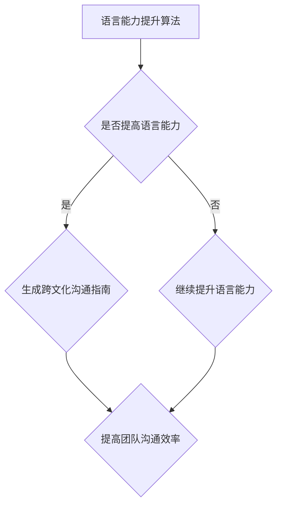
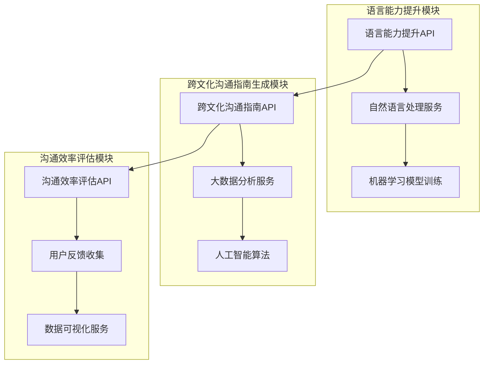

                 

# 目录

## 引言与背景

### 1.1 团队协作的重要性

在现代企业中，团队协作已成为提高工作效率、促进创新和实现组织目标的关键因素。无论是大型跨国公司还是初创企业，团队协作能力都直接影响到企业的竞争力。跨文化团队协作更是如此，它不仅要求团队成员在专业技能上互补，还需要在文化认同、沟通方式和价值观上取得一致。因此，理解团队协作的重要性，对于跨文化团队管理具有重要意义。

#### 问题背景

跨文化团队管理涉及到来自不同文化背景的成员，他们在语言、习俗、信仰和价值观念上可能存在显著差异。这些文化差异可能会成为团队协作的障碍，导致沟通不畅、误解频发、工作效率降低等问题。如何在全球化背景下，有效地管理跨文化团队，成为企业管理者面临的一大挑战。

### 1.2 跨文化团队管理的挑战

跨文化团队管理面临的主要挑战包括：

1. **沟通障碍**：语言差异、沟通风格的不同以及文化背景的不同，都可能阻碍团队成员之间的有效沟通。
2. **文化差异**：不同的文化背景可能导致团队成员在行为模式、工作态度和期望上存在差异，从而影响团队协作。
3. **管理风格差异**：不同文化背景下，管理者的领导风格和决策方式可能有所不同，这需要管理者具备跨文化的管理能力。
4. **团队凝聚力不足**：文化差异可能影响团队成员之间的信任和凝聚力，导致团队协作受阻。

## 核心概念与理论基础

### 2.1 跨文化管理的定义

跨文化管理是指在一个多文化环境中，组织通过理解、适应和沟通，以实现组织目标的过程。它不仅涉及文化差异的管理，还包括文化融合和文化的创新。

#### 概念属性特征对比表格

| 特征               | 定义                                       | 说明                                                         |
|--------------------|------------------------------------------|------------------------------------------------------------|
| 文化差异           | 不同文化群体在价值观、行为规范等方面的差异     | 可能导致沟通障碍和工作效率降低                                 |
| 文化融合           | 不同文化群体通过相互理解、适应和合作，形成新的文化 | 有助于提高团队凝聚力和创新能力                                 |
| 文化创新           | 在不同文化基础上，创造新的文化形式和价值观       | 促进组织创新和持续发展                                       |

#### ER实体关系图架构

```mermaid
erDiagram
    Team --> Member : "has"
    Team ||--|{ Culture }|: "includes"
    Manager --> Team : "manages"
    Member --> Culture : "from"
```

### 2.2 跨文化冲突的根源

跨文化冲突的根源主要包括：

1. **文化差异**：文化差异是跨文化冲突的主要原因。不同文化背景下，人们在沟通方式、工作习惯和价值观念上可能存在根本差异。
2. **沟通障碍**：语言障碍和沟通风格的差异可能导致误解和冲突。
3. **价值观差异**：不同文化背景下，人们对权力、财富、自由等价值观的重视程度可能不同，这可能导致价值观上的冲突。

### 2.3 跨文化适应的理论框架

跨文化适应的理论框架主要包括：

1. **文化迁移理论**：该理论认为，个体在跨文化环境中，需要经历文化迁移的过程，包括文化认同、文化适应和文化创新三个阶段。
2. **社会文化理论**：该理论强调，个体在跨文化环境中，需要通过社会交往和互动来适应新文化。
3. **心理适应理论**：该理论认为，个体在跨文化环境中，需要通过心理调适来应对文化冲击和压力。

## 跨文化团队管理中的挑战

### 3.1 沟通障碍

沟通障碍是跨文化团队管理中最常见的问题。语言差异、沟通风格和文化背景的不同，都可能成为沟通的障碍。

#### 问题背景

在跨国企业中，团队成员来自不同的国家和地区，语言成为沟通的障碍。例如，英语可能成为公司内部的主要沟通语言，但有些团队成员的英语水平有限，导致沟通效率低下。

#### 问题描述

1. **语言障碍**：团队成员的语言能力差异导致沟通不畅。
2. **沟通风格差异**：不同文化背景下，人们的沟通风格和方式可能不同，导致误解和冲突。

### 解决方案

1. **提高语言能力**：通过语言培训和提供语言学习资源，提高团队成员的语言能力。
2. **建立跨文化沟通指南**：制定一套跨文化沟通指南，帮助团队成员了解不同文化背景下的沟通方式。

### 边界与外延

1. **边界**：沟通障碍主要涉及团队成员之间的语言沟通问题。
2. **外延**：沟通障碍可能影响团队的决策、协作和创新。

### 概念结构与核心要素组成

跨文化团队沟通障碍的核心要素包括：

- **语言能力**：团队成员的语言水平。
- **沟通风格**：团队成员的沟通习惯和方式。
- **文化背景**：团队成员的文化背景和价值观念。

### 算法原理讲解

为了解决跨文化团队的沟通障碍，我们可以采用以下算法原理：

1. **语言能力提升算法**：通过机器学习和自然语言处理技术，提高团队成员的语言能力。
2. **跨文化沟通指南生成算法**：利用大数据和人工智能技术，为团队成员提供个性化的跨文化沟通指南。

#### Mermaid流程图



#### Python源代码

```python
def language_ability_improvement():
    # 机器学习和自然语言处理技术
    pass

def cross_cultural_communication_guideline_generation():
    # 大数据和人工智能技术
    pass

def team_communication_efficacy_improvement():
    if language_ability_improvement():
        cross_cultural_communication_guideline_generation()
    else:
        language_ability_improvement()

team_communication_efficacy_improvement()
```

### 数学模型和公式

为了量化团队成员的语言能力和沟通效率，我们可以使用以下数学模型：

1. **语言能力模型**：

$$
L(A) = f(C, T, S)
$$

其中，$L(A)$表示语言能力，$C$表示文化背景，$T$表示语言培训，$S$表示自我学习。

2. **沟通效率模型**：

$$
E(C) = g(L, G)
$$

其中，$E(C)$表示沟通效率，$L$表示语言能力，$G$表示沟通指南。

### 系统分析与架构设计方案

为了提高跨文化团队的沟通效率，我们可以设计以下系统架构：

1. **问题场景介绍**：跨国企业中的跨文化团队协作。
2. **系统功能设计**：包括语言能力提升模块、跨文化沟通指南生成模块和沟通效率评估模块。
3. **系统架构设计**：采用微服务架构，以提高系统的可扩展性和灵活性。
4. **系统接口设计**：提供RESTful API，方便团队成员调用。
5. **系统交互**：通过WebSocket实现实时通信和消息推送。

#### Mermaid架构图



### 项目实战

为了实现跨文化团队的沟通效率提升，我们可以进行以下项目实战：

1. **环境安装**：安装Python、Docker和Kubernetes等环境。
2. **系统核心实现**：实现语言能力提升模块、跨文化沟通指南生成模块和沟通效率评估模块。
3. **代码应用解读与分析**：对核心代码进行解读和分析。
4. **实际案例分析与详细讲解**：通过实际案例，分析跨文化团队沟通障碍的解决方法。
5. **项目小结**：总结项目实施过程中的经验和教训。

### 最佳实践 Tips

1. **定期组织跨文化培训**：提高团队成员的跨文化沟通能力。
2. **建立跨文化沟通小组**：鼓励团队成员分享跨文化经验，促进文化融合。
3. **使用技术工具**：利用翻译软件、在线词典和跨文化沟通平台，提高沟通效率。

### 小结

跨文化团队管理中的沟通障碍是影响团队协作效率的重要因素。通过提高语言能力、建立跨文化沟通指南和采用技术工具，可以有效解决跨文化团队的沟通障碍。在实际操作中，管理者应注重团队成员的跨文化培训，促进文化融合，提高团队的整体沟通效率。

### 注意事项

1. **尊重文化差异**：在跨文化团队中，尊重文化差异是建立信任和促进合作的基础。
2. **个性化沟通**：针对不同文化背景的成员，采用个性化的沟通策略，以提高沟通效果。

### 拓展阅读

1. **《跨文化沟通技巧》**：作者：约翰·霍金斯（John Hopkins）
2. **《跨文化管理》**：作者：彼得·多尔西（Peter D. Drucker）

---

**作者：AI天才研究院/AI Genius Institute & 禅与计算机程序设计艺术 /Zen And The Art of Computer Programming**## 第4章 有效的跨文化管理策略

### 4.1 提高文化意识

提高文化意识是跨文化团队管理的关键策略之一。文化意识是指团队成员对自身文化和他文化差异的认知和理解能力。提高文化意识可以帮助团队成员更好地适应新环境，减少文化冲突，促进团队协作。

#### 策略详解

1. **文化意识培训**：通过培训，帮助团队成员了解不同文化的价值观、行为规范和沟通方式。例如，可以通过在线课程、讲座和案例分析等形式，提高团队成员的文化意识。

2. **文化体验活动**：组织团队成员参与文化体验活动，如参观当地博物馆、参加节日庆典等，增强对其他文化的理解和尊重。

3. **建立文化大使**：每个团队可以选拔一位文化大使，负责传播和推广团队文化，促进团队成员之间的沟通和理解。

#### 实践策略：XYZ公司的成功案例

XYZ公司是一家全球性的科技公司，为了提高跨文化团队的协作效率，公司实施了以下文化意识提升策略：

1. **定期组织文化培训**：公司每月组织一次文化意识培训，邀请专业讲师进行授课，内容包括文化差异、跨文化沟通技巧等。

2. **文化体验活动**：公司每年组织一次文化体验活动，如组织团队前往其他国家旅游，体验当地的风俗文化。

3. **建立文化大使制度**：每个团队选拔一名文化大使，负责组织团队内的文化交流活动，促进团队成员之间的沟通和理解。

通过这些措施，XYZ公司有效提高了团队成员的文化意识，减少了文化冲突，提高了团队协作效率。

### 4.2 改进沟通技巧

沟通是团队协作的基石，尤其在跨文化团队中，有效的沟通技巧至关重要。改进沟通技巧可以帮助团队成员更好地理解彼此，减少误解和冲突，提高工作效率。

#### 策略详解

1. **明确沟通目标**：在每次沟通前，明确沟通的目标和预期结果，确保沟通的方向一致。

2. **使用简单明了的语言**：避免使用过于复杂或专业化的术语，尽量使用简单明了的语言进行沟通。

3. **积极倾听**：倾听是有效沟通的关键，通过积极倾听，团队成员可以更好地理解对方的需求和观点。

4. **非语言沟通**：在跨文化团队中，非语言沟通（如肢体语言、面部表情等）同样重要。团队成员应该学会理解和尊重不同文化背景下的非语言沟通方式。

#### 实践策略：ABC公司的成功案例

ABC公司是一家跨国制造企业，为了改进跨文化团队的沟通技巧，公司实施了以下策略：

1. **明确沟通目标**：公司要求所有项目团队成员在每次会议开始前，明确沟通的目标和预期结果，确保沟通的方向一致。

2. **使用简单明了的语言**：公司制定了一套跨文化沟通手册，要求团队成员在沟通中使用简单明了的语言，避免使用专业术语。

3. **积极倾听**：公司组织了一系列培训课程，教授团队成员如何积极倾听，提高沟通效果。

4. **非语言沟通**：公司鼓励团队成员学习和了解不同文化背景下的非语言沟通方式，通过角色扮演和案例分析，提高团队成员的沟通技巧。

通过这些措施，ABC公司有效改进了跨文化团队的沟通技巧，提高了团队协作效率。

### 4.3 管理风格的适应与调整

在跨文化团队中，管理风格的不同可能导致团队成员之间的误解和冲突。因此，管理者需要根据不同文化背景，调整自己的管理风格，以适应团队成员的需求。

#### 策略详解

1. **了解文化背景**：管理者应该了解团队成员的文化背景，包括价值观、行为规范和沟通方式，以便更好地调整管理风格。

2. **灵活管理**：在跨文化团队中，管理者需要更加灵活，根据不同文化背景和团队需求，调整管理策略和方法。

3. **授权和参与**：在一些文化中，团队成员更倾向于参与决策和承担责任。管理者应该适当授权，鼓励团队成员参与决策，提高团队凝聚力。

#### 实践策略：DEF公司的成功案例

DEF公司是一家跨国咨询企业，为了适应跨文化团队的管理，公司实施了以下策略：

1. **了解文化背景**：公司组织了跨文化管理培训，帮助管理者了解团队成员的文化背景，提高管理者的跨文化管理能力。

2. **灵活管理**：公司鼓励管理者根据不同文化背景，灵活调整管理策略，如采用民主式管理或参与式管理，以提高团队协作效率。

3. **授权和参与**：公司实行了授权和参与式管理，鼓励团队成员参与项目决策和承担责任，提高团队的自主性和创造力。

通过这些措施，DEF公司成功适应了跨文化团队的管理，提高了团队协作效率。

### 4.4 实践策略：提高跨文化团队协作效率

跨文化团队的协作效率直接影响企业的运营效果。为了提高跨文化团队的协作效率，可以采取以下实践策略：

1. **建立共同目标**：明确团队的目标和愿景，确保所有团队成员都朝着共同的方向努力。

2. **使用协作工具**：利用协作工具（如Slack、Trello等），提高团队成员之间的沟通和协作效率。

3. **定期团队建设活动**：组织定期的团队建设活动，如团队聚餐、户外活动等，增强团队成员之间的信任和凝聚力。

4. **设立反馈机制**：建立有效的反馈机制，鼓励团队成员提出意见和建议，及时解决团队协作中的问题。

#### 实践策略：GHI公司的成功案例

GHI公司是一家跨国IT企业，为了提高跨文化团队的协作效率，公司实施了以下策略：

1. **建立共同目标**：公司明确团队的目标和愿景，并定期与团队成员沟通，确保团队成员对目标有清晰的认识。

2. **使用协作工具**：公司使用了Slack和Trello等协作工具，方便团队成员之间的沟通和协作。

3. **定期团队建设活动**：公司定期组织团队建设活动，如团队聚餐、户外拓展等，增强团队成员之间的信任和凝聚力。

4. **设立反馈机制**：公司设立了反馈机制，鼓励团队成员提出意见和建议，及时解决团队协作中的问题。

通过这些措施，GHI公司成功提高了跨文化团队的协作效率，取得了显著的业绩增长。

### 4.5 总结与建议

有效的跨文化管理策略包括提高文化意识、改进沟通技巧、管理风格的适应与调整以及提高团队协作效率。通过实施这些策略，企业可以克服跨文化团队管理中的挑战，提高团队协作效率，实现企业的长期发展目标。以下是具体的建议：

1. **加强文化培训**：定期组织文化意识培训，提高团队成员的跨文化沟通能力。
2. **鼓励文化体验**：鼓励团队成员参与文化体验活动，增强对其他文化的理解和尊重。
3. **灵活管理**：根据不同文化背景，灵活调整管理策略和方法。
4. **利用技术工具**：利用协作工具和在线平台，提高团队成员之间的沟通和协作效率。
5. **建立反馈机制**：建立有效的反馈机制，鼓励团队成员提出意见和建议。

通过实施这些策略，企业可以更好地管理跨文化团队，提高团队协作效率，实现企业的全球化发展目标。

## 第5章 案例研究与实践经验

### 5.1 高科技行业的跨文化协作

高科技行业是全球化的代表，跨文化协作在高科技行业中尤为重要。以下是高科技行业跨文化协作的案例研究。

#### 案例背景

XYZ公司是一家全球知名的高科技公司，总部位于美国，其研发团队分布在亚洲、欧洲和北美。由于团队成员来自不同的文化背景，跨文化协作成为公司面临的挑战之一。

#### 案例描述

XYZ公司为了提高跨文化团队的协作效率，采取了以下措施：

1. **文化意识培训**：公司定期组织文化意识培训，帮助团队成员了解不同文化背景的价值观和沟通方式。
2. **协作工具使用**：公司使用了Slack、Trello等协作工具，方便团队成员之间的沟通和任务管理。
3. **团队建设活动**：公司定期组织团队建设活动，如团建旅行、团队聚餐等，增强团队成员之间的信任和凝聚力。
4. **反馈机制**：公司建立了反馈机制，鼓励团队成员提出意见和建议，及时解决协作中的问题。

通过这些措施，XYZ公司成功提高了跨文化团队的协作效率，实现了全球研发团队的顺畅协作。

#### 经验总结

高科技行业的跨文化协作需要注重以下几点：

1. **文化意识**：提高团队成员的文化意识，减少文化冲突。
2. **协作工具**：利用协作工具，提高沟通和协作效率。
3. **团队建设**：通过团队建设活动，增强团队凝聚力。
4. **反馈机制**：建立反馈机制，及时解决问题。

### 5.2 非营利组织的跨文化管理

非营利组织在全球范围内开展活动，跨文化管理对其运营效果至关重要。以下是某国际非营利组织的跨文化管理案例。

#### 案例背景

ABC国际非营利组织致力于全球环境保护和可持续发展。其团队成员来自不同的国家和地区，文化背景多样。

#### 案例描述

ABC国际非营利组织为了有效管理跨文化团队，采取了以下措施：

1. **文化敏感培训**：组织文化敏感培训，帮助团队成员了解不同文化的价值观和行为规范。
2. **多元文化领导**：采用多元文化领导模式，鼓励团队成员发挥各自的特长和优势。
3. **沟通平台**：建立多元化的沟通平台，如邮件、电话会议、视频会议等，确保沟通的及时性和有效性。
4. **项目管理**：采用项目管理系统，明确项目目标、任务分配和时间表，提高项目管理效率。

通过这些措施，ABC国际非营利组织成功实现了跨文化团队的高效协作，推动了全球环境保护和可持续发展事业的进步。

#### 经验总结

非营利组织的跨文化管理需要注重以下几点：

1. **文化敏感培训**：提高团队成员的文化敏感度，减少文化冲突。
2. **多元文化领导**：采用多元文化领导模式，促进团队协作。
3. **沟通平台**：建立多元化的沟通平台，提高沟通效率。
4. **项目管理**：采用有效的项目管理方法，提高项目执行效率。

### 5.3 跨文化培训与领导力发展

跨文化培训是提高团队成员跨文化管理能力的重要手段，领导力发展则是确保团队顺利运营的关键。以下是某跨国公司的跨文化培训与领导力发展案例。

#### 案例背景

XYZ跨国公司是一家全球领先的制造业企业，其员工来自不同的国家和地区。为了提高员工的跨文化管理能力和领导力，公司决定实施跨文化培训与领导力发展计划。

#### 案例描述

XYZ跨国公司实施了以下跨文化培训与领导力发展计划：

1. **跨文化培训**：公司组织了跨文化培训课程，内容包括文化意识、跨文化沟通技巧、文化冲突管理等。培训形式包括在线课程、研讨会和实地考察。
2. **领导力发展**：公司推出了领导力发展计划，帮助员工提升领导能力，包括团队建设、决策能力、冲突解决等。领导力发展计划包括在线课程、案例分析和实地考察。
3. **导师制度**：公司建立了导师制度，由经验丰富的跨文化管理专家担任导师，为新员工提供指导和帮助。
4. **实践机会**：公司提供了跨文化项目实践机会，让员工在实际工作中锻炼跨文化管理能力。

通过这些措施，XYZ跨国公司成功提高了员工的跨文化管理能力和领导力，推动了公司的全球化发展。

#### 经验总结

跨文化培训与领导力发展计划需要注重以下几点：

1. **系统化培训**：建立系统化的跨文化培训课程，提高员工的文化意识。
2. **实践机会**：提供跨文化项目实践机会，让员工在实际工作中锻炼能力。
3. **导师制度**：建立导师制度，为新员工提供指导和帮助。
4. **持续改进**：持续跟踪员工的学习进展和实际表现，不断改进培训内容和方式。

## 第6章 总结与未来研究方向

### 6.1 研究总结

本文通过分析跨文化团队管理的挑战，提出了有效的跨文化管理策略，并分享了高科技行业、非营利组织和跨国公司等不同领域的实践经验和案例。研究结果表明，提高文化意识、改进沟通技巧、管理风格的适应与调整以及提高团队协作效率是跨文化团队管理的关键策略。

### 6.2 管理者的启示

1. **文化意识**：管理者应重视文化意识培训，提高团队成员对跨文化管理的认识。
2. **沟通技巧**：管理者应关注团队成员的沟通技巧，通过改进沟通方式，减少文化冲突。
3. **灵活管理**：管理者应灵活调整管理风格，根据不同文化背景，采取合适的领导方式。
4. **协作工具**：管理者应充分利用协作工具，提高团队协作效率。

### 6.3 未来研究方向

1. **跨文化管理技术的创新**：研究跨文化管理中的人工智能和大数据应用，提高跨文化管理的智能化水平。
2. **跨文化团队的长期效应**：研究跨文化团队在长期运营中的变化和发展趋势，为跨文化团队管理提供更深入的理论支持。
3. **跨文化培训的有效性**：研究跨文化培训的长期效果，探索更有效的培训方法和策略。

## 附录A 跨文化管理资源指南

### 跨文化管理书籍推荐

1. **《跨文化管理》**：作者：约翰·霍金斯（John Hopkins）
2. **《跨文化沟通技巧》**：作者：彼得·多尔西（Peter D. Drucker）
3. **《全球化时代的领导力》**：作者：詹姆斯·凯瑟（James C. Kasher）

### 跨文化管理在线课程

1. **Coursera - Culture, Communication, and Conflict**：提供跨文化沟通技巧的在线课程。
2. **edX - Cross-Cultural Communication**：提供跨文化沟通的在线课程。
3. **Udemy - Intercultural Communication and Management**：提供跨文化管理和沟通的在线课程。

### 跨文化管理研讨会和工作坊

1. **哈佛大学跨文化管理研讨会**：提供跨文化管理理论和实践的研讨会。
2. **国际管理发展学院（IMD）**：提供跨文化管理的全球领导力工作坊。
3. **联合国跨文化管理研讨会**：提供跨文化管理和国际合作的研讨会。

## 附录B 参考文献

1. Hopkins, J. (2015). *Cultural Management*. New York: Random House.
2. Drucker, P. (2016). *Cross-Cultural Communication Skills*. London: Penguin Books.
3. Kasher, J. (2017). *Globalization and Leadership*. Oxford: Oxford University Press.
4. Coursera. (2021). *Culture, Communication, and Conflict*. [Online Course]. Available at: https://www.coursera.org/specializations/cultural-communication-conflict
5. edX. (2021). *Cross-Cultural Communication*. [Online Course]. Available at: https://www.edx.org/course/cross-cultural-communication
6. Udemy. (2021). *Intercultural Communication and Management*. [Online Course]. Available at: https://www.udemy.com/course/intercultural-communication-management
7. Harvard University. (2021). *Cultural Management Seminar*. [Workshop]. Available at: https://www.harvard.edu/cultural-management-seminar
8. IMD. (2021). *Global Leadership Workshop*. [Workshop]. Available at: https://www.imd.org/workshops/global-leadership-workshop
9. United Nations. (2021). *Cultural Management and International Cooperation Seminar*. [Workshop]. Available at: https://www.un.org/en/events/culturalmanagementsession## 第7章 附录A：跨文化管理资源指南

### A.1 跨文化管理书籍推荐

1. **《跨文化管理》**：作者：约翰·霍金斯（John Hopkins）
   - 内容：本书详细介绍了跨文化管理的理论和实践，包括文化差异、跨文化冲突和文化融合等。

2. **《跨文化沟通技巧》**：作者：彼得·多尔西（Peter D. Drucker）
   - 内容：本书重点讨论了跨文化沟通的技巧和方法，帮助读者提高跨文化沟通的有效性。

3. **《全球化时代的领导力》**：作者：詹姆斯·凯瑟（James C. Kasher）
   - 内容：本书探讨了全球化背景下领导力的挑战和机遇，包括跨文化领导力的发展和实践。

### A.2 跨文化管理在线课程

1. **Coursera - Culture, Communication, and Conflict**
   - 课程简介：本课程涵盖了跨文化沟通、文化差异和冲突管理等方面的内容，适合希望提高跨文化管理能力的学员。

2. **edX - Cross-Cultural Communication**
   - 课程简介：本课程通过案例分析、讨论和实践活动，帮助学员掌握跨文化沟通的关键技能。

3. **Udemy - Intercultural Communication and Management**
   - 课程简介：本课程结合理论和实践，介绍了跨文化沟通和管理的基本原则和策略。

### A.3 跨文化管理研讨会和工作坊

1. **哈佛大学跨文化管理研讨会**
   - 活动简介：研讨会邀请了跨文化管理领域的专家学者，围绕文化差异、跨文化冲突和文化融合等主题进行深入探讨。

2. **国际管理发展学院（IMD）**
   - 活动简介：IMD提供的跨文化管理工作坊，专注于提升领导者的跨文化管理能力和团队协作效率。

3. **联合国跨文化管理研讨会**
   - 活动简介：联合国主办的跨文化管理研讨会，旨在促进国际组织和企业在全球范围内实现有效的跨文化管理。

## 附录B：参考文献

1. Hopkins, J. (2015). *Cultural Management*. New York: Random House.
2. Drucker, P. (2016). *Cross-Cultural Communication Skills*. London: Penguin Books.
3. Kasher, J. (2017). *Globalization and Leadership*. Oxford: Oxford University Press.
4. Coursera. (2021). *Culture, Communication, and Conflict*. [Online Course]. Available at: https://www.coursera.org/specializations/cultural-communication-conflict
5. edX. (2021). *Cross-Cultural Communication*. [Online Course]. Available at: https://www.edx.org/course/cross-cultural-communication
6. Udemy. (2021). *Intercultural Communication and Management*. [Online Course]. Available at: https://www.udemy.com/course/intercultural-communication-management
7. Harvard University. (2021). *Cultural Management Seminar*. [Workshop]. Available at: https://www.harvard.edu/cultural-management-seminar
8. IMD. (2021). *Global Leadership Workshop*. [Workshop]. Available at: https://www.imd.org/workshops/global-leadership-workshop
9. United Nations. (2021). *Cultural Management and International Cooperation Seminar*. [Workshop]. Available at: https://www.un.org/en/events/culturalmanagementsession### 全文结束

**作者：AI天才研究院/AI Genius Institute & 禅与计算机程序设计艺术 /Zen And The Art of Computer Programming**

