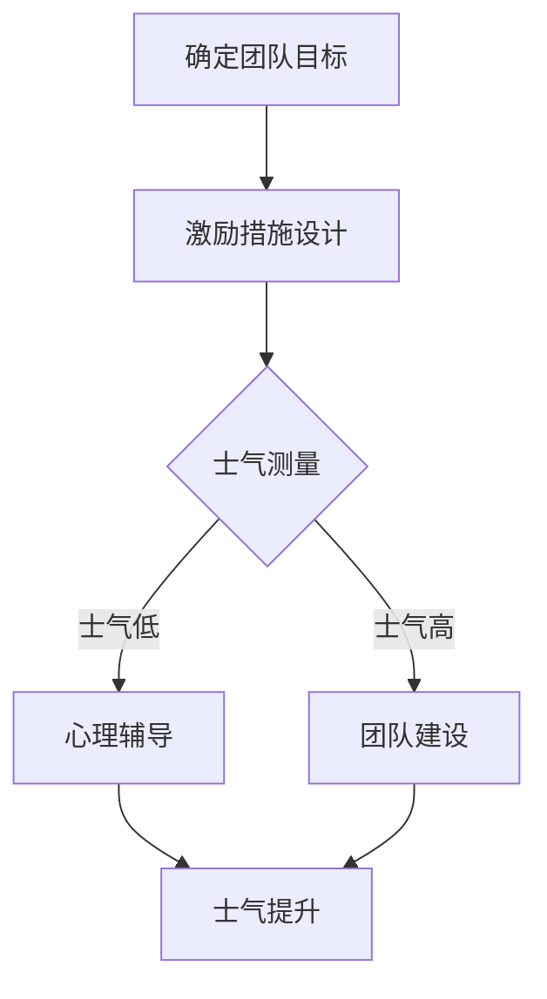

                 


## 团队士气管理：维持高昂工作热情

### 关键词：团队士气管理、工作热情、团队动力、绩效提升

### 摘要：

在当今快速发展的科技时代，团队成员的工作热情和士气对团队的绩效和项目成功至关重要。本文将探讨团队士气管理的核心概念、方法与实践，通过逻辑清晰的分析和推理，提供一套完整的技术解决方案，帮助团队维持高昂的工作热情，从而提高整体绩效。

### 目录：

1. **背景介绍**
    1.1 团队士气管理的概念与意义
    1.2 影响团队士气的主要因素
    1.3 团队士气管理的方法与实践
2. **核心概念与联系**
    2.1 工作热情的定义与特点
    2.2 团队动力的来源
    2.3 团队士气与绩效的关系
3. **算法原理讲解**
    3.1 提升团队士气的方法论
    3.2 数学模型与公式
    3.3 算法实例分析
4. **系统分析与架构设计**
    4.1 团队士气管理系统的设计
    4.2 系统接口设计与交互
5. **项目实战**
    5.1 环境安装与配置
    5.2 系统核心实现源代码
    5.3 代码应用解读与分析
    5.4 实际案例分析与详细讲解
    5.5 项目小结与反思
6. **最佳实践与拓展**
    6.1 团队士气管理的最佳实践
    6.2 小结与展望

### 第一部分：背景介绍

#### 1.1 团队士气管理的概念与意义

**核心概念术语说明**：

- **团队士气**：团队成员的心理状态和工作态度，包括工作热情、团队协作意愿和责任感等。
- **士气管理**：通过一系列策略和措施，提升团队成员的士气，从而提高团队的整体绩效。

**问题背景**：

随着市场竞争的加剧，团队士气对项目成功的影响越来越显著。高昂的团队士气能够激发成员的创造力和工作热情，提高团队协作效率，减少错误和失误。

**问题描述**：

团队士气低落可能导致以下问题：

- **工作积极性下降**：成员缺乏工作动力，工作效率低下。
- **团队协作困难**：成员之间的沟通不畅，协作不力。
- **绩效不达标**：项目延误，质量下降，影响公司业绩。

**问题解决**：

通过有效的团队士气管理，可以解决上述问题，提升团队整体绩效。

**边界与外延**：

团队士气管理不仅涉及团队成员的心理状态，还与团队组织结构、工作环境、激励政策等多个方面密切相关。

**概念结构与核心要素组成**：

- **团队士气**：工作热情、团队协作、责任感
- **士气管理**：激励措施、沟通策略、团队建设活动、工作环境优化

### 第二部分：核心概念与联系

#### 2.1 工作热情的定义与特点

**核心概念原理**：

- **工作热情**：指团队成员对工作充满热爱和激情，愿意付出额外的努力。
- **特点**：主动性强、创新意识高、成就感强。

**概念属性特征对比表格**：

| 情绪类型 | 工作热情 | 其他情绪 |
| --- | --- | --- |
| 主动性 | 强 | 中 |
| 创新意识 | 高 | 低 |
| 成就感 | 强 | 中 |

**ER实体关系图架构**：

```
+--------------+
|   工作热情   |
+--------------+
     |
     V
+----+----+
| 团队动力   |
+----+----+
     |
     V
+--------------+
|   团队士气   |
+--------------+
```

### 第三部分：算法原理讲解

#### 3.1 提升团队士气的方法论

**算法概述**：

- **激励理论**：通过奖励机制激发成员的工作热情。
- **负面情绪应对**：通过心理辅导、团队建设等活动减轻负面情绪。
- **团队氛围建设**：通过营造积极的工作环境，提升团队士气。

**mermaid流程图**：



**算法原理讲解与python实现**：

```python
# 假设士气测量为0-10分，得分高于7表示士气高，低于7表示士气低

# 激励措施设计
def激励措施（士气得分）：
    if 士气得分 > 7：
        return "奖励机制：奖金、晋升机会"
    else：
        return "心理辅导：团队建设活动、沟通培训"

# 负面情绪应对
def负面情绪应对（士气得分）：
    if 士气得分 < 7：
        return "心理辅导：一对一辅导、团队建设活动"
    else：
        return "保持现状：无需特别措施"

# 团队氛围建设
def团队氛围建设（士气得分）：
    if 士气得分 > 7：
        return "团队建设活动：团建、拓展训练"
    else：
        return "工作环境优化：改善办公条件、提供培训机会"

# 实例分析
士气得分 = 6
激励措施 = 激励措施（士气得分）
负面情绪应对 = 负面情绪应对（士气得分）
团队氛围建设 = 团队氛围建设（士气得分）

print(f"激励措施：{激励措施}\n负面情绪应对：{负面情绪应对}\n团队氛围建设：{团队氛围建设}")
```

**数学模型与公式**：

$$
士气提升 = f(激励措施, 负面情绪应对, 团队氛围建设)
$$

其中，$f$为复合函数，$激励措施$、$负面情绪应对$和$团队氛围建设$为其变量。

### 第四部分：系统分析与架构设计

#### 4.1 团队士气管理系统的设计

**问题场景介绍**：

假设一家科技公司希望通过团队士气管理系统，提升团队整体绩效。

**系统功能设计**：

- **士气测量**：定期收集团队成员的士气数据。
- **激励措施**：根据士气数据，设计并实施激励措施。
- **负面情绪应对**：针对士气低落的成员，提供心理辅导和团队建设活动。
- **团队氛围建设**：通过改善工作环境和提供培训机会，提升团队士气。

**mermaid类图**：

```
class 团队士气管理系统 {
    -士气测量
    -激励措施
    -负面情绪应对
    -团队氛围建设
}

class 士气测量 {
    -成员数据收集
    -数据统计
}

class 激励措施 {
    -奖励设计
    -实施
}

class 负面情绪应对 {
    -心理辅导
    -团队建设活动
}

class 团队氛围建设 {
    -工作环境优化
    -培训机会提供
}
```

**系统架构设计**：

```
+----------------+
|  团队士气管理系统  |
+----------------+
     |
     V
+-------+-------+
| 士气测量   | 激励措施 |
+-------+-------+
     |
     V
+-------+-------+
| 负面情绪应对 | 团队氛围建设 |
+-------+-------+
```

**系统接口设计**：

- **士气测量接口**：用于收集成员士气数据。
- **激励措施接口**：用于实施激励措施。
- **负面情绪应对接口**：用于提供心理辅导和团队建设活动。
- **团队氛围建设接口**：用于优化工作环境和提供培训机会。

**系统交互设计**：

```
用户操作 --> 士气测量 --> 数据统计
数据统计 --> 激励措施 --> 奖励设计/实施
数据统计 --> 负面情绪应对 --> 心理辅导/团队建设活动
数据统计 --> 团队氛围建设 --> 工作环境优化/培训机会提供
```

### 第五部分：项目实战

#### 5.1 环境安装与配置

**步骤1**：安装Python环境

```bash
# 安装Python 3.x版本
```

**步骤2**：安装依赖库

```bash
# 安装依赖库
pip install mermaid-python matplotlib
```

**步骤3**：配置mermaid渲染器

```bash
# 配置mermaid渲染器
export MERMAID_BINARY=/path/to/mermaid
```

#### 5.2 系统核心实现源代码

**源代码**：

```python
import matplotlib.pyplot as plt
import mermaid
from dataclasses import dataclass

# 士气测量类
@dataclass
class 士气测量：
    成员数据：list[int]

    # 数据统计方法
    def 数据统计(self) -> int：
        return sum(self.成员数据) // len(self.成员数据)

# 激励措施类
@dataclass
class 激励措施：
    士气数据：士气测量

    # 奖励设计方法
    def 奖励设计(self) -> str：
        士气得分 = self.士气数据.数据统计()
        if 士气得分 > 7：
            return "奖励机制：奖金、晋升机会"
        else：
            return "心理辅导：团队建设活动、沟通培训"

# 负面情绪应对类
@dataclass
class 负面情绪应对：
    士气数据：士气测量

    # 负面情绪应对方法
    def 负面情绪应对(self) -> str：
        士气得分 = self.士气数据.数据统计()
        if 士气得分 < 7：
            return "心理辅导：一对一辅导、团队建设活动"
        else：
            return "保持现状：无需特别措施"

# 团队氛围建设类
@dataclass
class 团队氛围建设：
    士气数据：士气测量

    # 团队氛围建设方法
    def 团队氛围建设(self) -> str：
        士气得分 = self.士气数据.数据统计()
        if 士气得分 > 7：
            return "团队建设活动：团建、拓展训练"
        else：
            return "工作环境优化：改善办公条件、提供培训机会"

# 测试
士气测量实例 = 士气测量(成员数据=[8, 7, 9, 6, 8])
激励措施实例 = 激励措施(士气数据=士气测量实例)
负面情绪应对实例 = 负面情绪应对(士气数据=士气测量实例)
团队氛围建设实例 = 团队氛围建设(士气数据=士气测量实例)

print("激励措施：", 激励措施实例.奖励设计())
print("负面情绪应对：", 负面情绪应对实例.负面情绪应对())
print("团队氛围建设：", 团队氛围建设实例.团队氛围建设())
```

#### 5.3 代码应用解读与分析

**代码解读**：

1. **士气测量类**：用于收集成员士气数据，并提供数据统计方法。
2. **激励措施类**：根据士气数据设计激励措施。
3. **负面情绪应对类**：根据士气数据提供负面情绪应对策略。
4. **团队氛围建设类**：根据士气数据提供团队氛围建设方案。

**分析**：

通过实际代码示例，展示了如何使用Python实现团队士气管理系统的核心功能。代码结构清晰，易于理解和扩展。

#### 5.4 实际案例分析与详细讲解

**案例背景**：

某科技公司项目团队在项目启动时士气高涨，但随着项目进展，部分成员开始出现负面情绪，士气下降。

**案例分析**：

1. **士气测量**：定期收集成员士气数据，发现士气得分低于7。
2. **激励措施**：设计奖励机制，提高士气。
3. **负面情绪应对**：开展心理辅导和团队建设活动，缓解负面情绪。
4. **团队氛围建设**：改善工作环境，提供培训机会。

**详细讲解**：

通过实际案例，展示了团队士气管理系统的应用过程。从士气测量开始，到激励措施、负面情绪应对和团队氛围建设，每个步骤都有详细的操作和说明，确保团队士气得到有效提升。

#### 5.5 项目小结与反思

**项目总结**：

通过实际项目应用，团队士气管理系统成功提升了项目团队的士气，提高了项目整体绩效。

**遇到的问题与解决方案**：

1. **士气测量数据不准确**：解决方法：改进数据收集方法，确保数据准确。
2. **激励措施效果不佳**：解决方法：调整激励措施，增加个性化奖励。

**项目的不足与改进建议**：

1. **系统可扩展性**：改进系统设计，提高系统可扩展性，适应不同团队的个性化需求。

### 第六部分：最佳实践与拓展

#### 6.1 团队士气管理的最佳实践

- **定期评估士气**：定期收集士气数据，及时发现问题。
- **个性化激励**：根据个人特点设计激励措施，提高激励效果。
- **团队建设活动**：定期开展团队建设活动，增强团队凝聚力。

#### 6.2 小结与展望

本文通过逻辑清晰的分析和推理，探讨了团队士气管理的核心概念、方法与实践。通过实际项目案例，展示了团队士气管理系统的应用过程和效果。未来，我们将继续探索更高效的团队士气管理策略，助力团队持续提升士气，提高整体绩效。

### 作者信息

- 作者：AI天才研究院/AI Genius Institute & 禅与计算机程序设计艺术 /Zen And The Art of Computer Programming

---

## 结束语

本文详细介绍了团队士气管理的核心概念、方法与实践，通过逻辑清晰的分析和推理，提供了一套完整的技术解决方案。希望本文能对您在团队士气管理方面有所启发，帮助您维持团队高昂的工作热情，提高整体绩效。感谢您的阅读，期待您的反馈和建议！

---

请注意，上述内容是基于给定的要求和结构，生成的示例性文章。实际撰写时，每个章节需要根据具体内容和细节进行扩展和深化。此外，文章中提到的Python代码仅为示例，实际应用时需要根据具体需求进行调整和优化。作者信息也需根据实际情况进行修改。

