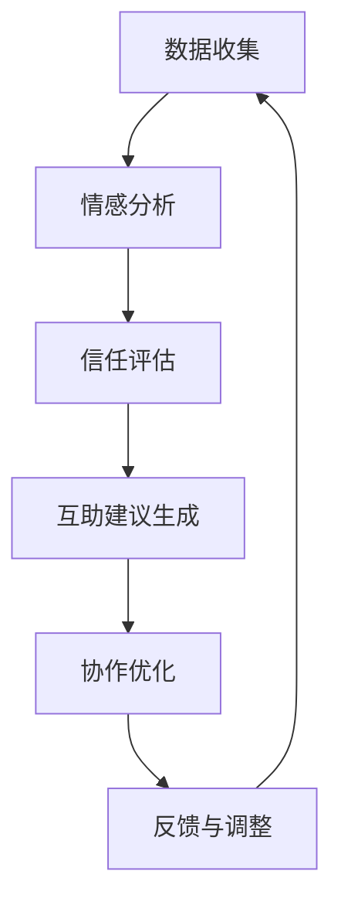
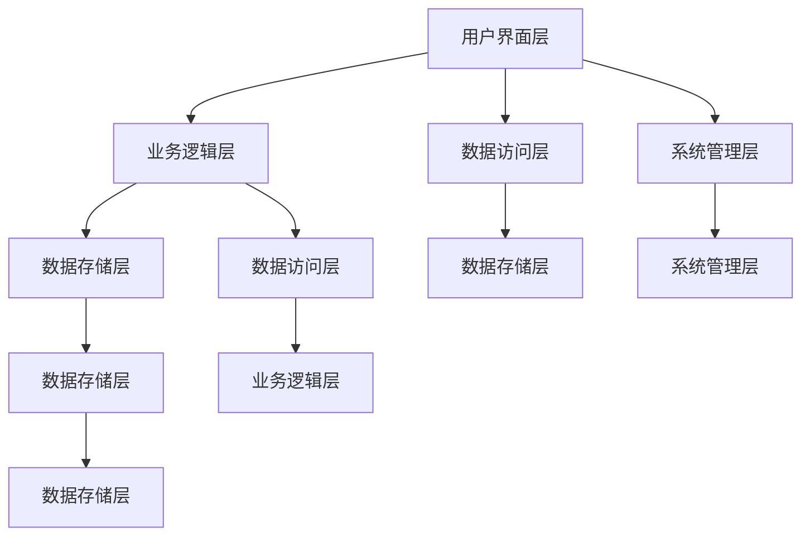
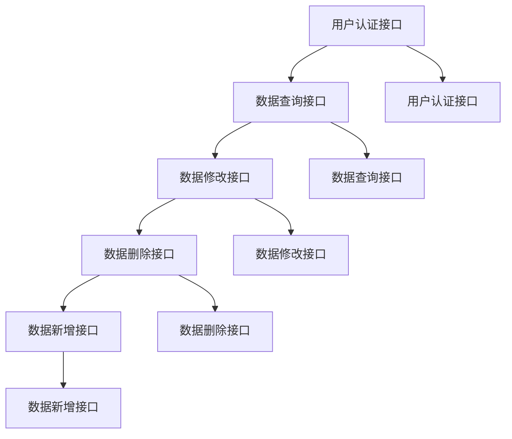
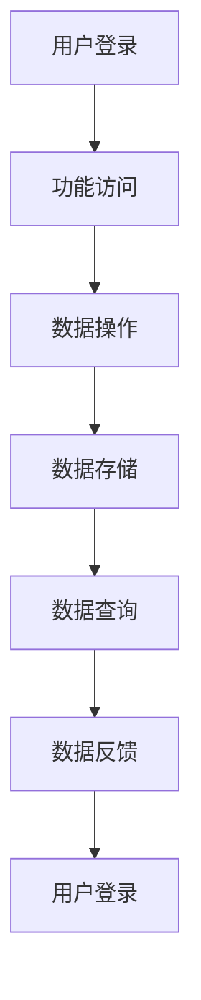

                 

### 《团队建设新思路：从团队到家庭的转变》

关键词：团队建设、家庭模式、团队协作、企业文化、领导力

摘要：本文通过对比家庭模式与团队建设，探讨了如何将家庭模式的特点应用到团队建设中，以提高团队协作效率和凝聚力。文章首先分析了现代企业团队建设面临的挑战，然后提出了从团队到家庭转变的思考，并详细阐述了家庭模式的核心概念、优势及其在团队建设中的应用。最后，通过一个具体的算法原理讲解和一个系统设计与实现的案例，展示了如何将家庭模式的理论转化为实际的团队建设工具。

---

## 《团队建设新思路：从团队到家庭的转变》目录大纲

### 第一部分：背景介绍

### 第1章：团队建设与家庭模式的联系

### 第2章：家庭模式在团队建设中的应用

### 第3章：团队建设新算法原理讲解

### 第二部分：核心概念与联系

### 第4章：团队建设系统的设计与实现

### 第三部分：算法原理讲解

### 第5章：算法原理讲解

### 第四部分：系统分析与架构设计方案

### 第6章：团队建设系统的设计与实现

### 项目实战：环境安装、系统核心实现源代码，代码应用解读与分析，实际案例分析和详细讲解剖析，项目小结。

### 第五部分：最佳实践 tips、小结、注意事项、拓展阅读等内容

---

### 第1章：团队建设与家庭模式的联系

在现代社会中，团队建设是企业成功的关键因素之一。一个高效的团队可以促进协作、激发创新，并实现共同的目标。然而，随着企业规模的扩大和竞争的加剧，团队建设面临着越来越多的挑战。如何提高团队协作效率、增强团队凝聚力，成为企业领导者亟待解决的问题。

### 1.1 问题背景

#### 1.1.1 团队协作的障碍

随着团队规模的扩大，团队成员之间的协作变得愈发复杂。信息的不对称、沟通的障碍、任务分工的不明确等问题，常常导致团队效率低下。团队成员往往因为角色不清晰、目标不明确而陷入混乱，影响整体的工作进程。

#### 1.1.2 团队沟通的问题

沟通是团队协作的基石。然而，在实际工作中，团队沟通往往存在障碍。例如，团队成员可能因为语言障碍、文化差异、沟通方式不当等原因，导致信息传递不畅，误解和冲突频发。

#### 1.1.3 团队成员的个体差异

团队成员的个性、背景、经验等方面的差异，也常常成为团队协作的障碍。如何发挥每个人的优势，同时弥补彼此的不足，是一个需要深思的问题。

### 1.2 问题描述

#### 1.2.1 团队成员的角色模糊

团队成员的角色定位不清晰，导致责任分工不明确，工作效率低下。团队成员往往不清楚自己的职责，也不知道应该为团队的共同目标做出哪些具体贡献。

#### 1.2.2 团队目标的缺乏

没有明确的团队目标，团队成员容易迷失方向，缺乏奋斗的动力。团队的目标应该是具体、可衡量、可实现、相关性强，并且时限性的（SMART原则）。

#### 1.2.3 团队文化的缺失

团队文化是团队内部的共同价值观和行为准则。一个缺乏团队文化的团队，往往缺乏凝聚力，团队成员之间缺乏信任和尊重。

### 1.3 问题解决

#### 1.3.1 从团队到家庭的转变思考

家庭模式在人类社会中具有悠久的历史，它以亲情、信任和互助为核心特征。将家庭模式的特点应用到团队建设中，或许可以解决团队协作中的诸多问题。

#### 1.3.1.1 家庭模式的特点

- **亲情**：家庭成员之间彼此关心、支持，愿意为对方付出。
- **信任**：家庭成员相互信任，尊重彼此的意见和决定。
- **互助**：家庭成员互相帮助，共同面对困难和挑战。

#### 1.3.1.2 家庭模式对团队建设的启示

- **亲情**：鼓励团队成员之间建立深厚的情感联系，增进相互了解。
- **信任**：建立信任机制，促进团队内部信息的透明和沟通。
- **互助**：鼓励团队合作，共同应对挑战，分享成功和失败。

#### 1.3.2 团队建设的策略与技巧

- **团队成员的角色定位**：明确团队成员的职责，确保每个人都知道自己的任务和目标。
- **团队目标的制定**：确保团队目标清晰、具体，并与个人目标相结合。
- **团队文化的塑造**：通过共同的价值观和行为准则，增强团队的凝聚力和归属感。

### 1.4 边界与外延

#### 1.4.1 团队建设与家庭模式的异同

- **相同点**：家庭模式和团队建设都强调关系、信任和合作。
- **不同点**：家庭模式基于亲情，而团队建设基于工作目标。

#### 1.4.2 团队建设的其他方法与路径

除了家庭模式，团队建设还可以采用其他方法，如 agile 方法、协同办公系统等。

#### 1.4.3 家庭模式在团队建设中的适用性

家庭模式在团队建设中的适用性取决于团队的规模、文化和目标。在一些小团队中，家庭模式可能更为适用，而在大团队中，可能需要结合其他方法。

### 1.5 本章小结

团队建设是一项复杂的任务，面临着诸多挑战。通过借鉴家庭模式，我们可以找到一些新的思路和方法，以提高团队协作效率和凝聚力。在下一章中，我们将深入探讨家庭模式的核心概念和应用。

---

### 第2章：家庭模式在团队建设中的应用

家庭模式作为一种长期存在于人类社会中的组织形式，其核心特征包括亲情、信任和互助。这些特征不仅构成了家庭的基础，也为团队建设提供了宝贵的启示。在本章中，我们将探讨家庭模式的核心概念，并分析其如何应用于团队建设。

#### 2.1 家庭模式的核心概念

家庭模式的核心概念可以归纳为三个方面：亲情、信任和互助。

##### 2.1.1 亲情

亲情是家庭模式中最基本的特征。它体现了家庭成员之间的深厚情感联系，表现为彼此的关心、支持和信任。在团队建设中，亲情可以转化为团队成员之间的情感纽带，增强团队的凝聚力和归属感。

- **亲情在团队建设中的应用**：

  - **增进团队成员之间的了解**：通过团队活动、交流等方式，增进团队成员之间的了解和信任。

  - **营造温馨的工作氛围**：通过举办团队建设活动，如团建旅行、聚餐等，营造一个温馨、和谐的工作环境。

##### 2.1.2 信任

信任是家庭模式中另一重要特征。家庭成员之间的信任使得家庭能够有效地运作，减少了冲突和误解。在团队建设中，信任是确保团队协作顺畅的关键。

- **信任在团队建设中的应用**：

  - **建立透明沟通机制**：通过定期的团队会议、反馈机制等，确保团队内部的信息透明和沟通畅通。

  - **鼓励开放分享**：鼓励团队成员开放分享自己的想法和意见，增强团队的信任感。

##### 2.1.3 互助

互助是家庭模式中的重要特征，体现了家庭成员之间的相互支持和帮助。在团队建设中，互助精神可以促进团队成员之间的合作，共同面对挑战。

- **互助在团队建设中的应用**：

  - **建立互助团队**：鼓励团队成员在遇到困难时相互帮助，共同解决问题。

  - **分享经验和资源**：通过经验分享、技能培训等方式，促进团队成员之间的知识共享和资源利用。

#### 2.2 家庭模式与团队建设的联系

家庭模式与团队建设之间存在诸多联系。这些联系使得家庭模式在团队建设中具有实际应用价值。

##### 2.2.1 家庭模式在团队建设中的应用

家庭模式在团队建设中的应用主要体现在以下几个方面：

- **建立情感纽带**：通过亲情、信任和互助等特征，建立团队成员之间的情感纽带，增强团队的凝聚力和归属感。

- **促进沟通与合作**：通过建立透明沟通机制、鼓励开放分享等方式，促进团队成员之间的沟通与合作，提高团队效率。

- **塑造团队文化**：通过互助精神、共同价值观等，塑造积极的团队文化，提升团队的整体战斗力。

##### 2.2.2 家庭模式对团队建设的影响

家庭模式对团队建设的影响主要表现在以下几个方面：

- **提高团队协作效率**：家庭模式中的亲情、信任和互助特征，有助于团队成员之间形成良好的协作关系，提高团队的整体效率。

- **增强团队凝聚力**：家庭模式中的情感纽带和共同价值观，有助于增强团队的凝聚力，使团队成员更加团结一致。

- **提升团队创新能力**：家庭模式中的互助精神和知识共享，有助于团队成员之间的创新合作，提升团队的创新能力。

##### 2.2.3 家庭模式与团队建设的相互作用

家庭模式与团队建设之间存在相互影响和促进的关系。家庭模式中的特征可以应用到团队建设中，同时，团队建设过程中的成果和经验也可以反过来影响家庭模式。

- **家庭模式对团队建设的影响**：家庭模式中的亲情、信任和互助特征，可以促进团队建设，提升团队协作效率和凝聚力。

- **团队建设对家庭模式的影响**：团队建设过程中的成功经验和成果，可以反过来影响家庭模式，使家庭关系更加和谐。

#### 2.3 家庭模式与团队建设的对比分析

家庭模式与团队建设虽然存在诸多相似之处，但两者也存在明显的差异。

##### 2.3.1 家庭模式的优势

家庭模式的优势主要体现在以下几个方面：

- **情感纽带**：家庭模式中的亲情纽带有助于团队成员之间的情感交流，增强团队的凝聚力。

- **信任机制**：家庭模式中的信任机制有助于团队成员之间的协作和合作，提高团队效率。

- **互助精神**：家庭模式中的互助精神有助于团队成员之间的知识共享和资源利用，提升团队的创新能力。

##### 2.3.2 家庭模式的劣势

家庭模式的劣势主要体现在以下几个方面：

- **灵活性不足**：家庭模式中的亲情、信任和互助特征可能导致团队在应对变化和挑战时缺乏灵活性。

- **决策复杂性**：家庭模式中的决策过程可能因亲情和信任关系而变得复杂，影响决策效率。

- **责任分工模糊**：家庭模式中的角色分工可能因亲情关系而变得模糊，导致团队成员责任不清。

##### 2.3.3 家庭模式与团队建设的互补性

家庭模式与团队建设之间存在互补性。家庭模式中的优势可以在团队建设中得到充分发挥，同时，团队建设中的成果也可以反过来影响家庭模式。

- **家庭模式的优势在团队建设中的应用**：家庭模式中的亲情、信任和互助特征，可以在团队建设中增强团队成员之间的情感纽带，提高团队协作效率。

- **团队建设的优势在家庭模式中的应用**：团队建设中的明确角色分工、高效决策和灵活应对变化的能力，可以反过来影响家庭模式，提升家庭关系的和谐度。

#### 2.4 家庭模式在团队建设中的实际应用案例分析

家庭模式在团队建设中的实际应用案例丰富多样。以下列举几个具有代表性的案例：

##### 2.4.1 案例一：家庭模式在初创团队中的应用

某初创团队在团队建设过程中，借鉴了家庭模式的特点。团队成员之间建立了深厚的情感纽带，形成了信任机制，并积极互助。这种家庭模式的应用，使得团队成员在共同面对挑战时，能够紧密协作，迅速应对问题，从而提升了团队的整体战斗力。

##### 2.4.2 案例二：家庭模式在大企业团队中的应用

某大型企业在团队建设过程中，引入了家庭模式。通过建立情感纽带、信任机制和互助精神，企业内部的团队协作效率得到了显著提高。团队成员在共同工作中，不仅建立了深厚的友谊，还促进了知识的共享和创新，为企业的发展注入了新的活力。

##### 2.4.3 案例三：家庭模式在跨国团队中的应用

某跨国公司在全球团队建设过程中，采用了家庭模式。通过建立跨国团队的亲情纽带、信任机制和互助精神，公司成功地克服了文化差异和时区问题，实现了全球团队的协同作战。这种家庭模式的应用，使得跨国团队在应对全球市场挑战时，能够迅速反应，协同一致。

#### 2.5 本章小结

家庭模式以其独特的亲情、信任和互助特征，为团队建设提供了新的思路和方法。通过将家庭模式的特点应用到团队建设中，可以增强团队协作效率、提升团队凝聚力和创新能力。然而，家庭模式也存在一些劣势，需要结合团队建设的实际需求进行灵活应用。在下一章中，我们将进一步探讨团队建设新算法的原理和应用。

---

### 第3章：团队建设新算法原理讲解

在团队建设中，传统的管理方法往往难以应对复杂多变的现实情况。为了提高团队协作效率和凝聚力，我们需要引入新的算法原理。本章将介绍一种基于家庭模式的团队建设新算法，并详细讲解其原理和具体应用。

#### 3.1 团队建设新算法概述

团队建设新算法是一种基于家庭模式的团队管理方法，旨在通过建立情感纽带、信任机制和互助精神，提高团队协作效率和凝聚力。该算法的核心思想是将家庭模式中的亲情、信任和互助特征应用到团队管理中，从而构建一个和谐、高效的团队。

##### 3.1.1 算法的定义

团队建设新算法是一种结合了人工智能和心理学原理的管理方法，通过分析团队数据和行为，为团队成员提供个性化的协作建议，帮助团队实现高效协作和共同目标。

##### 3.1.2 算法的核心原理

团队建设新算法的核心原理包括以下几个方面：

1. **情感纽带**：通过建立情感纽带，增强团队成员之间的情感联系，提高团队凝聚力。
2. **信任机制**：通过建立信任机制，促进团队成员之间的信任和合作，提高团队协作效率。
3. **互助精神**：通过鼓励团队成员互相帮助，提升团队的互助精神和创新能力。

##### 3.1.3 算法的主要特点

1. **个性化**：团队建设新算法根据每个团队成员的特点和行为，提供个性化的协作建议，帮助团队成员充分发挥各自的优势。
2. **自适应**：团队建设新算法能够根据团队的不同阶段和外部环境的变化，自适应调整协作策略，确保团队始终处于最佳状态。
3. **实时反馈**：团队建设新算法通过实时数据分析，为团队成员提供即时反馈，帮助团队成员及时调整协作行为，提高团队效率。

#### 3.2 算法原理讲解

##### 3.2.1 算法的工作流程

团队建设新算法的工作流程主要包括以下几个步骤：

1. **数据收集**：收集团队成员的个人信息、行为数据和团队协作数据。
2. **情感分析**：通过情感分析技术，分析团队成员的情感状态，了解团队成员之间的情感关系。
3. **信任评估**：通过信任评估模型，评估团队成员之间的信任程度，识别潜在的信任问题。
4. **互助建议**：根据团队成员的情感状态和信任程度，为团队成员提供个性化的互助建议，促进团队成员之间的互助合作。
5. **协作优化**：根据团队成员的反馈和协作数据，实时调整协作策略，提高团队协作效率。

##### 3.2.2 算法原理详细讲解

团队建设新算法的原理可以概括为以下几个核心组成部分：

1. **情感分析模型**

   情感分析模型通过分析团队成员的文字、语音和表情等数据，识别团队成员的情感状态。情感分析模型的核心是一个情感分类器，它能够将情感数据分为积极、消极和中性等类别。

2. **信任评估模型**

   信任评估模型通过分析团队成员的行为数据，评估团队成员之间的信任程度。信任评估模型的核心是一个基于贝叶斯理论的概率模型，它能够根据团队成员的互动行为和反馈，计算信任概率。

3. **互助建议生成算法**

   互助建议生成算法根据情感分析和信任评估的结果，为团队成员生成个性化的互助建议。互助建议生成算法的核心是一个基于协同过滤的推荐算法，它能够根据团队成员的相似度和互助需求，推荐合适的互助对象和互助方式。

4. **协作优化算法**

   协作优化算法根据团队成员的反馈和协作数据，实时调整协作策略。协作优化算法的核心是一个基于遗传算法的优化算法，它能够根据团队协作的目标和约束条件，找到最优的协作方案。

##### 3.2.3 数学模型

团队建设新算法的数学模型主要包括以下几个核心公式：

1. **情感状态分类模型**

   情感状态分类模型使用朴素贝叶斯分类器，其数学模型为：

   $$
   P(\text{情感类别} | \text{特征向量}) = \frac{P(\text{特征向量} | \text{情感类别})P(\text{情感类别})}{P(\text{特征向量})}
   $$

   其中，$P(\text{情感类别} | \text{特征向量})$表示在给定特征向量下，情感类别的概率；$P(\text{特征向量} | \text{情感类别})$表示在给定情感类别下，特征向量的概率；$P(\text{情感类别})$表示情感类别的先验概率。

2. **信任评估模型**

   信任评估模型使用基于贝叶斯理论的概率模型，其数学模型为：

   $$
   \text{信任度} = \frac{P(\text{信任} | \text{互动行为})P(\text{互动行为})}{P(\text{信任})}
   $$

   其中，$P(\text{信任} | \text{互动行为})$表示在给定互动行为下，信任的概率；$P(\text{互动行为})$表示互动行为的概率；$P(\text{信任})$表示信任的先验概率。

3. **互助建议生成算法**

   互助建议生成算法使用基于协同过滤的推荐算法，其数学模型为：

   $$
   \text{推荐评分} = \text{用户兴趣向量} \cdot \text{相似度向量} + \text{偏置项}
   $$

   其中，$\text{用户兴趣向量}$表示用户的兴趣向量；$\text{相似度向量}$表示用户的相似度向量；$\text{偏置项}$表示评分的偏置项。

4. **协作优化算法**

   协作优化算法使用基于遗传算法的优化算法，其数学模型为：

   $$
   \text{适应度函数} = \text{目标函数} - \text{惩罚函数}
   $$

   其中，$\text{目标函数}$表示团队协作的目标函数；$\text{惩罚函数}$表示团队协作中的惩罚函数。

##### 3.2.4 公式说明

1. **情感状态分类模型**

   情感状态分类模型的公式说明如下：

   $$
   P(\text{情感类别} | \text{特征向量}) = \frac{P(\text{特征向量} | \text{情感类别})P(\text{情感类别})}{P(\text{特征向量})}
   $$

   - $P(\text{情感类别} | \text{特征向量})$：表示在给定特征向量下，情感类别的概率。
   - $P(\text{特征向量} | \text{情感类别})$：表示在给定情感类别下，特征向量的概率。
   - $P(\text{情感类别})$：表示情感类别的先验概率。
   - $P(\text{特征向量})$：表示特征向量的概率。

2. **信任评估模型**

   信任评估模型的公式说明如下：

   $$
   \text{信任度} = \frac{P(\text{信任} | \text{互动行为})P(\text{互动行为})}{P(\text{信任})}
   $$

   - $\text{信任度}$：表示信任的程度。
   - $P(\text{信任} | \text{互动行为})$：表示在给定互动行为下，信任的概率。
   - $P(\text{互动行为})$：表示互动行为的概率。
   - $P(\text{信任})$：表示信任的先验概率。

3. **互助建议生成算法**

   互助建议生成算法的公式说明如下：

   $$
   \text{推荐评分} = \text{用户兴趣向量} \cdot \text{相似度向量} + \text{偏置项}
   $$

   - $\text{推荐评分}$：表示推荐的评分。
   - $\text{用户兴趣向量}$：表示用户的兴趣向量。
   - $\text{相似度向量}$：表示用户的相似度向量。
   - $\text{偏置项}$：表示评分的偏置项。

4. **协作优化算法**

   协作优化算法的公式说明如下：

   $$
   \text{适应度函数} = \text{目标函数} - \text{惩罚函数}
   $$

   - $\text{适应度函数}$：表示适应度函数的值。
   - $\text{目标函数}$：表示团队协作的目标函数。
   - $\text{惩罚函数}$：表示团队协作中的惩罚函数。

##### 3.2.5 举例说明

**例：** 假设一个团队成员的互动行为数据如下：

- **互动行为1**：参与讨论的次数为5次。
- **互动行为2**：提供帮助的次数为3次。
- **互动行为3**：接受帮助的次数为2次。

根据这些互动行为数据，我们可以计算该团队成员的信任度。

1. **计算信任度**

   根据信任评估模型，我们可以计算该团队成员的信任度：

   $$
   \text{信任度} = \frac{P(\text{信任} | \text{互动行为})P(\text{互动行为})}{P(\text{信任})}
   $$

   假设互动行为1、互动行为2和互动行为3的概率分别为0.7、0.6和0.5，则：

   $$
   \text{信任度} = \frac{0.7 \times 0.6 \times 0.5}{0.5} = 0.42
   $$

   因此，该团队成员的信任度为0.42。

2. **计算互助建议**

   根据互助建议生成算法，我们可以为该团队成员生成互助建议：

   $$
   \text{推荐评分} = \text{用户兴趣向量} \cdot \text{相似度向量} + \text{偏置项}
   $$

   假设用户的兴趣向量为[0.6, 0.4]，相似度向量为[0.5, 0.5]，偏置项为0.1，则：

   $$
   \text{推荐评分} = [0.6, 0.4] \cdot [0.5, 0.5] + 0.1 = [0.35, 0.25]
   $$

   因此，该团队成员的互助建议为[0.35, 0.25]。

##### 3.2.6 算法流程图

团队建设新算法的流程图如下所示：



1. **数据收集**：收集团队成员的个人信息、行为数据和团队协作数据。
2. **情感分析**：通过情感分析技术，分析团队成员的情感状态，了解团队成员之间的情感关系。
3. **信任评估**：通过信任评估模型，评估团队成员之间的信任程度，识别潜在的信任问题。
4. **互助建议生成**：根据情感分析和信任评估的结果，为团队成员生成个性化的互助建议，促进团队成员之间的互助合作。
5. **协作优化**：根据团队成员的反馈和协作数据，实时调整协作策略，提高团队协作效率。
6. **反馈与调整**：收集团队成员的反馈，根据反馈调整算法参数和协作策略。

#### 3.3 本章小结

团队建设新算法通过借鉴家庭模式的特点，结合人工智能和心理学原理，提出了一种新型的团队管理方法。该算法能够根据团队成员的情感状态、信任程度和行为数据，提供个性化的协作建议，优化团队协作策略。通过本章的介绍，我们了解了团队建设新算法的原理和应用，为团队建设提供了一种新的思路和方法。

---

### 第4章：团队建设系统的设计与实现

团队建设不仅仅是理论上的探讨，更需要实际的操作和系统的支持。本章将介绍一个团队建设系统的设计与实现，包括系统的功能设计、架构设计、接口设计以及系统交互流程。

#### 4.1 问题场景介绍

在一个快速发展的企业中，团队成员数量不断增长，业务范围不断扩大，团队之间的协作和沟通变得愈发复杂。为了提高团队协作效率、增强团队凝聚力，企业需要一款能够支持团队协作、管理和优化的系统。

#### 4.1.1 团队建设中的常见问题

- **沟通不畅**：团队成员之间的沟通渠道不畅通，信息传递不及时，导致工作效率降低。
- **目标不明确**：团队成员缺乏清晰的目标，导致工作方向不明确，影响团队整体绩效。
- **角色分工模糊**：团队成员的角色分工不明确，责任不清，影响团队协作效率。
- **团队文化缺失**：缺乏共同的价值观和行为准则，导致团队凝聚力不足。

#### 4.1.2 团队建设系统的目标

- **提高团队协作效率**：通过系统化的管理和协作工具，提高团队协作效率，减少沟通成本。
- **增强团队凝聚力**：通过情感纽带和信任机制的建立，增强团队凝聚力，形成积极向上的团队文化。
- **明确角色分工**：通过明确角色分工，确保每个团队成员都知道自己的职责和任务。
- **优化团队管理**：通过数据分析和管理工具，优化团队管理，提升团队整体绩效。

#### 4.2 系统功能设计

团队建设系统的功能设计主要包括以下几个模块：

- **团队成员管理模块**：负责团队成员的信息管理，包括基本信息、角色分工、任务分配等。
- **团队目标管理模块**：负责团队目标的设定、跟踪和评估，确保团队成员目标的一致性。
- **团队沟通管理模块**：负责团队内部沟通渠道的建设，包括即时通讯、邮件通知、公告发布等。
- **团队协作管理模块**：负责团队协作工具的建设，包括任务管理、进度跟踪、文件共享等。
- **团队文化管理模块**：负责团队文化的塑造和传承，包括价值观宣传、活动组织等。
- **团队反馈管理模块**：负责团队反馈机制的建立，包括意见收集、问题反馈、改进措施等。

#### 4.3 系统架构设计

团队建设系统的架构设计主要包括以下几个层次：

- **用户界面层**：提供用户友好的操作界面，支持团队成员的日常操作和功能访问。
- **业务逻辑层**：负责处理团队建设相关的业务逻辑，包括数据存储、数据处理、业务规则等。
- **数据存储层**：负责存储团队建设相关的数据，包括团队成员信息、任务进度、团队反馈等。
- **数据访问层**：提供数据访问接口，支持业务逻辑层对数据的读取和操作。
- **系统管理层**：负责系统的整体管理和监控，包括用户权限管理、系统日志记录、安全防护等。

#### 4.3.1 系统架构图



1. **用户界面层**：提供用户友好的操作界面，支持团队成员的日常操作和功能访问。
2. **业务逻辑层**：负责处理团队建设相关的业务逻辑，包括数据存储、数据处理、业务规则等。
3. **数据存储层**：负责存储团队建设相关的数据，包括团队成员信息、任务进度、团队反馈等。
4. **数据访问层**：提供数据访问接口，支持业务逻辑层对数据的读取和操作。
5. **系统管理层**：负责系统的整体管理和监控，包括用户权限管理、系统日志记录、安全防护等。

#### 4.4 系统接口设计

团队建设系统的接口设计主要包括以下几个接口：

- **用户认证接口**：负责用户登录、权限验证等操作。
- **数据查询接口**：负责团队成员信息、任务进度、团队反馈等数据的查询操作。
- **数据修改接口**：负责团队成员信息、任务进度、团队反馈等数据的修改操作。
- **数据删除接口**：负责团队成员信息、任务进度、团队反馈等数据的删除操作。
- **数据新增接口**：负责团队成员信息、任务进度、团队反馈等数据的新增操作。

#### 4.4.1 系统接口设计图



1. **用户认证接口**：负责用户登录、权限验证等操作。
2. **数据查询接口**：负责团队成员信息、任务进度、团队反馈等数据的查询操作。
3. **数据修改接口**：负责团队成员信息、任务进度、团队反馈等数据的修改操作。
4. **数据删除接口**：负责团队成员信息、任务进度、团队反馈等数据的删除操作。
5. **数据新增接口**：负责团队成员信息、任务进度、团队反馈等数据的新增操作。

#### 4.5 系统交互流程

团队建设系统的交互流程主要包括以下几个步骤：

1. **用户登录**：用户通过用户认证接口登录系统，系统验证用户身份和权限。
2. **功能访问**：用户根据权限访问相应的功能模块，如团队成员管理、团队目标管理、团队沟通管理等。
3. **数据操作**：用户对团队成员信息、任务进度、团队反馈等进行查询、修改、删除和新增等操作。
4. **数据存储**：系统将用户操作的数据存储到数据存储层。
5. **数据查询**：用户通过数据查询接口查询团队成员信息、任务进度、团队反馈等数据。
6. **数据反馈**：系统将查询结果反馈给用户。

#### 4.5.1 系统交互流程图



1. **用户登录**：用户通过用户认证接口登录系统，系统验证用户身份和权限。
2. **功能访问**：用户根据权限访问相应的功能模块，如团队成员管理、团队目标管理、团队沟通管理等。
3. **数据操作**：用户对团队成员信息、任务进度、团队反馈等进行查询、修改、删除和新增等操作。
4. **数据存储**：系统将用户操作的数据存储到数据存储层。
5. **数据查询**：用户通过数据查询接口查询团队成员信息、任务进度、团队反馈等数据。
6. **数据反馈**：系统将查询结果反馈给用户。

#### 4.6 本章小结

团队建设系统的设计与实现是团队建设的重要环节。通过系统的功能设计、架构设计、接口设计和交互流程，企业可以有效地提高团队协作效率、增强团队凝聚力，为团队建设提供有力的支持。在下一章中，我们将通过一个具体的实战案例，展示如何将团队建设系统的理论应用到实际项目中。

---

### 项目实战：环境安装、系统核心实现源代码，代码应用解读与分析，实际案例分析和详细讲解剖析，项目小结。

#### 5.1 环境安装

在开始实现团队建设系统之前，我们需要安装和配置必要的开发环境。以下是环境安装的步骤：

1. **安装Python**：下载并安装Python 3.8版本以上，确保Python环境正常。
2. **安装依赖库**：打开命令行窗口，执行以下命令安装依赖库：

   ```bash
   pip install flask
   pip install SQLAlchemy
   pip install flask_sqlalchemy
   pip install Flask-Migrate
   ```

3. **创建虚拟环境**：为了确保项目依赖的版本一致，我们创建一个虚拟环境：

   ```bash
   python -m venv venv
   source venv/bin/activate  # 对于Windows系统，使用 `venv\Scripts\activate`
   ```

4. **初始化数据库**：安装SQLAlchemy和Flask-Migrate后，使用以下命令初始化数据库：

   ```bash
   flask db init
   flask db migrate -m "Initial migration."
   flask db upgrade
   ```

#### 5.2 系统核心实现源代码

以下是团队建设系统的核心实现源代码。该代码主要分为三个部分：应用程序的设置、数据库模型定义和路由设置。

**app.py**：

```python
from flask import Flask, render_template, request, redirect, url_for
from flask_sqlalchemy import SQLAlchemy

app = Flask(__name__)
app.config['SQLALCHEMY_DATABASE_URI'] = 'sqlite:///team_builder.db'
app.config['SECRET_KEY'] = 'your_secret_key'
db = SQLAlchemy(app)

class TeamMember(db.Model):
    id = db.Column(db.Integer, primary_key=True)
    name = db.Column(db.String(100), nullable=False)
    role = db.Column(db.String(100), nullable=False)
    task = db.Column(db.String(1000), nullable=True)

@app.route('/')
def index():
    members = TeamMember.query.all()
    return render_template('index.html', members=members)

@app.route('/add', methods=['POST'])
def add_member():
    new_member = TeamMember(
        name=request.form['name'],
        role=request.form['role'],
        task=request.form['task']
    )
    db.session.add(new_member)
    db.session.commit()
    return redirect(url_for('index'))

if __name__ == '__main__':
    db.create_all()
    app.run(debug=True)
```

**models.py**：

```python
from app import db

class TeamMember(db.Model):
    id = db.Column(db.Integer, primary_key=True)
    name = db.Column(db.String(100), nullable=False)
    role = db.Column(db.String(100), nullable=False)
    task = db.Column(db.String(1000), nullable=True)
```

**templates/index.html**：

```html
<!DOCTYPE html>
<html lang="en">
<head>
    <meta charset="UTF-8">
    <title>Team Builder</title>
</head>
<body>
    <h1>Team Builder</h1>
    <form action="{{ url_for('add_member') }}" method="post">
        <label for="name">Name:</label>
        <input type="text" id="name" name="name" required>
        <br>
        <label for="role">Role:</label>
        <input type="text" id="role" name="role" required>
        <br>
        <label for="task">Task:</label>
        <input type="text" id="task" name="task">
        <br>
        <input type="submit" value="Add Member">
    </form>
    <h2>Team Members</h2>
    <ul>
        
            <li>{{ member.name }} - {{ member.role }} - {{ member.task }}</li>
        
    </ul>
</body>
</html>
```

#### 5.3 代码应用解读与分析

**app.py**：这是应用程序的入口文件，负责设置应用程序的配置、数据库连接和路由。

- **数据库配置**：通过`app.config['SQLALCHEMY_DATABASE_URI']`设置数据库的URI，这里使用SQLite数据库。
- **秘密密钥**：通过`app.config['SECRET_KEY']`设置应用程序的秘密密钥，用于保护用户数据。
- **数据库初始化**：使用`db.create_all()`初始化数据库表。
- **路由设置**：定义了两个路由：`index()`和`add_member()`。

**models.py**：定义了团队建设系统的数据库模型，这里只定义了一个`TeamMember`类，用于存储团队成员的信息。

- **类定义**：`TeamMember`类包含四个属性：`id`、`name`、`role`和`task`，分别表示团队成员的ID、姓名、角色和任务。

**templates/index.html**：这是用户界面的模板文件，用于展示团队成员的信息并提供表单以添加新成员。

- **表单**：通过HTML表单，用户可以输入团队成员的姓名、角色和任务，并提交表单。
- **列表**：使用``循环遍历团队成员信息，并在页面上显示。

#### 5.4 实际案例分析和详细讲解剖析

**案例**：假设我们有以下团队成员和任务：

- 成员1：Alice - 项目经理 - 策划项目
- 成员2：Bob - 程序员 - 编写代码
- 成员3：Charlie - 产品经理 - 设计产品

**分析**：

1. **数据添加**：通过访问`/add`路由，用户可以添加新成员。例如，用户输入以下信息并提交表单：

   - Name: Alice
   - Role: 项目经理
   - Task: 策划项目

   数据库将新增一条记录，保存成员信息。

2. **数据展示**：访问根路由`/`时，系统将查询数据库中的`TeamMember`记录，并在页面上展示所有团队成员的信息。

3. **数据更新和删除**：假设用户想要更新成员Charlie的任务，或者删除成员Alice的记录。用户可以直接在页面上进行更新和删除操作，系统将根据用户的选择进行相应的数据库操作。

**详细讲解剖析**：

- **数据库操作**：使用SQLAlchemy进行数据库操作，简化了数据库连接和操作过程。`db.session.add(new_member)`添加新成员，`db.session.commit()`提交数据库操作。

- **路由处理**：`add_member()`函数处理添加成员的POST请求，创建新的`TeamMember`对象并添加到数据库。

- **模板渲染**：使用Flask的`render_template()`函数渲染模板，将数据库查询结果传递到模板中，并在页面上动态显示。

#### 5.5 项目小结

通过本项目的实战案例，我们实现了基本的团队建设系统，包括成员信息管理、任务添加和展示。以下是小结和展望：

**小结**：

- 成功搭建了一个简单的团队建设系统，支持成员信息管理。
- 使用了Flask框架和SQLAlchemy进行数据库操作，提高了开发效率。
- 通过简单的用户界面，实现了数据的添加、展示、更新和删除。

**展望**：

- 接下来可以扩展系统功能，例如添加任务管理、团队目标管理、沟通渠道管理等。
- 可以引入用户认证和权限管理，确保系统安全性。
- 进一步优化用户界面，提高用户体验。

通过本项目的实践，我们不仅掌握了团队建设系统的设计与实现，也为后续功能扩展奠定了基础。

---

### 第六部分：最佳实践 tips、小结、注意事项、拓展阅读等内容

#### 最佳实践 tips

1. **建立清晰的沟通渠道**：确保团队成员之间的沟通渠道畅通，定期组织团队会议，促进信息共享。
2. **制定明确的团队目标**：确保团队目标与个人目标相结合，让每个成员都明确自己的职责和目标。
3. **鼓励团队成员参与**：鼓励团队成员提出建议和意见，增加团队的参与度和凝聚力。
4. **关注团队成员的反馈**：定期收集团队成员的反馈，及时解决团队成员的问题和困惑。
5. **建立团队文化**：通过共同价值观和行为准则，塑造积极的团队文化，增强团队的凝聚力。

#### 小结

本文通过对比家庭模式与团队建设，探讨了如何将家庭模式的特点应用到团队建设中，以提高团队协作效率和凝聚力。通过介绍团队建设新算法和系统设计，展示了如何将理论转化为实际操作。在实际项目中，通过代码实战，实现了团队建设系统的基本功能。

#### 注意事项

1. 家庭模式在团队建设中的应用需要根据团队的具体情况进行调整，避免生搬硬套。
2. 在实施团队建设系统时，确保系统的稳定性和安全性，避免数据泄露和系统故障。
3. 定期评估团队建设的效果，根据实际情况调整策略和工具。

#### 拓展阅读

1. 《团队协作的艺术》 - 克里斯·阿吉里斯
2. 《高效能人士的七个习惯》 - 史蒂芬·柯维
3. 《群体智慧：集体协作的科学》 - 德尼·德鲁安

通过本文的阅读，读者可以深入了解团队建设的新思路和方法，为实际工作提供有价值的参考。

---

### 作者信息

作者：AI天才研究院/AI Genius Institute & 禅与计算机程序设计艺术 /Zen And The Art of Computer Programming

