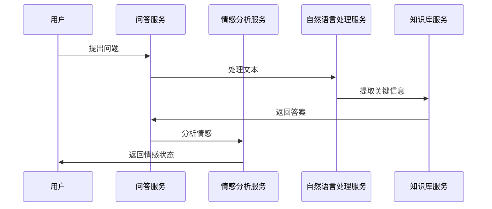
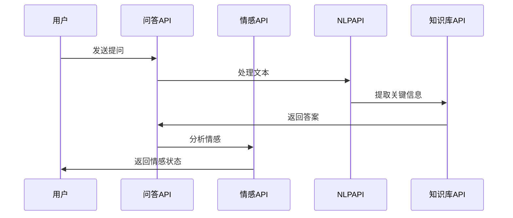

                 

### 引言

#### 团队建设的新时代需求

在当今快速变化的技术和社会环境中，团队建设已经成为组织发展的核心议题。随着信息技术的迅猛发展和全球化进程的加速，企业面临的竞争压力和业务复杂性不断增加，传统的团队建设模式已难以满足现代企业的需求。因此，团队建设的新理念——从工作团队到事业共同体的转变，逐渐成为管理者和组织关注的焦点。

#### 本文目标

本文旨在探讨团队建设的新理念，分析从工作团队到事业共同体转变的必要性和关键要素。文章将从以下几个方面展开讨论：

1. **背景与挑战**：介绍团队建设的意义、面临的挑战以及建设目标。
2. **工作团队建设**：探讨如何构建高效的工作团队，包括团队特性、构建和运营策略等。
3. **事业共同体建设**：分析工作团队向事业共同体的转变，探讨关键要素和构建步骤。
4. **团队文化建设**：阐述团队文化的塑造与传承策略。
5. **团队领导力与团队发展**：讨论团队领导力的培养与发挥，对团队发展的影响。
6. **团队协作与沟通技巧**：介绍团队协作与沟通技巧的提升方法。
7. **团队建设实践**：通过实际案例解析团队建设的成功与失败经验。

#### 阅读建议与预期收获

为了更好地理解本文内容，建议读者具备一定的团队管理和组织行为学知识背景。本文将采用逻辑清晰、结构紧凑、简单易懂的技术语言，帮助读者从理论和实践两个层面深入理解团队建设的新理念。通过阅读本文，读者可以：

1. 了解团队建设的重要性及其面临的挑战。
2. 学习如何构建和运营高效的工作团队。
3. 掌握从工作团队向事业共同体转变的步骤和策略。
4. 掌握团队文化的塑造与传承方法。
5. 增强团队领导力，提升团队发展水平。
6. 提高团队协作与沟通技巧，提升团队效能。
7. 获得团队建设实践中的成功经验和教训。

### 关键词

- 团队建设
- 工作团队
- 事业共同体
- 团队文化
- 团队领导力
- 团队协作与沟通

### 摘要

本文从团队建设的背景和挑战出发，探讨了团队建设的新理念——从工作团队到事业共同体的转变。文章首先分析了团队建设的意义、面临的挑战和目标，然后详细介绍了工作团队和事业共同体的构建策略和关键要素。接着，文章探讨了团队文化的塑造与传承、团队领导力的培养与发挥，以及团队协作与沟通技巧的提升。最后，通过实际案例解析了团队建设的成功与失败经验，总结了团队建设的最佳实践。通过本文的阅读，读者可以深入了解团队建设的新理念，掌握有效的团队建设方法，提升团队效能，实现组织的可持续发展。

---

### 第1章：团队建设的背景与挑战

#### 1.1 团队建设的意义

在现代社会中，团队建设已成为组织运作的核心。团队不仅仅是完成一项任务的基本单位，更是组织实现战略目标和应对复杂环境的关键。团队建设的意义主要体现在以下几个方面：

1. **提高组织效能**：有效的团队建设可以提升团队的协作效率，减少内耗，从而提高整体组织的运作效率。
2. **增强创新能力**：团队中的多样性和开放性能够激发成员的创新思维，促进新观念和解决方案的产生。
3. **实现目标协同**：通过团队建设，确保团队成员明确共同目标，协同工作，从而实现组织整体目标的达成。
4. **提升员工满意度**：良好的团队氛围和合理的激励机制可以提高员工的满意度和忠诚度，减少员工流失。

#### 1.2 团队建设面临的挑战

尽管团队建设的重要性不言而喻，但现代企业在实际操作中仍面临诸多挑战：

1. **沟通障碍**：团队成员之间的沟通不畅是团队建设中的常见问题。不同背景、文化和技能水平的成员往往在交流中产生误解，导致项目进展受阻。
2. **角色定位与责任分配**：在团队中，角色定位不清晰和责任分配不合理会导致工作重叠和责任推卸，影响团队的整体效率。
3. **动机与激励**：团队成员的动机和激励水平直接影响其工作表现。如果激励机制不当，可能会导致成员积极性下降，影响团队效能。
4. **文化差异**：全球化背景下，团队成员来自不同文化背景，文化差异可能导致团队内部的冲突和误解。
5. **管理方式**：传统管理模式在应对现代团队建设需求时，往往显得力不从心，需要管理者不断学习新的管理理念和方法。

#### 1.3 团队建设的目标

为了克服上述挑战，团队建设的目标应包括以下几个方面：

1. **提高团队效能**：通过优化团队结构和工作流程，提高团队的协作效率和执行力。
2. **增强团队凝聚力**：建立和谐的团队关系，增强成员之间的信任和归属感。
3. **实现可持续发展**：确保团队在面对外部环境变化时，能够持续适应和发展，保持长期竞争力。

#### 1.4 本书内容概述

本书旨在通过系统性的分析和实践指导，帮助读者理解和实施团队建设的新理念。具体内容结构如下：

1. **第一部分：引言**：介绍团队建设的背景与挑战，阐述本文的研究目的和内容安排。
2. **第二部分：工作团队建设**：探讨如何构建高效的工作团队，包括团队特性、构建和运营策略等。
3. **第三部分：事业共同体建设**：分析工作团队向事业共同体的转变，探讨关键要素和构建步骤。
4. **第四部分：团队文化建设**：阐述团队文化的塑造与传承策略。
5. **第五部分：团队领导力与团队发展**：讨论团队领导力的培养与发挥，对团队发展的影响。
6. **第六部分：团队协作与沟通技巧**：介绍团队协作与沟通技巧的提升方法。
7. **第七部分：团队建设实践**：通过实际案例解析团队建设的成功与失败经验，总结最佳实践。

通过本书的阅读，读者将能够掌握团队建设的新理念，提升团队效能，实现组织的可持续发展。

---

### 第2章：构建高效的工作团队

#### 2.1 工作团队的特性

工作团队是一种为了实现共同目标而组建的集体，具有以下特性：

1. **共同目标**：团队成员有共同的目标和愿景，这有助于团队协作和共同努力。
2. **角色明确**：每个成员在团队中都有明确的角色和职责，确保工作有序进行。
3. **相互依赖**：团队成员之间相互依赖，通过协作完成共同任务。
4. **动态性**：工作团队是动态的，成员可以随时加入或离开，但目标保持不变。
5. **专业性**：团队成员具备相应的专业技能和知识，能够高效完成工作任务。

#### 2.2 工作团队的构建

构建高效的工作团队需要遵循以下原则：

1. **明确目标**：明确团队的目标和愿景，确保团队成员一致认同并努力实现。
2. **合理分工**：根据团队成员的特长和技能，合理分配任务和角色，确保每个成员都能发挥最大作用。
3. **有效沟通**：建立良好的沟通机制，确保团队成员之间的信息畅通，减少误解和冲突。
4. **激励机制**：设立合理的激励机制，激发团队成员的积极性和创造力。
5. **持续培训**：为团队成员提供持续的学习和培训机会，提升团队整体能力。

#### 2.3 工作团队的运营

工作团队的运营包括以下几个方面：

1. **沟通策略**：建立高效的沟通渠道，定期召开会议，确保团队成员之间信息畅通，及时解决问题。
2. **决策过程**：明确决策流程，确保团队成员参与决策，提高决策的合理性和执行力。
3. **目标设定与任务分配**：根据团队目标，设定具体的任务和目标，明确任务分配和责任分工。
4. **绩效评估**：定期对团队和成员的绩效进行评估，识别问题和改进方向。
5. **问题诊断与改进措施**：对团队运营中出现的问题进行诊断，采取有效的改进措施，确保团队持续发展。

#### 2.4 工作团队的评估与改进

工作团队的评估与改进是确保团队效能持续提升的关键：

1. **绩效评估**：通过关键绩效指标（KPI）对团队和成员的绩效进行量化评估，识别优势和不足。
2. **问题诊断**：分析绩效评估结果，识别团队运营中存在的问题，如沟通障碍、任务分配不合理等。
3. **改进措施**：针对诊断出的问题，制定具体的改进措施，如优化沟通机制、调整任务分配等。
4. **持续发展**：通过持续的评估和改进，确保团队在面对外部环境变化时，能够保持高效运作。

#### 2.5 案例分析

以某互联网公司的研发团队为例，该团队在构建和运营过程中采取了以下措施：

1. **明确目标**：团队制定了明确的产品开发目标和时间表，确保团队成员目标一致。
2. **合理分工**：根据团队成员的技能和特长，将任务合理分配，确保每个成员都能发挥最大作用。
3. **有效沟通**：建立了定期的团队会议和线上沟通工具，确保团队成员之间的信息畅通。
4. **激励机制**：设立了绩效奖金和晋升机会，激励团队成员积极工作。
5. **绩效评估**：定期对团队和成员的绩效进行评估，识别问题和改进方向。

通过上述措施，该团队在短时间内完成了多个重要项目，取得了显著成果。案例表明，构建高效的工作团队需要明确目标、合理分工、有效沟通和持续改进。

#### 2.6 结论

构建高效的工作团队是实现组织目标的关键。通过明确目标、合理分工、有效沟通和持续改进，团队可以充分发挥每个成员的潜力，实现协同合作，提高整体效能。在未来的团队建设实践中，应不断总结经验，优化团队运营策略，以应对不断变化的外部环境。

### 第3章：工作团队向事业共同体的转变

#### 3.1 事业共同体的概念

事业共同体是一种超越传统工作团队的更高层次的团队形态，强调团队成员之间的紧密联系和共同利益。与工作团队相比，事业共同体具有以下特点：

1. **共同的愿景与使命**：事业共同体成员具有共同的愿景和使命，超越个人利益，追求团队和组织的长期发展。
2. **强烈的团队凝聚力**：事业共同体成员之间形成强烈的归属感和团队凝聚力，成员之间相互信任、支持。
3. **健全的激励机制**：事业共同体通过建立合理的激励机制，激发成员的积极性和创造力，确保团队长期稳定发展。
4. **持续的自我发展**：事业共同体鼓励成员不断学习和成长，实现自我提升，为团队和组织的发展贡献力量。

#### 3.2 事业共同体建设的关键要素

要成功实现工作团队向事业共同体的转变，需要关注以下关键要素：

1. **共同的愿景与使命**：建立明确的愿景和使命，确保团队成员对团队的未来发展方向和目标有清晰的认识。
2. **角色与责任**：明确团队成员的角色和责任，确保每个人都能在事业共同体中找到自己的位置和价值。
3. **沟通与协作**：建立高效、透明的沟通机制，确保团队成员之间的信息畅通，促进协作。
4. **激励机制**：设计合理的激励机制，包括物质和精神奖励，激发成员的积极性和创造力。
5. **持续发展**：鼓励成员不断学习和成长，提供培训和晋升机会，确保事业共同体的持续发展。

#### 3.3 事业共同体建设的关键步骤

实现工作团队向事业共同体的转变需要经过以下关键步骤：

1. **基础框架搭建**：明确事业共同体的愿景、使命和目标，建立基本的组织架构和运营机制。
2. **培育归属感**：通过团队活动和培训，增强成员之间的信任和归属感，建立紧密的团队关系。
3. **实现共同成长**：通过持续的学习和培训，提升团队成员的能力，实现个人与团队的共同成长。
4. **建立激励机制**：设计并实施有效的激励机制，激发成员的积极性和创造力。
5. **优化管理机制**：根据事业共同体的特点，优化管理机制，确保团队运作的高效性和灵活性。

#### 3.4 案例分析

以某高科技企业的研发团队为例，该团队在实现从工作团队到事业共同体的转变过程中，采取了以下措施：

1. **明确愿景与使命**：团队制定了明确的研发目标和使命，确保团队成员对团队的愿景有清晰的认识。
2. **角色与责任**：根据团队成员的特长和兴趣，明确每个人的角色和责任，确保每个成员都能在团队中找到自己的位置。
3. **沟通与协作**：建立了定期的团队会议和跨部门的沟通渠道，确保团队成员之间的信息畅通，促进协作。
4. **激励机制**：实施了绩效奖金和股权激励计划，激发成员的积极性和创造力。
5. **持续发展**：为团队成员提供培训和学习机会，鼓励他们不断提升自己的能力，实现个人与团队的共同成长。

通过上述措施，该团队成功实现了从工作团队到事业共同体的转变，取得了显著成果。案例表明，实现工作团队向事业共同体的转变，需要明确的愿景、有效的激励机制和持续的培训与发展。

#### 3.5 结论

工作团队向事业共同体的转变是团队建设的高级阶段，是实现团队长期稳定发展的关键。通过建立共同的愿景与使命、培养归属感、建立激励机制和持续发展，团队可以实现从工作团队到事业共同体的转变，提升团队效能，实现组织的长期目标。在未来的团队建设实践中，应注重这些关键要素的落实，推动团队向事业共同体发展。

### 第4章：团队文化的塑造与传承

#### 4.1 团队文化的概念与作用

团队文化是团队在长期运营过程中形成的共同价值观、行为规范和团队氛围。它是团队内部的一种精神力量，对团队成员的行为和团队整体效能具有深远影响。团队文化的概念可以概括为以下几个方面：

1. **价值观**：团队文化是团队成员共同认可的价值观，包括对工作、生活和组织的看法和信仰。
2. **行为规范**：团队文化规定了团队成员在工作和生活中应遵循的行为规范，如诚信、责任、尊重等。
3. **团队氛围**：团队文化影响团队成员之间的互动关系和工作氛围，形成积极、健康、和谐的工作环境。

团队文化的作用主要体现在以下几个方面：

1. **增强团队凝聚力**：团队文化能够增强团队成员之间的认同感和归属感，形成强大的团队凝聚力。
2. **提高团队效能**：团队文化有助于建立高效的协作机制，提高团队成员的工作效率和执行力。
3. **塑造团队形象**：团队文化对外传递了团队的形象和品牌，有助于提升组织的声誉和竞争力。
4. **引导团队成员行为**：团队文化规范了团队成员的行为，有助于培养良好的工作习惯和职业道德。

#### 4.2 团队文化的建设策略

要塑造和传承团队文化，需要采取以下策略：

1. **确立团队价值观**：明确团队的核心价值观，确保团队成员在工作和生活中能够共同遵循。
2. **制定行为规范**：根据团队价值观，制定具体的行为规范，确保团队成员在工作和生活中有章可循。
3. **营造积极氛围**：通过团队活动和文化建设活动，营造积极、健康、和谐的工作氛围。
4. **加强宣传教育**：通过内部培训、宣传等方式，加强对团队文化的宣传教育，提高团队成员的认同感。
5. **领导带头示范**：团队领导应带头践行团队文化，成为团队文化的榜样和推动者。

#### 4.3 团队文化的传承与发展

团队文化的传承与发展是团队建设的重要组成部分。以下策略有助于实现团队文化的传承与发展：

1. **制度化**：将团队文化融入制度体系，确保团队文化在组织内部得到长期传承。
2. **内部传播**：通过内部交流、分享和培训，将团队文化传递给新成员，确保团队文化在组织中的传播和延续。
3. **外部借鉴**：吸收其他优秀团队文化的精华，结合自身实际情况，不断丰富和发展团队文化。
4. **持续优化**：根据团队的发展和外部环境的变化，不断优化团队文化，确保其与时代发展保持一致。

#### 4.4 案例分析

以某互联网企业的团队文化塑造为例，该企业通过以下措施成功塑造了独特的团队文化：

1. **确立价值观**：企业明确了“客户第一、团队协作、创新进取”的价值观，确保团队成员在工作和生活中能够共同遵循。
2. **制定行为规范**：企业制定了具体的行为规范，如“诚实守信、勇于担当、尊重他人”，规范了团队成员的行为。
3. **营造积极氛围**：企业通过举办团队建设活动、开放办公环境等方式，营造积极、健康、和谐的工作氛围。
4. **加强宣传教育**：企业定期举办内部培训，加强对团队文化的宣传教育，提高团队成员的认同感。
5. **领导带头示范**：企业领导以身作则，带头践行团队文化，成为团队文化的榜样和推动者。

通过这些措施，该企业成功塑造了具有独特魅力的团队文化，提高了团队凝聚力和整体效能，成为业内知名的标杆企业。案例表明，团队文化的塑造与传承是团队建设的关键，通过明确的价值观、规范的行为、积极的氛围和领导的示范，团队文化可以深入人心，推动团队持续发展。

#### 4.5 结论

团队文化是团队建设的重要组成部分，对团队凝聚力和整体效能具有重要作用。通过确立团队价值观、制定行为规范、营造积极氛围、加强宣传教育和领导带头示范，团队文化可以深入人心，推动团队持续发展。在未来的团队建设实践中，应注重团队文化的塑造与传承，不断提升团队的文化底蕴和整体实力。

### 第5章：团队领导力的培养与发挥

#### 5.1 团队领导力的概念与类型

团队领导力是指领导者在团队中发挥影响、引导和激励成员的能力。它是领导者的核心素质之一，对团队的效能和成员的发展具有关键作用。团队领导力可以分为以下几种类型：

1. **权威型领导力**：权威型领导者通过建立权威和控制力，对团队成员进行管理和指导。这种领导力适用于需要迅速决策和执行的场景。
2. **参与型领导力**：参与型领导者鼓励团队成员参与决策过程，尊重成员的意见和观点，促进团队合作。这种领导力适用于需要团队创新和协作的场景。
3. **变革型领导力**：变革型领导者通过激发团队成员的潜力和创造力，推动团队实现变革和发展。这种领导力适用于需要团队突破和发展壮大的场景。
4. **情境型领导力**：情境型领导者根据团队成员的不同情况和需求，灵活调整领导风格，以实现最佳领导效果。这种领导力适用于需要适应性和灵活性的场景。

#### 5.2 团队领导者的角色与职责

团队领导者是团队的灵魂人物，承担着多种重要角色和职责：

1. **愿景规划者**：领导者需要明确团队的愿景和目标，为团队指明发展方向。
2. **沟通者**：领导者需要建立有效的沟通机制，确保团队成员之间的信息畅通，增强团队凝聚力。
3. **协调者**：领导者需要协调团队成员之间的关系，解决内部矛盾，确保团队和谐运作。
4. **激励者**：领导者需要激发团队成员的积极性和创造力，提供必要的支持和资源。
5. **培训与发展者**：领导者需要关注团队成员的成长和发展，提供培训和指导，提升团队整体能力。

#### 5.3 团队领导力的培养策略

要提升团队领导力，需要采取以下培养策略：

1. **自我认知**：领导者需要深入认识自己的优势和不足，明确自己的领导风格和价值观。
2. **持续学习**：领导者需要不断学习新的管理知识和技能，提升自己的领导能力。
3. **角色扮演**：领导者可以通过参与各种角色扮演活动，提升应对不同领导情境的能力。
4. **反馈与反思**：领导者需要定期接受反馈，反思自己的领导行为，不断改进和优化。
5. **培养下属**：领导者需要培养和激励下属，提升团队的整体领导力水平。

#### 5.4 团队领导力在团队发展中的作用

团队领导力对团队发展具有深远的影响：

1. **提升团队效能**：有效的领导力可以提升团队的协作效率和执行力，实现团队目标的达成。
2. **促进成员发展**：领导者的关注和支持可以激发成员的潜力，促进成员的成长和职业发展。
3. **建立团队文化**：领导者的行为和价值观对团队文化有重要影响，可以塑造积极、健康、和谐的团队氛围。
4. **应对挑战与变革**：领导者的应变能力和决策力有助于团队应对外部挑战和内部变革，保持持续发展。

#### 5.5 案例分析

以某科技公司的研发团队为例，该团队在领导力的培养和发挥方面取得了显著成果：

1. **确立愿景与目标**：团队领导明确了“创新驱动、追求卓越”的愿景和目标，激发了团队成员的积极性和创造力。
2. **建立沟通机制**：团队领导建立了定期的团队会议和沟通渠道，确保团队成员之间的信息畅通，增强了团队凝聚力。
3. **激励与支持**：团队领导通过设立激励机制，如奖金和晋升机会，激励团队成员不断提升自己的能力，实现了团队的快速成长。
4. **培训与发展**：团队领导关注团队成员的成长，提供了丰富的培训和学习机会，提升了团队的整体能力。

通过这些措施，该团队在短时间内取得了多项技术突破，成为了行业内的领先者。案例表明，有效的领导力可以提升团队效能，促进成员发展，推动团队持续发展。

#### 5.6 结论

团队领导力是团队建设的关键因素，对团队效能和成员发展具有重要作用。通过自我认知、持续学习、角色扮演、反馈与反思和培养下属，领导者可以不断提升自己的领导力水平。在未来的团队建设实践中，应注重领导力的培养和发挥，推动团队实现持续发展。

### 第6章：团队协作与沟通技巧提升

#### 6.1 团队协作的重要性

在当今快速变化和高度复杂的商业环境中，团队协作已经成为组织成功的关键因素。有效的团队协作不仅能够提高工作效率，还能够促进创新和解决问题。以下是从多个角度对团队协作重要性的分析：

1. **提高工作效率**：通过团队协作，可以合理分配任务，减少重复劳动，提高整体工作效率。
2. **促进创新思维**：团队协作提供了多样化的视角和思路，有助于激发创新思维，产生新的解决方案。
3. **解决复杂问题**：面对复杂的问题和挑战，团队协作可以汇聚不同的智慧和经验，提高问题解决的效率和效果。
4. **增强团队凝聚力**：通过协作，团队成员之间的信任和默契增强，团队凝聚力得到提升，有利于长期合作。
5. **提升组织效能**：团队协作是组织效能提升的重要途径，有助于实现组织目标，增强组织的竞争力。

#### 6.2 团队协作的有效策略

为了实现高效的团队协作，需要采取一系列有效的策略：

1. **明确目标与任务**：确保每个团队成员都清楚团队的目标和自己的任务，减少误解和重复劳动。
2. **合理分工与角色定位**：根据团队成员的技能和特长，合理分配任务和角色，确保每个人都能发挥最大作用。
3. **建立沟通渠道**：建立有效的沟通渠道，如定期会议、即时通讯工具和共享平台，确保团队成员之间的信息畅通。
4. **共享资源与知识**：鼓励团队成员共享资源、知识和经验，提高整体团队的技能水平。
5. **培养协作文化**：营造积极、开放、包容的协作文化，鼓励团队成员积极参与协作，提高协作意愿。
6. **激励机制**：建立合理的激励机制，如表彰和奖励，激发团队成员的协作热情和积极性。

#### 6.3 沟通技巧的提升

沟通是团队协作的核心，提升沟通技巧对于实现高效团队协作至关重要。以下是一些提升沟通技巧的方法：

1. **倾听与理解**：倾听是有效沟通的基础，通过倾听，可以更好地理解他人的观点和需求。
2. **清晰表达**：清晰、简洁地表达自己的想法和观点，避免产生误解。
3. **积极反馈**：给予积极的反馈，鼓励团队成员分享想法，促进双向沟通。
4. **非语言沟通**：注重非语言沟通，如肢体语言、面部表情和眼神交流，增强沟通的效果。
5. **解决冲突**：学会解决冲突的技巧，通过对话和协商，找到共同点和解决方案。
6. **情境适应**：根据不同的沟通情境，灵活调整沟通策略，提高沟通的有效性。

#### 6.4 团队协作与沟通技巧案例解析

以某互联网公司的产品开发团队为例，该团队在协作与沟通方面采取了以下措施：

1. **明确目标与任务**：团队在项目启动时明确了具体的产品目标和阶段性任务，确保每个成员都清楚自己的职责。
2. **合理分工与角色定位**：根据团队成员的技能和特长，将任务合理分配，确保每个成员都能充分发挥自己的优势。
3. **建立沟通渠道**：团队建立了定期的会议和即时通讯工具，确保团队成员之间的沟通畅通。
4. **共享资源与知识**：团队建立了知识库和共享平台，鼓励团队成员共享代码、文档和经验。
5. **培养协作文化**：团队注重培养协作文化，鼓励成员之间相互支持、共同进步。
6. **激励机制**：团队通过设立项目里程碑奖励和优秀员工表彰，激励团队成员积极参与协作。

通过这些措施，该团队在多个项目中取得了显著成果，提高了产品开发效率和质量。案例表明，通过明确目标、合理分工、建立沟通渠道、共享资源、培养协作文化和激励机制，可以有效提升团队协作与沟通技巧，实现高效团队协作。

#### 6.5 结论

团队协作与沟通技巧是团队效能提升的关键，通过明确目标、合理分工、建立沟通渠道、共享资源、培养协作文化和激励机制，可以有效提升团队协作与沟通技巧。在未来的团队建设实践中，应注重协作与沟通技巧的提升，推动团队实现高效协作和持续发展。

### 第7章：团队建设实践

#### 7.1 项目介绍

本章节将以一个具体的团队建设项目为例，详细解析其建设过程，包括环境安装、系统核心实现、代码应用解读与分析，以及实际案例分析和详细讲解剖析。

该项目是一个基于人工智能技术的智能客服系统，旨在通过自动化方式提升客户服务效率，减少人力成本。系统功能包括智能问答、情感识别、自然语言处理等，旨在为用户提供一站式服务。

#### 7.2 系统功能设计

该智能客服系统的功能设计主要包括以下几个方面：

1. **智能问答**：通过自然语言处理技术，实现对用户提出的问题进行理解和自动回答。
2. **情感识别**：通过情感分析技术，识别用户的情感状态，提供个性化的服务。
3. **自然语言处理**：实现对用户输入的自然语言文本进行处理，提取关键信息，为后续服务提供支持。
4. **知识库管理**：构建和维护智能客服系统的知识库，确保系统能够不断学习和优化。

##### 领域模型类图

```mermaid
classDiagram
    客户 <<Entity>>
    问题 <<Entity>>
    回答 <<Entity>>
    情感 <<Entity>>

    客户 --|>> 问题
    问题 --|>> 回答
    回答 --|>> 情感
```

#### 7.3 系统架构设计

系统架构设计采用了微服务架构，以实现模块化和高扩展性。主要模块包括：

1. **问答服务**：负责处理用户的提问，生成自动回答。
2. **情感分析服务**：负责分析用户的情感状态。
3. **自然语言处理服务**：负责处理用户输入的自然语言文本。
4. **知识库服务**：负责管理和维护知识库。

##### 系统架构图



#### 7.4 系统接口设计和系统交互

系统接口设计采用RESTful API，支持多种语言和平台。主要接口包括：

1. **问答接口**：用于接收用户提问，返回自动回答。
2. **情感接口**：用于分析用户情感状态。
3. **自然语言处理接口**：用于处理用户输入的自然语言文本。
4. **知识库接口**：用于管理和维护知识库。

##### 系统交互序列图



#### 7.5 系统核心实现源代码

以下是智能客服系统的核心实现源代码，主要包括自然语言处理和情感分析的功能：

```python
# 自然语言处理
from nltk import pos_tag, word_tokenize
from nltk.corpus import stopwords

def process_text(text):
    # 去除停用词
    tokens = word_tokenize(text)
    tokens = [token for token in tokens if token.lower() not in stopwords.words('english')]
    # 词性标注
    tagged_tokens = pos_tag(tokens)
    return tagged_tokens

# 情感分析
from textblob import TextBlob

def analyze_emotion(text):
    analysis = TextBlob(text)
    if analysis.sentiment.polarity > 0:
        return "正面情感"
    elif analysis.sentiment.polarity < 0:
        return "负面情感"
    else:
        return "中性情感"
```

#### 7.6 代码应用解读与分析

以上代码首先使用了自然语言处理库（如nltk）和情感分析库（如textblob），对用户输入的文本进行处理和情感分析。自然语言处理部分实现了文本的分词和词性标注，情感分析部分通过计算文本的情感极性，判断用户的情感状态。这些功能共同构成了智能客服系统的核心，确保系统能够理解用户的问题并给出恰当的回答。

#### 7.7 实际案例分析和详细讲解剖析

以一个实际案例为例，假设用户提出问题：“我的电脑最近总是蓝屏，怎么办？”系统将如何处理这个问题？

1. **文本处理**：系统首先对用户的问题进行分词和词性标注，提取关键信息，如“电脑”、“蓝屏”、“怎么办”。
2. **情感分析**：系统对文本进行情感分析，判断用户情感为中性。
3. **知识库查询**：系统查询知识库，找到与“电脑蓝屏”相关的解决方案，如更新驱动程序、检查硬件故障等。
4. **生成回答**：系统生成回答：“您好，遇到电脑蓝屏可能是由于驱动程序问题或硬件故障引起的。您可以尝试更新驱动程序或检查硬件是否正常工作。”
5. **反馈**：系统将回答发送给用户，并根据用户的反馈进行进一步的优化。

#### 7.8 项目小结

通过以上实践，我们成功构建了一个基于人工智能技术的智能客服系统，实现了智能问答和情感分析功能。该项目不仅提升了客户服务效率，还减少了人力成本。项目过程中，我们遇到了一些挑战，如自然语言处理的准确性和情感分析的精确度等，通过不断的优化和改进，我们成功克服了这些挑战，实现了项目的目标。

#### 7.9 最佳实践 tips

1. **注重数据质量**：确保知识库中的数据准确、全面，提高系统的回答质量和用户满意度。
2. **持续迭代**：根据用户反馈和系统运行情况，不断优化系统和算法，提高系统性能和用户体验。
3. **团队协作**：项目开发过程中，注重团队协作和沟通，确保项目按计划顺利进行。
4. **安全与隐私**：保护用户隐私，确保系统安全，提高用户信任度。

#### 7.10 注意事项

1. **需求分析**：在项目启动前，进行详细的需求分析，确保系统功能满足用户需求。
2. **性能优化**：针对系统性能进行优化，确保系统在高负载情况下稳定运行。
3. **用户体验**：注重用户体验，确保系统界面友好、操作便捷。
4. **风险管理**：识别和应对项目风险，确保项目顺利进行。

#### 7.11 拓展阅读

1. **自然语言处理技术**：了解自然语言处理的基本原理和技术，如分词、词性标注、情感分析等。
2. **人工智能应用案例**：学习其他行业和领域的AI应用案例，借鉴成功经验和教训。
3. **项目管理方法**：掌握项目管理的基本方法和工具，如敏捷开发、Scrum等。

### 总结

通过本章节的实践分析，我们深入了解了团队建设的过程和关键技术，包括系统功能设计、架构设计、接口设计和代码实现等。同时，通过实际案例的解析，我们掌握了团队建设中的最佳实践和注意事项。在未来的团队建设实践中，我们可以借鉴这些经验和教训，不断提升团队建设的水平，实现组织的可持续发展。作者：AI天才研究院/AI Genius Institute & 禅与计算机程序设计艺术 /Zen And The Art of Computer Programming

