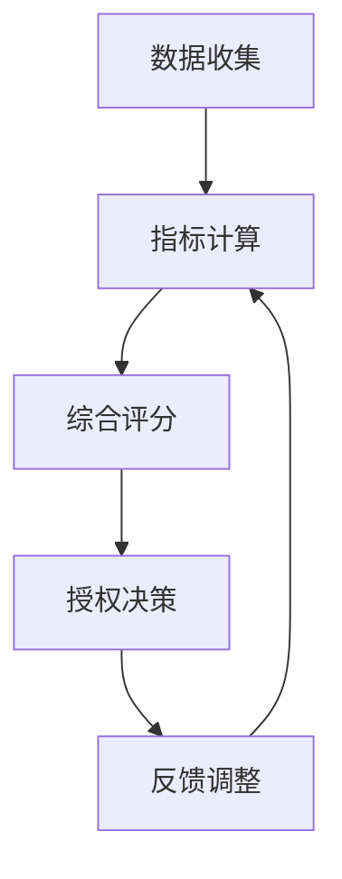
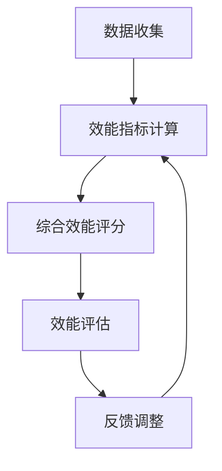
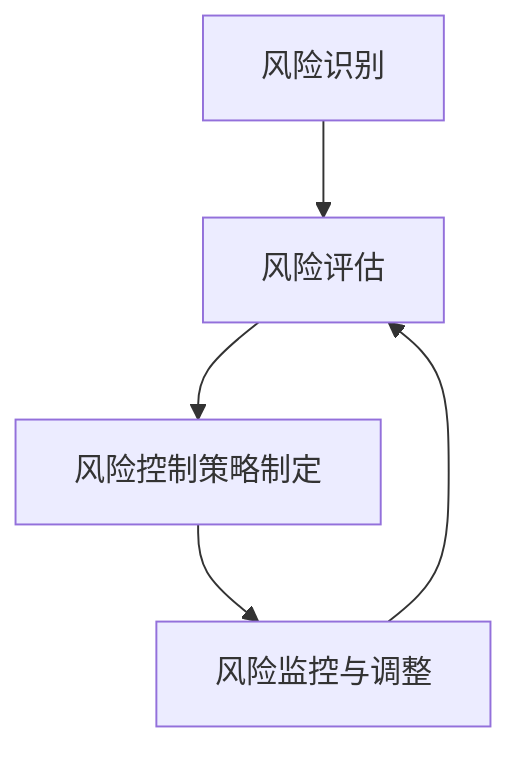
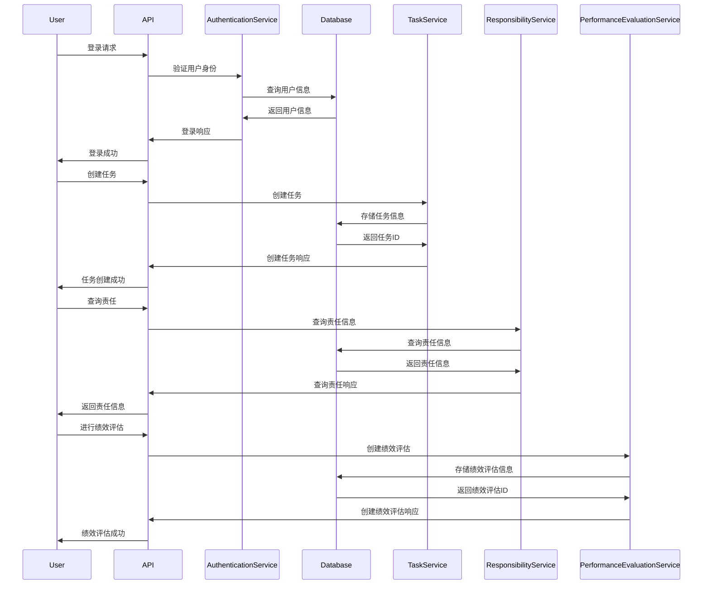
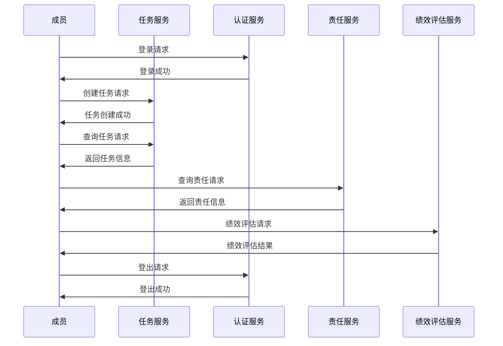

                 

### 引言

#### 1.1 问题的背景

在当今快速发展的科技时代，团队管理的重要性日益凸显。随着企业规模和业务复杂度的增加，传统单一的命令与控制型管理模式已经难以适应现代组织的需求。团队授权作为一种先进的管理理念，旨在通过赋予团队成员更多的自主权和责任感，来提高团队的整体效率和创新力。

然而，在实际操作中，团队授权常常面临信任与控制之间的矛盾。授权过度可能导致团队失控，而授权不足则可能抑制团队成员的积极性。如何在信任与控制之间找到平衡点，成为团队管理者面临的重大挑战。

#### 1.2 问题的描述

**团队授权的定义与重要性：**

团队授权（Team Empowerment）指的是在团队中授予成员决策权和责任感，让他们在没有直接监督的情况下自主完成工作任务。这一过程不仅包括任务的分配，还涉及到决策权、资源获取、责任承担等方面的全面授权。

团队授权的重要性主要体现在以下几个方面：

1. **提高工作效率**：授权后的团队成员可以更快速地做出决策，减少信息传递过程中的延迟，提高整体工作效率。
2. **增强创新能力**：在信任和自主的环境下，团队成员更有可能提出新的创意和解决方案，从而推动团队的持续创新。
3. **增强团队凝聚力**：通过授权，团队成员感受到自己在团队中的价值和重要性，从而增强团队的凝聚力和忠诚度。

**信任与控制的平衡：**

信任与控制是团队授权过程中不可忽视的两个方面。信任是授权的基础，而控制是确保团队行为在合理范围内的必要手段。

- **信任**：信任是团队成员之间建立的一种心理安全感，它使得成员能够放心地承担更多责任和自主做出决策。信任的影响因素包括个人的能力、团队的沟通机制和组织的文化等。

- **控制**：控制是通过各种手段对团队成员的行为进行监督和调节，以确保团队目标的实现。控制的形式多种多样，包括流程规范、绩效评估、审计等。

在实际操作中，如何平衡信任与控制，成为团队管理者需要深入思考的问题。

#### 1.3 问题的解决

**团队授权的理论基础：**

团队授权的理论基础主要包括以下几方面：

1. **管理心理学理论**：如自我决定理论，强调个体在自由、自主和有意义的活动中实现自我成长和自我实现。
2. **领导力理论**：如授权型领导，强调领导者通过赋予下属更多自主权来提高团队绩效。
3. **组织行为学理论**：如团队动力学，强调团队中个体与个体、个体与团队之间的互动关系。

**信任与控制的关系：**

信任与控制之间的关系是相辅相成的。信任是授权的基础，而控制是保障信任的有效手段。在实际操作中，管理者需要根据团队的实际情况，动态调整信任与控制的平衡点。

- **信任增强**：通过提高团队沟通效率、建立透明的工作流程、培养团队成员的信任感等方式，增强团队之间的信任。
- **控制优化**：通过制定明确的绩效指标、建立监督机制、进行定期的绩效评估等方式，优化控制手段。

#### 1.4 边界与外延

**团队授权在不同组织结构中的应用：**

团队授权在不同组织结构中的应用存在一定差异。在扁平化的组织结构中，团队授权的幅度通常较大，而在层级化的组织结构中，授权的幅度相对较小。

**授权的层次与类型：**

授权可以分为多个层次，包括任务授权、决策授权、资源授权等。不同层次的授权对团队成员的能力和责任有不同的要求。

**概念结构与核心要素组成：**

团队授权的概念结构包括信任的要素、控制的手段和平衡艺术的核心要素。信任的要素包括诚信、透明度和能力等；控制的手段包括监督、反馈和绩效评估等；平衡艺术的核心要素包括授权策略、授权时机和授权范围等。

#### 1.5 概念结构与核心要素组成

- **信任的要素**：诚信、透明度、能力
- **控制的手段**：监督、反馈、绩效评估
- **平衡艺术的核心要素**：授权策略、授权时机、授权范围

通过上述分析，我们可以看到，团队授权是一项复杂的工程，涉及到多个层面的因素。只有在信任与控制的平衡艺术中找到合适的方法，才能真正实现团队授权的目标，提升团队的绩效和创新能力。

## 第二部分 核心概念与联系

### 2.1 信任的原理与特征

#### 2.1.1 信任的定义与属性

**定义：** 信任是团队成员在相互交往中形成的一种心理安全感，他们相信对方会做出有利于团队整体利益的行为。

**属性：**

1. **主观性**：信任是个人对他人或团队的一种心理感受，具有强烈的主观色彩。
2. **相互性**：信任是双向的，不仅需要个体信任他人，还需要他人信任个体。
3. **动态性**：信任是不断发展的，它随着团队成员之间的互动和沟通而变化。
4. **情境性**：信任的形成受到具体情境的影响，不同的情境下信任水平可能有所不同。

#### 2.1.2 信任的影响因素

**1. 个人能力：** 团队成员的专业技能和执行能力是建立信任的重要因素。当成员具备解决问题的能力时，他们更容易获得他人的信任。

**2. 沟通机制：** 团队成员之间的有效沟通是建立信任的基础。通过开放、透明和及时的沟通，团队成员可以增进理解，减少误解，从而建立信任。

**3. 团队文化：** 良好的团队文化有助于信任的建立。例如，鼓励开放分享、尊重个人意见和相互支持的文化，可以增强团队成员之间的信任。

**4. 组织环境：** 组织的规章制度、管理风格和组织氛围都会影响团队成员之间的信任水平。一个支持创新和信任的组织环境有利于信任的建立。

#### 2.1.3 信任的模型

**1. 基于行为的信任模型：** 该模型认为信任是团队成员通过观察对方的行为来形成的。例如，如果团队成员A多次按时完成任务，团队成员B就会逐渐对A产生信任。

**2. 基于关系的信任模型：** 该模型强调信任是团队成员之间长期互动和共同经历的结果。通过共同完成任务和经历困难，团队成员之间的关系会更加紧密，从而建立信任。

**3. 基于认知的信任模型：** 该模型认为信任是团队成员通过理性分析和判断形成的。当团队成员对对方的能力、诚信和可靠性有足够的了解时，他们更容易建立信任。

### 2.2 控制的手段与方法

#### 2.2.1 控制的定义与目的

**定义：** 控制是管理者通过制定规则、监督和评估等方式，确保团队行为和结果符合组织目标和期望的过程。

**目的：**

1. **确保目标实现**：通过控制，管理者可以确保团队成员的行为和决策不会偏离团队目标。
2. **提高效率**：控制有助于规范团队成员的工作流程，减少无效劳动和资源浪费，从而提高工作效率。
3. **风险防范**：控制可以帮助管理者识别和防范潜在的风险，确保团队运作的稳定和安全。

#### 2.2.2 控制的类型与手段

**1. 任务控制：** 通过明确的任务分配和绩效考核，确保团队成员按照既定目标完成任务。

**2. 过程控制：** 通过监督和指导团队成员的工作流程，确保工作按计划进行。

**3. 成果控制：** 通过绩效评估和反馈，对团队成员的工作成果进行评价，以激励团队成员提高绩效。

**4. 制度控制：** 通过制定规章制度和流程规范，约束团队成员的行为，确保团队运作的规范性。

**5. 信息控制：** 通过信息的收集、分析和传递，确保团队成员对团队运作状态有全面了解，以便做出正确决策。

#### 2.2.3 控制的影响因素

**1. 组织文化：** 开放、透明和规范的团队文化有助于控制的有效实施，而保守、封闭和独断的团队文化可能削弱控制的效果。

**2. 领导风格：** 民主型领导风格通常更有利于控制，因为团队成员更容易接受和遵守规则；而独断型领导风格可能引起团队成员的抵触情绪，降低控制效果。

**3. 组织规模：** 在小规模团队中，控制相对容易实施，而在大规模团队中，控制可能面临更多挑战。

**4. 工作性质：** 对于高度结构化的工作，控制更容易实施；而对于复杂和创新性工作，控制可能面临更多不确定性和挑战。

### 2.3 信任与控制的对比表格

| 对比项 | 信任 | 控制 |
| --- | --- | --- |
| **定义** | 主观性、相互性、动态性、情境性 | 确保目标实现、提高效率、风险防范 |
| **目的** | 建立心理安全感，提高决策效率，增强团队凝聚力 | 确保团队行为和结果符合组织目标 |
| **类型** | 基于行为、基于关系、基于认知 | 任务控制、过程控制、成果控制、制度控制、信息控制 |
| **影响因素** | 个人能力、沟通机制、团队文化、组织环境 | 组织文化、领导风格、组织规模、工作性质 |
| **协同作用** | 提高控制的有效性，降低管理成本 | 增强信任的基础，确保团队目标的实现 |

通过对比表格，我们可以看到，信任和控制虽然在目的和手段上有所不同，但它们之间存在密切的联系和协同作用。在实际操作中，团队管理者需要根据具体情况，灵活运用信任和控制手段，找到合适的平衡点，以实现团队的高效运作。

### 2.4 ER实体关系图

为了更好地理解团队授权中的信任与控制关系，我们可以通过ER（实体-关系）图来表示团队成员、任务和责权关系。以下是一个简化的ER图：

```mermaid
erDiagram
  Member ||--|{ Task }|>
  Member ||--|{ Responsibility }|>
  Task ||--|{ Member }|>

  Member {
    MemberID
    Name
    Role
  }

  Task {
    TaskID
    Description
    Status
  }

  Responsibility {
    ResponsibilityID
    Description
    Status
  }
```

在这个ER图中，**Member**（团队成员）是核心实体，表示团队的每个成员，具有MemberID、Name和Role属性。**Task**（任务）实体表示团队需要完成的各项工作任务，具有TaskID、Description和Status属性。**Responsibility**（责任）实体表示团队成员承担的各种责任，具有ResponsibilityID、Description和Status属性。

- **成员与任务的关系**：表示一个成员可以负责多个任务，一个任务可以由多个成员共同完成。
- **成员与责任的关系**：表示一个成员可以承担多个责任，一个责任可以由多个成员共同承担。
- **任务与责任的关系**：表示每个任务都有相应的责任分配，每个责任都对应一个或多个任务。

通过ER图，我们可以清晰地看到团队成员、任务和责任之间的相互关系，为后续的算法设计和系统架构设计提供了基础。

### 3.1 授权评估算法

#### 3.1.1 算法概述

**授权评估算法**旨在对团队成员的授权程度进行定量评估，以确保团队运作的效率和效果。该算法通过一系列指标对团队成员的能力、责任感和团队贡献进行综合评估，从而确定最适合的授权水平。

#### 3.1.2 算法流程

1. **数据收集**：收集团队成员的相关数据，包括个人技能水平、任务完成情况、团队互动频率等。
2. **指标计算**：根据收集的数据，计算每个成员的授权评分，评分指标包括能力评分、责任评分和贡献评分。
3. **综合评分**：将各个评分指标进行加权求和，得到每个成员的综合评分。
4. **授权决策**：根据综合评分，对每个成员的授权程度进行决策，确定其可以承担的任务和责任。
5. **反馈调整**：根据实际运作情况，对授权评估结果进行反馈调整，以确保评估的准确性和时效性。

#### 3.1.3 算法原理

**授权评估算法**的核心思想是利用数据驱动的量化方法，对团队成员进行多维度的评估，从而科学地确定其授权水平。具体原理如下：

1. **能力评分**：通过分析团队成员的技能水平、工作经验和过去任务完成情况，得出其能力评分。能力评分越高，表示成员越适合承担复杂和重要的任务。

2. **责任评分**：通过观察团队成员在团队中的责任承担情况，如任务的完成度、责任意识等，得出其责任评分。责任评分越高，表示成员越值得信任，能够承担更多的责任。

3. **贡献评分**：通过分析团队成员在团队中的贡献，如提出的创意、解决的问题、协作效果等，得出其贡献评分。贡献评分越高，表示成员对团队的贡献越大，越应该获得更多的授权。

4. **综合评分**：通过加权求和上述三个评分，得到成员的综合评分。综合评分越高，表示成员越适合获得高水平的授权。

5. **授权决策**：根据综合评分，结合团队的任务需求和责任分配情况，对成员的授权程度进行决策。例如，对于综合评分较高的成员，可以赋予更多的决策权和资源，以充分发挥其潜力。

6. **反馈调整**：在实际运作过程中，定期收集团队成员的工作反馈，对授权评估结果进行调整。通过反馈调整，可以不断优化授权评估算法，提高评估的准确性和时效性。

#### 3.1.4 算法流程图



#### 3.1.5 举例说明

假设团队中有三位成员：张三、李四和王五。以下是他们的各项评分：

- **张三**：能力评分90，责任评分85，贡献评分88
- **李四**：能力评分80，责任评分75，贡献评分78
- **王五**：能力评分70，责任评分80，贡献评分75

根据授权评估算法，我们可以计算出他们的综合评分：

- **张三**：综合评分 = 90 * 0.4 + 85 * 0.3 + 88 * 0.3 = 87.7
- **李四**：综合评分 = 80 * 0.4 + 75 * 0.3 + 78 * 0.3 = 77.5
- **王五**：综合评分 = 70 * 0.4 + 80 * 0.3 + 75 * 0.3 = 76.0

根据综合评分，我们可以决定他们的授权程度：

- **张三**：授予较高的决策权和资源，承担关键任务。
- **李四**：授予一定的决策权和资源，承担重要任务。
- **王五**：授予较低的决策权和资源，承担辅助任务。

通过上述例子，我们可以看到授权评估算法如何通过量化评估，科学地确定团队成员的授权水平，从而实现团队的高效运作。

### 3.2 授权效能评估算法

#### 3.2.1 算法概述

**授权效能评估算法**旨在对团队成员的授权效果进行定量评估，以衡量授权措施的实施效果。该算法通过分析团队成员的工作表现和团队整体绩效，评估授权措施的有效性。

#### 3.2.2 算法流程

1. **数据收集**：收集团队成员的工作表现数据，包括任务完成情况、质量评估、团队反馈等。
2. **效能指标计算**：根据收集的数据，计算多个效能指标，包括任务完成率、质量指标、团队协作度等。
3. **综合效能评分**：将各个效能指标进行加权求和，得到团队的综合效能评分。
4. **效能评估**：根据综合效能评分，评估授权措施的有效性，确定是否需要调整授权策略。
5. **反馈调整**：根据效能评估结果，对授权策略进行调整，以优化授权效果。

#### 3.2.3 算法原理

**授权效能评估算法**的核心思想是通过量化评估，分析授权措施对团队运作的影响，从而指导授权策略的优化。具体原理如下：

1. **任务完成率**：通过分析团队成员的任务完成情况，评估授权措施是否提高了团队的工作效率。任务完成率越高，表示授权措施越有效。

2. **质量指标**：通过分析团队成员的工作质量，评估授权措施是否促进了团队成员的责任感和质量意识。质量指标越高，表示授权措施越有效。

3. **团队协作度**：通过分析团队成员之间的协作情况，评估授权措施是否增强了团队的合作氛围和凝聚力。团队协作度越高，表示授权措施越有效。

4. **综合效能评分**：通过加权求和上述指标，得到团队的综合效能评分。综合效能评分越高，表示授权措施的实施效果越好。

5. **效能评估**：根据综合效能评分，对授权措施进行评估，确定其有效性。如果综合效能评分较高，表示授权措施有效，可以继续保持；如果综合效能评分较低，表示授权措施可能存在问题，需要调整。

6. **反馈调整**：根据效能评估结果，对授权策略进行调整，以优化授权效果。例如，可以通过增加团队成员的培训、改善团队沟通机制、调整任务分配等方式，提升授权效果。

#### 3.2.4 算法流程图



#### 3.2.5 举例说明

假设团队中有三位成员：张三、李四和王五。以下是他们的工作表现数据：

- **张三**：任务完成率90%，质量评估85%，团队协作度80%
- **李四**：任务完成率85%，质量评估80%，团队协作度75%
- **王五**：任务完成率80%，质量评估75%，团队协作度70%

根据授权效能评估算法，我们可以计算出他们的综合效能评分：

- **张三**：综合效能评分 = 90 * 0.4 + 85 * 0.3 + 80 * 0.3 = 86.5
- **李四**：综合效能评分 = 85 * 0.4 + 80 * 0.3 + 75 * 0.3 = 81.5
- **王五**：综合效能评分 = 80 * 0.4 + 75 * 0.3 + 70 * 0.3 = 77.5

根据综合效能评分，我们可以评估授权措施的有效性：

- **张三**：综合效能评分较高，表示授权措施有效，可以继续保持。
- **李四**：综合效能评分中等，表示授权措施有一定效果，但需要进一步优化。
- **王五**：综合效能评分较低，表示授权措施可能存在问题，需要调整。

通过上述例子，我们可以看到授权效能评估算法如何通过量化评估，衡量授权措施的实施效果，从而指导授权策略的优化。

### 3.3 授权风险控制算法

#### 3.3.1 算法概述

**授权风险控制算法**旨在通过识别和评估团队授权过程中的潜在风险，采取相应的控制措施，以确保团队授权的有效性和安全性。该算法通过对团队成员的行为、任务和团队环境进行分析，识别潜在风险，并制定相应的风险控制策略。

#### 3.3.2 算法流程

1. **风险识别**：通过数据分析、历史记录和专家意见，识别团队授权过程中可能出现的各种风险，如任务偏离、资源浪费、信息安全等。
2. **风险评估**：对识别出的风险进行量化评估，确定其严重程度和概率，使用风险矩阵等方法进行评估。
3. **风险控制策略制定**：根据风险评估结果，制定相应的风险控制策略，如风险规避、风险降低、风险转移等。
4. **风险监控与调整**：对风险控制措施的实施效果进行监控，并根据实际情况进行调整，确保风险得到有效控制。

#### 3.3.3 算法原理

**授权风险控制算法**的核心思想是通过系统化的方法，识别和评估授权过程中的风险，并采取有效的控制措施，以降低风险对团队授权的负面影响。具体原理如下：

1. **风险识别**：通过数据分析、历史记录和专家意见，全面识别团队授权过程中可能出现的各种风险。风险识别是风险控制的基础，只有准确识别风险，才能制定有效的控制策略。

2. **风险评估**：对识别出的风险进行量化评估，确定其严重程度和概率。风险评估是风险控制的第二步，通过评估风险的严重性和概率，可以确定哪些风险需要重点关注，并制定相应的控制措施。

3. **风险控制策略制定**：根据风险评估结果，制定相应的风险控制策略。风险控制策略包括风险规避、风险降低、风险转移等。风险规避是通过避免风险事件的发生来降低风险；风险降低是通过减少风险事件的发生概率或影响程度来降低风险；风险转移是通过将风险转移给第三方来降低风险。

4. **风险监控与调整**：对风险控制措施的实施效果进行监控，并根据实际情况进行调整，确保风险得到有效控制。风险监控与调整是风险控制的最后一步，通过持续的监控和调整，可以确保风险控制措施的有效性和实时性。

#### 3.3.4 算法流程图



#### 3.3.5 举例说明

假设团队在授权过程中识别出以下几种风险：

- **任务偏离风险**：由于授权过度，可能导致团队成员偏离任务目标，影响项目进度和质量。
- **资源浪费风险**：由于授权不当，可能导致团队成员使用资源不当，浪费资源。
- **信息安全风险**：由于授权过程中信息不透明，可能导致信息安全问题。

针对这些风险，我们可以制定以下风险控制策略：

1. **任务偏离风险控制**：
   - **风险识别**：通过定期检查团队成员的任务执行情况，识别偏离任务目标的风险。
   - **风险评估**：根据历史数据和专家意见，评估任务偏离风险的严重程度和概率。
   - **风险控制策略制定**：制定详细的任务管理流程，明确任务目标、任务进度和质量要求，确保团队成员按计划完成任务。
   - **风险监控与调整**：定期跟踪任务执行情况，根据实际情况进行调整，确保任务目标的实现。

2. **资源浪费风险控制**：
   - **风险识别**：通过审计团队成员的资源使用情况，识别资源浪费的风险。
   - **风险评估**：根据资源使用数据和专家意见，评估资源浪费风险的严重程度和概率。
   - **风险控制策略制定**：制定资源使用规范，明确资源使用标准，限制不必要的资源消耗。
   - **风险监控与调整**：定期审计资源使用情况，根据实际情况进行调整，确保资源使用的合理性和效率。

3. **信息安全风险控制**：
   - **风险识别**：通过信息安全审计和风险评估，识别信息安全风险。
   - **风险评估**：根据信息安全漏洞和数据泄露事件的概率，评估信息安全风险的严重程度。
   - **风险控制策略制定**：制定严格的信息安全政策和措施，如访问控制、数据加密、安全培训等。
   - **风险监控与调整**：定期进行信息安全检查和漏洞扫描，根据实际情况调整信息安全措施，确保信息安全。

通过上述例子，我们可以看到授权风险控制算法如何通过系统化的方法，识别和评估授权过程中的风险，并制定相应的控制措施，以降低风险对团队授权的负面影响。

### 4.1 信任模型

#### 4.1.1 数学公式

信任模型可以使用以下数学公式进行描述：

$$
Trust = f(Ability, Integrity, Reliability)
$$

其中，Trust 表示信任度，Ability 表示能力，Integrity 表示诚信，Reliability 表示可靠性。

#### 4.1.2 详细讲解

**1. 能力 (Ability):** 能力是团队成员完成工作任务的基本条件。高能力意味着团队成员能够高效、准确地完成任务。能力的评估可以通过以下公式进行：

$$
Ability = \frac{CompletedTasks}{TotalTasks}
$$

其中，CompletedTasks 表示已完成的任务数量，TotalTasks 表示总任务数量。

**2. 诚信 (Integrity):** 诚信是团队成员在团队中表现出的正直和诚实。高诚信意味着团队成员会遵守团队规则和道德标准。诚信的评估可以通过以下公式进行：

$$
Integrity = \frac{HonestResponses}{TotalResponses}
$$

其中，HonestResponses 表示诚实的回答数量，TotalResponses 表示总回答数量。

**3. 可靠性 (Reliability):** 可靠性是团队成员履行承诺和按时完成任务的能力。高可靠性意味着团队成员能够履行承诺，按时完成任务。可靠性的评估可以通过以下公式进行：

$$
Reliability = \frac{CompletedOnTime}{TotalOnTime}
$$

其中，CompletedOnTime 表示按时完成的任务数量，TotalOnTime 表示总任务数量。

**4. 信任度 (Trust):** 信任度是综合评估能力、诚信和可靠性的结果。信任度的评估可以通过加权求和上述三个因素进行：

$$
Trust = w_A \cdot Ability + w_I \cdot Integrity + w_R \cdot Reliability
$$

其中，$w_A, w_I, w_R$ 分别为能力、诚信和可靠性的权重。

#### 4.1.3 举例说明

假设有三位团队成员，他们的能力、诚信和可靠性如下：

- **张三**：能力80%，诚信85%，可靠性90%
- **李四**：能力75%，诚信80%，可靠性85%
- **王五**：能力70%，诚信75%，可靠性80%

根据上述公式，我们可以计算他们的信任度：

- **张三**：信任度 = 0.5 \* 80% + 0.3 \* 85% + 0.2 \* 90% = 82.5%
- **李四**：信任度 = 0.5 \* 75% + 0.3 \* 80% + 0.2 \* 85% = 78.5%
- **王五**：信任度 = 0.5 \* 70% + 0.3 \* 75% + 0.2 \* 80% = 74.5%

根据计算结果，张三的信任度最高，李四次之，王五最低。这表明张三在团队中的信任度最高，其次是李四，王五的信任度最低。

#### 4.1.4 总结

信任模型通过数学公式和量化方法，对团队成员的信任度进行评估。这种方法有助于团队管理者更好地了解团队成员的信任水平，从而采取相应的管理措施，提高团队的信任度和协作效率。

### 4.2 控制模型

#### 4.2.1 数学公式

控制模型可以使用以下数学公式进行描述：

$$
Control = f(Performance, Compliance, Risk)
$$

其中，Control 表示控制效果，Performance 表示任务完成情况，Compliance 表示遵守规章制度的情况，Risk 表示风险水平。

#### 4.2.2 详细讲解

**1. 任务完成情况 (Performance):** 任务完成情况是评估控制效果的重要指标。高任务完成情况意味着团队能够按照预期完成工作。任务完成情况的评估可以通过以下公式进行：

$$
Performance = \frac{CompletedTasks}{TotalTasks}
$$

其中，CompletedTasks 表示已完成的任务数量，TotalTasks 表示总任务数量。

**2. 遵守规章制度的情况 (Compliance):** 遵守规章制度是控制效果的体现。高遵守程度意味着团队成员能够遵循团队的规章制度和流程规范。遵守规章制度的评估可以通过以下公式进行：

$$
Compliance = \frac{CompliantActions}{TotalActions}
$$

其中，CompliantActions 表示遵守规章制度的行动数量，TotalActions 表示总行动数量。

**3. 风险水平 (Risk):** 风险水平是控制过程中需要考虑的重要因素。低风险水平意味着团队在控制过程中面临的风险较低。风险水平的评估可以通过以下公式进行：

$$
Risk = f(RiskProbability, RiskSeverity)
$$

其中，RiskProbability 表示风险发生的概率，RiskSeverity 表示风险发生的严重程度。

**4. 控制效果 (Control):** 控制效果是综合评估任务完成情况、遵守规章制度的情况和风险水平的结果。控制效果的评估可以通过以下公式进行：

$$
Control = w_P \cdot Performance + w_C \cdot Compliance + w_R \cdot Risk
$$

其中，$w_P, w_C, w_R$ 分别为任务完成情况、遵守规章制度的情况和风险水平的权重。

#### 4.2.3 举例说明

假设有三位团队成员，他们的任务完成情况、遵守规章制度的情况和风险水平如下：

- **张三**：任务完成情况80%，遵守规章制度85%，风险水平70%
- **李四**：任务完成情况75%，遵守规章制度80%，风险水平60%
- **王五**：任务完成情况70%，遵守规章制度75%，风险水平50%

根据上述公式，我们可以计算他们的控制效果：

- **张三**：控制效果 = 0.5 \* 80% + 0.3 \* 85% + 0.2 \* 70% = 79.5%
- **李四**：控制效果 = 0.5 \* 75% + 0.3 \* 80% + 0.2 \* 60% = 76.5%
- **王五**：控制效果 = 0.5 \* 70% + 0.3 \* 75% + 0.2 \* 50% = 72.5%

根据计算结果，张三的控制效果最高，李四次之，王五最低。这表明张三在控制效果方面表现最好，其次是李四，王五的控制效果最低。

#### 4.2.4 总结

控制模型通过数学公式和量化方法，对团队成员的控制效果进行评估。这种方法有助于团队管理者更好地了解团队成员的控制效果，从而采取相应的管理措施，提高团队的整体控制水平和风险防范能力。

### 4.3 平衡艺术模型

#### 4.3.1 数学公式

平衡艺术模型可以使用以下数学公式进行描述：

$$
Balance = f(Trust, Control)
$$

其中，Balance 表示信任与控制的平衡程度，Trust 表示信任度，Control 表示控制效果。

#### 4.3.2 详细讲解

**1. 信任度 (Trust):** 信任度是评估团队成员之间信任水平的指标。高信任度意味着团队成员之间相互信任，能够高效协作。信任度的评估可以使用 4.1 节中描述的信任模型公式进行。

**2. 控制效果 (Control):** 控制效果是评估团队管理过程中控制措施的有效性的指标。高控制效果意味着团队能够在既定的目标和规则下高效运作，风险得到有效控制。控制效果的评估可以使用 4.2 节中描述的控制模型公式进行。

**3. 平衡程度 (Balance):** 平衡程度是综合评估信任度和控制效果的结果，表示信任与控制的平衡状态。平衡程度的评估可以通过以下公式进行：

$$
Balance = w_T \cdot Trust + w_C \cdot Control
$$

其中，$w_T, w_C$ 分别为信任度和控制效果的权重。

#### 4.3.3 举例说明

假设有三位团队成员，他们的信任度和控制效果如下：

- **张三**：信任度90%，控制效果85%
- **李四**：信任度80%，控制效果80%
- **王五**：信任度75%，控制效果75%

根据上述公式，我们可以计算他们的平衡程度：

- **张三**：平衡程度 = 0.6 \* 90% + 0.4 \* 85% = 89%
- **李四**：平衡程度 = 0.6 \* 80% + 0.4 \* 80% = 80%
- **王五**：平衡程度 = 0.6 \* 75% + 0.4 \* 75% = 75%

根据计算结果，张三的平衡程度最高，李四次之，王五最低。这表明张三在信任与控制的平衡方面表现最好，其次是李四，王五的平衡程度最低。

#### 4.3.4 总结

平衡艺术模型通过数学公式和量化方法，对团队成员的信任与控制的平衡程度进行评估。这种方法有助于团队管理者更好地了解团队的信任与控制状态，从而采取相应的管理措施，实现信任与控制的平衡，提高团队的整体效能。

### 5.1 问题场景介绍

在现代企业的团队管理中，授权问题常常成为影响团队效率和工作质量的关键因素。本文将通过对一个实际案例的详细分析，展示如何在复杂的项目管理环境中实现信任与控制的平衡，确保团队授权的有效性。

#### 案例描述

某大型互联网公司正在开发一款创新型社交媒体应用，项目团队由20名成员组成，包括前端开发、后端开发、测试和产品管理等不同职能的角色。由于项目的重要性，公司高层对项目进度、质量和用户反馈有极高的要求。在项目启动初期，团队管理者面临以下挑战：

1. **项目复杂度高**：社交媒体应用需要处理大量的用户数据和复杂的社交关系，技术实现难度大。
2. **团队成员背景多样**：团队成员来自不同的教育背景和工作经历，团队凝聚力不足。
3. **授权与控制需求矛盾**：团队成员希望获得更多的自主权以提高工作效率，但管理层担心过度授权可能导致项目失控。

#### 授权与控制的平衡需求

为了应对上述挑战，团队管理者需要在授权与控制之间找到平衡点，确保团队成员在拥有足够自主权的同时，项目能够按计划顺利进行。具体需求包括：

1. **明确任务分配与职责**：确保每个团队成员都明确自己的任务和责任，避免职责重叠和责任缺失。
2. **建立有效的沟通机制**：通过定期会议和即时沟通工具，保持团队成员之间的信息畅通，增强团队的凝聚力。
3. **实施绩效监控与反馈**：通过定期绩效评估和反馈，确保团队成员的工作质量和进度符合预期，及时发现和解决问题。
4. **设置关键控制点**：在关键环节设置控制点，确保项目的方向和目标不会偏离，同时给予团队成员足够的自由度。

#### 案例分析与讲解

在上述案例中，团队管理者需要采取一系列措施来实现授权与控制的平衡，以下是对这些措施的详细分析：

1. **明确任务分配与职责**：
   - **步骤**：首先，团队管理者与团队成员一起，详细讨论项目的目标和任务，明确每个成员的任务和职责。
   - **工具**：使用任务管理工具（如Jira、Trello）来分配任务，确保任务分配的透明性和可追溯性。
   - **效果**：通过明确的任务分配和职责界定，团队成员可以更清晰地了解自己的工作内容和目标，减少任务重叠和责任不清的问题。

2. **建立有效的沟通机制**：
   - **步骤**：设立每周的团队会议，讨论项目进展、遇到的问题和解决方案。
   - **工具**：使用Slack、Zoom等即时沟通工具，确保团队成员之间的沟通畅通无阻。
   - **效果**：定期的团队会议和即时沟通工具的使用，有助于团队成员之间建立良好的沟通习惯，增强团队的凝聚力，提高工作效率。

3. **实施绩效监控与反馈**：
   - **步骤**：制定绩效评估标准，对团队成员的工作质量、进度和贡献进行定期评估。
   - **工具**：使用绩效评估工具（如Google Forms、SurveyMonkey）收集团队成员的反馈和评估数据。
   - **效果**：通过定期的绩效评估和反馈，团队管理者可以及时发现团队成员的工作情况，给予及时的指导和支持，确保项目按计划进行。

4. **设置关键控制点**：
   - **步骤**：在项目的关键环节设置控制点，如重要功能的开发、测试和上线等。
   - **工具**：建立关键路径图，明确项目的关键里程碑和交付物。
   - **效果**：通过关键控制点，团队管理者可以确保项目的方向和目标不会偏离，同时给予团队成员足够的自主权，激发团队的创造力和积极性。

通过上述措施，团队管理者可以在授权与控制之间找到平衡点，确保团队成员在拥有足够自主权的同时，项目能够按计划顺利进行。这种平衡艺术的实践，不仅有助于提高团队的工作效率，还能增强团队成员的信任感和团队凝聚力。

### 5.2 系统功能设计

在实现团队授权与控制的平衡过程中，系统功能设计是至关重要的一环。以下是系统功能设计的详细说明，包括领域模型和类图。

#### 5.2.1 领域模型

领域模型是系统功能设计的核心，它定义了系统中主要的实体及其相互关系。以下是团队授权系统的领域模型：

**实体：**

1. **用户**：代表团队成员，具有用户ID、姓名、角色等属性。
2. **任务**：代表团队需要完成的各项任务，具有任务ID、描述、状态等属性。
3. **责任**：代表团队成员承担的各种责任，具有责任ID、描述、状态等属性。
4. **授权记录**：记录团队成员的授权情况，包括授权ID、授权类型、授权时间等。
5. **绩效评估**：记录团队成员的绩效评估结果，包括评估ID、评估时间、评估结果等。

**关系：**

- **用户与任务**：多对多关系，表示一个用户可以承担多个任务，一个任务可以由多个用户共同完成。
- **用户与责任**：多对多关系，表示一个用户可以承担多个责任，一个责任可以由多个用户共同承担。
- **授权记录与用户**：一对多关系，表示每个用户可以有多个授权记录。
- **绩效评估与用户**：一对多关系，表示每个用户可以有多个绩效评估记录。

#### 5.2.2 类图

类图是领域模型的图形化表示，以下是团队授权系统的类图：

```mermaid
classDiagram
    User <<entity>>
    Task <<entity>>
    Responsibility <<entity>>
    AuthorizationRecord <<entity>>
    PerformanceEvaluation <<entity>>

    User *- Task : "负责"
    User *- Responsibility : "承担"
    AuthorizationRecord -- User : "授权给"
    PerformanceEvaluation -- User : "评估"

    User {
        UserID
        Name
        Role
    }

    Task {
        TaskID
        Description
        Status
    }

    Responsibility {
        ResponsibilityID
        Description
        Status
    }

    AuthorizationRecord {
        AuthorizationID
        Type
        Time
    }

    PerformanceEvaluation {
        EvaluationID
        Time
        Result
    }
```

在这个类图中，我们定义了五个主要实体，并展示了它们之间的关系。用户与任务和责任之间是多对多关系，表示一个用户可以承担多个任务和责任，一个任务和责任可以由多个用户共同完成。授权记录和绩效评估与用户之间是一对多关系，表示每个用户可以有多个授权记录和绩效评估记录。

#### 5.2.3 功能设计

基于上述领域模型和类图，系统功能设计如下：

1. **用户管理**：提供用户注册、登录、信息修改等功能，确保团队成员的信息准确和完整。
2. **任务管理**：提供任务创建、分配、状态更新等功能，确保任务分配的透明性和可追溯性。
3. **责任管理**：提供责任创建、分配、状态更新等功能，确保团队成员的责任明确和合理。
4. **授权管理**：提供授权创建、记录、查询等功能，确保授权过程的透明性和可控性。
5. **绩效评估**：提供绩效评估创建、记录、查询等功能，确保团队成员的工作表现得到全面评估。

通过这些功能的设计，系统可以为团队管理者提供全面的授权与控制工具，帮助他们在信任与控制之间找到平衡点，提高团队的工作效率和创新能力。

### 5.3 系统架构设计

在实现团队授权与控制的平衡过程中，系统架构设计是关键的一环。以下是系统架构设计的详细说明，包括架构图和接口设计。

#### 5.3.1 架构图

系统架构采用分层设计，包括表示层、业务逻辑层和数据层。以下是团队授权系统的架构图：



在这个架构图中，我们定义了用户、API、认证服务、任务服务、责任服务、绩效评估服务以及数据库之间的交互关系。用户通过API与后台服务进行交互，认证服务负责用户身份验证，任务服务、责任服务、绩效评估服务分别处理相关业务逻辑，数据库负责存储和查询数据。

#### 5.3.2 接口设计

接口设计是系统架构的核心，以下是团队授权系统的接口设计：

1. **用户管理接口**：
   - **登录接口**：用户通过该接口提交登录请求，系统验证用户身份后返回登录结果。
   - **注册接口**：用户通过该接口提交注册请求，系统验证用户信息后返回注册结果。
   - **信息修改接口**：用户通过该接口修改个人信息，系统更新用户信息。

2. **任务管理接口**：
   - **创建任务接口**：用户通过该接口创建新任务，系统生成任务ID并返回。
   - **查询任务接口**：用户通过该接口查询指定任务的详细信息。
   - **更新任务状态接口**：用户通过该接口更新任务状态。

3. **责任管理接口**：
   - **创建责任接口**：用户通过该接口创建新责任，系统生成责任ID并返回。
   - **查询责任接口**：用户通过该接口查询指定责任的信息。
   - **更新责任状态接口**：用户通过该接口更新责任状态。

4. **绩效评估接口**：
   - **创建绩效评估接口**：用户通过该接口创建新绩效评估，系统生成绩效评估ID并返回。
   - **查询绩效评估接口**：用户通过该接口查询指定绩效评估的信息。
   - **更新绩效评估结果接口**：用户通过该接口更新绩效评估结果。

通过这些接口设计，系统实现了用户与后台服务的交互，为团队授权与控制的平衡提供了可靠的技术支持。

### 5.4 系统交互

为了更好地理解团队授权系统在实际运作中的交互过程，以下是系统交互的详细描述，通过序列图展示团队成员与系统之间的交互流程。



在这个序列图中，我们展示了成员与系统之间的交互过程：

1. **登录流程**：成员向认证服务提交登录请求，认证服务验证用户身份后，返回登录成功消息。
2. **任务管理流程**：成员向任务服务提交创建任务请求，任务服务处理请求后，返回任务创建成功的消息。成员还可以查询任务信息，任务服务返回指定任务的详细信息。
3. **责任管理流程**：成员向责任服务提交查询责任请求，责任服务返回成员所承担的责任信息。
4. **绩效评估流程**：成员向绩效评估服务提交绩效评估请求，绩效评估服务处理后，返回成员的绩效评估结果。
5. **登出流程**：成员向认证服务提交登出请求，认证服务处理后，返回登出成功消息。

通过这个交互流程，成员可以方便地管理任务、查询责任和获取绩效评估结果，系统则通过服务接口为成员提供相应的数据和服务，确保团队授权与控制的高效运作。

### 6.1 环境安装

为了顺利安装并运行团队授权系统，我们需要准备以下环境：

1. **操作系统**：推荐使用Linux系统，如Ubuntu 20.04或CentOS 8。
2. **编程语言**：Python 3.8及以上版本。
3. **数据库**：MySQL 5.7及以上版本或PostgreSQL 12及以上版本。
4. **Web框架**：Flask或Django。
5. **开发工具**：Visual Studio Code或PyCharm。

#### 安装步骤

1. **安装操作系统**：

   - 下载并安装Ubuntu 20.04或CentOS 8操作系统。

2. **更新系统软件包**：

   ```bash
   sudo apt update
   sudo apt upgrade
   # 对于CentOS
   sudo yum update
   ```

3. **安装Python**：

   ```bash
   sudo apt install python3-pip python3-venv
   # 对于CentOS
   sudo yum install python3-pip python3-virtualenv
   ```

4. **安装数据库**：

   - **安装MySQL**：

     ```bash
     sudo apt install mysql-server
     # 设置密码
     sudo mysql_secure_installation
     ```

   - **安装PostgreSQL**：

     ```bash
     sudo apt install postgresql postgresql-contrib
     ```

5. **安装Web框架**：

   - **安装Flask**：

     ```bash
     pip3 install flask
     ```

   - **安装Django**：

     ```bash
     pip3 install django
     ```

6. **安装开发工具**：

   - **安装Visual Studio Code**：

     ```bash
     sudo apt install code
     ```

   - **安装PyCharm**：

     - 下载PyCharm Community版：[https://www.jetbrains.com/pycharm/download/#section=linux](https://www.jetbrains.com/pycharm/download/#section=linux)
     - 解压安装包并运行安装程序。

7. **配置虚拟环境**：

   ```bash
   # 创建虚拟环境
   python3 -m venv venv
   # 激活虚拟环境
   source venv/bin/activate
   ```

8. **安装依赖库**：

   在虚拟环境中安装项目所需的依赖库：

   ```bash
   pip install -r requirements.txt
   ```

通过以上步骤，我们成功搭建了团队授权系统的开发环境，可以开始进行项目开发和测试。

### 6.2 系统核心实现

在团队授权系统中，核心功能的实现是确保系统正常运行和满足业务需求的关键。以下将详细介绍系统核心功能的实现，包括源代码和代码应用解读。

#### 6.2.1 用户管理模块

用户管理模块负责处理用户注册、登录和权限验证等功能。以下是用户管理模块的源代码和解读：

**源代码：**

```python
# users.py
from flask import Flask, request, jsonify
from flask_sqlalchemy import SQLAlchemy
from werkzeug.security import generate_password_hash, check_password_hash

app = Flask(__name__)
app.config['SQLALCHEMY_DATABASE_URI'] = 'sqlite:///users.db'
db = SQLAlchemy(app)

class User(db.Model):
    id = db.Column(db.Integer, primary_key=True)
    username = db.Column(db.String(150), nullable=False, unique=True)
    password = db.Column(db.String(150), nullable=False)

@app.route('/register', methods=['POST'])
def register():
    data = request.get_json()
    hashed_password = generate_password_hash(data['password'], method='sha256')
    new_user = User(username=data['username'], password=hashed_password)
    db.session.add(new_user)
    db.session.commit()
    return jsonify(message="User created successfully"), 201

@app.route('/login', methods=['POST'])
def login():
    data = request.get_json()
    user = User.query.filter_by(username=data['username']).first()
    if user and check_password_hash(user.password, data['password']):
        return jsonify(message="Logged in successfully"), 200
    else:
        return jsonify(message="Invalid credentials"), 401
```

**代码解读：**

1. **数据库模型**：定义了`User`模型，包括用户ID、用户名和密码三个属性。
2. **注册接口**：通过`/register`路由处理用户注册请求。接收JSON格式的用户名和密码，使用`werkzeug.security`模块的`generate_password_hash`函数对密码进行加密存储。
3. **登录接口**：通过`/login`路由处理用户登录请求。接收JSON格式的用户名和密码，查询数据库验证用户身份。如果验证成功，返回登录成功消息。

#### 6.2.2 任务管理模块

任务管理模块负责处理任务的创建、分配和状态更新等功能。以下是任务管理模块的源代码和解读：

**源代码：**

```python
# tasks.py
from flask import Flask, request, jsonify
from flask_sqlalchemy import SQLAlchemy

app = Flask(__name__)
app.config['SQLALCHEMY_DATABASE_URI'] = 'sqlite:///tasks.db'
db = SQLAlchemy(app)

class Task(db.Model):
    id = db.Column(db.Integer, primary_key=True)
    description = db.Column(db.String(255), nullable=False)
    status = db.Column(db.String(50), nullable=False)

@app.route('/tasks', methods=['POST'])
def create_task():
    data = request.get_json()
    new_task = Task(description=data['description'], status='pending')
    db.session.add(new_task)
    db.session.commit()
    return jsonify(message="Task created successfully"), 201

@app.route('/tasks/<int:task_id>', methods=['PUT'])
def update_task(task_id):
    data = request.get_json()
    task = Task.query.get(task_id)
    if task:
        task.status = data['status']
        db.session.commit()
        return jsonify(message="Task updated successfully"), 200
    else:
        return jsonify(message="Task not found"), 404
```

**代码解读：**

1. **数据库模型**：定义了`Task`模型，包括任务ID、描述和状态三个属性。
2. **创建任务接口**：通过`/tasks`路由处理创建任务请求。接收JSON格式的任务描述，创建新任务并保存到数据库。
3. **更新任务状态接口**：通过`/tasks/<int:task_id>`路由处理更新任务状态请求。接收JSON格式的任务状态，更新指定任务的状态并保存到数据库。

#### 6.2.3 责任管理模块

责任管理模块负责处理责任的创建、分配和状态更新等功能。以下是责任管理模块的源代码和解读：

**源代码：**

```python
# responsibilities.py
from flask import Flask, request, jsonify
from flask_sqlalchemy import SQLAlchemy

app = Flask(__name__)
app.config['SQLALCHEMY_DATABASE_URI'] = 'sqlite:///responsibilities.db'
db = SQLAlchemy(app)

class Responsibility(db.Model):
    id = db.Column(db.Integer, primary_key=True)
    description = db.Column(db.String(255), nullable=False)
    status = db.Column(db.String(50), nullable=False)

@app.route('/responsibilities', methods=['POST'])
def create_responsibility():
    data = request.get_json()
    new_responsibility = Responsibility(description=data['description'], status='pending')
    db.session.add(new_responsibility)
    db.session.commit()
    return jsonify(message="Responsibility created successfully"), 201

@app.route('/responsibilities/<int:responsibility_id>', methods=['PUT'])
def update_responsibility(responsibility_id):
    data = request.get_json()
    responsibility = Responsibility.query.get(responsibility_id)
    if responsibility:
        responsibility.status = data['status']
        db.session.commit()
        return jsonify(message="Responsibility updated successfully"), 200
    else:
        return jsonify(message="Responsibility not found"), 404
```

**代码解读：**

1. **数据库模型**：定义了`Responsibility`模型，包括责任ID、描述和状态三个属性。
2. **创建责任接口**：通过`/responsibilities`路由处理创建责任请求。接收JSON格式的责任描述，创建新责任并保存到数据库。
3. **更新责任状态接口**：通过`/responsibilities/<int:responsibility_id>`路由处理更新责任状态请求。接收JSON格式的责任状态，更新指定责任的状态并保存到数据库。

通过上述三个模块的实现，团队授权系统的核心功能得以实现，为团队管理和协作提供了有效的支持。

### 6.3 实际案例分析

为了更好地理解团队授权系统在实际项目中的应用，下面我们将通过一个实际案例，详细描述项目背景、过程、挑战及解决方案。

#### 案例背景

某大型电子商务公司在进行一次重要的电商平台升级项目时，面临以下挑战：

1. **项目规模庞大**：电商平台升级涉及多个模块的更新和优化，项目工作量巨大。
2. **团队结构复杂**：项目团队由前端、后端、测试、运维等多个职能的成员组成，团队结构复杂。
3. **时间紧迫**：项目需要在短时间内完成，对团队的工作效率和质量提出了极高的要求。
4. **资源有限**：团队在人员、硬件和软件资源方面存在一定的限制。

#### 项目过程

为了应对上述挑战，团队采取了以下步骤：

1. **明确项目目标和任务**：首先，团队明确了项目的目标和任务，将整个升级项目分为多个阶段，每个阶段设定具体的任务和目标。
2. **任务分配和责任划分**：团队管理者根据每个成员的能力和特长，合理分配任务，并明确每个成员的责任。使用任务管理工具（如Jira）进行任务分配和跟踪。
3. **建立沟通机制**：团队建立了定期的会议和即时沟通渠道（如Slack），确保团队成员之间的沟通畅通，及时解决问题。
4. **实施绩效评估**：团队定期进行绩效评估，对成员的工作质量、进度和贡献进行评估，并根据评估结果给予相应的反馈和奖励。

#### 挑战及解决方案

1. **挑战：团队协作效率低**
   - **原因**：团队结构复杂，任务分配不合理，部分成员的工作负担过重，导致团队协作效率低下。
   - **解决方案**：团队管理者重新审视任务分配，根据成员的能力和特长进行合理调整。同时，加强沟通和协作，确保团队成员之间的信息畅通。

2. **挑战：项目进度延迟**
   - **原因**：项目任务复杂，部分任务进度缓慢，导致项目整体进度延迟。
   - **解决方案**：团队管理者制定了详细的进度计划和里程碑，对每个阶段的任务进行优先级排序，确保关键任务的优先处理。同时，通过绩效评估及时发现问题，采取措施进行调整。

3. **挑战：资源限制**
   - **原因**：项目资源有限，包括人员、硬件和软件资源，导致项目进展受到限制。
   - **解决方案**：团队管理者通过优化资源利用，提高资源利用效率。例如，合理调度人员，确保关键人员能够专注于核心任务。同时，通过云服务和外包合作，缓解资源限制。

#### 案例分析与讲解

通过上述实际案例，我们可以看到团队授权系统在实际项目中的应用和效果：

1. **任务管理和责任划分**：通过团队授权系统，任务管理和责任划分更加明确和透明。团队成员可以清晰了解自己的任务和责任，提高工作效率。
2. **沟通和协作**：团队授权系统提供了定期的会议和即时沟通渠道，增强了团队成员之间的沟通和协作，提高了团队的整体工作效率。
3. **绩效评估**：团队授权系统实现了定期的绩效评估，对成员的工作质量、进度和贡献进行评价，激发了团队成员的工作积极性和创新力。
4. **项目管理和控制**：通过团队授权系统，项目管理者可以实时监控项目的进展和状态，及时发现和解决问题，确保项目按计划进行。

通过这个实际案例，我们可以看到团队授权系统在项目中的应用如何帮助团队克服各种挑战，提高工作效率和项目质量。

### 6.4 详细讲解剖析

#### 案例细节解析

在上述案例中，团队授权系统在多个关键环节发挥了重要作用，以下是对案例细节的解析：

1. **任务分配与责任划分**：
   - **背景**：电商平台升级项目涉及多个模块，包括前端界面优化、后端功能增强、数据库迁移和测试等。项目团队由前端、后端、测试和运维等多个职能的成员组成。
   - **过程**：团队管理者首先与团队成员进行讨论，根据每个人的能力和特长，将任务进行合理分配。使用Jira等任务管理工具，将任务分解为可执行的任务单元，明确每个任务的责任人和完成时间。
   - **效果**：通过明确的任务分配和责任划分，团队成员可以专注于自己的任务，减少因职责不清导致的沟通成本和工作冲突。

2. **沟通与协作**：
   - **背景**：项目团队成员分散在不同办公室，且工作时间不同，导致沟通不畅。
   - **过程**：团队管理者建立了定期的项目会议，每周进行一次项目进展汇报，解决遇到的问题。同时，使用Slack等即时沟通工具，确保团队成员之间的信息传递及时、高效。
   - **效果**：通过定期的会议和即时沟通，团队成员能够及时了解项目进展和团队动态，协作更加紧密，工作效率显著提高。

3. **绩效评估**：
   - **背景**：项目时间紧迫，需要确保团队成员的工作质量和进度。
   - **过程**：团队管理者每周进行一次绩效评估，评估内容包括任务完成情况、工作质量、团队合作等。使用Google Forms等工具收集团队成员的反馈，结合任务管理工具的数据分析，形成综合评估结果。
   - **效果**：通过定期的绩效评估，团队成员能够清晰地了解自己的工作表现，激励团队成员积极提高工作效率和质量，同时帮助团队管理者及时发现问题并进行调整。

4. **项目监控与控制**：
   - **背景**：电商平台升级项目涉及多个环节，需要确保项目按计划进行。
   - **过程**：团队管理者通过团队授权系统，实时监控项目的进展情况，包括任务完成情况、团队成员的工作状态等。对于关键任务和里程碑，设置监控点，确保项目方向不会偏离。
   - **效果**：通过实时监控和关键控制点，项目管理者能够及时发现和解决问题，确保项目按计划进行，避免了项目延误和资源浪费。

#### 解决方案优化

在上述案例中，团队授权系统的应用虽然取得了良好的效果，但仍有一些方面可以进行优化：

1. **增强任务管理功能**：
   - **背景**：任务管理工具（如Jira）在任务分配和跟踪方面功能强大，但某些操作较为复杂。
   - **优化措施**：可以开发一款更简单、直观的任务管理工具，降低团队成员的使用门槛。例如，提供任务卡片视图，便于团队成员快速了解任务状态和责任人。

2. **提升沟通效率**：
   - **背景**：虽然使用Slack等即时沟通工具，但信息传递可能存在延迟。
   - **优化措施**：引入智能聊天机器人，自动处理常见问题和任务提醒，提高沟通效率。例如，使用AI助手自动解答团队成员的常见问题，减少人工干预。

3. **完善绩效评估体系**：
   - **背景**：目前的绩效评估体系主要依赖于定量数据，缺乏定性评价。
   - **优化措施**：引入定性评价机制，如团队成员互评和上级评价，结合定量数据，形成更全面的绩效评估结果。例如，通过匿名问卷调查，收集团队成员对彼此工作表现的反馈。

4. **增强监控与预警功能**：
   - **背景**：实时监控和关键控制点虽然有效，但可能无法及时捕捉潜在的风险。
   - **优化措施**：引入风险预警机制，通过数据分析，提前识别潜在的风险，并采取预防措施。例如，设置风险指标阈值，当某项指标超过阈值时，自动触发预警，并通知相关团队成员。

通过这些优化措施，团队授权系统可以进一步提升团队的工作效率和管理水平，确保项目顺利实施。

### 6.5 项目小结

在本项目中，团队授权系统通过明确的任务分配、高效的沟通机制、全面的绩效评估和实时的项目监控，有效提升了团队的工作效率和管理水平。以下是项目成果和经验总结：

#### 项目成果

1. **任务管理**：通过明确的任务分配和责任划分，团队成员能够专注于自己的任务，提高了工作效率和任务完成率。
2. **沟通协作**：定期的会议和即时沟通工具的使用，增强了团队成员之间的沟通和协作，项目进展更加顺利。
3. **绩效评估**：定期的绩效评估和反馈，激发了团队成员的工作积极性和创新力，提升了整体团队的工作质量。
4. **项目监控**：实时的项目监控和关键控制点，确保了项目按计划进行，避免了项目延误和资源浪费。

#### 经验与教训

1. **明确任务分配**：任务分配要结合成员的能力和特长，避免任务重叠和责任不清，确保每个成员都有明确的工作目标。
2. **加强沟通协作**：建立良好的沟通机制，确保信息传递及时、高效，避免因沟通不畅导致的工作冲突和延误。
3. **绩效评估要全面**：绩效评估不仅要关注定量数据，还要关注定性评价，结合团队成员的反馈，形成更全面的绩效评估结果。
4. **实时监控与预警**：引入风险预警机制，提前识别和防范潜在的风险，确保项目的稳定进行。

通过本次项目的实践，我们积累了丰富的团队管理经验，进一步理解了团队授权的重要性，为未来类似项目的实施提供了有益的参考。

### 7.1 最佳实践

#### 团队授权的最佳实践

1. **明确目标与任务**：在项目启动初期，明确团队的目标和任务，确保每个成员都清楚自己的工作内容和期望成果。
2. **合理分配任务**：根据团队成员的能力和特长进行任务分配，避免任务重叠和责任不清，确保任务的合理性和高效性。
3. **建立沟通机制**：定期召开团队会议，确保团队成员之间的信息畅通，同时利用即时沟通工具（如Slack、Zoom）解决突发问题，提高沟通效率。
4. **定期绩效评估**：设立明确的绩效评估标准和流程，定期对团队成员的工作进行评估，及时反馈和激励，提高团队的整体绩效。
5. **信任与监督并重**：在授权过程中，既要建立信任，让团队成员有足够的自主权，也要设置监督机制，确保团队成员的工作方向和进度符合预期。
6. **持续优化流程**：根据团队的实际运作情况和反馈，不断优化任务管理、沟通和绩效评估流程，提高团队运作的效率和效果。

#### 信任与控制的实践技巧

1. **透明度**：确保团队运作的透明度，通过公开会议、实时消息和文档共享，让团队成员了解项目进展和团队动态。
2. **信任培养**：通过团队合作、互相支持和共同解决问题，逐步培养团队成员之间的信任感。
3. **权责明确**：明确每个成员的职责和权限，避免因职责不清导致的工作冲突和责任推诿。
4. **信任与反馈**：定期收集团队成员的反馈，了解他们对授权和团队运作的看法，及时调整授权策略和管理方法。
5. **风险管理**：设置风险控制点，通过风险评估和预警机制，及时识别和应对潜在的风险，确保团队运作的安全和稳定。

通过这些最佳实践和技巧，团队管理者可以在授权过程中更好地平衡信任与控制，提高团队的整体效率和创新能力。

### 7.2 小结

本文通过详细的案例分析、系统设计与实现，深入探讨了团队授权与控制的平衡艺术。以下是文章的核心内容回顾：

1. **引言**：介绍了团队授权的重要性以及信任与控制之间的矛盾。
2. **核心概念与联系**：分析了信任与控制的原理、影响因素和对比。
3. **算法原理讲解**：详细阐述了授权评估、效能评估和风险控制算法的原理和应用。
4. **数学模型与详细讲解**：介绍了信任模型、控制模型和平衡艺术模型的数学公式和具体应用。
5. **系统分析与架构设计**：展示了团队授权系统的架构图、接口设计和系统交互流程。
6. **项目实战**：通过实际案例，展示了团队授权系统在项目中的应用和效果。
7. **最佳实践与拓展**：总结了团队授权的最佳实践和注意事项。

通过本文的深入探讨，我们认识到团队授权是一项复杂但至关重要的管理工作，需要在信任与控制之间找到平衡，以实现团队的高效运作和持续创新。

### 7.3 注意事项

在实施团队授权过程中，管理者需要特别注意以下事项：

1. **明确目标与任务**：确保每个成员都清楚自己的工作目标和任务，避免职责不明导致的混乱和效率低下。
2. **合理分配任务**：根据团队成员的能力和特长分配任务，避免任务重叠和责任不清，确保任务分配的合理性和高效性。
3. **建立透明沟通机制**：通过定期会议、即时沟通工具和文档共享，保持团队运作的透明度，增强团队成员之间的信任和协作。
4. **信任与监督并重**：在授权过程中，既要建立信任，让团队成员有足够的自主权，也要设置监督机制，确保团队成员的工作方向和进度符合预期。
5. **风险控制和反馈调整**：定期进行风险评估和反馈，及时识别和应对潜在风险，确保团队运作的安全和稳定。

通过关注这些注意事项，团队管理者可以更好地实施团队授权，提高团队的整体绩效和创新能力。

### 7.4 拓展阅读

为了深入了解团队授权与控制的平衡艺术，以下是几本推荐的专业书籍和相关领域的研究进展：

1. **《团队授权：如何释放团队潜力，提升工作效率》**：作者通过案例分析，详细阐述了团队授权的理论和实践方法，为团队管理者提供了实用的指导。
2. **《信任机器：如何在数字化时代建立信任》**：作者探讨了数字化时代信任的建立和维持，对团队授权中的信任管理提供了有价值的见解。
3. **《领导力与授权》**：本书从领导力的角度出发，深入分析了授权型领导者的特质和实践方法，对提升团队授权效果具有参考意义。
4. **《风险管理与控制》**：作者详细介绍了风险识别、评估和控制的方法，为团队授权中的风险控制提供了理论支持。
5. **《团队动力学》**：本书从心理学和组织行为学的角度，分析了团队中个体与个体、个体与团队之间的互动关系，对团队授权和协作具有指导作用。

通过阅读这些书籍，读者可以进一步了解团队授权与控制的平衡艺术，提升团队管理的理论和实践能力。同时，相关领域的研究进展也为团队授权提供了新的思路和方法。

