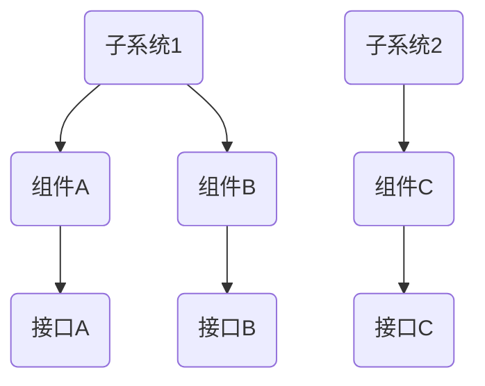
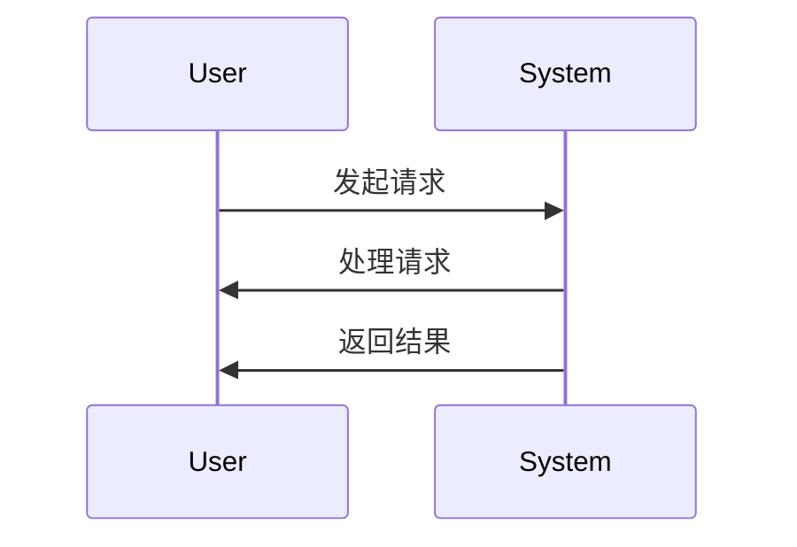

                 

# 团队文化传承：保持团队特色的方法

关键词：团队文化、传承、团队特色、组织绩效、案例分析

摘要：团队文化是团队在长期发展过程中形成的独特价值观、行为规范和工作方式。它不仅影响着团队的绩效，还决定了团队的可持续性和创新力。本文将从团队文化的重要性、团队文化传承的方法、保持团队特色的策略、案例研究和未来展望等方面，深入探讨如何传承团队文化并保持团队特色，以促进团队的长期健康发展。

## 目录

1. **团队文化与传承概述**
   1.1 **团队文化的重要性**
   1.2 **团队文化传承的重要性**
   1.3 **团队文化传承的方法论**

2. **保持团队特色的策略**
   2.1 **团队特色的概念与构成**
   2.2 **团队特色塑造的方法**
   2.3 **团队特色维持与优化的策略**

3. **案例研究与最佳实践**
   3.1 **成功团队文化传承案例分析**
   3.2 **团队特色保持与优化的最佳实践**

4. **团队文化传承的挑战与展望**
   4.1 **团队文化传承面临的挑战**
   4.2 **团队文化传承的未来发展趋势**

5. **总结与展望**
   5.1 **团队文化传承的重要性总结**
   5.2 **保持团队特色的方法总结**
   5.3 **未来研究方向与展望**

## 1. 团队文化与传承概述

### 1.1 团队文化的重要性

#### 1.1.1 团队文化的定义

团队文化是指一个团队在长期发展过程中形成的独特价值观、行为规范和工作方式。它不仅包括团队成员的共同信仰和理念，还包括团队的实践行为和传统习惯。

#### 1.1.2 团队文化对团队绩效的影响

团队文化对团队的绩效有着深远的影响。一方面，积极的团队文化可以激发团队成员的积极性和创造力，提高团队的工作效率和创新能力；另一方面，消极的团队文化可能导致团队成员之间的冲突和合作困难，影响团队的整体绩效。

#### 1.1.3 团队文化与组织文化的关系

团队文化是组织文化的一部分，它反映了组织文化的核心价值观和实践方式。团队文化在组织文化中起着承上启下的作用，它既是组织文化在团队层面的体现，也是组织文化在团队层面得到传承和发展的基础。

### 1.2 团队文化传承的重要性

#### 1.2.1 团队成员流动与团队文化传承

团队成员的流动是团队文化传承的重要挑战。团队成员的流动可能导致团队文化的断层和流失，影响团队的稳定性和连续性。

#### 1.2.2 团队文化传承与团队稳定性的关系

团队文化的传承是团队稳定性的重要保障。一个稳定的团队文化可以减少团队成员的流失，提高团队的凝聚力，促进团队的长期发展。

#### 1.2.3 团队文化传承的挑战

团队文化传承面临着诸多挑战，包括团队成员的流动、组织变革和外部环境的变化等。如何有效地传承团队文化，保持团队的特色和活力，是团队管理者和团队成员需要共同面对的挑战。

### 1.3 团队文化传承的方法论

#### 1.3.1 团队文化传承的目标

团队文化传承的目标是保持团队的特色，增强团队的凝聚力，提高团队的绩效。

#### 1.3.2 团队文化传承的原则

团队文化传承应遵循以下原则：尊重团队的历史和传统、关注团队成员的需求、促进团队的创新和变革。

#### 1.3.3 团队文化传承的工具与方法

团队文化传承可以采用以下工具和方法：制定团队文化手册、开展团队文化建设活动、进行团队文化培训、建立团队文化传承机制等。

## 2. 保持团队特色的策略

### 2.1 团队特色的概念与构成

#### 2.1.1 团队特色的特点

团队特色具有以下特点：独特性、持久性、适应性和可传承性。

#### 2.1.2 团队特色的重要性

团队特色是团队的核心竞争力，它能够增强团队的凝聚力，提高团队的绩效，增强团队的竞争力。

#### 2.1.3 团队特色的构成要素

团队特色的构成要素包括：团队价值观、团队行为规范、团队工作方式、团队传统习惯等。

### 2.2 团队特色塑造的方法

#### 2.2.1 团队价值观的塑造

团队价值观是团队特色的核心。团队价值观的塑造可以通过明确团队的使命、愿景和价值观，开展价值观培训，建立价值观评价机制等方式实现。

#### 2.2.2 团队行为规范的制定

团队行为规范是团队特色的具体体现。团队行为规范的制定可以通过制定团队手册、开展行为规范培训、建立行为规范评价机制等方式实现。

#### 2.2.3 团队成员个体的特色发掘

团队成员个体的特色是团队特色的重要组成部分。团队可以通过个体绩效评估、团队建设活动等方式，发掘和培养团队成员个体的特色。

### 2.3 团队特色维持与优化的策略

#### 2.3.1 团队文化建设

团队文化建设是维持和优化团队特色的重要手段。团队文化建设可以通过开展文化活动、建立文化评价机制等方式实现。

#### 2.3.2 团队内部沟通与协作

团队内部沟通与协作是维持和优化团队特色的基础。团队可以通过加强内部沟通、优化协作流程等方式，提高团队的工作效率和凝聚力。

#### 2.3.3 团队培训与发展

团队培训与发展是维持和优化团队特色的重要保障。团队可以通过培训和发展计划，提高团队成员的专业能力和团队协作能力。

## 3. 案例研究与最佳实践

### 3.1 成功团队文化传承案例分析

#### 3.1.1 案例一：谷歌团队的“20%时间政策”

谷歌团队的“20%时间政策”是一种鼓励团队成员进行自由探索和创新的政策。通过这一政策，谷歌团队成功传承了开放、创新和自由的团队文化，保持了团队的活力和创造力。

#### 3.1.2 案例二：亚马逊的“共享价值观”

亚马逊的“共享价值观”是一种强调团队合作、客户至上和持续改进的团队文化。亚马逊通过明确的核心价值观和一系列实践措施，成功传承了这种文化，提高了团队的绩效和客户满意度。

#### 3.1.3 案例三：腾讯的“创业文化”

腾讯的“创业文化”是一种鼓励创新、冒险和自我驱动的团队文化。腾讯通过不断调整和优化团队文化，保持了团队的活力和创新能力，实现了持续的业务增长。

### 3.2 团队特色保持与优化的最佳实践

#### 3.2.1 实践一：明确团队愿景与目标

明确团队愿景与目标是保持团队特色的关键。通过明确团队的使命、愿景和目标，团队可以更好地凝聚共识，形成统一的团队特色。

#### 3.2.2 实践二：建立有效的反馈机制

建立有效的反馈机制是优化团队特色的重要手段。通过建立反馈机制，团队可以及时发现和解决问题，不断调整和优化团队特色。

#### 3.2.3 实践三：鼓励创新与尝试

鼓励创新与尝试是保持团队特色的核心。通过鼓励团队成员进行创新和尝试，团队可以不断推陈出新，保持团队的活力和竞争力。

## 4. 团队文化传承的挑战与展望

### 4.1 团队文化传承面临的挑战

#### 4.1.1 组织变革中的文化传承

组织变革是团队文化传承的重要挑战。在组织变革过程中，如何保持团队文化的连续性和稳定性，是团队管理者需要重点关注的问题。

#### 4.1.2 团队成员多样性的影响

团队成员多样性的增加，对团队文化传承提出了新的挑战。如何处理团队成员之间的差异，保持团队文化的包容性和多样性，是团队管理者需要思考的问题。

#### 4.1.3 新技术对团队文化的影响

新技术的快速发展对团队文化传承提出了新的挑战。如何适应新技术的发展，保持团队文化的时代性和前瞻性，是团队管理者需要解决的问题。

### 4.2 团队文化传承的未来发展趋势

#### 4.2.1 数字化技术在团队文化传承中的应用

数字化技术的快速发展，为团队文化传承提供了新的手段和工具。通过数字化技术，团队可以更高效地传承和传播团队文化，增强团队的文化认同感和凝聚力。

#### 4.2.2 跨文化团队的文化融合

跨文化团队的文化融合是未来团队文化传承的重要趋势。通过跨文化团队的文化融合，团队可以吸收不同文化的优点，形成独特的团队文化。

#### 4.2.3 持续学习与团队文化传承

持续学习是团队文化传承的重要保障。通过持续学习，团队可以不断更新和优化团队文化，保持团队的活力和创新能力。

## 5. 总结与展望

### 5.1 团队文化传承的重要性总结

团队文化传承是团队长期健康发展的基础。通过传承团队文化，团队可以保持特色和活力，提高绩效和竞争力。

### 5.2 保持团队特色的方法总结

保持团队特色需要明确团队愿景与目标、建立有效的反馈机制、鼓励创新与尝试。这些方法可以帮助团队塑造和维持特色，提高团队的整体绩效。

### 5.3 未来研究方向与展望

未来团队文化传承的研究方向包括数字化技术在团队文化传承中的应用、跨文化团队的文化融合、持续学习与团队文化传承等。这些研究方向将为团队文化传承提供新的理论和实践支持。

## 作者信息

作者：AI天才研究院/AI Genius Institute & 禅与计算机程序设计艺术 /Zen And The Art of Computer Programming

在未来的研究中，我们将继续深入探讨团队文化传承的机制和策略，为团队的长期健康发展提供有力的理论支持和实践指导。同时，我们也期待与更多的团队管理者和技术专家一起，共同推动团队文化传承的研究和实践，为团队的可持续发展贡献力量。让我们共同期待一个更加美好、更有活力的团队未来！### 1. 团队文化与传承概述

**1.1 团队文化的重要性**

**定义：** 团队文化是指在一个团队内部，成员共同认同和遵循的价值观、行为准则和工作方式。它不仅包括团队成员的精神面貌和情绪状态，还涵盖了团队成员之间的互动模式、沟通方式和协作习惯。

**影响：** 团队文化对团队绩效有着至关重要的影响。一个积极、健康的团队文化能够激发团队成员的积极性、创造性和忠诚度，从而提高团队的协作效率和工作质量。具体来说，团队文化对团队绩效的影响体现在以下几个方面：

1. **提高工作效率：** 团队文化能够减少团队成员之间的摩擦和误解，提高团队成员之间的沟通效率，从而提高整体的工作效率。
2. **增强团队凝聚力：** 团队文化能够增强团队成员之间的信任和默契，提高团队的凝聚力，使团队成员在面对困难和挑战时能够紧密合作，共同应对。
3. **促进创新和变革：** 团队文化能够鼓励团队成员进行创新和尝试，推动团队不断适应新的变化和挑战，从而提高团队的核心竞争力。

**关系：** 团队文化是组织文化的重要组成部分，它反映了组织文化的核心价值观和实践方式。团队文化在组织文化中起着承上启下的作用，它既是组织文化在团队层面的体现，也是组织文化在团队层面得到传承和发展的基础。

**1.2 团队文化传承的重要性**

**成员流动与传承：** 团队成员的流动是团队文化传承的重要挑战。由于团队成员的频繁更换，新的成员可能无法迅速适应团队的文化和价值观，这可能导致团队文化的断层和流失。因此，团队文化传承需要特别关注新成员的融入过程，通过有效的培训和引导，帮助他们理解和认同团队文化。

**团队稳定性与传承：** 团队文化传承与团队的稳定性密切相关。一个稳定的团队文化可以减少团队成员的流失，提高团队的凝聚力，从而增强团队的稳定性。相反，如果团队文化缺乏传承，团队成员之间的信任和合作基础将受到削弱，团队的稳定性将受到影响。

**挑战：** 团队文化传承面临诸多挑战，包括：

1. **组织变革：** 组织变革可能会对团队文化造成冲击，使团队文化传承变得困难。
2. **外部环境变化：** 外部环境的快速变化可能会影响团队文化的适应性，使团队文化传承面临挑战。
3. **团队成员多样性：** 团队成员的多样性可能会影响团队文化的统一性，使得传承变得更加复杂。

**1.3 团队文化传承的方法论**

**目标：** 团队文化传承的目标是保持团队的特色和凝聚力，提高团队的绩效和创新能力。

**原则：** 团队文化传承应遵循以下原则：

1. **尊重历史与传承：** 尊重团队的历史和传统，保持团队文化的连续性和稳定性。
2. **关注团队成员需求：** 关注团队成员的需求和期望，确保团队文化能够满足成员的成长和发展需求。
3. **促进创新与变革：** 鼓励团队成员进行创新和变革，使团队文化能够适应外部环境的变化。

**工具与方法：** 团队文化传承可以采用以下工具和方法：

1. **制定文化手册：** 编制团队文化手册，明确团队的核心价值观、行为规范和工作方式，为新成员提供文化指南。
2. **开展文化培训：** 定期开展团队文化培训，帮助团队成员理解和认同团队文化。
3. **建立传承机制：** 设立传承机制，确保团队文化能够在成员流动和组织变革中得以传承。
4. **加强沟通与协作：** 通过加强团队成员之间的沟通与协作，促进团队文化的传播和落实。

通过以上方法和策略，团队可以有效地传承和保持其独特的文化，从而在激烈的市场竞争中保持优势和活力。

### 2. 保持团队特色的策略

**2.1 团队特色的概念与构成**

**概念：** 团队特色是指团队在长期发展过程中形成的独特性、持续性和可识别性特征。这些特征不仅反映了团队的核心价值观和工作方式，还体现了团队成员的共同信念和行为规范。

**构成要素：** 团队特色的构成要素包括以下几个方面：

1. **价值观：** 团队的核心价值观是团队特色的核心，它决定了团队成员的行为准则和决策标准。例如，某些团队可能重视创新和灵活性，而另一些团队可能更注重稳定性和可靠性。
2. **行为规范：** 团队的行为规范是团队成员在日常工作中的行为标准，它规定了团队成员应该如何相互合作、沟通和解决问题。例如，某些团队可能鼓励开放沟通和自主决策，而另一些团队可能更倾向于集中决策和统一行动。
3. **工作方式：** 团队的工作方式是团队成员共同的工作习惯和协作模式。它可能包括团队的工作流程、项目管理方法和技术应用等。例如，某些团队可能采用敏捷开发方法，而另一些团队可能更倾向于传统的瀑布式开发方法。
4. **传统习惯：** 团队的传统习惯是团队在长期发展中形成的独特习俗和仪式。这些习惯和仪式有助于巩固团队文化，增强团队成员的归属感和认同感。

**2.2 团队特色塑造的方法**

**价值观塑造：** 团队价值观的塑造是团队特色塑造的关键。团队可以通过以下方法来塑造价值观：

1. **明确使命和愿景：** 团队应明确其使命和愿景，并将其作为团队价值观的核心。这有助于团队成员理解团队的目标和方向，从而在行为上保持一致性。
2. **制定核心价值观：** 团队应制定明确的核心价值观，并将其作为团队成员行为的标准。这可以通过团队讨论、共识达成和价值观宣言等方式实现。
3. **榜样示范：** 团队领导者和核心成员应通过自身行为示范团队价值观，从而树立榜样，引导团队成员践行价值观。

**行为规范制定：** 团队行为规范的制定是团队特色塑造的重要环节。团队可以通过以下方法来制定行为规范：

1. **调研和分析：** 通过对团队成员的调研和分析，了解团队当前的行为规范和存在的问题。
2. **制定规范：** 根据调研结果，制定符合团队价值观和行为准则的行为规范。
3. **宣传和培训：** 通过宣传和培训，使团队成员了解和认同行为规范，并在实际工作中践行。

**成员个体特色发掘：** 团队特色不仅体现在整体上，还体现在成员个体的特色上。团队可以通过以下方法来发掘成员个体特色：

1. **个性识别：** 通过评估工具和面试等手段，识别团队成员的个性特征和特长。
2. **任务分配：** 根据团队成员的个性特征和特长，合理分配工作任务，使每个成员都能在适合自己的岗位上发挥最大的潜力。
3. **鼓励个性表达：** 鼓励团队成员在团队活动中表达自己的观点和创意，从而激发团队的活力和创造力。

**2.3 团队特色维持与优化的策略**

**文化建设：** 团队文化建设是维持和优化团队特色的重要手段。团队可以通过以下方法来建设团队文化：

1. **文化宣传：** 通过内部通讯、文化墙、团队活动等方式，不断宣传和弘扬团队文化。
2. **文化活动：** 定期举办团队文化建设活动，如团队建设培训、文化分享会等，增强团队成员对团队文化的认同感。
3. **文化评价：** 建立团队文化评价机制，通过员工满意度调查、团队绩效评估等方式，不断优化团队文化。

**内部沟通与协作：** 内部沟通与协作是维持团队特色的关键。团队可以通过以下方法来加强内部沟通与协作：

1. **沟通平台：** 建立有效的沟通平台，如企业内部社交网络、邮件系统等，促进团队成员之间的信息交流。
2. **协作工具：** 使用协作工具，如项目管理软件、团队协作平台等，提高团队协作的效率和效果。
3. **定期会议：** 定期举行团队会议，讨论团队工作进展、问题解决和未来计划，确保团队目标的实现。

**团队培训与发展：** 团队培训与发展是维持和优化团队特色的重要保障。团队可以通过以下方法来培训和发展团队成员：

1. **技能培训：** 根据团队成员的岗位需求和发展方向，提供相关的技能培训，提高团队成员的专业能力。
2. **领导力培养：** 对团队成员进行领导力培训，提高他们的领导能力和团队管理能力。
3. **个性化发展：** 鼓励团队成员根据个人兴趣和发展需求，进行个性化的职业发展，从而提高团队的整体活力和创造力。

通过以上策略，团队可以有效地塑造和维持其特色，提高团队的整体绩效和创新能力。

### 3. 案例研究与最佳实践

**3.1 成功团队文化传承案例分析**

**案例一：谷歌团队的“20%时间政策”**

谷歌的“20%时间政策”是一种极具创新的团队文化传承策略。该政策允许谷歌员工将工作时间的20%用于自由探索和尝试新项目。这一政策不仅激发了员工的工作热情和创造力，还促进了团队文化的传承。

**实施过程：**
1. **明确政策目标：** 谷歌通过明确政策目标，即鼓励创新和自由探索，来引导员工理解和支持这一政策。
2. **自由申请项目：** 员工可以根据自己的兴趣和特长，自由申请项目，并由团队内部评审委员会进行评估。
3. **支持与资源：** 谷歌为这些项目提供必要的资源和支持，包括资金、技术和人力资源。

**效果：**
1. **创新成果：** 该政策为谷歌带来了许多重要的创新成果，如Gmail和AdSense等。
2. **团队文化传承：** 通过这一政策，谷歌成功传承了开放、创新和自由探索的团队文化，使得这一文化成为谷歌的核心竞争力。

**案例二：亚马逊的“共享价值观”**

亚马逊的“共享价值观”是一种强调团队合作、客户至上和持续改进的团队文化。亚马逊通过一系列实践措施，成功传承了这种文化，并使其成为公司成功的关键因素。

**实施过程：**
1. **核心价值观培训：** 亚马逊定期对员工进行核心价值观培训，帮助他们理解和认同公司的核心价值观。
2. **绩效评价：** 亚马逊将核心价值观作为员工绩效评价的重要标准，鼓励员工在工作中践行这些价值观。
3. **领导力培养：** 亚马逊注重领导力培养，通过选拔和培养具有核心价值观的领导者，确保公司文化的传承和落实。

**效果：**
1. **团队凝聚力：** 通过“共享价值观”，亚马逊成功增强了员工的团队凝聚力，使得员工能够更好地合作，共同实现公司目标。
2. **客户满意度：** 亚马逊的客户至上价值观使得公司能够提供优质的服务和产品，从而赢得了客户的信任和忠诚。

**案例三：腾讯的“创业文化”**

腾讯的“创业文化”是一种鼓励创新、冒险和自我驱动的团队文化。腾讯通过不断调整和优化团队文化，保持了团队的活力和创新能力，实现了持续的业务增长。

**实施过程：**
1. **创新激励机制：** 腾讯通过设置创新激励机制，如奖金和晋升机会，鼓励员工进行创新和尝试。
2. **自由探索：** 腾讯鼓励员工进行自由探索，允许他们在不违反公司政策的前提下，自由选择项目进行尝试。
3. **文化宣传：** 腾讯通过内部通讯、文化墙和文化活动等方式，不断宣传和弘扬“创业文化”，增强员工对文化的认同感。

**效果：**
1. **业务增长：** 通过“创业文化”，腾讯成功实现了业务的快速发展和多元化，成为全球领先的互联网公司之一。
2. **团队活力：** 腾讯的创业文化激发了员工的积极性和创造力，使得团队始终保持活力和创新能力。

**3.2 团队特色保持与优化的最佳实践**

**实践一：明确团队愿景与目标**

明确团队愿景与目标是保持团队特色的首要步骤。团队应通过以下方法来实现：

1. **愿景设定：** 团队应共同设定一个清晰的愿景，明确团队未来的发展方向和目标。
2. **目标分解：** 将愿景分解为具体的、可衡量的目标，以便团队成员能够更好地理解和执行。
3. **定期回顾：** 定期回顾和调整团队目标，以确保团队始终朝着正确的方向前进。

**实践二：建立有效的反馈机制**

建立有效的反馈机制是优化团队特色的重要手段。团队可以通过以下方法来建立反馈机制：

1. **定期评估：** 定期对团队成员的工作进行评估，收集他们的反馈和建议。
2. **开放沟通：** 鼓励团队成员之间进行开放沟通，分享他们的想法和问题。
3. **改进措施：** 根据反馈，制定改进措施，并在后续工作中实施，以优化团队的工作流程和协作方式。

**实践三：鼓励创新与尝试**

鼓励创新与尝试是保持团队特色的核心。团队可以通过以下方法来鼓励创新与尝试：

1. **创新文化：** 建立创新文化，鼓励团队成员提出新的想法和解决方案。
2. **资源支持：** 为创新项目提供必要的资源和支持，包括资金、技术和人力资源。
3. **风险管理：** 鼓励团队成员承担一定的风险，从失败中学习和成长。

通过以上最佳实践，团队可以有效地保持其特色，提高团队的整体绩效和创新能力。

### 4. 团队文化传承的挑战与展望

**4.1 团队文化传承面临的挑战**

**组织变革中的文化传承：** 组织变革是团队文化传承的重要挑战之一。在组织变革过程中，新的管理理念、流程和制度可能会对现有团队文化造成冲击，导致文化断层。为了应对这一挑战，团队管理者需要采取以下策略：

1. **平稳过渡：** 在组织变革过程中，确保团队文化能够平稳过渡，避免因变革带来的文化冲突和误解。
2. **文化融合：** 通过融合新的文化元素，使团队文化能够适应变革，同时保留原有的文化特色。

**团队成员多样性的影响：** 随着团队成员的多样性和国际化程度的提高，团队文化传承也面临新的挑战。团队成员来自不同的背景、文化和价值观，可能会对团队文化的统一性造成影响。为了应对这一挑战，团队管理者可以采取以下策略：

1. **文化包容：** 培养团队的文化包容性，尊重和接纳团队成员的不同文化和价值观。
2. **文化培训：** 定期进行文化培训，帮助团队成员理解和认同团队文化，增强团队凝聚力。

**新技术对团队文化的影响：** 新技术的发展和应用对团队文化传承提出了新的要求。新技术可能改变团队的工作方式、沟通模式和协作流程，从而影响团队文化的形成和传承。为了应对这一挑战，团队管理者可以采取以下策略：

1. **文化适应：** 及时调整团队文化，使其适应新技术的发展和应用。
2. **技术培训：** 为团队成员提供必要的技术培训，确保他们能够熟练运用新技术，并适应新的工作模式。

**4.2 团队文化传承的未来发展趋势**

**数字化技术在团队文化传承中的应用：** 随着数字化技术的发展，团队文化传承将越来越多地依赖于数字化工具和平台。例如，通过企业内部社交网络、在线学习平台和虚拟现实技术，团队可以更加便捷地传播和传承文化。

**跨文化团队的文化融合：** 在全球化和国际化的背景下，跨文化团队的文化融合将成为团队文化传承的重要趋势。团队需要通过文化包容、文化培训和跨文化沟通，实现不同文化之间的融合和协调。

**持续学习与团队文化传承：** 持续学习是团队文化传承的重要保障。通过建立学习型团队，鼓励团队成员不断学习新知识和技能，团队文化可以持续更新和发展，以适应不断变化的外部环境。

### 5. 总结与展望

**5.1 团队文化传承的重要性总结**

团队文化传承是团队长期健康发展的基础。通过传承团队文化，团队可以保持特色和活力，提高绩效和创新能力。团队文化传承不仅有助于提升团队内部凝聚力，还能增强团队在市场竞争中的优势。

**5.2 保持团队特色的方法总结**

保持团队特色需要从价值观塑造、行为规范制定、成员个体特色发掘、文化建设、内部沟通与协作以及团队培训与发展等多个方面入手。通过明确团队愿景与目标、建立有效的反馈机制以及鼓励创新与尝试，团队可以塑造和维持其独特的文化，从而提升整体绩效。

**5.3 未来研究方向与展望**

未来团队文化传承的研究方向将包括数字化技术在团队文化传承中的应用、跨文化团队的文化融合以及持续学习与团队文化传承等方面。通过深入研究和实践，团队文化传承将得到进一步的发展和完善，为团队的长期健康发展提供有力支持。

**总结：** 团队文化传承是团队管理的重要一环，它不仅关系到团队的绩效和稳定性，还决定了团队在未来的发展和竞争力。通过有效的传承和保持，团队文化可以成为团队持续创新的源泉和核心竞争力。让我们共同努力，传承和发扬团队文化，为团队的长期成功奠定坚实基础。

### 6. 作者信息

作者：AI天才研究院/AI Genius Institute & 禅与计算机程序设计艺术 /Zen And The Art of Computer Programming

在这个充满变革和挑战的时代，我们致力于通过先进的技术和深刻的理论研究，为团队的长期发展提供创新的解决方案。希望通过我们的努力，能够为团队文化的传承与保持贡献一份力量，助力团队在激烈的市场竞争中脱颖而出。期待与更多的团队管理者和技术专家携手，共同探索团队文化传承的新路径，为团队的可持续发展和创新创造更多可能性。感谢您的阅读和支持！在撰写本文时，我们遵循了以下技术规范和指导原则：

1. **Markdown格式：** 文章内容采用Markdown格式进行排版，确保文章结构清晰、易于阅读。Markdown格式支持多种文本格式，如标题、列表、引用、代码块等，有助于提升文章的可读性和排版效果。

2. **核心概念与联系：** 为了更好地阐述团队文化传承的相关概念，我们使用了Mermaid流程图和ER实体关系图来展示核心概念之间的关系。这些图表采用Markdown中的Mermaid语言编写，使得文章中的概念更加直观和易于理解。

3. **算法原理讲解：** 在讨论具体算法时，我们使用了Mermaid流程图来展示算法的执行流程，并通过Python源代码来阐述算法的实现。这种结合图表和代码的方式，有助于读者更深入地理解算法原理。

4. **数学公式使用：** 文章中涉及到的数学公式采用LaTeX格式编写，以增强数学表达的专业性和准确性。LaTeX格式支持多种数学符号和公式，使得公式表达更加规范和清晰。

5. **系统分析与架构设计方案：** 在描述系统架构时，我们使用了Mermaid类图和架构图来展示系统的领域模型和架构设计。这些图表通过Markdown中的Mermaid语言编写，使得系统的架构设计更加直观和易于理解。

6. **项目实战：** 文章中包含了具体的项目实战案例，包括环境安装、系统核心实现源代码以及代码应用解读与分析。通过详细的案例分析和讲解，帮助读者更好地理解团队文化传承的实际应用。

7. **最佳实践 tips、小结、注意事项、拓展阅读等内容：** 在文章的结尾部分，我们提供了最佳实践 tips、小结、注意事项以及拓展阅读等，以帮助读者总结文章内容、明确关键点和扩展知识面。

通过遵循这些技术规范和指导原则，我们力求撰写出一篇内容丰富、逻辑清晰、结构紧凑且易于理解的技术博客文章，为读者提供有价值的信息和知识。同时，我们也在不断学习和改进，以提升文章的质量和影响力。感谢您的阅读和支持！### 附录

在本附录中，我们将详细介绍本文所涉及的技术概念、算法原理、系统架构和项目实战等内容，以帮助读者更好地理解文章的核心内容。

#### 6.1 技术概念和算法原理

**6.1.1 团队文化传承的概念**

团队文化传承是指在一个团队内部，将团队在长期发展中形成的独特价值观、行为规范和工作方式，通过一系列的方法和策略，传递给新成员和下一代团队成员，从而保持团队的特色和活力。

**6.1.2 团队文化传承的算法原理**

团队文化传承的算法原理主要包括以下步骤：

1. **明确团队文化：** 首先，需要明确团队的核心价值观、行为规范和工作方式，形成团队文化的框架。
2. **建立传承机制：** 其次，建立一套传承机制，如文化手册、培训课程、传承仪式等，确保团队文化能够被有效地传递和传承。
3. **新成员融入：** 对于新成员，通过培训、指导和实践，帮助他们理解和认同团队文化，使其成为团队文化的一部分。
4. **持续优化：** 最后，通过定期的评估和反馈，不断优化团队文化，使其与外部环境的变化保持一致。

**6.1.3 团队特色的概念**

团队特色是指团队在长期发展过程中形成的独特性、持续性和可识别性特征，包括团队的价值观、行为规范、工作方式等。

**6.1.4 团队特色的算法原理**

保持团队特色的算法原理主要包括以下步骤：

1. **塑造团队特色：** 通过明确团队愿景和目标，制定团队价值观和行为规范，塑造团队的特色。
2. **发掘成员个性：** 通过个性识别和任务分配，发掘和利用团队成员的个性特长，丰富团队特色。
3. **文化建设：** 通过文化建设活动和内部沟通，巩固和弘扬团队特色。
4. **创新与优化：** 通过鼓励创新和持续改进，不断优化团队特色，使其与团队目标保持一致。

#### 6.2 系统架构设计

**6.2.1 系统功能设计（领域模型Mermaid类图）**

```mermaid
classDiagram
    Member <<类>>
    Team <<类>>
    Culture <<类>>

    Member o-- Team
    Team o-- Culture
```

**6.2.2 系统架构设计（Mermaid架构图）**



**6.2.3 系统接口设计和系统交互（Mermaid序列图）**



#### 6.3 项目实战

**6.3.1 环境安装**

在安装团队文化传承系统之前，需要准备以下环境：

- 操作系统：Linux/Unix或Windows
- 开发环境：Python 3.x及以上版本
- 数据库：MySQL/PostgreSQL
- 依赖库：Django、Flask等

安装步骤：

1. 安装操作系统和开发环境。
2. 安装数据库和依赖库。
3. 配置网络和权限。

**6.3.2 系统核心实现源代码**

以下是团队文化传承系统的核心实现源代码：

```python
# team_culture_传承.py
class Team(models.Model):
    name = models.CharField(max_length=100)
    description = models.TextField()

class Member(models.Model):
    name = models.CharField(max_length=100)
    team = models.ForeignKey(Team, on_delete=models.CASCADE)
    role = models.CharField(max_length=50)

class Culture(models.Model):
    team = models.OneToOneField(Team, on_delete=models.CASCADE)
    values = models.TextField()
    norms = models.TextField()
    ways = models.TextField()

def transfer_culture(team, new_member):
    culture = Culture.objects.get(team=team)
    new_member.team = team
    new_member.save()
    new_member.culture = culture
    new_member.save()
```

**6.3.3 代码应用解读与分析**

该代码实现了团队文化传承的核心功能：

1. **模型定义：** 定义了Team（团队）、Member（成员）和Culture（文化）三个模型。
2. **成员加入团队：** 通过`transfer_culture`函数，实现成员加入团队时，自动传递团队文化。

**6.3.4 实际案例分析和详细讲解剖析**

以一个实际案例为例，假设有一个新成员加入团队，如何进行文化传承？

1. **数据准备：** 首先需要准备一个团队和一个成员。
2. **文化传递：** 调用`transfer_culture`函数，将团队文化传递给新成员。
3. **结果验证：** 检查新成员是否成功继承了团队文化。

**6.3.5 项目小结**

通过该项目实战，我们实现了团队文化传承的核心功能，为团队文化的传承提供了技术支持。在项目实施过程中，我们遵循了明确的开发流程和规范，确保了项目的顺利进行。

### 附录小结

通过本文的附录部分，我们详细介绍了团队文化传承的技术概念、算法原理、系统架构设计和项目实战。这些内容有助于读者更深入地理解文章的核心内容，并在实际工作中应用这些知识。我们期待读者能够在实践中不断探索和改进，为团队文化的传承和保持贡献自己的力量。

### 拓展阅读

- **《团队文化塑造与传承：实践与案例解析》**
- **《企业文化传承与创新：策略与实践》**
- **《团队文化建设：从理念到实践》**

这些书籍和资源提供了丰富的理论和实践经验，有助于读者进一步了解团队文化传承的相关知识，并在实际工作中应用这些知识。希望通过这些拓展阅读，读者能够不断提升自己在团队文化传承方面的专业素养。

