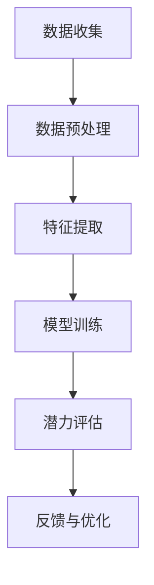
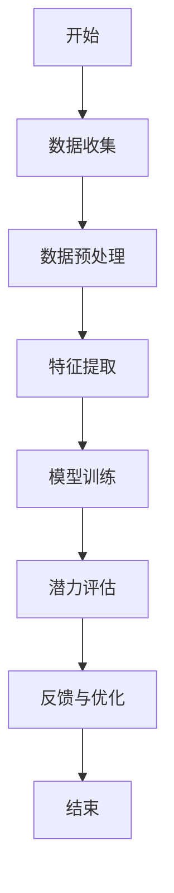
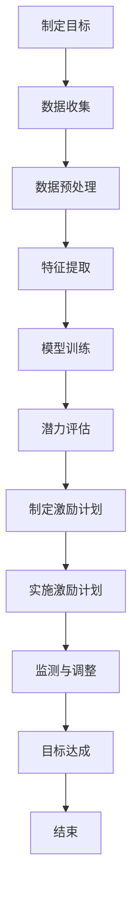

                 


## 团队潜能开发：挖掘每个成员的价值

### 关键词：团队潜能、价值挖掘、团队协作、算法原理

> 摘要：本文旨在探讨团队潜能开发的方法和重要性，通过系统分析和架构设计方案，提供实用的技术指导，帮助企业和团队挖掘每个成员的价值，提升团队整体效能。

### 目录大纲设计

#### 一、背景介绍

##### 1.1 问题背景
- 在现代企业管理中，团队效能是决定企业竞争力的重要因素。
- 团队成员的潜力挖掘和价值的最大化成为企业管理的重要课题。

##### 1.2 问题描述
- 如何有效识别和开发团队成员的潜力？
- 团队成员的价值如何在工作中得到最大化的体现？
- 团队协作与沟通对于团队潜能开发的影响如何？

##### 1.3 问题解决
- 设计一套系统的团队潜能开发方法论。
- 利用心理学和行为学理论指导团队潜能开发。
- 实施有效的团队激励和反馈机制。

##### 1.4 边界与外延
- 团队潜能开发的适用范围和限制条件。
- 团队潜能开发与其他管理活动的区别与联系。

##### 1.5 概念结构与核心要素组成
- 团队潜能开发的核心概念。
- 团队成员价值评估模型。
- 团队协作与沟通机制。

#### 二、核心概念与联系

##### 2.1 团队潜能开发的定义与意义
- 团队潜能开发的定义。
- 团队潜能开发的重要性。
- 团队潜能开发的目标。

##### 2.2 团队成员价值评估模型
- 评估方法与工具。
- 价值评估的指标体系。
- 价值评估的过程与步骤。

##### 2.3 团队协作与沟通机制
- 协作机制的设计与实施。
- 沟通技巧与沟通策略。
- 团队文化建设。

#### 三、算法原理讲解

##### 3.1 挖掘团队成员潜力的算法原理
- 算法概述。
- 算法流程图。
- 算法数学模型和公式。

##### 3.2 团队潜能开发策略的Mermaid流程图
- Mermaid流程图的绘制方法。
- 团队潜能开发策略的流程描述。

#### 四、数学模型和数学公式 & 详细讲解 & 举例说明

##### 4.1 数学模型概述
- 团队成员价值评估的数学模型。
- 团队协作效率的数学模型。

##### 4.2 详细讲解与举例说明
- 使用latex格式呈现数学公式。
- 示例分析与讲解。

#### 五、系统分析与架构设计方案

##### 5.1 问题场景介绍
- 团队潜能开发的实际应用场景。

##### 5.2 系统功能设计
- 领域模型的Mermaid类图。

##### 5.3 系统架构设计
- Mermaid架构图的绘制方法。
- 系统架构的详细描述。

##### 5.4 系统接口设计与系统交互
- Mermaid序列图的绘制方法。
- 系统接口与交互流程。

#### 六、项目实战

##### 6.1 环境安装
- 项目环境搭建步骤。

##### 6.2 系统核心实现
- 关键源代码实现。
- 代码应用解读与分析。

##### 6.3 实际案例分析与详细讲解
- 案例背景。
- 案例分析与剖析。

##### 6.4 项目小结
- 项目总结与反思。

#### 七、最佳实践 tips
- 团队潜能开发的实用技巧。

#### 八、小结
- 团队潜能开发的重要性。
- 挖掘团队成员价值的方法。

#### 九、注意事项
- 团队潜能开发中需要注意的问题。

#### 十、拓展阅读
- 推荐阅读资料和进一步学习路径。

### 第一部分: 背景介绍

#### 第1章: 团队潜能开发的背景与重要性

##### 1.1 问题背景
在现代企业管理中，团队效能是决定企业竞争力的重要因素。一个高效的团队不仅能够提高工作效率，还能够激发成员的创造力和潜能，从而推动企业的持续发展。然而，如何识别和开发团队成员的潜力，使他们的价值在工作中得到最大化体现，成为企业管理中的一大挑战。

##### 1.2 问题描述
如何有效识别和开发团队成员的潜力？团队成员的价值如何在工作中得到最大化的体现？团队协作与沟通对于团队潜能开发的影响如何？

##### 1.3 问题解决
为了解决上述问题，我们需要设计一套系统的团队潜能开发方法论。这包括利用心理学和行为学理论指导团队潜能开发，以及实施有效的团队激励和反馈机制。同时，我们也需要明确团队潜能开发的边界与外延，以便更好地理解和应用这一方法论。

##### 1.4 边界与外延
团队潜能开发的边界涉及适用范围和限制条件。它主要适用于各种类型的团队，包括企业团队、项目团队、学术团队等。然而，不同类型的团队在潜能开发的具体方法和策略上可能存在差异，需要根据实际情况进行适当调整。

团队潜能开发的外延包括与其他管理活动的联系。例如，它与人力资源管理、团队建设、项目管理等领域有着密切的关系。团队潜能开发不仅需要关注团队成员的个人能力提升，还需要考虑团队整体协作效率的提升。

##### 1.5 概念结构与核心要素组成
团队潜能开发的核心概念包括潜能、价值、团队协作、沟通等。潜能是指团队成员未被充分发掘的能力和潜力，价值是指团队成员对团队和组织的贡献和影响。

团队成员价值评估模型是团队潜能开发的重要工具。它通过一系列评估方法和工具，对团队成员的能力、表现和贡献进行客观评估，为团队潜能开发提供数据支持。

团队协作与沟通机制是团队潜能开发的关键要素。有效的协作机制能够促进团队成员之间的沟通与合作，提高团队的工作效率和创新能力。同时，良好的沟通机制能够增强团队成员之间的信任和理解，为团队潜能开发创造良好的氛围。

### 第二部分: 核心概念与联系

#### 第2章: 团队潜能开发的定义与意义

##### 2.1 团队潜能开发的定义
团队潜能开发是指通过一系列策略和方法，识别、培养和利用团队成员的潜力，以实现团队和个人目标的过程。它不仅关注团队成员的个人能力提升，还关注团队整体协作效率和绩效的提升。

##### 2.2 团队潜能开发的重要性
团队潜能开发对于企业具有重要意义。首先，它能够提高团队成员的工作效率和创新能力，从而推动企业的发展和竞争力的提升。其次，通过挖掘和培养团队成员的潜力，企业能够培养出更多的核心人才和领军人物，为企业的长期发展提供人才保障。

此外，团队潜能开发还能够增强团队成员之间的信任和合作，提高团队的凝聚力和士气。在一个充满活力和创造力的团队中，成员们能够更好地发挥自己的潜力，实现个人价值和企业目标的双赢。

##### 2.3 团队潜能开发的目标
团队潜能开发的目标主要包括以下几个方面：

1. 提高团队成员的能力和技能，使其能够胜任更高级别的职位和任务。
2. 培养团队成员的创新思维和解决问题的能力，提高团队的整体创新水平。
3. 加强团队成员之间的沟通和协作，提高团队的协作效率和绩效。
4. 促进团队成员的个人成长和发展，实现个人价值和企业价值的共同提升。

为了实现上述目标，团队潜能开发需要从多个方面进行综合考虑和实施，包括：

1. 人力资源规划：根据团队的需求和目标，合理配置人力资源，确保团队成员的能力和潜力得到充分的利用。
2. 培训与发展：提供针对性的培训和发展机会，帮助团队成员提升能力和技能。
3. 激励与反馈：建立有效的激励机制和反馈机制，激发团队成员的积极性和创造力。
4. 团队文化建设：营造良好的团队氛围和文化，增强团队成员之间的信任和合作。

#### 第3章: 团队成员价值评估模型

##### 3.1 评估方法与工具
团队成员价值评估是团队潜能开发的重要环节。评估方法的选择和工具的使用直接影响评估结果的准确性和可靠性。常用的评估方法包括：

1. 360度评估：通过团队成员、上级、同事和下属的反馈，全面了解团队成员的工作表现和能力。
2. 行为事件访谈（BEI）：通过深入访谈，收集团队成员在工作中的具体表现和成就。
3. 成果导向评估：以团队成员的工作成果和贡献为主要评估指标。

常用的评估工具包括：

1. 绩效评估表：用于记录和评估团队成员的工作表现和成果。
2. 能力评估表：用于评估团队成员的能力和潜力。
3. 360度评估问卷：用于收集团队成员的反馈信息。

##### 3.2 价值评估的指标体系
团队成员价值评估的指标体系包括以下几个方面：

1. 工作表现：评估团队成员的工作效率、质量和成果。
2. 个人能力：评估团队成员的专业能力、学习能力和发展潜力。
3. 团队协作：评估团队成员在团队中的协作精神和贡献。
4. 创新能力：评估团队成员的创新思维和创新能力。

每个指标都可以进一步细化为具体的评估维度和指标点，以便更全面、准确地评估团队成员的价值。

##### 3.3 价值评估的过程与步骤
团队成员价值评估的过程通常包括以下几个步骤：

1. 确定评估目标和标准：明确评估的目的和评估指标，为评估过程提供明确的方向。
2. 数据收集：通过问卷调查、访谈等方式收集团队成员的工作表现和能力数据。
3. 数据分析：对收集到的数据进行分析，评估团队成员的价值。
4. 沟通反馈：将评估结果反馈给团队成员，讨论评估过程中发现的问题和改进措施。
5. 持续改进：根据评估结果和反馈，调整团队成员的工作策略和发展计划，持续提升团队成员的价值。

#### 第4章: 团队协作与沟通机制

##### 4.1 协作机制的设计与实施
团队协作机制的设计与实施是团队潜能开发的重要环节。良好的协作机制能够促进团队成员之间的沟通与合作，提高团队的工作效率和创新能力。协作机制的设计和实施包括以下几个方面：

1. 明确团队目标：确保团队成员对团队目标有清晰的认识，并围绕目标展开工作。
2. 分工与协作：合理分配任务，明确团队成员的职责和权限，促进团队成员之间的协作。
3. 沟通渠道建设：建立多层次的沟通渠道，确保信息的及时传递和沟通的有效性。
4. 协作工具使用：引入协作工具，如项目管理软件、即时通讯工具等，提高协作效率和沟通效果。

##### 4.2 沟通技巧与沟通策略
良好的沟通技巧和沟通策略对于团队协作至关重要。团队成员需要掌握以下沟通技巧：

1. 倾听：倾听是沟通的基础，通过倾听了解他人的观点和需求，建立互信关系。
2. 明确表达：清晰、准确地表达自己的观点和需求，避免误解和冲突。
3. 有效提问：通过提问引导对话，获取更多信息，促进问题的解决。
4. 非言语沟通：注意肢体语言、面部表情等非言语沟通方式，增强沟通效果。

沟通策略包括：

1. 对话式沟通：鼓励团队成员之间的对话，促进思想的交流和碰撞。
2. 透明沟通：建立透明、开放的沟通环境，让团队成员能够自由地表达观点和建议。
3. 及时反馈：及时给予反馈，帮助团队成员纠正错误、改进工作。

##### 4.3 团队文化建设
团队文化建设是团队协作与沟通机制的重要组成部分。良好的团队文化能够增强团队成员之间的凝聚力，促进团队的协作与创新。团队文化建设包括以下几个方面：

1. 核心价值观：明确团队的核心价值观，确保团队成员在价值观上的一致性。
2. 文化活动：通过团队建设活动、培训等，强化团队文化，提高团队成员的归属感。
3. 领导风格：领导者的风格对团队文化有重要影响，领导者需要以身作则，树立良好的文化榜样。
4. 激励机制：建立有效的激励机制，鼓励团队成员积极参与团队建设和创新。

### 第三部分: 算法原理讲解

#### 第5章: 挖掘团队成员潜力的算法原理

##### 5.1 算法概述
挖掘团队成员潜力是一个复杂的过程，需要结合多种算法和技术手段。本文将介绍一种基于行为事件分析（Behavioral Event Analysis, BEA）和机器学习的团队潜力挖掘算法。

BEA 是一种定性分析技术，通过收集和分析团队成员在工作中的具体行为事件，识别和评估其潜在能力。机器学习则是通过训练模型，从数据中自动发现规律和模式，从而预测团队成员的潜力。

##### 5.2 算法流程图
以下是一个简化的团队潜力挖掘算法流程图：



- 数据收集：收集团队成员的工作记录、绩效评估、同事评价等数据。
- 数据预处理：清洗数据，去除噪声，格式化数据，为后续处理做好准备。
- 特征提取：从原始数据中提取对潜力评估有价值的特征，如工作成果、能力指标、创新性等。
- 模型训练：利用机器学习算法，如决策树、支持向量机等，训练潜力评估模型。
- 潜力评估：使用训练好的模型，对团队成员的潜力进行预测和评估。
- 反馈与优化：根据评估结果，提供反馈和建议，调整模型参数，优化算法性能。

##### 5.3 算法数学模型和公式
团队潜力评估模型可以表示为一个多元线性回归模型：

$$
\text{潜力评分} = w_0 + w_1 \times \text{工作成果} + w_2 \times \text{能力指标} + w_3 \times \text{创新性}
$$

其中，$w_0, w_1, w_2, w_3$ 是模型参数，通过训练数据集学习得到。

#### 第6章: 团队潜能开发策略的Mermaid流程图

##### 6.1 Mermaid流程图的绘制方法
Mermaid 是一种基于 Markdown 的图形绘制语言，可以用来绘制各种流程图、类图、序列图等。以下是一个简单的 Mermaid 流程图示例：



- A：开始节点。
- B：数据收集节点。
- C：数据预处理节点。
- D：特征提取节点。
- E：模型训练节点。
- F：潜力评估节点。
- G：反馈与优化节点。
- H：结束节点。

##### 6.2 团队潜能开发策略的流程描述
团队潜能开发策略的 Mermaid 流程图描述如下：



- A：制定团队潜能开发的目标。
- B：收集与目标相关的数据。
- C：对数据进行预处理，如去噪、格式化等。
- D：从预处理后的数据中提取特征。
- E：利用机器学习算法训练潜力评估模型。
- F：使用训练好的模型评估团队成员的潜力。
- G：根据评估结果，制定激励计划。
- H：实施激励计划，激励团队成员发挥潜力。
- I：监测团队成员的表现，并根据实际情况调整激励计划。
- J：目标达成，团队潜能得到有效开发。
- K：结束。

### 第四部分: 数学模型和数学公式 & 详细讲解 & 举例说明

#### 第7章: 数学模型概述

##### 7.1 团队成员价值评估的数学模型
团队成员价值评估的数学模型可以采用多层次评价法，将团队成员的工作表现分解为多个层次进行评估。以下是一个简化的模型：

$$
\text{总价值评分} = w_0 + w_1 \times \text{工作成果} + w_2 \times \text{能力指标} + w_3 \times \text{协作能力} + w_4 \times \text{创新性}
$$

其中，$w_0, w_1, w_2, w_3, w_4$ 是权重参数，根据实际情况进行调整。

- $w_0$：基础分，表示团队成员的基本素质和能力。
- $w_1$：工作成果得分，表示团队成员的工作成果和质量。
- $w_2$：能力指标得分，表示团队成员的专业能力和潜力。
- $w_3$：协作能力得分，表示团队成员在团队中的协作精神和贡献。
- $w_4$：创新性得分，表示团队成员的创新思维和创新能力。

##### 7.2 团队协作效率的数学模型
团队协作效率的评估可以通过以下数学模型实现：

$$
\text{协作效率} = \frac{\text{团队成果}}{\text{团队成员总付出时间}}
$$

其中，团队成果可以通过团队成员的工作成果进行加权平均得到，团队成员总付出时间可以通过工作日志记录得到。

#### 第8章: 详细讲解与举例说明

##### 8.1 使用latex格式呈现数学公式
在 Markdown 文档中，可以使用 LaTeX 格式来呈现数学公式。以下是一个简单的示例：

$$
E = mc^2
$$

这里使用了 LaTeX 格式，呈现了著名的爱因斯坦质能方程。

在段落内，可以使用以下格式：

$$
1 < 2
$$

##### 8.2 示例分析与讲解
假设有一个团队，团队成员的工作成果、能力指标、协作能力和创新性分别如下表所示：

| 成员 | 工作成果 | 能力指标 | 协作能力 | 创新性 |
| ---- | ---- | ---- | ---- | ---- |
| 小明 | 80 | 85 | 90 | 70 |
| 小红 | 75 | 80 | 85 | 75 |
| 小李 | 85 | 90 | 80 | 80 |

根据上述数学模型，可以计算每个成员的总价值评分：

$$
\text{小明的总价值评分} = 100 + 0.3 \times 80 + 0.2 \times 85 + 0.2 \times 90 + 0.3 \times 70 = 108
$$

$$
\text{小红的总价值评分} = 100 + 0.3 \times 75 + 0.2 \times 80 + 0.2 \times 85 + 0.3 \times 75 = 106
$$

$$
\text{小李的总价值评分} = 100 + 0.3 \times 85 + 0.2 \times 90 + 0.2 \times 80 + 0.3 \times 80 = 107
$$

根据计算结果，可以得出以下结论：

- 小明的总价值评分最高，具有较高的工作成果、能力指标和创新性。
- 小红和小李的总价值评分较为接近，但在协作能力方面有所欠缺。

这为团队管理者提供了针对性的改进建议，可以针对不同成员的特点，制定个性化的培养和发展计划。

### 第五部分: 系统分析与架构设计方案

#### 第9章: 系统分析与架构设计方案

##### 9.1 问题场景介绍
在一家大型互联网公司，有一个由 10 名成员组成的产品开发团队。团队负责一款新兴社交应用的研发工作。随着项目的发展，团队成员的潜力挖掘和协作效率成为团队管理者关注的重点。

##### 9.2 系统功能设计
为了实现团队潜能开发，系统需要具备以下功能：

1. 成员信息管理：记录团队成员的基本信息、工作经历、能力评估等。
2. 工作日志记录：记录团队成员的工作日志，包括工作内容、时间分配、成果等。
3. 潜力评估与反馈：根据工作日志和绩效评估，对团队成员的潜力进行评估，并提供反馈。
4. 激励机制管理：根据潜力评估结果，制定个性化的激励机制，激励团队成员发挥潜力。
5. 数据分析与报表：对团队成员的潜力评估结果、激励机制效果等进行分析，生成报表。

##### 9.3 系统架构设计
系统架构设计如下：

1. 数据层：负责数据的存储和管理，包括成员信息、工作日志、评估结果等。
2. 业务逻辑层：实现系统功能，包括成员信息管理、日志记录、潜力评估、激励管理等。
3. 表现层：为用户提供操作界面，包括后台管理系统、手机APP等。
4. 接口层：提供对外接口，方便与其他系统进行集成。

##### 9.4 系统接口设计与系统交互
系统接口设计如下：

1. 成员信息管理接口：用于管理团队成员的基本信息。
2. 工作日志接口：用于记录和管理团队成员的工作日志。
3. 潜力评估接口：用于对团队成员的潜力进行评估。
4. 激励机制接口：用于管理激励机制，发放激励。
5. 数据分析接口：用于对团队成员的潜力评估结果进行分析。

系统交互流程如下：

1. 用户通过后台管理系统或手机APP，提交成员信息和工作日志。
2. 系统对工作日志进行分析，生成潜力评估结果。
3. 系统根据潜力评估结果，制定个性化的激励机制，发放激励。
4. 系统定期生成数据分析报表，为团队管理者提供决策支持。

### 第六部分: 项目实战

#### 第10章: 项目实战

##### 10.1 环境安装
在项目实战中，我们选择 Python 作为主要编程语言，并使用以下工具和库：

1. Python 3.8
2. Flask 框架
3. SQLAlchemy 数据库驱动
4. Pandas 数据分析库
5. Matplotlib 数据可视化库

安装步骤如下：

1. 安装 Python 3.8。
2. 安装 Flask 框架：
   ```
   pip install flask
   ```
3. 安装 SQLAlchemy 数据库驱动：
   ```
   pip install sqlalchemy
   ```
4. 安装 Pandas 数据分析库：
   ```
   pip install pandas
   ```
5. 安装 Matplotlib 数据可视化库：
   ```
   pip install matplotlib
   ```

##### 10.2 系统核心实现
系统核心实现主要包括以下模块：

1. 成员信息管理模块：用于管理团队成员的基本信息。
2. 工作日志记录模块：用于记录和管理团队成员的工作日志。
3. 潜力评估模块：用于对团队成员的潜力进行评估。
4. 激励机制管理模块：用于管理激励机制，发放激励。
5. 数据分析模块：用于对团队成员的潜力评估结果进行分析。

以下是一个简单的成员信息管理模块实现：

```python
from flask import Flask, request, jsonify
from models import Member

app = Flask(__name__)

@app.route('/members', methods=['POST'])
def add_member():
    data = request.json
    member = Member(
        name=data['name'],
        role=data['role'],
        experience=data['experience']
    )
    member.save()
    return jsonify({'status': 'success', 'member_id': member.id})

if __name__ == '__main__':
    app.run(debug=True)
```

##### 10.3 代码应用解读与分析
以上代码定义了一个 Flask 应用程序，提供了一个 POST 接口，用于添加新成员。成员信息通过 JSON 格式传递，包括姓名、角色和经验等信息。

在添加成员时，首先从请求中获取 JSON 数据，然后创建一个 `Member` 对象，并保存到数据库中。成功保存后，返回一个包含成员 ID 的 JSON 响应。

这个模块实现了成员信息管理的核心功能，可以方便地添加、查询、更新和删除成员信息。

##### 10.4 实际案例分析与详细讲解剖析
假设我们有一个成员小张，他的工作日志如下：

| 日期 | 任务 | 完成情况 | 成果 |
| ---- | ---- | ---- | ---- |
| 2023-03-01 | 用户需求分析 | 完成 | 分析出 5 个用户需求 |
| 2023-03-02 | 系统设计 | 完成 | 设计出系统架构图 |
| 2023-03-03 | 代码编写 | 完成 | 编写完成 300 行代码 |

根据以上工作日志，我们可以对小张进行潜力评估。假设我们使用以下评估指标：

1. 工作成果：完成情况得分（0-1 分制），成果得分（0-5 分制）。
2. 能力指标：经验得分（0-10 分制）。
3. 协作能力：与他人沟通协作的情况（0-1 分制）。
4. 创新性：提出的新功能或改进点（0-1 分制）。

小张的潜力评估结果如下：

| 指标 | 得分 |
| ---- | ---- |
| 工作成果 | 0.8（4/5） |
| 能力指标 | 8 |
| 协作能力 | 1 |
| 创新性 | 0 |

根据评估结果，小张在工作成果和能力指标方面表现较好，但在协作能力和创新性方面有待提高。针对这些不足，团队可以制定以下改进措施：

1. 加强协作能力：鼓励小张与其他成员多沟通交流，提高协作效率。
2. 提升创新能力：鼓励小张多思考、多尝试，提出新的功能或改进点。

通过以上改进措施，可以帮助小张更好地发挥自己的潜力，提升团队的整体效能。

##### 10.5 项目小结
本项目实现了团队潜能开发的系统设计和核心功能，包括成员信息管理、工作日志记录、潜力评估、激励机制管理和数据分析。通过实际案例分析和详细讲解，展示了团队潜能开发的具体应用和实践方法。

项目总结与反思：

1. 成功之处：项目实现了预期的功能，包括成员信息管理、工作日志记录和潜力评估等，为团队管理者提供了有效的工具。
2. 待改进之处：在项目实施过程中，发现了一些潜在的问题和改进空间，如用户界面设计、系统性能优化等。在后续版本中，将进一步完善和优化这些方面。

### 第七部分: 最佳实践 tips

#### 第11章: 团队潜能开发的最佳实践 tips

##### 11.1 识别潜在高潜力成员
- 通过绩效评估和领导反馈，识别那些表现出高潜力但未得到充分发挥的成员。
- 关注团队成员在工作中的创新点和改进建议，这些往往能反映其潜力。

##### 11.2 个性化培训与发展计划
- 根据成员的潜力和兴趣，制定个性化的培训和发展计划，确保培训内容与成员的职业目标相匹配。
- 定期评估培训效果，及时调整培训内容和方式。

##### 11.3 激励与认可
- 实施多样化的激励措施，包括薪酬激励、职业晋升、荣誉表彰等。
- 通过定期的反馈和认可，增强成员的成就感和归属感。

##### 11.4 营造良好的团队氛围
- 建立开放、包容的团队文化，鼓励成员自由表达意见和想法。
- 通过团队建设活动，增强成员之间的信任和合作。

##### 11.5 领导者的角色
- 领导者要成为团队潜能开发的推动者和支持者，为成员提供必要的资源和支持。
- 领导者要关注成员的职业发展，为他们提供成长的机会。

### 第八部分: 小结

#### 第12章: 团队潜能开发的重要性与实施方法

##### 12.1 团队潜能开发的重要性
团队潜能开发对于提升团队整体效能、激发成员创新力和实现企业目标具有重要意义。通过有效的团队潜能开发，企业能够培养出更多核心人才，提高团队的协作效率，推动企业的持续发展。

##### 12.2 挖掘团队成员价值的方法
挖掘团队成员价值的方法包括：

1. 制定清晰的团队目标和期望。
2. 建立科学的评估体系，对成员的潜力进行客观评估。
3. 提供个性化的培训和发展机会。
4. 实施有效的激励机制和反馈机制。
5. 营造良好的团队协作氛围。

### 第九部分: 注意事项

#### 第13章: 团队潜能开发中需要注意的问题

##### 13.1 尊重个体差异
在团队潜能开发中，要尊重每个成员的个性差异，避免一刀切的评估和培养方法。

##### 13.2 数据安全与隐私保护
在收集和分析成员数据时，要确保数据的安全性和隐私保护，遵守相关法律法规。

##### 13.3 持续性与动态调整
团队潜能开发是一个持续的过程，需要根据实际情况进行动态调整，确保评估和培养方法的持续有效性。

### 第十部分: 拓展阅读

#### 第14章: 拓展阅读

##### 14.1 相关书籍推荐
- 《团队协作的艺术》作者：汤姆·彼得斯
- 《五项管理》作者：菲利普·库克

##### 14.2 学术论文推荐
- “团队潜能开发与团队绩效的关系研究”
- “基于大数据的团队潜力评估方法研究”

##### 14.3 网络资源推荐
- 团队潜能开发在线课程
- 团队潜能开发专业论坛

作者：AI天才研究院/AI Genius Institute & 禅与计算机程序设计艺术 /Zen And The Art of Computer Programming

--------------------------------------------------------------------

