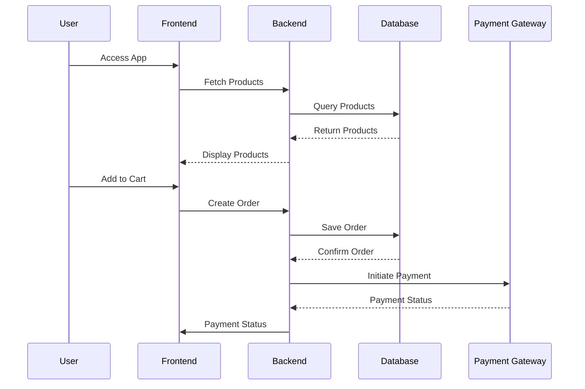

                 

# 团队潜能开发：挖掘每个成员的最大价值

> 关键词：团队潜能开发、成员潜力、培训计划、沟通协调、激励机制

> 摘要：本文将深入探讨团队潜能开发的重要性，分析团队潜能开发的背景、问题描述和解决方法。通过识别成员潜力、提升成员技能、优化团队结构、促进沟通和建立激励机制，本文将提供一套系统化的团队潜能开发方案，以挖掘每个成员的最大价值，提高团队整体效能。

## 第1章: 引言与团队潜能开发背景

### 1.1 问题背景

在当今竞争激烈的商业环境中，企业的成功往往依赖于团队的整体效能。然而，许多团队面临着成员潜能未能充分发挥的问题。这不仅导致资源浪费，还可能阻碍企业的发展。因此，挖掘每个团队成员的最大价值成为了一个亟待解决的问题。

### 1.2 问题描述

团队潜能开发涉及多个方面，包括个人技能、团队合作、沟通协调和领导力等。每个成员都有自己的特长和潜力，但这些潜力往往因种种原因未能得到有效发挥。主要问题包括：

- 技能不足：团队成员可能缺乏完成特定任务所需的技能。
- 沟通障碍：团队内部沟通不畅，导致信息传递不完整或误解。
- 角色不清：团队成员对自己的角色和职责认知不清，导致工作重叠或责任逃避。
- 缺乏激励：团队成员可能缺乏动力，无法充分发挥自己的潜力。

### 1.3 问题解决

解决团队潜能开发问题需要系统性的方法。以下是一些关键步骤：

- 识别成员潜力：通过评估和观察，了解每个团队成员的特长和潜在能力。
- 提供培训机会：为团队成员提供相关培训，帮助他们提升技能。
- 优化团队结构：确保团队成员的角色和职责明确，避免工作重叠。
- 促进沟通：建立有效的沟通机制，确保信息流畅传递。
- 建立激励机制：设计合理的激励机制，激发团队成员的工作热情。

### 1.4 边界与外延

团队潜能开发不仅仅局限于提升个人技能，还包括提升团队合作能力、领导力等方面。此外，它还涉及到组织文化的塑造和团队目标的明确。

### 1.5 概念结构与核心要素组成

- **团队成员**：团队中的每个个体，包括领导者、普通成员和实习生。
- **潜能**：团队成员尚未完全发挥的能力。
- **开发**：通过一系列方法和措施，挖掘和提升团队成员的潜能。

### 1.6 本章小结

通过本章的介绍，我们对团队潜能开发的背景、问题和解决方法有了初步的了解。接下来，本文将深入探讨如何识别成员潜力、提供培训机会、优化团队结构、促进沟通和建立激励机制，以实现团队潜能的最大化。

----------------------------------------------------------------

## 第2章: 识别成员潜力

### 2.1 评估方法

#### 2.1.1 能力评估

- **技能测试**：通过具体任务或项目来评估成员的专业技能。这可以包括编程能力、项目管理能力、数据分析能力等。
  - **编程能力测试**：可以设计一些实际的编程问题，评估成员的编程能力和解决问题的能力。
  - **项目管理能力测试**：可以模拟一个项目，让成员参与其中，评估他们的项目管理技能，如时间管理、资源分配和风险管理。
  - **数据分析能力测试**：可以提供一些数据集，让成员进行数据分析和数据可视化，评估他们的数据分析能力。

- **心理测评**：使用心理测评工具，如MBTI、DISC等，了解成员的性格特点。
  - **MBTI测评**：通过MBTI测评，可以了解成员的个性类型，有助于团队成员之间的相互理解和沟通。
  - **DISC测评**：通过DISC测评，可以了解成员的行为风格，有助于团队成员之间的协作和合作。

#### 2.1.2 绩效评估

- **目标设定**：为每个成员设定可量化的绩效目标。这些目标应该与团队的整体目标一致，并且是可实现的。
  - **绩效目标设定**：例如，一个开发人员的绩效目标可以是每月完成三个功能模块的开发，并且确保代码质量达到标准。

- **定期考核**：通过定期考核，评估成员的绩效表现。考核可以采用360度反馈的方式，包括同事评价、上级评价和自我评价。
  - **绩效考核**：例如，每月进行一次绩效考核，根据成员的绩效目标完成情况进行评分。

### 2.2 观察方法

#### 2.2.1 工作表现观察

- **日常工作**：通过观察成员的日常工作表现，了解他们的工作态度和能力。例如，一个项目经理的日常工作表现包括会议组织、任务分配和进度跟进。
  - **日常工作观察**：例如，观察项目经理是否能够有效地组织会议，确保团队成员能够按时完成任务。

- **项目合作**：在团队项目中观察成员的合作能力和解决问题的能力。例如，一个开发人员在项目中的表现包括代码质量、沟通能力和问题解决能力。
  - **项目合作观察**：例如，观察开发人员是否能够与设计师和测试人员有效沟通，确保项目的顺利进行。

#### 2.2.2 反馈与沟通

- **同事反馈**：收集同事对成员的评价，了解成员在团队合作中的表现。这可以通过定期反馈会议或匿名调查表进行。
  - **同事反馈**：例如，通过同事反馈了解一个开发人员的代码质量和团队合作能力。

- **领导反馈**：获取上级对成员的评价，作为评估成员潜力的参考。这可以通过定期的一对一会议或上级评估报告进行。
  - **领导反馈**：例如，通过领导反馈了解一个项目经理的项目管理能力和领导力。

### 2.3 数据分析与报告

#### 2.3.1 数据收集

- **绩效考核数据**：收集成员的绩效考核结果，作为评估潜力的依据。这些数据可以包括成员的绩效评分、项目完成情况和工作量等。
  - **绩效考核数据**：例如，收集一个开发人员过去三个月的绩效考核数据，包括每月完成的代码量、项目进度和代码质量等。

- **工作日志**：记录成员的工作日志，用于分析工作表现。工作日志可以记录成员每天的工作内容、遇到的问题和解决方案等。
  - **工作日志**：例如，记录一个项目经理每天的工作内容和会议记录，以便分析其工作表现和沟通能力。

#### 2.3.2 报告撰写

- **潜力分析报告**：撰写潜力分析报告，详细阐述成员的潜力评估结果。报告应包括成员的评估方法、评估结果和建议等。
  - **潜力分析报告**：例如，一个关于开发人员潜力分析的报告，包括其技能评估结果、绩效评估结果和改进建议。

### 2.4 成果反馈与跟进

#### 2.4.1 成果反馈

- **个人反馈**：向成员反馈评估结果，明确他们的潜力所在。这可以通过一对一会议或反馈邮件进行。
  - **个人反馈**：例如，通过一对一会议向一个开发人员反馈其技能评估结果和绩效评估结果。

- **团队反馈**：与团队分享评估结果，促进团队成员之间的相互了解。这可以通过团队会议或团队邮件进行。
  - **团队反馈**：例如，在团队会议上分享一个项目经理的评估结果，让团队成员了解其工作表现和潜力。

#### 2.4.2 跟进措施

- **培训计划**：根据评估结果，制定相应的培训计划。这可以包括专业技能培训、领导力培训等。
  - **培训计划**：例如，根据一个开发人员的技能评估结果，制定一个编程技能提升计划。

- **职业发展规划**：为成员制定职业发展规划，助力他们提升潜力。这可以包括短期目标和长期目标的设定，以及相应的行动计划。
  - **职业发展规划**：例如，为一个项目经理制定一个三年职业发展规划，包括领导力提升、项目管理能力提升等。

### 2.5 本章小结

通过本章的内容，我们了解了如何通过评估方法和观察方法来识别成员的潜力。识别成员潜力是团队潜能开发的基础，对于后续的培训、激励和职业发展规划具有重要意义。

----------------------------------------------------------------

## 第3章: 提升成员技能

### 3.1 培训计划设计

#### 3.1.1 需求分析

- **个人需求**：通过评估结果，了解每个成员的培训需求。这包括他们在专业技能、领导力、沟通能力等方面的提升需求。
  - **个人需求分析**：例如，通过评估结果，发现一个开发人员需要提升项目管理能力和领导力。

- **团队需求**：分析团队整体的发展需求，确保培训计划的全覆盖。这包括团队在技术能力、团队协作、领导力等方面的提升需求。
  - **团队需求分析**：例如，通过团队评估结果，发现团队需要提升沟通能力和协作能力。

#### 3.1.2 培训计划制定

- **技能提升培训**：为成员制定技能提升培训计划，包括编程技能、项目管理技能、领导力技能等。
  - **编程技能培训**：例如，为开发人员提供编程语言的深度学习和实战项目。
  - **项目管理技能培训**：例如，为项目经理提供项目管理知识的培训，如PMP认证课程。
  - **领导力技能培训**：例如，为领导者和潜力领导者提供领导力提升课程，如影响力领导力培训。

- **团队协作培训**：为团队制定团队协作培训计划，提升团队成员之间的沟通和协作能力。
  - **沟通技巧培训**：例如，为团队成员提供有效的沟通技巧培训，如非暴力沟通。
  - **协作工具培训**：例如，为团队成员提供协作工具的培训，如JIRA、Trello的使用。

#### 3.1.3 培训计划执行与评估

- **培训计划执行**：按照制定的培训计划，组织培训活动，确保成员积极参与。
  - **培训活动组织**：例如，定期组织内部培训课程，邀请外部专家进行讲座。

- **培训效果评估**：通过培训后评估，了解培训效果，为后续培训计划提供参考。
  - **培训效果评估**：例如，通过问卷调查、考试等方式，了解成员对培训的满意度，评估培训效果。

### 3.2 实战训练与项目实践

#### 3.2.1 实战训练

- **技能实战训练**：通过实际项目或模拟项目，让成员进行技能实战训练，提升实际操作能力。
  - **实战训练项目**：例如，组织成员参与一个实际项目，要求他们独立完成特定的任务。

#### 3.2.2 项目实践

- **项目实践**：将成员分配到实际项目中，让他们参与项目的全过程，提升项目管理和团队合作能力。
  - **项目实践过程**：例如，为项目经理分配一个实际项目，要求他们负责项目的整体管理和协调工作。

### 3.3 反馈与改进

#### 3.3.1 反馈收集

- **成员反馈**：收集成员对培训和实践的反馈，了解他们的感受和建议。
  - **成员反馈收集**：例如，通过定期的反馈会议或在线问卷，收集成员的反馈。

#### 3.3.2 改进措施

- **培训改进**：根据成员的反馈，对培训计划进行改进，提高培训质量。
  - **培训改进措施**：例如，根据成员的反馈，增加实战训练的项目数量，提高实战训练的难度。

- **项目改进**：根据项目的实际运行情况，对项目流程和团队协作进行改进，提高项目效率。
  - **项目改进措施**：例如，根据项目的运行情况，调整团队成员的角色分配，优化项目进度。

### 3.4 本章小结

通过本章的内容，我们了解了如何设计培训计划、执行实战训练和项目实践，以及收集反馈和进行改进。提升成员技能是团队潜能开发的重要一环，通过系统化的培训和实战训练，可以显著提升团队成员的能力，为团队的整体效能提升奠定基础。

----------------------------------------------------------------

## 第4章: 优化团队结构

### 4.1 团队角色定义

#### 4.1.1 角色分析

- **明确职责**：为每个团队成员定义明确的职责和角色，确保每个人都知道自己的工作内容和目标。
  - **职责定义**：例如，一个开发人员的职责可以是编写代码、修复bug和参与技术评审。

- **技能匹配**：确保团队成员的技能与职责相匹配，避免因技能不足或过剩导致的工作效率低下。
  - **技能匹配**：例如，将具有项目管理技能的开发人员分配到项目管理角色。

#### 4.1.2 角色调整

- **定期评估**：定期对团队成员的角色和职责进行评估，根据团队和个人的发展需求进行调整。
  - **角色评估**：例如，每年进行一次角色评估，根据成员的技能提升和团队需求进行角色调整。

### 4.2 团队规模调整

#### 4.2.1 团队规模分析

- **规模优化**：根据项目的需求和团队成员的能力，优化团队规模，确保团队人数与项目需求相匹配。
  - **规模优化**：例如，如果项目复杂度较高，可以增加团队成员数量，以提升项目效率。

#### 4.2.2 团队规模调整

- **灵活调整**：根据项目的进展和团队的表现，灵活调整团队规模，以应对项目变化和团队发展需求。
  - **规模调整**：例如，在项目初期可以增加团队成员，以提高项目启动速度；在项目后期可以减少团队成员，以优化项目成本。

### 4.3 沟通协调机制

#### 4.3.1 沟通渠道

- **建立有效的沟通渠道**：确保团队成员之间的沟通畅通无阻，避免信息传递中的误解和遗漏。
  - **沟通渠道**：例如，建立定期团队会议、即时通讯工具和邮件列表。

#### 4.3.2 沟通协调

- **沟通协调**：定期进行沟通协调，解决团队内部出现的冲突和问题，确保团队目标的顺利实现。
  - **沟通协调**：例如，通过团队会议或个别交流，解决团队成员之间的分歧和问题。

### 4.4 激励机制

#### 4.4.1 激励原则

- **公平公正**：建立公平公正的激励机制，确保每个团队成员都能感受到自己的努力和贡献被认可和奖励。
  - **公平公正**：例如，根据团队成员的工作表现和绩效评估结果，给予相应的奖励和晋升机会。

#### 4.4.2 激励措施

- **物质激励**：通过奖金、提成、股权等物质激励措施，激发团队成员的工作热情和创造力。
  - **物质激励**：例如，根据项目完成情况和团队目标实现情况，发放项目奖金。

- **精神激励**：通过荣誉表彰、培训机会、职业发展规划等精神激励措施，提升团队成员的职业满意度和工作积极性。
  - **精神激励**：例如，对在工作中表现出色的成员进行表彰，并提供职业发展的培训机会。

### 4.5 本章小结

通过本章的内容，我们了解了如何优化团队结构，包括团队角色定义、团队规模调整、沟通协调机制和激励机制。优化团队结构是团队潜能开发的重要一环，通过系统化的优化措施，可以提升团队的整体效能，挖掘每个成员的最大价值。

----------------------------------------------------------------

## 第5章: 促进沟通与协作

### 5.1 沟通障碍分析

#### 5.1.1 沟通障碍识别

- **沟通障碍识别**：通过问卷调查、访谈等方式，识别团队中存在的沟通障碍，如语言障碍、文化差异、信息传递不完整等。
  - **沟通障碍识别**：例如，通过问卷调查了解团队成员在沟通中遇到的问题和挑战。

#### 5.1.2 沟通障碍分类

- **沟通障碍分类**：根据沟通障碍的性质，将其分为语言障碍、文化障碍、信息传递障碍等，以便有针对性地解决。
  - **语言障碍**：例如，团队成员之间的语言表达不清，导致误解和冲突。
  - **文化障碍**：例如，不同文化背景的团队成员在沟通中可能存在价值观和行为方式的差异。
  - **信息传递障碍**：例如，信息传递过程中出现的信息失真或遗漏，导致团队成员对任务的误解。

### 5.2 沟通策略

#### 5.2.1 沟通渠道选择

- **沟通渠道选择**：根据团队的特点和沟通需求，选择合适的沟通渠道，如面对面会议、电子邮件、即时通讯工具等。
  - **沟通渠道选择**：例如，对于重要的决策和项目进展，可以采用面对面会议的形式；对于日常交流和任务通知，可以采用即时通讯工具。

#### 5.2.2 沟通技巧提升

- **沟通技巧提升**：通过培训和实践，提升团队成员的沟通技巧，如有效倾听、清晰表达、情绪管理等。
  - **沟通技巧提升**：例如，组织沟通技巧培训课程，提高团队成员的沟通能力。

### 5.3 协作工具与平台

#### 5.3.1 协作工具选择

- **协作工具选择**：根据团队的工作流程和协作需求，选择合适的协作工具，如项目管理系统、文档共享工具、即时通讯工具等。
  - **协作工具选择**：例如，选择JIRA作为项目管理工具，Trello作为任务管理工具，Slack作为即时通讯工具。

#### 5.3.2 协作平台搭建

- **协作平台搭建**：搭建一个高效的协作平台，整合各类协作工具和资源，提供统一的协作界面和流程。
  - **协作平台搭建**：例如，建立一个内部协作网站，集成项目管理、文档管理、知识库等功能。

### 5.4 激励与反馈

#### 5.4.1 激励措施

- **激励措施**：通过设立合理的激励机制，激发团队成员的协作热情和积极性。
  - **激励措施**：例如，设立团队协作奖，对在团队协作中表现出色的成员给予奖励。

#### 5.4.2 反馈机制

- **反馈机制**：建立有效的反馈机制，鼓励团队成员之间进行积极反馈，提升协作效率和效果。
  - **反馈机制**：例如，定期进行团队协作反馈会议，收集团队成员的意见和建议。

### 5.5 本章小结

通过本章的内容，我们了解了如何识别沟通障碍、选择合适的沟通策略和协作工具，以及建立激励机制和反馈机制，促进团队沟通和协作。有效的沟通和协作是团队潜能开发的重要组成部分，通过这些措施，可以提升团队的整体效能，挖掘每个成员的最大价值。

----------------------------------------------------------------

## 第6章: 建立激励机制

### 6.1 激励理论

#### 6.1.1 马斯洛需求层次理论

- **马斯洛需求层次理论**：根据马斯洛的需求层次理论，人的需求可以分为生理需求、安全需求、社交需求、尊重需求和自我实现需求。
  - **生理需求**：如食物、水、睡眠等基本需求。
  - **安全需求**：如就业保障、健康保障等。
  - **社交需求**：如友谊、爱情、归属感等。
  - **尊重需求**：如自我尊重、自尊心、成就感等。
  - **自我实现需求**：如实现个人潜能、自我价值等。

#### 6.1.2 双因素理论

- **双因素理论**：赫茨伯格的双因素理论将工作满意度分为两类因素：一类是激励因素（如成就、认可、责任等），另一类是保健因素（如工作条件、薪资、工作环境等）。
  - **激励因素**：能够激发员工的工作热情和积极性，提高工作满意度。
  - **保健因素**：虽然不能直接提高工作满意度，但可以防止员工产生不满。

### 6.2 激励策略

#### 6.2.1 物质激励

- **物质激励**：通过提供薪酬、奖金、福利等物质奖励，满足员工的生理需求和安全需求，提高员工的工作满意度。
  - **薪酬激励**：根据员工的工作表现和绩效，提供具有竞争力的薪酬水平。
  - **奖金激励**：设立项目奖金、绩效奖金等，奖励在项目中表现出色的员工。
  - **福利激励**：提供健康保险、退休金计划、带薪休假等福利，提升员工的福利待遇。

#### 6.2.2 精神激励

- **精神激励**：通过提供职业发展机会、工作认可、培训等精神奖励，满足员工的社交需求、尊重需求和自我实现需求，提高员工的工作满意度。
  - **职业发展**：为员工提供职业晋升机会和职业发展规划，帮助员工实现个人职业目标。
  - **工作认可**：对员工的努力和贡献进行公开认可和表彰，提升员工的成就感。
  - **培训与发展**：提供多样化的培训机会，帮助员工提升技能和知识，实现自我成长。

### 6.3 激励机制设计

#### 6.3.1 激励计划制定

- **激励计划制定**：根据团队的目标和员工的个人需求，制定有针对性的激励计划。
  - **目标设定**：明确团队和个人的目标，确保激励计划与团队目标和个人职业发展相一致。
  - **激励措施**：设计符合员工需求的激励措施，如绩效奖金、晋升机会、培训等。

#### 6.3.2 激励效果评估

- **激励效果评估**：定期评估激励措施的实施效果，根据评估结果进行调整和优化。
  - **效果评估**：通过员工满意度调查、绩效评估等方式，了解激励措施的效果。
  - **调整与优化**：根据评估结果，对激励计划进行调整和优化，确保激励措施的有效性。

### 6.4 激励案例分析

#### 6.4.1 案例一：谷歌的员工激励机制

- **案例背景**：谷歌以其独特的员工激励机制而闻名，通过提供具有竞争力的薪酬、灵活的工作时间和丰富的福利，吸引和保留了大量优秀人才。
  - **薪酬激励**：谷歌提供具有竞争力的薪酬水平，吸引高素质的人才。
  - **工作时间**：谷歌允许员工灵活安排工作时间，提高员工的工作满意度。
  - **福利激励**：谷歌提供丰富的福利，如健康保险、退休金计划、带薪休假等。

#### 6.4.2 案例二：华为的员工激励机制

- **案例背景**：华为通过设立绩效奖金、股权激励等机制，激励员工为实现公司目标而努力。
  - **绩效奖金**：华为根据员工的绩效表现，发放绩效奖金，激励员工提高工作表现。
  - **股权激励**：华为为优秀员工提供股权激励，让员工分享公司的成功，提高员工的归属感和忠诚度。

### 6.5 本章小结

通过本章的内容，我们了解了马斯洛需求层次理论和双因素理论，并介绍了物质激励和精神激励的策略。同时，我们分析了激励计划的设计方法和效果评估方法，并通过案例分析了谷歌和华为的激励机制。建立有效的激励机制是团队潜能开发的关键，通过系统化的激励措施，可以激发团队成员的积极性和创造力，提高团队的整体效能。

----------------------------------------------------------------

## 总结与展望

### 6.6 本章小结

通过本文的深入探讨，我们系统地了解了团队潜能开发的重要性以及实现团队潜能开发的方法。从识别成员潜力、提升成员技能、优化团队结构、促进沟通与协作到建立激励机制，每一步都是确保团队效能提升的关键。

- **识别成员潜力**：通过评估方法和观察方法，全面了解团队成员的能力和潜力。
- **提升成员技能**：通过培训计划和实战训练，提升团队成员的专业技能和实际操作能力。
- **优化团队结构**：通过角色定义和团队规模调整，确保团队成员的职责明确、团队规模与项目需求相匹配。
- **促进沟通与协作**：通过识别沟通障碍和选择合适的沟通策略，提升团队内部的沟通效率和协作能力。
- **建立激励机制**：通过马斯洛需求层次理论和双因素理论，设计有效的激励措施，激发团队成员的积极性和创造力。

### 6.7 展望与拓展

团队潜能开发是一个持续的过程，随着外部环境的变化和团队内部的发展，需要不断地进行调整和优化。以下是一些未来可能的方向：

- **智能化潜能开发**：利用人工智能技术，实现更精准的成员潜力评估和个性化的培训计划。
- **多元化激励机制**：探索更多元化的激励措施，如职业发展机会、个性化奖励等，满足不同团队成员的需求。
- **跨部门协作**：加强跨部门的协作，通过跨职能团队项目，提升团队成员的全局视野和协作能力。
- **持续反馈机制**：建立持续反馈机制，确保团队成员在各个阶段都能得到及时反馈和指导，促进个人和团队的发展。

通过不断地探索和实践，团队潜能开发将变得更加智能化、高效化，为团队的持续发展和企业的成功贡献力量。

### 作者信息

作者：AI天才研究院/AI Genius Institute & 禅与计算机程序设计艺术 /Zen And The Art of Computer Programming

本文由AI天才研究院和禅与计算机程序设计艺术联合撰写，旨在通过深入分析和实际案例，为团队潜能开发提供系统化的指导和方法。希望本文能为您的团队管理和团队潜能开发带来启示和帮助。

----------------------------------------------------------------

## 项目实战

### 7.1 项目背景

在本节中，我们将通过一个实际的团队潜能开发项目来展示如何在实际环境中实施和运作团队潜能开发策略。该项目是一个初创企业开发的一款移动应用程序，旨在为用户提供便捷的在线购物体验。团队由多个职能角色组成，包括产品经理、前端开发人员、后端开发人员、UI/UX设计师和测试工程师。

### 7.2 环境安装

为了确保团队成员能够顺利地参与项目，我们需要为他们提供合适的工作环境。以下是在Linux操作系统下安装必要的开发工具和依赖项的步骤：

1. **安装Node.js**：
   ```shell
   sudo apt update
   sudo apt install nodejs npm
   ```

2. **安装MongoDB**：
   ```shell
   sudo apt install mongodb
   sudo systemctl start mongod
   ```

3. **安装Git**：
   ```shell
   sudo apt install git
   ```

4. **安装Web服务器**（如Nginx）：
   ```shell
   sudo apt install nginx
   sudo systemctl start nginx
   ```

5. **安装其他依赖项**（如Python、Java等）：
   ```shell
   sudo apt install python3 python3-pip
   pip3 install flask
   ```

### 7.3 系统核心实现

#### 7.3.1 领域模型

为了构建一个清晰且易于维护的系统，我们首先需要设计一个领域模型。以下是一个简单的领域模型类图，展示了系统中的主要实体和关系：

```mermaid
classDiagram
    Product <<entity>> Customer
    Order <<entity>> Payment
    Cart <<entity>> OrderItem
    User <<entity>> ShoppingCart
    Seller <<entity>> Product

    User o--* ShoppingCart
    ShoppingCart o--* Cart
    Cart o--* OrderItem
    OrderItem o--* Order
    Order o--* Payment
    Product o--* Seller
    Seller o--* Product
    Customer o--* Order
    Customer o--* Product
```

#### 7.3.2 系统架构设计

系统的架构设计需要考虑可扩展性、可靠性和性能。以下是一个简化的系统架构图，展示了系统的关键组件和交互：



#### 7.3.3 系统接口设计

为了实现系统的交互，我们需要定义一套清晰的接口。以下是一个简化的接口设计，展示了系统中的主要接口和操作：

```mermaid
classDiagram
    Interface IProductService
    Interface IOrderService
    Interface ICartService
    Interface IPaymentService

    IProductService {
        - List<Product> GetAllProducts()
        - Product GetProductById(int id)
    }

    IOrderService {
        - Order CreateOrder(Cart cart, Customer customer)
        - Order GetOrderById(int id)
    }

    ICartService {
        - Cart GetCartByUserId(int userId)
        - void AddProductToCart(int productId, int userId)
    }

    IPaymentService {
        - bool InitiatePayment(Payment payment)
        - PaymentStatus GetPaymentStatus(int paymentId)
    }
```

#### 7.3.4 系统交互

系统交互是确保不同组件和模块之间能够顺畅协作的关键。以下是一个简化的系统交互序列图，展示了用户操作到系统响应的流程：


### 7.4 代码应用解读与分析

以下是一个简单的后端服务实现示例，使用Python语言和Flask框架，展示了如何实现接口设计中的功能：

```python
from flask import Flask, jsonify, request
from models import Product, Order, Cart, Payment
from services import IProductService, IOrderService, ICartService, IPaymentService

app = Flask(__name__)

# 注入服务
product_service = IProductService()
order_service = IOrderService()
cart_service = ICartService()
payment_service = IPaymentService()

@app.route('/api/products', methods=['GET'])
def get_products():
    products = product_service.GetAllProducts()
    return jsonify(products)

@app.route('/api/products/<int:product_id>', methods=['GET'])
def get_product(product_id):
    product = product_service.GetProductById(product_id)
    return jsonify(product)

@app.route('/api/orders', methods=['POST'])
def create_order():
    data = request.get_json()
    cart = cart_service.GetCartByUserId(data['userId'])
    order = order_service.CreateOrder(cart, data['customer'])
    return jsonify(order), 201

@app.route('/api/orders/<int:order_id>', methods=['GET'])
def get_order(order_id):
    order = order_service.GetOrderById(order_id)
    return jsonify(order)

@app.route('/api/payments', methods=['POST'])
def initiate_payment():
    data = request.get_json()
    payment = payment_service.InitiatePayment(data['payment'])
    return jsonify(payment), 201

@app.route('/api/payments/<int:payment_id>', methods=['GET'])
def get_payment_status(payment_id):
    status = payment_service.GetPaymentStatus(payment_id)
    return jsonify(status)

if __name__ == '__main__':
    app.run(debug=True)
```

在这个示例中，我们定义了几个API接口，包括获取产品列表、获取单个产品信息、创建订单、获取订单信息和发起支付。每个接口都对应了服务层的方法调用，实现了系统架构图中的功能。

### 7.5 实际案例分析

在实际项目中，团队成员会面临各种挑战，如技术问题、沟通障碍和进度管理。以下是一个实际案例的分析：

- **技术问题**：在开发过程中，团队成员可能会遇到数据库性能问题，导致响应时间较长。解决方法是优化数据库查询和索引，或者引入缓存机制。
- **沟通障碍**：由于团队成员分布在不同的地理位置，沟通可能会出现延迟。为了解决这一问题，团队采用了视频会议工具和即时通讯工具，确保沟通的及时性和效率。
- **进度管理**：在项目进度管理方面，团队使用了项目管理工具（如JIRA）来跟踪任务进度和项目里程碑，确保项目按计划进行。

### 7.6 项目小结

通过本节的实际案例，我们展示了如何在项目中实施团队潜能开发策略。从环境安装、系统核心实现到代码应用解读与分析，每个步骤都体现了团队潜能开发的关键要素。在实际项目中，团队成员需要不断学习和适应，通过有效的沟通和协作，克服各种挑战，实现项目的成功。项目小结如下：

- **环境安装**：确保团队成员有合适的工作环境，是项目成功的基础。
- **系统核心实现**：清晰的领域模型和系统架构设计，有助于团队理解和实现项目需求。
- **代码应用解读与分析**：通过实际代码示例，展示了如何实现系统接口和功能。
- **实际案例分析**：通过实际案例，展示了团队在项目中所面临的挑战和解决方案。

通过这些实践经验，团队不仅提高了成员的技术能力，还增强了团队合作和沟通能力，为未来的项目成功奠定了基础。

### 7.7 最佳实践 tips

- **定期团队培训**：定期组织技术培训和团队建设活动，提升团队整体技能和凝聚力。
- **透明沟通**：保持沟通渠道的透明，确保团队成员能够及时了解项目进展和决策。
- **灵活应对**：在面对挑战时，保持灵活性，及时调整计划和策略。
- **持续反馈**：建立持续的反馈机制，鼓励团队成员提出建议和意见，促进团队持续改进。

### 7.8 本章小结

通过本节的项目实战，我们深入探讨了团队潜能开发在实际项目中的应用。从环境安装、系统设计到代码实现和实际案例分析，每一步都体现了团队潜能开发的重要性。通过不断学习和实践，团队可以提升成员技能、优化沟通协作，最终实现项目目标，为企业的成功贡献力量。希望本节的内容能够为您的团队管理提供有益的启示和参考。

