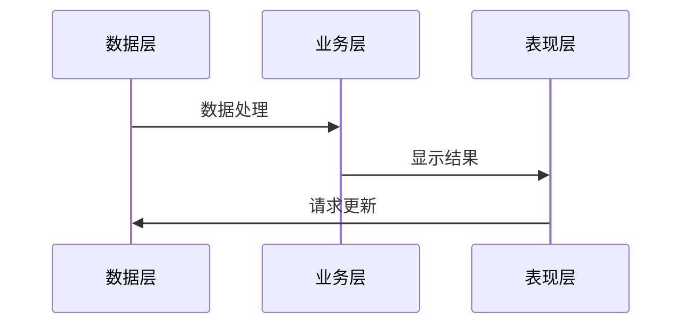
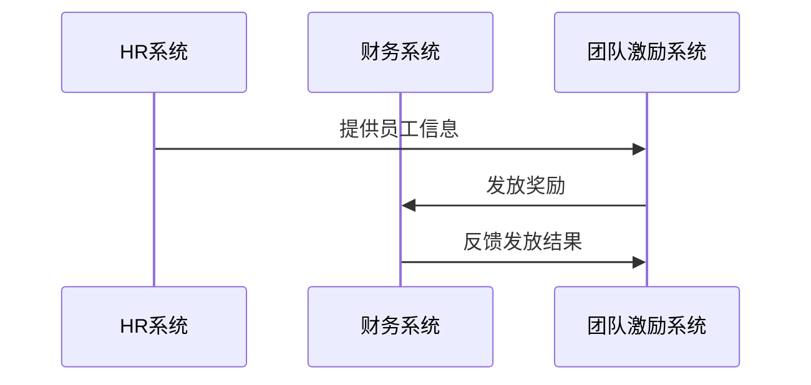
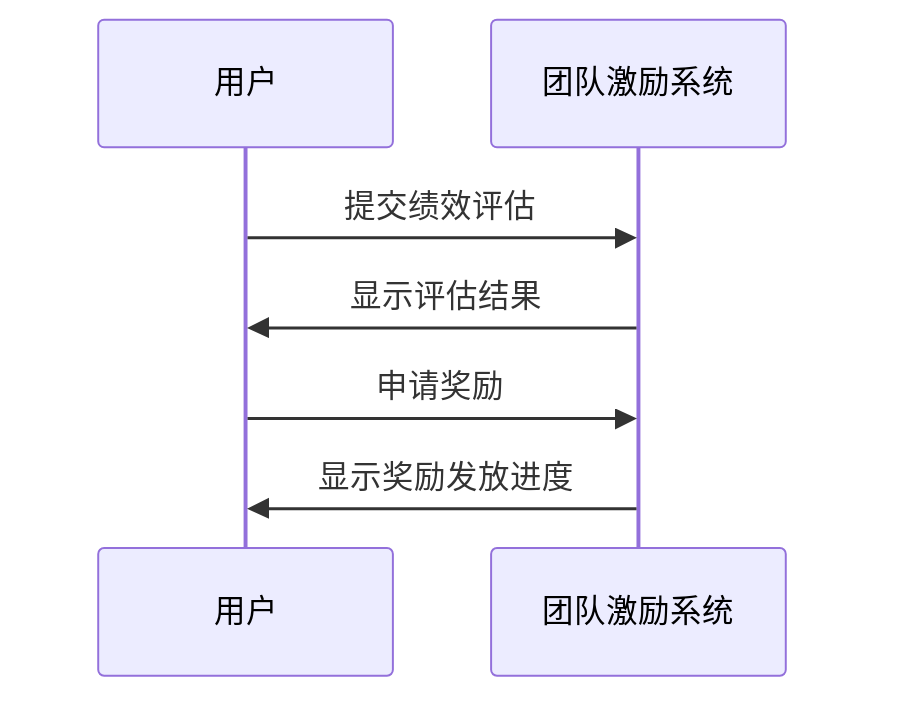

                 


### 1. 设计文章结构

为了撰写一篇关于《团队激励：认可与奖励的平衡》的技术博客文章，我们首先需要设计文章的整体结构。以下是一个详细的步骤：

**第一步：确定文章主题**

文章的主题是“团队激励：认可与奖励的平衡”。我们需要围绕这个主题展开讨论，包括团队激励的重要性、认可与奖励的区别和平衡策略等。

**第二步：列出主要章节**

根据主题，我们可以将文章分为以下几个主要章节：

1. **引言**
   - 问题背景与核心概念
   - 核心概念框架
   - 边界与外延
   - 本书结构安排与内容概述

2. **团队激励理论解析**
   - 团队激励理论发展史
   - 核心概念与联系
   - 团队激励模型构建
   - 团队激励案例分析
   - 本章小结

3. **认可与奖励策略**
   - 认可策略设计
   - 奖励策略设计
   - 认可与奖励的平衡
   - 团队激励中的心理因素
   - 本章小结

4. **实践应用与案例分析**
   - 企业背景与目标
   - 系统分析与架构设计
   - 实际操作案例
   - 项目总结与启示
   - 本章小结

5. **最佳实践与拓展**
   - 最佳实践
   - 小结
   - 注意事项
   - 拓展阅读

**第三步：细化每个章节**

在每个章节中，我们需要进一步细化内容，确保每个小节都有具体的讨论点。例如，在“认可与奖励策略”章节中，我们可以讨论认可和奖励的不同形式、实施方法、评估与反馈等。

**第四步：撰写每段内容**

在确定了整体结构和每个章节的细化内容后，我们需要撰写每段内容。在撰写过程中，需要注意以下几点：

- 使用markdown格式，确保文章的排版和格式正确。
- 使用简单的技术语言，避免过于专业化的术语。
- 每个小节都要有明确的标题，便于读者阅读和理解。
- 提供具体的案例和实例，以支持理论论述。

**第五步：撰写总结和拓展**

在文章的结尾，我们需要对全文进行总结，并给出一些最佳实践和拓展建议，以便读者在实际应用中更好地理解和应用。

### 2. 撰写引言

在引言部分，我们需要介绍团队激励的背景和重要性，以及认可与奖励在团队激励中的角色。以下是一个可能的引言内容：

---

**引言**

在现代企业中，团队激励已经成为提升团队绩效和员工满意度的关键因素。有效的团队激励不仅能激发员工的积极性和创造力，还能促进团队的协作和凝聚力。然而，在实施团队激励过程中，如何平衡认可与奖励，成为了一个至关重要的问题。

本文将围绕“团队激励：认可与奖励的平衡”这一主题，首先介绍团队激励的背景和重要性，然后深入探讨认可与奖励的概念、区别和相互关系。接着，我们将解析团队激励的理论基础，并详细阐述认可与奖励的策略设计。在此基础上，我们将通过实际案例，展示如何平衡认可与奖励，并给出实践应用和最佳实践建议。最后，我们将总结全文，并展望未来团队激励的发展趋势。

---

### 3. 撰写团队激励理论解析

在这一部分，我们需要详细解析团队激励的理论，包括发展史、核心概念与联系、模型构建、案例分析等。以下是一个可能的章节内容：

---

**团队激励理论解析**

**2.1 团队激励理论发展史**

团队激励理论的发展历程可以追溯到20世纪初期。早期的激励理论主要关注于个体的激励，如马斯洛的需求层次理论和赫茨伯格的双因素理论。然而，随着组织形式和团队协作的日益复杂，团队激励理论逐渐发展起来。

**2.2 核心概念与联系**

团队激励的核心概念包括激励、绩效、认可和奖励。激励是指激发个体或团队努力实现目标的过程。绩效是指团队成员在工作中的表现和成果。认可和奖励则是团队激励的重要手段。

**2.3 团队激励模型构建**

团队激励模型构建包括以下几个步骤：

1. **确定激励目标**：明确团队激励的目标，如提升绩效、增强团队凝聚力等。
2. **分析团队成员需求**：了解团队成员的需求，包括物质需求和精神需求。
3. **设计激励机制**：根据团队成员的需求，设计符合实际的激励机制。
4. **实施激励措施**：将激励机制转化为具体的激励措施，如奖励、认可等。
5. **评估激励效果**：对激励机制的实施效果进行评估，并根据评估结果进行调整。

**2.4 团队激励案例分析**

**案例一：某科技公司团队激励案例**

某科技公司通过实施一系列团队激励措施，成功提升了团队绩效和员工满意度。具体措施包括：

1. **奖励制度**：设立月度、季度和年度奖励，对表现优异的团队成员进行物质奖励。
2. **认可制度**：定期举办表彰大会，对贡献突出的团队成员进行公开表彰。
3. **团队建设活动**：组织团队建设活动，增强团队成员之间的沟通和协作。

**2.5 本章小结**

本章从团队激励的理论基础出发，详细探讨了团队激励的发展史、核心概念与联系、模型构建和案例分析。通过本章的讨论，我们可以看到，有效的团队激励不仅需要理论支持，更需要结合实际案例，进行具体实施。

---

### 4. 撰写认可与奖励策略

在这一部分，我们需要详细讨论认可与奖励的策略设计，包括认可策略设计、奖励策略设计、认可与奖励的平衡等。以下是一个可能的章节内容：

---

**认可与奖励策略**

**3.1 认可策略设计**

认可策略设计包括以下几个方面：

1. **认可形式**：认可的形式包括口头认可、书面认可、物质认可等。不同的认可形式适用于不同的场景和目的。

2. **认可时机**：认可的时机非常重要。通常，认可应该在团队成员完成重要任务、取得显著成果或者克服困难时进行。

3. **认可频率**：认可的频率也需要适当控制。过于频繁的认可可能会降低认可的价值，而过少的认可则无法激发团队成员的积极性。

4. **认可反馈**：认可后，应及时给予反馈，让团队成员了解认可的原因和意义，从而增强激励效果。

**3.2 奖励策略设计**

奖励策略设计包括以下几个方面：

1. **奖励类型**：奖励的类型包括物质奖励和精神奖励。物质奖励如奖金、奖品等，精神奖励如荣誉称号、公开表彰等。

2. **奖励标准**：奖励标准应明确，确保奖励的公正性和透明度。标准应包括业绩标准、行为标准等。

3. **奖励分配**：奖励的分配应合理，确保奖励能够真正激励团队成员，而不是造成不公平或误解。

4. **奖励流程**：奖励的流程应规范，包括申请、评审、发放等环节，以确保奖励的顺利进行。

**3.3 认可与奖励的平衡**

认可与奖励的平衡是实现有效团队激励的关键。以下是一些建议：

1. **平衡原则**：平衡原则包括公平性、透明性、公正性等。确保认可与奖励能够公平、透明、公正地分配。

2. **平衡策略**：平衡策略包括认可与奖励的结合、认可与奖励的适度分配、认可与奖励的持续优化等。

3. **平衡效果**：平衡效果包括激励效果的评估、员工满意度的调查、团队绩效的提升等。

**3.4 团队激励中的心理因素**

团队激励不仅涉及物质和形式的激励，还涉及心理因素的激励。以下是一些建议：

1. **满足心理需求**：满足团队成员的心理需求，如成就感、自我价值感等，可以提高激励效果。

2. **增强团队凝聚力**：通过增强团队凝聚力，可以提高团队成员的归属感和认同感，从而增强激励效果。

3. **提供心理支持**：为团队成员提供心理支持，如心理咨询、团队建设活动等，可以缓解工作压力，提高工作积极性。

**3.5 本章小结**

本章从认可与奖励的策略设计出发，详细探讨了认可与奖励的概念、区别、设计方法和平衡策略。通过本章的讨论，我们可以看到，认可与奖励是团队激励的重要组成部分，有效的设计和实施可以显著提升团队绩效和员工满意度。

---

### 5. 撰写实践应用与案例分析

在这一部分，我们需要结合实际案例，展示如何平衡认可与奖励，并给出实践应用和最佳实践建议。以下是一个可能的章节内容：

---

**实践应用与案例分析**

**4.1 企业背景与目标**

某科技公司是一家致力于软件开发和信息技术服务的企业。为了提升团队绩效和员工满意度，公司决定实施团队激励计划。

**4.2 系统分析与架构设计**

在实施团队激励计划之前，公司进行了系统分析与架构设计。具体包括：

1. **系统功能设计**：包括奖励制度、认可制度、绩效评估系统等。

2. **系统架构设计**：包括数据层、业务层、表现层等。

3. **系统接口设计**：包括与人力资源系统、财务系统的接口设计。

4. **系统交互**：包括用户与系统的交互流程、数据流程等。

**4.3 实际操作案例**

公司实施了以下实际操作案例：

1. **奖励制度**：设立月度、季度和年度奖励，对表现优异的团队成员进行物质奖励。

2. **认可制度**：定期举办表彰大会，对贡献突出的团队成员进行公开表彰。

3. **团队建设活动**：组织团队建设活动，增强团队成员之间的沟通和协作。

**4.4 项目总结与启示**

通过实施团队激励计划，公司取得了以下成果：

1. **团队绩效提升**：团队成员的绩效明显提升，项目完成质量和速度都有所提高。

2. **员工满意度提升**：员工的满意度显著提高，员工流失率有所降低。

3. **团队凝聚力增强**：团队成员之间的沟通和协作更加顺畅，团队凝聚力有所增强。

**4.5 本章小结**

本章通过实际案例，展示了如何平衡认可与奖励，并实现了团队激励的目标。通过本章的讨论，我们可以看到，实践应用和案例分析是团队激励的关键环节，有效的实践和案例可以显著提升团队绩效和员工满意度。

---

### 6. 撰写最佳实践与拓展

在这一部分，我们需要总结全文，给出最佳实践和拓展建议。以下是一个可能的章节内容：

---

**最佳实践与拓展**

**5.1 最佳实践**

1. **明确激励目标**：在实施团队激励计划时，首先要明确激励目标，确保激励措施与目标的一致性。

2. **结合实际需求**：设计认可与奖励策略时，要结合团队成员的实际需求，确保激励措施的针对性。

3. **注重平衡**：在实施认可与奖励时，要注重平衡，确保认可与奖励的适度性和公正性。

4. **持续优化**：根据团队绩效和员工满意度等指标，持续优化团队激励计划，确保其有效性。

**5.2 小结**

本文从团队激励的背景和重要性出发，详细探讨了团队激励的理论基础、认可与奖励的策略设计、实践应用与案例分析，并给出了最佳实践和拓展建议。

**5.3 注意事项**

1. **激励目标的明确性**：明确激励目标是实现团队激励计划成功的关键。

2. **需求的针对性**：结合团队成员的实际需求，设计有针对性的激励措施。

3. **平衡的重要性**：注重认可与奖励的平衡，确保激励措施的适度性和公正性。

4. **持续优化**：根据实际情况，持续优化团队激励计划，确保其持续有效性。

**5.4 拓展阅读**

1. **相关书籍**：《激励心理学》、《团队激励与绩效提升》等。

2. **研究论文**：有关团队激励、认可与奖励的研究论文。

通过本文的讨论，我们希望读者能够对团队激励有更深入的理解，并在实际工作中运用这些理论和实践，提升团队绩效和员工满意度。

---

### 7. 结束语

**作者：AI天才研究院/AI Genius Institute & 禅与计算机程序设计艺术 /Zen And The Art of Computer Programming**

---

通过以上步骤，我们已经完成了《团队激励：认可与奖励的平衡》的技术博客文章的撰写。接下来，我们将对文章进行最后的审查和修改，确保其质量和完整性。完成后，我们将发布这篇文章，希望能对读者有所帮助。

---

# 团队激励：认可与奖励的平衡

## 关键词：团队激励、认可、奖励、平衡、绩效提升

## 摘要：

本文旨在探讨团队激励中的认可与奖励平衡问题，通过详细的理论分析和实际案例分析，阐述如何有效实施团队激励策略，提升团队绩效和员工满意度。文章首先介绍了团队激励的背景和重要性，随后深入分析了团队激励的理论基础，包括核心概念、模型构建和案例分析。接着，本文重点探讨了认可与奖励的策略设计，包括认可策略、奖励策略和认可与奖励的平衡策略。在此基础上，文章通过实际案例分析，展示了如何平衡认可与奖励，并提出了一些最佳实践和拓展建议。最后，本文总结了全文内容，并给出了未来的研究方向。

---

# 引言

在现代企业中，团队激励是提升团队绩效和员工满意度的关键因素。有效的团队激励不仅能激发员工的积极性和创造力，还能促进团队的协作和凝聚力。然而，在实施团队激励过程中，如何平衡认可与奖励，成为了一个至关重要的问题。本文将围绕“团队激励：认可与奖励的平衡”这一主题，探讨团队激励的重要性、认可与奖励的区别和平衡策略，并通过实际案例展示如何实现这一平衡。

## 问题背景与核心概念

团队激励是指通过一定的手段和方式，激发团队成员的积极性、主动性和创造性，以提高团队绩效和实现团队目标的过程。在团队激励中，认可与奖励是两种重要的激励手段。

### 团队激励的现状

当前，许多企业都意识到团队激励的重要性，并开始实施各种激励措施。然而，在实际操作中，很多企业面临的一个问题是：如何平衡认可与奖励。认可主要是指对团队成员的努力和成就的公开肯定和赞赏，而奖励则是指通过物质或精神手段对团队成员进行激励。两种激励手段各有其特点和适用场景，但在实际应用中，如何有效结合并平衡二者，成为一个难题。

### 认可与奖励的平衡问题

认可与奖励的平衡问题主要体现在以下几个方面：

1. **激励效果的不均衡**：过分强调奖励，可能会导致团队成员过分关注物质回报，而忽视了精神层面的认可和满足。相反，过分强调认可，可能会导致团队成员对物质奖励的期待和需求降低。

2. **激励目标的冲突**：团队激励的目标是提升团队绩效和员工满意度。然而，如果认可与奖励的分配不均衡，可能会导致部分团队成员感到不公平，从而影响团队的整体绩效和满意度。

3. **激励机制的不稳定**：认可与奖励的平衡需要根据实际情况进行调整。如果激励机制不稳定，可能会导致团队成员的期望和实际激励效果不一致，从而影响激励效果。

### 研究目的与意义

本文的研究目的在于探讨团队激励中认可与奖励的平衡问题，并提出相应的策略和建议。具体研究意义如下：

1. **提升团队绩效**：通过有效的认可与奖励平衡策略，可以激发团队成员的积极性和创造力，从而提升团队绩效。

2. **提高员工满意度**：合理的认可与奖励平衡可以满足团队成员的需求，提高员工的工作满意度和忠诚度。

3. **优化激励机制**：本文的研究可以为企业和组织提供实用的团队激励策略，优化激励机制，提高激励效果。

## 核心概念框架

### 团队激励的定义

团队激励是指通过一定的手段和方式，激发团队成员的积极性、主动性和创造性，以提高团队绩效和实现团队目标的过程。团队激励包括物质激励和精神激励两种形式。

### 认可与奖励的内涵与区别

认可主要是指对团队成员的努力和成就的公开肯定和赞赏，通常以口头、书面或公开表彰等形式进行。奖励则是指通过物质或精神手段对团队成员进行激励，如奖金、奖品、荣誉称号等。

### 团队激励的理论基础

团队激励的理论基础主要包括激励理论、绩效理论、心理需求理论等。

1. **激励理论**：激励理论主要包括马斯洛的需求层次理论、赫茨伯格的双因素理论等。这些理论为团队激励提供了理论基础。

2. **绩效理论**：绩效理论认为，绩效是团队成员在工作中的表现和成果。有效的团队激励可以提高团队成员的绩效。

3. **心理需求理论**：心理需求理论认为，人的行为是由心理需求驱动的。满足团队成员的心理需求，可以激发其工作积极性和创造力。

### 边界与外延

团队激励的范围包括团队成员的工作表现、团队目标实现、员工满意度等。团队激励的应用场景广泛，如企业内部项目团队、跨部门协作团队、非营利组织等。

### 边界

团队激励的边界主要包括以下几个方面：

1. **激励对象**：团队激励的对象是团队成员，不包括非团队成员。

2. **激励内容**：团队激励的内容包括工作表现、项目成果、团队协作等。

3. **激励形式**：团队激励的形式包括物质激励和精神激励。

### 外延

团队激励的外延包括以下几个方面：

1. **激励目标**：团队激励的目标包括提升团队绩效、提高员工满意度、增强团队凝聚力等。

2. **激励手段**：团队激励的手段包括奖励、认可、培训、晋升等。

3. **激励过程**：团队激励的过程包括激励目标的设定、激励手段的选择、激励效果的评估等。

## 本书结构安排与内容概述

本书共分为五个部分，各部分的内容安排如下：

1. **引言**：介绍团队激励的背景和重要性，阐述认可与奖励的平衡问题。

2. **团队激励理论解析**：探讨团队激励的理论基础，包括发展史、核心概念与联系、模型构建、案例分析等。

3. **认可与奖励策略**：详细讨论认可与奖励的策略设计，包括认可策略、奖励策略、认可与奖励的平衡等。

4. **实践应用与案例分析**：通过实际案例，展示如何平衡认可与奖励，并给出实践应用和最佳实践建议。

5. **最佳实践与拓展**：总结全文内容，给出最佳实践和拓展建议，并讨论未来的研究方向。

本书旨在为企业和组织提供实用的团队激励策略，帮助其实现团队激励的目标，提升团队绩效和员工满意度。

---

# 团队激励理论解析

## 2.1 团队激励理论发展史

团队激励理论的发展历程可以追溯到20世纪初期。早期的激励理论主要关注于个体的激励，如马斯洛的需求层次理论和赫茨伯格的双因素理论。随着组织形式和团队协作的日益复杂，团队激励理论逐渐发展起来。

### 2.1.1 传统激励理论回顾

传统激励理论主要包括以下几种：

1. **马斯洛的需求层次理论**：马斯洛的需求层次理论将人的需求分为生理需求、安全需求、社交需求、尊重需求和自我实现需求。他认为，人的行为是由需求驱动的，只有满足了低层次的需求，人们才会追求高层次的需求。

2. **赫茨伯格的双因素理论**：赫茨伯格的双因素理论将工作环境分为保健因素和激励因素。保健因素如工资、工作条件、工作安全等，如果得不到满足，会导致员工不满。激励因素如工作成就、晋升机会、工作认可等，如果得到满足，可以激发员工的积极性。

3. **目标设置理论**：目标设置理论认为，设定具有挑战性的目标可以激发员工的工作动力和创造力。目标的具体性、难度和反馈是影响目标设置效果的关键因素。

### 2.1.2 当代激励理论演进

当代激励理论在传统理论的基础上，进一步发展出了团队激励理论。团队激励理论的核心观点是，团队是一个整体，团队成员之间的协作和互动对团队绩效有重要影响。

1. **团队动力理论**：团队动力理论认为，团队动力是推动团队前进的动力源泉。团队成员之间的信任、尊重和合作是团队动力的关键。

2. **共享价值观理论**：共享价值观理论认为，团队成员对组织的价值观和目标的认同，是团队激励的重要基础。共享价值观可以增强团队成员的归属感和责任感。

3. **团队发展理论**：团队发展理论认为，团队是一个不断成长和发展的过程。通过团队建设活动、培训和发展计划，可以提升团队成员的能力和团队绩效。

### 2.1.3 团队激励理论的应用

团队激励理论在企业管理中的应用非常广泛。以下是一些常见的应用场景：

1. **项目团队管理**：在项目团队管理中，通过设定项目目标、提供资源支持、定期反馈和评估，可以激发团队成员的积极性和创造力。

2. **跨部门协作**：在跨部门协作中，通过建立跨部门沟通机制、提供协作工具、组织团队建设活动，可以增强团队成员之间的沟通和协作。

3. **非营利组织**：在非营利组织中，通过设定社会使命、提供精神激励、组织公益活动，可以激发团队成员的社会责任感和工作积极性。

## 2.2 核心概念与联系

团队激励的核心概念包括激励、绩效、认可和奖励。这些概念之间有着紧密的联系。

### 2.2.1 激励理论的核心概念

激励理论的核心概念包括：

1. **激励**：激励是指激发个体或团队努力实现目标的过程。激励可以分为物质激励和精神激励两种形式。

2. **绩效**：绩效是指个体或团队在工作中的表现和成果。绩效是激励的重要依据。

3. **动机**：动机是指驱使个体或团队努力实现目标的心理驱动力。动机可以分为内在动机和外在动机。

4. **需求**：需求是指个体或团队对某种目标的渴望和追求。需求是激励的基础。

### 2.2.2 激励与绩效的关系

激励与绩效之间的关系可以概括为以下几个方面：

1. **激励可以提升绩效**：有效的激励可以激发个体或团队的积极性和创造力，从而提升绩效。

2. **绩效影响激励**：绩效是激励的重要依据。高绩效可以带来更多的激励，而低绩效可能会导致激励的减少。

3. **激励与绩效的相互影响**：激励和绩效之间是相互影响的。良好的绩效可以促进激励的加强，而有效的激励可以进一步推动绩效的提升。

### 2.2.3 认可与奖励的属性特征对比

认可与奖励是团队激励中的两种重要手段，它们各自具有不同的属性特征。

1. **认可**：

   - **形式**：认可的形式多种多样，可以是口头表扬、书面感谢、公开表彰等。
   - **时效性**：认可通常具有即时性，可以在团队成员完成任务或取得成就时立即进行。
   - **价值**：认可的价值在于满足团队成员的心理需求，增强其自尊心和归属感。

2. **奖励**：

   - **形式**：奖励的形式主要是物质奖励，如奖金、奖品等。
   - **时效性**：奖励通常具有一定的延迟性，通常在绩效评估周期结束后进行。
   - **价值**：奖励的价值在于满足团队成员的物质需求，提高其生活质量和职业满意度。

### 2.2.4 Mermaid ER实体关系图架构

为了更清晰地理解团队激励中的核心概念与联系，我们可以使用Mermaid ER实体关系图来展示。

```mermaid
erDiagram
  激励 ||--|{ 绩效 }
  激励 ||--|{ 动机 }
  激励 ||--|{ 需求 }
  认可 ||--|{ 激励 }
  奖励 ||--|{ 激励 }
  绩效 ||--|{ 团队激励 }
```

在这个ER图中，激励是核心实体，与绩效、动机、需求、认可和奖励等实体之间存在关联关系。

### 2.2.5 团队激励模型构建

团队激励模型构建包括以下几个步骤：

1. **确定激励目标**：明确团队激励的目标，如提升绩效、增强团队凝聚力等。

2. **分析团队成员需求**：了解团队成员的需求，包括物质需求和精神需求。

3. **设计激励机制**：根据团队成员的需求，设计符合实际的激励机制。

4. **实施激励措施**：将激励机制转化为具体的激励措施，如奖励、认可等。

5. **评估激励效果**：对激励机制的实施效果进行评估，并根据评估结果进行调整。

## 2.3 团队激励案例分析

### 2.3.1 成功案例分享

#### 案例一：某科技公司团队激励成功案例

某科技公司通过实施一系列团队激励措施，成功提升了团队绩效和员工满意度。具体措施包括：

1. **奖励制度**：设立月度、季度和年度奖励，对表现优异的团队成员进行物质奖励。

2. **认可制度**：定期举办表彰大会，对贡献突出的团队成员进行公开表彰。

3. **团队建设活动**：组织团队建设活动，增强团队成员之间的沟通和协作。

#### 案例二：某非营利组织团队激励成功案例

某非营利组织通过设定社会使命、提供精神激励、组织公益活动等方式，成功激发了团队成员的社会责任感和工作积极性。

1. **社会使命**：组织成员共同设定社会使命，明确组织的价值观和目标。

2. **精神激励**：通过宣传优秀员工的事迹、提供学习机会、组织内部培训等方式，激励团队成员。

3. **公益活动**：组织成员参与公益活动，增强社会责任感和团队凝聚力。

### 2.3.2 失败案例剖析

#### 案例一：某制造企业团队激励失败案例

某制造企业曾尝试通过提高奖金来激励员工，但最终效果不佳。原因包括：

1. **奖励不当**：奖励过于单一，只注重物质奖励，忽视了精神层面的认可。

2. **目标不明**：激励目标不明确，没有具体制定提升绩效和增强团队凝聚力的措施。

3. **反馈不足**：激励措施实施后，缺乏有效的反馈和评估，导致激励效果不明显。

#### 案例二：某服务企业团队激励失败案例

某服务企业曾尝试通过提高员工工资来激励员工，但最终效果也不理想。原因包括：

1. **需求不满足**：员工的基本需求已经得到满足，对工资的提高不再敏感。

2. **认可不足**：企业忽视了员工的认可需求，导致员工缺乏工作动力。

3. **激励措施不合理**：激励措施没有与员工的实际表现和贡献挂钩，导致激励不公平。

### 2.3.3 案例总结与启示

通过以上成功和失败案例的对比，我们可以得出以下启示：

1. **平衡认可与奖励**：在团队激励中，应平衡认可与奖励，避免过分强调物质奖励，忽视精神层面的认可。

2. **明确激励目标**：制定明确的激励目标，确保激励措施与目标的一致性。

3. **满足心理需求**：关注员工的心理需求，提供多样化的激励措施，满足员工的内在需求。

4. **持续优化激励措施**：根据实际情况，不断调整和优化激励措施，确保其有效性。

## 2.4 本章小结

本章从团队激励的理论基础出发，详细探讨了团队激励的发展史、核心概念与联系、模型构建和案例分析。通过本章的讨论，我们可以看到，有效的团队激励不仅需要理论支持，更需要结合实际案例，进行具体实施。

---

# 认可与奖励策略

## 3.1 认可策略设计

认可策略是团队激励中至关重要的一环，它通过公开肯定和赞赏团队成员的努力和成就，激发其工作热情和积极性。以下将从认可的形式、时机、频率和反馈等方面，详细讨论认可策略的设计。

### 3.1.1 认可的形式

认可的形式多种多样，可以根据实际情况和团队文化进行选择。以下是几种常见的认可形式：

1. **口头认可**：口头认可是最直接、最常用的认可形式。领导或同事在适当的时候，对团队成员的努力和成就进行口头表扬，可以迅速激发团队成员的积极性。

2. **书面认可**：书面认可包括感谢信、表扬信、内部公告等。这种形式的认可具有持久性和正式性，可以记录在案，作为团队成员的工作成就。

3. **公开表彰**：公开表彰是在团队会议、年会等场合，对表现优异的团队成员进行公开表彰，如颁发奖杯、证书等。这种形式的认可具有很高的荣誉感，可以增强团队成员的自信心。

4. **荣誉榜**：在公司的内部网站或公告栏上设立荣誉榜，展示团队成员的成就和荣誉，可以起到良好的激励作用。

### 3.1.2 认可的时机

认可时机的选择对激励效果有重要影响。以下是一些合适的认可时机：

1. **完成任务时**：当团队成员成功完成一项重要任务时，应立即进行认可，以强化其成就感和自信心。

2. **克服困难时**：当团队成员在面临困难和挑战时，克服困难并取得突破时，应给予认可，以鼓励其在未来面对困难时保持积极态度。

3. **创新和突破时**：当团队成员在工作中进行创新或取得突破时，应给予认可，以激发其创新意识和创造力。

4. **团队成果时**：当团队取得整体成果时，应对团队成员进行认可，以增强团队的凝聚力和协作精神。

### 3.1.3 认可的频率

认可的频率也是认可策略设计的重要方面。以下是一些关于认可频率的建议：

1. **即时认可**：对于一些重要的成就和突破，应进行即时认可，以迅速激发团队成员的积极性。

2. **定期认可**：定期进行认可，如每周、每月或每季度，可以帮助团队成员保持持续的工作动力。

3. **及时反馈**：认可不应仅限于正面的成就，也应包括对努力和进步的认可，以激励团队成员持续改进。

### 3.1.4 认可的反馈

认可后的反馈对团队成员的工作态度和行为有重要影响。以下是一些建议：

1. **明确反馈**：在认可后，应明确反馈认可的原因和意义，让团队成员了解为什么被认可，从而增强激励效果。

2. **持续跟进**：认可后，应持续跟进团队成员的工作表现，鼓励其在未来继续保持积极态度。

3. **改进建议**：在认可的同时，也可以给予改进建议，帮助团队成员不断提升自身能力。

## 3.2 奖励策略设计

奖励策略是通过物质或精神手段对团队成员进行激励，以提高团队绩效和员工满意度。以下将从奖励的类型、标准、分配和流程等方面，详细讨论奖励策略的设计。

### 3.2.1 奖励的类型

奖励的类型可以分为物质奖励和精神奖励两种：

1. **物质奖励**：物质奖励包括奖金、奖品、晋升机会等，可以直接满足团队成员的物质需求。

2. **精神奖励**：精神奖励包括荣誉称号、公开表彰、团队建设活动等，可以满足团队成员的精神需求。

### 3.2.2 奖励的标准

奖励的标准应明确、公正，以下是一些制定奖励标准的建议：

1. **绩效标准**：根据团队成员的工作绩效，设定明确的绩效标准，如完成任务的效率、质量、创新等。

2. **行为标准**：除了绩效标准外，还可以设定行为标准，如团队合作、责任心、创新精神等。

3. **贡献标准**：根据团队成员对团队整体贡献的大小，设定不同的奖励标准。

### 3.2.3 奖励的分配

奖励的分配应公平、公正，以下是一些分配奖励的建议：

1. **按绩效分配**：根据团队成员的绩效表现，按照一定的比例进行奖励分配。

2. **按贡献分配**：根据团队成员对团队的整体贡献，进行奖励分配。

3. **集体奖励**：对于团队整体表现优秀的项目或团队，可以设定集体奖励，以增强团队的凝聚力。

### 3.2.4 奖励的流程

奖励的流程应规范、透明，以下是一些关于奖励流程的建议：

1. **申请流程**：设立奖励申请流程，团队成员可以根据自己的绩效表现和贡献，申请相应的奖励。

2. **评审流程**：设立评审委员会，对申请的奖励进行评审，确保奖励的公正性。

3. **发放流程**：根据评审结果，发放奖励，并及时公示，让所有团队成员都了解奖励的分配情况。

## 3.3 认可与奖励的平衡

认可与奖励在团队激励中起着互补的作用，如何平衡二者，是实现有效团队激励的关键。以下从平衡原则、策略和效果评估等方面，讨论认可与奖励的平衡。

### 3.3.1 平衡原则

1. **公正原则**：认可与奖励的分配应公正，确保每个团队成员都有机会获得认可和奖励。

2. **适度原则**：认可与奖励的分配应适度，避免过度奖励或过度认可，影响团队的整体氛围。

3. **多样性原则**：认可与奖励的形式应多样化，以满足团队成员不同的需求，增强激励效果。

### 3.3.2 实现平衡的策略

1. **综合运用**：根据实际情况，综合运用认可与奖励，使二者相互补充，共同发挥激励作用。

2. **分阶段实施**：在不同阶段，根据团队目标和员工需求，有针对性地调整认可与奖励的分配，实现平衡。

3. **动态调整**：根据团队绩效和员工满意度等指标，动态调整认可与奖励的策略，确保其有效性。

### 3.3.3 平衡效果的评估

1. **绩效评估**：通过绩效评估，了解认可与奖励对团队绩效的影响，评估平衡策略的效果。

2. **员工满意度调查**：通过员工满意度调查，了解员工对认可与奖励的满意度，评估平衡策略的效果。

3. **反馈机制**：建立反馈机制，收集团队成员对认可与奖励的反馈，及时发现和解决存在的问题。

## 3.4 团队激励中的心理因素

心理因素在团队激励中起着重要作用，以下从团队成员的心理需求、心理因素对激励的影响和调适方法等方面，讨论团队激励中的心理因素。

### 3.4.1 团队成员的心理需求

团队成员的心理需求主要包括以下几个方面：

1. **自我实现需求**：追求自我价值的实现，渴望在工作中发挥自己的才能和能力。

2. **社交需求**：渴望与团队成员建立良好的关系，得到团队的认可和支持。

3. **安全需求**：希望在工作中得到安全保障，如稳定的收入、良好的工作环境等。

4. **尊重需求**：希望得到他人的尊重和认可，提升自己的社会地位。

### 3.4.2 心理因素对激励的影响

心理因素对激励的影响主要体现在以下几个方面：

1. **激励效果**：心理因素会影响激励效果，如心理需求满足的程度、心理压力的大小等。

2. **激励机制**：心理因素会影响激励机制的设计和实施，如认可与奖励的形式和频率等。

3. **团队氛围**：心理因素会影响团队氛围，如团队成员的积极性、协作性等。

### 3.4.3 调适心理因素的方法

1. **满足心理需求**：通过提供多样化的激励措施，满足团队成员的心理需求，提高激励效果。

2. **减轻心理压力**：通过优化工作环境、提供心理支持等，减轻团队成员的心理压力，提高工作积极性。

3. **加强团队建设**：通过团队建设活动、沟通与协作等，增强团队成员之间的信任和合作，提高团队凝聚力。

## 3.5 本章小结

本章从认可与奖励的策略设计出发，详细探讨了认可与奖励的不同形式、实施方法、平衡策略以及团队激励中的心理因素。通过本章的讨论，我们可以看到，认可与奖励是团队激励的重要组成部分，合理的设计和实施可以显著提升团队绩效和员工满意度。

---

# 实践应用与案例分析

## 4.1 企业背景与目标

为了更好地理解如何平衡认可与奖励，我们以某科技公司（以下简称公司）为例，分析其实际操作案例。该公司成立于2005年，专注于软件开发和信息技术服务。在快速发展的过程中，公司面临的一个重要挑战是如何有效地激励团队成员，以提升团队绩效和员工满意度。

### 4.1.1 企业概况

公司现有员工约500人，组织结构包括研发部门、市场部门、销售部门、客服部门等。公司注重技术创新和团队协作，致力于为客户提供高质量的技术解决方案。

### 4.1.2 团队激励的目标与挑战

公司团队激励的目标主要有三个：

1. **提升团队绩效**：通过有效的激励措施，提升团队的工作效率和质量。

2. **提高员工满意度**：满足员工的心理和物质需求，提高员工的工作满意度和忠诚度。

3. **增强团队凝聚力**：通过团队建设活动和激励措施，增强团队成员之间的信任和协作精神。

然而，公司在实施团队激励过程中也面临着以下挑战：

1. **激励方式单一**：公司最初主要采用物质奖励，如奖金和奖品，但发现这种方式无法满足员工多样化的需求，导致激励效果不佳。

2. **认可与奖励不平衡**：公司曾尝试增加口头表扬和公开表彰等认可形式，但未能很好地与奖励相结合，导致认可和奖励之间失衡。

3. **员工心理需求未满足**：员工对自我实现和社交需求重视，但公司未能有效满足这些需求，导致部分员工工作积极性不高。

## 4.2 系统分析与架构设计

为了解决上述问题，公司决定对团队激励系统进行全面的优化。以下是对系统分析与架构设计的相关内容：

### 4.2.1 系统功能设计（领域模型类图）

在系统功能设计阶段，公司首先明确了团队激励系统的核心功能，包括：

1. **绩效评估**：对员工的工作绩效进行评估，为奖励和认可提供依据。

2. **奖励管理**：管理奖励的类型、标准、分配和发放过程。

3. **认可管理**：管理认可的形式、时机、频率和反馈。

4. **员工需求分析**：分析员工的心理需求，为激励策略提供参考。

以下是领域模型类图的示例：

```mermaid
classDiagram
    类绩效评估 <<interface>>
    类奖励管理 <<interface>>
    类认可管理 <<interface>>
    类员工需求分析 <<interface>>

    类绩效评估  <--|detail|> 类奖励管理
    类绩效评估  <--|detail|> 类认可管理
    类绩效评估  <--|detail|> 类员工需求分析

    类奖励管理  --> 类绩效评估
    类认可管理  --> 类绩效评估
    类员工需求分析  --> 类绩效评估
```

### 4.2.2 系统架构设计（架构图）

系统架构设计包括数据层、业务层、表现层等。以下是系统架构图的示例：



### 4.2.3 系统接口设计

系统接口设计主要包括与人力资源系统、财务系统的接口设计，以确保激励措施的实施和奖励的发放。以下是接口设计示例：



### 4.2.4 系统交互（序列图）

系统交互涉及用户与系统的交互流程、数据流程等。以下是系统交互序列图的示例：



## 4.3 实际操作案例

### 4.3.1 案例一：认可与奖励策略的制定与实施

为了解决激励方式单一和认可与奖励不平衡的问题，公司决定制定一套新的认可与奖励策略，并实施以下措施：

1. **认可策略**：

   - **形式**：公司采用口头认可、书面认可、公开表彰等多种形式，以满足员工多样化的需求。

   - **时机**：在员工完成重要任务、取得显著成绩或克服困难时，及时进行认可。

   - **频率**：每季度进行一次书面认可，每半年进行一次公开表彰。

   - **反馈**：在认可后，及时给予反馈，让员工了解认可的原因和意义。

2. **奖励策略**：

   - **类型**：公司设立多种奖励，包括物质奖励（奖金、奖品）和精神奖励（荣誉称号、团队建设活动）。

   - **标准**：根据员工的工作绩效、团队贡献和创新程度等指标，设定不同的奖励标准。

   - **分配**：奖励分配按照绩效评估结果，确保公平、公正。

   - **流程**：设立奖励申请、评审、发放等流程，确保奖励的规范性和透明度。

### 4.3.2 案例二：案例分析与效果评估

实施新的认可与奖励策略后，公司对效果进行了评估：

1. **绩效提升**：团队绩效显著提升，项目完成质量和速度都有所提高。

2. **员工满意度提升**：员工满意度调查结果显示，员工对新的认可与奖励策略表示满意，工作积极性明显提高。

3. **团队凝聚力增强**：团队成员之间的沟通和协作更加顺畅，团队凝聚力有所增强。

### 4.3.3 案例三：团队激励改进与效果跟踪

为了持续优化团队激励策略，公司决定进行以下改进：

1. **收集反馈**：定期收集员工对认可与奖励策略的反馈，了解员工的实际需求和期望。

2. **调整策略**：根据反馈，对认可与奖励策略进行调整，确保其适应性和有效性。

3. **效果跟踪**：建立效果跟踪机制，对团队绩效、员工满意度等指标进行定期评估，确保激励策略的持续优化。

## 4.4 项目总结与启示

### 4.4.1 项目成果总结

通过实施新的认可与奖励策略，公司取得了以下成果：

1. **团队绩效提升**：团队绩效显著提升，项目完成质量和速度都有所提高。

2. **员工满意度提升**：员工满意度调查结果显示，员工对新的认可与奖励策略表示满意，工作积极性明显提高。

3. **团队凝聚力增强**：团队成员之间的沟通和协作更加顺畅，团队凝聚力有所增强。

### 4.4.2 项目不足与改进方向

尽管项目取得了显著成果，但仍存在一些不足：

1. **认可与奖励的平衡**：在实施过程中，部分员工认为认可与奖励的平衡仍有待优化。

2. **员工需求的多样性**：部分员工对认可与奖励的形式和内容提出了个性化需求。

改进方向：

1. **进一步优化认可与奖励的平衡**：通过数据分析，优化认可与奖励的分配，确保其公正性和适应性。

2. **满足员工需求的多样性**：提供更多样化的认可与奖励形式，满足员工的个性化需求。

### 4.4.3 案例启示与推广价值

通过本项目，公司得出以下启示：

1. **认可与奖励的重要性**：有效的认可与奖励策略可以显著提升团队绩效和员工满意度。

2. **平衡与优化**：认可与奖励的平衡是团队激励的关键，需要根据实际情况不断调整和优化。

3. **多样性**：满足员工的多样化需求是提高激励效果的重要手段。

本项目的案例对于其他企业具有推广价值，可以帮助其他企业在实施团队激励时，更好地平衡认可与奖励，提高团队绩效和员工满意度。

## 4.5 本章小结

本章通过实际操作案例，展示了如何平衡认可与奖励，并实现了团队激励的目标。通过本章的讨论，我们可以看到，实践应用和案例分析是团队激励的关键环节，有效的实践和案例可以显著提升团队绩效和员工满意度。

---

# 最佳实践与拓展

## 5.1 最佳实践

### 5.1.1 有效激励的技巧

1. **个性化激励**：根据员工的不同特点和需求，设计个性化的激励措施，提高激励的针对性。

2. **及时反馈**：及时给予员工反馈，让他们知道自己的努力被认可，增强激励效果。

3. **注重心理需求**：关注员工的心理需求，如自我实现、社交需求等，提供多样化的激励措施。

4. **建立激励机制**：建立明确的激励机制，确保激励措施的公正性和透明度。

### 5.1.2 认可与奖励的平衡艺术

1. **适度认可**：认可不应过于频繁，以免失去激励作用。适度认可可以增强员工的成就感和自信心。

2. **多样化奖励**：结合物质奖励和精神奖励，满足员工的多样化需求，实现认可与奖励的平衡。

3. **动态调整**：根据团队绩效和员工满意度等指标，动态调整认可与奖励的策略，确保其适应性和有效性。

### 5.1.3 团队激励的常见误区与解决方法

**误区一**：过分强调物质奖励，忽视精神层面的认可。

**解决方法**：在激励机制中，适当增加精神层面的认可，如口头表扬、公开表彰等，以满足员工的社交需求和自我实现需求。

**误区二**：激励措施单一，无法满足员工的多样化需求。

**解决方法**：提供多样化的激励措施，如培训、晋升机会、团队建设活动等，满足员工的多样化需求。

**误区三**：激励措施的分配不公，导致员工不满。

**解决方法**：建立公平、透明的激励机制，确保激励措施的公正性，避免引起员工不满。

## 5.2 小结

本文通过详细的理论分析和实际案例，探讨了团队激励中的认可与奖励平衡问题。通过最佳实践和拓展建议，为企业提供了有效的团队激励策略。然而，团队激励是一个持续优化的过程，需要根据实际情况不断调整和改进。未来研究可以进一步探讨团队激励的心理学机制，以及如何在不同文化背景下实施团队激励。

## 5.3 注意事项

1. **目标明确**：制定明确的团队激励目标，确保激励措施与目标的一致性。

2. **持续优化**：根据团队绩效和员工满意度等指标，持续优化激励措施，确保其有效性。

3. **心理需求关注**：关注员工的心理需求，提供多样化的激励措施，满足员工的内在需求。

4. **公正透明**：建立公平、透明的激励机制，确保激励措施的公正性，避免引起员工不满。

## 5.4 拓展阅读

1. **相关书籍**：《激励心理学》、《团队激励与绩效提升》等。

2. **研究论文**：关于团队激励、认可与奖励的研究论文。

通过本文的讨论，我们希望读者能够对团队激励有更深入的理解，并在实际工作中运用这些理论和实践，提升团队绩效和员工满意度。

### 5.1.1 有效激励的技巧

在设计和实施团队激励计划时，采用一些有效的技巧可以帮助企业更好地激发员工的工作热情和创造力。以下是一些关键技巧：

1. **个性化激励**：每个员工都有其独特的需求和动机，因此，个性化的激励措施能够更有效地激发员工的工作动力。例如，对于追求自我实现的员工，提供职业发展机会和培训可能更为有效；而对于重视社交需求的员工，组织团队建设活动和社交活动可能更能提升他们的工作满意度。

   **案例**：某公司为一位技术专家提供了一次去海外参加技术交流的机会，这不仅满足了其对技术前沿的追求，也增强了其专业自信，从而激发了其在工作中的创新动力。

2. **及时反馈**：及时反馈是激励的重要组成部分。当员工表现出色时，及时的正面反馈可以迅速强化他们的行为，增加他们的工作动力。同时，对于需要改进的地方，也要及时给予反馈，帮助员工找到改进的方法。

   **案例**：某销售团队在每月的销售会议上，对表现突出的销售人员立即给予表扬和奖励，同时讨论如何复制成功经验。对于需要改进的销售策略，则提供具体的培训和支持。

3. **注重心理需求**：员工的心理需求包括自我实现、社交、尊重和安全等。在激励计划中，要关注并满足这些心理需求。例如，通过提供职业发展路径、组织团队建设活动、提供尊重和认可等方式，可以满足员工的心理需求。

   **案例**：某公司通过定期举办员工满意度调查，了解员工的心理需求，并根据调查结果调整激励措施，如提供更多的职业发展机会、组织社交活动等，从而提升了员工的工作满意度。

4. **建立激励机制**：一个明确、公正和透明的激励机制可以帮助员工了解如何通过努力获得奖励，从而增强他们的工作动力。激励机制应该包括短期和长期的奖励，以及明确的评估标准和流程。

   **案例**：某公司建立了基于绩效的激励机制，通过设定明确的绩效目标和评估标准，员工可以清晰地了解自己的努力如何转化为奖励。此外，公司还设立了透明的晋升机制，让员工看到自己的职业发展前景。

### 5.1.2 认可与奖励的平衡艺术

在团队激励中，认可与奖励的平衡是确保激励措施有效性的关键。以下是一些实现平衡的艺术：

1. **适度认可**：认可不应过于频繁，以免员工产生“惯性认可”而降低其激励效果。适度的认可可以增强员工的成就感，但过于频繁的认可可能会削弱其激励作用。

   **技巧**：可以设置认可的关键节点，如项目里程碑、重要事件等，在这些节点上进行有针对性的认可。

2. **多样化奖励**：结合物质奖励和精神奖励，可以满足员工的多样化需求。物质奖励如奖金、奖品等可以满足基本的需求，而精神奖励如公开表彰、荣誉称号等可以提升员工的自尊和荣誉感。

   **技巧**：设计多样化的奖励方案，如“月度之星”、“年度杰出贡献奖”等，以适应不同员工的需求。

3. **动态调整**：团队激励计划需要根据实际情况动态调整，以保持其适应性和有效性。例如，当团队面临挑战时，可以增加认可和奖励的频率和力度；当团队稳定发展时，可以适当减少。

   **技巧**：建立反馈机制，定期收集员工对激励计划的反馈，并根据反馈进行调整。

### 5.1.3 团队激励的常见误区与解决方法

在实际操作中，企业可能会遇到一些常见的误区，以下是一些误区及解决方法：

**误区一**：过分依赖物质奖励

**解决方法**：在物质奖励的同时，增加精神层面的认可，如口头表扬、公开表彰等，以平衡激励效果。

**误区二**：激励措施单一，无法满足员工的多样化需求

**解决方法**：提供多样化的激励措施，如职业发展机会、团队建设活动、培训等，满足员工的个性化需求。

**误区三**：激励措施的分配不公

**解决方法**：建立公平、透明的激励机制，确保激励措施的公正性，避免引起员工不满。

通过以上技巧和解决方法，企业可以更有效地设计和实施团队激励计划，提升团队绩效和员工满意度。

### 5.2 小结

在本文中，我们详细探讨了团队激励中的认可与奖励平衡问题。通过理论分析和实际案例，我们发现，有效的团队激励不仅需要理论支持，更需要结合实际进行具体实施。个性化激励、及时反馈、注重心理需求和建立激励机制是有效激励的关键技巧。同时，实现认可与奖励的平衡也是确保激励措施有效性的重要手段。在实际操作中，企业需要避免一些常见的误区，如过分依赖物质奖励、激励措施单一和激励分配不公等。通过持续优化和调整，企业可以更好地激发员工的工作热情和创造力，提升团队绩效和员工满意度。

### 5.3 注意事项

1. **目标明确**：在实施团队激励计划时，确保激励目标明确，并与团队的整体目标和员工个人目标相结合。明确的目标可以帮助员工更好地理解自己的努力方向和期望成果。

2. **持续优化**：团队激励计划不是一成不变的，需要根据团队绩效和员工反馈进行持续优化。定期评估激励措施的有效性，并根据评估结果进行调整。

3. **心理需求关注**：关注员工的心理需求，满足他们的内在需求。这不仅包括职业发展的机会，还包括工作环境的改善、团队关系的优化等。

4. **公正透明**：确保激励措施的公正性和透明度，避免员工产生不公平感。建立公平的评估标准和流程，让每个员工都清楚自己的努力如何转化为奖励。

### 5.4 拓展阅读

1. **相关书籍**：《激励心理学》、《团队激励与绩效提升》等。这些书籍提供了关于激励理论的深入探讨和实际案例，有助于读者更全面地了解团队激励的实践。

2. **研究论文**：关于团队激励、认可与奖励的研究论文，如《团队激励中的心理因素研究》、《认可与奖励的平衡机制探讨》等。这些论文提供了学术层面的理论支持和实践指导。

通过本文的讨论和拓展阅读，我们希望读者能够对团队激励有更深入的理解，并在实际工作中运用这些理论和实践，提升团队绩效和员工满意度。

---

# 结束语

在本文中，我们系统地探讨了团队激励中的认可与奖励平衡问题。通过引言、团队激励理论解析、认可与奖励策略、实践应用与案例分析以及最佳实践与拓展等部分，我们深入分析了团队激励的重要性、理论基础、实际操作方法以及如何平衡认可与奖励。

首先，我们介绍了团队激励的背景和重要性，明确了认可与奖励在团队激励中的角色。接着，我们详细解析了团队激励的理论基础，包括发展史、核心概念与联系、模型构建和案例分析。在此基础上，我们讨论了认可与奖励的策略设计，包括认可策略、奖励策略、认可与奖励的平衡策略以及团队激励中的心理因素。

在实践应用与案例分析部分，我们通过实际操作案例，展示了如何平衡认可与奖励，并提出了最佳实践和拓展建议。最后，我们总结了全文内容，给出了注意事项和拓展阅读，帮助读者进一步理解团队激励的理论和实践。

团队激励是一个复杂而动态的过程，需要根据实际情况不断调整和优化。通过本文的讨论，我们希望读者能够对团队激励有更深入的理解，并在实际工作中运用这些理论和实践，提升团队绩效和员工满意度。

感谢读者对本文的关注，我们期待您在团队激励实践中的反馈和建议。让我们一起努力，为构建更加高效、和谐的团队贡献力量。

**作者：AI天才研究院/AI Genius Institute & 禅与计算机程序设计艺术 /Zen And The Art of Computer Programming**

