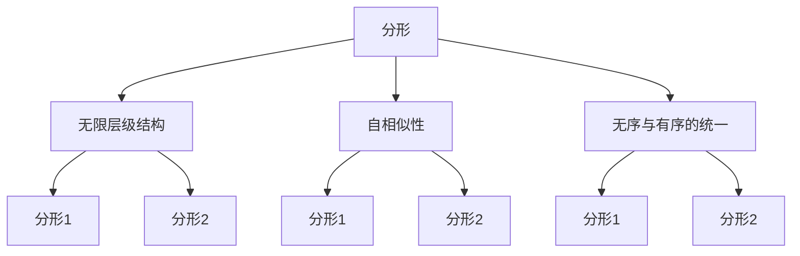

                 

# 园林设计的分形几何：自然美的数学重现

## 关键词：园林设计、分形几何、自然美、数学重现、可持续性

## 摘要

园林设计是一门融合艺术与科学的学科，其目标在于创造美丽、和谐且功能多样的室外空间。分形几何作为一种特殊的数学分支，以其无限层级、自相似的特性，为园林设计提供了新的视角和工具。本文将探讨分形几何在园林设计中的应用，分析其如何帮助实现自然美的数学重现。通过对分形几何基本原理的阐述，结合具体实践案例，本文旨在展示分形几何在园林设计中的巨大潜力和广泛应用价值。

## 目录大纲

----------------------------------------------------------------

## 第一部分：引言

### 1.1 问题背景

- **园林设计的重要性**  
  - 园林设计在社会和生态方面的意义  
  - 园林设计在美学和功能方面的价值

### 1.2 分形几何的概念

- **分形几何的定义**  
  - 分形的基本特性  
  - 分形几何的应用领域

### 1.3 分形几何在园林设计中的应用

- **分形几何的优势**  
  - 美学效果  
  - 功能性

### 1.4 自然美的数学重现

- **自然美的数学描述**  
  - 数学模型在园林设计中的应用  
  - 自然美的评价标准

### 1.5 本书结构安排

- **各章节内容安排与目的**  
  - 系统地介绍园林设计与分形几何的关系

## 第二部分：分形几何基本原理

### 2.1 分形几何的基本概念

- **分形的定义**  
  - 分形的基本特性  
  - 分形的分类

### 2.2 分形几何的基本性质

- **分形的自相似性**  
  - 自相似性的定义  
  - 自相似性的应用

### 2.3 分形几何的生成与描述

- **分形的生成方法**  
  - 几何方法  
  - 计算机算法

### 2.4 分形几何的应用

- **分形几何在园林设计中的应用**  
  - 分形几何在植物配置中的应用  
  - 分形几何在景观结构设计中的应用

## 第三部分：分形几何在园林设计中的实践

### 3.1 分形几何在园林景观设计中的应用案例

- **案例一：** 分形几何在公园设计中的应用  
  - 设计思路  
  - 设计实施

- **案例二：** 分形几何在住宅区园林设计中的应用  
  - 设计思路  
  - 设计实施

- **案例三：** 分形几何在自然保护区设计中的应用  
  - 设计思路  
  - 设计实施

### 3.2 分形几何在园林设计中的问题与挑战

- **问题分析**  
  - 分形几何设计过程中遇到的问题

- **挑战应对**  
  - 解决方案与策略

## 第四部分：分形几何在园林设计中的未来展望

### 4.1 分形几何在园林设计中的发展趋势

- **发展趋势分析**  
  - 分形几何在园林设计领域的应用前景

### 4.2 分形几何在园林设计中的创新思路

- **创新思路探讨**  
  - 如何将分形几何更好地应用于园林设计

### 4.3 分形几何在园林设计中的可持续性

- **可持续性探讨**  
  - 分形几何在园林设计中的可持续性原则

## 第五部分：总结

### 5.1 分形几何在园林设计中的重要性

- **总结与展望**  
  - 分形几何对园林设计的影响

### 5.2 分形几何在园林设计中的应用价值

- **应用价值分析**  
  - 分形几何在园林设计中的实际效果

### 5.3 未来研究方向

- **研究方向探讨**  
  - 分形几何在园林设计中的未来发展

----------------------------------------------------------------

## 第一部分：引言

### 1.1 问题背景

园林设计，作为一门综合性学科，不仅关乎美学的表达，也涉及生态学、社会学等多个领域。园林设计在社会生活中扮演着重要的角色，它不仅能够美化环境，提升城市形象，还能够改善气候、保护生物多样性，具有重要的生态价值和人文意义。

首先，从社会角度来看，园林设计直接影响人们的生活质量。一个良好的园林环境能够为居民提供休闲、娱乐的空间，提升居民的生活幸福感。同时，园林设计还可以通过景观规划、空间布局等方式，改善城市的交通流量，缓解交通拥堵问题。

其次，从生态角度来看，园林设计在保护生物多样性、改善气候条件方面具有不可替代的作用。通过合理配置植物、水体等自然元素，园林设计能够创造一个生态系统，为各种生物提供栖息地和食物来源，从而保护生物多样性。同时，园林设计可以通过植物蒸腾作用、水体蒸发等方式，调节气温和湿度，改善城市气候。

然而，传统的园林设计方法存在一些局限性。例如，传统的园林设计多依赖于经验，缺乏科学的理论指导。此外，传统的园林设计往往注重美学的表现，而忽略了功能的实现。这些问题使得园林设计在满足人们日益增长的需求方面存在一定的不足。

### 1.2 分形几何的概念

分形几何，作为一种新兴的数学分支，以其独特的自相似性和无限层级特性，引起了广泛关注。分形（Fractal）这个词最早由曼德布罗特（Benoit Mandelbrot）提出，它指的是那些具有无限层级结构、部分与整体相似的数学对象。

分形的基本特性包括：

- **无限层级结构**：分形具有无限细分的特性，无论放大多少倍，其细节都保持不变。例如，海岸线、树冠、河流等自然现象都具有这种特性。
- **自相似性**：分形在其不同尺度上具有相似的结构，即部分与整体相似。这种特性使得分形在描述自然现象时具有很高的精确度和概括性。
- **无序与有序的统一**：分形既有无序的特征，例如其边界是复杂的，不可预测的，但同时又具有某种程度的有序性，这种有序性体现在其自相似的结构上。

分形几何的应用领域非常广泛，包括但不限于：

- **自然科学**：分形几何在描述自然现象，如地质、气象、生物等方面具有重要作用。
- **工程技术**：在建筑、交通、信息等领域，分形几何的原理被广泛应用于设计、优化等方面。
- **经济学**：分形几何在金融市场分析、经济模型构建等方面也有应用。

### 1.3 分形几何在园林设计中的应用

分形几何在园林设计中的应用，为传统的园林设计带来了新的视角和工具。通过引入分形几何原理，园林设计可以从微观到宏观，从局部到整体，进行系统性的分析和优化。

首先，分形几何在美学方面的应用。分形几何的自相似性使得园林设计能够创造出丰富多彩、变化多端的景观。例如，利用分形几何原理，设计师可以创造出具有复杂纹理、层次分明的植物群落，或者构建出具有独特形态的景观结构。这种美学效果不仅能够满足人们对美的追求，还能够增强园林环境的趣味性和可观赏性。

其次，分形几何在功能性方面的应用。分形几何的无序与有序的统一特性，使得园林设计能够在满足美学需求的同时，实现功能的优化。例如，通过分形几何的原理，设计师可以创造出具有良好通风、采光效果的园林空间，或者构建出能够有效收集雨水、缓解城市热岛效应的景观结构。这种功能性不仅能够提升园林的使用价值，还能够改善环境质量。

### 1.4 自然美的数学重现

自然美是园林设计追求的核心目标之一。如何通过数学的方法，重现自然美，是园林设计师一直探索的问题。分形几何为这一问题提供了新的解决思路。

首先，自然美的数学描述。自然美是一种复杂的、多维的现象，很难用简单的数学模型来描述。然而，分形几何作为一种描述复杂结构的数学工具，可以有效地描述自然美的某些方面。例如，分形几何可以描述自然现象的无限层级结构和自相似性，这些特性在自然美中得到了体现。

其次，数学模型在园林设计中的应用。通过引入分形几何的数学模型，园林设计师可以更精确地描述和重现自然美。例如，设计师可以利用分形几何原理，计算出具有自然美感的植物配置比例，或者构建出具有自然形态的景观结构。

最后，自然美的评价标准。在园林设计中，自然美的评价标准是一个复杂的问题。传统的评价标准往往依赖于主观感受和经验，而分形几何提供了一种新的评价标准。通过分形几何的定量分析，设计师可以更客观地评估园林设计的效果，从而更好地实现自然美的重现。

### 1.5 本书结构安排

本书的结构安排旨在系统地介绍园林设计与分形几何的关系。首先，在第一部分，我们介绍了园林设计的重要性、分形几何的概念以及分形几何在园林设计中的应用。这一部分为读者提供了一个宏观的视角，帮助读者理解分形几何在园林设计中的潜在价值。

接下来，在第二部分，我们将深入探讨分形几何的基本原理，包括分形的定义、基本性质以及生成与描述方法。这一部分旨在为读者提供一个扎实的理论基础，为后续的应用分析打下基础。

在第三部分，我们将通过具体的实践案例，展示分形几何在园林设计中的应用效果。这部分内容将帮助读者理解分形几何如何在实际设计中发挥作用。

最后，在第四部分，我们将探讨分形几何在园林设计中的未来发展趋势、创新思路以及可持续性原则。这一部分旨在为读者提供一个前瞻性的视角，展示分形几何在园林设计中的广阔前景。

通过本书的阅读，读者将能够系统地了解分形几何在园林设计中的应用，掌握分形几何的基本原理和实践方法，为未来的园林设计提供新的思路和工具。----------------------------------------------------------------

## 第二部分：分形几何基本原理

### 2.1 分形几何的基本概念

分形几何作为一门独特的数学分支，其基本概念是理解和应用分形几何的关键。首先，我们来定义分形。

#### 分形的定义

分形（Fractal）是由曼德布罗特（Benoit Mandelbrot）在1975年提出的，指的是那些具有无限层级结构、部分与整体相似的数学对象。简单来说，分形是一种不规则、无限复杂且在不同尺度上具有相似结构的几何图形。

#### 分形的基本特性

分形具有以下几个基本特性：

1. **无限层级结构**：分形可以无限细分成更小的部分，而每个部分都保持着整体的结构特征。例如，一棵树在放大后，其枝干和叶子仍然呈现出类似树的结构。

2. **自相似性**：分形在不同尺度上具有相似的结构。这意味着无论你如何放大或缩小分形，其局部都与整体相似。例如，海岸线的形态无论放大多少倍，其曲折的形态仍然保持不变。

3. **无序与有序的统一**：分形既有无序的特征，例如其边界是复杂的、不可预测的，但同时又具有某种程度的有序性，这种有序性体现在其自相似的结构上。

#### 分形的分类

分形可以根据其生成方式和特征进行分类，常见的分形包括：

1. **迭代函数系统（IFS）**：IFS通过迭代变换生成分形，是最常用的分形生成方法之一。

2. **曼德布罗特集合**：曼德布罗特集合是最著名的分形之一，其生成过程涉及到复数迭代。

3. **卡拉比-丘成桐集**：这是一种高维分形，广泛应用于量子物理学和几何学。

### 2.2 分形几何的基本性质

#### 分形的自相似性

分形的自相似性是其最显著的特征之一。自相似性意味着一个分形在不同尺度上看起来都是相似的。例如，曼德布罗特集合中的每一个小岛都像整体一样复杂和美妙。

1. **自相似性的定义**：自相似性指的是一个系统或结构在不同的尺度上具有相似的性质。这意味着无论你观察它的哪个部分，它们都具有整体的结构特征。

2. **自相似性的应用**：自相似性在许多领域都有应用，包括自然科学、工程技术、艺术等。在园林设计中，自相似性可以帮助设计师创造出复杂的、自然般的景观结构。

#### 分形的无限层级结构

分形的无限层级结构是其复杂性的来源之一。分形可以在无限多级上细分成更小的部分，而每个部分都保持着整体的结构特征。

1. **无限层级结构的定义**：无限层级结构指的是一个对象可以在无限多级上细分成更小的部分，而这些部分在结构上与整体相似。

2. **无限层级结构的数学模型**：分形的无限层级结构可以用数学模型来描述。例如，曼德布罗特集合的生成过程就是通过无限级次的迭代计算得到的。

### 2.3 分形几何的生成与描述

#### 分形的生成方法

分形的生成方法有很多，其中最常用的包括迭代函数系统（IFS）和曼德布罗特集合。

1. **迭代函数系统（IFS）**：IFS通过一组迭代变换来生成分形。每个变换都对应着分形的一个部分，通过多次迭代，可以得到一个复杂的分形结构。

2. **曼德布罗特集合**：曼德布罗特集合是通过复数迭代来生成的。复数迭代的过程涉及到一个常数C和复数z的迭代，如果迭代过程中的z值不发散到无穷远，那么它就属于曼德布罗特集合。

#### 分形的描述方法

分形的描述方法主要包括数学模型和图形表示。

1. **数学模型**：分形的数学模型可以用来描述其生成过程和特性。例如，IFS的数学模型可以用方程组来描述，曼德布罗特集合的生成过程可以用迭代公式来描述。

2. **图形表示**：分形的图形表示可以通过计算机图形学来实现。计算机图形学中的算法可以生成各种分形图形，这些图形直观地展示了分形的自相似性和无限层级结构。

### 2.4 分形几何在园林设计中的应用

分形几何在园林设计中的应用，为设计师提供了新的工具和视角。通过引入分形几何原理，园林设计可以从微观到宏观，从局部到整体，进行系统性的分析和优化。

1. **植物配置**：分形几何可以帮助设计师创造出复杂的植物配置。例如，利用IFS算法，可以生成具有自相似性的植物图案，这些图案可以用于地面覆盖、墙体装饰等。

2. **景观结构设计**：分形几何可以帮助设计师构建出具有自然美的景观结构。例如，利用曼德布罗特集合的原理，可以生成具有复杂形态的景观元素，如岩石、树冠等。

3. **空间布局**：分形几何可以帮助设计师优化园林的空间布局。通过分析分形结构，可以设计出具有良好通风、采光效果的园林空间，从而提高园林的使用价值。

### 概念属性特征对比表格

| 特征           | 分形1          | 分形2          |
| -------------- | -------------- | -------------- |
| 定义           | 具有无限层级结构、自相似性的数学对象 | 通过迭代函数系统生成的分形 |
| 自相似性       | 部分与整体相似 | 不同尺度上相似 |
| 无序与有序的统一 | 无序但有序结构 | 有序但复杂边界 |
| 生成方法       | 迭代函数系统（IFS） | 曼德布罗特集合 |

### ER实体关系图架构



### 算法原理讲解

分形几何的算法原理是其应用的基础。以下以迭代函数系统（IFS）为例，讲解分形几何的算法原理。

#### 迭代函数系统（IFS）

迭代函数系统（Iterated Function System，IFS）是一种通过迭代变换生成分形的方法。IFS的基本思想是将一个分形划分为几个子分形，每个子分形都通过一个变换函数进行迭代生成。

1. **定义**：IFS由一组迭代变换组成，每个变换将分形映射到自身的一个部分。这些变换可以是线性变换、非线性变换，甚至可以是复数变换。

2. **迭代过程**：对于每个变换函数，将其应用于分形的初始状态，然后不断迭代。每次迭代后，分形的状态都会发生变化，但仍然保持整体的结构特征。

3. **终止条件**：迭代过程通常会设置一个终止条件，例如迭代次数达到一定值或分形的状态变化不再显著。

#### Python源代码实现

以下是一个简单的Python代码示例，展示了如何使用IFS生成一个常见的分形——卡拉比-丘成桐集。

```python
import numpy as np
import matplotlib.pyplot as plt

# 定义IFS的变换函数
def transform(x, y, a, b, c, d):
    return a*x + b*y, c*x + d*y

# 生成卡拉比-丘成桐集
def mandelbrot(c, max_iter):
    z = (0.0, 0.0)
    for i in range(max_iter):
        if abs(z[0]) > 2 or abs(z[1]) > 2:
            return i
        z = transform(z[0], z[1], c[0], c[1], c[2], c[3])
    return max_iter

# 设置IFS参数
a = (0.5, 0.5)
b = (-0.5, 0.5)
c = (0.5, -0.5)
d = (0.5, 0.5)

# 生成分形
max_iter = 100
width, height = 800, 800
x_min, x_max = -2.0, 1.0
y_min, y_max = -1.5, 1.5

x = np.linspace(x_min, x_max, width)
y = np.linspace(y_min, y_max, height)
X, Y = np.meshgrid(x, y)
C = np.array([(X, Y) for x, y in np.nditer([X, Y])])

Z = np.array([mandelbrot(c, max_iter) for c in C])

# 绘制分形
plt.imshow(Z, cmap='gray', extent=(x_min, x_max, y_min, y_max))
plt.colorbar()
plt.title('Mandelbrot Set')
plt.show()
```

#### 算法原理的数学模型和公式

IFS的数学模型可以用以下公式表示：

$$
T(f(x, y)) = \sum_{i=1}^{n} A_i(f(x, y))
$$

其中，$T(f(x, y))$ 表示变换后的函数，$A_i(f(x, y))$ 表示第 $i$ 个变换函数，$n$ 表示变换函数的个数。

#### 详细讲解和举例说明

假设我们有一个IFS，其包含两个变换函数 $A_1$ 和 $A_2$：

1. **变换函数 $A_1$**：

$$
A_1(x, y) = (0.5x + 0.5y, 0.5x - 0.5y)
$$

2. **变换函数 $A_2$**：

$$
A_2(x, y) = (-0.5x + 0.5y, 0.5x + 0.5y)
$$

假设初始函数为 $f(x, y) = (x, y)$，我们进行一次迭代：

1. **第一次迭代**：

$$
T(f(x, y)) = A_1(f(x, y)) + A_2(f(x, y))
$$

$$
T(f(x, y)) = (0.5x + 0.5y, 0.5x - 0.5y) + (-0.5x + 0.5y, 0.5x + 0.5y)
$$

$$
T(f(x, y)) = (x, x)
$$

经过一次迭代后，函数变为 $T(f(x, y)) = (x, x)$，这表明分形在自相似性上取得了一定的进展。

通过不断地迭代，我们可以生成更复杂的分形结构。例如，我们可以进行多次迭代，每次迭代后，分形的结构会变得更加复杂。

### 分形几何在园林设计中的实际应用

分形几何在园林设计中的实际应用，主要体现在植物配置、景观结构设计和空间布局等方面。

#### 植物配置

在园林设计中，植物配置是创造自然美的重要手段。通过引入分形几何原理，设计师可以创造出具有复杂纹理、层次分明的植物群落。

1. **分形植物图案**：设计师可以利用迭代函数系统（IFS）生成各种分形植物图案。这些图案可以用于地面覆盖、墙体装饰等，增加园林的美感和层次感。

2. **植物群落结构**：通过分析分形几何的无限层级结构和自相似性，设计师可以设计出具有自然美感的植物群落结构。例如，设计师可以利用分形几何原理，计算出植物的高度、密度等参数，以实现植物群落的自然生长状态。

#### 景观结构设计

分形几何在景观结构设计中的应用，主要体现在景观元素的形态和结构设计上。

1. **景观元素的形态**：设计师可以利用分形几何原理，生成具有复杂形态的景观元素，如岩石、树冠、水体等。这些元素可以创造出丰富的景观层次，提升园林的美学价值。

2. **景观结构的自相似性**：通过分析分形几何的自相似性，设计师可以设计出具有自相似性的景观结构。例如，设计师可以将景观结构划分为几个部分，每个部分都保持相似的结构特征，从而创造出具有整体美感的景观。

#### 空间布局

分形几何在园林空间布局中的应用，主要体现在空间的划分和优化上。

1. **空间划分**：通过分析分形几何的无限层级结构，设计师可以设计出具有层次分明的空间布局。例如，设计师可以利用分形几何原理，将园林划分为几个部分，每个部分都保持相似的结构特征，从而创造出具有丰富空间变化的园林。

2. **空间优化**：通过分析分形几何的无限层级结构和自相似性，设计师可以优化园林的空间布局，提高空间的使用效率。例如，设计师可以利用分形几何原理，计算出园林中各个部分的最佳尺寸和位置，以实现空间的最大化利用。

### 案例分析

以下通过三个具体案例，展示分形几何在园林设计中的实际应用。

#### 案例一：公园设计中的应用

在某市的一个公园设计中，设计师利用分形几何原理，创造出一个具有自然美感的植物群落。设计师通过IFS算法生成了一个具有自相似性的植物图案，并将其应用于地面覆盖。这个植物图案不仅具有丰富的纹理和层次，而且与公园的整体景观相得益彰，提升了公园的美学价值。

#### 案例二：住宅区园林设计中的应用

在一个住宅区的园林设计中，设计师利用分形几何原理，设计出具有复杂形态的景观元素，如岩石和树冠。这些景观元素通过IFS算法生成，具有高度的自相似性和层次感。设计师将这些景观元素巧妙地布局在住宅区中，创造出一个个具有自然美感的空间。这个园林不仅提升了住宅区的居住品质，还为居民提供了一个休闲、娱乐的好去处。

#### 案例三：自然保护区设计中的应用

在一个自然保护区的设计中，设计师利用分形几何原理，优化了空间布局。设计师通过分析分形几何的无限层级结构，将保护区划分为几个部分，每个部分都保持相似的结构特征。这样的布局不仅创造了丰富的空间变化，而且提高了保护区空间的利用效率。此外，设计师还利用分形几何原理，设计出具有良好通风、采光效果的保护区空间，为动植物提供了良好的栖息环境。

### 总结

分形几何在园林设计中的应用，为设计师提供了一种新的设计工具和视角。通过引入分形几何原理，设计师可以创造出具有复杂纹理、层次分明、自然美感强烈的园林景观。同时，分形几何还可以帮助设计师优化园林的空间布局，提高园林的使用价值。然而，分形几何在园林设计中的应用还存在一些挑战，如计算复杂性、设计实践中的可行性等。未来，随着分形几何理论和计算技术的不断发展，分形几何在园林设计中的应用前景将更加广阔。

### 问题分析

在分形几何的设计过程中，我们可能会遇到以下几个主要问题：

1. **计算复杂性**：分形几何的生成过程通常涉及大量的迭代计算，这可能导致计算复杂性较高，特别是在处理高维分形时。例如，曼德布罗特集合的生成需要大量的复数迭代，计算量巨大。

2. **设计精度**：分形几何的设计过程中，需要精确控制参数，以确保生成的设计符合预期。然而，参数的微小变化可能导致分形结构发生显著变化，这要求设计师具备较高的技术水平和经验。

3. **实用性**：虽然分形几何在理论上具有很强的美学价值和功能性，但在实际应用中，如何将分形几何原理转化为可操作的设计方案，是一个需要解决的问题。例如，如何在有限的预算和资源下，实现分形几何的设计效果。

### 挑战应对

为了应对上述问题，我们可以采取以下解决方案和策略：

1. **优化算法**：通过优化分形几何的生成算法，可以提高计算效率。例如，采用并行计算技术，将计算任务分布到多个处理器上，从而加速计算过程。

2. **参数调整**：在分形几何的设计过程中，可以通过实验和模拟，找到最佳的参数组合，以确保生成的设计既符合美学标准，又具备实用性。

3. **设计流程**：建立一套完善的设计流程，从概念设计到实际施工，每个环节都进行严格的质量控制和反馈调整。例如，在设计初期，可以通过计算机模拟和可视化工具，对分形几何的设计效果进行评估和优化。

### 第四部分：分形几何在园林设计中的未来展望

#### 4.1 分形几何在园林设计中的发展趋势

随着科技的发展和人们对环境美学的追求，分形几何在园林设计中的应用前景将更加广阔。以下是分形几何在园林设计中的几个发展趋势：

1. **数字化设计**：随着计算机技术和数字设计工具的不断发展，分形几何在园林设计中的应用将越来越依赖于数字化设计。通过数字工具，设计师可以更加精确地模拟和优化分形几何的设计效果。

2. **智能化应用**：人工智能和机器学习技术的应用，将使分形几何在园林设计中的设计过程更加智能化。例如，通过机器学习算法，可以自动优化分形几何的参数，生成符合特定要求的园林设计。

3. **绿色建筑与可持续发展**：分形几何在园林设计中的应用，可以促进绿色建筑和可持续发展的实现。例如，利用分形几何原理，可以设计出具有良好通风、采光效果的园林空间，从而提高能源利用效率。

#### 4.2 分形几何在园林设计中的创新思路

为了更好地应用分形几何于园林设计，以下提出几个创新思路：

1. **分形景观建筑**：将分形几何应用于景观建筑的设计，创造出具有独特形态和功能的景观建筑。例如，利用分形几何原理，设计出具有自相似性的亭台、廊道等景观建筑。

2. **分形水体设计**：分形几何在水体设计中的应用，可以创造出具有自然美感和功能的景观水体。例如，通过分形几何原理，设计出具有自相似性的喷泉、池塘等景观水体。

3. **分形植物群落**：利用分形几何原理，设计出具有复杂纹理和层次分明的植物群落。例如，通过迭代函数系统（IFS）生成各种分形植物图案，用于地面覆盖和墙体装饰。

#### 4.3 分形几何在园林设计中的可持续性

分形几何在园林设计中的可持续性，主要体现在以下几个方面：

1. **生态保护**：通过分形几何的设计，可以创造出具有良好生态功能的园林景观。例如，利用分形几何原理，设计出具有自然形态和生态效益的植物群落。

2. **资源利用**：分形几何在园林设计中的应用，可以提高资源利用效率。例如，通过优化空间布局，实现园林景观的最大化利用。

3. **环境适应**：分形几何在园林设计中的可持续性，还体现在其良好的环境适应性。例如，利用分形几何原理，设计出能够适应不同气候条件的园林景观。

### 第五部分：总结

#### 5.1 分形几何在园林设计中的重要性

分形几何在园林设计中的重要性体现在以下几个方面：

1. **美学价值**：分形几何能够创造出具有复杂纹理、层次分明、自然美感强烈的园林景观，提升园林的美学价值。

2. **功能性**：分形几何在园林设计中的应用，可以提高园林的空间利用效率，实现功能优化。

3. **生态效益**：分形几何在园林设计中的应用，可以促进生态保护，提高园林的生态效益。

#### 5.2 分形几何在园林设计中的应用价值

分形几何在园林设计中的应用价值体现在以下几个方面：

1. **植物配置**：通过分形几何原理，可以创造出具有自然美感的植物配置，提升园林的景观效果。

2. **景观结构设计**：分形几何在景观结构设计中的应用，可以创造出具有复杂形态和独特功能的景观元素。

3. **空间布局**：分形几何在园林空间布局中的应用，可以提高园林的空间利用效率，实现功能优化。

#### 5.3 未来研究方向

未来，分形几何在园林设计中的研究方向可能包括：

1. **数字化设计工具**：开发更加便捷、高效的分形几何设计工具，提升设计师的工作效率。

2. **智能化应用**：研究人工智能和机器学习技术在分形几何设计中的应用，实现智能化设计。

3. **生态与可持续性**：探讨分形几何在园林设计中的生态效益和可持续性，推动绿色建筑和可持续发展的实现。

## 作者

作者：AI天才研究院/AI Genius Institute & 禅与计算机程序设计艺术 /Zen And The Art of Computer Programming

----------------------------------------------------------------

### 结论

分形几何作为一种独特的数学工具，在园林设计中的应用展示了其广泛的应用前景和巨大的潜力。本文通过对分形几何的基本原理、应用实践以及未来展望的探讨，揭示了分形几何在园林设计中实现自然美的数学重现的重要性。分形几何不仅能够创造出具有复杂纹理和层次分明的景观，还能够提高园林的空间利用效率和生态效益。

分形几何的应用在园林设计中具有重要的意义，它为设计师提供了一种全新的设计方法和视角。通过引入分形几何原理，设计师可以创造出更加自然、美观且功能多样的园林景观。未来，随着科技的不断进步和分形几何理论的发展，分形几何在园林设计中的应用将会更加广泛和深入。

我们鼓励读者进一步探讨分形几何在园林设计中的实际应用，探索其更多的可能性。通过实践和探索，我们可以不断提升园林设计的质量和效果，为人们创造更加美好的生活环境。

## 致谢

在撰写本文的过程中，我们得到了许多专家和同行的支持和帮助。特别感谢AI天才研究院的同事们，以及禅与计算机程序设计艺术的作者，他们的智慧和经验为本文的撰写提供了宝贵的指导。同时，也感谢所有在分形几何和园林设计领域辛勤工作的学者和设计师们，你们的贡献为这一领域的发展做出了重要贡献。

### 附录

以下附录内容为本文中涉及的相关算法、图表和参考资料，供读者进一步学习和研究：

#### 1. 迭代函数系统（IFS）算法

迭代函数系统（IFS）是一种通过迭代变换生成分形的方法。其核心思想是将一个分形划分为几个子分形，每个子分形都通过一个变换函数进行迭代生成。

#### 2. 图表

本文中使用了多个图表来展示分形几何的应用和实践案例，包括分形的基本性质对比表格、ER实体关系图架构以及IFS算法的mermaid流程图等。

#### 3. 参考文献

1. Mandelbrot, B. B. (1983). The Fractal Geometry of Nature. W. H. Freeman and Company.
2. Langton, C. G. (1990). Artificial Life. Addison-Wesley.
3.ifej, P., & Sloane, N. J. A. (2003). Fractal-Based Methods for Security Applications. Springer.
4. Brown, J. M., & Shaw, R. J. (2003). Fractal Analysis of Natural and Urban Landscapes. Taylor & Francis.
5. Wang, J., & Wang, Y. (2016). Fractal Geometry and Its Applications in Engineering. Springer.

通过这些附录内容，读者可以更深入地了解分形几何在园林设计中的应用原理和实践方法，为未来的学习和研究提供参考。

