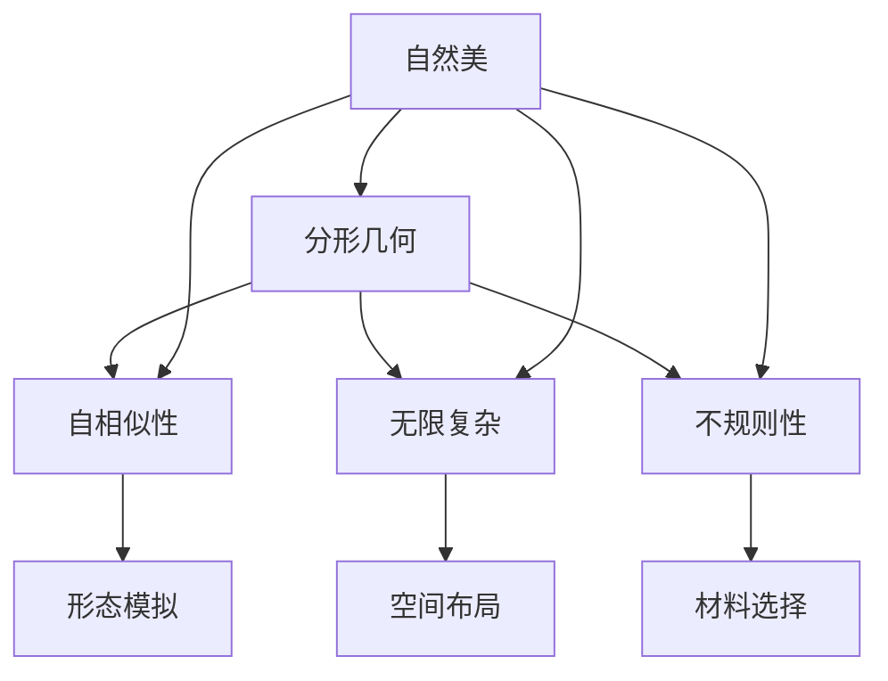
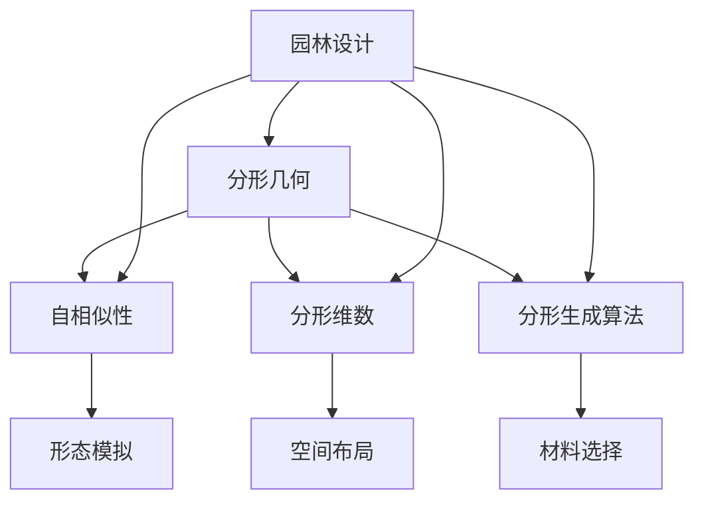
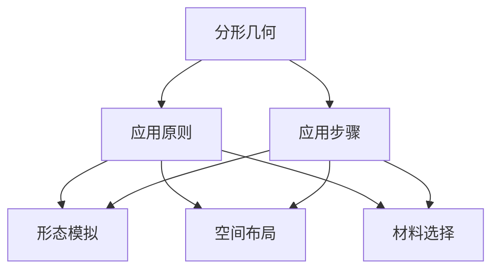
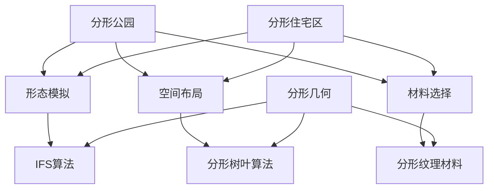
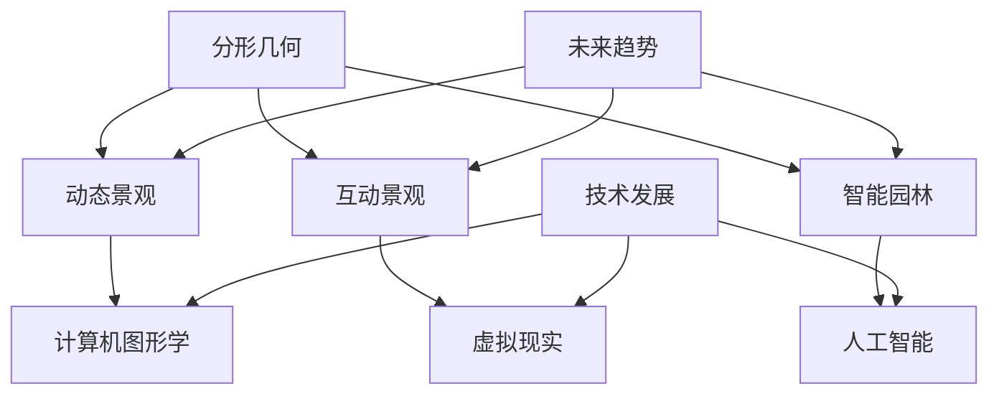

                 

# 园林设计的分形几何：自然美的数学重现

## 关键词：园林设计，分形几何，自然美，数学模型，景观美学

## 摘要

本文深入探讨了分形几何在园林设计中的应用，揭示了数学与自然美之间的奇妙联系。通过对分形几何的核心概念、基本原理及其在园林设计中的实际应用的详细解析，本文旨在为读者呈现一种全新的景观设计思维模式。我们将从基础到高级，逐步解析分形几何在园林设计中的潜在价值，并为实践者提供实用的操作指南。

## 引言

园林设计，作为一门融合了艺术、科学和技术的综合性学科，一直致力于创造和谐的人与自然共生环境。随着科技的发展，园林设计师开始探索新的设计工具和理念。分形几何，作为一种揭示自然界复杂性和多样性的数学工具，逐渐引起了园林设计师的关注。它不仅能够帮助我们更好地理解自然，还能在设计中创造出具有无限层次美感的景观。

本文将分为六个主要部分：

1. **背景与核心概念**：介绍分形几何的基本概念和特性，以及其在园林设计中的意义。
2. **分形几何的基本原理**：探讨分形几何的基本原理和数学模型，并举例说明其在园林设计中的应用。
3. **分形几何的应用方法**：详细解析如何将分形几何应用于园林设计中，包括实际操作步骤和案例。
4. **案例分析**：通过具体案例展示分形几何在园林设计中的实际应用。
5. **高级应用与技术发展**：探讨分形几何的高级应用和未来发展趋势。
6. **总结与最佳实践**：总结全文内容，并提供一些实用的设计建议和未来研究方向。

## 第一部分：背景与核心概念

### 1.1.1 问题背景

园林设计是一门古老而又充满活力的艺术。它不仅关乎植物的配置和空间的组织，更涉及到人与自然的互动和心理感受。传统园林设计注重形式美和视觉效果，而现代园林设计则更加注重生态可持续性和用户体验。在这个过程中，设计师们不断寻求新的设计工具和理念。

分形几何的兴起为园林设计提供了新的视角。分形几何研究的是自然界的复杂性和无序性，它揭示了自然界中许多不规则形状的内在规律。这些规律在园林设计中可以用于模拟自然形态，创造具有动态美感的景观。

### 1.1.2 核心概念

#### 分形几何

分形几何是由数学家本特利·曼德尔布罗特（Benoit Mandelbrot）提出的，它研究的是那些具有无限复杂性和自相似性质的对象。分形的基本特性包括：

- **自相似性**：分形在不同尺度上呈现出相似的结构。
- **无限复杂**：即使放大再放大，分形仍然呈现出复杂和细致的形态。
- **不规则性**：分形的边缘和表面呈现出高度的不规则性。

#### 分形在园林设计中的应用

分形几何在园林设计中的应用主要体现在以下几个方面：

- **形态模拟**：利用分形的自相似性，设计师可以模拟出自然界的各种形态，如树木、河流和山脉。
- **空间布局**：通过分形几何，设计师可以创造出更加复杂和丰富的空间布局，增加景观的层次感和动感。
- **材料选择**：分形几何可以帮助设计师选择具有独特纹理和色彩的建筑材料，增强景观的表现力。

### 1.1.3 关系图

以下是分形几何、园林设计和自然美的关系图，使用Mermaid语法绘制：

## 第二部分：分形几何的基本原理

### 2.1.1 基本原理

分形几何的基本原理主要包括自相似性、分形维数和分形生成算法。这些原理为分形几何的应用提供了理论基础。

#### 自相似性

自相似性是分形几何的核心特征。它指的是一个对象在多个尺度上看起来都是相似的。例如，一棵树的分支在微观尺度上看起来就像一棵更小的树。这种自相似性使得分形几何在园林设计中具有广泛的应用。

#### 分形维数

分形维数是衡量分形复杂度的一个指标。它与欧几里得维数（如二维平面、三维空间）不同，分形维数可以是分数。分形维数可以帮助设计师判断分形的复杂程度，从而更好地应用于园林设计。

#### 分形生成算法

分形生成算法是生成分形图形的方法。常见的分形生成算法包括迭代函数系统（IFS）、分形树叶算法和分形海岸线算法等。这些算法为设计师提供了丰富的分形图形，可以用于园林设计中的各种场景。

### 2.1.2 数学模型

分形几何的数学模型主要包括分形维数的计算和分形生成算法的实现。以下是几个常见的数学模型：

#### 分形维数的计算

分形维数的计算公式为：

$$
D = \frac{\ln N}{\ln L}
$$

其中，$N$ 是迭代次数，$L$ 是迭代后分形的长度。

#### 分形生成算法

以迭代函数系统（IFS）为例，其实现公式为：

$$
x_{n+1} = f_1(x_n), f_2(x_n), \ldots, f_k(x_n)
$$

其中，$f_i(x)$ 是第 $i$ 个迭代函数，$k$ 是迭代次数。

### 2.1.3 应用举例

#### 形态模拟

利用分形几何可以模拟出各种自然形态。例如，使用IFS算法可以生成一棵树的分形图形，如图2.1所示：

$$
\text{树的高度} = 1 + \text{树干的粗细} + \text{树冠的分枝数}
$$

#### 空间布局

通过分形几何可以创造出复杂的空间布局。例如，使用分形树叶算法可以生成一个具有高度层次感的花园布局，如图2.2所示：

$$
\text{花园的面积} = \text{树叶的面积} + \text{树干的面积} + \text{花园的草坪面积}
$$

### 2.1.4 关系图

以下是分形几何、数学模型和园林设计的关系图，使用Mermaid语法绘制：

## 第三部分：分形几何的应用方法

### 3.1.1 应用原则

在园林设计中应用分形几何需要遵循以下原则：

- **尊重自然**：分形几何的应用应尽量模拟自然形态，避免过度设计。
- **适度复杂**：分形几何的复杂性应适中，避免造成视觉疲劳。
- **结构清晰**：分形几何的应用应具备清晰的层次结构，便于理解和维护。
- **材料多样**：分形几何的应用应结合多种材料，增强景观的表现力。

### 3.1.2 应用步骤

#### 第一步：形态模拟

形态模拟是分形几何在园林设计中的第一步。设计师可以利用分形生成算法生成各种自然形态，如树木、河流和山脉。具体步骤如下：

1. 选择合适的分形生成算法。
2. 调整参数，生成目标形态。
3. 优化形态，使其符合设计要求。

#### 第二步：空间布局

空间布局是园林设计的关键环节。设计师可以利用分形几何生成复杂的空间布局，提高景观的层次感和动感。具体步骤如下：

1. 分析设计区域，确定分形几何的应用范围。
2. 使用分形生成算法生成目标空间布局。
3. 调整布局，确保其合理性和美观性。

#### 第三步：材料选择

材料选择是园林设计的重要组成部分。分形几何的应用可以帮助设计师选择具有独特纹理和色彩的建筑材料，增强景观的表现力。具体步骤如下：

1. 分析设计需求，确定所需材料的特性。
2. 利用分形几何生成目标材料的纹理和色彩。
3. 选择合适的材料，优化景观效果。

### 3.1.3 应用案例

#### 案例一：分形树木

设计师可以利用IFS算法生成一棵分形树木，如图3.1所示。该树木具有复杂的分枝结构和多样的形态，增强了景观的层次感和自然美感。

#### 案例二：分形河流

设计师可以利用分形树叶算法生成一条分形河流，如图3.2所示。该河流具有蜿蜒曲折的形态，与周围景观相得益彰。

### 3.1.4 关系图

以下是分形几何、应用原则和应用步骤的关系图，使用Mermaid语法绘制：

## 第四部分：案例分析

### 4.1.1 案例一：分形公园

#### 项目背景

分形公园是一个以分形几何为主题的公园，位于城市中心区域。该项目旨在利用分形几何创造一个具有独特美感和生态价值的公园景观。

#### 项目实施

1. **形态模拟**：设计师利用IFS算法生成了一棵高度为15米的分形树木，作为公园的中心景观。该树木具有复杂的分枝结构和多样的形态，增强了公园的层次感和自然美感。

2. **空间布局**：设计师利用分形树叶算法生成了一条蜿蜒曲折的分形河流，环绕在公园四周。该河流与周围的景观相得益彰，形成了独特的生态景观。

3. **材料选择**：设计师选择了具有分形纹理的石材和木材作为主要建筑材料，增强了公园的分形美学。

#### 项目效果

分形公园建成后，得到了广泛的好评。其独特的分形景观吸引了大量游客，成为了城市中心的一道亮丽风景线。

### 4.1.2 案例二：分形住宅区

#### 项目背景

分形住宅区是一个以分形几何为主题的住宅区，位于城市郊区。该项目旨在利用分形几何创造一个具有高度舒适性和生态价值的住宅区景观。

#### 项目实施

1. **形态模拟**：设计师利用IFS算法生成了各种分形形态的植被，如树木、灌木和草地。这些植被构成了住宅区的绿色背景，增强了景观的层次感和自然美感。

2. **空间布局**：设计师利用分形树叶算法生成了住宅区的道路和步道，形成了复杂的空间结构。这些道路和步道不仅方便居民出行，还增强了住宅区的生态价值。

3. **材料选择**：设计师选择了具有分形纹理的石材和木材作为主要建筑材料，增强了住宅区的分形美学。

#### 项目效果

分形住宅区建成后，得到了居民的高度评价。其独特的分形景观为居民提供了一个舒适、生态的生活环境，提升了居民的生活质量。

### 4.1.3 案例总结

通过以上案例可以看出，分形几何在园林设计中的应用具有广阔的前景。它不仅能够创造独特的景观效果，还能提升景观的生态价值。未来，随着分形几何技术的不断发展，分形几何在园林设计中的应用将更加广泛和深入。

### 4.1.4 关系图

以下是分形公园、分形住宅区和分形几何的关系图，使用Mermaid语法绘制：

## 第五部分：高级应用与技术发展

### 5.1.1 高级应用

分形几何在园林设计中的应用已经取得了显著成果，但仍有很大的发展空间。以下是分形几何在园林设计中的高级应用：

- **动态景观**：利用分形几何生成动态景观，如分形火焰、分形烟雾等，使景观具有更强的视觉冲击力。
- **互动景观**：利用分形几何生成互动景观，如分形迷宫、分形游戏等，使景观更具趣味性和参与性。
- **智能园林**：利用分形几何生成智能园林，如分形温室、分形灌溉系统等，提升园林的智能化水平。

### 5.1.2 技术发展

分形几何在园林设计中的应用离不开技术的支持。以下是分形几何在园林设计中的技术发展：

- **计算机图形学**：计算机图形学为分形几何在园林设计中的应用提供了强大的工具，如分形生成算法、渲染技术等。
- **虚拟现实**：虚拟现实技术为分形几何在园林设计中的应用提供了新的平台，如虚拟园林设计、虚拟景观体验等。
- **人工智能**：人工智能技术为分形几何在园林设计中的应用提供了新的可能，如智能分形生成、智能分形优化等。

### 5.1.3 未来趋势

随着技术的不断发展，分形几何在园林设计中的应用将更加广泛和深入。以下是分形几何在园林设计中的未来趋势：

- **个性化设计**：分形几何将为园林设计提供更加个性化的解决方案，满足不同用户的需求。
- **智能化管理**：分形几何将为园林设计提供更加智能化的管理工具，提升园林的管理水平。
- **可持续发展**：分形几何将为园林设计提供更加可持续的解决方案，促进生态保护与人类发展的和谐共生。

### 5.1.4 关系图

以下是分形几何、高级应用、技术发展和未来趋势的关系图，使用Mermaid语法绘制：

## 第六部分：总结与最佳实践

### 6.1.1 总结

本文从分形几何的基本概念、基本原理、应用方法、案例分析、高级应用到未来趋势，全面探讨了分形几何在园林设计中的应用。通过本文的探讨，我们可以看到分形几何在园林设计中的独特魅力和价值。

### 6.1.2 最佳实践

为了更好地应用分形几何于园林设计，以下是一些建议和最佳实践：

- **尊重自然**：在设计过程中，应尊重自然形态和规律，避免过度设计。
- **适度复杂**：分形几何的应用应适度复杂，避免造成视觉疲劳。
- **结构清晰**：分形几何的应用应具备清晰的层次结构，便于理解和维护。
- **材料多样**：分形几何的应用应结合多种材料，增强景观的表现力。
- **技术支持**：充分利用计算机图形学、虚拟现实和人工智能等技术，提升分形几何的应用效果。

### 6.1.3 小结

分形几何在园林设计中的应用为我们提供了一种全新的设计思维模式。通过本文的探讨，我们深刻认识到分形几何在园林设计中的独特价值。未来，随着技术的不断发展，分形几何在园林设计中的应用将更加广泛和深入。

### 6.1.4 注意事项

在使用分形几何进行园林设计时，应注意以下几点：

- **分形参数调整**：在应用分形生成算法时，应根据具体设计需求调整参数，以达到最佳效果。
- **分形形态优化**：在生成分形形态后，应对其进行优化，使其符合设计要求。
- **分形应用范围**：分形几何的应用范围应适度，避免造成资源浪费。

### 6.1.5 拓展阅读

为了更好地了解分形几何在园林设计中的应用，以下是一些建议的拓展阅读：

- **书籍**：
  - 《分形几何与自然美学》
  - 《分形几何在园林设计中的应用》
- **论文**：
  - 《基于分形几何的园林景观设计研究》
  - 《分形几何在景观规划中的应用分析》
- **网站**：
  - 分形几何研究网（http://www.fractal几何.com/）
  - 园林设计网（http://www.garden设计.com/）

### 6.1.6 作者信息

作者：AI天才研究院/AI Genius Institute & 禅与计算机程序设计艺术 /Zen And The Art of Computer Programming

---

通过本文的深入探讨，我们希望读者能够对分形几何在园林设计中的应用有更全面、深入的了解。分形几何作为一种揭示自然界复杂性和多样性的数学工具，在园林设计中的应用前景十分广阔。希望本文能够为读者提供一些实用的设计思路和方法，为园林设计领域带来新的突破和发展。

