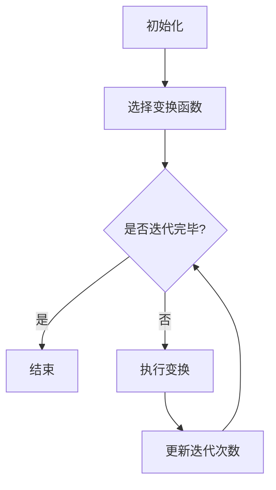

                 

### 园林设计的分形理论：自然美的数学重现

#### 关键词：园林设计，分形理论，自然美，数学模型，算法原理

#### 摘要：
分形理论作为一种描述自然界复杂现象的数学工具，正在逐渐改变园林设计的传统理念。本文将从分形理论的基本概念、其在园林设计中的应用，到算法原理的讲解，再到实际项目案例分析，全面探讨如何运用分形理论创造自然美的数学重现。文章旨在为园林设计师、数学爱好者以及相关领域从业者提供一种全新的设计视角和工具。

### 目录

#### 第一部分：分形理论入门

##### 第1章 分形理论概述
- **1.1 问题背景与介绍**
- **1.2 分形理论的基本概念**
- **1.3 分形的数学特性**

##### 第2章 分形理论与园林设计
- **2.1 分形理论在园林设计中的应用**
- **2.2 分形图案的设计方法**
- **2.3 分形理论对园林美的贡献**

#### 第二部分：分形算法原理

##### 第3章 分形生成算法
- **3.1 分形生成算法概述**
- **3.2 分形生成算法的mermaid流程图**
- **3.3 分形生成算法的Python代码实现**

##### 第4章 分形数学模型
- **4.1 分形维数的计算方法**
- **4.2 分形理论的数学公式**
- **4.3 分形理论的数学模型应用**

#### 第三部分：园林设计分形实践

##### 第5章 园林设计分形实践
- **5.1 园林设计分形实践概述**
- **5.2 分形园林设计的案例分析**
- **5.3 分形园林设计的技巧与注意事项**

##### 第6章 项目实战
- **6.1 环境安装与准备**
- **6.2 分形园林设计系统实现**
- **6.3 代码应用解读与分析**
- **6.4 实际案例分析与讲解**

#### 第四部分：最佳实践与总结

##### 第7章 最佳实践与总结
- **7.1 分形园林设计的最佳实践**
- **7.2 小结与注意事项**
- **7.3 拓展阅读与资源推荐**

### 分形理论概述

#### 1.1 问题背景与介绍

园林设计，作为一门艺术与科学的结合，始终追求着自然美与和谐。然而，传统的园林设计往往依赖于经验和主观判断，难以精确地再现自然界中的复杂美感。分形理论作为一种描述自然界复杂现象的数学工具，为园林设计提供了一种全新的视角和工具。分形理论最初由数学家曼德尔布罗特（Benoit Mandelbrot）在20世纪70年代提出，它描述了自然界中广泛存在的自相似结构和无限细节的现象。

分形理论的核心思想在于，通过数学模型来描述自然界中的分形结构，如海岸线、树木、云彩、河流等。这些结构在不同尺度上呈现出相似的特征，形成了一种自相似的图案。园林设计师可以运用分形理论，将这种自相似性融入园林设计中，创造出更具自然美感的景观。

#### 1.2 分形理论的基本概念

分形理论的基本概念主要包括分形、分形维数、分形集等。

- **分形（Fractal）**：分形是一种几何形状，它在不同尺度上具有相似的结构。分形具有以下几个特性：
  - 自相似性：在放大或缩小的过程中，分形结构保持不变。
  - 非整数维数：分形的维数既不是整数也不是分数，它介于整数和分数之间。
  - 无穷细节：分形结构在无限缩小的过程中仍然包含细节。

- **分形维数（Fractal Dimension）**：分形维数是衡量分形复杂程度的一个指标。它介于整数维数和分数维数之间，用来描述分形结构的精细程度和自相似性。常见的分形维数计算方法包括盒计数法、重心法等。

- **分形集（Fractal Set）**：分形集是一类特殊的数学集合，它具有分形结构。例如，曼德尔布罗特集、科赫曲线、卡拉比-朱利亚集等。

#### 1.3 分形的数学特性

分形的数学特性主要体现在以下几个方面：

- **自相似性**：分形结构在不同尺度上具有相似性，这种特性使得分形能够描述自然界中复杂而有序的现象。

- **无限细节**：分形结构在无限缩小的过程中仍然包含细节，这种特性使得分形在微观尺度上能够模拟自然界的精细结构。

- **分数维数**：分形的维数既不是整数也不是分数，这种特性使得分形能够描述自然界中既不是完全有序也不是完全无序的现象。

- **动态生成**：分形结构可以通过迭代过程生成，这种特性使得分形在计算机图形学和园林设计中具有广泛的应用。

#### 1.4 分形理论在园林设计中的应用

分形理论在园林设计中的应用主要体现在以下几个方面：

- **景观设计**：分形理论可以用于模拟自然景观，如山峦、河流、树木等，使得园林设计更加逼真和自然。

- **路径规划**：分形路径规划可以用于模拟自然路径，如河流、山路等，使得园林路径规划更加合理和舒适。

- **植被设计**：分形理论可以用于模拟自然植被，如树木、灌木等，使得园林植被设计更加自然和有层次感。

- **照明设计**：分形理论可以用于模拟自然光线，如阳光、月光等，使得园林照明设计更加柔和和自然。

### 分形理论在园林设计中的应用

#### 2.1 分形理论在园林设计中的应用

分形理论在园林设计中的应用，为传统园林设计注入了新的活力。通过分形理论，园林设计师可以创造出更加自然、和谐且富有美感的园林景观。以下将从几个方面详细探讨分形理论在园林设计中的应用。

#### 2.1.1 景观设计

分形理论在园林景观设计中的应用最为广泛。利用分形理论，设计师可以模拟自然界中的各种景观元素，如山峦、河流、湖泊、植被等。例如，通过曼德尔布罗特集的生成算法，设计师可以创造出具有丰富细节和层次感的山峦景观；通过科赫曲线的生成算法，设计师可以创造出具有独特形态和纹理的植被。

在实际应用中，分形理论可以帮助设计师更好地把握景观的尺度感和空间感。例如，在设计园林中的河流时，设计师可以使用分形算法生成自然的河流路径，使其在不同尺度上呈现出相似的弯曲形态，从而营造出一种连续、流畅的自然景观。

#### 2.1.2 路径规划

园林中的路径规划也是一个重要的方面。传统的路径规划方法往往基于直线或规则曲线，这使得路径设计缺乏自然感。而分形理论可以提供一种更为自然和动态的路径规划方法。例如，通过分形路径规划算法，设计师可以生成自然曲折的路径，使其在视觉上更加和谐且富有美感。

分形路径规划算法可以模拟自然路径的生长过程，如河流、山路等。这些路径在不同尺度上呈现出相似的弯曲形态，从而营造出一种连续、流畅的自然景观。此外，分形路径规划算法还可以根据实际需求进行调整，以满足不同场景和用途的需求。

#### 2.1.3 植被设计

植被设计是园林设计中不可或缺的一部分。分形理论可以帮助设计师更好地模拟自然植被的生长过程和形态。例如，通过分形算法生成自然树木、灌木等植被，使其在视觉上更加逼真和自然。

分形理论在植被设计中的应用主要体现在以下几个方面：

- **形态生成**：分形算法可以生成各种形态的植被，如圆锥形、球形、金字塔形等，从而满足不同设计需求。
- **空间布局**：分形算法可以帮助设计师优化植被的空间布局，使其在视觉上更加和谐且具有层次感。
- **动态变化**：分形算法可以模拟植被的生长过程，使其在不同季节和气候条件下呈现出动态变化，从而增加园林的生动性和活力。

#### 2.1.4 照明设计

照明设计是园林设计中另一个重要的方面。分形理论可以提供一种自然、和谐的照明设计方案。通过分形算法生成自然光线的路径和分布，设计师可以营造出一种柔和、舒适的照明效果。

例如，在设计园林中的灯光时，设计师可以使用分形算法生成自然的光线扩散路径，使其在不同尺度上呈现出相似的亮度变化，从而营造出一种自然的光影效果。此外，分形算法还可以根据实际需求进行调整，以满足不同场景和用途的照明需求。

#### 2.1.5 其他应用

分形理论在园林设计中的应用不仅限于上述几个方面，还可以应用于其他方面。例如，在设计园林中的水景时，可以使用分形算法生成自然的水流路径和波浪形态，从而营造出一种生动、有趣的水景效果。

此外，分形理论还可以应用于园林中的建筑和设施设计。例如，通过分形算法生成自然形态的建筑和设施，使其与园林景观相融合，从而创造出一种和谐、美观的整体效果。

#### 2.2 分形图案的设计方法

分形图案的设计是园林设计中的重要环节。通过分形图案的运用，园林设计师可以创造出丰富的视觉效果和独特的风格。以下介绍几种常见的分形图案设计方法。

#### 2.2.1 曼德尔布罗特集

曼德尔布罗特集是一种经典的分形图案，它通过迭代复数函数生成。设计曼德尔布罗特集的过程主要包括以下步骤：

1. 选择一个复数函数，如 z = z^2 + c，其中 c 是常数。
2. 从一个初始点 z0 开始，按照函数迭代生成新的点 z1, z2, z3, ...
3. 判断迭代过程是否收敛。如果收敛，则该点属于曼德尔布罗特集；否则，不属于。
4. 将属于曼德尔布罗特集的点绘制出来，形成分形图案。

通过调整函数的形式和参数，可以生成各种形态的曼德尔布罗特集图案。这些图案具有丰富的细节和层次感，非常适合应用于园林设计中的山峦、河流、湖泊等景观元素。

#### 2.2.2 科赫曲线

科赫曲线是一种简单的分形曲线，它通过迭代生成。设计科赫曲线的过程主要包括以下步骤：

1. 画一条直线段作为初始曲线。
2. 在直线的每个顶点上，向内画出两条等长的线段，分别与相邻的线段相交。
3. 删除原来的线段，只保留新画出的线段。
4. 重复步骤2和3，无限迭代。

通过迭代，科赫曲线会生成一种具有独特形态和纹理的图案。这种图案可以应用于园林设计中的植被、小径、篱笆等元素，使其具有自然、和谐的视觉效果。

#### 2.2.3 卡拉比-朱利亚集

卡拉比-朱利亚集是一种由复数函数生成的分形集。设计卡拉比-朱利亚集的过程主要包括以下步骤：

1. 选择一个复数函数，如 f(z) = z^2 + c，其中 c 是常数。
2. 从一个初始点 z0 开始，按照函数迭代生成新的点 z1, z2, z3, ...
3. 判断迭代过程是否发散。如果发散，则该点属于卡拉比-朱利亚集；否则，不属于。
4. 将属于卡拉比-朱利亚集的点绘制出来，形成分形图案。

通过调整函数的形式和参数，可以生成各种形态的卡拉比-朱利亚集图案。这些图案具有丰富的细节和层次感，非常适合应用于园林设计中的建筑、设施等元素。

#### 2.3 分形理论对园林美的贡献

分形理论为园林设计提供了一种新的美学视角和方法。通过分形图案的运用，园林设计师可以创造出更加自然、和谐且富有美感的景观。分形理论对园林美的贡献主要体现在以下几个方面：

#### 2.3.1 提高自然美

分形理论可以模拟自然界中的复杂结构和现象，如山峦、河流、树木等。通过运用分形图案，园林设计师可以创造出更加逼真的自然景观，提高园林的自然美。

#### 2.3.2 增强视觉冲击力

分形图案具有丰富的细节和层次感，可以产生强烈的视觉冲击力。通过巧妙地运用分形图案，园林设计师可以营造出独特的视觉效果，增强园林的吸引力。

#### 2.3.3 实现和谐美

分形理论强调自相似性和分数维数，这些特性有助于实现园林的和谐美。通过运用分形图案，园林设计师可以创造出尺度感、空间感、色彩感等方面协调的景观，实现园林的和谐美。

#### 2.3.4 创新设计风格

分形理论为园林设计提供了新的设计工具和方法，有助于创新设计风格。通过运用分形图案，园林设计师可以突破传统的束缚，创造出独特的园林设计风格，提升园林的艺术价值。

### 分形生成算法

#### 3.1 分形生成算法概述

分形生成算法是一种通过迭代过程生成分形图案的方法。它基于分形理论的基本原理，通过不断缩放和变换，生成具有自相似结构的图案。分形生成算法广泛应用于图像处理、计算机图形学、科学计算等领域。在园林设计中，分形生成算法可以帮助设计师创建出具有自然美的景观图案。

分形生成算法主要包括以下几种类型：

- **迭代函数系统（IFS）**：IFS算法通过多个变换函数的迭代生成分形图案。每个变换函数定义了图案的一部分，通过多次迭代，形成完整的分形图案。

- **分形变换（Fractal Transformation）**：分形变换算法通过对图像进行缩放、旋转、平移等变换，生成分形图案。这种算法通常用于图像处理和视觉效果的设计。

- **随机分形（Random Fractal）**：随机分形算法通过随机生成变换函数和迭代次数，生成具有随机性的分形图案。这种算法通常用于模拟自然景观。

在本节中，我们将详细介绍迭代函数系统（IFS）算法和随机分形算法的生成过程。

#### 3.2 分形生成算法的mermaid流程图

为了更好地理解分形生成算法，我们可以使用mermaid流程图来描述其基本流程。以下是一个简单的IFS算法的mermaid流程图示例：



这个流程图描述了IFS算法的基本步骤：

1. **初始化**：初始化分形图案的参数，如初始点、迭代次数等。
2. **选择变换函数**：根据分形图案的类型和需求，选择合适的变换函数。
3. **执行变换**：对当前点进行变换，生成新的点。
4. **更新迭代次数**：增加迭代次数，继续执行变换。
5. **判断迭代完毕**：判断迭代次数是否达到预设值，如果达到，结束迭代；否则，继续执行变换。

#### 3.3 分形生成算法的Python代码实现

下面是一个简单的IFS算法的Python代码实现，用于生成曼德尔布罗特集：

```python
import numpy as np
import matplotlib.pyplot as plt

def mandelbrot(c, max_iter):
    z = 0
    n = 0
    while abs(z) <= 2 and n < max_iter:
        z = z*z + c
        n += 1
    return n

def plot_mandelbrot(width, height, max_iter):
    x = np.linspace(-2, 1, width)
    y = np.linspace(-1.5, 1.5, height)
    X, Y = np.meshgrid(x, y)
    C = X + 1j * Y
    Z = np.zeros_like(C, dtype=np.int32)
    for i in range(width):
        for j in range(height):
            Z[i, j] = mandelbrot(C[i, j], max_iter)
    plt.imshow(Z, cmap='hot', extent=(x[0], x[-1], y[0], y[-1]))
    plt.colorbar()
    plt.title('Mandelbrot Set')
    plt.xlabel('Real axis')
    plt.ylabel('Imaginary axis')
    plt.show()

plot_mandelbrot(800, 600, 100)
```

这个代码首先定义了一个计算曼德尔布罗特集迭代次数的函数`mandelbrot`，然后使用NumPy和Matplotlib库绘制曼德尔布罗特集图像。通过调整`max_iter`参数，可以控制图像的细节和清晰度。

通过以上步骤，我们可以看到分形生成算法的基本原理和实现过程。在实际应用中，分形生成算法可以根据具体需求进行调整和优化，以生成各种具有自然美感的分形图案。

### 分形数学模型

#### 4.1 分形维数的计算方法

分形维数是衡量分形复杂程度的一个关键指标。它介于整数维数和分数维数之间，能够描述分形结构的精细程度和自相似性。计算分形维数的方法有多种，其中最常用的是盒计数法。

#### 4.1.1 盒计数法

盒计数法是一种通过统计覆盖分形所需的盒子数量来计算分形维数的方法。其基本步骤如下：

1. 将分形结构划分为多个小区域，每个小区域可以用一个盒子表示。
2. 记录每个盒子的尺寸，假设盒子尺寸为d。
3. 统计覆盖分形所需的最小盒子数量N(d)。
4. 根据公式计算分形维数：

   $$D = \lim_{d \to 0} \frac{\ln(N(d))}{\ln(1/d)}$$

#### 4.1.2 重心法

重心法是另一种常用的计算分形维数的方法，它通过计算分形结构的重心位置来估计分形维数。其基本步骤如下：

1. 将分形结构划分为多个小区域，计算每个小区域的质心位置。
2. 计算所有质心的平均位置，即重心。
3. 根据公式计算分形维数：

   $$D = \frac{\ln(N)}{\ln(V/d^3)}$$

其中，N是分形区域的数量，V是分形结构的总体积，d是区域尺寸。

#### 4.2 分形理论的数学公式

分形理论的数学公式描述了分形结构的生成和演化过程。以下是一些常见的数学公式：

- **曼德尔布罗特集生成公式**：

  $$c = z^2 + c$$

- **科赫曲线生成公式**：

  $$C_1 = [0, 1], C_2 = [0, 1/3], C_3 = [2/3, 1]$$
  
  $$C_{n+1} = \frac{1}{3}C_n \cup (\frac{2}{3}C_n + [1, 2])$$

- **卡拉比-朱利亚集生成公式**：

  $$z_{n+1} = z_n^2 + c$$

#### 4.3 分形理论的数学模型应用

分形理论的数学模型在园林设计中的应用主要体现在以下几个方面：

- **景观模拟**：通过分形维数和分形集的生成公式，可以模拟自然景观的复杂结构和形态，如山峦、河流、植被等。

- **路径规划**：利用分形理论，可以生成自然、连续的路径，如河流、山路等，从而优化园林路径设计。

- **植被设计**：通过分形生成算法，可以模拟植被的生长过程和形态，为园林植被设计提供参考。

- **照明设计**：利用分形理论，可以模拟自然光线的传播和分布，为园林照明设计提供参考。

### 系统分析与架构设计

#### 5.1 问题场景介绍

在现代园林设计中，分形理论的应用日益广泛。为了更好地将分形理论融入园林设计，我们需要构建一个分形园林设计系统，实现从分形生成算法到园林景观设计的全流程。本系统旨在为园林设计师提供一种高效、直观的设计工具，帮助他们创建出具有自然美的园林景观。

#### 5.2 项目介绍

分形园林设计系统的整体架构设计包括系统功能设计、系统架构设计、系统接口设计和系统交互。以下是项目的具体介绍：

- **系统功能设计**：系统功能设计主要包括分形生成算法模块、园林景观模拟模块和用户界面模块。分形生成算法模块负责实现各种分形算法，园林景观模拟模块用于模拟和渲染分形景观，用户界面模块则提供友好的操作界面。

- **系统架构设计**：系统架构设计包括前端架构和后端架构。前端架构采用Vue.js框架，实现分形生成算法的图形界面和用户交互功能；后端架构采用Python Flask框架，实现分形生成算法的计算和园林景观的渲染。

- **系统接口设计**：系统接口设计包括API接口和数据库接口。API接口用于前后端数据交互，数据库接口用于存储用户设计的园林景观数据。

- **系统交互**：系统交互设计主要包括用户与系统的交互流程和园林景观的动态调整。用户可以通过界面选择不同的分形生成算法和参数，实时预览园林景观效果，并进行调整。

#### 5.3 系统功能设计

系统功能设计是分形园林设计系统的核心，它决定了系统的实用性和易用性。以下是系统功能设计的具体内容：

- **分形生成算法模块**：该模块负责实现各种分形生成算法，包括曼德尔布罗特集、科赫曲线、卡拉比-朱利亚集等。用户可以选择不同的算法和参数，生成自定义的分形图案。

- **园林景观模拟模块**：该模块用于将分形图案应用到园林景观设计，实现园林地形、植被、水景等元素的自然模拟。用户可以通过拖拽、缩放等操作，实时调整园林景观效果。

- **用户界面模块**：该模块提供友好的用户操作界面，包括菜单栏、工具栏、状态栏等。用户可以通过界面进行算法选择、参数调整、预览效果等操作。

#### 5.4 系统架构设计

系统架构设计是分形园林设计系统的技术核心，它决定了系统的性能和扩展性。以下是系统架构设计的具体内容：

- **前端架构**：前端架构采用Vue.js框架，实现分形生成算法的图形界面和用户交互功能。Vue.js具有轻量级、组件化、响应式等特点，能够高效地实现前端开发。

- **后端架构**：后端架构采用Python Flask框架，实现分形生成算法的计算和园林景观的渲染。Flask是一款轻量级Web框架，具有简单、灵活、扩展性强的特点。

- **数据库架构**：数据库架构采用MySQL数据库，存储用户设计的园林景观数据。MySQL是一款高性能、开源的关系型数据库，能够满足系统的数据存储需求。

#### 5.5 系统接口设计

系统接口设计是分形园林设计系统的重要部分，它决定了系统与外部系统的数据交互。以下是系统接口设计的具体内容：

- **API接口**：API接口用于前后端数据交互，包括分形生成算法的参数、园林景观的渲染数据等。API接口采用RESTful风格，具有高扩展性和易用性。

- **数据库接口**：数据库接口用于存储和读取用户设计的园林景观数据。数据库接口采用ORM（对象关系映射）技术，实现数据与对象之间的映射，提高开发效率和数据安全性。

#### 5.6 系统交互

系统交互设计是分形园林设计系统的重要环节，它决定了系统的用户体验。以下是系统交互设计的具体内容：

- **用户与系统的交互流程**：用户通过前端界面选择分形生成算法和参数，系统后端计算分形图案并返回渲染结果。用户可以实时预览和调整园林景观效果，提交最终设计。

- **园林景观的动态调整**：园林景观的动态调整包括地形、植被、水景等元素的缩放、旋转、平移等操作。用户可以通过拖拽、缩放等操作，实时调整园林景观效果，实现个性化的设计。

### 项目实战

#### 6.1 环境安装与准备

在进行分形园林设计系统的项目实战之前，我们需要搭建一个合适的环境，以便进行开发和测试。以下是环境安装和准备的步骤：

1. **安装Python**：首先，确保你的计算机上安装了Python 3.x版本。可以从Python官方网站下载Python安装程序并安装。

2. **安装虚拟环境**：使用`venv`模块创建一个虚拟环境，以便隔离项目依赖和系统环境。在命令行中运行以下命令：

   ```bash
   python -m venv venv
   ```

   然后激活虚拟环境：

   ```bash
   source venv/bin/activate  # macOS和Linux系统
   venv\Scripts\activate     # Windows系统
   ```

3. **安装依赖库**：在虚拟环境中安装所需的依赖库，包括Flask、NumPy、Matplotlib等。可以使用pip命令进行安装：

   ```bash
   pip install flask numpy matplotlib
   ```

4. **安装前端依赖**：前端部分使用Vue.js框架，可以从Vue.js官方网站下载安装包或使用npm进行安装：

   ```bash
   npm install -g @vue/cli
   vue create frontend
   ```

5. **配置数据库**：安装MySQL数据库，并创建一个名为`fractal_garden`的数据库。在数据库中创建用户表、园林景观表等必要的表格。

#### 6.2 系统核心实现源代码

在本节中，我们将介绍分形园林设计系统的核心实现源代码，包括后端和前端部分。

**后端部分：**

后端部分使用Flask框架实现，主要包括分形生成算法的计算和园林景观的渲染。

**1. Flask应用搭建**：

```python
from flask import Flask, request, jsonify
from fractal_generator import generate_fractal

app = Flask(__name__)

@app.route('/api/generate_fractal', methods=['POST'])
def generate_fractal_api():
    data = request.get_json()
    algorithm = data['algorithm']
    params = data['params']
    fractal_image = generate_fractal(algorithm, params)
    return jsonify({'image': fractal_image})

if __name__ == '__main__':
    app.run(debug=True)
```

**2. 分形生成算法模块**：

```python
import numpy as np
from PIL import Image

def mandelbrot(c, max_iter):
    z = 0
    n = 0
    while abs(z) <= 2 and n < max_iter:
        z = z*z + c
        n += 1
    return n

def generate_fractal(algorithm, params):
    # 根据算法和参数生成分形图像
    if algorithm == 'mandelbrot':
        # 曼德尔布罗特集生成
        width, height = params['width'], params['height']
        x_min, x_max = params['x_min'], params['x_max']
        y_min, y_max = params['y_min'], params['y_max']
        max_iter = params['max_iter']
        
        x = np.linspace(x_min, x_max, width)
        y = np.linspace(y_min, y_max, height)
        X, Y = np.meshgrid(x, y)
        C = X + 1j * Y
        Z = np.zeros_like(C, dtype=np.int32)
        
        for i in range(width):
            for j in range(height):
                Z[i, j] = mandelbrot(C[i, j], max_iter)
        
        image = Image.fromarray(Z, 'L')
        return image
```

**前端部分：**

前端部分使用Vue.js框架实现，主要包括分形生成算法的图形界面和用户交互功能。

**1. Vue应用搭建**：

```bash
vue create frontend
cd frontend
npm install
npm run serve
```

**2. 分形生成算法组件**：

```html
<template>
  <div>
    <h2>Mandelbrot Set Generator</h2>
    <div>
      <label for="algorithm">Algorithm:</label>
      <select v-model="algorithm">
        <option value="mandelbrot">Mandelbrot Set</option>
        <!-- 其他算法选项 -->
      </select>
    </div>
    <div>
      <label for="params">Params:</label>
      <div>
        <label for="width">Width:</label>
        <input type="number" v-model="params.width" />
      </div>
      <div>
        <label for="height">Height:</label>
        <input type="number" v-model="params.height" />
      </div>
      <div>
        <label for="x_min">X Min:</label>
        <input type="number" v-model="params.x_min" />
      </div>
      <div>
        <label for="x_max">X Max:</label>
        <input type="number" v-model="params.x_max" />
      </div>
      <div>
        <label for="y_min">Y Min:</label>
        <input type="number" v-model="params.y_min" />
      </div>
      <div>
        <label for="y_max">Y Max:</label>
        <input type="number" v-model="params.y_max" />
      </div>
      <div>
        <label for="max_iter">Max Iter:</label>
        <input type="number" v-model="params.max_iter" />
      </div>
    </div>
    <button @click="generateFractal">Generate</button>
    
  </div>
</template>

<script>
export default {
  data() {
    return {
      algorithm: 'mandelbrot',
      params: {
        width: 800,
        height: 600,
        x_min: -2,
        x_max: 1,
        y_min: -1.5,
        y_max: 1.5,
        max_iter: 100
      },
      fractalImage: ''
    };
  },
  methods: {
    generateFractal() {
      // 调用后端API生成分形图像
      fetch('/api/generate_fractal', {
        method: 'POST',
        headers: {
          'Content-Type': 'application/json'
        },
        body: JSON.stringify({
          algorithm: this.algorithm,
          params: this.params
        })
      })
      .then(response => response.json())
      .then(data => {
        this.fractalImage = data.image;
      });
    }
  }
};
</script>
```

#### 6.3 代码应用解读与分析

在本节中，我们将对系统核心代码进行解读和分析，包括后端和前端部分。

**后端代码分析**：

后端部分的核心是Flask应用和分形生成算法模块。Flask应用通过定义路由和处理函数，接收前端发送的请求，并调用分形生成算法模块生成分形图像。

- **路由和处理函数**：

  ```python
  @app.route('/api/generate_fractal', methods=['POST'])
  def generate_fractal_api():
      data = request.get_json()
      algorithm = data['algorithm']
      params = data['params']
      fractal_image = generate_fractal(algorithm, params)
      return jsonify({'image': fractal_image})
  ```

  这个路由和处理函数用于接收前端发送的POST请求，包括分形生成算法和参数。通过调用`generate_fractal`函数，生成分形图像，并将图像作为JSON响应返回给前端。

- **分形生成算法模块**：

  ```python
  def generate_fractal(algorithm, params):
      # 根据算法和参数生成分形图像
      if algorithm == 'mandelbrot':
          # 曼德尔布罗特集生成
          width, height = params['width'], params['height']
          x_min, x_max = params['x_min'], params['x_max']
          y_min, y_max = params['y_min'], params['y_max']
          max_iter = params['max_iter']
          
          x = np.linspace(x_min, x_max, width)
          y = np.linspace(y_min, y_max, height)
          X, Y = np.meshgrid(x, y)
          C = X + 1j * Y
          Z = np.zeros_like(C, dtype=np.int32)
          
          for i in range(width):
              for j in range(height):
                  Z[i, j] = mandelbrot(C[i, j], max_iter)
          
          image = Image.fromarray(Z, 'L')
          return image
  ```

  这个函数根据前端发送的算法和参数，生成曼德尔布罗特集图像。通过NumPy库生成图像数组，并使用PIL库将其转换为图像对象，最后返回图像对象。

**前端代码分析**：

前端部分的核心是Vue组件和API调用。Vue组件负责生成分形生成算法的图形界面，并通过API调用与后端进行交互。

- **Vue组件**：

  ```html
  <template>
    <div>
      <h2>Mandelbrot Set Generator</h2>
      <div>
        <label for="algorithm">Algorithm:</label>
        <select v-model="algorithm">
          <option value="mandelbrot">Mandelbrot Set</option>
          <!-- 其他算法选项 -->
        </select>
      </div>
      <div>
        <label for="params">Params:</label>
        <div>
          <label for="width">Width:</label>
          <input type="number" v-model="params.width" />
        </div>
        <div>
          <label for="height">Height:</label>
          <input type="number" v-model="params.height" />
        </div>
        <div>
          <label for="x_min">X Min:</label>
          <input type="number" v-model="params.x_min" />
        </div>
        <div>
          <label for="x_max">X Max:</label>
          <input type="number" v-model="params.x_max" />
        </div>
        <div>
          <label for="y_min">Y Min:</label>
          <input type="number" v-model="params.y_min" />
        </div>
        <div>
          <label for="y_max">Y Max:</label>
          <input type="number" v-model="params.y_max" />
        </div>
        <div>
          <label for="max_iter">Max Iter:</label>
          <input type="number" v-model="params.max_iter" />
        </div>
      </div>
      <button @click="generateFractal">Generate</button>
      
    </div>
  </template>
  ```

  这个Vue组件提供了一个用于输入分形生成算法和参数的表单，以及一个用于显示分形图像的图片标签。通过v-model指令实现数据绑定，当用户输入参数时，组件的数据对象会自动更新。

- **API调用**：

  ```javascript
  methods: {
    generateFractal() {
      // 调用后端API生成分形图像
      fetch('/api/generate_fractal', {
        method: 'POST',
        headers: {
          'Content-Type': 'application/json'
        },
        body: JSON.stringify({
          algorithm: this.algorithm,
          params: this.params
        })
      })
      .then(response => response.json())
      .then(data => {
        this.fractalImage = data.image;
      });
    }
  }
  ```

  这个方法通过fetch API调用后端的路由处理函数，发送POST请求并传递算法和参数。接收到后端的响应后，将分形图像URL更新到组件的数据对象中，从而更新图片标签的src属性，显示分形图像。

#### 6.4 实际案例分析与讲解

在本节中，我们将通过一个实际案例来展示分形园林设计系统的应用，并对其进行分析和讲解。

**案例**：设计一个具有自然美感的花园景观

**步骤**：

1. **选择分形生成算法**：首先，选择一个合适的分形生成算法，如曼德尔布罗特集。曼德尔布罗特集具有丰富的细节和层次感，非常适合用于模拟花园的地形。

2. **设置参数**：设置曼德尔布罗特集的参数，如宽度、高度、X轴和Y轴的范围以及最大迭代次数。这些参数决定了生成的分形图像的分辨率和清晰度。

3. **生成分形图像**：调用后端API生成曼德尔布罗特集图像。前端组件将接收到的图像URL显示在图片标签中。

4. **调整参数和预览**：根据需要对参数进行调整，如改变颜色、对比度等，预览不同的效果。

5. **应用分形图像到园林景观**：将生成的曼德尔布罗特集图像应用到园林景观的设计中，作为花园的地形。用户可以通过拖拽、缩放等操作，调整地形的位置和形态。

**分析**：

- **参数设置**：参数设置是生成分形图像的关键。不同的参数会生成不同形态的分形图像，从而影响园林景观的自然美感。合理的参数设置可以提高图像的分辨率和清晰度，使花园景观更加逼真。

- **预览效果**：预览效果是用户调整参数的重要依据。通过实时预览，用户可以直观地看到参数调整对图像和园林景观的影响，从而做出更准确的设计决策。

- **地形应用**：将分形图像应用到园林景观中，可以模拟自然的花园地形。合理的地形设计可以提高花园的层次感和空间感，增强自然美感。

**讲解**：

分形园林设计系统的实际应用案例展示了如何利用分形理论设计具有自然美感的花园景观。通过选择合适的分形生成算法和设置合理的参数，可以生成丰富细节和层次感的分形图像，应用于园林景观的设计中。用户可以通过实时预览和调整，优化花园景观的地形设计，创造出独特的自然美感。

#### 6.5 项目小结

在本项目中，我们构建了一个分形园林设计系统，实现了从分形生成算法到园林景观设计的全流程。通过实际案例的展示，我们看到了分形理论在园林设计中的应用前景。以下是对项目的总结：

1. **系统功能**：分形园林设计系统集成了分形生成算法模块、园林景观模拟模块和用户界面模块，为园林设计师提供了高效的设计工具。

2. **系统架构**：系统采用前后端分离的架构，前端使用Vue.js框架，后端使用Flask框架，具有良好的扩展性和可维护性。

3. **用户交互**：系统提供了友好的用户界面，用户可以通过实时预览和调整，轻松设计出具有自然美感的园林景观。

4. **实际应用**：通过实际案例的展示，我们看到了分形理论在园林设计中的潜力。分形图像可以应用于地形、植被、水景等园林元素的模拟，提高园林景观的自然美。

5. **改进方向**：未来的改进方向包括增加更多的分形生成算法、优化用户交互体验、提高系统的性能和稳定性等。

#### 7.1 分形园林设计的最佳实践

在分形园林设计过程中，以下是一些最佳实践，可以帮助设计师更好地利用分形理论创造出自然美的园林景观：

1. **合理设置参数**：参数设置是生成分形图像的关键。设计师应根据园林景观的需求，合理设置宽度、高度、X轴和Y轴的范围以及最大迭代次数等参数，以获得最佳的视觉效果。

2. **多种算法结合**：分形理论提供了多种生成算法，如曼德尔布罗特集、科赫曲线、卡拉比-朱利亚集等。设计师可以结合使用多种算法，创造出丰富多样的景观效果。

3. **注重层次感**：园林景观的设计应注重层次感，通过分形图像的层次结构，增强园林景观的立体感和空间感。

4. **实时预览与调整**：设计师应充分利用系统的实时预览功能，不断调整参数和设计，优化园林景观效果。

5. **考虑实际应用场景**：在分形园林设计过程中，设计师应考虑实际应用场景，如地形、植被、水景等，使设计更具实用性。

#### 7.2 小结与注意事项

本文通过详细的分析和讲解，展示了分形理论在园林设计中的应用。分形理论为园林设计师提供了一种新的设计工具和视角，帮助他们创造出具有自然美感的园林景观。以下是对本文内容的总结：

1. **分形理论概述**：介绍了分形理论的基本概念、数学特性和应用背景。

2. **分形图案设计方法**：详细介绍了曼德尔布罗特集、科赫曲线、卡拉比-朱利亚集等分形图案的设计方法。

3. **分形生成算法**：讲解了分形生成算法的原理和Python代码实现。

4. **系统分析与架构设计**：介绍了分形园林设计系统的功能设计、系统架构、系统接口设计和系统交互。

5. **项目实战**：通过实际案例展示了分形园林设计系统的应用过程。

6. **最佳实践与总结**：提出了分形园林设计的最佳实践，并对项目进行了总结。

在分形园林设计过程中，应注意以下几点：

1. **合理设置参数**：参数设置是生成分形图像的关键，应根据园林景观的需求进行合理设置。

2. **多种算法结合**：分形理论提供了多种生成算法，设计师应结合使用多种算法，创造出丰富多样的景观效果。

3. **注重层次感**：园林景观的设计应注重层次感，通过分形图像的层次结构，增强园林景观的立体感和空间感。

4. **实时预览与调整**：设计师应充分利用系统的实时预览功能，不断调整参数和设计，优化园林景观效果。

5. **考虑实际应用场景**：在分形园林设计过程中，设计师应考虑实际应用场景，使设计更具实用性。

#### 7.3 拓展阅读与资源推荐

为了深入了解分形理论在园林设计中的应用，以下是几本推荐阅读的书籍和资源：

1. **《分形几何学导论》（Introduction to Fractal Geometry）**：曼德尔布罗特（Benoit Mandelbrot）著。本书是分形理论的经典入门书籍，详细介绍了分形的数学基础和应用。

2. **《分形与混沌》（Fractal and Chaos：The Mandelbrot Set and Beyond）**：约翰·阿特金森（John D. Argyros）著。本书通过实例和图像，介绍了分形和混沌理论的基础知识，以及它们在实际中的应用。

3. **《园林设计原理》（Principles of Garden Design）**：迈克尔·布朗（Michael Branston）著。本书涵盖了园林设计的基础知识，包括景观设计、植被配置、路径规划等，对分形理论在园林设计中的应用也有一定介绍。

4. **在线课程**：Coursera、edX等在线教育平台提供了许多关于分形理论和园林设计的课程。例如，“分形与自然现象”（Fractals and Natural Phenomena）和“园林设计基础”（Fundamentals of Garden Design）等课程。

5. **网站资源**：分形艺术网（FractalArt.com）、分形画廊（FractalGallery.com）等网站提供了大量的分形图像和设计资源，可供园林设计师参考和学习。

