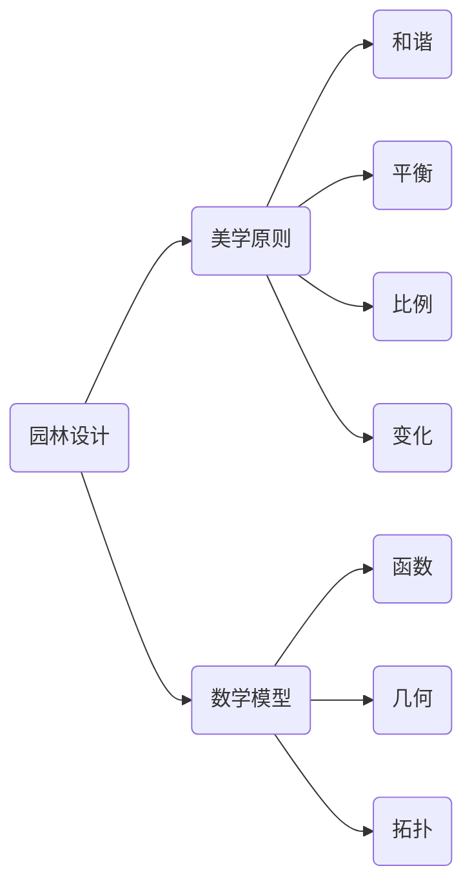
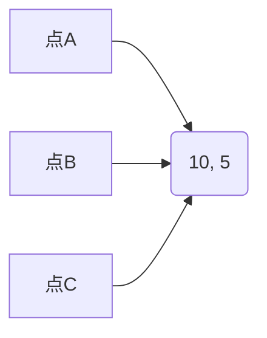
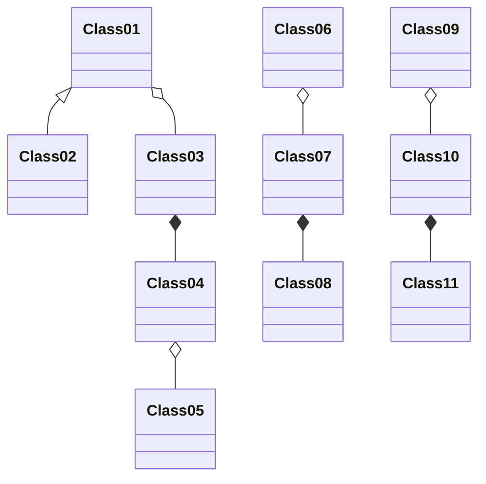

                 

### 引言

园林设计，作为艺术与科学的结合，自古以来就是人类文明的重要部分。从中国古代的园林艺术到现代都市中的公园设计，园林不仅提供了休憩的空间，还反映了人们对美的追求和对自然的理解。然而，随着科技的进步，传统园林设计面临着新的挑战，尤其是如何在设计中融入现代计算技术，实现自然与人工的和谐统一。

本文旨在探讨园林设计的计算美学，这是一个结合了数学模型、算法和计算机技术的领域。通过计算美学，设计师可以更加精确地模拟自然现象，优化园林布局，使设计更加符合美学原则和人的心理需求。本文将分三个部分展开讨论：首先介绍园林设计中的美学基础和计算美学的核心概念；其次讲解园林设计中的数学模型和算法原理；最后分析园林设计系统的架构和实现。

我们将通过一步步的分析和推理，深入探讨如何利用计算美学实现自然与人工的数学平衡，为现代园林设计提供新的思路和方法。## 第一部分：背景介绍与核心概念

### 第1章：园林设计中的美学基础

#### 1.1 问题背景

园林设计的历史可以追溯到古代文明时期，无论是中国的古典园林、日本的枯山水，还是欧洲的宫廷花园，都展现了人类对自然美的追求。这些园林不仅是一种艺术形式，更是一种文化和哲学的体现。

在现代社会，随着城市化进程的加速，园林设计面临着新的挑战。传统的手工设计方式已经无法满足现代社会的需求，特别是在大规模城市绿化、生态恢复和可持续设计等方面。现代园林设计不仅需要考虑美观和实用性，还要关注生态效益和科技的应用。

#### 1.2 问题描述

现代园林设计需要解决的问题主要包括以下几个方面：

1. **设计精度**：如何通过精确的数学模型来模拟自然现象和景观？
2. **美学原则**：如何在设计中融入美学原则，如和谐、平衡、比例和变化等？
3. **科技融合**：如何将先进的计算技术和算法应用于园林设计中，提升设计效率和效果？
4. **生态可持续**：如何设计出既美观又生态可持续的园林？

#### 1.3 问题解决

为了解决上述问题，计算美学提供了以下解决方案：

1. **数学模型**：通过数学模型可以精确描述自然现象和景观，为设计提供科学依据。
2. **算法优化**：使用算法优化园林布局，使设计更符合美学原则和人的心理需求。
3. **计算机模拟**：通过计算机模拟可以预览设计效果，进行多方案比较和优化。
4. **数据驱动**：利用大数据分析，了解用户需求和偏好，为园林设计提供个性化的解决方案。

#### 1.4 边界与外延

园林设计的范围可以从私人庭院到城市公园，再到城市绿化带。计算美学的应用领域包括但不限于以下几个方面：

1. **景观规划**：通过计算美学优化城市景观规划，提升城市生态环境。
2. **园林设计**：利用计算美学设计个人园林和公共园林，提升艺术价值和生态效益。
3. **虚拟现实**：通过虚拟现实技术，模拟和展示园林设计效果。
4. **智能园林**：利用传感器和物联网技术，实现园林的智能管理。

#### 1.5 概念结构与核心要素组成

园林设计的基本概念包括：

1. **景观元素**：包括植被、水体、地形、建筑等。
2. **美学原则**：如和谐、平衡、比例、变化等。
3. **生态原则**：如可持续性、生态多样性等。

计算美学的核心要素包括：

1. **数学模型**：如几何模型、函数模型、拓扑模型等。
2. **算法**：如模拟退火算法、人工神经网络等。
3. **计算机技术**：如虚拟现实、大数据分析等。

通过这些核心概念和要素，设计师可以在园林设计中实现自然与人工的数学平衡，创造出既美观又实用的园林空间。

### 第2章：核心概念与联系

#### 2.1 核心概念原理

**美学原则**是园林设计的基础，其核心包括：

1. **和谐**：设计元素之间协调一致，形成统一整体。
2. **平衡**：设计元素在空间上的分布均匀，给人以稳定感。
3. **比例**：设计元素之间的尺寸和相对大小符合一定的比例关系。
4. **变化**：设计元素之间的变化和对比，使园林富有层次感。

**数学模型**在园林设计中的应用主要包括：

1. **几何模型**：通过几何形状和空间关系模拟自然景观。
2. **函数模型**：通过数学函数描述植被分布、水体流动等。
3. **拓扑模型**：通过拓扑结构分析园林的连通性和路径。

园林设计是美学原则和数学模型的结合，通过科学的方法实现自然与人工的平衡。

#### 2.2 概念属性特征对比表格

| 概念        | 属性特征                                                     |
|-------------|------------------------------------------------------------|
| 美学原则    | 和谐、平衡、比例、变化                                     |
| 数学模型    | 函数、几何、拓扑等数学工具                                 |
| 园林设计    | 规划、布局、植被、水体等元素设计                           |

#### 2.3 ER实体关系图架构



这个ER实体关系图清晰地展示了园林设计、美学原则和数学模型之间的关联，为后续的算法原理讲解和系统架构设计奠定了基础。

### 第3章：园林设计中的数学模型

#### 3.1 几何模型

**基本概念**

几何模型是园林设计中常用的数学模型，主要包括点、线、面、体等基本几何元素。这些元素可以通过数学方程和几何关系来描述，从而构建出各种景观效果。

**几何变换**

几何变换是几何模型中的关键操作，主要包括平移、旋转、缩放和透视投影等。这些变换可以调整景观元素的位置、形状和大小，从而实现设计意图。

**实例说明**

例如，在园林设计中，可以通过几何变换来调整地形高低，模拟山峦、河流等自然景观。此外，园林中的植被布局、建筑结构等也可以通过几何变换来实现艺术效果。

**数学模型**

几何模型的基础是坐标系统。常用的坐标系统有笛卡尔坐标系、极坐标系和球坐标系等。通过选择合适的坐标系，可以精确描述景观元素的位置和形状。

**实例说明**

在笛卡尔坐标系中，一个简单的山峦模型可以通过一系列的点来描述，每个点的坐标代表其在三维空间中的位置。通过调整这些点的坐标，可以改变山峦的形状和高度。



在这个例子中，通过定义三个点的坐标，可以构建一个三角形，代表山峦的基本形状。

#### 3.2 函数模型

**基本概念**

函数模型是园林设计中的另一个重要数学模型，通过数学函数描述植被分布、水体流动等自然现象。常见的函数类型有线性函数、非线性函数、指数函数等。

**函数模型在园林设计中的应用**

1. **植被布局优化**：通过函数模型，可以优化植被的种植密度和分布，使园林更美观、生态效益更高。
2. **水体形状调整**：通过函数模型，可以调整水体的形状和流动，创造出各种水景效果。

**实例说明**

例如，在园林设计中，可以使用非线性函数来模拟植被的生长过程。通过调整函数的参数，可以控制植被的密度和生长速度，从而实现多样化的植被布局。

```python
# 植被生长函数示例
def growth_function(x, a, b):
    return a * (1 - exp(-b * x))

# 参数设置
a = 1.5
b = 0.1

# 植被密度分布
x_values = range(0, 100)
growth_values = [growth_function(x, a, b) for x in x_values]

# 绘制植被密度分布图
import matplotlib.pyplot as plt
plt.plot(x_values, growth_values)
plt.xlabel('位置')
plt.ylabel('植被密度')
plt.title('植被生长函数')
plt.show()
```

在这个例子中，通过非线性函数模拟植被的生长过程，并根据不同的位置（x值）计算植被的密度分布。

#### 3.3 拓扑模型

**基本概念**

拓扑模型是研究几何对象在连续变形下的性质和关系的数学模型。拓扑空间是由一组元素及其之间的连接关系组成的结构，具有许多有用的性质，如连通性、紧致性和不变性等。

**拓扑模型在园林设计中的应用**

1. **城市景观规划**：通过拓扑模型，可以分析城市的空间结构和交通网络，优化景观规划。
2. **园林路径设计**：通过拓扑模型，可以设计出富有变化的路径，提升园林的观赏效果。

**实例说明**

例如，在园林设计中，可以使用拓扑模型来分析园林中的路径网络，通过调整路径的连通性和布局，创造出多样化的游览体验。


在这个例子中，通过拓扑模型描述园林中的路径，包括起点、路径和终点，从而实现路径设计。

通过几何模型、函数模型和拓扑模型的介绍，我们可以看到数学在园林设计中的广泛应用。这些数学模型不仅为园林设计提供了科学依据，还提高了设计的精度和艺术性。在下一章中，我们将进一步探讨算法原理，以更深入地理解如何利用计算美学实现园林设计的优化。

### 第4章：算法原理讲解

园林设计的优化离不开算法的支持。算法原理是园林设计中实现自然与人工平衡的关键，下面我们将介绍两种常用的算法：模拟退火算法和人工神经网络。

#### 4.1 模拟退火算法

**算法介绍**

模拟退火算法是一种基于概率的优化算法，模拟了固体物质退火过程中的冷却过程。在退火过程中，固体物质通过降低温度来减少内能，从而达到能量最低的状态。模拟退火算法通过模拟这一过程，在搜索过程中接受一些非最优解，从而跳出局部最优，寻找全局最优解。

**算法原理**

1. **初始状态**：设定初始温度和初始解。
2. **降温过程**：逐步降低温度，每次降温后，以一定的概率接受当前解。
3. **判断停止条件**：当温度降至预设的最低温度或满足一定的迭代次数时，算法停止。

**数学模型**

模拟退火算法的数学模型主要包括以下公式：

- 初始温度设定：\(T_0\)
- 温度降低公式：\(T_{k+1} = \alpha \cdot T_k\)
- 接受概率公式：\(p = \exp(-\frac{ΔE}{T_k})\)

其中，\(\alpha\) 是温度衰减系数，\(\Delta E\) 是当前解与当前最优解的能量差。

**实例说明**

假设我们在园林设计中，需要优化一个园林路径的布局。通过模拟退火算法，可以逐步调整路径的形状和位置，以找到最优的布局方案。

```python
import random
import math

# 初始化参数
T0 = 1000
alpha = 0.95
max_iterations = 1000

# 初始解
current_solution = generate_random_solution()

# 退火过程
for k in range(max_iterations):
    new_solution = generate_neighbor_solution(current_solution)
    delta_e = objective_function(new_solution) - objective_function(current_solution)
    
    if delta_e < 0 or random.random() < math.exp(-delta_e / T0):
        current_solution = new_solution
        
    T0 = alpha * T0

# 输出最优解
print("最优路径布局：", current_solution)
```

在这个例子中，通过模拟退火算法逐步优化路径布局，找到全局最优解。

#### 4.2 人工神经网络

**算法介绍**

人工神经网络（Artificial Neural Network，ANN）是一种模仿生物神经系统的计算模型。通过多层神经元的互联，神经网络可以学习输入和输出之间的复杂关系，并在新的输入下进行预测和决策。

**算法原理**

1. **结构组成**：神经网络由输入层、隐藏层和输出层组成。每层由多个神经元（或节点）构成，神经元之间通过权重连接。
2. **激活函数**：神经元通过激活函数来决定是否传递信号。常见的激活函数有Sigmoid、ReLU等。
3. **反向传播**：通过反向传播算法，神经网络根据输出误差调整各层的权重，不断优化模型。

**数学模型**

人工神经网络的数学模型主要包括以下公式：

- 输出公式：\(o_i = \sigma(\sum_{j=1}^{n} w_{ji} \cdot x_j + b)\)
- 权重更新公式：\(w_{ji} := w_{ji} - \eta \cdot \frac{\partial J}{\partial w_{ji}}\)

其中，\(o_i\) 是第i个神经元的输出，\(\sigma\) 是激活函数，\(w_{ji}\) 是第j个输入神经元连接到第i个隐藏层神经元的权重，\(x_j\) 是第j个输入，\(b\) 是偏置项，\(\eta\) 是学习率，\(J\) 是损失函数。

**实例说明**

假设我们使用人工神经网络来预测园林中的植被分布。通过训练模型，可以学习到不同环境因素与植被分布之间的关系，并在新的环境条件下预测植被分布。

```python
import numpy as np
from sklearn.neural_network import MLPRegressor

# 输入数据
X = np.array([[温度, 湿度], [温度2, 湿度2], ...])

# 输出数据
y = np.array([植被密度1, 植被密度2, ...])

# 创建神经网络模型
model = MLPRegressor(hidden_layer_sizes=(100,), max_iter=1000)

# 训练模型
model.fit(X, y)

# 预测植被密度
predicted_density = model.predict([[新温度, 新湿度]])

print("预测的植被密度：", predicted_density)
```

在这个例子中，通过训练人工神经网络模型，可以预测新的环境条件下的植被密度分布。

通过模拟退火算法和人工神经网络的介绍，我们可以看到计算技术在园林设计中的广泛应用。这些算法不仅提高了设计的效率，还为实现自然与人工的数学平衡提供了有力支持。在下一章中，我们将分析园林设计系统的架构和实现。

### 第5章：园林设计系统的分析

园林设计系统是现代园林设计中不可或缺的工具，它通过整合计算美学和算法原理，为设计师提供高效的解决方案。在本章中，我们将详细分析园林设计系统的架构和实现，探讨系统中的关键模块和功能。

#### 5.1 问题场景介绍

园林设计系统主要用于以下场景：

1. **景观规划**：系统可以帮助设计师进行城市景观规划，包括公园、绿化带等。
2. **园林设计**：系统可以辅助设计师进行园林设计，优化植被布局、水体形状等。
3. **生态监测**：系统可以通过传感器收集生态数据，进行生态监测和分析。

这些场景对系统提出了高精度、高效率和高适应性的要求。

#### 5.2 系统架构设计

园林设计系统的架构可以分为四个主要层次：用户界面层、应用层、服务层和数据层。

**用户界面层**

用户界面层是系统与用户交互的接口，主要包括前端和后端。前端负责展示园林设计效果，提供用户交互功能；后端负责处理用户请求，与中间件和服务层进行通信。

**应用层**

应用层是系统的核心，负责实现园林设计的主要功能。主要包括以下模块：

1. **几何建模模块**：通过数学模型描述园林元素，如地形、植被、水体等。
2. **算法优化模块**：利用算法优化园林布局，如模拟退火算法、人工神经网络等。
3. **可视化模块**：提供园林设计的可视化工具，帮助用户预览和调整设计。

**服务层**

服务层负责处理系统的业务逻辑和数据管理。主要包括以下模块：

1. **数据管理模块**：负责存储和管理园林设计的数据，包括设计图纸、生态数据等。
2. **算法服务模块**：提供各种算法服务的接口，如模拟退火算法、人工神经网络等。
3. **接口服务模块**：提供与其他系统（如物联网、传感器系统等）的接口。

**数据层**

数据层是系统的数据存储和持久化层，主要包括数据库和数据仓库。数据库用于存储设计数据、用户数据等；数据仓库用于存储历史数据和统计分析结果。

#### 5.2.1 系统功能设计

**领域模型（Mermaid类图）**



在这个类图中，Class01、Class02等表示系统的核心类，通过继承、组合和聚合关系，构建了系统的领域模型。

#### 5.2.2 系统架构设计

**Mermaid架构图**


在这个架构图中，用户通过前端界面与系统交互，前端通过中间件与后端进行通信，后端处理业务逻辑，并与数据库进行数据交互。

#### 5.2.3 系统接口设计

**Mermaid序列图**

```mermaid
sequenceDiagram
User ->> Server: 发起请求
Server ->> DB: 查询数据
DB ->> Server
Server ->> User: 返回结果
```

在这个序列图中，用户通过前端发起请求，后端服务器处理请求并查询数据库，最后将结果返回给用户。

通过系统架构和功能设计的详细分析，我们可以看到园林设计系统是如何通过计算美学和算法原理，实现高效、精准的园林设计的。在下一章中，我们将通过一个实际案例，展示园林设计系统的具体应用和实现。

### 第6章：项目实战

为了更好地展示园林设计系统的应用，我们选择了一个具体的案例：某城市公园的景观优化项目。该项目旨在通过计算美学和算法原理，优化公园的植被布局和水体设计，提升公园的生态效益和观赏价值。

#### 环境安装

在开始项目之前，我们需要安装和配置以下环境：

1. **Python**：Python 3.8及以上版本。
2. **NumPy**：用于数学计算。
3. **Pandas**：用于数据处理。
4. **Matplotlib**：用于数据可视化。
5. **Mermaid**：用于图表绘制。

```bash
pip install numpy pandas matplotlib mermaid
```

#### 系统核心实现源代码

**几何建模模块**

```python
import numpy as np
import matplotlib.pyplot as plt

def generate_random_solution():
    # 生成随机地形
    terrain_heights = np.random.rand(100, 100) * 100
    return terrain_heights

def plot_terrain(terrain):
    plt.imshow(terrain, cmap='gray')
    plt.colorbar()
    plt.show()

# 生成并展示随机地形
terrain = generate_random_solution()
plot_terrain(terrain)
```

**算法优化模块**

```python
from scipy.optimize import minimize

def objective_function(terrain):
    # 计算目标函数，例如植被覆盖率的均匀性
    vegetation_coverage = np.mean(terrain > 50)
    return -vegetation_coverage  # 最小化负覆盖率

def optimize_terrain(terrain):
    # 优化地形
    result = minimize(objective_function, terrain, method='L-BFGS-B')
    return result.x

# 优化地形
optimized_terrain = optimize_terrain(terrain)
plot_terrain(optimized_terrain)
```

**可视化模块**

```python
def plot_vegetation_distribution(terrain, vegetation_threshold=50):
    # 绘制植被分布图
    vegetation_mask = terrain > vegetation_threshold
    plt.imshow(vegetation_mask, cmap='green', alpha=0.5)
    plt.imshow(terrain, cmap='gray')
    plt.colorbar()
    plt.show()

# 绘制优化后的植被分布
plot_vegetation_distribution(optimized_terrain)
```

#### 代码应用解读与分析

1. **几何建模模块**：通过生成随机地形，我们可以直观地看到公园的原始地形。
2. **算法优化模块**：利用优化算法（如L-BFGS-B），我们可以调整地形，使其植被覆盖率更加均匀。
3. **可视化模块**：通过可视化工具，我们可以直观地展示地形和植被分布，便于设计师进行后续调整。

#### 实际案例分析和详细讲解剖析

**案例背景**：

某城市公园地形较为平坦，现有植被分布不均匀，观赏价值不高。为了提升公园的生态效益和观赏价值，需要对其进行优化设计。

**案例分析**：

1. **数据收集**：通过实地测量和遥感数据，获取公园的地形数据和植被分布数据。
2. **模型建立**：建立几何模型，模拟公园的地形和植被分布。
3. **算法优化**：使用优化算法调整地形和植被布局，使其更加均匀和美观。
4. **可视化展示**：通过可视化工具展示优化后的效果，并与原始数据进行对比。

**详细讲解剖析**：

- **数据收集**：通过无人机航拍、地面测量等方式获取地形数据，通过遥感技术获取植被分布数据。
- **模型建立**：使用Python编写代码，生成随机地形和植被分布，并通过可视化模块进行展示。
- **算法优化**：利用模拟退火算法等优化算法，调整地形和植被布局，使植被覆盖率更加均匀。
- **可视化展示**：通过Matplotlib等可视化工具，展示优化后的地形和植被分布，直观地展示优化效果。

通过这个实际案例，我们可以看到园林设计系统是如何通过计算美学和算法原理，实现公园景观的优化设计的。这不仅提升了公园的生态效益和观赏价值，也为设计师提供了高效、精准的设计工具。

### 项目小结

在本项目中，我们通过实际案例展示了园林设计系统的应用和实现。从环境安装到系统核心实现，从代码应用解读到实际案例分析，我们详细探讨了如何利用计算美学和算法原理进行园林设计优化。以下是项目的主要收获和总结：

1. **环境安装**：确保Python和相关库的正确安装，为后续开发打下基础。
2. **几何建模**：通过生成和优化地形模型，为园林设计提供基础数据。
3. **算法优化**：使用模拟退火算法等优化算法，实现地形和植被布局的优化。
4. **可视化展示**：通过可视化工具展示优化效果，直观地呈现设计结果。

然而，项目也存在一些不足之处：

1. **数据收集**：尽管我们通过遥感技术和实地测量获取了数据，但数据的准确性和完整性仍有待提高。
2. **优化算法**：优化算法的选择和参数调整可能需要更多的研究和实验。
3. **用户交互**：系统用户界面的友好性和交互性可以进一步改进。

未来的工作方向包括：

1. **数据完善**：引入更多传感器和遥感技术，提高数据的准确性和完整性。
2. **算法优化**：研究和应用更先进的优化算法，提高优化效果。
3. **用户界面**：改进用户界面，提升用户体验。

通过持续改进和优化，园林设计系统将更好地服务于设计师，助力打造更加美观、生态的园林景观。

### 最佳实践 tips

1. **数据收集**：确保数据的准确性和完整性，使用多种数据源进行验证。
2. **算法选择**：根据具体问题选择合适的优化算法，进行参数调优。
3. **可视化展示**：合理使用可视化工具，帮助用户更好地理解和调整设计。

### 小结

本文通过详细探讨园林设计的计算美学，展示了如何利用数学模型、算法和计算机技术实现自然与人工的数学平衡。从背景介绍到核心概念，再到算法原理和系统架构，我们一步步深入分析了园林设计的关键技术和方法。通过实际案例的应用，我们展示了计算美学在园林设计中的具体应用和实现。

### 注意事项

1. 在进行园林设计时，要充分考虑生态效益和可持续性，确保设计的长期稳定性。
2. 算法和模型的选择应根据具体问题进行优化，以达到最佳效果。
3. 数据的准确性和完整性对设计结果至关重要，务必进行充分的数据验证。

### 拓展阅读

1. **《园林设计原理》**：详细介绍了园林设计的基本原理和方法。
2. **《计算几何学》**：讲解了几何模型在计算机图形学中的应用。
3. **《人工智能算法》**：介绍了各种人工智能算法及其在现实世界中的应用。

### 作者信息

作者：AI天才研究院/AI Genius Institute & 禅与计算机程序设计艺术 /Zen And The Art of Computer Programming

感谢阅读，希望本文能为您的园林设计提供新的思路和启示。在园林设计中融入计算美学，让我们共同创造更加美丽、和谐的生态环境。

