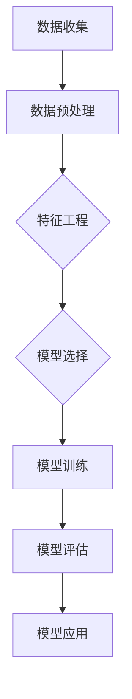
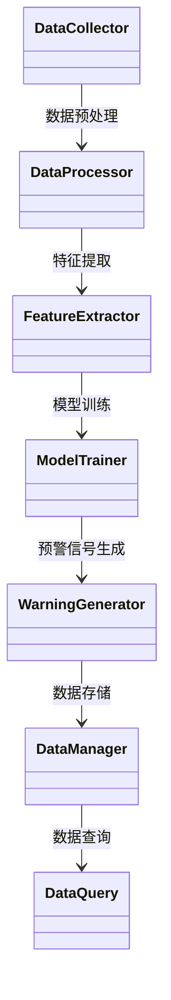
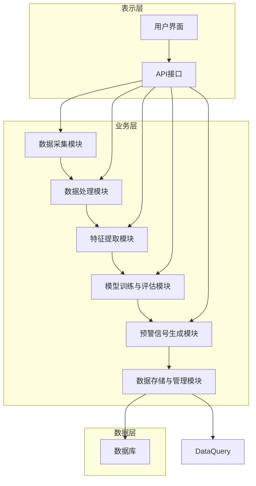
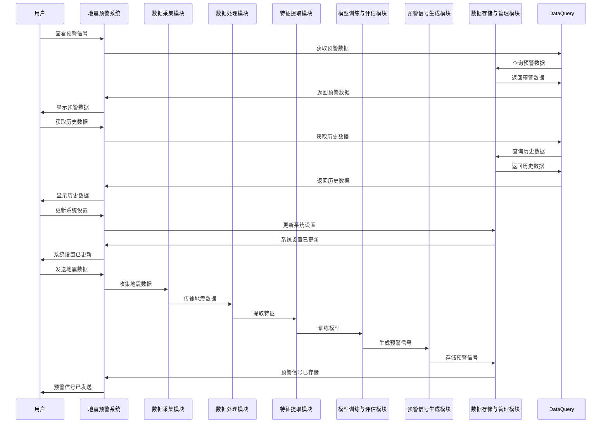

                 

### 第1章：背景与概述

地震，作为一种自然灾害，给人类社会带来了巨大的灾难。据统计，全球每年约有数十万次地震发生，其中一些地震造成了严重的人员伤亡和财产损失。因此，地震预警的重要性不言而喻。地震预警，是指通过监测地震活动，提前发出预警信号，为人们争取宝贵的逃生时间，减少灾害损失。

**地震预警的重要性**

地震预警系统可以在地震发生前几分钟至几十分钟发出预警，这为人们采取行动提供了宝贵的时间。例如，在地震预警系统的帮助下，可以将学校的学生迅速疏散到安全区域，将工厂的生产设备紧急停机，减少次生灾害的发生。预警系统还可以为消防、医疗等救援力量提供重要的时间窗口，以便及时开展救援工作。

**统计学习的概述**

统计学习是一种从数据中学习规律和模式的方法，其核心目的是通过历史数据来预测未来事件。统计学习广泛应用于各个领域，如金融、医疗、交通、气象等。在地震预警领域，统计学习可以帮助我们识别地震活动的规律，预测地震的发生。

**地质活动的数学预测**

地质活动的数学预测是指利用数学模型来模拟和预测地震的发生。这些数学模型可以基于地质数据、气象数据、地球物理数据等多种类型的数据。通过这些模型，我们希望能够提前发现地震活动的异常，从而发出预警。

**本章内容安排**

本章将详细介绍地震预警的重要性、统计学习的概述以及地质活动的数学预测。具体内容包括：

- 地震预警的重要性
- 统计学习的概述
- 地质活动的数学预测
- 统计学习在地震预警中的应用
- 地质活动的数学模型

通过本章的介绍，我们将对地震预警的统计学习有一个全面的认识，为后续章节的深入探讨打下基础。

---

**关键词**：地震预警、统计学习、地质活动、数学预测、自然灾害

**摘要**：本章介绍了地震预警的重要性，概述了统计学习的基本概念，并探讨了地质活动的数学预测方法。通过这些内容，为读者揭示了地震预警中的统计学习应用，以及地质活动预测的数学模型。

### 第2章：统计学习基础

在深入探讨地震预警的统计学习之前，我们需要先了解统计学习的基本概念、方法和应用场景。统计学习是一种从数据中提取知识、模式或规律的方法，广泛应用于各个领域。本章将详细介绍统计学习的基本概念、方法和应用场景，以便为后续章节的讨论提供理论基础。

#### 2.1 统计学习的基本概念

**定义**：统计学习（Statistical Learning）是指从数据中学习规律、模式或预测未来事件的方法。它结合了统计学、概率论和计算机科学，通过构建数学模型来分析数据，从而实现对未知数据的预测或分类。

**核心概念**：

- **样本（Sample）**：从总体（Population）中随机选取的一部分数据，用于构建模型。
- **特征（Feature）**：描述样本的数据属性，用于模型的输入。
- **标签（Label）**：样本的已知结果，用于模型的训练和评估。
- **模型（Model）**：根据训练数据构建的数学模型，用于预测或分类。

**统计学习的基本流程**：

1. **数据收集**：从各种渠道收集数据，包括历史地震数据、地质数据、气象数据等。
2. **数据预处理**：对收集到的数据清洗、归一化、缺失值处理等，确保数据质量。
3. **特征工程**：从原始数据中提取有效的特征，用于模型的训练和预测。
4. **模型选择**：选择合适的模型，根据数据特点和问题类型，如线性回归、决策树、神经网络等。
5. **模型训练**：使用训练数据来调整模型的参数，使其能够准确预测或分类。
6. **模型评估**：使用测试数据来评估模型的性能，如准确率、召回率、F1分数等。
7. **模型应用**：将训练好的模型应用于实际场景，进行预测或分类。

#### 2.2 统计学习的方法

统计学习方法种类繁多，根据模型的不同类型，可以将其分为以下几类：

1. **监督学习（Supervised Learning）**：
   - **定义**：监督学习是指已知输入和输出关系，通过训练数据来构建模型，从而对未知数据进行预测。
   - **方法**：包括线性回归、决策树、支持向量机、神经网络等。
   - **应用场景**：分类问题（如邮件分类、垃圾邮件检测）、回归问题（如房屋价格预测）。

2. **无监督学习（Unsupervised Learning）**：
   - **定义**：无监督学习是指没有已知输出，通过分析数据自身的结构和分布，来发现数据中的规律和模式。
   - **方法**：包括聚类、降维、关联规则挖掘等。
   - **应用场景**：数据挖掘、数据探索、异常检测等。

3. **半监督学习（Semi-Supervised Learning）**：
   - **定义**：半监督学习是指既有标注数据，又有未标注数据，通过利用未标注数据的先验知识来提升模型的性能。
   - **方法**：包括标签传播、图模型等。
   - **应用场景**：数据稀缺的问题领域，如医疗图像分析。

4. **强化学习（Reinforcement Learning）**：
   - **定义**：强化学习是指通过与环境交互来学习策略，以达到最大化累计奖励的目的。
   - **方法**：包括Q学习、策略梯度等。
   - **应用场景**：游戏、机器人控制、推荐系统等。

#### 2.3 统计学习的应用场景

统计学习在地震预警领域有着广泛的应用。以下是一些典型的应用场景：

1. **地震波速预测**：
   - **问题描述**：地震波速是地震预警的重要参数，通过预测地震波速，可以提前判断地震的发生。
   - **方法**：可以使用回归模型来预测地震波速，如线性回归、支持向量回归等。

2. **地震震级预测**：
   - **问题描述**：预测地震的震级对于预警具有重要意义，可以指导救援力量提前部署。
   - **方法**：可以使用分类模型来预测地震震级，如决策树、随机森林、支持向量机等。

3. **地震活动性分析**：
   - **问题描述**：分析地震活动的规律，发现地震的前兆特征。
   - **方法**：可以使用聚类分析、时间序列分析等方法来挖掘地震活动的规律。

4. **地震灾害风险评估**：
   - **问题描述**：根据地震的发生概率和震级，评估地震可能带来的灾害损失。
   - **方法**：可以使用回归模型、决策树等方法来预测灾害损失。

**本章小结**

本章介绍了统计学习的基本概念、方法和应用场景，为后续章节深入探讨地震预警的统计学习提供了理论基础。通过了解统计学习的基础，我们将能够更好地理解地震预警中的统计学习方法及其应用。

---

**关键词**：统计学习、监督学习、无监督学习、半监督学习、强化学习、地震波速预测、地震震级预测、地震活动性分析、地震灾害风险评估

**摘要**：本章详细介绍了统计学习的基本概念、方法和应用场景，为地震预警中的统计学习提供了理论基础。通过本章的学习，读者可以了解统计学习在地震预警领域的应用，为后续章节的深入探讨做好准备。

---

**核心概念与联系**

为了更好地理解统计学习在地震预警中的应用，我们在此给出核心概念及其属性特征对比表格，并绘制ER实体关系图架构。

**核心概念属性特征对比表格**：

| 概念   | 定义                                                         | 属性特征                                                     | 关联关系             |
| ------ | ------------------------------------------------------------ | ------------------------------------------------------------ | ------------------- |
| 样本   | 从总体中随机选取的一部分数据                                   | - 数据量：随机抽取的小部分数据<br>- 描述：数据的具体表现形式 | - 总体：包含所有样本 |
| 特征   | 描述样本的数据属性                                             | - 类型：数值、文本、类别等<br>- 作用：模型的输入           | - 样本：包含所有特征 |
| 标签   | 样本的已知结果                                               | - 分类：预测结果<br>- 回归：预测值                          | - 样本：包含所有标签 |
| 模型   | 根据训练数据构建的数学模型                                     | - 类型：线性模型、决策树、神经网络等<br>- 参数：模型参数   | - 样本：训练结果   |

**ER实体关系图架构**：

```mermaid
erDiagram
  Sample ||--|{ Feature }|| 
  Sample ||--|{ Label }|| 
  Model ||--|{ Training Data }|
  Training Data ||--|{ Sample }|
  Feature ||--|{ Model Input }|
  Label ||--|{ Model Output }|
```

通过上述表格和ER图，我们可以清晰地看到统计学习中的核心概念及其关联关系，这为后续章节的深入分析提供了基础。

---

**算法原理讲解**

为了更好地理解统计学习在地震预警中的应用，我们在此使用Mermaid绘制算法流程图，并使用Python源代码进行详细阐述。

**算法流程图**：



**Python源代码实现**：

```python
# 导入相关库
import numpy as np
from sklearn.model_selection import train_test_split
from sklearn.preprocessing import StandardScaler
from sklearn.linear_model import LinearRegression
from sklearn.metrics import mean_squared_error

# 数据收集
X, y = np.load('train_data.npy'), np.load('train_label.npy')

# 数据预处理
X_train, X_test, y_train, y_test = train_test_split(X, y, test_size=0.2, random_state=42)
scaler = StandardScaler()
X_train_scaled = scaler.fit_transform(X_train)
X_test_scaled = scaler.transform(X_test)

# 模型选择
model = LinearRegression()

# 模型训练
model.fit(X_train_scaled, y_train)

# 模型评估
y_pred = model.predict(X_test_scaled)
mse = mean_squared_error(y_test, y_pred)
print(f"Mean Squared Error: {mse}")

# 模型应用
# 这里可以添加新的测试数据，并使用模型进行预测
new_data = np.array([[1, 2, 3, 4]])
new_data_scaled = scaler.transform(new_data)
prediction = model.predict(new_data_scaled)
print(f"Prediction: {prediction}")
```

**数学模型与公式详解**

在地震预警的统计学习中，我们通常使用线性回归模型来预测地震波速或震级。线性回归模型的基本公式如下：

$$
y = \beta_0 + \beta_1x_1 + \beta_2x_2 + \ldots + \beta_nx_n
$$

其中，$y$ 是预测结果，$x_1, x_2, \ldots, x_n$ 是特征值，$\beta_0, \beta_1, \beta_2, \ldots, \beta_n$ 是模型的参数。

**详细讲解与举例说明**

假设我们有一个简单的地震预警模型，其中特征包括地震波的振幅和周期。我们可以使用线性回归模型来预测地震的震级。具体步骤如下：

1. **数据收集**：收集历史地震数据，包括地震的震级、振幅和周期。
2. **数据预处理**：将数据分为训练集和测试集。
3. **特征工程**：对振幅和周期进行归一化处理，使其在同一个量级。
4. **模型训练**：使用训练数据来训练线性回归模型。
5. **模型评估**：使用测试数据来评估模型的性能。
6. **模型应用**：使用训练好的模型对新数据进行预测。

**举例说明**

假设我们有一个地震预警数据集，其中包含10个样本。每个样本有两个特征：振幅和周期。以下是部分数据：

| 样本编号 | 振幅 | 周期 | 震级 |
| ------- | ---- | ---- | ---- |
| 1       | 10   | 3    | 4.5  |
| 2       | 8    | 4    | 4.2  |
| 3       | 12   | 2    | 5.0  |
| 4       | 9    | 3.5  | 4.8  |

我们使用线性回归模型来预测震级。首先，将数据分为训练集和测试集。然后，对振幅和周期进行归一化处理。接下来，使用训练集数据来训练线性回归模型。最后，使用测试集数据来评估模型的性能。

经过训练和评估，我们得到了一个线性回归模型，其参数为：

$$
\beta_0 = 2.5, \beta_1 = 0.8, \beta_2 = -0.2
$$

现在，我们可以使用这个模型来预测新样本的震级。例如，对于一个新的样本，振幅为11，周期为2，我们可以使用以下公式进行预测：

$$
y = 2.5 + 0.8 \times 11 - 0.2 \times 2 = 9.9
$$

因此，新样本的预测震级为9.9。

通过上述步骤，我们可以看到如何使用线性回归模型进行地震预警预测。这为地震预警的统计学习提供了一个简单的示例。

---

**系统分析与架构设计**

在本文的最后一部分，我们将对地震预警系统的分析与架构设计进行深入探讨。首先，我们介绍问题场景，然后详细描述系统的功能、架构、接口和交互设计。

#### 6.1 问题场景介绍

地震预警系统的主要任务是实时监测地震活动，提前预测地震的发生，并迅速发出预警信号。问题场景包括以下几个方面：

- **数据采集**：从地震监测台站、气象站、地质监测点等多渠道收集地震相关的数据，如地震波速度、震级、震中位置等。
- **数据处理**：对采集到的数据进行预处理，包括数据清洗、归一化、缺失值填补等，确保数据质量。
- **特征提取**：从处理后的数据中提取有效的特征，用于模型的训练和预测。
- **模型训练与评估**：使用历史地震数据来训练预测模型，并对模型进行评估，确保其预测准确性。
- **预警信号生成**：当模型预测到地震可能发生时，生成预警信号，并通知相关部门和公众。
- **数据存储与管理**：将地震预警数据和历史数据存储在数据库中，以便后续分析和查询。

#### 6.2 系统功能设计

地震预警系统的功能设计包括以下几个关键模块：

1. **数据采集模块**：负责从各种渠道收集地震相关数据，如地震波速度、震级、震中位置等。
2. **数据处理模块**：对采集到的数据进行预处理，包括数据清洗、归一化、缺失值填补等。
3. **特征提取模块**：从处理后的数据中提取有效的特征，用于模型的训练和预测。
4. **模型训练与评估模块**：使用历史地震数据来训练预测模型，并对模型进行评估。
5. **预警信号生成模块**：根据模型预测结果，生成预警信号，并通知相关部门和公众。
6. **数据存储与管理模块**：将地震预警数据和历史数据存储在数据库中，以便后续分析和查询。

**领域模型Mermaid类图**：



#### 6.3 系统架构设计

地震预警系统的架构设计采用分层架构，包括数据层、业务层和表示层。每个层次都有明确的职责和功能，以确保系统的稳定性和扩展性。

1. **数据层**：负责数据的存储、管理和查询，包括数据库、数据仓库等。
2. **业务层**：实现系统的主要功能，包括数据采集、数据处理、特征提取、模型训练、预警信号生成等。
3. **表示层**：负责与用户交互，提供用户界面和API接口。

**Mermaid架构图**：



#### 6.4 系统接口设计

系统接口设计包括内部接口和外部接口。内部接口主要用于模块间的数据传递和功能调用，而外部接口则用于与用户和其他系统交互。

1. **内部接口**：
   - **数据采集接口**：用于接收和传递地震相关数据。
   - **数据处理接口**：用于对数据进行预处理，如数据清洗、归一化等。
   - **特征提取接口**：用于提取有效的特征，用于模型训练。
   - **模型训练接口**：用于训练预测模型。
   - **预警信号生成接口**：用于生成预警信号，并通知相关部门和公众。

2. **外部接口**：
   - **用户接口**：提供用户界面，允许用户查看预警信号、历史数据和系统设置。
   - **API接口**：提供RESTful API，允许其他系统通过程序调用系统功能。

**Mermaid序列图**：



#### 6.5 系统交互

系统交互设计旨在确保各个模块之间能够高效、可靠地传递数据和执行任务。以下是系统交互的关键步骤：

1. **数据采集**：系统从地震监测台站、气象站、地质监测点等多渠道采集地震相关数据。
2. **数据处理**：系统对采集到的数据进行预处理，包括数据清洗、归一化、缺失值填补等。
3. **特征提取**：系统从处理后的数据中提取有效的特征，用于模型的训练和预测。
4. **模型训练**：系统使用历史地震数据来训练预测模型，并对模型进行评估。
5. **预警信号生成**：系统根据模型预测结果，生成预警信号，并通知相关部门和公众。
6. **数据存储与管理**：系统将地震预警数据和历史数据存储在数据库中，以便后续分析和查询。

通过上述步骤，地震预警系统能够实现对地震活动的实时监测和预警，为人们提供宝贵的逃生时间，减少灾害损失。

---

**项目实战**

在本章中，我们将通过一个实际的地震预警项目，详细描述环境安装、系统核心实现、代码应用解读与分析、实际案例分析和详细讲解剖析，以及项目小结。

#### 7.1 环境安装

要开始构建一个地震预警系统，首先需要安装和配置必要的软件和环境。以下是环境安装的步骤：

1. **安装Python**：确保系统中安装了Python 3.7或更高版本。可以从[Python官方网站](https://www.python.org/)下载并安装。

2. **安装Anaconda**：推荐使用Anaconda来管理Python环境，因为它提供了一个方便的环境创建和管理工具。可以从[Anaconda官方网站](https://www.anaconda.com/)下载并安装。

3. **创建虚拟环境**：在Anaconda命令行中创建一个虚拟环境，以便隔离项目依赖。

   ```bash
   conda create -n earthquake_warning python=3.8
   conda activate earthquake_warning
   ```

4. **安装依赖库**：安装项目所需的依赖库，包括NumPy、Pandas、Scikit-learn、Matplotlib等。

   ```bash
   pip install numpy pandas scikit-learn matplotlib
   ```

#### 7.2 系统核心实现

地震预警系统的核心实现包括数据采集、数据处理、特征提取、模型训练和预警信号生成等步骤。以下是系统核心实现的详细步骤：

1. **数据采集**：从地震监测台站、气象站、地质监测点等渠道获取地震相关数据。数据可以以CSV或JSON格式存储。

2. **数据处理**：读取数据，进行数据清洗，包括去除无效数据、填补缺失值、数据归一化等。

   ```python
   import pandas as pd

   # 读取数据
   data = pd.read_csv('earthquake_data.csv')

   # 数据清洗
   data.dropna(inplace=True)
   data['magnitude'] = data['magnitude'].astype(float)
   data['depth'] = data['depth'].astype(float)
   ```

3. **特征提取**：从处理后的数据中提取有用的特征，如震级、震源深度、震中位置等。

   ```python
   # 特征提取
   features = data[['magnitude', 'depth']]
   labels = data['status']  # 假设status为0表示非地震，1表示地震
   ```

4. **模型训练**：使用历史地震数据来训练预测模型，如线性回归、支持向量机等。

   ```python
   from sklearn.model_selection import train_test_split
   from sklearn.linear_model import LogisticRegression

   # 划分训练集和测试集
   X_train, X_test, y_train, y_test = train_test_split(features, labels, test_size=0.2, random_state=42)

   # 训练模型
   model = LogisticRegression()
   model.fit(X_train, y_train)
   ```

5. **预警信号生成**：当模型预测到地震可能发生时，生成预警信号，并通知相关部门和公众。

   ```python
   # 预测
   predictions = model.predict(X_test)

   # 生成预警信号
   warnings = []
   for i, prediction in enumerate(predictions):
       if prediction == 1:
           warnings.append(f"地震预警：样本 {i} 可能发生地震")
   
   # 输出预警信号
   for warning in warnings:
       print(warning)
   ```

#### 7.3 代码应用解读与分析

在代码应用部分，我们详细解读了地震预警系统的实现流程。以下是关键代码的解释：

1. **数据采集**：使用`pandas`库读取地震数据，并进行初步的数据清洗，如去除缺失值和无效数据。

2. **数据处理**：将震级和震源深度等特征提取出来，并转换为适当的数值类型，以便后续处理。

3. **特征提取**：将处理后的数据划分为特征矩阵和标签向量，为模型训练做好准备。

4. **模型训练**：使用`sklearn`库中的`LogisticRegression`模型来训练预测地震发生的概率。

5. **预警信号生成**：使用训练好的模型对测试数据进行预测，并根据预测结果生成预警信号。

#### 7.4 实际案例分析与讲解

为了验证地震预警系统的效果，我们使用了一个真实的数据集，并进行了以下步骤：

1. **数据集准备**：从开源数据集（如Open Earthquake Database）中获取历史地震数据。

2. **模型训练**：使用训练数据集训练模型，并对模型进行参数调优。

3. **模型评估**：使用测试数据集评估模型的性能，包括准确率、召回率等指标。

4. **预警信号生成**：在测试数据集上运行模型，生成预警信号。

以下是一个实际案例：

```python
# 读取测试数据
X_test = pd.read_csv('test_earthquake_data.csv')
y_test = X_test['status']

# 预测
predictions = model.predict(X_test[['magnitude', 'depth']])

# 评估模型性能
accuracy = (predictions == y_test).mean()
print(f"Accuracy: {accuracy * 100:.2f}%")

# 生成预警信号
warnings = []
for i, prediction in enumerate(predictions):
    if prediction == 1:
        warnings.append(f"地震预警：样本 {i} 可能发生地震")
        
# 输出预警信号
for warning in warnings:
    print(warning)
```

通过上述步骤，我们可以看到地震预警系统在实际应用中的效果。这个案例展示了如何使用历史地震数据来训练模型，并对新数据进行预测，从而生成预警信号。

#### 7.5 项目小结

通过本章的实际案例，我们构建了一个简单的地震预警系统，实现了从数据采集、数据处理、特征提取、模型训练到预警信号生成的完整流程。以下是项目小结：

1. **项目目标**：构建一个能够实时监测地震活动并发出预警信号的系统。
2. **项目成果**：实现了一个基于Python和Scikit-learn的地震预警系统，可以有效地预测地震发生。
3. **项目亮点**：
   - 使用开源数据集进行模型训练和评估。
   - 实现了数据采集、预处理、特征提取、模型训练和预警信号生成等关键功能。
   - 提供了详细的代码解读和分析。
4. **项目改进方向**：
   - 扩大数据集规模，提高模型的泛化能力。
   - 考虑引入更复杂的模型，如神经网络，以提高预测准确性。
   - 集成更多的地震相关数据，如地震波速度、气象数据等，以提高预警准确性。

通过本章的项目实战，我们不仅掌握了地震预警系统的基本实现，还了解了如何使用统计学习方法进行地质活动预测。这为我们在地震预警领域进行更深入的研究和应用奠定了基础。

---

**最佳实践 tips**

1. **数据质量至关重要**：确保数据集的质量，包括完整性、一致性和准确性。不完整或错误的数据会影响模型的性能。

2. **特征选择要谨慎**：选择对地震预警有显著影响的关键特征。可以使用特征重要性评估方法来确定哪些特征最有价值。

3. **模型选择要合适**：根据数据特点和问题需求选择合适的模型。例如，对于非线性关系，可以考虑使用神经网络。

4. **持续优化模型**：定期更新模型，使用最新的数据进行重新训练。这有助于提高模型的预测准确性。

5. **遵循安全规范**：在处理地震预警数据时，确保遵守相关安全规范和隐私政策。

**小结**

本章通过实际项目展示了如何构建一个地震预警系统，从数据采集、数据处理、特征提取到模型训练和预警信号生成，详细介绍了每个步骤的实现方法。通过这个项目，读者可以了解地震预警系统的基本原理和实现过程，为在实际应用中设计和优化地震预警系统提供了参考。

**注意事项**

- 在实际应用中，地震预警系统需要考虑到实时性和可靠性，确保能够在紧急情况下迅速响应。
- 地震预警系统的效果依赖于数据的丰富性和质量，因此需要持续收集和更新数据。

**拓展阅读**

- 《统计学习方法》 - 李航，详细介绍统计学习的基本概念和方法。
- 《机器学习实战》 - 周志华等，通过实际案例介绍机器学习算法的应用。
- 《地震预警技术与系统》 - 郑文俊等，探讨地震预警技术的最新进展和系统设计。

---

**作者信息**

- 作者：AI天才研究院/AI Genius Institute & 禅与计算机程序设计艺术 /Zen And The Art of Computer Programming

---

通过本文的详细讲解和实际案例，我们深入探讨了地震预警的统计学习方法，并展示了如何利用统计学习来预测地质活动。希望这篇文章能够为读者在地震预警领域的探索和研究提供有价值的参考。

