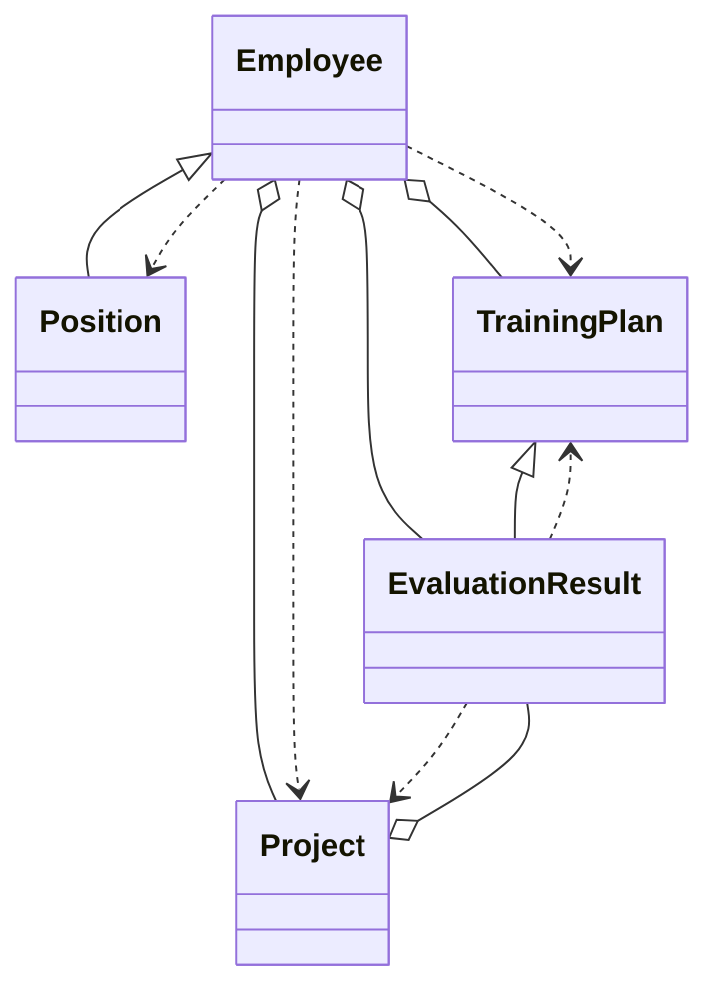
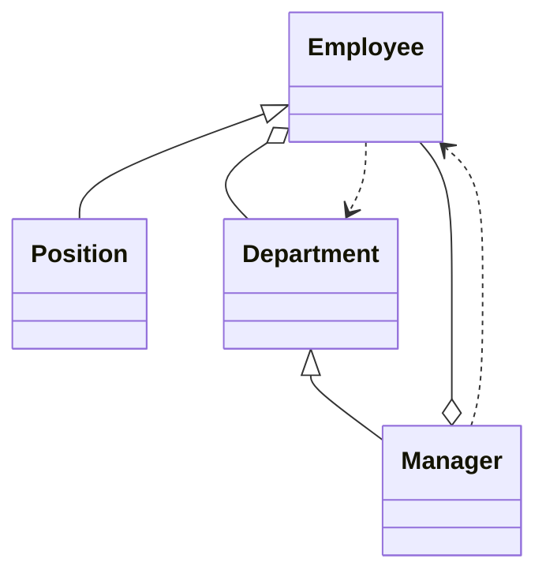
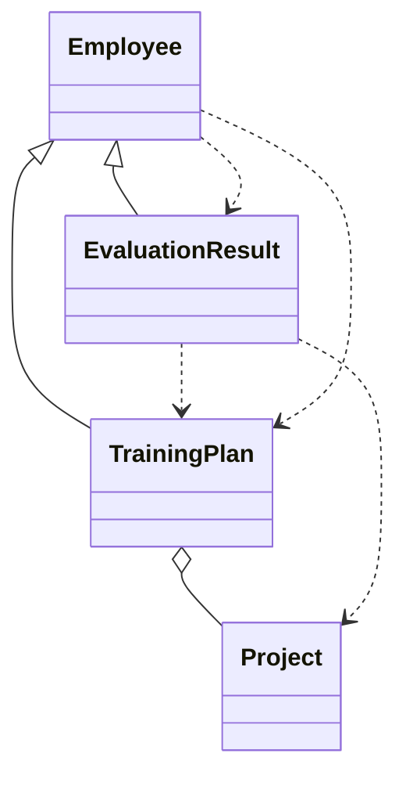
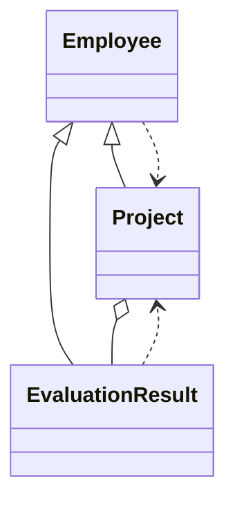
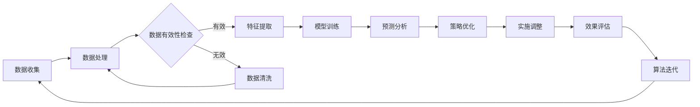
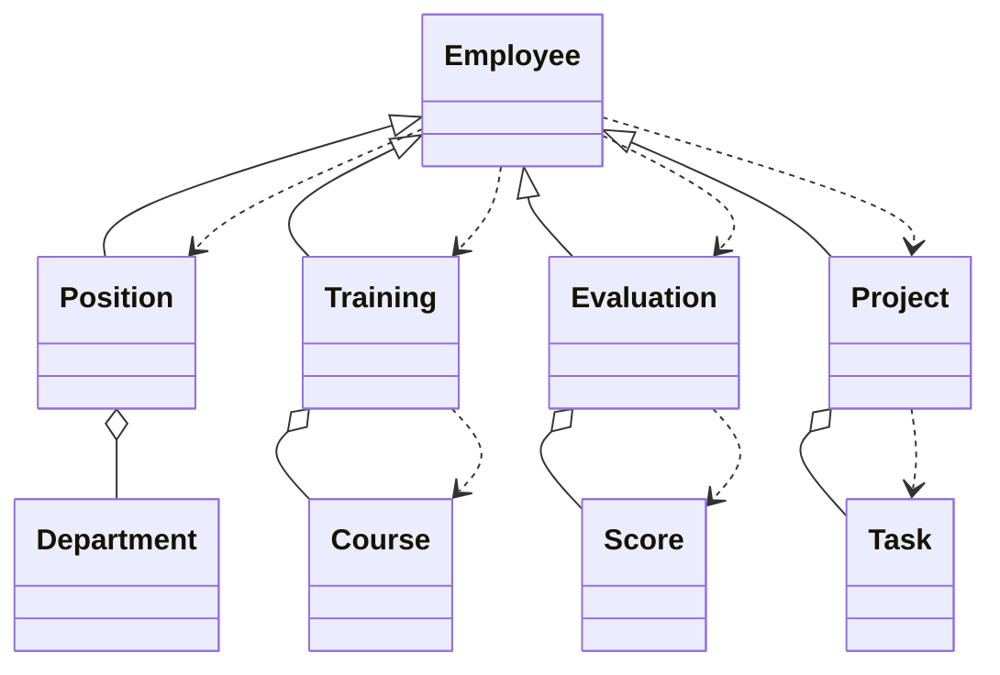
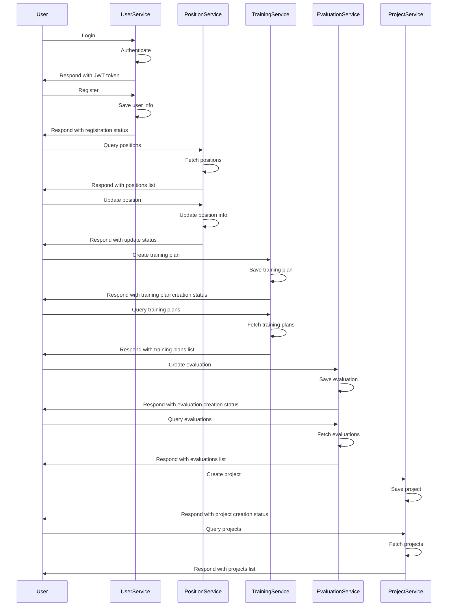

                 

### 摘要

本文旨在探讨如何通过科学的人才梯队建设策略，培养出具有未来领导力的优秀人才。在全球经济快速变革的背景下，企业面临着前所未有的挑战，其中之一便是如何构建一个稳定且高效的人才梯队。未来领导者不仅需要具备卓越的领导力，还必须能够适应快速变化的环境，具备跨领域协作和创新能力。本文将首先介绍人才梯队建设的背景和核心概念，然后深入探讨其边界与外延、关键要素，并通过对比分析，明确其特征和策略。接着，本文将运用数学模型和算法原理，详细讲解人才梯队建设的流程和优化方法。最后，通过系统分析与架构设计，提供实际操作指南，旨在为企业在人才梯队建设方面提供全面而实用的参考。通过本文的系统性分析，读者将更好地理解如何培养未来领导者，从而为企业的发展注入新的动力。

---

## 第一部分：背景介绍与核心概念

### 第1章：问题背景与核心概念

#### 1.1 问题背景

在全球化和数字化的双重浪潮下，企业面临着前所未有的挑战与机遇。一方面，市场竞争日益激烈，技术变革日新月异，要求企业必须具备快速响应市场变化的能力。另一方面，人才竞争成为企业发展的关键因素，如何吸引、培养和保留优秀人才成为企业高层管理者亟需解决的问题。在这种背景下，人才梯队建设的重要性日益凸显。

**1.1.1 企业面临的人才挑战**

1. **人才流失**：在高速发展的行业中，人才流失是一个普遍问题。优秀人才往往因为更好的发展机会而跳槽，这给企业的稳定运营带来了巨大挑战。
2. **领导力缺失**：许多企业在快速扩张过程中，往往忽视了领导力培养，导致高层管理者缺乏足够的领导力和战略眼光。
3. **技能短缺**：随着技术进步，企业对新兴技术的需求不断增加，但现有员工的技术能力和知识储备往往无法满足这些需求，导致技能短缺。
4. **人才断层**：在企业的人才结构中，中高层管理人员往往存在断层，难以支撑企业的长期发展。

**1.1.2 未来领导者的定义与重要性**

**未来领导者**是指那些不仅具备卓越的领导力，还能够适应未来社会和技术变化，具备跨领域协作和创新能力的人才。他们在企业中发挥着关键作用：

1. **引领变革**：未来领导者具备引领企业变革的能力，能够在复杂多变的市场环境中为企业制定战略方向。
2. **培养人才**：他们注重团队建设，能够培养和激励下属，打造高效团队。
3. **创新能力**：未来领导者具备强烈的创新意识，能够推动企业技术创新和管理创新。
4. **跨领域协作**：他们在不同领域具备较强的沟通和协作能力，能够促进跨部门合作。

**1.1.3 人才梯队建设的必要性**

人才梯队建设是企业长期发展的基石。通过系统的人才梯队建设，企业可以：

1. **确保人才供应**：通过不断培养和引进优秀人才，确保企业在不同发展阶段都有充足的人才储备。
2. **提升领导力**：通过梯队建设，培养一批具备战略眼光和领导力的高层管理者。
3. **优化组织结构**：通过科学的人才梯队规划，优化企业的组织结构，提升整体运营效率。
4. **应对不确定性**：在快速变化的市场环境中，人才梯队建设可以帮助企业更好地应对各种不确定性。

综上所述，人才梯队建设不仅是解决企业当前人才问题的有效手段，更是企业长期发展的战略选择。

#### 1.2 核心概念

**1.2.1 人才梯队建设的概念**

**人才梯队建设**是指通过系统化的方法，培养和储备不同层级的人才，确保企业能够在各个发展阶段拥有合适的人才支持。具体来说，人才梯队建设包括以下几个方面：

1. **层次划分**：根据企业的发展阶段和战略目标，将人才划分为初级、中级和高级三个层次，并针对不同层次的人才制定相应的培养和发展策略。
2. **能力培养**：通过培训、项目实践等多种方式，提升人才的专业技能和管理能力，确保他们在各自领域具备较强的竞争力。
3. **梯队管理**：建立科学的人才梯队管理机制，确保人才的合理流动和优化配置，避免人才断层和浪费。
4. **领导力培养**：注重领导力培养，提升人才在团队管理和战略规划方面的能力，为企业的长期发展提供坚实的人才保障。

**1.2.2 未来领导者的核心能力**

**未来领导者**应具备以下核心能力：

1. **战略思维**：能够从全局出发，制定企业发展战略，并具备敏锐的市场洞察力和前瞻性。
2. **领导力**：具备激励、引导和凝聚团队的能力，能够带领团队实现目标。
3. **创新能力**：具有强烈的创新意识，能够在技术和业务方面推动创新，保持企业的竞争力。
4. **跨领域协作**：具备跨领域协作的能力，能够在不同部门、不同领域之间建立有效的工作关系。
5. **学习能力**：具备快速学习新知识、新技能的能力，能够适应快速变化的市场环境。
6. **沟通能力**：具备良好的沟通和表达能力，能够有效传达信息，促进团队合作。

**1.2.3 人才发展的理论框架**

人才发展是一个系统性的过程，涉及到多个方面。以下是一个基本的理论框架：

1. **培训与发展**：通过内部培训和外部学习，提升人才的专业技能和管理能力。
2. **职业规划**：为员工制定明确的职业发展规划，帮助他们实现个人职业目标。
3. **激励机制**：建立有效的激励机制，包括薪酬、晋升、奖励等，激发员工的积极性和创造力。
4. **文化建设**：营造积极向上的企业文化，提升员工的归属感和认同感。
5. **人才流动**：建立合理的人才流动机制，促进人才的内部流动和优化配置。
6. **领导力培养**：注重领导力培养，提升人才在团队管理和战略规划方面的能力。

通过上述理论框架，企业可以系统化地推进人才发展，为企业的长期发展奠定坚实基础。

### 第2章：人才梯队建设的边界与外延

#### 2.1 边界定义

**2.1.1 人才梯队的层次划分**

人才梯队建设涉及到不同层次的人才培养和发展。通常，人才梯队可以分为以下三个层次：

1. **初级人才**：这部分人才通常是新入职的员工，他们需要通过系统的培训和实习来提升自己的专业技能和综合素质。
2. **中级人才**：这部分人才已经具备一定的专业知识和工作经验，能够在项目中承担重要角色，并具备一定的管理能力。
3. **高级人才**：这部分人才是企业的高层管理者，他们具备丰富的管理经验和卓越的领导能力，能够制定企业的发展战略并带领团队实现目标。

**2.1.2 人才梯队的建设目标**

人才梯队建设的目标主要包括：

1. **确保人才供应**：通过培养和引进，确保企业不同发展阶段都有合适的人才储备。
2. **提升领导力**：通过系统化的培养和选拔，提升企业各级管理人员的领导能力，为企业的长期发展提供坚实的领导力保障。
3. **优化组织结构**：通过科学的人才梯队规划，优化企业的组织结构，提升整体运营效率。
4. **促进创新**：通过培养具有创新精神的优秀人才，推动企业的技术创新和管理创新。

**2.1.3 人才梯队的建设范围**

人才梯队的建设范围包括：

1. **内部培养**：通过内部培训和项目实践，提升现有员工的专业技能和管理能力。
2. **外部引进**：通过招聘和人才引进，吸引外部优秀人才，为企业的长期发展注入新的活力。
3. **跨界合作**：与外部机构、高校等建立合作关系，共同培养和引进优秀人才。
4. **全球视野**：培养具有国际视野和跨文化沟通能力的人才，提升企业的全球竞争力。

#### 2.2 外延拓展

**2.2.1 人才梯队建设的影响因素**

人才梯队建设的影响因素主要包括：

1. **企业战略**：企业的发展战略和愿景直接影响人才梯队建设的方向和目标。
2. **组织文化**：积极向上的企业文化可以激发员工的积极性和创造力，有助于人才梯队建设的顺利进行。
3. **激励机制**：有效的激励机制可以激发员工的潜力，提升人才梯队建设的效率。
4. **领导力**：企业领导者的领导力和管理能力对人才梯队建设起到关键作用。

**2.2.2 人才梯队建设的挑战与机遇**

**挑战**：

1. **人才竞争激烈**：在激烈的市场竞争中，企业需要不断提高自身的人才吸引力，才能在竞争中脱颖而出。
2. **技能更新速度快**：随着技术的不断进步，企业对新兴技术的需求不断增加，这对人才的培养和发展提出了更高的要求。
3. **企业文化差异**：不同企业的文化差异可能影响人才梯队建设的顺利进行。

**机遇**：

1. **数字化技术**：数字化技术的广泛应用为企业提供了更多的人才培养和发展途径。
2. **全球化视野**：全球化的趋势为企业提供了更多的人才引进和培养机会。
3. **人才流动自由**：随着人才流动的限制减少，企业可以更容易地吸引和引进外部优秀人才。

**2.2.3 人才梯队建设在行业中的应用**

不同行业的人才梯队建设有不同的特点和需求。以下是一些典型行业的应用案例：

1. **互联网行业**：互联网行业对人才的要求较高，尤其注重技术能力和创新精神的培养。通过内部培训和项目实践，提升员工的技术水平和管理能力。
2. **制造业**：制造业在人才梯队建设方面，注重技能培训和实践经验的积累，通过校企合作和人才引进，提升员工的专业技能和综合素质。
3. **金融行业**：金融行业注重人才的合规性和风险管理能力，通过系统化的培训和职业规划，提升员工的专业素养和职业能力。
4. **医疗行业**：医疗行业在人才梯队建设方面，注重专业技能和临床实践的结合，通过规范化培训和跨学科合作，提升医疗团队的协作能力和服务水平。

综上所述，人才梯队建设不仅是企业应对市场竞争和人才挑战的重要手段，也是企业实现长期发展的战略选择。通过科学规划和系统实施，企业可以培养出具备未来领导力的优秀人才，为企业的持续发展注入新的动力。

### 第3章：人才梯队建设的关键要素

#### 3.1 关键要素概述

人才梯队建设是一个复杂的系统工程，涉及多个关键要素。这些要素相互关联、相互影响，共同决定了人才梯队建设的成功与否。以下是人才梯队建设的关键要素及其重要性：

1. **组织文化**：组织文化是人才梯队建设的基石。一个积极向上、包容创新的文化环境能够激发员工的潜力，促进人才的培养和发展。
2. **招聘策略**：科学的招聘策略是人才梯队建设的起点。通过合理的招聘标准和流程，吸引和引进具备优秀素质的人才，为企业发展提供有力的人力资源保障。
3. **培养与发展**：培养与发展是人才梯队建设的核心。通过系统化的培训和项目实践，提升员工的专业技能和管理能力，确保人才的持续成长。
4. **评价与激励**：评价与激励是人才梯队建设的重要保障。通过科学的评价体系和激励政策，激发员工的积极性和创造力，促进人才的优化配置和高效利用。

#### 3.2 关键要素的深度解析

**3.2.1 组织文化的塑造与传承**

**组织文化**对人才梯队建设的影响至关重要。一个良好的组织文化能够形成强大的凝聚力，激发员工的归属感和忠诚度，从而为人才的培养和发展提供坚实的文化基础。

1. **价值观的传承**：企业核心价值观的传承是组织文化塑造的关键。通过企业文化的宣传和培训，使员工深刻理解并认同企业的核心价值观，形成共同的目标和愿景。
2. **文化环境的营造**：企业应营造一个开放、包容、创新的文化环境，鼓励员工勇于表达和探索，从而激发他们的创造力和创新能力。
3. **领导者的示范作用**：企业领导者应成为组织文化的践行者和传播者，通过自身的行为和决策，树立良好的榜样，带动整个组织文化的建设和发展。

**3.2.2 招聘策略的科学性**

科学的招聘策略是人才梯队建设的重要基础。通过合理的招聘标准和流程，确保引进的人才具备优秀的能力和素质，从而为企业的长期发展提供有力支持。

1. **明确招聘标准**：企业应根据岗位需求和战略目标，制定明确的招聘标准，确保引进的人才具备相应的能力和潜力。
2. **多样化的招聘渠道**：企业应通过多种招聘渠道，如招聘会、线上招聘平台、推荐等，扩大人才来源，提高招聘的覆盖面和效果。
3. **面试流程的科学性**：面试是招聘的重要环节。企业应建立科学的面试流程，通过多轮面试、情景模拟等方式，全面评估应聘者的能力和潜力。

**3.2.3 培养与发展的多样化途径**

培养与发展是人才梯队建设的核心。通过多样化的培养和发展途径，提升员工的专业技能和管理能力，确保人才的持续成长。

1. **培训计划**：企业应根据员工的岗位需求和职业发展需求，制定系统的培训计划，包括入职培训、岗位技能培训、领导力培训等，全面提升员工的能力水平。
2. **项目实践**：通过项目实践，让员工在实际工作中锻炼和提升自己的专业技能和管理能力。项目实践不仅能够提高员工的工作能力，还能增强团队协作和沟通能力。
3. **导师制度**：建立导师制度，为员工配备经验丰富的导师，通过一对一的指导和辅导，帮助员工快速成长。

**3.2.4 评价与激励的有效性**

评价与激励是人才梯队建设的重要保障。通过科学的评价体系和激励政策，激发员工的积极性和创造力，促进人才的优化配置和高效利用。

1. **评价体系的科学性**：企业应建立科学的评价体系，从工作绩效、能力发展、团队贡献等多方面对员工进行综合评价，确保评价的公平性和准确性。
2. **激励政策的有效性**：企业应根据员工的表现和贡献，制定合理的激励政策，包括薪酬激励、晋升激励、荣誉激励等，激发员工的积极性和创造力。
3. **反馈与改进**：企业应定期对评价和激励政策进行反馈和改进，确保其能够真正发挥激励作用，促进人才的优化配置和高效利用。

综上所述，组织文化、招聘策略、培养与发展、评价与激励是人才梯队建设的四个关键要素。通过科学规划和管理，这些关键要素能够相互促进、相互补充，共同推动人才梯队建设的顺利进行，为企业的发展注入新的动力。

### 第4章：核心概念原理

#### 4.1 未来领导者的核心能力

**未来领导者**的核心能力是他们在复杂多变的环境中，有效引领企业发展的关键。以下是未来领导者应具备的几种核心能力：

**1. 战略思维**

**战略思维**是指领导者能够从全局出发，把握企业发展的方向和趋势，制定长远的发展规划。这需要领导者具备以下几个方面的能力：

- **市场洞察力**：能够准确判断市场变化，捕捉市场机会，为企业制定正确的战略方向。
- **前瞻性**：具备前瞻性思维，能够预见未来的发展趋势，为企业提前做好准备。
- **系统性思维**：具备系统性思维，能够将企业的各个部门、各个环节有机地结合起来，形成整体战略。

**2. 领导力**

**领导力**是领导者引导、激励和影响团队，实现共同目标的能力。未来领导者应具备以下几种类型的领导力：

- **愿景领导力**：能够描绘出企业的美好愿景，激励团队为实现这一愿景而努力。
- **变革领导力**：能够在企业面临变革时，带领团队克服困难，顺利实现变革。
- **情境领导力**：能够根据不同的情境和团队特点，采取不同的领导方式，提高团队的效率和效能。

**3. 创新能力**

**创新能力**是未来领导者必须具备的核心能力。在快速变化的市场环境中，领导者需要具备以下几种创新能力：

- **技术创新能力**：能够推动企业技术创新，开发新的产品和服务，保持企业的竞争力。
- **管理创新能力**：能够探索新的管理方法，提升企业的运营效率和员工满意度。
- **商业模式创新能力**：能够打破传统的商业模式，探索新的商业模式，为企业创造新的增长点。

**4. 跨领域协作能力**

**跨领域协作能力**是指领导者能够在不同领域之间建立有效的合作关系，推动跨部门、跨行业的合作。未来领导者应具备以下几种跨领域协作能力：

- **沟通能力**：具备良好的沟通能力，能够有效传达信息，促进团队合作。
- **协调能力**：具备协调不同部门和团队的能力，解决协作中的矛盾和问题。
- **资源整合能力**：能够整合不同领域的资源，为企业的创新和发展提供支持。

**5. 学习能力**

**学习能力**是领导者不断适应变化、提升自身能力的重要保证。未来领导者应具备以下几种学习能力：

- **自我学习能力**：能够主动学习新知识、新技能，不断提升自己的综合素质。
- **团队学习**：能够带领团队一起学习，形成学习型组织，提升整体竞争力。
- **反思能力**：能够通过反思和总结，不断改进自己的工作方法和领导方式。

**6. 情感智慧**

**情感智慧**是指领导者能够识别、理解和管理自己的情感，以及识别、理解和影响他人的情感。未来领导者应具备以下几种情感智慧：

- **自我情感管理**：能够有效地管理自己的情绪，保持冷静和理智。
- **同理心**：能够理解和感受他人的情感，建立良好的人际关系。
- **激励能力**：能够激发团队成员的情感，提升团队的凝聚力和战斗力。

通过以上核心能力的培养和发展，未来领导者将能够有效应对复杂多变的市场环境，带领企业实现长期、稳定的发展。

#### 4.2 人才发展的理论框架

人才发展是一个系统化、持续性的过程，涉及到多个方面。以下是一个基本的理论框架，用于指导企业的人才发展工作：

**1. 培训与发展**

**培训与发展**是提升员工能力的重要手段。企业应根据员工的岗位需求和职业发展需求，制定系统的培训计划，包括：

- **入职培训**：为新员工提供基本的企业文化、业务流程和岗位技能培训，帮助他们快速融入企业。
- **岗位技能培训**：针对员工的实际岗位需求，提供专业知识和技能的培训，提升员工的工作能力。
- **领导力培训**：针对中层和高层管理人员，提供领导力、团队管理等方面的培训，提升他们的管理能力。

**2. 职业规划**

**职业规划**是帮助员工实现个人职业目标的重要工具。企业应建立职业发展通道，为员工提供清晰的职业路径和晋升机会，包括：

- **职业路径设计**：根据员工的职业兴趣和能力，设计不同的职业发展路径，包括技术路径、管理路径等。
- **晋升机制**：建立公平、透明的晋升机制，为优秀员工提供晋升机会，激励他们不断提升自己。
- **职业咨询**：提供职业咨询服务，帮助员工明确职业目标，制定职业规划，提升职业发展效率。

**3. 激励机制**

**激励机制**是激发员工积极性和创造力的重要手段。企业应建立科学、合理的激励机制，包括：

- **薪酬激励**：通过合理的薪酬体系，激励员工努力工作，提升工作绩效。
- **晋升激励**：为员工提供清晰的晋升路径和机会，激励他们追求更高的职业目标。
- **奖励机制**：通过设立各种奖励制度，如优秀员工奖、创新奖等，激励员工发挥最佳水平。

**4. 文化建设**

**文化建设**是营造积极向上的企业氛围，提升员工归属感和认同感的重要途径。企业应：

- **核心价值观的传播**：通过多种形式宣传和弘扬企业的核心价值观，使员工深刻理解和认同企业的文化。
- **团队建设**：组织团队建设活动，增强员工之间的凝聚力和协作精神。
- **员工关怀**：关注员工的生活和工作需求，提供必要的支持和帮助，提升员工的满意度和忠诚度。

**5. 人才流动**

**人才流动**是优化人才配置，提升企业整体竞争力的重要手段。企业应：

- **内部流动**：建立内部流动机制，鼓励员工在不同岗位之间流动，拓宽员工的职业发展空间。
- **跨部门合作**：促进跨部门的合作和交流，提升员工的综合能力和视野。
- **外部流动**：通过外部招聘和人才引进，引入外部优秀人才，为企业的创新和发展注入新的活力。

通过以上理论框架，企业可以系统化地推进人才发展工作，为企业的长期发展提供坚实的人才保障。

#### 4.3 学习与发展理论

学习与发展理论是人才梯队建设的重要理论基础，旨在解释个体如何通过学习不断提升自身能力和实现职业发展。以下是一些关键的学习与发展理论：

**1. **马斯洛需求层次理论**

**马斯洛需求层次理论**认为，人的需求分为五个层次：生理需求、安全需求、社交需求、尊重需求和自我实现需求。每个人在成长过程中，会依次追求更高层次的需求。对于企业来说，理解员工的这些需求，可以帮助设计更有效的学习和发展计划。

- **生理需求**：如薪酬、福利等，是员工基本的工作保障，有助于员工安心工作。
- **安全需求**：如职业稳定性、健康保险等，提供员工在工作中的安全感。
- **社交需求**：如团队合作、同事关系等，满足员工的社交需求，增强团队凝聚力。
- **尊重需求**：如荣誉、认可等，激励员工在工作中获得成就感和自我价值。
- **自我实现需求**：如职业发展、技能提升等，帮助员工实现个人职业目标和人生价值。

**2. **柯式学习理论**

**柯式学习理论**将学习分为四个层次：认知层次、情感层次、行为层次和结果层次。

- **认知层次**：指个体通过学习获取新的知识和理解。企业可以通过培训、讲座等方式，提高员工的专业知识和理论水平。
- **情感层次**：指个体在学习过程中的情感体验，如兴趣、动机、态度等。企业可以通过文化建设、团队活动等，增强员工的情感投入和认同感。
- **行为层次**：指个体将学习到的知识和技能应用到实际工作中，改变行为习惯。企业可以通过项目实践、岗位轮换等方式，提升员工的应用能力和实战经验。
- **结果层次**：指个体通过学习实现的工作成果和绩效提升。企业可以通过绩效评估、激励措施等，鼓励员工将学习成果转化为实际工作成效。

**3. **能力成长模型**

**能力成长模型**是指个体在职业生涯中，通过学习和发展不断提升自身能力的过程。通常包括以下几个阶段：

- **成长阶段**：个体通过学习和实践，积累基本的知识和技能。
- **成熟阶段**：个体在成长阶段的基础上，不断优化和提升自己的能力，达到较高水平。
- **专家阶段**：个体在某一领域或技能上，具备深厚的技术功底和丰富的实践经验，成为该领域的专家。

对于企业来说，理解能力成长模型，可以帮助制定针对不同阶段员工的培养和发展策略。

**4. **教育培训与职业发展理论**

**教育培训与职业发展理论**关注教育培训对职业发展的影响。以下是一些关键观点：

- **终身学习**：在知识快速更新的时代，终身学习成为职业发展的必要条件。企业应鼓励员工不断学习，提升自身的竞争力。
- **职业发展通道**：企业应建立清晰的职业发展通道，为员工提供多样化的职业发展路径，如技术路径、管理路径等。
- **职业规划**：企业应帮助员工制定职业规划，明确职业目标和实现路径，提升职业发展的系统性和效率。

通过理解这些学习与发展理论，企业可以更科学、有效地推进人才发展工作，为企业的长期发展提供坚实的人才保障。

### 第5章：概念属性特征对比

#### 5.1 未来领导者能力特征对比

在未来领导者的培养过程中，我们需要明确不同能力特征之间的关系及其对领导效能的影响。以下是未来领导者应具备的主要能力特征及其对比：

**1. 情境性能力与普遍性能力**

**情境性能力**是指领导者根据具体情境灵活调整领导行为和策略的能力，而**普遍性能力**则是指领导者在不同情境下均能表现出的基本素质。两种能力特征对比如下：

- **情境性能力**：
  - **特点**：具备情境性能力意味着领导者能够根据不同情境，采取不同的领导策略。例如，在团队面临危机时，领导者可能需要采取果断和强势的领导风格；而在团队运作稳定时，则可能采取更加民主和协作的领导风格。
  - **重要性**：情境性能力对于应对复杂多变的商业环境至关重要，能够帮助领导者有效解决具体问题，提高团队应对挑战的能力。

- **普遍性能力**：
  - **特点**：普遍性能力是指那些在任何情境下都适用的基本素质，如战略思维、沟通能力、团队合作精神等。
  - **重要性**：普遍性能力是领导者成功的基础，无论面临何种情境，这些能力都是领导者必须具备的，能够确保领导者在不同情况下均能有效发挥作用。

**2. 管理能力与技术能力**

**管理能力**是指领导者对团队和组织进行有效管理的技能，而**技术能力**则是指领导者具备的专业技术知识和技能。两者对比如下：

- **管理能力**：
  - **特点**：管理能力包括团队建设、人员配置、决策制定、冲突管理等方面。领导者需要具备良好的管理能力，以实现团队的高效运作。
  - **重要性**：管理能力对于维护团队的稳定、提高工作效率和实现组织目标至关重要。

- **技术能力**：
  - **特点**：技术能力是指领导者在其专业领域内具备的技术知识和技能，如软件开发、市场营销、财务管理等。
  - **重要性**：技术能力有助于领导者更好地理解业务本质，进行科学决策，并能够与团队成员有效沟通。

**3. 领导风格与团队效能**

**领导风格**是指领导者在其工作中表现出来的领导行为模式，而**团队效能**则是指团队在领导者引导下的工作成果。两者对比如下：

- **领导风格**：
  - **特点**：领导风格多样，包括民主型、权威型、参与型等。每种领导风格都有其适用的情境和效果。
  - **重要性**：选择合适的领导风格，可以激发团队成员的积极性，提高团队的整体效能。

- **团队效能**：
  - **特点**：团队效能体现在团队的协作能力、创新能力、工作效率和成果质量等方面。
  - **重要性**：高效的团队能够快速响应市场变化，实现组织目标，是领导者成功的关键因素。

通过对比分析不同能力特征，企业可以更有针对性地制定培养计划，确保未来领导者具备全面的素质，能够胜任复杂的领导任务。

#### 5.2 人才梯队建设策略对比

在人才梯队建设的过程中，不同策略的选择直接影响其效果。以下是比较几种常见的人才梯队建设策略，以及它们的优缺点：

**1. 传统人才梯队建设与现代人才梯队建设**

**传统人才梯队建设**主要依赖于内部培养和晋升，注重员工的长期职业发展和个人成长。而**现代人才梯队建设**则更注重快速响应市场需求，通过多种渠道引进和培养人才。

- **传统人才梯队建设**：
  - **优点**：通过内部培养，能够培养出对企业文化、战略有深刻理解的员工，降低企业文化冲突。
  - **缺点**：培养周期较长，可能无法迅速满足企业的需求变化，且易受内部竞争和人才流动的影响。

- **现代人才梯队建设**：
  - **优点**：通过外部引进，能够迅速获取所需人才，提高企业的市场竞争力，适应快速变化的市场环境。
  - **缺点**：外部人才可能对企业的文化和战略缺乏深入了解，需要更多的融合和适应。

**2. 国内人才梯队建设与国外人才梯队建设**

**国内人才梯队建设**和**国外人才梯队建设**在文化和制度上存在差异，其策略也有所不同。

- **国内人才梯队建设**：
  - **优点**：更注重员工的稳定性和长期发展，能够培养出忠诚度高、对企业有深厚感情的员工。
  - **缺点**：可能存在制度僵化和创新能力不足的问题，需要借鉴国外经验进行改革。

- **国外人才梯队建设**：
  - **优点**：更加灵活，注重个人能力和创新能力的培养，能够吸引全球优秀人才。
  - **缺点**：可能存在企业文化差异和管理复杂性，需要更多的时间和资源进行整合。

**3. 企业人才梯队建设与政府人才梯队建设**

**企业人才梯队建设**和**政府人才梯队建设**在目标、方法和资源上存在差异。

- **企业人才梯队建设**：
  - **优点**：直接服务于企业的发展目标，注重效率和竞争力的提升。
  - **缺点**：资源有限，可能难以满足大规模、多领域的人才需求。

- **政府人才梯队建设**：
  - **优点**：覆盖面广，注重长期发展和国家战略，能够培养出大量专业人才。
  - **缺点**：可能存在行政化管理和灵活性不足的问题。

通过对比不同人才梯队建设策略，企业可以结合自身实际情况，选择最适合的方案，从而实现人才队伍的高效建设和可持续发展。

### 第6章：人才梯队建设ER实体关系图

#### 6.1 实体关系图架构

为了更清晰地展示人才梯队建设的实体关系，我们采用实体-关系（Entity-Relationship，ER）模型来构建实体关系图。ER模型通过定义实体、关系和属性，能够有效地描述现实世界中的人、物以及它们之间的相互关系。

**6.1.1 实体定义**

在人才梯队建设ER模型中，我们定义以下几个主要实体：

1. **员工（Employee）**：代表企业中的所有员工，包括初级、中级和高级人才。
2. **岗位（Position）**：代表员工在企业中的具体岗位，包括岗位名称、职责和任职要求等。
3. **培养计划（TrainingPlan）**：代表企业为员工制定的培训和发展计划，包括培训内容、培训时间、培训师等。
4. **评价结果（EvaluationResult）**：代表员工在培训、项目实践等过程中的表现和成果，包括评价标准、评分和反馈等。
5. **项目（Project）**：代表员工参与的实际项目，包括项目目标、项目团队和项目进度等。

**6.1.2 关系定义**

实体之间的关系描述了实体之间的关联。以下是人才梯队建设ER模型中的主要关系：

1. **任职关系（WorksFor）**：员工与岗位之间的关系，表示员工在某个岗位上的任职情况。
2. **参与关系（ParticipatesIn）**：员工与项目之间的关系，表示员工参与具体项目的情况。
3. **培养关系（TrainsIn）**：员工与培养计划之间的关系，表示员工参与培训计划的情况。
4. **评价关系（Evaluates）**：员工与评价结果之间的关系，表示员工在培训、项目实践等过程中的评价结果。

**6.1.3 属性定义**

每个实体和关系都包含一定的属性，用于描述实体的特征和关系的内容。以下是主要实体和关系的属性定义：

- **员工（Employee）**：员工编号、姓名、性别、年龄、入职时间、所在部门等。
- **岗位（Position）**：岗位编号、岗位名称、岗位职责、任职要求、薪资水平等。
- **培养计划（TrainingPlan）**：计划编号、计划名称、培训内容、培训时间、培训师等。
- **评价结果（EvaluationResult）**：结果编号、员工编号、评价标准、评分、反馈等。
- **项目（Project）**：项目编号、项目名称、项目目标、项目团队、项目进度等。

通过上述实体、关系和属性的定义，我们可以构建一个全面、详细的人才梯队建设ER模型，为后续的分析和设计提供基础。

#### 6.2 ER实体关系图展示

以下是一个简化的ER实体关系图，用于展示人才梯队建设中的主要实体及其关系。

**6.2.1 组织结构实体关系图**

在组织结构实体关系图中，我们主要展示员工与岗位之间的关系，以及员工在组织中的层级结构。

**6.2.2 人才发展实体关系图**

在人才发展实体关系图中，我们展示员工与培训计划、评价结果之间的关系，以及培训计划与项目的关系。

**6.2.3 人才培养实体关系图**

在人才培养实体关系图中，我们展示员工参与项目的情况，以及项目与评价结果之间的关系。

通过这些ER实体关系图，我们可以清晰地看到人才梯队建设中的主要实体及其相互关系，这为后续的系统分析与架构设计提供了重要的参考。

### 第7章：人才梯队建设算法原理

#### 7.1 算法概述

**人才梯队建设算法**旨在通过科学的方法和模型，优化企业的人才培养和发展过程，提高人才梯队的建设效率。以下是人才梯队建设算法的基本概念和目标：

**7.1.1 人才梯队建设算法的目标**

1. **提升人才培养效率**：通过优化培养过程，提高人才在培养期间的学习效果和应用能力。
2. **优化人才配置**：根据企业的战略目标和实际需求，合理配置人才资源，确保企业各个部门和个人都能获得合适的人才支持。
3. **增强企业竞争力**：通过提升人才的整体素质和团队协作能力，增强企业的市场竞争力。

**7.1.2 人才梯队建设算法的基本原理**

人才梯队建设算法基于以下基本原理：

1. **数据驱动**：通过收集和分析企业内部外部数据，了解人才的实际需求和发展状况，制定科学的培养和发展计划。
2. **模型预测**：利用机器学习算法，预测人才未来的发展潜力，为企业提供人才储备和选拔的依据。
3. **动态调整**：根据企业的实际运行情况和外部环境的变化，动态调整人才培养策略，确保人才梯队建设与企业发展同步。

**7.1.3 人才梯队建设算法的类型**

人才梯队建设算法主要分为以下几种类型：

1. **人才评估算法**：通过分析员工的绩效、能力和发展潜力，对人才进行科学评估，为培养和发展提供依据。
2. **人才预测算法**：利用数据挖掘和机器学习技术，预测员工未来的发展路径和潜力，为企业提供人才储备和选拔的支持。
3. **优化配置算法**：通过优化算法，分析企业不同部门和个人的人才需求，实现人才资源的合理配置。

#### 7.2 算法讲解

**7.2.1 数学模型与公式**

为了实现人才梯队建设的优化，我们引入以下数学模型：

$$
\text{人才梯队建设效率} = f(\text{组织文化}, \text{招聘策略}, \text{培养与发展}, \text{评价与激励})
$$

其中，每个变量代表人才梯队建设的一个重要方面：

- **组织文化**：代表企业的核心价值观、文化氛围和企业文化，直接影响人才的归属感和忠诚度。
- **招聘策略**：代表企业吸引和选拔人才的方法和标准，直接影响人才的素质和潜力。
- **培养与发展**：代表企业为员工提供的培训、项目实践和职业发展机会，直接影响人才的能力提升和职业成长。
- **评价与激励**：代表企业对员工的绩效评估和激励措施，直接影响人才的工作动力和积极性。

**7.2.2 算法流程图**

以下是人才梯队建设算法的流程图：

**7.2.3 举例说明**

假设一家企业希望通过人才梯队建设算法，优化其人才发展过程。以下是具体步骤和示例：

1. **数据收集**：企业收集员工的绩效数据、培训记录、项目参与情况等。
2. **数据处理**：对收集到的数据进行分析和处理，确保数据的有效性和准确性。
3. **特征提取**：根据处理后的数据，提取关键特征，如员工的学习能力、创新能力、团队合作能力等。
4. **模型训练**：利用提取的特征，通过机器学习算法（如决策树、神经网络等），训练预测模型。
5. **预测分析**：使用训练好的模型，预测员工未来的发展路径和潜力。
6. **策略优化**：根据预测结果，制定个性化的培养和发展计划，调整招聘策略和激励机制。
7. **实施调整**：将优化后的策略付诸实施，监控员工的培养过程和绩效表现。
8. **效果评估**：定期评估人才梯队建设的成效，根据评估结果进行算法的迭代和优化。

通过以上步骤，企业可以逐步优化其人才发展过程，提升人才梯队建设的效率和质量。

#### 7.3 算法应用与优化

**7.3.1 算法在实践中的应用**

人才梯队建设算法在实际企业中的应用主要包括以下几个方面：

1. **人才评估与选拔**：通过算法对现有员工进行评估和选拔，识别出具有潜力和特质的人才，为企业的发展储备关键人才。
2. **个性化培养方案**：根据员工的个人特点和职业规划，制定个性化的培养方案，提升员工的综合能力和职业素质。
3. **人才配置优化**：利用算法分析不同部门的人才需求，优化人才的配置，确保企业各个部门都能获得合适的人才支持。
4. **激励机制设计**：根据员工的表现和贡献，设计合理的激励政策，激发员工的工作热情和创造力。

**7.3.2 算法优化的策略与方法**

为了提升人才梯队建设算法的效果，可以从以下几个方面进行优化：

1. **数据质量提升**：优化数据收集和处理流程，提高数据的质量和准确性，确保算法的输入数据可靠。
2. **模型选择与调整**：选择合适的机器学习算法，并根据实际情况不断调整模型参数，提高预测的准确性和鲁棒性。
3. **动态调整策略**：根据企业的实际运行情况和外部环境的变化，动态调整人才培养和发展策略，确保算法的灵活性和适应性。
4. **用户反馈与迭代**：收集用户的反馈和实际应用效果，不断迭代和优化算法，提升算法的实用性和效果。

通过以上策略和方法，企业可以持续优化人才梯队建设算法，提升人才发展的效率和质量，为企业的长期发展提供坚实的人才保障。

### 第8章：系统功能设计与架构

#### 8.1 问题场景介绍

随着企业规模的不断扩大和市场竞争的日益激烈，企业对人才的需求和培养力度也在不断提升。为了确保企业在快速变化的市场环境中具备强大的竞争力，构建一个高效、稳定的人才梯队成为企业的关键任务。然而，在现实中，企业常常面临以下问题：

1. **人才短缺**：随着行业快速发展，企业对各类专业人才的需求不断增长，但现有的人才储备和供给无法满足这一需求。
2. **领导力不足**：许多企业在快速发展过程中，忽视了领导力的培养，导致管理层缺乏足够的领导力和战略眼光。
3. **技能更新慢**：随着技术的不断进步，企业对新兴技术的需求不断增加，但现有员工的技能水平和知识储备往往无法满足这些需求。
4. **人才断层**：在企业的人才结构中，中高层管理人员往往存在断层，难以支撑企业的长期发展。

为了解决上述问题，企业需要构建一个系统化的人才梯队建设系统，通过科学的方法和流程，培养和储备优秀人才，提升企业的整体竞争力。本系统的建设背景和目标如下：

**8.1.1 系统建设背景**

随着企业的业务规模不断扩张，市场竞争加剧，企业对人才的需求日益增加。然而，现有的人才培养和发展机制存在诸多不足，如培养计划不够系统、人才评估不准确、激励机制不完善等。这些问题严重制约了企业的人才发展，影响了企业的长远发展。因此，企业亟需构建一个高效、稳定的人才梯队建设系统，以应对快速变化的市场环境。

**8.1.2 系统建设目标**

1. **确保人才供应**：通过系统的人才梯队建设，确保企业在不同发展阶段都有充足的人才储备。
2. **提升领导力**：通过系统化的培养和选拔，提升企业各级管理人员的领导能力，为企业的长期发展提供坚实的人才保障。
3. **优化组织结构**：通过科学的人才梯队规划，优化企业的组织结构，提升整体运营效率。
4. **促进创新**：通过培养具有创新精神的优秀人才，推动企业的技术创新和管理创新。
5. **增强企业文化**：通过人才培养和发展的过程，强化企业的核心价值观和文化理念，提升员工的归属感和认同感。

#### 8.2 系统功能设计

为了实现上述目标，本系统设计了多个关键功能模块，以下是对各个模块的详细描述：

**8.2.1 领域模型**

领域模型是对系统功能域的抽象描述，用于明确系统的主要功能域和功能模块。以下是系统的领域模型：

**8.2.2 功能模块划分**

根据领域模型，系统可以划分为以下几个主要功能模块：

1. **员工信息管理模块**：用于管理员工的基本信息，包括员工编号、姓名、性别、年龄、联系方式等。
2. **岗位管理模块**：用于管理企业的各个岗位信息，包括岗位名称、职责、任职要求、薪资水平等。
3. **培训管理模块**：用于管理员工的培训信息和培训课程，包括培训内容、培训时间、培训师、培训评价等。
4. **评价管理模块**：用于管理员工的绩效评价信息，包括评价标准、评分、反馈等。
5. **项目管理模块**：用于管理员工参与的项目信息，包括项目名称、目标、项目团队、项目进度等。
6. **统计分析模块**：用于对员工、岗位、培训、评价、项目等数据进行统计分析，提供决策支持。
7. **系统管理模块**：用于管理系统的用户、权限、日志等，确保系统的安全性和稳定性。

**8.2.3 功能模块详细描述**

1. **员工信息管理模块**：该模块主要提供员工信息的新增、修改、查询、删除等功能，确保员工信息的准确和完整。
2. **岗位管理模块**：该模块主要提供岗位信息的新增、修改、查询、删除等功能，确保岗位信息的及时更新和准确性。
3. **培训管理模块**：该模块主要提供培训课程的新增、修改、查询、删除等功能，同时管理员工的培训记录和培训评价。
4. **评价管理模块**：该模块主要提供绩效评价的制定、执行、查询、删除等功能，确保评价过程的公平、公正和透明。
5. **项目管理模块**：该模块主要提供项目信息的新增、修改、查询、删除等功能，同时管理项目成员的参与情况和项目进度。
6. **统计分析模块**：该模块提供各类报表和统计分析功能，帮助企业管理者了解人才队伍的现状和发展趋势。
7. **系统管理模块**：该模块主要提供系统的用户管理、权限管理、日志管理等功能，确保系统的安全运行和管理。

通过上述功能模块的设计，系统能够全面覆盖人才梯队建设的各个环节，实现对企业人才的有效管理和发展。

#### 8.3 系统架构设计

为了实现系统的稳定、高效运行，本节将详细介绍系统的架构设计，包括系统架构、技术选型、数据架构和安全性设计。

**8.3.1 系统架构**

系统采用微服务架构，通过将系统功能划分为多个独立的微服务，实现高可扩展性、高可用性和高稳定性。以下是系统架构的主要组成部分：

1. **前端服务**：负责与用户交互，提供用户界面和用户体验。前端服务主要包括用户管理、岗位管理、培训管理、评价管理、项目管理等模块。
2. **后端服务**：负责处理业务逻辑和数据存储。后端服务主要包括员工信息管理、岗位信息管理、培训信息管理、评价信息管理、项目信息管理等模块。
3. **数据服务**：负责数据的存储、查询和统计分析。数据服务采用关系型数据库和NoSQL数据库相结合的方式，确保数据的高效存储和快速访问。
4. **中间件**：包括消息队列、缓存、日志记录等，用于提高系统的性能和稳定性。

**8.3.2 技术选型**

1. **前端技术**：采用Vue.js或React框架，实现前端页面的动态渲染和交互效果。
2. **后端技术**：采用Spring Boot框架，实现后端服务的开发和管理。
3. **数据库技术**：采用MySQL作为关系型数据库，用于存储核心业务数据；采用MongoDB作为NoSQL数据库，用于存储大规模的非结构化数据。
4. **缓存技术**：采用Redis作为缓存服务器，提高数据查询速度和系统性能。
5. **消息队列**：采用RabbitMQ或Kafka，实现异步消息传递和分布式系统间的通信。
6. **日志记录**：采用Log4j或ELK（Elasticsearch、Logstash、Kibana）架构，实现日志的收集、存储和监控。

**8.3.3 数据架构**

数据架构是系统架构的核心，决定了系统的数据存储、查询和访问效率。以下是系统数据架构的设计：

1. **数据分层**：将数据分为数据源、数据仓库和数据集市三层结构。数据源包括员工信息、岗位信息、培训信息、评价信息、项目信息等；数据仓库用于存储整合后的数据，提供统一的数据接口；数据集市根据不同的业务需求，提供数据报表和分析功能。
2. **数据模型**：采用实体-关系（ER）模型，定义系统的核心实体和关系，包括员工、岗位、培训、评价、项目等。实体属性包括基本属性、扩展属性和索引属性等。
3. **数据迁移**：采用ETL（抽取、转换、加载）技术，实现数据的迁移和同步，确保数据的准确性和一致性。

**8.3.4 安全性设计**

安全性是系统设计的重要方面，以下介绍系统的安全性设计：

1. **用户认证**：采用基于JWT（JSON Web Token）的认证机制，确保用户的合法身份。
2. **权限管理**：采用RBAC（基于角色的访问控制）模型，实现用户权限的精细化管理，确保用户只能访问授权的功能和数据进行操作。
3. **数据加密**：采用AES（高级加密标准）对敏感数据进行加密存储，确保数据的安全。
4. **网络安全**：采用SSL/TLS协议，确保数据在网络传输过程中的安全；采用防火墙和入侵检测系统，防止外部攻击和非法访问。
5. **日志审计**：采用日志记录和审计机制，记录系统操作日志，实现操作行为的追溯和审计。

通过上述系统架构设计，系统能够实现高效、稳定、安全的人才梯队建设，为企业提供全面的人才管理和培养支持。

### 8.4 系统接口设计

系统接口设计是确保系统功能模块之间能够高效协作的关键环节，以下将详细介绍系统中的主要接口及其功能和交互流程。

**8.4.1 接口功能**

系统的主要接口包括用户接口、岗位接口、培训接口、评价接口和项目管理接口。以下是对各接口的具体功能描述：

1. **用户接口**：用于管理系统的用户信息，包括用户登录、用户注册、用户信息查询、用户信息修改和用户权限管理等。用户接口的API包括：
   - 登录接口（POST /login）：接收用户名和密码，返回用户身份验证令牌。
   - 注册接口（POST /register）：接收用户注册信息，保存新用户信息并返回注册结果。
   - 查询用户接口（GET /users/{id}）：根据用户ID查询用户详细信息。
   - 修改用户接口（PUT /users/{id}）：根据用户ID修改用户信息。
   - 权限管理接口（GET /users/{id}/permissions）：查询用户权限列表。

2. **岗位接口**：用于管理企业的各个岗位信息，包括岗位信息查询、岗位信息修改和岗位信息删除等。岗位接口的API包括：
   - 查询岗位接口（GET /positions）：获取所有岗位列表。
   - 查询岗位详情接口（GET /positions/{id}）：根据岗位ID获取岗位详细信息。
   - 更新岗位接口（PUT /positions/{id}）：根据岗位ID更新岗位信息。
   - 删除岗位接口（DELETE /positions/{id}）：根据岗位ID删除岗位信息。

3. **培训接口**：用于管理员工的培训信息和培训课程，包括培训计划创建、培训计划修改、培训计划查询和培训计划删除等。培训接口的API包括：
   - 创建培训计划接口（POST /training-plans）：创建新的培训计划。
   - 更新培训计划接口（PUT /training-plans/{id}）：根据培训计划ID更新培训计划信息。
   - 查询培训计划接口（GET /training-plans）：获取所有培训计划列表。
   - 删除培训计划接口（DELETE /training-plans/{id}）：根据培训计划ID删除培训计划。

4. **评价接口**：用于管理员工的评价信息，包括评价结果创建、评价结果修改、评价结果查询和评价结果删除等。评价接口的API包括：
   - 创建评价接口（POST /evaluations）：创建新的评价结果。
   - 更新评价接口（PUT /evaluations/{id}）：根据评价结果ID更新评价结果。
   - 查询评价接口（GET /evaluations）：获取所有评价结果列表。
   - 删除评价接口（DELETE /evaluations/{id}）：根据评价结果ID删除评价结果。

5. **项目管理接口**：用于管理员工参与的项目信息，包括项目信息创建、项目信息修改、项目信息查询和项目信息删除等。项目管理接口的API包括：
   - 创建项目接口（POST /projects）：创建新的项目。
   - 更新项目接口（PUT /projects/{id}）：根据项目ID更新项目信息。
   - 查询项目接口（GET /projects）：获取所有项目列表。
   - 删除项目接口（DELETE /projects/{id}）：根据项目ID删除项目信息。

**8.4.2 接口交互流程**

以下是系统接口的典型交互流程：

1. **用户登录**：
   - 用户通过用户接口提交登录请求，包括用户名和密码。
   - 用户接口验证用户身份，返回JWT令牌。
   - 用户使用JWT令牌进行后续接口访问。

2. **岗位信息管理**：
   - 管理员通过岗位接口查询岗位列表，获取岗位信息。
   - 管理员通过岗位接口创建、更新或删除岗位信息。
   - 岗位信息更新后，岗位接口返回操作结果。

3. **培训计划管理**：
   - 管理员通过培训接口创建新的培训计划，包括培训内容、培训时间和培训师等。
   - 培训计划创建后，管理员可以通过培训接口查询培训计划列表。
   - 管理员可以通过培训接口更新或删除培训计划。

4. **评价结果管理**：
   - 管理员通过评价接口创建评价结果，包括评价标准、评分和反馈等。
   - 管理员可以通过评价接口查询评价结果列表，了解员工的表现。
   - 管理员可以通过评价接口更新或删除评价结果。

5. **项目管理**：
   - 项目负责人通过项目管理接口创建项目，包括项目名称、目标和项目团队等。
   - 项目负责人可以通过项目管理接口查询项目列表，监控项目进度。
   - 项目负责人可以通过项目管理接口更新或删除项目信息。

通过上述接口设计和交互流程，系统能够实现各功能模块之间的高效协作，确保人才梯队建设过程的顺利进行。

### 8.5 系统交互mermaid序列图

为了更直观地展示系统内部各模块之间的交互流程，以下将使用Mermaid语言绘制系统交互的序列图。

通过上述序列图，我们可以清晰地看到用户与系统各服务模块之间的交互流程，这有助于理解和分析系统的功能实现和运行机制。

