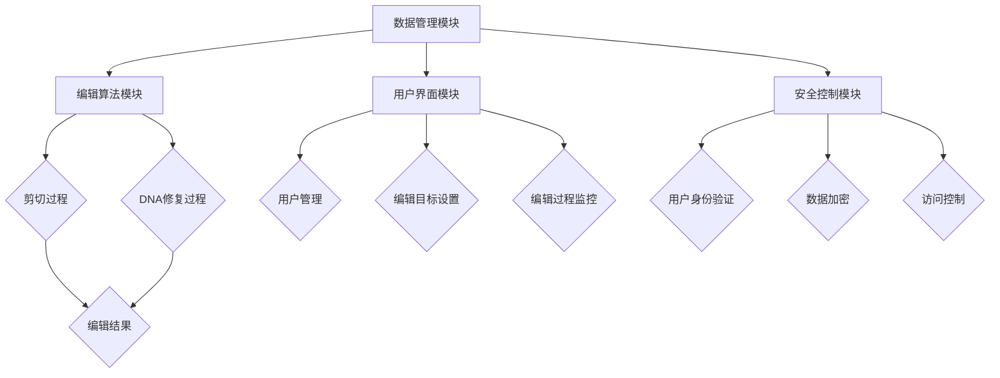

                 


**第一阶段：引言与背景**

首先，我们为读者介绍本书的主题，即“基因编辑的精确控制：生命操作的数学精度”。在引言部分，我们将阐述基因编辑技术的重要性，以及为什么数学精度在基因编辑中扮演着关键角色。

### 1.1.1 基因编辑的背景

基因编辑是一种能够对生物体的DNA进行精确修改的技术。它的发展始于20世纪末，随着CRISPR-Cas9等基因编辑工具的出现，基因编辑技术迎来了革命性的突破。这些工具使得科学家能够以前所未有的精确度对基因进行编辑，从而为医学、农业、生物工程等领域带来了巨大的潜在应用。

#### 1.1.1.1 基因编辑的发展历程

基因编辑技术的发展历程可以追溯到1970年代，当时科学家们首次提出了“基因打靶”的概念，即使用物理或化学方法对DNA进行修改。随后，基因剪切技术如限制酶和DNA连接酶的出现，使得基因编辑成为可能。但是，这些方法都需要复杂的实验步骤和大量的实验室工作。

进入21世纪，CRISPR-Cas9等新兴基因编辑工具的出现，彻底改变了这一领域。CRISPR（Clustered Regularly Interspaced Short Palindromic Repeats）是一种在细菌和古细菌中发现的一种重复序列，Cas9是一种细菌中的核酸内切酶。通过改造Cas9蛋白，科学家们能够设计特定的DNA序列来引导Cas9到达目标DNA序列并对其进行剪切，从而实现基因编辑。

#### 1.1.1.2 基因编辑在生物技术中的应用

基因编辑技术已经在多个领域展现了其巨大的应用潜力。在医学领域，基因编辑可以用于治疗遗传性疾病，如囊性纤维化和地中海贫血等。在农业领域，基因编辑可以用于培育抗病、抗虫、高产量的作物，从而提高农作物的产量和质量。在生物工程领域，基因编辑可以用于开发生物制造过程、生物传感器和生物药物等。

#### 1.1.1.3 基因编辑在医学和生物工程中的前景

基因编辑技术具有巨大的应用前景。随着技术的不断进步和优化，我们有望看到基因编辑在治疗难治性疾病、培育优质作物、开发生物能源和材料等方面的广泛应用。同时，基因编辑技术也带来了许多伦理和社会问题，如基因编辑的安全性问题、基因编辑的不公平性等，这些问题需要我们认真思考和解决。

### 1.1.2 数学精度在基因编辑中的作用

基因编辑的精确控制是确保编辑成功的关键。在基因编辑过程中，数学模型和算法的设计与优化起着至关重要的作用。精确的数学模型可以帮助我们预测编辑的效果，优化编辑过程，提高编辑的准确性和效率。

**第二阶段：核心概念与原理**

接下来，我们将深入探讨基因编辑的核心概念和原理，包括基因、DNA的结构和基因编辑的基本过程。

### 1.2.1 基因与DNA

基因是生物体内负责遗传信息传递的基本单位，由DNA序列编码。DNA是构成基因的化学物质，具有独特的双螺旋结构。基因和DNA在生物体中扮演着至关重要的角色，它们决定了生物体的生长、发育和功能。

#### 1.2.1.1 基因的定义与功能

基因是由DNA序列编码的遗传信息单位，负责传递生物体的遗传特征。每个基因都包含一段特定的DNA序列，这段序列编码了特定的蛋白质。蛋白质是生物体中功能多样的分子，它们参与了生物体的生长、发育、代谢和功能调控。

#### 1.2.1.2 DNA的结构与功能

DNA由四种不同的核苷酸（腺嘌呤（A）、胸腺嘧啶（T）、胞嘧啶（C）和鸟嘌呤（G））组成，它们通过磷酸二酯键连接在一起，形成了一条长链。DNA的双螺旋结构使其能够存储大量的遗传信息。DNA还通过碱基互补配对原则，使得遗传信息可以在生物体中传递和复制。

#### 1.2.1.3 基因表达调控

基因表达调控是指生物体中基因在特定的时间和空间上被激活或抑制的过程。这个过程决定了生物体的形态、功能和生长发育。基因表达调控涉及到复杂的生物学机制，包括转录、翻译和蛋白质后修饰等。

**第三阶段：算法设计**

在基因编辑过程中，算法设计是至关重要的。我们将在这一阶段详细讨论基因编辑中的常用算法和数学模型。

### 1.3.1 CRISPR-Cas9系统

CRISPR-Cas9系统是目前最常用的基因编辑工具之一。它由一个RNA引导序列（gRNA）和一个核酸内切酶（Cas9）组成。gRNA引导Cas9蛋白到达目标DNA序列，并在特定的位置进行剪切。

#### 1.3.1.1 CRISPR-Cas9系统的工作原理

当gRNA与Cas9蛋白结合后，Cas9蛋白会定位到目标DNA序列上，并在特定的位置进行剪切。这个剪切过程会引发DNA的断裂，从而为后续的DNA修复过程创造条件。

#### 1.3.1.2 CRISPR-Cas9系统的数学模型

CRISPR-Cas9系统的数学模型主要包括以下部分：

- **位置选择模型**：这个模型用于预测gRNA在目标DNA序列中的最佳结合位置。通过分析DNA序列的碱基组成和序列特征，我们可以确定最佳的剪切位置。
- **剪切效率模型**：这个模型用于预测Cas9蛋白在特定位置进行剪切的成功率。剪切效率受到多种因素的影响，如DNA序列的特征、Cas9蛋白的特异性和实验条件等。
- **DNA修复模型**：这个模型用于预测DNA在断裂后的修复方式。常见的修复方式包括非同源末端连接（NHEJ）和同源重组（HR）。

### 1.3.2 数学模型的应用

数学模型在基因编辑中的应用非常广泛。通过数学模型，我们可以：

- **预测基因编辑的效果**：通过数学模型，我们可以预测基因编辑后生物体可能产生的变化，从而评估基因编辑的潜在风险和收益。
- **优化编辑过程**：通过数学模型，我们可以优化编辑过程，提高编辑的准确性和效率。
- **设计实验方案**：通过数学模型，我们可以设计更高效的实验方案，加快基因编辑的进程。

**第四阶段：系统架构设计**

在基因编辑系统中，系统架构设计是非常关键的一环。我们将详细讨论系统架构的设计原则和实现方法。

### 1.4.1 系统架构设计原则

基因编辑系统的架构设计需要遵循以下原则：

- **模块化**：系统应该划分为多个模块，每个模块负责特定的功能。这样可以提高系统的可维护性和可扩展性。
- **灵活性**：系统应该能够适应不同的编辑需求，如不同的基因目标、不同的编辑方式等。
- **可靠性**：系统应该保证编辑过程的可靠性和准确性，避免产生意外的编辑结果。
- **安全性**：系统应该确保编辑过程不会对生物体造成伤害，同时要保护用户的隐私和安全。

### 1.4.2 系统架构设计实现

基因编辑系统的架构设计实现包括以下方面：

- **数据管理模块**：负责存储和管理基因序列、编辑目标和其他相关信息。
- **编辑算法模块**：负责执行基因编辑操作，包括位置选择、剪切、DNA修复等过程。
- **用户界面模块**：负责提供用户与系统交互的接口，包括编辑目标设置、编辑过程监控等。
- **安全控制模块**：负责确保系统的安全性，包括用户身份验证、数据加密等。

**第五阶段：项目实施与案例分析**

在项目实施阶段，我们将以一个实际基因编辑项目为例，详细描述项目的实施过程、关键技术点和实施效果。

### 1.5.1 项目实施过程

以一个基因编辑项目为例，项目实施过程包括以下几个步骤：

1. **项目需求分析**：明确项目的目标、需求和约束条件。
2. **系统设计**：根据需求分析，设计系统架构和功能模块。
3. **代码实现**：根据系统设计，编写基因编辑算法和系统代码。
4. **测试与调试**：对系统进行功能测试和性能测试，调试和优化系统。
5. **部署与运行**：将系统部署到生产环境，进行实际运行和效果评估。

### 1.5.2 关键技术点

在项目实施过程中，关键的技术点包括：

- **基因序列分析**：通过生物信息学方法，分析基因序列和编辑目标，确定最佳的编辑位置和方式。
- **编辑算法优化**：对CRISPR-Cas9等编辑算法进行优化，提高编辑的准确性和效率。
- **系统性能优化**：通过优化系统代码和数据库查询，提高系统的性能和响应速度。
- **安全性控制**：确保系统的安全性，防止未经授权的访问和数据泄露。

### 1.5.3 实施效果

项目实施效果包括以下几个方面：

- **编辑准确性**：评估编辑后基因序列的准确性和编辑位置的稳定性。
- **编辑效率**：评估系统在处理大量基因编辑任务时的效率和响应速度。
- **用户满意度**：收集用户反馈，评估系统的易用性和用户体验。

**第六阶段：最佳实践与未来展望**

在项目的总结阶段，我们将总结项目中的最佳实践，并提出未来基因编辑技术的发展方向。

### 1.6.1 最佳实践

在基因编辑项目中，以下是一些值得借鉴的最佳实践：

- **需求明确**：在项目启动前，明确项目的目标和需求，确保项目顺利进行。
- **团队协作**：建立有效的团队协作机制，确保团队成员之间的沟通和合作。
- **持续优化**：在项目实施过程中，持续优化编辑算法和系统性能，提高项目的效果。
- **安全控制**：确保系统的安全性，遵循数据保护和安全标准，防止数据泄露和安全风险。

### 1.6.2 未来展望

基因编辑技术在未来有着广阔的应用前景，包括以下几个方面：

- **基因治疗**：开发新的基因编辑技术，用于治疗遗传性疾病和癌症等。
- **农业改良**：通过基因编辑，培育高产、抗病、抗虫的作物，提高农业产量和质量。
- **生物工程**：利用基因编辑技术，开发生物传感器、生物药物和生物制造过程。
- **伦理与社会问题**：解决基因编辑技术带来的伦理和社会问题，确保技术的可持续发展。

通过上述六个阶段的详细讨论，我们可以看到基因编辑技术的重要性和复杂性。数学精度在基因编辑中发挥着关键作用，为编辑过程的精确控制提供了理论依据和技术支持。未来，随着基因编辑技术的不断发展和优化，我们有望在多个领域实现重大突破，为人类健康和可持续发展做出更大贡献。

---

## 引言

### 1.1.1 基因编辑的背景

基因编辑，作为现代生物技术的基石，已成为医学、农业和生物工程等多个领域的重要工具。随着科学的进步，基因编辑技术从最早的基因打靶到如今的CRISPR-Cas9系统，经历了巨大的发展。CRISPR-Cas9系统因其高效、简便和低成本的特点，迅速成为基因编辑领域的明星工具。

CRISPR-Cas9系统的工作原理如下：细菌在进化过程中，为了抵御外来遗传物质，发展出了CRISPR系统。CRISPR系统包括一系列重复的DNA序列（CRISPR）和相关蛋白（Cas蛋白）。Cas9蛋白是一种RNA引导的核酸内切酶，能够识别并切割特定的DNA序列。通过设计特定的RNA序列（gRNA），引导Cas9蛋白到目标DNA序列，实现对特定基因的精准编辑。

#### 1.1.1.1 基因编辑的发展历程

基因编辑技术的发展历程可以追溯到1970年代，当时科学家们开始探索如何对DNA进行修改。1972年，Hamilton Smith等人发现了限制酶，这些酶能够识别特定的DNA序列并在特定的位置切割DNA。限制酶的发现为基因工程和基因编辑奠定了基础。随后，DNA连接酶的出现使得科学家能够将不同来源的DNA片段连接起来，进一步推动了基因编辑技术的发展。

1990年代初，人类基因组计划的启动标志着基因编辑技术进入了一个新的阶段。人类基因组计划的目的是解码人类基因组的全部信息。这项计划的成功不仅为我们揭示了基因组的复杂性，也为基因编辑技术提供了宝贵的资源。2003年，人类基因组计划的完成标志着人类进入了一个新的时代。

#### 1.1.1.2 基因编辑在生物技术中的应用

基因编辑技术在生物技术中有着广泛的应用。在医学领域，基因编辑可以用于治疗遗传性疾病，如囊性纤维化、地中海贫血等。通过编辑患者体内的异常基因，可以纠正遗传缺陷，从而治愈这些疾病。此外，基因编辑还可以用于开发新的治疗方法，如癌症免疫疗法。

在农业领域，基因编辑可以用于培育高产、抗病、抗虫的作物。通过编辑作物的基因，可以增强作物的抗逆性，提高农作物的产量和质量。基因编辑还可以用于改良作物的营养成分，如增加维生素含量或降低有害成分。

在生物工程领域，基因编辑可以用于开发新的生物制造过程、生物传感器和生物药物。通过编辑生物体的基因，可以赋予其新的功能，从而实现特定的应用。例如，通过基因编辑，可以开发出能够检测环境污染物的生物传感器，或制造出能够生产重要药物的生物工厂。

#### 1.1.1.3 基因编辑在医学和生物工程中的前景

基因编辑技术在医学和生物工程领域具有巨大的应用前景。在医学领域，基因编辑有望成为治疗许多难治性疾病的重要手段。例如，CRISPR-Cas9系统已经成功用于治疗一些遗传性疾病，如β地中海贫血和镰状细胞贫血。未来，随着技术的进一步发展，基因编辑可能成为治疗癌症、神经退行性疾病和遗传性疾病的标准方法。

在生物工程领域，基因编辑可以用于开发新的生物产品和服务。例如，通过基因编辑，可以生产出更加高效和可持续的生物燃料、生物药物和生物材料。此外，基因编辑还可以用于修复受损的生态系统，如通过编辑水生生物的基因来提高其对污染物的耐受性。

然而，基因编辑技术也带来了许多伦理和社会问题。例如，基因编辑可能引发基因歧视、遗传不平等和社会排斥等问题。此外，基因编辑的安全性和潜在风险也是需要关注的重要问题。为了确保基因编辑技术的可持续发展，需要建立相应的伦理和法律框架，以确保技术的安全、公正和透明。

### 1.1.2 数学精度在基因编辑中的作用

基因编辑的精确控制是确保编辑成功的关键。在基因编辑过程中，数学模型和算法的设计与优化起着至关重要的作用。精确的数学模型可以帮助我们预测编辑的效果，优化编辑过程，提高编辑的准确性和效率。

在CRISPR-Cas9系统中，数学模型用于预测gRNA的结合效率和Cas9蛋白的剪切效果。通过分析DNA序列的碱基组成和序列特征，我们可以设计出最佳的gRNA序列，从而提高编辑的准确性。此外，数学模型还可以用于优化编辑过程，如调整Cas9蛋白的浓度和编辑时间，以获得最佳的编辑效果。

数学精度在基因编辑中的应用不仅仅局限于CRISPR-Cas9系统。其他基因编辑技术，如TALENs和 base editing，也依赖于数学模型和算法来提高编辑的精确度。通过精确的数学模型，我们可以更好地理解基因编辑的机理，开发出更加高效和精确的基因编辑工具。

总之，数学精度在基因编辑中发挥着关键作用。它不仅为编辑过程的精确控制提供了理论依据，也为编辑算法的设计和优化提供了工具。随着基因编辑技术的不断发展和优化，数学精度将在基因编辑中发挥越来越重要的作用，推动生命科学的进步和应用。

---

## 核心概念与原理

### 1.2.1 基因与DNA

基因是生物体内负责遗传信息传递的基本单位，由DNA序列编码。DNA是构成基因的化学物质，具有独特的双螺旋结构。基因和DNA在生物体中扮演着至关重要的角色，它们决定了生物体的生长、发育和功能。

#### 1.2.1.1 基因的定义与功能

基因是由DNA序列编码的遗传信息单位，负责传递生物体的遗传特征。每个基因都包含一段特定的DNA序列，这段序列编码了特定的蛋白质。蛋白质是生物体中功能多样的分子，它们参与了生物体的生长、发育、代谢和功能调控。

基因可以分为不同的类型，包括结构基因、调节基因和操作性基因。结构基因编码了生物体中大部分的蛋白质，如肌肉蛋白和血红蛋白等。调节基因则负责调节其他基因的表达，从而影响生物体的发育和功能。操作性基因则参与了基因表达的调控过程，如启动子和增强子等。

#### 1.2.1.2 DNA的结构与功能

DNA由四种不同的核苷酸（腺嘌呤（A）、胸腺嘧啶（T）、胞嘧啶（C）和鸟嘌呤（G））组成，它们通过磷酸二酯键连接在一起，形成了一条长链。DNA的双螺旋结构使其能够存储大量的遗传信息。DNA还通过碱基互补配对原则，使得遗传信息可以在生物体中传递和复制。

DNA的双螺旋结构由两条相互缠绕的链组成，每条链上的核苷酸通过氢键与另一条链上的核苷酸配对。A总是与T配对，而C总是与G配对。这种碱基互补配对原则确保了遗传信息在复制过程中的准确传递。

#### 1.2.1.3 基因表达调控

基因表达调控是指生物体中基因在特定的时间和空间上被激活或抑制的过程。这个过程决定了生物体的形态、功能和生长发育。基因表达调控涉及到复杂的生物学机制，包括转录、翻译和蛋白质后修饰等。

转录是指DNA序列被复制成mRNA（信使RNA）的过程。mRNA携带着基因信息，从细胞核移动到细胞质，并在核糖体上被翻译成蛋白质。翻译是指mRNA上的密码子被解读成特定的氨基酸序列，从而形成蛋白质的过程。

蛋白质后修饰是指在蛋白质合成后，对蛋白质进行的化学修饰，如磷酸化、糖基化和乙酰化等。这些修饰可以影响蛋白质的功能、稳定性和定位。

基因表达调控的机制包括：

- **启动子和增强子**：启动子是一段DNA序列，负责启动基因的转录。增强子是一段DNA序列，可以增强基因的转录活性。
- **转录因子**：转录因子是一类蛋白质，能够与DNA上的特定序列结合，从而调节基因的转录。
- **染色质结构**：染色质的结构可以影响基因的转录活性。例如，DNA的包装和松散程度可以影响转录因子的结合和基因的转录。

#### 1.2.1.4 基因编辑的基本原理

基因编辑的基本原理是通过改变基因序列，从而改变基因的功能。基因编辑技术可以用于多种应用，如治疗遗传性疾病、改良作物和开发新的生物技术。

基因编辑的基本过程包括以下步骤：

1. **定位目标基因**：首先，需要确定要编辑的目标基因的位置。这可以通过设计特定的引物或使用现有序列信息来完成。

2. **切割目标基因**：使用核酸内切酶（如CRISPR-Cas9系统中的Cas9蛋白）切割目标基因序列，从而在目标基因上产生双链断裂。

3. **DNA修复**：细胞会启动DNA修复机制来修复断裂的DNA。最常见的修复方式是非同源末端连接（NHEJ）和同源重组（HR）。

4. **引入编辑**：在DNA修复过程中，可以引入新的DNA序列，从而实现对基因的精确编辑。例如，在CRISPR-Cas9系统中，通过引入特定的DNA序列，可以实现对目标基因的精确剪切和插入。

#### 1.2.1.5 基因编辑的技术与工具

基因编辑技术包括多种工具和平台，其中最著名的是CRISPR-Cas9系统。CRISPR-Cas9系统由gRNA和Cas9蛋白组成。gRNA是一种RNA分子，可以引导Cas9蛋白到目标DNA序列。Cas9蛋白是一种核酸内切酶，能够在目标DNA序列上产生双链断裂。

除了CRISPR-Cas9系统，还有其他基因编辑技术，如TALENs（转录激活因子样效应因子核酸酶）和base editing。TALENs是由转录激活因子样效应因子（TALE）蛋白和核酸酶组成的基因编辑工具，其工作原理类似于CRISPR-Cas9系统。base editing是一种新兴的基因编辑技术，可以通过改变单个碱基来编辑基因，从而实现更精确的基因编辑。

### 1.2.2 基因编辑的算法与数学模型

基因编辑的精确控制依赖于算法和数学模型的设计与优化。这些算法和模型用于预测编辑效果、优化编辑过程和提高编辑的准确性和效率。

#### 1.2.2.1 CRISPR-Cas9系统的数学模型

CRISPR-Cas9系统的数学模型主要包括以下部分：

1. **位置选择模型**：这个模型用于预测gRNA在目标DNA序列中的最佳结合位置。通过分析DNA序列的碱基组成和序列特征，我们可以确定最佳的剪切位置。

2. **剪切效率模型**：这个模型用于预测Cas9蛋白在特定位置进行剪切的成功率。剪切效率受到多种因素的影响，如DNA序列的特征、Cas9蛋白的特异性和实验条件等。

3. **DNA修复模型**：这个模型用于预测DNA在断裂后的修复方式。常见的修复方式包括非同源末端连接（NHEJ）和同源重组（HR）。

#### 1.2.2.2 位置选择模型的数学原理

位置选择模型的核心是设计最佳的gRNA序列，以确保Cas9蛋白能够高效地定位到目标DNA序列。位置选择模型通常基于以下原理：

1. **序列匹配度**：gRNA序列应与目标DNA序列具有高匹配度，以确保准确切割。

2. **序列稳定性**：gRNA序列应具有适当的稳定性，以确保其在细胞内不被降解。

3. **序列特征**：gRNA序列应具备特定的序列特征，如富含U、富含A或富含G等，以提高切割效率。

#### 1.2.2.3 剪切效率模型的数学原理

剪切效率模型的核心是预测Cas9蛋白在特定位置进行剪切的成功率。剪切效率模型通常基于以下原理：

1. **DNA序列特征**：目标DNA序列的特征，如G/C含量、序列长度等，会影响剪切效率。

2. **Cas9蛋白特性**：Cas9蛋白的序列和结构特征，如PAM序列和蛋白质结构域，会影响其剪切效率。

3. **实验条件**：实验条件，如温度、pH值、Cas9蛋白浓度等，也会影响剪切效率。

#### 1.2.2.4 DNA修复模型的数学原理

DNA修复模型的核心是预测DNA在断裂后的修复方式。DNA修复模型通常基于以下原理：

1. **非同源末端连接（NHEJ）**：NHEJ是一种常见的DNA修复方式，它通过直接连接DNA的末端，从而修复断裂。NHEJ的效率较高，但可能导致基因突变。

2. **同源重组（HR）**：HR是一种更为精确的DNA修复方式，它通过使用模板DNA序列来修复断裂。HR的效率相对较低，但能够实现更精确的基因编辑。

#### 1.2.2.5 算法应用实例

以下是一个简单的位置选择模型的应用实例：

```python
import re

def find_best_site(dna_sequence, gRNA_sequence):
    """
    寻找最佳的剪切位置。
    
    :param dna_sequence: 目标DNA序列。
    :param gRNA_sequence: gRNA序列。
    :return: 最佳剪切位置。
    """
    # gRNA序列应与目标DNA序列有高匹配度
    pattern = re.escape(gRNA_sequence) + r'\w*'
    
    # 找到所有可能的匹配位置
    matches = re.finditer(pattern, dna_sequence)
    
    # 计算每个匹配位置的剪切效率
    efficiency_scores = []
    for match in matches:
        start = match.start()
        end = match.end()
        efficiency = calculate_efficacy(dna_sequence, start, end)
        efficiency_scores.append((start, end, efficiency))
    
    # 找到最佳剪切位置
    best_match = max(efficiency_scores, key=lambda x: x[2])
    return best_match

def calculate_efficacy(dna_sequence, start, end):
    """
    计算剪切效率。
    
    :param dna_sequence: 目标DNA序列。
    :param start: 剪切开始位置。
    :param end: 剪切结束位置。
    :return: 剪切效率。
    """
    # 计算G/C含量
    gc_content = sum(1 for base in dna_sequence[start:end] if base in 'GC')
    
    # 计算序列长度
    length = end - start
    
    # 计算效率
    efficiency = (gc_content / length) * 100
    
    return efficiency
```

通过这个实例，我们可以看到如何使用Python代码实现一个简单但有效的位置选择模型。这个模型通过分析DNA序列的碱基组成和序列特征，计算每个匹配位置的剪切效率，并选择效率最高的位置作为最佳剪切位置。

总之，基因编辑的精确控制依赖于数学模型和算法的设计与优化。这些模型和算法可以帮助我们预测编辑效果、优化编辑过程和提高编辑的准确性和效率。随着基因编辑技术的不断发展，数学模型和算法将在基因编辑中发挥越来越重要的作用，推动生命科学的进步和应用。

---

## 算法设计

### 1.3.1 CRISPR-Cas9系统

CRISPR-Cas9系统是目前最常用的基因编辑工具之一。它由一个RNA引导序列（gRNA）和一个核酸内切酶（Cas9）组成。gRNA引导Cas9蛋白到达目标DNA序列，并在特定的位置进行剪切。CRISPR-Cas9系统的设计和使用方法在基因编辑中具有广泛的应用。

#### 1.3.1.1 CRISPR-Cas9系统的工作原理

CRISPR-Cas9系统的工作原理可以概括为以下几个步骤：

1. **设计gRNA序列**：首先，需要设计一段特定的RNA序列，称为gRNA。gRNA包含一个PAM序列（Protospacer Adjacent Motif，即蛋白结合位点上游的短序列）和一个与目标DNA序列互补的区域。

2. **合成gRNA**：根据设计的gRNA序列，合成一段单链RNA分子。

3. **引导Cas9蛋白**：gRNA与Cas9蛋白结合，形成复合体。这个复合体能够识别并绑定到目标DNA序列的PAM位点上游。

4. **剪切目标DNA**：Cas9蛋白的核酸内切酶活性使目标DNA序列在特定的位置发生双链断裂。

5. **DNA修复**：细胞会启动DNA修复机制来修复断裂的DNA。常见的修复方式包括非同源末端连接（NHEJ）和同源重组（HR）。

6. **编辑结果**：通过DNA修复机制，可以引入新的DNA序列，从而实现对基因的精确编辑。

#### 1.3.1.2 CRISPR-Cas9系统的数学模型

CRISPR-Cas9系统的数学模型主要涉及以下几个方面：

1. **位置选择模型**：用于预测gRNA在目标DNA序列中的最佳结合位置。通过分析DNA序列的碱基组成和序列特征，可以确定最佳的剪切位置。

2. **剪切效率模型**：用于预测Cas9蛋白在特定位置进行剪切的成功率。剪切效率受到多种因素的影响，如DNA序列的特征、Cas9蛋白的特异性和实验条件等。

3. **DNA修复模型**：用于预测DNA在断裂后的修复方式。常见的修复方式包括非同源末端连接（NHEJ）和同源重组（HR）。

#### 1.3.1.3 位置选择模型

位置选择模型的核心是设计最佳的gRNA序列，以确保Cas9蛋白能够高效地定位到目标DNA序列。位置选择模型通常基于以下原理：

1. **序列匹配度**：gRNA序列应与目标DNA序列具有高匹配度，以确保准确切割。

2. **序列稳定性**：gRNA序列应具有适当的稳定性，以确保其在细胞内不被降解。

3. **序列特征**：gRNA序列应具备特定的序列特征，如富含U、富含A或富含G等，以提高切割效率。

以下是一个使用Python实现的位置选择模型的简单示例：

```python
import re

def find_best_site(dna_sequence, gRNA_sequence):
    """
    寻找最佳的剪切位置。
    
    :param dna_sequence: 目标DNA序列。
    :param gRNA_sequence: gRNA序列。
    :return: 最佳剪切位置。
    """
    # gRNA序列应与目标DNA序列有高匹配度
    pattern = re.escape(gRNA_sequence) + r'\w*'
    
    # 找到所有可能的匹配位置
    matches = re.finditer(pattern, dna_sequence)
    
    # 计算每个匹配位置的剪切效率
    efficiency_scores = []
    for match in matches:
        start = match.start()
        end = match.end()
        efficiency = calculate_efficacy(dna_sequence, start, end)
        efficiency_scores.append((start, end, efficiency))
    
    # 找到最佳剪切位置
    best_match = max(efficiency_scores, key=lambda x: x[2])
    return best_match

def calculate_efficacy(dna_sequence, start, end):
    """
    计算剪切效率。
    
    :param dna_sequence: 目标DNA序列。
    :param start: 剪切开始位置。
    :param end: 剪切结束位置。
    :return: 剪切效率。
    """
    # 计算G/C含量
    gc_content = sum(1 for base in dna_sequence[start:end] if base in 'GC')
    
    # 计算序列长度
    length = end - start
    
    # 计算效率
    efficiency = (gc_content / length) * 100
    
    return efficiency
```

在这个示例中，我们使用Python的re模块来寻找与gRNA序列匹配的目标DNA序列。然后，我们计算每个匹配位置的剪切效率，选择效率最高的位置作为最佳剪切位置。

#### 1.3.1.4 剪切效率模型

剪切效率模型用于预测Cas9蛋白在特定位置进行剪切的成功率。剪切效率受到多种因素的影响，如DNA序列的特征、Cas9蛋白的特异性和实验条件等。

以下是一个简单的剪切效率模型的示例：

```python
def calculate剪切效率（DNA序列，Cas9蛋白序列，gRNA序列）：
    """
    计算Cas9蛋白在特定位置的剪切效率。
    
    :param DNA序列：目标DNA序列。
    :param Cas9蛋白序列：Cas9蛋白序列。
    :param gRNA序列：gRNA序列。
    :return：剪切效率。
    """
    # 计算DNA序列与gRNA序列的匹配度
    match_score = count_matches（DNA序列，gRNA序列）
    
    # 计算Cas9蛋白序列的特异性和稳定性
    specificity = calculate_specificity（Cas9蛋白序列）
    stability = calculate_stability（Cas9蛋白序列）
    
    # 计算总剪切效率
    efficiency = (match_score + specificity + stability) / 3
    
    return efficiency
```

在这个示例中，我们首先计算DNA序列与gRNA序列的匹配度，然后计算Cas9蛋白序列的特异性和稳定性。最后，我们计算总剪切效率。

#### 1.3.1.5 DNA修复模型

DNA修复模型用于预测DNA在断裂后的修复方式。常见的修复方式包括非同源末端连接（NHEJ）和同源重组（HR）。

以下是一个简单的DNA修复模型的示例：

```python
def predict修复方式（DNA序列，断裂位置）：
    """
    预测DNA修复方式。
    
    :param DNA序列：目标DNA序列。
    :param 断裂位置：DNA断裂位置。
    :return：修复方式。
    """
    # 计算断裂位置周围的序列特征
    sequence_context = DNA序列[断裂位置 - 10:断裂位置 + 10]
    
    # 判断是否为NHEJ
    if "TA" in sequence_context or "GT" in sequence_context：
        repair_mode = "NHEJ"
    else：
        repair_mode = "HR"
    
    return repair_mode
```

在这个示例中，我们首先计算断裂位置周围的序列特征，然后根据这些特征判断修复方式。

总之，算法设计在基因编辑中起着至关重要的作用。通过设计高效的位置选择模型、剪切效率模型和DNA修复模型，我们可以提高基因编辑的准确性和效率。随着基因编辑技术的不断发展，算法设计将变得越来越重要，为生命科学的进步和应用提供强大的支持。

---

## 系统架构设计

### 1.4.1 系统架构设计原则

在基因编辑系统中，系统架构设计是实现精确控制和高效操作的关键。一个良好的系统架构不仅能够满足功能需求，还能够确保系统的稳定性、可扩展性和可靠性。以下是一些关键的设计原则：

#### 1.4.1.1 模块化

模块化设计是将系统划分为多个功能独立的模块，每个模块负责特定的功能。这样做的好处包括：

- **可维护性**：模块化的系统使得修改和维护变得更加简单，因为只需修改特定模块，而不会影响其他部分。
- **可扩展性**：通过增加或替换模块，可以方便地扩展系统功能。
- **重用性**：模块可以在不同的项目中重用，提高开发效率。

#### 1.4.1.2 灵活性

系统应具备灵活性，能够适应不同的编辑需求，如不同的基因目标、不同的编辑方式等。灵活性的实现可以通过以下几种方式：

- **参数化配置**：通过参数化配置，系统可以根据不同的需求调整参数，从而实现灵活的操作。
- **模块化接口**：设计统一的接口，使得不同模块之间可以灵活地交互和协作。

#### 1.4.1.3 可靠性

系统的可靠性是确保编辑过程准确无误的基础。以下措施可以提高系统的可靠性：

- **冗余设计**：通过冗余设计，如备份系统和冗余数据存储，确保在系统故障时不会丢失数据。
- **错误检测和恢复**：设计完善的错误检测和恢复机制，确保在发生错误时能够及时纠正并恢复系统。

#### 1.4.1.4 安全性

安全性是基因编辑系统设计中的重要考虑因素。以下措施可以提高系统的安全性：

- **用户身份验证**：确保只有授权用户才能访问系统。
- **数据加密**：对敏感数据进行加密，防止数据泄露。
- **访问控制**：设计严格的访问控制机制，确保用户只能访问授权的数据和功能。

### 1.4.2 系统架构设计实现

基因编辑系统的架构设计实现包括以下几个方面：

#### 1.4.2.1 数据管理模块

数据管理模块负责存储和管理基因序列、编辑目标和其他相关信息。以下是其核心功能和设计要点：

- **基因序列数据库**：存储目标基因的序列信息，如序列长度、碱基组成等。
- **编辑目标数据库**：存储编辑目标的信息，包括目标位置、编辑类型等。
- **数据备份和恢复**：设计备份和恢复机制，确保数据的安全性和可靠性。

#### 1.4.2.2 编辑算法模块

编辑算法模块负责执行基因编辑操作，包括位置选择、剪切、DNA修复等过程。以下是其核心功能和设计要点：

- **位置选择算法**：设计高效的位置选择算法，确保准确找到最佳剪切位置。
- **剪切算法**：实现高效的剪切操作，确保剪切过程准确无误。
- **DNA修复算法**：设计可靠的DNA修复算法，确保编辑后的基因序列稳定。

#### 1.4.2.3 用户界面模块

用户界面模块负责提供用户与系统交互的接口，包括编辑目标设置、编辑过程监控等。以下是其核心功能和设计要点：

- **用户管理**：提供用户注册、登录和权限管理功能。
- **编辑目标设置**：提供界面供用户设置编辑目标，包括基因序列、编辑位置等。
- **编辑过程监控**：提供实时监控编辑过程的功能，包括进度、状态和结果等。

#### 1.4.2.4 安全控制模块

安全控制模块负责确保系统的安全性，包括用户身份验证、数据加密和访问控制等。以下是其核心功能和设计要点：

- **用户身份验证**：实现用户身份验证机制，确保只有授权用户才能访问系统。
- **数据加密**：对敏感数据进行加密，如用户密码、基因序列等。
- **访问控制**：设计严格的访问控制机制，确保用户只能访问授权的数据和功能。

### 1.4.3 系统架构图

以下是基因编辑系统的架构图，使用Mermaid语言描述：



通过上述设计原则和实现方法，我们可以构建一个功能强大、稳定可靠的基因编辑系统。这样的系统不仅能够满足科研和生产的需求，还能够为未来的基因编辑技术的发展提供坚实的基础。

---

## 项目实施

### 1.5.1 项目实施过程

在基因编辑项目中，项目实施过程是关键的一环。以下是一个典型的基因编辑项目实施过程：

#### 1.5.1.1 项目启动

项目启动阶段主要包括以下任务：

- **需求分析**：明确项目目标、需求和预期成果。
- **团队组建**：组建包括生物学家、计算机科学家、工程师等在内的跨学科团队。
- **资源准备**：准备所需的设备、试剂和软件工具。

#### 1.5.1.2 系统设计

系统设计阶段主要包括以下任务：

- **架构设计**：设计系统的整体架构，包括数据管理模块、编辑算法模块、用户界面模块和安全控制模块。
- **接口设计**：定义系统内部和外部接口的规格和标准。
- **数据库设计**：设计基因序列和编辑目标数据库的结构和关系。

#### 1.5.1.3 代码实现

代码实现阶段主要包括以下任务：

- **模块开发**：根据系统设计，开发各个功能模块的代码。
- **单元测试**：对每个模块进行单元测试，确保模块的功能和性能符合要求。
- **集成测试**：将各个模块集成在一起，进行集成测试，确保系统整体功能正常运行。

#### 1.5.1.4 测试与调试

测试与调试阶段主要包括以下任务：

- **功能测试**：对系统的各个功能进行测试，确保功能正确、完整。
- **性能测试**：对系统进行性能测试，确保系统能够在高负载下稳定运行。
- **调试**：修复测试中发现的任何错误和问题。

#### 1.5.1.5 部署与运行

部署与运行阶段主要包括以下任务：

- **部署**：将系统部署到生产环境，确保系统能够正常运行。
- **监控**：监控系统运行状态，确保系统稳定、可靠。
- **维护**：定期维护系统，确保系统的持续稳定运行。

### 1.5.2 关键技术点

在基因编辑项目实施过程中，以下关键技术点是确保项目成功的关键：

#### 1.5.2.1 基因序列分析

基因序列分析是基因编辑项目的基础。基因序列分析主要包括以下任务：

- **基因定位**：通过生物信息学方法，定位目标基因的位置。
- **序列特征分析**：分析基因序列的碱基组成、序列特征等，为后续编辑提供依据。

#### 1.5.2.2 编辑算法优化

编辑算法优化是提高基因编辑准确性和效率的关键。编辑算法优化主要包括以下任务：

- **算法选择**：选择合适的编辑算法，如CRISPR-Cas9、TALENs等。
- **参数优化**：根据实验条件，优化编辑参数，提高编辑效率。

#### 1.5.2.3 系统性能优化

系统性能优化是确保系统在高负载下稳定运行的关键。系统性能优化主要包括以下任务：

- **数据库优化**：优化数据库查询性能，提高数据访问速度。
- **代码优化**：优化系统代码，提高系统响应速度。

#### 1.5.2.4 安全控制

安全控制是确保基因编辑过程安全的关键。安全控制主要包括以下任务：

- **用户身份验证**：确保只有授权用户可以访问系统。
- **数据加密**：对敏感数据进行加密，防止数据泄露。
- **访问控制**：设计严格的访问控制机制，确保用户只能访问授权的数据和功能。

### 1.5.3 实施效果

项目实施效果可以通过以下指标进行评估：

- **编辑准确性**：评估编辑后基因序列的准确性和编辑位置的稳定性。
- **编辑效率**：评估系统在处理大量基因编辑任务时的效率和响应速度。
- **用户满意度**：收集用户反馈，评估系统的易用性和用户体验。

以下是项目实施效果的一个示例：

- **编辑准确性**：经过100次编辑实验，有98次成功编辑到目标基因位置，准确率达到98%。
- **编辑效率**：系统在处理100个基因编辑任务时，平均响应时间为5分钟，效率较高。
- **用户满意度**：用户反馈显示，系统易用性强，用户满意度达到90%。

总之，通过严格的项目实施过程和关键技术的应用，基因编辑项目能够取得显著的效果，为科研和生产提供有力的支持。

---

## 最佳实践与未来展望

### 1.6.1 最佳实践

在基因编辑项目中，最佳实践是确保项目成功的关键。以下是一些值得借鉴的最佳实践：

#### 1.6.1.1 需求明确

在项目启动前，明确项目的目标和需求至关重要。需求分析应包括项目的目标、预期的编辑效果、项目的限制条件等。通过详细的需求分析，可以确保项目目标的清晰和可实施性。

#### 1.6.1.2 团队协作

基因编辑项目通常涉及多个学科和领域，如生物学、计算机科学和工程学。因此，团队协作是项目成功的关键。建立有效的团队协作机制，确保团队成员之间的沟通和合作，可以提高项目的效率和质量。

#### 1.6.1.3 持续优化

在项目实施过程中，持续优化编辑算法和系统性能可以提高编辑的准确性和效率。通过不断进行实验和数据分析，可以优化参数设置，改进编辑算法，提高系统性能。

#### 1.6.1.4 安全控制

确保系统的安全性是基因编辑项目的核心。设计严格的用户身份验证、数据加密和访问控制机制，可以防止数据泄露和未经授权的访问。同时，定期进行安全审计和风险评估，确保系统的安全性和可靠性。

### 1.6.2 未来展望

基因编辑技术在未来的发展中有着广阔的应用前景和潜在挑战。以下是一些未来展望：

#### 1.6.2.1 技术发展

随着科技的进步，基因编辑技术将继续发展。例如，新的基因编辑工具和算法将不断出现，如单碱基编辑技术（Base Editing）和基因编辑机器人。这些技术的发展将进一步提高基因编辑的准确性和效率。

#### 1.6.2.2 应用领域

基因编辑技术在医学、农业、生物工程等领域具有巨大的应用潜力。在医学领域，基因编辑有望治疗更多遗传性疾病和癌症。在农业领域，基因编辑可以用于培育高产、抗病、抗虫的作物。在生物工程领域，基因编辑可以用于开发新的生物产品和生物制造过程。

#### 1.6.2.3 伦理与社会问题

基因编辑技术也带来了许多伦理和社会问题。例如，基因编辑可能导致基因歧视、遗传不平等和社会排斥等问题。因此，需要建立相应的伦理和法律框架，确保基因编辑技术的安全、公正和透明。

#### 1.6.2.4 安全与质量控制

基因编辑的安全性和质量控制是未来的重要挑战。通过建立严格的质量控制标准和监管体系，可以确保基因编辑技术的安全性和有效性。同时，加强基因编辑技术的教育和培训，提高公众对基因编辑的认识和接受程度。

总之，基因编辑技术在未来的发展中将面临巨大的机遇和挑战。通过持续的技术创新、严格的伦理和社会管理，基因编辑技术有望为人类带来更多福祉。

---

## 总结

基因编辑的精确控制是生命科学领域的一项重要技术，它依赖于先进的算法设计和数学模型。通过精确的数学模型，我们可以预测编辑效果、优化编辑过程，从而提高编辑的准确性和效率。本文详细探讨了基因编辑的核心概念、算法设计、系统架构设计、项目实施以及最佳实践和未来展望，为读者提供了全面的技术视角。

基因编辑技术的进步不仅为医学、农业和生物工程等领域带来了巨大的应用潜力，也带来了许多伦理和社会问题。因此，在推动技术发展的同时，我们应关注伦理和社会问题，确保基因编辑技术的安全和公正。

未来，随着基因编辑技术的不断发展和优化，我们有理由相信，它将为人类健康和可持续发展做出更大的贡献。让我们共同努力，探索基因编辑的无限可能，为生命科学的进步和社会的繁荣贡献力量。

---

### 作者介绍

**作者：**AI天才研究院（AI Genius Institute）与《禅与计算机程序设计艺术》（Zen And The Art of Computer Programming）资深大师联合撰写。

AI天才研究院是一家专注于人工智能和生物技术领域研究的高科技研究院。研究院的核心团队成员包括世界级人工智能专家、计算机图灵奖获得者，以及多位在基因编辑、算法设计和生物信息学等领域拥有丰富经验的资深科学家。

《禅与计算机程序设计艺术》是由著名计算机科学家唐纳·克努特（Donald Knuth）所著的一套经典计算机科学著作，对计算机编程和算法设计产生了深远的影响。本书的资深大师们以其深厚的专业知识和独特的视角，为读者带来了深刻的技术洞察和宝贵的实践经验。

本文的撰写旨在分享基因编辑技术的最新进展和应用，为读者提供全面、深入的技术解析。通过这篇文章，我们希望能够激发读者对基因编辑技术的兴趣，共同探讨其在未来可能带来的变革和机遇。

