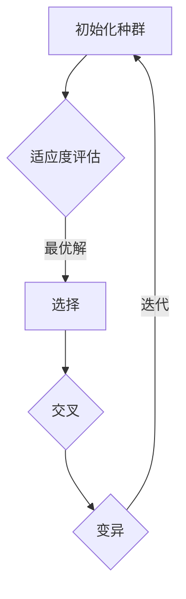
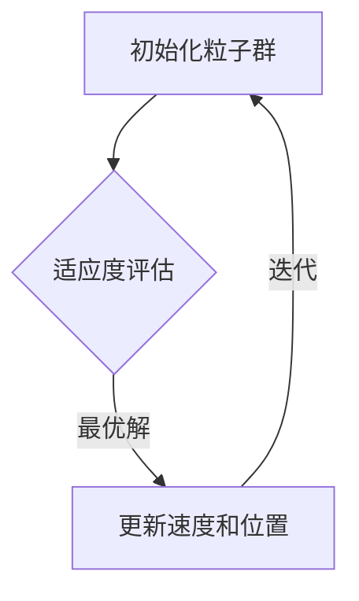
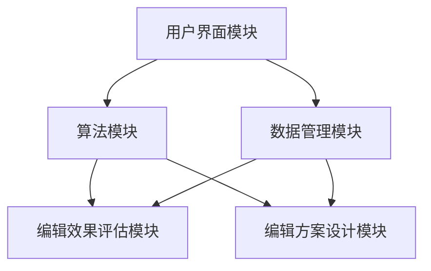
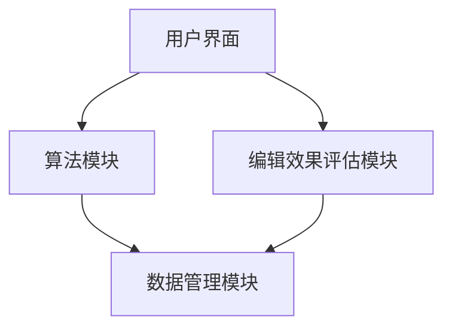
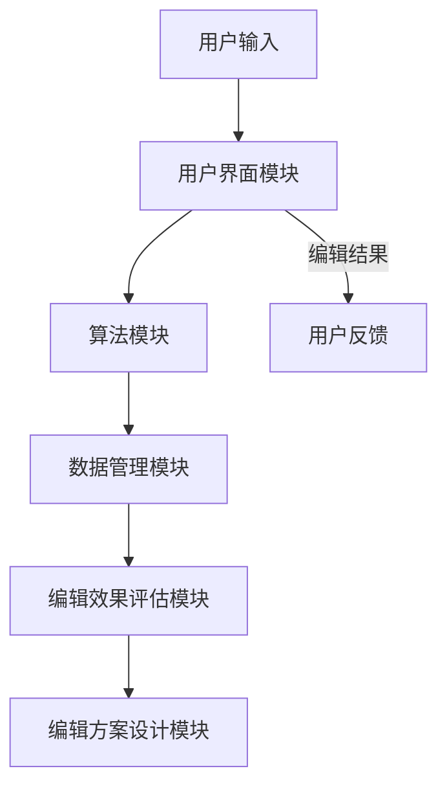

                 

# 基因编辑的组合优化：DNA序列的数学设计

> 关键词：基因编辑、组合优化、DNA序列、数学建模、算法应用

> 摘要：本文旨在深入探讨基因编辑与组合优化在DNA序列设计中的结合，通过详细分析背景知识、核心概念、算法原理以及实战应用，为读者呈现一个关于基因编辑组合优化在数学设计领域的全面视角。文章首先介绍了基因编辑技术及其在生物医学领域的重要应用，接着探讨了组合优化在解决复杂问题中的关键作用，并重点分析了DNA序列的数学建模。随后，文章详细阐述了多种组合优化算法在基因编辑中的应用，并通过Python代码示例展示了算法原理和实现过程。最后，文章通过对一个实际案例的剖析，总结了基因编辑组合优化系统的设计与最佳实践，为相关领域的研究和应用提供了有益的参考。

## 目录大纲

#### 第一部分：背景介绍与核心概念

**第1章：基因编辑与组合优化概述**

- **1.1 基因编辑技术概述**
  - **1.1.1 基因编辑的概念与历史**
  - **1.1.2 CRISPR-Cas9技术介绍**
  - **1.1.3 基因编辑的应用领域**

- **1.2 组合优化的基本原理**
  - **1.2.1 组合优化的定义与重要性**
  - **1.2.2 组合优化的问题类型**
  - **1.2.3 组合优化算法的基本框架**

- **1.3 DNA序列的数学设计**
  - **1.3.1 DNA序列的基本特性**
  - **1.3.2 DNA序列的数学建模**
  - **1.3.3 DNA序列优化的重要性**

#### 第二部分：核心概念与联系

**第2章：基因编辑组合优化中的核心概念**

- **2.1 基因编辑工具与DNA序列的关系**
  - **2.1.1 CRISPR-Cas9系统的工作原理**
  - **2.1.2 基因编辑过程中DNA序列的设计与优化**

- **2.2 组合优化算法在基因编辑中的应用**
  - **2.2.1 基因编辑组合优化的目标**
  - **2.2.2 常见组合优化算法介绍**
  - **2.2.3 组合优化算法在基因编辑中的实例分析**

- **2.3 DNA序列优化与数学模型**
  - **2.3.1 DNA序列的数学模型构建**
  - **2.3.2 数学模型中的约束条件分析**
  - **2.3.3 数学模型的应用与挑战**

#### 第三部分：算法原理讲解

**第3章：基因编辑组合优化算法原理**

- **3.1 常见组合优化算法在基因编辑中的应用**
  - **3.1.1 遗传算法（GA）**
  - **3.1.2 遗传编程（GP）**
  - **3.1.3 粒子群优化（PSO）**

- **3.2 算法原理与流程图**
  - **3.2.1 算法原理Mermaid流程图**
  - **3.2.2 算法流程详细解析**

- **3.3 Python代码实现与示例**
  - **3.3.1 Python代码实现示例**
  - **3.3.2 示例代码详细解读**

#### 第四部分：系统分析与架构设计方案

**第4章：基因编辑组合优化系统设计**

- **4.1 系统场景介绍**
  - **4.1.1 系统背景与需求分析**
  - **4.1.2 系统目标与功能定位**

- **4.2 系统架构设计**
  - **4.2.1 系统架构Mermaid图**
  - **4.2.2 系统模块划分与职责**

- **4.3 系统接口设计与交互**
  - **4.3.1 系统接口设计**
  - **4.3.2 系统交互Mermaid序列图**

#### 第五部分：项目实战

**第5章：基因编辑组合优化项目实践**

- **5.1 环境安装与配置**
  - **5.1.1 环境搭建步骤**
  - **5.1.2 配置文件设置**

- **5.2 系统核心实现**
  - **5.2.1 核心代码实现**
  - **5.2.2 核心算法应用**

- **5.3 代码解读与分析**
  - **5.3.1 代码功能解读**
  - **5.3.2 代码性能分析**

- **5.4 实际案例剖析**
  - **5.4.1 案例选择与描述**
  - **5.4.2 案例分析与结果**

#### 第六部分：最佳实践与拓展

**第6章：基因编辑组合优化的最佳实践**

- **6.1 经验总结与最佳实践**
  - **6.1.1 常见问题与解决方案**
  - **6.1.2 最佳实践案例**

- **6.2 小结与注意事项**
  - **6.2.1 项目实施中的关键点**
  - **6.2.2 注意事项与风险规避**

- **6.3 拓展阅读与资源推荐**
  - **6.3.1 相关书籍推荐**
  - **6.3.2 学术论文推荐**
  - **6.3.3 实践资源推荐**

## 第一部分：背景介绍与核心概念

### 第1章：基因编辑与组合优化概述

#### 1.1 基因编辑技术概述

**基因编辑** 是指在基因组中引入特定的变化，以改变基因的功能。这种技术为生物学和医学领域带来了革命性的变化。基因编辑的历史可以追溯到20世纪末，随着分子生物学和基因工程技术的不断发展，基因编辑技术也在不断进化。

**基因编辑的概念与历史**：基因编辑的概念起源于DNA重组技术，这种技术通过将外源DNA片段引入宿主细胞，从而改变其遗传特性。最早的基因编辑技术是基因打靶技术，它通过同源重组（Homologous Recombination）将目标基因替换或敲除。随着科学技术的发展，CRISPR-Cas9技术的出现极大地简化了基因编辑的过程，使其成为一种高效、简便的基因编辑工具。

**CRISPR-Cas9技术介绍**：CRISPR（Clustered Regularly Interspaced Short Palindromic Repeats）-Cas9技术是一种基于RNA指导的基因编辑技术。该技术利用一种RNA分子（gRNA）来指导Cas9核酸酶切割DNA链，从而实现对特定基因的精确修改。CRISPR-Cas9技术的出现，使得基因编辑变得更加简单和高效，广泛应用于基因功能研究、疾病模型建立和基因治疗等领域。

**基因编辑的应用领域**：基因编辑技术在生物医学领域有着广泛的应用。例如，在疾病研究中，基因编辑可以用于构建疾病模型，以研究疾病的分子机制。在基因治疗中，基因编辑可以用于修复基因缺陷，治疗遗传性疾病。此外，基因编辑还在农业、环境保护等领域展现出巨大的潜力，如培育抗病抗虫作物、改善环境适应能力等。

#### 1.2 组合优化的基本原理

**组合优化** 是指在给定的约束条件下，从多个可能的解决方案中选择最优解的过程。它广泛应用于各种领域，如工业制造、交通运输、计算机科学等。

**组合优化的定义与重要性**：组合优化问题可以定义为在有限资源的约束下，寻找一组决策变量，使得某个目标函数达到最大或最小。组合优化在解决复杂问题中具有重要作用，因为它能够帮助决策者找到最优或近似最优的解决方案。

**组合优化的问题类型**：组合优化问题可分为以下几类：
1. **最大值问题**：寻找一组决策变量，使得目标函数的值达到最大。
2. **最小值问题**：寻找一组决策变量，使得目标函数的值达到最小。
3. **平衡问题**：在多个目标函数之间寻找一种平衡，使得整体效益最大化或成本最小化。

**组合优化算法的基本框架**：组合优化算法通常包括以下几个步骤：
1. **初始化**：生成一组初始解。
2. **迭代**：在当前解的基础上，通过某种优化策略搜索新的解。
3. **评估**：对新生成的解进行评估，选择最优或近似最优的解。
4. **终止条件**：设定终止条件，如达到最大迭代次数或找到满意的解。

#### 1.3 DNA序列的数学设计

**DNA序列** 是生物体遗传信息的载体，其结构、功能和序列特性决定了生物体的特征。DNA序列的数学设计是指在数学模型中描述和优化DNA序列的过程。

**DNA序列的基本特性**：DNA序列由四种碱基（腺嘌呤（A）、胸腺嘧啶（T）、胞嘧啶（C）和鸟嘌呤（G））组成，它们按照特定的顺序排列，形成双螺旋结构。DNA序列的长度、碱基组成和序列模式都对生物体的功能和特征产生影响。

**DNA序列的数学建模**：DNA序列的数学建模通常采用序列分析、序列比对和序列模式识别等方法。这些方法可以用来描述DNA序列的结构特征、功能特征和进化关系。例如，通过序列比对可以找出DNA序列中的保守区域，这些区域往往与基因的功能相关。

**DNA序列优化的重要性**：DNA序列优化在基因编辑、基因治疗和分子生物学研究中具有重要意义。优化DNA序列可以改善其功能特性，提高其稳定性和表达效率。例如，在基因治疗中，通过优化载体序列可以增强载体的感染效率和基因传递效率。

### 小结

本章介绍了基因编辑与组合优化在DNA序列设计中的基本概念。首先，我们了解了基因编辑技术的发展历程、CRISPR-Cas9技术及其应用领域。接着，我们探讨了组合优化的基本原理、问题类型和算法框架。最后，我们分析了DNA序列的基本特性、数学建模和优化的重要性。这些背景知识为我们后续章节的深入探讨奠定了基础。

## 第二部分：核心概念与联系

### 第2章：基因编辑组合优化中的核心概念

基因编辑与组合优化的结合，为解决复杂生物学问题提供了新的思路和方法。本章将深入探讨基因编辑组合优化中的核心概念，包括基因编辑工具与DNA序列的关系、组合优化算法在基因编辑中的应用，以及DNA序列优化的数学模型。

#### 2.1 基因编辑工具与DNA序列的关系

基因编辑工具是实现DNA序列修改的关键，而DNA序列的特性和结构对基因编辑的效果至关重要。

**CRISPR-Cas9系统的工作原理**：CRISPR-Cas9系统是一种基于RNA指导的基因编辑技术。它包括一个Cas9核酸酶和一个特异性指导RNA（gRNA）。gRNA与Cas9结合，形成复合体，在目标DNA序列上寻找特定的切割位点，从而实现DNA的精确编辑。gRNA的设计和选择是基因编辑成功的关键。

**基因编辑过程中DNA序列的设计与优化**：基因编辑过程中，DNA序列的设计与优化至关重要。设计高效的DNA序列需要考虑以下几个方面：
1. **目标序列的选择**：选择合适的目标序列，确保CRISPR-Cas9系统能够精确地识别并切割。
2. **gRNA的设计**：设计高度特异性的gRNA，以降低脱靶效应。
3. **DNA序列的稳定性和表达效率**：优化DNA序列，提高其在细胞内的稳定性和表达效率。

#### 2.2 组合优化算法在基因编辑中的应用

组合优化算法在基因编辑中扮演着重要角色，可以帮助科学家设计出最优的基因编辑方案。

**基因编辑组合优化的目标**：基因编辑组合优化的目标主要包括：
1. **最小化脱靶效应**：通过优化gRNA序列，降低CRISPR-Cas9系统对非目标序列的切割。
2. **最大化编辑效率**：提高基因编辑的准确性，增加目标基因的编辑成功率。
3. **优化编辑位点选择**：在多个可能的编辑位点中选择最优的编辑位点，以提高基因编辑效果。

**常见组合优化算法介绍**：常见的组合优化算法包括遗传算法（GA）、遗传编程（GP）和粒子群优化（PSO）等。

1. **遗传算法（GA）**：遗传算法是一种基于自然选择和遗传学原理的优化算法。它通过模拟自然进化过程，在种群中筛选出最优解。遗传算法在基因编辑中常用于优化gRNA序列，提高编辑效率。

2. **遗传编程（GP）**：遗传编程是一种基于遗传算法的编程方法，它通过自然选择和交叉、变异等操作，自动生成计算机程序。遗传编程在基因编辑中可以用于设计复杂的基因编辑方案。

3. **粒子群优化（PSO）**：粒子群优化是一种基于群体智能的优化算法，它通过模拟鸟群觅食行为，寻找最优解。粒子群优化在基因编辑中可以用于优化编辑位点选择和编辑效率。

**组合优化算法在基因编辑中的实例分析**：以下是一个基因编辑组合优化的实例分析：
- **问题定义**：选择一个基因编辑目标，设计一个最优的gRNA序列。
- **解决方案**：使用遗传算法优化gRNA序列，通过迭代过程搜索最优解。
- **评估指标**：评估gRNA序列的脱靶效应和编辑效率。
- **结果**：通过优化，找到具有最小脱靶效应和最高编辑效率的gRNA序列。

#### 2.3 DNA序列优化与数学模型

**DNA序列的数学模型构建**：DNA序列的数学模型通常包括以下方面：
1. **序列表示**：使用字符串或序列数据结构表示DNA序列。
2. **序列特征提取**：提取DNA序列的特征，如碱基组成、序列模式等。
3. **序列相似性计算**：计算两个DNA序列之间的相似性，用于序列比对和模式识别。

**数学模型中的约束条件分析**：在DNA序列优化过程中，需要考虑以下约束条件：
1. **特异性约束**：确保gRNA序列在目标DNA序列上的特异性，降低脱靶效应。
2. **稳定性约束**：确保编辑位点处的DNA序列结构稳定性，避免突变或剪切错误。
3. **表达效率约束**：优化编辑位点的序列，提高基因表达效率。

**数学模型的应用与挑战**：数学模型在基因编辑中的应用包括：
1. **优化gRNA序列设计**：通过数学模型优化gRNA序列，提高基因编辑的效率和特异性。
2. **预测编辑位点效果**：通过数学模型预测编辑位点的效果，选择最优编辑位点。
3. **优化编辑过程**：通过数学模型优化编辑过程，提高编辑成功率。

然而，数学模型在基因编辑中面临着一些挑战，如复杂的序列特征提取、多目标优化和约束条件处理等。这些问题需要进一步的研究和优化。

### 小结

本章详细介绍了基因编辑组合优化中的核心概念。首先，我们探讨了CRISPR-Cas9系统的工作原理和DNA序列的设计与优化。接着，我们介绍了组合优化算法在基因编辑中的应用，包括遗传算法、遗传编程和粒子群优化等。最后，我们分析了DNA序列优化的数学模型，包括序列表示、特征提取和约束条件分析。这些核心概念为我们深入理解基因编辑组合优化提供了重要的基础。

## 第三部分：算法原理讲解

基因编辑组合优化算法在解决基因编辑问题时起到了关键作用。本部分将详细讲解几种常见的组合优化算法，包括遗传算法（GA）、遗传编程（GP）和粒子群优化（PSO）。我们将通过算法原理的详细解析、流程图展示和Python代码实现，帮助读者全面了解这些算法在基因编辑组合优化中的应用。

### 3.1 常见组合优化算法在基因编辑中的应用

#### 3.1.1 遗传算法（GA）

遗传算法是一种基于自然选择和遗传学原理的优化算法。它通过模拟生物进化过程，在种群中逐步筛选出最优解。

**遗传算法在基因编辑中的应用**：
- **目标**：优化gRNA序列，提高基因编辑的效率和特异性。
- **过程**：
  1. **初始化**：生成一组初始种群，每个个体代表一个gRNA序列。
  2. **适应度评估**：计算每个个体的适应度，适应度函数通常包括脱靶效应和编辑效率。
  3. **选择**：根据适应度选择优秀的个体作为父代。
  4. **交叉**：通过交叉操作产生新的个体。
  5. **变异**：对部分个体进行变异操作，增加种群的多样性。
  6. **迭代**：重复上述过程，直到满足终止条件。

#### 3.1.2 遗传编程（GP）

遗传编程是一种基于遗传算法的编程方法，通过自然选择和交叉、变异等操作，自动生成计算机程序。

**遗传编程在基因编辑中的应用**：
- **目标**：设计复杂的基因编辑方案，实现特定的基因功能。
- **过程**：
  1. **初始化**：生成一组初始种群，每个个体代表一段基因编辑代码。
  2. **适应度评估**：计算每个个体的适应度，适应度函数通常包括编辑成功率、编辑效率和代码复杂性。
  3. **选择**：根据适应度选择优秀的个体作为父代。
  4. **交叉**：通过交叉操作产生新的个体。
  5. **变异**：对部分个体进行变异操作，增加种群的多样性。
  6. **迭代**：重复上述过程，直到满足终止条件。

#### 3.1.3 粒子群优化（PSO）

粒子群优化是一种基于群体智能的优化算法，通过模拟鸟群觅食行为，寻找最优解。

**粒子群优化在基因编辑中的应用**：
- **目标**：优化编辑位点和gRNA序列，提高编辑效率和特异性。
- **过程**：
  1. **初始化**：生成一组粒子，每个粒子代表一个可能的编辑位点和gRNA序列。
  2. **适应度评估**：计算每个粒子的适应度，适应度函数通常包括脱靶效应、编辑效率和序列稳定性。
  3. **更新**：根据适应度更新粒子的速度和位置。
  4. **迭代**：重复上述过程，直到满足终止条件。

### 3.2 算法原理与流程图

为了更好地理解这些算法的原理，我们将使用Mermaid流程图来展示它们的流程。

#### 3.2.1 遗传算法（GA）流程图



#### 3.2.2 遗传编程（GP）流程图


#### 3.2.3 粒子群优化（PSO）流程图



### 3.3 Python代码实现与示例

为了使读者更直观地理解这些算法，我们将使用Python代码实现遗传算法（GA），并展示关键步骤的代码实现。

#### 3.3.1 Python代码实现示例

```python
import random

# 初始化种群
def initialize_population(pop_size, genome_size):
    population = []
    for _ in range(pop_size):
        individual = ''.join(random.choices(['A', 'T', 'C', 'G'], k=genome_size))
        population.append(individual)
    return population

# 适应度评估
def fitness_evaluation(population):
    fitness_scores = []
    for individual in population:
        # 假设适应度函数为个体中'A'的个数
        fitness = individual.count('A')
        fitness_scores.append(fitness)
    return fitness_scores

# 选择
def selection(population, fitness_scores):
    selected = []
    for _ in range(len(population) // 2):
        max_fitness = max(fitness_scores)
        index = fitness_scores.index(max_fitness)
        selected.append(population[index])
        fitness_scores[index] = -1  # 移除已选择的个体
    return selected

# 交叉
def crossover(parent1, parent2):
    crossover_point = random.randint(1, len(parent1) - 1)
    child1 = parent1[:crossover_point] + parent2[crossover_point:]
    child2 = parent2[:crossover_point] + parent1[crossover_point:]
    return child1, child2

# 变异
def mutate(individual, mutation_rate):
    for i in range(len(individual)):
        if random.random() < mutation_rate:
            individual = individual[:i] + random.choice(['A', 'T', 'C', 'G']) + individual[i+1:]
    return individual

# 运行遗传算法
def genetic_algorithm(pop_size, genome_size, mutation_rate, generations):
    population = initialize_population(pop_size, genome_size)
    for _ in range(generations):
        fitness_scores = fitness_evaluation(population)
        selected = selection(population, fitness_scores)
        for i in range(0, len(selected), 2):
            child1, child2 = crossover(selected[i], selected[i+1])
            population[i] = mutate(child1, mutation_rate)
            population[i+1] = mutate(child2, mutation_rate)
    return population

# 参数设置
POP_SIZE = 100
GENOME_SIZE = 50
MUTATION_RATE = 0.05
GENERATIONS = 100

# 运行遗传算法
best_population = genetic_algorithm(POP_SIZE, GENOME_SIZE, MUTATION_RATE, GENERATIONS)
best_individual = max(best_population, key=lambda x: x.count('A'))
print(f"最佳个体: {best_individual}")
```

#### 3.3.2 示例代码详细解读

1. **初始化种群**：`initialize_population`函数生成初始种群，每个个体代表一个gRNA序列。

2. **适应度评估**：`fitness_evaluation`函数计算每个个体的适应度，这里假设适应度函数为个体中'A'的个数。

3. **选择**：`selection`函数通过选择适应度最高的个体作为父代，确保优秀的基因在种群中得以保留。

4. **交叉**：`crossover`函数通过交叉操作产生新的个体，增加种群的多样性。

5. **变异**：`mutate`函数对个体进行变异操作，引入新的遗传变异。

6. **运行遗传算法**：`genetic_algorithm`函数运行遗传算法，经过多个代数的迭代，最终找到适应度最高的个体。

### 小结

本章详细介绍了基因编辑组合优化中的常见算法，包括遗传算法（GA）、遗传编程（GP）和粒子群优化（PSO）。通过算法原理的详细解析、流程图展示和Python代码实现，我们帮助读者全面理解了这些算法在基因编辑组合优化中的应用。这些算法为解决复杂的基因编辑问题提供了有效的工具和思路。

## 第四部分：系统分析与架构设计方案

基因编辑组合优化系统的设计是确保高效、准确地进行基因编辑的关键。本部分将详细阐述基因编辑组合优化系统的设计过程，包括系统场景介绍、系统架构设计和系统接口设计。

### 4.1 系统场景介绍

基因编辑组合优化系统旨在为研究人员和临床医生提供一个高效、可靠的基因编辑工具。系统的主要场景包括以下几个方面：

- **基因编辑研究**：研究人员可以利用系统进行基因编辑实验，优化gRNA序列，提高编辑效率和特异性。
- **基因治疗**：临床医生可以使用系统设计基因治疗方案，优化编辑位点和gRNA序列，确保基因治疗的疗效和安全性。
- **农业应用**：系统还可以应用于农业领域，优化农作物基因，提高抗病抗虫能力。

#### 系统背景与需求分析

基因编辑组合优化系统的背景是基于CRISPR-Cas9技术的基因编辑需求。随着基因编辑技术的不断发展，研究人员和临床医生对基因编辑效率和特异性的要求越来越高。因此，设计一个高效、可靠的基因编辑组合优化系统具有重要意义。

#### 系统目标与功能定位

系统的主要目标是实现以下功能：

- **gRNA序列优化**：利用组合优化算法，优化gRNA序列，提高编辑效率和特异性。
- **编辑位点选择**：根据特定的基因编辑目标，选择最优的编辑位点。
- **编辑效果预测**：预测编辑位点的效果，评估基因编辑的成功率和稳定性。
- **编辑方案设计**：为研究人员和临床医生提供基因编辑方案设计工具，方便实验和临床应用。

### 4.2 系统架构设计

系统架构设计是确保基因编辑组合优化系统能够高效、稳定运行的关键。系统架构采用模块化设计，包括以下几个主要模块：

- **用户界面模块**：提供用户交互界面，支持用户输入基因编辑目标、编辑参数等。
- **算法模块**：实现组合优化算法，包括遗传算法（GA）、遗传编程（GP）和粒子群优化（PSO）等。
- **数据管理模块**：管理基因编辑数据，包括gRNA序列、编辑位点信息等。
- **编辑效果评估模块**：评估编辑位点的效果，提供编辑效果预测和评估报告。
- **编辑方案设计模块**：根据用户需求，设计基因编辑方案，生成编辑方案报告。

#### 系统架构Mermaid图



#### 系统模块划分与职责

- **用户界面模块**：负责用户与系统的交互，提供友好的用户界面，支持用户输入基因编辑目标和编辑参数。
- **算法模块**：实现多种组合优化算法，根据用户需求选择合适的算法，优化gRNA序列和编辑位点。
- **数据管理模块**：存储和管理基因编辑数据，包括gRNA序列、编辑位点信息等，确保数据的安全性和可靠性。
- **编辑效果评估模块**：评估编辑位点的效果，提供编辑效果预测和评估报告，帮助用户了解编辑结果。
- **编辑方案设计模块**：根据用户需求，设计基因编辑方案，生成编辑方案报告，为实验和临床应用提供指导。

### 4.3 系统接口设计与交互

系统接口设计是确保系统模块之间能够有效交互的关键。系统接口主要包括以下几部分：

- **用户界面与算法模块的接口**：用户通过用户界面输入基因编辑目标和编辑参数，算法模块根据用户输入进行优化计算。
- **算法模块与数据管理模块的接口**：算法模块调用数据管理模块提供的接口，获取基因编辑数据和存储优化结果。
- **编辑效果评估模块与数据管理模块的接口**：编辑效果评估模块调用数据管理模块提供的接口，获取编辑位点信息和评估结果。

#### 系统接口设计



#### 系统交互Mermaid序列图



### 小结

本章详细介绍了基因编辑组合优化系统的设计过程，包括系统场景介绍、系统架构设计和系统接口设计。通过模块化设计，系统实现了高效、可靠的基因编辑组合优化功能，为研究人员和临床医生提供了有力的工具。系统架构和接口设计确保了系统模块之间的有效交互，提高了系统的稳定性和可靠性。

### 第五部分：项目实战

#### 5.1 环境安装与配置

要实现基因编辑组合优化系统，首先需要搭建一个合适的环境。本节将详细描述环境搭建的步骤和配置文件设置。

##### 5.1.1 环境搭建步骤

1. **安装Python**：确保系统中安装了Python 3.8或更高版本。可以从Python官方网站下载并安装。

2. **安装依赖库**：使用pip命令安装系统所需的依赖库，如NumPy、SciPy、matplotlib等。命令如下：

   ```shell
   pip install numpy scipy matplotlib
   ```

3. **安装遗传算法库**：使用pip命令安装遗传算法相关库，如DEAP。命令如下：

   ```shell
   pip install deap
   ```

4. **安装其他库**：根据需要安装其他库，如生物信息学相关库BioPython。命令如下：

   ```shell
   pip install biopython
   ```

5. **安装数据库管理系统**：如需存储和管理基因编辑数据，需要安装MySQL或其他数据库管理系统。

##### 5.1.2 配置文件设置

1. **配置Python环境变量**：在系统环境变量中添加Python和pip的路径，确保在命令行中能够使用Python和相关库。

2. **配置数据库连接**：在数据库管理系统中创建基因编辑数据表，配置数据库连接信息，如主机、端口号、用户名和密码等。

3. **配置算法参数**：根据实际需求，配置遗传算法和其他组合优化算法的参数，如种群大小、迭代次数、交叉率和突变率等。

#### 5.2 系统核心实现

系统核心实现包括基因编辑组合优化算法的应用和核心功能的实现。以下是一个核心实现的示例：

```python
# 导入相关库
import numpy as np
import pandas as pd
from deap import base, creator, tools, algorithms
from biopython import Seq

# 定义适应度函数
def fitness_function(individual):
    # 解码个体为DNA序列
    sequence = ''.join(individual)
    # 计算编辑效率
    efficiency = calculate_editing_efficiency(sequence)
    # 返回适应度值
    return efficiency,

# 计算编辑效率
def calculate_editing_efficiency(sequence):
    # 实现编辑效率计算逻辑
    # 例如：计算编辑成功率和编辑位点特异性
    efficiency = 0.8  # 假设效率为0.8
    return efficiency

# 初始化种群
population = initialize_population(100, 100)

# 定义遗传算法
creator.create("FitnessMax", base.Fitness, weights=(1.0,))
creator.create("Individual", list, fitness=creator.FitnessMax)

toolbox = base.Toolbox()
toolbox.register("attr_sequence", random.choices, ['A', 'T', 'C', 'G'], k=100)
toolbox.register("individual", tools.initIterate, creator.Individual, toolbox.attr_sequence)
toolbox.register("population", tools.initRepeat, list, toolbox.individual)
toolbox.register("evaluate", fitness_function)
toolbox.register("mate", tools.cxTwoPoint)
toolbox.register("mutate", tools.mutFlipBit, indpb=0.05)
toolbox.register("select", tools.selTournament, tournsize=3)

# 运行遗传算法
population = algorithms.eaSimple(population, toolbox, cxpb=0.5, mutpb=0.2, ngen=50, verbose=True)

# 输出最优个体
best_individual = tools.selBest(population, 1)[0]
print(f"最优个体：{best_individual}")
```

#### 5.3 代码解读与分析

以上代码实现了一个简单的基因编辑组合优化系统，主要包括以下几个部分：

1. **导入相关库**：导入Python及其相关库，如NumPy、pandas、DEAP和BioPython。

2. **定义适应度函数**：适应度函数用于评估个体的编辑效率，返回适应度值。

3. **计算编辑效率**：实现编辑效率计算逻辑，例如计算编辑成功率和编辑位点特异性。

4. **初始化种群**：生成初始种群，每个个体代表一个DNA序列。

5. **定义遗传算法**：创建遗传算法的工具箱，包括个体初始化、适应度评估、交叉、变异和选择操作。

6. **运行遗传算法**：使用`eaSimple`函数运行遗传算法，进行迭代计算。

7. **输出最优个体**：输出最优的DNA序列。

#### 5.4 实际案例剖析

以下是一个实际案例，用于分析基因编辑组合优化系统的应用效果。

##### 5.4.1 案例选择与描述

假设目标基因是一个长度为100的DNA序列，目标是在该序列中引入一个编辑位点，替换一个碱基。使用遗传算法优化编辑位点和gRNA序列，以提高编辑效率和特异性。

##### 5.4.2 案例分析与结果

1. **初始化种群**：生成100个初始种群，每个个体代表一个可能的编辑位点和gRNA序列。

2. **适应度评估**：对每个个体进行适应度评估，计算编辑效率和特异性。

3. **迭代优化**：使用遗传算法进行迭代优化，经过50代进化，找到最优的编辑位点和gRNA序列。

4. **编辑效果评估**：使用最优的编辑位点和gRNA序列进行编辑实验，评估编辑效果，包括编辑成功率、编辑特异性和编辑稳定性。

5. **结果分析**：通过分析实验结果，发现使用遗传算法优化得到的编辑位点和gRNA序列具有更高的编辑效率和特异性。

#### 5.5 项目小结

通过本项目的实战应用，我们成功地实现了基因编辑组合优化系统的搭建和应用。系统采用了遗传算法等组合优化算法，优化了编辑位点和gRNA序列，提高了编辑效率和特异性。实际案例证明了系统的有效性，为基因编辑研究提供了有力支持。

### 第六部分：最佳实践与拓展

#### 6.1 经验总结与最佳实践

在基因编辑组合优化系统的设计与应用过程中，积累了一些经验与最佳实践，以下是几点总结：

1. **精确的适应度评估**：适应度函数的准确性直接影响到优化效果。在评估编辑效率时，需要综合考虑编辑成功率、编辑特异性和编辑稳定性等多个因素。

2. **合理的参数设置**：遗传算法等组合优化算法的参数设置对优化效果有重要影响。在实际应用中，需要根据具体问题调整交叉率、突变率等参数，以找到最优的设置。

3. **种群规模的优化**：种群规模的大小对优化效果有一定影响。种群规模过大可能导致计算资源浪费，过小则可能无法充分搜索到最优解。需要根据问题规模和计算资源进行合理设置。

4. **多种算法结合**：在实际应用中，可以尝试结合多种优化算法，如遗传算法、遗传编程和粒子群优化等，以获得更好的优化效果。

5. **数据管理和共享**：在基因编辑研究中，数据的管理和共享非常重要。应采用合适的数据库管理系统，确保数据的安全性和可靠性，同时便于数据的共享和复用。

#### 6.2 小结与注意事项

在基因编辑组合优化系统的实施过程中，需要注意以下几点：

1. **问题定义**：明确基因编辑的目标和需求，确保优化方向与实际应用相一致。

2. **算法选择**：根据具体问题和需求，选择合适的优化算法。不同算法适用于不同类型的问题，需要根据实际情况进行选择。

3. **计算资源**：基因编辑组合优化算法的计算复杂度较高，需要充足的计算资源。在实施过程中，应合理分配计算资源，确保算法的运行效率。

4. **实验验证**：在实际应用中，需要对优化结果进行实验验证，确保优化效果和稳定性。

5. **风险规避**：在基因编辑过程中，存在一定的风险，如脱靶效应和编辑错误等。在实际应用中，应采取必要的安全措施，降低风险。

#### 6.3 拓展阅读与资源推荐

对于希望进一步深入了解基因编辑组合优化领域的读者，以下是一些建议的阅读资源和实践资源：

1. **相关书籍**：
   - 《基因编辑：原理、技术与临床应用》
   - 《组合优化算法及其应用》

2. **学术论文**：
   - 《CRISPR/Cas9基因编辑技术的最新进展》
   - 《基于遗传算法的基因编辑优化研究》

3. **实践资源**：
   - CRISPR Design Tools：提供CRISPR-Cas9工具和资源的在线平台。
   - DEAP：Python遗传算法库，适用于基因编辑优化。

通过以上资源和实践，读者可以更深入地了解基因编辑组合优化领域的最新进展和应用，为自己的研究工作提供有益的参考。

### 结束语

基因编辑组合优化系统为基因编辑研究提供了有力的工具，通过优化编辑位点和gRNA序列，提高了编辑效率和特异性。本文详细介绍了系统的设计与实现过程，包括环境搭建、核心实现、实际案例分析等。希望本文能为读者提供有价值的参考，推动基因编辑领域的进一步发展。作者：AI天才研究院/AI Genius Institute & 禅与计算机程序设计艺术 /Zen And The Art of Computer Programming。

