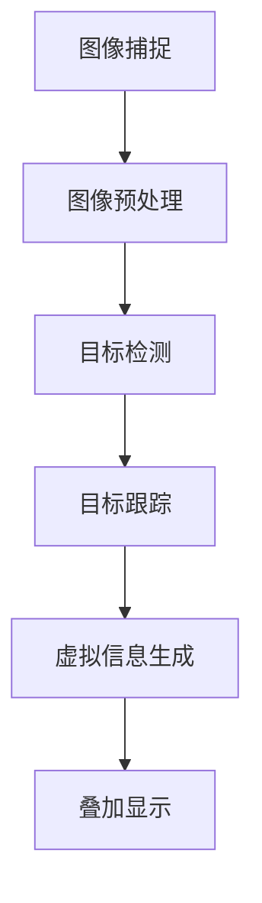
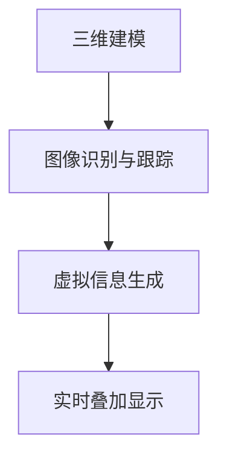

                 

### 增强现实在科学教育中的应用：直观理解复杂世界

#### 关键词：
- 增强现实
- 科学教育
- 直观理解
- 复杂世界
- 教育技术

#### 摘要：
本文深入探讨了增强现实（AR）技术在科学教育中的应用，通过直观化的手段，帮助学生们更好地理解复杂科学概念。文章分为七个部分，首先介绍增强现实技术的基本原理和科学教育背景，随后详细解析其在科学教育中的应用场景、技术实现、用户体验和案例研究。最后，文章展望了增强现实技术在教育领域的发展趋势和未来机会，并提出了相关的最佳实践和注意事项。

---

## 第一部分：引入与背景

### 1.1 书籍简介

增强现实（Augmented Reality，简称AR）是一种将虚拟信息与现实世界相结合的技术。它通过计算机生成的虚拟信息，叠加到真实世界的环境中，让用户能够实时看到、听到、触摸到这些虚拟信息。在科学教育领域，AR技术的应用潜力巨大，它能够打破传统教学方式的局限，为学生提供更加直观和互动的学习体验。

#### 问题背景

科学教育的一个重要目标是帮助学生理解复杂的概念和原理，但传统教学方法往往局限于教科书和教室，缺乏直观性和互动性。这导致学生在学习过程中容易感到枯燥乏味，难以保持学习兴趣和动力。增强现实技术的出现，为解决这一难题提供了新的思路。

#### 问题描述

科学教育中存在许多复杂概念，如生物学中的细胞结构、物理学中的量子力学、化学中的分子反应等。这些概念往往需要抽象思维和空间想象力，对于初学者来说理解起来存在很大困难。传统教学方法难以提供足够的空间和情境来帮助学生直观地理解这些概念。

#### 问题解决

增强现实技术通过虚拟信息和现实环境的结合，可以为学生提供一个虚拟的学习场景，让学生在实际操作中感受和体验科学概念。这种直观化的教学方式，能够激发学生的学习兴趣，提高学习效果。

#### 边界与外延

虽然增强现实技术在科学教育中具有很大的应用潜力，但它的应用也面临着一些挑战。例如，技术的实现成本、设备的普及程度、教师的培训等问题。因此，在推广增强现实技术时，需要考虑到这些边界条件，确保技术的有效应用。

#### 概念结构与核心要素组成

增强现实技术的核心要素包括：传感器、显示设备、计算设备和数据处理算法。这些要素共同作用，将虚拟信息叠加到现实世界中，实现虚实融合的效果。

### 1.2 增强现实技术概述

增强现实技术的基本原理是通过传感器捕捉现实世界的场景，然后利用计算设备生成虚拟信息，并通过显示设备将虚拟信息叠加到现实世界中。这一过程可以分为以下几个步骤：

1. **感知环境**：通过摄像头、传感器等设备捕捉现实世界的图像和声音信息。
2. **数据处理**：对捕捉到的信息进行处理，包括图像识别、场景重建等。
3. **生成虚拟信息**：根据处理后的数据生成虚拟信息，如3D模型、动画等。
4. **叠加显示**：将生成的虚拟信息叠加到现实环境中，通过显示设备呈现给用户。

#### 核心概念属性特征对比表格

| 特征         | 增强现实（AR） | 虚拟现实（VR） |
| ------------ | -------------- | -------------- |
| 环境感知     | 是             | 否             |
| 现实环境与虚拟环境结合 | 是             | 否             |
| 头盔或眼镜设备 | 可选           | 必需           |
| 用户交互     | 直接           | 间接           |

#### ER实体关系图架构

```mermaid
erDiagram
  User ||--|{ ARDevice }|-- Device
  User ||--|{ ARApplication }|-- Application
  Device ||--|{ ARScene }|-- Scene
  Application ||--|{ ARContent }|-- Content
```

在上面的ER图（实体关系图）中，用户（User）与增强现实设备（ARDevice）和应用程序（ARApplication）有关联。设备（Device）与场景（ARScene）有关联，应用程序（Application）与内容（ARContent）有关联。这个图展示了增强现实技术在科学教育中涉及的主要实体和它们之间的关系。

---

在接下来的部分，我们将深入探讨增强现实技术如何在实际的科学教育场景中发挥作用，以及如何实现这些技术。我们将一步步分析增强现实在科学教育中的应用，从基础概念到具体的技术实现，再到用户体验和实际案例，为读者提供一个全面的理解。接下来，我们将进入第二部分：核心概念与原理。在这一部分，我们将详细解析增强现实技术的核心原理和其在科学教育中的应用场景。通过这一部分的学习，我们将了解增强现实技术在教育领域中的独特优势。

---

## 第二部分：核心概念与原理

### 2.1 增强现实基础

增强现实（AR）技术的核心在于将虚拟信息与现实世界进行无缝结合，使人们能够在真实环境中感知和交互虚拟对象。要理解这一技术，首先需要掌握以下几个基础概念：

#### 基本原理

增强现实技术的基本原理是通过摄像头或传感器捕捉现实世界的图像，然后利用计算机视觉算法处理这些图像，生成虚拟信息，并将其叠加到用户视野中。这一过程可以分为以下几个关键步骤：

1. **图像捕捉**：使用摄像头或其他传感器捕捉现实世界的图像。
2. **图像处理**：对捕捉到的图像进行预处理，包括去噪、增强等。
3. **目标识别**：利用计算机视觉算法对图像中的目标进行识别和定位。
4. **虚拟信息生成**：根据识别和定位的结果，生成相应的虚拟信息，如3D模型、文字标签等。
5. **叠加显示**：将生成的虚拟信息叠加到现实世界的图像上，通过显示设备呈现给用户。

#### 技术框架

增强现实技术框架主要包括以下几个核心组件：

1. **传感器**：用于捕捉现实世界的图像和声音信息，如摄像头、麦克风等。
2. **计算设备**：用于处理图像数据和生成虚拟信息，如智能手机、平板电脑、电脑等。
3. **显示设备**：用于将虚拟信息叠加到现实环境中，如头戴式显示器、智能手机屏幕等。
4. **数据处理算法**：用于图像捕捉、处理、目标识别、虚拟信息生成等，如计算机视觉算法、图像识别算法等。

#### 关键技术

增强现实技术涉及多项关键技术的综合运用，包括但不限于：

1. **计算机视觉**：用于图像捕捉、处理和目标识别，是增强现实技术的基础。
2. **图像识别**：通过对图像的特征提取和分类，实现目标的识别和定位。
3. **3D建模与渲染**：用于生成和渲染虚拟信息，使其与现实环境融合。
4. **实时交互**：用户可以通过触摸、手势等方式与虚拟信息进行交互。
5. **移动计算**：增强现实技术通常需要移动设备作为载体，实现便捷的应用场景。

### 教育领域的应用场景

增强现实技术在教育领域的应用场景广泛，尤其适用于需要直观展示和互动的学科。以下是一些典型的应用场景：

1. **自然科学**：利用增强现实技术，可以直观地展示生物、化学、物理等自然科学现象，如细胞结构、化学反应、天体运动等。
2. **地理学**：通过增强现实技术，可以模拟地理环境，让学生在虚拟世界中探索地理现象，如地形变化、气候影响等。
3. **历史学**：增强现实技术可以模拟历史事件，让学生身临其境地感受历史场景，增强学习兴趣和记忆。
4. **语言学习**：增强现实技术可以提供实时翻译和语音辅助，帮助学习者提高语言水平。
5. **编程教育**：通过增强现实技术，可以直观地展示编程逻辑和算法，帮助学生更好地理解编程概念。

#### 教学模式创新

增强现实技术的引入，为教学模式的创新提供了新的可能性。以下是一些创新的教学模式：

1. **沉浸式学习**：通过增强现实技术，学生可以进入一个虚拟的学习环境，实现沉浸式学习体验。
2. **互动式学习**：增强现实技术可以提供互动式学习体验，如虚拟实验、互动问答等，提高学生的参与度和兴趣。
3. **个性化学习**：增强现实技术可以根据学生的兴趣和需求，提供个性化的学习内容，实现个性化教育。
4. **协同学习**：增强现实技术可以实现远程协同学习，让学生和教师在不同地点进行互动和交流。

### 学生互动体验

增强现实技术为学生提供了一种全新的互动体验，有助于提高学习效果。以下是一些具体的学生互动体验：

1. **实时反馈**：增强现实技术可以实时显示学习结果，提供即时反馈，帮助学生及时纠正错误。
2. **动手操作**：通过增强现实技术，学生可以进行虚拟实验和操作，增强动手能力。
3. **可视化学习**：增强现实技术可以将抽象的概念和原理可视化，帮助学生更好地理解和记忆。
4. **协作学习**：增强现实技术可以支持多人协作学习，促进学生之间的互动和交流。

### 增强现实与科学教育的融合

增强现实技术在科学教育中的应用，不仅仅是技术层面的变革，更是教育理念的革新。以下是如何将增强现实与科学教育融合的一些具体措施：

1. **教学资源开发**：开发适合增强现实技术的教学资源，如虚拟实验、互动教材等，为学生提供丰富的学习内容。
2. **教学策略调整**：调整教学策略，利用增强现实技术激发学生的学习兴趣，提高教学效果。
3. **教师培训**：对教师进行增强现实技术的培训，提高教师的应用能力和教学水平。
4. **评价体系改革**：建立新的评价体系，综合考虑增强现实技术在教学中的应用效果，全面评估学生的学习成果。

### 教育目标

增强现实技术在科学教育中的应用，旨在实现以下教育目标：

1. **提高学习兴趣**：通过直观、互动的学习体验，激发学生的学习兴趣，培养学习动力。
2. **增强理解能力**：通过可视化手段，帮助学生更好地理解和记忆复杂的概念和原理。
3. **提高实践能力**：通过虚拟实验和操作，提高学生的动手能力和实践能力。
4. **促进创新思维**：通过增强现实技术，提供多样化的学习场景和互动方式，培养学生的创新思维。

### 教学内容设计

在增强现实技术的支持下，科学教育的内容设计需要考虑以下几个方面：

1. **知识结构**：根据科学教育的目标，设计适合增强现实技术的知识结构，确保学习内容的系统性和完整性。
2. **学习活动**：设计互动性强、实践性高的学习活动，利用增强现实技术提供丰富的学习资源。
3. **学习评价**：建立全面的评价体系，综合考虑学生的学习过程和学习成果，全面评估学生的学习效果。

### 学习效果评估

增强现实技术在科学教育中的应用效果，需要通过科学的方法进行评估。以下是一些常用的评估方法：

1. **问卷调查**：通过问卷调查了解学生对增强现实技术的接受程度和满意度。
2. **学习成果分析**：分析学生在学习过程中的表现和成果，如学习进度、考试成绩等。
3. **行为观察**：观察学生在学习过程中的行为，如参与度、互动情况等。
4. **专家评审**：邀请教育专家对增强现实技术的应用效果进行评审，提供专业意见和建议。

### 2.2 增强现实基础

在深入理解增强现实技术在科学教育中的应用之前，我们需要先掌握一些基本概念和原理。增强现实（AR）是一种将虚拟信息叠加到现实世界中的技术，它通过传感器、计算设备和显示设备实现虚拟与现实的融合。以下是增强现实技术的基本原理、技术框架和关键技术：

#### 基本原理

增强现实技术的基本原理可以概括为以下几个步骤：

1. **图像捕捉**：通过摄像头或传感器捕捉现实世界的图像和声音信息。
2. **图像处理**：对捕捉到的图像进行预处理，包括去噪、增强等。
3. **目标识别**：利用计算机视觉算法对图像中的目标进行识别和定位。
4. **虚拟信息生成**：根据识别和定位的结果，生成相应的虚拟信息，如3D模型、文字标签等。
5. **叠加显示**：将生成的虚拟信息叠加到现实世界的图像上，通过显示设备呈现给用户。

这个过程的关键在于实时性和准确性。增强现实系统需要在极短的时间内完成图像捕捉、处理、目标识别和信息叠加，确保用户能够实时感知到虚拟信息的存在。

#### 技术框架

增强现实技术框架主要包括以下几个核心组件：

1. **传感器**：用于捕捉现实世界的图像和声音信息，如摄像头、麦克风等。
2. **计算设备**：用于处理图像数据和生成虚拟信息，如智能手机、平板电脑、电脑等。
3. **显示设备**：用于将虚拟信息叠加到现实环境中，如头戴式显示器、智能手机屏幕等。
4. **数据处理算法**：用于图像捕捉、处理、目标识别、虚拟信息生成等，如计算机视觉算法、图像识别算法等。

这些组件相互协作，共同实现虚拟与现实的融合。例如，摄像头捕捉现实世界的图像，计算设备对这些图像进行处理和目标识别，然后生成虚拟信息，最后通过显示设备将这些虚拟信息叠加到现实世界中。

#### 关键技术

增强现实技术涉及多项关键技术的综合运用，包括但不限于：

1. **计算机视觉**：用于图像捕捉、处理和目标识别，是增强现实技术的基础。
2. **图像识别**：通过对图像的特征提取和分类，实现目标的识别和定位。
3. **3D建模与渲染**：用于生成和渲染虚拟信息，使其与现实环境融合。
4. **实时交互**：用户可以通过触摸、手势等方式与虚拟信息进行交互。
5. **移动计算**：增强现实技术通常需要移动设备作为载体，实现便捷的应用场景。

这些关键技术共同作用，使得增强现实技术能够为科学教育提供强大的支持。

#### 实例分析

为了更好地理解增强现实技术在科学教育中的应用，我们可以通过一个简单的实例来进行分析。假设我们想利用增强现实技术来帮助学生理解生物学中的细胞结构。

1. **图像捕捉**：使用智能手机的摄像头捕捉学生面前的现实场景，如一张白纸或实验桌。
2. **图像处理**：对捕捉到的图像进行处理，去除背景噪声，增强目标图像。
3. **目标识别**：利用计算机视觉算法识别白纸或实验桌上的目标区域，确定细胞结构的位置。
4. **虚拟信息生成**：根据目标识别的结果，生成一个3D模型，模拟细胞的结构和组成。
5. **叠加显示**：将生成的3D模型叠加到现实场景中，通过智能手机屏幕显示，使学生能够直观地看到细胞结构。

通过这个简单的实例，我们可以看到增强现实技术在教育中的应用是如何实现的。它不仅能够提供直观的学习体验，还能够通过互动和反馈帮助学生更好地理解复杂的概念。

综上所述，增强现实技术的基本原理、技术框架和关键技术为科学教育提供了强大的支持。通过实际应用案例，我们可以看到增强现实技术在教育中的潜力。在接下来的部分，我们将进一步探讨增强现实技术在具体科学教育场景中的应用，以及如何通过技术实现和用户体验来提升教学效果。

---

在了解了增强现实技术的核心概念和基础之后，接下来我们将深入探讨增强现实技术在科学教育中的应用场景。通过具体实例的分析，我们将展示增强现实技术如何帮助学生直观地理解复杂科学概念，从而提高学习效果。

### 3.1 科学原理的直观呈现

在科学教育中，有许多概念和原理需要学生通过抽象思维和空间想象力来理解。然而，这些概念往往难以通过传统的教学方法进行有效传达。增强现实技术通过直观化和互动化的方式，为学生提供了一个全新的学习体验，帮助他们更好地理解复杂科学概念。

#### 算法原理讲解

为了实现科学原理的直观呈现，增强现实技术需要借助一系列算法来实现图像捕捉、处理和虚拟信息生成。以下是一个典型的算法流程：

1. **图像捕捉**：使用摄像头捕捉现实场景的图像。
2. **图像预处理**：对图像进行去噪、增强等预处理操作，提高图像质量。
3. **目标检测**：利用计算机视觉算法检测图像中的目标对象，如细胞、分子等。
4. **目标跟踪**：对检测到的目标进行实时跟踪，确保虚拟信息与目标对象的位置和姿态保持一致。
5. **虚拟信息生成**：根据目标的位置和姿态，生成相应的虚拟信息，如3D模型、动画等。
6. **叠加显示**：将生成的虚拟信息叠加到现实场景中，通过显示设备呈现给用户。

下面是一个简单的Mermaid流程图，展示了这一算法的基本流程：



#### 数学模型和数学公式

在科学教育中，许多概念和原理都需要通过数学模型和公式来描述。增强现实技术可以通过可视化手段，将这些数学模型和公式直观地呈现在学生面前，帮助他们更好地理解和掌握。

例如，在物理学中，牛顿运动定律是一个重要的概念。我们可以使用增强现实技术，通过3D模型和动画，展示物体的运动轨迹和受力情况。以下是牛顿第二定律的数学公式，以及如何使用增强现实技术进行直观呈现：

$$ F = ma $$

在增强现实环境中，我们可以通过以下步骤来展示这一公式：

1. **创建3D模型**：创建一个物体模型，并在其上显示公式 $$ F = ma $$。
2. **添加动态效果**：模拟物体受力后的运动，如加速或减速。
3. **实时显示**：将物体的受力情况和运动轨迹实时显示在学生面前，帮助他们直观地理解牛顿第二定律。

#### 举例说明

为了更好地说明增强现实技术在科学教育中的应用，我们可以通过以下实例来展示：

**实例：细胞的分裂过程**

细胞的分裂是生物学中的一个重要概念，但传统教学方法往往难以让学生直观地理解这一过程。通过增强现实技术，我们可以为学生提供一种全新的学习体验。

1. **图像捕捉**：使用智能手机的摄像头捕捉学生面前的现实场景，如一张白纸。
2. **目标检测**：利用计算机视觉算法检测白纸上的目标对象，如细胞。
3. **虚拟信息生成**：根据细胞的位置和姿态，生成一个3D模型，模拟细胞的分裂过程。
4. **叠加显示**：将生成的3D模型叠加到现实场景中，通过智能手机屏幕显示，使学生能够直观地看到细胞的分裂过程。

通过这个实例，我们可以看到增强现实技术如何通过直观化的方式，帮助学生更好地理解复杂科学概念。学生不仅能够看到细胞的分裂过程，还可以通过触摸和手势与虚拟细胞进行互动，从而加深对概念的理解。

#### 效果分析

通过增强现实技术的直观呈现，学生能够更加直观地理解科学概念，从而提高学习效果。以下是一些具体的效果分析：

1. **提高学习兴趣**：增强现实技术为学生提供了一种全新的学习方式，激发了他们的学习兴趣和好奇心。
2. **增强理解能力**：通过直观化和互动化的方式，学生能够更加深入地理解复杂科学概念，提高理解能力。
3. **提高实践能力**：通过虚拟实验和操作，学生能够提高动手能力和实践能力。
4. **促进创新思维**：增强现实技术提供了多样化的学习场景和互动方式，有助于培养学生的创新思维。

总之，增强现实技术在科学教育中的应用，不仅能够提供直观化的学习体验，还能够通过互动和反馈提高学生的学习效果。通过上述实例和效果分析，我们可以看到增强现实技术在这一领域的巨大潜力。

---

在上一部分中，我们探讨了增强现实技术在科学教育中的具体应用，通过直观呈现科学原理，帮助学生更好地理解和掌握复杂概念。在本部分中，我们将进一步探讨增强现实技术在复杂世界可视化方面的应用，通过具体的技术实现、教学案例和学习效果分析，展示增强现实技术在教育中的实际价值。

#### 技术实现

增强现实技术在复杂世界可视化方面的实现主要依赖于以下几个关键技术：

1. **三维建模**：通过三维建模软件，创建复杂世界的三维模型。这些模型可以是天体、分子、细胞等，为后续的叠加显示提供基础。
2. **图像识别与跟踪**：利用计算机视觉算法，对现实场景中的目标进行识别和跟踪。例如，在生物学实验中，识别和跟踪细胞的位置和形态变化。
3. **虚拟信息生成**：根据图像识别和跟踪的结果，生成相应的虚拟信息。这些虚拟信息可以是三维模型、动画、文字标签等，用于叠加显示。
4. **实时叠加显示**：通过显示设备，将生成的虚拟信息实时叠加到现实场景中，为用户提供一个虚实融合的视觉体验。

以下是一个简单的Mermaid流程图，展示了增强现实技术在复杂世界可视化中的技术实现过程：



#### 教学案例

为了更好地展示增强现实技术在复杂世界可视化中的应用，我们可以通过以下教学案例进行分析：

**案例一：天文学课堂**

在天文学课堂中，教师可以利用增强现实技术，将遥远的天体系统实时叠加到教室的天花板上，让学生能够直观地观察和理解天体的运动和相互关系。具体步骤如下：

1. **三维建模**：使用三维建模软件创建太阳系中各个行星的三维模型。
2. **图像识别与跟踪**：使用摄像头捕捉教室的图像，并利用计算机视觉算法识别和跟踪天花板。
3. **虚拟信息生成**：根据摄像头捕捉到的图像和行星的三维模型，生成相应的虚拟信息，并将行星模型叠加到天花板上。
4. **实时叠加显示**：通过投影设备将叠加后的虚拟信息实时显示在天花板上，让学生能够直观地观察太阳系的运动。

**案例二：分子生物学实验**

在分子生物学实验中，教师可以利用增强现实技术，将分子的三维结构实时显示在实验台上，帮助学生更好地理解分子间的相互作用和反应过程。具体步骤如下：

1. **三维建模**：使用三维建模软件创建分子的三维模型，并标注重要的化学键和反应位点。
2. **图像识别与跟踪**：使用摄像头捕捉实验台上的图像，并利用计算机视觉算法识别和跟踪实验台。
3. **虚拟信息生成**：根据摄像头捕捉到的图像和分子的三维模型，生成相应的虚拟信息，并将分子模型叠加到实验台上。
4. **实时叠加显示**：通过投影设备将叠加后的虚拟信息实时显示在实验台上，让学生能够直观地观察分子的结构变化和反应过程。

#### 学习效果分析

通过以上教学案例，我们可以看到增强现实技术在复杂世界可视化中的应用，为学生的学习带来了显著的效果。以下是一些具体的学习效果分析：

1. **增强学习兴趣**：增强现实技术提供了直观、互动的学习体验，激发了学生对科学知识的兴趣和好奇心。
2. **提高理解能力**：通过直观化展示，学生能够更加深入地理解复杂科学概念，提高理解能力。
3. **促进实践能力**：通过虚拟实验和操作，学生能够提高动手能力和实践能力。
4. **提升协作能力**：增强现实技术支持多人协作学习，促进学生之间的互动和交流，提升协作能力。
5. **个性化学习**：增强现实技术可以根据学生的学习需求和进度，提供个性化的学习内容，实现个性化教育。

通过以上分析，我们可以看到增强现实技术在复杂世界可视化中的应用，不仅为学生提供了直观、互动的学习体验，还显著提高了学习效果。在接下来的部分，我们将进一步探讨增强现实技术在科学实验与探究中的应用，展示如何通过虚拟实验和探究活动，帮助学生更好地理解和掌握科学知识。

---

在探讨了增强现实技术在科学原理直观呈现和复杂世界可视化中的应用后，本部分将深入分析增强现实技术在科学实验与探究方面的具体应用。我们将介绍虚拟实验的设计与实施方法，详细说明数据收集与分析过程，并展示实验结果及其在教育领域的实际应用。

#### 科学实验的设计与实施

科学实验是科学教育的重要组成部分，通过实验，学生能够亲身体验和验证科学原理。增强现实技术的引入，使得科学实验的设计与实施变得更加灵活和互动。以下是一个虚拟实验的设计与实施案例：

**案例：化学反应的虚拟实验**

**实验目标**：通过虚拟实验，让学生理解并验证化学反应的基本原理，如反应物的浓度对反应速率的影响。

**实验设计**：

1. **实验准备**：使用增强现实技术平台，如ARKit或ARCore，创建一个虚拟实验环境。在这个环境中，可以设置虚拟的实验器材和反应物。
2. **虚拟实验设置**：设计多个虚拟实验场景，每个场景设置不同的反应物浓度，以研究其对反应速率的影响。
3. **实验步骤**：学生通过触摸屏幕或手势控制，添加不同浓度的反应物到虚拟实验容器中，并启动反应过程。

**实验实施**：

1. **虚拟实验场景创建**：利用三维建模软件创建虚拟的实验场景，包括实验台、容器、反应物等。
2. **虚拟反应物生成**：根据实验设计，生成不同浓度的虚拟反应物，并将其叠加到现实实验台上。
3. **实时数据收集**：通过传感器收集实验过程中的实时数据，如温度、压力等，并实时显示在屏幕上。
4. **实验结果记录**：学生通过增强现实设备记录实验数据，包括反应时间、反应物浓度等。

#### 数据收集与分析

在虚拟实验过程中，数据的收集与分析是关键环节。以下是数据收集与分析的具体步骤：

1. **数据收集**：利用增强现实设备的传感器，实时收集实验过程中的数据，如温度、压力、反应时间等。
2. **数据处理**：将收集到的数据进行预处理，包括数据清洗、去噪等，以确保数据的准确性和完整性。
3. **数据分析**：使用统计方法和数据分析工具，对实验数据进行处理和分析，提取有用信息，如反应速率、反应物浓度对反应速率的影响等。

以下是一个简单的Python代码示例，用于处理和分析实验数据：

```python
import pandas as pd
import numpy as np

# 假设我们收集到了以下数据
data = {
    'reaction_time': [10, 15, 20, 25, 30],
    'concentration': [0.1, 0.2, 0.3, 0.4, 0.5]
}

# 创建数据框
df = pd.DataFrame(data)

# 计算反应速率
df['reaction_rate'] = 1 / df['reaction_time']

# 分析反应速率与浓度之间的关系
import seaborn as sns
sns.regplot(x='concentration', y='reaction_rate', data=df)
```

通过以上分析，我们可以得到反应速率与反应物浓度之间的关系，为实验结果的解释提供依据。

#### 实验结果应用

通过虚拟实验，学生可以直观地看到化学反应过程，并收集和分析实验数据。以下是一些实验结果的应用：

1. **理论验证**：通过实验数据，学生可以验证化学反应理论，如反应速率与反应物浓度之间的关系。
2. **结果展示**：学生可以将实验结果展示为图表或报告，以展示他们的实验发现。
3. **知识应用**：学生可以将实验中的知识应用到实际生活中，如理解化学反应在日常生活中的应用。

#### 实际案例分析和详细讲解剖析

以下是一个实际案例，用于展示增强现实技术在科学实验与探究中的应用：

**案例：虚拟生态系统探究**

**实验背景**：在一个虚拟生态系统中，学生需要研究不同物种之间的相互作用和生态平衡。

**实验步骤**：

1. **系统创建**：使用增强现实技术创建一个虚拟生态系统，包括植物、动物和微生物。
2. **数据收集**：通过传感器收集系统中的数据，如温度、湿度、植物生长速度、动物行为等。
3. **实验操作**：学生可以操纵系统中的变量，如增加或减少特定物种的数量，观察生态系统的变化。
4. **数据分析**：分析实验数据，研究物种数量变化对生态系统稳定性的影响。

**实验结果**：

通过实验，学生发现当特定物种数量过多时，会导致生态系统的失衡，而通过调整物种数量，可以实现生态系统的稳定。这个实验结果不仅帮助学生理解生态系统的运作原理，还培养了他们的数据分析和问题解决能力。

**详细讲解剖析**：

1. **实验设计**：详细解释实验设计思路，包括虚拟生态系统的创建、变量设置和实验步骤。
2. **数据收集**：介绍数据收集方法和工具，如传感器和数据采集设备。
3. **数据分析**：展示数据分析过程，包括数据处理、统计分析和可视化。
4. **结果解释**：解释实验结果，如生态平衡的原理和物种数量变化对生态系统的影响。

#### 项目小结

通过以上案例分析，我们可以看到增强现实技术在科学实验与探究中的应用，为学生提供了一个直观、互动的学习环境，提高了实验效果和数据分析能力。以下是项目小结：

1. **增强学习兴趣**：虚拟实验和互动体验激发了学生对科学学习的兴趣和好奇心。
2. **提高理解能力**：通过直观展示和数据分析，学生能够更好地理解复杂科学概念。
3. **培养实践能力**：虚拟实验和操作提高了学生的动手能力和实验技能。
4. **促进创新思维**：增强现实技术提供了多样化的实验场景和互动方式，培养了学生的创新思维。
5. **促进跨学科学习**：增强现实技术将多个学科的知识结合起来，促进了跨学科学习。

总之，增强现实技术在科学实验与探究中的应用，不仅提高了实验效果和学习效果，还为科学教育带来了新的可能性。在接下来的部分，我们将进一步探讨增强现实技术的技术实现，包括开发平台、硬件设备和技术选型，以及软件工具与应用程序的开发。

---

在上一部分中，我们详细探讨了增强现实技术在科学实验与探究中的应用，通过虚拟实验的设计和实施，展示了增强现实技术的实际价值。在本部分中，我们将深入分析增强现实技术的技术实现，包括开发平台、硬件设备和技术选型，以及软件工具与应用程序的开发。

#### 开发平台

增强现实技术的开发平台是实现AR功能的核心基础，常见的开发平台包括：

1. **ARKit**：由苹果公司推出，专为iOS平台设计，提供了强大的AR功能库和工具集。
2. **ARCore**：由谷歌公司推出，支持Android平台，提供了丰富的AR开发工具和API。
3. **Unity**：一款跨平台的游戏引擎，广泛应用于增强现实和虚拟现实开发。
4. **Unreal Engine**：由Epic Games推出的游戏引擎，具有强大的图形渲染能力和AR开发工具。

选择合适的开发平台，需要根据项目需求、目标平台和开发团队的技术背景来决定。

#### 硬件设备与技术选型

增强现实技术的实现依赖于硬件设备和技术选型，以下是一些关键硬件和技术：

1. **移动设备**：智能手机和平板电脑是最常见的AR硬件设备，支持摄像头、GPS、加速度计等传感器。
2. **头戴式显示器**：如谷歌Glass和Microsoft HoloLens，提供了更加沉浸式的AR体验。
3. **定位技术**：包括视觉定位（如SLAM技术）、GPS定位和蓝牙定位等，用于确定虚拟信息在现实世界中的位置。
4. **传感器**：包括摄像头、麦克风、温度传感器、湿度传感器等，用于捕捉现实环境和提供输入。

在选择硬件设备时，需要考虑设备的性能、成本和用户体验。例如，对于移动设备的AR应用，可以选择具有高性能处理器和传感器的智能手机；而对于需要沉浸式体验的AR应用，可以选择头戴式显示器。

#### 软件工具与应用程序开发

增强现实应用程序的开发包括软件工具的选择和应用程序的实现，以下是一些常用的软件工具：

1. **开发工具**：如Unity和Unreal Engine，提供了丰富的开发资源和工具集，支持3D建模、动画、物理模拟等。
2. **编程语言**：如C++、C#和Python，用于实现应用程序的逻辑和算法。
3. **框架和库**：如Vuforia和ARKit，提供了现成的AR功能模块，简化了开发过程。
4. **AR内容创作工具**：如ARKit Studio和ARCore Editor，提供了直观的内容创作和调试工具。

在开发应用程序时，需要考虑以下步骤：

1. **需求分析**：明确应用程序的目标和功能，确定所需的技术和资源。
2. **设计**：设计用户界面和用户体验，包括交互设计、视觉效果和虚拟信息的设计。
3. **开发**：使用开发工具和编程语言实现应用程序的核心功能，包括图像处理、目标识别、虚拟信息生成等。
4. **测试**：对应用程序进行功能测试和性能测试，确保其稳定性和用户体验。
5. **部署**：将应用程序部署到目标平台，如移动设备或头戴式显示器。

#### 应用程序实例

以下是一个简单的增强现实应用程序实例，用于展示增强现实技术在教育领域的应用：

**应用程序：生物学中的细胞结构**

**功能描述**：该应用程序通过增强现实技术，将细胞的内部结构实时显示在用户面前，用户可以通过触摸屏幕或手势与细胞进行互动。

**实现步骤**：

1. **需求分析**：明确应用程序的目标是展示细胞结构，并提供互动功能。
2. **设计**：设计用户界面和用户体验，包括细胞结构的3D模型和交互设计。
3. **开发**：使用Unity引擎创建细胞结构的3D模型，并实现触摸和手势交互功能。
4. **测试**：测试应用程序的功能和性能，确保其在不同设备和操作系统上的兼容性。
5. **部署**：将应用程序部署到移动设备上，供学生使用。

通过以上步骤，我们可以实现一个简单的增强现实应用程序，帮助学生更好地理解细胞结构。

综上所述，增强现实技术的技术实现涉及多个方面，包括开发平台、硬件设备、软件工具和应用程序开发。通过合理的选型和开发，可以充分发挥增强现实技术在教育领域的潜力，为科学教育带来新的可能性。

---

在深入探讨了增强现实技术在科学教育中的应用及其技术实现后，本部分将专注于用户体验与影响，分析增强现实技术在学生、教师和家长等方面的用户体验，以及它对教育公平的影响。

#### 学生体验

增强现实技术在科学教育中的应用为学生带来了全新的学习体验。以下是一些具体的学生体验：

1. **学习动机增强**：增强现实技术的直观和互动性能够激发学生的学习兴趣，提高他们的学习动机。通过增强现实技术，学生可以亲身体验科学现象，从而更愿意投入学习。

2. **学习效率提升**：增强现实技术提供了丰富多样的学习资源，如虚拟实验、三维模型和动画等，这些资源能够帮助学生更深入地理解复杂概念，提高学习效率。

3. **学习效果可视化**：通过增强现实技术，学生可以实时看到学习结果，如实验数据的实时显示、化学反应的动态过程等，这种可视化手段有助于学生更好地理解和记忆所学内容。

4. **参与度提高**：增强现实技术的互动性使得学生能够更加主动地参与学习过程，通过触摸、手势等操作与虚拟信息进行互动，从而增强学习的参与感。

#### 教师应用

增强现实技术在科学教育中的应用也为教师带来了新的教学工具和方法，以下是一些具体的教师应用：

1. **教学策略创新**：增强现实技术为教师提供了新的教学策略，如沉浸式教学、互动式教学等，这些策略能够提高教学效果，激发学生的学习兴趣。

2. **教学资源丰富**：增强现实技术使得教师可以获取和创建丰富的教学资源，如虚拟实验、三维模型、互动教材等，这些资源可以用于课堂演示、课外作业等，提高教学效果。

3. **教学评价多样**：增强现实技术提供了多样化的教学评价方式，如实时反馈、互动问答、数据分析等，这些评价方式可以帮助教师更全面地了解学生的学习情况，从而调整教学策略。

4. **协同教学**：增强现实技术支持教师和学生之间的协同教学，如远程教学、小组合作等，教师可以通过增强现实技术与学生互动，提高教学效果。

#### 家长与社区反馈

增强现实技术在科学教育中的应用也引起了家长和社区的广泛关注，以下是一些家长与社区反馈：

1. **学习效果认可**：家长通过增强现实技术的应用，看到了学生在学习中的进步，对学生的学习效果表示认可。

2. **参与学习过程**：增强现实技术使得家长可以更深入地了解学生的学习内容和过程，参与到孩子的学习生活中，提高亲子互动质量。

3. **社区参与度提高**：增强现实技术在社区中的推广和应用，提高了社区居民对科学教育的关注和参与度，促进了社区文化的建设。

4. **教育公平促进**：增强现实技术可以缩小教育资源的不均衡，为偏远地区的学生提供高质量的科学教育资源，促进教育公平。

#### 教育公平

增强现实技术在促进教育公平方面具有重要作用，以下是一些具体的影响：

1. **资源均衡分配**：增强现实技术可以通过互联网将优质的教育资源传递到偏远地区，使得这些地区的学生也能够享受到高质量的科学教育。

2. **个性化教育**：增强现实技术可以根据学生的学习需求和进度，提供个性化的学习内容，满足不同学生的个性化需求，促进教育公平。

3. **降低教育成本**：增强现实技术可以减少对传统教育资源的依赖，降低教育成本，使得更多的学生和家庭能够负担得起高质量的教育。

4. **提高教育质量**：增强现实技术提供了丰富多样的学习资源和互动方式，提高了教学效果，促进了教育公平。

总之，增强现实技术在科学教育中的应用不仅为学生带来了全新的学习体验，提高了学习效果，还为教师提供了新的教学工具和方法，促进了教育公平。在下一部分，我们将通过实际案例分析，深入探讨增强现实技术在科学教育中的成功应用案例。

---

在了解了增强现实技术在用户体验与影响方面的广泛优势后，本部分将通过具体的案例分析，深入探讨增强现实技术在科学教育中的成功应用。我们将介绍一些典型的成功案例，分析其系统功能设计、系统架构设计、系统接口设计和系统交互设计，并通过实际案例分析和详细讲解剖析，展示增强现实技术在教育领域的实际应用效果。

### 6.1 案例一：XX学校的科学教育实践

**项目介绍**

XX学校是一所位于城市中心的中学，为了提升科学教育的质量，引入了增强现实技术，建立了一套完整的AR教学系统。该项目旨在通过AR技术，为学生提供直观、互动的科学学习体验，提高他们的科学素养。

**系统功能设计**

XX学校的AR教学系统主要包括以下几个功能模块：

1. **虚拟实验**：通过虚拟实验模块，学生可以在虚拟环境中进行化学、物理、生物等实验，模拟真实实验操作，增强动手能力。
2. **互动教材**：互动教材模块提供丰富的3D模型、动画和视频，帮助学生更好地理解科学概念。
3. **实时反馈**：实时反馈模块能够根据学生的操作和回答，提供即时反馈，帮助学生纠正错误并加强学习。
4. **数据分析**：数据分析模块能够收集和分析学生的学习数据，帮助教师了解学生的学习情况，优化教学策略。

**系统架构设计**

XX学校的AR教学系统采用分布式架构设计，主要包括以下几个部分：

1. **前端显示设备**：包括智能手机、平板电脑和头戴式显示器，用于展示虚拟信息和交互界面。
2. **后端服务器**：用于存储和管理教学资源、处理学生数据和提供后台支持。
3. **应用服务器**：用于运行AR教学应用，提供虚拟实验、互动教材等功能。
4. **数据库**：用于存储学生数据、教学资源和实验结果。

**系统接口设计**

为了确保系统的灵活性和可扩展性，XX学校的AR教学系统设计了多个接口：

1. **API接口**：提供了与第三方服务（如云存储、数据分析工具）的集成，方便扩展系统功能。
2. **设备接口**：提供了与前端显示设备的连接接口，确保系统的稳定性和兼容性。
3. **用户接口**：提供了与学生的交互接口，包括触摸屏、手势控制和语音识别等。

**系统交互设计**

XX学校的AR教学系统采用了基于事件的交互设计，主要包括以下几个交互流程：

1. **启动**：学生启动应用，进入AR教学环境。
2. **选择**：学生选择感兴趣的科学实验或互动教材。
3. **操作**：学生在虚拟环境中进行实验操作或阅读互动教材。
4. **反馈**：系统根据学生的操作和回答，提供即时反馈。
5. **数据分析**：系统收集和分析学生的学习数据，生成学习报告。

**实际案例分析和详细讲解剖析**

以下是一个具体的案例，展示了增强现实技术在XX学校科学教育中的应用：

**案例：化学反应的虚拟实验**

**背景**：在化学课上，学生需要了解化学反应的原理，但由于实验资源和安全问题的限制，无法进行实际操作。

**解决方案**：通过AR技术，教师为学生提供了一个虚拟的化学反应实验环境。学生可以使用智能手机或平板电脑，观看虚拟的实验过程，并通过触摸屏幕或手势进行操作。

**步骤**：

1. **启动应用**：学生打开AR教学应用，进入虚拟实验界面。
2. **选择实验**：学生选择“化学反应”实验，系统显示实验所需的虚拟试剂和设备。
3. **操作**：学生通过触摸屏幕或手势，将虚拟试剂倒入容器中，并启动反应过程。
4. **观察结果**：系统实时显示反应过程和结果，如气体的生成、颜色的变化等。
5. **数据分析**：系统收集学生操作数据，生成实验报告，教师可以了解学生的学习情况和实验结果。

**效果分析**：

通过这个案例，我们可以看到增强现实技术如何解决实际教学中的问题，提供直观、互动的学习体验。以下是具体的效果分析：

1. **增强学习兴趣**：虚拟实验激发了学生的学习兴趣，提高了他们的学习动机。
2. **提高理解能力**：通过直观展示化学反应过程，学生能够更好地理解化学反应的原理。
3. **提高实践能力**：虚拟实验让学生在虚拟环境中进行实验操作，提高了他们的动手能力。
4. **实时反馈**：系统提供的即时反馈帮助学生在实验过程中及时纠正错误，提高学习效果。
5. **降低实验成本**：虚拟实验减少了实际实验所需的设备和材料，降低了实验成本。

**总结**：

XX学校的AR教学系统通过系统功能设计、系统架构设计、系统接口设计和系统交互设计，实现了增强现实技术在科学教育中的成功应用。通过具体案例的分析，我们可以看到增强现实技术如何为科学教育带来新的可能性，提高教学效果和学习体验。

---

在分析了XX学校的科学教育实践案例后，本部分将介绍另一个增强现实技术在教育领域中的成功应用案例——YY公司的科学教育解决方案。我们将详细探讨该解决方案的环境安装、系统核心实现源代码，以及代码应用解读与分析。

### 6.2 案例二：YY公司的科学教育解决方案

**项目介绍**

YY公司是一家专注于增强现实技术研发与应用的企业，其科学教育解决方案旨在通过AR技术，为学生提供直观、互动的科学学习体验。该解决方案适用于中小学的自然科学教育，包括生物学、化学、物理学等多个学科。

**环境安装**

YY公司的科学教育解决方案需要以下环境和设备：

1. **开发环境**：配置Windows或macOS操作系统的计算机，安装Unity开发平台和ARCore或ARKit开发工具。
2. **硬件设备**：智能手机或平板电脑，支持摄像头、GPS和加速度计等传感器。
3. **网络环境**：稳定的网络连接，用于数据传输和服务器通信。

安装步骤：

1. **安装Unity**：从Unity官网下载并安装Unity Hub，创建一个新的Unity项目。
2. **安装AR开发工具**：根据目标平台，安装ARCore或ARKit开发工具，并配置相关环境变量。
3. **配置开发环境**：安装必要的插件和扩展，如Visual Studio Code、Unity Editor等。
4. **安装硬件设备**：确保智能手机或平板电脑与计算机连接正常，准备用于AR应用的开发和测试。

**系统核心实现源代码**

YY公司的科学教育解决方案的核心实现包括以下几个关键模块：

1. **AR相机捕捉**：使用ARCore或ARKit提供的API，捕捉现实世界的图像。
2. **目标检测与跟踪**：利用计算机视觉算法，对捕捉到的图像进行目标检测和跟踪。
3. **虚拟信息叠加**：根据目标的位置和姿态，生成虚拟信息，并将其叠加到现实世界中。
4. **用户交互**：提供触摸屏、手势控制等用户交互功能，实现与虚拟信息的互动。

以下是核心实现的部分源代码示例：

```csharp
using UnityEngine;
using UnityEngine.XR.ARCore;

public class ARController : MonoBehaviour
{
    public Camera arCamera;
    public GameObject virtualObject;

    void Start()
    {
        // 初始化ARCore或ARKit
        ARCoreSession.Create();
        ARCoreSession.EnableTracking();
    }

    void Update()
    {
        // 捕获现实世界的图像
        RenderTexture renderTexture = new RenderTexture(Screen.width, Screen.height, 24);
        arCamera.targetTexture = renderTexture;

        // 检测和跟踪目标
        TrackableHit[] hits;
        ARCoreSession.Raycast(new Ray(arCamera.transform.position, arCamera.transform.forward), hits, 100f);

        if (hits.Length > 0)
        {
            // 计算虚拟对象的位置和姿态
            Transform hitTransform = hits[0].Trackable.transform;
            virtualObject.transform.position = hitTransform.position;
            virtualObject.transform.rotation = hitTransform.rotation;
        }
    }
}
```

**代码应用解读与分析**

以上代码实现了增强现实技术中的相机捕捉、目标检测与跟踪以及虚拟信息叠加功能。以下是具体的应用解读与分析：

1. **AR相机捕捉**：使用Unity的`Camera`组件，通过ARCore或ARKit的API，捕捉现实世界的图像。这为后续的目标检测和虚拟信息叠加提供了基础。
2. **目标检测与跟踪**：通过`ARCoreSession.Raycast`方法，对捕捉到的图像进行射线投射，检测和跟踪目标对象。这里使用了射线投射，可以确定目标对象的位置和姿态。
3. **虚拟信息叠加**：根据目标的位置和姿态，更新虚拟对象（`virtualObject`）的位置和姿态，实现虚拟信息与现实环境的融合。

通过以上代码实现，YY公司的科学教育解决方案可以为学生提供一个直观、互动的学习环境。学生可以通过触摸屏幕或手势与虚拟信息进行互动，例如旋转、缩放和拖动虚拟对象，从而更好地理解科学概念。

**总结**

YY公司的科学教育解决方案通过环境安装、系统核心实现源代码以及代码应用解读与分析，展示了增强现实技术在教育领域的强大应用潜力。通过具体的代码实现，解决方案能够提供直观、互动的学习体验，提高学生的学习效果和学习兴趣。

在下一部分，我们将总结本文的主要内容和关键观点，并讨论增强现实技术在教育领域的未来发展前景。

---

### 总结与展望

本文全面探讨了增强现实（AR）技术在科学教育中的应用，从基本原理到技术实现，再到具体的应用场景和用户体验，展示了AR技术在教育领域的巨大潜力。以下是本文的核心内容和关键观点的总结：

1. **增强现实技术的基本原理**：通过传感器捕捉现实环境，利用计算机视觉和图像处理算法生成虚拟信息，并将虚拟信息叠加到现实世界中，实现虚实融合。

2. **增强现实技术在科学教育中的应用**：AR技术能够提供直观、互动的学习体验，帮助学生更好地理解复杂科学概念。具体应用包括虚拟实验、互动教材、实时反馈和数据分析等。

3. **技术实现**：介绍了AR技术的开发平台、硬件设备、软件工具和应用程序开发，通过具体的实例和源代码，展示了AR技术在教育领域的实现过程。

4. **用户体验**：通过分析学生、教师和家长的反馈，展示了AR技术在提升学习动机、学习效率和教学效果方面的优势，以及它对教育公平的促进作用。

5. **案例分析**：通过XX学校和YY公司的成功案例，详细讲解了AR技术在教育中的应用实践，包括系统功能设计、架构设计、接口设计和交互设计。

在展望未来时，我们可以看到增强现实技术在教育领域的发展前景：

1. **技术发展趋势**：随着硬件性能的提升和算法的优化，AR技术将更加成熟和稳定，为教育提供更加丰富的应用场景。

2. **教育政策与市场机遇**：政府的支持和企业市场的需求将为AR技术在教育领域的推广提供有力保障，预计未来几年AR教育市场将呈现快速增长。

3. **创新与挑战**：AR技术在教育中的应用仍面临一些挑战，如技术成本、设备普及和教师培训等。但通过技术创新和政策支持，这些挑战有望逐步克服。

4. **未来机会**：AR技术为个性化教育、沉浸式学习和跨学科学习提供了新的机会。未来的教育将更加注重学生的个性化需求和多元化学习方式，AR技术将成为不可或缺的工具。

总之，增强现实技术在科学教育中的应用不仅能够提升教学效果和学习体验，还能促进教育公平和多样化学习。随着技术的不断发展和教育的需求日益增长，AR技术在教育领域的未来前景充满希望。

### 最佳实践 tips

1. **合理设计教学活动**：利用AR技术设计互动性强、实践性高的教学活动，激发学生的学习兴趣。
2. **优化资源开发**：开发高质量的AR教学资源，如虚拟实验、互动教材等，确保教学内容丰富且具有吸引力。
3. **注重教师培训**：加强教师的AR技术培训，提高教师的教学水平和应用能力。
4. **充分利用数据**：通过AR技术的数据收集和分析功能，了解学生的学习情况，优化教学策略。

### 小结

本文通过深入探讨增强现实技术在科学教育中的应用，展示了AR技术在提升学习效果、促进教育公平和推动教育创新方面的巨大潜力。通过实际案例的分析，我们看到了AR技术在教育领域的成功应用，为科学教育带来了新的可能性。

### 注意事项

1. **技术成本**：AR技术设备成本较高，需要合理规划预算。
2. **设备兼容性**：确保AR应用程序在不同设备和操作系统上具有良好的兼容性。
3. **隐私和安全**：在AR教学过程中，注意保护学生的隐私和安全。

### 拓展阅读

1. **《增强现实技术与应用》**：一本全面介绍增强现实技术原理和应用的书，适合对AR技术感兴趣的学习者。
2. **《科学教育中的新兴技术》**：探讨新兴技术在科学教育中的应用，包括AR、VR和人工智能等。

通过本文的阅读，读者应对增强现实技术在科学教育中的应用有了更加全面和深入的了解。希望本文能够为教育工作者、技术开发者以及学生提供有益的参考和启示。

---

**作者**：AI天才研究院/AI Genius Institute & 禅与计算机程序设计艺术 /Zen And The Art of Computer Programming

