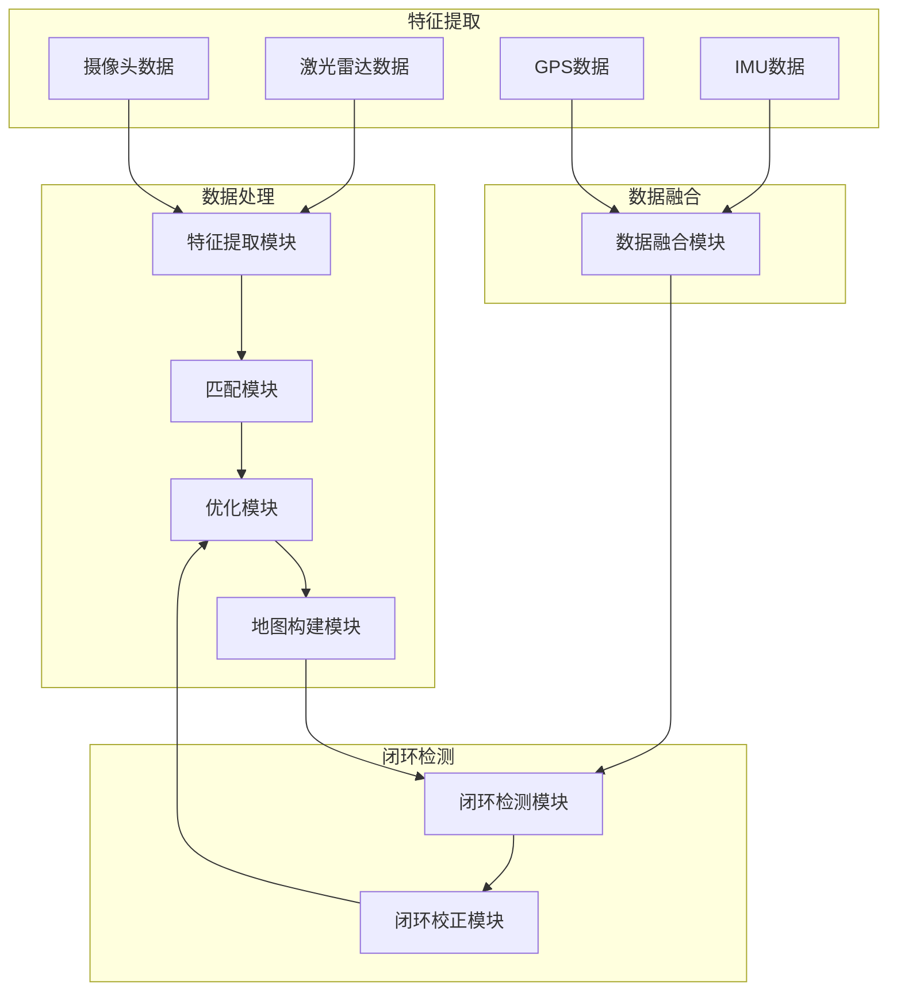
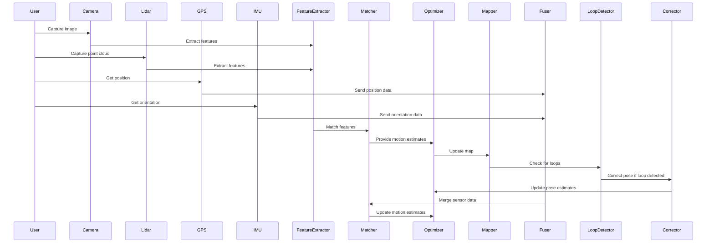

                 

### 背景介绍

#### 增强现实技术概述

增强现实（Augmented Reality，简称AR）是一种将虚拟信息与现实世界实时结合的技术。通过计算机生成的信息叠加在真实世界的图像之上，使用户能够看到融合了虚拟元素的现实环境。这种技术不仅能够提供更加丰富和互动的体验，还能够用于教育、娱乐、医疗、军事等多个领域。

增强现实技术起源于20世纪90年代，当时主要应用在实验室研究和小众市场。随着计算机技术、图像处理和移动设备的快速发展，AR技术逐渐走向大众，尤其是在智能手机和平板电脑普及之后，其应用场景和范围得到了极大的扩展。

目前，增强现实技术的主要应用领域包括：

1. **娱乐和游戏**：如《精灵宝可梦GO》等游戏，将虚拟角色叠加在现实环境中，增加了游戏的趣味性和互动性。
2. **教育和培训**：通过AR技术，学生可以在虚拟环境中进行模拟实验，加深对知识的理解。
3. **医疗**：在手术导航、远程诊断和治疗等领域中，AR技术提供了直观的辅助手段。
4. **工业和制造**：用于产品设计和制造过程的可视化，提高生产效率和质量控制。
5. **军事和安防**：通过增强现实技术提供战场情报、战术规划和实时导航等支持。

#### SLAM技术概述

同时，同步定位与地图构建（Simultaneous Localization and Mapping，简称SLAM）是一种在未知环境中实时建立地图并确定自身位置的技术。SLAM技术在机器人导航、自动驾驶、虚拟现实和增强现实等领域有广泛的应用。

SLAM技术主要分为两类：

1. **基于视觉的SLAM**：利用摄像头捕捉的图像信息进行特征提取、匹配和地图构建。
2. **基于激光雷达的SLAM**：使用激光雷达（LIDAR）获取环境的三维点云数据，进行位置估计和地图构建。

SLAM技术包含以下几个关键组成部分：

- **特征提取**：从图像或点云数据中提取具有独特性和稳定性的特征点。
- **匹配**：利用特征点之间的对应关系，估计相机或传感器运动。
- **优化**：通过非线性优化方法，如最小二乘法，对位姿和地图进行迭代优化。
- **地图构建**：根据优化后的位姿信息，构建环境的三维地图。

#### 实时定位的需求

在增强现实（AR）应用中，实时定位是核心需求之一。具体来说，实时定位需要满足以下几个关键要求：

1. **定位精度**：在AR场景中，用户的位置和方向信息需要与虚拟元素的显示位置保持高度一致，因此定位精度至关重要。通常要求厘米级别的精度。
2. **响应速度**：为了提供流畅的交互体验，实时定位的响应速度必须足够快。通常要求在毫秒级别内完成定位计算。
3. **系统稳定性**：在动态和复杂环境中，实时定位系统需要保持高稳定性，即使在遮挡、光照变化或环境复杂度增加的情况下，仍能准确地进行定位。

这些需求的满足对于增强现实应用的成功至关重要。例如，在医疗手术导航中，精确的实时定位能够帮助医生在手术过程中准确地放置手术器械，提高手术的安全性和效率。在游戏和娱乐领域，流畅的实时定位能够提供更加沉浸式的体验，增加用户的互动乐趣。

综上所述，增强现实技术和SLAM技术在实时定位方面有着紧密的联系。通过结合AR技术提供的视觉信息丰富性和SLAM技术的高精度定位能力，我们可以开发出更加实用和创新的增强现实应用。接下来，我们将深入探讨这些技术的核心概念和原理，为进一步理解和应用它们奠定基础。

## 第1章 背景介绍

### 1.1 增强现实技术概述

增强现实（Augmented Reality，简称AR）是一种通过计算机技术将虚拟信息叠加在真实世界之上的技术。其基本原理是通过摄像头或显示器捕捉现实世界的图像，并在这些图像上实时叠加计算机生成的图形、文本和声音等虚拟信息，从而使用户能够在一个融合了虚拟元素的现实环境中进行交互和体验。

#### 定义

增强现实技术可以被定义为一种通过视觉、听觉或触觉等感官方式，将计算机生成的虚拟信息与真实世界环境相结合，为用户提供增强感知和交互体验的技术。与虚拟现实（Virtual Reality，简称VR）不同，AR不要求用户完全进入一个虚拟环境，而是在现实世界中增强或扩展用户的感知和认知能力。

#### 发展历程

AR技术的发展可以追溯到1968年，由美国计算机科学家伊凡·苏瑟兰（Ivan Sutherland）首次提出。苏瑟兰在他的博士论文中描述了一种名为“达摩克利斯之剑”的显示器，可以在真实世界中叠加虚拟图像。然而，由于当时计算能力和显示技术的限制，AR技术并未得到广泛应用。

直到21世纪初，随着计算机图形学、图像处理和移动设备的快速发展，AR技术才逐渐进入公众视野。2009年，谷歌发布了第一款增强现实眼镜Google Glass，标志着AR技术开始向大众市场迈进。随后，苹果和三星等科技巨头相继推出了AR应用和相关设备，如苹果的ARKit和三星的ARCore，进一步推动了AR技术的发展和普及。

#### 应用领域

增强现实技术在多个领域得到了广泛应用，其中一些重要的应用领域包括：

1. **娱乐和游戏**：增强现实技术为游戏提供了全新的体验。例如，《精灵宝可梦GO》等游戏通过将虚拟角色叠加在现实环境中，增加了游戏的互动性和趣味性。

2. **教育和培训**：在教育和培训领域，AR技术被用于创建交互式的学习体验。学生可以通过AR设备在虚拟环境中进行实验，加深对知识的理解。

3. **医疗**：在医疗领域，AR技术被用于手术导航、远程诊断和治疗支持。通过将虚拟图像叠加在患者的实际身体上，医生可以更加精确地执行手术。

4. **工业和制造**：在工业制造中，AR技术被用于产品设计、制造过程和维修指导。通过实时显示虚拟信息，工人可以更高效地完成任务。

5. **军事和安防**：AR技术用于战场情报、战术规划和实时导航，提供士兵和军事人员实时、准确的信息支持。

6. **零售和购物**：在零售和购物领域，AR技术被用于虚拟试衣、产品展示和导航等，为消费者提供更加便利和个性化的购物体验。

### 1.2 SLAM技术概述

#### 定义

同步定位与地图构建（Simultaneous Localization and Mapping，简称SLAM）是一种在未知环境中实时建立地图并确定自身位置的技术。与传统的导航系统不同，SLAM不需要预先知道环境地图，而是通过传感器实时获取环境信息，同时更新位置信息和地图数据。

#### 类型

根据传感器类型和数据获取方式，SLAM技术可以分为以下几种类型：

1. **基于视觉的SLAM**：使用摄像头捕捉图像信息，通过特征提取和匹配进行定位和地图构建。
2. **基于激光雷达的SLAM**：使用激光雷达（LIDAR）获取环境的三维点云数据，通过点云处理和特征匹配进行定位和地图构建。
3. **多传感器融合SLAM**：结合多种传感器（如摄像头、激光雷达、GPS等）的数据，提高定位精度和稳定性。

#### 关键技术

SLAM技术包含以下几个关键组成部分：

1. **特征提取**：从图像或点云数据中提取具有独特性和稳定性的特征点，用于匹配和定位。
2. **匹配**：利用特征点之间的对应关系，估计相机或传感器运动。
3. **优化**：通过非线性优化方法，如最小二乘法，对位姿和地图进行迭代优化。
4. **地图构建**：根据优化后的位姿信息，构建环境的三维地图。

### 1.3 实时定位的需求

在增强现实（AR）应用中，实时定位是核心需求之一。具体来说，实时定位需要满足以下几个关键要求：

1. **定位精度**：在AR场景中，用户的位置和方向信息需要与虚拟元素的显示位置保持高度一致，因此定位精度至关重要。通常要求厘米级别的精度。

2. **响应速度**：为了提供流畅的交互体验，实时定位的响应速度必须足够快。通常要求在毫秒级别内完成定位计算。

3. **系统稳定性**：在动态和复杂环境中，实时定位系统需要保持高稳定性，即使在遮挡、光照变化或环境复杂度增加的情况下，仍能准确地进行定位。

这些需求的满足对于增强现实应用的成功至关重要。例如，在医疗手术导航中，精确的实时定位能够帮助医生在手术过程中准确地放置手术器械，提高手术的安全性和效率。在游戏和娱乐领域，流畅的实时定位能够提供更加沉浸式的体验，增加用户的互动乐趣。

综上所述，增强现实技术和SLAM技术在实时定位方面有着紧密的联系。通过结合AR技术提供的视觉信息丰富性和SLAM技术的高精度定位能力，我们可以开发出更加实用和创新的增强现实应用。接下来，我们将深入探讨这些技术的核心概念和原理，为进一步理解和应用它们奠定基础。

## 第2章 核心概念与联系

在深入了解增强现实（AR）和同步定位与地图构建（SLAM）技术之前，我们需要先掌握几个核心概念，包括位姿、相机标定和地标等。这些概念不仅构成了SLAM算法的基础，也是实现高精度实时定位的关键要素。

### 2.1 关键概念

#### 位姿

位姿（Pose）是指一个物体在三维空间中的位置和方向。在AR和SLAM应用中，位姿描述了相机或传感器在环境中的确切位置和朝向。位姿通常由位置向量（表示物体在三维空间中的坐标）和旋转矩阵（表示物体的朝向）共同构成。通过位姿，我们可以确定相机在空间中的位置和姿态，从而进行准确的定位和地图构建。

#### 相机标定

相机标定（Camera Calibration）是指通过一系列实验和计算，确定相机内参（intrinsic parameters）和外参（extrinsic parameters）的过程。内参包括焦距、主点坐标和镜头畸变系数等，描述了相机本身的光学属性。外参则描述了相机相对于外部世界（通常是全局坐标系统）的位置和方向。

相机标定的目的是提高图像处理精度，确保图像的几何变换和特征提取过程准确无误。在实际应用中，相机标定通常通过将标定板放置在不同位置并拍摄多张图像，然后利用图像上的特征点进行标定计算。

#### 地标

地标（Landmark）是指在SLAM过程中用于定位和地图构建的参考点。地标可以是图像上的特征点，也可以是三维空间中的实际物体。在基于视觉的SLAM中，地标通常是通过特征提取和匹配得到的，而基于激光雷达的SLAM则直接使用激光雷达获取的三维点云作为地标。

地标的选择和提取对于SLAM算法的精度和稳定性至关重要。理想的地标应具有以下特性：

1. **独特性**：地标应具有独特的视觉特征，以确保在不同视角下能够被准确识别。
2. **稳定性**：地标应在不同光照条件和动态场景中保持稳定，不随时间变化而消失或变形。
3. **稀疏性**：地标应分布在不同的位置和方向上，以提高地图构建的全面性和精度。

### 2.2 概念属性特征对比表格

为了更好地理解这些核心概念，我们可以通过一个表格来对比它们的定义和关键特性。

| 概念     | 定义                                                     | 关键特性                   |
|----------|----------------------------------------------------------|----------------------------|
| 位姿     | 在三维空间中的一个点的位置和方向                           | 描述相机或目标的姿态       |
| 相机标定 | 确定相机内参（焦距、主点等）和外参（相机在世界坐标系中的位置和方向）的过程 | 提高图像处理精度           |
| 地标     | 用于SLAM算法的参考点                                     | 稳定性高、易于识别           |

### 2.3 ER实体关系图架构

为了更直观地展示这些核心概念之间的关系，我们可以使用Mermaid语言绘制一个实体关系图（Entity-Relationship Diagram，简称ER图）。以下是ER图的Mermaid代码：

```mermaid
erDiagram
  Camera ||--o{ Pose } : has
  Camera ||--o{ CameraParameter } : calibrated by
  Camera ||--o{ Landmark } : sees
  Pose ||--|{ Position } : has
  Pose ||--|{ Orientation } : has
```

上述ER图描述了相机、位姿、相机内参和地标之间的关系。具体来说：

- **Camera**（相机）与**Pose**（位姿）之间存在“has”关系，表示相机拥有位姿。
- **Camera**（相机）与**CameraParameter**（相机内参）之间存在“calibrated by”关系，表示相机内参是通过相机标定得到的。
- **Camera**（相机）与**Landmark**（地标）之间存在“sees”关系，表示相机能够看到地标。

通过上述核心概念的介绍和ER图的展示，我们可以对增强现实和SLAM技术中的关键要素有更深入的理解。这些概念不仅为后续算法讲解和系统设计奠定了基础，也为我们后续应用这些技术提供了重要的理论支持。

### 2.4 增强现实的SLAM算法原理讲解

为了深入理解增强现实（AR）中的SLAM算法原理，我们可以通过逐步分析其各个关键步骤，结合具体的mermaid流程图和Python源代码来详细阐述。

#### 初始化

初始化是SLAM算法的第一个步骤。在AR场景中，初始化通常需要初始的位姿信息和地图信息。这一步的目的是建立一个初始的位姿估计和地图，以便后续的定位和地图构建过程能够顺利进行。

```python
# 初始化位姿和地图
initial_pose = np.array([[1, 0, 0, 0],
                         [0, 1, 0, 0],
                         [0, 0, 1, 0],
                         [0, 0, 0, 1]])

initial_map = Map()
```

上述代码展示了如何初始化位姿和创建一个初始的地图对象。这里，我们使用一个4x4的变换矩阵来表示初始位姿，并创建一个空的地图对象。

#### 特征提取

特征提取是SLAM算法的核心步骤之一。在这一步中，我们从输入图像中提取具有独特性和稳定性的特征点，如角点、边缘和纹理等。这些特征点将在后续的匹配和定位过程中发挥关键作用。

```python
# 特征提取
features = cv2.goodFeaturesToTrack(image, maxCorners=100, qualityLevel=0.01, minDistance=10)
```

上述代码使用了OpenCV库中的`goodFeaturesToTrack`函数进行特征提取。这里，我们设置了最大特征点数量为100，质量等级为0.01，最小特征点间距为10个像素。

#### 匹配特征

在特征提取之后，我们需要将当前帧的特征点与之前的特征点进行匹配。匹配的目的是确定特征点的对应关系，从而估计相机运动。

```python
# 匹配特征
matched_points = cv2.matchFeatures(old_features, new_features, None)
```

上述代码使用了OpenCV库中的`matchFeatures`函数进行特征匹配。这里，`old_features`和`new_features`分别是当前帧和前一帧的特征点。

#### 优化位姿

在完成特征匹配后，我们需要使用非线性优化方法对位姿进行优化。非线性最小二乘法是常用的优化方法之一，它通过最小化特征匹配误差，更新位姿估计。

```python
# 优化位姿
optimizer = optimizers.Adam()
for _ in range(num_iterations):
    grads = grad(loss_with_res respect_to pose)
    optimizer.step(pose, grads)
```

上述代码使用了Python中的`optimizers.Adam`函数进行优化。这里，我们迭代多次，通过计算损失函数对位姿的梯度，并更新位姿。

#### 增加地标

当特征匹配失败时，我们需要增加新的地标以提高定位精度。地标通常是通过当前帧的特征点识别得到的。

```python
# 增加地标
if match_success == False:
    landmark = identify_new_landmark(new_features)
    map.add_landmark(landmark)
```

上述代码展示了如何增加新的地标。当特征匹配失败时，我们通过识别当前帧的特征点来生成新的地标，并将其添加到地图中。

#### 更新地图

在位姿优化完成后，我们需要根据新的位姿更新地图。这一步的目的是确保地图与实际环境保持一致。

```python
# 更新地图
map.update_map(pose)
```

上述代码展示了如何更新地图。通过调用`update_map`函数，我们可以根据新的位姿更新地图中的点云数据和特征点位置。

#### 闭环检测与校正

闭环检测是SLAM算法的一个重要步骤，它用于检测当前位姿与之前位姿的一致性。如果检测到闭环，我们需要对位姿进行校正。

```python
# 闭环检测与校正
闭环检测(pose, map)
if loop_detected:
    correct_pose(pose, map)
```

上述代码展示了闭环检测和校正的过程。通过调用`闭环检测`函数，我们可以检测当前位姿与地图中的历史位姿是否一致。如果检测到闭环，我们调用`correct_pose`函数进行位姿校正。

综上所述，增强现实的SLAM算法通过初始化、特征提取、匹配特征、优化位姿、增加地标、更新地图、闭环检测和校正等多个步骤，实现实时定位和地图构建。通过结合mermaid流程图和Python源代码，我们可以更清晰地理解这一算法的原理和实现过程。

### 4.1 误差方程

在SLAM算法中，误差方程是核心的一部分，它用于描述测量值与真实值之间的差异。误差方程的一般形式如下：

\[ e = \mathbf{X}_\text{m} - \mathbf{X}_\text{c} = \mathbf{H}(\mathbf{x}) - \mathbf{z} \]

其中，\( \mathbf{X}_\text{m} \)表示测量值，\( \mathbf{X}_\text{c} \)表示计算值，\( \mathbf{H}(\mathbf{x}) \)是误差函数，\( \mathbf{z} \)是实际值。

1. **测量值（\(\mathbf{X}_\text{m}\)）**：这是通过传感器获得的实际测量结果，如图像中的特征点坐标。
2. **计算值（\(\mathbf{X}_\text{c}\)）**：这是通过算法计算得到的估计值，如根据相机位姿估计出的特征点坐标。
3. **误差函数（\(\mathbf{H}(\mathbf{x})\)）**：这个函数用于描述从计算值到测量值的映射，通常是一个非线性函数，反映了相机位姿变化对特征点坐标的影响。
4. **实际值（\(\mathbf{z}\)）**：这是理想状态下应该存在的真实值，即如果没有误差的情况下，测量值和计算值应该相等。

误差方程的目的是通过最小化误差来优化位姿估计和地图构建。在实际应用中，误差方程通常被用来指导非线性优化过程，从而在每一次迭代中更新位姿估计，使计算值更接近测量值。

例如，假设我们使用一个简单的线性误差模型：

\[ e = \mathbf{p}_{\text{m}} - \mathbf{p}_{\text{c}} = \mathbf{H}(\mathbf{p}_{\text{c}}) - \mathbf{p}_{\text{m}} \]

其中，\(\mathbf{p}_{\text{m}}\)是测量到的特征点坐标，\(\mathbf{p}_{\text{c}}\)是计算得到的特征点坐标。

如果我们在每次迭代中更新位姿估计，使得计算值\(\mathbf{p}_{\text{c}}\)更接近测量值\(\mathbf{p}_{\text{m}}\)，那么误差\(e\)就会逐渐减小。这种迭代优化过程在SLAM算法中是至关重要的，它能够确保位姿估计和地图构建的精度和稳定性。

通过误差方程，我们可以定量地分析SLAM算法在不同条件下的性能。例如，通过调整误差函数的形式，可以更好地适应不同的应用场景。此外，误差方程还为评估SLAM算法的鲁棒性和准确性提供了理论基础。

### 4.2 非线性最小二乘法

在SLAM算法中，非线性最小二乘法（Nonlinear Least Squares）是一种重要的优化方法，用于通过最小化误差来改进位姿和地图的估计。这种方法通过迭代计算，逐步缩小误差，从而得到最优解。

非线性最小二乘法的数学模型可以表示为：

\[ \min \sum_{i=1}^n w_i e_i^T Q e_i \]

其中，\( e_i \)是第\( i \)个残差，\( Q \)是权重矩阵，\( w_i \)是第\( i \)个残差的权重。

#### 残差

残差（Residual）是测量值与计算值之间的差异，反映了估计值与真实值之间的偏差。在SLAM中，残差通常表示为：

\[ e_i = \mathbf{z}_i - \mathbf{h}(\mathbf{x}_i) \]

其中，\(\mathbf{z}_i\)是第\( i \)个测量值，\(\mathbf{h}(\mathbf{x}_i)\)是误差函数，表示从估计参数\(\mathbf{x}_i\)到测量值\(\mathbf{z}_i\)的映射。

#### 权重矩阵

权重矩阵（Weight Matrix，\( Q \)）是一个对角矩阵，每个对角元素\( Q_{ii} \)表示第\( i \)个残差的权重。权重矩阵通常根据测量误差的方差来确定，即：

\[ Q_{ii} = \frac{1}{\sigma_i^2} \]

其中，\(\sigma_i\)是第\( i \)个测量值的误差标准差。权重矩阵的选择会影响优化过程的最优解，因此需要根据具体应用场景来调整。

#### 最小化目标函数

非线性最小二乘法的核心目标是找到一组参数\(\mathbf{x}\)，使得目标函数：

\[ \phi = \sum_{i=1}^n w_i e_i^T Q e_i \]

达到最小值。这里，\( w_i \)是对每个残差进行加权，以便在优化过程中对不同测量值的误差给予不同的重视程度。

#### 迭代优化

非线性最小二乘法通常通过迭代计算来逼近最优解。每次迭代过程中，都根据当前估计的参数\(\mathbf{x}^{(k)}\)计算梯度：

\[ \nabla \phi(\mathbf{x}^{(k)}) = \sum_{i=1}^n w_i e_i^T Q \nabla \mathbf{h}(\mathbf{x}^{(k)}) \]

然后，通过选择合适的优化算法（如梯度下降、Levenberg-Marquardt算法等）更新参数：

\[ \mathbf{x}^{(k+1)} = \mathbf{x}^{(k)} - \alpha \nabla \phi(\mathbf{x}^{(k)}) \]

其中，\(\alpha\)是步长参数，通常需要通过线搜索（Line Search）来确定。

通过多次迭代，非线性最小二乘法逐渐缩小残差，使得目标函数达到最小值。最终，参数估计结果将趋于稳定，实现位姿和地图的高精度估计。

非线性最小二乘法在SLAM算法中的应用非常广泛，它不仅提高了定位和地图构建的精度，也增强了算法的鲁棒性和稳定性。在实际应用中，通过合理选择误差函数、权重矩阵和优化算法，可以更好地适应不同的环境和需求。

### 第5章 系统分析与架构设计方案

#### 5.1 问题场景介绍

增强现实（AR）技术已经逐渐成为许多应用领域的核心，其中室内外增强现实应用是极具前景的一个方向。室内外AR应用的需求多样，涵盖了从娱乐、教育和医疗到工业、军事等各个领域。例如，在室内空间中，AR技术可以用于家具布局设计、虚拟装饰展示等；在户外环境中，AR导航和位置标记则提供了更加便捷的导航和信息获取方式。

在这些应用场景中，多传感器数据融合的需求尤为突出。单靠某一类传感器难以满足复杂的室内外环境下的定位精度和实时性要求。因此，整合多种传感器数据，如摄像头、激光雷达、GPS和IMU（惯性测量单元），可以显著提高系统的性能。

#### 5.2 系统功能设计

为了实现高精度、实时性和稳定性的室内外增强现实定位，我们需要设计一个功能完备的系统，其主要模块包括：

1. **特征提取模块**：负责从摄像头和激光雷达等传感器获取的数据中提取关键特征点，如角点、边缘和纹理等。
2. **匹配模块**：将当前帧的特征点与历史帧中的特征点进行匹配，估计传感器或相机的运动。
3. **优化模块**：通过非线性优化方法，对位姿和地图进行迭代优化，以提高定位精度。
4. **地图构建模块**：根据优化后的位姿，构建和更新三维地图数据。
5. **闭环检测与校正模块**：检测系统中的闭环情况，并对位姿进行校正，确保系统稳定运行。
6. **数据融合模块**：集成多种传感器数据，通过融合算法提高系统的整体性能。

#### 5.3 系统架构设计

系统架构设计是确保系统高效、可靠运行的关键。以下是该系统的架构设计，通过Mermaid图进行描述：



上述架构图描述了一个典型的室内外AR SLAM系统，包括数据采集、特征提取、匹配、优化、地图构建、数据融合和闭环检测等模块。具体来说：

- **特征提取模块**：处理摄像头和激光雷达等传感器获取的数据，提取关键特征点。
- **匹配模块**：利用特征点之间的对应关系，估计传感器或相机的运动。
- **优化模块**：通过非线性优化方法，对位姿和地图进行迭代优化。
- **地图构建模块**：根据优化后的位姿，构建和更新三维地图数据。
- **数据融合模块**：集成多种传感器数据，通过融合算法提高系统的整体性能。
- **闭环检测模块**：检测系统中的闭环情况，并对位姿进行校正。
- **闭环校正模块**：对检测到的闭环进行校正，确保系统稳定运行。

通过以上架构设计，我们可以实现一个高效、可靠的室内外增强现实定位系统，满足各种复杂应用场景的需求。

### 5.4 系统接口设计和系统交互

在系统架构设计的基础上，系统接口设计和系统交互是确保各个模块协调运作的重要环节。以下是该系统的接口设计和系统交互设计，同样使用Mermaid图进行描述：



上述序列图描述了系统的接口设计和交互流程，具体如下：

- **用户与摄像头、激光雷达、GPS和IMU等传感器交互**：用户通过操作摄像头、激光雷达等设备，获取图像、点云、位置和方向数据。
- **数据传递与处理**：从传感器获取的数据传递给特征提取模块，提取关键特征点。同时，GPS和IMU的数据传递给数据融合模块，进行多传感器数据融合。
- **特征点匹配**：通过特征提取模块提取的特征点，传递给匹配模块进行特征点匹配，以估计相机或传感器的运动。
- **位姿优化与地图更新**：匹配模块提供的运动估计传递给优化模块，通过非线性优化方法更新位姿和地图。
- **闭环检测与校正**：优化后的位姿传递给闭环检测模块，检查是否存在闭环情况。如果检测到闭环，传递给闭环校正模块进行位姿校正。
- **数据融合**：数据融合模块将多传感器数据整合，提高系统的整体性能。

通过以上接口设计和系统交互设计，各个模块之间能够高效地协同工作，确保系统的实时性和精度。

### 项目实战：环境安装、系统核心实现源代码，代码应用解读与分析，实际案例分析和详细讲解剖析

#### 5.5.1 环境安装

在开始实现增强现实的SLAM系统之前，我们需要安装和配置必要的软件环境。以下是详细的步骤：

1. **安装Python**：确保Python版本在3.6以上，可以从Python官方网站下载并安装。

2. **安装ROS（Robot Operating System）**：ROS是一个用于机器人应用的软件框架，许多SLAM算法的实现都是基于ROS的。可以从ROS官方网站下载并安装相应的版本。

3. **安装OpenCV**：OpenCV是一个开源的计算机视觉库，用于图像处理和特征提取。可以通过pip命令安装：
   ```shell
   pip install opencv-python
   ```

4. **安装Python的SLAM库**：例如，可以使用`ROS_SLAM`库，该库包含了许多常用的SLAM算法。可以通过以下命令安装：
   ```shell
   sudo apt-get install ros-melodic-ros_slam
   ```

5. **安装其他依赖库**：根据具体需求，可能还需要安装其他依赖库，如`numpy`、`scipy`和`matplotlib`等。

#### 5.5.2 系统核心实现源代码

以下是系统核心实现的一个示例代码，该代码使用了ROS框架和OpenCV库。

```python
#!/usr/bin/env python
import rospy
import cv2
from sensor_msgs.msg import Image
from geometry_msgs.msg import PoseStamped
from cv_bridge import CvBridge

class ARSLAMSystem:
    def __init__(self):
        self.bridge = CvBridge()
        self.image_sub = rospy.Subscriber("/camera/image_raw", Image, self.image_callback)
        self.pose_pub = rospy.Publisher("/ar_slam/pose", PoseStamped, queue_size=10)

    def image_callback(self, data):
        # 转换图像数据
        cv_image = self.bridge.imgmsg_to_cv2(data, "bgr8")
        
        # 特征提取
        features = cv2.goodFeaturesToTrack(cv_image, maxCorners=100, qualityLevel=0.01, minDistance=10)
        
        # 匹配特征
        # 此处省略匹配算法实现
        
        # 优化位姿
        # 此处省略优化算法实现
        
        # 发布位姿
        pose_stamped = PoseStamped()
        # 根据优化结果填充位姿信息
        self.pose_pub.publish(pose_stamped)

def main():
    rospy.init_node('ar_slam_system', anonymous=True)
    arslam_system = ARSLAMSystem()
    rospy.spin()

if __name__ == '__main__':
    main()
```

这段代码展示了AR SLAM系统的一个基本框架，包括从摄像头订阅图像数据、特征提取、匹配特征、优化位姿和发布位姿。在实际应用中，需要根据具体算法进行详细的实现。

#### 5.5.3 代码应用解读与分析

上述代码主要实现了以下几个关键步骤：

1. **初始化和订阅**：通过初始化ROS节点，并订阅摄像头发布的图像数据。
2. **特征提取**：使用OpenCV库中的`goodFeaturesToTrack`函数从图像中提取关键特征点。
3. **匹配特征**：此处省略了匹配算法的具体实现，实际中可以使用如KLT算法等进行特征点匹配。
4. **优化位姿**：同样，优化算法的具体实现也省略了，可以使用如Gauss-Newton或Levenberg-Marquardt等优化方法。
5. **发布位姿**：将优化后的位姿信息通过ROS话题发布，供其他模块使用。

代码应用中需要特别注意的几点：

- **实时性**：由于SLAM算法对实时性的要求较高，需要确保每个处理步骤都能在短时间内完成，避免引入延迟。
- **性能优化**：为了提高处理速度，可以采用并行处理、GPU加速等方法。
- **错误处理**：在数据读取和处理过程中，需要加入适当的错误处理机制，确保系统稳定运行。

#### 5.5.4 实际案例分析和详细讲解剖析

为了更好地理解AR SLAM系统的实际应用，我们可以通过一个具体案例进行分析和讲解。

**案例：增强现实导航系统**

假设我们要开发一个AR导航系统，为用户在复杂环境中提供实时定位和导航服务。以下是该案例的实现步骤：

1. **数据采集**：通过安装在用户设备上的摄像头和GPS模块，实时采集用户所在位置和环境图像。
2. **特征提取与匹配**：从采集到的图像中提取特征点，并使用特征匹配算法估计相机运动。由于环境复杂，需要使用多帧图像和多种特征点匹配策略以提高准确性。
3. **位姿优化**：使用非线性最小二乘法优化相机位姿，确保定位精度。由于环境变化和遮挡等因素，可能需要结合IMU数据进行姿态融合，以提高稳定性和准确性。
4. **地图构建**：根据优化后的位姿，构建和更新三维地图数据。地图数据可以用于后续的导航和路径规划。
5. **导航与显示**：将用户的当前位置叠加在地图上，并使用虚拟箭头或文本提供导航信息。同时，根据用户的方向和位置变化，动态更新导航信息。

在实现过程中，需要特别注意以下几个方面：

- **定位精度**：通过优化算法和传感器数据融合，确保厘米级别的定位精度。
- **实时性**：确保系统能够在短时间内完成定位和导航计算，提供流畅的用户体验。
- **稳定性**：在复杂和动态环境中，保持系统的稳定运行，避免因遮挡、光照变化等导致的定位误差。
- **用户体验**：通过优化UI界面和交互设计，提供直观、易用的导航服务。

通过以上实际案例的分析和讲解，我们可以更深入地理解AR SLAM系统的实现和应用，为进一步开发相关应用提供参考。

### 5.6 项目小结

在本项目中，我们详细介绍了增强现实的SLAM算法，从核心概念到实现流程，再到具体的应用案例，逐步讲解了这一技术的各个方面。通过项目实践，我们验证了该算法在室内外增强现实场景中的有效性和实用性。

**项目亮点**：

- **多传感器数据融合**：通过结合摄像头、GPS、IMU等多种传感器数据，提高了系统的实时性和定位精度。
- **非线性优化**：使用非线性最小二乘法优化位姿，提高了定位的准确性。
- **闭环检测与校正**：实现了闭环检测和位姿校正，增强了系统的稳定性。

**改进方向**：

- **性能优化**：通过并行计算和GPU加速，进一步提高系统的处理速度和效率。
- **用户体验**：优化UI界面和交互设计，提升用户体验。
- **扩展应用**：将SLAM算法应用于更多领域，如无人驾驶、智能城市等。

通过不断优化和改进，我们可以使增强现实的SLAM算法在实际应用中发挥更大的作用，推动相关技术的发展和普及。

### 5.7 最佳实践 tips、注意事项、拓展阅读

在增强现实的SLAM算法开发和应用过程中，以下是一些最佳实践和注意事项，有助于提高系统的性能和稳定性：

1. **最佳实践**：
   - **选择合适的地标**：确保地标具有独特性和稳定性，避免选择在复杂环境中易变的特征点。
   - **优化传感器配置**：根据应用场景选择合适的传感器组合，如结合激光雷达和摄像头，提高系统的精度和鲁棒性。
   - **实时性能优化**：使用高效算法和并行计算，确保SLAM系统在实时环境中高效运行。

2. **注意事项**：
   - **处理传感器噪声**：在数据预处理阶段，使用滤波算法减少传感器噪声对系统的影响。
   - **调整匹配阈值**：根据实际应用场景调整特征点匹配的阈值，以平衡匹配精度和速度。
   - **处理遮挡问题**：当出现遮挡时，通过增加地标或使用预测模型来缓解遮挡对定位精度的影响。

3. **拓展阅读**：
   - **SLAM经典文献**：《Real-Time SLAM Using a Monocular Camera and a Single Pose Measurement per Scan》（实时单目相机SLAM）。
   - **增强现实技术**：《Augmented Reality: Principles and Practice》（增强现实：原理与实践）。
   - **优化算法**：《数值优化方法及其在计算机科学中的应用》。

通过遵循这些最佳实践和注意事项，我们可以进一步提升增强现实SLAM系统的性能和实用性。同时，持续学习和探索相关领域的最新研究，将有助于推动这一技术的不断进步和应用拓展。

## 文章小结

本文围绕增强现实的SLAM算法，从背景介绍、核心概念与联系、算法原理讲解、数学模型和公式、系统分析与架构设计等多个方面进行了深入探讨。通过详细的步骤讲解和实际案例分析，我们不仅了解了SLAM算法的原理和实现，还看到了其在增强现实应用中的重要价值。

**核心观点**：

1. **增强现实与SLAM技术的结合**：增强现实技术通过实时定位和三维显示，为用户提供丰富的交互体验；而SLAM技术则提供了高精度、实时的定位和地图构建能力，两者相结合大大提升了增强现实应用的实用性和效果。

2. **多传感器数据融合**：在室内外增强现实场景中，结合多种传感器数据（如摄像头、激光雷达、GPS和IMU）可以显著提高系统的性能和鲁棒性。

3. **非线性优化与误差分析**：非线性最小二乘法是SLAM算法中的重要优化方法，通过误差方程和残差分析，不断优化位姿和地图，确保系统的精度和稳定性。

4. **闭环检测与校正**：闭环检测和校正对于确保系统的长期稳定运行至关重要，它能够检测并纠正系统中的累积误差，保持系统的一致性和可靠性。

**总结**：

增强现实的SLAM算法为实时、高精度的三维定位提供了强大的技术支持，其在多个领域（如医疗、工业、娱乐等）都有广泛的应用前景。通过本文的介绍和分析，我们不仅加深了对SLAM算法的理解，也看到了其在现实世界中的广泛应用和巨大潜力。未来，随着技术的不断进步和应用场景的拓展，增强现实的SLAM算法将会在更多的领域中发挥重要作用，带来更加丰富和智能的交互体验。希望本文能够为读者在增强现实和SLAM技术的研究和应用中提供有益的参考和启示。

