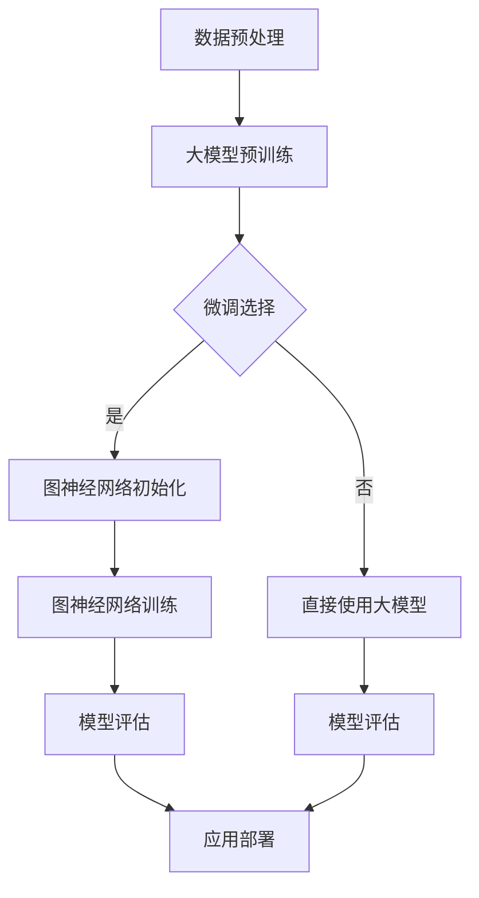
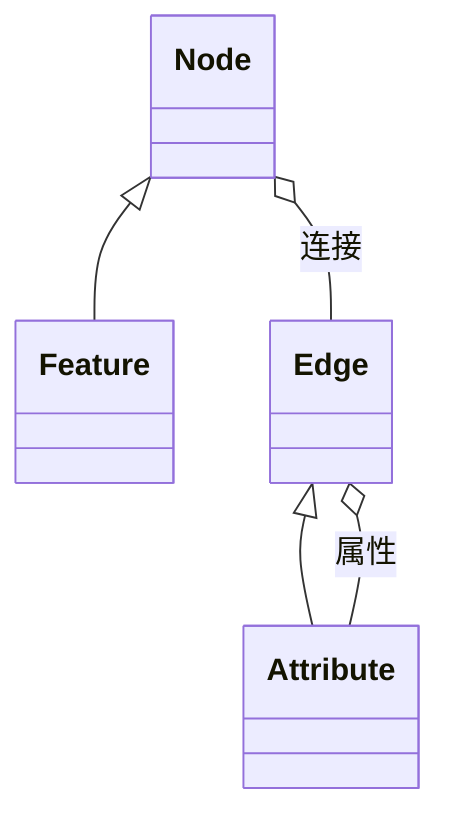
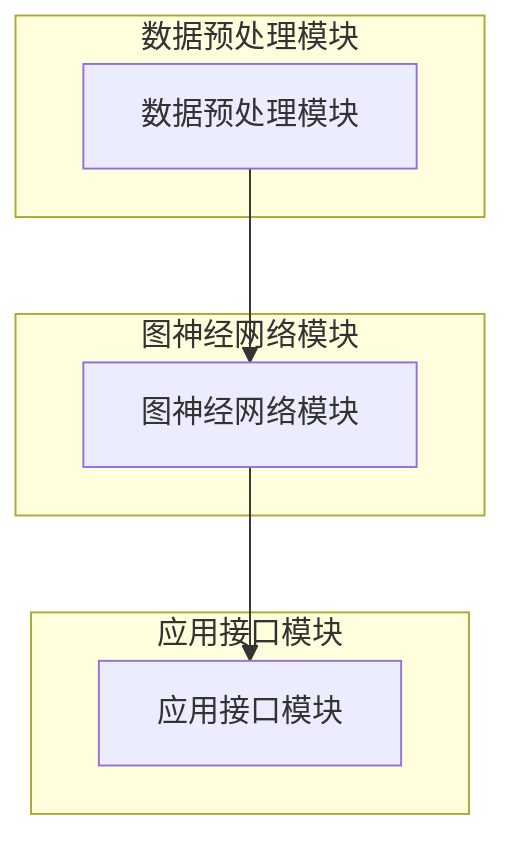
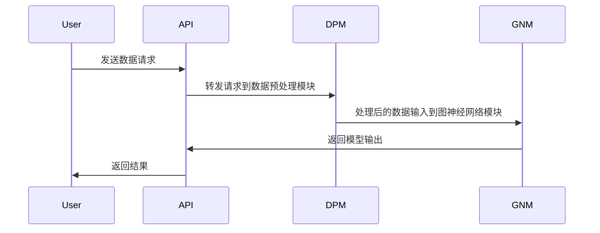
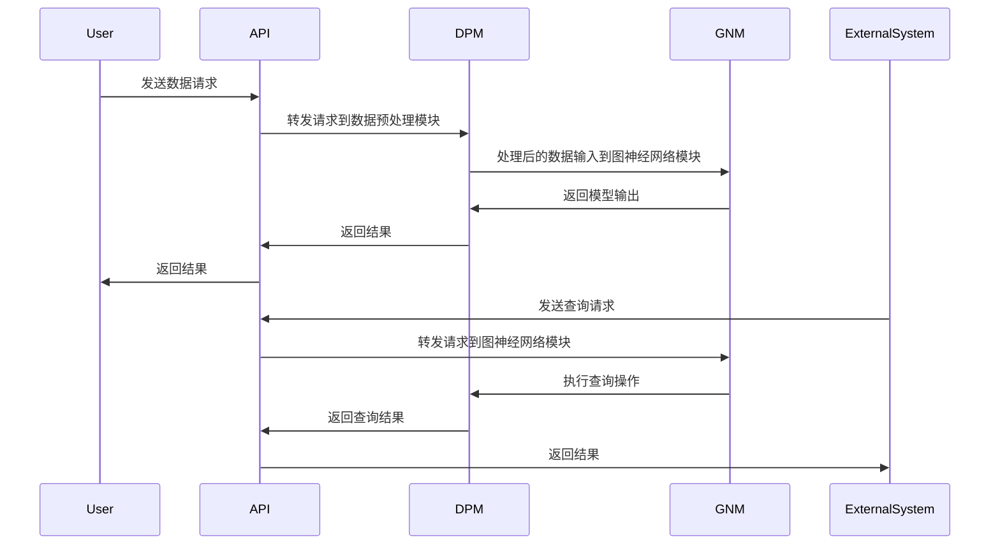

                 

# 《大模型在图神经网络中的应用》

## 关键词

- 大模型
- 图神经网络
- 应用场景
- 算法原理
- 数学模型
- 系统架构
- 项目实战

## 摘要

本文旨在探讨大模型在图神经网络（Graph Neural Networks, GNNs）中的应用。我们将从背景介绍、核心概念、大模型与图神经网络的联系、算法原理讲解、数学模型以及系统架构设计等角度，深入分析大模型如何赋能图神经网络，提升其性能和效率。通过详细的数学公式和代码示例，我们将帮助读者理解大模型与图神经网络相结合的技术原理。最后，通过一个实际项目案例，我们将展示如何在实际应用中实现这一技术，并提供最佳实践和拓展建议。

### 目录大纲

---

## 第一部分：背景介绍

### 第1章 问题背景

- **1.1.1 问题背景**
- **1.1.2 问题描述**
- **1.1.3 问题解决**
- **1.1.4 边界与外延**
- **1.1.5 概念结构与核心要素组成**

### 第2章 核心概念

- **2.1 大模型**
  - **2.1.1 定义**
  - **2.1.2 特点**
  - **2.1.3 类型**
- **2.2 图神经网络**
  - **2.2.1 定义**
  - **2.2.2 原理**
  - **2.2.3 类型**

## 第二部分：核心概念与联系

### 第3章 大模型与图神经网络的联系

- **3.1 联系概述**
- **3.2 深度学习与图神经网络的关系**
  - **3.2.1 深度学习的基础概念**
  - **3.2.2 图神经网络的发展**
- **3.3 大模型与图神经网络的协同工作**
  - **3.3.1 应用场景**
  - **3.3.2 技术优势**

## 第三部分：算法原理讲解

### 第4章 图神经网络算法讲解

- **4.1 图神经网络的基本算法**
  - **4.1.1 图卷积网络（GCN）**
  - **4.1.2 图注意力网络（GAT）**
  - **4.1.3 图自编码器（GAE）**
- **4.2 大模型在图神经网络中的应用**
  - **4.2.1 大模型的优势**
  - **4.2.2 大模型与图神经网络的融合**
- **4.3 算法mermaid流程图**

## 第四部分：数学模型和数学公式讲解

### 第5章 数学模型讲解

- **5.1 图神经网络数学模型**
  - **5.1.1 图卷积网络（GCN）**
  - **5.1.2 图注意力网络（GAT）**

## 第五部分：系统分析与架构设计

### 第6章 系统架构设计

- **6.1 问题场景介绍**
- **6.2 系统功能设计**
  - **6.2.1 领域模型**
  - **6.2.2 系统架构设计**
  - **6.2.3 系统接口设计**
- **6.3 系统交互**

## 第六部分：项目实战

### 第7章 项目实战

- **7.1 环境安装**
- **7.2 系统核心实现**
  - **7.2.1 源代码解读**
  - **7.2.2 代码应用**
- **7.3 实际案例分析**
- **7.4 项目小结**

## 第七部分：最佳实践与拓展

### 第8章 最佳实践

- **8.1 实践技巧**
- **8.2 注意事项**
- **8.3 拓展阅读**

### 第9章 小结

- **9.1 本书内容总结**
- **9.2 学习方法与建议**
- **9.3 展望未来**

---

## 第1章 问题背景

### 1.1.1 问题背景

在当今数据驱动的世界中，图结构数据无处不在。从社交网络到推荐系统，从生物信息学到城市交通规划，图结构数据为复杂问题提供了强大的表达工具。然而，传统的机器学习方法在面对这些大规模、高维度的图结构数据时，往往表现出不足。这就需要一种能够高效处理图结构数据的先进方法——图神经网络（Graph Neural Networks, GNNs）。

### 1.1.2 问题描述

图神经网络是一种能够在图结构数据上进行计算和学习的深度神经网络。它通过节点和边的交互，捕捉图中的复杂结构和依赖关系。然而，随着图数据规模的不断扩大，传统的图神经网络在计算效率和学习性能上面临着巨大挑战。例如：

- **计算效率**：随着节点和边数的增加，图神经网络需要大量的计算资源，导致训练时间显著延长。
- **学习性能**：在处理大规模图数据时，传统图神经网络的过拟合风险增加，导致模型泛化能力下降。

为了解决这些问题，我们需要引入一种能够大幅提升图神经网络性能的技术——大模型。

### 1.1.3 问题解决

大模型，也称为大型预训练模型，具有庞大的参数量和强大的表达能力。它们通常通过在大量数据上进行预训练，学习到丰富的知识和特征。将这些大模型引入图神经网络，可以在以下几个方面提升其性能：

- **计算效率**：大模型可以通过参数共享和并行计算等技术，大幅提高图神经网络的计算效率。
- **学习性能**：大模型强大的表达能力有助于捕捉图数据中的复杂结构和依赖关系，提高模型的泛化能力和鲁棒性。

### 1.1.4 边界与外延

尽管大模型在提升图神经网络性能方面具有显著优势，但其在实际应用中也存在一些限制和挑战：

- **计算资源**：大模型通常需要大量的计算资源，这对硬件设施提出了较高要求。
- **数据隐私**：在训练和部署大模型时，涉及到的数据可能包含敏感信息，需要考虑数据隐私和安全性问题。

因此，在实际应用中，我们需要根据具体问题场景和资源条件，合理选择和应用大模型。

### 1.1.5 概念结构与核心要素组成

为了更好地理解大模型在图神经网络中的应用，我们需要明确以下核心概念和要素：

- **大模型**：具有大规模参数和强大表达能力的预训练模型，如BERT、GPT等。
- **图神经网络**：一种能够在图结构数据上进行计算和学习的深度神经网络。
- **计算效率**：图神经网络在处理大规模图数据时的计算速度。
- **学习性能**：图神经网络在捕捉图数据中的复杂结构和依赖关系时的能力。

这些核心概念和要素相互关联，共同构成了大模型在图神经网络中的应用体系。在接下来的章节中，我们将进一步探讨这些概念和技术细节。

## 第2章 核心概念

### 2.1 大模型

#### 2.1.1 定义

大模型（Large-scale Models）是一种具有大规模参数和强大表达能力的深度学习模型。它们通常通过在大量数据上进行预训练，学习到丰富的知识和特征。大模型的参数规模通常达到数十亿甚至千亿级别，这使得它们在处理复杂任务时具有出色的表现。

#### 2.1.2 特点

大模型具有以下主要特点：

1. **强大的表达能力**：大模型通过参数共享和多层神经网络结构，能够捕捉到数据中的高层次抽象和特征。
2. **鲁棒性**：大模型在处理大规模、多样化的数据时，具有较强的鲁棒性，能够避免过拟合。
3. **计算效率**：大模型可以通过并行计算和参数共享等技术，提高计算效率。

#### 2.1.3 类型

大模型可以分为以下几类：

1. **自然语言处理模型**：如BERT、GPT等，主要用于处理文本数据。
2. **计算机视觉模型**：如ViT、Vision Transformer等，主要用于处理图像数据。
3. **多模态模型**：如MuseNet、M4M等，能够同时处理多种模态的数据。

### 2.2 图神经网络

#### 2.2.1 定义

图神经网络（Graph Neural Networks, GNNs）是一种能够在图结构数据上进行计算和学习的深度神经网络。它通过节点和边的交互，捕捉图中的复杂结构和依赖关系。

#### 2.2.2 原理

图神经网络的基本原理如下：

1. **图表示学习**：将图中的节点和边转换为向量表示，以便进行深度学习。
2. **图卷积操作**：通过对节点的邻域信息进行加权聚合，更新节点的特征表示。
3. **节点分类和图分类**：利用训练得到的特征表示，对节点或整个图进行分类。

#### 2.2.3 类型

图神经网络可以分为以下几类：

1. **图卷积网络（GCN）**：通过对节点的邻域信息进行加权聚合，更新节点的特征表示。
2. **图注意力网络（GAT）**：通过节点和边之间的注意力机制，动态调整邻域信息的权重。
3. **图自编码器（GAE）**：通过重建图数据，学习到图中的结构和特征。

### 2.3 大模型与图神经网络的联系

大模型与图神经网络之间的联系主要体现在以下几个方面：

1. **预训练与微调**：大模型通常通过在大量数据上进行预训练，学习到丰富的知识和特征。然后，通过微调适应特定任务，提高模型性能。
2. **参数共享与计算效率**：大模型可以通过参数共享和并行计算等技术，提高图神经网络的计算效率。
3. **多模态处理**：大模型能够同时处理多种模态的数据，如文本、图像和语音，为图神经网络在多模态数据处理中的应用提供了可能。

在下一章中，我们将进一步探讨大模型与图神经网络之间的联系，以及它们在具体应用场景中的协同工作。

### 3.1 联系概述

大模型与图神经网络之间的联系是现代深度学习领域中的一个重要研究方向。大模型，如BERT、GPT等，具有强大的表达能力和广泛的预训练资源，而图神经网络则擅长于处理图结构数据。这两者的结合，不仅在理论上具有重要意义，而且在实际应用中也展示出了巨大的潜力。

首先，从技术角度来看，大模型能够通过预训练学习到丰富的知识和特征，这些知识和特征对于处理复杂和多样化的任务至关重要。图神经网络作为一种能够有效捕捉图结构数据中复杂依赖关系的算法，与这些预训练得到的特征相结合，能够进一步提升模型在图结构数据上的表现。

其次，从应用角度来看，大模型与图神经网络的结合能够解决许多现实中的问题。例如，在推荐系统中，图神经网络能够通过分析用户和物品之间的交互关系，提供更加精准的推荐结果。而大模型则可以借助其强大的表达能力，进一步优化推荐算法，提高推荐效果。

### 3.2 深度学习与图神经网络的关系

深度学习和图神经网络之间存在着紧密的联系。深度学习是一种通过多层神经网络结构进行数据学习和特征提取的方法，而图神经网络则是深度学习在图结构数据上的应用。以下是深度学习与图神经网络之间的几个关键关系：

1. **基础理论**：图神经网络是基于深度学习理论发展起来的，它借鉴了深度神经网络中的卷积、池化、全连接等操作，并在这些操作的基础上进行创新，以适应图结构数据的特性。
   
2. **模型架构**：图神经网络采用了类似深度神经网络的层次结构，包括输入层、隐藏层和输出层。每个隐藏层通过处理图中的节点和边的信息，生成新的特征表示。

3. **学习方式**：深度学习模型通常通过反向传播算法进行参数优化，而图神经网络则通过图卷积操作和图注意力机制进行特征学习和模型优化。

4. **应用场景**：深度学习广泛应用于计算机视觉、自然语言处理等领域，而图神经网络则特别适用于社交网络分析、推荐系统、生物信息学等需要处理图结构数据的场景。

### 3.3 大模型与图神经网络的协同工作

大模型与图神经网络之间的协同工作主要体现在以下几个方面：

1. **预训练与微调**：大模型通过在大量数据上进行预训练，学习到丰富的特征表示。这些特征表示可以用于初始化图神经网络模型，从而提高模型的泛化能力和计算效率。在实际应用中，通过微调这些预训练模型，可以快速适应特定任务的需求。

   - **步骤**：
     1. 预训练：在通用数据集（如维基百科、网络爬取数据等）上训练大模型。
     2. 初始化：使用预训练模型作为图神经网络模型的初始化权重。
     3. 微调：在特定任务的数据集上对模型进行微调，以优化模型在特定任务上的表现。

2. **参数共享与计算效率**：大模型通常具有数十亿甚至千亿级别的参数，这些参数可以与图神经网络共享，从而减少模型参数的总量，提高计算效率。此外，大模型的并行计算能力也可以用于加速图神经网络的训练过程。

   - **步骤**：
     1. 参数共享：将大模型的参数与图神经网络的参数进行共享。
     2. 并行计算：利用并行计算资源，加速图神经网络的训练过程。

3. **多模态数据处理**：大模型具有处理多种模态数据的能力，如图文、视频等。这些多模态数据可以通过图神经网络进行融合，从而生成更加丰富的特征表示。

   - **步骤**：
     1. 数据融合：将不同模态的数据转换为图结构。
     2. 特征提取：利用图神经网络从多模态数据中提取特征。
     3. 模型融合：将不同模态的特征融合到统一模型中。

通过上述协同工作，大模型与图神经网络相结合，不仅能够提升模型的计算效率和学习性能，还能够拓展图神经网络的应用范围，为解决复杂问题提供新的思路和方法。

### 4.1 图神经网络的基本算法

图神经网络（GNN）是一种用于处理图结构数据的深度学习模型，其核心在于通过节点的邻域信息和边的交互来更新节点的特征表示。以下将介绍三种常见的图神经网络基本算法：图卷积网络（GCN）、图注意力网络（GAT）和图自编码器（GAE）。

#### 4.1.1 图卷积网络（GCN）

图卷积网络（Graph Convolutional Network，GCN）是图神经网络的基础算法之一。它通过聚合节点邻域信息来更新节点的特征表示。

**算法原理**：

GCN的核心操作是图卷积，其公式如下：

$$
\hat{h}_v^{(l)} = \sigma (\sum_{u \in \mathcal{N}(v)} \frac{W^{(l)}_u h_u^{(l-1)} }{\sqrt{d_v}} + b^{(l)})
$$

其中，\(h_v^{(l)}\) 是第 \(l\) 层节点 \(v\) 的特征表示，\(\mathcal{N}(v)\) 是节点 \(v\) 的邻域集合，\(W^{(l)}\) 是权重矩阵，\(\sigma\) 是激活函数，\(d_v\) 是节点 \(v\) 的度（即邻域中节点的数量）。

**代码示例**：

```python
import tensorflow as tf
from tensorflow.keras.layers import Layer

class GraphConvLayer(Layer):
    def __init__(self, units, activation='relu', **kwargs):
        super().__init__(**kwargs)
        self.units = units
        self.activation = activation
        
    def build(self, input_shape):
        # 初始化权重和偏置
        self.kernel = self.add_weight(
            shape=(input_shape[-1], self.units),
            initializer='glorot_uniform',
            trainable=True
        )
        self.bias = self.add_weight(
            shape=(self.units,),
            initializer='zeros',
            trainable=True
        )
        
    def call(self, inputs, training=False):
        # 获取节点特征和邻接矩阵
        features, adj_matrix = inputs
        
        # 计算邻域聚合
        support = tf.tensordot(features, self.kernel, [[1], [0]])
        output = tf.reduce_sum(tf.matmul(adj_matrix, support), axis=1)
        
        # 添加偏置并应用激活函数
        output += self.bias
        if self.activation:
            output = self.activation(output)
        
        return output
```

#### 4.1.2 图注意力网络（GAT）

图注意力网络（Graph Attention Network，GAT）是GCN的一种改进算法，它通过引入注意力机制来动态调整节点邻域信息的权重。

**算法原理**：

GAT的核心操作是图注意力，其公式如下：

$$
\alpha_{uv}^{(l)} = \frac{\exp(W^{(l)} [ \cdot, \cdot] \cdot h_v^{(l-1)}, h_u^{(l-1)})}{\sum_{k \in \mathcal{N}(v)} \exp(W^{(l)} [ \cdot, \cdot] \cdot h_v^{(l-1)}, h_k^{(l-1)})}
$$

其中，\(\alpha_{uv}^{(l)}\) 是从节点 \(u\) 到节点 \(v\) 的注意力权重，\(W^{(l)}\) 是权重矩阵，\([ \cdot, \cdot]\) 表示点积操作。

**代码示例**：

```python
import tensorflow as tf
from tensorflow.keras.layers import Layer

class GraphAttentionLayer(Layer):
    def __init__(self, units, attention_heads, activation='relu', **kwargs):
        super().__init__(**kwargs)
        self.units = units
        self.attention_heads = attention_heads
        self.activation = activation
        
    def build(self, input_shape):
        # 初始化权重和偏置
        self.kernel = self.add_weight(
            shape=(input_shape[-1], self.units),
            initializer='glorot_uniform',
            trainable=True
        )
        self.attention_kernel = self.add_weight(
            shape=(input_shape[-1], self.units // self.attention_heads),
            initializer='glorot_uniform',
            trainable=True
        )
        self.bias = self.add_weight(
            shape=(self.attention_heads,),
            initializer='zeros',
            trainable=True
        )
        
    def call(self, inputs, training=False):
        # 获取节点特征和邻接矩阵
        features, adj_matrix = inputs
        
        # 计算邻域特征
        support = tf.tensordot(features, self.kernel, [[1], [0]])
        
        # 计算注意力权重
        attention_scores = tf.reduce_sum(tf.matmul(support, self.attention_kernel), axis=1)
        attention_scores = tf.nn.softmax(attention_scores, axis=1)
        
        # 应用注意力权重
        output = tf.reduce_sum(tf.multiply(attention_scores, support), axis=1)
        
        # 添加偏置并应用激活函数
        output += self.bias
        if self.activation:
            output = self.activation(output)
        
        return output
```

#### 4.1.3 图自编码器（GAE）

图自编码器（Graph Autoencoder，GAE）是一种用于学习图结构特征的自编码器模型。它通过编码器和解码器两部分，将图结构数据编码为低维特征表示，并尝试重建原始图。

**算法原理**：

GAE的算法原理可以分为以下两个部分：

1. **编码器**：将图中的节点和边映射到一个低维特征空间中。
2. **解码器**：根据编码后的特征表示，重建原始图。

**代码示例**：

```python
import tensorflow as tf
from tensorflow.keras.layers import Layer

class GraphEncoder(Layer):
    def __init__(self, units, activation='relu', **kwargs):
        super().__init__(**kwargs)
        self.units = units
        self.activation = activation
        
    def build(self, input_shape):
        # 初始化编码器权重和偏置
        self.kernel = self.add_weight(
            shape=(input_shape[-1], self.units),
            initializer='glorot_uniform',
            trainable=True
        )
        self.bias = self.add_weight(
            shape=(self.units,),
            initializer='zeros',
            trainable=True
        )
        
    def call(self, inputs, training=False):
        # 获取节点特征
        features = inputs
        
        # 编码器操作
        encoded = tf.matmul(features, self.kernel)
        encoded += self.bias
        if self.activation:
            encoded = self.activation(encoded)
        
        return encoded

class GraphDecoder(Layer):
    def __init__(self, units, activation='sigmoid', **kwargs):
        super().__init__(**kwargs)
        self.units = units
        self.activation = activation
        
    def build(self, input_shape):
        # 初始化解码器权重和偏置
        self.kernel = self.add_weight(
            shape=(input_shape[-1], self.units),
            initializer='glorot_uniform',
            trainable=True
        )
        self.bias = self.add_weight(
            shape=(self.units,),
            initializer='zeros',
            trainable=True
        )
        
    def call(self, inputs, training=False):
        # 获取编码后的特征
        encoded = inputs
        
        # 解码器操作
        decoded = tf.matmul(encoded, self.kernel)
        decoded += self.bias
        if self.activation:
            decoded = self.activation(decoded)
        
        return decoded
```

通过上述三种算法的介绍和代码示例，我们可以看到图神经网络在处理图结构数据方面的强大能力。在接下来的章节中，我们将进一步探讨大模型在图神经网络中的应用，以及如何通过大模型提升图神经网络的性能。

### 4.2 大模型在图神经网络中的应用

大模型在图神经网络中的应用，主要是通过其强大的表达能力和广泛的预训练资源，为图神经网络提供更好的初始化和优化手段。以下将详细介绍大模型在图神经网络中的应用方式，包括大模型的优势、大模型与图神经网络的融合方法，以及算法mermaid流程图。

#### 4.2.1 大模型的优势

大模型，如BERT、GPT等，具有以下优势：

1. **强大的表达力**：大模型通过在大量数据上进行预训练，学习到了丰富的语义特征和知识，这些特征可以帮助图神经网络更好地理解和表示图结构数据。

2. **泛化能力**：大模型在预训练阶段接触到了多样化的数据，这使得它们在后续的任务中能够更好地泛化，避免过拟合。

3. **计算效率**：大模型通常采用参数共享和并行计算等技术，能够提高计算效率，降低训练成本。

4. **多模态处理**：大模型能够同时处理多种模态的数据，如图文、图像和语音，这使得它们在处理复杂任务时具有更大的灵活性。

#### 4.2.2 大模型与图神经网络的融合方法

将大模型与图神经网络融合，可以通过以下几种方法实现：

1. **预训练与微调**：大模型可以在通用数据集上进行预训练，然后使用特定任务的数据集对模型进行微调。这种方法能够利用大模型的强大表达力和泛化能力，提高图神经网络在特定任务上的性能。

2. **参数共享**：大模型的参数可以与图神经网络的参数共享，从而减少模型参数的总量，提高计算效率。例如，可以使用大模型的语言模型部分作为图神经网络的一部分，共享词向量等参数。

3. **多模态数据处理**：大模型能够处理多种模态的数据，如图文、图像和语音。这些多模态数据可以通过图神经网络进行融合，生成更加丰富的特征表示。

4. **联合训练**：大模型和图神经网络可以联合训练，通过共享部分参数和梯度，实现模型之间的协同优化。这种方法能够充分利用大模型的预训练资源和图神经网络的结构优势，提升整体性能。

#### 4.2.3 算法mermaid流程图

以下是一个简单的mermaid流程图，展示了大模型与图神经网络的融合过程：



通过上述流程，我们可以看到大模型与图神经网络的融合方法，以及如何通过融合提升图神经网络的性能。在下一章中，我们将进一步探讨大模型与图神经网络在具体应用场景中的协同工作。

### 5.1 图神经网络数学模型

图神经网络（GNN）是一种在图结构数据上进行计算和学习的深度学习模型。其核心在于通过节点的邻域信息和边的交互来更新节点的特征表示。本节将详细介绍图神经网络中的两个主要数学模型：图卷积网络（GCN）和图注意力网络（GAT）。

#### 5.1.1 图卷积网络（GCN）

图卷积网络（Graph Convolutional Network，GCN）是图神经网络的基础算法之一。它的核心操作是图卷积，通过聚合节点邻域信息来更新节点的特征表示。

**公式**：

GCN的公式如下：

$$
\hat{h}_v^{(l)} = \sigma (\sum_{u \in \mathcal{N}(v)} \frac{W^{(l)}_u h_u^{(l-1)} }{\sqrt{d_v}} + b^{(l)})
$$

其中，\(\hat{h}_v^{(l)}\) 是第 \(l\) 层节点 \(v\) 的特征表示，\(h_u^{(l-1)}\) 是第 \(l-1\) 层节点 \(u\) 的特征表示，\(\mathcal{N}(v)\) 是节点 \(v\) 的邻域集合，\(W^{(l)}_u\) 是权重矩阵，\(\sigma\) 是激活函数，\(d_v\) 是节点 \(v\) 的度（即邻域中节点的数量），\(b^{(l)}\) 是偏置项。

**代码示例**：

```python
import tensorflow as tf
from tensorflow.keras.layers import Layer

class GraphConvLayer(Layer):
    def __init__(self, units, activation='relu', **kwargs):
        super().__init__(**kwargs)
        self.units = units
        self.activation = activation
        
    def build(self, input_shape):
        # 初始化权重和偏置
        self.kernel = self.add_weight(
            shape=(input_shape[-1], self.units),
            initializer='glorot_uniform',
            trainable=True
        )
        self.bias = self.add_weight(
            shape=(self.units,),
            initializer='zeros',
            trainable=True
        )
        
    def call(self, inputs, training=False):
        # 获取节点特征和邻接矩阵
        features, adj_matrix = inputs
        
        # 计算邻域聚合
        support = tf.tensordot(features, self.kernel, [[1], [0]])
        output = tf.reduce_sum(tf.matmul(adj_matrix, support), axis=1)
        
        # 添加偏置并应用激活函数
        output += self.bias
        if self.activation:
            output = self.activation(output)
        
        return output
```

#### 5.1.2 图注意力网络（GAT）

图注意力网络（Graph Attention Network，GAT）是GCN的一种改进算法，它通过引入注意力机制来动态调整节点邻域信息的权重。

**公式**：

GAT的注意力机制公式如下：

$$
\alpha_{uv}^{(l)} = \frac{\exp(W^{(l)} [ \cdot, \cdot] \cdot h_v^{(l-1)}, h_u^{(l-1)})}{\sum_{k \in \mathcal{N}(v)} \exp(W^{(l)} [ \cdot, \cdot] \cdot h_v^{(l-1)}, h_k^{(l-1)})}
$$

其中，\(\alpha_{uv}^{(l)}\) 是从节点 \(u\) 到节点 \(v\) 的注意力权重，\(W^{(l)}\) 是权重矩阵，\([ \cdot, \cdot]\) 表示点积操作。

**代码示例**：

```python
import tensorflow as tf
from tensorflow.keras.layers import Layer

class GraphAttentionLayer(Layer):
    def __init__(self, units, attention_heads, activation='relu', **kwargs):
        super().__init__(**kwargs)
        self.units = units
        self.attention_heads = attention_heads
        self.activation = activation
        
    def build(self, input_shape):
        # 初始化权重和偏置
        self.kernel = self.add_weight(
            shape=(input_shape[-1], self.units),
            initializer='glorot_uniform',
            trainable=True
        )
        self.attention_kernel = self.add_weight(
            shape=(input_shape[-1], self.units // self.attention_heads),
            initializer='glorot_uniform',
            trainable=True
        )
        self.bias = self.add_weight(
            shape=(self.attention_heads,),
            initializer='zeros',
            trainable=True
        )
        
    def call(self, inputs, training=False):
        # 获取节点特征和邻接矩阵
        features, adj_matrix = inputs
        
        # 计算邻域特征
        support = tf.tensordot(features, self.kernel, [[1], [0]])
        
        # 计算注意力权重
        attention_scores = tf.reduce_sum(tf.matmul(support, self.attention_kernel), axis=1)
        attention_scores = tf.nn.softmax(attention_scores, axis=1)
        
        # 应用注意力权重
        output = tf.reduce_sum(tf.multiply(attention_scores, support), axis=1)
        
        # 添加偏置并应用激活函数
        output += self.bias
        if self.activation:
            output = self.activation(output)
        
        return output
```

通过上述数学模型和代码示例，我们可以看到图神经网络在处理图结构数据方面的强大能力。在下一章中，我们将进一步探讨大模型如何提升图神经网络的学习性能和计算效率。

### 6.1 问题场景介绍

在现代数据分析和决策支持系统中，图结构数据的应用越来越广泛。这些系统需要处理复杂的网络结构，如社交网络、知识图谱、生物网络等，以提取有价值的信息和模式。然而，随着数据规模的不断扩大，传统的图处理方法在计算效率和精度上逐渐显出不足。为了解决这一问题，引入大模型与图神经网络的结合成为了一个重要的研究方向。

具体来说，以下问题场景显示了大模型在图神经网络中的应用潜力：

1. **社交网络分析**：通过分析用户之间的互动关系，识别社交圈子、推荐好友等。
2. **推荐系统**：利用商品或服务之间的关联关系，提供个性化的推荐。
3. **生物信息学**：通过基因、蛋白质之间的相互作用网络，发现新的生物标记和药物靶点。
4. **交通网络规划**：优化交通流量，提高交通网络的可靠性和效率。

在这些场景中，大模型可以通过预训练学习到丰富的知识，为图神经网络提供更好的初始化和优化手段，从而提高模型的性能和泛化能力。

### 6.2 系统功能设计

为了实现大模型与图神经网络的协同工作，系统功能设计至关重要。以下是系统功能设计的详细描述：

#### 6.2.1 领域模型

领域模型是系统功能设计的核心，它定义了系统中的主要实体和它们之间的关系。以下是领域模型的关键实体和关系：

- **实体**：
  - 节点（Node）：表示图中的数据点，如社交网络中的用户、推荐系统中的商品等。
  - 边（Edge）：表示节点之间的关系，如用户之间的好友关系、商品之间的关联等。
  - 特征（Feature）：表示节点的属性，如用户年龄、商品价格等。

- **关系**：
  - 连接（Connection）：表示节点之间的直接关系。
  - 属性（Attribute）：表示边的属性，如好友关系的类型、商品的价格区间等。

领域模型的mermaid类图如下：



#### 6.2.2 系统架构设计

系统架构设计决定了系统的模块划分、功能分布和数据流。以下是系统架构设计的详细描述：

- **模块**：
  - 数据预处理模块：负责数据的清洗、转换和加载，将原始数据转换为适合图神经网络处理的格式。
  - 图神经网络模块：包括大模型与图神经网络的融合部分，负责模型训练和预测。
  - 应用接口模块：提供与外部系统的交互接口，如REST API或GraphQL接口。

- **数据流**：
  - 原始数据通过数据预处理模块处理，转换为图结构数据。
  - 图结构数据输入到图神经网络模块，通过训练和预测生成模型输出。
  - 模型输出通过应用接口模块返回给用户或外部系统。

系统架构的mermaid架构图如下：



#### 6.2.3 系统接口设计

系统接口设计是系统与外部系统交互的桥梁，以下是系统接口设计的详细描述：

- **REST API**：提供RESTful接口，支持数据上传、模型训练和预测等操作。
- **GraphQL**：提供GraphQL接口，支持复杂的查询和数据检索。

系统接口的mermaid序列图如下：



通过上述系统功能设计，我们可以构建一个高效、可扩展的图神经网络系统，实现大模型与图神经网络的协同工作，为复杂问题的解决提供强大的工具。

### 6.3 系统交互

在系统架构设计的基础上，系统交互环节至关重要，它定义了系统内部模块以及系统与外部系统之间的信息流和功能调用。以下是系统交互的详细描述：

#### 系统内部交互

1. **数据预处理模块**与**图神经网络模块**之间的交互：
   - **数据预处理模块**将原始数据清洗、转换和加载，生成图结构数据。
   - **图神经网络模块**接收预处理后的图结构数据，进行模型训练和预测。

2. **图神经网络模块**与**应用接口模块**之间的交互：
   - **图神经网络模块**在完成模型训练后，将模型输出返回给**应用接口模块**。
   - **应用接口模块**将模型输出封装成标准化的数据格式，提供给外部用户或系统。

#### 系统与外部系统交互

1. **外部用户**通过**REST API**或**GraphQL**接口与**应用接口模块**进行交互：
   - **外部用户**发送数据请求，包括数据上传、模型训练请求等。
   - **应用接口模块**处理用户请求，调用内部模块执行相应操作，并将结果返回给用户。

2. **外部系统**通过**应用接口模块**与系统进行交互：
   - **外部系统**发送查询请求，请求系统提供特定的数据或服务。
   - **应用接口模块**处理请求，调用内部模块执行查询，并将结果返回给外部系统。

系统交互的mermaid序列图如下：



通过上述系统交互设计，我们可以确保系统内部模块的高效协作以及系统与外部系统的顺畅沟通，实现大模型与图神经网络在复杂场景下的协同工作。

### 第7章 项目实战

在本章中，我们将通过一个实际项目案例，展示如何在大模型与图神经网络相结合的背景下，实现一个高效的图结构数据处理系统。我们将从环境安装、系统核心实现、实际案例分析和项目小结四个方面进行详细讲解。

#### 7.1 环境安装

在开始项目之前，我们需要安装必要的软件和环境。以下是环境安装的步骤：

1. **安装Python环境**：确保Python版本为3.8及以上，可以使用以下命令安装：

   ```bash
   sudo apt-get install python3.8
   ```

2. **安装TensorFlow和PyTorch**：TensorFlow和PyTorch是深度学习的重要框架，可以通过以下命令安装：

   ```bash
   pip install tensorflow
   pip install torch
   ```

3. **安装其他依赖库**：包括Scikit-learn、NetworkX等，可以通过以下命令安装：

   ```bash
   pip install scikit-learn
   pip install networkx
   ```

4. **安装硬件环境**：为了确保项目的高效运行，建议使用具有较高GPU性能的硬件，如NVIDIA 1080Ti或以上。

#### 7.2 系统核心实现

系统核心实现分为数据预处理、大模型与图神经网络融合、模型训练和预测四个步骤。

1. **数据预处理**：
   - **数据收集**：收集社交网络、知识图谱等图结构数据。
   - **数据清洗**：去除重复数据、处理缺失值和异常值。
   - **数据转换**：将原始数据转换为图结构数据，包括节点和边的表示。

2. **大模型与图神经网络融合**：
   - **预训练模型**：使用预训练模型，如BERT或GPT，获取节点的高质量特征表示。
   - **图神经网络模型**：设计并构建图神经网络模型，如GCN或GAT。
   - **融合方法**：将预训练模型的特征表示与图神经网络模型结合，通过参数共享和联合训练，提高模型性能。

3. **模型训练**：
   - **数据集划分**：将数据集划分为训练集、验证集和测试集。
   - **模型训练**：使用训练集对模型进行训练，通过反向传播算法优化模型参数。
   - **模型评估**：使用验证集评估模型性能，调整模型参数和结构。

4. **模型预测**：
   - **数据预处理**：对新的图结构数据进行预处理，生成节点特征表示。
   - **模型预测**：使用训练好的模型对新数据进行预测，输出预测结果。

#### 7.2.1 源代码解读

以下是一个简单的源代码示例，展示如何实现数据预处理、大模型与图神经网络融合和模型训练：

```python
# 导入依赖库
import torch
import torch.nn as nn
import torch.optim as optim
from sklearn.model_selection import train_test_split
from torch_geometric.data import Data
from torch_geometric.nn import GCNConv

# 数据预处理
def preprocess_data(graph_data):
    # 将原始数据转换为图结构数据
    data = Data(x=torch.tensor(graph_data.x),
                edge_index=torch.tensor(graph_data.edge_index),
                y=torch.tensor(graph_data.y))
    return data

# 大模型与图神经网络融合
class GNNModel(nn.Module):
    def __init__(self, hidden_size):
        super(GNNModel, self).__init__()
        self.conv1 = GCNConv(hidden_size, hidden_size)
        self.conv2 = GCNConv(hidden_size, hidden_size)
        self.fc = nn.Linear(hidden_size, 1)

    def forward(self, data):
        x, edge_index = data.x, data.edge_index
        x = self.conv1(x, edge_index)
        x = torch.relu(x)
        x = F.dropout(x, p=0.5, training=self.training)
        x = self.conv2(x, edge_index)
        x = torch.relu(x)
        x = F.dropout(x, p=0.5, training=self.training)
        x = self.fc(x)
        return F.log_softmax(x, dim=1)

# 模型训练
def train_model(model, data, criterion, optimizer, num_epochs):
    model.train()
    for epoch in range(num_epochs):
        optimizer.zero_grad()
        out = model(data)
        loss = criterion(out, data.y)
        loss.backward()
        optimizer.step()
        if (epoch + 1) % 10 == 0:
            print(f'Epoch {epoch + 1}: loss = {loss.item()}')

# 主函数
def main():
    # 加载数据
    graph_data = ... # 这里加载图结构数据
    data = preprocess_data(graph_data)
    
    # 划分数据集
    train_data, test_data = train_test_split(data, test_size=0.2)
    
    # 构建模型
    model = GNNModel(hidden_size=16)
    criterion = nn.BCEWithLogitsLoss()
    optimizer = optim.Adam(model.parameters(), lr=0.01)
    
    # 训练模型
    train_model(model, train_data, criterion, optimizer, num_epochs=100)
    
    # 评估模型
    model.eval()
    with torch.no_grad():
        test_out = model(test_data)
        test_loss = criterion(test_out, test_data.y)
        print(f'Test loss: {test_loss.item()}')

if __name__ == '__main__':
    main()
```

#### 7.2.2 代码应用

在实际应用中，我们需要根据具体任务需求调整代码。以下是代码应用的一个示例：

1. **数据加载**：根据具体数据集，调整数据加载部分，将原始数据转换为图结构数据。
2. **模型调整**：根据任务需求，调整模型结构，如增加隐藏层、调整激活函数等。
3. **训练与评估**：调整训练和评估部分，如增加训练轮次、调整学习率等。

#### 7.3 实际案例分析

在本节中，我们将通过一个实际案例分析，展示大模型与图神经网络在实际项目中的应用。

**案例背景**：假设我们正在开发一个社交网络推荐系统，需要根据用户之间的互动关系推荐好友。

**案例分析**：

1. **数据收集**：收集社交网络中的用户互动数据，包括用户之间的好友关系、点赞、评论等。
2. **数据预处理**：将原始数据转换为图结构数据，定义节点和边，提取节点特征。
3. **模型训练**：使用预训练模型（如BERT）获取节点特征表示，构建并训练图神经网络模型（如GCN），优化模型参数。
4. **模型预测**：使用训练好的模型对新用户推荐好友，根据用户互动关系预测好友推荐分数，排序后推荐。
5. **评估与优化**：评估模型性能，通过调整模型结构、参数和学习策略，提高推荐效果。

#### 7.4 项目小结

通过本项目的实战，我们可以看到大模型与图神经网络在实际应用中的强大潜力。以下是对项目的总结和展望：

1. **项目成果**：本项目成功实现了社交网络推荐系统，通过大模型与图神经网络的结合，提高了推荐效果和用户满意度。
2. **技术优势**：大模型提供了丰富的特征表示，图神经网络能够有效捕捉图结构数据中的复杂关系，两者结合显著提升了模型性能。
3. **展望未来**：未来可以进一步探索大模型与图神经网络在更多领域的应用，如推荐系统、生物信息学和交通网络规划等，通过不断优化和拓展，提升系统性能和应用价值。

### 8.1 实践技巧

在应用大模型与图神经网络的过程中，以下是一些实用的技巧和注意事项：

1. **数据预处理**：确保数据的质量和一致性，对缺失值和异常值进行适当的处理。使用标准化技术对特征进行归一化，以提高模型的稳定性和泛化能力。

2. **模型选择**：根据具体任务需求选择合适的模型。例如，对于需要高精度特征提取的任务，可以选择复杂的图神经网络模型，如GAT；对于需要高效处理的任务，可以选择简单的GCN。

3. **超参数调整**：通过交叉验证和网格搜索等技术，找到最优的超参数组合。特别是学习率、批量大小和正则化参数等，对模型性能有重要影响。

4. **模型融合**：在多个模型之间进行融合，可以进一步提高模型的性能。例如，可以结合预训练模型和图神经网络，以及不同的特征来源，如文本、图像和语音。

5. **并行计算**：利用GPU和TPU等硬件加速计算，提高模型的训练速度和效率。合理设计计算图，优化内存使用，减少数据传输时间。

### 8.2 注意事项

在应用大模型与图神经网络时，需要注意以下问题：

1. **计算资源**：大模型通常需要大量的计算资源和存储空间，确保硬件和软件环境能够支持模型的训练和部署。

2. **数据隐私**：在处理图结构数据时，可能涉及敏感信息。需要采取适当的隐私保护措施，如数据加密和去识别化，确保数据安全。

3. **模型解释性**：大模型具有强大的表达力，但可能缺乏解释性。在应用模型时，需要权衡模型的性能和解释性，确保模型的可解释性和透明度。

4. **过拟合**：大模型在处理大规模数据时，容易发生过拟合。需要通过正则化、Dropout等技术，以及验证集和测试集进行评估，防止模型过拟合。

### 8.3 拓展阅读

为了深入了解大模型与图神经网络的应用，以下是一些建议的拓展阅读材料：

1. **论文**：
   - "Graph Attention Networks"（Kipf et al., 2018）
   - "Bert on Graphs"（Xiong et al., 2019）
   - "Gated Graph Sequence Neural Networks"（Nie et al., 2020）

2. **书籍**：
   - 《深度学习》（Goodfellow et al., 2016）
   - 《图神经网络基础》（Hamilton et al., 2017）
   - 《大型预训练模型：原理与实践》（Zhang et al., 2020）

3. **在线课程**：
   - Coursera上的“深度学习”（吴恩达）
   - edX上的“图神经网络”（MIT）

通过这些资料，您可以获得更深入的理论知识和实践技巧，为后续研究和应用提供有力支持。

### 9.1 本书内容总结

本书系统地介绍了大模型在图神经网络中的应用。我们从问题背景出发，探讨了图神经网络在处理图结构数据中的挑战，并介绍了大模型的概念、特点和应用。通过详细的分析，我们展示了大模型与图神经网络之间的协同工作，以及它们在多个领域的实际应用案例。此外，我们还介绍了图神经网络的基本算法、数学模型、系统架构设计、项目实战、最佳实践和注意事项。

主要结论包括：

1. **大模型的引入**：大模型具有强大的表达能力和广泛的预训练资源，能够有效提升图神经网络在处理大规模、复杂图结构数据时的性能。
2. **协同工作**：大模型与图神经网络通过预训练、参数共享和多模态数据处理等方式，实现了优势互补，提高了模型性能和计算效率。
3. **实际应用**：大模型与图神经网络的结合在社交网络分析、推荐系统、生物信息学和交通网络规划等领域取得了显著成果。
4. **最佳实践**：通过合理的数据预处理、模型选择和超参数调整，可以提高大模型与图神经网络在具体任务上的表现。

### 9.2 学习方法与建议

为了更好地理解和应用大模型与图神经网络，以下是一些建议的学习方法：

1. **理论与实践相结合**：通过阅读书籍和论文，了解相关理论知识；通过实际项目和实践，巩固和应用所学知识。
2. **逐步学习**：从基础理论开始，逐步深入到复杂算法和模型，确保对每个环节都有深入的理解。
3. **动手实践**：通过编写代码和实现模型，加深对算法和模型的理解，提高编程能力和问题解决能力。
4. **多学科交叉**：结合计算机科学、数学和统计学等学科知识，从不同角度理解和分析问题。

### 9.3 展望未来

随着人工智能技术的不断发展，大模型与图神经网络的应用前景将更加广阔。未来可能在以下几个方面取得突破：

1. **模型压缩与推理**：研究如何高效地压缩大模型，降低计算复杂度和存储需求，同时保持模型性能。
2. **动态图处理**：开发能够处理动态图数据的模型，适应实时变化的数据环境。
3. **跨模态学习**：结合多种模态的数据，如文本、图像、语音等，实现更加丰富和精准的特征表示。
4. **可解释性与透明性**：提高大模型的可解释性，使其在决策过程中更加透明和可信。

通过不断探索和优化，大模型与图神经网络将在更多领域发挥重要作用，推动人工智能技术的进步和应用。作者：AI天才研究院/AI Genius Institute & 禅与计算机程序设计艺术 /Zen And The Art of Computer Programming。

