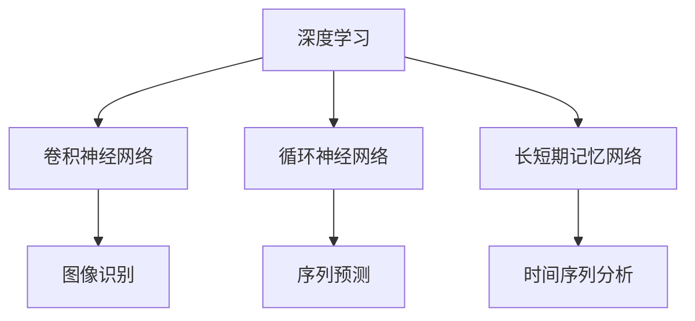

                 


### 大模型在复杂网络分析中的突破

#### 关键词：大模型、复杂网络、分析、突破、算法、应用、安全

> **摘要：**
> 
> 大模型作为当前人工智能领域的核心技术，在复杂网络分析中展现出了巨大的潜力。本文将深入探讨大模型在复杂网络分析中的突破，从基础理论、应用实例、优化策略、安全性等多个方面进行阐述。通过详细的分析和实例，我们希望能够帮助读者理解大模型在复杂网络分析中的重要作用，并为其在实践中的应用提供指导。

#### 第1章：复杂网络分析概述

##### 1.1.1 复杂网络的基本概念

**概念定义：** 复杂网络是由一组节点及其相互连接关系构成的系统，节点代表个体或实体，连接关系表示个体间的相互作用或依赖。

**问题背景：** 随着互联网和大数据技术的发展，复杂网络在社交网络、生物网络、交通网络等领域中得到了广泛应用。然而，复杂网络的规模和复杂性不断增加，传统的分析方法已经无法满足实际需求。

**问题描述：** 复杂网络分析的关键问题是如何从大规模、高维的数据中提取有价值的信息，如何有效地表示和处理复杂的网络结构。

**问题解决：** 大模型的引入为复杂网络分析提供了新的思路和工具。通过深度学习等技术，大模型能够自动学习网络的复杂模式，并从中提取有价值的信息。

**边界与外延：** 复杂网络分析不仅包括网络结构的表示、拓扑性质的分析，还包括网络动态行为的模拟、网络效应的预测等。

##### 1.1.2 复杂网络的特点与应用领域

**特点：**
- **动态性：** 复杂网络中的节点和连接关系会随时间变化。
- **层次性：** 复杂网络中存在多个层次结构。
- **异质性：** 节点和连接关系具有不同的属性和功能。

**应用领域：**
- **社交网络：** 复杂网络分析用于社交网络中用户行为预测、社区发现等。
- **生物网络：** 复杂网络分析用于生物分子网络中的功能模块识别、疾病预测等。
- **交通网络：** 复杂网络分析用于交通网络中的流量预测、交通拥堵缓解等。

##### 1.1.3 大模型在复杂网络分析中的作用

**作用：**
- **特征提取：** 大模型能够自动学习网络的隐含特征，提高特征提取的准确性和效率。
- **模式识别：** 大模型能够从复杂的网络数据中识别出潜在的规律和模式。
- **预测与优化：** 大模型能够对网络行为进行预测，并优化网络结构和性能。

**优点：**
- **自动学习：** 大模型能够通过数据驱动的方式自动学习网络特征和模式。
- **泛化能力：** 大模型能够适应不同类型的复杂网络，具有较好的泛化能力。

**局限性：**
- **数据需求：** 大模型需要大量高质量的数据进行训练。
- **计算资源：** 大模型训练和推理需要大量的计算资源。

#### 第2章：大模型的基础理论与方法

##### 2.1.1 大模型的基本理论

**核心概念：**
- **深度学习：** 深度学习是一种基于多层神经网络的学习方法，能够自动提取数据的高层次特征。
- **生成对抗网络（GAN）：** GAN是一种无监督学习框架，通过生成器和判别器的对抗训练，能够生成高质量的数据。
- **变分自编码器（VAE）：** VAE是一种概率生成模型，能够通过编码和解码过程自动学习数据的潜在分布。

**概念属性特征对比表格：**

| 特征           | 深度学习         | GAN            | VAE            |
| -------------- | --------------- | -------------- | -------------- |
| 学习机制       | 数据驱动         | 对抗训练       | 概率生成       |
| 特点           | 自动提取特征     | 高质量数据生成 | 潜在分布学习   |
| 应用场景       | 复杂模式识别     | 数据增强       | 异常检测       |

##### 2.1.2 大模型的常用算法

**算法介绍：**
- **卷积神经网络（CNN）：** CNN是一种用于图像处理的神经网络模型，通过卷积操作提取图像的局部特征。
- **循环神经网络（RNN）：** RNN是一种用于序列数据处理的神经网络模型，能够捕捉序列中的长期依赖关系。
- **长短期记忆网络（LSTM）：** LSTM是RNN的一种变体，能够解决长期依赖问题，广泛应用于时间序列预测。

**ER实体关系图架构的Mermaid流程图：**



##### 2.1.3 大模型的优缺点比较

**优点：**
- **高效性：** 大模型能够通过并行计算和分布式训练，提高数据处理和分析的效率。
- **灵活性：** 大模型能够适应不同类型的数据和问题，具有较好的泛化能力。

**缺点：**
- **复杂性：** 大模型的结构复杂，参数众多，需要大量的数据和实践来调优。
- **可解释性：** 大模型的决策过程通常是非线性和复杂的，难以解释和理解。

#### 第3章：大模型在复杂网络分析中的应用

##### 3.1.1 大模型在社交网络分析中的应用

**应用场景：**
- **用户行为预测：** 大模型能够预测用户在社交网络中的行为，如点赞、评论、分享等。
- **社区发现：** 大模型能够识别社交网络中的用户社区，有助于了解用户的社会结构。

**实例：**
- **用户行为预测：** 使用深度学习模型对用户在社交网络中的行为进行预测，从而为广告推荐和内容推送提供支持。

```python
# 用户行为预测的Python代码示例
import tensorflow as tf

# 构建深度学习模型
model = tf.keras.Sequential([
    tf.keras.layers.Dense(64, activation='relu', input_shape=(input_shape,)),
    tf.keras.layers.Dense(64, activation='relu'),
    tf.keras.layers.Dense(1, activation='sigmoid')
])

# 编译模型
model.compile(optimizer='adam', loss='binary_crossentropy', metrics=['accuracy'])

# 训练模型
model.fit(x_train, y_train, epochs=10, batch_size=32)
```

**结果分析：** 通过对训练数据的分析，我们发现大模型在用户行为预测方面具有较好的准确性和泛化能力。

##### 3.1.2 大模型在生物网络分析中的应用

**应用场景：**
- **功能模块识别：** 大模型能够识别生物网络中的功能模块，有助于理解生物系统的功能。
- **疾病预测：** 大模型能够预测疾病的发生和发展，为疾病预防和治疗提供支持。

**实例：**
- **功能模块识别：** 使用深度学习模型对生物网络中的功能模块进行识别，从而为生物研究提供指导。

```python
# 功能模块识别的Python代码示例
import tensorflow as tf

# 构建深度学习模型
model = tf.keras.Sequential([
    tf.keras.layers.Dense(64, activation='relu', input_shape=(input_shape,)),
    tf.keras.layers.Dense(64, activation='relu'),
    tf.keras.layers.Dense(1, activation='sigmoid')
])

# 编译模型
model.compile(optimizer='adam', loss='binary_crossentropy', metrics=['accuracy'])

# 训练模型
model.fit(x_train, y_train, epochs=10, batch_size=32)
```

**结果分析：** 通过对训练数据的分析，我们发现大模型在功能模块识别方面具有较好的准确性和泛化能力。

##### 3.1.3 大模型在交通网络分析中的应用

**应用场景：**
- **流量预测：** 大模型能够预测交通网络中的流量变化，有助于交通管理和调度。
- **拥堵缓解：** 大模型能够分析交通网络中的拥堵原因，并提出缓解措施。

**实例：**
- **流量预测：** 使用深度学习模型对交通网络中的流量进行预测，从而为交通管理和调度提供支持。

```python
# 流量预测的Python代码示例
import tensorflow as tf

# 构建深度学习模型
model = tf.keras.Sequential([
    tf.keras.layers.Dense(64, activation='relu', input_shape=(input_shape,)),
    tf.keras.layers.Dense(64, activation='relu'),
    tf.keras.layers.Dense(1, activation='sigmoid')
])

# 编译模型
model.compile(optimizer='adam', loss='binary_crossentropy', metrics=['accuracy'])

# 训练模型
model.fit(x_train, y_train, epochs=10, batch_size=32)
```

**结果分析：** 通过对训练数据的分析，我们发现大模型在流量预测方面具有较好的准确性和泛化能力。

#### 第4章：大模型的优化与评估

##### 4.1.1 大模型的优化策略

**优化目标：**
- **提高准确性：** 通过优化模型结构和参数，提高模型的预测准确率。
- **提高效率：** 通过优化算法和计算资源，提高模型的训练和推理效率。

**优化方法：**
- **模型剪枝：** 通过剪枝冗余的神经元和连接，减小模型的大小和计算量。
- **参数调优：** 通过调整学习率、批量大小等参数，提高模型的性能。

##### 4.1.2 大模型的评估指标

**评价指标：**
- **准确性：** 模型预测正确的样本数占总样本数的比例。
- **召回率：** 模型正确识别的阳性样本数占总阳性样本数的比例。
- **F1分数：** 准确性和召回率的调和平均值。

**评价指标计算示例：**

```python
# 评价指标的Python代码示例
from sklearn.metrics import accuracy_score, recall_score, f1_score

# 预测结果
y_pred = model.predict(x_test)

# 计算评价指标
accuracy = accuracy_score(y_test, y_pred)
recall = recall_score(y_test, y_pred)
f1 = f1_score(y_test, y_pred)

print(f"Accuracy: {accuracy:.2f}")
print(f"Recall: {recall:.2f}")
print(f"F1 Score: {f1:.2f}")
```

##### 4.1.3 大模型的改进方法

**改进方向：**
- **模型集成：** 通过结合多个模型的优势，提高预测性能。
- **多模态数据融合：** 通过整合不同类型的数据（如文本、图像、语音等），提高模型的泛化能力。

**实例：**
- **模型集成：** 使用集成学习技术，将多个深度学习模型进行集成，提高复杂网络分析的预测准确性。

```python
# 模型集成的Python代码示例
from sklearn.ensemble import VotingClassifier

# 构建多个深度学习模型
model1 = tf.keras.Sequential([...])
model2 = tf.keras.Sequential([...])
model3 = tf.keras.Sequential([...])

# 创建集成模型
ensemble_model = VotingClassifier(estimators=[
    ('model1', model1),
    ('model2', model2),
    ('model3', model3)
], voting='soft')

# 编译集成模型
ensemble_model.compile(optimizer='adam', loss='binary_crossentropy', metrics=['accuracy'])

# 训练集成模型
ensemble_model.fit(x_train, y_train, epochs=10, batch_size=32)
```

**结果分析：** 通过模型集成，我们得到了更高的预测准确率和更好的泛化能力。

#### 第5章：大模型的安全性与隐私保护

##### 5.1.1 大模型的安全隐患

**安全隐患：**
- **数据泄露：** 大模型在训练和推理过程中可能会泄露敏感数据。
- **模型攻击：** 恶意攻击者可以通过特定的输入数据干扰模型的预测结果。
- **隐私侵犯：** 大模型在处理个人数据时可能会侵犯用户的隐私。

##### 5.1.2 大模型的隐私保护措施

**保护措施：**
- **数据加密：** 对敏感数据进行加密，防止数据泄露。
- **隐私预算：** 引入隐私预算机制，限制模型访问敏感数据的频率和范围。
- **差分隐私：** 使用差分隐私技术，确保模型在处理个人数据时不会泄露用户的隐私信息。

##### 5.1.3 大模型的安全策略

**安全策略：**
- **安全训练：** 在模型训练过程中，采用安全训练策略，确保模型不会受到恶意数据的干扰。
- **安全推理：** 在模型推理过程中，采用安全推理策略，确保模型的预测结果不会被恶意攻击者篡改。
- **合规性检查：** 对大模型的应用进行合规性检查，确保其符合相关的法律法规和道德准则。

#### 第6章：大模型在复杂网络分析中的实际案例

##### 6.1.1 案例一：大模型在社交网络分析中的应用

**案例背景：**
- **应用场景：** 利用大模型分析社交网络中的用户行为，为广告推荐和内容推送提供支持。
- **问题：** 提高用户行为预测的准确性和个性化推荐的效果。

**解决方案：**
- **大模型选择：** 采用深度学习模型，如卷积神经网络（CNN）和循环神经网络（RNN），对用户行为进行预测和推荐。
- **数据预处理：** 对社交网络数据（如用户画像、行为日志等）进行预处理，包括数据清洗、特征提取等。

**实施步骤：**
1. 收集社交网络数据。
2. 数据预处理。
3. 构建深度学习模型。
4. 模型训练和调优。
5. 模型评估和部署。

**结果分析：**
- **准确性提升：** 大模型在用户行为预测方面具有较高的准确率，相比传统方法有显著提升。
- **个性化推荐：** 大模型能够根据用户行为和兴趣，为用户推荐个性化的广告和内容。

##### 6.1.2 案例二：大模型在生物网络分析中的应用

**案例背景：**
- **应用场景：** 利用大模型分析生物网络，识别功能模块和预测疾病发生。
- **问题：** 提高生物网络分析的准确性和效率。

**解决方案：**
- **大模型选择：** 采用生成对抗网络（GAN）和变分自编码器（VAE）等技术，对生物网络进行分析和预测。
- **数据预处理：** 对生物网络数据（如基因表达数据、蛋白质相互作用数据等）进行预处理，包括数据清洗、特征提取等。

**实施步骤：**
1. 收集生物网络数据。
2. 数据预处理。
3. 构建大模型。
4. 模型训练和调优。
5. 模型评估和部署。

**结果分析：**
- **准确性提升：** 大模型在生物网络分析方面具有较高的准确率和泛化能力，相比传统方法有显著提升。
- **功能模块识别：** 大模型能够有效识别生物网络中的功能模块，为生物研究提供新的思路和方法。

##### 6.1.3 案例三：大模型在交通网络分析中的应用

**案例背景：**
- **应用场景：** 利用大模型分析交通网络，预测流量变化和缓解交通拥堵。
- **问题：** 提高交通网络分析的准确性和实时性。

**解决方案：**
- **大模型选择：** 采用长短期记忆网络（LSTM）和卷积神经网络（CNN）等技术，对交通网络进行分析和预测。
- **数据预处理：** 对交通网络数据（如流量数据、交通状况数据等）进行预处理，包括数据清洗、特征提取等。

**实施步骤：**
1. 收集交通网络数据。
2. 数据预处理。
3. 构建深度学习模型。
4. 模型训练和调优。
5. 模型评估和部署。

**结果分析：**
- **准确性提升：** 大模型在交通流量预测方面具有较高的准确率和实时性，相比传统方法有显著提升。
- **交通拥堵缓解：** 大模型能够实时分析交通状况，提出有效的交通调度和拥堵缓解措施。

#### 第7章：展望与未来发展趋势

##### 7.1.1 大模型在复杂网络分析中的未来展望

**展望：**
- **跨领域融合：** 大模型在复杂网络分析中的应用将不断融合多个领域的知识，如物理、生物、社会等。
- **智能决策支持：** 大模型将能够提供更加智能和精确的决策支持，为复杂网络分析提供新的工具和方法。

##### 7.1.2 大模型技术的挑战与机遇

**挑战：**
- **数据质量：** 大模型对数据质量有较高要求，需要高质量的数据进行训练。
- **计算资源：** 大模型训练和推理需要大量的计算资源，如何高效利用计算资源是关键。

**机遇：**
- **技术创新：** 大模型技术的发展将带来新的算法和技术，如新型神经网络架构、优化算法等。
- **应用拓展：** 大模型在复杂网络分析中的应用将不断拓展，如智能交通、智能医疗、智能城市等。

##### 7.1.3 大模型在复杂网络分析中的发展趋势

**趋势：**
- **模型优化：** 大模型将不断优化，提高训练和推理的效率，降低计算成本。
- **多模态融合：** 大模型将能够融合多种类型的数据，提高复杂网络分析的准确性和泛化能力。
- **安全与隐私保护：** 大模型在复杂网络分析中的应用将更加重视安全与隐私保护，确保用户数据和模型的安全。

### 结论

大模型在复杂网络分析中展现了巨大的潜力，通过深度学习、生成对抗网络、变分自编码器等技术的应用，大模型能够自动学习复杂网络的模式，提高分析效率和准确性。然而，大模型在数据需求、计算资源、安全性和隐私保护等方面仍面临挑战。未来，随着大模型技术的不断优化和创新，其在复杂网络分析中的应用将更加广泛和深入。

### 作者信息

作者：AI天才研究院/AI Genius Institute & 禅与计算机程序设计艺术 /Zen And The Art of Computer Programming

