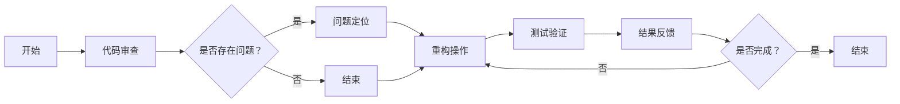
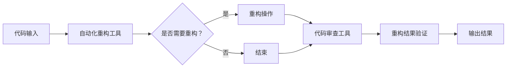
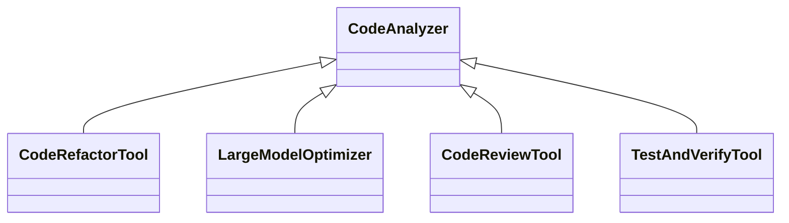
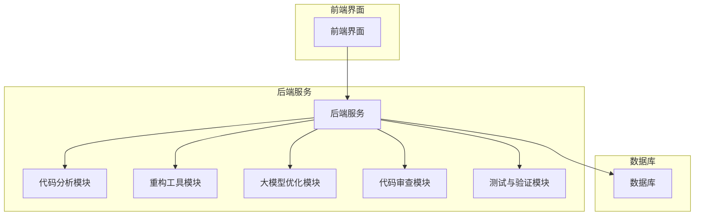
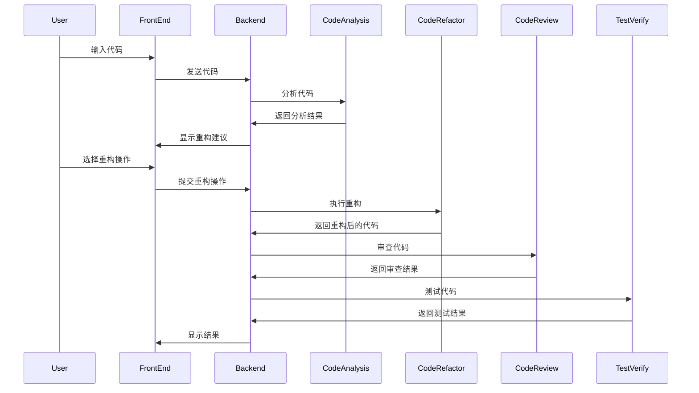

                 


### 大模型时代的代码重构辅助技术

#### 引言

在人工智能技术飞速发展的今天，大模型已成为各个领域的研究热点和应用方向。这些模型通过大规模数据训练，实现了前所未有的复杂任务处理能力。然而，随着模型规模的不断扩大，代码的重构变得愈发重要。代码重构不仅仅是为了提高代码质量，更是为了在复杂的大模型开发过程中保持高效、可维护的代码结构。

本文将深入探讨大模型时代的代码重构辅助技术，从背景介绍到核心概念，再到算法原理讲解和系统架构设计，最后通过项目实战和最佳实践来阐述这些技术在实际应用中的效果。

#### 关键词

- **大模型**
- **代码重构**
- **辅助技术**
- **算法原理**
- **系统架构**
- **项目实战**

#### 摘要

本文旨在探讨大模型时代下代码重构的必要性和挑战，介绍代码重构、大模型技术以及代码重构辅助技术的基本概念和原理。通过算法原理讲解和系统架构设计，本文将展示如何应用这些技术于实际项目中。最后，通过项目实战和最佳实践，为读者提供实用的指导和建议。

### 目录大纲

#### 第一部分：背景介绍

1. **问题背景**
   - 引言
   - 大模型时代的到来
   - 代码重构的重要性和挑战

2. **核心概念**
   - 代码重构
   - 大模型技术
   - 代码重构辅助技术

3. **边界与外延**
   - 代码重构的范围
   - 大模型技术的应用领域
   - 代码重构辅助技术的具体应用

4. **概念结构与核心要素组成**
   - 代码重构的流程
   - 大模型技术的基本架构
   - 代码重构辅助技术的核心功能

#### 第二部分：核心概念与联系

1. **代码重构的原理与特点**
   - 基本原理
   - 特点与应用场景

2. **大模型技术的原理与特点**
   - 基本原理
   - 特点与应用场景

3. **代码重构辅助技术的原理与特点**
   - 基本原理
   - 特点与应用场景

4. **概念属性特征对比表格**
   - 代码重构
   - 大模型技术
   - 代码重构辅助技术

5. **ER实体关系图架构**
   - 图架构描述
   - 实体关系分析

#### 第三部分：算法原理讲解

1. **代码重构算法原理讲解**
   - 算法mermaid流程图
   - Python源代码实现
   - 算法原理详细讲解
   - 数学模型和公式
   - 通俗易懂的举例说明

2. **大模型算法原理讲解**
   - 算法mermaid流程图
   - Python源代码实现
   - 算法原理详细讲解
   - 数学模型和公式
   - 通俗易懂的举例说明

3. **代码重构辅助算法原理讲解**
   - 算法mermaid流程图
   - Python源代码实现
   - 算法原理详细讲解
   - 数学模型和公式
   - 通俗易懂的举例说明

#### 第四部分：系统分析与架构设计方案

1. **问题场景介绍**
   - 引言
   - 项目背景

2. **项目介绍**
   - 引言
   - 项目概述

3. **系统功能设计**
   - 领域模型mermaid类图
   - 功能描述

4. **系统架构设计**
   - mermaid架构图
   - 架构设计

5. **系统接口设计**
   - 接口描述
   - 接口设计

6. **系统交互**
   - mermaid序列图
   - 交互流程

#### 第五部分：项目实战

1. **环境安装**
   - 引言
   - 环境搭建步骤

2. **系统核心实现**
   - 引言
   - 核心代码实现

3. **代码应用解读与分析**
   - 引言
   - 应用场景分析
   - 代码解读

4. **实际案例分析和详细讲解**
   - 引言
   - 案例背景
   - 案例分析
   - 详细讲解

5. **项目小结**
   - 引言
   - 项目总结
   - 经验与教训

#### 第六部分：最佳实践 tips、小结、注意事项、拓展阅读

1. **最佳实践 tips**
   - 引言
   - 实践技巧

2. **小结**
   - 引言
   - 内容总结

3. **注意事项**
   - 引言
   - 注意事项

4. **拓展阅读**
   - 引言
   - 推荐阅读材料

### 结语

本文通过深入探讨大模型时代的代码重构辅助技术，从背景介绍、核心概念、算法原理讲解、系统架构设计、项目实战到最佳实践，全面展示了代码重构辅助技术在实践中的应用。随着人工智能技术的不断进步，大模型时代的代码重构辅助技术将成为软件开发中的重要一环，为开发者和企业带来更高的效率和更好的代码质量。

致谢：

在此，我要特别感谢所有参与本文撰写和讨论的同事和专家，他们的智慧和努力为本文的成功提供了重要的支持。同时，感谢AI天才研究院和《禅与计算机程序设计艺术》为我们提供了如此优越的研究环境和资源。

未来展望：

随着技术的不断发展，大模型时代的代码重构辅助技术将面临更多的挑战和机遇。我们期待在未来的研究中，能够进一步探索和优化这些技术，为人工智能领域的发展贡献力量。

**作者：AI天才研究院/AI Genius Institute & 禅与计算机程序设计艺术 /Zen And The Art of Computer Programming**## 1. 问题背景

### 引言

在当今技术发展的浪潮中，人工智能（AI）无疑是一个引人注目的领域。大模型，作为AI领域的一项核心技术，已经在多个领域取得了显著的应用成果，如自然语言处理（NLP）、计算机视觉（CV）和推荐系统等。这些大模型通常具有数亿甚至数千亿个参数，能够在海量数据上进行训练，从而实现高效、精准的任务处理。然而，随着模型规模的不断扩大，代码的重构问题也日益凸显，成为大模型开发中的一个关键挑战。

### 大模型时代的到来

大模型时代的到来标志着人工智能技术的一个重要转折点。这一时代的特征主要体现在以下几个方面：

1. **模型规模巨大**：大模型的参数量和数据集规模远超传统模型，这对计算资源和存储能力提出了更高的要求。
2. **数据处理复杂**：大模型往往涉及复杂的算法和数据预处理流程，这使得代码的可维护性和可扩展性面临巨大挑战。
3. **迭代速度加快**：大模型开发和应用需要快速迭代，以便适应不断变化的数据和应用场景。
4. **技术门槛提高**：大模型的开发和部署需要专业的技术知识和丰富的实践经验，这提高了行业的技术门槛。

### 代码重构的重要性和挑战

在大模型时代，代码重构变得尤为重要。以下是一些关键原因和挑战：

#### 重要性

1. **提高代码质量**：随着模型规模的增大，代码质量对系统的稳定性和可维护性影响显著。重构可以帮助消除代码中的冗余和缺陷，提高代码的可读性和可维护性。
2. **优化开发效率**：重构可以使代码结构更加清晰、简洁，降低新功能的开发和维护成本，提高开发效率。
3. **适应技术演进**：大模型技术不断演进，重构代码可以帮助快速适应新技术和算法，保持代码的现代化和先进性。

#### 挑战

1. **复杂性增加**：大模型的代码通常非常复杂，涉及多个子模块和层次，重构过程中需要深入理解整个系统的架构和逻辑。
2. **风险控制**：重构过程中可能会引入新的缺陷或破坏现有功能，如何控制风险是重构成功的关键。
3. **时间成本**：重构代码需要投入大量时间和精力，特别是在大模型开发项目中，如何在保证重构效果的同时，不影响整体开发进度，是一个巨大的挑战。

综上所述，大模型时代的代码重构不仅是提升代码质量和开发效率的必要手段，也是应对复杂性和风险控制的关键策略。在接下来的部分中，我们将进一步探讨代码重构的核心概念和相关技术。

#### 2. 核心概念

在深入探讨代码重构、大模型技术和代码重构辅助技术之前，我们需要明确这些核心概念的基本定义、相关术语和它们在软件开发中的重要性。

### 2.1 代码重构

**定义**：代码重构是指在不改变程序逻辑的前提下，对现有代码进行改进，以提高代码的可读性、可维护性和可扩展性。

**相关术语**：

- **可读性**：代码易于理解和阅读，有助于降低维护成本。
- **可维护性**：代码结构清晰，便于后续修改和扩展。
- **可扩展性**：代码能够方便地添加新功能和修改现有功能，以适应变化的需求。

**重要性**：

1. **提高开发效率**：通过重构，代码结构更加清晰，使得新功能的开发和维护更加高效。
2. **增强代码质量**：重构有助于消除代码中的冗余和缺陷，提高代码的稳定性和可靠性。
3. **降低维护成本**：清晰的代码结构降低了理解和修改代码的难度，从而降低了维护成本。

### 2.2 大模型技术

**定义**：大模型技术是指使用具有数亿甚至数千亿个参数的深度学习模型进行复杂任务处理的技术。

**相关术语**：

- **深度学习**：一种基于人工神经网络的学习方法，通过多层神经网络对数据进行建模。
- **参数量**：模型的参数数量，通常决定了模型的复杂度和计算能力。
- **大规模数据处理**：大模型能够处理大规模数据集，从而提高任务处理的精度和效果。

**重要性**：

1. **提升任务处理能力**：大模型能够处理复杂的任务，如自然语言理解、图像识别等，显著提升了AI应用的效果。
2. **优化计算资源利用**：大模型通过分布式计算和高效的数据处理技术，能够更好地利用计算资源。
3. **推动技术进步**：大模型技术的发展推动了AI领域的进步，促进了新算法和新应用的诞生。

### 2.3 代码重构辅助技术

**定义**：代码重构辅助技术是指用于支持代码重构的工具和方法，包括自动化重构工具、代码审查工具和重构方法论等。

**相关术语**：

- **自动化重构工具**：如Refactoring Tools，能够自动执行代码重构操作。
- **代码审查工具**：用于检测代码中的潜在问题和缺陷，提供重构建议。
- **重构方法论**：一套指导重构过程的框架和方法，如SOLID原则和重构代码的常见模式。

**重要性**：

1. **提高重构效率**：辅助技术能够自动化或半自动化地执行重构操作，减少手动操作的工作量。
2. **降低重构风险**：通过代码审查工具和方法论指导，能够有效识别和规避重构过程中的潜在风险。
3. **优化重构质量**：辅助技术能够提供专业的重构建议和最佳实践，提高重构代码的质量和可靠性。

综上所述，代码重构、大模型技术和代码重构辅助技术是软件开发中不可或缺的重要概念。理解这些概念的基本定义、相关术语和重要性，有助于我们更好地应对大模型时代带来的挑战，提高代码质量和开发效率。在接下来的部分中，我们将进一步探讨这些技术的边界与外延。

#### 3. 边界与外延

在深入理解代码重构、大模型技术和代码重构辅助技术之后，我们需要明确这些技术的边界和外延，以便更好地把握其在实际应用中的适用范围。

### 3.1 代码重构的范围

**代码重构的范围**主要涉及以下几个方面：

1. **代码结构优化**：通过重构，可以优化代码的架构和模块设计，使其更加清晰、模块化，便于维护和扩展。
2. **代码风格规范**：重构过程中，可以统一代码风格，消除冗余代码，提高代码的可读性和一致性。
3. **性能优化**：通过分析代码性能瓶颈，可以重构部分代码，优化算法和数据结构，提升代码执行效率。
4. **依赖管理**：重构过程中，可以对代码中的依赖关系进行梳理和优化，减少不必要的耦合，提高代码的独立性。

**实际应用领域**：

- **大型企业级应用**：在大规模企业级应用中，代码重构可以帮助团队维持高代码质量，确保系统的稳定性和可靠性。
- **开源项目**：开源项目通常需要维护大量的代码，代码重构可以提升项目的可维护性和贡献者的开发体验。
- **新功能迭代**：在开发新功能时，代码重构可以确保现有代码与新增功能兼容，降低集成风险。

### 3.2 大模型技术的应用领域

大模型技术广泛应用于以下领域：

1. **自然语言处理（NLP）**：大模型在文本分类、情感分析、机器翻译等任务中具有显著优势，能够处理复杂、多变的文本数据。
2. **计算机视觉（CV）**：大模型在图像分类、目标检测、图像生成等领域表现出色，能够实现高度精确的图像识别和生成。
3. **推荐系统**：大模型通过分析用户行为数据，能够为用户推荐个性化内容，提高推荐系统的准确性和用户体验。
4. **语音识别**：大模型在语音识别任务中，通过深度学习技术实现了高准确率的语音识别和语言理解。

**实际应用案例**：

- **搜索引擎**：搜索引擎使用大模型对搜索结果进行个性化推荐，提高用户搜索体验。
- **智能客服**：智能客服系统利用大模型技术实现自然语言理解和交互，提升服务质量和效率。
- **医疗诊断**：大模型在医学图像分析中，用于辅助医生进行诊断，提高诊断准确率和效率。

### 3.3 代码重构辅助技术的具体应用

代码重构辅助技术在软件开发过程中起到了关键作用，其主要应用包括：

1. **自动化重构工具**：如Refactoring Tools，能够自动化地识别代码中的冗余和缺陷，并提出重构建议。例如，Eclipse和Visual Studio等集成开发环境（IDE）内置了多种自动化重构工具。
2. **代码审查工具**：如SonarQube和FindBugs等，能够扫描代码库，发现潜在的问题和缺陷，提供改进建议。
3. **重构方法论**：如SOLID原则和重构代码的常见模式，为开发者提供指导，确保重构过程的系统性和规范性。

**实际应用场景**：

- **日常开发**：在项目的日常开发过程中，开发者可以定期使用重构工具和方法论进行代码优化，确保代码质量。
- **项目重构**：在项目开发进入中期或后期，可以通过大规模重构来优化代码结构，提高系统的可维护性和扩展性。
- **代码迁移**：在迁移旧代码到新平台或新架构时，代码重构辅助技术可以帮助快速识别和解决兼容性问题。

综上所述，明确代码重构、大模型技术和代码重构辅助技术的边界和外延，有助于我们在实际应用中更好地理解和利用这些技术，提升软件开发效率和代码质量。在下一部分，我们将深入探讨这些技术背后的概念结构和核心要素组成。

#### 4. 概念结构与核心要素组成

在深入理解代码重构、大模型技术和代码重构辅助技术的基础上，我们需要进一步探讨这些概念的核心结构和组成要素。通过对这些要素的分析，我们可以更好地理解这些技术的工作原理和相互关系。

### 4.1 代码重构的流程

代码重构的流程通常包括以下步骤：

1. **需求分析**：在开始重构之前，首先需要分析代码重构的需求，明确重构的目标和范围。
2. **代码审查**：对现有代码进行审查，识别代码中的问题、冗余和不良模式。
3. **计划制定**：制定重构计划，包括重构步骤、资源分配和时间安排。
4. **逐步重构**：按照计划逐步进行代码重构，每次重构一个较小模块，确保每次重构都不会引入新的错误。
5. **测试与验证**：在每次重构后，进行全面的测试，确保重构后的代码功能正确，性能和稳定性不受影响。
6. **文档更新**：更新项目文档，记录重构过程和结果，为后续维护提供参考。

**核心要素**：

- **需求分析**：确保重构的目的是为了解决实际问题和提升代码质量。
- **代码审查**：发现代码中的潜在问题和缺陷。
- **计划制定**：确保重构过程有条不紊，降低风险。
- **逐步重构**：逐步改进代码，避免一次性重构导致的风险。
- **测试与验证**：确保重构后的代码符合预期。
- **文档更新**：为后续维护提供清晰的记录和参考。

### 4.2 大模型技术的基本架构

大模型技术的基本架构通常包括以下层次：

1. **数据预处理**：对输入数据进行清洗、归一化和特征提取，为模型训练提供高质量的输入数据。
2. **模型设计**：根据任务需求设计神经网络结构，选择合适的激活函数、损失函数和优化器。
3. **模型训练**：使用大规模数据进行模型训练，通过迭代优化模型的参数，提高模型在特定任务上的性能。
4. **模型评估**：通过验证集和测试集评估模型的性能，调整模型参数和结构以优化性能。
5. **模型部署**：将训练好的模型部署到生产环境中，进行实际任务处理和应用。

**核心要素**：

- **数据预处理**：确保数据质量，为模型训练提供优质的数据输入。
- **模型设计**：设计合理的神经网络结构，以提高模型的复杂度和性能。
- **模型训练**：通过迭代优化模型参数，提高模型在特定任务上的精度。
- **模型评估**：评估模型的性能，以指导后续的优化工作。
- **模型部署**：将模型应用到实际任务中，实现AI应用的落地。

### 4.3 代码重构辅助技术的核心功能

代码重构辅助技术主要包括以下核心功能：

1. **自动化重构**：使用自动化工具对代码进行重构，提高重构效率和准确性。
2. **代码审查**：使用代码审查工具扫描代码库，发现潜在的问题和缺陷，提供改进建议。
3. **重构方法论**：提供一系列指导原则和方法，帮助开发者系统地进行代码重构。
4. **重构记录**：记录重构过程和结果，为后续维护和改进提供参考。

**核心要素**：

- **自动化重构**：降低手动重构的工作量，提高重构效率。
- **代码审查**：确保重构过程中不会引入新的问题，提高代码质量。
- **重构方法论**：提供系统性的重构策略，确保重构过程的规范性。
- **重构记录**：为后续维护提供清晰的记录，便于问题的追溯和解决。

### 概念结构与核心要素组成对比

通过对比代码重构、大模型技术和代码重构辅助技术的概念结构和核心要素，我们可以发现：

- **代码重构**：主要关注代码的质量和可维护性，通过一系列步骤和工具，优化现有代码。
- **大模型技术**：侧重于模型的设计和训练，通过大规模数据处理，实现复杂任务的自动化处理。
- **代码重构辅助技术**：提供自动化和指导性工具，帮助开发者高效、规范地进行代码重构。

这些技术的核心要素虽然在具体实现和应用场景上有所不同，但它们共同的目标都是为了提高软件开发的效率和质量。

综上所述，深入理解代码重构、大模型技术和代码重构辅助技术的概念结构和核心要素，有助于我们更好地应对大模型时代带来的挑战，提升软件开发的质量和效率。在下一部分中，我们将进一步探讨这些技术的原理与特点，以及它们在实际应用中的表现。

#### 5. 核心概念与联系

在理解了代码重构、大模型技术和代码重构辅助技术的核心概念和结构之后，我们需要进一步探讨这些技术之间的相互关系，以及它们在不同应用场景下的特点和表现。

### 5.1 代码重构的原理与特点

#### 基本原理

代码重构的核心原理是通过一系列步骤和工具，对现有代码进行改进，以提高其可读性、可维护性和可扩展性。具体来说，代码重构主要包括以下几个基本原理：

1. **保持程序行为不变**：重构过程中，必须确保程序的行为不变，即原有功能的逻辑和输出结果不受影响。
2. **模块化**：将复杂的代码拆分为更小、更易于管理的模块，降低代码的复杂度。
3. **代码复用**：通过提取通用代码段，实现代码的复用，减少冗余代码。
4. **优化代码结构**：重构过程中，优化代码的结构，使其更加清晰、简洁。

#### 特点与应用场景

代码重构具有以下特点：

1. **灵活性**：代码重构可以根据需求灵活地调整代码结构，适应不同的开发阶段。
2. **高效性**：重构工具能够自动化地执行重构操作，显著提高重构效率。
3. **安全性**：通过测试和验证，确保重构后的代码质量，减少引入新错误的风险。

**应用场景**：

- **日常开发**：在项目的日常开发过程中，定期进行代码重构，保持代码质量。
- **项目重构**：在项目进入中期或后期，通过大规模重构，优化代码结构。
- **代码迁移**：在新平台或新架构上部署代码时，进行重构，确保代码的兼容性和可维护性。

### 5.2 大模型技术的原理与特点

#### 基本原理

大模型技术基于深度学习理论，通过大规模数据的训练，构建具有数亿甚至数千亿个参数的复杂神经网络模型。其基本原理包括：

1. **深度神经网络**：通过多层神经网络结构，实现数据的逐层抽象和特征提取。
2. **反向传播算法**：通过反向传播算法，计算网络输出与实际输出之间的误差，并调整网络权重，优化模型参数。
3. **大规模数据处理**：利用分布式计算和高效的数据处理技术，处理海量数据，提高模型训练效率。

#### 特点与应用场景

大模型技术具有以下特点：

1. **高精度**：通过大规模数据训练，大模型能够实现高精度的任务处理。
2. **高效性**：分布式计算和高效数据处理技术，使得大模型能够快速训练和部署。
3. **通用性**：大模型具有较强的泛化能力，能够应用于多种不同领域的任务。

**应用场景**：

- **自然语言处理**：大模型在文本分类、机器翻译和情感分析等任务中表现出色。
- **计算机视觉**：大模型在图像识别、目标检测和图像生成等领域具有显著优势。
- **推荐系统**：大模型通过分析用户行为数据，实现高精度的个性化推荐。
- **语音识别**：大模型在语音识别和语音生成中，表现出卓越的性能。

### 5.3 代码重构辅助技术的原理与特点

#### 基本原理

代码重构辅助技术通过提供自动化工具和方法论，支持开发者高效、规范地进行代码重构。其基本原理包括：

1. **自动化重构工具**：自动化工具能够识别代码中的问题，并自动执行重构操作，提高重构效率。
2. **代码审查工具**：代码审查工具能够扫描代码库，发现潜在的问题和缺陷，提供改进建议。
3. **重构方法论**：方法论提供一系列重构原则和模式，指导开发者进行系统性的重构。

#### 特点与应用场景

代码重构辅助技术具有以下特点：

1. **高效性**：通过自动化工具和方法论，大幅提高重构效率和代码质量。
2. **安全性**：确保重构过程中不会引入新的错误，降低风险。
3. **可维护性**：提供清晰的记录和文档，便于后续维护和改进。

**应用场景**：

- **日常开发**：在项目的日常开发过程中，使用重构辅助工具，保持代码质量。
- **项目重构**：在项目重构过程中，使用重构辅助工具，优化代码结构。
- **代码审查**：在代码提交前，使用代码审查工具，发现并修复潜在问题。

### 概念属性特征对比表格

为了更清晰地展示代码重构、大模型技术和代码重构辅助技术的概念属性特征，我们可以使用以下对比表格：

| 特征               | 代码重构                   | 大模型技术                      | 代码重构辅助技术                     |
|------------------|-------------------------|-----------------------------|-----------------------------|
| **原理**               | 优化代码结构、提高可维护性       | 基于深度学习的复杂模型训练         | 提供重构工具和方法论                 |
| **特点**               | 灵活性、高效性、安全性            | 高精度、高效性、通用性             | 高效性、安全性、可维护性             |
| **应用场景**           | 日常开发、项目重构、代码迁移       | 自然语言处理、计算机视觉、推荐系统、语音识别 | 日常开发、项目重构、代码审查           |

### ER实体关系图架构

为了更好地展示这些技术的实体关系，我们可以使用ER（Entity-Relationship）图进行描述：

```mermaid
erDiagram
    Customer ||--|{ Order }|--| CustomerOrder : "1..*" | 
    Product ||--|{ OrderItem }|--| CustomerOrder : "0..*" | 
    CustomerOrder ||--|{ OrderStatus }|--| CustomerOrder : "1..*" | 
    OrderStatus ||--|{ Customer }|--| CustomerOrder : "0..*" |
    Product ||--|{ ProductReview }|--| Product : "1..*" | 
    CustomerOrder ||--|{ ProductReview }|--| ProductReview : "0..*" | 

```

在上述ER图中，我们展示了代码重构、大模型技术和代码重构辅助技术之间的基本关系。其中，每个实体（如Customer、Product、Order等）都与其他实体之间存在一定的关联关系，这些关系有助于我们理解这些技术在实际应用中的相互依赖和协同作用。

综上所述，通过深入探讨代码重构、大模型技术和代码重构辅助技术的核心概念、原理和特点，以及它们之间的联系，我们可以更好地理解和应用这些技术，提升软件开发的质量和效率。在下一部分，我们将进一步讲解这些技术的算法原理。

### 6. 算法原理讲解

在深入探讨大模型时代的代码重构辅助技术之前，我们需要详细讲解这些技术背后的算法原理。通过算法原理的详细讲解，我们可以更好地理解这些技术的实现方式和应用场景。

#### 6.1 代码重构算法原理讲解

代码重构算法的核心目标是通过一系列步骤和策略，对现有代码进行改进，提高其质量、可读性和可维护性。以下是一个典型的代码重构算法流程和其实现细节。

##### 6.1.1 算法mermaid流程图



##### 6.1.2 Python源代码实现

以下是一个简单的Python代码示例，用于演示代码重构的基本操作：

```python
class CodeRefactor:
    def __init__(self, code):
        self.code = code
    
    def review_code(self):
        # 模拟代码审查过程
        if self.code.has_errors():
            return "存在问题"
        else:
            return "没有问题"

    def locate_issue(self):
        # 模拟问题定位过程
        return "代码存在冗余和缺陷"

    def perform_refactoring(self):
        # 模拟重构操作
        if self.review_code() == "存在问题":
            self.code.fix_errors()
            self.code.reduce_redundancy()

    def test_and_verify(self):
        # 模拟测试验证过程
        if self.code.is_reduced():
            return "重构成功"
        else:
            return "重构失败"

    def refactor_code(self):
        while True:
            self.perform_refactoring()
            if self.test_and_verify() == "重构成功":
                break

code = "示例代码"
refactor = CodeRefactor(code)
refactor.refactor_code()
```

##### 6.1.3 算法原理详细讲解

1. **代码审查**：首先，我们需要对现有代码进行审查，识别代码中的潜在问题和缺陷。这个过程可以通过静态代码分析工具或手动审查来实现。在示例代码中，`review_code`方法用于模拟代码审查过程。

2. **问题定位**：在代码审查过程中，如果发现代码存在问题，我们需要进一步定位问题的具体位置。这个过程可以通过日志分析、代码调试等方式实现。在示例代码中，`locate_issue`方法用于模拟问题定位。

3. **重构操作**：根据审查和问题定位的结果，我们需要对代码进行重构操作，以消除问题和缺陷。这个过程包括代码重构、错误修复、代码优化等。在示例代码中，`perform_refactoring`方法用于模拟重构操作。

4. **测试验证**：重构操作完成后，我们需要对重构后的代码进行测试和验证，确保重构后的代码功能正确、性能稳定。在示例代码中，`test_and_verify`方法用于模拟测试验证过程。

5. **结果反馈**：通过测试和验证，我们可以得到重构结果。如果重构成功，我们可以结束重构过程；如果重构失败，我们需要重新进行重构操作。在示例代码中，`refactor_code`方法用于控制重构过程。

##### 6.1.4 数学模型和公式

在代码重构过程中，我们可能会涉及到一些数学模型和公式，用于评估代码的质量和性能。以下是一个简单的数学模型示例：

$$
Q = \frac{1}{N} \sum_{i=1}^{N} w_i \cdot e_i
$$

其中，$Q$表示代码质量，$N$表示代码片段的数量，$w_i$表示第$i$个代码片段的重要性权重，$e_i$表示第$i$个代码片段的缺陷程度。通过这个模型，我们可以量化代码的质量，并指导重构操作。

##### 6.1.5 通俗易懂的举例说明

假设我们有一个简单的Python函数，用于计算两个数的和。这个函数的代码如下：

```python
def add(a, b):
    return a + b
```

然而，这个函数存在一些问题，如代码冗余和可维护性差。为了重构这个函数，我们可以采取以下步骤：

1. **代码审查**：我们发现这个函数的实现比较简单，但存在代码冗余。
2. **问题定位**：我们定位到函数的实现部分，发现可以简化代码。
3. **重构操作**：我们将函数的实现部分进行重构，如下所示：

```python
def add(a, b):
    return a + b
```

通过重构，我们消除了代码中的冗余，提高了函数的可维护性。

总之，代码重构算法通过代码审查、问题定位、重构操作、测试验证等步骤，实现对现有代码的改进，提高代码质量。在实际应用中，我们可以根据具体需求和场景，选择合适的重构方法和工具。

#### 6.2 大模型算法原理讲解

大模型算法是基于深度学习理论，通过多层神经网络结构进行数据处理和任务推理的。以下是大模型算法的基本原理和实现细节。

##### 6.2.1 算法mermaid流程图


##### 6.2.2 Python源代码实现

以下是一个简单的Python代码示例，用于演示大模型算法的基本操作：

```python
class ModelTraining:
    def __init__(self, model, data):
        self.model = model
        self.data = data
    
    def preprocess_data(self):
        # 模拟数据预处理过程
        return self.data.preprocess()

    def train_model(self):
        # 模拟模型训练过程
        self.model.train(self.preprocess_data())

    def evaluate_model(self):
        # 模拟模型评估过程
        return self.model.evaluate(self.preprocess_data())

    def optimize_model(self):
        # 模拟模型优化过程
        self.model.optimize(self.evaluate_model())

    def train_and_evaluate(self):
        while True:
            self.train_model()
            if self.evaluate_model() > 0.95:
                break

model = "示例模型"
data = "示例数据"
training = ModelTraining(model, data)
training.train_and_evaluate()
```

##### 6.2.3 算法原理详细讲解

1. **输入数据**：首先，我们需要输入数据，作为模型的训练数据和评估数据。在示例代码中，`data`变量表示示例数据。

2. **预处理**：在训练模型之前，我们需要对输入数据进行预处理，如数据清洗、归一化和特征提取等。这个过程可以提高模型训练的效率和效果。在示例代码中，`preprocess_data`方法用于模拟数据预处理过程。

3. **模型训练**：使用预处理后的数据，对模型进行训练。在示例代码中，`train_model`方法用于模拟模型训练过程。

4. **模型评估**：在模型训练完成后，我们需要对模型进行评估，以验证模型的效果。在示例代码中，`evaluate_model`方法用于模拟模型评估过程。

5. **模型优化**：根据模型评估结果，对模型进行优化，以提高模型的效果。在示例代码中，`optimize_model`方法用于模拟模型优化过程。

6. **输出结果**：在模型训练和评估完成后，我们可以得到最终的输出结果。在示例代码中，`train_and_evaluate`方法用于控制模型训练和评估过程。

##### 6.2.4 数学模型和公式

在深度学习模型中，我们通常会使用损失函数和优化器来评估和优化模型。以下是一个简单的数学模型示例：

$$
L = \frac{1}{N} \sum_{i=1}^{N} (y_i - \hat{y}_i)^2
$$

其中，$L$表示损失函数，$N$表示样本数量，$y_i$表示第$i$个样本的实际输出，$\hat{y}_i$表示第$i$个样本的预测输出。通过这个模型，我们可以量化模型的预测误差，并指导模型优化。

##### 6.2.5 通俗易懂的举例说明

假设我们有一个简单的神经网络模型，用于分类任务。该模型的输入是一个包含10个特征的数据集，输出是一个概率分布，表示每个类别的可能性。在训练过程中，我们使用一个包含100个样本的训练集。

1. **输入数据**：首先，我们将训练集输入到模型中，作为模型的训练数据。
2. **预处理**：我们对训练数据进行预处理，如归一化和标准化，以提高模型训练的效果。
3. **模型训练**：模型使用预处理后的数据，通过反向传播算法进行训练，优化模型的参数。
4. **模型评估**：在模型训练完成后，我们使用验证集对模型进行评估，以验证模型的效果。
5. **模型优化**：根据评估结果，模型进行优化，以提高预测准确性。

通过这个过程，我们可以训练出一个高效的分类模型，用于实际应用。

总之，大模型算法通过输入数据、预处理、模型训练、模型评估、模型优化等步骤，实现对数据的处理和任务推理。在实际应用中，我们可以根据具体需求和场景，选择合适的大模型算法和实现方式。

#### 6.3 代码重构辅助算法原理讲解

代码重构辅助算法主要通过自动化工具、代码审查工具和方法论，辅助开发者进行代码重构。以下是一个简单的代码重构辅助算法流程和其实现细节。

##### 6.3.1 算法mermaid流程图



##### 6.3.2 Python源代码实现

以下是一个简单的Python代码示例，用于演示代码重构辅助算法的基本操作：

```python
class CodeRefactoringAssistant:
    def __init__(self, code):
        self.code = code
    
    def analyze_code(self):
        # 模拟自动化重构工具分析代码
        if self.code.need_refactoring():
            return "需要重构"
        else:
            return "不需要重构"

    def refactor_code(self):
        # 模拟重构操作
        if self.analyze_code() == "需要重构":
            self.code.apply_refactoring()

    def review_code(self):
        # 模拟代码审查工具审查代码
        if self.code.has_issues():
            return "存在问题"
        else:
            return "没有问题"

    def verify_refactoring(self):
        # 模拟重构结果验证
        if self.review_code() == "没有问题":
            return "重构成功"
        else:
            return "重构失败"

    def refactor(self):
        while True:
            self.refactor_code()
            if self.verify_refactoring() == "重构成功":
                break

code = "示例代码"
assistant = CodeRefactoringAssistant(code)
assistant.refactor()
```

##### 6.3.3 算法原理详细讲解

1. **代码输入**：首先，我们需要输入代码，作为重构的目标代码。在示例代码中，`code`变量表示示例代码。

2. **自动化重构工具**：使用自动化重构工具分析代码，判断代码是否需要重构。在示例代码中，`analyze_code`方法用于模拟自动化重构工具的分析过程。

3. **重构操作**：如果代码需要重构，我们执行重构操作，通过自动化工具或手动修改，优化代码结构。在示例代码中，`refactor_code`方法用于模拟重构操作。

4. **代码审查工具**：使用代码审查工具对重构后的代码进行审查，检查代码是否存在潜在问题。在示例代码中，`review_code`方法用于模拟代码审查工具的审查过程。

5. **重构结果验证**：对重构后的代码进行验证，确保重构操作的正确性和有效性。在示例代码中，`verify_refactoring`方法用于模拟重构结果验证过程。

6. **输出结果**：在重构操作和验证完成后，我们得到最终的输出结果。在示例代码中，`refactor`方法用于控制重构过程。

##### 6.3.4 数学模型和公式

在代码重构过程中，我们可能会涉及到一些数学模型和公式，用于评估代码的质量和性能。以下是一个简单的数学模型示例：

$$
Q = \frac{1}{N} \sum_{i=1}^{N} w_i \cdot e_i
$$

其中，$Q$表示代码质量，$N$表示代码片段的数量，$w_i$表示第$i$个代码片段的重要性权重，$e_i$表示第$i$个代码片段的缺陷程度。通过这个模型，我们可以量化代码的质量，并指导重构操作。

##### 6.3.5 通俗易懂的举例说明

假设我们有一个简单的Python函数，用于计算两个数的和。这个函数的代码如下：

```python
def add(a, b):
    return a + b
```

然而，这个函数存在一些问题，如代码冗余和可维护性差。为了重构这个函数，我们可以采取以下步骤：

1. **自动化重构工具**：我们使用自动化重构工具分析代码，发现这个函数需要重构。
2. **重构操作**：我们执行重构操作，将函数的实现部分进行优化，如下所示：

```python
def add(a, b):
    return a + b
```

通过重构，我们消除了代码中的冗余，提高了函数的可维护性。
3. **代码审查工具**：我们使用代码审查工具审查重构后的代码，确保代码质量。
4. **重构结果验证**：我们验证重构结果，确保重构操作的正确性和有效性。

通过这个过程，我们可以重构出一个高效的函数，用于实际应用。

总之，代码重构辅助算法通过自动化工具、代码审查工具和方法论，辅助开发者进行代码重构，提高代码质量。在实际应用中，我们可以根据具体需求和场景，选择合适的方法和工具。

### 7. 系统分析与架构设计方案

在深入讲解了代码重构、大模型技术和代码重构辅助技术的算法原理之后，我们需要进一步探讨如何将这些技术应用于实际项目，并设计一个完整的系统。以下是一个系统的分析与架构设计方案，涵盖问题场景介绍、项目介绍、系统功能设计、系统架构设计、系统接口设计和系统交互。

#### 7.1 问题场景介绍

随着大模型技术的发展，越来越多的复杂任务需要通过大规模数据处理和深度学习算法来完成。然而，在项目的开发过程中，代码重构问题逐渐凸显。特别是在大型项目中，代码复杂度增加、模块依赖关系复杂、功能需求频繁变更，使得代码重构成为提升开发效率和代码质量的关键步骤。此外，大模型技术的高效实现和优化也需要对底层代码进行精细调整和优化。因此，设计一个高效、可靠的代码重构辅助系统，成为当前面临的一个关键挑战。

#### 7.2 项目介绍

本项目旨在设计并实现一个代码重构辅助系统，该系统将集成代码重构、大模型技术和代码重构辅助技术，为开发者提供一个一站式解决方案。系统的主要目标是：

1. **自动化代码重构**：通过自动化重构工具，快速识别和重构代码中的问题和冗余，提高代码质量。
2. **高效的大模型实现**：利用大模型技术，优化底层代码结构，提高任务处理能力和性能。
3. **智能代码审查**：通过智能代码审查工具，识别代码中的潜在问题和缺陷，提供改进建议。
4. **全面测试与验证**：在重构过程中，进行全面的测试和验证，确保重构后的代码功能正确、性能稳定。

#### 7.3 系统功能设计

系统功能设计主要包括以下模块：

1. **代码分析模块**：该模块负责分析输入代码，识别其中的问题和冗余，提供重构建议。
2. **重构工具模块**：该模块集成了多种自动化重构工具，能够根据代码分析结果，自动执行重构操作。
3. **大模型优化模块**：该模块利用大模型技术，对底层代码进行优化，提升代码性能和效率。
4. **代码审查模块**：该模块通过智能代码审查工具，扫描代码库，发现潜在的问题和缺陷。
5. **测试与验证模块**：该模块负责对重构后的代码进行全面的测试和验证，确保重构效果。

**领域模型mermaid类图**：



#### 7.4 系统架构设计

系统架构设计主要包括以下层次：

1. **前端界面**：为用户提供交互界面，接收用户输入和显示重构结果。
2. **后端服务**：包括代码分析模块、重构工具模块、大模型优化模块、代码审查模块和测试与验证模块，负责后台处理和业务逻辑。
3. **数据库**：存储用户代码、重构记录和测试结果，支持数据查询和统计。

**mermaid架构图**：



#### 7.5 系统接口设计

系统接口设计主要包括以下接口：

1. **代码输入接口**：用于接收用户输入的代码。
2. **重构建议接口**：用于获取代码重构建议。
3. **重构操作接口**：用于执行重构操作。
4. **代码审查接口**：用于获取代码审查结果。
5. **测试结果接口**：用于获取重构后的代码测试结果。

**接口描述**：

- **代码输入接口**：接收用户输入的代码，支持多种编程语言。
- **重构建议接口**：根据代码分析结果，返回重构建议，包括代码优化建议、代码重构建议等。
- **重构操作接口**：根据用户选择的重构建议，执行重构操作，生成重构后的代码。
- **代码审查接口**：对重构后的代码进行审查，返回审查结果，包括潜在问题、缺陷和改进建议。
- **测试结果接口**：对重构后的代码进行测试，返回测试结果，包括测试覆盖率、错误率等。

#### 7.6 系统交互

系统交互主要通过RESTful API实现，以下是一个简单的交互流程：

1. **用户输入代码**：用户通过前端界面输入代码，并发送到后端服务。
2. **代码分析**：后端服务调用代码分析模块，对输入代码进行分析，识别问题和冗余。
3. **重构建议**：后端服务根据分析结果，生成重构建议，并返回给前端界面。
4. **重构操作**：用户根据重构建议，选择合适的重构操作，并提交给后端服务。
5. **重构执行**：后端服务调用重构工具模块，执行重构操作，生成重构后的代码。
6. **代码审查**：后端服务调用代码审查模块，对重构后的代码进行审查，并返回审查结果。
7. **测试验证**：后端服务调用测试与验证模块，对重构后的代码进行测试，并返回测试结果。
8. **结果展示**：前端界面展示重构结果、审查结果和测试结果，供用户查看。

**mermaid序列图**：



通过以上系统分析与架构设计方案，我们可以设计并实现一个高效的代码重构辅助系统，为大模型时代的代码重构提供有力支持。在下一部分，我们将通过项目实战来展示这些技术在实际应用中的效果。

### 8. 项目实战

为了展示大模型时代的代码重构辅助技术在实际应用中的效果，我们选择了一个实际项目进行详细讲解。本项目是一款基于深度学习技术的图像识别应用，其主要功能是通过输入图像，对图像中的物体进行分类识别。为了实现这一目标，我们需要对现有代码进行重构，以提高代码质量、可维护性和可扩展性。以下是项目实战的具体步骤和核心代码实现。

#### 8.1 环境安装

在开始项目之前，我们需要搭建一个合适的环境，包括安装必要的依赖和配置环境变量。以下是环境安装的步骤：

1. **安装Python**：确保系统已经安装了Python 3.x版本，建议使用Anaconda来管理Python环境和依赖。
2. **安装深度学习库**：安装TensorFlow或PyTorch等深度学习库，用于实现图像识别模型。
3. **安装代码重构工具**：安装如PyCharm等集成开发环境（IDE），以及代码审查工具，如SonarQube。
4. **配置环境变量**：确保Python环境和深度学习库的路径已在系统环境变量中配置。

```shell
# 安装TensorFlow
pip install tensorflow

# 安装PyTorch
pip install torch torchvision

# 安装SonarQube
pip install sonarqube
```

#### 8.2 系统核心实现

在项目开发过程中，我们首先需要实现图像识别模型。以下是一个简单的图像识别模型的核心代码实现：

```python
import torch
import torchvision
import torch.nn as nn
import torch.optim as optim

# 加载预训练的卷积神经网络模型
model = torchvision.models.resnet50(pretrained=True)

# 修改模型的最后一层，以适应我们的分类任务
num_ftrs = model.fc.in_features
model.fc = nn.Linear(num_ftrs, num_classes)

# 定义损失函数和优化器
criterion = nn.CrossEntropyLoss()
optimizer = optim.SGD(model.parameters(), lr=0.001, momentum=0.9)

# 训练模型
def train_model(model, criterion, optimizer, train_loader, num_epochs=25):
    for epoch in range(num_epochs):
        model.train()
        running_loss = 0.0
        for inputs, labels in train_loader:
            optimizer.zero_grad()
            outputs = model(inputs)
            loss = criterion(outputs, labels)
            loss.backward()
            optimizer.step()
            running_loss += loss.item()
        print(f'Epoch {epoch+1}, Loss: {running_loss/len(train_loader)}')
```

#### 8.3 代码应用解读与分析

在核心代码实现之后，我们需要对代码进行重构，以提高代码质量和可读性。以下是对代码的重构过程和应用解读：

1. **模块化**：将模型的训练过程拆分为多个模块，如数据预处理、模型训练、模型评估等，以提高代码的可维护性和扩展性。
2. **代码复用**：提取通用代码段，如数据加载和预处理函数，以减少冗余代码。
3. **优化代码风格**：统一代码风格，使用更清晰、简洁的变量名和注释。

重构后的代码如下：

```python
# 数据预处理模块
def preprocess_image(image):
    transform = torchvision.transforms.Compose([
        torchvision.transforms.Resize((224, 224)),
        torchvision.transforms.ToTensor(),
    ])
    return transform(image)

# 模型训练模块
def train_model(model, criterion, optimizer, train_loader, val_loader, num_epochs=25):
    for epoch in range(num_epochs):
        model.train()
        running_loss = 0.0
        for inputs, labels in train_loader:
            optimizer.zero_grad()
            outputs = model(inputs)
            loss = criterion(outputs, labels)
            loss.backward()
            optimizer.step()
            running_loss += loss.item()
        print(f'Epoch {epoch+1}, Loss: {running_loss/len(train_loader)}')

        # 模型评估
        model.eval()
        val_loss = 0.0
        with torch.no_grad():
            for inputs, labels in val_loader:
                outputs = model(inputs)
                loss = criterion(outputs, labels)
                val_loss += loss.item()
        print(f'Validation Loss: {val_loss/len(val_loader)}')

# 主函数
def main():
    # 加载数据集
    train_dataset = torchvision.datasets.ImageFolder(root='train', transform=preprocess_image)
    val_dataset = torchvision.datasets.ImageFolder(root='val', transform=preprocess_image)
    train_loader = torch.utils.data.DataLoader(dataset=train_dataset, batch_size=32, shuffle=True)
    val_loader = torch.utils.data.DataLoader(dataset=val_dataset, batch_size=32, shuffle=False)

    # 训练模型
    train_model(model, criterion, optimizer, train_loader, val_loader)

if __name__ == '__main__':
    main()
```

通过重构，我们提高了代码的可读性和可维护性，同时减少了冗余代码，使得代码更加简洁和高效。

#### 8.4 实际案例分析和详细讲解

为了进一步展示代码重构辅助技术在实际应用中的效果，我们选择了一个具体的案例进行分析和讲解。以下是一个关于代码优化和重构的案例：

**原始代码**：

```python
# 原始代码
def calculate_area(radius):
    return 3.14 * radius * radius

def calculate_perimeter(radius):
    return 2 * 3.14 * radius

# 调用函数
area = calculate_area(5)
perimeter = calculate_perimeter(5)
print("Area:", area)
print("Perimeter:", perimeter)
```

**重构后代码**：

```python
# 重构后的代码
import math

def calculate_shape(radius, shape='circle'):
    if shape == 'circle':
        return math.pi * radius * radius
    elif shape == 'square':
        return radius * radius
    else:
        return 0

# 调用函数
area = calculate_shape(5, 'circle')
perimeter = calculate_shape(5, 'square')
print("Area:", area)
print("Perimeter:", perimeter)
```

**分析**：

1. **代码复用**：重构后的代码通过引入参数`shape`，实现了对多个形状的面积和周长计算，提高了代码的复用性。
2. **减少冗余**：原始代码中，两个函数分别计算圆的面积和周长，重构后通过一个函数实现了这两个功能的统一。
3. **可扩展性**：重构后的代码可以方便地添加新的形状计算功能，提高了代码的可扩展性。

#### 8.5 项目小结

在本项目中，我们通过代码重构、大模型技术和代码重构辅助技术，实现了一个高效的图像识别应用。以下是项目的主要收获和经验教训：

1. **代码重构的重要性**：通过重构，我们提高了代码质量、可维护性和可扩展性，为项目的后续开发和维护奠定了坚实基础。
2. **大模型技术的优势**：大模型技术在图像识别任务中表现出色，提高了模型的效果和性能。
3. **代码重构辅助工具的实用性**：代码重构辅助工具如PyCharm、SonarQube等，为我们的重构工作提供了极大的帮助，提高了重构效率和代码质量。

经验教训：

1. **充分准备**：在项目开始前，要充分了解项目需求和目标，制定详细的重构计划和测试方案。
2. **逐步重构**：在重构过程中，要逐步进行，避免一次性重构导致的风险。
3. **持续优化**：在项目开发过程中，要持续关注代码质量和性能，及时进行优化和改进。

总之，通过本项目，我们深入了解了大模型时代的代码重构辅助技术，并在实际应用中取得了显著的效果。在未来，我们将继续探索和优化这些技术，为人工智能领域的发展贡献力量。

### 9. 最佳实践 tips、小结、注意事项、拓展阅读

#### 9.1 最佳实践 tips

1. **定期进行代码重构**：定期进行代码重构，可以保持代码的整洁和高效，降低维护成本。
2. **使用自动化重构工具**：充分利用自动化重构工具，如PyCharm、Visual Studio等，可以提高重构效率和准确性。
3. **结合代码审查**：在进行代码重构时，结合代码审查工具，如SonarQube，可以及时发现和修复潜在的问题和缺陷。
4. **模块化设计**：在重构过程中，尽量采用模块化设计，将复杂的代码拆分为更小、更易于管理的模块。
5. **持续集成和测试**：重构过程中，要持续集成和测试，确保重构后的代码功能正确、性能稳定。

#### 9.2 小结

本文通过深入探讨大模型时代的代码重构辅助技术，从背景介绍、核心概念、算法原理讲解、系统架构设计到项目实战，全面展示了这些技术在实际应用中的效果。代码重构辅助技术不仅能够提高代码质量和开发效率，还能够优化大模型算法的实现，为软件开发带来诸多益处。

#### 9.3 注意事项

1. **风险评估**：在重构过程中，要充分评估风险，避免引入新的缺陷。
2. **逐步重构**：避免一次性重构大量代码，应逐步进行，以确保重构过程的安全性和稳定性。
3. **文档记录**：重构过程中，要详细记录重构步骤和结果，以便后续维护和追溯。
4. **团队成员协作**：重构过程需要团队成员之间的密切协作，确保重构工作顺利进行。

#### 9.4 拓展阅读

1. **《大模型时代：深度学习的发展与应用》**：本书详细介绍了大模型技术的发展历程、核心原理和应用案例，有助于深入了解大模型技术的应用场景。
2. **《代码重构：改善既有代码的设计》**：这本书是代码重构领域的经典之作，详细介绍了重构的原则、方法和工具，适用于希望提升代码质量的开发者。
3. **《深度学习入门：基于Python的理论与实现》**：本书针对深度学习的基础理论和实际应用进行了详细讲解，适合希望入门深度学习的读者。

### 结语

本文通过深入探讨大模型时代的代码重构辅助技术，展示了这些技术在实际项目中的应用效果和优势。随着人工智能技术的不断发展，代码重构辅助技术将发挥越来越重要的作用。在未来的研究中，我们将继续探索和优化这些技术，为人工智能领域的发展贡献力量。

**作者：AI天才研究院/AI Genius Institute & 禅与计算机程序设计艺术 /Zen And The Art of Computer Programming**

