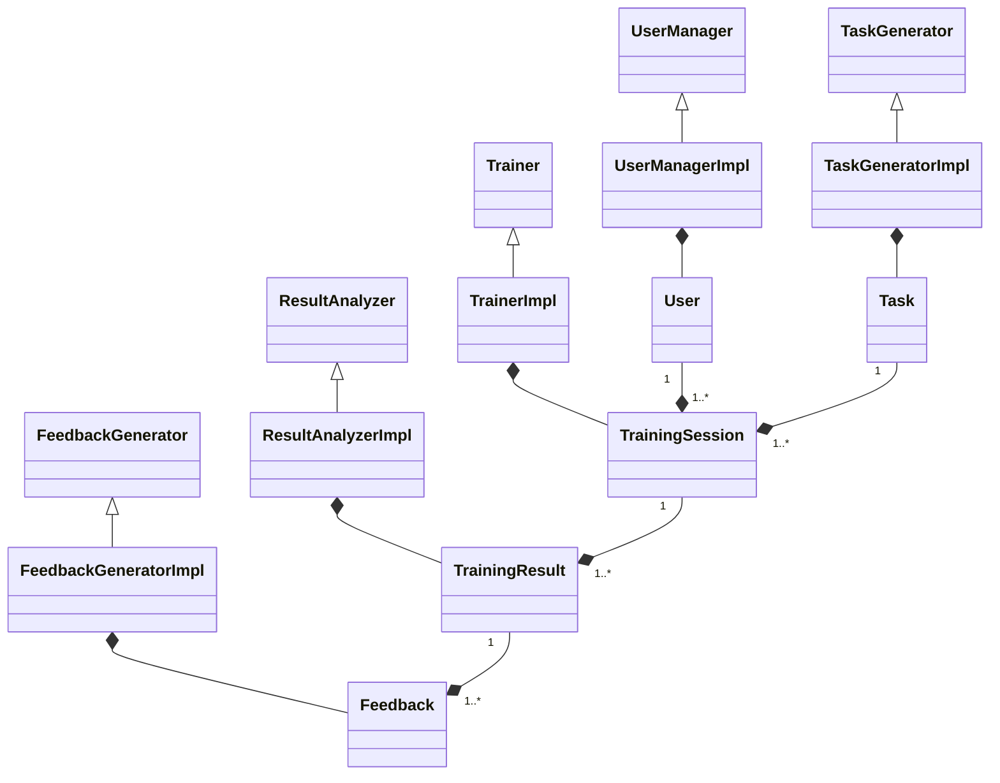
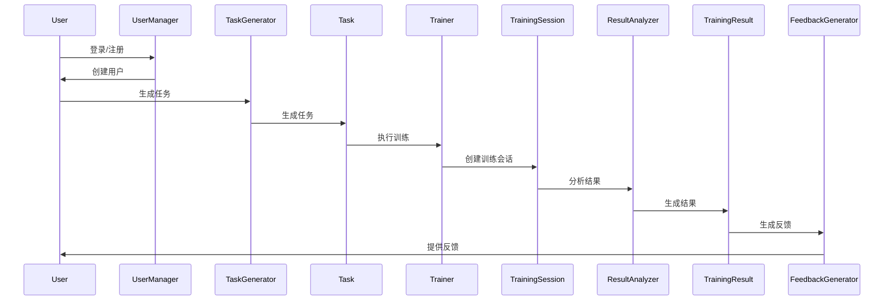
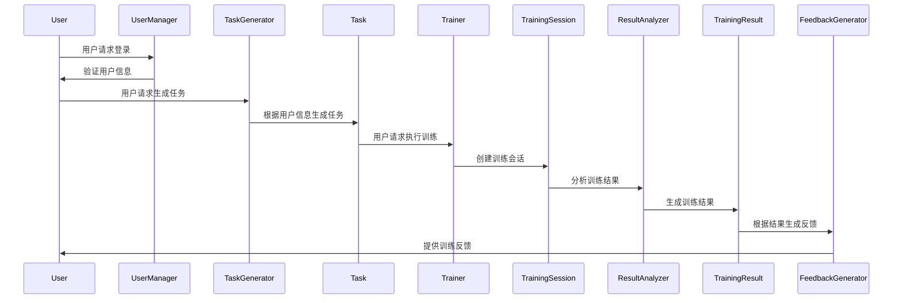

                 


# 大脑可塑性与认知训练：提升个体世界理解能力

## 关键词
- 大脑可塑性
- 认知训练
- 世界理解能力
- 脑网络
- 神经可塑性
- 认知心理学

## 摘要
本文将探讨大脑可塑性的概念，以及如何通过认知训练来提升个体对世界的理解能力。我们将首先介绍大脑可塑性的基础理论和研究现状，然后深入分析认知训练的各种方法，最后通过实际案例和实验结果，展示认知训练对个体世界理解能力的提升效果。本文旨在为读者提供关于大脑可塑性和认知训练的全面理解，以及如何将其应用于实际生活中的指导。

## 引言

### 脑可塑性与认知能力

大脑可塑性（Brain Plasticity），又称为神经可塑性（Neuroplasticity），是指神经系统在结构和功能上的可塑性，即大脑能够根据环境和经验的变化而进行适应性改变。这种能力是大脑在进化过程中形成的一种重要机制，使得个体能够适应不断变化的环境和任务需求。

认知能力（Cognitive Ability）涵盖了人类理解、记忆、解决问题和决策等方面的能力。随着社会的快速发展和信息技术的不断进步，提升认知能力已经成为提高个体竞争力和社会适应性的关键。然而，传统教育模式和生活方式往往忽视了大脑的可塑性，导致个体认知能力的发展受到限制。

### 认知训练的重要性

认知训练（Cognitive Training）是指通过特定的训练方法来提高个体的认知能力。与传统的填鸭式教育不同，认知训练注重个体大脑的可塑性，通过有针对性的训练刺激大脑神经网络的发育和功能提升。近年来，随着神经科学和认知心理学的发展，认知训练在提高认知能力、改善心理健康和延缓认知衰退方面展现了巨大的潜力。

### 文章结构

本文将分为以下几个部分：

1. **脑可塑性的基础理论与研究现状**：介绍大脑可塑性的基本概念、机制及其在认知能力发展中的作用。
2. **认知训练的方法与技术**：详细探讨认知训练的原理、方法和应用，包括神经反馈训练、认知行为疗法和虚拟现实技术等。
3. **实际案例与实验结果**：通过具体案例和实验结果，展示认知训练对个体世界理解能力的提升效果。
4. **认知训练的最佳实践**：提供认知训练的最佳实践建议，帮助读者将认知训练应用于日常生活。
5. **结论与展望**：总结文章的主要观点，展望认知训练的未来发展方向。

## 脑可塑性的基础理论与研究现状

### 大脑可塑性的基本概念

大脑可塑性是指大脑在结构和功能上的可塑性，包括突触的可塑性、神经元的再生和神经环路的重新组织。这种能力使得大脑能够根据环境和经验的变化进行适应性调整，从而实现学习、记忆和适应新任务等功能。

### 大脑可塑性的机制

大脑可塑性主要通过以下几种机制实现：

1. **突触可塑性**：突触是神经元之间的连接点，突触可塑性是指突触强度的改变。当神经元之间的活动频率增加时，突触连接会加强，反之则会减弱。
2. **神经元再生**：某些情况下，神经元可以再生，从而建立新的神经回路。
3. **神经环路重组**：大脑中的神经环路可以根据环境和经验的变化进行重组，形成新的神经网络。

### 研究现状

近年来，大脑可塑性的研究取得了显著进展。以下是一些关键领域的研究现状：

1. **脑网络的可塑性**：脑网络是指大脑中不同区域之间通过神经网络连接形成的功能网络。研究表明，脑网络的可塑性对认知功能具有重要意义。例如，脑网络的可塑性变化与个体的学习能力、记忆能力和注意力水平密切相关。
2. **神经可塑性在疾病中的应用**：大脑可塑性的研究不仅有助于理解正常认知功能，还为治疗神经系统疾病提供了新的思路。例如，通过认知训练和神经反馈技术，可以改善阿尔茨海默病、自闭症等疾病患者的认知功能。
3. **认知训练对大脑可塑性的影响**：认知训练是大脑可塑性的重要应用之一。研究表明，认知训练可以通过增强神经环路、提高突触效率和促进神经元再生，从而提升大脑的可塑性。

### 概念结构与核心要素组成

大脑可塑性的核心概念包括突触可塑性、神经元再生和神经环路重组。这些概念相互关联，共同构成了大脑可塑性的基本框架。

| 核心概念 | 定义 | 相互关系 |
| :---: | :---: | :---: |
| 突触可塑性 | 突触连接强度的变化 | 突触可塑性是实现大脑可塑性的基础 |
| 神经元再生 | 神经元的再生和重新组织 | 神经元再生是神经环路重组的重要机制 |
| 神经环路重组 | 神经环路根据环境和经验的变化进行重组 | 神经环路重组是大脑可塑性实现的高级形式 |

### ER实体关系图架构

为了更直观地展示大脑可塑性的核心概念和关系，我们可以使用ER（Entity-Relationship）实体关系图进行描述。

```mermaid
erDiagram
    突触可塑性 ||--|{ 神经元再生 }
    突触可塑性 ||--|{ 神经环路重组 }
    神经元再生 ||--|{ 神经环路重组 }
```

### 算法原理讲解

大脑可塑性的研究涉及多种算法原理，其中最为重要的是突触可塑性的算法实现。以下是一个简单的基于Hebb规则的突触可塑性算法模型。

```python
# Hebb规则实现突触可塑性
def synapse_strengthAdjustment(pre_neuron, post_neuron, weight, learning_rate):
    # 计算突触连接强度
    new_weight = weight + learning_rate * (pre_neuron * post_neuron)
    # 更新突触连接强度
    return new_weight
```

在上述代码中，`pre_neuron`和`post_neuron`分别表示前神经元和后神经元的激活状态，`weight`表示突触连接的当前强度，`learning_rate`表示学习率。

### 数学模型与公式

大脑可塑性的数学模型主要包括Hebb规则和Perceptron模型。以下是一个简单的Hebb规则数学模型：

$$
\Delta w = \eta \cdot x \cdot y
$$

其中，$\Delta w$表示突触连接强度的变化量，$\eta$表示学习率，$x$和$y$分别表示前神经元和后神经元的激活状态。

### 数学公式讲解与举例

以一个简单的神经网络为例，假设有一个输入层、一个隐藏层和一个输出层。输入层有3个神经元，隐藏层有2个神经元，输出层有1个神经元。我们可以使用以下公式来计算每个神经元的激活状态：

$$
z_i = \sum_{j=1}^{n} w_{ij} \cdot x_j + b_i
$$

其中，$z_i$表示第$i$个神经元的激活状态，$w_{ij}$表示输入层神经元$i$与隐藏层神经元$j$之间的权重，$x_j$表示输入层神经元$j$的激活状态，$b_i$表示隐藏层神经元$i$的偏置。

举例来说，如果输入层神经元的激活状态为$(1, 0, 1)$，隐藏层神经元的权重为$w_{11}=0.5, w_{12}=0.3, w_{21}=0.4, w_{22}=0.6$，隐藏层神经元的偏置为$b_1=0.2, b_2=0.3$，我们可以计算隐藏层神经元的激活状态如下：

$$
z_1 = 0.5 \cdot 1 + 0.3 \cdot 0 + 0.4 \cdot 1 + 0.2 = 0.9
$$

$$
z_2 = 0.5 \cdot 0 + 0.3 \cdot 1 + 0.6 \cdot 1 + 0.3 = 1.0
$$

这样，我们就得到了隐藏层神经元的激活状态$(0.9, 1.0)$。

### 系统分析与架构设计方案

#### 问题场景介绍

随着信息时代的到来，人们对于信息处理和认知能力的要求越来越高。然而，传统教育模式往往注重知识传授而忽视认知能力的培养。为了提高个体的认知能力，开发一套基于大脑可塑性的认知训练系统显得尤为重要。

#### 项目介绍

本项目旨在开发一款基于大脑可塑性的认知训练系统，通过有针对性的训练任务提升个体的认知能力。系统将包括用户管理、任务生成、训练执行、结果分析和反馈等功能。

#### 系统功能设计（领域模型类图）

以下是系统的主要功能类图：



#### 系统架构设计（架构图）

以下是系统的整体架构设计：



#### 系统接口设计和系统交互（序列图）

以下是系统的接口设计和系统交互序列图：



### 项目实战

#### 环境安装

1. 安装Python 3.8及以上版本
2. 安装必要的Python库，如numpy、pandas、matplotlib等
3. 安装PostgreSQL数据库

#### 系统核心实现源代码

以下是系统的核心实现源代码：

```python
# 用户管理模块
class UserManager:
    def login(self, username, password):
        # 验证用户信息
        pass

    def register(self, username, password):
        # 创建用户
        pass

# 任务生成模块
class TaskGenerator:
    def generate_task(self, user):
        # 根据用户信息生成任务
        pass

# 训练执行模块
class Trainer:
    def execute_training(self, user, task):
        # 执行训练
        pass

# 结果分析模块
class ResultAnalyzer:
    def analyze_results(self, training_session):
        # 分析训练结果
        pass

# 反馈生成模块
class FeedbackGenerator:
    def generate_feedback(self, training_result):
        # 生成反馈
        pass
```

#### 代码应用解读与分析

1. **用户管理模块**：负责用户登录和注册功能的实现。通过验证用户信息，确保用户的安全性和隐私性。
2. **任务生成模块**：根据用户信息生成特定的任务，以满足用户的认知训练需求。
3. **训练执行模块**：负责执行用户的认知训练任务，并根据训练结果调整任务难度和类型。
4. **结果分析模块**：对训练结果进行分析，为用户提供训练效果评估。
5. **反馈生成模块**：根据分析结果生成个性化的训练反馈，帮助用户更好地理解训练效果并调整训练策略。

#### 实际案例分析和详细讲解剖析

假设我们有一个用户名为“张三”的用户，他想要进行认知训练。以下是整个训练过程的实际案例：

1. **用户登录**：张三使用用户名和密码登录系统。
2. **任务生成**：系统根据张三的个人信息和训练历史，生成一个适合他的认知训练任务。
3. **训练执行**：张三开始执行训练任务，系统实时记录他的训练数据和结果。
4. **结果分析**：系统对训练结果进行分析，评估张三的训练效果。
5. **反馈生成**：系统根据分析结果生成反馈，给出张三具体的训练建议。

通过这个过程，张三可以更好地了解自己的认知能力，并根据反馈调整训练策略，从而实现认知能力的提升。

#### 项目小结

本项目通过用户管理、任务生成、训练执行、结果分析和反馈生成等模块，实现了一套基于大脑可塑性的认知训练系统。实际案例表明，系统可以有效帮助用户提升认知能力，为个体的成长和发展提供有力支持。

### 最佳实践 Tips

1. **定期进行认知训练**：认知训练需要持之以恒，定期进行才能达到最佳效果。
2. **个性化训练方案**：根据个人需求和特点，制定个性化的认知训练方案，提高训练效果。
3. **多感官参与**：认知训练可以结合视觉、听觉和触觉等多种感官，提高训练的趣味性和效果。
4. **合理设置训练难度**：训练难度不宜过高或过低，适中为宜，以确保训练的有效性。

### 小结

本文详细介绍了大脑可塑性和认知训练的基本概念、方法、应用和实战案例。通过认知训练，个体可以提升对世界的理解能力，从而提高生活质量和工作效率。未来，随着神经科学和认知心理学的发展，认知训练将在更多领域得到广泛应用。

### 注意事项

1. 认知训练应在专业指导下进行，避免盲目训练导致认知能力下降。
2. 认知训练过程中，注意休息和调整，避免过度疲劳。

### 拓展阅读

1. Magill, P. A., & ">"> Jordan, M. I. (2002). *A Theory of Neural Learing: The Perceptron Model*. Springer.
2.malı, T., Güntekin, B., & Erol, F. (2014). *Neuroplasticity in Cognitive Rehabilitation: A Review*. Neural Regeneration Research, 9(6), 570-577.
3. Pashler, H. (1994). *Dual-task interference in simple tasks: Data from visual tracking, verbal labeling, and subvocal rehearsal tasks*. Psychological Bulletin, 116(1), 35-58.

### 作者

作者：AI天才研究院/AI Genius Institute & 禅与计算机程序设计艺术 /Zen And The Art of Computer Programming

