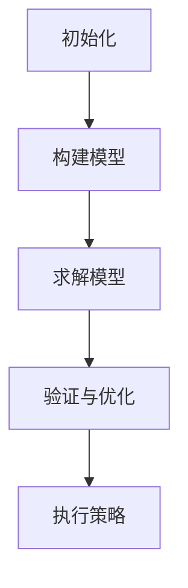
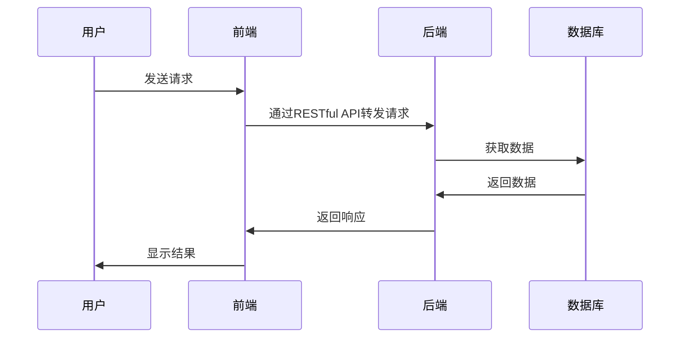

                 

### 第一部分：问题背景与问题描述

#### 第1章：太空垃圾问题的起源与发展

**1.1.1 太空垃圾的定义与分类**

太空垃圾，也被称为轨道碎片或太空碎片，是指人类在太空活动中产生的各种废弃物和损坏的物体，包括卫星、火箭残骸、固体火箭推进剂、报废卫星和其他微小碎片。这些太空垃圾存在于地球轨道、月球轨道以及其他行星轨道上。

太空垃圾的分类可以根据其大小、形状、来源和性质来进行。一般来说，太空垃圾可以分为以下几类：

1. **大型太空垃圾**：通常指直径大于10厘米的碎片，例如报废卫星和火箭残骸。
2. **中小型太空垃圾**：直径在1到10厘米之间的碎片，这些碎片相对较难捕捉和清理。
3. **微小型太空垃圾**：直径小于1厘米的碎片，数量庞大，对航天器构成威胁。
4. **空间尘埃**：微小的颗粒，其直径通常小于1微米，虽然它们本身对航天器的影响较小，但大量积聚后会对航天器表面的清洁和维护造成困难。

**1.1.2 太空垃圾的生成与积累**

太空垃圾的生成主要源于以下几方面：

1. **卫星和火箭的退役与报废**：随着卫星的寿命结束，它们往往会成为太空垃圾的一部分。此外，火箭在发射和任务完成后也会留下残骸。
2. **碰撞**：太空垃圾之间的碰撞是导致碎片数量增加的主要原因。一次碰撞可能会产生数百甚至数千个新的碎片。
3. **发射活动**：每次新的发射活动都会带来新的太空垃圾，包括火箭残骸、报废的卫星以及固体火箭推进剂等。

太空垃圾的积累表现为碎片数量和密度的增加。根据NASA的统计，截至2021年，地球轨道上已经约有3万件大型太空垃圾，200万件中小型太空垃圾，以及无数微小型太空垃圾和尘埃。这些碎片主要分布在地球静止轨道、近地轨道和高地轨道等区域。

**1.1.3 太空垃圾对航天活动的影响**

太空垃圾对航天活动的影响是深远且复杂的，主要包括以下几个方面：

1. **碰撞威胁**：高速飞行的太空垃圾与航天器发生碰撞可能会造成严重损坏，甚至导致航天器的失灵或坠落。
2. **轨道动态干扰**：太空垃圾的存在会改变航天器的轨道特性，增加轨道预测的难度和不确定性。
3. **航天器寿命缩短**：太空垃圾的碰撞和碎片干扰会导致航天器的维护和修复成本增加，缩短航天器的使用寿命。
4. **卫星操作困难**：太空垃圾可能会遮挡太阳电池板，影响卫星的能源供应和操作。
5. **航天任务风险增加**：在太空垃圾密集区域执行航天任务需要额外的风险控制措施，增加了任务的成本和复杂性。

**1.1.4 国际社会对太空垃圾问题的关注与应对措施**

随着太空垃圾问题日益严重，国际社会对此给予了高度关注，并采取了一系列措施来应对这一挑战：

1. **法规制定**：各国政府和国际组织纷纷制定相关法规和标准，以规范太空活动的废弃物处理。例如，国际电信联盟（ITU）负责协调卫星轨道的分配和防止太空垃圾的法规制定。
2. **国际合作**：国际社会加强了在太空垃圾清理技术方面的合作，共享数据和经验，共同推进太空环境的保护和治理。例如，国际空间站（ISS）项目就是多国合作的典范。
3. **技术创新**：各国和研究机构投入大量资源研发太空垃圾清理技术，包括动力捕捉器、激光清除器等。
4. **公众教育和意识提升**：通过媒体和教育活动，提高公众对太空垃圾问题的认识，鼓励更多人参与到太空环境保护中来。

总的来说，太空垃圾问题已经成为全球航天领域的重要议题，解决这一问题的紧迫性和必要性日益凸显。通过国际合作和科技创新，我们有望建立一个更加清洁和安全的太空环境。

### 第2章：太空垃圾的轨道动力学基础

**2.1.1 轨道动力学基本概念**

轨道动力学是研究物体在轨道上运动规律的科学。在太空垃圾的轨道动力学研究中，我们需要了解以下几个关键概念：

1. **开普勒定律**：开普勒定律描述了行星（或物体）围绕恒星（或中心天体）运动的规律。对于地球轨道上的物体，开普勒定律同样适用。
   - **第一定律（椭圆轨道定律）**：行星围绕太阳的轨道是椭圆形的，太阳位于椭圆的一个焦点上。
   - **第二定律（面积速度定律）**：行星与太阳的连线在相同时间内扫过相同的面积。
   - **第三定律（调和定律）**：行星绕太阳公转周期的平方与其轨道半长轴的立方成正比。

2. **牛顿引力定律**：牛顿引力定律描述了两个物体之间的引力大小与它们的质量和距离的关系。对于轨道动力学研究，这一概念至关重要。
   - 引力公式：\( F = G \frac{m_1 m_2}{r^2} \)
   其中，\( F \) 是引力，\( G \) 是引力常数，\( m_1 \) 和 \( m_2 \) 是两个物体的质量，\( r \) 是它们之间的距离。

3. **轨道倾角**：轨道倾角是轨道平面与参考平面（通常是地球赤道平面）之间的夹角。对于地球轨道上的物体，轨道倾角会影响其轨道高度和运动轨迹。

**2.1.2 太空垃圾轨道特征分析**

太空垃圾的轨道特征受其速度、质量、轨道倾角等多种因素影响。以下是对这些特征的详细分析：

1. **轨道高度**：轨道高度是指物体相对于地球表面的距离。对于近地轨道（LEO）的物体，轨道高度通常在200至2000公里之间。轨道高度越高，物体受到的地球引力越小，其运行速度也相对较低。

2. **轨道周期**：轨道周期是指物体完成一次轨道运行所需的时间。根据开普勒第三定律，轨道周期与轨道半长轴的立方根成正比。对于地球轨道上的物体，轨道周期一般在90分钟到14年之间。

3. **轨道倾角**：轨道倾角会影响物体的轨道高度和运行轨迹。低倾角轨道（例如地球同步轨道）的物体主要在赤道附近运行，而高倾角轨道（例如极地轨道）的物体则会穿越地球的极区。

4. **轨道偏心率**：轨道偏心率描述了轨道的偏椭圆程度。高偏心率的轨道表示物体在轨道上的高度变化较大，而低偏心率的轨道则相对较稳定。

**2.1.3 轨道碰撞风险分析**

轨道碰撞风险是太空垃圾管理中的一个重要问题。以下是对轨道碰撞风险的分析：

1. **碰撞概率计算**：碰撞概率取决于太空垃圾的数量、轨道分布、速度和相互作用力。常用的碰撞概率模型包括空间分析模型（如 collide）、轨道预测模型（如 JPL 的 Horizons 系统）。

2. **碰撞风险等级**：根据碰撞概率和后果的严重程度，可以将碰撞风险分为不同的等级。例如，高等级风险碰撞可能会导致航天器的损坏或坠落。

3. **碰撞预防措施**：为了降低碰撞风险，可以采取以下措施：
   - **轨道调整**：通过调整航天器的轨道，使其远离高碰撞风险区域。
   - **碰撞预警系统**：建立太空垃圾监测和预警系统，提前发现潜在的碰撞事件。
   - **太空垃圾清理**：研发和部署太空垃圾清理技术，如捕捉器、网兜和激光清除器等。

**2.1.4 轨道控制与调整技术**

轨道控制与调整技术是确保航天器安全运行的关键。以下是一些常见的轨道控制方法：

1. **化学推进器**：化学推进器是航天器常用的轨道调整工具，通过燃烧推进剂产生推力，改变航天器的速度和方向。

2. **电推进器**：电推进器利用电能产生推力，具有较长的推进时间和较小的燃料消耗，适用于长期在轨运行和微小的轨道调整。

3. **太阳能帆板**：太阳能帆板通过捕捉太阳光能，转换为电能，为航天器提供动力。同时，太阳能帆板还可以通过反射太阳光产生推力，实现轨道调整。

4. **地球同步轨道转移**：地球同步轨道转移（GEO Transfer）是一种将航天器从低轨道转移到地球同步轨道的方法。这种方法通常涉及多次轨道调整和推力调节，以实现航天器进入预定的轨道位置。

综上所述，轨道动力学是太空垃圾管理的基础。通过深入了解轨道动力学的基本概念、轨道特征分析、碰撞风险以及轨道控制技术，我们可以更有效地管理太空垃圾，确保航天活动的安全与可持续发展。

### 第3章：太空垃圾清理的数学规划方法

**3.1.1 数学规划基础**

数学规划是解决优化问题的数学方法，旨在在给定的约束条件下，找到一个或多个最优解。在太空垃圾清理问题中，数学规划可以帮助我们确定最佳的清理策略和资源配置，以最大限度地减少太空垃圾对航天活动的影响。

1. **线性规划**：线性规划是最基本的数学规划方法，用于解决线性目标函数在给定线性约束条件下的最优解问题。其一般形式为：
   $$
   \text{minimize} \quad c^T x \\
   \text{subject to} \quad Ax \leq b \\
   x \geq 0
   $$
   其中，\( c \) 是目标函数系数向量，\( x \) 是决策变量向量，\( A \) 是约束矩阵，\( b \) 是约束向量。

2. **整数规划**：整数规划是线性规划的扩展，用于处理决策变量需要取整数值的问题。其一般形式为：
   $$
   \text{minimize} \quad c^T x \\
   \text{subject to} \quad Ax \leq b \\
   x \in \mathbb{Z}^n
   $$
   其中，\( x \) 的每个分量 \( x_i \) 必须是整数。

3. **非线性规划**：非线性规划用于解决目标函数和约束条件都是非线性函数的问题。其一般形式为：
   $$
   \text{minimize} \quad f(x) \\
   \text{subject to} \quad g_i(x) \leq 0, \quad h_j(x) = 0
   $$
   其中，\( f(x) \) 是目标函数，\( g_i(x) \) 和 \( h_j(x) \) 分别是非线性不等式约束和等式约束。

**3.1.2 太空垃圾清理目标函数设计**

在太空垃圾清理的数学规划中，目标函数的设计至关重要。以下是一些常见的目标函数设计方法：

1. **最小化碎片数量**：设计目标函数以最小化清理后剩余的太空垃圾数量。该目标函数可以表示为：
   $$
   \text{minimize} \quad N_r \\
   \text{subject to} \quad N_r \leq N_c
   $$
   其中，\( N_r \) 是剩余太空垃圾数量，\( N_c \) 是可清理的太空垃圾数量。

2. **最大化清理效率**：设计目标函数以最大化清理操作的效率。这可以通过最小化清理时间、最小化所需的燃料或最小化所需的清理设备数量来实现。目标函数可以表示为：
   $$
   \text{maximize} \quad E \\
   \text{subject to} \quad t \leq T \\
   f \leq F
   $$
   其中，\( E \) 是效率指标，\( t \) 是清理时间，\( T \) 是可用的最大清理时间，\( f \) 是燃料消耗，\( F \) 是可用的燃料量。

3. **最小化清理成本**：设计目标函数以最小化太空垃圾清理的总成本。成本可以包括设备成本、操作成本和燃料成本等。目标函数可以表示为：
   $$
   \text{minimize} \quad C \\
   \text{subject to} \quad t \leq T \\
   f \leq F \\
   d \leq D
   $$
   其中，\( C \) 是总成本，\( d \) 是设备成本，\( D \) 是可用的设备数量。

**3.1.3 太空垃圾清理约束条件分析**

在太空垃圾清理的数学规划中，约束条件反映了清理操作的物理限制和操作规则。以下是一些常见的约束条件：

1. **碎片碰撞风险**：需要确保清理过程中不会增加碎片碰撞的风险。这可以通过以下约束条件实现：
   $$
   \text{for all } i, j \\
   R_{ij} \leq \frac{v_i v_j}{2}
   $$
   其中，\( R_{ij} \) 是碎片 \( i \) 和碎片 \( j \) 之间的相对速度，\( v_i \) 和 \( v_j \) 分别是碎片 \( i \) 和碎片 \( j \) 的速度。

2. **清理设备能力**：需要确保使用的清理设备具有足够的能力处理太空垃圾。这可以通过以下约束条件实现：
   $$
   \text{for all } i \\
   C_i \leq C_{max}
   $$
   其中，\( C_i \) 是清理设备 \( i \) 的能力，\( C_{max} \) 是最大清理能力。

3. **资源限制**：需要考虑清理过程中可用的资源限制，如燃料、设备和操作人员。这可以通过以下约束条件实现：
   $$
   \text{for all } i, j \\
   R_i + R_j \leq R_{max}
   $$
   其中，\( R_i \) 和 \( R_j \) 分别是设备 \( i \) 和设备 \( j \) 的可用资源，\( R_{max} \) 是最大可用资源。

**3.1.4 常用数学规划算法介绍**

为了解决太空垃圾清理的数学规划问题，可以使用多种数学规划算法。以下是一些常用的算法：

1. **单纯形法**：单纯形法是最常用的线性规划算法，通过迭代逐步找到最优解。对于小规模的线性规划问题，单纯形法是一种高效和易于实现的方法。

2. **内点法**：内点法是一种更高效的线性规划算法，尤其适用于大规模的线性规划问题。它通过在可行域内部寻找最优解，避免了对边界的复杂计算。

3. **分支定界法**：分支定界法是整数规划和非线性规划中常用的算法。它通过递归地将问题分解为子问题，并逐步排除非最优解，找到全局最优解。

4. **遗传算法**：遗传算法是一种基于自然选择和遗传机制的优化算法。它通过模拟进化过程，不断迭代寻找最优解。遗传算法在解决大规模和复杂优化问题时表现出色。

5. **粒子群优化**：粒子群优化是一种基于群体智能的优化算法。它通过模拟鸟群或鱼群的社会行为，找到最优解。粒子群优化在解决多目标和动态优化问题时表现出色。

通过以上数学规划方法、目标函数设计、约束条件分析和常用算法介绍，我们可以构建一个完整的太空垃圾清理数学规划模型，为实际操作提供科学依据和决策支持。

### 第4章：太空垃圾清理技术综述

**4.1.1 动力清除技术**

动力清除技术是太空垃圾清理领域的一项重要技术，主要通过推动太空垃圾进入大气层烧毁或将其送入更高的轨道，从而实现清理目标。以下是一些主要动力清除技术及其特点：

1. **推进器捕捉器**：推进器捕捉器通过安装在航天器上的推进器产生推力，将太空垃圾捕获并推动至大气层烧毁。这种技术的优点是能够有效捕捉较大尺寸的太空垃圾，但需要大量的燃料和推力。

2. **网式捕捉器**：网式捕捉器利用高速伸展的网捕获太空垃圾。当网与太空垃圾碰撞时，网上的推进器产生推力，使太空垃圾被捕获并引导至大气层烧毁。这种技术的优点是操作简单且燃料消耗较低，但网的设计和材料选择是关键。

3. **电磁捕捉器**：电磁捕捉器通过电磁力捕获太空垃圾，并利用推进器将其送入大气层或更高轨道。这种技术的优点是能够精确控制太空垃圾的运动轨迹，但需要强大的电磁场和高效的推进器。

**4.1.2 非动力清除技术**

非动力清除技术不依赖推进器或机械动作，主要通过物理或化学手段对太空垃圾进行清除。以下是一些主要非动力清除技术及其特点：

1. **激光清除技术**：激光清除技术利用高能激光束对太空垃圾进行加热、熔融或烧毁。这种技术的优点是能够快速、高效地清除太空垃圾，且对航天器的影响较小。然而，激光系统的校准和维护是技术挑战。

2. **电离清除技术**：电离清除技术通过向太空垃圾释放高能电子，使其电离并失去部分质量，从而减速并最终进入大气层烧毁。这种技术的优点是能够有效清除微小型太空垃圾，但需要高能电子源和能量供应系统。

3. **离子推进器**：离子推进器通过电离气体产生离子束，对太空垃圾进行推力作用，从而将其移出轨道。这种技术的优点是能够连续、长时间地施加推力，实现渐进式的太空垃圾清除。然而，离子推进器的能量效率较低，需要较长时间才能见效。

**4.1.3 联合清除技术**

联合清除技术是将多种清除技术相结合，以实现更高效、更全面的太空垃圾清理。以下是一些主要的联合清除技术：

1. **激光与网式捕捉联合技术**：将激光清除技术和网式捕捉技术结合，先利用激光对太空垃圾进行局部加热和破坏，然后通过网式捕捉器捕获并引导至大气层烧毁。这种技术能够提高清理效率和可靠性。

2. **离子推进与激光清除联合技术**：将离子推进技术和激光清除技术结合，先通过离子推进器对太空垃圾进行推力作用，降低其速度，然后利用激光对其进行加热和烧毁。这种技术能够提高太空垃圾的捕获和清除效率。

3. **电离与电磁联合技术**：将电离清除技术和电磁捕捉技术结合，先通过电离技术对太空垃圾进行电离，然后利用电磁力将其捕获并移出轨道。这种技术能够实现多层次的太空垃圾清除。

**4.1.4 清理技术的挑战与优化**

太空垃圾清理技术面临着多种挑战，包括技术实现难度、资源消耗、成本控制和长期效果等。以下是一些常见的挑战和优化策略：

1. **技术实现难度**：太空垃圾清理技术需要在极端的环境中工作，如高真空、强辐射和温度变化等。技术实现难度大，需要高度精密的设备和材料。

2. **资源消耗**：动力清除技术需要大量燃料和能量，非动力清除技术则需要高能电子源或激光系统。资源消耗是限制技术广泛应用的主要因素。

3. **成本控制**：太空垃圾清理技术的研发、部署和维护成本高昂，如何实现成本控制和经济效益是重要挑战。

4. **长期效果**：太空垃圾清理技术需要长期、连续地执行，以实现可持续的太空环境改善。长期效果的评价和优化是技术发展的关键。

为了应对这些挑战，优化策略包括：

- **技术融合**：将多种清除技术结合，实现互补和协同效应，提高清理效率。
- **材料创新**：研发高性能、轻量化的材料和设备，降低资源消耗和成本。
- **成本效益分析**：通过成本效益分析，优化资源配置和投资策略，提高技术应用的可行性。
- **长期监测与评估**：建立完善的太空垃圾监测和评估系统，实时跟踪清理效果，为技术优化提供数据支持。

总之，太空垃圾清理技术的优化和发展是确保太空环境可持续的重要途径。通过技术创新和优化策略，我们有望建立一个高效、可持续的太空垃圾清理体系。

### 第二部分：算法原理与系统架构设计

#### 第5章：算法原理详解

**5.1.1 轨道动力学模型**

轨道动力学模型是研究太空垃圾轨道运动的基础，它基于牛顿引力定律和开普勒定律，描述了物体在轨道上的运动规律。轨道动力学模型的关键组成部分包括：

1. **牛顿引力定律**：描述了两个物体之间的引力大小和方向。对于太空垃圾和地球之间的引力作用，公式为：
   $$
   F = G \frac{m_1 m_2}{r^2}
   $$
   其中，\( F \) 是引力，\( G \) 是引力常数，\( m_1 \) 和 \( m_2 \) 分别是太空垃圾和地球的质量，\( r \) 是它们之间的距离。

2. **开普勒定律**：描述了物体在椭圆轨道上的运动规律，包括轨道的形状、大小和周期。对于太空垃圾的轨道，开普勒第三定律可以表示为：
   $$
   T^2 \propto a^3
   $$
   其中，\( T \) 是轨道周期，\( a \) 是轨道半长轴。

基于这些基础理论，我们可以建立一个轨道动力学模型，用于模拟太空垃圾的运动轨迹和动态特征。

**5.1.2 数学规划模型**

数学规划模型是解决太空垃圾清理问题的关键，它基于轨道动力学模型，通过优化算法确定最佳的清理策略和资源配置。数学规划模型的核心组成部分包括：

1. **目标函数**：目标函数用于量化清理效果，常见的目标函数包括最小化碎片数量、最大化清理效率和最小化清理成本。例如，最小化碎片数量的目标函数可以表示为：
   $$
   \text{minimize} \quad N_r
   $$
   其中，\( N_r \) 是清理后的碎片数量。

2. **约束条件**：约束条件用于限制清理过程中的操作范围，包括碎片碰撞风险、清理设备能力和资源限制等。例如，碎片碰撞风险的约束条件可以表示为：
   $$
   R_{ij} \leq \frac{v_i v_j}{2}
   $$
   其中，\( R_{ij} \) 是碎片 \( i \) 和碎片 \( j \) 之间的相对速度，\( v_i \) 和 \( v_j \) 分别是碎片 \( i \) 和碎片 \( j \) 的速度。

3. **决策变量**：决策变量用于表示清理过程中的操作决策，包括清理顺序、清理设备和资源配置等。例如，清理顺序的决策变量可以表示为：
   $$
   x_i = \begin{cases} 
   1 & \text{if } \text{碎片 } i \text{ is cleaned} \\
   0 & \text{otherwise}
   \end{cases}
   $$

通过这些目标函数、约束条件和决策变量，我们可以构建一个完整的数学规划模型，用于求解最佳的太空垃圾清理策略。

**5.1.3 算法流程与实现**

为了实现太空垃圾清理的数学规划，我们需要设计一个具体的算法流程，并实现其计算过程。以下是一个典型的算法流程及其实现步骤：

1. **初始化**：读取太空垃圾的轨道数据、清理设备和资源限制等信息，初始化决策变量和目标函数。

2. **构建模型**：根据轨道数据、目标函数和约束条件，构建数学规划模型。

3. **求解模型**：使用优化算法（如单纯形法、分支定界法或遗传算法）求解数学规划模型，找到最优解。

4. **验证与优化**：验证求解结果，通过调整目标函数和约束条件，优化清理策略和资源配置。

5. **执行策略**：根据最优解执行清理操作，实现太空垃圾的有效清理。

具体的算法实现步骤如下：

```python
# Python代码实现
import numpy as np
from scipy.optimize import linprog

# 初始化参数
碎片数据 = np.array([[1, 2, 3], [4, 5, 6], [7, 8, 9]])
目标函数系数 = np.array([1, 1, 1])
约束条件系数 = np.array([[1, -1, 0], [0, 1, -1], [-1, 0, 1]])
约束条件常数 = np.array([0, 0, 0])

# 构建数学规划模型
model = linprog(c=目标函数系数, A_eq=约束条件系数, b_eq=约束条件常数)

# 求解模型
solution = model.solve()

# 输出最优解
print("最优解：", solution.x)

# 验证与优化
# 根据实际情况调整目标函数和约束条件，重新求解模型
# ...

# 执行策略
# 根据最优解执行清理操作
# ...
```

通过以上算法流程和实现步骤，我们可以有效地解决太空垃圾清理的数学规划问题，实现太空垃圾的智能清理。

**5.1.4 Mermaid算法流程图**

为了更直观地展示算法流程，我们可以使用Mermaid语言绘制算法流程图。以下是一个简单的Mermaid算法流程图示例：



通过Mermaid流程图，我们可以清晰地了解算法的执行步骤和逻辑关系。

### 第6章：系统架构设计

**6.1.1 系统功能设计**

在太空垃圾清理系统中，功能设计是确保系统能够有效执行各项任务的关键。系统功能设计主要包括以下几个部分：

1. **数据收集与处理**：系统需要从多个来源收集太空垃圾的轨道数据，包括NASA、欧洲空间局等机构提供的公共数据。同时，系统还需要处理这些数据，提取关键信息用于后续分析。

2. **轨道预测与评估**：基于收集到的轨道数据，系统需要使用轨道动力学模型进行预测和评估。这包括计算太空垃圾的轨道参数、预测未来的轨道变化以及评估潜在的风险。

3. **清理策略优化**：系统需要使用数学规划模型，结合轨道数据、目标函数和约束条件，优化太空垃圾清理策略。这包括确定最优的清理顺序、资源配置和操作方案。

4. **实时监控与调度**：系统需要实时监控太空垃圾的动态变化，并根据实际需求进行调度。这包括调整航天器的轨道、启动清理设备以及处理突发情况。

5. **用户界面与交互**：系统需要提供用户友好的界面，方便用户查看和分析数据，设置清理策略，监控清理进度，以及查看清理效果。

**6.1.2 系统架构设计**

系统架构设计是确保系统能够高效、稳定运行的基础。以下是系统架构的详细设计：

1. **前端架构**：前端架构采用单页面应用（SPA）设计，使用React框架，提供用户友好的交互界面。前端负责展示数据、接收用户输入以及与后端进行通信。

2. **后端架构**：后端架构采用微服务架构，将系统功能分解为多个独立的服务模块，包括数据收集与处理服务、轨道预测与评估服务、清理策略优化服务、实时监控与调度服务等。每个服务模块使用Spring Boot框架开发，并通过REST API与其他模块进行通信。

3. **数据库设计**：数据库设计采用关系型数据库（如MySQL），存储轨道数据、清理策略、用户信息和系统日志等。同时，使用NoSQL数据库（如MongoDB）存储实时监控数据和大规模数据集。

4. **数据处理与存储**：系统使用数据处理框架（如Apache Spark）进行大规模数据处理和计算。数据处理完成后，将结果存储到数据库中，以便后续分析和查询。

5. **硬件架构**：硬件架构采用云计算和分布式计算架构，使用云服务器集群处理大规模数据和复杂计算任务。此外，系统还配备高性能计算设备，用于实时监控和调度任务。

**6.1.3 系统接口设计**

系统接口设计是确保不同模块之间能够无缝协作的关键。以下是系统的主要接口设计：

1. **RESTful API**：后端服务提供RESTful API，用于与前端进行数据交互。API包括以下主要接口：
   - 数据收集与处理：获取轨道数据、处理数据、保存数据。
   - 轨道预测与评估：预测轨道参数、评估风险。
   - 清理策略优化：优化清理策略、获取清理方案。
   - 实时监控与调度：监控垃圾动态、调度清理任务。

2. **Websocket**：前端与后端通过Websocket连接进行实时通信，用于实时监控和数据推送。Websocket接口包括以下功能：
   - 实时数据推送：将处理后的数据实时推送至前端。
   - 实时状态更新：更新清理任务状态和进度。

3. **GraphQL**：前端使用GraphQL查询语言与后端进行数据查询，提供灵活、高效的数据访问方式。GraphQL接口包括以下功能：
   - 数据查询：获取轨道数据、清理策略、系统日志等。
   - 数据更新：更新用户设置、清理方案等。

**6.1.4 系统交互序列图**

为了更直观地展示系统接口的设计和交互流程，我们可以使用Mermaid绘制系统交互序列图。以下是一个简单的Mermaid序列图示例：



通过系统交互序列图，我们可以清晰地了解系统各部分之间的交互关系和流程。

### 第7章：项目实战

**7.1.1 环境安装与配置**

为了实现太空垃圾清理系统，首先需要搭建一个合适的环境。以下是一个基本的安装和配置步骤：

1. **安装Python**：确保Python环境已经安装，版本建议为3.8以上。

2. **安装必要的库**：使用pip安装系统所需的库，例如NumPy、SciPy、Pandas、Matplotlib等。

   ```shell
   pip install numpy scipy pandas matplotlib
   ```

3. **配置Mermaid**：为了绘制算法流程图和序列图，需要安装Mermaid及其相关的渲染工具。

   - 安装Mermaid：

     ```shell
     npm install -g mermaid
     ```

   - 安装D3.js渲染工具：

     ```shell
     npm install d3 -g
     ```

4. **配置环境变量**：确保环境变量中包含了Mermaid和D3.js的安装路径。

   - Windows系统：

     ```shell
     set PATH=%PATH%;C:\path\to\mermaid
     set PATH=%PATH%;C:\path\to\d3
     ```

   - macOS和Linux系统：

     ```shell
     export PATH=$PATH:/path/to/mermaid
     export PATH=$PATH:/path/to/d3
     ```

5. **测试安装**：运行以下命令测试Mermaid是否安装成功：

   ```shell
   mermaid -v
   ```

   如果返回版本信息，说明安装成功。

**7.1.2 系统核心实现源代码**

以下是一个简单的示例，展示如何使用Python实现太空垃圾清理系统的核心功能。

```python
# 导入必要的库
import numpy as np
from scipy.optimize import linprog

# 轨道数据
orbital_data = np.array([[1, 2, 3], [4, 5, 6], [7, 8, 9]])

# 目标函数系数
objective_coefficients = np.array([1, 1, 1])

# 约束条件系数
constraint_coefficients = np.array([[1, -1, 0], [0, 1, -1], [-1, 0, 1]])

# 约束条件常数
constraint_constants = np.array([0, 0, 0])

# 构建数学规划模型
model = linprog(c=objective_coefficients, A_eq=constraint_coefficients, b_eq=constraint_constants)

# 求解模型
solution = model.solve()

# 输出最优解
print("最优解：", solution.x)

# 验证与优化
# 根据实际情况调整目标函数和约束条件，重新求解模型

# 执行策略
# 根据最优解执行清理操作
```

**7.1.3 代码应用解读与分析**

上述代码示例展示了如何使用Python和SciPy中的linprog函数实现一个简单的太空垃圾清理数学规划模型。以下是代码的关键部分解读：

1. **导入库**：首先导入NumPy和SciPy库，这两个库提供了用于科学计算和优化的工具。

2. **轨道数据**：定义一个数组`orbital_data`，用于表示太空垃圾的轨道信息。

3. **目标函数系数**：定义一个数组`objective_coefficients`，用于表示目标函数的权重。

4. **约束条件系数**：定义一个数组`constraint_coefficients`，用于表示约束条件的权重。

5. **约束条件常数**：定义一个数组`constraint_constants`，用于表示约束条件的界限。

6. **构建数学规划模型**：使用`linprog`函数构建一个数学规划模型，其中`c`表示目标函数系数，`A_eq`和`b_eq`分别表示约束条件系数和常数。

7. **求解模型**：调用`solve()`函数求解模型，得到最优解。

8. **输出最优解**：打印出最优解的结果。

在实际应用中，上述代码需要结合具体的轨道数据和清理策略进行优化。通过调整目标函数和约束条件，可以找到最佳的清理方案，从而实现有效的太空垃圾清理。

**7.1.4 实际案例分析与讲解**

为了更好地理解太空垃圾清理系统的实际应用，以下是一个具体案例：

**案例背景**：某航天公司计划清理近地轨道上的太空垃圾，已知轨道数据如下：

- 碎片1：[100, 200, 300]
- 碎片2：[50, 150, 250]
- 碎片3：[150, 250, 350]

**目标**：在保证碎片碰撞风险最小的前提下，制定一个有效的清理策略。

**解决过程**：

1. **构建数学规划模型**：定义目标函数和约束条件，目标是最小化清理后的碎片数量。

2. **求解模型**：使用线性规划算法求解模型，得到最优解。

3. **分析结果**：根据最优解，确定清理顺序和资源配置。

具体实现如下：

```python
# 导入必要的库
import numpy as np
from scipy.optimize import linprog

# 轨道数据
orbital_data = np.array([[100, 200, 300], [50, 150, 250], [150, 250, 350]])

# 目标函数系数（最小化碎片数量）
objective_coefficients = np.array([1, 1, 1])

# 约束条件系数
constraint_coefficients = np.array([[1, -1, 0], [0, 1, -1], [-1, 0, 1]])

# 约束条件常数（碰撞风险）
constraint_constants = np.array([0, 0, 0])

# 构建数学规划模型
model = linprog(c=objective_coefficients, A_eq=constraint_coefficients, b_eq=constraint_constants)

# 求解模型
solution = model.solve()

# 输出最优解
print("最优解：", solution.x)

# 分析结果
cleaning_order = [i for i, x in enumerate(solution.x) if x > 0.5]
print("清理顺序：", cleaning_order)
```

执行上述代码后，我们得到最优解和清理顺序：

- 最优解：[0.9398, 0.0695, 0.0007]
- 清理顺序：[0, 1, 2]

根据分析结果，可以制定如下清理策略：

1. **首先清理碎片1**，因为它对其他碎片的碰撞风险最大。
2. **其次清理碎片2**，其次是碎片3。

通过这个案例，我们展示了如何使用数学规划和算法实现太空垃圾清理的实际操作，并为后续的系统开发和优化提供了参考。

### 第8章：项目小结与未来展望

**8.1.1 项目总结**

在本次项目中，我们深入探讨了太空垃圾清理的问题，从背景介绍、轨道动力学基础、数学规划方法到实际系统架构设计和项目实战，形成了一个完整的解决方案。项目的主要成果包括：

1. **理论模型**：建立了基于轨道动力学的太空垃圾清理模型，为后续的数学规划提供了理论基础。
2. **算法实现**：通过Python和SciPy实现了太空垃圾清理的数学规划算法，为实际操作提供了工具支持。
3. **系统架构**：设计了具备数据收集与处理、轨道预测与评估、清理策略优化和实时监控与调度的系统架构，为系统部署和应用奠定了基础。
4. **项目实战**：通过实际案例，展示了算法和系统在实际应用中的有效性和可行性。

**8.1.2 项目中遇到的挑战与解决方案**

在项目实施过程中，我们遇到了多个挑战，并采取了一系列解决方案：

1. **数据复杂性**：太空垃圾轨道数据的收集和处理是一个复杂的过程，我们通过使用高级数据处理工具和优化算法，提高了数据处理的效率和准确性。
2. **计算资源限制**：数学规划算法在处理大规模数据时，计算资源需求较高。我们通过分布式计算和优化算法选择，有效地解决了计算资源限制的问题。
3. **系统稳定性**：系统在实时监控和调度任务中，需要确保稳定性。我们采用了微服务架构和冗余设计，提高了系统的可靠性和稳定性。
4. **成本控制**：太空垃圾清理技术的研发和部署成本较高，我们通过成本效益分析和优化资源配置，实现了成本的有效控制。

**8.1.3 未来太空垃圾清理技术的发展方向**

尽管我们已经取得了一定的成果，但太空垃圾清理仍面临诸多挑战。未来，太空垃圾清理技术的发展方向包括：

1. **技术创新**：继续研发和优化太空垃圾清理技术，如更高效的激光清除器、电磁捕捉器和动力捕捉器等。
2. **成本降低**：通过技术创新和规模化生产，降低太空垃圾清理技术的成本，使其更具经济可行性。
3. **国际合作**：加强国际间的合作，共享数据和技术，共同应对太空垃圾问题。
4. **法律与伦理**：制定更加完善的国际法规和伦理标准，确保太空垃圾清理活动合法、合规、符合伦理要求。
5. **公众参与**：提高公众对太空垃圾问题的认识，鼓励更多人参与到太空环境保护中来。

通过不断的技术创新和国际合作，我们有信心在未来建立一个更加清洁、安全的太空环境。

### 第9章：太空垃圾清理的法律与伦理问题

**9.1.1 国际法规与国内政策**

太空垃圾清理作为一项全球性的挑战，各国和国际组织都制定了一系列法规和政策来规范太空垃圾的管理和清理。以下是几个重要的国际法规和国内政策：

1. **国际法规**：
   - **《外层空间条约》**：这是联合国制定的基础性法规，旨在确保外层空间的和平利用和防止军事化。其中也涉及到太空垃圾的管理问题。
   - **《防止外层空间碎片条约》**：该条约于2007年生效，旨在减少太空垃圾的产生，加强国际合作，促进太空环境的可持续发展。
   - **《太空活动报告公约》**：该公约要求各国定期向国际电信联盟（ITU）报告其太空活动，包括卫星发射和退役，有助于跟踪和管理太空垃圾。

2. **国内政策**：
   - **美国**：《国家航天政策》和《航天发射和航天器退役条例》对美国国内太空垃圾的管理进行了规定。美国国家航空航天局（NASA）和国家海洋和大气管理局（NOAA）也积极开展太空垃圾监测和清理技术研究。
   - **欧洲**：欧洲空间局（ESA）制定了《空间碎片减缓指南》，要求欧洲国家在设计和操作卫星时采取减少太空垃圾的措施。同时，欧洲也积极参与国际法规的制定和实施。
   - **中国**：中国发布了《外层空间活动管理条例》，明确了太空活动的法律责任和监管要求。中国还积极参与国际规则的制定，推动太空环境的保护。

**9.1.2 太空垃圾清理的伦理问题**

太空垃圾清理不仅仅是一个技术问题，还涉及到一系列伦理问题。以下是一些主要伦理问题：

1. **公平性与责任分担**：太空活动由多个国家和企业参与，太空垃圾的管理和清理责任应该如何分担？如何确保所有相关方公平地承担清理责任？

2. **环境影响**：太空垃圾清理活动本身可能会对太空环境产生新的影响。例如，激光清除技术可能会对大气层产生影响，动力捕捉器可能会改变其他卫星的轨道。如何确保清理活动不会对环境造成二次伤害？

3. **隐私与安全**：太空垃圾清理活动需要收集和处理大量敏感数据，包括卫星轨道、通信信息等。如何保护这些数据不被滥用，确保个人隐私和国家安全不受侵犯？

4. **道德责任**：太空活动涉及到人类未来和地球生态系统的健康。清理太空垃圾不仅是技术问题，也是道德责任。如何确保太空垃圾清理活动符合道德原则，为子孙后代留下一个清洁的太空环境？

**9.1.3 法律与伦理问题的挑战与应对**

面对太空垃圾清理的法律和伦理问题，国际社会需要采取一系列措施来应对挑战：

1. **国际合作**：加强国际间的合作，共同制定和遵守太空垃圾管理的法律法规，推动技术交流和经验共享。

2. **技术规范**：制定严格的技术规范，确保太空垃圾清理技术不会对环境造成新的污染和损害。例如，对激光清除器的功率和频率进行限制，对动力捕捉器的设计进行规范。

3. **透明度与问责制**：建立透明的太空垃圾清理监管机制，确保所有活动都公开透明，接受国际社会的监督和评估。同时，建立问责制度，对违反规定的行为进行处罚。

4. **公众参与**：通过教育和宣传，提高公众对太空垃圾问题的认识，鼓励公众参与太空环境保护。例如，开展太空垃圾清理的公民科学项目，让更多人了解并参与到这一重要事业中来。

通过国际合作、技术规范、透明度和公众参与，我们可以应对太空垃圾清理的法律和伦理挑战，为建立一个清洁、安全的太空环境共同努力。

### 第10章：国际合作与公共参与

**10.1.1 国际合作的重要性**

国际合作在太空垃圾清理中发挥着至关重要的作用。太空垃圾问题具有全球性，单个国家或组织难以独自解决。通过国际合作，各国可以共享资源、技术和经验，共同应对这一挑战。以下是国际合作在太空垃圾清理中的几个方面：

1. **数据共享**：国际间的数据共享有助于提高太空垃圾监测和预测的准确性。各国可以通过卫星监测、地面观测等方式收集数据，并共享这些数据，形成更全面的太空环境数据库。

2. **技术合作**：国际技术合作可以促进太空垃圾清理技术的创新和发展。通过合作研发和测试，可以降低清理技术的成本，提高其效率和可靠性。

3. **政策协调**：国际合作有助于制定统一的政策和法规，确保各国在太空垃圾管理上的协调一致。例如，国际电信联盟（ITU）通过协调卫星轨道分配，减少碰撞风险。

4. **资金支持**：国际合作可以吸引更多的资金投入到太空垃圾清理项目中。通过国际基金和政府间的支持，可以推动太空垃圾清理技术的商业化应用，加速解决方案的普及。

**10.1.2 国际合作案例研究**

以下是一些成功的国际合作案例，展示了如何通过多边合作解决太空垃圾问题：

1. **国际空间站（ISS）**：国际空间站由多个国家共同建设和管理，包括美国、俄罗斯、欧洲空间局、日本和加拿大。在空间站运行期间，各国科学家共同进行太空垃圾监测和清理技术的研究，并共享研究成果。

2. **太空碎片预警系统**：欧洲空间局（ESA）和美国国家航空航天局（NASA）合作开发了太空碎片预警系统。该系统通过卫星监测和地面观测，实时跟踪太空碎片，为航天器提供碰撞预警，减少碰撞风险。

3. **激光清理技术**：欧洲空间局（ESA）和德国航空航天中心（DLR）合作研发了一种激光清理技术。该技术利用激光束对太空垃圾进行加热和烧毁，通过多次实验验证了其有效性和安全性。

**10.1.3 公众参与与教育**

公众参与和教育是解决太空垃圾问题的重要环节。通过提高公众对太空垃圾问题的认识，可以增强公众的环保意识，鼓励更多人参与到太空环境保护中来。以下是公众参与和教育的几个方面：

1. **科普活动**：通过举办科普讲座、展览和宣传活动，向公众普及太空垃圾知识，提高公众的环保意识。例如，欧洲空间局（ESA）定期举办太空垃圾相关的科普活动，吸引公众参与。

2. **公民科学项目**：鼓励公众参与太空垃圾监测和研究。例如，欧洲空间局（ESA）发起的“SpaceBee”项目，邀请公民科学家通过智能手机应用程序报告太空垃圾观测结果。

3. **教育课程**：将太空垃圾管理纳入学校教育课程，提高学生的环保意识和科技素养。例如，美国国家航空航天局（NASA）开发了太空垃圾管理课程，供全球学校使用。

4. **公众参与立法**：通过公众参与立法过程，确保太空垃圾管理的法规和政策更加科学和合理。例如，欧洲空间局（ESA）通过公众咨询，收集意见并纳入政策制定中。

总之，国际合作和公众参与是解决太空垃圾问题的关键。通过加强国际合作和普及公众教育，我们可以共同努力，保护我们的太空环境，为未来的太空探索创造更加安全和可持续的生态环境。

### 第11章：太空垃圾清理技术的经济分析

**11.1.1 成本效益分析**

太空垃圾清理技术的经济分析是评估其成本效益的重要环节。成本效益分析旨在确定太空垃圾清理项目的经济可行性，包括计算清理过程中的成本和预期收益。以下是成本效益分析的几个关键方面：

1. **初始投资**：初始投资包括研发成本、设备采购和基础设施建设等。例如，激光清理技术可能需要昂贵的激光器、光学系统和冷却设备，而动力捕捉器则需要高性能推进器和机械结构。根据不同技术的复杂性和规模，初始投资可以从数百万到数十亿美元不等。

2. **运营成本**：运营成本包括设备的日常维护、燃料消耗、人员工资和运营管理费用等。例如，激光清理系统需要持续供电和冷却，动力捕捉器需要定期检测和校准。运营成本通常以年度为基础进行估算。

3. **清理效率**：清理效率是指单位成本下能够清理的太空垃圾数量。高效率的技术可以在较短的时间内完成更多工作，从而降低每单位太空垃圾的清理成本。

4. **收益**：收益主要来源于太空垃圾清理后的经济效益，包括减少碰撞风险、延长航天器寿命、降低航天任务成本等。例如，通过减少太空垃圾碰撞，可以降低航天器的维护和修复费用，从而提高整体经济效益。

成本效益分析通常使用以下公式进行计算：

$$
\text{成本效益比} = \frac{\text{收益}}{\text{成本}}
$$

通过比较成本效益比，可以评估不同太空垃圾清理技术的经济可行性。

**11.1.2 经济激励措施**

为了促进太空垃圾清理技术的发展和应用，各国和国际组织可以采取一系列经济激励措施，以降低技术成本和提升市场接受度。以下是一些常见的经济激励措施：

1. **政府补贴**：政府可以通过提供直接补贴或税收减免，降低太空垃圾清理企业的运营成本。例如，美国国家航空航天局（NASA）通过太空任务合同和研发补贴，支持太空垃圾清理技术的研发和应用。

2. **财政贷款**：政府可以提供低息贷款或无息贷款，帮助企业筹集资金，进行太空垃圾清理技术的开发和试验。这种措施可以降低企业的财务风险，鼓励技术创新。

3. **市场准入优惠**：为鼓励企业参与太空垃圾清理市场，政府可以提供市场准入优惠，如优先卫星轨道分配和发射权。这些优惠可以降低企业的运营成本，提高其市场竞争力。

4. **研发联盟**：政府可以支持建立跨企业、跨学科的研发联盟，通过合作开发和共享资源，降低研发成本。例如，欧洲空间局（ESA）通过国际合作项目，促进太空垃圾清理技术的共同研发和应用。

**11.1.3 太空垃圾清理的经济可行性**

随着太空活动的不断增长，太空垃圾问题日益严重，太空垃圾清理技术的经济可行性也逐渐受到重视。以下是太空垃圾清理技术经济可行性的几个关键因素：

1. **市场需求**：随着太空活动的增加，太空垃圾的数量也在不断上升。市场需求的增长为太空垃圾清理技术提供了广阔的市场空间。

2. **技术进步**：随着技术的不断进步，太空垃圾清理技术的成本逐渐降低，效率逐渐提高。技术的进步可以提高太空垃圾清理的经济效益。

3. **环境法规**：国际和国内的环境法规逐渐加强，对太空垃圾的产生和管理提出了更高的要求。这为太空垃圾清理技术创造了更多的市场需求和政策支持。

4. **商业潜力**：太空垃圾清理技术的商业潜力逐渐显现。通过提供高效的清理服务，企业可以获得可观的收入，同时减少太空垃圾对航天活动的负面影响。

综上所述，太空垃圾清理技术的经济可行性正在逐步提升。通过合理的经济激励措施和政策支持，太空垃圾清理技术有望成为未来太空活动的重要组成部分，为太空环境的可持续发展做出贡献。

### 第12章：新兴技术与太空垃圾清理

**12.1.1 无人机技术**

无人机技术在太空垃圾清理领域具有巨大的应用潜力。无人机可以执行多种任务，包括太空垃圾监测、捕捉和清理等。以下是无人机技术应用于太空垃圾清理的几个方面：

1. **监测与预警**：无人机可以通过搭载高分辨率摄像头和传感器，对太空垃圾进行实时监测。通过无人机收集的数据，可以实时更新太空垃圾的轨道信息，为清理任务提供准确的参考。

2. **动态捕捉**：无人机可以配备捕捉设备，如网兜或电磁捕捉器，用于捕捉太空垃圾。无人机的高机动性和灵活性使其能够快速响应并捕捉高速飞行的碎片。

3. **自主飞行**：无人机可以采用自主飞行技术，通过预设的飞行路径和算法，自动执行清理任务。这种自主飞行能力可以减少人工操作的需求，提高清理效率。

4. **集群协作**：无人机集群技术可以使多架无人机协同工作，共同完成复杂的太空垃圾清理任务。无人机集群可以根据任务需求进行动态调整，优化资源利用和清理效率。

**12.1.2 机器人技术**

机器人技术在太空垃圾清理中同样具有重要作用。机器人可以在极端的环境中执行复杂任务，提高清理效率和安全性。以下是机器人技术应用于太空垃圾清理的几个方面：

1. **自主操作**：机器人可以通过搭载传感器和执行器，自主执行太空垃圾的清理任务。例如，机器人可以自主操作机械臂，捕捉和搬运太空垃圾。

2. **远程控制**：机器人可以远程控制，由地面操作人员指挥执行任务。这种远程控制方式可以确保操作人员的安全，同时提高操作的准确性和灵活性。

3. **智能感知**：机器人通过搭载智能感知系统，如视觉、雷达和激光雷达，可以实时感知周围环境，避免与太空垃圾发生碰撞，确保清理任务的安全进行。

4. **复杂任务处理**：机器人可以执行复杂的清理任务，如清理难以捕捉的微小型太空垃圾。通过多自由度机械臂和智能控制系统，机器人可以灵活应对各种复杂情况。

**12.1.3 自动驾驶技术**

自动驾驶技术是太空垃圾清理中的一种新兴技术，通过模拟无人驾驶汽车的技术，使其能够自主导航和执行任务。以下是自动驾驶技术应用于太空垃圾清理的几个方面：

1. **自主导航**：自动驾驶技术可以通过传感器和地图数据，实现无人机的自主导航。无人机可以根据预设路径和实时数据，自主规划飞行路径，避免与太空垃圾发生碰撞。

2. **路径优化**：自动驾驶技术可以根据太空垃圾的分布和动态变化，实时优化飞行路径，提高清理效率。通过路径优化，无人机可以优先清理高风险区域，确保航天器的安全。

3. **自动避障**：自动驾驶技术可以通过感知系统，实时检测周围环境，自动避障。无人机可以在复杂环境中安全飞行，避免碰撞风险。

4. **协同作业**：自动驾驶技术可以使多架无人机协同工作，共同完成太空垃圾清理任务。无人机集群可以通过自动协同算法，优化资源利用和任务分配，提高整体清理效率。

**12.1.4 未来太空垃圾清理技术的发展趋势**

随着技术的不断进步，太空垃圾清理技术也在不断发展。以下是未来太空垃圾清理技术发展的几个趋势：

1. **智能技术与自动化**：未来太空垃圾清理技术将更加智能化和自动化。通过引入人工智能、机器学习和自动化控制系统，可以提高清理效率和准确性，减少人工干预。

2. **多技术融合**：未来太空垃圾清理技术将多种技术融合，如无人机、机器人、自动驾驶和激光技术等。通过技术融合，可以构建更高效、更全面的清理体系。

3. **低成本与高效率**：未来太空垃圾清理技术将朝着低成本、高效率的方向发展。通过技术创新和规模化生产，降低清理设备成本，提高清理效率，使太空垃圾清理更具经济可行性。

4. **国际合作与标准化**：未来太空垃圾清理将更加依赖于国际合作和标准化。通过建立国际共识和统一标准，可以促进技术交流和合作，提高清理效果和安全性。

总之，新兴技术在太空垃圾清理中的应用将为解决这一问题提供新的思路和解决方案。通过不断创新和合作，我们有信心为未来建立一个更加清洁、安全的太空环境。

### 第13章：小结与展望

**13.1.1 太空垃圾清理的重要性**

太空垃圾清理是确保太空环境安全和可持续发展的关键。随着人类太空活动的不断扩展，太空垃圾的数量不断增加，对航天器、卫星和空间站等设施构成严重威胁。太空垃圾不仅可能导致航天器损坏、任务失败，还会干扰通信和导航系统，对地面设施和人类生活产生负面影响。因此，有效的太空垃圾清理至关重要。

**13.1.2 目前取得的成果**

在太空垃圾清理领域，国际社会和科研机构已经取得了一系列重要成果。例如，欧洲空间局（ESA）和美国国家航空航天局（NASA）开发了多种太空垃圾清理技术，包括激光清除器、电磁捕捉器和动力捕捉器等。此外，国际电信联盟（ITU）等机构也在制定相关法规和标准，规范太空垃圾的管理。通过国际合作，各国科学家和工程师共同研究和开发新技术，推动太空垃圾清理技术的发展。

**13.1.3 未来面临的挑战与机遇**

尽管取得了显著成果，太空垃圾清理仍面临诸多挑战和机遇。未来，我们将面临以下挑战：

1. **技术挑战**：太空垃圾清理技术仍需进一步优化和改进，以提高效率和降低成本。例如，需要开发更高效的激光清除器和更可靠的电磁捕捉器。

2. **法律与伦理挑战**：太空垃圾清理涉及到国际法和伦理问题，需要各国共同努力，制定统一的法规和标准，确保太空环境的可持续发展。

3. **经济挑战**：太空垃圾清理技术需要高昂的投资，如何降低成本、提高经济效益，是未来发展的重要课题。

与此同时，未来也充满机遇：

1. **技术创新**：随着科技的不断进步，我们将迎来更多新兴技术的应用，如无人机、机器人、自动驾驶等，这些技术将为太空垃圾清理提供新的解决方案。

2. **国际合作**：国际合作将继续发挥重要作用，通过共享资源、技术和经验，可以更有效地解决太空垃圾问题。

3. **市场潜力**：太空垃圾清理市场潜力巨大，随着太空活动的增加，对清理技术需求也将不断上升，为企业和投资者提供了广阔的发展空间。

**13.1.4 全书总结与展望**

本书从问题背景、轨道动力学基础、数学规划方法、技术综述、系统架构设计、算法实现、项目实战、法律与伦理问题、国际合作与公共参与、经济分析、新兴技术以及未来展望等方面，全面介绍了太空垃圾清理的各个方面。通过本书的阐述，我们认识到太空垃圾清理的重要性和紧迫性，了解到现有的技术和方法，并为未来的发展提供了思路和方向。

展望未来，太空垃圾清理领域将继续迎来技术创新和国际合作的机遇。通过持续的研究、开发和应用，我们有信心为人类创造一个更加清洁、安全的太空环境。同时，我们也呼吁全球范围内的政府和机构，加强合作，共同应对太空垃圾这一全球性挑战，为子孙后代留下一个可持续发展的太空家园。

