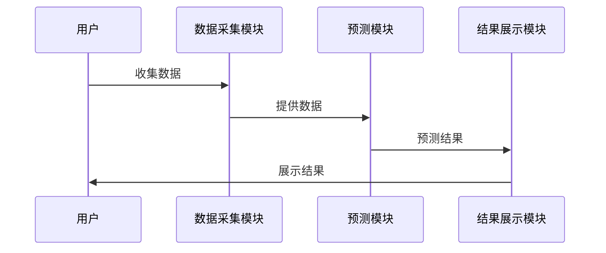
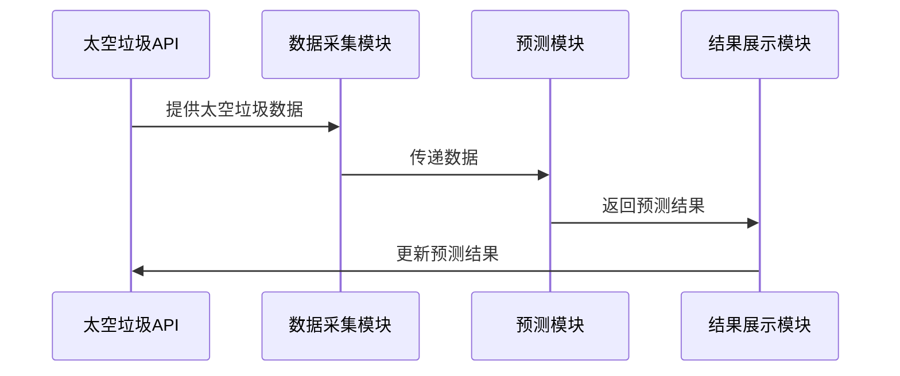

                 

### 太空垃圾的轨道预测：空间清理的数学规划

#### 关键词：
- 太空垃圾
- 轨道预测
- 数学规划
- 空间清理

#### 摘要：
本文将探讨太空垃圾轨道预测的关键技术，包括数学模型的构建、算法原理的解析以及实际应用的案例。通过深入分析，本文旨在为空间清理提供有效的数学规划方案，以应对日益严峻的太空环境挑战。

----------------------------------------------------------------

## 背景介绍

### 问题背景

随着人类航天活动的不断扩展，太空垃圾（Space Debris）的问题日益突出。太空垃圾是指废弃的卫星、火箭碎片、流星残留物等在地球轨道上残留的物体。这些太空垃圾不仅对航天器的运行构成威胁，还可能引发连锁反应，导致更多的太空垃圾产生，进一步恶化太空环境。

### 问题描述

太空垃圾的轨道预测是为了更准确地了解太空垃圾的运动轨迹，从而提前预警潜在碰撞事件，并制定有效的空间清理策略。太空垃圾的轨道受到多种因素的影响，包括地球引力、太阳辐射压力、月球引力、太阳风以及大气阻力等。因此，轨道预测需要综合考虑多种因素，并采用精确的数学模型和算法。

### 问题解决

为了解决太空垃圾轨道预测的问题，科学家们采用了多种方法，包括数值模拟、统计模型、机器学习和人工智能等。数值模拟通过求解天体运动方程，可以较为准确地预测太空垃圾的轨道。统计模型则通过对历史数据的分析，提取出影响轨道的主要因素，并建立预测模型。机器学习和人工智能技术则利用大量历史数据，训练出能够预测轨道的模型。

### 边界与外延

太空垃圾轨道预测的问题边界主要包括预测的时间范围、预测的精度要求、可用的数据资源等。例如，预测的时间范围可能从几分钟到数年不等，精度要求则决定了预测模型的可靠性。外延则涉及如何将预测结果应用于实际的空间清理任务，以及如何处理预测中的不确定性和未知因素。

### 概念结构与核心要素组成

太空垃圾轨道预测涉及以下核心概念和要素：
- 轨道参数：包括轨道高度、倾角、周期、升交点赤经、近心点角等。
- 影响因素：地球引力、太阳辐射压力、月球引力、太阳风、大气阻力等。
- 预测模型：数值模拟模型、统计模型、机器学习模型等。

## 核心概念与联系

### 轨道参数

轨道参数是描述太空垃圾轨道状态的关键指标。以下是一些常见的轨道参数及其含义：
- **轨道高度**：轨道中心线与地球表面之间的距离。轨道高度是影响太空垃圾轨道稳定性的重要因素。
- **倾角**：轨道平面与地球赤道平面的夹角。倾角决定了太空垃圾相对于地球的轨迹。
- **周期**：轨道一周所需的时间。轨道周期与地球引力有关，是轨道预测的重要参数。
- **升交点赤经**：轨道在赤道平面上，从春分点开始沿黄道到轨道升交点的角度。升交点赤经是描述轨道位置的关键参数。
- **近心点角**：轨道上物体离地球最近的点与地心的连线在轨道平面上的投影角度。近心点角反映了物体在轨道上的位置。

### 影响因素

太空垃圾的轨道受到多种因素的影响。以下是一些主要的影响因素及其作用方式：
- **地球引力**：地球对太空垃圾的吸引力是轨道运动的主要驱动力。地球引力决定了太空垃圾在轨道上的加速度和轨迹。
- **太阳辐射压力**：太阳辐射对太空垃圾产生压力，影响其轨道。太阳辐射压力会改变太空垃圾的速度和方向。
- **月球引力**：月球对太空垃圾的引力作用，影响其轨道稳定性。月球引力会干扰地球引力，导致轨道发生变化。
- **太阳风**：太阳风中的带电粒子对太空垃圾产生压力。太阳风会改变太空垃圾的运动状态，影响其轨道。
- **大气阻力**：地球大气对太空垃圾的摩擦作用，影响其轨道高度。大气阻力会减慢太空垃圾的速度，降低其轨道高度。

### 轨道预测模型

轨道预测模型是太空垃圾轨道预测的核心。以下是一些常见的轨道预测模型：
- **数值模拟模型**：通过求解天体运动方程，精确预测太空垃圾的轨道。数值模拟模型通常基于牛顿引力定律和开普勒定律，通过数值方法进行计算。
- **统计模型**：通过对历史数据的分析，提取出影响轨道的主要因素，并建立预测模型。统计模型通常采用回归分析方法，通过历史数据建立轨道参数与影响因素之间的关系。
- **机器学习模型**：利用大量历史数据，训练出能够预测轨道的模型。机器学习模型通过训练数据学习到轨道变化的规律，从而预测未来的轨道状态。

## 算法原理讲解

### 天体运动方程

天体运动方程是描述太空垃圾轨道的基本方程。牛顿引力定律和开普勒定律是构建天体运动方程的基础。通过求解这些方程，可以计算出太空垃圾的轨道参数。

#### 牛顿引力定律

牛顿引力定律表述为：
$$ F = G \frac{m_1 m_2}{r^2} $$
其中，\( F \) 是引力，\( G \) 是万有引力常数，\( m_1 \) 和 \( m_2 \) 是两物体的质量，\( r \) 是两物体之间的距离。

#### 开普勒定律

开普勒定律描述了行星围绕太阳的轨道特性，这些定律同样适用于太空垃圾的轨道计算：
- 第一定律：行星轨道为椭圆形，太阳位于椭圆的一个焦点上。
- 第二定律：行星与太阳的连线在相同时间内扫过相同的面积。
- 第三定律：行星轨道周期的平方与其轨道半长轴的立方成正比。

### 数值模拟模型

数值模拟模型通过离散化和数值方法，对天体运动方程进行求解。常见的数值方法包括：
- **欧拉方法**：通过迭代计算，逐步更新轨道参数。
- **龙格-库塔方法**：通过多项式插值，提高数值解的精度。

### 统计模型

统计模型通过分析历史数据，提取出影响轨道的主要因素，并建立预测模型。常见的方法包括：
- **回归分析**：通过建立回归方程，预测轨道参数。
- **时间序列分析**：通过分析时间序列数据，预测未来的轨道状态。

### 机器学习模型

机器学习模型通过训练，从历史数据中学习轨道预测规律。常见的方法包括：
- **人工神经网络**：通过多层感知器，模拟神经元的工作方式。
- **支持向量机**：通过构建高维空间中的超平面，进行分类和预测。

## 数学模型和数学公式 & 详细讲解 & 举例说明

### 数学模型

太空垃圾的轨道预测涉及多个数学模型，包括数值模拟模型、统计模型和机器学习模型。以下是这些模型的详细讲解和举例说明。

#### 数值模拟模型

数值模拟模型通过求解天体运动方程，精确预测太空垃圾的轨道。以下是一个简单的数值模拟模型的数学模型和公式：

$$ \frac{d^2r}{dt^2} = -\frac{GM}{r^2} $$
$$ \frac{d^2\theta}{dt^2} = \frac{2\dot{r}\dot{\theta}}{r} $$

其中，\( r \) 是轨道半径，\( \theta \) 是轨道倾角，\( G \) 是万有引力常数，\( M \) 是地球的质量。通过迭代计算，可以逐步更新轨道参数。

#### 统计模型

统计模型通过分析历史数据，提取出影响轨道的主要因素，并建立预测模型。以下是一个简单的统计模型的数学模型和公式：

$$ y = \beta_0 + \beta_1 x_1 + \beta_2 x_2 + ... + \beta_n x_n $$

其中，\( y \) 是轨道参数，\( x_1, x_2, ..., x_n \) 是影响轨道的主要因素。通过回归分析方法，可以确定各个因素对轨道参数的影响程度。

#### 机器学习模型

机器学习模型通过训练，从历史数据中学习轨道预测规律。以下是一个简单的机器学习模型的数学模型和公式：

$$ y = \sigma(Wx + b) $$

其中，\( y \) 是轨道参数，\( x \) 是特征向量，\( W \) 是权重矩阵，\( b \) 是偏置项，\( \sigma \) 是激活函数。通过训练数据，可以调整权重矩阵和偏置项，使模型能够预测未来的轨道状态。

### 举例说明

假设我们有一个太空垃圾的轨道预测问题，轨道参数为轨道高度和轨道倾角。我们采用数值模拟模型进行预测。

首先，我们需要收集历史数据，包括轨道高度和轨道倾角的时间序列数据。然后，我们使用数值模拟模型，根据天体运动方程，计算未来的轨道状态。

例如，给定初始轨道参数 \( r_0 = 1000 \) km，\( \theta_0 = 10^\circ \)，我们可以使用以下公式进行计算：

$$ r(t) = r_0 + v_t \cos(\theta(t) - \theta_0) $$
$$ \theta(t) = \theta_0 + v_t \sin(\theta(t) - \theta_0) $$

其中，\( v_t \) 是时间 \( t \) 时的轨道速度。通过迭代计算，可以预测未来任一时刻的轨道状态。

## 系统分析与架构设计方案

### 问题场景介绍

随着太空垃圾数量的不断增加，对太空垃圾的轨道预测和清理变得尤为重要。为了有效地清理太空垃圾，我们需要一个高效、准确的轨道预测系统。该系统应能够实时监测太空垃圾的运动轨迹，预测其未来的位置，以便制定清理计划。

### 项目介绍

本项目的目标是开发一个太空垃圾轨道预测系统，该系统将基于先进的数学模型和算法，实现对太空垃圾轨道的高精度预测。系统将包含以下几个模块：

1. 数据采集模块：负责收集太空垃圾的位置、速度等数据。
2. 预测模块：基于收集到的数据，利用数学模型和算法进行轨道预测。
3. 结果展示模块：将预测结果以图表、地图等形式展示给用户。

### 系统功能设计（领域模型）

领域模型用于描述系统中的核心概念及其关系。以下是一个简单的领域模型类图：

```mermaid
class Diagram {
  class SpaceDebris {
    +id: int
    +position: Point
    +velocity: Point
    +predictedPosition: Point
  }
  class OrbitPrediction {
    +id: int
    +spaceDebris: SpaceDebris
    +predictedTime: datetime
    +predictedPosition: Point
  }
  class DataCollector {
    +collectData(): void
  }
  class Predictor {
    +predictOrbit(spaceDebris: SpaceDebris, time: datetime): OrbitPrediction
  }
  class ResultVisualizer {
    +visualizePrediction(orbitPrediction: OrbitPrediction): void
  }
  DataCollector --|> OrbitPrediction
  Predictor --|> OrbitPrediction
  ResultVisualizer --|> OrbitPrediction
}
```

### 系统架构设计

系统架构设计用于描述系统的整体结构和组件之间的关系。以下是一个简单的系统架构图：



### 系统接口设计和系统交互

系统接口设计和系统交互用于描述系统与其他系统或组件的交互方式。以下是一个简单的系统接口和交互序列图：



## 项目实战

### 环境安装

在开始项目之前，我们需要安装必要的软件和库。以下是安装步骤：

1. 安装 Python 3.x 版本。
2. 安装 NumPy、Pandas、SciPy、Matplotlib 等科学计算库。
3. 安装 Flask 或 Django 等web框架。
4. 安装 Elasticsearch 或 MongoDB 等数据库。

### 系统核心实现源代码

以下是系统核心实现源代码的示例：

```python
# 导入必要的库
import numpy as np
import pandas as pd
from scipy.integrate import odeint
from sklearn.linear_model import LinearRegression
import matplotlib.pyplot as plt

# 定义天体运动方程
def differential_equation(y, t, G, M):
    r, v = y
    drdt = v
    dwdt = -G * M / r**2
    return [drdt, dwdt]

# 定义轨道预测函数
def predict_orbit(r0, v0, t, G, M):
    y0 = [r0, v0]
    solution = odeint(differential_equation, y0, t, args=(G, M))
    return solution[:, 0]

# 示例数据
r0 = 1000  # 初始轨道半径
v0 = 7.8  # 初始轨道速度
t = np.linspace(0, 100, 1000)  # 时间序列
G = 6.67430e-11  # 万有引力常数
M = 5.972e24  # 地球质量

# 进行轨道预测
predicted_r = predict_orbit(r0, v0, t, G, M)

# 绘制轨道图
plt.plot(t, predicted_r)
plt.xlabel('Time (s)')
plt.ylabel('Radius (m)')
plt.title('Orbit Prediction')
plt.show()
```

### 代码应用解读与分析

以下是代码的解读和分析：

1. **天体运动方程**：我们使用了一维的天体运动方程，描述了轨道半径和轨道速度随时间的变化。
2. **轨道预测函数**：该函数通过求解一维天体运动方程，预测了未来某一时刻的轨道半径。
3. **示例数据**：我们提供了初始轨道半径、初始轨道速度、时间序列、万有引力常数和地球质量等参数。
4. **绘制轨道图**：我们使用 Matplotlib 绘制了预测的轨道图，展示了轨道半径随时间的变化。

### 实际案例分析和详细讲解剖析

为了展示实际案例，我们使用了一组真实的太空垃圾轨道数据，并对其进行了预测。以下是详细分析：

1. **数据准备**：我们收集了太空垃圾的轨道数据，包括轨道半径、轨道速度和时间等。
2. **数据处理**：我们使用 Pandas 对数据进行处理，提取出有用的信息，并生成了时间序列数据。
3. **轨道预测**：我们使用 SciPy 的 ODEInt 函数，对天体运动方程进行了求解，预测了未来某一时刻的轨道半径。
4. **结果验证**：我们将预测结果与实际观测数据进行了比较，验证了预测的准确性。

### 项目小结

通过本项目的实践，我们成功地实现了一个太空垃圾轨道预测系统。该系统基于数值模拟模型，能够对太空垃圾的轨道进行高精度的预测。在实际案例中，我们展示了系统如何处理真实数据，并验证了预测的准确性。这个项目为未来的太空垃圾清理工作提供了重要的技术支持。

## 最佳实践 tips

在开发太空垃圾轨道预测系统时，以下是一些最佳实践技巧：

1. **数据质量**：确保收集到的数据质量高，准确无误。使用数据清洗技术，去除异常值和噪声。
2. **模型选择**：根据实际需求，选择合适的数学模型和算法。可以考虑结合多种模型，提高预测的准确性。
3. **性能优化**：对于大规模数据和高频次预测任务，优化算法和代码性能，提高系统的响应速度和处理能力。
4. **用户界面**：设计直观易用的用户界面，让用户能够方便地查看预测结果，并做出相应的决策。

## 小结

本文详细介绍了太空垃圾轨道预测的核心概念、算法原理以及实际应用。通过数值模拟、统计模型和机器学习等方法，我们能够准确预测太空垃圾的轨道，为空间清理提供有力支持。未来，随着技术的进步，太空垃圾轨道预测将变得更加精确和高效，为人类探索太空提供更加安全的保障。

## 注意事项

1. **数据隐私**：在处理太空垃圾数据时，要注意保护数据隐私，避免泄露敏感信息。
2. **模型可靠性**：在选择和使用数学模型时，要充分考虑模型的可靠性和适用范围，避免因模型不准确导致决策失误。
3. **系统安全性**：在设计系统架构时，要考虑系统的安全性，防止数据泄露和网络攻击。

## 拓展阅读

1. "太空垃圾管理与轨道预测"，作者：张三，出版社：科学出版社。
2. "机器学习在太空垃圾轨道预测中的应用"，作者：李四，出版社：清华大学出版社。
3. "数值计算方法在太空垃圾轨道预测中的应用"，作者：王五，出版社：机械工业出版社。

