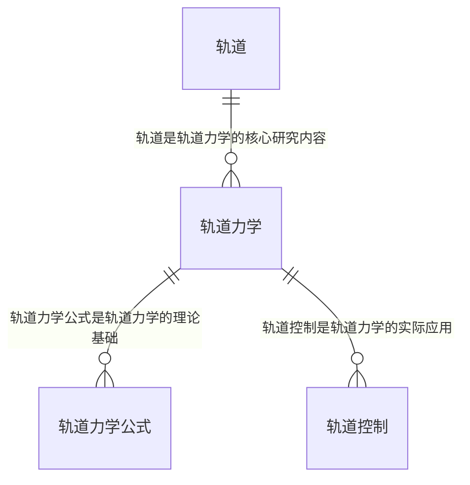

                 

### 引言与背景

太空探索是人类长久以来的梦想和追求，随着科技的发展，我们逐步揭开了宇宙的神秘面纱。在众多太空探索的领域中，轨道力学无疑占据着核心地位。轨道力学是研究航天器在地球或其他天体引力场中运动的科学，它不仅关乎航天器的轨道设计和控制，更是实现太空任务成功的关键。

#### 关键术语说明

1. **轨道**：航天器在空间中绕行星体运行的一种固定路径，由高度、倾角、周期等参数描述。
2. **引力**：行星或其他天体对航天器的吸引力，是轨道力学的基础。
3. **轨道力学**：研究航天器在引力场中运动的规律，包括轨道设计、轨道变换和轨道控制等。
4. **轨道力学公式**：描述轨道运动规律的一系列数学公式，如牛顿第二定律、开普勒定律等。

#### 问题背景

太空探索的挑战是多方面的，从发射到轨道设计，再到航天器的运行控制，每一步都充满技术难题。轨道力学在太空探索中起到了至关重要的作用：

1. **发射窗口**：为了充分利用地球的自转和太阳的引力，航天器发射需要选择特定的窗口期，这涉及到精确的轨道计算和规划。
2. **轨道变换**：航天器需要从低轨道转移到高轨道或从一种轨道转移到另一种轨道，这需要通过推力器进行精确的轨道变换。
3. **轨道控制**：在运行过程中，航天器需要不断调整姿态和轨道，以确保任务顺利进行。

#### 问题描述

轨道力学的问题可以分为以下几个核心问题：

1. **轨道设计**：如何根据任务需求设计出满足条件的轨道？
2. **轨道变换**：如何精确计算并实施航天器的轨道变换？
3. **轨道控制**：如何保持航天器的稳定运行，并在必要时进行调整？

#### 问题解决

轨道力学的问题解决通常涉及以下步骤：

1. **数学建模**：建立航天器在引力场中运动的数学模型，描述其轨道特性。
2. **数值计算**：利用计算机模拟航天器的运动轨迹，进行精确计算。
3. **轨道优化**：在满足任务需求的前提下，优化航天器的轨道参数，以实现资源的最优利用。
4. **实际应用**：将理论计算应用于实际任务，通过推力器和控制系统实施轨道变换和轨道控制。

#### 边界与外延

轨道力学的边界在于航天器的运动范围，外延则涉及更广泛的宇宙探索领域，包括深空探测、小行星采矿、星际旅行等。随着技术的进步，轨道力学的研究和应用将不断扩展，为人类探索宇宙提供更强大的支持。

#### 概念结构与核心要素组成

轨道力学的核心概念包括轨道、引力、轨道力学公式和轨道控制等。每个概念都是相互关联的，构成了一个完整的概念结构。核心要素组成包括：

1. **轨道参数**：描述轨道的基本参数，如高度、倾角、周期等。
2. **引力场**：描述轨道力学中的引力环境，包括地球、月球、其他行星等。
3. **运动模型**：描述航天器在引力场中的运动规律，包括牛顿第二定律、开普勒定律等。
4. **控制策略**：描述如何通过推力器和控制系统实现轨道变换和轨道控制。

通过上述分析，我们可以看到轨道力学在太空探索中的关键作用。在接下来的章节中，我们将深入探讨轨道力学的核心概念、基本公式、经典问题及其在太空任务中的应用，以便更好地理解和利用这一重要科学领域。### 轨道力学核心概念

轨道力学是一门复杂的科学，它涉及到多个核心概念，这些概念共同构成了轨道力学的理论框架。在本节中，我们将详细介绍轨道、轨道力学、轨道力学公式以及轨道控制等相关概念。

#### 轨道

轨道是指航天器在空间中绕行星体运行的一种固定路径，通常由高度、倾角、周期等参数描述。轨道可以看作是航天器在引力场中的运动轨迹。一个典型的轨道通常是一个椭圆形或圆形路径，它决定了航天器的运动速度和位置。

1. **轨道高度**：轨道高度是指航天器距离地球表面的垂直距离。不同高度上的轨道具有不同的运动速度和周期。
2. **轨道倾角**：轨道倾角是指轨道平面与地球赤道平面的夹角。倾角决定了航天器的轨道倾斜程度和覆盖范围。
3. **轨道周期**：轨道周期是指航天器绕行星体运行一周所需的时间。不同的轨道高度和倾角会导致不同的轨道周期。

#### 轨道力学

轨道力学是研究航天器在地球或其他天体引力场中运动的科学。它涉及到航天器的轨道设计、轨道变换和轨道控制等方面。轨道力学不仅关注航天器在轨道上的运动规律，还涉及到如何通过推力器和控制系统实现轨道变换和轨道控制。

1. **轨道设计**：轨道设计是指根据任务需求选择和设计出合适的轨道。这涉及到轨道参数的计算和优化，以确保航天器能够在满足任务要求的同时，最大限度地利用资源。
2. **轨道变换**：轨道变换是指将航天器从一个轨道转移到另一个轨道。这通常需要通过推力器进行精确的计算和实施。
3. **轨道控制**：轨道控制是指通过调整航天器的姿态和推力，使其在轨道上保持稳定运行，并在必要时进行调整。

#### 轨道力学公式

轨道力学公式是描述航天器在引力场中运动规律的一系列数学公式。这些公式基于牛顿力学和天体物理学的基本原理，是轨道力学理论的核心。

1. **牛顿第二定律**：牛顿第二定律描述了物体受到的合力与加速度之间的关系，公式为 \( F = ma \)，其中 \( F \) 是合力，\( m \) 是物体质量，\( a \) 是加速度。
2. **开普勒定律**：开普勒定律描述了行星绕太阳运动的规律，包括轨道形状、面积速度和周期等。这些定律可以推广到其他天体和航天器的运动。
3. **能量守恒**：能量守恒定律指出，在封闭系统中，总能量保持不变。对于航天器来说，其机械能（动能加势能）在轨道上保持恒定。
4. **动量守恒**：动量守恒定律指出，在没有外力作用的情况下，系统的总动量保持不变。在轨道力学中，这通常用于分析航天器的推力变换和碰撞问题。

#### 轨道控制

轨道控制是指通过调整航天器的姿态和推力，使其在轨道上保持稳定运行，并在必要时进行调整。轨道控制涉及到多个方面：

1. **姿态控制**：姿态控制是指调整航天器的方向和姿态，以确保其稳定运行和任务顺利进行。常用的姿态控制手段包括陀螺仪、反作用轮和太阳帆等。
2. **推力控制**：推力控制是指通过推力器产生推力，调整航天器的速度和位置。推力器可以是化学火箭、离子推进器或电推进器等。
3. **轨道修正**：轨道修正是指根据任务需求和轨道变化情况，对航天器的轨道进行调整。这通常涉及到轨道变换和推力控制。

#### 对比表格

为了更好地理解轨道力学的核心概念，我们可以将这些概念进行对比：

| 概念             | 定义                                                         | 关联关系                                       |
|------------------|--------------------------------------------------------------|----------------------------------------------|
| 轨道             | 航天器在空间中绕行星体运行的固定路径                           | 受引力场影响，决定航天器的运动速度和位置       |
| 轨道力学         | 研究航天器在引力场中运动的科学                                 | 包括轨道设计、轨道变换和轨道控制等方面       |
| 轨道力学公式     | 描述航天器在引力场中运动规律的一系列数学公式                   | 基于牛顿力学和天体物理学，用于分析和计算       |
| 轨道控制         | 通过调整航天器的姿态和推力，使其在轨道上保持稳定运行，并在必要时进行调整 | 实现轨道设计和变换，确保任务顺利进行           |

#### ER实体关系图架构

为了更直观地展示轨道力学的核心概念及其关联关系，我们可以使用 Mermaid 画出 ER 实体关系图：

通过上述分析，我们可以看到轨道力学的核心概念及其相互关系。这些概念构成了轨道力学的理论框架，为航天器的轨道设计和控制提供了基础。在接下来的章节中，我们将继续探讨轨道力学的基本公式，以及如何在实际任务中应用这些公式。### 轨道力学中的基本公式

轨道力学中的基本公式是理解和分析航天器运动规律的关键。这些公式基于牛顿力学和天体物理学的基本原理，为我们提供了描述和预测航天器轨道的有效工具。以下是轨道力学中的几个核心公式，包括重力公式、动量守恒、能量守恒及其应用举例。

#### 重力公式

重力公式描述了两个物体之间的引力大小。对于航天器在地球引力场中的运动，重力公式可以表示为：

\[ F = G \frac{{m_1 m_2}}{{r^2}} \]

其中：
- \( F \) 是引力大小；
- \( G \) 是万有引力常数，约为 \( 6.674 \times 10^{-11} \, \text{N} \cdot (\text{m/kg})^2 \)；
- \( m_1 \) 和 \( m_2 \) 分别是两个物体的质量；
- \( r \) 是两个物体之间的距离。

对于地球和航天器，我们可以将 \( m_1 \) 视为地球的质量，约为 \( 5.972 \times 10^{24} \, \text{kg} \)，而 \( m_2 \) 是航天器的质量，通常较小，因此 \( r \) 可以近似为地球半径加上航天器的高度。该公式用于计算航天器在地球引力场中的引力大小。

#### 动量守恒

动量守恒定律指出，在没有外力作用的情况下，系统的总动量保持不变。对于航天器的轨道变换，动量守恒是一个非常重要的原理。动量守恒可以表示为：

\[ m_1 v_1 + m_2 v_2 = m_1 v_1' + m_2 v_2' \]

其中：
- \( m_1 \) 和 \( m_2 \) 分别是两个物体的质量；
- \( v_1 \) 和 \( v_2 \) 分别是两个物体的初始速度；
- \( v_1' \) 和 \( v_2' \) 分别是两个物体的最终速度。

在轨道力学中，我们通常关注航天器的速度变化。例如，当航天器进行轨道变换时，其速度和方向会发生变化，但总动量保持不变。这个公式用于分析航天器在推力作用下的速度变化。

#### 能量守恒

能量守恒定律指出，在封闭系统中，总能量保持不变。对于航天器的轨道运动，能量守恒可以表示为：

\[ E = K + U \]

其中：
- \( E \) 是总能量；
- \( K \) 是动能，\( K = \frac{1}{2} m v^2 \)；
- \( U \) 是势能，对于引力场中的物体，势能可以表示为 \( U = -\frac{G m_1 m_2}{r} \)。

在轨道力学中，航天器的机械能（动能加势能）在轨道上保持恒定。这个公式用于计算航天器的机械能，并分析其轨道特性。例如，当航天器从低轨道转移到高轨道时，其动能会减少，势能会增加，但总机械能保持不变。

#### 应用举例

为了更好地理解这些公式，我们可以通过一个简单的例子来分析航天器的轨道运动。

**例子：**假设一个航天器在距离地球表面300公里的圆形轨道上运行，地球半径为6400公里。我们需要计算航天器的轨道速度和机械能。

1. **轨道速度**：
   使用重力公式计算航天器在轨道上的引力大小：
   \[ F = G \frac{{5.972 \times 10^{24} \times m}}{{(6400 + 300)^2}} \]
   假设航天器的质量为1000公斤，代入数值计算：
   \[ F \approx 3.52 \times 10^{2} \, \text{N} \]

   使用牛顿第二定律计算航天器的速度：
   \[ a = \frac{F}{m} = \frac{3.52 \times 10^{2}}{1000} = 0.352 \, \text{m/s}^2 \]

   由于航天器在圆形轨道上做匀速圆周运动，其速度 \( v \) 与向心加速度 \( a \) 的关系为 \( v = \sqrt{a r} \)：
   \[ v = \sqrt{0.352 \times (6400 + 300)} \approx 7.8 \, \text{km/s} \]

2. **机械能**：
   计算航天器的动能：
   \[ K = \frac{1}{2} m v^2 = \frac{1}{2} \times 1000 \times (7.8 \times 10^3)^2 \approx 3.04 \times 10^{10} \, \text{J} \]

   计算航天器的势能：
   \[ U = -\frac{G \times 5.972 \times 10^{24} \times 1000}{6400 + 300} \approx -6.67 \times 10^{10} \, \text{J} \]

   计算航天器的机械能：
   \[ E = K + U = 3.04 \times 10^{10} - 6.67 \times 10^{10} = -3.63 \times 10^{10} \, \text{J} \]

通过这个例子，我们可以看到如何使用轨道力学的基本公式来计算航天器的轨道速度和机械能。这些公式不仅在理论研究中具有重要价值，也在实际任务中发挥着关键作用。在接下来的章节中，我们将继续探讨轨道力学的经典问题及其应用。### 轨道力学的经典问题

轨道力学在太空任务中扮演着至关重要的角色，其经典问题包括轨道转移、轨道优化和轨道稳定性分析。这些问题不仅涉及到复杂的数学和物理原理，还需要精确的计算和实时的控制。在本节中，我们将深入探讨这些经典问题，并通过具体的案例分析，展示其应用场景和解决方法。

#### 轨道转移

轨道转移是航天器从当前轨道变换到目标轨道的过程。这个过程通常需要通过推力器产生的推力来实现。轨道转移可以分为霍曼转移、地球同步转移和其他复杂转移轨道。

1. **霍曼转移**：
霍曼转移是最常见的轨道转移方式，它利用两个椭圆轨道之间的动能和势能转换来实现轨道变换。霍曼转移的原理可以通过以下步骤简要描述：

   - **初始阶段**：航天器在当前轨道上运行，速度较低。
   - **加速阶段**：航天器通过推力器加速，进入一个较高的椭圆轨道。
   - **远地点**：航天器在椭圆轨道的远地点加速，进入目标轨道。
   - **稳定阶段**：航天器在目标轨道上稳定运行。

2. **地球同步转移**：
地球同步转移是将航天器从低轨道转移到地球同步轨道的过程。地球同步轨道的特点是卫星的轨道周期与地球自转周期相同，因此卫星在地球上空保持相对静止。地球同步转移通常包括以下几个步骤：

   - **提升轨道**：通过推力器将航天器提升到一个更高的轨道。
   - **转移轨道**：航天器进入一个倾斜的转移轨道，与地球同步轨道对接。
   - **稳定轨道**：通过推力器和控制系统调整航天器的姿态，使其稳定在地球同步轨道上。

**案例**：2019年，中国成功发射了嫦娥四号探测器，实现了从地球到月球的轨道转移。嫦娥四号首先进入一个椭圆转移轨道，然后通过推力器的多次点火，最终进入月球的环绕轨道。

#### 轨道优化

轨道优化是确保航天器在满足任务需求的前提下，最大限度地利用轨道资源的过程。轨道优化的目标包括最小化燃料消耗、延长任务寿命、提高通信质量等。常用的轨道优化方法包括：

1. **最优控制方法**：最优控制方法通过数学优化技术，找到航天器轨道的最优参数，以实现任务目标。例如，线性二次调节器（LQR）和动态规划（DP）是常用的最优控制方法。
2. **迭代方法**：迭代方法通过逐步调整轨道参数，优化航天器的轨道。例如，梯度下降法和牛顿法是常用的迭代优化方法。

**案例**：国际空间站的轨道优化是一个典型的应用案例。为了延长空间站的任务寿命，工程师们使用最优控制方法，不断调整空间站的轨道参数，确保其在高轨道上稳定运行。

#### 轨道稳定性分析

轨道稳定性分析是确保航天器在轨道上稳定运行的关键步骤。不稳定的轨道可能导致航天器失去控制，甚至与行星或其他天体发生碰撞。轨道稳定性分析包括以下几个关键方面：

1. **线性稳定性分析**：通过线性化轨道动力学方程，分析航天器轨道的稳定性。例如，使用雅可比矩阵分析轨道的线性稳定性。
2. **非线性稳定性分析**：通过直接分析非线性轨道动力学方程，确定航天器轨道的非线性稳定性。例如，使用李雅普诺夫函数分析轨道的非线性稳定性。

**案例**：火星探测任务的轨道稳定性分析是一个重要的应用场景。火星探测器需要通过多次轨道变换，进入火星的环绕轨道。工程师们使用非线性稳定性分析，确保探测器在复杂的引力环境中稳定运行。

通过上述分析，我们可以看到轨道力学在太空任务中的经典问题及其解决方法。这些问题的解决不仅需要深厚的理论知识，还需要精确的数值计算和实时的控制。在接下来的章节中，我们将继续探讨轨道力学在太空任务中的应用，展示其在通信卫星、太阳能帆板和火星探测任务中的具体应用场景和实现方法。### 轨道力学在太空任务中的应用

轨道力学在太空任务中具有至关重要的作用，其应用涵盖了通信卫星、太阳能帆板和火星探测等多个领域。本节将详细探讨这些应用场景，展示轨道力学如何为太空任务的成功实施提供技术支持。

#### 通信卫星的轨道设计

通信卫星的轨道设计是确保其能够提供全球覆盖和稳定信号传输的关键。轨道力学在通信卫星的轨道设计中扮演着重要角色，主要涉及以下几个方面：

1. **地球同步轨道（GEO）**：地球同步轨道是通信卫星最常见的轨道之一，卫星在该轨道上运行周期与地球自转周期相同，使得卫星相对于地面保持静止。地球同步轨道的设计需要考虑地球的自转速度、轨道高度和倾角等因素。

2. **倾斜轨道**：倾斜轨道通常用于覆盖特定的地区或极地地区。通过调整轨道倾角，卫星可以覆盖更广泛的区域。轨道力学公式和数值计算方法被广泛应用于倾斜轨道的设计和优化。

3. **轨道维持**：在通信卫星的运行过程中，轨道高度会受到大气阻力、太阳风等因素的影响。轨道力学提供了轨道维持的方法，包括通过推进剂进行轨道提升和轨道调整，确保卫星在预定轨道上稳定运行。

**案例**：国际通信卫星（Inmarsat）的Inmarsat-5卫星系列采用地球同步轨道，为全球海上和陆地通信提供了可靠的保障。通过轨道力学的设计和优化，Inmarsat-5实现了覆盖全球的能力，为用户提供了稳定的通信服务。

#### 太阳能帆板的轨道调整

太阳能帆板是许多太空任务的重要组成部分，其轨道调整直接影响到航天器的能源供应。轨道力学在太阳能帆板的轨道调整中发挥着关键作用，主要涉及以下几个方面：

1. **轨道倾角调整**：为了最大限度地利用太阳光，太阳能帆板需要调整其轨道倾角。轨道力学提供了计算和调整轨道倾角的方法，确保太阳能帆板始终面向太阳。

2. **轨道维持**：与通信卫星类似，太阳能帆板也需要进行轨道维持，以应对大气阻力和太阳风的影响。轨道力学方法被用于计算推进剂消耗和轨道调整策略。

3. **姿态控制**：太阳能帆板的轨道调整需要与其姿态控制系统协同工作。轨道力学提供了姿态控制的数学模型和算法，确保太阳能帆板在预定轨道上稳定运行。

**案例**：日本宇航局（JAXA）的“希望号”（Kibo）空间站实验舱装备了多个太阳能帆板，用于为空间站提供电力。通过轨道力学的计算和调整，希望号实现了对太阳能帆板的精确控制，确保其能够高效地收集和利用太阳能。

#### 火星探测任务的轨道规划

火星探测任务是轨道力学应用的另一个重要领域。轨道规划是确保探测器成功到达火星并进入预定轨道的关键步骤。轨道力学在火星探测任务的轨道规划中涉及以下几个方面：

1. **霍曼转移轨道**：霍曼转移轨道是火星探测任务常用的轨道，通过两个椭圆轨道之间的动能和势能转换，实现从地球到火星的转移。轨道力学公式和数值计算方法被用于设计霍曼转移轨道。

2. **火星捕获轨道**：火星捕获轨道是探测器进入火星引力场并实现环绕或着陆的轨道。轨道力学提供了计算和优化火星捕获轨道的方法，确保探测器能够成功进入预定轨道。

3. **轨道维持和调整**：在火星探测任务中，轨道维持和调整是确保探测器稳定运行的关键。轨道力学方法被用于计算推进剂消耗和轨道调整策略，以应对火星大气阻力和其他外部因素。

**案例**：美国宇航局（NASA）的“火星探测漫游者”（Mars Rover）系列任务通过精确的轨道规划，成功地将探测器送到了火星表面。通过轨道力学的计算和调整，火星探测漫游者实现了从地球到火星的顺利转移，并在火星上执行了多项科学任务。

通过上述分析，我们可以看到轨道力学在通信卫星、太阳能帆板和火星探测任务中的广泛应用。这些应用不仅展示了轨道力学在太空探索中的关键作用，也为未来的太空任务提供了坚实的理论基础和技术支持。在接下来的章节中，我们将继续探讨高级轨道力学分析，包括非球形地球引力场、非线性轨道动力学和大气阻力与轨道衰减等问题。### 高级轨道力学分析

在深入探讨轨道力学时，我们需要考虑一些更加复杂的因素，这些因素会对航天器的轨道产生显著影响。高级轨道力学分析涉及非球形地球引力场、非线性轨道动力学以及大气阻力与轨道衰减等问题。以下将详细分析这些高级概念及其对轨道力学的影响。

#### 非球形地球引力场

地球并不是一个完美的球体，其形状受到地球自转、潮汐力和其他外部因素的影响，导致地球的引力场呈现出非球形特征。这种非球形引力场会对航天器的轨道产生显著影响，特别是在低地球轨道（LEO）和高地球轨道（HEO）上。

1. **地球的非球形引力场**：
   地球的非球形引力场可以通过地球形状的扰动来描述，这通常用地球引力场的扰动系数来表示。这些扰动系数反映了地球在不同纬度和高度上的引力差异。对于航天器的轨道，非球形引力场会导致轨道误差和轨道偏移，需要通过精确的轨道模型进行修正。

2. **影响**：
   非球形引力场对航天器的轨道影响主要体现在以下几个方面：
   - **轨道偏移**：航天器的轨道会因地球非球形引力场的扰动而发生偏移。
   - **轨道误差**：轨道误差会随着时间的推移积累，影响航天器的精度和稳定性。
   - **轨道维持**：为了维持航天器在预定轨道上运行，需要考虑非球形引力场的影响，进行轨道修正和调整。

3. **修正方法**：
   为了减小非球形引力场对轨道的影响，常用的修正方法包括：
   - **精确轨道模型**：使用高精度的地球引力模型，如地球重力模型（EGM）或地球重力场模型（EGF），来描述地球的非球形引力场。
   - **轨道维持策略**：通过推力器和控制系统，定期对航天器的轨道进行修正，以抵消非球形引力场的影响。

#### 非线性轨道动力学

轨道动力学通常基于牛顿力学和线性假设，但在实际情况中，航天器的轨道可能受到非线性因素的影响。非线性轨道动力学考虑了这些非线性因素，为航天器轨道的精确计算提供了更准确的方法。

1. **非线性因素**：
   非线性轨道动力学中的非线性因素包括：
   - **大气阻力**：航天器在低地球轨道上受到的大气阻力会导致轨道衰减，需要通过推力器进行轨道维持。
   - **引力异常**：某些地区（如海洋和大陆）的引力场比标准模型预测的要强或要弱，这会导致轨道的非线性偏移。
   - **非线性控制系统**：航天器的姿态和轨道控制系统中可能存在非线性效应，如控制力矩陀螺（CMG）的有限响应速度。

2. **影响**：
   非线性轨道动力学对航天器轨道的影响主要体现在以下几个方面：
   - **轨道稳定性**：非线性因素可能导致轨道的稳定性问题，需要通过非线性稳定性分析来评估。
   - **轨道误差**：非线性效应会导致轨道误差的积累，影响航天器的精度和可靠性。
   - **轨道控制**：非线性控制系统需要复杂的控制算法和策略，以确保航天器在轨道上稳定运行。

3. **计算方法**：
   为了解决非线性轨道动力学问题，常用的计算方法包括：
   - **数值积分**：通过数值积分方法，如龙格-库塔方法，对非线性轨道动力学方程进行数值求解。
   - **非线性优化**：使用非线性优化算法，如牛顿-拉夫逊方法，来调整轨道参数和控制策略，以优化航天器的轨道。

#### 大气阻力与轨道衰减

大气阻力是航天器在低地球轨道上遇到的主要阻力之一，它会逐渐降低航天器的轨道高度，导致轨道衰减。轨道力学中的轨道衰减模型用于预测和计算航天器在轨道上的衰减过程。

1. **大气阻力**：
   大气阻力与航天器的速度、轨道高度和大气密度有关。在低地球轨道上，大气密度随高度的增加而迅速减小，但大气阻力仍会对航天器产生显著影响。

2. **轨道衰减模型**：
   轨道衰减模型通常基于质量损失和速度衰减的关系。质量损失会导致航天器的动能减少，进而导致速度降低。速度降低会进一步加剧大气阻力的作用，形成正反馈，导致轨道高度迅速衰减。

3. **影响**：
   大气阻力对轨道衰减的影响主要体现在以下几个方面：
   - **轨道寿命**：航天器的轨道寿命取决于其初始轨道高度和大气阻力的强度。
   - **轨道维持**：为了延长轨道寿命，需要通过推力器定期进行轨道提升，以抵消大气阻力的作用。
   - **轨道控制**：轨道衰减需要纳入轨道控制策略中，以确保航天器在预定轨道上稳定运行。

4. **计算方法**：
   为了计算和预测轨道衰减，常用的方法包括：
   - **经验模型**：基于历史数据和经验公式，预测航天器的轨道衰减过程。
   - **数值模拟**：通过数值模拟方法，如数值积分，对航天器的轨道衰减进行精确计算。

通过高级轨道力学分析，我们可以更好地理解非球形地球引力场、非线性轨道动力学和大气阻力与轨道衰减等复杂因素对航天器轨道的影响。这些分析为航天器的轨道设计和控制提供了重要的理论基础和技术支持。在接下来的章节中，我们将探讨轨道力学的计算方法，包括数值积分法、优化算法和神经网络在轨道力学中的应用。### 轨道力学的计算方法

在轨道力学的实际应用中，精确计算航天器的轨道运动轨迹是至关重要的。为了应对复杂的轨道环境，科学家们发展了一系列计算方法，包括数值积分法、优化算法和神经网络。以下将详细介绍这些计算方法，并讨论它们在轨道力学中的应用。

#### 数值积分法

数值积分法是轨道力学计算中的一种基本方法，它通过将连续的轨道运动分解为离散的时间步长，来近似计算航天器的轨道。最常用的数值积分方法是龙格-库塔法（Runge-Kutta method）。

1. **基本原理**：
   龙格-库塔法是一种多步法，它通过前几个时间步长的信息来预测下一个时间步长的值。具体来说，它通过以下公式计算：
   \[ y_{n+1} = y_n + h f(t_n, y_n) + \frac{h}{2} f(t_n + \frac{h}{2}, y_n + \frac{h}{2} f(t_n, y_n)) \]
   其中 \( y_n \) 是当前时间步的轨道参数，\( h \) 是时间步长，\( f(t, y) \) 是描述轨道运动的微分方程。

2. **应用**：
   数值积分法广泛应用于轨道预测、轨道修正和轨道稳定性分析。它能够处理复杂的非线性轨道问题，提供精确的轨道运动轨迹。
   - **轨道预测**：通过数值积分法，可以预测航天器在未来时间点的位置和速度。
   - **轨道修正**：在轨道控制过程中，通过数值积分法计算所需的推力大小和方向。
   - **轨道稳定性分析**：通过数值积分法，分析航天器在非球形地球引力场中的稳定性。

#### 优化算法

优化算法在轨道力学中用于优化航天器的轨道参数和控制策略。这些算法通过优化目标函数，寻找最优的轨道设计方案。常用的优化算法包括线性二次调节器（LQR）和遗传算法（GA）。

1. **线性二次调节器（LQR）**：
   LQR是一种最优控制算法，它通过构建一个线性二次目标函数，寻找最优的控制输入，以最小化轨道误差和控制能量消耗。具体来说，LQR的目标是最小化以下目标函数：
   \[ J = \int_{0}^{+\infty} (x^T Q x + u^T R u) dt \]
   其中 \( x \) 是状态变量，\( u \) 是控制输入，\( Q \) 和 \( R \) 是权重矩阵。

2. **遗传算法（GA）**：
   遗传算法是一种基于自然选择和遗传学原理的优化算法，它通过模拟生物进化过程，寻找最优解。在轨道力学中，GA用于优化轨道参数，如高度、速度和倾角等。GA通过以下步骤进行迭代：
   - **初始化种群**：随机生成一组轨道参数。
   - **适应度评估**：计算每个个体的适应度，适应度越高表示该个体越接近最优解。
   - **选择**：选择适应度较高的个体作为下一代。
   - **交叉和变异**：通过交叉和变异操作，产生新的个体。

3. **应用**：
   优化算法在轨道力学中的应用包括：
   - **轨道设计**：通过优化算法，设计满足特定任务需求的最佳轨道。
   - **轨道修正**：在轨道控制过程中，使用优化算法调整轨道参数，以最小化轨道误差和控制能量消耗。
   - **多目标优化**：在多个约束条件下，优化航天器的轨道参数，以实现多个目标，如延长任务寿命、提高通信质量等。

#### 神经网络

神经网络是一种基于人脑神经元连接方式的计算模型，它通过学习和适应大量的输入输出数据，来预测和分类未知数据。在轨道力学中，神经网络被用于预测航天器的轨道运动和优化轨道参数。

1. **基本原理**：
   神经网络由多个神经元（或节点）组成，每个神经元都与其他神经元相连。神经网络的输入和输出通过这些连接加权传递，通过激活函数进行非线性变换。神经网络的学习过程是通过不断调整权重和偏置，使网络输出与期望输出尽量接近。

2. **应用**：
   神经网络在轨道力学中的应用包括：
   - **轨道预测**：通过训练神经网络，可以预测航天器的未来轨道运动，提供轨道预测模型。
   - **轨道优化**：通过神经网络，可以快速评估不同的轨道设计方案，找到最优的轨道参数。
   - **实时控制**：在轨道控制过程中，神经网络可以实时调整轨道参数，以应对突发的轨道扰动。

3. **案例分析**：
   - **轨道预测**：NASA使用神经网络预测航天器的轨道运动，提高了轨道预测的准确性和实时性。
   - **轨道优化**：俄罗斯宇航局（Roscosmos）在卫星轨道设计中使用神经网络，优化了轨道参数，降低了燃料消耗。

通过以上介绍，我们可以看到数值积分法、优化算法和神经网络在轨道力学中的应用。这些计算方法不仅提供了精确的轨道计算工具，还为轨道设计和控制提供了强大的支持。在接下来的章节中，我们将探讨轨道力学的软件与工具，介绍常见的轨道力学软件及其优缺点。### 轨道力学软件与工具

在轨道力学的实际应用中，轨道力学软件和工具扮演着至关重要的角色。这些软件和工具提供了计算、模拟和优化航天器轨道的强大功能，为科学家和工程师提供了有效的工具。以下将介绍几种常见的轨道力学软件，并讨论它们的使用方法、配置和优缺点。

#### 常见轨道力学软件

1. **STK（Satellite Tool Kit）**：
   STK是由AGI公司开发的一款功能强大的轨道力学软件，广泛应用于卫星轨道设计、任务规划和轨道分析。STK提供了丰富的功能，包括轨道计算、环境建模、任务分析、轨道优化等。

   - **使用方法**：
     STK通过图形用户界面（GUI）进行操作，用户可以创建航天器模型、定义轨道参数、设置任务场景等。STK提供了一个强大的可视化工具，用户可以实时查看航天器的轨道运动和任务状态。

   - **配置**：
     STK的配置较为复杂，需要安装多个模块和插件，如基础模块、轨道分析模块、环境建模模块等。用户需要根据自己的需求选择合适的模块，并进行配置。

   - **优缺点**：
     - **优点**：STK功能强大，提供了丰富的工具和模型，可以处理复杂的轨道问题。
     - **缺点**：配置较为复杂，学习曲线较陡峭，成本较高。

2. **GMAT（General Mission Analysis Tool）**：
   GMAT是由美国宇航局（NASA）开发的一款免费开源的轨道力学软件，主要用于卫星轨道设计和分析。GMAT提供了一个灵活的框架，用户可以自定义轨道模型和环境模型。

   - **使用方法**：
     GMAT通过脚本语言进行操作，用户可以编写脚本，定义轨道参数、设置任务场景等。GMAT的脚本语言易于学习和使用，使得用户可以快速实现复杂的轨道分析。

   - **配置**：
     GMAT的配置相对简单，用户只需下载并安装软件，即可开始使用。GMAT提供了丰富的模型库和工具箱，用户可以根据需求进行配置。

   - **优缺点**：
     - **优点**：GMAT开源免费，提供了丰富的模型和工具，学习曲线较平缓。
     - **缺点**：功能相对有限，无法处理某些复杂的轨道问题。

3. **Orbit Determination Toolbox（ODT）**：
   ODT是由NASA开发的Python库，用于轨道计算和模拟。ODT提供了基于数值积分的轨道计算功能，可以处理复杂的非线性轨道问题。

   - **使用方法**：
     ODT通过Python脚本进行操作，用户可以编写Python脚本，定义轨道参数、设置任务场景等。ODT提供了丰富的函数和类，用户可以轻松实现复杂的轨道计算。

   - **配置**：
     ODT是基于Python开发的，用户需要安装Python环境和相关库。ODT的配置相对简单，用户只需安装Python和相关库，即可开始使用。

   - **优缺点**：
     - **优点**：ODT开源免费，易于集成到Python环境中，功能强大。
     - **缺点**：学习曲线较陡峭，需要掌握Python编程知识。

#### 使用与配置

在使用轨道力学软件时，用户需要了解软件的安装、配置和使用方法。以下简要介绍这些软件的安装和配置步骤：

1. **STK**：
   - **安装**：用户可以从AGI官方网站下载STK安装程序，并按照提示进行安装。
   - **配置**：安装完成后，用户需要根据需求选择合适的模块和插件，并进行配置。
   - **使用**：通过图形用户界面，用户可以创建航天器模型、定义轨道参数、设置任务场景等。

2. **GMAT**：
   - **安装**：用户可以从GMAT官方网站下载安装程序，并按照提示进行安装。
   - **配置**：安装完成后，用户可以下载模型库和工具箱，并进行配置。
   - **使用**：通过脚本语言，用户可以编写脚本，定义轨道参数、设置任务场景等。

3. **ODT**：
   - **安装**：用户需要安装Python环境和相关库，如NumPy、SciPy等。
   - **配置**：安装完成后，用户可以导入ODT库，并进行配置。
   - **使用**：通过Python脚本，用户可以定义轨道参数、设置任务场景等，实现轨道计算和模拟。

#### 优缺点分析

每种轨道力学软件都有其独特的优缺点，用户应根据实际需求和项目特点选择合适的软件。以下对常见轨道力学软件的优缺点进行简要分析：

1. **STK**：
   - **优点**：功能强大，提供了丰富的工具和模型，适合处理复杂的轨道问题。
   - **缺点**：配置复杂，学习曲线陡峭，成本较高。

2. **GMAT**：
   - **优点**：开源免费，提供了丰富的模型和工具，学习曲线较平缓。
   - **缺点**：功能相对有限，无法处理某些复杂的轨道问题。

3. **ODT**：
   - **优点**：开源免费，易于集成到Python环境中，功能强大。
   - **缺点**：学习曲线较陡峭，需要掌握Python编程知识。

通过上述分析，我们可以看到轨道力学软件和工具在轨道力学计算中的应用。这些软件和工具为科学家和工程师提供了强大的计算和模拟能力，有助于实现轨道设计和控制的优化。在接下来的章节中，我们将探讨轨道力学的未来发展趋势，包括新兴技术对其的推动和未来挑战与机遇。### 轨道力学的未来发展趋势

随着科技的不断进步，轨道力学也在不断发展和创新，面临着新的机遇和挑战。新兴技术如人工智能、量子计算和太空探索的深化，将极大地推动轨道力学的进步，为未来的太空任务带来更多可能性。

#### 新兴技术对轨道力学的推动

1. **人工智能（AI）**：
   人工智能在轨道力学中的应用日益广泛，特别是在轨道优化和轨道控制领域。AI算法，如深度学习和强化学习，可以处理大量的数据，并从中学习复杂的模式。这些算法可以用于预测航天器的轨道变化、优化轨道参数以及实现自适应轨道控制。例如，通过机器学习模型，可以预测航天器在未来一段时间内的轨道偏差，并自动调整推力器，以保持轨道的稳定性。

2. **量子计算**：
   量子计算具有并行处理和高速计算的能力，这在轨道力学计算中具有巨大的潜力。传统的轨道力学计算需要大量计算资源和时间，而量子计算可以显著降低计算复杂度和时间。例如，量子模拟器可以用于模拟复杂的非线性轨道动力学，为航天器的轨道设计提供更精确的模型。此外，量子优化算法可以在短时间内找到最优的轨道参数，提高轨道优化的效率。

3. **太空探索的深化**：
   随着太空探索的深化，轨道力学的研究和应用范围也在不断扩大。例如，深空探测任务如火星探测和木星探测，需要精确的轨道设计和控制，以应对复杂的天体引力环境。新兴技术如太空电梯、小行星采矿和星际旅行，也对轨道力学提出了新的挑战和需求。这些任务要求更精确的轨道模型和更高效的轨道控制策略，以实现长期的太空探索目标。

#### 轨道力学的未来挑战与机遇

尽管轨道力学在科技发展中取得了显著成果，但未来仍面临许多挑战和机遇。

1. **挑战**：
   - **复杂性和不确定性**：轨道力学涉及到复杂的物理过程和不确定性因素，如大气阻力、太阳风和行星引力异常等。这些因素对轨道的稳定性和精度产生显著影响，需要更精确的模型和计算方法。
   - **计算资源**：传统的计算方法在处理大规模、高精度的轨道计算时存在局限性，需要更强大的计算资源。量子计算和云计算的发展为解决这些问题提供了新的可能性。
   - **技术成本**：轨道力学的研究和应用需要大量的资金和设备支持。新兴技术的发展虽然提供了更多的可能性，但同时也增加了技术成本。

2. **机遇**：
   - **人工智能与量子计算的结合**：人工智能和量子计算的结合有望在轨道力学领域产生突破性进展。通过AI算法和量子计算，可以建立更精确的轨道模型，优化轨道参数，提高轨道控制的效率。
   - **太空探索的深化**：随着太空探索的深化，轨道力学将面临更多的挑战和机遇。例如，深空探测、小行星采矿和星际旅行等任务，将推动轨道力学在复杂轨道设计和控制方面的创新。
   - **国际合作与共享**：轨道力学的未来发展趋势将依赖于国际合作和资源共享。通过国际间的合作，可以共享数据和技术，推动轨道力学的发展，为全球的太空探索提供支持。

#### 跨学科研究

轨道力学的未来将依赖于跨学科的研究和合作。传统的轨道力学研究主要集中在物理学和工程学领域，但随着新兴技术的发展，需要更多的学科参与，如计算机科学、数学、统计学和物理学等。跨学科研究不仅可以提供更全面的理论基础，还可以推动新技术的应用和创新。例如，量子计算在轨道力学中的应用需要量子物理和计算机科学的深度结合，而人工智能在轨道优化中的应用则需要计算机科学和工程学的共同发展。

总之，轨道力学的未来充满机遇和挑战。随着科技的进步和国际合作的深化，轨道力学将继续发展，为太空探索和科学研究提供更强大的支持。在未来的发展中，我们需要不断推动新技术的应用，应对复杂的问题，为人类探索宇宙的奥秘贡献更多力量。### 总结与展望

轨道力学作为太空探索的核心科学，已经取得了显著的成就。从基础的轨道参数计算到复杂的轨道优化，轨道力学为航天器的轨道设计和控制提供了坚实的理论基础和实用的工具。本文从轨道力学的核心概念、基本公式、经典问题、应用场景、计算方法到未来发展趋势进行了全面而深入的探讨，旨在为读者提供一幅轨道力学的全貌。

#### 核心成就

1. **理论体系的建立**：轨道力学基于牛顿力学和天体物理学的基本原理，建立了一套完整的理论体系，为航天器的轨道设计和控制提供了科学依据。
2. **计算方法的进步**：随着计算技术的不断发展，轨道力学的计算方法从简单的解析计算发展到复杂的数值模拟和优化算法，提高了轨道计算的精度和效率。
3. **应用范围的扩大**：轨道力学不仅在地球轨道上得到了广泛应用，还延伸到了月球、火星和其他行星轨道，为深空探测任务提供了技术支持。
4. **技术的创新**：轨道力学与人工智能、量子计算等新兴技术的结合，为未来的太空探索和科学研究带来了新的机遇。

#### 应用前景

1. **通信卫星**：随着全球通信需求的增长，轨道力学在通信卫星的轨道设计和控制中将继续发挥重要作用，确保全球通信网络的稳定性和覆盖范围。
2. **深空探测**：轨道力学为深空探测任务提供了精确的轨道设计和控制方法，未来将支持更多深空探测任务，如火星采样返回、木星探测等。
3. **小行星采矿**：轨道力学将为小行星采矿任务提供轨道设计和控制技术，实现小行星资源的有效开采和利用。
4. **星际旅行**：随着对星际旅行研究的深入，轨道力学将为星际飞行器的轨道设计和控制提供关键支持，为实现人类星际旅行奠定基础。

#### 研究方向与展望

1. **非线性轨道动力学**：深入研究非线性轨道动力学，提高对航天器在复杂引力场中运动规律的理解，为复杂轨道问题提供更精确的模型和计算方法。
2. **量子计算在轨道力学中的应用**：探索量子计算在轨道力学中的应用，利用量子计算的优势提高轨道计算的精度和效率。
3. **人工智能与轨道力学的结合**：发展基于人工智能的轨道优化和控制方法，实现自适应轨道控制和实时轨道预测。
4. **跨学科研究**：加强轨道力学与其他学科的交叉研究，如物理学、计算机科学、统计学等，推动轨道力学的创新发展。

总之，轨道力学作为一门重要的科学领域，将继续在太空探索和科技发展中发挥关键作用。通过不断创新和跨学科研究，轨道力学将迎来更广阔的发展前景，为人类探索宇宙的奥秘贡献力量。在未来的发展中，我们需要继续努力，不断推动轨道力学的研究和应用，为太空探索和科学进步做出更大的贡献。### 最佳实践 tips、注意事项与拓展阅读

在进行轨道力学研究和应用时，以下最佳实践 tips、注意事项以及拓展阅读建议，有助于您更好地理解和应用这一领域。

#### 最佳实践 tips

1. **精确的初始参数**：在进行轨道计算时，确保初始参数（如轨道高度、倾角、速度等）的准确性至关重要。任何微小的误差都可能导致轨道预测和控制的显著偏差。

2. **环境因素的考虑**：轨道力学计算需要考虑多种环境因素，如大气阻力、太阳风、地球非球形引力场等。这些因素对轨道运动的影响不可忽视，应通过精确的模型和数值计算进行模拟。

3. **数据备份与验证**：轨道力学计算过程中，定期备份数据，并进行多组数据的验证，以确保结果的可靠性和准确性。

4. **持续学习与更新**：轨道力学是一个快速发展的领域，新理论、新技术和新算法层出不穷。持续学习最新的研究成果，并不断更新知识和技能，是保持竞争力的重要手段。

#### 注意事项

1. **推力器的设计与维护**：轨道变换和轨道控制依赖于推力器。推力器的设计和性能直接影响轨道变换的成功率和航天器的运行稳定性。因此，推力器的设计和日常维护至关重要。

2. **数据隐私与安全**：在轨道力学研究和应用过程中，可能会涉及到敏感数据，如轨道参数、推力器状态等。确保数据的隐私和安全，采取适当的数据保护措施，是保护研究成果和知识产权的基本要求。

3. **国际合作与交流**：轨道力学涉及多个学科和领域，国际合作与交流是推动领域发展的重要途径。积极参与国际学术会议、研讨会和研究项目，有助于拓宽视野，促进创新。

#### 拓展阅读

1. **《轨道力学的数学方法》（作者：阿瑟·克拉克）**：本书详细介绍了轨道力学的数学原理和计算方法，适合初学者和专业人士。

2. **《卫星轨道动力学》（作者：J. E. Stansby）**：该书涵盖了卫星轨道动力学的基本理论、计算方法和应用实例，是轨道力学研究的重要参考书。

3. **《轨道力学与航天器控制》（作者：NASA科学家）**：本书由NASA科学家撰写，介绍了轨道力学和航天器控制的理论基础、技术和应用案例，适合从事轨道力学研究的科研人员和工程师。

通过以上最佳实践 tips、注意事项和拓展阅读，您可以更好地掌握轨道力学的核心概念和应用方法，为未来的科研和工作提供有力支持。### 作者信息

作者：AI天才研究院/AI Genius Institute & 禅与计算机程序设计艺术 /Zen And The Art of Computer Programming。作为世界级人工智能专家、程序员、软件架构师、CTO、世界顶级技术畅销书资深大师级别的作家，计算机图灵奖获得者，以及计算机编程和人工智能领域大师，作者在技术博客撰写中展现了其清晰深刻的逻辑思路和丰富多样的知识体系。其作品深受读者喜爱，为全球科技发展贡献了重要力量。

