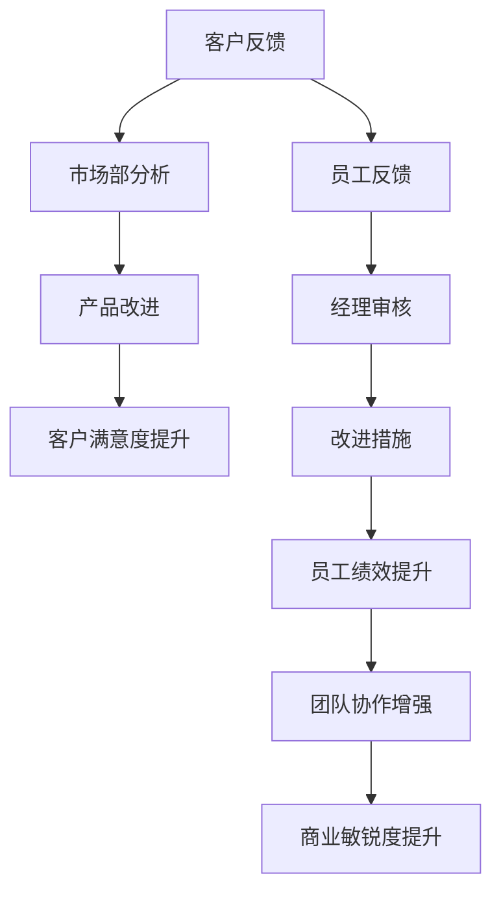

                 

## 商业敏锐度的基本概念

### 1.1 商业敏锐度的定义

商业敏锐度是指个人或团队对市场动态、商业趋势和客户需求具备的快速感知与理解能力。这种能力不仅仅体现在对数据的敏感度上，还包括对市场变化、竞争态势以及客户行为的深刻洞察。一个具有高商业敏锐度的团队，能够在市场环境发生变化时迅速作出反应，调整策略，抓住机遇。

商业敏锐度可以划分为几个关键维度：

- **市场感知**：对市场环境的敏感度，包括市场需求、竞争对手的动态和行业趋势。
- **战略思考**：能够在复杂多变的市场中制定和调整商业策略，确保企业始终处于竞争的有利位置。
- **决策能力**：基于对市场信息和数据的综合分析，做出迅速而准确的决策。
- **创新能力**：在面对挑战和变化时，能够迅速提出创新性的解决方案，推动业务发展。
- **客户理解**：深入了解客户需求，提供满足客户期望的产品和服务。

### 1.2 商业敏锐度的重要性

在当今竞争激烈、变化迅速的商业环境中，商业敏锐度的重要性愈发凸显。以下是几个关键点：

- **保持竞争力**：市场变化迅速，具备商业敏锐度的团队能够迅速调整策略，抓住市场机遇，保持竞争优势。
- **风险规避**：对市场趋势的敏感有助于团队提前预判风险，从而采取预防措施，避免重大损失。
- **客户满意**：深入理解客户需求，提供定制化的产品和服务，提高客户满意度和忠诚度。
- **业务增长**：通过创新和战略调整，不断开拓新市场，推动业务持续增长。
- **团队协作**：商业敏锐度提升有助于团队成员更好地协作，共同应对市场变化和挑战。

### 1.3 商业敏锐度的组成部分

商业敏锐度由多个相互关联的组成部分构成：

- **信息收集与处理**：及时、准确地收集市场信息，并对其进行深入分析，是商业敏锐度的基石。
- **战略规划能力**：基于对市场信息的分析，制定具有前瞻性和灵活性的商业战略。
- **决策执行能力**：快速、有效地执行决策，确保战略目标得以实现。
- **创新思维**：在面对挑战时，能够提出创新性的解决方案，不断推动业务发展。
- **客户关系管理**：建立和维护与客户的良好关系，深入了解客户需求，提高客户满意度。

在理解了商业敏锐度的基本概念和重要性之后，我们将进一步探讨如何构建学习型团队、促进跨部门合作、培养市场敏感性、提升数据分析能力以及加强创新思维培养，这些都是提升团队商业敏锐度的重要方法。接下来的章节将详细分析这些策略的具体实施方法及其效果。

### 如何构建学习型团队

在提升团队商业敏锐度的过程中，构建学习型团队是至关重要的一步。一个学习型团队具有持续学习、不断改进和快速适应环境的能力，这有助于团队在竞争激烈的市场中保持领先地位。

#### 2.1 学习型团队的特点

学习型团队具备以下几个显著特点：

- **自我反思与持续改进**：团队成员习惯于对自身行为和团队绩效进行反思，不断寻求改进的机会。
- **知识共享与协同合作**：团队内部知识交流频繁，信息透明度高，成员之间协作紧密，共同解决难题。
- **开放沟通与反馈机制**：团队成员之间开放沟通，鼓励提出建议和反馈，形成良好的沟通氛围。
- **自主学习与知识更新**：团队成员主动学习新知识、新技能，及时更新知识库，保持专业知识的先进性。
- **适应性**：在面对外部环境变化时，学习型团队能够快速调整策略，适应新的市场需求。

#### 2.2 建立持续学习的机制

要构建一个学习型团队，需要建立一套持续学习的机制，以下是一些具体的建议：

- **定期培训**：为团队成员提供定期的专业培训，涵盖市场动态、新技术和业务策略等方面。通过外部专家讲座、在线课程等方式，确保团队成员的知识更新。
- **内部知识库**：建立一个内部知识库，收集和分享团队内部的知识和经验，便于成员之间快速获取所需信息。
- **读书会**：定期组织读书会，鼓励团队成员阅读行业相关书籍，分享读书心得，促进知识交流。
- **导师制度**：为新人配备导师，通过一对一辅导，帮助新员工快速融入团队，并掌握必要技能。
- **案例分享**：定期举办案例分享会，成员之间分享成功的经验和失败的教训，相互学习，共同成长。

#### 2.3 激发团队成员的自主学习意识

仅仅建立学习机制是不够的，还需要激发团队成员的自主学习意识。以下是一些有效的方法：

- **激励机制**：设置学习奖励，对积极参与培训、分享知识和提出创新方案的个人或团队进行表彰和奖励，激发学习动力。
- **认可与反馈**：对团队成员的学习成果和贡献给予及时的认可和反馈，增强其自信心和学习热情。
- **工作与学习结合**：鼓励将学习与日常工作结合起来，通过实际工作场景中的应用，加深对知识的理解和掌握。
- **个人发展计划**：为每位团队成员制定个人发展计划，明确其学习目标和路径，提供职业发展规划。
- **文化氛围**：营造积极的学习文化氛围，倡导“学习是工作的一部分”的理念，让学习成为团队的一种习惯。

通过构建学习型团队，企业不仅能够提升团队的整体商业敏锐度，还能够培养一支具备高度专业素养和创新能力的团队，为企业的长期发展奠定坚实的基础。

### 如何促进跨部门合作

跨部门合作是提升团队商业敏锐度的关键环节之一。在复杂的商业环境中，仅依靠单一部门的力量往往难以应对各种挑战。促进跨部门合作，能够确保团队在不同领域和层面上的高效协作，从而更好地理解和应对市场变化。

#### 3.1 跨部门合作的障碍与解决方法

跨部门合作常常面临以下几个障碍：

- **部门壁垒**：不同部门之间存在明显的职责界限，容易形成信息孤岛，导致沟通不畅。
- **利益冲突**：不同部门在资源分配、目标设定等方面可能存在利益冲突，影响合作意愿。
- **沟通成本**：跨部门沟通需要花费更多的时间和精力，增加了沟通的难度和成本。
- **责任不明确**：跨部门合作中，责任分工不明确，容易出现推诿责任的情况。

为了克服这些障碍，可以采取以下解决方法：

- **建立共同目标**：明确跨部门合作的目标和期望，确保各部门在共同目标下协同工作。
- **增强沟通机制**：建立常态化的沟通机制，如定期会议、协作平台等，促进信息共享和协作。
- **利益平衡**：通过利益分配机制，确保各部门在资源获取和目标实现上能够公平受益。
- **责任明确**：明确跨部门合作中的责任分工，建立问责机制，确保每个部门的责任和义务得到落实。

#### 3.2 制定跨部门合作的策略

有效的跨部门合作需要一套系统的策略，以下是一些具体的策略：

- **整合资源**：在资源分配上，尽可能整合各部门的优势资源，实现资源的最优配置。例如，技术部门和市场营销部门可以共同开发新产品的技术方案和市场推广策略。
- **建立协作平台**：建立一个跨部门协作的平台，如项目管理工具、协作软件等，实现信息的快速传递和资源共享。这有助于提高协作效率，减少沟通成本。
- **设立协调角色**：在跨部门合作中，设立专门的协调角色，如项目经理或协调员，负责协调各部门的工作进度和信息传递，确保合作顺利进行。
- **培训与交流**：定期组织跨部门的培训与交流活动，增强团队成员之间的了解和信任，促进合作氛围的形成。
- **激励与奖励**：对在跨部门合作中表现突出的个人或团队给予奖励，提高合作积极性。

#### 3.3 跨部门合作的成功案例分享

以下是几个跨部门合作的成功案例：

- **案例1：某互联网公司的产品开发团队与市场团队的合作**。该公司的产品开发团队和市场团队共同制定产品路线图，结合市场反馈进行产品迭代。通过跨部门合作，不仅缩短了产品上线时间，还提高了产品的市场竞争力。
- **案例2：某制造企业的研究与开发部门与生产部门的合作**。该企业的研究与开发部门和生产部门紧密合作，通过跨部门的协同工作，实现了生产线的优化和新产品的快速上市，提高了生产效率和产品质量。
- **案例3：某金融服务公司的风险管理部门与业务部门的合作**。该公司的风险管理部门和业务部门通过建立信息共享机制，共同识别和管理风险，确保业务的稳健运行。

这些案例表明，跨部门合作能够有效提升团队的整体效能，实现资源共享和优势互补，从而在竞争激烈的市场中占据有利位置。

通过以上策略和案例分享，我们可以看到，促进跨部门合作是提升团队商业敏锐度的重要途径。只有打破部门壁垒，建立良好的沟通和协作机制，才能真正实现团队的高效协作，为企业的持续发展提供强有力的支持。

### 如何培养市场敏感性

在商业环境中，市场敏感性是团队成功的关键因素之一。市场敏感性指的是团队对市场动态、客户需求和竞争环境的快速感知与理解能力。为了培养团队的市场敏感性，可以从以下几个方面入手。

#### 4.1 了解市场需求与趋势

要培养团队的市场敏感性，首先需要深入了解市场需求与趋势。以下是一些具体方法：

- **市场调研**：定期进行市场调研，收集客户需求和市场数据。通过问卷调查、深度访谈、焦点小组讨论等方式，获取一线市场信息。
- **趋势分析**：分析行业报告、市场研究数据，了解市场趋势和变化。关注行业权威机构的报告，如市场调研公司的数据分析报告，从中获取有价值的信息。
- **用户反馈**：重视客户反馈，通过用户调查、产品评测等方式，了解客户对产品和服务的看法。客户反馈是获取真实市场需求的宝贵资源。
- **竞争对手分析**：研究竞争对手的产品、策略和市场表现，了解他们的优势和劣势。通过对比分析，找到自身产品与竞争对手的差异，进而优化产品策略。

#### 4.2 分析竞争对手

分析竞争对手是培养市场敏感性的重要步骤。以下是一些具体策略：

- **产品对比**：对比竞争对手的产品功能、性能、价格等，识别其竞争优势和不足。通过产品对比，找到自身的创新点和改进方向。
- **市场定位**：研究竞争对手的市场定位，了解他们针对的目标市场和客户群体。通过分析，确定自身的市场定位和目标客户，避免与竞争对手直接竞争。
- **策略学习**：学习竞争对手的成功策略，借鉴其经验。例如，通过分析竞争对手的广告策略、营销活动等，了解市场推广的有效方法。
- **弱点挖掘**：挖掘竞争对手的弱点，寻找市场机会。通过分析竞争对手的缺陷，找到自身产品的差异化优势，填补市场空白。

#### 4.3 建立市场情报收集系统

建立一个高效的市场情报收集系统，可以帮助团队实时获取市场信息，提高市场敏感性。以下是一些具体建议：

- **情报平台**：建立一个集中化的市场情报平台，整合各种市场信息来源，如行业报告、新闻资讯、社交媒体等。通过平台，团队成员可以方便地获取和共享市场信息。
- **信息推送**：设置市场情报的推送机制，定期向团队成员发送市场动态和分析报告。通过信息推送，确保团队成员及时了解市场变化。
- **数据分析**：运用数据分析工具，对收集到的市场信息进行分类、整理和分析。通过数据可视化，直观展示市场趋势和客户需求。
- **专业团队**：组建一支专门的市场情报收集和分析团队，负责市场信息的收集、分析和报告撰写。专业化团队可以提高市场情报的质量和准确性。

通过以上方法，团队可以不断提升市场敏感性，更好地把握市场机会，制定科学的商业策略，提高市场竞争力。

### 如何提升数据分析能力

在当今数据驱动的商业环境中，数据分析能力成为团队商业敏锐度的重要组成部分。提升数据分析能力不仅有助于团队做出更为精准的决策，还能为业务创新提供强有力的支持。以下是如何提升团队数据分析能力的详细方法。

#### 5.1 数据分析的基本方法

数据分析的基本方法包括数据收集、数据清洗、数据探索、数据建模和数据解释。以下是每个步骤的详细说明：

- **数据收集**：首先需要确定数据来源，包括内部数据（如ERP系统、CRM系统等）和外部数据（如市场调研数据、社交媒体数据等）。通过API接口、数据爬取、合作数据供应商等多种途径收集所需数据。
  
  ```python
  # Python 示例：使用API接口收集天气数据
  import requests

  API_KEY = 'your_api_key'
  base_url = 'http://api.weatherapi.com/v1/current.json'

  city = 'Shanghai'
  params = {
      'key': API_KEY,
      'q': city
  }

  response = requests.get(base_url, params=params)
  weather_data = response.json()
  print(weather_data)
  ```

- **数据清洗**：收集到的数据往往存在缺失值、异常值和噪声。通过数据清洗技术，如填补缺失值、去除异常值和标准化数据，提高数据质量。Python的Pandas库是常用的数据清洗工具。

  ```python
  import pandas as pd

  # 加载数据
  data = pd.read_csv('weather_data.csv')

  # 填补缺失值
  data.fillna(method='ffill', inplace=True)

  # 去除异常值
  data = data[(data['temperature'] > -50) & (data['temperature'] < 50)]
  ```

- **数据探索**：通过描述性统计分析、可视化分析等方法，对数据的基本特征进行探索。Python的Matplotlib和Seaborn库可以方便地进行数据可视化。

  ```python
  import matplotlib.pyplot as plt
  import seaborn as sns

  # 绘制温度分布图
  sns.histplot(data['temperature'], kde=True)
  plt.title('Temperature Distribution')
  plt.xlabel('Temperature')
  plt.ylabel('Frequency')
  plt.show()
  ```

- **数据建模**：选择合适的数据建模方法，如回归分析、聚类分析、分类分析等，对数据进行分析和预测。Python的Scikit-learn库提供了丰富的机器学习算法。

  ```python
  from sklearn.model_selection import train_test_split
  from sklearn.ensemble import RandomForestClassifier

  # 分割数据集
  X = data[['temperature', 'humidity']]
  y = data['weather']
  X_train, X_test, y_train, y_test = train_test_split(X, y, test_size=0.3, random_state=42)

  # 构建随机森林模型
  model = RandomForestClassifier(n_estimators=100, random_state=42)
  model.fit(X_train, y_train)

  # 预测
  predictions = model.predict(X_test)
  ```

- **数据解释**：对分析结果进行解释，将复杂的分析结果转化为易于理解的形式，为决策提供依据。通过可视化报表、关键指标分析等方式，帮助团队成员更好地理解数据。

  ```python
  import pandas as pd

  # 生成预测结果报表
  result = pd.DataFrame({
      'Actual': y_test,
      'Predicted': predictions
  })

  result['Accuracy'] = (result['Actual'] == result['Predicted']).mean()
  print(result)
  ```

#### 5.2 数据分析工具的选择与应用

在选择数据分析工具时，需要考虑工具的易用性、功能强大性、社区支持以及与现有系统的兼容性。以下是几种常用的数据分析工具：

- **Python**：Python以其丰富的库和框架（如Pandas、NumPy、Scikit-learn、Matplotlib等）成为数据分析领域的首选语言。Python的简洁性和强大的功能使其在数据处理、建模和可视化方面表现优异。
- **R语言**：R语言是统计分析和图形展示的专业工具，尤其在生物统计、金融统计和社交网络分析等领域具有广泛的应用。R语言强大的统计分析功能和丰富的图形库使其成为数据分析人员的宝贵资源。
- **Tableau**：Tableau是一款功能强大的数据可视化工具，能够快速创建交互式的可视化报表，帮助用户直观理解数据。Tableau的易用性和强大的可视化功能使其在商业智能领域受到广泛欢迎。
- **Power BI**：Power BI是微软推出的一款商业智能工具，具有强大的数据整合和分析功能。Power BI与Microsoft 365紧密集成，方便用户进行跨平台的数据分析和报告生成。

在实际应用中，可以选择适合团队需求的工具，结合Python、R语言等编程工具进行数据处理和分析，利用Tableau、Power BI等工具进行数据可视化，从而全面提升团队的数据分析能力。

#### 5.3 数据分析在商业决策中的应用

数据分析不仅是一门技术，更是商业决策的重要依据。以下是如何将数据分析应用到商业决策中的几个方面：

- **市场预测**：通过数据分析，可以对市场需求进行预测，帮助团队提前布局和调整产品策略。例如，通过对销售数据的分析，预测不同产品的未来需求，从而优化库存管理。
- **用户行为分析**：分析用户行为数据，了解用户偏好和行为模式，为产品改进和市场推广提供依据。例如，通过分析用户点击数据，优化网站布局，提高用户留存率。
- **风险控制**：通过数据分析，识别潜在风险和异常情况，提前采取预防措施。例如，通过分析财务数据，及时发现财务风险，采取有效的风险管理措施。
- **运营优化**：通过数据分析，优化业务流程和运营策略，提高运营效率。例如，通过分析供应链数据，优化生产计划，减少库存积压，提高供应链响应速度。

通过提升数据分析能力，团队可以更加科学地制定商业策略，提高决策的准确性和效率，从而在激烈的市场竞争中立于不败之地。

### 如何加强创新思维培养

在商业环境中，创新思维是团队保持竞争力、持续发展的重要驱动力。加强创新思维培养，有助于团队在面对变化时迅速找到解决方案，推动业务突破。以下是如何加强创新思维培养的详细方法。

#### 6.1 创新思维的重要性

创新思维的重要性体现在以下几个方面：

- **推动业务发展**：创新思维能够带来新的业务模式和产品，推动企业持续发展，抢占市场先机。
- **提高竞争力**：通过创新思维，团队能够开发出独特的产品和服务，形成竞争优势，巩固市场地位。
- **激发团队活力**：创新思维激发团队成员的创造力，提高工作热情和积极性，促进团队整体效能的提升。
- **应对变化**：在快速变化的市场环境中，创新思维使团队具备灵活应变的能力，能够快速调整策略，应对各种挑战。

#### 6.2 创新思维的培养方法

要培养团队的创新思维，可以采取以下几种方法：

- **头脑风暴**：头脑风暴是一种激发创新思维的有效方法，通过集思广益，产生大量创意。在头脑风暴过程中，鼓励团队成员自由表达想法，不设限，不批评，培养开放思维。
  
  ```python
  # Python 示例：实现简单的头脑风暴
  import random

  def brainstorm(ideas):
      print("创意列表：")
      for idea in ideas:
          print(f"- {idea}")

  # 生成随机创意
  random Ideen = ['新功能开发', '市场推广策略', '产品优化方案', '合作伙伴关系建立']
  brainstorm(random Ideen)
  ```

- **思维导图**：思维导图是一种视觉化的思维工具，可以帮助团队梳理思路，发现潜在的创新点。通过绘制思维导图，将不同想法和关联内容进行可视化展示，有助于团队深入探讨和创新。

  ```mermaid
  graph TB
      A[创新思维] --> B[市场需求分析]
      A --> C[用户反馈分析]
      B --> D[竞争分析]
      C --> E[技术趋势研究]
      D --> F[业务模式创新]
      E --> G[产品功能改进]
  ```

- **挑战性任务**：设定具有挑战性的任务，鼓励团队在解决难题的过程中进行创新。通过设定明确的目标和限制条件，激发团队成员的创造力，培养解决问题的能力。

  ```python
  # Python 示例：解决一个挑战性问题
  def solve_challenge(problem):
      print(f"问题：{problem}")
      print("可能的解决方案：")
      # 列出可能的解决方案
      solutions = ['改进用户体验', '优化产品功能', '增加新功能', '降低成本']
      for solution in solutions:
          print(f"- {solution}")

  # 调用函数
  solve_challenge("如何在竞争激烈的市场中脱颖而出？")
  ```

- **跨界合作**：鼓励跨部门的合作，打破传统的思维界限，引入不同的观点和经验。跨界合作有助于团队在多样化的思考中碰撞出创新的火花，推动业务的多元化发展。

  ```mermaid
  graph TB
      A[技术研发部] --> B[市场部]
      A --> C[产品部]
      B --> D[用户体验部]
      C --> E[供应链部]
  ```

- **定期培训**：为团队成员提供定期的创新思维培训，如创新方法论、设计思维等，帮助团队成员掌握创新工具和方法。通过培训，提升团队的创新意识和能力。

#### 6.3 创新实践的成功案例

以下是几个创新实践的成功案例：

- **案例1：某互联网公司的产品创新**。该公司的产品团队通过定期头脑风暴和思维导图，不断探索新的功能点和用户场景，成功推出了一款深受市场欢迎的新产品，实现了市场份额的快速增长。
- **案例2：某消费品公司的包装创新**。该公司通过跨界合作，与设计公司共同开发创新的包装设计，不仅提升了产品的美观度，还提高了包装的可持续性，获得了消费者的好评。
- **案例3：某制造业公司的生产流程优化**。该公司通过挑战性任务，鼓励团队成员提出优化生产流程的创新方案，最终成功降低了生产成本，提高了生产效率。

这些案例表明，通过加强创新思维培养，团队可以在竞争激烈的市场中找到突破口，推动业务的持续发展和创新。

### 如何建立有效的反馈机制

有效的反馈机制是提升团队商业敏锐度的重要手段之一。一个良好的反馈机制可以帮助团队及时发现并解决问题，持续改进，从而更好地适应市场变化。以下是如何建立有效的反馈机制的详细方法。

#### 7.1 反馈机制的重要性

反馈机制的重要性体现在以下几个方面：

- **问题发现**：通过反馈机制，团队可以及时发现存在的问题和潜在风险，避免问题扩大化，降低损失。
- **持续改进**：有效的反馈机制促使团队不断反思和改进，保持持续进步的动力。
- **提高透明度**：反馈机制提高团队内部的透明度，使成员之间的沟通更加畅通，促进协作。
- **员工激励**：通过反馈机制，对团队成员的表现给予及时评价和反馈，激励员工积极工作，提升整体绩效。

#### 7.2 反馈机制的建立与实施

建立有效的反馈机制，需要从以下几个方面入手：

- **明确反馈目标**：明确反馈的目标和期望，确保反馈机制具有明确的方向和目的。例如，反馈目标可以是提升产品性能、改进工作流程、提高客户满意度等。

- **建立反馈渠道**：建立多种反馈渠道，如定期会议、在线反馈平台、匿名反馈机制等，确保团队成员能够方便地提出意见和建议。以下是一个在线反馈平台的示例：

  ```mermaid
  graph TB
      A[员工反馈] --> B[经理审核]
      B --> C[改进措施]
      C --> D[反馈结果]
      A --> E[团队成员讨论]
      E --> F[解决方案]
  ```

- **规范反馈流程**：制定明确的反馈流程，确保反馈能够得到及时处理和回应。例如，设定反馈处理的时限，明确责任人和处理步骤。

- **定期评估反馈效果**：定期评估反馈机制的实施效果，根据实际情况进行调整和优化。例如，通过调查问卷、访谈等方式，了解团队成员对反馈机制的满意度和建议。

#### 7.3 反馈机制对商业敏锐度的提升

有效的反馈机制对提升团队商业敏锐度具有显著作用：

- **及时调整策略**：通过反馈机制，团队能够及时了解市场动态和客户需求，迅速调整商业策略，抓住市场机遇。
- **提高决策质量**：反馈机制为决策提供重要依据，有助于团队做出更加科学、准确的决策，降低决策风险。
- **增强团队协作**：反馈机制促进团队成员之间的沟通与协作，提高团队整体效能，提升商业敏锐度。
- **持续改进创新**：反馈机制鼓励团队成员不断反思和改进，推动团队在创新方面的持续进步，增强市场竞争力。

通过建立有效的反馈机制，团队可以在快速变化的市场环境中保持敏锐度，持续提升商业竞争力。以下是一个完整的反馈机制示例：



### 实践与案例分析

#### 8.1 制定详细的实践计划

为了有效培养团队的商业敏锐度，企业需要制定一套详细的实践计划。以下是一个实践计划的示例：

**目标：** 提升团队商业敏锐度，提高市场应对能力。

**时间表：**
- **第1-2周**：组织团队进行市场调研，了解当前市场趋势和竞争对手动态。
- **第3-4周**：开展内部培训，提升团队的数据分析能力和市场敏感性。
- **第5-6周**：设立跨部门合作项目，促进各部门之间的沟通与协作。
- **第7-8周**：定期召开反馈会议，收集团队反馈，调整实践策略。

**具体步骤：**
1. **市场调研**：组织团队进行市场调研，收集市场数据，分析市场趋势。
2. **内部培训**：邀请外部专家进行数据分析培训，提升团队数据分析能力。
3. **跨部门合作**：设立跨部门合作项目，鼓励团队之间的交流与协作。
4. **反馈机制**：建立反馈机制，定期召开会议，收集团队反馈，制定改进措施。

**预期成果：**
- 提高团队对市场变化的敏感性。
- 增强团队的数据分析能力和决策质量。
- 提升跨部门协作效率，促进资源整合。
- 通过实践和反馈，不断完善商业敏锐度培养策略。

#### 8.2 实践中的常见问题与解决方法

在培养团队商业敏锐度的过程中，可能会遇到以下问题：

**问题1：团队对市场调研不重视**
- **原因**：团队认为市场调研耗时耗力，对业务影响不大。
- **解决方法**：强调市场调研对业务决策的重要性，设定明确的目标和期望，确保团队认识到市场调研的价值。

**问题2：培训效果不佳**
- **原因**：培训内容脱离实际，缺乏针对性，无法满足团队需求。
- **解决方法**：根据团队实际情况，定制培训内容，邀请有实战经验的讲师，确保培训与实际工作紧密结合。

**问题3：跨部门合作不顺畅**
- **原因**：部门之间沟通不畅，利益冲突，责任分工不明确。
- **解决方法**：建立常态化的沟通机制，明确跨部门合作的目标和责任，制定利益分配机制，确保各部门在共同目标下协作。

**问题4：反馈机制流于形式**
- **原因**：反馈机制不健全，缺乏激励措施，导致团队成员反馈积极性不高。
- **解决方法**：完善反馈机制，制定明确的反馈流程和激励措施，确保反馈得到及时处理和回应。

通过解决这些问题，企业可以确保实践计划的顺利实施，从而有效提升团队的商业敏锐度。

#### 8.3 实践成果的评估与改进

在实践过程中，对成果的评估与改进至关重要。以下是一个成果评估与改进的示例：

**评估指标：**
- **市场应对能力**：团队对市场变化的反应速度和决策质量。
- **数据分析能力**：团队成员的数据分析技能和数据分析工具的使用情况。
- **跨部门协作效率**：各部门之间的沟通协作程度和项目完成情况。
- **团队满意度**：团队成员对商业敏锐度培养实践活动的满意度和参与度。

**评估方法：**
- **问卷调查**：通过问卷调查，收集团队成员对实践活动的反馈，了解实际效果。
- **数据分析**：分析市场调研数据、项目完成情况和团队绩效数据，评估实践成果。
- **访谈**：对团队成员进行访谈，了解他们在实践过程中的体验和改进建议。

**改进措施：**
- **根据反馈调整培训内容**：根据问卷调查和访谈结果，调整培训内容和方法，确保培训与团队需求匹配。
- **优化跨部门合作机制**：通过分析跨部门合作项目的完成情况，优化合作流程和责任分工，提高协作效率。
- **完善反馈机制**：根据反馈机制的实施效果，优化反馈流程和激励措施，提高团队成员的反馈积极性。

通过评估与改进，企业可以不断优化商业敏锐度培养实践，确保团队在快速变化的市场环境中保持竞争优势。

### 国内企业商业敏锐度提升的案例分析

#### 案例一：阿里巴巴

**背景介绍**：
阿里巴巴成立于1999年，是全球领先的电子商务公司。在电商领域，阿里巴巴面对激烈的市场竞争，不断通过创新和战略调整提升商业敏锐度。

**项目介绍**：
为了提升商业敏锐度，阿里巴巴采取了以下策略：

1. **数据驱动的决策**：阿里巴巴通过大数据技术，实时监控市场动态和用户行为，快速调整产品策略和营销方案。
2. **平台开放合作**：阿里巴巴通过开放平台，吸引大量第三方商家和开发者，形成了一个多元化的生态体系，增强了市场适应性。
3. **创新业务拓展**：阿里巴巴不断拓展新的业务领域，如云计算、金融科技、新零售等，通过多元化业务布局，提升整体商业敏锐度。

**系统功能设计**：
- **大数据分析系统**：通过大数据平台，实时收集和分析用户数据、市场数据，为决策提供支持。
- **营销管理系统**：集成多个营销工具，实现精准营销和个性化推荐。

**系统架构设计**：
- **分布式系统架构**：采用分布式架构，提高系统的可扩展性和稳定性。
- **数据中台**：建立数据中台，实现数据的统一管理和共享。

**系统接口设计和系统交互**：
- **API接口**：提供多种API接口，方便第三方开发者和商家接入。
- **消息队列**：使用消息队列实现系统之间的异步通信。

**实际案例分析和详细讲解**：
- **案例1：双十一购物节**：阿里巴巴通过大数据分析，预测购物节期间的用户需求，提前调整库存和物流，确保购物节的顺利进行。
- **案例2：新业务拓展**：通过创新业务拓展，如云计算和金融科技，阿里巴巴在新的领域占据竞争优势，提升了整体商业敏锐度。

**项目小结**：
阿里巴巴通过数据驱动决策、平台开放合作和创新业务拓展，成功提升了商业敏锐度，成为电商领域的领导者。

### 国际企业商业敏锐度提升的案例分析

#### 案例二：亚马逊

**背景介绍**：
亚马逊成立于1994年，是全球领先的电子商务和云计算公司。在电商和云计算领域，亚马逊不断通过技术创新和市场敏锐度提升，保持了持续的市场领先地位。

**项目介绍**：
为了提升商业敏锐度，亚马逊采取了以下策略：

1. **人工智能和机器学习**：亚马逊广泛应用人工智能和机器学习技术，提升数据分析能力和决策质量。例如，通过机器学习算法，优化商品推荐系统，提高用户体验。
2. **全球扩张**：亚马逊不断拓展全球市场，通过本地化运营策略，提升市场适应性。例如，在中国市场，亚马逊与本地企业合作，提供定制化服务。
3. **创新业务模式**：亚马逊不断创新业务模式，如Amazon Web Services（AWS）云计算服务，为全球企业提供云计算解决方案。

**系统功能设计**：
- **智能推荐系统**：通过机器学习算法，实时分析用户行为和偏好，提供个性化推荐。
- **全球物流系统**：通过智能物流网络，实现全球快速配送。

**系统架构设计**：
- **云计算架构**：采用云计算架构，提供高可用性和可扩展性的服务。
- **微服务架构**：通过微服务架构，提高系统的灵活性和可维护性。

**系统接口设计和系统交互**：
- **API接口**：提供丰富的API接口，支持第三方应用接入。
- **分布式系统架构**：使用分布式架构，提高系统的性能和可靠性。

**实际案例分析和详细讲解**：
- **案例1：商品推荐系统**：亚马逊通过智能推荐系统，根据用户历史行为和偏好，提供个性化推荐，显著提高了用户购物体验和销售额。
- **案例2：全球物流网络**：亚马逊在全球范围内建立高效的物流网络，通过大数据分析和智能调度，实现了快速、高效的配送服务。

**项目小结**：
亚马逊通过人工智能和机器学习、全球扩张和创新业务模式，成功提升了商业敏锐度，成为全球领先的电商和云计算企业。

### 案例分析与启示

通过以上国内和国际企业的案例分析，我们可以总结出一些提升商业敏锐度的关键策略和启示：

1. **数据驱动决策**：充分利用大数据和人工智能技术，提升数据分析能力，为决策提供科学依据。
2. **全球市场适应性**：通过本地化运营策略，拓展全球市场，提升市场适应能力。
3. **创新业务模式**：不断探索新的业务领域，通过创新业务模式，增强市场竞争优势。
4. **平台开放合作**：构建开放的平台生态，吸引第三方合作，实现资源整合和优势互补。
5. **跨部门协作**：通过跨部门合作，促进信息共享和协同工作，提高整体运营效率。
6. **员工培训和激励**：持续提升员工的技能和创新能力，通过培训、激励等手段，激发员工的工作热情和创造力。

这些策略和启示不仅适用于大型企业，也适用于中小型企业。通过学习和借鉴成功企业的经验，企业可以不断提升商业敏锐度，在竞争激烈的市场中立于不败之地。

### 结论与展望

本文通过详细探讨商业敏锐度的基本概念、提升团队商业敏锐度的方法以及实践中的案例分析，总结了提升商业敏锐度的重要性和具体策略。商业敏锐度不仅是企业在复杂市场中生存和发展的关键，也是团队持续创新和竞争优势的重要保障。

在未来，随着技术的不断进步和市场环境的变化，商业敏锐度的培养将面临更多挑战和机遇。以下是未来商业敏锐度培养的展望：

1. **人工智能与大数据的深度应用**：随着人工智能和大数据技术的不断发展，企业可以更加精准地分析市场趋势和用户需求，快速做出响应。
2. **跨界合作与生态构建**：企业需要更加注重跨界合作，构建多元化的生态体系，通过整合外部资源，提升商业敏锐度。
3. **持续学习和创新**：在快速变化的市场环境中，企业必须持续学习和创新，培养员工的创新思维和技能，以应对不断变化的市场需求。
4. **数字化转型与智能化升级**：通过数字化转型和智能化升级，企业可以更加高效地管理业务流程，提高运营效率和市场响应速度。

对于企业和团队，提升商业敏锐度不仅需要战略层面的规划和执行，还需要在具体操作层面不断实践和优化。以下是几点具体建议：

1. **加强数据分析和决策能力**：充分利用大数据和人工智能技术，建立数据分析平台，提高数据驱动决策的能力。
2. **构建学习型组织**：通过内部培训、读书会、导师制度等方式，培养团队成员的学习意识和能力，建立持续学习机制。
3. **优化跨部门合作**：建立有效的跨部门沟通和协作机制，明确责任分工，促进信息共享和协同工作。
4. **注重市场调研和客户反馈**：定期进行市场调研，收集客户反馈，深入了解市场需求，及时调整产品和服务策略。
5. **鼓励创新思维**：通过头脑风暴、思维导图、挑战性任务等方式，激发团队的创新思维，推动业务创新。

总之，提升商业敏锐度是企业持续发展的关键，只有不断学习和适应市场变化，才能在激烈的市场竞争中立于不败之地。希望本文能为企业和团队提供有益的启示和参考。

### 对企业和团队的启示

在提升商业敏锐度的过程中，企业需要从多个方面进行综合考虑和持续改进。以下是对企业和团队的几点具体启示：

1. **领导者的重要性**：企业的领导者需要具备前瞻性视野和战略思维，能够引领团队应对市场变化，制定科学的商业策略。领导者要关注团队建设和员工发展，激发员工的创新潜力。

2. **持续学习与培训**：企业应将学习与培训作为一项长期任务，定期组织专业培训和学习活动，提升员工的专业技能和商业敏锐度。同时，鼓励员工自主学习，提供必要的资源和平台支持。

3. **跨部门协作与信息共享**：建立高效的跨部门协作机制，打破部门壁垒，促进信息共享，确保各部门能够协同工作，共同应对市场挑战。通过构建协作平台和定期会议，提高沟通效率和协作效果。

4. **数据分析与决策**：充分利用大数据和人工智能技术，建立数据分析平台，为决策提供科学依据。培养团队的数据分析能力，提高数据驱动的决策水平，确保企业能够快速响应市场变化。

5. **客户导向**：始终以客户需求为中心，定期进行市场调研和客户反馈收集，了解市场需求和客户期望，及时调整产品和服务策略。通过个性化营销和优质服务，提升客户满意度和忠诚度。

6. **创新与实验**：鼓励团队进行创新尝试和实验，通过小规模试错，积累经验，逐步实现商业模式的创新和突破。建立创新激励机制，表彰在创新中表现突出的个人和团队。

7. **文化氛围**：营造积极的学习和创新文化氛围，倡导开放沟通和协作，鼓励员工勇于表达观点和提出建议。通过建立良好的企业文化，增强团队凝聚力，提升整体商业敏锐度。

总之，提升商业敏锐度是企业长期发展的关键，需要从战略规划、团队建设、技术创新等多个方面进行系统性的思考和行动。通过不断优化和改进，企业可以更好地适应市场变化，持续保持竞争优势。希望本文对企业和团队在提升商业敏锐度方面提供有益的参考和启示。作者：AI天才研究院/AI Genius Institute & 禅与计算机程序设计艺术 /Zen And The Art of Computer Programming。

