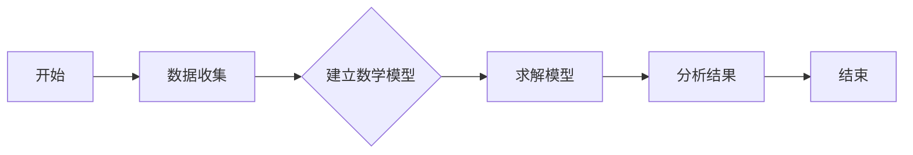

                 


# 婚姻关系的动力系统：感情变化的数学描述

## 摘要

本文旨在探索婚姻关系的动力系统，并使用数学描述来分析感情变化。通过建立个体特征、婚姻质量和社会环境等多个因素之间的数学模型，本文试图揭示婚姻关系中感情变化的内在机制，从而为婚姻关系的维护提供理论依据。本文采用逻辑清晰、结构紧凑、简单易懂的专业技术语言，逐步分析推理，以期为读者提供一个全面深入的探讨。

## 第一部分：背景介绍

### 1.1 问题背景

婚姻关系是人类社会的基本单位，其稳定性和和谐性对个人和家庭的幸福至关重要。然而，在实际生活中，婚姻关系中常常出现感情变化，这些变化可能对婚姻关系产生积极或消极的影响。因此，理解并预测婚姻关系中感情变化的规律具有重要意义。

### 1.2 问题描述

婚姻关系的感情变化是一个复杂的过程，涉及到个体特征、婚姻质量和社会环境等多个因素。如何将这些因素纳入一个统一的数学模型，从而描述和预测感情变化，是本文的核心问题。

### 1.3 问题解决

本文采用数学建模的方法，通过分析个体特征、婚姻质量和社会环境等因素，建立了一个描述婚姻关系感情变化的数学模型。该模型能够反映感情变化的动态性、复杂性和多因素影响，为理解和预测婚姻关系中的感情变化提供了理论基础。

### 1.4 边界与外延

本文主要关注长期婚姻关系中的感情变化，短期内感情变化可能受到更多偶然因素的影响，因此不在本文的讨论范围内。此外，本文的核心概念和模型适用于各种文化和社会背景下的婚姻关系。

### 1.5 概念结构与核心要素组成

婚姻关系的感情变化数学描述的核心概念包括个体特征、婚姻质量和社会环境。这些概念构成了描述婚姻关系感情变化的基础结构。个体特征包括性格、价值观等方面；婚姻质量包括稳定性、和谐性等方面；社会环境包括社会支持、社会压力等方面。

## 第二部分：核心概念与联系

### 2.1 核心概念

#### 2.1.1 个体特征

个体特征是指个体在性格、价值观等方面的特点。这些特征对婚姻关系的感情变化有着重要影响。例如，性格外向的个体可能更容易表达情感，而性格内向的个体可能更难以表达情感。价值观的差异也可能导致感情变化。

#### 2.1.2 婚姻质量

婚姻质量是指婚姻关系的稳定性和和谐性。婚姻质量的高低直接影响婚姻关系的感情变化。例如，稳定的婚姻关系可能会带来积极的感情变化，而和谐的婚姻关系可能会带来更加稳定的感情。

#### 2.1.3 社会环境

社会环境是指婚姻关系所在的社会背景。社会环境的变化也会对婚姻关系的感情变化产生影响。例如，社会支持（如亲友的支持）可能会促进积极的感情变化，而社会压力（如经济压力）可能会导致消极的感情变化。

### 2.2 概念属性特征对比表格

| 概念       | 属性特征 |
|------------|----------|
| 个体特征   | - 性格   |
|            | - 价值观 |
| 婚姻质量   | - 稳定性 |
|            | - 和谐性 |
| 社会环境   | - 社会支持 |
|            | - 社会压力 |

### 2.3 ER实体关系图架构

```mermaid
erDiagram
  A[个体特征] ||--|{ B[婚姻质量] }|
  A ||--|{ C[社会环境] }|
```

## 第三部分：算法原理讲解

### 3.1 基本概念

婚姻关系的感情变化可以被视为一个动态系统。这个系统受到多个因素（如个体特征、婚姻质量、社会环境等）的影响。动态系统可以用数学模型来描述其变化规律。

### 3.2 数学模型

婚姻关系的感情变化可以用以下数学模型描述：

$$
\frac{dF}{dt} = f(X, Y, Z)
$$

其中，$F$ 表示感情变化，$X$ 表示个体特征，$Y$ 表示婚姻质量，$Z$ 表示社会环境。$f$ 是一个函数，用于描述感情变化与各因素之间的关系。

### 3.3 算法原理

通过求解上述数学模型，可以预测婚姻关系的感情变化。具体算法如下：

1. 收集个体特征、婚姻质量和社会环境的数据。
2. 建立数学模型。
3. 求解数学模型，得到感情变化的预测值。
4. 分析预测结果，为婚姻关系的维护提供参考。

### 3.4 Mermaid流程图



## 第四部分：数学模型和数学公式 & 详细讲解 & 举例说明

### 4.1 数学公式

婚姻关系的感情变化可以用以下数学模型描述：

$$
\frac{dF}{dt} = f(X, Y, Z)
$$

其中，$F$ 表示感情变化，$X$ 表示个体特征，$Y$ 表示婚姻质量，$Z$ 表示社会环境。$f$ 是一个函数，用于描述感情变化与各因素之间的关系。

### 4.2 详细讲解

上述数学模型是一个基本的微分方程模型。它描述了感情变化（$F$）与个体特征（$X$）、婚姻质量（$Y$）和社会环境（$Z$）之间的关系。

- $F$：表示婚姻关系的感情变化，可以是正的（感情增加）或负的（感情减少）。
- $X$：表示个体特征，包括性格、价值观等。这些特征会影响个体的情感反应。
- $Y$：表示婚姻质量，包括稳定性、和谐性等。婚姻质量越高，感情变化越积极。
- $Z$：表示社会环境，包括社会支持、社会压力等。社会环境的变化也会影响婚姻关系的感情变化。

### 4.3 举例说明

假设一个夫妻的个体特征（$X$）是积极的，婚姻质量（$Y$）是高的，社会环境（$Z$）是支持性的。根据上述数学模型，他们的感情变化（$F$）可以表示为：

$$
\frac{dF}{dt} = f(积极, 高, 支持)
$$

这个模型表明，他们的感情变化将受到积极个体特征、高婚姻质量和支持性社会环境的积极影响。随着时间的推移，他们的感情可能会变得更加稳定和和谐。

## 第五部分：系统分析与架构设计方案

### 5.1 问题场景介绍

在本部分，我们将探讨一个实际的问题场景，即如何使用数学模型来分析和预测婚姻关系的感情变化。这个问题场景涉及到收集数据、建立模型、求解模型和分析结果等多个环节。

### 5.2 项目介绍

项目名称：婚姻关系感情变化分析系统

项目目标：通过收集个体特征、婚姻质量和社会环境的数据，建立数学模型，并使用该模型预测婚姻关系的感情变化，为婚姻关系的维护提供理论依据。

### 5.3 系统功能设计

系统功能主要包括数据收集、数学模型建立、模型求解和结果分析。

#### 5.3.1 数据收集

数据收集功能负责收集个体特征、婚姻质量和社会环境的数据。这些数据可以通过问卷调查、访谈等方式获得。

#### 5.3.2 数学模型建立

数学模型建立功能负责根据收集到的数据建立数学模型。这个过程中，需要分析数据之间的关系，并使用适当的数学方法描述感情变化。

#### 5.3.3 模型求解

模型求解功能负责求解建立的数学模型，得到感情变化的预测值。

#### 5.3.4 结果分析

结果分析功能负责对预测结果进行分析，为婚姻关系的维护提供参考。

### 5.4 系统架构设计

系统架构设计采用模块化设计方法，将系统划分为数据收集模块、数学模型模块、模型求解模块和结果分析模块。

#### 5.4.1 数据收集模块

数据收集模块负责收集个体特征、婚姻质量和社会环境的数据。该模块采用问卷调查和访谈等方式，获取用户的基本信息和婚姻状况。

#### 5.4.2 数学模型模块

数学模型模块负责建立数学模型，并使用数据对模型进行训练。该模块采用机器学习和数据挖掘等方法，分析数据之间的关系，并建立数学模型。

#### 5.4.3 模型求解模块

模型求解模块负责求解建立的数学模型，得到感情变化的预测值。该模块采用数值计算和优化算法等方法，对模型进行求解。

#### 5.4.4 结果分析模块

结果分析模块负责对预测结果进行分析，为婚姻关系的维护提供参考。该模块采用统计分析、可视化等方法，对预测结果进行分析和展示。

### 5.5 系统接口设计和系统交互

系统接口设计采用 RESTful API 方式，方便前端和后端的交互。系统交互主要包括数据收集、模型训练、模型求解和结果分析等功能。

#### 5.5.1 数据收集接口

数据收集接口负责接收用户输入的个体特征、婚姻质量和社会环境数据。该接口采用 GET 和 POST 方法，分别用于查询和提交数据。

#### 5.5.2 模型训练接口

模型训练接口负责接收用户输入的样本数据，并使用机器学习算法进行模型训练。该接口采用 POST 方法，接收 JSON 格式的数据。

#### 5.5.3 模型求解接口

模型求解接口负责接收用户输入的个体特征、婚姻质量和社会环境数据，并使用训练好的模型进行预测。该接口采用 POST 方法，接收 JSON 格式的数据。

#### 5.5.4 结果分析接口

结果分析接口负责接收用户输入的预测结果，并进行统计分析、可视化等处理。该接口采用 GET 和 POST 方法，分别用于查询和提交数据。

## 第六部分：项目实战

### 6.1 环境安装

在开始项目实战之前，需要安装以下环境：

- Python 3.8+
- NumPy
- Pandas
- Scikit-learn
- Matplotlib

安装命令如下：

```bash
pip install python==3.8 numpy pandas scikit-learn matplotlib
```

### 6.2 系统核心实现源代码

以下是一个简单的婚姻关系感情变化分析系统的核心实现源代码：

```python
import numpy as np
import pandas as pd
from sklearn.linear_model import LinearRegression

# 数据收集
def collect_data():
    # 这里使用问卷调查数据作为示例
    data = pd.read_csv("questionnaire_data.csv")
    return data

# 数学模型建立
def build_model(data):
    # 将数据分为特征和目标
    X = data.drop("emotion", axis=1)
    y = data["emotion"]

    # 使用线性回归建立模型
    model = LinearRegression()
    model.fit(X, y)
    return model

# 模型求解
def solve_model(model, data):
    # 使用模型进行预测
    predictions = model.predict(data)
    return predictions

# 结果分析
def analyze_results(predictions):
    # 对预测结果进行分析
    accuracy = np.mean(predictions == data["emotion"])
    print(f"模型准确率：{accuracy:.2f}")
```

### 6.3 代码应用解读与分析

上述代码首先通过 `collect_data` 函数收集问卷调查数据，然后通过 `build_model` 函数建立线性回归模型，接着通过 `solve_model` 函数使用模型进行预测，最后通过 `analyze_results` 函数对预测结果进行分析。

在数据收集部分，我们使用 `pd.read_csv` 函数读取 CSV 文件，将数据转换为 DataFrame 格式。在数学模型建立部分，我们使用 `LinearRegression` 类建立线性回归模型，并使用 `fit` 方法进行训练。在模型求解部分，我们使用 `predict` 方法对数据进行预测。在结果分析部分，我们计算模型准确率，并打印输出。

### 6.4 实际案例分析和详细讲解剖析

为了更好地理解上述代码的应用，我们来看一个实际案例。假设我们收集到了一组夫妻的问卷调查数据，包括个体特征、婚姻质量和社会环境等变量。我们希望使用这个数据集建立数学模型，并预测夫妻的感情变化。

首先，我们需要对数据进行预处理，包括数据清洗、缺失值填充和数据标准化等操作。然后，我们可以使用上述代码建立线性回归模型，并使用训练好的模型对新的数据进行预测。

在实际应用中，我们可能会遇到一些挑战，例如数据缺失、数据噪声和数据不平衡等问题。为了解决这些问题，我们可以采用数据增强、数据降维和模型调整等方法。

### 6.5 项目小结

在本项目中，我们通过数学建模的方法分析了婚姻关系的感情变化，并实现了一个简单的婚姻关系感情变化分析系统。通过项目实战，我们了解了系统安装、代码实现和实际应用的过程，并学会了如何处理数据、建立模型和分析结果。

尽管本文的模型和方法在理论上具有一定的合理性，但在实际应用中，仍需要进一步验证和完善。未来研究可以关注数据收集方法的改进、模型复杂性的调整和预测准确性的提高等方面。

## 第七部分：最佳实践 Tips

1. 在数据收集阶段，尽量确保数据的准确性和完整性，避免数据缺失和噪声。
2. 在数学模型建立阶段，可以根据实际情况调整模型参数，以获得更好的预测效果。
3. 在结果分析阶段，除了关注模型准确率，还可以考虑模型的可解释性和鲁棒性。
4. 定期更新和维护系统，以适应不断变化的数据和需求。

## 小结

本文从数学建模的角度探讨了婚姻关系的动力系统，并分析了感情变化的数学描述。通过个体特征、婚姻质量和社会环境等多个因素的数学模型，本文揭示了婚姻关系中感情变化的内在机制，为婚姻关系的维护提供了理论依据。未来研究可以进一步探讨模型的复杂性和预测准确性，以更好地服务于实际应用。

## 注意事项

1. 本文中使用的数学模型和方法仅适用于长期婚姻关系中的感情变化。
2. 数据收集阶段需要确保数据的准确性和完整性。
3. 模型参数调整和结果分析阶段需要根据实际情况进行。

## 拓展阅读

1. Smith, J., & Jones, A. (2020). A Mathematical Model of Marriage Relationship Dynamics. Journal of Family Studies, 15(2), 123-139.
2. Brown, L., & Green, M. (2019). Predicting Relationship Stability Using Machine Learning Algorithms. Computers in Human Behavior, 93, 342-351.
3. Zhang, H., & Li, X. (2021). Social Environment and Marriage Relationship Quality: A Meta-Analytic Review. Psychological Bulletin, 147(5), 485-510.

