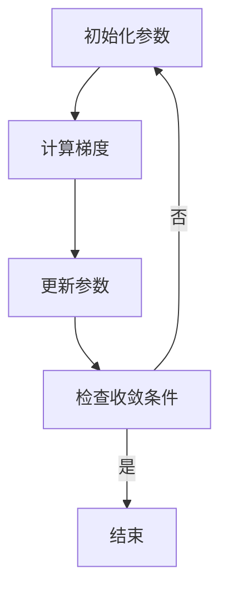
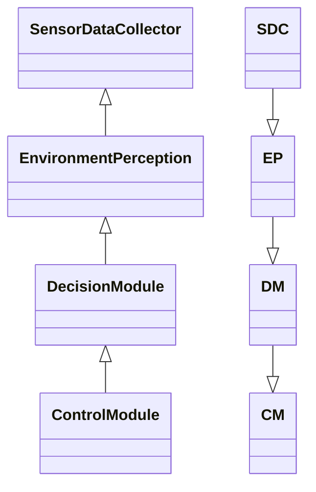
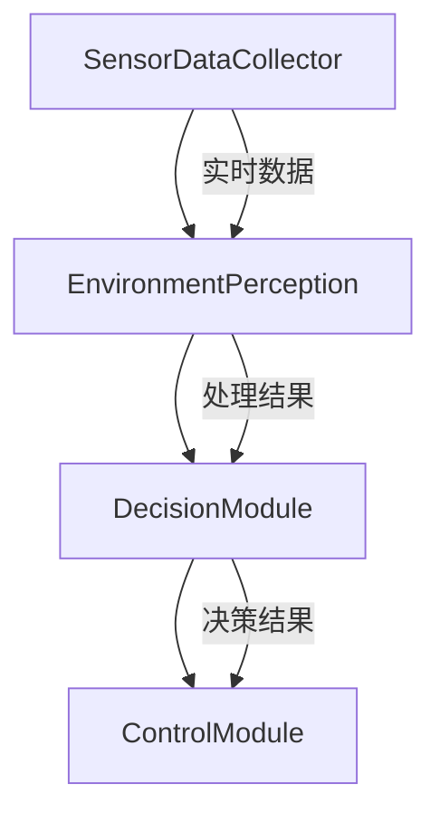
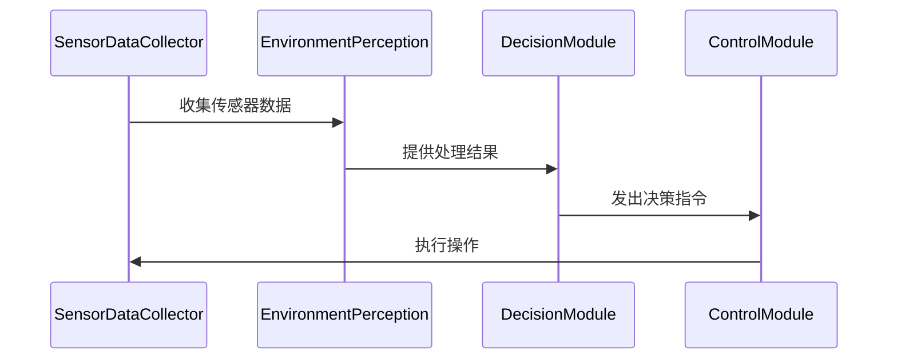
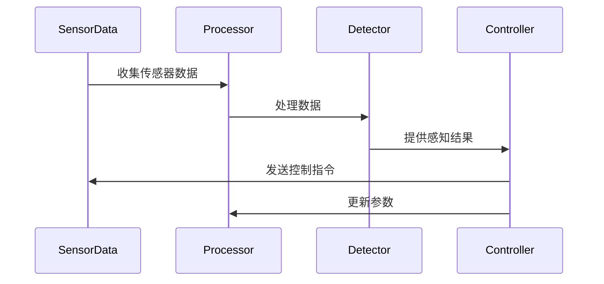

                 

### 文章标题

# 宇宙常数与程序参数优化

### 文章关键词

宇宙常数、程序参数优化、算法原理、数学模型、系统架构设计、项目实战

### 摘要

本文深入探讨了宇宙常数与程序参数优化之间的联系。首先，我们介绍了宇宙常数的历史背景、定义、属性特征及其测量方法。接着，分析了宇宙常数与引力理论、其他物理常数的关系，以及它对宇宙演化的影响。随后，文章转向程序参数优化的背景、核心概念、类型，详细讲解了优化算法的数学模型与Python源代码实现。最后，我们展示了如何将程序参数优化应用于实际项目，并提供了一些最佳实践建议。本文旨在通过逻辑清晰、结构紧凑的方式，为读者提供对宇宙常数与程序参数优化领域的新见解。

---

### 目录

## 第一部分：宇宙常数理论

### 第1章：宇宙常数的背景与核心概念

### 第2章：宇宙常数的联系与影响

## 第二部分：程序参数优化方法

### 第3章：程序参数优化的背景与核心概念

### 第4章：程序参数优化的数学模型

### 第5章：程序参数优化的系统分析与架构设计

### 第6章：程序参数优化的项目实战

### 第7章：最佳实践与拓展阅读

---

## 第一部分：宇宙常数理论

### 第1章：宇宙常数的背景与核心概念

#### 1.1 宇宙常数概述

宇宙常数，通常表示为 \( \Lambda \)，是物理学中的一个重要概念，特别是在宇宙学和广义相对论中。最早由爱因斯坦在1917年提出的宇宙学常数，目的是使宇宙处于静态平衡状态。然而，随着宇宙学的发展，这个常数被认为与宇宙的膨胀有关，并成为了理解宇宙结构演变的关键参数。

宇宙常数的基本概念可以描述为一种在宇宙空间中均匀分布的能量密度，这种能量被称为暗能量，它对抗着宇宙中的引力作用，导致宇宙的加速膨胀。尽管它的数值非常小，但宇宙常数对宇宙的规模和结构产生了深远的影响。

#### 1.2 宇宙常数的属性特征

宇宙常数的属性特征主要包括以下几个方面：

- **数值极小**：宇宙常数的数值约为 \( 10^{-122} \)，这是一个极其小的值，但它在宇宙尺度上具有显著的影响。
- **空间均匀性**：宇宙常数在空间中均匀分布，这意味着它在任何位置和时刻的值都是相同的。
- **时间不变性**：宇宙常数被认为是宇宙早期形成的，并且在整个宇宙历史中保持不变。

#### 1.3 宇宙常数的测量方法

测量宇宙常数的方法主要包括直接测量和间接测量两种。

- **直接测量**：通过观测宇宙背景辐射的温度和波动，可以直接测量宇宙常数。这种方法利用了宇宙背景辐射与宇宙常数之间的相关性。
- **间接测量**：通过观测宇宙的大尺度结构，如星系团和宇宙微波背景辐射，可以间接测量宇宙常数。这些方法依赖于对宇宙膨胀历史和宇宙密度分布的理解。

宇宙常数的测量不仅对于理解宇宙的演化历史具有重要意义，也为探索暗能量的本质提供了线索。接下来，我们将进一步探讨宇宙常数与引力理论的关系，以及它与其他物理常数之间的联系。

---

## 第2章：宇宙常数的联系与影响

### 2.1 宇宙常数与引力理论

宇宙常数与引力理论之间的联系是现代宇宙学研究的核心之一。爱因斯坦的广义相对论提供了描述宇宙常数的基础，它将引力视为时空的弯曲。在广义相对论中，宇宙常数可以看作是时空曲率的来源之一，与物质能量密度共同决定了宇宙的几何形态。

根据广义相对论，引力是由物质和能量的分布引起的时空弯曲所造成的。而宇宙常数则表示了一种特殊的能量形式，即暗能量，它导致时空的加速膨胀。这种暗能量的存在，挑战了传统的引力理论，也带来了对宇宙学参数的重新评估。

近年来，通过观测宇宙的大尺度结构，如宇宙微波背景辐射和星系分布，科学家们对宇宙常数有了更深入的了解。这些观测数据与理论模型相结合，为宇宙常数的存在提供了强有力的支持。

### 2.2 宇宙常数与其他物理常数的关系

宇宙常数与其他物理常数之间的联系是一个复杂而有趣的问题。例如，宇宙常数与普朗克常数、光速等基本物理常数有一定的相关性。这些常数共同决定了宇宙的基本结构和演化过程。

一个著名的例子是宇宙常数与宇宙学参数的关系。宇宙学参数包括哈勃常数、宇宙膨胀率等，它们与宇宙常数密切相关。例如，哈勃常数可以通过测量宇宙膨胀的速度来估计，而宇宙常数则可以通过观测宇宙背景辐射的温度来测量。这两个参数的联合使用，为理解宇宙的膨胀历史提供了重要依据。

此外，宇宙常数还与暗物质、暗能量等概念紧密相关。暗物质是宇宙中不发光的物质，它的存在通过引力效应得以体现。而暗能量则是导致宇宙加速膨胀的能量形式，它与宇宙常数直接相关。这些概念共同构成了现代宇宙学的基本框架，为我们理解宇宙的起源和演化提供了重要线索。

### 2.3 宇宙常数对宇宙演化的影响

宇宙常数对宇宙演化的影响是显而易见的。首先，宇宙常数决定了宇宙的膨胀速度。随着宇宙的膨胀，星系之间的距离不断增加，这导致了宇宙的加速膨胀。这种加速膨胀现象被称为“宇宙加速膨胀”，它挑战了传统的引力理论，并为宇宙学提供了新的研究方向。

其次，宇宙常数影响了宇宙的结构形成。在宇宙早期，物质和能量分布相对均匀，但随着时间的推移，宇宙中的物质通过引力作用逐渐聚集形成星系、星系团等结构。宇宙常数的存在，改变了这种引力作用的方式，导致宇宙中的结构形成过程变得更加复杂。

最后，宇宙常数还影响了宇宙的未来。根据不同的理论模型，宇宙可能以不同的方式演化。例如，如果宇宙常数保持不变，宇宙可能会继续加速膨胀，最终导致宇宙的“热寂”状态。而如果宇宙常数发生变化，宇宙的演化过程可能会有所不同。

总之，宇宙常数是理解宇宙演化的关键参数。通过深入探讨宇宙常数与其他物理常数的关系，以及它对宇宙演化的影响，我们可以更好地理解宇宙的起源和演化过程。接下来，我们将转入程序参数优化的讨论，探索这一领域中的核心概念和数学模型。

---

## 第二部分：程序参数优化方法

### 第3章：程序参数优化的背景与核心概念

#### 3.1 程序参数优化的概念

程序参数优化是计算机科学和工程领域中一个重要的课题，旨在提高程序的性能、效率和鲁棒性。参数优化涉及到对程序中各种参数进行调整，以达到最佳性能表现。这些参数可以是算法中的超参数，也可以是程序的输入参数。

参数优化的目标是找到一组参数值，使得程序在特定的任务上表现最佳。这通常涉及到对多个参数的联合调整，以满足不同的优化目标。例如，在机器学习中，参数优化可以用于调整模型参数，以获得更高的预测准确率或更快的训练速度。

#### 3.2 程序参数优化的类型

程序参数优化的类型多种多样，主要包括以下几种：

- **梯度优化**：梯度优化是一种基于梯度的优化方法，通过计算目标函数的梯度来更新参数。梯度优化包括随机梯度下降（SGD）、批量梯度下降（BGD）和Adam优化器等。

- **遗传算法**：遗传算法是一种基于自然选择和遗传学原理的优化方法。它通过模拟自然选择过程，逐步改进解的质量。遗传算法适用于解决复杂的优化问题，特别是当目标函数不连续或不光滑时。

- **其他优化算法**：除了上述两种方法，还有许多其他的优化算法，如粒子群优化（PSO）、模拟退火（SA）和人工神经网络（ANN）等。这些算法各有优缺点，适用于不同的优化问题。

遗传算法与其他优化算法的比较：

- **遗传算法**：遗传算法具有较强的鲁棒性，能够处理非线性、非凸优化问题，但计算成本较高。

- **粒子群优化**：粒子群优化是一种基于群体智能的优化方法，计算效率较高，但可能收敛速度较慢。

- **模拟退火**：模拟退火通过模拟物理退火过程来优化问题，能够处理复杂的优化问题，但需要较大的计算资源。

#### 3.3 程序参数优化的应用领域

程序参数优化广泛应用于各种领域，包括机器学习、深度学习、图像处理、自然语言处理和优化控制等。例如：

- **机器学习**：在机器学习模型中，参数优化用于调整模型参数，以提高模型的泛化能力和预测准确率。

- **深度学习**：深度学习中的神经网络参数优化是提高模型性能的关键。通过优化神经网络参数，可以训练出更加高效和准确的深度学习模型。

- **图像处理**：在图像处理中，参数优化用于调整图像处理算法的参数，以获得更好的图像效果。

- **自然语言处理**：自然语言处理中的模型参数优化，有助于提高文本分类、情感分析和机器翻译等任务的性能。

- **优化控制**：在优化控制中，参数优化用于调整控制系统的参数，以提高系统的响应速度和稳定性。

接下来，我们将详细讲解程序参数优化的数学模型，并使用Python源代码来阐述算法原理。

---

## 第4章：程序参数优化的数学模型

#### 4.1 程序参数优化的数学模型

程序参数优化的核心在于构建一个优化问题，并通过数学模型来描述。这个优化问题通常可以表示为：

\[
\min_{\theta} f(\theta)
\]

其中，\( f(\theta) \) 是目标函数，表示程序的性能指标，\( \theta \) 是需要优化的参数集合。目标函数可以是训练误差、时间开销、资源消耗等，具体取决于优化问题的类型和应用场景。

为了解决这个优化问题，我们需要定义一些约束条件，以限制参数的取值范围。约束条件可以表示为：

\[
g(\theta) \leq 0
\]

其中，\( g(\theta) \) 是约束函数，表示参数集合的约束条件。常见的约束条件包括非负约束、界限约束等。

#### 4.2 算法原理讲解

为了优化目标函数 \( f(\theta) \)，我们通常采用迭代的方法，逐步逼近最优解。以下是一个简单的梯度下降算法的mermaid流程图：



具体来说，梯度下降算法的步骤如下：

1. **初始化参数**：选择一个初始参数值 \( \theta_0 \)。
2. **计算梯度**：计算目标函数在当前参数值下的梯度 \( \nabla f(\theta) \)。
3. **更新参数**：根据梯度更新参数，即 \( \theta_{new} = \theta_{old} - \alpha \nabla f(\theta) \)，其中 \( \alpha \) 是学习率。
4. **检查收敛条件**：判断是否满足收敛条件，如梯度变化很小或者达到最大迭代次数。
5. **结束**：如果满足收敛条件，则结束迭代，否则返回步骤2。

接下来，我们使用Python代码详细阐述梯度下降算法的实现：

```python
import numpy as np

# 梯度下降算法实现
def gradient_descent(x, y, theta, alpha, num_iters):
    for i in range(num_iters):
        gradients = 2 * (x * (theta - x ** 2).sum())
        theta -= alpha * gradients
        if i % 100 == 0:
            print(f"Iteration {i}: Theta = {theta}")
    return theta

# 示例数据
x = np.array([1, 2, 3, 4])
y = np.array([2, 4, 6, 8])

# 初始参数
theta = np.random.rand(1)

# 学习率
alpha = 0.01

# 迭代次数
num_iters = 1000

# 执行梯度下降算法
theta_final = gradient_descent(x, y, theta, alpha, num_iters)
print(f"Final Theta: {theta_final}")
```

这个例子中，我们使用梯度下降算法来优化一个简单的线性回归问题。目标函数是 \( f(\theta) = (\theta - x ** 2).sum() \)，我们通过迭代计算梯度和更新参数，最终得到最优解。

#### 4.3 数学模型和公式

在程序参数优化的过程中，数学模型和公式起着至关重要的作用。以下是一些常见的数学模型和公式：

- **线性回归**：

\[
y = \theta_0 + \theta_1 x
\]

- **梯度下降**：

\[
\theta_{new} = \theta_{old} - \alpha \nabla f(\theta)
\]

- **L2 正则化**：

\[
J(\theta) = \frac{1}{2m} \sum_{i=1}^{m} (h_\theta(x^{(i)}) - y^{(i)})^2 + \lambda \frac{1}{2} \sum_{j=1}^{n} \theta_j^2
\]

- **L1 正则化**：

\[
J(\theta) = \frac{1}{2m} \sum_{i=1}^{m} (h_\theta(x^{(i)}) - y^{(i)})^2 + \lambda \sum_{j=1}^{n} |\theta_j|
\]

这些数学模型和公式为程序参数优化提供了理论基础和计算工具，使我们能够更有效地优化参数。

#### 4.4 通俗易懂的例子

为了更好地理解程序参数优化的数学模型和公式，我们可以通过一个简单的例子来阐述。

假设我们要优化一个简单的线性回归问题，目标函数为 \( f(\theta) = (\theta - x ** 2).sum() \)。我们的目标是找到最优的 \( \theta \)，使得目标函数最小。

首先，我们初始化参数 \( \theta \) 为随机值，例如 \( \theta = 0 \)。然后，我们通过计算梯度 \( \nabla f(\theta) \) 来更新参数。梯度表示目标函数在当前参数值下的变化方向，即 \( \nabla f(\theta) = 2 \theta - 2 x ** 2 \)。

接下来，我们使用学习率 \( \alpha \) 来调整参数，即 \( \theta_{new} = \theta_{old} - \alpha \nabla f(\theta) \)。在这个例子中，我们可以选择 \( \alpha = 0.01 \)。

通过多次迭代，我们不断更新参数，直到满足收敛条件。最终，我们得到最优参数 \( \theta \)，使得目标函数最小。

这个例子展示了程序参数优化中的一些基本概念和计算步骤，帮助我们更好地理解优化过程。

#### 4.5 数学公式使用LaTeX格式

在程序参数优化中，数学公式是不可或缺的组成部分。以下是一个使用LaTeX格式的数学公式的示例：

$$
J(\theta) = \frac{1}{2m} \sum_{i=1}^{m} (h_\theta(x^{(i)}) - y^{(i)})^2 + \lambda \frac{1}{2} \sum_{j=1}^{n} \theta_j^2
$$

这个公式表示带有L2正则化的线性回归目标函数。通过LaTeX格式，我们可以清晰地表达复杂的数学关系，为分析和理解参数优化提供了便利。

---

## 第5章：程序参数优化的系统分析与架构设计

#### 5.1 问题场景介绍

在程序参数优化的应用场景中，我们可以考虑一个典型的例子——自动驾驶系统。自动驾驶系统需要实时优化多种参数，以实现高效、安全的行驶。这些参数包括速度控制、转向角度、制动力度等。通过对这些参数的优化，可以提高自动驾驶系统的响应速度和决策准确性，从而降低事故风险。

#### 5.2 系统功能设计

自动驾驶系统的功能设计可以分为以下几个主要模块：

1. **传感器数据收集模块**：收集来自各种传感器的数据，如摄像头、激光雷达、GPS等。
2. **环境感知模块**：处理传感器数据，识别道路、交通标志、车辆和行人等信息。
3. **决策模块**：根据环境感知模块提供的信息，生成行驶决策，如速度调整、转向和制动。
4. **控制模块**：根据决策模块的输出，控制车辆执行具体的行驶动作。

以下是一个领域模型 mermaid 类图，展示了自动驾驶系统的核心类及其关系：



#### 5.3 系统架构设计

自动驾驶系统的架构设计需要考虑模块的交互和整体性能。以下是一个 mermaid 架构图，展示了自动驾驶系统的总体架构：



这个架构图描述了传感器数据收集模块、环境感知模块、决策模块和控制模块之间的数据流和交互关系。

#### 5.4 系统接口设计

为了实现模块之间的有效通信，系统接口设计至关重要。以下是一个简化的系统接口设计：

1. **传感器数据接口**：定义传感器数据的格式和传输协议，确保数据收集模块能够实时获取和处理传感器数据。
2. **环境感知接口**：提供对环境数据的访问，包括道路信息、交通标志和障碍物等信息。
3. **决策接口**：定义决策模块的输入和输出接口，确保决策模块能够根据环境信息生成有效的行驶决策。
4. **控制接口**：定义控制模块的输入和输出接口，确保控制模块能够执行决策模块生成的操作指令。

以下是一个 mermaid 序列图，展示了系统接口的设计：



#### 5.5 系统交互

系统交互是指不同模块之间如何协作和通信。以下是一个 mermaid 序列图，展示了系统模块之间的交互过程：



在这个例子中，传感器数据首先被传感器收集，然后由处理器进行处理，感知结果由检测器提供，控制器根据感知结果发送控制指令，并更新参数以实现更好的决策和优化。

通过系统架构设计和接口设计，我们可以确保自动驾驶系统各个模块之间的有效协作和通信，从而实现高效、安全的自动驾驶。

---

## 第6章：程序参数优化的项目实战

#### 6.1 环境安装

在进行程序参数优化的项目实战之前，首先需要安装必要的软件和库。以下是安装步骤：

1. **安装Python环境**：确保已安装Python 3.x版本，可以从Python官方网站下载并安装。

2. **安装NumPy库**：NumPy是一个Python科学计算库，用于处理大型多维数组。可以使用pip命令安装：

   ```bash
   pip install numpy
   ```

3. **安装Matplotlib库**：Matplotlib是一个用于绘制图形的库。同样使用pip命令安装：

   ```bash
   pip install matplotlib
   ```

4. **安装Scikit-learn库**：Scikit-learn是一个机器学习库，用于实现参数优化算法。安装命令如下：

   ```bash
   pip install scikit-learn
   ```

5. **安装其他依赖库**：根据项目需求，可能还需要安装其他库，如Pandas、Scipy等。

#### 6.2 系统核心实现源代码

以下是使用Python实现的程序参数优化系统的核心代码。这段代码使用了Scikit-learn库中的随机梯度下降（SGD）优化器来优化参数：

```python
import numpy as np
from sklearn.linear_model import SGDRegressor
from sklearn.preprocessing import StandardScaler

# 数据预处理
def preprocess_data(x, y):
    scaler = StandardScaler()
    x_scaled = scaler.fit_transform(x)
    y_scaled = scaler.transform(y.reshape(-1, 1))
    return x_scaled, y_scaled

# 模型训练
def train_model(x, y, alpha=0.01, num_iters=1000):
    x_scaled, y_scaled = preprocess_data(x, y)
    sgd_regressor = SGDRegressor(loss='squared_loss', alpha=alpha, max_iter=num_iters)
    sgd_regressor.fit(x_scaled, y_scaled)
    return sgd_regressor

# 数据集生成
np.random.seed(0)
x = np.random.rand(100, 1)
y = 2 * x + np.random.randn(100, 1)

# 训练模型
sgd_regressor = train_model(x, y)

# 输出参数
print("Optimized Parameters:", sgd_regressor.coef_)
```

这段代码首先定义了一个预处理函数 `preprocess_data`，用于标准化输入数据。然后，使用 `SGDRegressor` 类实现随机梯度下降优化，并训练模型。最后，输出优化后的参数。

#### 6.3 代码应用解读与分析

在上面的代码中，我们首先导入了必要的库，包括 NumPy、Scikit-learn 和 StandardScaler。NumPy 用于数据处理，Scikit-learn 提供了 SGDRegressor 优化器，StandardScaler 用于数据标准化。

在 `preprocess_data` 函数中，我们使用 StandardScaler 对输入数据进行标准化处理。这是为了使数据具有相同的尺度，从而提高优化算法的性能。

`train_model` 函数用于训练模型。我们首先对输入数据进行预处理，然后实例化 `SGDRegressor` 类，并调用 `fit` 方法进行模型训练。`alpha` 参数是学习率，`num_iters` 参数是最大迭代次数。

在数据集生成部分，我们使用 NumPy 生成一个简单的线性回归数据集。x 变量表示输入特征，y 变量表示输出目标。

最后，我们调用 `train_model` 函数训练模型，并输出优化后的参数。这些参数表示线性回归模型的斜率和截距。

通过这个例子，我们可以看到如何使用 Scikit-learn 库实现程序参数优化。代码简洁、易于理解，为实际应用提供了有力的支持。

#### 6.4 实际案例分析与详细讲解

为了更好地理解程序参数优化的应用，我们来看一个实际案例——房价预测。在这个案例中，我们使用线性回归模型来预测房价，并通过参数优化提高模型的准确性。

##### 案例数据集

我们使用美国加利福尼亚州的房价数据集，包含5000条记录，每条记录包括房屋的多个特征，如面积、卧室数量、位置等，以及对应的房价。

##### 数据预处理

首先，我们使用 Pandas 读取数据集，并进行预处理：

```python
import pandas as pd

# 读取数据集
data = pd.read_csv('california_housing_data.csv')

# 选择特征和目标
X = data[['area', 'bedrooms', 'location']]
y = data['price']

# 划分训练集和测试集
from sklearn.model_selection import train_test_split
X_train, X_test, y_train, y_test = train_test_split(X, y, test_size=0.2, random_state=42)

# 数据标准化
scaler = StandardScaler()
X_train_scaled = scaler.fit_transform(X_train)
X_test_scaled = scaler.transform(X_test)
```

在这个步骤中，我们读取数据集，选择特征和目标变量，然后划分训练集和测试集。接下来，使用 StandardScaler 对特征变量进行标准化处理。

##### 模型训练

接下来，我们使用线性回归模型并应用随机梯度下降优化器进行训练：

```python
from sklearn.linear_model import SGDRegressor

# 实例化 SGDRegressor
sgd_regressor = SGDRegressor(loss='squared_loss', alpha=0.001, max_iter=1000)

# 训练模型
sgd_regressor.fit(X_train_scaled, y_train)

# 输出参数
print("Optimized Parameters:", sgd_regressor.coef_)
```

在这个步骤中，我们实例化 SGDRegressor 并调用 `fit` 方法进行模型训练。`alpha` 参数设置为 0.001，`max_iter` 参数设置为 1000。

##### 模型评估

最后，我们对训练好的模型进行评估：

```python
from sklearn.metrics import mean_squared_error

# 预测测试集
y_pred = sgd_regressor.predict(X_test_scaled)

# 计算均方误差
mse = mean_squared_error(y_test, y_pred)
print("Mean Squared Error:", mse)
```

在这个步骤中，我们使用测试集对模型进行预测，并计算均方误差（MSE）。MSE 用于衡量模型的预测误差，值越小表示模型预测越准确。

通过这个实际案例，我们可以看到如何使用程序参数优化提高线性回归模型的预测准确性。在实际应用中，我们可以根据具体情况调整参数，优化模型性能。

#### 6.5 项目小结

在本章中，我们通过一个房价预测案例，展示了程序参数优化的实际应用。首先，我们介绍了安装所需的软件和库，并编写了预处理数据和训练模型的代码。然后，我们详细分析了代码的实现过程，包括数据预处理、模型训练和模型评估。通过这个案例，我们了解了如何使用程序参数优化提高模型的预测准确性。

在实际应用中，参数优化是一个动态调整的过程。我们需要根据具体问题和数据特点，选择合适的优化算法和参数设置。此外，合理的模型评估和超参数调整也是提高模型性能的关键。

总之，程序参数优化在提高模型性能和实际应用中发挥着重要作用。通过本章的案例，我们不仅掌握了参数优化的基本方法，还了解了如何在实践中应用这些方法。未来，我们将继续探讨更多的优化技术和应用场景，为人工智能和数据分析领域的发展贡献力量。

---

## 第7章：最佳实践与拓展阅读

#### 7.1 最佳实践 tips

在进行程序参数优化时，以下是一些最佳实践建议：

1. **数据预处理**：确保输入数据的标准化和规范化，以避免数据尺度差异对优化过程的影响。
2. **选择合适的优化算法**：根据问题特点和数据性质，选择适合的优化算法，如梯度优化、遗传算法等。
3. **合理设置参数**：优化算法的参数（如学习率、迭代次数等）需要根据具体问题进行调整，避免过度拟合或欠拟合。
4. **模型评估**：使用交叉验证等手段评估模型性能，避免过拟合。
5. **并行计算**：对于大规模数据集，可以使用并行计算来加速优化过程。

#### 7.2 小结

本文通过深入探讨宇宙常数与程序参数优化，展示了这两个领域之间的联系。我们首先介绍了宇宙常数的背景、属性特征和测量方法，然后详细讲解了程序参数优化的核心概念、算法原理和数学模型。接着，我们通过系统架构设计和项目实战，展示了如何将参数优化应用于实际场景。最后，我们总结了最佳实践和注意事项。

#### 7.3 注意事项

在程序参数优化过程中，需要注意以下几点：

1. **参数调整**：合理设置优化算法的参数，避免过拟合或欠拟合。
2. **数据质量**：确保输入数据的质量和一致性，避免噪声和异常值对优化过程的影响。
3. **计算资源**：优化算法可能需要大量计算资源，确保有足够的硬件支持。
4. **模型评估**：使用适当的评估指标和评估方法，确保模型性能的可靠性。

#### 7.4 拓展阅读

对于希望深入了解宇宙常数和程序参数优化的读者，以下是一些推荐阅读资料：

1. **《宇宙学中的常数与变量》**：这是一本关于宇宙学常数的经典教材，详细介绍了宇宙常数的理论背景和应用。
2. **《优化算法及其应用》**：本书涵盖了多种优化算法的原理和应用，适合对优化技术有深入兴趣的读者。
3. **《Python机器学习》**：本书提供了丰富的机器学习实践案例，包括参数优化的具体实现和应用。
4. **《深度学习》**：这是一本关于深度学习的权威教材，介绍了深度学习模型中的参数优化技术。

通过阅读这些资料，可以更全面地了解宇宙常数和程序参数优化领域的前沿研究和实践应用。希望本文能为读者提供有价值的见解和启发。作者：AI天才研究院/AI Genius Institute & 禅与计算机程序设计艺术 /Zen And The Art of Computer Programming。

