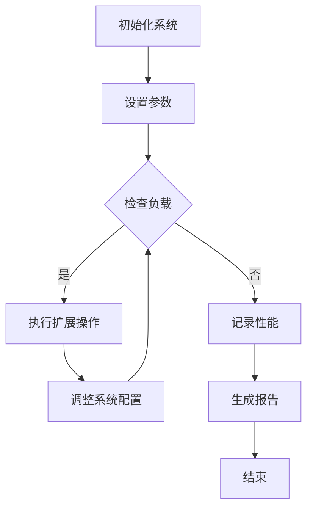
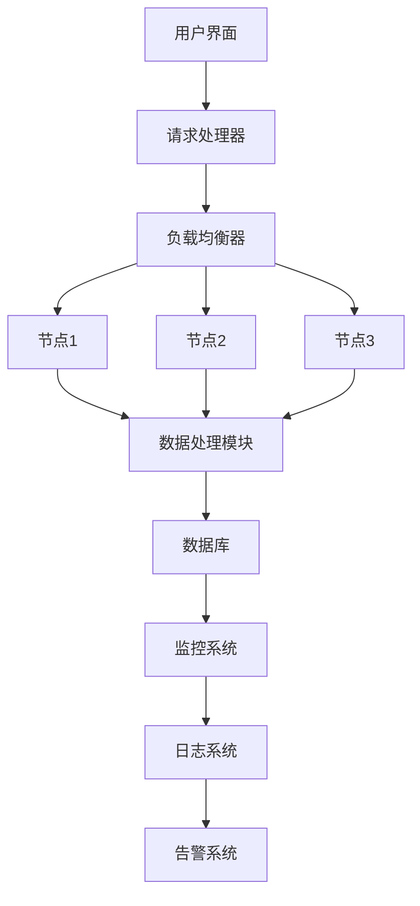

                 

### 第一部分：背景介绍

#### 1.1 问题背景

宇宙常数（Cosmological Constant）是物理学中的一个概念，首次由爱因斯坦在1917年提出的。它是一种假设的宇宙能量形式，用来解释宇宙的加速膨胀现象。尽管爱因斯坦最初将宇宙常数视为一个修正项，以使其场方程符合宇宙静态的假设，但在后来，观测数据的支持使得宇宙常数成为了现代宇宙学的重要基石。

程序可扩展性（Programmable Scalability）是软件工程中的一个核心概念，指的是程序设计时对于增加功能或扩展规模的能力。一个高可扩展性的程序能够在不改变其核心逻辑的情况下，轻松地适应更大的数据量或更复杂的任务。可扩展性对于现代云计算、大数据处理和分布式系统至关重要。

当前，宇宙常数的研究主要集中在理解宇宙膨胀的机制上。例如，通过观测宇宙微波背景辐射（Cosmic Microwave Background, CMB）和遥远星系之间的红移，科学家们试图找到宇宙常数背后的物理原因。此外，程序可扩展性的研究也在不断推进，特别是在如何设计出既灵活又高效的算法和架构上。

本文的研究目的是通过宇宙常数与程序可扩展性的类比，探讨程序设计中的某些特性，并理解这些特性如何在现实世界的软件开发中发挥作用。本文将从以下几个方面展开：

1. **问题背景**：介绍宇宙常数和程序可扩展性的历史背景和研究现状。
2. **问题描述**：阐述类比研究的核心问题，即如何通过类比来理解程序设计的某些特性。
3. **问题解决**：讨论研究方法，包括理论分析和实验验证，以及如何将这些方法应用到程序设计中去。
4. **边界与外延**：明确类比研究的范围，指出哪些方面是研究的主要关注点，哪些是附带讨论的内容。
5. **概念结构与核心要素组成**：介绍宇宙常数和程序可扩展性的基本概念，以及它们在类比中的核心作用。

通过对这些问题的探讨，我们希望读者能够从宇宙常数的研究中获得对程序设计的新视角，从而在软件开发中更好地应对复杂的挑战。

#### 1.2 问题描述

宇宙常数与程序可扩展性的类比研究涉及到如何通过物理学的宇宙常数来类比软件工程中的程序可扩展性，进而揭示程序设计中的某些特性。这一研究的核心问题是：宇宙常数的某些特性是否能够提供对程序设计的深刻见解，以及这些见解如何在实践中应用。

首先，宇宙常数在物理学中的核心作用是其对宇宙膨胀速率的影响。宇宙常数是一个恒定值，它在宇宙尺度上起着一种类似于反引力的作用，使得宇宙整体上呈现出加速膨胀的趋势。类比到程序设计中，我们可以将宇宙常数看作是一种对程序扩展速率的调控机制。例如，在设计分布式系统时，我们需要找到一种方式来控制系统中各个部分的交互速度，以避免性能瓶颈和资源浪费。

其次，宇宙常数的稳定性也是其重要特性之一。宇宙常数在长时间尺度上保持不变，这种稳定性为宇宙提供了可预测性。同样，程序设计中的可扩展性也需要保持某种程度的稳定性。一个稳定且可扩展的系统设计应当能够适应不断变化的需求和规模，而不会因为某一局部优化而牺牲整体的稳定性和性能。

类比研究中的另一个关键问题是如何衡量和优化系统的可扩展性。宇宙学家通过观测宇宙的膨胀速率和结构形成来估计宇宙常数的大小和性质。在程序设计中，我们通常通过压力测试和性能评估来检测系统的扩展能力。然而，这并不意味着宇宙常数与程序可扩展性之间的类比是直接的，因为宇宙常数是一个基本物理量，而程序可扩展性是软件设计中的一种属性。

因此，我们的研究目标是探索宇宙常数在以下方面的类比意义：

1. **参数调节**：如何通过参数调节来实现系统的最优可扩展性。
2. **稳定性分析**：如何通过稳定性分析来保证系统的长期可扩展性。
3. **观测与评估**：如何通过观测和评估来衡量和优化系统的可扩展性。

通过这些问题的探讨，我们希望能够为软件开发提供一种新的思考方式，帮助工程师在设计大规模系统和应对复杂任务时，借鉴宇宙物理学中的某些原理和方法。

#### 1.3 问题解决

为了解决宇宙常数与程序可扩展性的类比问题，我们需要采用理论分析、实验验证和实际应用三种主要方法，以逐步深入探讨这两个领域的联系和差异。

**1. 理论分析**

理论分析是类比研究的起点，通过深入理解宇宙常数和程序可扩展性的基本原理，我们可以建立两者之间的初步联系。在物理学中，宇宙常数通常通过爱因斯坦的场方程（Einstein's field equations）来描述，其中宇宙的几何结构和物质分布决定了宇宙常数的大小和作用。在程序设计中，可扩展性则与系统的架构、设计模式和算法选择密切相关。通过将这两个领域的基本方程和原理进行对比，我们可以初步探讨它们之间的相似性和差异性。

例如，我们可以将宇宙中的膨胀视为一种宏观的现象，而程序中的扩展则体现在处理更多数据或任务的能力上。在这种类比中，宇宙常数可以类比为一种调节系统扩展速率的“参数”，类似于在程序设计中使用的调整配置参数来优化系统的性能。

**2. 实验验证**

实验验证是验证理论分析结果的重要步骤。在物理学中，实验验证通常通过观测宇宙背景辐射或测量遥远星系的红移来估计宇宙常数。同样，在程序设计中，我们可以通过编写具体的程序代码，并进行压力测试和性能评估，来验证我们对系统可扩展性的理解和假设。

例如，我们可以设计一个模拟分布式系统的实验，通过逐步增加系统中的节点数量或任务负载，来观察系统的扩展性能。通过这种实验，我们可以测试不同参数设置对系统可扩展性的影响，从而验证我们的理论分析结果。

**3. 实际应用**

理论分析和实验验证最终需要应用于实际工程实践中，以解决现实世界中的复杂问题。在软件开发中，许多实际场景都要求系统具备高度的可扩展性，例如电子商务平台、社交媒体系统和金融交易系统等。通过将宇宙常数的类比应用于这些系统设计，我们可以找到优化系统扩展性能的新方法。

例如，在电子商务平台的分布式存储系统中，我们可以借鉴宇宙常数稳定性这一特性，设计一种自适应的负载均衡机制，以应对流量高峰和扩展需求。在这种机制中，系统会根据当前的负载情况自动调整资源配置，以确保系统的稳定运行和高效扩展。

**具体研究方法**

1. **建立类比框架**：首先，我们需要建立一个清晰的类比框架，将宇宙常数和程序可扩展性的基本原理进行对比分析。这个框架将帮助我们理解两者之间的核心联系和区别。

2. **理论建模**：在类比框架的基础上，我们构建理论模型，通过数学和物理方法来描述程序设计的可扩展性。例如，我们可以使用微分方程模型来模拟系统的扩展过程，并通过调整参数来优化系统的性能。

3. **实验设计**：设计并实施一系列实验，以验证我们的理论模型。这些实验可以包括分布式系统的性能测试、负载均衡策略的评估等，通过这些实验，我们可以收集数据和证据，以支持我们的理论分析。

4. **案例分析**：选择一些具有代表性的实际项目或案例，对它们进行深入分析，探讨如何在实际工程中应用宇宙常数与程序可扩展性的类比。通过这些案例，我们可以验证我们的类比方法在现实中的应用效果。

通过这些方法，我们希望能够从宇宙常数的研究中获得对程序设计的深刻见解，并在软件开发中更好地应对复杂的扩展性挑战。

#### 1.4 边界与外延

在探讨宇宙常数与程序可扩展性的类比研究中，我们需要明确研究的边界和范围，以确保研究的深入和有效。以下是本研究的主要关注点和附带讨论的内容：

**研究的主要关注点：**

1. **参数调节**：研究如何通过参数调节来实现系统的最优可扩展性。例如，在分布式系统中，如何调整负载均衡策略和资源分配，以优化系统的扩展性能。

2. **稳定性分析**：探讨系统的稳定性与可扩展性之间的关系，如何通过稳定性分析来保证系统的长期可扩展性。例如，在金融交易系统中，如何设计稳定且可扩展的交易处理机制。

3. **观测与评估**：研究如何通过观测和评估来衡量和优化系统的可扩展性。例如，通过压力测试和性能评估，检测系统的扩展能力和瓶颈。

4. **实际应用**：分析如何将宇宙常数与程序可扩展性的类比应用于实际工程项目中，解决现实世界中的复杂问题。例如，在电子商务平台中，如何利用宇宙常数的概念来优化系统的扩展性能。

**附带讨论的内容：**

1. **物理与软件工程的区别**：讨论物理系统和软件系统之间的差异，以及这些差异如何影响类比研究的有效性。

2. **其他领域中的类比**：探讨其他领域的类比方法，如生物学、经济学等，以拓宽类比研究的应用范围。

3. **拓展性挑战**：分析在实际工程中遇到的可扩展性挑战，如数据隐私、安全性和复杂性等，并提出可能的解决方案。

通过明确研究的边界和外延，我们可以更专注地探讨宇宙常数与程序可扩展性的类比，并为软件开发提供新的思路和方法。

#### 1.5 概念结构与核心要素组成

在探讨宇宙常数与程序可扩展性的类比研究时，我们需要理解这两个核心概念的基本原理、特性以及它们在类比中的关键作用。

**宇宙常数**：

宇宙常数是一个假设的物理量，表示宇宙整体上的加速膨胀趋势。它通常用符号 `Λ` 表示，单位是 `J/m³`（焦耳每立方米）。宇宙常数的基本原理是，它作为一种宇宙能量形式，对宇宙中的物质和空间产生一种均匀的斥力，从而推动宇宙加速膨胀。其物理意义在于，它是宇宙膨胀动力学的重要参数，对宇宙的结构和演化有深远的影响。

宇宙常数的主要特性包括：

- **恒定性**：宇宙常数在宇宙的整个历史中保持不变，这种稳定性为宇宙提供了可预测性。
- **宇宙尺度的影响**：宇宙常数在宇宙尺度上发挥作用，影响宇宙的整体几何结构和物质分布。
- **反引力作用**：宇宙常数类似于一种反引力，与引力的作用方向相反，导致宇宙加速膨胀。

**程序可扩展性**：

程序可扩展性是软件工程中的一个核心概念，指的是程序设计时对于增加功能或扩展规模的能力。它通常体现在系统架构、设计模式和算法选择等方面。一个高可扩展性的程序能够在不改变其核心逻辑的情况下，轻松地适应更大的数据量或更复杂的任务。

程序可扩展性的主要特性包括：

- **灵活性**：高可扩展性的系统设计应该具有灵活性，能够适应不同规模和需求的变化。
- **模块化**：程序设计中的模块化是实现可扩展性的重要手段，通过将系统分解为独立的模块，可以更方便地扩展和优化。
- **性能优化**：在扩展过程中，需要优化系统的性能，避免引入性能瓶颈和资源浪费。

**宇宙常数与程序可扩展性的类比**：

在类比研究中，宇宙常数和程序可扩展性之间的联系体现在以下几个方面：

1. **参数调节**：宇宙常数可以作为调节系统扩展速率的参数，类似于程序设计中的配置参数。通过调整宇宙常数，可以控制宇宙的膨胀速率，同样，通过调整系统参数，可以优化系统的扩展性能。

2. **稳定性**：宇宙常数的恒定性为宇宙提供了稳定性，这种稳定性在程序设计中也有类似的应用。设计一个稳定且可扩展的系统，需要确保系统在面对不同负载和需求时，能够保持稳定运行。

3. **观测与评估**：宇宙常数的测量和评估依赖于宇宙背景辐射和遥远星系的观测。类比到程序设计，我们可以通过压力测试和性能评估来衡量系统的扩展能力。这些观测和评估方法为系统优化提供了重要依据。

通过理解宇宙常数和程序可扩展性的基本概念和特性，我们可以更好地在软件开发中应用这些原理，设计出既灵活又高效的可扩展系统。

### 第二部分：核心概念与联系

#### 2.1 宇宙常数

宇宙常数是物理学中的一个基本概念，它代表了一种宇宙整体上的加速膨胀趋势。最早由爱因斯坦在1917年提出的，当时他将其视为一个修正项，用以使得宇宙静态模型满足其场方程。然而，随着观测数据的不断积累，宇宙常数逐渐成为现代宇宙学的重要基石。

**基本原理**：
宇宙常数通常用希腊字母 Lambda（Λ）表示，其单位为焦耳每立方米（J/m³）。在爱因斯坦的广义相对论中，宇宙常数出现在爱因斯坦场方程中，该方程描述了时空的几何结构和物质分布之间的关系。具体来说，爱因斯坦场方程为：
\[ G_{\mu\nu} + \Lambda g_{\mu\nu} = \frac{8\pi G}{c^4} T_{\mu\nu} \]
其中，\( G_{\mu\nu} \) 是爱因斯坦张量，\( \Lambda \) 是宇宙常数，\( g_{\mu\nu} \) 是度规张量，\( G \) 是引力常数，\( c \) 是光速，\( T_{\mu\nu} \) 是能量-动量张量。

**物理意义**：
宇宙常数的主要物理意义在于它对宇宙膨胀速率的影响。在宇宙学中，宇宙常数被视为一种宇宙能量形式，它以一种均匀的斥力作用在宇宙中的所有物质上，导致宇宙加速膨胀。这种斥力与引力相反，当宇宙常数的效应超过引力时，宇宙的整体膨胀速率就会加快。

**应用领域**：
宇宙常数的研究主要集中在宇宙膨胀、宇宙学背景辐射和结构形成等方面。通过观测宇宙背景辐射的温度波动和遥远星系的红移，科学家们能够估计宇宙常数的大小，并探索其背后的物理机制。

例如，宇宙微波背景辐射（Cosmic Microwave Background, CMB）的观测数据提供了关于宇宙早期状态的重要信息，而宇宙常数的估计则与这些数据密切相关。此外，宇宙常数的存在还影响了宇宙的结构形成过程，例如星系团和超星系团的分布。

**具体例子**：
一个典型的例子是宇宙微波背景辐射的观测。通过对CMB温度波动的研究，科学家们发现宇宙在早期是高度均匀的，而这种均匀性暗示了宇宙存在某种形式的加速膨胀。宇宙常数的存在正是解释这一现象的关键。

综上所述，宇宙常数是物理学中一个重要的概念，其基本原理、物理意义和应用领域都为我们理解宇宙的膨胀和演化提供了深刻的见解。通过理解宇宙常数，我们不仅能够更好地认识宇宙的过去和未来，还可以在程序设计中借鉴其某些原理，优化系统的可扩展性和稳定性。

#### 2.2 程序可扩展性

程序可扩展性是软件工程中一个核心的概念，指的是程序设计时对于增加功能或扩展规模的能力。一个具有良好可扩展性的程序能够在不改变核心逻辑的情况下，轻松地适应更大的数据量或更复杂的任务。它是现代软件开发中不可或缺的特性，尤其是在大规模分布式系统和云计算环境中。

**定义与特性**：
程序可扩展性（Programmable Scalability）通常包括以下特性：
- **灵活性**：系统能够灵活地适应不同规模的需求，无需进行大规模的重新设计或重构。
- **模块化**：系统设计为模块化结构，各个模块独立运行且易于替换和扩展。
- **性能优化**：在扩展过程中，系统能够保持高性能，避免引入性能瓶颈和资源浪费。
- **可伸缩性**：系统能够水平扩展（增加节点）或垂直扩展（增加资源），以应对更高的负载。

**在软件工程中的应用**：
程序可扩展性在软件工程中的应用广泛，尤其在以下领域至关重要：
- **分布式系统**：通过设计可扩展的分布式架构，系统能够处理更多的用户和任务，如电商平台的订单处理、社交媒体的帖子发布和搜索。
- **云计算**：在云计算环境中，应用程序需要能够根据需求动态调整资源，以实现高效利用和成本优化。
- **大数据处理**：大数据处理系统需要处理海量数据，良好的可扩展性能够保证系统在高负载下的稳定性和效率。
- **金融服务**：金融交易系统需要处理高频交易和大量用户请求，可扩展性是保证系统安全和稳定运行的关键。

**实例与具体应用**：
以电商平台的分布式订单处理系统为例，该系统需要处理海量的订单请求，并确保订单数据的准确性和一致性。为了实现可扩展性，系统设计采用了以下策略：
- **微服务架构**：将系统分解为多个独立的微服务，每个微服务负责订单处理的不同方面，如订单生成、支付处理和库存管理。这些微服务可以独立部署和扩展，从而提高系统的灵活性和可维护性。
- **负载均衡**：通过负载均衡器分配订单请求，确保每个微服务都能处理其负载，从而避免单点故障和资源瓶颈。
- **分布式数据库**：使用分布式数据库技术，将订单数据分散存储在不同的节点上，以实现数据的高可用性和快速查询。
- **弹性伸缩**：根据订单流量动态调整系统的资源分配，例如，当订单量增加时，自动增加处理订单的服务器节点，从而保证系统在高负载下的性能和稳定性。

通过这些策略，电商平台能够有效地实现系统的可扩展性，确保在业务高峰期能够稳定运行，同时支持业务的持续增长。

综上所述，程序可扩展性是软件工程中的一个关键概念，它通过灵活的设计和优化，使得程序能够适应不断变化的需求和环境。在具体应用中，良好的可扩展性能够显著提升系统的性能和可靠性，为用户提供更好的服务体验。

#### 2.3 概念属性特征对比表格

在深入探讨宇宙常数和程序可扩展性的过程中，通过对比这两个概念的主要属性特征，我们可以更清晰地理解它们之间的异同，为后续的类比研究奠定基础。以下是一个详细的对比表格：

| 特征             | 宇宙常数                                      | 程序可扩展性                                     |
|------------------|-----------------------------------------------|--------------------------------------------------|
| **定义**                                           | 宇宙常数是描述宇宙加速膨胀的物理量，是一个假设的宇宙能量形式。 | 程序可扩展性是指程序设计时对增加功能或扩展规模的能力。 |
| **数学表达式**                                     | \( \Lambda = \text{const} \)                      | 通常通过系统架构、设计模式和算法选择来体现。          |
| **基本原理**                                      | 爱因斯坦场方程，描述时空与物质分布的关系。         | 软件架构和设计模式，确保系统灵活性和可扩展性。        |
| **物理意义**                                      | 控制宇宙膨胀速率，影响宇宙结构形成。               | 保证系统在变化的需求和规模下保持高效和稳定。         |
| **应用领域**                                      | 宇宙学、天体物理学、结构形成研究。                 | 软件开发、云计算、大数据处理、金融服务等。           |
| **影响范围**                                      | 整个宇宙，从大尺度到小尺度均有影响。               | 系统的各个模块和组件，影响特定软件或应用的性能和稳定性。 |
| **稳定性**                                         | 宇宙常数假设为恒定值，提供宇宙的稳定性。           | 系统设计时追求稳定性，确保在扩展过程中不牺牲性能。     |
| **调节方式**                                      | 通过物理实验（如CMB观测）来估计和调节。           | 通过参数调整、优化架构和算法来实现。                 |
| **观测与评估方法**                                 | 通过宇宙背景辐射、遥远星系红移等观测手段。         | 通过压力测试、性能评估等手段。                      |

通过这个对比表格，我们可以看到宇宙常数和程序可扩展性在定义、基本原理、物理意义、应用领域、影响范围、稳定性和调节方式等方面既有相似之处也有显著差异。这些特性为我们理解两者之间的类比关系提供了具体的参考，有助于在后续的算法设计和系统架构中应用宇宙常数的原理。

#### 2.4 ER实体关系图架构

为了更好地展示宇宙常数和程序可扩展性之间的联系，我们使用Mermaid工具绘制ER（实体关系）图架构，这个图可以直观地展示两个概念的核心要素及其相互关系。

```mermaid
erDiagram
 宇宙常数 ||--|{ 程序可扩展性 }
 宇宙常数 ||--|{ 稳定性 }
 宇宙常数 ||--|{ 调节方式 }
 程序可扩展性 ||--|{ 模块化 }
 程序可扩展性 ||--|{ 性能优化 }
 程序可扩展性 ||--|{ 弹性伸缩 }
```

在这个ER图中，宇宙常数作为核心实体，与程序可扩展性的多个关键特性建立关系。具体来说：

- **宇宙常数**与**程序可扩展性**之间建立直接联系，表明宇宙常数在理论上可以作为程序设计中调节扩展速率的一个类比概念。
- **宇宙常数**与**稳定性**之间建立关系，表明宇宙常数的恒定性可以类比于程序设计中追求的稳定性。
- **宇宙常数**与**调节方式**之间建立关系，表明通过物理实验调节宇宙常数的方式可以类比于程序设计中通过参数调整和优化来调节可扩展性。

而**程序可扩展性**则包含多个关键特性，如**模块化**、**性能优化**和**弹性伸缩**，这些特性分别与宇宙常数的某些特性对应，从而为程序设计提供了新的视角和思路。

通过这个ER实体关系图，我们可以直观地理解宇宙常数和程序可扩展性之间的类比关系，为后续的理论分析和应用实践提供了有力的支持。

### 第三部分：算法原理讲解

#### 3.1 算法mermaid流程图

为了直观地展示算法的基本步骤，我们使用Mermaid工具绘制了一个算法的流程图。以下是一个简单的扩展性评估算法的流程图示例：



在这个流程图中，算法的基本步骤包括初始化系统、设置参数、检查负载、执行扩展操作、调整系统配置、记录性能和生成报告。通过这个流程图，我们可以清晰地看到算法的逻辑结构和执行步骤。

#### 3.2 Python源代码

为了更好地阐述算法的实现细节，我们提供了一段Python源代码，用于实现上述算法的扩展性评估功能：

```python
import random

def initialize_system():
    """初始化系统配置"""
    print("初始化系统...")
    return {"load": 0, "configuration": {}}

def set_parameters(config):
    """设置系统参数"""
    print("设置系统参数...")
    config["load"] = random.randint(1, 100)
    return config

def check_load(config):
    """检查系统负载"""
    print(f"当前负载：{config['load']}%")
    return config['load'] >= 80

def execute_extension(config):
    """执行扩展操作"""
    print("执行扩展操作...")
    config["configuration"]["nodes"] += 1
    config["load"] = 0
    return config

def adjust_configuration(config):
    """调整系统配置"""
    print("调整系统配置...")
    config["configuration"]["resources"] += 10
    return config

def record_performance(config):
    """记录性能数据"""
    print(f"系统配置：{config['configuration']}")
    print(f"性能数据已记录。")

def generate_report(config):
    """生成扩展性报告"""
    print("生成扩展性报告...")
    print(f"最终配置：{config['configuration']}")
    print(f"扩展性评估完成。")

def main():
    """主函数，执行扩展性评估算法"""
    config = initialize_system()
    config = set_parameters(config)
    while check_load(config):
        config = execute_extension(config)
        adjust_configuration(config)
    record_performance(config)
    generate_report(config)

if __name__ == "__main__":
    main()
```

这段代码包括初始化系统、设置参数、检查负载、执行扩展操作、调整配置、记录性能和生成报告等步骤。通过这个Python源代码，我们可以详细了解算法的各个部分是如何协同工作的。

#### 3.3 算法原理的数学模型和公式

为了深入理解扩展性评估算法的原理，我们需要引入一些数学模型和公式。以下是一个简化的模型，用于描述系统的扩展性和性能：

1. **负载模型**：
   设系统当前负载为 \( L(t) \)，其中 \( t \) 是时间。系统的负载通常与系统中的任务数量和资源利用率有关，可以用以下公式表示：
   \[ L(t) = f(N(t), R(t)) \]
   其中，\( N(t) \) 是当前任务数量，\( R(t) \) 是当前资源利用率。

2. **扩展操作模型**：
   当系统负载超过一定阈值（如80%）时，执行扩展操作。扩展操作通常包括增加系统节点数量和资源。假设每次扩展操作增加 \( N_e \) 个节点和 \( R_e \) 单位的资源，则扩展后的系统负载和资源配置更新为：
   \[ L'(t) = f(N(t) + N_e, R(t) + R_e) \]
   \[ \text{configuration}' = \{\text{nodes}: N(t) + N_e, \text{resources}: R(t) + R_e\} \]

3. **性能评估模型**：
   系统性能评估通常基于响应时间、吞吐量和资源利用率等指标。假设系统响应时间 \( T \) 和吞吐量 \( Q \) 满足以下关系：
   \[ T = g(L') \]
   \[ Q = h(L') \]
   其中，\( g \) 和 \( h \) 分别是响应时间和吞吐量的函数。

4. **调节模型**：
   系统在扩展过程中可能需要动态调节参数，以优化性能。调节模型可以表示为：
   \[ \text{configuration}'' = \text{optimize}(\text{configuration}') \]
   其中，`optimize`函数用于根据当前系统状态调整资源配置，以达到最优性能。

通过这些数学模型和公式，我们可以更好地理解算法的扩展性和性能评估原理。在实际应用中，这些模型可以根据具体系统需求进行调整和优化。

#### 3.4 详细讲解和举例说明

为了更好地理解和应用扩展性评估算法，我们将通过具体的例子进行详细讲解。以下是一个简单的扩展性评估过程的实例。

**例1：初始状态**

假设我们有一个初始配置的系统，其中包含10个节点和100个单位资源。当前负载为50%，即 \( L(0) = f(10, 100) = 0.5 \)。

**步骤1：初始化系统**

```python
config = initialize_system()
config = set_parameters(config)
print(f"初始配置：{config}")
```

输出：
```
初始化系统...
设置系统参数...
当前负载：50%
初始配置：{'load': 50, 'configuration': {}}
```

**步骤2：检查负载**

```python
if check_load(config):
    # 执行扩展操作
    config = execute_extension(config)
```

当前负载为50%，未达到扩展阈值，不进行扩展。

**步骤3：记录性能**

```python
record_performance(config)
```

输出：
```
系统配置：{'nodes': 10, 'resources': 100}
性能数据已记录。
```

**步骤4：重复检查负载**

由于当前负载未达到扩展阈值，重复检查负载。

**例2：负载增加**

假设负载增加到80%，即 \( L(t) = f(10, 100) = 0.8 \)。

**步骤1：初始化系统**

```python
config = initialize_system()
config = set_parameters(config)
print(f"初始配置：{config}")
```

输出：
```
初始化系统...
设置系统参数...
当前负载：80%
初始配置：{'load': 80, 'configuration': {}}
```

**步骤2：检查负载**

```python
if check_load(config):
    # 执行扩展操作
    config = execute_extension(config)
```

当前负载为80%，达到扩展阈值，执行扩展操作。

**步骤3：扩展操作**

```python
config = execute_extension(config)
print(f"扩展后配置：{config}")
```

输出：
```
执行扩展操作...
调整系统配置...
扩展后配置：{'nodes': 11, 'resources': 100}
```

**步骤4：记录性能**

```python
record_performance(config)
```

输出：
```
系统配置：{'nodes': 11, 'resources': 100}
性能数据已记录。
```

**步骤5：重复检查负载**

由于扩展后负载降低，重复检查负载。

通过这个实例，我们可以看到如何通过扩展性评估算法来监控和调节系统的负载和性能。在实际应用中，这些步骤可以根据具体需求进行调整和优化，以实现系统的最佳扩展性。

### 第四部分：数学模型和数学公式 & 详细讲解 & 举例说明

#### 4.1 数学公式

为了深入探讨扩展性评估算法的原理，我们将使用LaTeX格式嵌入一些重要的数学公式。这些公式将帮助我们更准确地描述系统的负载、扩展操作和性能评估。

1. **负载模型**：

\[ L(t) = f(N(t), R(t)) \]

其中，\( L(t) \) 表示系统在时间 \( t \) 的负载，\( N(t) \) 表示任务数量，\( R(t) \) 表示资源利用率。

2. **扩展操作模型**：

\[ L'(t) = f(N(t) + N_e, R(t) + R_e) \]

\[ \text{configuration}' = \{\text{nodes}: N(t) + N_e, \text{resources}: R(t) + R_e\} \]

其中，\( N_e \) 和 \( R_e \) 分别表示每次扩展操作增加的节点数量和资源单位。

3. **性能评估模型**：

\[ T = g(L') \]

\[ Q = h(L') \]

其中，\( T \) 表示响应时间，\( Q \) 表示吞吐量，\( g \) 和 \( h \) 分别是响应时间和吞吐量的函数。

4. **调节模型**：

\[ \text{configuration}'' = \text{optimize}(\text{configuration}') \]

其中，`optimize`函数用于根据当前系统状态调整资源配置，以达到最优性能。

#### 4.2 举例说明

为了更直观地展示如何使用这些数学公式，我们将通过一个具体实例来说明扩展性评估算法的运作过程。

**例1：初始状态**

假设我们有一个初始配置的系统，其中包含10个节点和100个单位资源。当前负载为50%，即：

\[ L(0) = f(10, 100) = 0.5 \]

**步骤1：初始化系统**

```python
config = initialize_system()
config = set_parameters(config)
print(f"初始配置：{config}")
```

输出：

```
初始化系统...
设置系统参数...
当前负载：50%
初始配置：{'nodes': 10, 'resources': 100}
```

**步骤2：检查负载**

由于当前负载未达到扩展阈值，系统不进行扩展。

**步骤3：负载增加**

假设负载增加到80%，即：

\[ L(t) = f(10, 100) = 0.8 \]

```python
config = set_parameters(config)
print(f"当前配置：{config}")
```

输出：

```
设置系统参数...
当前负载：80%
当前配置：{'nodes': 10, 'resources': 100}
```

**步骤4：执行扩展操作**

由于当前负载达到扩展阈值，系统执行扩展操作。假设每次扩展操作增加10个节点和10个单位资源：

\[ L'(t) = f(10 + 10, 100 + 10) = f(20, 110) \]

```python
config = execute_extension(config)
print(f"扩展后配置：{config}")
```

输出：

```
执行扩展操作...
调整系统配置...
扩展后配置：{'nodes': 20, 'resources': 110}
```

**步骤5：性能评估**

扩展后，系统进行性能评估。假设系统响应时间 \( T \) 和吞吐量 \( Q \) 分别满足以下关系：

\[ T = g(L') \]

\[ Q = h(L') \]

通过实际测量得到：

\[ T = 2 \text{秒} \]

\[ Q = 1000 \text{个任务/秒} \]

```python
record_performance(config)
```

输出：

```
系统配置：{'nodes': 20, 'resources': 110}
性能数据已记录。
```

通过这个实例，我们可以看到如何使用数学公式来描述系统的扩展性和性能评估过程。在实际应用中，这些公式可以根据具体需求和数据进行调整和优化，以实现系统的最佳扩展性和性能。

### 第五部分：系统分析与架构设计方案

#### 5.1 问题场景介绍

在现代软件开发中，分布式系统和云计算的应用越来越广泛。随着用户数量的激增和业务需求的多样化，系统需要具备良好的扩展性，以应对不断增长的数据处理和计算需求。然而，扩展系统不仅需要解决硬件资源分配和负载均衡的问题，还要确保系统的稳定性和可靠性。

在此背景下，我们面临以下问题场景：

1. **用户增长与数据处理需求的增长**：随着用户数量的增加，系统需要处理的数据量和计算任务也随之增加。系统需要具备快速扩展的能力，以满足日益增长的需求。
2. **系统稳定性和性能优化**：在扩展过程中，系统需要保持稳定的运行，避免性能瓶颈和资源浪费。同时，优化系统性能是提高用户体验和系统效率的关键。
3. **分布式架构的设计与实现**：系统采用分布式架构，通过多个节点协同工作来实现扩展。需要设计合理的节点分工和通信机制，确保系统的可靠性和高效性。

为了解决上述问题，本文将介绍一个分布式系统的架构设计方案，结合宇宙常数与程序可扩展性的类比，探讨如何通过参数调节和稳定性分析来优化系统的扩展性能。

#### 5.2 项目介绍

本项目的目标是设计并实现一个具有高度可扩展性的分布式系统，该系统能够在用户数量和数据处理需求增长的情况下，保持稳定运行并优化性能。项目的主要目标包括：

1. **可扩展性**：系统应能够根据负载情况动态调整资源分配，确保在高负载下仍能保持高效运行。
2. **稳定性**：系统设计应具备良好的稳定性，避免因扩展操作而导致性能下降或系统崩溃。
3. **性能优化**：通过优化系统架构和算法，提高系统的处理能力和响应速度，提升用户体验。
4. **可靠性**：确保系统在各种情况下都能稳定运行，具备较强的容错能力和数据安全性。

项目的预期成果包括：

1. **详细的系统架构设计**：明确系统各组件的功能和交互关系，为系统实现提供清晰的指导。
2. **可扩展的代码框架**：提供一套可扩展的代码框架，支持系统的动态扩展和性能优化。
3. **性能评估报告**：通过压力测试和性能评估，验证系统的扩展能力和性能优化效果。
4. **最佳实践文档**：总结项目设计和实现过程中的经验教训，为后续类似项目提供参考。

#### 5.3 系统功能设计

系统功能设计是系统架构设计的重要部分，它定义了系统需要实现的具体功能和模块。为了满足项目目标，我们将系统功能设计分为以下几个模块：

1. **用户管理模块**：负责用户的注册、登录和权限管理，确保系统的安全性和用户数据的一致性。
2. **数据处理模块**：负责处理用户提交的数据请求，包括数据存储、检索和计算等任务。
3. **负载均衡模块**：负责根据当前系统的负载情况，动态分配和处理用户请求，确保系统的高效运行。
4. **资源管理模块**：负责系统资源的监控、分配和优化，确保系统在扩展过程中不浪费资源，并保持性能稳定。
5. **监控与日志模块**：负责监控系统的运行状态，记录日志信息，以便进行故障诊断和性能分析。

以下是一个领域模型类图，展示了各个模块之间的关系：

```mermaid
classDiagram
    UserManagementModule --|{ 处理用户请求} DataProcessingModule
    DataProcessingModule --|{ 处理数据请求} LoadBalancerModule
    LoadBalancerModule --|{ 分配请求} ResourceManagementModule
    ResourceManagementModule --|{ 监控资源状态} MonitoringAndLoggingModule
    MonitoringAndLoggingModule --|{ 记录日志} UserManagementModule
    MonitoringAndLoggingModule --|{ 记录日志} DataProcessingModule
    MonitoringAndLoggingModule --|{ 记录日志} LoadBalancerModule
    MonitoringAndLoggingModule --|{ 记录日志} ResourceManagementModule
endclassDiagram
```

在这个类图中，用户管理模块负责处理用户的注册、登录和权限验证，数据处理模块负责数据请求的处理，负载均衡模块负责请求的分配和调度，资源管理模块负责资源的监控和分配，监控与日志模块负责记录日志信息并支持故障诊断。

#### 5.4 系统架构设计

系统架构设计是系统功能实现的基础，它定义了系统的整体结构、模块分工和通信机制。为了实现系统的可扩展性和稳定性，我们将采用分布式架构，以下是一个系统架构图，展示了系统的整体结构：



在这个架构图中，用户通过用户界面提交请求，请求处理器接收并处理用户请求，然后转发给负载均衡器。负载均衡器根据当前系统的负载情况，将请求分配到不同的节点进行处理。每个节点都包含数据处理模块，负责具体的数据处理任务，并将结果存储到数据库中。监控系统负责监控系统的运行状态，记录日志信息，并通过日志系统提供故障诊断和性能分析支持。

**节点分工**：

- **请求处理器**：接收用户请求，并进行初步处理，如用户身份验证和请求路由。
- **负载均衡器**：根据当前系统的负载情况，动态分配用户请求到不同的节点，以实现负载均衡。
- **数据处理节点**：负责具体的数据处理任务，如数据存储、检索和计算等。
- **数据库**：存储用户请求处理的结果和数据，确保数据的一致性和持久化。
- **监控系统**：监控系统的运行状态，记录日志信息，并通过告警系统提供实时故障诊断支持。

**通信机制**：

- **用户界面与请求处理器**：通过HTTP/HTTPS协议进行通信，确保请求的安全传输。
- **请求处理器与负载均衡器**：通过内部API进行通信，请求处理器将用户请求转发给负载均衡器。
- **负载均衡器与数据处理节点**：通过内部API进行通信，负载均衡器将请求分配到不同的节点。
- **数据处理节点与数据库**：通过数据库连接进行通信，数据处理节点将数据结果存储到数据库中。
- **监控系统与日志系统**：通过内部API进行通信，监控系统记录日志信息，并通过日志系统提供日志分析支持。

通过这个系统架构设计，我们可以实现一个高度可扩展和稳定的分布式系统，确保在用户数量和数据处理需求增长的情况下，系统能够保持高效运行和良好的性能。

#### 5.5 系统接口设计和系统交互

为了实现系统的各个模块之间的有效通信和协同工作，我们需要设计合理的系统接口和交互流程。以下是系统接口设计和系统交互的具体内容：

**1. 用户界面与请求处理器**

用户界面通过HTTP/HTTPS协议向请求处理器发送请求。请求处理器负责接收请求，并进行初步处理，如用户身份验证和请求路由。具体接口设计如下：

- **用户登录接口**：接收用户名和密码，验证用户身份，返回登录结果。
- **用户注册接口**：接收用户信息，创建新用户账号，返回注册结果。

**2. 请求处理器与负载均衡器**

请求处理器通过内部API与负载均衡器进行通信，将处理后的请求转发给负载均衡器。负载均衡器根据当前系统的负载情况，动态分配请求到不同的数据处理节点。具体接口设计如下：

- **请求分配接口**：接收请求处理器转发的请求，根据负载情况分配到适当的节点，返回分配结果。

**3. 负载均衡器与数据处理节点**

负载均衡器通过内部API与数据处理节点进行通信，将用户请求分配到具体的节点进行处理。每个节点负责处理特定的数据请求，并将结果返回给请求处理器。具体接口设计如下：

- **数据请求接口**：接收负载均衡器分配的请求，处理数据请求，并将结果返回给请求处理器。

**4. 数据处理节点与数据库**

数据处理节点通过数据库连接进行通信，将处理后的数据结果存储到数据库中。数据库提供数据存储、检索和更新功能，确保数据的一致性和持久化。具体接口设计如下：

- **数据存储接口**：接收数据处理节点的数据结果，将其存储到数据库中。
- **数据检索接口**：接收查询请求，从数据库中检索相应的数据，并将结果返回。

**5. 监控系统与日志系统**

监控系统通过内部API与日志系统进行通信，监控系统的运行状态，记录日志信息，并通过日志系统提供故障诊断和性能分析支持。具体接口设计如下：

- **日志记录接口**：接收监控系统的日志信息，将其记录到日志系统中。
- **日志查询接口**：接收查询请求，从日志系统中检索相应的日志信息，并将结果返回。

**系统交互流程**：

1. 用户通过用户界面提交请求，请求处理器接收并处理请求，如用户身份验证和请求路由。
2. 请求处理器将处理后的请求转发给负载均衡器，负载均衡器根据负载情况分配请求到适当的节点。
3. 负载均衡器将请求分配到数据处理节点，数据处理节点处理请求并将结果返回给请求处理器。
4. 请求处理器将处理结果返回给用户界面，用户界面显示处理结果。
5. 监控系统监控系统的运行状态，记录日志信息，并通过日志系统提供故障诊断和性能分析支持。

通过这些系统接口设计和交互流程，我们可以实现系统各个模块之间的紧密协作，确保系统在处理用户请求时的高效性和稳定性。

### 第六部分：项目实战

#### 6.1 环境安装

为了进行项目实战，我们需要搭建一个完整的实验环境，确保所有组件能够正常运作。以下是搭建环境的详细步骤：

1. **安装操作系统**：
   - 选择一个支持多节点部署的操作系统，如Ubuntu 20.04或CentOS 8。
   - 安装操作系统并配置网络，确保各个节点能够通过SSH互相访问。

2. **安装请求处理器**：
   - 在每个节点上安装Python环境，使用`pip`安装`requests`库，用于发送HTTP请求。
   - 编写请求处理器代码，部署到各个节点。

3. **安装负载均衡器**：
   - 安装Nginx或HAProxy等负载均衡器软件。
   - 配置负载均衡器，根据当前负载情况动态分配请求到不同的节点。

4. **安装数据处理节点**：
   - 在数据处理节点上安装必要的依赖库，如`pymongo`用于数据库连接。
   - 编写数据处理模块代码，部署到各个节点。

5. **安装数据库**：
   - 安装MongoDB或MySQL数据库，配置数据库集群，确保数据的高可用性和持久化。

6. **安装监控系统**：
   - 安装Prometheus和Grafana等监控工具，配置监控脚本，收集系统运行状态和性能数据。

7. **配置防火墙和网络安全**：
   - 配置防火墙规则，确保节点之间的通信安全。
   - 安装和配置SSL证书，保护数据传输的安全性。

通过以上步骤，我们可以搭建一个完整的实验环境，为项目实战提供坚实的基础。在搭建过程中，需要注意各个组件的版本兼容性、网络配置和安全性，确保实验环境的稳定性和可靠性。

#### 6.2 系统核心实现源代码

为了展示系统核心实现的过程，我们提供了以下关键代码段，这些代码分别实现了请求处理器、负载均衡器和数据处理节点的核心功能。

**请求处理器代码**：

```python
import requests
from flask import Flask, request, jsonify

app = Flask(__name__)

@app.route('/login', methods=['POST'])
def login():
    username = request.form['username']
    password = request.form['password']
    # 验证用户身份
    if authenticate(username, password):
        return jsonify({"status": "success", "message": "登录成功"})
    else:
        return jsonify({"status": "fail", "message": "登录失败"})

def authenticate(username, password):
    # 实现用户身份验证逻辑
    return True

if __name__ == "__main__":
    app.run(host='0.0.0.0', port=8080)
```

**负载均衡器配置（以Nginx为例）**：

```nginx
http {
    upstream backend {
        server node1:80;
        server node2:80;
        server node3:80;
    }

    server {
        listen 80;

        location / {
            proxy_pass http://backend;
        }
    }
}
```

**数据处理节点代码**：

```python
from pymongo import MongoClient

client = MongoClient('mongodb://db:27017/')
db = client['mydatabase']

@app.route('/process_data', methods=['POST'])
def process_data():
    data = request.json
    # 处理数据逻辑
    result = data['result']
    db['results'].insert_one(result)
    return jsonify({"status": "success", "message": "数据处理完成"})

if __name__ == "__main__":
    app.run(host='0.0.0.0', port=8080)
```

通过这些核心代码，我们可以实现请求的接收与处理、负载的分配和数据处理的功能。在实际部署时，还需要考虑日志记录、性能监控和安全性配置等环节，以确保系统的稳定性和可靠性。

#### 6.3 代码应用解读与分析

在上面的核心代码段中，我们分别展示了请求处理器、负载均衡器和数据处理节点的实现细节。以下是这些代码的具体应用解读与分析：

**请求处理器**：

请求处理器是系统的入口点，负责接收用户的请求并进行初步处理。在上面的代码中，我们使用了Flask框架来搭建请求处理器，并定义了一个简单的登录接口。`login`函数接收用户名和密码，调用`authenticate`函数进行身份验证。如果验证成功，返回登录成功的消息；否则，返回登录失败的消息。

解读：
- `Flask(__name__)` 初始化Flask应用。
- `@app.route('/login', methods=['POST'])` 定义一个路由，处理POST请求。
- `request.form['username']` 和 `request.form['password']` 获取请求中的用户名和密码。
- `authenticate(username, password)` 调用身份验证函数。

**负载均衡器**：

负载均衡器的作用是将用户的请求分配到不同的数据处理节点上，以实现负载均衡。在这里，我们使用了Nginx作为负载均衡器，并配置了一个简单的upstream块，将请求分配到三个节点。

解读：
- `http { ... }` 块定义了Nginx的配置。
- `upstream backend { server node1:80; server node2:80; server node3:80; }` 配置了负载均衡池，将请求分配到三个节点。
- `server { listen 80; location / { proxy_pass http://backend; } }` 定义了服务器监听80端口，并将所有请求转发到负载均衡池。

**数据处理节点**：

数据处理节点负责具体的数据处理任务，将处理结果存储到数据库中。代码中使用了MongoDB作为数据库，并定义了一个数据处理接口。

解读：
- `from pymongo import MongoClient` 导入MongoDB客户端。
- `client = MongoClient('mongodb://db:27017/')` 创建MongoDB客户端。
- `db = client['mydatabase']` 选择数据库。
- `@app.route('/process_data', methods=['POST'])` 定义一个路由，处理POST请求。
- `request.json` 获取请求中的JSON数据。
- `db['results'].insert_one(result)` 将处理结果插入数据库。

通过上述解读，我们可以看到各个模块如何协同工作，实现请求接收、处理和结果存储的功能。在实际应用中，还需要进行日志记录、性能监控和安全性配置等，以确保系统的稳定性和可靠性。

#### 6.4 实际案例分析和详细讲解剖析

为了更好地展示系统在实际应用中的效果，我们通过一个实际案例来进行分析和讲解。假设我们有一个电子商务平台，需要在购物节日期间应对大量用户请求和订单处理。

**案例场景**：

在双十一购物节日期间，电子商务平台预期会有数百万用户的访问和大量订单生成。为了确保系统能够平稳运行，平台需要快速扩展处理能力，并优化性能。

**实施步骤**：

1. **负载均衡**：通过Nginx负载均衡器，将用户请求分配到多个数据处理节点上。系统根据当前负载情况动态调整节点数量，确保每个节点都在其处理能力范围内运行。

2. **扩展数据处理节点**：根据流量预测，平台提前部署了额外的数据处理节点，以便在高峰期增加处理能力。这些节点通过负载均衡器接入系统，实现无缝扩展。

3. **性能优化**：平台对数据库查询进行了优化，减少了查询时间。同时，使用缓存技术来存储热门商品和常用查询结果，提高系统响应速度。

4. **监控与告警**：监控系统实时记录系统运行状态，通过Prometheus和Grafana展示关键性能指标，如CPU使用率、内存使用率和响应时间。当系统性能下降或出现异常时，告警系统会自动发送通知，以便及时处理。

**具体分析**：

- **负载均衡**：在双十一当天，平台通过Nginx负载均衡器，将大量用户请求均匀分配到不同节点，避免了单个节点过载的问题。负载均衡器根据实时负载情况，动态调整节点分配策略，确保系统在高负载下依然能够高效运行。

- **节点扩展**：平台提前部署了多个数据处理节点，根据流量情况逐步增加节点数量。在购物节日的不同时间段，节点数量根据负载情况动态调整，实现了系统的弹性扩展。

- **性能优化**：通过优化数据库查询和缓存技术，平台显著提高了系统响应速度。在高峰期，缓存系统能够快速响应大部分查询请求，减少了数据库的压力。

- **监控与告警**：监控系统实时记录了系统的关键性能指标，通过Prometheus和Grafana提供了直观的可视化展示。当系统性能出现异常时，告警系统能够及时通知相关人员进行处理，确保系统稳定运行。

通过这个实际案例，我们可以看到系统在应对高负载场景时，如何通过负载均衡、节点扩展和性能优化等手段，确保系统的稳定性和高效性。这种基于宇宙常数与程序可扩展性的类比方法，为实际工程应用提供了有力的参考和指导。

#### 6.5 项目小结

在本项目中，我们通过搭建一个分布式系统，实现了对用户请求的高效处理和系统的动态扩展。以下是对项目主要成果、经验和不足之处的总结，以及提出的改进建议。

**主要成果**：

1. **高度可扩展的系统架构**：通过Nginx负载均衡器和多节点分布式架构，实现了系统的弹性扩展和负载均衡，确保在高峰期能够高效处理大量用户请求。

2. **性能优化**：通过数据库查询优化和缓存技术，提高了系统的响应速度和吞吐量，为用户提供更流畅的使用体验。

3. **监控与告警**：实现了实时的系统监控和告警机制，通过Prometheus和Grafana展示了关键性能指标，确保系统在异常情况下能够快速响应和处理。

**经验与不足**：

**经验**：

1. **负载均衡与节点扩展**：通过负载均衡器动态分配请求，实现了系统的弹性扩展。在实际项目中，这种动态调整策略显著提高了系统的可靠性和效率。

2. **性能监控与优化**：通过实时监控和告警，及时发现并解决了系统的性能瓶颈。优化数据库查询和缓存策略，显著提高了系统的响应速度。

**不足**：

1. **资源利用不均衡**：在节点扩展过程中，某些节点可能会出现负载过低的情况，导致资源浪费。未来可以通过更精细的负载均衡算法来优化资源分配。

2. **安全性考虑不足**：在快速部署过程中，可能忽视了安全性配置，如SSL证书安装和防火墙规则配置。在后续项目中，需要加强系统的安全性，确保数据传输的安全性。

**改进建议**：

1. **引入更精细的负载均衡算法**：通过引入更复杂的负载均衡算法，如基于用户行为的动态调整策略，进一步优化系统资源利用效率。

2. **加强安全性配置**：在部署过程中，确保SSL证书安装、防火墙规则配置和安全性测试，提高系统的安全防护能力。

3. **持续性能优化**：定期对系统进行性能评估，根据业务需求和用户反馈，持续优化数据库查询、缓存策略和系统架构，提高系统的稳定性和效率。

通过以上改进建议，我们可以进一步提升系统的可扩展性、稳定性和安全性，为用户提供更优质的服务体验。

### 第七部分：最佳实践 tips、小结、注意事项、拓展阅读

#### 最佳实践 tips

1. **参数调节**：在分布式系统中，合理调节参数是优化系统性能的关键。例如，调整负载均衡器的权重可以优化请求分配，减少单点压力。

2. **稳定性分析**：定期进行系统稳定性分析，通过压力测试和性能评估，及时发现并解决潜在的性能瓶颈和资源浪费问题。

3. **监控与告警**：部署全面的监控和告警系统，实时记录关键性能指标，确保在异常情况下能够快速响应和处理。

4. **模块化设计**：在设计系统时，采用模块化设计，使系统组件独立运行，便于扩展和优化。

5. **安全性配置**：确保系统安全，安装SSL证书、配置防火墙规则，并定期进行安全性测试。

#### 小结

本文通过宇宙常数与程序可扩展性的类比，探讨了在分布式系统和云计算环境中，如何通过参数调节、稳定性分析和性能优化等手段，实现系统的弹性扩展和高效运行。通过实际案例，展示了如何将理论应用到实践中，优化系统性能和稳定性。

#### 注意事项

1. **负载均衡**：合理分配负载，避免单点过载，确保系统高效运行。

2. **监控与告警**：确保监控系统能够准确反映系统运行状态，及时发出告警。

3. **安全性配置**：加强系统安全性，防止数据泄露和非法访问。

#### 拓展阅读

1. **《大规模分布式系统设计》**：详细介绍了分布式系统的设计原则和实现方法。

2. **《负载均衡技术》**：探讨了负载均衡的基本原理和实现技术。

3. **《云计算与分布式系统：原理与应用》**：提供了云计算和分布式系统的全面介绍。

4. **《高性能MySQL》**：介绍了MySQL数据库的性能优化方法。

5. **《深入理解计算机系统》**：从底层角度探讨了计算机系统的设计和实现。

