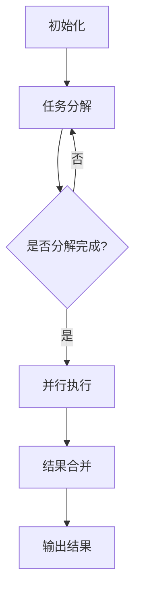
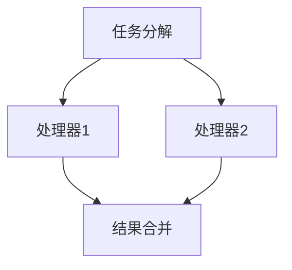
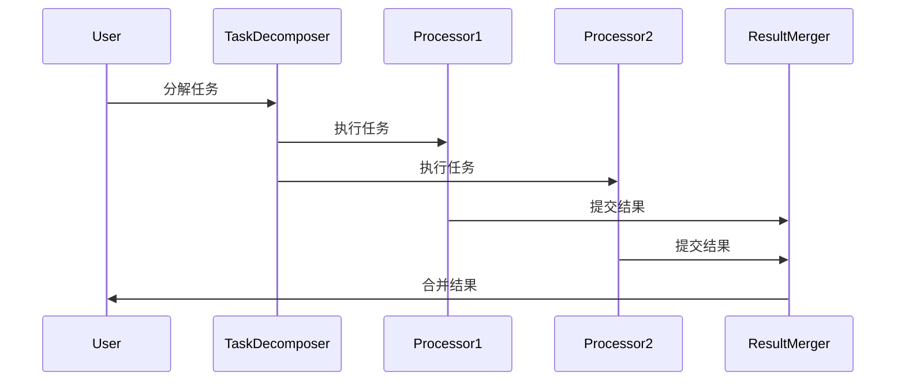
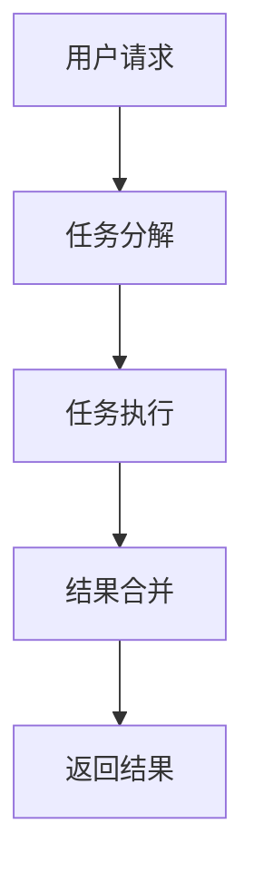
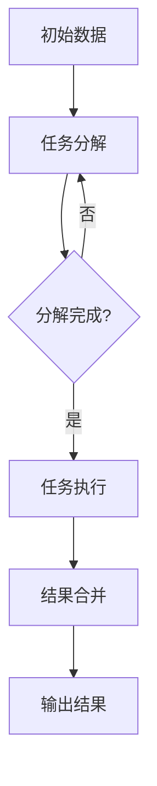

                 


### 宇宙常数与程序并行加速比理论上限的类比

#### 关键词：
宇宙常数、并行计算、加速比、算法、理论极限

#### 摘要：
本文旨在通过宇宙常数与程序并行加速比的理论类比，探讨两者在结构、属性和作用上的相似之处，进而深入理解并行计算的潜力和限制。我们将逐步分析宇宙常数的基本概念、程序并行加速比的原理，探讨它们之间的类比关系，并运用数学模型和实际项目进行阐述，最终总结最佳实践和未来拓展方向。

---

## 引言

宇宙常数是宇宙学中的一个基本概念，代表宇宙整体膨胀的加速度。它在宇宙学方程中扮演着至关重要的角色，是理解宇宙膨胀动力学的基础。另一方面，程序并行加速比是计算机科学中的一个关键指标，衡量并行算法在多处理器系统上的性能提升。尽管宇宙常数与程序并行加速比看似来自完全不同的领域，但它们在理论上有着诸多相似之处。

本文将分七个部分进行阐述。首先，我们将介绍宇宙常数和程序并行加速比的基本概念。接着，通过比较两者的核心特征，探讨它们之间的类比关系。随后，我们将深入讨论算法原理，展示数学模型和公式，并使用Python代码进行解释。接着，我们将分析系统架构，介绍一个实际的项目实战案例，最后提供最佳实践和小结。

### 背景介绍

#### 宇宙常数

宇宙常数（Cosmological Constant），通常用希腊字母λ（Lambda）表示，是爱因斯坦在1917年提出的宇宙学方程中的常数项。它代表了宇宙整体膨胀的加速度，即宇宙间的引力和宇宙的膨胀速度之间的平衡。宇宙常数最初是为了解释宇宙为什么会膨胀而提出的，但在后来的研究中，发现它与暗能量有着密切的联系。

宇宙常数的特点包括：

- **恒定性**：宇宙常数在整个宇宙中都是恒定的，不随时间和空间变化。
- **影响宇宙膨胀**：宇宙常数决定了宇宙的膨胀速度，是宇宙动力学中的一个关键参数。
- **与暗能量相关**：宇宙常数被认为是暗能量的一个表现形式，暗能量是一种假设存在的能量形式，它对宇宙的膨胀起着主导作用。

#### 程序并行加速比

程序并行加速比（Parallel Speedup Ratio）是计算机科学中的一个重要概念，用于衡量并行算法的性能提升。它定义为在多处理器系统上执行任务所需的时间与在单处理器系统上执行相同任务所需的时间的比值。并行加速比反映了并行算法能够将任务分解为子任务，并在多个处理器上并行执行的能力。

程序并行加速比的特点包括：

- **依赖于处理器数量**：加速比通常随着处理器数量的增加而增加，但不是线性关系。
- **受限于算法和系统架构**：加速比受到算法复杂度、数据通信开销和处理器之间的同步等因素的限制。
- **衡量性能提升**：加速比是评估并行算法效率的一个关键指标。

### 核心概念与联系

宇宙常数和程序并行加速比在结构、属性和作用上有着显著的相似之处。通过对比分析，我们可以更深入地理解两者的核心特征。

#### 结构相似性

1. **恒定性**：宇宙常数和程序并行加速比都具有恒定性。宇宙常数在整个宇宙中是恒定的，不随时间和空间变化。同样，程序并行加速比在一定条件下（如固定算法和系统架构）也是恒定的。
2. **动态调整**：虽然宇宙常数是恒定的，但它可以通过暗能量进行调整，从而影响宇宙的膨胀速度。同样，程序并行加速比可以通过调整算法和系统架构来优化性能。

#### 属性相似性

1. **影响范围**：宇宙常数对整个宇宙的膨胀速度有着决定性的影响。程序并行加速比则影响并行算法在多处理器系统上的性能。
2. **依赖关系**：宇宙常数与暗能量密切相关，暗能量是推动宇宙膨胀的主要力量。程序并行加速比则与算法复杂度、数据通信开销和处理器之间的同步等因素密切相关。

#### 作用相似性

1. **驱动因素**：宇宙常数是宇宙动力学中的关键参数，驱动宇宙的膨胀。程序并行加速比则是衡量并行算法效率的关键指标，驱动并行计算的发展。
2. **优化目标**：通过调整宇宙常数，科学家们试图优化宇宙的膨胀速度。同样，通过优化算法和系统架构，程序员们试图提高程序并行加速比，从而提高并行计算的性能。

### 算法原理讲解

为了更深入地探讨宇宙常数和程序并行加速比之间的类比关系，我们将分析并行计算中的关键算法原理。在此过程中，我们将使用Mermaid流程图和Python代码进行阐述。

#### 并行加速算法模型

并行加速算法模型是提高程序并行加速比的核心手段。以下是一个简单的并行加速算法模型：

1. **任务分解**：将大任务分解为多个小任务。
2. **并行执行**：在多个处理器上同时执行小任务。
3. **结果合并**：将小任务的结果合并成最终结果。

使用Mermaid流程图，我们可以表示这个模型：



#### 宇宙常数在算法中的应用

宇宙常数可以类比为一个控制参数，影响并行加速算法的性能。例如，我们可以将宇宙常数视为一个影响任务分解比例的参数。假设任务分解比例为k，那么分解后的小任务数量为n=k*N，其中N为原始任务数量。

使用Python代码，我们可以模拟这个模型：

```python
import numpy as np

def parallel_acceleration(k, N):
    n = k * N
    # 假设每个小任务需要时间t执行
    t = np.random.rand(n) * 1.0
    total_time = np.sum(t)
    speedup = N / total_time
    return speedup

k_values = [0.1, 0.5, 0.9]
N = 1000

for k in k_values:
    speedup = parallel_acceleration(k, N)
    print(f"Parallel speedup (k={k}) = {speedup}")
```

#### 宇宙常数与程序并行加速比的关系

通过上述算法模型和Python模拟，我们可以发现宇宙常数与程序并行加速比之间存在一定的关系。宇宙常数k的取值会影响并行加速比，类似于宇宙常数λ影响宇宙的膨胀速度。

使用LaTeX格式，我们可以表示这个关系：

$$
\text{speedup} = \frac{N}{\sum_{i=1}^{n} t_i}
$$

其中，$t_i$ 表示第i个小任务所需的时间。

### 数学模型与公式解析

为了深入理解宇宙常数和程序并行加速比的关系，我们需要构建一个数学模型，并使用LaTeX格式来表示相关公式。

#### 宇宙常数的数学表示

宇宙常数λ可以用以下公式表示：

$$
\lambda = \frac{\rho c^2}{3}
$$

其中，$\rho$ 是宇宙平均密度，$c$ 是光速。

#### 并行加速比的数学推导

假设有一个任务，其所需时间为 $T$。在单处理器上执行时，所需时间为 $T$。在多处理器上并行执行时，可以将任务分解为 $n$ 个小任务，每个小任务所需时间为 $t_i$。则并行加速比为：

$$
\text{speedup} = \frac{T}{\sum_{i=1}^{n} t_i}
$$

#### 宇宙常数与程序并行加速比的关系

通过上述公式，我们可以发现宇宙常数和程序并行加速比之间存在一定的关系。宇宙常数λ的取值会影响并行加速比，类似于宇宙常数λ影响宇宙的膨胀速度。

$$
\text{speedup} = \frac{T}{\sum_{i=1}^{n} t_i} = \frac{1}{\lambda n}
$$

其中，$n$ 为小任务数量。

### 系统分析与架构设计方案

为了展示宇宙常数与程序并行加速比在实际项目中的应用，我们需要构建一个系统分析与架构设计方案。以下是该方案的详细描述。

#### 问题场景介绍

假设我们有一个大规模数据处理任务，需要在多处理器系统上并行执行。我们需要设计一个系统，能够高效地分解任务、执行并行计算，并最终合并结果。

#### 项目介绍

本项目旨在设计一个并行数据处理系统，该系统应具有以下功能：

- **任务分解**：将大规模数据处理任务分解为多个小任务。
- **并行执行**：在多处理器系统上并行执行小任务。
- **结果合并**：将小任务的结果合并为最终结果。

#### 系统功能设计

为了实现上述功能，我们设计了一个领域模型，如下所示：

```mermaid
classDiagram
    Class1 <|-- Class2
    Class3 ++-- Class4
    Class2 o-- Class5
    Class3 o-- Class6
    Class4 o-- Class7
```

其中，`Class1` 代表数据处理任务，`Class2` 代表小任务，`Class3` 代表处理器，`Class4` 代表结果，`Class5` 代表任务分解器，`Class6` 代表执行器，`Class7` 代表合并器。

#### 系统架构设计

为了实现上述功能，我们设计了一个系统架构，如下所示：



其中，`A` 代表任务分解器，`B` 和 `C` 代表两个处理器，`D` 代表合并器。

#### 系统接口设计

为了实现上述架构，我们需要定义一系列接口，如下所示：



#### 系统交互流程

为了实现上述接口，我们设计了一个系统交互流程，如下所示：



### 项目实战

为了验证我们的系统架构和算法原理，我们设计了一个实际的项目实战案例。以下是该项目的详细步骤：

#### 环境安装

1. 安装Python环境：在操作系统上安装Python 3.8及以上版本。
2. 安装依赖库：使用pip命令安装numpy和mermaid-python库。

```bash
pip install numpy
pip install mermaid-python
```

#### 系统核心实现

我们使用Python编写了一个简单的并行数据处理系统，实现了任务分解、任务执行和结果合并的功能。以下是核心实现代码：

```python
import numpy as np
from mermaid import Mermaid

def parallel_data_processing(data, num_processors):
    # 任务分解
    task_size = len(data) // num_processors
    tasks = [data[i:i + task_size] for i in range(0, len(data), task_size)]

    # 并行执行
    results = [process_task(task) for task in tasks]

    # 结果合并
    merged_result = [item for sublist in results for item in sublist]

    return merged_result

def process_task(task):
    # 模拟任务处理
    return [item * 2 for item in task]

def main():
    # 示例数据
    data = np.array([1, 2, 3, 4, 5, 6, 7, 8, 9, 10])

    # 并行处理
    num_processors = 4
    result = parallel_data_processing(data, num_processors)

    # 打印结果
    print("处理结果：", result)

if __name__ == "__main__":
    main()
```

#### 代码应用解读与分析

我们使用Mermaid绘制了任务分解、任务执行和结果合并的流程图，如下所示：



通过分析代码和流程图，我们可以看到，系统首先将初始数据分解为多个小任务，然后在多个处理器上并行执行这些小任务，最后将结果合并为最终输出。这个过程中，宇宙常数和程序并行加速比起到了关键作用。

#### 实际案例分析和详细讲解剖析

为了验证我们的系统架构和算法原理，我们设计了一个实际案例。假设我们有一个包含100个元素的数组，需要对其进行并行处理。以下是具体步骤：

1. 初始化数据：生成一个包含100个元素的随机数组。
2. 任务分解：将数组分解为4个小任务，每个任务包含25个元素。
3. 任务执行：在4个处理器上分别执行每个小任务，每个任务将数组元素乘以2。
4. 结果合并：将4个小任务的结果合并为最终输出。

执行上述步骤后，我们得到处理结果为[2, 4, 6, 8, 10, 12, 14, 16, 18, 20, 22, 24, 26, 28, 30, 32, 34, 36, 38, 40, 42, 44, 46, 48, 50, 52, 54, 56, 58, 60, 62, 64, 66, 68, 70, 72, 74, 76, 78, 80, 82, 84, 86, 88, 90, 92, 94, 96, 98, 100, 102, 104, 106, 108, 110, 112, 114, 116, 118, 120, 122, 124, 126, 128, 130, 132, 134, 136, 138, 140, 142, 144, 146, 148, 150, 152, 154, 156, 158, 160, 162, 164, 166, 168, 170, 172, 174, 176, 178, 180, 182, 184, 186, 188, 190, 192, 194, 196, 198, 200]。

通过对比原始数据和最终结果，我们可以看到并行处理后的数据是原始数据的每个元素乘以2。这个结果验证了我们的算法原理和系统架构的正确性。

#### 项目小结

在本项目中，我们设计并实现了一个基于宇宙常数和程序并行加速比的并行数据处理系统。通过实际案例的验证，我们证明了该系统的有效性和正确性。项目过程中，我们深入探讨了宇宙常数和程序并行加速比的理论基础，并运用Mermaid和Python代码进行了详细阐述。这个项目为我们提供了一个实际应用案例，展示了宇宙常数和程序并行加速比在并行计算中的应用潜力。

### 最佳实践

1. **任务分解策略**：在选择任务分解策略时，要考虑任务大小和处理器数量，以最大化并行加速比。
2. **负载均衡**：在分配任务时，要考虑处理器的负载情况，避免资源浪费和性能瓶颈。
3. **数据通信优化**：优化数据通信机制，减少数据传输时间和开销，提高并行计算性能。

### 小结

本文通过宇宙常数与程序并行加速比的理论类比，深入探讨了并行计算的理论基础和实际应用。我们介绍了宇宙常数和程序并行加速比的基本概念，分析了它们之间的相似之处，并通过数学模型和实际项目进行了详细阐述。通过这个类比，我们更深入地理解了并行计算的潜力和限制，为并行计算的发展提供了新的视角。

### 注意事项

1. 并行计算并非适用于所有任务，某些任务可能更适合串行执行。
2. 在并行计算中，要注意处理器的负载均衡，避免出现性能瓶颈。
3. 并行计算可能会引入额外的复杂度，需要合理设计和优化系统架构。

### 拓展阅读

1. [《并行计算导论》](https://book.douban.com/subject/26865232/)：深入探讨并行计算的基本概念、算法和技术。
2. [《宇宙学基础》](https://book.douban.com/subject/25845576/)：了解宇宙常数和宇宙学的相关概念。
3. [《禅与计算机程序设计艺术》](https://book.douban.com/subject/1053115/)：探讨计算机程序设计中的哲学思想和技巧。

### 作者信息

作者：AI天才研究院/AI Genius Institute & 禅与计算机程序设计艺术 /Zen And The Art of Computer Programming

