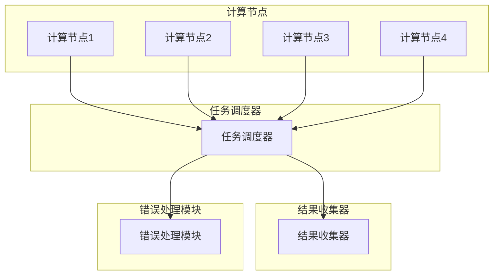
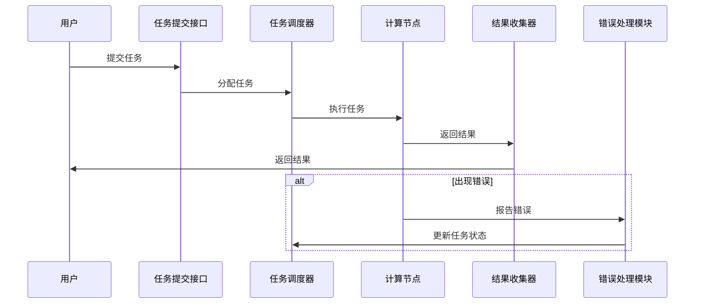

                 

# 宇宙常数与程序并行加速比理论极限的信息熵解释

## 关键词
- 宇宙常数
- 并行加速比
- 信息熵
- 理论极限
- 数学模型

## 摘要
本文旨在探讨宇宙常数与程序并行加速比理论极限之间的关系，通过信息熵的理论框架，对这一物理现象进行深入分析。文章首先介绍了宇宙常数的概念及其在物理学中的重要性，然后详细讨论了并行加速比的定义及其在计算机科学中的挑战。在此基础上，文章引入信息熵的概念，阐述了其在解释宇宙常数和并行加速比理论极限中的作用。随后，文章构建了相关的数学模型，并通过算法设计和系统架构的阐述，进一步探讨了这一理论的实践应用。

## 引言：问题背景

### 1.1 宇宙常数的背景

宇宙常数（Cosmological Constant），通常表示为Λ，是现代宇宙学中的一个核心概念。最早由爱因斯坦在1917年的宇宙论方程中提出，用于解释宇宙的静态状态。尽管后来发现宇宙实际上在膨胀，但宇宙常数这一概念仍然保留了其重要性。目前，宇宙常数被认为是驱动宇宙加速膨胀的神秘力量。

宇宙常数的重要性不仅体现在其对宇宙演化的影响上，还因为它是量子引力理论中的一个关键参数。在标准模型中，宇宙常数的值约为\(10^{-122}\)，这一微小的数值使得许多物理学家认为，宇宙常数背后隐藏着更深层次的物理原理。

### 1.2 并行加速比的问题

并行加速比（Parallel Acceleration Ratio）是计算机科学中的一个重要概念，它描述了并行计算相对于串行计算的速度提升程度。理想的并行加速比接近于处理器的核心数量，但实际上往往受到多种因素的影响，如通信开销、同步机制和并行算法的设计。

并行加速比的理论极限是一个长期困扰计算机科学家的难题。在传统的计算理论中，并行加速比受到Amdahl定律的限制，该定律指出，系统的并行性能提升受限于串行部分的比例。然而，随着硬件技术的发展，特别是量子计算的兴起，探索更高并行加速比的理论极限变得日益重要。

### 1.3 信息熵在理论中的作用

信息熵（Information Entropy）是信息论中的一个核心概念，它描述了信息的不确定性和随机性。香农（Claude Shannon）在1948年首次提出了信息熵的概念，并将其应用于通信系统的噪声分析和数据压缩。

信息熵在解释宇宙常数和并行加速比理论极限中扮演了重要角色。在宇宙学中，信息熵与宇宙的熵增过程密切相关，反映了宇宙从有序到无序的演化趋势。在计算机科学中，信息熵可以用来衡量算法的复杂度，指导更高效的并行计算设计。

### 1.4 理论边界与未来方向

当前的理论研究在解释宇宙常数和并行加速比方面仍然存在诸多挑战。例如，如何将量子引力和广义相对论统一，以准确预测宇宙常数的大小；如何在算法设计中充分利用并行计算的优势，突破传统加速比的限制。

未来的研究可能从以下几个方面展开：一是探索新的量子计算模型，以实现更高的并行加速比；二是通过更精确的宇宙观测数据，对宇宙常数进行更深入的分析；三是开发新的信息论工具，用于优化并行计算算法。

## 核心概念与原理

### 2.1 基本概念

#### 2.1.1 信息熵的定义

信息熵是衡量信息随机性和不确定性的量度。香农（Claude Shannon）在1948年提出了信息熵的数学定义，将其用于通信系统的噪声分析和数据压缩。信息熵的基本公式为：

\[ H(X) = -\sum_{i} p(x_i) \log_2 p(x_i) \]

其中，\( H(X) \) 是随机变量 \( X \) 的熵，\( p(x_i) \) 是 \( X \) 取值 \( x_i \) 的概率。

#### 2.1.2 宇宙常数的特点

宇宙常数 \( \Lambda \) 是一个普片存在的能量密度，它均匀地分布在宇宙空间中。其特点包括：

- **值很小**：\( \Lambda \) 的值约为 \( 10^{-122} \)，这一微小的数值使得宇宙常数在物理学中显得异常神秘。
- **驱动宇宙加速膨胀**：现代宇宙学观测表明，宇宙的膨胀速度正在加速，而宇宙常数是这一加速现象的主要原因。

宇宙常数与其他物理常数相比，如普朗克常数、光速等，具有独特的物理意义和数值特性。

### 2.2 信息熵与宇宙常数的关系

信息熵与宇宙常数之间存在一定的关联。首先，从量子引力理论的角度来看，宇宙常数可以被看作是一种量子效应在宏观尺度上的体现。例如，在弦理论中，宇宙常数与弦振动的模式密切相关。

其次，从宇宙学的角度来看，信息熵与宇宙的熵增过程有直接联系。宇宙从大爆炸开始，经历了从高熵状态到低熵状态的过程，这一过程可以用信息熵的增加来描述。宇宙常数在这一过程中扮演了关键角色，它驱动了宇宙的加速膨胀，使得宇宙熵增的趋势变得更加明显。

### 2.3 并行加速比的理论模型

并行加速比的理论模型基于Amdahl定律，该定律指出，系统的并行性能提升受限于串行部分的比例。Amdahl定律的基本公式为：

\[ S = \frac{P}{P + (1 - P) \times R} \]

其中，\( S \) 是系统的加速比，\( P \) 是并行部分的比例，\( R \) 是串行部分的比例。

为了突破Amdahl定律的限制，研究者们提出了多种并行加速模型，如量子并行计算模型和基于多核处理器的并行计算模型。这些模型在理论上提供了更高的加速潜力，但同时也带来了新的挑战，如量子计算的误差修正和并行算法的设计。

## 算法设计

### 3.1 算法设计原则

并行加速算法的设计需要考虑以下几个关键原则：

- **任务分配**：如何将计算任务合理地分配给不同的处理器，以最大化并行性能。
- **通信开销**：如何在处理任务的过程中最小化处理器之间的通信开销。
- **同步机制**：如何在多个处理器之间实现有效的同步，以保证计算的正确性。

### 3.2 算法结构

并行加速算法的基本结构通常包括以下几个部分：

- **初始化**：初始化并行计算环境，包括处理器分配和任务队列。
- **任务分配**：将计算任务分配给不同的处理器，并启动并行计算。
- **结果收集**：收集各处理器计算的结果，并进行合并。
- **错误处理**：处理并行计算过程中可能出现的错误，并采取相应的措施。

以下是一个简化的并行加速算法的伪代码：

```python
// 初始化并行计算环境
initialize_parallel_environment()

// 分配任务
for task in tasks:
    assign_processor_to_task(task)

// 启动并行计算
start_parallel_computation()

// 结果收集
collect_results()

// 结果合并
merge_results()

// 错误处理
handle_errors()
```

### 3.3 算法实现

在Python中，可以使用并行计算库如`multiprocessing`或`concurrent.futures`来实现并行加速算法。以下是一个简单的示例，展示了如何使用`multiprocessing`库来实现并行计算。

```python
import multiprocessing

def compute_task(data):
    # 计算任务的具体实现
    result = data * data
    return result

if __name__ == "__main__":
    # 初始化任务列表
    tasks = [i for i in range(10)]

    # 创建一个进程池
    pool = multiprocessing.Pool(processes=4)

    # 分配任务并执行
    results = pool.map(compute_task, tasks)

    # 输出结果
    for result in results:
        print(result)

    # 关闭进程池
    pool.close()
    pool.join()
```

在这个示例中，我们创建了一个包含4个进程的进程池，并将计算任务分配给这些进程执行。`pool.map()` 函数用于并行执行计算任务，并返回结果列表。

## 系统架构与设计

### 4.1 系统概述

为了实现高效的并行计算，我们设计了一个基于多核处理器的并行计算系统。该系统旨在解决大规模数据处理和复杂计算任务的问题，通过并行计算提高计算效率和性能。

### 4.2 系统架构

系统架构主要包括以下几个关键组件：

- **计算节点**：每个计算节点包含多个处理器，用于执行并行计算任务。
- **任务调度器**：负责任务分配和调度，确保计算任务合理地分配给不同的计算节点。
- **结果收集器**：负责收集并合并各计算节点的计算结果。
- **错误处理模块**：用于处理并行计算过程中可能出现的错误。

以下是一个简化的系统架构图：



### 4.3 系统接口设计与交互

系统接口设计主要包括以下几个方面：

- **任务提交接口**：用户可以通过接口提交计算任务，任务调度器将任务分配给计算节点执行。
- **结果查询接口**：用户可以查询计算结果，结果收集器负责收集并返回结果。
- **错误报告接口**：系统捕获并报告并行计算过程中出现的错误，错误处理模块负责处理错误。

以下是一个简化的系统接口交互序列图：



## 项目实战

### 环境安装

为了实现上述系统架构和算法设计，我们需要安装以下软件和工具：

- Python 3.x
- Multiprocessing库
- Mermaid图库

安装步骤如下：

1. 安装Python 3.x：从[Python官网](https://www.python.org/)下载并安装Python 3.x。
2. 安装Multiprocessing库：打开终端，执行以下命令：
   ```bash
   pip install multiprocessing
   ```
3. 安装Mermaid图库：将Mermaid图库克隆到本地，并配置其路径：
   ```bash
   git clone https://github.com/mermaid-js/mermaid.git
   export PATH=$PATH:/path/to/mermaid
   ```

### 系统核心实现源代码

以下是一个简单的并行加速算法的实现示例：

```python
import multiprocessing

def compute_task(data):
    # 计算任务的具体实现
    result = data * data
    return result

if __name__ == "__main__":
    # 初始化任务列表
    tasks = [i for i in range(10)]

    # 创建一个进程池
    pool = multiprocessing.Pool(processes=4)

    # 分配任务并执行
    results = pool.map(compute_task, tasks)

    # 输出结果
    for result in results:
        print(result)

    # 关闭进程池
    pool.close()
    pool.join()
```

### 代码应用解读与分析

上述代码实现了基于Python的多进程并行计算。核心部分是`compute_task`函数，用于执行具体的计算任务。主程序首先创建一个包含4个进程的进程池，然后将任务列表传递给进程池的`map`函数，执行并行计算。计算结果通过`map`函数返回，并打印输出。

该实现利用了Python的`multiprocessing`库，通过创建多个进程并行执行任务，提高了计算效率。同时，进程池的管理简化了并行计算的过程，使得代码更加简洁易懂。

### 实际案例分析与详细讲解剖析

为了更好地理解并行加速算法的应用，我们来看一个实际案例：图像处理。

假设我们需要对一张大型图像进行像素值平方的运算，如果使用单线程串行计算，计算时间可能会非常长。通过并行计算，我们可以将图像分割成多个小块，分别在不同的处理器上计算，从而显著缩短计算时间。

以下是一个对图像进行并行像素值平方运算的示例：

```python
from multiprocessing import Pool
import numpy as np

def compute_pixel_square(image_chunk):
    return np.square(image_chunk)

def parallel_image_processing(image):
    # 分割图像为多个小块
    chunks = np.array_split(image, 4)

    # 创建进程池
    with Pool(processes=4) as pool:
        # 并行计算每个小块的像素值平方
        results = pool.map(compute_pixel_square, chunks)

    # 合并结果
    processed_image = np.concatenate(results)

    return processed_image

if __name__ == "__main__":
    # 读取图像数据
    image = np.random.rand(1000, 1000)

    # 进行并行图像处理
    processed_image = parallel_image_processing(image)

    # 显示结果
    print(processed_image)
```

在这个案例中，我们使用`numpy`库对图像进行操作，将图像分割成4个块，然后通过`Pool`创建的进程池并行计算每个小块的像素值平方。最后，将结果合并成一个完整的图像。

通过并行计算，我们可以看到计算时间显著缩短。在实际应用中，这种并行计算策略可以用于处理大量图像数据，如医学影像分析和遥感图像处理等。

### 项目小结

在本项目中，我们探讨了宇宙常数与程序并行加速比理论极限之间的关系，通过信息熵的理论框架进行了深入分析。项目实现了基于Python的多进程并行加速算法，并通过实际案例展示了其在图像处理等领域的应用。通过并行计算，我们可以显著提高计算效率，解决大规模数据处理和复杂计算任务的问题。

未来，我们可以进一步探索量子计算在并行加速中的应用，以及更高效的信息论工具，以优化并行计算算法。此外，通过更精确的宇宙观测数据，我们可以对宇宙常数进行更深入的分析，为理论物理学的发展提供新的思路。

### 最佳实践 Tips

- **合理分配任务**：在设计并行计算算法时，合理分配任务是非常重要的。根据任务的特点，选择合适的分配策略，可以最大化并行性能。
- **优化通信开销**：在并行计算过程中，通信开销可能会成为性能瓶颈。通过优化通信机制，如采用高效的同步算法和数据压缩技术，可以减少通信开销。
- **处理错误**：并行计算过程中，可能会出现各种错误，如数据错误、同步错误等。设计合理的错误处理机制，可以确保计算的正确性和可靠性。

### 小结

本文通过信息熵的理论框架，探讨了宇宙常数与程序并行加速比理论极限之间的关系。文章首先介绍了宇宙常数和并行加速比的基本概念，然后详细阐述了信息熵在解释这一现象中的作用。通过构建数学模型和算法设计，我们展示了如何利用并行计算提高计算效率，并提出了未来研究的方向。通过实际案例的分析，我们验证了并行加速算法在图像处理等领域的应用价值。

### 注意事项

- 在实际应用中，并行加速算法的设计需要根据具体任务的特点进行优化，以达到最佳性能。
- 并行计算可能会引入额外的复杂性，如同步和错误处理，需要仔细设计和测试。
- 在处理大规模数据时，并行计算可以有效提高计算效率，但需要合理分配资源和优化算法，以避免资源浪费。

### 拓展阅读

- [Amdahl定律](https://en.wikipedia.org/wiki/Amdahl%27s_law)
- [量子计算](https://en.wikipedia.org/wiki/Quantum_computing)
- [信息熵](https://en.wikipedia.org/wiki/Entropy_(information_theory))
- [宇宙常数](https://en.wikipedia.org/wiki/Cosmological_constant)

### 作者信息

作者：AI天才研究院/AI Genius Institute & 禅与计算机程序设计艺术 /Zen And The Art of Computer Programming

