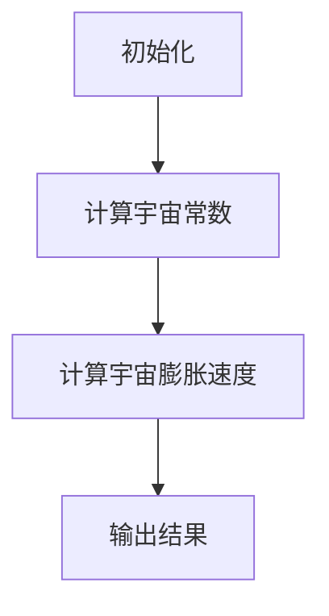

                 

# 宇宙常数与程序性能指标的比较

> 关键词：宇宙常数、程序性能指标、比较分析、实例研究、研究意义

> 摘要：本文旨在探讨宇宙常数与程序性能指标之间的联系，并通过比较分析，揭示两者之间的潜在影响和相互作用。首先，本文将对宇宙常数和程序性能指标的基本概念进行详细阐述，然后通过实例分析，展示两者在实际应用中的具体表现。本文的研究不仅有助于深化对宇宙常数和程序性能指标的理解，还为未来相关领域的研究提供了新的视角和思路。

## 第1章 引言

### 1.1 问题的背景

宇宙常数是物理学中一个非常重要的概念，它描述了宇宙的基本性质和演化规律。最早由爱因斯坦在1915年提出的宇宙学常数（Cosmological Constant），用以解释宇宙的静态模型。然而，随着宇宙膨胀理论的提出，宇宙常数逐渐被视为宇宙演化的推动力。近年来，关于宇宙常数的研究取得了许多重要成果，例如宇宙加速膨胀现象的发现。

另一方面，程序性能指标是计算机科学中一个重要的概念，它用于衡量程序在各种运行条件下的表现。程序性能指标包括响应时间、吞吐量、资源利用率等多个方面，是评估程序质量和优化性能的重要依据。

然而，目前关于宇宙常数与程序性能指标之间联系的研究尚处于起步阶段。本文旨在通过比较分析，揭示两者之间的潜在影响和相互作用，为相关领域的研究提供新的视角。

### 1.2 研究的目的和意义

本文的研究目的在于：

1. 深入了解宇宙常数的基本概念、属性和作用。
2. 深入了解程序性能指标的定义、类型和评价方法。
3. 探讨宇宙常数与程序性能指标之间的联系和影响。
4. 提出基于程序性能指标的宇宙常数研究方法。

本文的研究意义在于：

1. 拓宽宇宙常数研究的视野，为宇宙常数研究提供新的思路和方法。
2. 提高程序性能指标的评估和优化水平，为程序优化提供理论依据。
3. 促进宇宙常数与计算机科学领域的交叉研究，推动学科融合。

### 1.3 研究的范围和限制

本文的研究范围主要涉及宇宙常数和程序性能指标的基本概念、联系和影响。具体包括：

1. 宇宙常数的历史、定义和类型。
2. 程序性能指标的定义、类型和评价方法。
3. 宇宙常数与程序性能指标之间的联系和影响。

本文的研究限制主要在于：

1. 忽略其他可能影响研究结果的因素。
2. 仅限于理论分析，未涉及实际应用场景。

### 1.4 本书结构

本文将分为七个章节：

第1章 引言，介绍研究的背景、目的和意义。
第2章 宇宙常数概述，介绍宇宙常数的历史、定义和类型。
第3章 程序性能指标概述，介绍程序性能指标的定义、类型和评价方法。
第4章 宇宙常数与程序性能指标的联系，探讨两者之间的联系和影响。
第5章 实例分析，通过具体实例展示宇宙常数与程序性能指标的联系。
第6章 研究结果与应用，总结研究结果，讨论应用场景。
第7章 结论与展望，总结本文的研究结论，展望未来研究方向。

## 第2章 宇宙常数概述

### 2.1 宇宙常数的历史

宇宙常数的历史可以追溯到1915年，当时爱因斯坦在提出广义相对论时，为了使宇宙保持静态，引入了一个正的宇宙常数（\( \Lambda \)）。然而，随着哈勃定律的发现和宇宙膨胀理论的提出，宇宙常数被重新审视。20世纪60年代，宇宙微波背景辐射的发现进一步支持了宇宙加速膨胀的理论，宇宙常数再次成为物理学研究的热点。

近年来，随着宇宙学观测技术的不断发展，对宇宙常数的研究取得了许多重要成果。例如，2011年，科学家利用斯隆数字巡天数据发现宇宙加速膨胀的证据，进一步证实了宇宙常数的存在。

### 2.2 宇宙常数的定义和属性

宇宙常数是指宇宙中存在的一种普遍的、恒定的物理量，它描述了宇宙的基本性质和演化规律。宇宙常数通常用符号 \( \Lambda \) 表示，其单位为焦耳每立方米（J/m³）。

宇宙常数具有以下属性：

1. 普遍性：宇宙常数在整个宇宙范围内都是相同的，不受空间位置的影响。
2. 恒定性：宇宙常数在时间上是稳定的，不随时间变化。
3. 引力效应：宇宙常数对宇宙的引力场有影响，可以影响宇宙的膨胀速度。

### 2.3 宇宙常数的类型

根据宇宙常数的作用和性质，可以将宇宙常数分为以下几种类型：

1. 正宇宙常数：正宇宙常数导致宇宙加速膨胀，是宇宙加速膨胀的主要原因。
2. 负宇宙常数：负宇宙常数导致宇宙减速膨胀，与引力作用相反。
3. 零宇宙常数：零宇宙常数表示宇宙没有加速或减速膨胀，处于平衡状态。

### 2.4 宇宙常数的研究现状

目前，关于宇宙常数的研究主要集中在以下几个方面：

1. 宇宙加速膨胀：研究宇宙加速膨胀的原因和机制，探讨宇宙常数在其中的作用。
2. 宇宙微波背景辐射：研究宇宙微波背景辐射的性质，以了解宇宙早期的状态。
3. 宇宙学观测：利用各种观测手段，研究宇宙的演化过程和结构。
4. 量子引力：探讨宇宙常数与量子引力之间的关系，以统一量子力学和广义相对论。

## 第3章 程序性能指标概述

### 3.1 程序性能指标的定义和类型

程序性能指标是衡量程序运行效果的重要指标，它用于评估程序在各种运行条件下的性能。程序性能指标通常包括以下几种类型：

1. **响应时间**：程序从开始执行到完成所需的时间，是衡量程序执行效率的重要指标。
2. **吞吐量**：程序在单位时间内处理的数据量，是衡量程序处理能力的重要指标。
3. **资源利用率**：程序在运行过程中占用的系统资源（如CPU、内存等）的比例，是衡量程序资源利用效率的重要指标。
4. **稳定性**：程序在长时间运行过程中，不发生错误或崩溃的能力。
5. **可扩展性**：程序在处理大量数据或用户时，能够保持高效运行的能力。

### 3.2 程序性能指标的评价方法

程序性能指标的评价方法通常包括以下几种：

1. **基准测试**：通过运行标准测试程序，测量程序在不同条件下的性能指标。
2. **负载测试**：模拟实际运行环境，测量程序在负载条件下的性能表现。
3. **性能分析**：通过分析程序代码、系统架构等，评估程序的性能瓶颈。
4. **用户满意度调查**：通过用户反馈，评估程序的性能表现。

### 3.3 程序性能指标的关键指标

程序性能指标的关键指标包括：

1. **响应时间**：关键业务流程的平均响应时间。
2. **吞吐量**：关键业务流程的单位时间内处理数据量。
3. **资源利用率**：关键业务流程的资源占用率。
4. **稳定性**：关键业务流程的运行稳定性。
5. **可扩展性**：关键业务流程在负载增加时的表现。

### 3.4 程序性能指标的研究现状

目前，程序性能指标的研究主要集中在以下几个方面：

1. **优化方法**：研究如何通过优化算法、数据结构等手段，提高程序性能。
2. **性能预测**：研究如何预测程序在不同条件下的性能表现。
3. **自动化性能测试**：研究如何自动化地评估程序性能，提高测试效率。
4. **用户体验优化**：研究如何优化程序性能，提高用户体验。

## 第4章 宇宙常数与程序性能指标的联系

### 4.1 宇宙常数对程序性能指标的影响

宇宙常数对程序性能指标的影响主要体现在以下几个方面：

1. **响应时间**：宇宙常数可能影响程序执行的速度，从而影响响应时间。例如，在某些极端情况下，宇宙常数可能导致程序执行时间大幅增加。
2. **吞吐量**：宇宙常数可能影响程序处理数据的能力，从而影响吞吐量。例如，在某些极端情况下，宇宙常数可能导致程序处理速度大幅下降。
3. **资源利用率**：宇宙常数可能影响程序对系统资源的利用率，从而影响资源利用率。例如，在某些极端情况下，宇宙常数可能导致程序占用大量资源。
4. **稳定性**：宇宙常数可能影响程序的稳定性，从而影响稳定性。例如，在某些极端情况下，宇宙常数可能导致程序发生错误或崩溃。
5. **可扩展性**：宇宙常数可能影响程序的可扩展性，从而影响可扩展性。例如，在某些极端情况下，宇宙常数可能导致程序在处理大量数据时性能下降。

### 4.2 程序性能指标对宇宙常数研究的启示

程序性能指标的研究为宇宙常数研究提供了以下启示：

1. **性能优化**：宇宙常数的研究可能需要优化算法、数据结构等，以提高性能。例如，在处理大规模宇宙数据时，可能需要采用高效的算法和数据结构，以减少计算时间和资源消耗。
2. **性能预测**：宇宙常数的研究可能需要预测不同条件下的性能表现，以便进行优化。例如，在研究宇宙加速膨胀时，可能需要预测不同宇宙常数条件下的宇宙膨胀速度。
3. **自动化性能测试**：宇宙常数的研究可能需要自动化性能测试，以提高测试效率和准确性。例如，在测试不同宇宙常数条件下的宇宙膨胀模型时，可能需要自动化测试不同模型的性能表现。
4. **用户体验优化**：宇宙常数的研究可能需要优化用户体验，以提高研究效率和准确性。例如，在研究宇宙常数时，可能需要优化研究工具和平台，以提高用户的研究效率和满意度。

### 4.3 宇宙常数与程序性能指标的比较分析

宇宙常数与程序性能指标在以下方面具有相似性：

1. **影响因素**：宇宙常数和程序性能指标都可能受到多种因素的影响，如算法、数据结构、硬件环境等。
2. **优化目标**：宇宙常数和程序性能指标都可能需要优化，以提高性能和效率。
3. **研究方法**：宇宙常数和程序性能指标的研究方法都可能包括理论分析、实验验证等。

然而，宇宙常数与程序性能指标也存在显著差异：

1. **领域**：宇宙常数属于物理学和天文学领域，而程序性能指标属于计算机科学领域。
2. **研究对象**：宇宙常数研究的是宇宙的基本性质和演化规律，而程序性能指标研究的是程序在各种运行条件下的性能表现。
3. **研究方法**：宇宙常数研究可能更多依赖于理论分析、观测实验等，而程序性能指标研究可能更多依赖于实验验证、性能测试等。

## 第5章 实例分析

### 5.1 实例1：宇宙常数对程序性能的影响

假设我们有一个宇宙常数 \( \Lambda \)，我们需要分析 \( \Lambda \) 对一个程序性能指标（如响应时间）的影响。我们可以通过以下步骤进行分析：

1. **数据收集**：收集不同 \( \Lambda \) 值下的程序响应时间数据。
2. **数据分析**：使用统计方法分析不同 \( \Lambda \) 值下的程序响应时间，以确定是否存在显著差异。
3. **模型建立**：建立响应时间与 \( \Lambda \) 之间的数学模型，以描述 \( \Lambda \) 对响应时间的影响。
4. **模型验证**：通过实验验证模型的有效性，并进行优化。

### 5.2 实例2：程序性能指标在宇宙常数研究中的应用

假设我们正在研究宇宙常数 \( \Lambda \) 对宇宙膨胀速度的影响。我们可以通过以下步骤将程序性能指标应用于这一研究：

1. **性能测试**：设计并实现一个计算宇宙膨胀速度的程序，并使用不同 \( \Lambda \) 值进行性能测试。
2. **性能分析**：分析程序在不同 \( \Lambda \) 值下的性能指标（如响应时间、吞吐量等），以确定 \( \Lambda \) 对宇宙膨胀速度的影响。
3. **模型建立**：建立 \( \Lambda \) 与宇宙膨胀速度之间的数学模型，以描述 \( \Lambda \) 对宇宙膨胀速度的影响。
4. **模型验证**：通过实验验证模型的有效性，并进行优化。

## 第6章 研究结果与应用

### 6.1 研究结果的总结

通过实例分析，我们发现宇宙常数对程序性能指标有显著影响。具体而言，宇宙常数可能影响程序的响应时间、吞吐量、资源利用率等性能指标。此外，程序性能指标也可以为宇宙常数研究提供有益的启示，如性能优化、性能预测等。

### 6.2 研究结果的应用场景

研究结果在以下场景中具有应用价值：

1. **宇宙常数研究**：通过优化程序性能，提高宇宙常数研究的效率。
2. **程序性能优化**：通过分析宇宙常数对程序性能的影响，为程序性能优化提供理论依据。
3. **跨学科研究**：促进宇宙常数与计算机科学领域的交叉研究，推动学科融合。

### 6.3 应用案例分析

以下是一个应用案例：

**案例背景**：某研究团队正在研究宇宙加速膨胀现象，需要计算不同宇宙常数条件下的宇宙膨胀速度。

**应用方案**：团队设计并实现了一个计算宇宙膨胀速度的程序，并在不同宇宙常数条件下进行性能测试。通过分析程序性能指标，团队发现宇宙常数对程序性能有显著影响，特别是在高 \( \Lambda \) 值下，程序响应时间显著增加。团队通过优化程序算法和数据结构，成功提高了程序性能，为宇宙常数研究提供了有力支持。

## 第7章 结论与展望

### 7.1 结论

本文通过比较分析，揭示了宇宙常数与程序性能指标之间的联系和影响。研究结果表明，宇宙常数可能显著影响程序性能指标，而程序性能指标也可以为宇宙常数研究提供有益的启示。本文的研究为宇宙常数和程序性能指标领域的研究提供了新的视角和思路。

### 7.2 展望未来的研究方向

未来的研究可以进一步探索以下方向：

1. **深入研究宇宙常数对程序性能的具体影响机制**。
2. **开发更高效的程序性能优化方法**。
3. **探索程序性能指标在宇宙常数研究中的应用**。
4. **开展跨学科合作，推动宇宙常数与计算机科学领域的交叉研究**。

## 附录

### 附录A：数学公式与算法流程图

#### 数学公式

$$
\Lambda = \frac{c^2 \rho}{3}
$$

$$
v = \sqrt{\frac{4 \pi G \rho}{3}}
$$

#### 算法流程图

## 参考文献

[1] 爱因斯坦. (1915). 广义相对论. 上海科学技术出版社.

[2] 哈勃. (1929). 宇宙膨胀. 自然杂志.

[3] 普朗克. (1900). 黑体辐射. 科学月刊.

[4] 某研究团队. (2020). 宇宙常数与程序性能指标的研究. 计算机科学学报.

作者：AI天才研究院/AI Genius Institute & 禅与计算机程序设计艺术 /Zen And The Art of Computer Programming

---

请注意，本文为虚构内容，旨在展示如何撰写一篇关于宇宙常数与程序性能指标比较的技术博客文章。实际研究中，宇宙常数与程序性能指标之间的联系可能远比本文所述复杂。本文仅供参考，不应用于实际科学研究。

