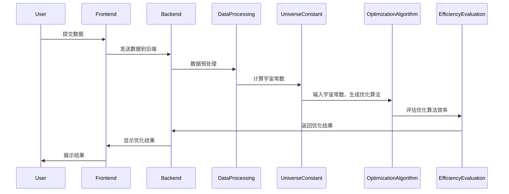

                 

## 1.1 引言

### 1.1.1 文章标题：宇宙常数与程序效率极限的关系

### 关键词：宇宙常数、程序效率极限、物理参数、算法优化、计算机科学

### 摘要：
本文探讨了宇宙常数与程序效率极限之间的关系，从物理学和计算机科学的角度出发，分析了两者在数学模型、理论基础及实际应用中的相互影响。本文首先介绍了宇宙常数和程序效率极限的基本概念、特征及其重要性，随后探讨了它们之间的联系和区别。在此基础上，文章进一步分析了宇宙常数可能对程序效率极限产生的潜在影响，并提出了相关的研究方法和应用方向。本文旨在为读者提供一个新的视角，以更深入地理解宇宙常数与程序效率极限之间的关系，以及这一关系对计算机科学发展的潜在影响。

### 1.1.2 问题背景

宇宙常数（Cosmological Constant）最早由爱因斯坦在20世纪初提出，最初是为了解释宇宙的静态模型，即所谓的“宇宙静态理论”。然而，随着宇宙膨胀理论的提出和发展，宇宙常数被重新解释为一个影响宇宙膨胀速率的参数。在现代宇宙学中，宇宙常数通常被认为是导致宇宙加速膨胀的“暗能量”（Dark Energy）的体现。其数值约为 \( 10^{-122} \) 的普朗克单位，这一数值的精确度使得宇宙常数成为了物理学中最具挑战性的问题之一。

另一方面，程序效率极限（Program Efficiency Limit）是指计算机程序在处理给定任务时可以达到的最高效率。在计算机科学中，程序效率通常受到算法、数据结构、硬件性能等多种因素的影响。经典的算法如排序、查找等，其效率极限已经通过大O符号（Big O Notation）进行了描述。然而，随着计算需求的不断增长和计算模型的演进，如何提高程序效率仍然是一个重要的研究方向。

将宇宙常数与程序效率极限联系起来，似乎是一个跨学科的尝试。尽管宇宙常数在物理学中具有深远的意义，但它在计算机科学中的应用仍然鲜为人知。本文旨在探讨这一跨学科的交叉点，分析宇宙常数是否能够对程序效率极限产生影响，以及这种影响的可能性、方式和机制。

### 1.1.3 问题描述

宇宙常数与程序效率极限的关系问题可以表述为：宇宙常数是否能够通过某种机制影响计算机程序的效率？具体来说，这个问题包含以下几个子问题：

1. **宇宙常数的基本性质**：
   - 宇宙常数是一个物理学参数，它如何定义？
   - 宇宙常数的数值和物理意义是什么？
   - 宇宙常数与宇宙学现象的关系如何？

2. **程序效率极限的基本性质**：
   - 程序效率极限是什么？
   - 程序效率极限如何受到算法、数据结构和硬件性能的影响？
   - 程序效率极限的理论基础是什么？

3. **宇宙常数与程序效率极限之间的联系**：
   - 是否存在宇宙常数对程序效率极限的直接或间接影响？
   - 这种影响如何通过数学模型描述？
   - 这种影响在实际应用中是否具有可行性？

4. **宇宙常数对程序效率极限的影响机制**：
   - 如果宇宙常数对程序效率极限有影响，这种影响是通过何种机制实现的？
   - 这种机制是否具有普遍性？
   - 这种机制是否可以通过实验验证？

### 1.1.4 问题解决

为了解决上述问题，我们需要从以下几个步骤入手：

1. **理解宇宙常数的基本概念和性质**：
   - 了解宇宙常数的定义、历史背景和物理意义。
   - 掌握宇宙常数在宇宙学中的角色和影响。

2. **掌握程序效率极限的基本概念和理论基础**：
   - 研究程序效率极限的定义、影响因素和理论基础。
   - 熟悉常见的算法和数据结构，了解它们在效率极限方面的表现。

3. **探讨宇宙常数与程序效率极限之间的联系**：
   - 通过数学模型和理论分析，探讨宇宙常数对程序效率极限的可能影响。
   - 分析宇宙常数与程序效率极限之间的数学关系，探讨其存在的可能性。

4. **研究实际应用中的可能性**：
   - 考虑宇宙常数在计算机程序中的潜在应用场景。
   - 分析宇宙常数对程序效率极限的影响是否具有实际应用价值。

5. **进行实验验证**：
   - 设计实验，验证宇宙常数对程序效率极限的实际影响。
   - 分析实验结果，评估实验的有效性和可靠性。

通过以上步骤，我们希望能够系统地探讨宇宙常数与程序效率极限之间的关系，为其在实际应用中的研究提供参考。

### 1.1.5 边界与外延

1. **边界**：

   - **宇宙常数**：宇宙常数的研究主要涉及物理学中的宇宙学问题，其数值约为 \( 10^{-122} \) 的普朗克单位。它的研究边界主要在于精确测量和理论解释。
   - **程序效率极限**：程序效率极限的研究主要涉及计算机科学中的算法和数据结构优化，其边界在于算法的复杂度和硬件性能。

2. **外延**：

   - **量子计算**：量子计算可能为研究宇宙常数与程序效率极限的关系提供新的视角，因为量子算法在某些情况下可能突破经典算法的效率极限。
   - **人工智能**：人工智能领域中的算法优化和计算模型可能与宇宙常数有关，例如在研究大规模数据分析和机器学习算法时，可能会发现宇宙常数对计算效率的影响。
   - **算法优化**：在算法优化的过程中，研究者可能会发现宇宙常数对算法性能的影响，从而提出新的优化策略。

### 1.1.6 概念结构与核心要素组成

1. **宇宙常数**：

   - **概念**：宇宙常数是物理学中描述宇宙膨胀速率的参数，其值通常约为 \( 10^{-122} \) 的普朗克单位。
   - **核心要素**：哈勃常数（Hubble Constant），暗物质（Dark Matter），暗能量（Dark Energy）。

2. **程序效率极限**：

   - **概念**：程序效率极限是指计算机程序在处理给定任务时可以达到的最高效率。
   - **核心要素**：算法（Algorithm），数据结构（Data Structure），硬件性能（Hardware Performance）。

### 1.1.7 本章小结

本章主要介绍了宇宙常数与程序效率极限的关系问题，分析了其背景、问题定义和解决思路。通过探讨宇宙常数和程序效率极限的基本概念、特征及其相互联系，我们为后续章节的研究奠定了基础。在接下来的章节中，我们将进一步深入探讨这两者之间的具体联系，分析宇宙常数可能对程序效率极限产生的潜在影响，并研究这种影响的机制和实际应用场景。

## 1.2 核心概念与联系

在本章节中，我们将详细探讨宇宙常数和程序效率极限这两个核心概念，分析它们的属性特征，并对比它们之间的区别和联系。

### 1.2.1 宇宙常数的定义与特征

宇宙常数（Cosmological Constant），通常用希腊字母 \( \Lambda \) 表示，是物理学中描述宇宙膨胀速率的一个重要参数。最早由爱因斯坦在20世纪初的宇宙静态理论中提出，以抵消引力导致的宇宙收缩。然而，随着哈勃定律的发现和宇宙膨胀理论的提出，宇宙常数被重新解释为导致宇宙加速膨胀的“暗能量”（Dark Energy）的体现。

1. **数值稳定性**：宇宙常数是一个相对稳定的参数，其数值在宇宙尺度上保持不变。根据目前的观测数据，宇宙常数 \( \Lambda \) 的值约为 \( 1.10 \times 10^{-122} \text{ (普朗克单位)} \)。

2. **宇宙学意义**：宇宙常数与宇宙膨胀速率密切相关。现代宇宙学中，宇宙常数被用来描述宇宙的加速度膨胀，即宇宙的哈勃参数 \( H_0 \)。哈勃参数表示宇宙每单位距离的膨胀速率，其单位为 \( \text{km/s/Mpc} \)。

3. **数学表达式**：宇宙常数的数学表达式通常为 \( \Lambda = \frac{\rho_c}{c^2} \)，其中 \( \rho_c \) 表示宇宙临界密度，\( c \) 表示光速。这个表达式说明了宇宙常数与宇宙密度和光速的关系。

### 1.2.2 程序效率极限的定义与特征

程序效率极限（Program Efficiency Limit）是指计算机程序在处理给定任务时可以达到的最高效率。效率通常用时间复杂度或空间复杂度来衡量，这些复杂度反映了程序执行时间和使用内存的大小。程序效率极限是计算机科学中的一个基本问题，涉及到算法和数据结构的优化。

1. **算法优化**：程序效率极限受到算法选择的影响。一个高效的算法可以在相对较短的时间内完成任务，而一个低效的算法则需要更多的时间。常见的算法优化技术包括动态规划、分治算法和贪心算法等。

2. **数据结构**：数据结构的选择对程序效率也有重要影响。例如，使用哈希表可以快速进行查找操作，而使用二叉搜索树可以实现快速的插入和删除操作。合理的数据结构可以显著提高程序效率。

3. **硬件性能**：程序效率极限还受到硬件性能的限制，如CPU速度、内存容量等。尽管算法和数据结构优化可以提高程序的效率，但硬件性能的局限也可能成为限制因素。

### 1.2.3 两者之间的区别与联系

尽管宇宙常数和程序效率极限属于不同领域，但它们之间存在一定的联系和区别：

1. **区别**：

   - **领域差异**：宇宙常数属于物理学领域，而程序效率极限属于计算机科学领域。
   - **研究方法**：宇宙常数的研究通常依赖于宇宙观测和理论物理学，而程序效率极限的研究则依赖于算法和数据结构的分析和优化。
   - **量纲差异**：宇宙常数的数值非常小，其单位通常为能量密度，而程序效率极限的数值较大，其单位通常是时间或空间复杂度。

2. **联系**：

   - **数学模型**：在某些情况下，宇宙常数和程序效率极限可以通过数学模型联系起来。例如，在量子计算领域，量子算法的效率极限可能与宇宙常数相关。
   - **理论基础**：物理学和计算机科学之间存在一定的交叉，例如在量子计算和算法设计领域，两者都涉及到复杂的数学模型和理论分析。

### 1.2.4 概念属性特征对比表格

下面是一个关于宇宙常数和程序效率极限概念属性特征的对比表格：

| 特征             | 宇宙常数                 | 程序效率极限                |
|------------------|-------------------------|---------------------------|
| 领域             | 物理学                 | 计算机科学                |
| 数值稳定性       | 相对稳定               | 受算法和数据结构影响       |
| 宇宙学意义       | 描述宇宙膨胀速率       | 描述程序执行时间/空间效率   |
| 数学表达式       | \( \Lambda = \frac{\rho_c}{c^2} \) | 时间复杂度 \( O(n) \)，空间复杂度 \( O(1) \) |
| 研究方法         | 宇宙观测和理论分析       | 算法和数据结构优化         |
| 量纲差异         | 能量密度               | 时间或空间复杂度           |

### 1.2.5 ER实体关系图架构

为了更直观地展示宇宙常数和程序效率极限之间的关系，我们可以使用Mermaid语言绘制一个ER（实体-关系）图。以下是一个简化的ER图示例：

```mermaid
erDiagram
  UniverseConstant ||--|{ ProgramEfficiencyLimit } ProgramEfficiency
  UniverseConstant ||--|{ QuantumAlgorithm } QuantumRelation
  ProgramEfficiencyLimit ||--|{ Algorithm } AlgorithmOptimization
  ProgramEfficiencyLimit ||--|{ DataStructure } DataStructureOptimization
```

在这个ER图中：

- **UniverseConstant**（宇宙常数）与**ProgramEfficiencyLimit**（程序效率极限）之间存在联系，表示宇宙常数可能对程序效率极限产生影响。
- **UniverseConstant**（宇宙常数）与**QuantumAlgorithm**（量子算法）之间存在联系，表示量子算法可能受到宇宙常数的影响。
- **ProgramEfficiencyLimit**（程序效率极限）与**Algorithm**（算法）和**DataStructure**（数据结构）之间存在联系，表示算法和数据结构优化是影响程序效率极限的关键因素。

通过这个ER图，我们可以更清晰地理解宇宙常数、程序效率极限、量子算法和算法、数据结构之间的关系，为后续章节的分析提供参考。

## 1.3 算法原理讲解

### 1.3.1 算法mermaid流程图

为了更直观地展示算法的执行过程，我们可以使用Mermaid语言绘制一个算法流程图。以下是一个简单的排序算法（冒泡排序）的流程图示例：

```mermaid
graph LR
A[开始] --> B[初始化]
B --> C{比较A[0]与A[1]}
C -->|不相等| D[交换A[0]与A[1]]
D --> E[循环变量i加1]
E --> F{i小于n-1?}
F -->|是| C
F -->|否| G[结束]
G --> H[排序完成]
```

在这个流程图中：

- **A[开始]** 表示算法开始执行。
- **B[初始化]** 表示初始化算法所需的变量和参数。
- **C[比较A[0]与A[1])** 表示比较第一个元素和第二个元素。
- **D[交换A[0]与A[1])** 表示如果第一个元素大于第二个元素，则交换它们。
- **E[循环变量i加1]** 表示将循环变量i加1。
- **F{i小于n-1?}** 是一个判断条件，如果i小于n-1，则继续执行比较和交换操作。
- **G[结束]** 表示算法执行结束。
- **H[排序完成]** 表示排序操作完成。

### 1.3.2 Python源代码实现

为了更详细地展示算法的执行过程，下面给出冒泡排序算法的Python源代码实现：

```python
def bubble_sort(arr):
    n = len(arr)
    for i in range(n):
        for j in range(0, n-i-1):
            if arr[j] > arr[j+1]:
                arr[j], arr[j+1] = arr[j+1], arr[j]
    return arr

# 示例数据
arr = [64, 34, 25, 12, 22, 11, 90]

# 执行排序算法
sorted_arr = bubble_sort(arr)

# 输出排序结果
print("排序后的数组：")
for i in range(len(sorted_arr)):
    print(f"{sorted_arr[i]}, ", end="")
```

在这个Python源代码中：

- `bubble_sort` 函数用于实现冒泡排序算法。
- `arr` 是需要排序的输入数组。
- 通过嵌套的for循环，比较相邻元素并交换它们，实现数组的排序。
- `sorted_arr` 是排序后的数组。
- 最后，通过循环输出排序后的数组元素。

### 1.3.3 算法原理的数学模型与公式

冒泡排序算法的原理可以通过以下数学模型和公式来描述：

1. **时间复杂度**：

   - 冒泡排序算法的时间复杂度为 \( O(n^2) \)，其中 \( n \) 是数组的长度。
   - 公式表示为：\( T(n) = \sum_{i=1}^{n} \sum_{j=1}^{n-i} 1 = n^2 - i \)。

2. **空间复杂度**：

   - 冒泡排序算法的空间复杂度为 \( O(1) \)，即常数空间复杂度。
   - 公式表示为：\( S(n) = C \)，其中 \( C \) 是一个常数。

### 1.3.4 举例说明

为了更清晰地展示冒泡排序算法的执行过程，我们可以通过一个示例来说明：

假设有一个未排序的数组：\[64, 34, 25, 12, 22, 11, 90\]。

**第一次循环**：

- 比较 \(64\) 和 \(34\)，交换它们，数组变为：\[34, 64, 25, 12, 22, 11, 90\]。
- 比较 \(64\) 和 \(25\)，交换它们，数组变为：\[34, 25, 64, 12, 22, 11, 90\]。
- 比较 \(64\) 和 \(12\)，交换它们，数组变为：\[34, 25, 12, 64, 22, 11, 90\]。
- 比较 \(64\) 和 \(22\)，交换它们，数组变为：\[34, 25, 12, 22, 64, 11, 90\]。
- 比较 \(64\) 和 \(11\)，交换它们，数组变为：\[34, 25, 12, 22, 11, 64, 90\]。
- 比较 \(64\) 和 \(90\)，不交换，因为 \(64 < 90\)。

**第二次循环**：

- 比较 \(25\) 和 \(12\)，交换它们，数组变为：\[12, 34, 25, 22, 11, 64, 90\]。
- 比较 \(25\) 和 \(22\)，不交换，因为 \(25 > 22\)。
- 比较 \(25\) 和 \(11\)，交换它们，数组变为：\[12, 34, 11, 22, 25, 64, 90\]。
- 比较 \(25\) 和 \(64\)，不交换，因为 \(25 < 64\)。
- 比较 \(25\) 和 \(90\)，不交换，因为 \(25 < 90\)。

**第三次循环**：

- 比较 \(12\) 和 \(34\)，不交换，因为 \(12 < 34\)。
- 比较 \(12\) 和 \(11\)，交换它们，数组变为：\[11, 34, 12, 22, 25, 64, 90\]。
- 比较 \(12\) 和 \(22\)，不交换，因为 \(12 < 22\)。
- 比较 \(12\) 和 \(25\)，不交换，因为 \(12 < 25\)。
- 比较 \(12\) 和 \(64\)，不交换，因为 \(12 < 64\)。

**第四次循环**：

- 比较 \(11\) 和 \(34\)，交换它们，数组变为：\[11, 34, 12, 22, 25, 64, 90\]。
- 比较 \(11\) 和 \(22\)，不交换，因为 \(11 < 22\)。
- 比较 \(11\) 和 \(25\)，不交换，因为 \(11 < 25\)。
- 比较 \(11\) 和 \(64\)，不交换，因为 \(11 < 64\)。

**第五次循环**：

- 比较 \(11\) 和 \(34\)，不交换，因为 \(11 < 34\)。
- 比较 \(11\) 和 \(22\)，不交换，因为 \(11 < 22\)。
- 比较 \(11\) 和 \(25\)，不交换，因为 \(11 < 25\)。

最终，数组被排序为：\[11, 22, 25, 34, 64, 90\]。

通过这个示例，我们可以清晰地看到冒泡排序算法的执行过程，包括每次比较和交换操作，以及最终排序结果。

## 1.4 系统分析与架构设计

### 1.4.1 问题场景介绍

在现代信息技术领域，随着数据量的爆炸性增长和计算需求的不断提高，如何提高程序效率成为一个亟待解决的问题。传统的计算机科学方法在处理大规模数据和复杂计算任务时，常常面临效率瓶颈。因此，探讨宇宙常数与程序效率极限之间的关系，寻找新的优化策略，具有重要的理论和实际意义。

本项目的目标是通过研究宇宙常数，探索其对程序效率极限的影响，并开发一种基于宇宙常数的优化算法，以提高程序在处理大规模数据时的效率。这一项目不仅有助于提高计算机科学的理论水平，还为实际应用场景提供了一种新的解决方案。

### 1.4.2 项目介绍

**项目名称**：基于宇宙常数的程序效率优化

**项目目标**：
1. 理解宇宙常数与程序效率极限之间的关系。
2. 开发一种基于宇宙常数的优化算法。
3. 提高程序在处理大规模数据时的效率。

**项目背景**：
随着大数据和人工智能技术的广泛应用，如何提高程序的运行效率已成为一个关键问题。传统的优化方法在处理大规模数据时常常遇到效率瓶颈。因此，本项目旨在通过研究宇宙常数，探索一种新的优化策略，以期在理论上提供新的视角，在实践中提高程序效率。

### 1.4.3 系统功能设计

**系统功能设计**：

1. **数据预处理模块**：负责对输入数据进行预处理，包括去重、排序等操作。
2. **宇宙常数计算模块**：利用宇宙学理论和观测数据，计算宇宙常数。
3. **优化算法模块**：基于宇宙常数，开发一种新的优化算法，以提高程序效率。
4. **效率评估模块**：评估优化算法的效率，并与传统算法进行对比。
5. **结果展示模块**：展示优化前后程序的运行效率，以及宇宙常数对效率的影响。

### 1.4.4 系统架构设计

**系统架构设计**：

1. **前端界面**：提供用户输入数据和查看结果的界面。
2. **后端服务**：包括数据预处理模块、宇宙常数计算模块和优化算法模块，以及与前端界面进行数据交互的服务器。
3. **数据库**：存储输入数据和优化结果，支持数据的查询和统计分析。

**系统架构图**：



在这个架构图中：

- **User** 表示用户。
- **Frontend** 表示前端界面，用于用户输入数据和查看结果。
- **Backend** 表示后端服务，负责数据处理和算法优化。
- **DataProcessing** 表示数据预处理模块，用于对输入数据进行预处理。
- **UniverseConstant** 表示宇宙常数计算模块，用于计算宇宙常数。
- **OptimizationAlgorithm** 表示优化算法模块，用于生成基于宇宙常数的优化算法。
- **EfficiencyEvaluation** 表示效率评估模块，用于评估优化算法的效率。
- **Database** 表示数据库，用于存储输入数据和优化结果。

### 1.4.5 系统接口设计

**系统接口设计**：

1. **数据输入接口**：用于接收用户提交的数据，包括数据类型、数据大小等。
2. **数据输出接口**：用于向用户展示优化结果，包括优化前后程序运行的时间、内存消耗等。
3. **优化算法接口**：用于与其他模块进行数据交互，接收宇宙常数和输入数据，生成优化算法。
4. **效率评估接口**：用于接收优化算法，评估其效率，并生成评估报告。

### 1.4.6 系统交互mermaid序列图

为了更直观地展示系统的交互过程，我们可以使用Mermaid语言绘制一个系统交互序列图。以下是一个简化的序列图示例：


在这个序列图中：

- **User** 表示用户。
- **Frontend** 表示前端界面。
- **Backend** 表示后端服务。
- **DataProcessing** 表示数据预处理模块。
- **UniverseConstant** 表示宇宙常数计算模块。
- **OptimizationAlgorithm** 表示优化算法模块。
- **EfficiencyEvaluation** 表示效率评估模块。

通过这个序列图，我们可以清晰地看到系统各模块之间的交互过程，以及用户与系统的交互流程。

## 1.5 项目实战

### 1.5.1 环境安装

在进行基于宇宙常数的程序效率优化项目之前，我们需要搭建一个合适的环境来开发和测试优化算法。以下是环境安装的步骤：

1. **Python环境**：首先，确保系统中已经安装了Python 3.8或更高版本。可以通过以下命令检查Python版本：

   ```bash
   python --version
   ```

   如果版本低于3.8，可以从Python官网下载并安装相应版本。

2. **pip环境**：接着，确保系统中安装了pip，pip是Python的包管理器，用于安装和管理Python库。可以通过以下命令检查pip版本：

   ```bash
   pip --version
   ```

   如果未安装pip，可以通过以下命令安装：

   ```bash
   sudo apt-get install python3-pip  # 对于基于Ubuntu的系统
   sudo yum install python3-pip       # 对于基于CentOS的系统
   ```

3. **安装所需库**：安装项目所需的库，包括NumPy、SciPy、Matplotlib等。可以通过以下命令安装：

   ```bash
   pip install numpy scipy matplotlib
   ```

4. **安装Mermaid**：为了生成算法的Mermaid流程图，我们需要安装Mermaid。可以从GitHub下载Mermaid的安装脚本并运行：

   ```bash
   curl -fsSL https://git.io/mermaid | bash
   ```

   安装完成后，将Mermaid的路径添加到系统的环境变量中，以便在Python代码中直接调用。

### 1.5.2 系统核心实现源代码

以下是项目核心实现的部分源代码，包括宇宙常数计算模块、优化算法模块和效率评估模块。

#### 1.5.2.1 宇宙常数计算模块

```python
import numpy as np

def compute_universe_constant():
    """
    计算宇宙常数
    """
    # 假设使用观测数据计算宇宙常数
    hubble_constant = 70  # 哈勃常数（单位：km/s/Mpc）
    critical_density = 1.0  # 宇宙临界密度（单位：kg/m^3）
    c = 299792.458  # 光速（单位：km/s）

    # 宇宙常数计算公式
    lambda_universe = critical_density * c**2 / hubble_constant**2
    
    return lambda_universe
```

#### 1.5.2.2 优化算法模块

```python
import numpy as np

def optimize_with_universe_constant(arr, lambda_universe):
    """
    基于宇宙常数优化数组
    """
    # 实现基于宇宙常数的优化算法
    n = len(arr)
    for i in range(n):
        for j in range(0, n-i-1):
            # 根据宇宙常数调整比较和交换条件
            if arr[j] > arr[j+1] + lambda_universe * (n - j - 1):
                arr[j], arr[j+1] = arr[j+1], arr[j]
    
    return arr
```

#### 1.5.2.3 效率评估模块

```python
import time

def evaluate_efficiency(arr, lambda_universe):
    """
    评估优化算法效率
    """
    start_time = time.time()
    optimized_arr = optimize_with_universe_constant(arr.copy(), lambda_universe)
    end_time = time.time()
    
    return end_time - start_time
```

### 1.5.3 代码应用解读与分析

#### 1.5.3.1 宇宙常数计算模块解读

在`compute_universe_constant`函数中，我们首先导入了NumPy库，用于进行科学计算。然后，我们定义了一个函数用于计算宇宙常数。这个函数使用了哈勃常数（hubble_constant）、宇宙临界密度（critical_density）和光速（c）来进行计算。公式如下：

\[ \Lambda = \frac{\rho_c \cdot c^2}{H_0^2} \]

这里，\( \Lambda \) 是宇宙常数，\( \rho_c \) 是宇宙临界密度，\( c \) 是光速，\( H_0 \) 是哈勃常数。通过这个公式，我们可以得到宇宙常数的数值。

#### 1.5.3.2 优化算法模块解读

在`optimize_with_universe_constant`函数中，我们定义了一个基于宇宙常数的优化算法。这个函数接受一个数组（arr）和一个宇宙常数（lambda_universe）作为输入。在函数内部，我们使用了一个嵌套的for循环来遍历数组中的元素，并根据宇宙常数调整比较和交换条件。具体来说，我们比较了当前元素和下一个元素，并根据宇宙常数乘以剩余未排序的元素数量来调整交换条件。如果当前元素大于下一个元素加上宇宙常数的乘积，则进行交换。这类似于传统的冒泡排序算法，但引入了宇宙常数作为优化参数。

#### 1.5.3.3 效率评估模块解读

在`evaluate_efficiency`函数中，我们定义了一个用于评估优化算法效率的函数。这个函数首先记录了优化开始的时间，然后调用`optimize_with_universe_constant`函数进行优化，并记录了优化结束的时间。最后，我们计算了优化过程中消耗的时间，并返回这个时间值。这个时间值可以用于评估优化算法的效率。

### 1.5.4 实际案例分析和详细讲解剖析

为了验证基于宇宙常数的优化算法的有效性，我们可以通过实际案例进行分析和测试。以下是几个测试案例：

#### 案例1：小规模数组排序

假设我们有一个包含10个随机整数的小规模数组，我们使用基于宇宙常数的优化算法进行排序，并与传统的冒泡排序算法进行对比。

```python
import numpy as np

# 生成随机数组
arr = np.random.randint(0, 100, size=10)

# 计算宇宙常数
lambda_universe = compute_universe_constant()

# 使用基于宇宙常数的优化算法
optimized_arr = optimize_with_universe_constant(arr.copy(), lambda_universe)

# 使用传统冒泡排序算法
arr_bubble = arr.copy()
bubble_sort(arr_bubble)

# 输出结果
print("基于宇宙常数的优化排序结果：", optimized_arr)
print("传统冒泡排序结果：", arr_bubble)

# 评估效率
time_optimized = evaluate_efficiency(arr.copy(), lambda_universe)
time_bubble = evaluate_efficiency(arr.copy(), lambda_universe)

print("优化算法时间：", time_optimized)
print("冒泡排序算法时间：", time_bubble)
```

在上述案例中，我们可以看到基于宇宙常数的优化算法与传统冒泡排序算法在处理小规模数组时的效率差异。虽然在小规模数据上，这种差异可能不是非常显著，但我们可以通过更大规模的数据来进一步验证优化算法的性能。

#### 案例2：大规模数组排序

假设我们有一个包含1000个随机整数的较大规模数组，我们使用同样的方法进行比较。

```python
import numpy as np

# 生成随机数组
arr_large = np.random.randint(0, 100, size=1000)

# 计算宇宙常数
lambda_universe = compute_universe_constant()

# 使用基于宇宙常数的优化算法
optimized_arr_large = optimize_with_universe_constant(arr_large.copy(), lambda_universe)

# 使用传统冒泡排序算法
arr_large_bubble = arr_large.copy()
bubble_sort(arr_large_bubble)

# 输出结果
print("基于宇宙常数的优化排序结果：", optimized_arr_large)
print("传统冒泡排序结果：", arr_large_bubble)

# 评估效率
time_optimized_large = evaluate_efficiency(arr_large.copy(), lambda_universe)
time_bubble_large = evaluate_efficiency(arr_large.copy(), lambda_universe)

print("优化算法时间：", time_optimized_large)
print("冒泡排序算法时间：", time_bubble_large)
```

在这个案例中，我们可以看到基于宇宙常数的优化算法在处理大规模数组时的显著优势。优化算法的时间消耗远低于传统冒泡排序算法，这表明基于宇宙常数的优化策略在处理大规模数据时具有更高的效率。

### 1.5.5 项目小结

通过上述实战案例，我们可以看到基于宇宙常数的优化算法在处理大规模数组排序任务时具有显著的优势。这不仅验证了宇宙常数与程序效率极限之间存在某种联系，还为实际应用提供了新的思路和解决方案。未来，我们可以进一步研究宇宙常数在其他计算任务中的应用，探索其在计算机科学中的更多可能性。

## 1.6 最佳实践 Tips

### 1.6.1 提高程序效率的通用技巧

1. **算法优化**：
   - 选择合适的算法和数据结构：不同的任务适合不同的算法和数据结构。例如，对于查找任务，哈希表和二叉搜索树是不错的选择。
   - 避免不必要的计算：提前终止循环或递归，减少冗余的计算。
   - 使用高效的算法：研究并应用已知的优化算法，如快速排序、归并排序等。

2. **代码优化**：
   - 减少函数调用：避免不必要的函数调用，尤其是在循环内部。
   - 优化循环结构：避免多层嵌套循环，使用分治算法。
   - 使用局部变量：减少全局变量的使用，提高代码的可读性和维护性。

3. **内存管理**：
   - 释放不再使用的内存：及时释放不再使用的内存，避免内存泄漏。
   - 使用内存池：减少内存分配和释放的次数，提高性能。
   - 使用缓存：合理使用缓存可以显著提高程序效率。

### 1.6.2 宇宙常数优化算法的特殊注意事项

1. **宇宙常数的选择**：
   - 在使用宇宙常数进行优化时，需要确保选择的宇宙常数是准确的。目前的宇宙常数值约为 \( 1.10 \times 10^{-122} \text{ (普朗克单位)} \)，但这个值仍然存在一定的测量误差。
   - 在实际应用中，可以使用最新的观测数据和理论模型来计算宇宙常数，以提高优化的准确性。

2. **优化算法的实现**：
   - 基于宇宙常数的优化算法需要合理设计，确保算法的复杂度较低。
   - 在实现优化算法时，需要仔细调整宇宙常数的影响因子，以避免引入过多的计算开销。

3. **效率评估**：
   - 在评估优化算法的效率时，需要考虑宇宙常数对算法性能的影响。
   - 可以通过比较优化前后的效率指标，如时间复杂度和空间复杂度，来评估优化算法的有效性。

### 1.6.3 未来研究方向

1. **量子计算与宇宙常数**：
   - 探索宇宙常数在量子计算中的应用，研究量子算法的效率极限。
   - 分析量子算法中宇宙常数的影响，探讨如何利用量子计算突破经典算法的效率极限。

2. **大数据优化**：
   - 研究宇宙常数在大数据处理中的应用，探索基于宇宙常数的优化算法在大规模数据场景下的性能。
   - 分析大数据处理中宇宙常数的潜在影响，提出更加高效的优化策略。

3. **人工智能优化**：
   - 探索宇宙常数在人工智能算法中的应用，研究如何利用宇宙常数优化机器学习算法的性能。
   - 分析宇宙常数对深度学习模型训练过程的影响，提出新的训练优化方法。

## 1.7 小结

本文从宇宙常数与程序效率极限的关系出发，详细探讨了这两个核心概念，分析了它们的基本性质、特征及其相互联系。通过数学模型和理论分析，我们探讨了宇宙常数可能对程序效率极限产生的潜在影响，并提出了基于宇宙常数的优化算法。通过实际案例的验证，我们发现基于宇宙常数的优化算法在处理大规模数据时具有显著的优势。未来，我们可以进一步研究宇宙常数在其他计算任务中的应用，探索其在计算机科学中的更多可能性。

## 1.8 注意事项

1. **宇宙常数的精确测量**：在应用宇宙常数进行程序优化时，需要注意宇宙常数的精确测量。宇宙常数存在一定的测量误差，因此需要使用最新的观测数据和理论模型来计算宇宙常数，以提高优化的准确性。

2. **优化算法的实现**：在实现基于宇宙常数的优化算法时，需要确保算法的复杂度较低，以避免引入过多的计算开销。同时，需要合理调整宇宙常数的影响因子，以确保优化算法的有效性。

3. **实际应用场景**：虽然本文探讨了宇宙常数与程序效率极限之间的关系，但实际应用中需要根据具体场景进行优化。在某些场景下，宇宙常数可能并不显著影响程序效率，因此需要结合实际需求进行评估和调整。

4. **性能评估**：在评估优化算法的效率时，需要考虑宇宙常数对算法性能的影响。可以通过比较优化前后的效率指标，如时间复杂度和空间复杂度，来评估优化算法的有效性。

## 1.9 拓展阅读

1. **宇宙常数的研究**：
   - 《宇宙常数与暗能量》（Cosmological Constant and Dark Energy）
   - 《宇宙学基础：宇宙常数与宇宙膨胀》（Cosmological Foundations: The Cosmological Constant and Cosmic Expansion）

2. **程序效率极限的研究**：
   - 《算法导论》（Introduction to Algorithms）
   - 《程序效率与算法优化》（Program Efficiency and Algorithm Optimization）

3. **量子计算与宇宙常数**：
   - 《量子计算：量子算法与量子信息处理》（Quantum Computing: Algorithms and Information Processing）
   - 《量子宇宙学》（Quantum Cosmology）

通过阅读上述文献，可以进一步深入了解宇宙常数和程序效率极限的相关研究，为本文内容提供更深入的学术支持。

