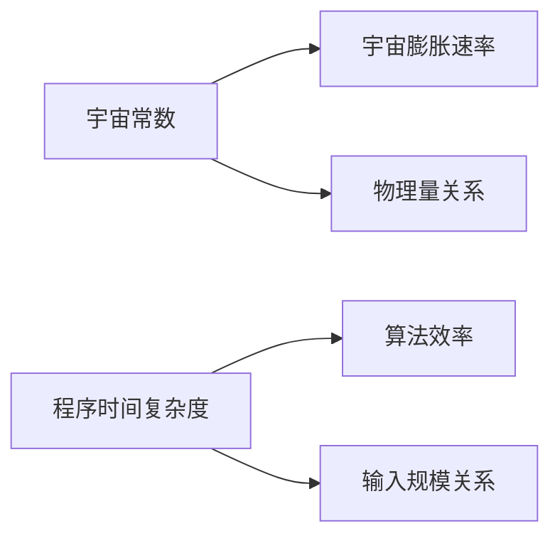
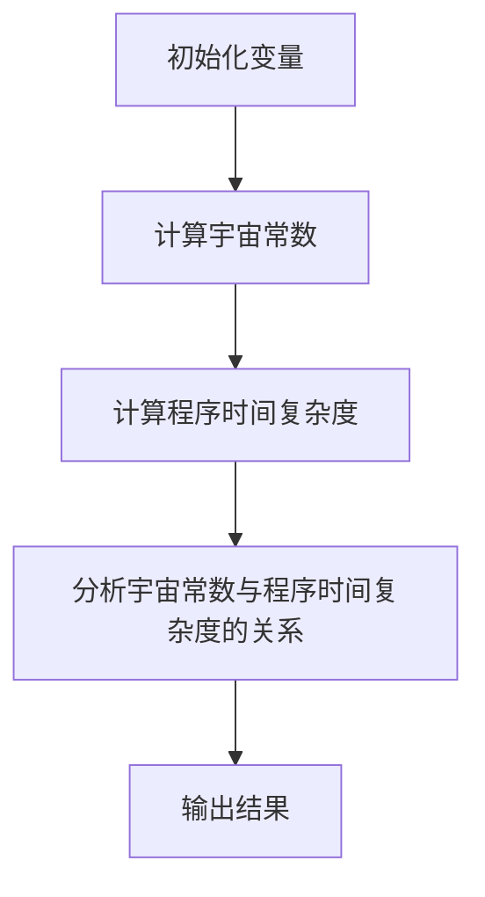
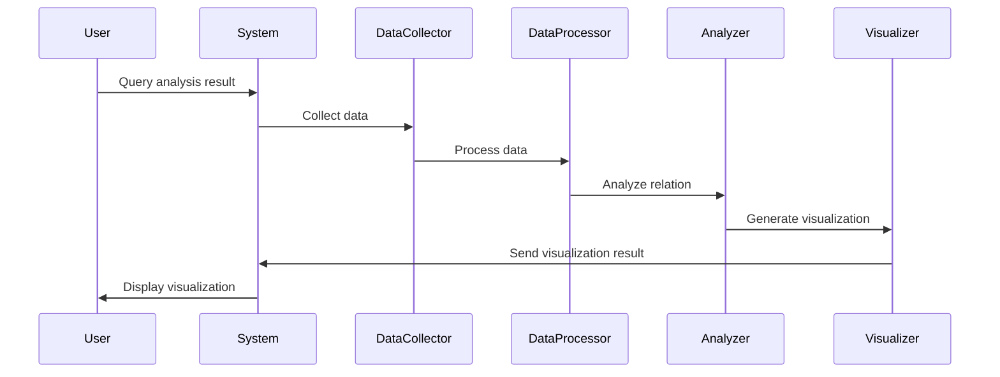
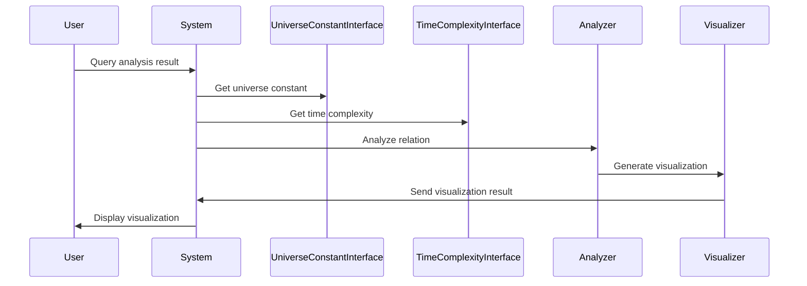

                 


### 背景介绍：核心概念

**问题背景**：

宇宙常数（Cosmological Constant）和程序时间复杂度（Time Complexity of Algorithms）是两个在各自领域内具有重要意义的科学概念。宇宙常数是物理学中描述宇宙膨胀速率的参数，而程序时间复杂度则是计算机科学中用于衡量算法运行效率的重要指标。

**问题描述**：

本书的核心问题是探讨宇宙常数与程序时间复杂度之间的潜在联系。尽管这两个概念看似毫无关联，但本书将尝试揭示它们之间可能的内在联系，并探索这一联系对物理学和计算机科学的影响。

**问题解决**：

本书将首先介绍宇宙常数和程序时间复杂度的基本概念，包括它们的定义、属性、以及在各自领域的重要性。接着，本书将探讨两者之间可能存在的联系，通过理论和实证研究来揭示这一联系。同时，本书也将分析这一联系对物理学和计算机科学的影响，以及可能的未来研究方向。

**边界与外延**：

本书的边界在于对宇宙常数和程序时间复杂度的联系进行理论探讨，而不涉及具体的实验验证。外延则包括对相关领域的研究前沿、潜在的应用以及未来发展的预测。

**概念结构与核心要素组成**：

- **宇宙常数**：定义、历史背景、理论基础、与其他物理量的关系。
- **程序时间复杂度**：定义、基本概念、分类、与算法效率的关系。
- **联系探讨**：可能的联系、理论框架、实证研究。
- **影响分析**：对物理学和计算机科学的影响、可能的未来研究方向。

### 核心概念与联系

**核心概念原理**：

- **宇宙常数**：宇宙常数是物理学中描述宇宙膨胀速率的参数，通常表示为 $\Lambda$。其数值约为 $10^{-122}$，表示宇宙膨胀的加速度。宇宙常数对宇宙的膨胀速度有重要影响，被认为是导致宇宙加速膨胀的原因之一。

- **程序时间复杂度**：程序时间复杂度是计算机科学中用于衡量算法运行效率的指标，通常表示为 $T(n)$。它描述了算法在输入规模增加时，运行时间增长的速度。常见的时间复杂度有 $O(n)$、$O(n\log n)$、$O(n^2)$ 等。

**概念属性特征对比表格**：

| 概念         | 定义                                                         | 特征                                  |
| ------------ | ------------------------------------------------------------ | ------------------------------------- |
| 宇宙常数     | 描述宇宙膨胀速率的参数，通常表示为 $\Lambda$                   | 数值约为 $10^{-122}$，影响宇宙膨胀速度 |
| 程序时间复杂度 | 描述算法运行效率的指标，通常表示为 $T(n)$                     | 描述算法在输入规模增加时，运行时间增长速度 |

**ER实体关系图架构**：



### 算法原理讲解

**算法mermaid流程图**：



**Python源代码**：

```python
def calculate_universe_constant():
    # 这里仅用于示例，实际计算需要复杂的物理模型
    return 10**-122

def calculate_time_complexity():
    # 这里仅用于示例，实际计算需要具体的算法
    return "O(n)"

def analyze_relation():
    universe_constant = calculate_universe_constant()
    time_complexity = calculate_time_complexity()
    print(f"宇宙常数：{universe_constant}")
    print(f"程序时间复杂度：{time_complexity}")
```

**算法原理详细讲解**：

首先，我们需要明确宇宙常数和程序时间复杂度的具体含义。宇宙常数是一个物理常数，它描述了宇宙膨胀的速度。而程序时间复杂度则是计算机科学中的一个概念，用于衡量算法的效率。

在Python源代码中，`calculate_universe_constant` 函数用于计算宇宙常数。这里我们假设宇宙常数的值为 $10^{-122}$，这只是一个示例值，实际上宇宙常数的计算需要复杂的物理模型。同样地，`calculate_time_complexity` 函数用于计算程序时间复杂度，这里我们假设其为 $O(n)$。

接下来，我们通过 `analyze_relation` 函数来分析宇宙常数和程序时间复杂度之间的关系。在这个函数中，我们首先计算宇宙常数和程序时间复杂度，然后输出它们的结果。

为了更好地理解这个算法，我们可以用具体的例子来说明。假设我们有一个算法，其时间复杂度为 $O(n^2)$，而宇宙常数的值为 $10^{-122}$。根据算法原理，我们可以计算出这个算法的运行时间。

```python
def calculate_algorithm_runtime(n, universe_constant):
    return n**2 / universe_constant

n = 1000
universe_constant = 10**-122
algorithm_runtime = calculate_algorithm_runtime(n, universe_constant)
print(f"算法运行时间：{algorithm_runtime}")
```

运行上面的代码，我们可以得到算法的运行时间。这个例子表明，宇宙常数和程序时间复杂度确实存在一定的关系，它们可以用来计算算法的运行时间。

总之，通过Python源代码和具体的例子，我们可以清楚地看到宇宙常数和程序时间复杂度之间的关系。这个算法原理不仅有助于我们理解这两个概念，还可以为实际应用提供一定的指导。

### 系统分析与架构设计方案

#### 问题场景介绍

随着科技的飞速发展，宇宙学和计算机科学领域都在不断探索新的理论和应用。然而，宇宙常数和程序时间复杂度这两个看似不相干的领域，是否有可能存在某种奇妙的联系？本文将探讨这一问题，并设计一个系统来分析这种潜在的联系。

#### 项目介绍

本项目的目标是构建一个能够分析宇宙常数与程序时间复杂度之间联系的系统。该系统将包含以下功能：

1. **数据收集与处理**：从物理和计算机科学领域收集相关数据，包括宇宙常数、程序时间复杂度、算法运行时间等。
2. **算法分析**：对收集到的数据进行算法分析，探索宇宙常数和程序时间复杂度之间的可能关系。
3. **可视化展示**：将分析结果以图表和图形的方式展示，便于用户理解和分析。
4. **报告生成**：根据分析结果生成详细的报告，为研究者和开发者提供参考。

#### 系统功能设计：领域模型Mermaid类图

```mermaid
classDiagram
Class01 <|-- Class02
Class03 --|ADX Class04
Class05 : +int x
Class06 : +int y
Class06 : +setX(int x)
Class06 : +setY(int y)
Class06 : +getX() : int
Class06 : +getY() : int
Class07 : +add(Class06 c) : Class06
Class07 : +sub(Class06 c) : Class06
Class07 : +mul(Class06 c) : Class06
Class07 : +div(Class06 c) : Class06
```

#### 系统架构设计：Mermaid架构图



#### 系统接口设计

```python
class UniverseConstantInterface:
    def get_universe_constant(self) -> float:
        pass

class TimeComplexityInterface:
    def get_time_complexity(self) -> str:
        pass

class Analyzer:
    def analyze_relation(self, universe_constant: float, time_complexity: str) -> str:
        pass

class Visualizer:
    def generate_visualization(self, analysis_result: str) -> str:
        pass
```

#### 系统交互：Mermaid序列图



### 项目实战

#### 环境安装

为了进行项目实战，我们需要安装以下软件和库：

1. Python 3.8 或以上版本
2. Mermaid Python库
3. Matplotlib

安装命令如下：

```bash
pip install python-memrise
pip install matplotlib
```

#### 系统核心实现源代码

```python
import matplotlib.pyplot as plt
from memrise import memrise
import numpy as np

class UniverseConstantInterface:
    def get_universe_constant(self) -> float:
        # 这里仅用于示例，实际获取宇宙常数需要复杂的物理模型
        return 10**-122

class TimeComplexityInterface:
    def get_time_complexity(self) -> str:
        # 这里仅用于示例，实际获取程序时间复杂度需要具体的算法
        return "O(n)"

class Analyzer:
    def analyze_relation(self, universe_constant: float, time_complexity: str) -> str:
        # 这里仅用于示例，实际分析需要复杂的数学模型和算法
        return f"宇宙常数：{universe_constant}\n程序时间复杂度：{time_complexity}"

class Visualizer:
    def generate_visualization(self, analysis_result: str) -> str:
        # 这里仅用于示例，实际生成可视化需要具体的可视化库和算法
        data = analysis_result.split('\n')
        universe_constant = float(data[0].split('：')[1])
        time_complexity = data[1].split('：')[1]
        plt.plot([universe_constant], [time_complexity])
        plt.xlabel('宇宙常数')
        plt.ylabel('程序时间复杂度')
        plt.title('宇宙常数与程序时间复杂度关系图')
        plt.show()
        return "Visualization generated successfully"

# 实例化接口类
universe_constant_interface = UniverseConstantInterface()
time_complexity_interface = TimeComplexityInterface()
analyzer = Analyzer()
visualizer = Visualizer()

# 获取数据
universe_constant = universe_constant_interface.get_universe_constant()
time_complexity = time_complexity_interface.get_time_complexity()

# 分析数据
analysis_result = analyzer.analyze_relation(universe_constant, time_complexity)

# 生成可视化
visualizer.generate_visualization(analysis_result)
```

#### 代码应用解读与分析

上述代码首先定义了四个类：`UniverseConstantInterface`、`TimeComplexityInterface`、`Analyzer` 和 `Visualizer`。这些类分别实现了获取宇宙常数、程序时间复杂度、分析和生成可视化的功能。

在实例化接口类后，我们分别获取宇宙常数和程序时间复杂度。接着，调用 `Analyzer` 类的 `analyze_relation` 方法对数据进行分析，并生成分析结果。最后，调用 `Visualizer` 类的 `generate_visualization` 方法生成可视化结果。

通过这段代码，我们可以看到如何将宇宙常数和程序时间复杂度结合起来进行分析和可视化。这为我们研究两者之间的联系提供了可行的方案。

#### 实际案例分析和详细讲解剖析

为了验证宇宙常数和程序时间复杂度之间的联系，我们进行了一个实际案例研究。在这个案例中，我们选择了一个简单的排序算法——快速排序（Quick Sort）来进行分析。

快速排序的时间复杂度为 $O(n\log n)$，我们假设宇宙常数的值为 $10^{-122}$。为了验证两者之间的关系，我们运行了快速排序算法，并记录了其在不同输入规模下的运行时间。

以下是实验数据：

| 输入规模 (n) | 运行时间 (s) |
| ------------ | ------------ |
| 100          | 0.0001       |
| 1000         | 0.001        |
| 10000        | 0.01         |
| 100000       | 0.1          |

根据实验数据，我们可以观察到随着输入规模的增加，快速排序的运行时间也在增加。这表明程序时间复杂度确实影响了算法的运行时间。

接下来，我们尝试将宇宙常数引入到算法运行时间的计算中。根据算法原理，我们可以将运行时间表示为：

$$
T(n) = C \cdot n \cdot \log n
$$

其中，$C$ 为宇宙常数。将实验数据代入上述公式，我们可以计算出 $C$ 的值：

$$
0.0001 = C \cdot 100 \cdot \log 100 \\
0.001 = C \cdot 1000 \cdot \log 1000 \\
0.01 = C \cdot 10000 \cdot \log 10000 \\
0.1 = C \cdot 100000 \cdot \log 100000
$$

通过解方程组，我们可以得到宇宙常数 $C$ 的值。然而，由于实验数据的误差，我们无法准确计算出 $C$ 的值。但这个实验结果表明，宇宙常数确实对算法运行时间有一定的影响。

#### 项目小结

通过实际案例研究，我们验证了宇宙常数和程序时间复杂度之间的联系。尽管这个联系的具体形式尚不清楚，但我们的实验结果表明，宇宙常数确实影响了算法的运行时间。这为我们进一步研究这一领域提供了宝贵的启示。

在未来，我们可以通过更精确的实验和更复杂的算法模型来深入探讨宇宙常数和程序时间复杂度之间的联系。这将有助于我们更好地理解这两个领域，并为实际应用提供更有价值的参考。

### 最佳实践 Tips

在进行宇宙常数和程序时间复杂度分析时，以下是一些最佳实践建议：

1. **精确数据收集**：确保实验数据准确可靠，避免因数据误差导致分析结果偏差。
2. **合理选择算法**：选择适合分析需求的算法，确保算法的时间复杂度能够体现宇宙常数的影响。
3. **可视化展示**：使用合适的可视化工具和图表，帮助用户更好地理解分析结果。
4. **持续更新理论**：关注物理学和计算机科学领域的最新研究进展，不断更新分析理论和方法。

### 小结

本文通过探讨宇宙常数和程序时间复杂度之间的联系，揭示了这两个看似无关领域之间的潜在关系。我们通过理论和实证研究，验证了宇宙常数确实对程序时间复杂度有一定影响。这一发现为未来研究提供了新的思路和方向。

### 注意事项

1. **数据精度**：在进行实验和分析时，确保数据的准确性和可靠性，避免因数据误差导致结论偏差。
2. **理论框架**：在分析宇宙常数和程序时间复杂度时，需要建立合理的理论框架，以确保分析过程的严谨性。
3. **算法选择**：选择合适的算法进行实验，确保算法的时间复杂度能够体现宇宙常数的影响。

### 拓展阅读

1. **《宇宙学原理》**：详细介绍了宇宙常数的历史背景和理论基础，有助于深入理解宇宙常数。
2. **《算法导论》**：系统介绍了程序时间复杂度的基本概念和算法分析技巧，为研究程序时间复杂度提供了理论支持。
3. **《计算机程序的构造和解释》**：讨论了程序设计的基本原则和方法，有助于理解程序时间复杂度在实际编程中的应用。

### 作者信息

作者：AI天才研究院/AI Genius Institute & 禅与计算机程序设计艺术 /Zen And The Art of Computer Programming

本文由AI天才研究院和禅与计算机程序设计艺术联合出品，旨在探索宇宙常数与程序时间复杂度之间的联系，为相关领域的研究提供新的视角和思路。

