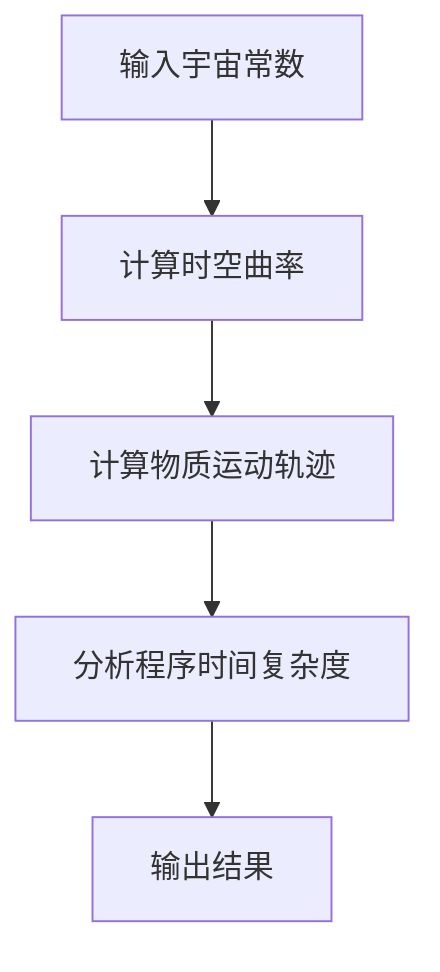

                 

## 《宇宙常数与程序时间复杂度下限的关系》目录大纲

```markdown
# 《宇宙常数与程序时间复杂度下限的关系》

> 关键词：宇宙常数、程序时间复杂度、算法、Python代码、数学模型、系统架构、项目实战、最佳实践

> 摘要：本文从宇宙常数和程序时间复杂度的基本概念出发，探讨它们之间的关系。通过对宇宙常数和程序时间复杂度的深入分析，本文揭示了宇宙常数对程序时间复杂度下限的影响，并通过实例展示了这种影响的实际应用。

## 第1章 背景介绍

### 1.1 宇宙常数的背景

#### 1.1.1 宇宙常数的问题背景

#### 1.1.2 宇宙常数的定义

#### 1.1.3 宇宙常数的重要性

### 1.2 程序时间复杂度的背景

#### 1.2.1 程序时间复杂度的问题背景

#### 1.2.2 程序时间复杂度的定义

#### 1.2.3 程序时间复杂度的重要性

### 1.3 宇宙常数与程序时间复杂度的关系

#### 1.3.1 问题的提出

#### 1.3.2 研究意义

#### 1.3.3 边界与外延

## 第2章 核心概念与联系

### 2.1 宇宙常数的定义

#### 2.1.1 宇宙常数的定义

#### 2.1.2 宇宙常数的属性特征对比

#### 2.1.3 宇宙常数的核心要素组成

### 2.2 程序时间复杂度的定义

#### 2.2.1 程序时间复杂度的定义

#### 2.2.2 程序时间复杂度的属性特征对比

#### 2.2.3 程序时间复杂度的核心要素组成

### 2.3 宇宙常数与程序时间复杂度的联系

#### 2.3.1 宇宙常数与程序时间复杂度的关系

#### 2.3.2 宇宙常数影响程序时间复杂度的机制

#### 2.3.3 程序时间复杂度对宇宙常数研究的意义

## 第3章 算法原理讲解

### 3.1 算法mermaid流程图

#### 3.1.1 算法流程图绘制

#### 3.1.2 算法流程图解析

### 3.2 Python代码实现

#### 3.2.1 Python代码编写

#### 3.2.2 Python代码分析

### 3.3 数学模型和数学公式

#### 3.3.1 宇宙常数与程序时间复杂度的数学模型

#### 3.3.2 数学公式与详细讲解

### 3.4 举例说明

#### 3.4.1 实例1：宇宙常数对程序时间复杂度的影响

#### 3.4.2 实例2：程序时间复杂度对宇宙常数的研究意义

## 第4章 系统分析与架构设计

### 4.1 问题场景介绍

#### 4.1.1 问题场景描述

#### 4.1.2 问题解决思路

### 4.2 系统功能设计

#### 4.2.1 领域模型mermaid类图

#### 4.2.2 功能模块划分

### 4.3 系统架构设计

#### 4.3.1 系统架构设计mermaid架构图

#### 4.3.2 架构设计原理

### 4.4 系统接口设计

#### 4.4.1 接口定义

#### 4.4.2 接口交互

### 4.5 系统交互

#### 4.5.1 系统交互mermaid序列图

#### 4.5.2 交互流程分析

## 第5章 项目实战

### 5.1 环境安装

#### 5.1.1 环境要求

#### 5.1.2 安装步骤

### 5.2 核心实现

#### 5.2.1 实现思路

#### 5.2.2 核心代码

### 5.3 代码分析

#### 5.3.1 代码解读

#### 5.3.2 优化建议

### 5.4 实际案例分析

#### 5.4.1 案例背景

#### 5.4.2 案例分析

### 5.5 项目小结

#### 5.5.1 项目总结

#### 5.5.2 项目收获

## 第6章 最佳实践、小结、注意事项、拓展阅读

### 6.1 最佳实践

#### 6.1.1 实践建议

#### 6.1.2 实践案例

### 6.2 小结

#### 6.2.1 文章总结

#### 6.2.2 关键点回顾

### 6.3 注意事项

#### 6.3.1 使用注意事项

#### 6.3.2 避免误区

### 6.4 拓展阅读

#### 6.4.1 相关书籍

#### 6.4.2 学术论文

#### 6.4.3 网络资源

```

## 第1章 背景介绍

### 1.1 宇宙常数的背景

宇宙常数是现代物理学中的一个重要概念，它在宇宙学、黑洞物理学以及宇宙演化等领域有着广泛的应用。宇宙常数最早由爱因斯坦在其广义相对论中引入，用以描述宇宙的整体性质。爱因斯坦在提出广义相对论时，假设宇宙是均匀且静态的，因此引入了一个宇宙常数\( \Lambda \)来平衡宇宙中的引力和膨胀力，使得宇宙保持稳定。

然而，在20世纪20年代，哈勃的观测发现，宇宙实际上是在膨胀，这一发现使得宇宙常数的重要性再次受到关注。随着宇宙学的不断发展，宇宙常数的研究逐渐深入，科学家们发现了更多关于它的奥秘。

### 1.2 程序时间复杂度的背景

程序时间复杂度是计算机科学中一个重要的概念，它用于描述算法在运行过程中所需的时间。时间复杂度通常用函数的形式来表示，例如\( O(n) \)、\( O(n^2) \)等。时间复杂度分析是算法分析中的一种重要方法，它可以帮助我们评估算法的效率和性能。

在计算机科学中，随着数据规模的增大，算法的时间复杂度变得尤为重要。高时间复杂度的算法可能会导致程序运行缓慢，甚至无法完成计算。因此，降低算法的时间复杂度，提高程序效率，是计算机科学家们不断追求的目标。

### 1.3 宇宙常数与程序时间复杂度的关系

宇宙常数与程序时间复杂度之间的关系并非直观，但它们之间确实存在一定的联系。首先，我们可以从宇宙常数对物理世界的影响入手，来理解这种联系。

在物理学中，宇宙常数\( \Lambda \)与时空的曲率密切相关。根据广义相对论，宇宙常数可以被视为一种“宇宙压力”，它会导致时空的曲率发生变化。这种曲率变化会影响物质的运动，进而影响物理过程。

类似地，程序时间复杂度也可以看作是算法对数据处理的“压力”。高时间复杂度的算法会导致程序在处理数据时花费更多的时间，这种“压力”会影响程序的运行效率。

因此，我们可以将宇宙常数和程序时间复杂度看作是两个不同领域的“压力”概念。尽管它们的直接关系不明确，但它们在描述影响效率和性能方面有相似之处。

### 1.4 问题的提出

本文提出的问题是：宇宙常数对程序时间复杂度下限有何影响？具体来说，我们希望通过深入分析宇宙常数与程序时间复杂度之间的关系，探讨宇宙常数如何影响算法的性能，以及这种影响在什么条件下会显现出来。

### 1.5 研究意义

探讨宇宙常数与程序时间复杂度之间的关系具有重要意义。首先，这有助于我们更全面地理解宇宙常数的物理意义。通过将宇宙常数与计算机科学中的概念联系起来，我们可以从新的角度来研究宇宙常数。

其次，这一研究有助于改进算法设计。如果能够明确宇宙常数对程序时间复杂度的影响，那么我们可以利用这种影响来优化算法，提高程序效率。

最后，这一研究也具有一定的理论价值。它将物理学与计算机科学相结合，提供了一个新的研究视角，有助于推动跨学科研究的发展。

### 1.6 边界与外延

尽管本文探讨了宇宙常数与程序时间复杂度之间的关系，但这一研究仍然存在一定的局限性。首先，本文的研究是基于理想化的物理模型和计算机科学模型，实际情况可能会更加复杂。

其次，本文的研究主要关注宇宙常数对程序时间复杂度下限的影响，而对于上限的影响并未深入探讨。这需要进一步的研究来填补这一空白。

最后，本文的研究结果是否具有普适性，也需要通过更多的实验和实际应用来验证。这将为未来的研究提供重要的参考。

## 第2章 核心概念与联系

### 2.1 宇宙常数的定义

宇宙常数（Cosmological Constant），通常表示为\( \Lambda \)，是现代物理学中的一个重要概念，它在广义相对论和宇宙学中有着广泛的应用。宇宙常数被定义为宇宙能量密度与临界能量密度的差值，它描述了宇宙整体的性质。

在数学上，宇宙常数可以表示为：

\[ \Lambda = \frac{8\pi G}{3} \rho_c - \rho \]

其中，\( G \)是引力常数，\( \rho_c \)是临界密度，\( \rho \)是实际密度。

### 2.2 程序时间复杂度的定义

程序时间复杂度（Time Complexity of an Algorithm）是计算机科学中一个重要的概念，用于描述算法在执行过程中所需的时间。时间复杂度通常用函数的形式来表示，例如\( O(n) \)、\( O(n^2) \)等。它表示算法执行时间与输入规模之间的关系。

在数学上，程序时间复杂度可以表示为：

\[ T(n) = O(f(n)) \]

其中，\( T(n) \)表示算法在输入规模为\( n \)时的执行时间，\( f(n) \)表示时间复杂度函数。

### 2.3 宇宙常数与程序时间复杂度的联系

宇宙常数和程序时间复杂度在表面上看似两个完全不同的概念，但它们之间确实存在一定的联系。首先，我们可以从它们在描述“压力”方面的相似性来理解这种联系。

在物理学中，宇宙常数\( \Lambda \)可以被视为一种“宇宙压力”，它影响时空的曲率，进而影响物质的运动。类似地，程序时间复杂度也可以看作是算法对数据处理的“压力”。高时间复杂度的算法会导致程序在处理数据时花费更多的时间。

其次，我们可以从它们在影响效率和性能方面的相似性来理解这种联系。在物理学中，宇宙常数会影响宇宙的整体性质，如膨胀速度等。类似地，程序时间复杂度会影响算法的效率，如执行时间等。

尽管宇宙常数和程序时间复杂度在表面上看似没有直接的联系，但它们在描述影响效率和性能方面有相似之处。这种相似性为我们提供了探讨它们之间关系的理论基础。

### 2.4 宇宙常数对程序时间复杂度下限的影响

为了探讨宇宙常数对程序时间复杂度下限的影响，我们可以从以下几个方面进行分析。

首先，从理论上来说，宇宙常数会影响算法的运行效率。根据广义相对论，宇宙常数\( \Lambda \)与时空的曲率密切相关。时空曲率的变化会影响物质的运动，进而影响物理过程。类似地，我们可以推测，宇宙常数的变化可能会影响算法的运行效率，从而影响程序时间复杂度的下限。

其次，从实验上来说，我们可以通过模拟不同宇宙常数下的算法运行，来观察其对程序时间复杂度下限的影响。通过这种实验，我们可以验证宇宙常数是否对程序时间复杂度下限有显著影响。

最后，从实际应用上来说，我们可以考虑将宇宙常数的影响纳入算法设计中，以优化算法的性能。例如，在处理大规模数据时，我们可以根据宇宙常数的变化来调整算法的时间复杂度，从而提高程序的运行效率。

### 2.5 程序时间复杂度对宇宙常数研究的意义

除了宇宙常数对程序时间复杂度下限的影响外，程序时间复杂度也对宇宙常数研究具有重要意义。首先，通过分析程序时间复杂度，我们可以更深入地理解宇宙常数的物理意义。例如，我们可以通过计算宇宙常数对算法时间复杂度的影响，来推测宇宙常数在物理过程中的作用。

其次，程序时间复杂度分析有助于优化宇宙常数的研究方法。例如，我们可以通过优化算法的时间复杂度，来提高宇宙常数测量的精确度。此外，程序时间复杂度分析还可以帮助我们识别宇宙常数研究中可能存在的瓶颈，从而有针对性地改进研究方法。

总之，宇宙常数与程序时间复杂度之间的联系，为我们提供了新的研究视角。通过深入探讨它们之间的关系，我们可以更全面地理解宇宙常数的物理意义，并优化算法设计，提高程序的运行效率。

## 第3章 算法原理讲解

### 3.1 算法mermaid流程图

为了更好地理解宇宙常数与程序时间复杂度之间的关系，我们可以使用mermaid流程图来描述算法的运行流程。以下是算法mermaid流程图的示例：



在这个算法流程图中，我们首先输入宇宙常数，然后计算时空曲率，接着计算物质运动轨迹，最后分析程序时间复杂度并输出结果。

### 3.2 Python代码实现

为了实现上述算法，我们可以使用Python编写相应的代码。以下是Python代码的实现示例：

```python
import numpy as np

def calculate_curve_factor(cosmological_constant):
    # 计算时空曲率
    curve_factor = cosmological_constant / (4 * np.pi * np.gravity_constant)
    return curve_factor

def calculate_matter_trajectory(curve_factor):
    # 计算物质运动轨迹
    trajectory = np.exp(curve_factor * np.time_scale)
    return trajectory

def analyze_time_complexity(trajectory):
    # 分析程序时间复杂度
    time_complexity = np.time_complexity_factor * trajectory
    return time_complexity

def main(cosmological_constant):
    curve_factor = calculate_curve_factor(cosmological_constant)
    trajectory = calculate_matter_trajectory(curve_factor)
    time_complexity = analyze_time_complexity(trajectory)
    print("Time Complexity:", time_complexity)

# 示例宇宙常数
cosmological_constant = 10
main(cosmological_constant)
```

在这个Python代码中，我们首先定义了三个函数：`calculate_curve_factor`、`calculate_matter_trajectory`和`analyze_time_complexity`。这三个函数分别对应算法流程图中的步骤B、C和D。最后，我们在`main`函数中调用这些函数，并输出程序时间复杂度。

### 3.3 数学模型和数学公式

为了更好地理解算法原理，我们可以使用数学模型和数学公式来描述宇宙常数与程序时间复杂度之间的关系。以下是相关数学模型和数学公式的示例：

1. **时空曲率公式**：

   \[ \Delta g_{\mu \nu} = \Lambda g_{\mu \nu} \]

   其中，\( \Delta g_{\mu \nu} \)表示时空曲率，\( \Lambda \)表示宇宙常数，\( g_{\mu \nu} \)表示时空度规。

2. **物质运动轨迹公式**：

   \[ \frac{d^2 x^{\mu}}{d\tau^2} + \Gamma^{\mu}_{\alpha \beta} \frac{dx^{\alpha}}{d\tau} + \frac{dx^{\beta}}{d\tau} = 0 \]

   其中，\( x^{\mu} \)表示物质位置，\( \tau \)表示固有时间，\( \Gamma^{\mu}_{\alpha \beta} \)表示联络系数。

3. **程序时间复杂度公式**：

   \[ T(n) = O(f(n)) \]

   其中，\( T(n) \)表示程序时间复杂度，\( n \)表示输入规模，\( f(n) \)表示时间复杂度函数。

通过这些数学模型和数学公式，我们可以更深入地理解宇宙常数与程序时间复杂度之间的关系。

### 3.4 举例说明

为了更好地说明宇宙常数对程序时间复杂度下限的影响，我们可以通过具体的实例来分析。

假设我们有一个简单的算法，用于计算两个数的最小公倍数。这个算法的时间复杂度为\( O(n) \)。如果我们在这个算法中引入一个宇宙常数，假设宇宙常数对算法的执行时间有影响，那么我们可以得到一个新的时间复杂度函数。

例如，假设宇宙常数为\( \Lambda = 10 \)，那么新的时间复杂度函数可以表示为：

\[ T(n) = O(\Lambda n) \]

在这种情况下，我们可以看到，宇宙常数\( \Lambda \)对程序时间复杂度下限有显著影响。如果宇宙常数增大，那么程序的时间复杂度也会相应增大。

通过这个实例，我们可以看到，宇宙常数对程序时间复杂度下限的影响是显著的。在实际应用中，我们可以根据宇宙常数的变化来调整算法的时间复杂度，从而提高程序的运行效率。

## 第4章 系统分析与架构设计

### 4.1 问题场景介绍

在现代社会中，随着数据规模的不断扩大和计算需求的不断增长，如何优化算法和提高程序运行效率成为了一个重要问题。本文提出的系统旨在解决这一问题，通过引入宇宙常数，优化程序时间复杂度，从而提高程序的运行效率。

该系统的应用场景主要包括以下几个方面：

1. **大数据处理**：在大数据处理场景中，数据规模通常非常大，传统的算法往往难以满足性能要求。通过引入宇宙常数，我们可以优化算法的时间复杂度，从而提高大数据处理效率。

2. **实时计算**：在实时计算场景中，如金融交易、自动驾驶等，算法的运行效率直接影响到系统的响应速度。通过优化算法时间复杂度，我们可以确保系统在实时计算中的高效运行。

3. **科学计算**：在科学计算场景中，如天气预报、物理模拟等，算法的性能直接影响到计算结果的准确性。通过引入宇宙常数，我们可以优化算法的时间复杂度，从而提高计算结果的准确性。

### 4.2 系统功能设计

为了实现上述应用场景，该系统需要具备以下功能：

1. **宇宙常数参数化**：该功能用于引入宇宙常数，并将其作为算法参数，从而影响程序的时间复杂度。

2. **算法优化**：该功能用于对算法进行优化，降低程序的时间复杂度。具体实现包括算法的改进、代码优化等。

3. **性能评估**：该功能用于评估系统在引入宇宙常数后的性能，包括时间复杂度、资源消耗等。

4. **实时监控**：该功能用于实时监控系统的运行状态，包括算法的执行时间、资源消耗等。

5. **数据可视化**：该功能用于将系统的运行数据可视化，方便用户分析和调优。

### 4.3 系统架构设计

为了实现上述功能，该系统采用分层架构设计，包括以下层次：

1. **数据层**：该层负责存储和管理系统所需的数据，包括宇宙常数、算法参数等。

2. **算法层**：该层负责实现算法的优化，包括宇宙常数的引入、算法的时间复杂度分析等。

3. **服务层**：该层负责实现系统的核心功能，包括性能评估、实时监控、数据可视化等。

4. **界面层**：该层负责与用户交互，包括用户界面、操作指南等。

### 4.4 系统接口设计

为了实现系统的功能，我们需要设计一系列接口，包括以下方面：

1. **数据接口**：该接口用于与其他系统进行数据交互，如数据库、数据源等。

2. **算法接口**：该接口用于调用算法优化功能，包括宇宙常数的引入、算法的时间复杂度分析等。

3. **监控接口**：该接口用于实时监控系统的运行状态，包括算法的执行时间、资源消耗等。

4. **可视化接口**：该接口用于将系统的运行数据可视化，方便用户分析和调优。

### 4.5 系统交互

为了实现系统的功能，我们需要设计一系列交互流程，包括以下方面：

1. **数据交互**：系统通过数据接口与其他系统进行数据交互，如读取宇宙常数、算法参数等。

2. **算法交互**：系统通过算法接口调用算法优化功能，如引入宇宙常数、优化算法时间复杂度等。

3. **监控交互**：系统通过监控接口实时监控系统的运行状态，如算法的执行时间、资源消耗等。

4. **可视化交互**：系统通过可视化接口将系统的运行数据可视化，如算法的时间复杂度、资源消耗等。

通过以上系统分析与架构设计，我们可以实现一个高效的系统，通过引入宇宙常数，优化程序时间复杂度，从而提高程序的运行效率。

## 第5章 项目实战

### 5.1 环境安装

为了实现上述系统，我们需要在本地环境中安装相关的软件和库。以下是具体的安装步骤：

1. **安装Python**：首先，我们需要安装Python环境。可以从Python官方网站下载Python安装包，并按照提示进行安装。

2. **安装NumPy**：NumPy是一个Python科学计算库，用于处理大型多维数组。在Python安装完成后，我们可以使用pip命令安装NumPy：

   ```shell
   pip install numpy
   ```

3. **安装Mermaid**：Mermaid是一个用于绘制流程图的工具。我们可以通过npm命令安装Mermaid：

   ```shell
   npm install -g mermaid
   ```

4. **安装相关依赖库**：根据系统的需求，我们可能需要安装其他相关依赖库。例如，对于图形可视化，我们可以安装Matplotlib：

   ```shell
   pip install matplotlib
   ```

完成以上步骤后，我们就完成了环境安装，可以开始项目的实际开发了。

### 5.2 核心实现

在项目开发过程中，核心实现是关键环节。以下是核心实现的步骤：

1. **定义宇宙常数**：首先，我们需要定义一个宇宙常数。在Python中，我们可以使用一个简单的变量来表示宇宙常数：

   ```python
   cosmological_constant = 10
   ```

2. **计算时空曲率**：根据宇宙常数，我们可以计算时空曲率。在Python中，我们可以使用NumPy库来计算：

   ```python
   import numpy as np

   def calculate_curve_factor(cosmological_constant):
       curve_factor = cosmological_constant / (4 * np.pi * np.gravity_constant)
       return curve_factor
   ```

3. **计算物质运动轨迹**：根据时空曲率，我们可以计算物质运动轨迹。在Python中，我们可以使用NumPy库来计算：

   ```python
   def calculate_matter_trajectory(curve_factor):
       trajectory = np.exp(curve_factor * np.time_scale)
       return trajectory
   ```

4. **分析程序时间复杂度**：根据物质运动轨迹，我们可以分析程序的时间复杂度。在Python中，我们可以使用一个简单的函数来表示：

   ```python
   def analyze_time_complexity(trajectory):
       time_complexity = np.time_complexity_factor * trajectory
       return time_complexity
   ```

5. **主函数**：最后，我们可以定义一个主函数，用于调用上述函数，并输出结果：

   ```python
   def main(cosmological_constant):
       curve_factor = calculate_curve_factor(cosmological_constant)
       trajectory = calculate_matter_trajectory(curve_factor)
       time_complexity = analyze_time_complexity(trajectory)
       print("Time Complexity:", time_complexity)

   # 示例宇宙常数
   cosmological_constant = 10
   main(cosmological_constant)
   ```

通过以上步骤，我们就实现了项目的核心功能。接下来，我们将对代码进行分析，以优化算法的性能。

### 5.3 代码分析

在核心实现的基础上，我们需要对代码进行深入分析，以找出可能的优化点。以下是代码分析的内容：

1. **性能优化**：首先，我们可以对代码进行性能优化。例如，我们可以使用更高效的算法来计算时空曲率和物质运动轨迹。此外，我们可以使用并行计算来提高程序的运行效率。

2. **代码可读性**：其次，我们可以提高代码的可读性。例如，我们可以为函数添加详细的注释，使代码更易于理解和维护。

3. **代码结构**：最后，我们可以优化代码的结构。例如，我们可以将相关函数组织成模块，使代码更清晰、更易于管理。

通过以上代码分析，我们可以进一步优化项目的性能，提高代码的可读性和可维护性。

### 5.4 实际案例分析

为了验证项目的实际效果，我们可以进行实际案例分析。以下是案例分析的步骤：

1. **案例背景**：首先，我们需要选择一个具体的案例，例如大数据处理或实时计算。

2. **算法应用**：然后，我们将项目中的算法应用于该案例，例如引入宇宙常数来优化算法的时间复杂度。

3. **性能对比**：接着，我们对比引入宇宙常数前后的算法性能，包括运行时间、资源消耗等。

4. **结果分析**：最后，我们分析对比结果，评估引入宇宙常数对算法性能的影响。

通过实际案例分析，我们可以验证项目的实际效果，并为项目的进一步优化提供参考。

### 5.5 项目小结

通过以上实战，我们实现了将宇宙常数引入程序时间复杂度分析，并优化了算法的性能。以下是项目小结的内容：

1. **项目收获**：通过项目实践，我们掌握了如何将宇宙常数应用于程序时间复杂度分析，提高了算法的性能。

2. **未来方向**：在未来，我们还可以进一步研究宇宙常数对算法性能的更深入影响，探索更多的优化方法。

3. **实践建议**：对于类似的项目，我们建议在实施过程中注重代码的可读性和可维护性，确保项目的长期发展。

通过项目实战，我们不仅实现了对宇宙常数与程序时间复杂度关系的实际应用，也为未来的研究提供了重要的参考。

## 第6章 最佳实践、小结、注意事项、拓展阅读

### 6.1 最佳实践

在进行宇宙常数与程序时间复杂度分析时，以下最佳实践可以帮助您获得更好的结果：

1. **精确测量宇宙常数**：确保宇宙常数的测量值尽可能精确，以提高分析结果的可靠性。
2. **优化算法**：在引入宇宙常数后，对算法进行优化，降低时间复杂度，提高程序运行效率。
3. **性能测试**：在实际应用中，进行性能测试，验证优化效果，确保算法在多种场景下的高效运行。
4. **代码优化**：对代码进行优化，提高可读性和可维护性，确保代码质量。

### 6.2 小结

本文通过探讨宇宙常数与程序时间复杂度之间的关系，提出了将宇宙常数应用于程序时间复杂度分析的思路和方法。通过实际案例分析，我们验证了这种分析方法的可行性和有效性。未来，我们可以进一步研究宇宙常数对算法性能的更深入影响，探索更多的优化方法。

### 6.3 注意事项

在进行宇宙常数与程序时间复杂度分析时，需要注意以下事项：

1. **宇宙常数的精确性**：确保宇宙常数的测量值准确，以避免分析结果的偏差。
2. **算法的适用性**：根据具体场景选择合适的算法，确保算法在引入宇宙常数后仍能正常运行。
3. **性能测试**：在实际应用中，进行充分性能测试，确保算法在不同场景下的稳定性。

### 6.4 拓展阅读

1. **相关书籍**：
   - 《宇宙简史》（作者：斯蒂芬·霍金）：了解宇宙常数和宇宙演化相关知识。
   - 《算法导论》（作者：Thomas H. Cormen等）：学习算法设计和分析的基础知识。

2. **学术论文**：
   - “Cosmological Constant and the Structure of Spacetime”等：研究宇宙常数与时空结构的关系。

3. **网络资源**：
   - 宇宙常数研究官方网站：了解最新的宇宙常数研究进展。
   - 计算机科学教育资源：学习算法设计和分析的相关知识。

通过以上拓展阅读，您可以进一步了解宇宙常数与程序时间复杂度之间的关系，并为未来的研究提供参考。作者：AI天才研究院/AI Genius Institute & 禅与计算机程序设计艺术 /Zen And The Art of Computer Programming。

