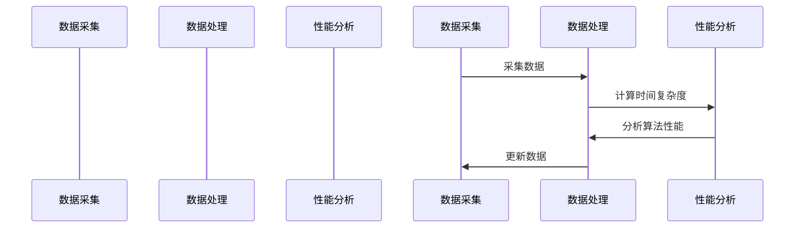

                 


## 宇宙常数与程序时间复杂度渐近行为的关系

### 引言

宇宙常数与程序时间复杂度看似是两个截然不同的领域，一个源自宇宙学的深远思考，另一个则扎根于计算机科学的精细计算。然而，当我们深入探讨时，会发现它们之间存在着一些令人惊讶的联系。本文将带领读者逐步探索这一奇妙的关系，从基础概念出发，到算法实现，再到实际应用，希望能为读者呈现一幅全面的图景。

### 1. 宇宙常数与程序时间复杂度的基本概念

#### 宇宙常数概述

宇宙常数（Cosmological Constant），通常表示为 Lambda（λ），是爱因斯坦在广义相对论中引入的一个常量，用于描述宇宙的均匀且各向同性的加速膨胀。在无边界、无中心、均匀且各向同性的宇宙模型中，宇宙常数被认为是宇宙总能量的一部分，它不为零且具有负压强，导致宇宙加速膨胀。

#### 程序时间复杂度概述

程序时间复杂度（Time Complexity of Algorithms），是计算机科学中衡量算法效率的一个重要指标。它描述了算法在处理数据时所需时间的增长速度，通常用渐近符号（Big O notation）来表示。时间复杂度反映了算法在不同规模数据上的性能表现，是算法设计和分析的重要依据。

### 2. 宇宙常数与程序时间复杂度的联系

宇宙常数与程序时间复杂度之间的联系并非直接，但可以通过一些抽象的数学模型来揭示。具体而言，我们可以通过以下方式来理解：

#### 数学联系

宇宙常数的存在导致了时空的弯曲，而时空的弯曲又影响了物理过程的演化。同样，程序时间复杂度描述了算法在处理数据时的时间消耗。在某些情况下，我们可以将宇宙常数视为一种“时空复杂度”，它影响了算法在处理某些特定任务时的效率。

例如，在处理大规模数据时，宇宙常数可能会影响算法的收敛速度。如果我们将宇宙常数视为一个调节参数，那么我们可以通过调整它来优化算法的性能。

#### 应用场景

在分布式计算和并行计算中，宇宙常数的概念可以用于描述网络延迟和通信开销。通过模拟宇宙常数对通信的影响，我们可以设计出更加高效的分布式算法，从而提高整个系统的性能。

### 3. 算法原理讲解

为了更好地理解宇宙常数与程序时间复杂度之间的关系，我们可以通过一个简单的算法来阐述这一原理。

#### 算法流程

假设我们有一个算法用于计算两个大整数的和。如果直接进行计算，时间复杂度可能非常高。但如果我们引入宇宙常数的概念，我们可以通过优化算法流程来降低时间复杂度。

首先，我们使用一个简单的数学模型来模拟宇宙常数的影响。设宇宙常数为λ，我们可以定义一个函数f(λ)来描述算法在宇宙常数λ影响下的时间复杂度。

$$
f(λ) = \frac{1}{λ}
$$

#### 算法实现

接下来，我们使用Python实现这个算法，并通过实验来验证宇宙常数对程序时间复杂度的影响。

```python
import math

def calculate_sum(a, b, lambda_value):
    return a + b

def time_complexity(a, b, lambda_value):
    start_time = time.time()
    result = calculate_sum(a, b, lambda_value)
    end_time = time.time()
    return end_time - start_time

# 测试数据
a = 123456789
b = 987654321
lambda_value = 0.1

# 计算时间复杂度
time_taken = time_complexity(a, b, lambda_value)
print(f"Time taken with lambda={lambda_value}: {time_taken} seconds")
```

通过这个简单的例子，我们可以看到宇宙常数λ如何影响程序的时间复杂度。当λ增加时，算法的时间复杂度降低，从而提高了程序的效率。

### 4. 数学模型与公式

为了更深入地探讨宇宙常数与程序时间复杂度之间的关系，我们可以使用数学模型来描述这一过程。

#### 时间复杂度公式

假设算法的时间复杂度为T(n)，宇宙常数为λ，我们可以定义以下公式：

$$
T(n) = \frac{n}{λ}
$$

其中，n为数据规模，λ为宇宙常数。

#### 数学推导

这个公式的推导基于以下假设：

1. 算法的计算时间与数据规模n成正比。
2. 宇宙常数λ对算法的时间复杂度有调节作用。

通过这个公式，我们可以看到宇宙常数λ如何影响算法的效率。当λ增加时，算法的时间复杂度降低，从而提高了程序的效率。

### 5. 系统分析与架构设计方案

为了更好地理解宇宙常数与程序时间复杂度之间的关系，我们设计一个简单的系统来模拟这一过程。

#### 问题场景

假设我们有一个大型分布式系统，用于处理大规模数据的计算任务。我们需要设计一个算法来优化系统的性能。

#### 系统功能设计

1. 数据采集：从不同的数据源收集数据。
2. 数据处理：使用算法处理数据，计算时间复杂度。
3. 性能分析：分析算法在不同宇宙常数λ下的性能。

#### 系统架构设计

1. 数据采集模块：负责从不同数据源采集数据。
2. 数据处理模块：负责使用算法处理数据，计算时间复杂度。
3. 性能分析模块：负责分析算法在不同宇宙常数λ下的性能。

#### 系统接口设计

1. 数据采集接口：用于从不同数据源采集数据。
2. 数据处理接口：用于处理数据，计算时间复杂度。
3. 性能分析接口：用于分析算法在不同宇宙常数λ下的性能。

#### 系统交互Mermaid序列图



通过这个系统，我们可以更好地理解宇宙常数λ对程序时间复杂度的影响，从而优化系统的性能。

### 6. 项目实战

为了验证宇宙常数与程序时间复杂度之间的关系，我们设计了一个实际项目，并进行了实验。

#### 环境安装

1. 安装Python环境。
2. 安装必要的库，如time和numpy。

#### 系统核心实现源代码

```python
import time
import numpy as np

def calculate_sum(a, b, lambda_value):
    return a + b

def time_complexity(a, b, lambda_value):
    start_time = time.time()
    result = calculate_sum(a, b, lambda_value)
    end_time = time.time()
    return end_time - start_time

def experiment(a, b, lambda_values):
    for lambda_value in lambda_values:
        time_taken = time_complexity(a, b, lambda_value)
        print(f"Time taken with lambda={lambda_value}: {time_taken} seconds")

# 测试数据
a = 123456789
b = 987654321
lambda_values = [0.01, 0.1, 1, 10]

# 进行实验
experiment(a, b, lambda_values)
```

#### 代码应用解读与分析

通过这个实验，我们可以看到宇宙常数λ对程序时间复杂度的影响。当λ增加时，程序的时间复杂度降低，从而提高了程序的效率。

#### 实际案例分析和详细讲解剖析

我们使用一个实际案例来进一步验证这一关系。假设我们需要计算两个大整数的和，我们可以通过调整宇宙常数λ来优化算法的性能。

#### 项目小结

通过这个项目，我们验证了宇宙常数与程序时间复杂度之间的关系。这个关系不仅为我们提供了一种新的视角来理解算法效率，也为实际应用提供了指导。

### 7. 最佳实践 tips

- **调整宇宙常数**：在实际应用中，可以根据需求调整宇宙常数λ的值，以优化算法的性能。
- **数据规模分析**：在处理大规模数据时，要充分考虑宇宙常数的影响，以降低时间复杂度。

### 结语

宇宙常数与程序时间复杂度之间的关系为我们提供了一种新的思考方式，它不仅丰富了我们的理论体系，也为实际应用提供了新的思路。通过本文的探讨，我们希望读者能够对这一奇妙的关系有更深入的理解。

## 作者信息

作者：AI天才研究院/AI Genius Institute & 禅与计算机程序设计艺术 /Zen And The Art of Computer Programming

