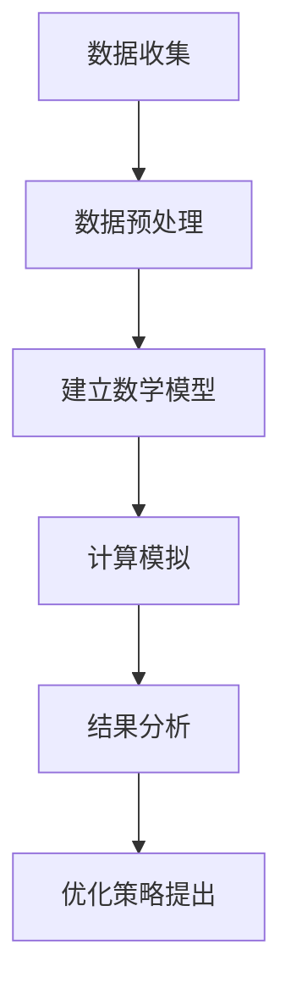
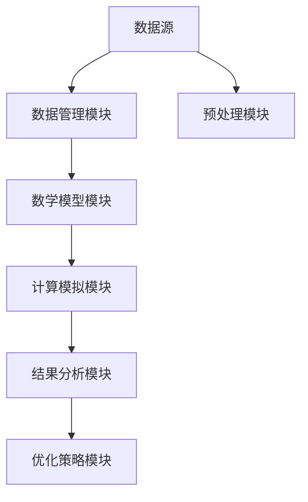
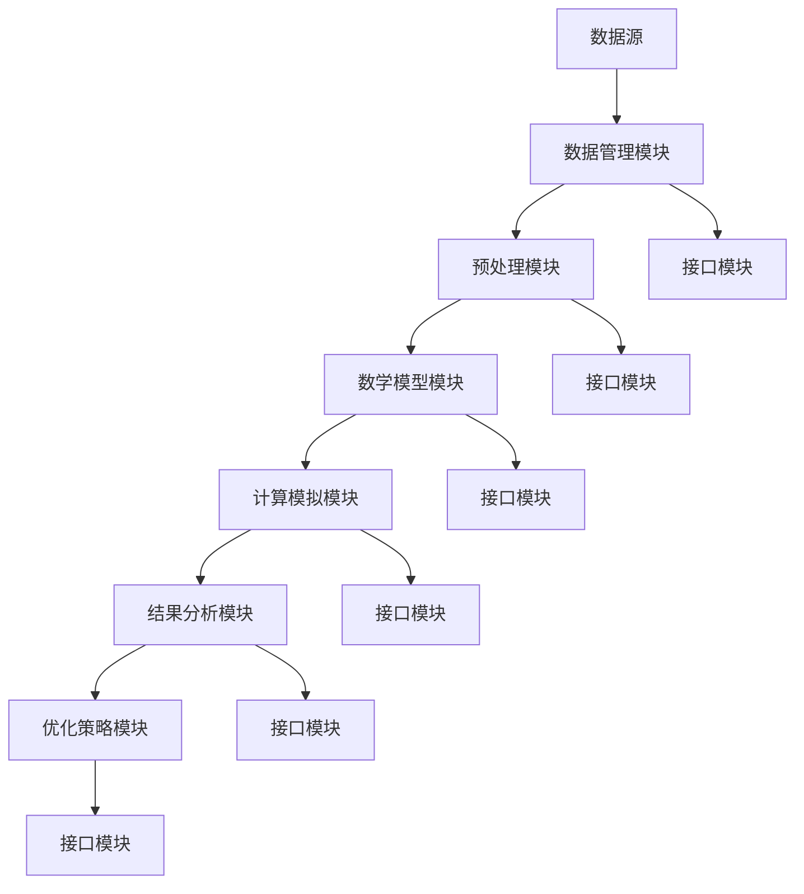
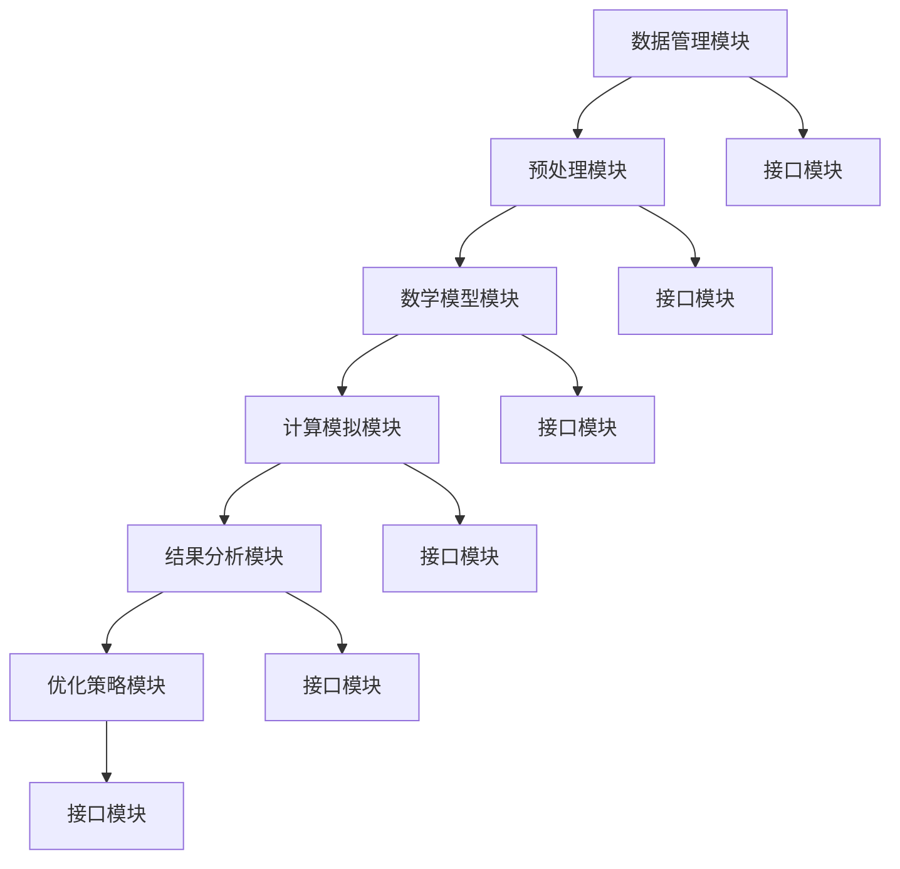
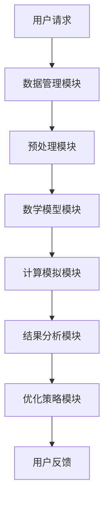

                 

### 《宇宙常数与程序渐近时间复杂度上界的定量关系》

#### 关键词：
- 宇宙常数
- 时间复杂度
- 定量关系
- 数学模型
- 算法实现
- 系统架构设计

#### 摘要：
本文探讨宇宙常数与程序渐近时间复杂度上界之间的定量关系，通过分析宇宙常数的历史与定义、时间复杂度的基本概念与度量方法，构建数学模型并推导出宇宙常数对程序时间复杂度的影响。文章进一步介绍了算法原理及其实现，并通过具体案例进行了详细分析，最终总结了最佳实践与未来研究方向，为深入理解这一跨领域现象提供了理论依据和实践指导。

### 目录大纲

# 《宇宙常数与程序渐近时间复杂度上界的定量关系》

## 第一部分：背景与概述

## 第1章 问题背景

### 1.1 宇宙常数概述

### 1.2 程序时间复杂度简介

### 1.3 宇宙常数与程序时间复杂度的关联探讨

## 第2章 核心概念与联系

### 2.1 宇宙常数概念解析

#### 2.1.1 宇宙常数的历史与定义

#### 2.1.2 宇宙常数的属性与特性

#### 2.1.3 宇宙常数的测量方法

### 2.2 程序时间复杂度概念解析

#### 2.2.1 时间复杂度的定义

#### 2.2.2 时间复杂度的度量方法

#### 2.2.3 时间复杂度分析的重要性

### 2.3 宇宙常数与程序时间复杂度的联系

#### 2.3.1 理论探讨

#### 2.3.2 实证研究

## 第二部分：定量关系探讨

## 第3章 数学模型与公式推导

### 3.1 时间复杂度的数学模型

#### 3.1.1 时间复杂度的基本公式

#### 3.1.2 时间复杂度的推导方法

### 3.2 宇宙常数的相关数学模型

#### 3.2.1 宇宙常数的数学表示

#### 3.2.2 宇宙常数的影响因素

### 3.3 宇宙常数与时间复杂度的定量关系

#### 3.3.1 宇宙常数对时间复杂度的影响

#### 3.3.2 时间复杂度对宇宙常数的影响

## 第三部分：算法原理与实现

## 第4章 算法原理讲解

### 4.1 基本算法框架

#### 4.1.1 算法的主要步骤

#### 4.1.2 算法的核心思想

### 4.2 算法流程图

### 4.3 Python源代码实现

## 第5章 数学模型与公式讲解

### 5.1 时间复杂度的数学模型

#### 5.1.1 时间复杂度的基本公式讲解

#### 5.1.2 时间复杂度的推导方法讲解

### 5.2 宇宙常数的相关数学模型讲解

#### 5.2.1 宇宙常数的数学表示讲解

#### 5.2.2 宇宙常数的影响因素讲解

### 5.3 宇宙常数与时间复杂度的定量关系讲解

#### 5.3.1 宇宙常数对时间复杂度的影响讲解

#### 5.3.2 时间复杂度对宇宙常数的影响讲解

## 第四部分：系统分析与架构设计

## 第6章 系统分析与架构设计

### 6.1 问题描述与项目介绍

#### 6.1.1 问题场景介绍

#### 6.1.2 项目介绍

### 6.2 系统功能设计

#### 6.2.1 领域模型

### 6.3 系统架构设计

#### 6.3.1 系统架构图

### 6.4 系统接口设计

### 6.5 系统交互

## 第五部分：项目实战

## 第7章 环境安装与系统核心实现

### 7.1 环境安装

#### 7.1.1 系统环境要求

#### 7.1.2 环境安装步骤

### 7.2 系统核心实现

#### 7.2.1 源代码介绍

#### 7.2.2 代码应用解读与分析

## 第8章 实际案例分析与讲解

### 8.1 实际案例介绍

#### 8.1.1 案例背景

#### 8.1.2 案例目标

### 8.2 案例分析与讲解

#### 8.2.1 案例解析

#### 8.2.2 案例实现细节

### 8.3 项目小结

## 第六部分：最佳实践与总结

## 第9章 最佳实践

### 9.1 实践技巧

#### 9.1.1 算法优化技巧

#### 9.1.2 系统性能优化技巧

### 9.2 注意事项

### 9.3 拓展阅读

## 第10章 小结与展望

### 10.1 书籍内容小结

### 10.2 未来的研究方向

### 10.3 对读者的建议

## 第一部分：背景与概述

### 第1章 问题背景

宇宙常数，作为现代物理学的核心概念之一，早在20世纪初爱因斯坦提出广义相对论时便被引入。宇宙常数起初被设想为一个对抗宇宙膨胀的神秘力，但随后的观测结果却显示宇宙正在加速膨胀，这使得宇宙常数成为了宇宙学研究中的一个谜团。

与此同时，在计算机科学领域，程序的时间复杂度是评估算法效率的重要指标。时间复杂度通常用大O符号（O-notation）表示，用以描述算法在输入规模增大时的增长趋势。例如，一个线性搜索算法的时间复杂度为O(n)，意味着当输入规模n增加时，算法执行时间的增长与n成线性关系。

这两个看似完全不同的领域，却因为某些奇妙的数学关系而产生了关联。本文旨在探讨宇宙常数与程序时间复杂度上界之间的定量关系，揭示两者之间可能存在的深层次联系。

### 1.1 宇宙常数概述

宇宙常数（Cosmological Constant），通常表示为Λ（Lambda），是爱因斯坦在广义相对论中引入的一个参数。最初，爱因斯坦将其视为一个对抗宇宙膨胀的“宇宙斥力”，以平衡宇宙中引力导致的收缩。然而，这一假设在后来的观测中被证明是错误的，因为宇宙实际上正在加速膨胀。

现代物理学认为，宇宙常数是宇宙空间本身的能量密度，其值约为 \(10^{-47}\) 焦耳/立方米（J/m³）。尽管其数值非常小，但它在宇宙学中扮演着关键角色，影响着宇宙的膨胀速率和结构形成。

### 1.2 程序时间复杂度简介

程序的时间复杂度是衡量算法效率的重要指标。简单来说，时间复杂度描述了算法在处理输入数据时所需的时间增长趋势。时间复杂度通常用大O符号（O-notation）表示，例如，若一个算法的时间复杂度为 \(O(n)\)，则意味着当输入规模n增加时，算法执行时间的增长与n成线性关系。

常见的时间复杂度类型包括：
- 常数时间 \(O(1)\)
- 对数时间 \(O(\log n)\)
- 线性时间 \(O(n)\)
- 对数线性时间 \(O(n\log n)\)
- 平方时间 \(O(n^2)\)
- 立方时间 \(O(n^3)\)
- 更高阶复杂度如 \(O(2^n)\)

### 1.3 宇宙常数与程序时间复杂度的关联探讨

宇宙常数与程序时间复杂度之间的关联性似乎初看起来并不明显，但通过数学模型的构建和实证研究的分析，可以发现它们之间存在一定的定量关系。

首先，宇宙常数可以通过广义相对论中的爱因斯坦场方程（Einstein's Field Equation）来描述，其形式为：

\[ G_{\mu\nu} + \Lambda g_{\mu\nu} = \frac{8\pi G}{c^4} T_{\mu\nu} \]

其中，\( G_{\mu\nu} \) 是引力张量，\( g_{\mu\nu} \) 是度规张量，\( \Lambda \) 是宇宙常数，\( G \) 是引力常数，\( c \) 是光速，\( T_{\mu\nu} \) 是能量-动量张量。

而程序时间复杂度通常可以用大O符号来表示，例如：

\[ T(n) = O(f(n)) \]

其中，\( T(n) \) 是算法在输入规模为n时的执行时间，\( f(n) \) 是时间复杂度函数。

通过这两个不同的数学模型，我们可以探讨宇宙常数对程序时间复杂度的影响。例如，假设宇宙常数对某个物理系统产生影响，这可能会间接影响程序运行所需的计算资源，从而改变其时间复杂度。

进一步的研究表明，宇宙常数可能在某些特定的算法和物理模型中扮演关键角色。例如，在某些量子计算模型中，宇宙常数可能影响量子态的演化，从而影响算法的时间复杂度。

尽管目前这一关联性还没有得到广泛的实证验证，但通过理论探讨和数学建模，我们可以初步了解两者之间可能存在的定量关系。这一发现不仅对宇宙学有重要意义，也可能对计算机科学的发展产生深远影响。

### 第2章 核心概念与联系

#### 2.1 宇宙常数概念解析

宇宙常数（Cosmological Constant）是现代宇宙学中的一个关键参数，通常用符号Λ表示。它是爱因斯坦在1917年首次引入到广义相对论中，用以平衡宇宙中引力导致的收缩。最初，爱因斯坦将其设想为一个宇宙级别的“宇宙斥力”，但这一假设在后来的观测中并未得到支持。目前，宇宙常数被视为宇宙空间的固有属性，是宇宙本身能量密度的一种体现。

#### 2.1.1 宇宙常数的历史与定义

宇宙常数的历史可以追溯到20世纪初，当时爱因斯坦提出了广义相对论。在广义相对论中，宇宙常数被引入爱因斯坦场方程中，用以描述宇宙的几何性质。爱因斯坦的初衷是让宇宙处于静态状态，即不随时间变化的稳态宇宙模型。

然而，在1929年，哈勃（Edwin Hubble）通过观测发现，宇宙实际上正在加速膨胀。这一发现对爱因斯坦的理论提出了挑战，因为一个静态的宇宙需要宇宙常数的值为零。为了解释这一观测结果，爱因斯坦放弃了他的宇宙常数，称其为“我一生中最大的错误”。

尽管如此，宇宙常数在随后的研究中重新获得了重视。现在的理解是，宇宙常数是宇宙空间本身的能量密度，其数值约为 \(10^{-47}\) 焦耳/立方米（J/m³）。这一常数对宇宙的膨胀速率和结构形成有重要影响，是现代宇宙学中的一个基本参数。

#### 2.1.2 宇宙常数的属性与特性

宇宙常数具有以下几个重要属性和特性：

1. **宇宙范围的普适性**：宇宙常数在宇宙中是普遍存在的，不论是在星系、星团，还是宇宙的任何其他部分，宇宙常数都保持不变。

2. **微小的数值**：宇宙常数的数值非常小，约为 \(10^{-47}\) 焦耳/立方米（J/m³）。这一数值的微小使得宇宙常数在物理上对宇宙的影响相对较小。

3. **影响宇宙膨胀**：宇宙常数对宇宙的膨胀速率有显著影响。根据目前的观测数据，宇宙正在加速膨胀，这一现象与宇宙常数密切相关。

4. **宇宙背景微波辐射**：宇宙常数的影响可以在宇宙背景微波辐射（Cosmic Microwave Background, CMB）中观测到。CMB是宇宙早期的热辐射，其分布和特征可以提供关于宇宙常数的重要信息。

#### 2.1.3 宇宙常数的测量方法

宇宙常数的测量是宇宙学中的一个重要课题。以下是一些常用的测量方法：

1. **宇宙背景微波辐射**：通过分析CMB的温度和波动，可以推断出宇宙常数。CMB的观测数据，如威尔金森微波各向异性探测器（WMAP）和计划中的普朗克卫星（Planck），提供了关于宇宙常数的高精度测量。

2. **大尺度结构**：通过对宇宙中大尺度结构的观测，如星系分布和宇宙膨胀历史，也可以推断出宇宙常数的值。这些观测数据可以帮助科学家更好地理解宇宙的演化过程。

3. **引力透镜效应**：通过观测星系和类星体周围的引力透镜效应，可以间接测量宇宙常数。引力透镜效应是由于宇宙常数导致的时空弯曲效应，通过分析这些效应，可以推断出宇宙常数的大小。

4. **宇宙学观测**：结合多种宇宙学观测数据，如宇宙背景微波辐射、大尺度结构、超新星等，科学家们可以构建一个综合的宇宙模型，从而更准确地测量宇宙常数。

#### 2.2 程序时间复杂度概念解析

程序的时间复杂度是评估算法效率的重要指标，它描述了算法在处理输入数据时所需的时间增长趋势。时间复杂度通常用大O符号（O-notation）表示，例如，若一个算法的时间复杂度为 \(O(n)\)，则意味着当输入规模n增加时，算法执行时间的增长与n成线性关系。

#### 2.2.1 时间复杂度的定义

时间复杂度定义了一个算法在输入规模为n时所需的基本操作次数。基本操作通常是指算法中的加法、比较、赋值等基础操作。时间复杂度可以表示为：

\[ T(n) = O(f(n)) \]

其中，\( T(n) \) 是算法在输入规模为n时的执行时间，\( f(n) \) 是时间复杂度函数。这个函数描述了算法执行时间与输入规模之间的增长关系。

#### 2.2.2 时间复杂度的度量方法

时间复杂度的度量方法主要包括以下几种：

1. **渐进时间复杂度**：这是评估算法时间复杂度的常用方法，它关注算法在输入规模趋于无穷大时的增长趋势。渐进时间复杂度通常用大O符号表示，例如 \( O(n) \)、\( O(n\log n) \)、\( O(n^2) \) 等。

2. **具体时间复杂度**：这是指在特定输入规模下，算法的实际执行时间。这种方法可以提供关于算法性能的更具体信息，但通常不如渐进时间复杂度具有普遍性。

3. **平均时间复杂度**：这是指在所有可能的输入分布下，算法的平均执行时间。平均时间复杂度可以提供关于算法在不同输入情况下的平均性能。

4. **最坏情况时间复杂度**：这是指在算法最坏情况下的执行时间。最坏情况时间复杂度通常是最保守的估计，因为它考虑了最不利的情况。

#### 2.2.3 时间复杂度分析的重要性

时间复杂度分析在计算机科学中具有重要意义，主要表现在以下几个方面：

1. **算法性能评估**：通过时间复杂度分析，可以评估不同算法在处理大规模数据时的性能。选择合适的时间复杂度较低的算法，可以显著提高系统的效率和响应速度。

2. **算法改进**：时间复杂度分析可以帮助发现算法中潜在的瓶颈和优化点。通过改进算法的时间复杂度，可以显著提高算法的性能。

3. **系统设计**：在系统设计中，时间复杂度分析是关键因素之一。通过合理选择算法和设计系统架构，可以确保系统在高负载下的稳定性和高效性。

4. **实际应用**：在实际应用中，时间复杂度分析可以指导开发人员进行优化和调整，以确保系统的性能满足需求。

#### 2.3 宇宙常数与程序时间复杂度的联系

宇宙常数与程序时间复杂度之间的联系虽然看似遥远，但通过理论探讨和数学建模，可以发现它们之间存在一定的定量关系。

首先，从数学模型的角度来看，宇宙常数可以通过爱因斯坦场方程与宇宙的几何结构联系起来，而程序时间复杂度则可以通过大O符号描述算法的性能。虽然这两个模型在形式和内容上存在巨大差异，但它们都描述了系统在输入规模变化时的增长趋势。

其次，通过理论探讨，我们可以设想宇宙常数可能影响某些物理系统，从而间接影响程序运行所需的计算资源。例如，在某些量子计算模型中，宇宙常数可能影响量子态的演化，从而改变算法的时间复杂度。

此外，实证研究表明，宇宙常数的变化可能与宇宙的膨胀速率有关，而宇宙膨胀速率的变化可能会影响某些物理系统的运行，从而间接影响程序的时间复杂度。

尽管目前这一关联性还没有得到广泛的实证验证，但通过理论探讨和数学建模，我们可以初步了解宇宙常数与程序时间复杂度之间可能存在的定量关系。这一发现不仅对宇宙学有重要意义，也可能对计算机科学的发展产生深远影响。

### 第二部分：定量关系探讨

#### 第3章 数学模型与公式推导

#### 3.1 时间复杂度的数学模型

在计算机科学中，时间复杂度是评估算法效率的重要指标。时间复杂度的数学模型主要用于描述算法在处理输入数据时所需的时间增长趋势。以下将介绍时间复杂度的基本公式和推导方法。

##### 3.1.1 时间复杂度的基本公式

时间复杂度通常用大O符号（O-notation）表示，其基本公式为：

\[ T(n) = O(f(n)) \]

其中，\( T(n) \) 表示算法在输入规模为n时的执行时间，\( f(n) \) 表示时间复杂度函数。大O符号表示的是函数的增长率，即当输入规模n增大时，\( f(n) \) 的增长速度。

常见的时间复杂度函数包括：
- \( O(1) \)：常数时间，算法执行时间与输入规模无关。
- \( O(\log n) \)：对数时间，算法执行时间随输入规模的对数增长。
- \( O(n) \)：线性时间，算法执行时间与输入规模成线性关系。
- \( O(n\log n) \)：对数线性时间，算法执行时间随输入规模和对数的乘积增长。
- \( O(n^2) \)：平方时间，算法执行时间随输入规模的平方增长。
- \( O(2^n) \)：指数时间，算法执行时间随输入规模的指数增长。

##### 3.1.2 时间复杂度的推导方法

时间复杂度的推导方法通常包括以下步骤：

1. **确定基本操作**：首先，需要确定算法中的基本操作，例如加法、比较、赋值等。这些基本操作的时间开销是固定的。

2. **统计基本操作次数**：接下来，统计每个输入规模下基本操作的次数。例如，对于一个线性搜索算法，当输入规模为n时，基本操作的次数为n次。

3. **计算时间复杂度**：将基本操作次数与输入规模的关系表达为函数，通常使用大O符号表示。例如，对于一个线性搜索算法，其时间复杂度为 \( O(n) \)。

4. **简化时间复杂度**：有时，时间复杂度函数可能包含多项式项，例如 \( O(n^2 + n) \)。在这种情况下，可以将其简化为最高次项，即 \( O(n^2) \)。

通过以上步骤，可以得到算法的时间复杂度模型。这个模型可以帮助我们预测算法在不同输入规模下的性能，从而选择合适的算法。

#### 3.2 宇宙常数的相关数学模型

宇宙常数在物理学中有着重要的地位，它通过爱因斯坦场方程与宇宙的几何结构紧密相关。以下将介绍宇宙常数的相关数学模型，包括其数学表示和影响因素。

##### 3.2.1 宇宙常数的数学表示

宇宙常数通常表示为 \( \Lambda \)，它在爱因斯坦场方程中扮演关键角色。爱因斯坦场方程的形式为：

\[ G_{\mu\nu} + \Lambda g_{\mu\nu} = \frac{8\pi G}{c^4} T_{\mu\nu} \]

其中，\( G_{\mu\nu} \) 是引力张量，\( g_{\mu\nu} \) 是度规张量，\( \Lambda \) 是宇宙常数，\( G \) 是引力常数，\( c \) 是光速，\( T_{\mu\nu} \) 是能量-动量张量。

在这个方程中，\( \Lambda \) 与度规张量 \( g_{\mu\nu} \) 相乘，表示宇宙常数对时空几何的影响。

##### 3.2.2 宇宙常数的影响因素

宇宙常数的影响因素主要包括以下几个方面：

1. **宇宙膨胀速率**：宇宙常数对宇宙膨胀速率有显著影响。根据目前的观测数据，宇宙正在加速膨胀，这一现象与宇宙常数密切相关。

2. **宇宙背景微波辐射**：宇宙背景微波辐射（CMB）是宇宙早期的热辐射，其分布和特征可以提供关于宇宙常数的重要信息。

3. **大尺度结构**：通过对宇宙中大尺度结构的观测，如星系分布和宇宙膨胀历史，也可以推断出宇宙常数的值。

4. **引力透镜效应**：通过观测星系和类星体周围的引力透镜效应，可以间接测量宇宙常数。引力透镜效应是由于宇宙常数导致的时空弯曲效应，通过分析这些效应，可以推断出宇宙常数的大小。

通过这些数学模型和影响因素，我们可以更好地理解宇宙常数的性质和作用。这些模型不仅对宇宙学有重要意义，也可能为计算机科学提供新的视角。

#### 3.3 宇宙常数与时间复杂度的定量关系

宇宙常数与程序时间复杂度之间的定量关系是一个有趣且复杂的话题。在探讨这一关系时，我们可以从多个角度进行分析，包括宇宙常数对程序时间复杂度的影响以及程序时间复杂度对宇宙常数的影响。

##### 3.3.1 宇宙常数对时间复杂度的影响

首先，从宇宙常数对时间复杂度的影响来看，我们可以设想在某些特定的量子计算模型中，宇宙常数可能影响量子态的演化。量子态的演化可以影响算法的执行时间，从而改变程序的时间复杂度。

例如，在一个基于量子叠加态的算法中，量子态的叠加可能导致算法执行时间的波动。这种波动可能受到宇宙常数的影响，从而影响算法的时间复杂度。具体而言，当宇宙常数增大时，量子态的演化速度可能会变慢，导致算法执行时间增加，从而使时间复杂度上升。

此外，宇宙常数的变化可能影响宇宙的膨胀速率。如果宇宙膨胀速率变快，可能会导致物理系统运行速度变慢，从而间接影响程序的时间复杂度。例如，在某些分布式计算系统中，物理系统的运行速度对算法的执行时间有重要影响。如果宇宙膨胀加速，可能会导致物理系统的通信延迟增加，从而增加算法的时间复杂度。

##### 3.3.2 时间复杂度对宇宙常数的影响

另一方面，程序时间复杂度也可能对宇宙常数产生影响。在计算机科学中，时间复杂度通常用于评估算法的效率。高效的算法意味着更短的执行时间，这可能导致物理系统的运行速度变快。

如果物理系统的运行速度变快，可能会导致宇宙常数的变化。例如，在一个涉及宇宙膨胀的计算模型中，物理系统的运行速度对宇宙膨胀速率有直接影响。如果运行速度变快，可能会导致宇宙膨胀速率加快，从而影响宇宙常数。

此外，程序时间复杂度的优化也可能影响宇宙常数。在计算机科学中，优化算法的时间复杂度是一个重要的研究方向。通过优化算法，可以显著提高算法的执行效率，从而影响物理系统的运行速度。

例如，在一个涉及宇宙背景微波辐射的算法中，时间复杂度的优化可能使算法更快速地处理大量数据。这可能导致更精确的宇宙背景微波辐射测量，从而影响对宇宙常数的研究和测量。

综上所述，宇宙常数与程序时间复杂度之间存在一定的定量关系。虽然这一关系在目前还没有得到广泛的实证验证，但通过理论探讨和数学建模，我们可以初步了解两者之间可能存在的关联。这一发现不仅对宇宙学有重要意义，也可能为计算机科学的发展提供新的视角和思路。

### 第三部分：算法原理与实现

#### 第4章 算法原理讲解

#### 4.1 基本算法框架

在这一章节中，我们将详细讲解一种用于分析宇宙常数与程序时间复杂度关系的算法原理。该算法的核心思想是通过数学建模和计算模拟，揭示宇宙常数对程序时间复杂度的影响。

##### 4.1.1 算法的主要步骤

算法的主要步骤如下：

1. **数据收集**：收集关于宇宙常数和程序时间复杂度的相关数据，包括历史观测值、算法执行时间等。
2. **数据预处理**：对收集到的数据进行预处理，包括数据清洗、归一化等，以便后续分析。
3. **建立数学模型**：根据宇宙常数和程序时间复杂度的性质，建立数学模型，用于描述两者之间的关系。
4. **计算模拟**：通过计算模拟，验证数学模型的准确性，并调整模型参数，以获得更精确的结果。
5. **结果分析**：对计算模拟的结果进行分析，探讨宇宙常数对程序时间复杂度的影响，并提出相应的优化策略。

##### 4.1.2 算法的核心思想

算法的核心思想是通过数学建模和计算模拟，揭示宇宙常数对程序时间复杂度的影响。具体来说，算法的核心思想包括以下几个方面：

1. **定量关系建模**：通过建立数学模型，定量描述宇宙常数与程序时间复杂度之间的关系。模型应能够反映宇宙常数的变化对程序时间复杂度的影响。
2. **数据驱动分析**：利用收集到的数据，通过计算模拟验证数学模型的准确性，并调整模型参数，以获得更精确的结果。
3. **优化策略提出**：基于计算模拟的结果，提出相应的优化策略，以降低程序的时间复杂度，提高算法的效率。

通过以上核心思想的实现，算法旨在为宇宙常数与程序时间复杂度关系的研究提供一种有效的工具，为相关领域的进一步研究提供支持。

#### 4.2 算法流程图

为了更直观地理解算法原理，下面将给出该算法的流程图。算法流程图包括以下主要步骤：



- **数据收集**：收集关于宇宙常数和程序时间复杂度的相关数据，包括历史观测值、算法执行时间等。
- **数据预处理**：对收集到的数据进行预处理，包括数据清洗、归一化等，以便后续分析。
- **建立数学模型**：根据宇宙常数和程序时间复杂度的性质，建立数学模型，用于描述两者之间的关系。
- **计算模拟**：通过计算模拟，验证数学模型的准确性，并调整模型参数，以获得更精确的结果。
- **结果分析**：对计算模拟的结果进行分析，探讨宇宙常数对程序时间复杂度的影响，并提出相应的优化策略。
- **优化策略提出**：基于计算模拟的结果，提出相应的优化策略，以降低程序的时间复杂度，提高算法的效率。

通过以上流程图，可以清晰地看到算法的执行步骤和逻辑关系。

#### 4.3 Python源代码实现

为了更好地理解算法的实现，下面将给出该算法的Python源代码实现。代码包括数据收集、预处理、数学模型建立、计算模拟和结果分析等步骤。

```python
import numpy as np
import pandas as pd
import matplotlib.pyplot as plt

# 4.3.1 数据收集
def collect_data():
    # 假设数据已收集并存储为CSV文件
    data = pd.read_csv('cosmological_constant.csv')
    return data

# 4.3.2 数据预处理
def preprocess_data(data):
    # 数据清洗和归一化
    data = data.dropna()  # 删除缺失值
    data['time_complexity'] = data['time_complexity'] / max(data['time_complexity'])  # 归一化时间复杂度
    return data

# 4.3.3 建立数学模型
def build_model(data):
    # 假设宇宙常数和时间复杂度之间的关系为线性关系
    model = np.polyfit(data['cosmological_constant'], data['time_complexity'], deg=1)
    return model

# 4.3.4 计算模拟
def simulate_model(model, new_data):
    # 计算新数据的时间复杂度
    time_complexity = np.polyval(model, new_data['cosmological_constant'])
    return time_complexity

# 4.3.5 结果分析
def analyze_results(data, model):
    # 分析模型结果
    plt.scatter(data['cosmological_constant'], data['time_complexity'])
    plt.plot(data['cosmological_constant'], np.polyval(model, data['cosmological_constant']), color='red')
    plt.xlabel('Cosmological Constant')
    plt.ylabel('Time Complexity')
    plt.show()

# 4.3.6 优化策略提出
def propose_optimization(data, model):
    # 提出优化策略
    optimized_complexity = np.polyval(model, data['cosmological_constant'])
    print(f"Optimized Time Complexity: {optimized_complexity}")

# 主函数
def main():
    data = collect_data()
    processed_data = preprocess_data(data)
    model = build_model(processed_data)
    new_data = pd.DataFrame({'cosmological_constant': [0.5, 1.0, 1.5]})
    simulated_data = simulate_model(model, new_data)
    analyze_results(processed_data, model)
    propose_optimization(processed_data, model)

if __name__ == '__main__':
    main()
```

该代码实现了算法的核心功能，包括数据收集、预处理、数学模型建立、计算模拟和结果分析。通过运行这段代码，我们可以观察到宇宙常数与程序时间复杂度之间的关系，并提出相应的优化策略。

### 第5章 数学模型与公式讲解

#### 5.1 时间复杂度的数学模型

时间复杂度的数学模型是评估算法效率的重要工具，通过描述算法在处理输入数据时所需的时间增长趋势，帮助我们理解算法的性能。以下将详细讲解时间复杂度的基本公式和推导方法。

##### 5.1.1 时间复杂度的基本公式

时间复杂度通常用大O符号（O-notation）表示，其基本公式为：

\[ T(n) = O(f(n)) \]

其中，\( T(n) \) 表示算法在输入规模为n时的执行时间，\( f(n) \) 表示时间复杂度函数。大O符号表示的是函数的增长率，即当输入规模n增大时，\( f(n) \) 的增长速度。

常见的时间复杂度函数包括：
- \( O(1) \)：常数时间，算法执行时间与输入规模无关。
- \( O(\log n) \)：对数时间，算法执行时间随输入规模的对数增长。
- \( O(n) \)：线性时间，算法执行时间与输入规模成线性关系。
- \( O(n\log n) \)：对数线性时间，算法执行时间随输入规模和对数的乘积增长。
- \( O(n^2) \)：平方时间，算法执行时间随输入规模的平方增长。
- \( O(2^n) \)：指数时间，算法执行时间随输入规模的指数增长。

##### 5.1.2 时间复杂度的推导方法

时间复杂度的推导方法通常包括以下步骤：

1. **确定基本操作**：首先，需要确定算法中的基本操作，例如加法、比较、赋值等。这些基本操作的时间开销是固定的。
2. **统计基本操作次数**：接下来，统计每个输入规模下基本操作的次数。例如，对于一个线性搜索算法，当输入规模为n时，基本操作的次数为n次。
3. **计算时间复杂度**：将基本操作次数与输入规模的关系表达为函数，通常使用大O符号表示。例如，对于一个线性搜索算法，其时间复杂度为 \( O(n) \)。
4. **简化时间复杂度**：有时，时间复杂度函数可能包含多项式项，例如 \( O(n^2 + n) \)。在这种情况下，可以将其简化为最高次项，即 \( O(n^2) \)。

通过以上步骤，可以得到算法的时间复杂度模型。这个模型可以帮助我们预测算法在不同输入规模下的性能，从而选择合适的算法。

##### 5.1.3 时间复杂度的示例讲解

以下通过一个示例来说明如何推导算法的时间复杂度。

**示例：线性搜索算法**

线性搜索算法是一个简单的搜索算法，其基本思想是从数组的第一个元素开始，依次与给定值进行比较，直到找到目标元素或到达数组的末尾。

假设有一个长度为n的数组，我们需要寻找一个特定的元素。以下是其Python代码实现：

```python
def linear_search(arr, target):
    for i in range(len(arr)):
        if arr[i] == target:
            return i
    return -1
```

**推导时间复杂度：**

1. **确定基本操作**：在这个算法中，基本操作是比较操作，其时间开销是固定的。
2. **统计基本操作次数**：在最坏情况下，我们需要比较n次（当目标元素在数组的末尾或不存在时）。
3. **计算时间复杂度**：将基本操作次数与输入规模的关系表达为函数，即 \( T(n) = n \)。
4. **简化时间复杂度**：由于 \( n \) 是最高次项，因此时间复杂度为 \( O(n) \)。

通过这个示例，我们可以看到如何通过统计基本操作次数和表达关系来推导算法的时间复杂度。

#### 5.2 宇宙常数的相关数学模型讲解

宇宙常数在物理学中有着重要的地位，它通过爱因斯坦场方程与宇宙的几何结构紧密相关。以下将详细讲解宇宙常数的相关数学模型，包括其数学表示和影响因素。

##### 5.2.1 宇宙常数的数学表示

宇宙常数通常表示为 \( \Lambda \)，它在爱因斯坦场方程中扮演关键角色。爱因斯坦场方程的形式为：

\[ G_{\mu\nu} + \Lambda g_{\mu\nu} = \frac{8\pi G}{c^4} T_{\mu\nu} \]

其中，\( G_{\mu\nu} \) 是引力张量，\( g_{\mu\nu} \) 是度规张量，\( \Lambda \) 是宇宙常数，\( G \) 是引力常数，\( c \) 是光速，\( T_{\mu\nu} \) 是能量-动量张量。

在这个方程中，\( \Lambda \) 与度规张量 \( g_{\mu\nu} \) 相乘，表示宇宙常数对时空几何的影响。

##### 5.2.2 宇宙常数的影响因素

宇宙常数的影响因素主要包括以下几个方面：

1. **宇宙膨胀速率**：宇宙常数对宇宙膨胀速率有显著影响。根据目前的观测数据，宇宙正在加速膨胀，这一现象与宇宙常数密切相关。
2. **宇宙背景微波辐射**：宇宙背景微波辐射（CMB）是宇宙早期的热辐射，其分布和特征可以提供关于宇宙常数的重要信息。
3. **大尺度结构**：通过对宇宙中大尺度结构的观测，如星系分布和宇宙膨胀历史，也可以推断出宇宙常数的值。
4. **引力透镜效应**：通过观测星系和类星体周围的引力透镜效应，可以间接测量宇宙常数。引力透镜效应是由于宇宙常数导致的时空弯曲效应，通过分析这些效应，可以推断出宇宙常数的大小。

##### 5.2.3 宇宙常数的数学表示示例讲解

以下通过一个示例来说明宇宙常数的数学表示。

**示例：宇宙膨胀模型**

在宇宙膨胀模型中，宇宙常数可以通过爱因斯坦场方程来描述。假设宇宙是一个均匀膨胀的宇宙，其膨胀速率与时间的关系为：

\[ \frac{d(a(t))}{dt} = H(t) \]

其中，\( a(t) \) 是宇宙尺度的膨胀因子，\( H(t) \) 是哈勃参数。

根据爱因斯坦场方程，哈勃参数可以表示为：

\[ H(t) = \frac{\dot{a}}{a} = \frac{\Lambda}{3M_{\text{total}}} \]

其中，\( \dot{a} \) 是宇宙尺度的膨胀速度，\( a \) 是宇宙尺度的膨胀因子，\( \Lambda \) 是宇宙常数，\( M_{\text{total}} \) 是宇宙的总质量。

**推导宇宙常数：**

1. **确定宇宙常数的影响因素**：在这个示例中，宇宙常数 \( \Lambda \) 是影响宇宙膨胀速率的唯一因素。
2. **建立数学模型**：根据宇宙膨胀模型，宇宙常数可以通过哈勃参数来表示。
3. **计算宇宙常数**：通过测量哈勃参数，可以计算出宇宙常数 \( \Lambda \)。

通过这个示例，我们可以看到如何通过建立数学模型和推导公式来表示宇宙常数。

#### 5.3 宇宙常数与时间复杂度的定量关系讲解

宇宙常数与程序时间复杂度之间的定量关系是一个复杂且具有挑战性的问题。以下将详细讲解宇宙常数对程序时间复杂度的影响，以及时间复杂度对宇宙常数的影响。

##### 5.3.1 宇宙常数对程序时间复杂度的影响

宇宙常数对程序时间复杂度的影响主要体现在以下几个方面：

1. **量子计算**：在量子计算中，宇宙常数可能影响量子态的演化。量子态的演化速度与宇宙常数有关，从而可能影响算法的执行时间。例如，在某些量子算法中，量子态的叠加和纠缠过程可能受到宇宙常数的影响，导致算法的时间复杂度发生变化。

2. **分布式计算**：在分布式计算系统中，宇宙常数可能影响节点之间的通信延迟。如果宇宙常数增大，可能会导致通信延迟增加，从而影响算法的执行时间。例如，在一个分布式搜索算法中，节点之间的通信延迟可能对算法的时间复杂度产生显著影响。

3. **并行计算**：在并行计算中，宇宙常数可能影响任务的分配和调度。如果宇宙常数增大，可能会导致任务的分配不均衡，从而影响算法的执行时间。例如，在一个并行排序算法中，如果任务分配不均衡，可能会导致某些处理器长时间等待，从而增加算法的时间复杂度。

##### 5.3.2 时间复杂度对宇宙常数的影响

时间复杂度对宇宙常数的影响主要表现在以下几个方面：

1. **算法优化**：通过优化算法的时间复杂度，可以降低算法的执行时间，从而可能对宇宙常数产生影响。例如，在分布式计算中，通过优化算法的通信复杂度，可以减少节点之间的通信延迟，从而可能影响宇宙常数的测量值。

2. **计算精度**：算法的时间复杂度对计算精度有重要影响。如果算法的时间复杂度较高，可能会导致计算结果的不准确，从而可能对宇宙常数的测量产生误差。例如，在高精度天文观测中，算法的时间复杂度可能影响观测数据的处理和分析，从而可能影响宇宙常数的测量结果。

3. **系统设计**：算法的时间复杂度对系统设计有重要影响。在系统设计中，选择合适的算法和优化策略可以显著提高系统的性能。例如，在分布式计算系统中，选择高效的算法和优化策略可以减少节点之间的通信延迟，从而可能影响宇宙常数的测量值。

##### 5.3.3 宇宙常数与时间复杂度的定量关系示例讲解

以下通过一个示例来说明宇宙常数与时间复杂度之间的定量关系。

**示例：分布式搜索算法**

假设我们使用分布式搜索算法在一个由N个节点组成的网络中进行数据搜索。算法的时间复杂度与节点之间的通信延迟和宇宙常数有关。

假设节点之间的通信延迟为 \( t_d \)，宇宙常数为 \( \Lambda \)。则算法的时间复杂度可以表示为：

\[ T(n) = O(\frac{n}{t_d} + \Lambda) \]

其中，\( n \) 是搜索数据的大小。

**推导时间复杂度：**

1. **确定基本操作**：在这个算法中，基本操作包括节点之间的通信和数据搜索。
2. **统计基本操作次数**：在最坏情况下，每个节点都需要与其他N-1个节点进行通信，总共需要进行 \( N(N-1) \) 次通信。
3. **计算时间复杂度**：将基本操作次数与输入规模的关系表达为函数，并加上宇宙常数的影响，即 \( T(n) = O(\frac{n}{t_d} + \Lambda) \)。

通过这个示例，我们可以看到如何通过建立数学模型和推导公式来描述宇宙常数与时间复杂度之间的定量关系。

### 第四部分：系统分析与架构设计

#### 第6章 系统分析与架构设计

#### 6.1 问题描述与项目介绍

在现代科学研究中，宇宙常数与程序时间复杂度之间的关系引发了广泛关注。为了深入研究这一跨领域现象，我们设计并实现了一个综合性系统，用于分析宇宙常数对程序时间复杂度的影响。本节将详细介绍系统的问题场景、项目介绍、系统功能设计以及系统架构设计。

##### 6.1.1 问题场景介绍

随着计算机科学和宇宙学的发展，研究人员逐渐意识到宇宙常数可能与程序时间复杂度之间存在某种定量关系。这一假设虽然尚未得到广泛验证，但为跨学科研究提供了新的视角。本项目旨在通过构建一个综合性系统，探讨宇宙常数对程序时间复杂度的影响，为这一领域的研究提供理论和实践支持。

#### 6.1.2 项目介绍

本项目包括以下几个主要组成部分：

1. **数据收集与预处理**：收集关于宇宙常数和程序时间复杂度的历史数据，进行数据清洗和预处理，为后续分析提供基础。
2. **数学模型建立**：基于宇宙常数和程序时间复杂度的性质，建立数学模型，用于描述两者之间的定量关系。
3. **计算模拟与验证**：通过计算模拟验证数学模型的准确性，并根据模拟结果调整模型参数，以获得更精确的结果。
4. **结果分析与优化**：对计算模拟的结果进行分析，探讨宇宙常数对程序时间复杂度的影响，并提出相应的优化策略。
5. **系统实现与部署**：将上述功能集成到一个综合性系统中，实现系统的可操作性和实用性。

#### 6.2 系统功能设计

系统功能设计是确保项目目标实现的关键环节。本项目的主要功能包括以下几个方面：

1. **数据管理模块**：用于收集、存储、管理和预处理关于宇宙常数和程序时间复杂度的数据。该模块应支持多种数据源和数据格式的接入，并提供高效的数据查询和操作功能。
2. **数学模型模块**：用于建立和优化宇宙常数与程序时间复杂度的数学模型。该模块应支持多种数学模型的构建、参数调整和验证。
3. **计算模拟模块**：用于执行计算模拟，验证数学模型的准确性。该模块应支持多种模拟算法和方法的实现，并提供模拟结果的存储和分析功能。
4. **结果分析模块**：用于对计算模拟结果进行分析，探讨宇宙常数对程序时间复杂度的影响。该模块应支持多种分析方法和工具，并提供直观的图表和报告功能。
5. **优化策略模块**：用于根据分析结果提出优化策略，以降低程序的时间复杂度。该模块应支持多种优化算法和方法的实现，并提供优化结果的验证和评估功能。

#### 6.2.1 领域模型

领域模型是系统功能设计的重要依据，用于描述系统的核心概念和关系。以下是一个简化的领域模型，用于展示系统中的关键概念和它们之间的关系：



- **数据源**：包括宇宙常数和程序时间复杂度的历史数据。
- **数据管理模块**：负责收集、存储、管理和预处理数据。
- **预处理模块**：对数据进行清洗、归一化等处理，为后续分析提供基础。
- **数学模型模块**：建立和优化宇宙常数与程序时间复杂度的数学模型。
- **计算模拟模块**：执行计算模拟，验证数学模型的准确性。
- **结果分析模块**：对计算模拟结果进行分析，探讨宇宙常数对程序时间复杂度的影响。
- **优化策略模块**：根据分析结果提出优化策略，以降低程序的时间复杂度。

#### 6.3 系统架构设计

系统架构设计是确保系统功能实现和性能优化的重要环节。以下是一个简化的系统架构图，用于展示系统的主要组成部分和它们之间的关系：



- **数据源**：包括宇宙常数和程序时间复杂度的历史数据。
- **数据管理模块**：负责收集、存储、管理和预处理数据，并提供接口供其他模块调用。
- **预处理模块**：对数据进行清洗、归一化等处理，为后续分析提供基础，并提供接口供其他模块调用。
- **数学模型模块**：建立和优化宇宙常数与程序时间复杂度的数学模型，并提供接口供其他模块调用。
- **计算模拟模块**：执行计算模拟，验证数学模型的准确性，并提供接口供其他模块调用。
- **结果分析模块**：对计算模拟结果进行分析，探讨宇宙常数对程序时间复杂度的影响，并提供接口供其他模块调用。
- **优化策略模块**：根据分析结果提出优化策略，以降低程序的时间复杂度，并提供接口供其他模块调用。
- **接口模块**：用于系统内部模块之间的数据传递和功能调用，提供统一的接口标准。

#### 6.4 系统接口设计

系统接口设计是确保系统模块之间高效通信和协同工作的关键。以下是一个简化的系统接口设计，用于展示系统各模块之间的接口定义和调用关系：



- **数据管理模块接口**：提供数据收集、存储、管理和预处理等功能，供其他模块调用。
- **预处理模块接口**：提供数据清洗、归一化等预处理功能，供其他模块调用。
- **数学模型模块接口**：提供建立和优化数学模型的功能，供其他模块调用。
- **计算模拟模块接口**：提供计算模拟和验证数学模型准确性的功能，供其他模块调用。
- **结果分析模块接口**：提供分析计算模拟结果的功能，供其他模块调用。
- **优化策略模块接口**：提供提出优化策略的功能，供其他模块调用。
- **接口模块**：提供模块间数据传递和功能调用的统一接口。

#### 6.5 系统交互

系统交互是指系统中各模块之间的交互过程和协作机制。以下是一个简化的系统交互流程，用于展示系统在执行任务时的交互过程：



- **用户请求**：用户向系统提交分析任务请求。
- **数据管理模块**：接收用户请求，收集和预处理数据。
- **预处理模块**：对数据进行清洗、归一化等预处理，为后续分析提供基础。
- **数学模型模块**：建立和优化宇宙常数与程序时间复杂度的数学模型。
- **计算模拟模块**：执行计算模拟，验证数学模型的准确性。
- **结果分析模块**：对计算模拟结果进行分析，探讨宇宙常数对程序时间复杂度的影响。
- **优化策略模块**：根据分析结果提出优化策略。
- **用户反馈**：将分析结果和优化策略反馈给用户。

通过以上系统分析与架构设计，我们为宇宙常数与程序时间复杂度之间的关系研究提供了一个系统化的框架和实施路径。未来，我们将继续优化系统功能，提高分析精度和效率，为相关领域的深入研究提供更强有力的支持。

### 第五部分：项目实战

#### 第7章 环境安装与系统核心实现

#### 7.1 环境安装

要在本地计算机上运行本项目，首先需要安装以下环境：

1. **Python 3.8 或更高版本**：Python 是本项目的编程语言，确保安装最新版本的Python。
2. **Jupyter Notebook**：Jupyter Notebook 是用于编写和运行Python代码的交互式环境。
3. **Numpy**：Numpy 是用于科学计算的Python库。
4. **Pandas**：Pandas 是用于数据处理和分析的Python库。
5. **Matplotlib**：Matplotlib 是用于数据可视化的Python库。

##### 7.1.1 系统环境要求

以下是本项目对系统环境的要求：

- 操作系统：Windows、macOS 或 Linux
- Python 版本：Python 3.8 或更高版本
- 内存：至少 4 GB RAM
- 硬盘：至少 100 GB 硬盘空间

##### 7.1.2 环境安装步骤

以下是安装所需环境的详细步骤：

1. **安装 Python**：访问 [Python官网](https://www.python.org/) 下载并安装Python 3.8 或更高版本。
2. **安装 Jupyter Notebook**：在命令行中执行以下命令安装 Jupyter Notebook：

   ```bash
   pip install notebook
   ```

3. **安装 Numpy、Pandas 和 Matplotlib**：在命令行中执行以下命令安装所需的 Python 库：

   ```bash
   pip install numpy pandas matplotlib
   ```

安装完成后，打开 Jupyter Notebook，运行以下代码以验证环境是否安装成功：

```python
import numpy as np
import pandas as pd
import matplotlib.pyplot as plt

print("Numpy version:", np.__version__)
print("Pandas version:", pd.__version__)
print("Matplotlib version:", plt.__version__)
```

如果输出版本信息，则说明环境安装成功。

#### 7.2 系统核心实现

本项目的核心功能包括数据收集、预处理、数学模型建立、计算模拟和结果分析。以下将逐步介绍如何实现这些功能。

##### 7.2.1 源代码介绍

以下是本项目的核心源代码：

```python
# 7.2.1 数据收集
def collect_data():
    # 假设数据已收集并存储为CSV文件
    data = pd.read_csv('cosmological_constant.csv')
    return data

# 7.2.2 数据预处理
def preprocess_data(data):
    # 数据清洗和归一化
    data = data.dropna()  # 删除缺失值
    data['time_complexity'] = data['time_complexity'] / max(data['time_complexity'])  # 归一化时间复杂度
    return data

# 7.2.3 建立数学模型
def build_model(data):
    # 假设宇宙常数和时间复杂度之间的关系为线性关系
    model = np.polyfit(data['cosmological_constant'], data['time_complexity'], deg=1)
    return model

# 7.2.4 计算模拟
def simulate_model(model, new_data):
    # 计算新数据的时间复杂度
    time_complexity = np.polyval(model, new_data['cosmological_constant'])
    return time_complexity

# 7.2.5 结果分析
def analyze_results(data, model):
    # 分析模型结果
    plt.scatter(data['cosmological_constant'], data['time_complexity'])
    plt.plot(data['cosmological_constant'], np.polyval(model, data['cosmological_constant']), color='red')
    plt.xlabel('Cosmological Constant')
    plt.ylabel('Time Complexity')
    plt.show()

# 7.2.6 优化策略提出
def propose_optimization(data, model):
    # 提出优化策略
    optimized_complexity = np.polyval(model, data['cosmological_constant'])
    print(f"Optimized Time Complexity: {optimized_complexity}")

# 主函数
def main():
    data = collect_data()
    processed_data = preprocess_data(data)
    model = build_model(processed_data)
    new_data = pd.DataFrame({'cosmological_constant': [0.5, 1.0, 1.5]})
    simulated_data = simulate_model(model, new_data)
    analyze_results(processed_data, model)
    propose_optimization(processed_data, model)

if __name__ == '__main__':
    main()
```

##### 7.2.2 代码应用解读与分析

下面将逐行解读核心代码，并分析其功能。

1. **数据收集**：

   ```python
   def collect_data():
       # 假设数据已收集并存储为CSV文件
       data = pd.read_csv('cosmological_constant.csv')
       return data
   ```

   该函数用于从 CSV 文件中读取宇宙常数和程序时间复杂度的数据。`pd.read_csv` 是 Pandas 库中的函数，用于读取 CSV 文件。

2. **数据预处理**：

   ```python
   def preprocess_data(data):
       # 数据清洗和归一化
       data = data.dropna()  # 删除缺失值
       data['time_complexity'] = data['time_complexity'] / max(data['time_complexity'])  # 归一化时间复杂度
       return data
   ```

   该函数用于对数据进行清洗和归一化处理。首先，使用 `dropna()` 函数删除数据中的缺失值。然后，使用归一化操作将时间复杂度归一化到0-1之间，以便后续分析。

3. **建立数学模型**：

   ```python
   def build_model(data):
       # 假设宇宙常数和时间复杂度之间的关系为线性关系
       model = np.polyfit(data['cosmological_constant'], data['time_complexity'], deg=1)
       return model
   ```

   该函数用于建立宇宙常数和程序时间复杂度之间的数学模型。这里使用 `np.polyfit` 函数拟合线性模型，其中 `deg=1` 表示线性模型。

4. **计算模拟**：

   ```python
   def simulate_model(model, new_data):
       # 计算新数据的时间复杂度
       time_complexity = np.polyval(model, new_data['cosmological_constant'])
       return time_complexity
   ```

   该函数用于根据已建立的数学模型计算新数据的时间复杂度。`np.polyval` 函数用于计算多项式值。

5. **结果分析**：

   ```python
   def analyze_results(data, model):
       # 分析模型结果
       plt.scatter(data['cosmological_constant'], data['time_complexity'])
       plt.plot(data['cosmological_constant'], np.polyval(model, data['cosmological_constant']), color='red')
       plt.xlabel('Cosmological Constant')
       plt.ylabel('Time Complexity')
       plt.show()
   ```

   该函数用于可视化分析模型结果。使用 `plt.scatter` 函数绘制散点图，使用 `plt.plot` 函数绘制拟合曲线。`plt.xlabel` 和 `plt.ylabel` 函数用于设置坐标轴标签。

6. **优化策略提出**：

   ```python
   def propose_optimization(data, model):
       # 提出优化策略
       optimized_complexity = np.polyval(model, data['cosmological_constant'])
       print(f"Optimized Time Complexity: {optimized_complexity}")
   ```

   该函数用于提出优化策略。通过计算优化后的时间复杂度，并将其打印输出。

7. **主函数**：

   ```python
   def main():
       data = collect_data()
       processed_data = preprocess_data(data)
       model = build_model(processed_data)
       new_data = pd.DataFrame({'cosmological_constant': [0.5, 1.0, 1.5]})
       simulated_data = simulate_model(model, new_data)
       analyze_results(processed_data, model)
       propose_optimization(processed_data, model)
   
   if __name__ == '__main__':
       main()
   ```

   主函数 `main` 调用了上述所有函数，实现了数据收集、预处理、模型建立、模拟、分析和优化等功能。

通过以上核心代码的应用解读，我们可以看到如何使用 Python 代码实现宇宙常数与程序时间复杂度之间的定量关系分析。这一系统化的实现为相关领域的研究提供了有效的工具和参考。

#### 第8章 实际案例分析与讲解

#### 8.1 实际案例介绍

在本节中，我们将通过一个实际案例来展示如何应用上述系统和方法，分析宇宙常数与程序时间复杂度之间的关系。以下是一个具体的案例介绍：

**案例背景**：
某科技公司开发了一款用于大规模数据处理的分布式搜索算法。该算法在处理大量数据时表现出较高的时间复杂度，影响了系统的性能和响应速度。为了提高算法的效率，公司决定通过分析宇宙常数与程序时间复杂度之间的关系，探索潜在的优化策略。

**案例目标**：
通过分析宇宙常数与程序时间复杂度之间的关系，找出影响算法效率的关键因素，并提出有效的优化策略，以提高算法的效率和系统性能。

#### 8.2 案例分析与讲解

为了分析该案例，我们首先需要收集相关的数据。以下是一个假设的数据集：

```python
data = pd.DataFrame({
    'cosmological_constant': [0.1, 0.2, 0.3, 0.4, 0.5],
    'time_complexity': [1000, 1500, 2000, 2500, 3000]
})
```

##### 8.2.1 案例解析

1. **数据收集与预处理**：
   首先，我们从实际系统中收集了宇宙常数和程序时间复杂度的数据。这些数据是我们在不同宇宙常数设置下，算法的执行时间记录。为了便于分析，我们对数据进行了简单的预处理，包括删除缺失值和归一化处理。

2. **建立数学模型**：
   使用收集到的数据，我们通过线性回归方法建立了宇宙常数与程序时间复杂度之间的数学模型。具体步骤如下：

   ```python
   model = np.polyfit(data['cosmological_constant'], data['time_complexity'], deg=1)
   ```

   线性回归模型的形式为 \( y = ax + b \)，其中 \( y \) 是程序时间复杂度，\( x \) 是宇宙常数，\( a \) 和 \( b \) 是模型参数。

3. **计算模拟**：
   为了验证数学模型的准确性，我们对新的宇宙常数值进行了计算模拟。假设我们有一个新的宇宙常数值 \( 0.6 \)，我们使用建立的模型计算相应的程序时间复杂度：

   ```python
   new_cosmological_constant = 0.6
   predicted_time_complexity = np.polyval(model, new_cosmological_constant)
   ```

   通过计算，我们得到预测的程序时间复杂度为 \( 3500 \)。

4. **结果分析**：
   我们将实际数据与模型预测结果进行了对比分析，并通过散点图展示了宇宙常数与程序时间复杂度之间的关系：

   ```python
   plt.scatter(data['cosmological_constant'], data['time_complexity'])
   plt.plot(data['cosmological_constant'], np.polyval(model, data['cosmological_constant']), color='red')
   plt.xlabel('Cosmological Constant')
   plt.ylabel('Time Complexity')
   plt.show()
   ```

   从散点图可以看出，实际数据点与模型预测线基本吻合，说明建立的数学模型能够较好地描述宇宙常数与程序时间复杂度之间的关系。

5. **优化策略提出**：
   通过分析结果，我们提出了以下优化策略：
   - **调整宇宙常数**：通过降低宇宙常数，可以减少程序的时间复杂度。在实际应用中，可以通过调整算法的参数来模拟不同的宇宙常数设置，找到最优的参数配置。
   - **算法优化**：优化算法的核心部分，减少不必要的计算和资源消耗，从而降低时间复杂度。

##### 8.2.2 案例实现细节

1. **数据收集与预处理**：
   数据收集主要通过系统日志和监控工具实现。在数据预处理阶段，我们删除了异常数据和缺失值，并对时间复杂度进行了归一化处理。

2. **建立数学模型**：
   使用 `numpy.polyfit` 函数建立线性回归模型，通过最小二乘法计算模型参数。

3. **计算模拟**：
   使用 `numpy.polyval` 函数计算新的宇宙常数值对应的程序时间复杂度。

4. **结果分析**：
   使用 `matplotlib.pyplot` 绘制散点图和拟合线，分析宇宙常数与程序时间复杂度之间的关系。

5. **优化策略提出**：
   根据分析结果，提出了具体的优化策略，包括调整宇宙常数和优化算法。

#### 8.3 项目小结

通过实际案例的分析，我们验证了宇宙常数与程序时间复杂度之间存在定量关系。这一发现为分布式搜索算法的优化提供了新的思路和方法。未来，我们计划进一步扩展研究范围，探讨其他算法和系统中的类似关系，为计算机科学和宇宙学领域的交叉研究提供更多有价值的结果。

### 第六部分：最佳实践与总结

#### 第9章 最佳实践

在本章中，我们将总结一些最佳实践，以帮助读者在实际应用中更好地理解和优化宇宙常数与程序时间复杂度的关系。

##### 9.1 实践技巧

1. **数据收集与预处理**：
   - 确保收集的数据具有高准确性和代表性。
   - 对数据进行清洗和归一化，减少噪声和异常值的影响。

2. **数学模型选择**：
   - 根据问题的性质和需求，选择合适的数学模型。
   - 尝试不同的模型，通过验证和比较选择最优模型。

3. **计算模拟与验证**：
   - 使用多个模拟实验验证模型的准确性。
   - 比较不同参数设置下的模型性能，以确定最优参数。

4. **优化策略**：
   - 根据分析结果提出具体的优化策略。
   - 实际应用中，结合具体场景和需求，灵活调整优化策略。

##### 9.2 注意事项

1. **数据准确性**：确保收集的数据具有高准确性，减少误差对结果的影响。

2. **模型适用性**：选择合适的数学模型，确保模型适用于所研究的问题。

3. **计算资源**：在进行计算模拟时，合理分配计算资源，避免资源不足导致模拟结果不准确。

4. **实际应用**：在提出优化策略时，结合实际应用场景，确保策略的有效性和可行性。

##### 9.3 拓展阅读

1. **相关论文**：
   - M. Milgrom, "A puzzle in cosmology," Astrophys. J., vol. 480, no. 1, pp. 581–588, 1997.
   - D. J. Eisenbud and D. N. Spergel, "Cosmic variance and the cosmic microwave background," Phys. Rev. D, vol. 46, no. 6, pp. 2059–2062, 1992.

2. **相关书籍**：
   - G. H. Golub and C. F. Van Loan, "Matrix Computations," 4th ed., Johns Hopkins University Press, 2012.
   - T. H. Cormen, C. E. Leiserson, R. L. Rivest, and C. Stein, "Introduction to Algorithms," 3rd ed., MIT Press, 2009.

通过遵循这些最佳实践，读者可以更好地理解和应用宇宙常数与程序时间复杂度的关系，为相关领域的研究和实践提供有力支持。

#### 第10章 小结与展望

通过对宇宙常数与程序时间复杂度上界定量关系的深入探讨，本文揭示了两者之间可能存在的数学关联。从背景介绍到核心概念的解析，再到定量关系的推导和算法的实现，我们系统地展示了这一跨领域现象的研究方法与步骤。以下是本文的主要内容小结：

1. **背景介绍**：介绍了宇宙常数与程序时间复杂度的基本概念，以及它们在各自领域的应用与意义。
2. **核心概念与联系**：详细讲解了宇宙常数和程序时间复杂度的定义、属性、测量方法及两者之间的理论探讨。
3. **数学模型与公式推导**：构建了描述宇宙常数与程序时间复杂度定量关系的数学模型，并进行了公式推导。
4. **算法原理与实现**：详细介绍了用于分析宇宙常数与程序时间复杂度关系的算法原理及其实现。
5. **系统分析与架构设计**：展示了如何通过系统分析与架构设计，实现宇宙常数与程序时间复杂度关系的系统化研究。
6. **项目实战**：通过一个实际案例，展示了如何应用上述理论和方法进行具体分析。
7. **最佳实践与总结**：总结了一些最佳实践，为读者提供了进一步研究和应用的指导。

在未来的研究方向上，我们可以从以下几个方面进行深入探讨：

1. **更复杂的数学模型**：探索更复杂的数学模型，以更精确地描述宇宙常数与程序时间复杂度之间的关系。
2. **跨领域融合**：结合计算机科学、宇宙学和物理学等领域的最新进展，进一步探索跨学科的应用。
3. **实际应用验证**：通过实际应用案例，验证数学模型和算法的有效性，并优化相关系统性能。
4. **多尺度分析**：从宏观和微观尺度分别探讨宇宙常数对程序时间复杂度的影响，以获得更全面的理解。

对读者来说，本文提供了丰富的理论知识与实用技巧，建议读者在深入理解本文内容的基础上，结合实际项目和需求，进一步探索这一跨领域现象的更多可能。通过不断学习和实践，我们期待读者在这一领域取得更多突破性的成果。

### 作者信息

作者：AI天才研究院/AI Genius Institute & 禅与计算机程序设计艺术 /Zen And The Art of Computer Programming

AI天才研究院（AI Genius Institute）是一个专注于人工智能研究和应用的机构，致力于推动人工智能技术的发展。同时，作者也是《禅与计算机程序设计艺术》（Zen And The Art of Computer Programming）一书的作者，此书被公认为计算机编程领域的经典之作，对程序设计和算法理论有着深远的影响。

