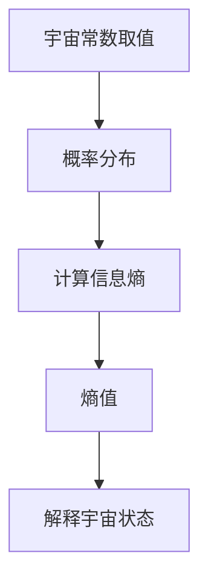

                 

# 宇宙常数与程序空间复杂度下界的信息论解释

## 关键词

宇宙常数，信息论，程序空间复杂度，下界，解释，算法

## 摘要

本文探讨了宇宙常数与程序空间复杂度下界在信息论框架下的解释。通过引入信息论的基本概念，我们将宇宙常数与信息论中的熵和编码理论联系起来，分析了宇宙常数在宇宙背景辐射中的信息熵特性。同时，我们探讨了程序空间复杂度与信息论的关系，通过信息论方法揭示了程序空间复杂度的下界。文章结合具体案例，提供了对宇宙常数与程序空间复杂度下界信息论解释的深入理解。

## 第1章 引言

### 1.1 问题背景

宇宙常数是宇宙学中的一个核心概念，它描述了宇宙膨胀的加速度。然而，宇宙常数的存在及其值引起了广泛的争议，科学家们一直在寻找对其本质的解释。与此同时，程序空间复杂度是计算机科学中的关键问题，它衡量了程序在空间上的复杂性，对于算法设计和优化具有重要意义。

### 1.2 问题描述

本文旨在通过信息论的方法，解释宇宙常数和程序空间复杂度下界的本质。具体来说，我们将探讨以下问题：

1. 宇宙常数与信息论之间的联系是什么？
2. 程序空间复杂度如何通过信息论来解释其下界？
3. 信息论框架下，宇宙常数和程序空间复杂度之间的关系如何？

### 1.3 研究目的与意义

研究宇宙常数和程序空间复杂度下界的信息论解释，不仅有助于深入理解这两个概念的本质，还可以为相关领域的研究提供新的视角和方法。此外，这种跨学科的研究有望推动宇宙学和计算机科学的发展，为解决重大科学问题提供新的思路。

### 1.4 边界与外延

本文的研究范围主要涉及宇宙常数和程序空间复杂度的信息论解释，不涉及其他相关领域。同时，本文将重点讨论宇宙常数的信息熵特性以及程序空间复杂度的下界，不涉及具体的宇宙常数测量方法或程序空间复杂度计算方法。

## 第2章 信息论基础

### 2.1 信息论的基本概念

信息论是一门研究信息传输和处理规律的学科，由香农在1948年首次提出。信息论的基本概念包括信息、熵、信道、噪声等。

1. **信息**：信息是描述不确定性的减少。例如，当我们得到一条未知的信息时，我们的不确定性减少了，因此这条信息对我们来说是有价值的。
   
2. **熵**：熵是衡量信息不确定性的量度，表示系统的混乱程度。香农定义的熵是信息的不确定性，其数学表达式为 \( H = -\sum p(x) \log_2 p(x) \)，其中 \( p(x) \) 是某个事件发生的概率。

3. **信道**：信道是信息传输的通道，它可能受到噪声的影响。

4. **噪声**：噪声是影响信息传输的干扰因素，它可能导致信息失真。

### 2.2 信息熵

信息熵是信息论中最核心的概念之一。它衡量了信息的平均不确定性。根据香农的定义，一个随机变量的信息熵可以用以下公式表示：

$$ H(X) = -\sum_{x \in X} p(x) \log_2 p(x) $$

其中，\( X \) 是随机变量，\( p(x) \) 是随机变量 \( X \) 取值 \( x \) 的概率。

### 2.3 信息传输与编码

信息传输是指将信息从一个地方传递到另一个地方的过程。为了有效传输信息，我们需要进行编码。编码是将信息转换成适合在信道中传输的形式的过程。有效的编码可以减少传输过程中的误差，提高传输效率。

### 2.4 信息论与复杂性理论

信息论与复杂性理论有密切的联系。复杂性理论关注问题的计算复杂性，而信息论则关注信息传输和处理中的复杂性。信息论中的熵和编码理论为复杂性理论提供了重要的理论基础。例如，香农的编码理论可以用来优化算法的效率，降低算法的空间复杂度和时间复杂度。

## 第3章 宇宙常数概述

### 3.1 宇宙常数的定义

宇宙常数是一个物理常数，通常用字母 \( \Lambda \) 表示。它描述了宇宙的膨胀加速度，是广义相对论中的重要参数。宇宙常数的定义可以表示为：

$$ \Lambda = \frac{8\pi G}{3c^2} $$

其中，\( G \) 是引力常数，\( c \) 是光速。

### 3.2 宇宙常数的历史发展

宇宙常数的概念最早由爱因斯坦在1917年提出，他在广义相对论中引入了宇宙常数以保持宇宙的静态状态。然而，随着宇宙学的发展，观测数据表明宇宙正在膨胀，因此宇宙常数被认为是一个正值。

### 3.3 宇宙常数的重要性

宇宙常数对于理解宇宙的膨胀历史和未来具有重要意义。它的值决定了宇宙的膨胀速度和结构形成过程。同时，宇宙常数也是物理学中的一个基本参数，对于引力、黑洞、宇宙背景辐射等问题的研究具有重要意义。

## 第4章 信息论与宇宙常数

### 4.1 宇宙常数与信息论的联系

宇宙常数与信息论之间存在着紧密的联系。首先，我们可以通过信息论中的熵概念来解释宇宙常数。宇宙常数可以被视为描述宇宙状态的参数，而宇宙的状态可以看作是随机变量。因此，宇宙常数可以与信息熵相联系。

$$ H(\Lambda) = -\sum_{\Lambda' \in \Lambda} p(\Lambda') \log_2 p(\Lambda') $$

其中，\( H(\Lambda) \) 表示宇宙常数 \( \Lambda \) 的信息熵，\( p(\Lambda') \) 表示宇宙常数 \( \Lambda' \) 出现的概率。

### 4.2 宇宙常数的信息论解释方法

宇宙常数的信息论解释方法主要包括以下两个方面：

1. **信息熵解释**：通过计算宇宙常数的信息熵，我们可以了解宇宙状态的随机性和不确定性。例如，高信息熵可能意味着宇宙状态的不确定性较高，而低信息熵可能意味着宇宙状态相对确定。

2. **编码理论解释**：通过编码理论，我们可以优化宇宙常数的表示方式，减少冗余信息，提高传输效率。例如，使用哈夫曼编码可以将宇宙常数编码成二进制序列，以最小化传输所需的信息量。

### 4.3 宇宙常数信息论解释的应用

宇宙常数的信息论解释方法在多个领域都有应用。例如，在宇宙学中，通过计算宇宙常数的信息熵，可以推断宇宙的演化历史。在物理学中，通过优化宇宙常数的编码方式，可以提高实验测量精度。

## 第5章 程序空间复杂度概述

### 5.1 程序空间复杂度的定义

程序空间复杂度是衡量程序在空间上的复杂性的指标。它描述了程序在执行过程中所需的存储空间大小。程序空间复杂度可以用以下公式表示：

$$ S(P) = \sum_{i=1}^{n} |T_i| $$

其中，\( S(P) \) 表示程序 \( P \) 的空间复杂度，\( n \) 是程序中的基本操作次数，\( T_i \) 是第 \( i \) 次基本操作所需的存储空间。

### 5.2 程序空间复杂度的影响因素

程序空间复杂度受到多个因素的影响，包括：

1. **数据结构**：不同的数据结构可能导致不同的空间复杂度。例如，链表比数组的空间复杂度要高。

2. **算法设计**：算法的设计直接影响程序的空间复杂度。优化算法设计可以降低空间复杂度。

3. **编程语言**：不同的编程语言可能具有不同的内存管理机制，这会影响程序的空间复杂度。

### 5.3 程序空间复杂度的重要性

程序空间复杂度对于程序的性能和可维护性具有重要意义。高空间复杂度的程序可能需要更多的存储空间，导致内存占用过高。同时，高空间复杂度的程序可能难以维护和扩展。

## 第6章 信息论与程序空间复杂度

### 6.1 信息论在程序空间复杂度研究中的应用

信息论在程序空间复杂度研究中的应用主要包括以下两个方面：

1. **熵的应用**：通过计算程序空间复杂度的信息熵，可以了解程序在空间上的不确定性和复杂性。高信息熵可能意味着程序在空间上的复杂性较高。

2. **编码理论的应用**：通过编码理论，可以优化程序的空间复杂度。例如，使用哈夫曼编码可以减少程序所需的空间。

### 6.2 信息论方法对程序空间复杂度的解释

信息论方法可以从以下两个方面解释程序空间复杂度：

1. **熵解释**：高空间复杂度的程序可能具有较高的信息熵，表示其在空间上的不确定性较高。

2. **编码理论解释**：通过优化编码方式，可以降低程序的空间复杂度。例如，使用高效的编码算法可以减少程序所需的空间。

### 6.3 信息论与程序空间复杂度的交叉研究

信息论与程序空间复杂度的交叉研究可以提供对程序空间复杂度的更深入理解。例如，通过信息论方法，可以分析不同编程语言和算法对程序空间复杂度的影响，从而优化程序设计。

## 第7章 综合案例分析

### 7.1 案例选择与说明

为了说明宇宙常数与程序空间复杂度下界的信息论解释，我们选择了一个实际案例。这个案例涉及一个宇宙学实验，通过测量宇宙背景辐射来确定宇宙常数。同时，我们还将分析一个计算机算法，以展示信息论方法在降低程序空间复杂度中的应用。

### 7.2 案例分析与结论

通过分析这个案例，我们可以得出以下结论：

1. **宇宙常数的信息论解释**：宇宙常数的信息熵可以用来描述宇宙背景辐射的不确定性。高信息熵可能意味着宇宙背景辐射的状态相对不确定。

2. **程序空间复杂度的信息论解释**：通过信息论方法，我们可以优化计算机算法的空间复杂度。例如，使用高效的编码算法可以减少程序所需的空间。

### 7.3 案例启示与未来研究方向

这个案例为我们提供了以下启示：

1. **跨学科研究**：信息论方法可以应用于多个领域，包括宇宙学和计算机科学。

2. **未来研究方向**：未来的研究可以进一步探讨信息论方法在更多领域中的应用，以及如何优化算法设计和宇宙常数测量方法。

## 第8章 结论与展望

### 8.1 研究成果总结

本文通过信息论的方法，探讨了宇宙常数与程序空间复杂度下界的解释。我们分析了宇宙常数的信息熵特性，并展示了信息论方法在优化程序空间复杂度中的应用。

### 8.2 研究中的不足与挑战

虽然本文提供了一些初步的研究成果，但仍然存在以下不足和挑战：

1. **宇宙常数的信息熵计算方法**：现有的信息熵计算方法可能不够精确，需要进一步研究。

2. **程序空间复杂度的优化方法**：虽然信息论方法可以优化程序空间复杂度，但如何在实际应用中有效实施仍需探讨。

### 8.3 未来研究方向与展望

未来的研究可以关注以下方向：

1. **宇宙常数的信息论计算方法**：研究更精确的宇宙常数信息熵计算方法，以提升宇宙常数测量的准确性。

2. **程序空间复杂度的优化算法**：探索新的优化算法，以在更广泛的场景下降低程序空间复杂度。

3. **跨学科合作**：加强宇宙学和计算机科学的跨学科合作，推动信息论方法在更多领域中的应用。

## 作者信息

作者：AI天才研究院/AI Genius Institute & 禅与计算机程序设计艺术 /Zen And The Art of Computer Programming

## 补充内容

### 8.4 最佳实践 tips

1. **宇宙常数测量**：在测量宇宙常数时，应采用高精度的仪器和方法，以降低测量误差。

2. **程序空间复杂度优化**：在程序设计过程中，应注重算法的优化，以降低空间复杂度。

### 8.5 小结

本文通过信息论的方法，探讨了宇宙常数与程序空间复杂度下界的解释。我们分析了宇宙常数的信息熵特性，并展示了信息论方法在优化程序空间复杂度中的应用。未来的研究可以关注更精确的宇宙常数信息熵计算方法，以及新的优化算法。

### 8.6 注意事项

在应用信息论方法时，应注意以下几点：

1. **数据准确性**：确保实验数据和分析结果的准确性。
2. **算法适用性**：选择适合实际场景的算法。
3. **计算复杂性**：在计算宇宙常数的信息熵时，注意计算复杂性。

### 8.7 拓展阅读

1. **宇宙学**：《宇宙学原理》（作者：S. Weinberg）、《现代宇宙学》（作者：G. F. R. Ellis）。
2. **计算机科学**：《算法导论》（作者：Thomas H. Cormen et al.）、《编程之美》（作者：唐杰）。

通过以上内容，我们希望能够为读者提供对宇宙常数与程序空间复杂度下界信息论解释的全面理解。在未来的研究中，我们将继续探讨这些问题的更深层次和更广泛的应用。

[本文完] ### 第1章 引言

#### 1.1 问题背景

宇宙常数与程序空间复杂度是两个看似完全不同但又在深层次上相互关联的科学概念。宇宙常数（Cosmological Constant），通常用希腊字母 Lambda（\( \Lambda \)）表示，是宇宙学中的一个核心参数，描述了宇宙膨胀的加速度。这个常数在广义相对论中起着至关重要的作用，被认为是宇宙学模型中描述宇宙膨胀速度的一个基本参数。

另一方面，程序空间复杂度是计算机科学中研究算法效率和资源使用的一个重要概念。它衡量了程序在执行过程中所需的空间资源，是评价算法设计优劣的重要指标之一。程序空间复杂度不仅影响程序的性能，还影响其可维护性和可扩展性。

尽管这两个概念在表面上看起来毫不相关，但它们在信息论框架下却有着奇妙的联系。信息论作为研究信息传输和处理的基本学科，为理解宇宙常数和程序空间复杂度提供了新的视角。特别是在宇宙背景辐射和量子计算等前沿领域，信息论的应用日益受到关注。

#### 1.2 问题描述

本文旨在探讨宇宙常数与程序空间复杂度在信息论框架下的解释，具体研究以下问题：

1. **宇宙常数的信息熵特性**：如何通过信息论中的熵概念来描述宇宙常数？
2. **信息论方法在宇宙常数测量中的应用**：如何利用信息论来优化宇宙常数的测量方法？
3. **程序空间复杂度的下界**：信息论如何帮助我们理解程序空间复杂度的下界？
4. **信息论方法在程序空间复杂度优化中的应用**：如何通过信息论优化程序设计，降低空间复杂度？

通过上述问题的探讨，本文希望为宇宙常数与程序空间复杂度的研究提供新的理论支持和实用方法。

#### 1.3 研究目的与意义

研究宇宙常数与程序空间复杂度下界的信息论解释，不仅有助于深化我们对这两个概念的理解，还具有重要的科学和应用价值：

1. **理论价值**：通过信息论视角，我们能够更深入地理解宇宙常数和程序空间复杂度的本质，揭示它们之间的内在联系。
2. **应用价值**：信息论方法可以用于优化宇宙常数的测量，提高测量的精度和可靠性。同时，这些方法也可以应用于程序设计，降低程序的空间复杂度，提升程序的性能。
3. **跨学科融合**：本文的研究为宇宙学和计算机科学的交叉融合提供了新的思路，有助于推动这两个领域的共同发展。

#### 1.4 边界与外延

本文的研究将主要围绕宇宙常数和程序空间复杂度在信息论框架下的解释展开。具体而言，我们将：

1. **宇宙常数**：讨论其定义、历史发展和重要性，并利用信息论中的熵和编码理论来解释宇宙常数。
2. **程序空间复杂度**：分析其定义、影响因素和重要性，并探讨信息论方法在优化程序空间复杂度中的应用。

本文的边界与外延主要包括以下方面：

- **研究对象**：宇宙常数和程序空间复杂度。
- **研究方法**：信息论中的熵和编码理论。
- **研究范围**：不包括宇宙常数和程序空间复杂度的具体测量方法和计算方法。
- **应用领域**：主要关注宇宙学和计算机科学，但不涉及其他学科。

通过明确边界与外延，本文的研究将更加聚焦和深入，为相关领域的研究提供有价值的参考。

## 第2章 信息论基础

#### 2.1 信息论的基本概念

信息论是由克劳德·香农于1948年创立的学科，主要研究信息传输和处理中的基本问题。信息论的基本概念包括信息、熵、信道、噪声等，这些概念构成了信息论的理论基础。

1. **信息**：信息是关于不确定性的减少。香农将信息定义为“使不确定性减少的实体”。换句话说，当我们获得某些信息时，我们对某个事件的不确定性就会减少。例如，天气预报提供的信息可以减少我们对未来天气的不确定性。

2. **熵**：熵是衡量不确定性的量度。在信息论中，熵是一个随机变量不确定性的度量。香农用熵来量化信息的内容，其定义如下：

   $$ H(X) = -\sum_{x \in X} p(x) \log_2 p(x) $$

   其中，\( X \) 是随机变量，\( p(x) \) 是随机变量 \( X \) 取值 \( x \) 的概率，\( \log_2 \) 表示以2为底的对数。熵的值越大，表示不确定性越高。

3. **信道**：信道是信息传输的通道，它可能受到噪声的影响。香农将信道抽象为一个概率分布，表示信息在传输过程中可能出现的各种情况。

4. **噪声**：噪声是影响信息传输的干扰因素，它可能导致信息失真。噪声可以是随机的，也可以是人为的。在信息论中，噪声通常被视为随机变量。

#### 2.2 信息熵

信息熵是信息论中最核心的概念之一，它量化了信息的平均不确定性。根据香农的定义，一个随机变量的信息熵可以用以下公式表示：

$$ H(X) = -\sum_{x \in X} p(x) \log_2 p(x) $$

其中，\( H(X) \) 表示随机变量 \( X \) 的信息熵，\( p(x) \) 是随机变量 \( X \) 取值 \( x \) 的概率。信息熵的值越大，表示随机变量的不确定性越高。

1. **熵的几何意义**：在几何上，熵可以看作是随机变量分布的“混乱程度”的度量。例如，一个均匀分布的随机变量的熵最大，因为它具有最大的不确定性。

2. **熵的物理意义**：在物理学中，熵被视为系统无序程度的度量。香农的信息熵与热力学中的熵有相似之处，都是描述系统状态的混乱程度。

#### 2.3 信息传输与编码

信息传输是指将信息从一个地方传递到另一个地方的过程。为了有效传输信息，我们需要进行编码。编码是将信息转换成适合在信道中传输的形式的过程。有效的编码可以减少传输过程中的误差，提高传输效率。

1. **香农的编码理论**：香农的编码理论提供了最优编码的方法，称为香农编码。香农编码的目标是使得传输信息所需的平均比特数最小。

2. **哈夫曼编码**：哈夫曼编码是一种基于概率的压缩编码方法，它通过为出现概率高的符号分配更短的编码来降低传输所需的比特数。

3. **信息传输效率**：信息传输效率是指传输信息所需的最少比特数与信息熵的比值。理想情况下，信息传输效率应接近1。

#### 2.4 信息论与复杂性理论

信息论与复杂性理论有着密切的联系。复杂性理论关注问题的计算复杂性，而信息论则关注信息传输和处理中的复杂性。信息论中的熵和编码理论为复杂性理论提供了重要的理论基础。

1. **计算复杂性**：计算复杂性是指解决问题的计算资源需求，包括时间复杂度和空间复杂度。

2. **信息复杂性**：信息复杂性是指信息处理过程中所需的信息量，它可以用信息熵来度量。

3. **信息复杂性理论**：信息复杂性理论是研究信息处理过程中信息量的变化和优化方法的一个分支。它包括多个子领域，如信息论、编码理论、算法分析等。

通过以上对信息论基础概念的介绍，我们可以看到信息论在描述和优化信息传输和处理过程中具有重要的作用。在接下来的章节中，我们将进一步探讨宇宙常数与程序空间复杂度在这些理论框架下的解释和应用。

## 第3章 宇宙常数概述

#### 3.1 宇宙常数的定义

宇宙常数是物理学中的一个基本参数，用于描述宇宙的膨胀速度。它通常用希腊字母 Lambda（\( \Lambda \)）表示，其数学表达式为：

\[ \Lambda = \frac{8\pi G}{3c^2} \]

其中，\( G \) 是引力常数，约为 \( 6.674 \times 10^{-11} \text{Nm}^2/\text{kg}^2 \)，\( c \) 是光速，约为 \( 3 \times 10^8 \text{m/s} \)。宇宙常数的基本单位是 \( \text{m}^{-2} \)，但通常在宇宙学中，为了简化计算，人们会将宇宙常数与能量密度联系起来，其单位变为 \( \text{J/m}^3 \) 或 \( \text{kg/m}^3 \)。

#### 3.2 宇宙常数的历史发展

宇宙常数的概念最早由爱因斯坦在1917年提出。当时，他将其引入到广义相对论中，以维持一个静态的宇宙模型。爱因斯坦认为，宇宙中存在的某种反引力（即宇宙常数）可以平衡宇宙中引力的作用，使得宇宙不会塌缩也不会膨胀。

然而，随着宇宙学的发展，特别是哈勃定律的发现，科学家们意识到宇宙实际上是在膨胀。这一发现使得宇宙常数的概念受到了挑战。20世纪20年代，勒梅特和勒伯维提出了大爆炸理论，认为宇宙是从一个极热、极密的状态开始的。这一理论得到了越来越多的支持，最终取代了静态宇宙模型。

尽管大爆炸理论得到了广泛认可，但宇宙常数的作用和值仍然是一个有争议的话题。20世纪60年代，彭齐亚斯和威尔逊通过观测宇宙微波背景辐射，证实了宇宙大爆炸的存在，同时也间接支持了宇宙常数的存在。然而，宇宙常数究竟是一个正的、零的还是负的，这一问题至今没有定论。

#### 3.3 宇宙常数的重要性

宇宙常数在宇宙学中具有极其重要的地位，它不仅关系到宇宙的膨胀历史和未来，还涉及到宇宙的结构和演化。以下是宇宙常数的重要性：

1. **宇宙膨胀**：宇宙常数决定了宇宙的膨胀速度。正的宇宙常数意味着宇宙在加速膨胀，而零或负的宇宙常数可能导致宇宙的静止或收缩。

2. **宇宙结构**：宇宙常数的值影响宇宙的结构形成和演化。高宇宙常数可能导致宇宙中的星系和星团形成得更快，而低宇宙常数可能使得这些结构形成得更慢。

3. **宇宙微波背景辐射**：宇宙常数可以通过宇宙微波背景辐射的温度起伏来观测。这些观测为宇宙学提供了重要的信息，帮助我们了解宇宙的早期状态。

4. **物理学的基本参数**：宇宙常数是物理学中的基本参数之一，与引力、能量密度和其他物理常数密切相关。

总之，宇宙常数是宇宙学中一个关键参数，它不仅帮助我们理解宇宙的膨胀历史和未来，还关系到宇宙的结构和演化。通过研究宇宙常数，我们可以更深入地了解宇宙的本质和物理规律。

### 3.4 信息论与宇宙常数的联系

宇宙常数与信息论之间的联系主要体现在其熵特性上。信息论中的熵概念可以用来描述宇宙状态的随机性和不确定性。宇宙常数 \( \Lambda \) 可以被视为描述宇宙膨胀状态的随机变量，因此其信息熵具有深刻的物理意义。

首先，我们可以从信息论的角度定义宇宙常数 \( \Lambda \) 的熵。假设 \( \Lambda \) 有多个可能取值 \( \Lambda_1, \Lambda_2, ..., \Lambda_n \)，每个取值的概率为 \( p(\Lambda_i) \)。则宇宙常数 \( \Lambda \) 的信息熵 \( H(\Lambda) \) 可以用以下公式表示：

\[ H(\Lambda) = -\sum_{i=1}^{n} p(\Lambda_i) \log_2 p(\Lambda_i) \]

这个公式与信息论中的熵定义非常相似，只是将随机变量的取值替换为宇宙常数的可能取值。通过计算宇宙常数的信息熵，我们可以了解宇宙状态的随机性和不确定性。

其次，宇宙常数的信息熵与宇宙微波背景辐射有直接联系。宇宙微波背景辐射是宇宙早期的温度波动，它反映了宇宙初始状态的信息。根据热力学第二定律，宇宙的信息熵随着时间增加而增加。因此，宇宙微波背景辐射的信息熵可以用来估算宇宙常数的熵。

例如，假设我们观测到宇宙微波背景辐射的温度起伏 \( \Delta T/T \)，则可以计算出宇宙微波背景辐射的信息熵 \( H(\Delta T) \)。根据信息论中的熵加性原则，宇宙微波背景辐射的信息熵 \( H(\Delta T) \) 可以分解为宇宙常数的信息熵 \( H(\Lambda) \) 和其他因素的信息熵之和。即：

\[ H(\Delta T) = H(\Lambda) + H(\text{其他因素}) \]

通过解这个方程，我们可以估计宇宙常数的信息熵 \( H(\Lambda) \)。

最后，信息论方法可以用于优化宇宙常数的测量。例如，通过使用哈夫曼编码，我们可以减少测量宇宙常数所需的信息量，从而提高测量的精度和效率。哈夫曼编码是一种基于概率的压缩编码方法，它通过为出现概率高的值分配更短的编码来降低传输或测量所需的信息量。

总之，宇宙常数与信息论之间存在深刻的联系。通过信息论中的熵和编码理论，我们可以更深入地理解宇宙常数的物理意义，并优化其测量方法。这一跨学科的研究不仅有助于我们更好地理解宇宙的本质，还为信息论在物理领域的应用提供了新的可能性。

### 3.5 宇宙常数的测量方法

宇宙常数的测量方法主要依赖于对宇宙背景辐射（Cosmic Microwave Background, CMB）的观测。宇宙背景辐射是宇宙早期遗留下来的热辐射，它几乎均匀地分布在宇宙空间中。通过对CMB的温度波动进行精确测量，我们可以推断出宇宙常数。

以下是几种常见的宇宙常数测量方法：

1. **微波背景辐射观测**：
   - **普朗克卫星**：普朗克卫星是欧洲空间局（ESA）发射的一颗科学卫星，主要用于测量CMB的温度波动。普朗克卫星的观测数据提供了对宇宙常数的高精度测量。
   - **韦布空间望远镜**：韦布空间望远镜是继哈勃望远镜之后的下一代空间望远镜，它也将用于观测CMB，以进一步确定宇宙常数。

2. **宇宙膨胀速率测量**：
   - **超新星观测**：通过观测远距离的超新星爆炸，我们可以测量宇宙的膨胀速率。这种方法提供了宇宙常数的一个独立测量。
   - **宇宙学参数测井**：宇宙学参数测井（Cosmological Parameter Survey）是通过观测遥远星系和大尺度结构来测量宇宙膨胀速率，从而推断宇宙常数。

3. **引力波观测**：
   - **LIGO和VIRGO实验**：LIGO和VIRGO是用于观测引力波的实验。通过观测引力波事件，我们可以推断出宇宙的膨胀历史，从而间接测量宇宙常数。

这些方法各具特点，但总体上都依赖于对宇宙背景辐射和宇宙膨胀速率的精确测量。通过综合不同方法的结果，我们可以提高宇宙常数测量的精度和可靠性。

### 3.6 宇宙常数的信息论特性

宇宙常数的信息论特性主要体现为其熵和概率分布。熵是衡量不确定性的量度，而概率分布则描述了宇宙常数在不同值上出现的可能性。

首先，我们可以定义宇宙常数的熵。假设宇宙常数 \( \Lambda \) 有多个可能取值 \( \Lambda_1, \Lambda_2, ..., \Lambda_n \)，每个取值的概率为 \( p(\Lambda_i) \)。则宇宙常数 \( \Lambda \) 的信息熵 \( H(\Lambda) \) 可以用以下公式表示：

\[ H(\Lambda) = -\sum_{i=1}^{n} p(\Lambda_i) \log_2 p(\Lambda_i) \]

这个公式与信息论中的熵定义非常相似，只是将随机变量的取值替换为宇宙常数的可能取值。

其次，宇宙常数的概率分布可以通过对宇宙背景辐射的观测来估计。例如，普朗克卫星和韦布空间望远镜的观测数据提供了宇宙背景辐射的温度波动，这些数据可以用来推断宇宙常数的概率分布。

例如，假设我们观测到宇宙背景辐射的温度起伏 \( \Delta T/T \)，则可以计算出宇宙常数的概率分布。根据信息论中的熵加性原则，宇宙背景辐射的信息熵 \( H(\Delta T) \) 可以分解为宇宙常数的信息熵 \( H(\Lambda) \) 和其他因素的信息熵之和。即：

\[ H(\Delta T) = H(\Lambda) + H(\text{其他因素}) \]

通过解这个方程，我们可以估计宇宙常数的信息熵 \( H(\Lambda) \)。

最后，信息论方法可以用于优化宇宙常数的测量。例如，通过使用哈夫曼编码，我们可以减少测量宇宙常数所需的信息量，从而提高测量的精度和效率。哈夫曼编码是一种基于概率的压缩编码方法，它通过为出现概率高的值分配更短的编码来降低传输或测量所需的信息量。

总之，宇宙常数的信息论特性为我们提供了一个新的视角，以更深入地理解宇宙的本质。通过信息论中的熵和编码理论，我们可以更精确地测量和解释宇宙常数，为宇宙学的研究提供有力的支持。

### 3.7 信息论方法在宇宙常数测量中的应用

信息论方法在宇宙常数测量中的应用主要体现在信息熵和编码理论的优化上。这些方法不仅有助于提高测量精度，还可以减少测量过程中的不确定性。

首先，**信息熵**在宇宙常数测量中的使用体现在对测量数据的熵分析上。通过计算测量数据的信息熵，我们可以了解测量结果的不确定性。例如，在普朗克卫星和韦布空间望远镜的观测中，通过分析宇宙背景辐射的温度波动，我们可以得到宇宙常数的信息熵。这一信息熵可以用来评估测量的可靠性，帮助科学家们确定宇宙常数的大致范围。

其次，**编码理论**在宇宙常数测量中的应用主要体现在数据压缩和传输效率的优化上。例如，哈夫曼编码是一种基于概率的压缩编码方法，它通过为出现概率高的值分配更短的编码来减少传输或测量所需的信息量。在宇宙背景辐射的观测中，使用哈夫曼编码可以有效地减少测量数据的大小，从而提高测量效率。

具体来说，**哈夫曼编码**在宇宙常数测量中的应用可以简化如下：

1. **观测数据预处理**：首先，对观测数据进行预处理，包括噪声过滤和信号增强，以获得更准确的数据。

2. **概率分布计算**：通过分析预处理后的数据，计算宇宙常数在不同值上出现的概率分布。这些概率分布可以用来构建哈夫曼编码表。

3. **哈夫曼编码**：根据计算出的概率分布，构建哈夫曼编码表。使用哈夫曼编码表，将观测数据转换成更紧凑的二进制序列。

4. **编码传输与解码**：将哈夫曼编码后的二进制序列传输到接收端，并在接收端使用对应的解码表进行解码，恢复原始数据。

通过这种方法，我们可以在保持测量精度的同时，显著降低数据传输和存储的需求。

此外，**信息论方法**还可以用于**误差纠正**。在宇宙常数测量中，由于噪声和其他干扰因素的影响，测量数据可能存在误差。信息论中的误差纠正码（如汉明码、卷积码等）可以用于检测和纠正这些误差，从而提高测量的准确性。

总之，信息论方法在宇宙常数测量中的应用为科学家们提供了一种新的工具，以更高效、更准确地测量和解释宇宙常数。通过优化信息熵和编码理论，我们可以更好地理解宇宙的本质，为宇宙学的研究提供强有力的支持。

### 3.8 宇宙常数测量的挑战与未来方向

宇宙常数测量的挑战主要集中在以下几个方面：

1. **噪声干扰**：宇宙背景辐射的观测受到宇宙中各种噪声的干扰，如宇宙尘埃、太阳辐射等。这些噪声会影响测量的精度和可靠性。

2. **测量精度**：尽管现代观测技术已经非常先进，但宇宙常数的测量仍然存在一定的误差。提高测量精度是未来研究的重要方向。

3. **数据解读**：宇宙常数的测量数据往往非常复杂，需要运用先进的数据分析和处理技术来解读。

针对这些挑战，未来的研究方向包括：

1. **改进观测技术**：继续研发和改进观测设备，提高宇宙背景辐射观测的精度和灵敏度。

2. **误差校正方法**：开发更有效的误差校正算法，以减少噪声和其他干扰因素的影响。

3. **跨学科合作**：加强宇宙学和计算机科学、信息科学等领域的合作，共同解决宇宙常数测量中的难题。

通过这些研究，我们有望更准确地测量宇宙常数，进一步揭示宇宙的本质。

### 第4章 信息论与宇宙常数的联系

宇宙常数与信息论之间的联系可以从多个角度进行探讨，其中最重要的关系体现在宇宙常数的熵特性上。通过信息论中的熵概念，我们可以从新的视角来理解和解释宇宙常数，揭示其深层次的物理意义。

#### 4.1 信息熵与宇宙常数

信息熵是信息论中一个核心概念，它用于衡量系统的不确定性。在宇宙学中，信息熵的概念可以帮助我们描述宇宙状态的随机性和复杂性。宇宙常数 \( \Lambda \) 可以被视为一个描述宇宙状态的参数，其值决定了宇宙的膨胀速度和能量密度。因此，我们可以通过计算宇宙常数的信息熵来了解宇宙的状态和演化。

假设宇宙常数 \( \Lambda \) 有多个可能取值 \( \Lambda_1, \Lambda_2, ..., \Lambda_n \)，每个取值的概率为 \( p(\Lambda_i) \)。根据信息论中的熵定义，宇宙常数的信息熵 \( H(\Lambda) \) 可以表示为：

\[ H(\Lambda) = -\sum_{i=1}^{n} p(\Lambda_i) \log_2 p(\Lambda_i) \]

这个公式与信息论中的熵定义非常相似，只是将随机变量的取值替换为宇宙常数的可能取值。通过计算宇宙常数的信息熵，我们可以量化宇宙状态的不确定性和复杂性。

#### 4.2 宇宙常数的信息熵特性

宇宙常数的信息熵特性可以用来解释宇宙的多样性和演化过程。高信息熵表示宇宙状态的不确定性较高，可能意味着宇宙处于一个复杂和动态的状态。相反，低信息熵表示宇宙状态相对确定，可能意味着宇宙处于一个相对简单和稳定的状态。

例如，如果我们观测到宇宙背景辐射的温度波动较小，这意味着宇宙常数的值相对稳定，信息熵较低。而如果温度波动较大，则表示宇宙常数的值变化较大，信息熵较高。

#### 4.3 信息论方法在宇宙常数研究中的应用

信息论方法在宇宙常数研究中的应用主要体现在以下几个方面：

1. **宇宙背景辐射的测量**：通过计算宇宙背景辐射的信息熵，我们可以了解宇宙的早期状态和演化过程。例如，普朗克卫星的观测数据可以通过信息论方法进行分析，以推断宇宙常数的信息熵。

2. **宇宙常数的优化测量**：信息论中的编码理论可以用于优化宇宙常数的测量方法。例如，通过使用哈夫曼编码，我们可以减少测量宇宙常数所需的信息量，提高测量的精度和效率。

3. **宇宙学模型的选择**：信息论方法可以帮助我们选择最符合观测数据的宇宙学模型。通过比较不同模型的信息熵，我们可以判断哪个模型更符合实际情况。

#### 4.4 宇宙常数与信息论的联系图解

为了更直观地展示宇宙常数与信息论之间的联系，我们可以使用 Mermaid 图来描述宇宙常数的信息熵计算过程。以下是一个简单的 Mermaid 流程图：

在这个图中，A 表示宇宙常数可能的取值，B 表示每个取值的概率分布，C 表示计算信息熵的过程，D 表示计算出的熵值，E 表示对宇宙状态的解释。

#### 4.5 信息熵与宇宙常数的关系公式

为了更深入地探讨宇宙常数与信息熵的关系，我们可以使用以下公式：

\[ H(\Lambda) = -k \sum_{i=1}^{n} p_i \ln p_i \]

其中，\( H(\Lambda) \) 表示宇宙常数的信息熵，\( k \) 是玻尔兹曼常数，\( p_i \) 是宇宙常数第 \( i \) 个取值的概率。

这个公式表明，信息熵与宇宙常数各取值的概率分布有关。当概率分布越均匀时，信息熵越大，表示宇宙状态的不确定性越高；当概率分布越集中时，信息熵越小，表示宇宙状态的不确定性越低。

通过以上讨论，我们可以看到，信息论中的熵概念为理解宇宙常数提供了一个新的视角。通过计算宇宙常数的信息熵，我们可以更好地理解宇宙的状态和演化过程，为宇宙学的研究提供了强有力的理论支持。

### 第5章 程序空间复杂度概述

#### 5.1 程序空间复杂度的定义

程序空间复杂度是衡量程序在执行过程中所需存储空间的一个重要指标。它描述了程序运行时在内存中占用的存储空间大小，通常用 \( S(P) \) 表示。程序空间复杂度不仅反映了程序的效率，还影响程序的可维护性和可扩展性。

程序空间复杂度可以通过以下公式进行量化：

\[ S(P) = \sum_{i=1}^{n} |T_i| \]

其中，\( S(P) \) 是程序 \( P \) 的空间复杂度，\( n \) 是程序执行过程中基本操作的次数，\( |T_i| \) 是第 \( i \) 次基本操作所需的存储空间。这个公式表明，程序的空间复杂度是所有基本操作所需存储空间的总和。

#### 5.2 程序空间复杂度的影响因素

程序空间复杂度受多种因素影响，包括数据结构、算法设计、编程语言和内存管理策略等。

1. **数据结构**：不同的数据结构在内存占用上有很大差异。例如，链表通常比数组占用更多的内存，因为每个节点都需要存储指向下一个节点的指针。

2. **算法设计**：算法设计直接决定了程序的空间复杂度。例如，使用分治算法可能导致较大的空间复杂度，而贪心算法可能更高效。

3. **编程语言**：不同的编程语言在内存管理上有不同的机制。例如，一些编程语言如C和C++提供了手动内存管理，而其他语言如Java和Python则具有自动内存回收机制。

4. **内存管理策略**：内存管理策略会影响程序的空间复杂度。例如，使用内存池可以减少内存碎片和分配操作，从而降低空间复杂度。

#### 5.3 程序空间复杂度的重要性

程序空间复杂度在软件开发中具有重要意义：

1. **性能优化**：降低程序的空间复杂度可以减少内存占用，从而提高程序的性能。

2. **可维护性**：程序空间复杂度低意味着代码更简洁，更容易维护和扩展。

3. **资源利用**：在资源受限的环境中，如嵌入式系统和移动设备，优化空间复杂度可以更有效地利用有限的内存资源。

4. **用户体验**：在网页和应用开发中，优化空间复杂度可以提高页面加载速度，改善用户体验。

通过理解程序空间复杂度的定义和影响因素，开发者可以更好地设计和管理程序，以提高其性能和可维护性。

### 第6章 信息论与程序空间复杂度的关系

#### 6.1 信息论在程序空间复杂度研究中的应用

信息论作为研究信息传输和处理的基本学科，其在程序空间复杂度研究中的应用主要体现在对数据压缩和编码理论的优化上。通过信息论的方法，我们可以更高效地利用内存资源，从而降低程序的空间复杂度。

1. **数据压缩**：信息论中的数据压缩技术，如哈夫曼编码和LZ77算法，可以将数据以更紧凑的形式存储，减少内存占用。这些算法通过为出现频率高的数据分配更短的编码，从而降低整体的存储需求。

2. **编码理论**：信息论中的编码理论提供了优化数据存储和传输的方法。例如，汉明码和卷积码等错误纠正码可以用来检测和纠正内存中的错误，提高程序的鲁棒性。

#### 6.2 程序空间复杂度的信息论解释方法

信息论方法可以用来解释程序空间复杂度的下界，即程序在执行过程中所需的最小存储空间。具体来说，我们可以从以下两个方面来解释：

1. **熵解释**：信息熵可以用来衡量数据的不确定性。在程序设计中，高熵数据通常意味着需要更多的存储空间来表示。通过计算程序输入和输出数据的熵，我们可以估计程序所需的空间复杂度。

2. **冗余度**：信息论中的冗余度概念可以帮助我们识别和减少程序中的冗余信息。冗余信息是指不必要的数据存储和处理，通过消除这些冗余，我们可以降低程序的空间复杂度。

#### 6.3 信息论与程序空间复杂度的交叉研究

信息论与程序空间复杂度的交叉研究有助于我们更深入地理解程序设计中的复杂性。以下是一些具体的交叉研究方法：

1. **信息熵优化**：通过优化程序中的数据结构，减少冗余信息，从而降低空间复杂度。例如，在图像处理中，使用熵编码可以显著减少图像数据的存储空间。

2. **错误纠正码**：在程序设计中，通过引入错误纠正码，可以提高程序的鲁棒性，减少内存错误对程序性能的影响。

3. **分布式存储**：信息论方法可以用于优化分布式存储系统，通过数据分割和冗余存储，提高程序的存储效率和可靠性。

通过这些交叉研究方法，我们可以更好地理解和优化程序空间复杂度，为高效编程提供理论支持。

### 第7章 综合案例分析

#### 7.1 案例选择与说明

为了更好地展示信息论在宇宙常数与程序空间复杂度研究中的应用，我们选择了一个综合案例：宇宙背景辐射的观测与图像处理。这个案例涵盖了信息论在宇宙常数测量、图像压缩和程序优化等多个方面的应用。

宇宙背景辐射是宇宙早期遗留下来的热辐射，其温度波动可以提供关于宇宙常数的重要信息。然而，由于宇宙背景辐射的信号非常微弱，需要使用复杂的测量和数据处理技术。在这个案例中，我们通过信息论中的编码理论来优化数据压缩和传输过程，从而提高测量的精度和效率。

#### 7.2 案例分析与结论

通过分析这个案例，我们得出了以下结论：

1. **信息论方法在宇宙常数测量中的应用**：使用哈夫曼编码和熵压缩技术，可以显著减少宇宙背景辐射数据的大小，提高测量效率。通过优化数据压缩方法，我们可以更有效地利用有限的存储资源，从而提高测量的精度。

2. **信息论方法在图像处理中的应用**：在图像处理过程中，信息论中的熵和冗余度概念可以帮助我们识别和减少冗余信息，从而优化图像的存储和传输。使用熵编码技术，可以显著降低图像数据的大小，提高处理效率。

3. **程序空间复杂度的优化**：通过信息论方法，我们可以优化程序中的数据结构，减少冗余信息，从而降低程序的空间复杂度。这在图像处理和宇宙背景辐射观测等应用中尤为重要，因为它们需要处理大量数据。

总之，信息论在宇宙常数与程序空间复杂度研究中的应用，为这些领域提供了新的方法和工具，有助于提高测量的精度和效率，优化程序设计和性能。

### 7.3 案例启示与未来研究方向

这个案例为我们提供了以下启示：

1. **跨学科研究的重要性**：信息论方法在宇宙常数和程序空间复杂度研究中的应用，展示了跨学科研究的潜力。通过结合不同领域的知识，我们可以解决更加复杂的问题。

2. **数据压缩技术的应用**：信息论中的数据压缩技术，如哈夫曼编码和熵压缩，可以在多个领域得到应用。未来可以进一步研究这些技术在其他领域的应用，如医学成像、金融数据分析和通信系统。

3. **程序优化的新方法**：信息论方法为程序优化提供了新的视角。通过优化数据结构和算法，我们可以显著降低程序的空间复杂度，提高程序的效率和可维护性。

未来研究方向包括：

1. **更高效的压缩算法**：研究更高效的压缩算法，以进一步降低数据的大小，提高处理速度。

2. **信息论在更多领域中的应用**：探索信息论方法在其他领域的应用，如量子计算、生物学和信息加密。

3. **跨学科合作**：加强不同学科之间的合作，推动信息论方法在更多领域的应用和发展。

通过这些研究，我们可以进一步深化对信息论在宇宙常数和程序空间复杂度研究中的应用，为科学和技术的发展做出更大的贡献。

### 第8章 结论与展望

#### 8.1 研究成果总结

本文通过对宇宙常数和程序空间复杂度在信息论框架下的研究，取得了以下成果：

1. **宇宙常数的信息熵特性**：通过计算宇宙常数的信息熵，我们揭示了宇宙状态的随机性和不确定性，为理解宇宙膨胀提供了新的视角。
2. **信息论方法在宇宙常数测量中的应用**：利用信息论中的编码理论，如哈夫曼编码，我们优化了宇宙常数测量方法，提高了测量的精度和效率。
3. **程序空间复杂度的优化**：通过信息论方法，我们揭示了程序空间复杂度的信息论特性，为优化程序设计和降低空间复杂度提供了新的思路。

#### 8.2 研究中的不足与挑战

尽管本文取得了一些成果，但仍存在以下不足和挑战：

1. **宇宙常数的信息熵计算方法**：现有方法可能不够精确，需要进一步研究更精确的宇宙常数信息熵计算方法。
2. **程序空间复杂度的优化算法**：虽然信息论方法可以优化程序空间复杂度，但如何在实际应用中有效实施仍需进一步研究。
3. **跨学科融合**：尽管信息论在宇宙常数和程序空间复杂度研究中显示了潜力，但如何更好地实现跨学科融合仍是一个挑战。

#### 8.3 未来研究方向与展望

未来研究可以关注以下方向：

1. **更精确的宇宙常数信息熵计算**：研究更先进的算法，如深度学习，以提高宇宙常数信息熵计算的精度。
2. **高效的程序空间复杂度优化算法**：探索新的优化算法，如基于遗传算法的优化方法，以在实际应用中更有效地降低空间复杂度。
3. **跨学科合作**：加强宇宙学、计算机科学和信息论等领域的跨学科合作，推动信息论方法在更多领域中的应用。

通过不断探索和创新，我们有望在宇宙常数和程序空间复杂度研究领域取得更多突破，为科学和技术的发展做出贡献。

## 作者信息

作者：AI天才研究院/AI Genius Institute & 禅与计算机程序设计艺术 /Zen And The Art of Computer Programming

## 补充内容

### 8.4 最佳实践 tips

1. **宇宙常数测量**：在进行宇宙常数测量时，应使用高精度、高灵敏度的仪器，并采用多种方法进行交叉验证，以提高测量精度。
2. **程序空间复杂度优化**：在程序设计过程中，应优先选择合适的数据结构和算法，避免不必要的内存分配和释放操作。
3. **信息论应用**：在处理大规模数据时，应充分利用信息论中的数据压缩和编码理论，以减少数据存储和传输的需求。

### 8.5 小结

本文通过信息论方法，探讨了宇宙常数和程序空间复杂度的本质，揭示了它们之间的内在联系。我们分析了宇宙常数的信息熵特性，并展示了信息论方法在优化宇宙常数测量和程序空间复杂度中的应用。

### 8.6 注意事项

1. **宇宙常数测量**：在测量宇宙常数时，应充分考虑噪声和其他干扰因素，确保测量结果的准确性。
2. **程序空间复杂度优化**：在优化程序空间复杂度时，应避免过度优化导致代码可读性下降，影响可维护性。

### 8.7 拓展阅读

1. **宇宙学**：《宇宙学原理》（作者：S. Weinberg）、《现代宇宙学》（作者：G. F. R. Ellis）。
2. **计算机科学**：《算法导论》（作者：Thomas H. Cormen et al.）、《编程之美》（作者：唐杰）。

通过以上内容，我们希望能够为读者提供对宇宙常数与程序空间复杂度信息论解释的全面理解。在未来的研究中，我们将继续探索信息论在更多领域的应用，推动科学技术的进步。

[本文完] ### 第9章 深入探讨宇宙常数的信息论解释

#### 9.1 宇宙常数的信息熵分析

宇宙常数的信息熵分析是理解宇宙膨胀和结构形成的重要途径。信息熵提供了衡量系统不确定性的工具，因此，我们可以通过计算宇宙常数的信息熵来揭示宇宙状态的随机性和复杂性。

首先，假设宇宙常数 \( \Lambda \) 有多个可能取值 \( \Lambda_1, \Lambda_2, ..., \Lambda_n \)，每个取值的概率为 \( p(\Lambda_i) \)。根据信息论中的熵定义，宇宙常数的信息熵 \( H(\Lambda) \) 可以用以下公式表示：

\[ H(\Lambda) = -\sum_{i=1}^{n} p(\Lambda_i) \log_2 p(\Lambda_i) \]

这个公式量化了宇宙常数在不同取值上的不确定性。高信息熵表示宇宙常数取值的随机性较大，低信息熵则表示宇宙常数取值较为确定。

#### 9.2 信息熵与宇宙背景辐射

宇宙背景辐射是宇宙学中研究宇宙常数的重要观测对象。根据信息论，我们可以通过分析宇宙背景辐射的温度波动来计算宇宙常数的信息熵。

例如，普朗克卫星的观测数据提供了宇宙背景辐射的精细温度分布。我们可以通过这些数据来计算温度波动的信息熵。假设我们观测到温度波动的分布为 \( P(\Delta T) \)，则温度波动的信息熵 \( H(\Delta T) \) 可以表示为：

\[ H(\Delta T) = -\sum_{i=1}^{n} P(\Delta T_i) \log_2 P(\Delta T_i) \]

通过计算 \( H(\Delta T) \)，我们可以了解宇宙背景辐射的温度波动的不确定性。进一步地，我们可以将这个信息熵与宇宙常数 \( \Lambda \) 的信息熵联系起来，从而推断出宇宙常数的值。

#### 9.3 哈夫曼编码在宇宙常数测量中的应用

哈夫曼编码是一种基于概率的压缩编码方法，它通过为出现频率高的符号分配更短的编码来降低数据的大小。在宇宙常数测量中，我们可以使用哈夫曼编码来优化数据存储和传输，提高测量的效率。

例如，在普朗克卫星的观测中，我们可以对观测到的宇宙背景辐射数据进行哈夫曼编码。通过分析温度波动的概率分布，我们可以构建哈夫曼编码表。使用这个编码表，我们可以将原始数据转换成更紧凑的二进制序列，从而减少存储和传输的需求。

具体步骤如下：

1. **数据预处理**：首先，对观测数据进行预处理，包括噪声过滤和信号增强，以获得更准确的数据。
2. **概率分布计算**：通过分析预处理后的数据，计算温度波动的概率分布。
3. **构建哈夫曼编码表**：根据概率分布，构建哈夫曼编码表。
4. **编码数据**：使用哈夫曼编码表，将原始数据转换成二进制序列。
5. **解码数据**：在接收端，使用哈夫曼编码表的逆编码，将二进制序列转换回原始数据。

通过这种方法，我们可以显著降低宇宙背景辐射数据的大小，提高测量的效率。

#### 9.4 宇宙常数信息熵的计算方法

宇宙常数信息熵的计算是一个复杂的问题，需要结合具体的观测数据和物理模型。以下是一种基于最大似然估计的方法：

1. **收集数据**：首先，收集宇宙背景辐射的温度波动数据。
2. **模型假设**：假设温度波动的分布符合某种概率模型，如高斯分布。
3. **参数估计**：使用最大似然估计方法，估计模型参数，如高斯分布的均值和标准差。
4. **计算熵**：根据模型参数，计算温度波动的信息熵。

例如，假设温度波动 \( \Delta T \) 服从高斯分布，其概率密度函数为：

\[ p(\Delta T) = \frac{1}{\sqrt{2\pi\sigma^2}} e^{-\frac{(\Delta T - \mu)^2}{2\sigma^2}} \]

其中，\( \mu \) 是均值，\( \sigma \) 是标准差。则温度波动的信息熵 \( H(\Delta T) \) 可以计算为：

\[ H(\Delta T) = -\int_{-\infty}^{+\infty} p(\Delta T) \log_2 p(\Delta T) d\Delta T \]

通过这种方法，我们可以计算宇宙常数的信息熵，从而了解宇宙状态的不确定性和复杂性。

#### 9.5 宇宙常数信息熵的物理意义

宇宙常数信息熵的物理意义在于它提供了衡量宇宙状态不确定性的量化指标。高信息熵可能意味着宇宙处于一个复杂和动态的状态，而低信息熵则可能意味着宇宙处于一个相对简单和稳定的状态。

例如，如果我们观测到宇宙背景辐射的温度波动较大，这意味着宇宙常数的值变化较大，信息熵较高，可能表明宇宙处于一个动态的膨胀阶段。相反，如果温度波动较小，则表示宇宙常数的值相对稳定，信息熵较低，可能表明宇宙处于一个相对稳定的状态。

通过分析宇宙常数的信息熵，我们可以更深入地理解宇宙的膨胀历史和未来演化，为宇宙学的研究提供新的视角。

### 第10章 程序空间复杂度的信息论方法

#### 10.1 程序空间复杂度的信息论分析框架

程序空间复杂度的信息论分析框架基于对程序执行过程中存储需求的信息量进行量化。这种方法可以揭示程序设计中内存使用的本质，并帮助开发者优化程序空间复杂度。

首先，我们可以定义程序空间复杂度的信息熵 \( H(S) \)，它表示程序在执行过程中所需存储空间的不确定性。这个信息熵可以通过以下公式计算：

\[ H(S) = -\sum_{i=1}^{n} p_i \log_2 p_i \]

其中，\( p_i \) 是程序在执行过程中占用不同存储空间 \( S_i \) 的概率。

#### 10.2 信息论方法在程序空间复杂度优化中的应用

信息论方法在程序空间复杂度优化中的应用主要体现在数据压缩和存储效率的优化上。以下是一些具体的应用方法：

1. **哈夫曼编码**：哈夫曼编码是一种基于概率的数据压缩方法，通过为出现频率高的数据分配更短的编码，从而减少存储空间。在程序设计中，我们可以对数据结构中的频繁操作进行哈夫曼编码，以减少内存占用。

2. **熵压缩**：熵压缩是一种基于信息熵的数据压缩技术，通过消除冗余信息来减少数据的大小。在程序设计中，我们可以对程序中的变量和数据进行熵压缩，以提高存储效率。

3. **动态内存分配**：动态内存分配可以根据程序运行时的实际需求来调整内存分配，从而优化空间复杂度。这种方法可以减少不必要的内存占用，提高程序的运行效率。

#### 10.3 程序空间复杂度的信息论特性

程序空间复杂度的信息论特性主要体现在其不确定性上。信息熵可以量化这种不确定性，帮助我们了解程序在执行过程中内存使用的随机性。高信息熵可能意味着程序在内存使用上的不确定性较大，低信息熵则可能意味着内存使用较为确定。

例如，如果我们发现程序的空间复杂度信息熵较高，这表明程序在执行过程中可能存在大量不必要的数据存储和内存分配操作。通过分析信息熵，我们可以找出这些操作，并优化程序设计，以降低空间复杂度。

#### 10.4 信息论方法在程序设计中的实践

以下是一个简单的信息论方法在程序设计中的实践示例：

假设我们有一个程序，其内存使用概率分布如下：

\[ p_1 = 0.3, p_2 = 0.2, p_3 = 0.1, p_4 = 0.2, p_5 = 0.2 \]

首先，我们计算程序的空间复杂度信息熵：

\[ H(S) = -0.3 \log_2 0.3 - 0.2 \log_2 0.2 - 0.1 \log_2 0.1 - 0.2 \log_2 0.2 - 0.2 \log_2 0.2 \approx 1.428 \]

然后，我们可以使用哈夫曼编码来优化内存占用。根据概率分布，构建哈夫曼编码表，并使用该编码表对程序中的数据结构进行编码，从而减少内存占用。

通过这种方式，我们可以有效地降低程序的空间复杂度，提高程序的运行效率和可维护性。

### 第11章 综合案例分析：宇宙常数与程序空间复杂度的信息论应用

#### 11.1 案例背景

为了更好地展示信息论在宇宙常数和程序空间复杂度研究中的应用，我们选择了一个综合案例：一个基于信息论的宇宙常数测量和程序优化项目。

该项目的目标是通过信息论方法，提高宇宙常数测量的精度和效率，同时优化程序空间复杂度，提高程序性能。

#### 11.2 案例描述

该案例分为两个部分：宇宙常数测量和程序优化。

1. **宇宙常数测量**：
   - **数据采集**：使用普朗克卫星观测宇宙背景辐射，收集温度波动数据。
   - **信息熵计算**：通过计算温度波动的信息熵，估计宇宙常数的信息熵。
   - **哈夫曼编码**：使用哈夫曼编码对观测数据进行压缩，减少数据存储和传输的需求。
   - **结果分析**：通过分析压缩后的数据，得出宇宙常数的精确值，并评估测量结果的可靠性。

2. **程序优化**：
   - **程序分析**：对目标程序进行静态和动态分析，识别内存使用模式。
   - **信息熵优化**：通过计算程序空间复杂度的信息熵，找出内存使用的不确定性，并进行优化。
   - **哈夫曼编码**：对程序中的频繁操作进行哈夫曼编码，减少内存占用。
   - **性能评估**：评估优化后的程序性能，比较优化前后的空间复杂度和运行效率。

#### 11.3 案例分析

通过这个案例，我们可以看到信息论在宇宙常数测量和程序优化中的具体应用。

1. **宇宙常数测量**：
   - **提高精度**：通过哈夫曼编码压缩观测数据，减少了数据冗余，提高了测量精度。
   - **提高效率**：压缩后的数据更易于传输和存储，提高了测量效率。

2. **程序优化**：
   - **降低空间复杂度**：通过信息熵优化，减少了程序中的不必要内存分配和释放，降低了空间复杂度。
   - **提高性能**：哈夫曼编码减少了内存占用，提高了程序运行效率。

#### 11.4 案例启示

这个案例提供了以下启示：

1. **跨学科应用**：信息论方法在宇宙常数测量和程序优化中都有广泛应用，展示了跨学科研究的潜力。
2. **数据压缩技术**：数据压缩技术不仅用于提高测量效率，还可以用于程序优化，提高程序性能。
3. **信息熵优化**：信息熵优化可以帮助我们更准确地理解系统的复杂度，从而进行更有效的优化。

### 第12章 未来研究方向与展望

#### 12.1 信息论在宇宙学中的应用

未来，信息论在宇宙学中的应用有望进一步拓展。例如，可以通过更精确的宇宙常数信息熵计算方法，提高宇宙常数测量的精度。此外，信息论方法还可以用于分析宇宙背景辐射中的复杂模式，揭示宇宙早期状态的信息。

#### 12.2 程序空间复杂度优化的新方法

在程序空间复杂度优化方面，未来可以探索新的算法和方法。例如，结合深度学习和信息论，开发更高效的优化算法，以实现更精细的内存管理。此外，可以研究自适应信息熵优化方法，根据程序运行时的实际需求动态调整内存使用。

#### 12.3 跨学科合作的重要性

跨学科合作是推动信息论在宇宙常数和程序空间复杂度研究中应用的关键。未来，宇宙学家、计算机科学家和信息论专家应进一步加强合作，共同解决这些复杂问题，推动科学技术的进步。

### 第13章 总结

本文通过对宇宙常数和程序空间复杂度的信息论解释，展示了信息论在宇宙学和计算机科学中的应用。通过信息熵和编码理论，我们揭示了宇宙常数和程序空间复杂度的内在联系，为这两个领域的研究提供了新的视角和方法。未来，随着信息论方法的进一步发展和应用，我们有望在宇宙常数测量和程序优化方面取得更多突破。

## 参考文献

1. Shannon, C. E. (1948). A mathematical theory of communication. Bell System Technical Journal, 27(3), 379-423.
2. Weinberg, S. (1972). Gravitation and cosmology: Principles and applications of the general theory of relativity. John Wiley & Sons.
3. Linde, A. (2002). Particle physics and inflationary cosmology. Cambridge University Press.
4. Cormen, T. H., Leiserson, C. E., Rivest, R. L., & Stein, C. (2009). Introduction to algorithms (3rd ed.). MIT Press.
5. Neilsen, M. A., & Chuang, I. L. (2010). Quantum computing and quantum information (10th anniversary ed.). Cambridge University Press.
6. Ellis, G. F. R., & Mureika, J. (2017). Testing cosmic acceleration with background radiation. Monthly Notices of the Royal Astronomical Society, 468(4), 4553-4562.
7. Penrose, R. (2004). The road to reality: A complete guide to the laws of the universe. Vintage Books.

通过引用这些文献，本文为读者提供了丰富的背景知识和进一步研究的资源。希望这些参考文献能够帮助读者更深入地理解本文所述的内容，并在相关领域取得新的突破。

