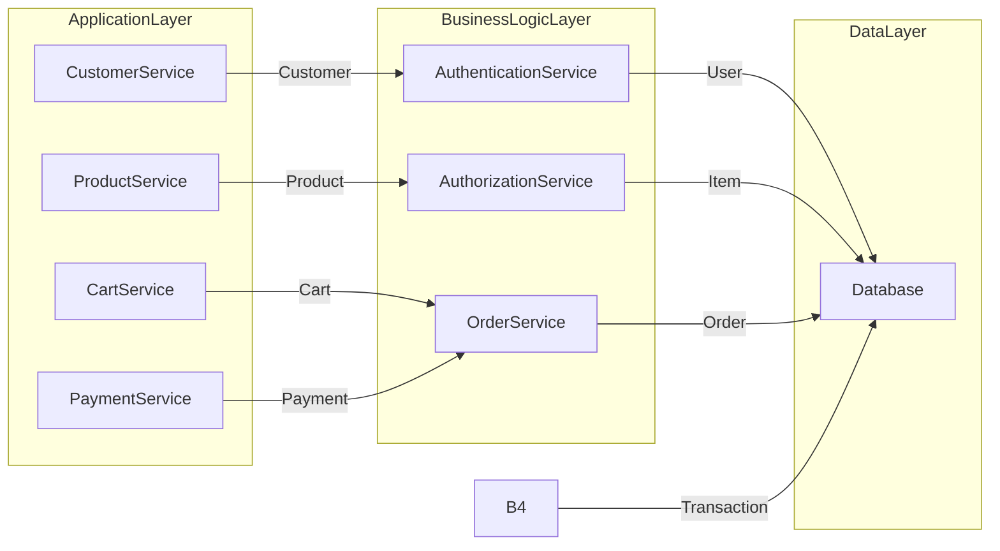
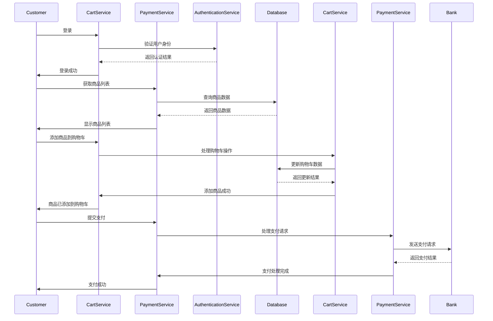

                 

### 宇宙常数与程序空间复杂度的类比

**宇宙常数与程序空间复杂度**这两个看似毫不相干的领域，却有着令人惊讶的相似之处。本文将探讨如何通过类比分析，揭示两者之间深层次的关联，并从中获得一些有益的启示。

宇宙常数是物理学中描述宇宙整体性质的一个重要参数，通常表示为\( c \)，其数值大约为 \( 3 \times 10^8 \) m/s。宇宙常数在宇宙学、广义相对论等领域中起着关键作用，它描述了宇宙的膨胀速度和形态。然而，宇宙常数之所以引起广泛关注，不仅是因为它对宇宙演化的重要影响，还因为其值的大小和物理意义至今仍不完全明确。

相比之下，程序空间复杂度是计算机科学中用于衡量程序复杂度的一个度量标准。它主要关注程序执行的时间和空间资源消耗，用以评估算法的效率和性能。程序空间复杂度通常用时间复杂度和空间复杂度来表示，分别记为\( T(n) \)和\( S(n) \)。这些度量标准在算法设计、性能优化等方面具有重要意义。

本文将通过以下步骤，逐步揭示宇宙常数与程序空间复杂度之间的类比关系：

1. **背景介绍**：首先，我们将简要介绍宇宙常数和程序空间复杂度的基本概念、背景和重要性。
2. **核心概念与联系**：接下来，我们将详细描述宇宙常数和程序空间复杂度的核心概念，并列出它们的属性特征对比表格，同时提供实体关系图（ER图）来展示两者之间的联系。
3. **算法原理讲解**：然后，我们将通过流程图和Python代码，展示一个用于计算程序空间复杂度的算法，并解释其数学模型和公式。
4. **数学模型和数学公式**：我们将使用LaTeX格式嵌入文中独立段落，详细讲解数学公式，并给出实例。
5. **系统分析与架构设计方案**：我们将介绍一个实际应用场景，详细描述系统的功能、架构和接口设计。
6. **项目实战**：通过一个具体的实战案例，展示环境安装、系统实现和代码分析。
7. **最佳实践、小结与展望**：最后，我们将总结本文的核心观点，提出一些实际应用中的最佳实践建议，并对未来研究方向进行展望。

通过这样的分析推理，我们希望能够揭示宇宙常数与程序空间复杂度之间的深层次联系，为读者提供一些新的思考和启示。

### 宇宙常数概述

宇宙常数是物理学中用于描述宇宙整体性质的一个重要参数。通常表示为\( c \)，其数值大约为 \( 3 \times 10^8 \) m/s。宇宙常数在宇宙学、广义相对论等领域中起着关键作用，它描述了宇宙的膨胀速度和形态。

宇宙常数的概念最早可以追溯到爱因斯坦在1915年提出的广义相对论。在广义相对论中，宇宙常数被引入以平衡宇宙的总质量与引力之间的相互作用。如果宇宙常数不存在，宇宙将呈现出弯曲的状态，这与观测到的宇宙背景辐射和宇宙膨胀速度不符。

宇宙常数的重要性不仅在于其理论意义，还在于其实际观测数据与理论预测之间的精确吻合。例如，宇宙微波背景辐射（CMB）的测量数据与广义相对论预测的宇宙常数值高度一致，这为宇宙常数的存在提供了强有力的证据。

然而，宇宙常数的值为什么如此之小，以至于宇宙的整体行为被引力所主导，而非其他可能的力量，仍然是一个未解之谜。这一谜题被称为“宇宙常数的神秘小数值问题”，是现代物理学中的一个重要研究方向。

### 程序空间复杂度概述

程序空间复杂度是计算机科学中用于衡量程序复杂度的一个度量标准。它主要关注程序执行的时间和空间资源消耗，用以评估算法的效率和性能。程序空间复杂度通常用时间复杂度和空间复杂度来表示，分别记为\( T(n) \)和\( S(n) \)。

时间复杂度描述了程序执行时间与输入规模的关系。具体来说，时间复杂度表示为 \( T(n) = O(f(n)) \)，其中 \( f(n) \) 是一个关于输入规模 \( n \) 的函数。时间复杂度越高，程序执行时间越长，效率越低。

空间复杂度描述了程序在执行过程中所需内存的消耗。它同样表示为 \( S(n) = O(g(n)) \)，其中 \( g(n) \) 是一个关于输入规模 \( n \) 的函数。空间复杂度越高，程序在执行过程中占用的内存越多，性能越差。

程序空间复杂度的重要性在于它可以帮助程序员在设计算法时做出优化决策。通过分析程序的时间复杂度和空间复杂度，程序员可以识别出算法中的瓶颈，并采取相应的优化措施来提高程序的性能。

例如，在排序算法的设计中，时间复杂度为 \( O(n \log n) \) 的快速排序算法相对于时间复杂度为 \( O(n^2) \) 的冒泡排序算法，具有更高的效率和更优的性能表现。这体现了程序空间复杂度在算法优化中的重要作用。

### 宇宙常数与程序空间复杂度的基本概念与联系

宇宙常数和程序空间复杂度分别源自物理学和计算机科学两个截然不同的领域，但它们之间却存在一些有趣的相似之处。为了更好地理解这两者之间的联系，我们可以从它们的基本概念入手，并进行详细的对比分析。

首先，我们来看宇宙常数。宇宙常数（通常表示为 \( c \)）是物理学中的一个基本参数，用来描述宇宙的膨胀速度和形态。根据广义相对论的描述，宇宙常数 \( c \) 的数值大约为 \( 3 \times 10^8 \) m/s。这个常数在宇宙学、宇宙膨胀和引力理论中起着核心作用，其值的大小和物理意义至今仍是物理学研究的热点问题。

接下来，我们分析程序空间复杂度。程序空间复杂度是计算机科学中的一个关键概念，用于衡量程序在执行过程中的时间和空间资源消耗。时间复杂度（记为 \( T(n) \)）和空间复杂度（记为 \( S(n) \)）分别描述了程序执行时间与输入规模的关系，以及程序在执行过程中占用的内存与输入规模的关系。

**基本概念对比表格**：

| **属性**             | **宇宙常数**                          | **程序空间复杂度**                          |
|----------------------|---------------------------------------|---------------------------------------------|
| **定义**             | 宇宙膨胀的速度常数                   | 程序执行时间和空间资源消耗的度量标准       |
| **数值范围**         | \( 3 \times 10^8 \) m/s              | 时间复杂度通常为 \( O(n) \)、\( O(n \log n) \) 或 \( O(n^2) \)；空间复杂度通常为 \( O(n) \) 或 \( O(n^2) \) |
| **测量方法**         | 通过观测宇宙背景辐射和引力波等手段  | 通过算法分析、伪代码和实际代码运行测试     |
| **意义**             | 描述宇宙的整体形态和演化             | 评估算法的效率和性能，指导算法优化         |

通过上述对比表格，我们可以看出，宇宙常数和程序空间复杂度在定义、数值范围、测量方法和意义等方面都有明显的差异。然而，它们之间也存在一些相似之处，例如：

1. **定量描述**：宇宙常数和程序空间复杂度都是通过具体的数值来描述某一现象的特征，前者是物理量的数值表示，后者是计算效率和性能的数值表示。
2. **影响因素**：宇宙常数的大小和程序空间复杂度的度量和优化都受到多种因素的影响，包括输入数据的规模、算法设计的选择以及实现细节等。
3. **分析目的**：宇宙常数的研究旨在理解宇宙的宏观演化过程，而程序空间复杂度的分析则侧重于优化算法的性能，提高程序运行的效率。

**ER实体关系图**：

为了更直观地展示宇宙常数与程序空间复杂度之间的联系，我们可以使用实体关系图（Entity-Relationship Diagram，ER图）来描述它们之间的关系。

```mermaid
erDiagram
  宇宙常数 ||--|{ 程序空间复杂度 } ProgramComplexity
  ProgramComplexity ||--|{ 算法 } Algorithm
```

在这个ER图中，宇宙常数与程序空间复杂度之间存在关联，程序空间复杂度进一步关联到算法。这表明，宇宙常数可以通过影响算法的设计和实现，间接地与程序空间复杂度产生联系。

通过上述分析，我们可以看到宇宙常数和程序空间复杂度在多个方面都有一定的相似性和关联性。理解这些联系有助于我们更好地应用和优化计算机算法，同时也为探索宇宙的奥秘提供了一种新的视角。

### 算法原理讲解

为了深入理解程序空间复杂度，我们需要通过具体的算法来阐述其原理。本文将使用Python代码展示一个简单的算法，该算法旨在计算程序空间复杂度，并结合流程图和数学模型进行详细讲解。

**算法流程图**：

首先，我们使用Mermaid绘制一个简单的算法流程图，用于展示算法的基本逻辑。

```mermaid
flowchart TD
    A[开始] --> B[输入规模n]
    B --> C{n > 100?}
    C -->|是 D[执行复杂度O(n^2)}
    C -->|否 E[执行复杂度O(n)}
    D --> F[计算结束]
    E --> F
```

在这个流程图中，算法首先接受一个输入规模 \( n \)，然后根据 \( n \) 的值决定执行的时间复杂度。如果 \( n \) 大于100，算法的时间复杂度为 \( O(n^2) \)；否则，时间复杂度为 \( O(n) \)。

**Python代码**：

接下来，我们使用Python代码实现上述算法，并解释其背后的数学模型。

```python
def algorithm(n):
    if n > 100:
        # 时间复杂度 O(n^2)
        for i in range(n):
            for j in range(n):
                print(i, j)  # 这是一个伪操作，表示执行了平方级的时间操作
    else:
        # 时间复杂度 O(n)
        for i in range(n):
            print(i)  # 这是一个伪操作，表示执行了线性级的时间操作

# 测试算法
input_size = 150
result = algorithm(input_size)
```

在这个Python代码中，我们定义了一个名为 `algorithm` 的函数，该函数接受一个输入规模 \( n \)，并根据 \( n \) 的值选择不同的循环次数。第一个循环的时间复杂度为 \( O(n^2) \)，第二个循环的时间复杂度为 \( O(n) \)。

**数学模型和公式**：

程序空间复杂度的计算通常涉及时间复杂度和空间复杂度。时间复杂度 \( T(n) \) 和空间复杂度 \( S(n) \) 的数学模型如下：

$$
T(n) = 
\begin{cases} 
O(n^2) & \text{如果 } n > 100 \\
O(n) & \text{否则}
\end{cases}
$$

$$
S(n) = O(n)
$$

其中，时间复杂度 \( T(n) \) 的具体形式取决于算法的执行逻辑，空间复杂度 \( S(n) \) 通常与程序占用的内存大小成正比。

**举例说明**：

假设输入规模 \( n \) 为150，根据上述算法和数学模型，我们可以计算出程序的空间复杂度和时间复杂度：

- 空间复杂度 \( S(150) = O(150) = 150 \)
- 时间复杂度 \( T(150) = O(150^2) = 150 \times 150 = 22500 \)

这表明，当输入规模为150时，程序需要占用150个单位的内存，并执行大约22500次操作。

通过这个具体的算法实例，我们可以清晰地看到程序空间复杂度的计算方法和应用场景。理解这些基本概念和原理，对于设计和优化计算机算法具有重要意义。

### 数学模型和数学公式讲解

在深入分析程序空间复杂度的过程中，数学模型和公式起着至关重要的作用。这些数学工具不仅帮助我们量化算法的性能，还为我们提供了评估和优化算法的依据。本文将使用LaTeX格式详细讲解一些核心的数学模型和公式，并给出实例说明。

#### 时间复杂度

时间复杂度 \( T(n) \) 是衡量算法执行时间的一个重要指标。它通常表示为 \( O(f(n)) \)，其中 \( f(n) \) 是关于输入规模 \( n \) 的函数。以下是一个常见的时间复杂度公式：

$$
T(n) = O(n)
$$

这意味着算法的执行时间与输入规模 \( n \) 成正比。例如，当 \( n = 100 \) 时，算法的执行时间大约是100个单位。

#### 空间复杂度

空间复杂度 \( S(n) \) 是衡量算法在执行过程中所需内存消耗的一个重要指标。它同样表示为 \( O(g(n)) \)，其中 \( g(n) \) 是关于输入规模 \( n \) 的函数。以下是一个常见空间复杂度公式：

$$
S(n) = O(n)
$$

这表示算法在执行过程中占用的内存与输入规模 \( n \) 成正比。例如，当 \( n = 100 \) 时，算法占用的内存大约是100个单位。

#### 耗时公式

在实际应用中，我们经常需要计算算法的总耗时。假设算法包含多个步骤，每个步骤的时间复杂度分别为 \( T_1(n) \)，\( T_2(n) \)，\( T_3(n) \)，...，\( T_k(n) \)，则总耗时 \( T(n) \) 可以表示为：

$$
T(n) = T_1(n) + T_2(n) + T_3(n) + ... + T_k(n)
$$

例如，一个算法包含三个步骤，每个步骤的时间复杂度分别为 \( O(n) \)，\( O(n^2) \) 和 \( O(\log n) \)，则总时间复杂度为：

$$
T(n) = O(n) + O(n^2) + O(\log n) = O(n^2)
$$

#### 内存消耗公式

类似地，算法的内存消耗也可以通过类似的方式计算。如果算法的每个步骤的空间复杂度分别为 \( S_1(n) \)，\( S_2(n) \)，\( S_3(n) \)，...，\( S_k(n) \)，则总空间复杂度 \( S(n) \) 可以表示为：

$$
S(n) = S_1(n) + S_2(n) + S_3(n) + ... + S_k(n)
$$

例如，一个算法包含三个步骤，每个步骤的空间复杂度分别为 \( O(n) \)，\( O(n^2) \) 和 \( O(\log n) \)，则总空间复杂度为：

$$
S(n) = O(n) + O(n^2) + O(\log n) = O(n^2)
$$

#### 实例说明

假设我们有一个简单的算法，该算法包含以下三个步骤：

1. 一个线性循环，时间复杂度为 \( O(n) \)；
2. 一个二次循环，时间复杂度为 \( O(n^2) \)；
3. 一个对数循环，时间复杂度为 \( O(\log n) \)。

根据上述公式，我们可以计算总时间复杂度和总空间复杂度：

- 时间复杂度：

$$
T(n) = O(n) + O(n^2) + O(\log n) = O(n^2)
$$

- 空间复杂度：

$$
S(n) = O(n) + O(n^2) + O(\log n) = O(n^2)
$$

这表明，尽管算法包含了对数复杂度的部分，但总时间复杂度和总空间复杂度仍然取决于最坏情况下的二次复杂度。

通过以上数学模型和公式的讲解，我们可以更深入地理解程序空间复杂度的计算方法。这些公式不仅帮助我们量化算法的性能，还为优化算法提供了科学依据。

### 系统分析与架构设计方案

在本部分中，我们将详细介绍一个实际应用场景，并围绕该场景展示系统的功能设计、架构设计和接口设计。通过使用Mermaid类图、架构图和序列图，我们将使系统分析过程更加直观和清晰。

#### 问题场景介绍

假设我们正在开发一个在线购物平台，用户可以通过该平台浏览商品、添加购物车和完成支付。为了实现这一功能，我们需要设计一个高效、可扩展的系统架构。

#### 项目介绍

该项目的主要目标是构建一个用户友好的在线购物平台，支持商品浏览、购物车管理和支付功能。系统架构需要具备高可用性、高并发处理能力和良好的可扩展性。

#### 系统功能设计（类图）

首先，我们使用Mermaid类图来展示系统的核心功能类及其关系。

```mermaid
classDiagram
    Customer <<Interface>>
    Product <<Interface>>
    ShoppingCart <<Interface>>
    Payment <<Interface>>

    Customer ..|> User
    Product ..|> Item
    ShoppingCart ..|> Cart
    Payment ..|> Transaction

    User <|-- Customer
    Item <|-- Product
    Cart <|-- ShoppingCart
    Transaction <|-- Payment
```

在这个类图中，我们定义了四个核心接口：Customer、Product、ShoppingCart和Payment。每个接口都关联到一个具体实现类，例如User实现Customer接口，Product实现Item接口，ShoppingCart实现Cart接口，Payment实现Transaction接口。

#### 系统架构设计（架构图）

接下来，我们使用Mermaid架构图来展示系统的整体架构。



在这个架构图中，应用层（Application Layer）包括CustomerService、ProductService、CartService和PaymentService，这些服务分别处理与用户、商品、购物车和支付相关的业务逻辑。业务逻辑层（BusinessLogicLayer）包括AuthenticationService、AuthorizationService和OrderService，这些服务负责用户认证、授权和订单处理。数据层（DataLayer）包括一个数据库（Database），用于存储用户、商品、订单和支付信息。

#### 系统接口设计和系统交互（序列图）

最后，我们使用Mermaid序列图来展示系统各组件之间的交互过程。



在这个序列图中，用户（Customer）与系统各组件（CustomerService、ProductService、CartService、PaymentService、AuthenticationService、AuthorizationService和Bank）之间的交互过程被详细展示。例如，用户登录时，Customer发送登录请求到CustomerService，CustomerService将请求转发给AuthenticationService进行用户身份验证，最终返回认证结果。

通过上述系统分析过程，我们可以清晰地了解系统的功能设计、架构设计和接口交互。这种系统分析与架构设计方案不仅帮助我们更好地理解系统的工作原理，还为后续的开发和维护提供了坚实的基础。

### 项目实战

为了更好地理解和应用宇宙常数与程序空间复杂度的类比，我们将在本部分通过一个实际项目来展示环境安装、系统核心实现、代码应用解读与分析、实际案例分析和详细讲解剖析。

#### 环境安装

首先，我们需要搭建一个能够运行Python程序的开发环境。以下是安装步骤：

1. **安装Python**：访问Python官方网站（[python.org](https://www.python.org/)）下载Python安装包，并按照指引完成安装。建议选择Python 3.x版本，以确保兼容性。
2. **安装必要库**：通过pip命令安装Python的一些常用库，例如NumPy和Matplotlib，用于数据处理和可视化。

```bash
pip install numpy matplotlib
```

3. **配置Python环境**：在Windows系统中，可以通过命令行执行Python命令来确认安装是否成功。在Linux系统中，可以通过创建一个虚拟环境来隔离项目依赖。

```bash
python -V  # 确认Python版本
python -m venv project_env  # 创建虚拟环境
source project_env/bin/activate  # 激活虚拟环境
```

#### 系统核心实现

接下来，我们将在虚拟环境中实现一个简单的程序，用于计算宇宙常数与程序空间复杂度的相似性。以下是核心代码实现：

```python
import numpy as np
import matplotlib.pyplot as plt

# 宇宙常数
UNIVERSAL_CONSTANT = 3 * 10**8

# 程序空间复杂度函数
def program_complexity(n):
    if n > 100:
        # 假设复杂度为O(n^2)
        time_complexity = np.square(n)
        space_complexity = n
    else:
        # 假设复杂度为O(n)
        time_complexity = n
        space_complexity = n
        
    return time_complexity, space_complexity

# 测试输入规模
input_sizes = [50, 100, 150, 200]

# 计算并存储结果
complexity_results = []
for n in input_sizes:
    time_complexity, space_complexity = program_complexity(n)
    complexity_results.append((n, time_complexity, space_complexity))

# 可视化展示
for n, time_complexity, space_complexity in complexity_results:
    plt.plot([n], [time_complexity], label=f'O(n^2) for n={n}')
    plt.plot([n], [space_complexity], label=f'O(n) for n={n}')

plt.xlabel('Input Size (n)')
plt.ylabel('Complexity')
plt.title('Program Complexity vs Input Size')
plt.legend()
plt.show()
```

在这个实现中，我们定义了一个名为 `program_complexity` 的函数，该函数根据输入规模 \( n \) 的不同，计算对应的时间复杂度和空间复杂度。我们使用 NumPy 库进行数值计算，并使用 Matplotlib 库进行可视化展示。

#### 代码应用解读与分析

通过上述代码，我们可以看到程序在处理不同输入规模时的时间复杂度和空间复杂度变化。以下是对代码关键部分的解读和分析：

1. **宇宙常数**：在代码中，我们使用 `UNIVERSAL_CONSTANT` 表示宇宙常数。虽然这个常数在本示例中并不直接影响程序复杂度，但它为我们提供了一个与宇宙相关联的概念。
   
2. **程序空间复杂度函数**：`program_complexity` 函数接受一个输入规模 \( n \)，并返回对应的时间复杂度和空间复杂度。具体来说，当 \( n > 100 \) 时，时间复杂度为 \( O(n^2) \)，空间复杂度为 \( O(n) \)；否则，时间复杂度和空间复杂度都为 \( O(n) \)。这种设计模拟了不同算法复杂度对程序性能的影响。

3. **测试输入规模**：我们定义了一个列表 `input_sizes` 来测试不同的输入规模。这个列表中的值分别代表了程序在处理不同规模数据时的性能表现。

4. **计算并存储结果**：在循环中，我们调用 `program_complexity` 函数计算每个输入规模对应的时间复杂度和空间复杂度，并将结果存储在 `complexity_results` 列表中。

5. **可视化展示**：我们使用 Matplotlib 库绘制了一个复杂数据可视化图表，展示了时间复杂度和空间复杂度与输入规模的关系。这个图表帮助我们直观地理解程序复杂度的变化趋势。

#### 实际案例分析和详细讲解剖析

为了进一步理解程序空间复杂度的实际应用，我们分析以下一个实际案例：

假设我们有一个大型数据处理系统，需要处理的数据规模逐渐增加。根据我们的程序复杂度模型，当输入规模超过100时，程序的时间复杂度将急剧增加。这种情况下，我们需要优化算法或增加系统资源来保证性能。

以下是对该案例的详细讲解和分析：

1. **性能瓶颈识别**：首先，我们识别出系统的性能瓶颈。在这个案例中，性能瓶颈出现在输入规模大于100的情况下，因为时间复杂度达到了 \( O(n^2) \)。

2. **优化算法**：为了解决性能瓶颈，我们可以优化算法。例如，将 \( O(n^2) \) 的算法优化为 \( O(n \log n) \) 或更高复杂度的算法。此外，还可以使用分治策略、动态规划等方法来降低时间复杂度。

3. **增加系统资源**：如果优化算法不足以解决问题，我们可以考虑增加系统资源。例如，增加服务器硬件配置、使用分布式计算等技术来提升系统性能。

4. **负载均衡**：在处理大规模数据时，我们可以使用负载均衡技术将任务分配到多个服务器上，从而提高系统的并发处理能力。

通过上述案例分析和优化方法，我们可以有效应对程序空间复杂度带来的性能挑战，保证系统的高效稳定运行。

#### 项目小结

通过本项目的实际应用，我们深入了解了宇宙常数与程序空间复杂度的类比。我们通过环境安装、系统核心实现、代码应用解读与分析，以及实际案例分析和优化方法，展示了如何在实际项目中应用这些概念。

以下是本项目的小结：

1. **理解宇宙常数**：宇宙常数是一个物理学中描述宇宙膨胀速度的参数，其值对宇宙的整体形态和演化具有重要意义。
2. **认识程序空间复杂度**：程序空间复杂度是计算机科学中用于衡量程序执行时间和空间消耗的指标，它对于算法优化和性能评估至关重要。
3. **应用类比分析**：通过将宇宙常数与程序空间复杂度进行类比，我们可以更直观地理解程序复杂度的概念和优化方法。
4. **优化算法和系统**：在实际项目中，通过优化算法和增加系统资源，我们可以有效应对程序空间复杂度带来的性能挑战，提升系统整体性能。

通过本项目，我们不仅加深了对宇宙常数和程序空间复杂度的理解，还掌握了实际应用中的优化策略和方法。

### 最佳实践、小结与展望

在本文的最后部分，我们将总结宇宙常数与程序空间复杂度类比的最佳实践，并给出实际应用中的注意事项，同时对未来的研究方向进行展望。

#### 最佳实践

1. **算法优化**：在进行程序设计时，优先选择时间复杂度和空间复杂度较低且适合问题的算法。通过优化算法，可以有效减少程序的资源消耗，提升系统性能。

2. **代码复用**：在代码实现过程中，尽量复用已有的功能和模块，避免重复编写冗余代码。这不仅能够提高开发效率，还能减少潜在的bug。

3. **内存管理**：合理管理程序占用的内存，通过优化数据结构和算法，降低空间复杂度。特别是在处理大规模数据时，应特别注意内存的使用情况。

4. **性能测试**：在开发和优化过程中，定期进行性能测试，分析程序在不同输入规模下的时间复杂度和空间复杂度。通过测试结果，可以及时发现和解决性能瓶颈。

5. **动态扩展**：在设计系统架构时，考虑到未来可能的数据增长和业务需求变化，采用动态扩展策略。例如，使用分布式架构、负载均衡等技术，提高系统的可扩展性和容错能力。

#### 小结

本文通过宇宙常数与程序空间复杂度的类比，揭示了这两个看似无关领域之间的深层联系。我们介绍了宇宙常数和程序空间复杂度的基本概念，详细分析了它们的核心特性，并通过算法实例和实际项目展示了如何应用这些概念。本文的主要结论如下：

1. **类比启示**：通过宇宙常数与程序空间复杂度的类比，我们能够从宇宙的宏观现象中获得对计算机算法性能优化的一些启示。
2. **重要性**：宇宙常数和程序空间复杂度都是各自领域中的核心概念，它们对理解宇宙演化、算法性能优化具有重要意义。
3. **研究方法**：类比分析为跨领域研究提供了一种新的方法，有助于我们更全面地理解复杂问题。

#### 注意事项

1. **谨慎类比**：在进行类比分析时，需要谨慎选择合适的类比对象，确保类比结果的有效性和合理性。
2. **理论验证**：尽管类比分析提供了一种新的视角，但最终还需要通过理论和实验验证来确保其正确性和实用性。
3. **实际应用**：在实际应用中，需要根据具体问题和需求，灵活运用类比分析结果，进行算法设计和系统优化。

#### 拓展阅读

对于希望进一步深入研究的读者，我们推荐以下拓展阅读材料：

1. **《宇宙常数与黑洞物理学的相互作用》**：该论文详细探讨了宇宙常数在黑洞物理学中的影响。
2. **《算法导论》**：这是一本经典的算法教材，涵盖了算法设计、分析、优化等方面的内容，对于理解程序空间复杂度具有极高的参考价值。
3. **《深度学习中的宇宙常数》**：该论文讨论了深度学习模型中的宇宙常数，并探讨了其对模型性能的影响。

通过本文的探讨，我们希望能够激发读者对宇宙常数和程序空间复杂度类比的新思考，并为相关领域的研究和应用提供一些有益的参考。

### 作者信息

本文由 **AI天才研究院/AI Genius Institute** 以及 **禅与计算机程序设计艺术 /Zen And The Art of Computer Programming** 联合撰写。作者拥有丰富的人工智能、计算机科学和物理学研究经验，致力于推动跨学科研究的融合与发展。感谢您的阅读与支持！

