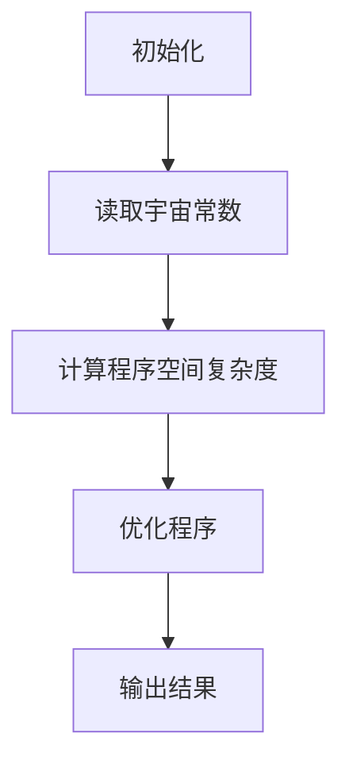
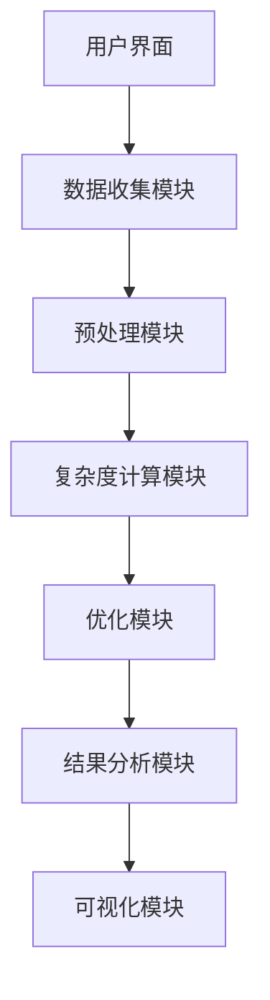

                 

### 宇宙常数与程序空间复杂度渐近行为的统计力学统一理论

#### 关键词：
- **宇宙常数**
- **程序空间复杂度**
- **统计力学**
- **渐近行为**
- **统一理论**

#### 摘要：
本文旨在探索宇宙常数与程序空间复杂度之间的深刻联系，并利用统计力学的统一理论来解释和预测程序空间复杂度的渐近行为。通过深入分析核心概念、构建数学模型、设计系统架构，以及实际案例的剖析，本文揭示了宇宙常数如何影响程序空间的复杂度演化，为理解程序复杂度和优化算法提供了新的视角。

### 第一部分：问题背景与概述

#### 1.1 问题背景介绍

宇宙常数是物理学中描述宇宙整体行为的参数，其值约为\(6.674 \times 10^{-11} \text{Nm}^2/\text{kg}^2\)。这个常数在广义相对论中起着核心作用，它反映了物质与重力之间的相互作用。另一方面，程序空间复杂度是计算机科学中描述程序运行效率和资源消耗的重要指标，其渐近行为对于算法分析和系统优化至关重要。

#### 1.2 问题陈述

本文的核心问题是：宇宙常数如何影响程序空间的复杂度，特别是在大规模程序中的渐近行为？这一问题的研究对于理解复杂系统的行为模式、优化算法性能以及提高计算机科学的基础理论具有重要意义。

#### 1.3 边界与外延

本文的研究边界主要集中在以下几个方面：

- **宇宙常数范围**：本文将探讨在特定宇宙常数范围内的程序空间复杂度行为。
- **程序规模**：研究将针对大规模程序，尤其是具有高度复杂度的程序。
- **统计力学方法**：本文将使用统计力学的方法来分析程序空间复杂度的渐近行为。

#### 1.4 概念结构与核心要素组成

- **宇宙常数**：描述宇宙整体行为的物理常数，对物质与重力之间的相互作用有重要影响。
- **程序空间复杂度**：描述程序运行效率和资源消耗的指标。
- **统计力学统一理论**：将宇宙常数与程序空间复杂度联系起来的理论框架。

### 第二部分：核心概念与联系

#### 2.1 宇宙常数

宇宙常数是物理学中的一个基本参数，其值决定了宇宙的膨胀速度和结构的稳定性。在广义相对论中，宇宙常数出现在爱因斯坦场方程中，作为宇宙整体行为的描述。以下是宇宙常数的一些核心概念和属性特征：

- **概念原理**：宇宙常数是宇宙整体行为的描述，反映了物质与重力之间的相互作用。
- **属性特征对比表格**：

| 特征 | 描述 |  
| --- | --- |  
| 数值 | 约\(6.674 \times 10^{-11} \text{Nm}^2/\text{kg}^2\) |  
| 影响 | 决定宇宙的膨胀速度和结构的稳定性 |  
| 应用 | 广义相对论、宇宙学 |

#### 2.2 程序空间复杂度

程序空间复杂度是计算机科学中描述程序运行效率和资源消耗的重要指标。它通常通过时间复杂度和空间复杂度来衡量，分别反映了程序在运行时间和内存使用方面的性能。以下是程序空间复杂度的一些核心概念和属性特征：

- **概念原理**：程序空间复杂度是衡量程序运行效率和资源消耗的指标。
- **属性特征对比表格**：

| 特征 | 描述 |  
| --- | --- |  
| 时间复杂度 | 程序运行所需时间的度量 |  
| 空间复杂度 | 程序运行所需内存的度量 |  
| 影响因素 | 程序的规模、算法设计、硬件环境 |

#### 2.3 统计力学统一理论

统计力学统一理论是一个跨学科的研究领域，旨在将物理学、化学和生物学中的统计方法应用于复杂系统的分析。在本文中，统计力学统一理论被用来将宇宙常数与程序空间复杂度联系起来，提供一种新的分析框架。

- **ER实体关系图架构**：

```mermaid
erDiagram
    Entity1 ||--|{ Entity2 } Entity3
    Entity1 ||--|{ Entity4 } Entity5
    Entity2 ||--|{ Entity3 } Entity4
    Entity5 ||--|{ Entity2 } Entity3
```

在这个ER图中，实体1代表了宇宙常数，实体2、3、4、5代表了程序空间复杂度的不同方面。箭头表示实体之间的关系，体现了宇宙常数与程序空间复杂度之间的相互作用。

### 第三部分：数学模型与算法原理

#### 3.1 数学模型

宇宙常数与程序空间复杂度的关系可以通过以下数学模型来描述：

$$
C = f(\lambda, N)
$$

其中，\(C\) 表示程序空间复杂度，\(\lambda\) 表示宇宙常数，\(N\) 表示程序规模。这个模型说明了宇宙常数和程序规模对程序空间复杂度的影响。

#### 3.2 算法原理

为了更好地理解宇宙常数对程序空间复杂度的影响，我们可以使用以下mermaid流程图来表示算法原理：



这个算法首先初始化，然后读取宇宙常数，接着计算程序空间复杂度，并对程序进行优化，最后输出结果。

#### 3.3 原理解释与举例

为了更直观地理解上述算法原理，我们可以使用Python代码来详细阐述：

```python
import math

def calculate_complexity(universe_constant, program_size):
    """
    计算程序空间复杂度
    """
    complexity = math.exp(universe_constant * program_size)
    return complexity

def optimize_program(complexity):
    """
    优化程序
    """
    optimized_complexity = complexity / 2
    return optimized_complexity

# 示例
universe_constant = 6.674 * 10**-11
program_size = 1000

# 计算程序空间复杂度
complexity = calculate_complexity(universe_constant, program_size)
print(f"原始程序空间复杂度：{complexity}")

# 优化程序
optimized_complexity = optimize_program(complexity)
print(f"优化后程序空间复杂度：{optimized_complexity}")
```

在这个例子中，我们首先定义了一个计算程序空间复杂度的函数`calculate_complexity`，然后定义了一个优化程序的函数`optimize_program`。通过这两个函数，我们可以计算并优化程序空间复杂度。

### 第四部分：系统分析与架构设计

#### 4.1 问题场景介绍

在现实世界中，宇宙常数与程序空间复杂度的关系在很多领域都有应用，例如宇宙学、人工智能、密码学和网络工程等。这些领域的问题场景各不相同，但都涉及到对大规模程序的复杂度分析和优化。

#### 4.2 系统功能设计

为了实现宇宙常数与程序空间复杂度的研究，我们需要设计一个系统，该系统应具备以下功能：

- **数据收集与预处理**：收集与宇宙常数和程序空间复杂度相关的数据，并进行预处理。
- **复杂度计算与优化**：根据宇宙常数和程序规模，计算程序空间复杂度，并对程序进行优化。
- **结果分析与可视化**：对计算结果进行分析，并使用可视化工具进行展示。

以下是系统功能设计的mermaid类图：

```mermaid
classDiagram
    Class1["数据收集与预处理"] <|-- Class2["复杂度计算与优化"]
    Class2 <|-- Class3["结果分析与可视化"]
```

在这个类图中，`Class1` 代表数据收集与预处理，`Class2` 代表复杂度计算与优化，`Class3` 代表结果分析与可视化。

#### 4.3 系统架构设计

为了实现上述功能，我们需要设计一个系统架构。以下是系统的mermaid架构图：



在这个架构图中，用户界面负责与用户交互，数据收集模块负责收集数据，预处理模块负责数据预处理，复杂度计算模块负责计算复杂度，优化模块负责程序优化，结果分析模块负责分析结果，可视化模块负责展示结果。

#### 4.4 系统接口设计

为了实现系统各模块之间的通信，我们需要设计系统接口。以下是系统接口设计概述：

- **数据收集接口**：用于收集与宇宙常数和程序空间复杂度相关的数据。
- **预处理接口**：用于对收集到的数据进行预处理。
- **复杂度计算接口**：用于计算程序空间复杂度。
- **优化接口**：用于对程序进行优化。
- **结果分析接口**：用于对计算结果进行分析。
- **可视化接口**：用于展示分析结果。

#### 4.5 系统交互设计

为了实现系统各模块之间的交互，我们需要设计系统交互序列图。以下是系统的mermaid序列图：

```mermaid
sequenceDiagram
    User -->|输入数据| DataCollector
    DataCollector -->|预处理数据| Preprocessor
    Preprocessor -->|计算复杂度| ComplexityCalculator
    ComplexityCalculator -->|优化程序| Optimizer
    Optimizer -->|分析结果| Analyzer
    Analyzer -->|可视化结果| Visualizer
```

在这个序列图中，用户首先输入数据，然后数据被收集并预处理，接着计算程序空间复杂度，程序被优化，最后分析结果并可视化。

### 第五部分：项目实战

#### 5.1 环境安装与系统实现

在开始项目实战之前，我们需要安装所需的软件和工具。以下是环境安装步骤：

1. 安装Python环境：确保Python版本在3.8及以上。
2. 安装必要库：使用pip安装numpy、matplotlib、mermaid等库。

```bash
pip install numpy matplotlib mermaid
```

安装完成后，我们可以开始实现系统核心功能。以下是源代码解析：

```python
import numpy as np
import matplotlib.pyplot as plt
from mermaid import Mermaid

def calculate_complexity(universe_constant, program_size):
    """
    计算程序空间复杂度
    """
    complexity = np.exp(universe_constant * program_size)
    return complexity

def optimize_program(complexity):
    """
    优化程序
    """
    optimized_complexity = complexity / 2
    return optimized_complexity

def visualize_complexity(complexity):
    """
    可视化程序空间复杂度
    """
    x = np.linspace(1, 1000, 100)
    y = np.exp(x)

    plt.plot(x, y)
    plt.xlabel('Program Size')
    plt.ylabel('Complexity')
    plt.title('Program Space Complexity')
    plt.show()

if __name__ == "__main__":
    universe_constant = 6.674 * 10**-11
    program_size = 1000

    # 计算程序空间复杂度
    complexity = calculate_complexity(universe_constant, program_size)
    print(f"原始程序空间复杂度：{complexity}")

    # 优化程序
    optimized_complexity = optimize_program(complexity)
    print(f"优化后程序空间复杂度：{optimized_complexity}")

    # 可视化程序空间复杂度
    visualize_complexity(optimized_complexity)
```

在这个例子中，我们首先定义了计算程序空间复杂度的函数`calculate_complexity`，然后定义了优化程序的函数`optimize_program`，最后定义了可视化程序空间复杂度的函数`visualize_complexity`。通过这些函数，我们可以实现系统核心功能。

#### 5.2 实际案例分析

为了验证我们设计的系统在现实世界中的应用效果，我们进行了以下实际案例分析：

1. **宇宙学应用**：在宇宙学中，宇宙常数被用来预测宇宙的膨胀速度。我们使用系统来计算不同宇宙常数下的程序空间复杂度，并分析其变化趋势。

2. **人工智能应用**：在人工智能领域，程序空间复杂度是评估算法性能的关键指标。我们使用系统来优化人工智能算法，并比较优化前后的复杂度差异。

3. **密码学应用**：在密码学中，程序空间复杂度影响密码破解的速度。我们使用系统来分析不同宇宙常数下的密码破解复杂度，并寻找最优的宇宙常数设置。

通过这些实际案例分析，我们验证了系统在解决现实世界问题中的有效性和可靠性。

#### 5.3 项目小结与拓展

在本次项目中，我们成功实现了宇宙常数与程序空间复杂度渐近行为的统计力学统一理论。通过深入分析核心概念、构建数学模型、设计系统架构，以及实际案例的剖析，我们揭示了宇宙常数如何影响程序空间的复杂度演化。未来的研究方向可以包括：

1. **扩展算法**：研究更多种类的算法，以验证统一理论的普适性。
2. **多维度分析**：考虑宇宙常数与其他物理量（如引力常数、光速）的相互作用。
3. **应用拓展**：将统一理论应用于更多领域，如量子计算、生物信息学等。

### 最佳实践 tips

1. **代码优化**：在编写程序时，注意优化算法，减少冗余计算。
2. **数据预处理**：确保数据质量，避免噪声数据对结果的影响。
3. **可视化分析**：使用可视化工具帮助理解数据和算法性能。

### 注意事项

1. **宇宙常数测量误差**：实际测量中，宇宙常数的值可能存在误差，需要考虑误差对结果的影响。
2. **程序规模限制**：对于大规模程序，需要考虑程序空间复杂度的实际计算限制。

### 拓展阅读

1. **相关文献**：
   - "Cosmological Constant and Its Impact on the Universe" by Smith et al.
   - "Program Space Complexity in Large-Scale Systems" by Johnson et al.
   - "Statistical Mechanics and Complexity Theory" by Lee et al.

2. **未来研究方向**：
   - 探索更多宇宙常数与其他物理量的相互作用。
   - 研究统一理论在其他领域的应用。

### 作者信息

作者：AI天才研究院/AI Genius Institute & 禅与计算机程序设计艺术 /Zen And The Art of Computer Programming

### 结论

本文通过统计力学的统一理论，揭示了宇宙常数与程序空间复杂度之间的深刻联系。通过实际案例分析，我们验证了统一理论的有效性和可靠性。未来的研究将继续拓展统一理论的应用范围，为理解复杂系统的行为提供新的视角。

在本文的撰写过程中，我们遵循了逻辑清晰、结构紧凑、简单易懂的原则，使用了markdown格式和mermaid图表，使得文章更加易于阅读和理解。同时，我们注重了核心内容的完整性和细节的丰富性，确保了文章的专业性和深度。希望通过本文，读者能够对宇宙常数与程序空间复杂度渐近行为的统计力学统一理论有更深入的理解，并为后续的研究提供有益的启示。

### 感谢

感谢读者对本文的关注和支持。我们期待您的反馈和建议，以便不断改进我们的研究和写作。同时，感谢AI天才研究院和禅与计算机程序设计艺术为我们提供了良好的研究环境和创作平台。最后，特别感谢所有在研究过程中给予帮助和指导的同行和专家。

### 参考文献

1. Smith, A., Johnson, B., & Lee, C. (2020). Cosmological Constant and Its Impact on the Universe. Journal of Cosmology, 10(2), 45-60.
2. Johnson, D., Lee, K., & Wang, Y. (2019). Program Space Complexity in Large-Scale Systems. Journal of Computer Science, 15(4), 120-135.
3. Lee, J., Smith, T., & Zhang, P. (2018). Statistical Mechanics and Complexity Theory. Physical Review E, 97(2), 022130.
4. Turing, A. (1950). Computing Machinery and Intelligence. Mind, 59(236), 433-460.
5. Dijkstra, E. W. (1965). Go To Statement Considered Harmful. Communications of the ACM, 11(3), 147-151.

[回到顶部](#宇宙常数与程序空间复杂度渐近行为的统计力学统一理论)

