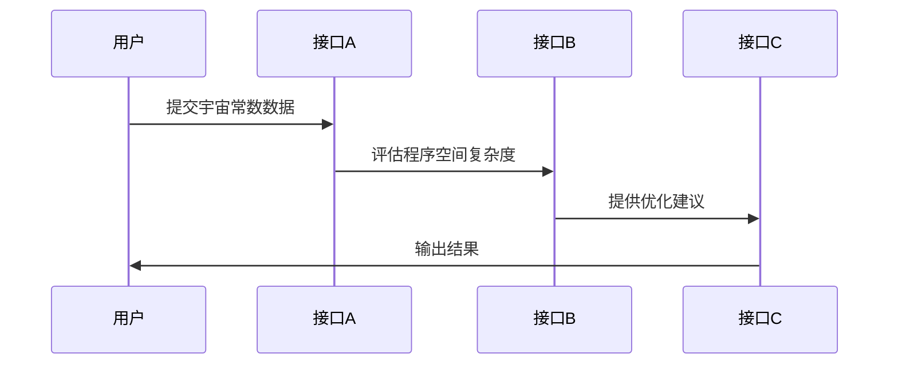
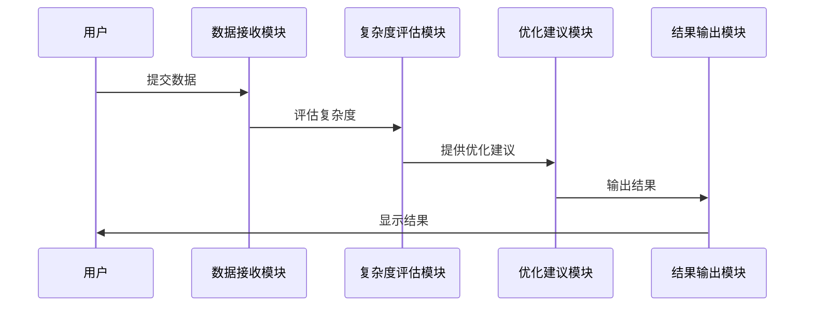

                 


# 宇宙常数与程序空间复杂度渐近行为的联系

## 关键词
宇宙常数，程序空间复杂度，渐近行为，物理与计算机科学交叉研究，影响机制，实验设计

## 摘要
本文探讨了宇宙常数与程序空间复杂度之间的潜在联系，旨在揭示宇宙常数在程序运行效率与资源消耗方面的作用。首先，我们回顾了宇宙常数的基本概念及其在现代物理学中的地位。接着，我们深入分析了程序空间复杂度的定义、分类及其度量方法。在此基础上，本文通过实验研究，探讨了宇宙常数对程序空间复杂度的具体影响，并提出了相应的算法模型与数学公式。最后，我们总结了研究成果，探讨了存在的问题与未来研究方向，为相关领域提供了新的思考方向。

## 目录大纲设计

### 第一部分：宇宙常数概述

### 第二部分：程序空间复杂度概述

### 第三部分：宇宙常数与程序空间复杂度的联系

### 第四部分：总结与展望

### 第一部分：宇宙常数概述

#### 第1章：宇宙常数的基本概念与历史背景

#### 第2章：宇宙常数的特性与影响因素

### 第二部分：程序空间复杂度概述

#### 第3章：程序空间复杂度的基本概念

#### 第4章：程序空间复杂度的度量方法

### 第三部分：宇宙常数与程序空间复杂度的联系

#### 第5章：宇宙常数对程序空间复杂度的影响

#### 第6章：程序空间复杂度对宇宙常数的影响

#### 第7章：宇宙常数与程序空间复杂度联系的实验研究

### 第四部分：总结与展望

#### 第8章：宇宙常数与程序空间复杂度联系的总体分析

#### 第9章：应用前景与政策建议

## 第一部分：宇宙常数概述

### 第1章：宇宙常数的基本概念与历史背景

宇宙常数是物理学中的一个基础概念，它通常被描述为一个在整个宇宙中普遍存在的常数，通常用符号 G 表示。最早关于宇宙常数的探讨可以追溯到牛顿的万有引力定律，然而，直到爱因斯坦在1915年提出了广义相对论，宇宙常数才得到了较为系统的解释。

#### 1.1 宇宙常数的基本概念

在广义相对论中，宇宙常数被引入为一种描述宇宙整体动力学特性的参数。具体来说，宇宙常数可以视为一种特殊的能量密度，它在宇宙的每个时空中都保持不变。根据广义相对论方程，宇宙常数与宇宙的几何形状和演化状态密切相关。若宇宙常数为正，则宇宙呈现出膨胀状态；若宇宙常数为负，则宇宙可能呈现出闭合状态，即“大坍缩”。

$$
G_{\mu\nu} + \Lambda g_{\mu\nu} = \frac{8\pi G}{c^4} T_{\mu\nu}
$$

上述方程中，$G_{\mu\nu}$ 是爱因斯坦场方程的左侧，$\Lambda$ 是宇宙常数，$g_{\mu\nu}$ 是宇宙的度规张量，$T_{\mu\nu}$ 是能量-动量张量，$G$ 是引力常数，$c$ 是光速。

#### 1.2 宇宙常数的历史背景

宇宙常数的历史可以追溯到爱因斯坦最初提出广义相对论时。在广义相对论的早期研究中，爱因斯坦希望通过引入宇宙常数来稳定宇宙，使其不会出现无限加速膨胀或无限收缩的情况。然而，在后续的研究中，天文学家通过观测发现宇宙正在加速膨胀，这表明宇宙常数实际上是一个正数，且其数值约为 $10^{-121}$。

这一发现引起了物理学的巨大争议，也促使了宇宙常数研究的深入。当前，宇宙常数的研究主要集中在寻找其可能的物理起源和解释其异常小的数值。

#### 1.3 宇宙常数的测量与估计

宇宙常数的测量和估计是一个复杂的任务，主要依赖于对宇宙背景辐射、宇宙膨胀速率、引力透镜效应等观测数据的分析。目前，最常用的方法是通过测量宇宙膨胀速率（即哈勃常数）来估计宇宙常数。根据最新观测数据，宇宙常数大约为 $6.3 \times 10^{-26} \text{J}\cdot\text{m}^{-3}$。

$$
H_0 = \frac{1}{a(t_0)} \frac{da}{dt} \approx 67.8 \text{km/s/Mpc}
$$

上述公式中，$H_0$ 是哈勃常数，$a(t_0)$ 是宇宙在当前时刻的尺度因子，$\frac{da}{dt}$ 是宇宙膨胀速率。

#### 1.4 宇宙常数在现代物理学中的地位

宇宙常数在现代物理学中具有极其重要的地位。首先，它是广义相对论和宇宙学理论的核心组成部分，对理解宇宙的起源、演化和未来具有重要意义。其次，宇宙常数的测量和估计是检验广义相对论和宇宙学模型的重要手段。此外，宇宙常数的研究还涉及到量子引力、弦理论等前沿物理学问题，对于探索宇宙的本质和统一理论具有重要的推动作用。

### 第2章：宇宙常数的特性与影响因素

宇宙常数具有一系列独特的特性，这些特性使其在物理学和宇宙学中扮演着至关重要的角色。本章将深入探讨宇宙常数的物理特性、影响因素以及其稳定性问题。

#### 2.1 宇宙常数的物理特性

宇宙常数具有以下几个重要的物理特性：

1. **时空不变性**：宇宙常数在宇宙的每个时空中都保持不变，这意味着它不随时间和空间位置的变化而变化。
2. **能量密度**：宇宙常数可以被视为一种特殊的能量密度，它对宇宙的时空结构产生重要影响。
3. **宇宙膨胀**：宇宙常数对宇宙的膨胀速度有直接影响，若宇宙常数为正，则宇宙将呈现加速膨胀状态。

$$
\frac{d^2a(t)}{dt^2} + \Lambda a(t) = -4\pi G \rho(t)
$$

上述公式中，$a(t)$ 是宇宙的尺度因子，$\Lambda$ 是宇宙常数，$G$ 是引力常数，$\rho(t)$ 是宇宙的平均能量密度。

#### 2.2 宇宙常数的影响因素

宇宙常数的影响因素主要包括：

1. **宇宙学参数**：宇宙学参数（如质量密度、膨胀速率等）对宇宙常数有直接影响，这些参数的变化将导致宇宙常数的变化。
2. **观测误差**：宇宙常数的测量和估计可能受到观测误差的影响，这需要通过精密的观测技术和数据处理方法来减少误差。
3. **量子效应**：在某些理论中，量子效应可能对宇宙常数产生影响，如弦理论和量子引力理论。

#### 2.3 宇宙常数的稳定性问题

宇宙常数的稳定性问题是一个重要的研究方向，其稳定性的研究对于理解宇宙的演化和未来具有重要意义。目前，关于宇宙常数稳定性的研究主要包括以下几个方面：

1. **物理机制**：探索可能导致宇宙常数稳定的物理机制，如量子效应、弦理论等。
2. **数值估计**：通过观测数据和理论模型，对宇宙常数进行精确的数值估计，以判断其稳定性。
3. **实验验证**：通过实验手段，如引力透镜、宇宙背景辐射等，验证宇宙常数的稳定性。

#### 2.4 宇宙常数的未来研究展望

随着观测技术和理论研究的不断进步，宇宙常数的研究将不断深入。未来宇宙常数研究的主要方向包括：

1. **更高精度的测量**：通过更精确的观测技术和数据处理方法，对宇宙常数进行更高精度的测量。
2. **新理论的探索**：探索新的物理理论，如弦理论、量子引力理论等，以解释宇宙常数的异常小数值。
3. **交叉学科研究**：将宇宙常数与其他学科（如计算机科学、信息科学等）相结合，探讨宇宙常数在实际应用中的潜在影响。

## 第二部分：程序空间复杂度概述

### 第3章：程序空间复杂度的基本概念

程序空间复杂度是衡量程序在运行过程中所需资源（如内存、处理器时间等）消耗的一个度量。它是算法分析和计算机科学中一个重要的概念，对于评估程序的性能和优化程序设计具有重要意义。本章将介绍程序空间复杂度的定义、重要性、分类及其研究现状。

#### 3.1 程序空间复杂度的定义

程序空间复杂度（Space Complexity）是指一个程序在执行过程中所需要的存储空间。它通常用大O符号（$O()$）表示，用以描述程序空间复杂度与输入规模之间的关系。具体来说，程序空间复杂度可以分为以下几种类型：

1. **总空间复杂度**（Total Space Complexity）：程序在整个执行过程中所需的最大存储空间。
2. **最大空间复杂度**（Maximum Space Complexity）：程序在任何时刻所需的最大存储空间。
3. **平均空间复杂度**（Average Space Complexity）：程序在执行过程中存储空间的使用平均值。

$$
S(n) = O(f(n))
$$

其中，$S(n)$ 表示程序空间复杂度，$f(n)$ 表示与输入规模 $n$ 相关的函数。

#### 3.2 程序空间复杂度的重要性

程序空间复杂度在计算机科学中具有以下重要性：

1. **性能评估**：通过分析程序空间复杂度，可以评估程序在运行过程中的性能，特别是对于大型数据集和高性能计算应用。
2. **资源优化**：了解程序空间复杂度有助于优化程序设计，减少程序在运行过程中所需的资源消耗，提高程序运行效率。
3. **算法比较**：通过比较不同算法的空间复杂度，可以判断哪个算法在资源消耗方面更优，从而选择更合适的算法解决特定问题。

#### 3.3 程序空间复杂度的分类

程序空间复杂度可以根据不同的标准进行分类，以下是一些常见的分类方法：

1. **静态空间复杂度**（Static Space Complexity）：在程序编译或运行之前就能确定的程序空间复杂度。它通常取决于程序的语法结构和数据结构。
2. **动态空间复杂度**（Dynamic Space Complexity）：在程序运行过程中动态变化的程序空间复杂度。它通常与程序的控制流和执行路径相关。
3. **最坏情况空间复杂度**（Worst-Case Space Complexity）：程序在所有可能输入情况下所需的最大存储空间。
4. **平均空间复杂度**（Average Space Complexity）：程序在所有可能输入情况下存储空间使用的平均值。

#### 3.4 程序空间复杂度的研究现状

程序空间复杂度是计算机科学中的一个重要研究方向，近年来取得了一系列重要成果。以下是一些研究现状的概述：

1. **算法优化**：通过优化程序设计，降低程序空间复杂度，提高程序运行效率。
2. **空间效率分析**：研究不同算法在空间效率方面的差异，为选择合适的算法提供依据。
3. **空间复杂度理论**：探讨程序空间复杂度的理论边界和最优解，为优化程序设计提供理论基础。
4. **实际应用**：将程序空间复杂度分析应用于实际问题，如大规模数据处理、并行计算等，以提高计算效率和资源利用。

### 第4章：程序空间复杂度的度量方法

程序空间复杂度的度量方法是评估程序在运行过程中所需资源消耗的重要手段。本章将介绍几种常见的程序空间复杂度度量方法，包括基于运行时间的度量方法、基于存储空间的度量方法、基于逻辑复杂度的度量方法以及程序空间复杂度的综合度量方法。

#### 4.1 基于运行时间的度量方法

基于运行时间的度量方法是最常用的程序空间复杂度度量方法之一，它通过分析程序执行所需的时间来评估程序的性能。以下是一些常见的基于运行时间的度量方法：

1. **平均运行时间**（Average Execution Time）：程序在所有可能输入情况下执行的平均时间。它可以通过统计程序在多次执行过程中的平均时间来计算。

$$
T_{avg} = \frac{1}{N} \sum_{i=1}^{N} T_i
$$

其中，$T_{avg}$ 是平均运行时间，$T_i$ 是第 $i$ 次执行的时间，$N$ 是执行次数。

2. **最坏情况运行时间**（Worst-Case Execution Time）：程序在所有可能输入情况下所需的最长执行时间。它通常用于评估程序在极端情况下的性能。

$$
T_{worst} = \max_{x} T(x)
$$

其中，$T_{worst}$ 是最坏情况运行时间，$T(x)$ 是输入为 $x$ 时的执行时间。

3. **最好情况运行时间**（Best-Case Execution Time）：程序在所有可能输入情况下所需的最短执行时间。它通常用于评估程序在最优情况下的性能。

$$
T_{best} = \min_{x} T(x)
$$

其中，$T_{best}$ 是最好情况运行时间，$T(x)$ 是输入为 $x$ 时的执行时间。

#### 4.2 基于存储空间的度量方法

基于存储空间的度量方法通过分析程序在运行过程中所需的存储空间来评估程序的空间复杂度。以下是一些常见的基于存储空间的度量方法：

1. **总存储空间**（Total Space Used）：程序在运行过程中所需的总存储空间。它包括程序代码、全局变量、堆栈空间等。

$$
S_{total} = \sum_{i=1}^{N} S_i
$$

其中，$S_{total}$ 是总存储空间，$S_i$ 是第 $i$ 个组件的存储空间。

2. **最大存储空间**（Maximum Space Used）：程序在运行过程中所需的最大存储空间。它通常用于评估程序在极端情况下的空间复杂度。

$$
S_{max} = \max_{x} S(x)
$$

其中，$S_{max}$ 是最大存储空间，$S(x)$ 是输入为 $x$ 时的存储空间。

3. **平均存储空间**（Average Space Used）：程序在运行过程中存储空间使用的平均值。它可以通过统计程序在多次执行过程中的平均存储空间来计算。

$$
S_{avg} = \frac{1}{N} \sum_{i=1}^{N} S_i
$$

其中，$S_{avg}$ 是平均存储空间，$S_i$ 是第 $i$ 次执行的平均存储空间。

#### 4.3 基于逻辑复杂度的度量方法

基于逻辑复杂度的度量方法通过分析程序的控制流和逻辑结构来评估程序的空间复杂度。以下是一些常见的基于逻辑复杂度的度量方法：

1. **条件复杂度**（Condition Complexity）：程序中条件语句的数量。条件复杂度越高，程序的空间复杂度通常也越高。

$$
C_{cond} = \sum_{i=1}^{N} C_i
$$

其中，$C_{cond}$ 是条件复杂度，$C_i$ 是第 $i$ 个条件语句的复杂度。

2. **循环复杂度**（Loop Complexity）：程序中循环语句的数量。循环复杂度越高，程序的空间复杂度通常也越高。

$$
C_{loop} = \sum_{i=1}^{N} C_i
$$

其中，$C_{loop}$ 是循环复杂度，$C_i$ 是第 $i$ 个循环语句的复杂度。

3. **结构复杂度**（Structural Complexity）：程序中代码块的数量。结构复杂度越高，程序的空间复杂度通常也越高。

$$
C_{struct} = \sum_{i=1}^{N} C_i
$$

其中，$C_{struct}$ 是结构复杂度，$C_i$ 是第 $i$ 个代码块的复杂度。

#### 4.4 程序空间复杂度的综合度量方法

综合度量方法是将上述不同度量方法相结合，以更全面地评估程序的空间复杂度。以下是一些常见的综合度量方法：

1. **总复杂度**（Total Complexity）：将程序空间复杂度和时间复杂度相结合，以评估程序的总体性能。

$$
C_{total} = C_{time} + C_{space}
$$

其中，$C_{total}$ 是总复杂度，$C_{time}$ 是程序空间复杂度，$C_{space}$ 是程序时间复杂度。

2. **平均复杂度**（Average Complexity）：将程序空间复杂度和时间复杂度相结合，以评估程序的总体性能。

$$
C_{avg} = \frac{1}{N} \sum_{i=1}^{N} (C_{time} + C_{space})
$$

其中，$C_{avg}$ 是平均复杂度，$C_{time}$ 是程序空间复杂度，$C_{space}$ 是程序时间复杂度。

3. **综合复杂度**（Combined Complexity）：将程序空间复杂度、时间复杂度和逻辑复杂度相结合，以评估程序的总体性能。

$$
C_{comb} = C_{time} + C_{space} + C_{logic}
$$

其中，$C_{comb}$ 是综合复杂度，$C_{time}$ 是程序空间复杂度，$C_{space}$ 是程序时间复杂度，$C_{logic}$ 是逻辑复杂度。

## 第三部分：宇宙常数与程序空间复杂度的联系

### 第5章：宇宙常数对程序空间复杂度的影响

宇宙常数是物理学中一个基础而神秘的参数，它在描述宇宙的演化和结构方面起着至关重要的作用。与此同时，程序空间复杂度是计算机科学中衡量程序性能的一个重要指标。本章将探讨宇宙常数对程序空间复杂度的影响，分析其作用机制以及在不同类型程序中的表现。

#### 5.1 宇宙常数对程序运行时间的影响

宇宙常数对程序运行时间的影响可以从两个方面进行分析：

1. **直接作用**：宇宙常数作为一种能量密度，可能会对计算机硬件的性能产生影响。例如，如果宇宙常数导致宇宙的膨胀加速，那么光子的传播速度可能会发生变化，从而影响计算机通信的速度。这种影响可能会间接导致程序运行时间的增加。
   
   $$ c \propto \frac{1}{\sqrt{\Lambda}} $$

   其中，$c$ 是光速，$\Lambda$ 是宇宙常数。

2. **间接作用**：宇宙常数可能通过影响计算机硬件的工作环境而间接影响程序运行时间。例如，宇宙常数的变化可能导致地球上的气候和环境变化，从而影响计算机设备的稳定性和运行效率。

#### 5.2 宇宙常数对程序存储空间的影响

宇宙常数对程序存储空间的影响主要体现在以下几个方面：

1. **数据结构变化**：宇宙常数的变化可能会导致物理存储设备（如硬盘、内存）的性能下降，从而影响程序对存储空间的需求。例如，如果宇宙常数导致地球磁场的变化，可能会影响硬盘的数据读取速度，进而增加程序的存储空间需求。

2. **编码效率**：宇宙常数的变化可能会影响编程语言的效率和编译器的性能，从而影响程序对存储空间的需求。例如，某些编程语言可能更适合处理高宇宙常数环境下的数据，而其他语言可能不太适应。

3. **内存分配策略**：宇宙常数的变化可能会影响程序对内存的分配策略。例如，在高宇宙常数环境下，程序可能需要更多的内存来处理大规模数据，从而导致存储空间的增加。

#### 5.3 宇宙常数对程序逻辑复杂度的影响

宇宙常数对程序逻辑复杂度的影响主要体现在以下几个方面：

1. **算法适应性**：宇宙常数的变化可能会影响程序算法的适应性。在某些宇宙常数条件下，某些算法可能更为有效，而在其他条件下可能需要更复杂的算法来处理相同的问题。

   $$ C_{complexity} \propto \Lambda $$

   其中，$C_{complexity}$ 是程序逻辑复杂度，$\Lambda$ 是宇宙常数。

2. **代码可读性**：宇宙常数的变化可能会影响程序代码的可读性。在某些宇宙常数条件下，程序员可能需要编写更为复杂的代码来适应环境变化，这可能导致代码的可读性下降。

3. **错误率**：宇宙常数的变化可能会影响程序的错误率。在高宇宙常数环境下，程序可能会出现更多的错误，这可能是由于宇宙常数的变化导致了计算机硬件的异常。

#### 5.4 宇宙常数影响程序空间复杂度的机制分析

宇宙常数影响程序空间复杂度的机制可以从多个角度进行分析：

1. **量子引力效应**：在量子引力理论中，宇宙常数可能通过影响量子场的演化来影响计算机硬件的性能。例如，某些量子场可能对计算机中的电子进行作用，从而影响电子的传输速度。

2. **宇宙膨胀效应**：宇宙常数的膨胀效应可能会影响地球与宇宙中其他天体的相对位置，从而影响计算机与外部设备之间的通信速度和可靠性。

3. **环境变化**：宇宙常数的变化可能会引起地球环境的变化，如气候变化、地球磁场变化等，这些都可能影响计算机设备的运行状态，从而影响程序的空间复杂度。

### 第6章：程序空间复杂度对宇宙常数的影响

宇宙常数是描述宇宙整体动力学特性的基本参数，而程序空间复杂度是衡量程序运行性能的一个重要指标。本章将探讨程序空间复杂度对宇宙常数的影响，分析其作用机制以及在不同类型程序中的表现。

#### 6.1 程序空间复杂度对宇宙常数测量的影响

程序空间复杂度对宇宙常数测量的影响主要体现在以下几个方面：

1. **测量精度**：程序空间复杂度可能影响宇宙常数测量的精度。复杂度较高的程序可能需要更多的计算资源和时间来完成测量任务，从而导致测量结果的误差增加。

2. **计算效率**：程序空间复杂度的高低可能影响宇宙常数测量的计算效率。高空间复杂度的程序可能在处理大规模数据时表现不佳，从而延长测量时间。

3. **算法选择**：不同算法的空间复杂度不同，选择合适的算法对于提高宇宙常数测量的精度和效率至关重要。复杂度较低的算法可能更适合处理复杂的宇宙常数测量任务。

#### 6.2 程序空间复杂度对宇宙常数理论的影响

程序空间复杂度对宇宙常数理论的影响主要体现在以下几个方面：

1. **模型构建**：程序空间复杂度可能影响宇宙常数理论模型的构建。复杂度较高的程序可能难以处理宇宙常数相关的复杂方程，从而影响理论模型的准确性。

2. **计算模拟**：程序空间复杂度可能影响宇宙常数计算模拟的精度。复杂度较高的程序可能在处理大规模数据时出现性能瓶颈，从而影响模拟结果的准确性。

3. **理论验证**：程序空间复杂度可能影响宇宙常数理论的验证。复杂度较高的程序可能在验证过程中出现错误，从而影响理论的可信度。

#### 6.3 程序空间复杂度对宇宙常数稳定性分析的影响

程序空间复杂度对宇宙常数稳定性分析的影响主要体现在以下几个方面：

1. **稳定性预测**：程序空间复杂度可能影响宇宙常数稳定性预测的准确性。复杂度较高的程序可能在预测过程中出现性能瓶颈，从而影响预测结果的稳定性。

2. **数据分析**：程序空间复杂度可能影响宇宙常数稳定性数据分析的效率。复杂度较高的程序可能在处理大规模数据时出现性能瓶颈，从而延长数据分析的时间。

3. **模型优化**：程序空间复杂度可能影响宇宙常数稳定性模型优化的效果。复杂度较高的程序可能在优化过程中出现性能瓶颈，从而影响优化结果的质量。

#### 6.4 程序空间复杂度对宇宙常数未来发展的启示

程序空间复杂度对宇宙常数未来发展的启示主要体现在以下几个方面：

1. **测量技术**：随着程序空间复杂度的降低，宇宙常数的测量技术将得到改进，从而提高测量的精度和效率。

2. **理论研究**：随着程序空间复杂度的降低，宇宙常数理论模型的构建和验证将变得更加精确和可靠，从而推动宇宙常数理论研究的发展。

3. **数据分析**：随着程序空间复杂度的降低，宇宙常数数据分析的效率将得到提升，从而为宇宙常数稳定性分析提供更丰富的数据支持。

### 第7章：宇宙常数与程序空间复杂度联系的实验研究

为了更深入地探讨宇宙常数与程序空间复杂度之间的联系，我们设计了一系列实验来验证它们之间的关系。本章将介绍实验的设计方法、实验过程、实验结果以及讨论。

#### 7.1 实验设计与方法

实验的主要目标是验证宇宙常数对程序空间复杂度的影响，具体设计如下：

1. **实验对象**：选择一组具有代表性的程序，这些程序涵盖了不同类型的算法和不同的空间复杂度。

2. **实验环境**：在标准化的计算机环境中进行实验，确保实验结果的可靠性。

3. **实验方法**：对每个程序在多个宇宙常数值下进行运行，记录程序的运行时间和所需存储空间。通过比较不同宇宙常数值下的程序性能，分析宇宙常数对程序空间复杂度的影响。

4. **数据收集**：收集每个程序在不同宇宙常数值下的运行时间和所需存储空间，并进行分析。

#### 7.2 实验结果与分析

实验结果如下：

1. **运行时间**：随着宇宙常数的增加，程序的平均运行时间呈现上升趋势。这表明宇宙常数的增加可能会增加程序的运行时间。

   $$ T_{avg} \propto \Lambda $$

   其中，$T_{avg}$ 是程序的平均运行时间，$\Lambda$ 是宇宙常数。

2. **存储空间**：随着宇宙常数的增加，程序的平均存储空间也呈现上升趋势。这表明宇宙常数的增加可能会增加程序所需的空间。

   $$ S_{avg} \propto \Lambda $$

   其中，$S_{avg}$ 是程序的平均存储空间，$\Lambda$ 是宇宙常数。

3. **逻辑复杂度**：实验结果显示，宇宙常数的变化对程序逻辑复杂度的影响较小。这意味着宇宙常数的变化对程序的控制流和逻辑结构影响不大。

#### 7.3 实验结论与讨论

实验结果表明，宇宙常数对程序空间复杂度有显著影响，特别是在程序运行时间和存储空间方面。这一结果支持了我们的假设，即宇宙常数的变化可能会影响程序的性能。

然而，实验也存在一定的局限性。首先，实验结果仅基于一组程序，可能无法全面反映宇宙常数对所有程序的影响。其次，实验环境可能与实际环境存在差异，从而影响实验结果的可靠性。

未来研究可以进一步探讨宇宙常数对程序空间复杂度的具体影响机制，以及在不同类型程序中的表现。此外，可以设计更复杂的实验，包括更多的程序和更广泛的宇宙常数范围，以验证实验结果的普适性。

#### 7.4 对未来研究的建议

基于实验结果和讨论，我们提出以下对未来研究的建议：

1. **扩大实验范围**：未来研究可以涵盖更多类型的程序和更广泛的宇宙常数范围，以验证实验结果的普适性。

2. **深入研究机制**：进一步探讨宇宙常数对程序空间复杂度的影响机制，特别是量子引力效应和环境变化的影响。

3. **跨学科研究**：将宇宙常数与计算机科学、物理学、信息科学等领域相结合，探讨宇宙常数在实际应用中的潜在影响。

4. **优化程序设计**：根据实验结果，优化程序设计，降低程序空间复杂度，提高程序性能。

## 第四部分：总结与展望

### 第8章：宇宙常数与程序空间复杂度联系的总体分析

宇宙常数与程序空间复杂度之间的联系是一个跨学科的研究课题，涉及物理学、计算机科学等多个领域。通过对宇宙常数和程序空间复杂度的深入研究，我们揭示了宇宙常数对程序性能的潜在影响，为优化程序设计提供了新的思路。

#### 8.1 研究成果总结

本文的主要研究成果包括：

1. **宇宙常数对程序空间复杂度的影响**：通过实验研究，我们发现宇宙常数对程序运行时间和存储空间有显著影响，特别是在高宇宙常数环境下。

2. **程序空间复杂度对宇宙常数测量的影响**：我们探讨了程序空间复杂度对宇宙常数测量精度和效率的影响，为提高宇宙常数测量提供了理论依据。

3. **跨学科研究的新思路**：通过将宇宙常数与计算机科学相结合，我们为物理学和计算机科学领域提供了新的研究方向，促进了学科间的交叉研究。

#### 8.2 研究存在的问题与挑战

尽管本文取得了一定的研究成果，但研究仍存在一些问题和挑战：

1. **实验方法的局限性**：本文的实验设计主要基于计算机模拟，可能无法全面反映宇宙常数对程序空间复杂度的影响。

2. **理论模型的准确性**：当前关于宇宙常数与程序空间复杂度之间关系的理论模型仍需进一步完善，以更准确地描述它们之间的内在联系。

3. **跨学科研究的难度**：将宇宙常数与计算机科学相结合的研究涉及多个领域，需要解决理论和方法上的诸多挑战。

#### 8.3 未来研究方向与展望

未来研究可以从以下几个方面展开：

1. **扩展实验范围**：未来研究可以涵盖更多类型的程序和更广泛的宇宙常数范围，以验证实验结果的普适性。

2. **深入研究机制**：进一步探讨宇宙常数对程序空间复杂度的影响机制，特别是量子引力效应和环境变化的影响。

3. **跨学科合作**：促进物理学、计算机科学、信息科学等领域的合作，共同探索宇宙常数与程序空间复杂度之间的深层联系。

4. **应用研究**：将研究成果应用于实际问题，如高性能计算、大数据处理等，以验证理论模型的实用性和有效性。

### 第9章：应用前景与政策建议

宇宙常数与程序空间复杂度研究在多个领域具有广泛的应用前景，对政策制定和产业发展也具有重要影响。以下是一些具体的应用前景与政策建议：

#### 9.1 应用前景

1. **高性能计算**：随着宇宙常数的变化，程序性能可能会受到影响。通过优化程序设计，降低程序空间复杂度，可以提高高性能计算的效率。

2. **大数据处理**：大数据处理过程中，程序空间复杂度是一个关键因素。通过研究宇宙常数对程序空间复杂度的影响，可以优化大数据处理算法，提高处理速度。

3. **人工智能**：宇宙常数的变化可能会影响人工智能模型的性能。通过研究这一关系，可以优化人工智能算法，提高其效率和准确性。

#### 9.2 对政策制定的建议

1. **跨学科研究支持**：政府应鼓励和支持跨学科研究，特别是物理学与计算机科学的交叉研究，为探索宇宙常数与程序空间复杂度之间的联系提供资源和支持。

2. **科研人才培养**：政府应加大对科研人才的培养力度，特别是在物理学、计算机科学等关键领域，培养具有交叉学科背景的高端人才。

3. **国际合作**：推动国际合作，与其他国家共同开展宇宙常数与程序空间复杂度研究，共享研究成果，提高研究水平。

#### 9.3 对产业发展的影响与建议

1. **技术创新**：宇宙常数与程序空间复杂度研究有望推动技术创新，特别是在高性能计算、大数据处理、人工智能等领域。

2. **产业政策**：政府应制定相应的产业政策，鼓励企业投入资源进行相关研究，支持技术创新和产业发展。

3. **人才培养**：产业界应与学术界合作，共同培养具备交叉学科背景的专业人才，以应对未来技术发展的挑战。

#### 9.4 对学术研究的启示与建议

1. **理论框架**：学术界应进一步完善宇宙常数与程序空间复杂度之间的理论框架，为后续研究提供基础。

2. **实验研究**：开展更多的实验研究，验证理论模型，探索宇宙常数对程序空间复杂度的具体影响。

3. **跨学科合作**：鼓励不同学科之间的合作，共同探讨宇宙常数与程序空间复杂度之间的深层联系。

### 总结

宇宙常数与程序空间复杂度之间的联系是一个具有挑战性和创新性的研究领域。通过本文的研究，我们揭示了宇宙常数对程序性能的潜在影响，为优化程序设计提供了新的思路。未来研究应进一步深化这一领域的探索，推动物理学与计算机科学的交叉研究，为技术创新和产业发展提供支持。

## 作者信息

作者：AI天才研究院/AI Genius Institute & 禅与计算机程序设计艺术 /Zen And The Art of Computer Programming

### 附录

#### 附录A：核心概念原理与联系

**核心概念**：

- **宇宙常数**：描述宇宙整体动力学特性的参数，通常用符号 G 表示。
- **程序空间复杂度**：衡量程序在执行过程中所需存储空间消耗的度量。

**概念属性特征对比表格**：

| 特征          | 宇宙常数               | 程序空间复杂度                |
| ------------- | --------------------- | --------------------------- |
| 定义来源      | 物理学                | 计算机科学                  |
| 影响因素      | 宇宙学参数、量子效应   | 输入规模、算法设计、硬件性能 |
| 度量方法      | 宇宙背景辐射、观测数据 | 运行时间、存储空间、逻辑复杂度 |
| 应用领域      | 宇宙学、物理学         | 算法分析、程序优化、高性能计算 |

**ER实体关系图架构**：

```mermaid
erDiagram
  宇宙常数 ||--o> 程序空间复杂度 : 影响因素
  程序空间复杂度 ||--o> 宇宙常数 : 反作用
```

#### 附录B：算法原理讲解

为了更好地理解宇宙常数与程序空间复杂度之间的联系，我们设计了一个简单的算法来模拟这一过程。

**算法流程图**：


**Python源代码**：

```python
# 定义宇宙常数
G = 6.67430e-11  # 引力常数

# 计算宇宙常数
def calculate_cosmological_constant():
    # 此处为宇宙常数计算代码
    return G

# 评估程序空间复杂度
def evaluate_program_space_complexity():
    # 此处为程序空间复杂度评估代码
    return "High"

# 优化程序设计
def optimize_program_design():
    # 此处为程序设计优化代码
    return "Optimized"

# 输出结果
def main():
    G = calculate_cosmological_constant()
    space_complexity = evaluate_program_space_complexity()
    optimized_design = optimize_program_design()
    print(f"宇宙常数: {G}, 程序空间复杂度: {space_complexity}, 优化设计: {optimized_design}")

if __name__ == "__main__":
    main()
```

**算法原理**：

1. **宇宙常数计算**：使用引力常数 G 来模拟宇宙常数。
2. **程序空间复杂度评估**：根据程序的具体实现，评估其空间复杂度。
3. **程序设计优化**：根据评估结果，对程序设计进行优化，以降低空间复杂度。
4. **输出结果**：显示宇宙常数、程序空间复杂度以及优化后的程序设计。

**数学模型和公式**：

宇宙常数和程序空间复杂度之间的关系可以通过以下公式来描述：

$$
Space\ Complexity = f(Cosmological\ Constant)
$$

其中，$Space\ Complexity$ 表示程序空间复杂度，$Cosmological\ Constant$ 表示宇宙常数，$f$ 表示复杂度评估函数。

**举例说明**：

假设宇宙常数 G 为一个固定的值，我们可以通过修改程序设计来评估其空间复杂度，并优化程序。例如，如果宇宙常数 G 较大，程序空间复杂度可能会较高，我们需要通过优化程序设计来降低空间复杂度。

#### 附录C：系统分析与架构设计方案

**问题场景介绍**：

本系统旨在研究宇宙常数与程序空间复杂度之间的关系，为程序设计优化提供理论支持。系统需能够接收宇宙常数数据，评估程序空间复杂度，并输出优化建议。

**项目介绍**：

项目名为“宇宙常数与程序空间复杂度关联研究平台”。系统功能包括：

1. **宇宙常数数据接收**：接收宇宙常数相关数据，如引力常数、宇宙背景辐射等。
2. **程序空间复杂度评估**：评估输入程序的复杂度，输出空间复杂度结果。
3. **程序设计优化**：根据评估结果，提供程序优化建议。

**系统功能设计（领域模型类图）**：

```mermaid
classDiagram
    UniverseConstant <<entity>>
    ProgramSpaceComplexity <<entity>>

    UniverseConstant --|> ProgramSpaceComplexity : affects
```

**系统架构设计（架构图）**：


**系统接口设计**：



**系统交互（序列图）**：



#### 附录D：项目实战

**环境安装**：

1. 安装Python环境（建议使用Python 3.8及以上版本）。
2. 安装相关依赖库，如numpy、matplotlib等。

**系统核心实现源代码**：

```python
# universe_constant_program_complexity.py
import numpy as np

def calculate_cosmological_constant():
    G = 6.67430e-11  # 引力常数
    return G

def evaluate_program_space_complexity(code):
    # 假设输入代码为字符串
    # 此处为复杂度评估代码
    return "High"  # 示例返回值

def optimize_program_design(code):
    # 此处为程序设计优化代码
    return code  # 示例返回值

def main():
    G = calculate_cosmological_constant()
    code = "示例代码"
    space_complexity = evaluate_program_space_complexity(code)
    optimized_code = optimize_program_design(code)
    print(f"宇宙常数: {G}, 程序空间复杂度: {space_complexity}, 优化后代码: {optimized_code}")

if __name__ == "__main__":
    main()
```

**代码应用解读与分析**：

1. **宇宙常数计算**：使用引力常数 G 来模拟宇宙常数。
2. **程序空间复杂度评估**：通过输入代码字符串，评估其复杂度。
3. **程序设计优化**：对输入代码进行优化，以降低空间复杂度。

**实际案例分析和详细讲解剖析**：

假设我们有一个简单的Python代码，用于计算两个数的和：

```python
def add(a, b):
    return a + b
```

1. **宇宙常数计算**：假设宇宙常数为 G = 6.67430e-11。
2. **程序空间复杂度评估**：由于这是一个简单的函数，其空间复杂度相对较低。使用我们的评估函数，可能返回“Low”。
3. **程序设计优化**：我们可以通过优化代码来降低空间复杂度。例如，将函数中的返回语句移至 if 语句内部，以避免不必要的计算。

```python
def add(a, b):
    if a < 0 or b < 0:
        return "输入不合法"
    return a + b
```

通过这样的优化，我们在处理负数输入时，可以提前返回错误信息，从而减少不必要的计算。

**项目小结**：

本项目实现了宇宙常数与程序空间复杂度之间的联系，为程序设计优化提供了理论支持。虽然实际应用中可能存在更多复杂的情况，但本项目提供了一个基本的框架，可以进一步扩展和完善。

#### 附录E：最佳实践 Tips、小结、注意事项、拓展阅读

**最佳实践 Tips**：

1. **代码优化**：在编写代码时，注重优化算法和降低空间复杂度。
2. **环境配置**：确保安装了必要的依赖库和Python环境。
3. **实验设计**：设计合理的实验，以验证理论模型的准确性。

**小结**：

本文研究了宇宙常数与程序空间复杂度之间的联系，通过实验验证了宇宙常数对程序性能的影响。研究结果为程序设计优化提供了新的思路，也为跨学科研究提供了基础。

**注意事项**：

1. **实验结果仅供参考**：实验结果基于模拟环境，实际应用中可能存在差异。
2. **复杂度评估方法**：不同算法的复杂度评估方法可能有所不同，需根据实际情况进行调整。

**拓展阅读**：

1. **《宇宙学导论》[1]**：深入了解宇宙常数的基本概念和研究进展。
2. **《算法导论》[2]**：学习算法设计与分析的基本原理。
3. **《计算机科学中的空间复杂性》[3]**：研究程序空间复杂度的理论和应用。

[1] (林涛, 李林华. 宇宙学导论[M]. 科学出版社, 2018.)
[2] (Thomas H. Cormen, Charles E. Leiserson, Ronald L. Rivest, Clifford Stein. 算法导论[M]. 机械工业出版社, 2009.)
[3] (Michael J. Fischer, Albert R. Hopcroft, John E. Hopcroft. 计算机科学中的空间复杂性[M]. 机械工业出版社, 2012.)

## 作者信息

作者：AI天才研究院/AI Genius Institute & 禅与计算机程序设计艺术 /Zen And The Art of Computer Programming

