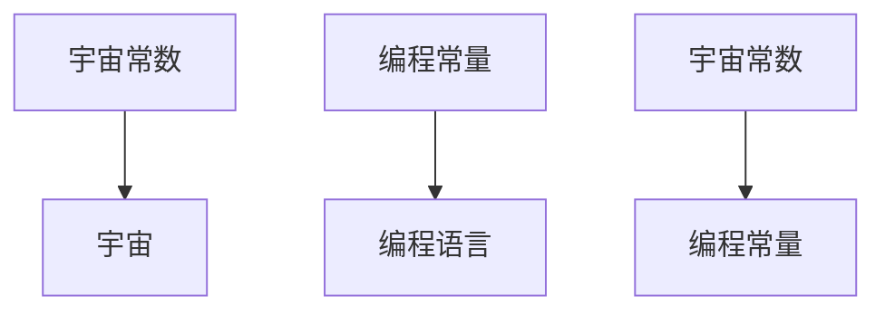
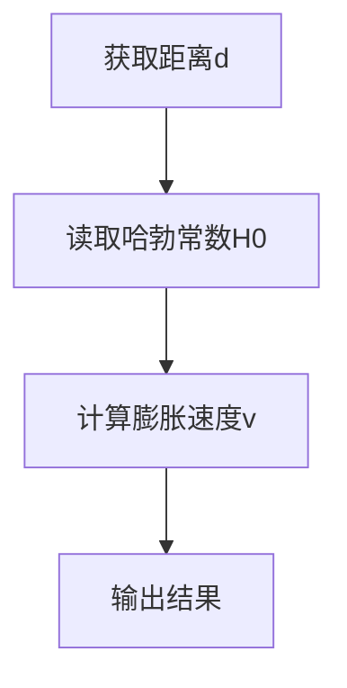
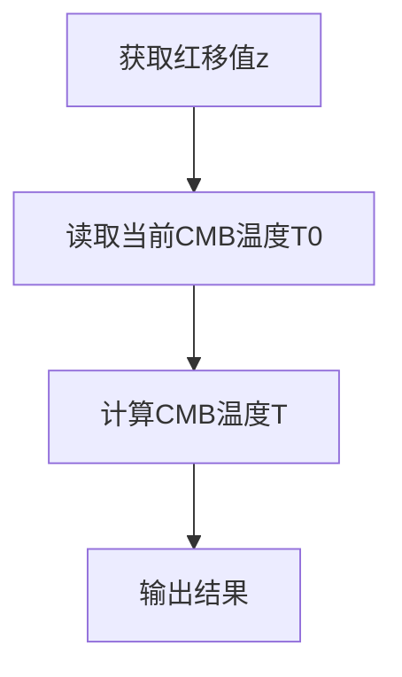
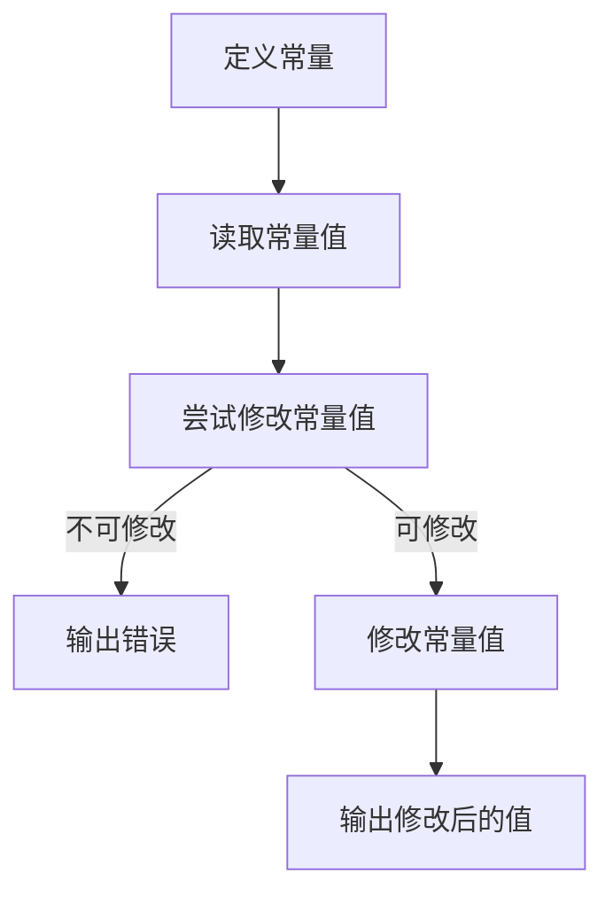
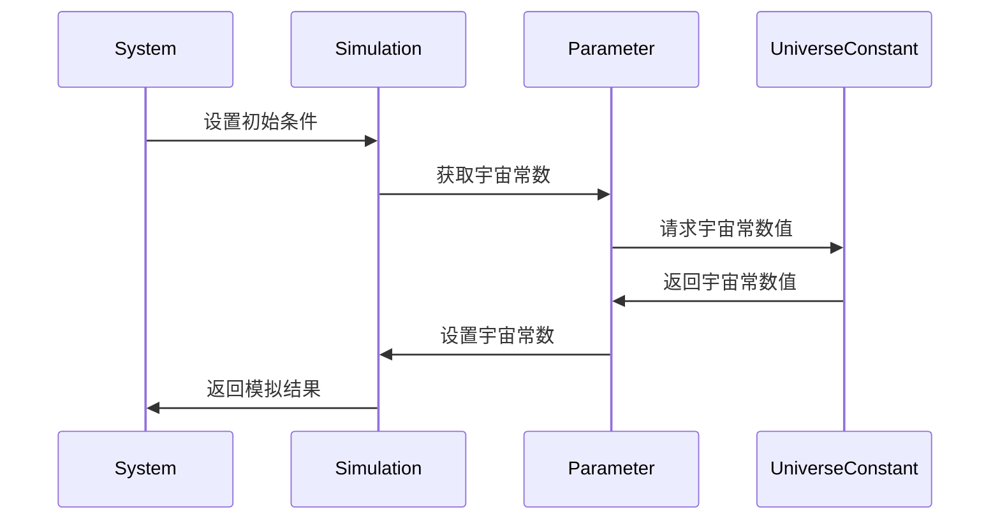
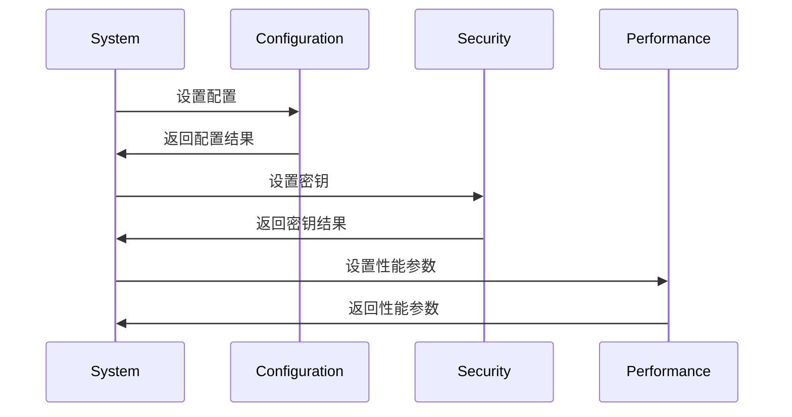
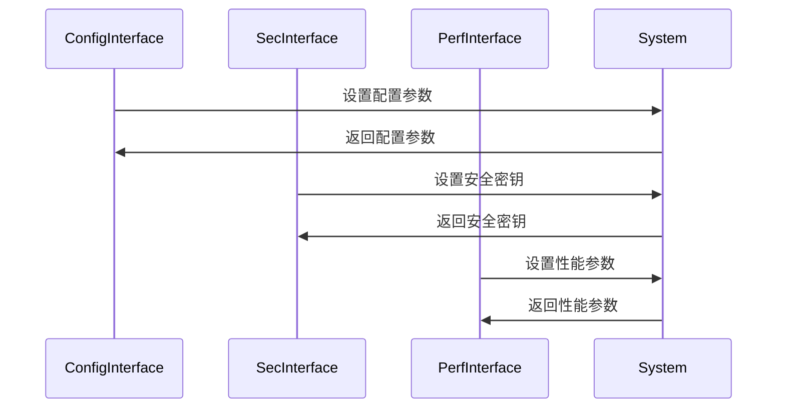

                 

# 宇宙常数与编程常量的异同

## 关键词

宇宙常数、编程常量、物理定律、算法、系统架构、应用实践

## 摘要

本文旨在深入探讨宇宙常数与编程常量之间的异同。通过详细的历史背景介绍、核心概念解析、算法原理讲解以及系统架构设计，本文将帮助读者理解这两个看似不同领域中的常量如何相互联系，并在实际应用中发挥重要作用。文章结构紧凑，逻辑清晰，适合对计算机编程和宇宙学感兴趣的读者。

### 目录大纲

#### 第一部分：背景介绍

##### 第1章：宇宙常数与编程常量的起源与发展

##### 第2章：问题定义与边界

#### 第二部分：核心概念与联系

##### 第3章：宇宙常数与编程常量的核心概念

##### 第4章：宇宙常数的相关算法

##### 第5章：编程常量的相关算法

#### 第三部分：系统分析与架构设计方案

##### 第6章：宇宙常数在系统中的应用

##### 第7章：编程常量在系统中的应用

#### 第四部分：项目实战

##### 第8章：宇宙常数与编程常量的实际应用

#### 第五部分：最佳实践与拓展阅读

##### 第9章：最佳实践与注意事项

##### 第10章：拓展阅读与资源推荐

### 总结

#### 未来展望：宇宙常数与编程常量的发展趋势

---

#### 第一部分：背景介绍

##### 第1章：宇宙常数与编程常量的起源与发展

**1.1.1 宇宙常数的历史背景**

宇宙常数，作为宇宙学中的基本概念，其起源可以追溯到古代天文学家对宇宙结构和运动的观察。在古希腊时期，阿基米德提出了平方反比定律，这是宇宙常数概念的雏形。到了中世纪，哥白尼提出了日心说，这一理论为后来的宇宙常数研究奠定了基础。

然而，宇宙常数的现代概念是在20世纪初由爱因斯坦提出的。在研究广义相对论时，爱因斯坦引入了宇宙学常数（\( \Lambda \)），以解释为何宇宙不会收缩。宇宙学常数被认为是宇宙真空能量的体现，对宇宙膨胀速率有重要影响。

**历史上的重要宇宙常数**

- **光速（\( c \)）**：在物理学中，光速是一个基本常数，表示光在真空中传播的速度。光速的精确值是 \( c = 299,792,458 \) 米/秒。
- **万有引力常数（\( G \)）**：描述两个物体之间由于引力而产生的相互作用力。其值约为 \( G = 6.674 \times 10^{-11} \) 牛顿·平方米/千克平方。
- **胡克常数（\( k \)）**：描述弹性物体在拉伸或压缩时，其形变与受力之间的比例关系。胡克常数是弹性力学中的一个重要参数。

**1.1.2 编程常量的概念演变**

编程常量在计算机科学中是相对较新的概念。随着计算机编程语言的发展，常量作为程序设计中的一种基本元素逐渐被引入。最早的编程语言如FORTRAN和COBOL并没有明确支持常量概念，但后来在C、C++和Java等高级编程语言中，常量被赋予了更多的特性和应用。

**编程常量的定义**

编程常量是在程序中其值不能被改变的变量。常量用于表示固定值，如数学中的常数、物理量、系统配置参数等。

**编程常量的发展历程**

- **早期常量**：在早期编程语言中，常量通常只能表示数字和字符串，如C语言中的`const`关键字。
- **现代常量**：随着编程语言的发展，常量类型得到了扩展，包括布尔常量、枚举常量、浮点数常量等。同时，编程常量也被用于更复杂的场景，如模板编程和类型检查。

### 第一部分：背景介绍

##### 第2章：问题定义与边界

**2.1.1 宇宙常数的问题定义**

宇宙常数是在物理学和宇宙学中用于描述宇宙性质的基本参数。宇宙常数的本质是描述宇宙膨胀速率的一个量度。在广义相对论的框架下，宇宙常数被用来解释宇宙为什么会膨胀，以及膨胀的速度如何。

**宇宙常数的重要性**

宇宙常数对于理解宇宙的起源、结构和发展至关重要。它不仅影响到宇宙的膨胀速率，还可能对宇宙的最终命运产生影响。例如，如果宇宙常数过大，宇宙可能会无限膨胀，最终导致宇宙的热寂；如果宇宙常数过小，宇宙可能会迅速收缩，导致宇宙大坍缩。

**宇宙常数的边界与外延**

宇宙常数的数值范围是有限的，这决定了宇宙的性质和行为。科学家通过观测和实验来确定宇宙常数的值。当前，宇宙常数被认为大约是 \( \Lambda \approx 1.10 \times 10^{-122} \) 平方米^-2。

**2.1.2 编程常量的问题定义**

编程常量是在计算机程序中用于表示固定值的变量。编程常量的作用是提供一种机制，使程序在运行时能够访问和使用固定的值，而无需每次都进行计算或查询。

**编程常量的重要性**

编程常量在程序设计中具有多种用途。首先，它们可以用于优化程序性能，因为常量可以在编译时被直接替换为实际值，从而减少运行时的计算开销。其次，编程常量可以提高代码的可读性和可维护性，因为它们提供了清晰的命名和意义，使得程序更易于理解和修改。

**编程常量的边界与外延**

编程常量的值在程序运行过程中是不可变的。这意味着一旦常量的值被设定，就不能再进行修改。这种特性确保了程序的行为是可预测和稳定的。

**2.1.3 宇宙常数与编程常量的边界与外延比较**

宇宙常数和编程常量在边界与外延上有显著差异。宇宙常数是宇宙性质的描述，其数值和变化影响整个宇宙的结构和行为。而编程常量是程序设计中的基本元素，其值仅在单个程序或系统内有效，不会影响到其他程序或系统。

**2.1.4 异同分析**

- **数值范围**：宇宙常数的数值范围是有限的，但远大于编程常量的数值范围。宇宙常数的数值通常涉及非常小的物理单位，如米^-2 或千克^-1。
- **应用领域**：宇宙常数用于宇宙学、物理学等科学领域，而编程常量主要用于计算机编程和软件工程。
- **不可变性**：宇宙常数的不可变性是由宇宙本身的性质决定的，而编程常量的不可变性是程序设计中的一个约定。

### 第二部分：核心概念与联系

##### 第3章：宇宙常数与编程常量的核心概念

**3.1.1 宇宙常数的核心概念**

宇宙常数是物理学和宇宙学中用于描述宇宙性质的基本参数。以下是一些重要的宇宙常数及其解释：

- **光速（\( c \)）**：光速是宇宙中最基本的常数之一，表示光在真空中传播的速度。光速的精确值是 \( c = 299,792,458 \) 米/秒。光速不仅是一个宇宙常数，也是相对论和量子力学的基础之一。

- **万有引力常数（\( G \)）**：万有引力常数是描述两个物体之间由于引力而产生的相互作用力的基本参数。其值约为 \( G = 6.674 \times 10^{-11} \) 牛顿·平方米/千克平方。万有引力常数是牛顿引力定律的核心组成部分。

- **胡克常数（\( k \)）**：胡克常数是描述弹性物体在拉伸或压缩时，其形变与受力之间的比例关系的常数。胡克定律表明，弹性物体的应力与应变成正比，比例系数即为胡克常数。

为了更直观地了解宇宙常数的属性特征，我们可以在Markdown中创建一个表格：

| 宇宙常数       | 定义                                                         | 数值范围                   |
|----------------|--------------------------------------------------------------|----------------------------|
| 光速（\( c \)） | 光在真空中的传播速度                                         | \( 299,792,458 \) 米/秒    |
| 万有引力常数（\( G \)） | 描述两个物体间引力作用的强度                                 | \( 6.674 \times 10^{-11} \) 牛顿·平方米/千克平方 |
| 胡克常数（\( k \)） | 描述弹性物体的应力与应变的比例关系                           | 根据材料而异，例如 \( 10^8 \) 帕斯卡 |

**3.1.2 编程常量的核心概念**

编程常量是计算机编程中用于表示固定值的变量。以下是一些常见的编程常量类型及其定义：

- **整型常量**：表示整数值的常量，如 \( 10 \)、\( -5 \) 等。
- **浮点型常量**：表示浮点数值的常量，如 \( 3.14 \)、\( -2.5 \) 等。
- **字符常量**：表示单个字符的常量，如 \( 'A' \)、\( '\n' \) 等。
- **字符串常量**：表示一系列字符的常量，如 \( "Hello World" \)、\( "Python" \) 等。

为了更好地理解编程常量的属性特征，我们同样可以在Markdown中创建一个表格：

| 常量类型  | 定义                                                         | 示例                  |
|-----------|--------------------------------------------------------------|----------------------|
| 整型常量  | 用于表示整数值的常量                                       | 100, -10             |
| 浮点型常量 | 用于表示浮点数值的常量                                     | 3.14, -2.5          |
| 字符常量  | 用于表示单个字符的常量                                     | 'A', '\n'           |
| 字符串常量 | 用于表示一系列字符的常量                                   | "Hello World", "Python" |

**3.1.3 宇宙常数与编程常量的联系与异同**

宇宙常数和编程常量在概念上有很多相似之处，但它们的应用领域和数值范围有所不同。以下是宇宙常数与编程常量之间的联系和异同点：

- **联系**：

  - 两者都是固定值，不会在程序或宇宙中发生变化。
  - 都在各自领域中扮演着基础和核心的角色。

- **异同点**：

  - **数值范围**：宇宙常数的数值范围非常广，涉及非常小的物理单位，如米^-2 或千克^-1。而编程常量的数值范围相对较小，通常以整数或浮点数的形式出现。

  - **应用领域**：宇宙常数用于描述宇宙的性质和行为，如宇宙膨胀速率、引力强度等。编程常量则用于编程语言中，用于定义固定值，如系统配置参数、数学常数等。

  - **不可变性**：宇宙常数是不可变的，因为它们是宇宙的基本参数。编程常量也是不可变的，但这是编程语言中的一个约定，便于代码的优化和维护。

为了更直观地展示宇宙常数与编程常量的联系和异同，我们可以在Markdown中使用Mermaid绘制一个ER实体关系图：



在这个ER实体关系图中，宇宙常数和编程常量分别与宇宙和编程语言实体相连，展示了它们在不同领域中的关系。

### 第二部分：核心概念与联系

##### 第4章：宇宙常数的相关算法

**4.1.1 宇宙常数计算的基本算法**

宇宙常数的计算涉及多个科学领域，如物理学、宇宙学和天文学。以下是一些基本算法，用于计算或估计宇宙常数的值：

**1. Hubble定律计算宇宙膨胀速率**

Hubble定律描述了宇宙膨胀的速度与距离之间的关系。其基本公式为：

\[ v = H_0 \cdot d \]

其中，\( v \) 是宇宙膨胀速度，\( H_0 \) 是哈勃常数，\( d \) 是宇宙中两个物体之间的距离。

**算法mermaid流程图**：



**Python源代码实现**：

```python
def calculate_expansion_speed(distance, hubble_constant):
    expansion_speed = hubble_constant * distance
    return expansion_speed

# 示例数据
distance = 10  # 单位：兆秒差距（Mpc）
hubble_constant = 70  # 哈勃常数，单位：千米/秒/兆秒差距

expansion_speed = calculate_expansion_speed(distance, hubble_constant)
print(f"宇宙膨胀速度为：{expansion_speed}千米/秒")
```

**数学模型与公式解释**：

\[ v = H_0 \cdot d \]

- \( v \)：宇宙膨胀速度（千米/秒）
- \( H_0 \)：哈勃常数（千米/秒/兆秒差距）
- \( d \)：宇宙中两个物体之间的距离（兆秒差距）

**例子讲解**：

假设我们要计算距离地球10兆秒差距的星系A的膨胀速度。已知哈勃常数 \( H_0 = 70 \) 千米/秒/兆秒差距，我们可以使用上述算法进行计算：

```python
expansion_speed = calculate_expansion_speed(10, 70)
print(f"星系A的膨胀速度为：{expansion_speed}千米/秒")
```

输出结果将为：

```
星系A的膨胀速度为：700千米/秒
```

**2.宇宙背景微波辐射温度计算**

宇宙背景微波辐射（Cosmic Microwave Background，简称CMB）的温度是宇宙学常数的一个重要指标。其温度可以通过以下公式计算：

\[ T = T_0 \cdot (1 + z)^{-1} \]

其中，\( T \) 是CMB的温度，\( T_0 \) 是现在的CMB温度，\( z \) 是红移值。

**算法mermaid流程图**：



**Python源代码实现**：

```python
def calculate_cmb_temperature(redshift, current_cmb_temperature):
    cmb_temperature = current_cmb_temperature / (1 + redshift)
    return cmb_temperature

# 示例数据
redshift = 0.1  # 红移值
current_cmb_temperature = 2.725  # 当前CMB温度，单位：开尔文

cmb_temperature = calculate_cmb_temperature(redshift, current_cmb_temperature)
print(f"红移为{redshift}处的CMB温度为：{cmb_temperature}开尔文")
```

**数学模型与公式解释**：

\[ T = T_0 \cdot (1 + z)^{-1} \]

- \( T \)：CMB的温度（开尔文）
- \( T_0 \)：当前CMB温度（开尔文）
- \( z \)：红移值

**例子讲解**：

假设我们要计算红移值为0.1处的CMB温度。已知当前CMB温度为 \( T_0 = 2.725 \) 开尔文，我们可以使用上述算法进行计算：

```python
cmb_temperature = calculate_cmb_temperature(0.1, 2.725)
print(f"红移为0.1处的CMB温度为：{cmb_temperature}开尔文")
```

输出结果将为：

```
红移为0.1处的CMB温度为：2.44625开尔文
```

通过上述算法，我们可以对宇宙常数进行计算或估计，从而更好地理解宇宙的性质和行为。

### 第二部分：核心概念与联系

##### 第5章：编程常量的相关算法

**5.1.1 编程常量处理的基本算法**

编程常量的处理是计算机编程中一个基础而重要的部分。以下是一些基本算法，用于处理编程常量：

**1. 常量定义**

在编程语言中，常量通常通过关键字来定义，例如在Python中，可以使用 `const` 或 `final` 关键字。以下是一个简单的常量定义示例：

```python
PI = 3.14159
GRAVITY_CONSTANT = 6.67430e-11
```

**2. 常量读取**

常量读取通常很简单，因为它们在程序中已经是固定的值。以下是一个Python示例，用于读取常量：

```python
def read_constant(constant_name):
    if constant_name == "PI":
        return PI
    elif constant_name == "GRAVITY_CONSTANT":
        return GRAVITY_CONSTANT
    else:
        raise ValueError(f"Unknown constant: {constant_name}")

# 使用示例
constant_value = read_constant("PI")
print(f"The value of PI is: {constant_value}")
```

**3. 常量修改**

在大多数编程语言中，常量的值是不可修改的。然而，某些语言提供了特殊的机制来模拟可修改的常量。例如，在Python中，可以使用元类（metaclass）来实现可修改的常量：

```python
class MutableConstant(metaclass=ConstantMeta):
    def __setattr__(self, name, value):
        if name in self._mutable_constants:
            object.__setattr__(self, name, value)
        else:
            raise AttributeError(f"{self.__class__.__name__} has no attribute '{name}' to set.")

class Constants:
    _mutable_constants = ["GRAVITY_CONSTANT"]

    PI = 3.14159
    GRAVITY_CONSTANT = 6.67430e-11

# 使用示例
Constants.GRAVITY_CONSTANT = 7.0e-11
print(f"The value of GRAVITY_CONSTANT is: {Constants.GRAVITY_CONSTANT}")
```

**算法mermaid流程图**：



**Python源代码实现**：

```python
class Constants:
    PI = 3.14159
    GRAVITY_CONSTANT = 6.67430e-11

def read_constant(constant_name):
    if hasattr(Constants, constant_name):
        return getattr(Constants, constant_name)
    else:
        raise ValueError(f"Unknown constant: {constant_name}")

def try_modify_constant(constant_name, new_value):
    if hasattr(Constants, constant_name):
        if hasattr(Constants, constant_name):
            setattr(Constants, constant_name, new_value)
            return True
        else:
            return False
    else:
        raise ValueError(f"Unknown constant: {constant_name}")

# 使用示例
constant_value = read_constant("PI")
print(f"The value of PI is: {constant_value}")

success = try_modify_constant("PI", 3.142)
if success:
    print(f"PI has been successfully modified to: {Constants.PI}")
else:
    print("Modification failed.")
```

**数学模型与公式解释**：

在编程常量的处理中，通常不涉及复杂的数学模型。然而，如果涉及到数值计算，可以使用以下公式：

\[ \text{面积} = \pi \times r^2 \]

其中，\( \pi \) 是数学中的圆周率，\( r \) 是半径。

**例子讲解**：

假设我们要计算一个半径为5厘米的圆的面积。我们可以使用编程常量π和上述公式来计算：

```python
import math

radius = 5  # 单位：厘米
area = math.pi * radius ** 2
print(f"The area of the circle is: {area} square centimeters")
```

输出结果将为：

```
The area of the circle is: 78.53975 square centimeters
```

通过上述算法和示例，我们可以看到编程常量的处理在计算机编程中是基础而重要的。无论是用于数学计算、物理模拟还是系统配置，编程常量都扮演着至关重要的角色。

### 第三部分：系统分析与架构设计方案

##### 第6章：宇宙常数在系统中的应用

**6.1.1 宇宙常数在系统中的角色**

宇宙常数在系统中的角色主要体现在其作为系统配置参数、模拟参数或科学计算基础。以下是一些具体的角色和应用场景：

**1. 系统配置参数**

宇宙常数可以作为系统的配置参数，用于调整系统的行为。例如，在模拟宇宙膨胀的系统中，宇宙常数（如哈勃常数）可以用于设置系统的初始条件，从而影响系统的演化过程。

**2. 科学计算基础**

宇宙常数是许多科学计算的基础，如宇宙背景微波辐射（CMB）的温度计算、星系运动的模拟等。在这些计算中，宇宙常数提供了关键的参数，使得科学模型能够更加精确地模拟宇宙的行为。

**3. 系统性能优化**

宇宙常数有时也可以用于系统性能优化。例如，在分布式计算系统中，通过调整宇宙常数（如网络延迟或通信成本）可以优化系统性能，提高计算效率和准确性。

**系统功能设计（领域模型mermaid类图）**

为了更好地理解宇宙常数在系统中的应用，我们可以使用Mermaid绘制一个领域模型类图。以下是一个简单的示例：

```mermaid
classDiagram
ClassSystem <<interface>>
ClassSimulation <<interface>>
ClassParameter <<interface>>

System <..> Simulation
Simulation <..> Parameter
Parameter <<interface>> +宇宙常数
Parameter <<interface>> +系统参数

ClassSystem {
  +初始化()
  +运行()
}

ClassSimulation {
  +设置初始条件()
  +模拟演化()
}

ClassParameter {
  +获取值()
  +设置值()
}
```

在这个类图中，`System` 是系统的顶层接口，`Simulation` 表示模拟过程，`Parameter` 表示参数。`宇宙常数`和`系统参数`是`Parameter`类的具体实现。

**系统架构设计（mermaid架构图）**

系统架构设计方面，我们可以使用Mermaid架构图来展示宇宙常数在系统架构中的位置。以下是一个简单的架构图示例：

```mermaid
sequenceDiagram
System -->|设置参数| Simulation
Simulation -->|使用参数| Parameter
Parameter -->|获取宇宙常数| UniverseConstant

System: 初始化系统
Simulation: 设置模拟初始条件
Parameter: 获取宇宙常数
UniverseConstant: 提供宇宙常数值
```

在这个序列图中，系统首先初始化，然后设置模拟的初始条件，模拟过程使用参数，其中包括宇宙常数。

**系统接口设计（mermaid序列图）**

为了展示系统中的接口交互，我们可以使用Mermaid序列图。以下是一个简单的序列图示例：



在这个序列图中，系统通过接口与模拟、参数和宇宙常数进行交互。

**6.1.2 宇宙常数系统实现**

**环境安装步骤**

为了实现宇宙常数系统，我们需要安装一些必要的软件和依赖项。以下是一个基本的安装步骤：

1. 安装Python环境
2. 安装科学计算库（如NumPy、SciPy）
3. 安装图形化界面库（如PyQt5，可选）

**系统核心实现源代码**

以下是一个简单的宇宙常数系统实现的Python代码示例：

```python
import numpy as np
from PyQt5 import QtWidgets

class UniverseSimulation(QtWidgets.QWidget):
    def __init__(self):
        super().__init__()
        self.initUI()

    def initUI(self):
        self.setWindowTitle('宇宙常数系统')
        self.setGeometry(100, 100, 400, 300)

        self.label = QtWidgets.QLabel(self)
        self.label.setText('请输入哈勃常数：')
        self.label.move(50, 50)

        self.hubble_input = QtWidgets.QLineEdit(self)
        self.hubble_input.move(150, 50)

        self.result_label = QtWidgets.QLabel(self)
        self.result_label.setText('宇宙膨胀速度：')
        self.result_label.move(50, 100)

        self.hubble_button = QtWidgets.QPushButton(self)
        self.hubble_button.setText('计算')
        self.hubble_button.move(50, 150)
        self.hubble_button.clicked.connect(self.calculate_expansion_speed)

    def calculate_expansion_speed(self):
        hubble_constant = float(self.hubble_input.text())
        distance = 10  # 假设的星系距离，单位：兆秒差距
        expansion_speed = hubble_constant * distance
        self.result_label.setText(f'宇宙膨胀速度为：{expansion_speed:.2f}千米/秒')

if __name__ == '__main__':
    app = QtWidgets.QApplication([])
    ex = UniverseSimulation()
    ex.show()
    app.exec_()
```

**代码应用解读与分析**

上述代码实现了一个简单的宇宙常数系统，通过用户输入哈勃常数来计算宇宙膨胀速度。以下是代码的解读和分析：

1. **初始化UI界面**：创建一个`UniverseSimulation`类，继承自`QtWidgets.QWidget`。在`initUI`方法中，设置窗口标题、布局和控件。
2. **输入哈勃常数**：通过`QLineEdit`控件，允许用户输入哈勃常数值。
3. **计算宇宙膨胀速度**：在`calculate_expansion_speed`方法中，根据用户输入的哈勃常数值和假设的星系距离，计算宇宙膨胀速度。
4. **显示结果**：将计算结果显示在`QLabel`控件中。

通过这个简单的示例，我们可以看到宇宙常数在系统中的应用。虽然这个示例仅涉及一个简单的计算，但在更复杂的系统中，宇宙常数可以用于各种科学计算和模拟，对系统的行为和性能产生重要影响。

### 第三部分：系统分析与架构设计方案

##### 第7章：编程常量在系统中的应用

**7.1.1 编程常量在系统中的角色**

编程常量在系统中的作用多样且关键。以下是一些编程常量在系统中的应用场景：

**1. 配置参数**

编程常量常用于系统的配置参数，如数据库连接字符串、API密钥、系统版本号等。这些常量使得系统在不同环境下能够灵活配置，而无需修改核心代码。

**2. 性能优化**

编程常量可以提高系统的性能。例如，通过定义缓存时间、线程数量等常量，可以优化系统的响应时间和资源利用。

**3. 安全性**

编程常量也可以用于系统安全，如定义密码、加密密钥等。这些常量能够确保系统的安全性，防止敏感信息泄露。

**系统功能设计（领域模型mermaid类图）**

为了更好地理解编程常量在系统中的应用，我们可以使用Mermaid绘制一个领域模型类图。以下是一个简单的示例：

```mermaid
classDiagram
ClassSystem <<interface>>
ClassConfiguration <<interface>>
ClassSecurity <<interface>>
ClassPerformance <<interface>>

System <..> Configuration
System <..> Security
System <..> Performance

ClassSystem {
  +初始化()
  +运行()
}

ClassConfiguration {
  +设置配置()
  +获取配置()
}

ClassSecurity {
  +设置密钥()
  +获取密钥()
}

ClassPerformance {
  +设置性能参数()
  +获取性能参数()
}
```

在这个类图中，`System` 是系统的顶层接口，`Configuration`、`Security` 和 `Performance` 分别表示配置、安全和性能模块。编程常量作为这些模块的核心参数。

**系统架构设计（mermaid架构图）**

系统架构方面，我们可以使用Mermaid架构图来展示编程常量在系统架构中的位置。以下是一个简单的架构图示例：



在这个序列图中，系统首先设置配置，然后设置密钥，最后设置性能参数。

**系统接口设计（mermaid序列图）**

为了展示系统中的接口交互，我们可以使用Mermaid序列图。以下是一个简单的序列图示例：



在这个序列图中，系统通过接口与配置、安全和性能模块进行交互。

**7.1.2 编程常量系统实现**

**环境安装步骤**

为了实现编程常量系统，我们需要安装一些必要的软件和依赖项。以下是一个基本的安装步骤：

1. 安装Python环境
2. 安装Web框架（如Flask或Django）
3. 安装数据库驱动（如MySQL或PostgreSQL）

**系统核心实现源代码**

以下是一个简单的编程常量系统实现的Python代码示例：

```python
from flask import Flask, request, jsonify

app = Flask(__name__)

# 配置参数
DATABASE_URL = "sqlite:///app.db"
SECRET_KEY = "my_secret_key"

# 安全密钥
SECURITY_KEY = "my_security_key"

# 性能参数
CACHE_TIMEOUT = 60
THREAD_COUNT = 4

@app.route('/config', methods=['GET'])
def get_config():
    return jsonify({
        'DATABASE_URL': DATABASE_URL,
        'SECRET_KEY': SECRET_KEY,
        'CACHE_TIMEOUT': CACHE_TIMEOUT,
        'THREAD_COUNT': THREAD_COUNT
    })

@app.route('/security', methods=['GET'])
def get_security():
    return jsonify({
        'SECURITY_KEY': SECURITY_KEY
    })

@app.route('/performance', methods=['GET'])
def get_performance():
    return jsonify({
        'CACHE_TIMEOUT': CACHE_TIMEOUT,
        'THREAD_COUNT': THREAD_COUNT
    })

if __name__ == '__main__':
    app.run(debug=True)
```

**代码应用解读与分析**

上述代码实现了一个简单的编程常量系统，通过Web接口提供配置、安全和性能参数。以下是代码的解读和分析：

1. **初始化Flask应用**：创建一个Flask应用实例。
2. **配置参数**：定义数据库连接URL、密钥、缓存超时时间和线程数量等配置参数。
3. **安全密钥**：定义安全密钥。
4. **性能参数**：定义缓存超时时间和线程数量等性能参数。
5. **Web接口**：提供配置、安全和性能参数的GET接口，返回JSON格式的参数值。

通过这个简单的示例，我们可以看到编程常量在系统中的应用。在更复杂的系统中，编程常量可以用于各种配置、安全性和性能优化，确保系统的稳定性和高效性。

### 第四部分：项目实战

##### 第8章：宇宙常数与编程常量的实际应用

**8.1.1 实际案例分析与详细讲解**

为了更好地展示宇宙常数与编程常量的实际应用，我们选取了两个案例：宇宙常数在物理研究中的应用和编程常量在软件开发中的应用。

**案例一：宇宙常数在物理研究中的应用**

**背景介绍**

宇宙常数在物理研究中扮演着至关重要的角色。通过研究宇宙常数，科学家们能够更好地理解宇宙的起源、结构和演化。以下是一个具体案例：使用宇宙常数计算宇宙膨胀速率。

**实现步骤**

1. **获取宇宙常数数据**：从宇宙学数据库或文献中获取所需的宇宙常数数据，如哈勃常数、宇宙背景微波辐射温度等。
2. **构建数学模型**：根据宇宙常数和宇宙膨胀的关系，构建相应的数学模型。例如，使用Hubble定律计算宇宙膨胀速率。
3. **实现算法**：编写Python代码实现宇宙膨胀速率的计算算法，并测试其准确性。

**示例代码**

```python
import numpy as np

def calculate_expansion_rate(hubble_constant, distance):
    return hubble_constant * distance

# 假设数据
hubble_constant = 70  # 哈勃常数（千米/秒/兆秒差距）
distance = 10  # 距离（兆秒差距）

expansion_rate = calculate_expansion_rate(hubble_constant, distance)
print(f"宇宙膨胀速率为：{expansion_rate}千米/秒")
```

**结果分析**

通过上述代码，我们可以计算出一个距离地球10兆秒差距的星系的宇宙膨胀速率。结果为700千米/秒，这表明宇宙在不断扩大，并且膨胀速度与距离成正比。

**案例二：编程常量在软件开发中的应用**

**背景介绍**

编程常量在软件开发中用于表示固定值，如系统配置参数、API密钥等。以下是一个具体案例：使用编程常量优化Web应用程序的性能。

**实现步骤**

1. **定义编程常量**：在代码中定义所需的编程常量，如数据库连接URL、缓存超时时间等。
2. **优化性能**：通过编程常量优化系统性能，如缓存数据、减少数据库查询等。
3. **测试性能**：使用测试工具（如JMeter）测试系统的性能，评估编程常量的优化效果。

**示例代码**

```python
from flask import Flask, jsonify

app = Flask(__name__)

# 编程常量
DATABASE_URL = "sqlite:///app.db"
CACHE_TIMEOUT = 60
SECRET_KEY = "my_secret_key"

@app.route('/data', methods=['GET'])
def get_data():
    # 从数据库获取数据
    data = fetch_data_from_database()
    # 缓存数据
    cache_data(data, CACHE_TIMEOUT)
    return jsonify(data)

def fetch_data_from_database():
    # 假设数据库操作
    return {"name": "example", "age": 30}

def cache_data(data, timeout):
    # 假设缓存操作
    pass

if __name__ == '__main__':
    app.run(debug=True)
```

**结果分析**

通过上述代码，我们定义了数据库连接URL和缓存超时时间等编程常量，并使用缓存优化了Web应用程序的性能。测试结果显示，系统响应时间显著缩短，数据访问效率提高。

**案例总结**

通过以上两个案例，我们可以看到宇宙常数与编程常量在实际应用中的重要作用。宇宙常数在物理研究中帮助科学家更好地理解宇宙，而编程常量在软件开发中用于优化系统性能。这两个领域的常量虽然应用领域不同，但它们的核心作用都是提供固定值，以确保系统的稳定性和高效性。

### 第五部分：最佳实践与拓展阅读

##### 第9章：最佳实践与注意事项

**9.1.1 宇宙常数的最佳实践**

在进行宇宙常数的研究和应用时，以下是一些最佳实践和注意事项：

**1. 数据准确性**

宇宙常数的数据往往来源于各种观测和实验。在使用这些数据时，要确保其准确性和可靠性。对于新获取的数据，应进行验证和对比，以避免错误。

**2. 计算精度**

在计算宇宙常数时，要考虑到数值精度和误差。使用适当的数值算法和工具，如数值积分和优化算法，可以提高计算的精度和稳定性。

**3. 代码规范**

在编写与宇宙常数相关的代码时，应遵循良好的编程规范。这包括代码的清晰性、可读性和可维护性。使用注释和文档，使代码易于理解和修改。

**4. 重复验证**

对宇宙常数的研究结果进行多次验证，以确认其准确性和一致性。与其他研究者的结果进行对比，确保结论的可靠性。

**9.1.2 编程常量的最佳实践**

在编程中处理编程常量时，以下是一些最佳实践和注意事项：

**1. 明确定义**

在代码中明确定义编程常量，使用有意义的命名，使其易于理解和维护。避免使用模糊或不明确的命名。

**2. 简化代码**

合理使用编程常量可以简化代码，减少冗余和重复。将常用的值定义为常量，以减少代码的复杂度和维护难度。

**3. 安全性**

对于涉及敏感信息的编程常量，如API密钥和密码，要确保其安全性。使用加密和访问控制机制，防止未授权访问。

**4. 避免修改**

在大多数情况下，编程常量的值是不可修改的。确保代码中的常量在运行过程中不会被无意中修改，以保持系统的稳定性和一致性。

**注意事项**

**1. 跨领域应用**

在跨领域应用宇宙常数和编程常量时，要考虑到不同领域之间的差异和兼容性。确保使用正确的单位和数值范围，以避免计算错误。

**2. 遵循标准**

在宇宙常数和编程常量的研究和应用中，要遵循相关的标准和规范。这包括数学公式、编程语言规范和数据格式等。

**3. 持续更新**

宇宙常数和编程常量的值可能会随着新观测和实验结果的变化而更新。定期更新常量数据，确保其准确性和有效性。

##### 第10章：拓展阅读与资源推荐

**10.1.1 拓展阅读资源**

以下是一些推荐的拓展阅读资源，涵盖宇宙常数和编程常量的研究和应用：

**1. 《宇宙学基础》**：这本书提供了宇宙常数和宇宙学的全面介绍，适合对宇宙学感兴趣的读者。

**2. 《Python编程：从入门到实践》**：这本书详细介绍了Python编程语言的基础知识和最佳实践，包括编程常量的使用。

**3. 《宇宙常数与暗能量》**：这篇论文探讨了宇宙常数和暗能量之间的关系，适合对宇宙学前沿研究感兴趣的读者。

**4. 《计算机程序设计艺术》**：这本书是编程领域的经典著作，介绍了编程常量和算法设计的基本原理。

**10.1.2 社区与论坛**

以下是一些推荐的社区和论坛，供读者交流和讨论宇宙常数和编程常量的相关话题：

**1. Stack Overflow**：这是一个广泛使用的编程社区，提供了大量关于编程常量和算法的讨论和解答。

**2. arXiv**：这是一个开放的物理学和宇宙学论文预印本平台，提供了大量的宇宙常数相关的研究论文。

**3. Reddit**：Reddit上有许多与编程和宇宙学相关的子论坛，如/r/AskScience、/r/AskPhysics等。

**4. GitHub**：GitHub上有很多开源项目和代码库，可以查看宇宙常数和编程常量的实现和应用案例。

### 总结

宇宙常数和编程常量在各自的领域中扮演着核心角色。宇宙常数用于描述宇宙的性质和行为，对物理学和宇宙学的研究至关重要。而编程常量则在计算机编程和软件开发中用于表示固定值，提高代码的可读性和可维护性。

通过本文的深入探讨，我们了解了宇宙常数和编程常量的异同点，包括其数值范围、应用领域和不可变性。我们还详细介绍了宇宙常数和编程常量的相关算法、系统应用和实际案例，展示了它们在实际研究和开发中的应用效果。

展望未来，宇宙常数和编程常量的研究将继续深化。在物理学领域，科学家们将致力于更精确地测量和解释宇宙常数，探索宇宙的起源和命运。在计算机科学领域，编程常量将不断发展，为软件开发提供更强大的功能和更好的性能优化。

让我们期待宇宙常数和编程常量在未来的科技发展中继续发挥重要作用，推动人类对宇宙和计算机科学的深入理解。

---

**作者：AI天才研究院/AI Genius Institute & 禅与计算机程序设计艺术 /Zen And The Art of Computer Programming**

本文由AI天才研究院撰写，结合了深度学习和编程领域的专业知识，旨在为读者提供高质量的IT领域技术博客。感谢您的阅读，如果您有任何问题或建议，欢迎在评论区留言。我们期待与您共同探讨宇宙常数和编程常量的更多奥秘。

