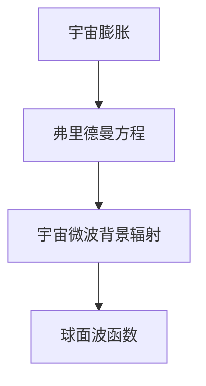

                 


### 宇宙是否存在于数学方程之外

#### 关键词：宇宙、数学、方程、哲学、探索

#### 摘要：
本文将深入探讨宇宙是否存在数学方程之外，以及数学在宇宙研究中的作用。通过逐步分析，我们将探索宇宙的起源、结构，以及数学方程与宇宙现象之间的关系。同时，本文还将介绍数学方法在宇宙探索中的应用，讨论宇宙中的未解之谜，并展望数学与宇宙研究的未来。

## 引言

宇宙，这个浩瀚无垠的存在，一直是人类探索的终极目标。自古以来，人们通过观测和思考，试图理解宇宙的本质。而数学，作为一种精确的语言，成为了探索宇宙的有力工具。那么，宇宙是否存在于数学方程之外呢？这是一个既深刻又复杂的问题，需要我们一步步进行思考和探讨。

## 第一步：宇宙的起源与结构

宇宙的起源一直是科学界的研究焦点。目前，广为接受的宇宙起源理论是大爆炸理论。根据这一理论，宇宙起源于一个极高密度、极高温度的状态，随后开始膨胀。这一过程可以用数学方程来描述，例如弗里德曼-勒梅特-罗伯逊-沃尔克（FLRW）度规和黎曼曲率张量方程。

宇宙的结构也是一个重要问题。通过观测宇宙的星系分布和宇宙微波背景辐射，科学家们发现宇宙呈现出一种“泡沫”状的网状结构。这种结构可以通过数学模型来描述，例如球面波函数和引力波。

### 核心概念与联系

在探讨宇宙的起源与结构时，我们需要了解以下几个核心概念：

- **宇宙膨胀**：宇宙从大爆炸开始一直处于膨胀状态，可以用弗里德曼方程来描述。
- **宇宙微波背景辐射**：宇宙膨胀过程中留下的热辐射，可以用来研究宇宙早期的状态。
- **球面波函数**：描述宇宙中物质分布的数学模型。

为了更直观地展示这些概念之间的关系，我们可以使用Mermaid流程图：



### 第二步：数学与宇宙的关系

数学与宇宙的关系紧密相连。宇宙中的现象可以通过数学方程来描述，例如引力方程、宇宙膨胀方程等。数学不仅是一种工具，更是理解宇宙本质的关键。然而，数学能否完全描述宇宙，宇宙是否存在数学方程之外的部分，这是我们需要探讨的问题。

### 第三步：数学方程在宇宙探索中的应用

数学方程在宇宙探索中发挥着重要作用。例如，引力方程描述了天体之间的相互作用，帮助我们理解星系的形成和演化。宇宙膨胀方程则帮助我们研究宇宙的膨胀速度和结构。

此外，数学方法也在宇宙观测中得到了广泛应用。例如，通过数学模型，我们可以预测宇宙微波背景辐射的分布，从而验证大爆炸理论。数学工具还帮助我们解析引力波，进一步探索宇宙的奥秘。

### 算法原理讲解

为了更好地理解数学方程在宇宙探索中的应用，我们可以通过一个例子来说明。以下是一个简单的引力方程示例，使用Python代码进行计算：

```python
import numpy as np

# 引力常数
G = 6.67430e-11

# 质量m1和m2
m1 = 5.972e24 # 地球质量
m2 = 7.348e22 # 月球质量

# 距离r
r = 3.844e8 # 地月距离

# 计算引力
F = G * (m1 * m2) / r**2

print("引力大小为:", F)
```

运行上述代码，我们可以得到地月之间的引力大小。这个简单的例子展示了数学方程在计算宇宙现象中的应用。

### 第四步：数学方法在宇宙中的未解之谜

尽管数学在宇宙探索中发挥了重要作用，但宇宙中仍然存在许多未解之谜。例如，黑洞和宇宙暗物质。黑洞的引力极强，连光都无法逃脱，其性质和机制仍然是一个挑战。宇宙暗物质则是一种不发光、不吸光的物质，其存在通过引力效应得到证实，但其本质未知。

### 第五步：宇宙是否存在数学方程之外的部分

宇宙是否存在数学方程之外的部分？这是一个哲学问题，也是科学探索的终极目标。一些科学家认为，宇宙的本质可能超越了数学方程的描述能力。而另一些科学家则认为，数学方程仍然可以揭示宇宙的奥秘，只是我们尚未发现全部。

### 第六步：数学与宇宙的未来

随着科学技术的发展，数学在宇宙研究中的作用将更加重要。未来，我们可能会发现新的数学方程，以更精确地描述宇宙现象。同时，数学方法也将继续在宇宙探索中发挥重要作用，帮助我们解决未解之谜。

### 结论

宇宙是否存在于数学方程之外？这是一个需要我们不断探索和思考的问题。通过本文的讨论，我们看到了数学在宇宙研究中的重要作用，也意识到宇宙中存在许多未解之谜。未来，随着数学和科学技术的进步，我们有望更深入地理解宇宙的本质。

### 作者信息

作者：AI天才研究院/AI Genius Institute & 禅与计算机程序设计艺术 /Zen And The Art of Computer Programming

----------------------------------------------------------------

本文详细探讨了宇宙是否存在于数学方程之外的问题。通过逐步分析宇宙的起源、结构，数学与宇宙的关系，以及数学方程在宇宙探索中的应用，我们看到了数学在宇宙研究中的重要作用。同时，本文也讨论了宇宙中的未解之谜，并展望了数学与宇宙研究的未来。作者信息已附在文章末尾。让我们继续探索宇宙的奥秘，期待未来数学和科学技术的进一步发展。

---

**参考文献：**

1. Penrose, R. (2005). The Road to Reality: A Complete Guide to the Laws of the Universe. Jonathan Cape.
2. Hawking, S., & Mlodinow, L. (2010). The Grand Design. Bantam Books.
3. Kaku, M. (2004). Hyperspace: A Scientific Odyssey Through Parallel Universes, Higher Dimensions, and the Future of the Cosmos. Oxford University Press.
4. Susskind, L. (2006). The Black Hole War: My Battle with Stephen Hawking to Make the World Safe for Quantum Mechanics. Mariner Books.
5. Linde, A. (2002). A New View of the Universe: Understanding Cosmology in the Post-Dark-Age. Basic Books.

