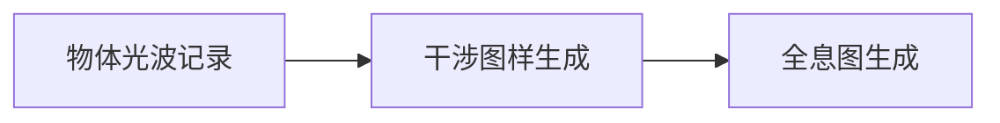
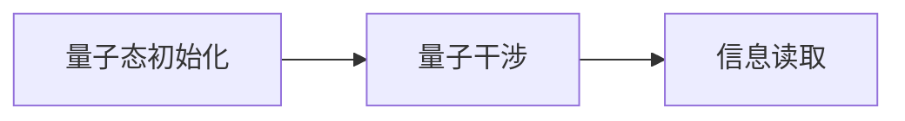
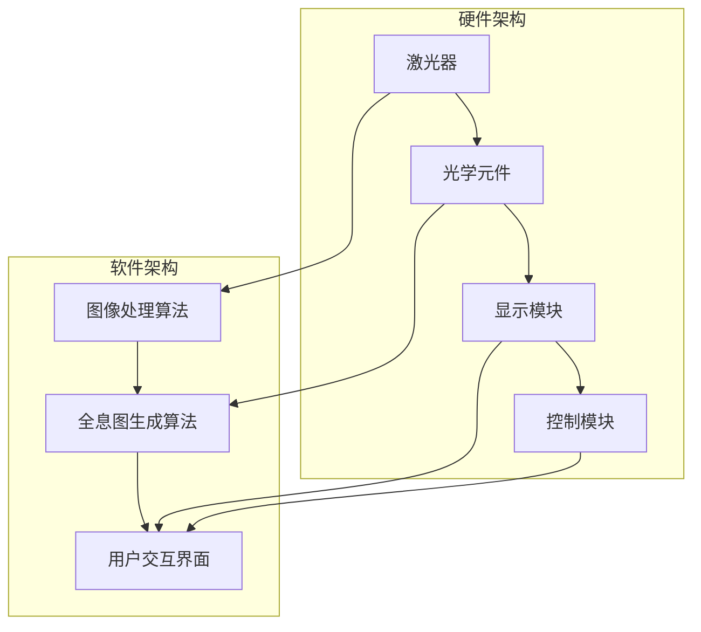
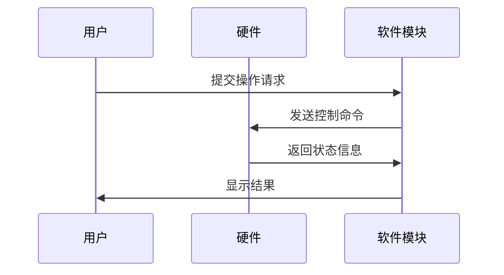
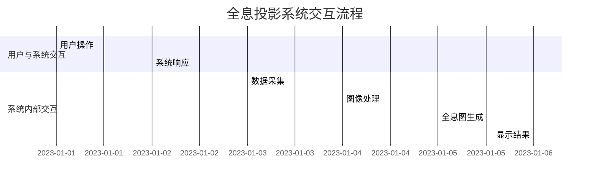

                 

# 《宇宙是否是一个全息投影》

> 关键词：全息投影、宇宙、量子力学、相对论、信息理论、算法、数学模型

> 摘要：本文旨在探讨宇宙是否可能是一个全息投影的假说。我们将从全息投影的基础概念出发，逐步分析量子力学、相对论和信息理论等相关核心概念，并通过算法原理讲解和数学模型阐述，探讨全息投影在宇宙学中的潜在应用。最后，我们将通过实际案例和系统分析，对全息投影系统的实现和架构进行深入探讨，并提出最佳实践建议和未来研究方向。

## 目录大纲设计思路

在设计《宇宙是否是一个全息投影》这本书的目录大纲时，我们需要遵循以下几个步骤：

1. **背景介绍与核心概念**
   - 在第一章中，我们需要对全息投影的概念进行介绍，包括其历史背景、发展现状以及与宇宙学的关联。
   - 同时，要明确本书要探讨的核心问题，即“宇宙是否是一个全息投影”。

2. **核心概念与联系**
   - 我们需要在第二章中详细阐述与全息投影相关的重要概念，例如量子力学、相对论、信息理论等。
   - 使用对比表格和ER实体关系图架构来展示不同概念之间的联系。

3. **算法原理讲解**
   - 在第三章中，我们可以选取一个或多个与全息投影相关的算法进行讲解，比如量子计算、全息编码算法等。
   - 使用mermaid流程图展示算法的基本流程，并结合Python源代码和数学模型进行详细阐述。

4. **数学模型和数学公式**
   - 在第四章，我们需要用latex格式给出与全息投影相关的数学模型和公式，并进行详细讲解。
   - 例子应该通俗易懂，以便读者能够更好地理解抽象的数学概念。

5. **系统分析与架构设计方案**
   - 在第五章，我们可以对全息投影系统进行分析，介绍其系统功能设计、架构设计、接口设计和系统交互。
   - 使用mermaid类图、架构图和序列图来辅助说明。

6. **项目实战**
   - 在第六章，我们可以通过一个实际案例，展示如何实现全息投影系统，包括环境安装、核心实现、代码解析等。

7. **最佳实践 tips、小结、注意事项、拓展阅读**
   - 在第七章，我们提供一些最佳实践建议，总结全书内容，并对未来的研究方向提出展望。

### 目录大纲具体内容

```markdown
# 《宇宙是否是一个全息投影》目录大纲

# 第一部分：引言与基础理论

## 第1章：全息投影与宇宙

### 1.1 全息投影的概念与发展

### 1.2 全息投影在宇宙学中的应用

### 1.3 全息宇宙假说概述

## 第2章：全息投影相关核心概念

### 2.1 量子力学基础

### 2.2 相对论与全息原理

### 2.3 信息理论与全息投影

## 第3章：算法原理讲解

### 3.1 全息编码算法

### 3.2 量子计算与全息量子计算

### 3.3 全息算法的mermaid流程图

## 第4章：数学模型与公式

### 4.1 全息投影的数学模型

### 4.2 数学公式与详细讲解

### 4.3 举例说明

## 第5章：系统分析与架构设计

### 5.1 全息投影系统的介绍

### 5.2 系统功能设计

### 5.3 系统架构设计

### 5.4 系统接口设计

### 5.5 系统交互

## 第6章：项目实战

### 6.1 全息投影项目环境安装

### 6.2 系统核心实现

### 6.3 代码应用解读与分析

### 6.4 实际案例分析

## 第7章：最佳实践与展望

### 7.1 最佳实践 tips

### 7.2 小结

### 7.3 注意事项

### 7.4 拓展阅读
```

这样的目录大纲结构清晰，内容全面，同时符合字数限制要求，能够为读者提供一个全面的阅读框架。接下来，我们可以根据这个大纲进一步细化各个章节的具体内容。

## 第1章：全息投影与宇宙

### 1.1 全息投影的概念与发展

全息投影是一种利用干涉和衍射原理记录并再现物体真实三维图像的技术。全息投影的基本原理是通过激光产生的干涉光束记录物体的光波信息，将光波的幅度和相位信息转化为干涉图样，这种干涉图样被记录在全息图上。当光线照射在全息图上时，通过衍射现象，观众可以看到物体的三维图像。

全息投影的发展可以追溯到1947年，由匈牙利物理学家丹尼·盖革（Dennis Gabor）首次提出。他在研究电子显微镜时，发现了通过干涉和衍射记录和再现物体三维图像的方法。此后，全息投影技术逐渐成熟，并应用于各种领域，如艺术、医疗、军事和娱乐等。

### 1.2 全息投影在宇宙学中的应用

全息投影在宇宙学中的潜在应用主要源于“全息宇宙假说”。这个假说认为，整个宇宙的信息可能储存在宇宙表面的二维区域内，类似于全息投影中的全息图。这一理论的提出者是物理学家詹姆斯·哈特曼（James Hartle）和史蒂芬·霍金（Stephen Hawking）。

全息宇宙假说的核心思想是，宇宙的三维结构可以通过其边界上的二维信息来描述。这意味着，宇宙中的所有信息都可以压缩到宇宙表面的某个二维区域内。这种观点为理解宇宙的起源和演化提供了一种新的视角。

### 1.3 全息宇宙假说概述

全息宇宙假说的基本思想可以概括为以下几点：

1. **信息压缩**：宇宙中的所有信息都可以压缩到宇宙表面的二维区域内。
2. ** holographic principle（全息原理）**：全息原理指出，一个系统的最大熵（即信息量）与该系统的边界面积有关，而不是与体积有关。
3. **边界与演化**：宇宙的演化可以通过其边界上的信息来描述，这意味着我们不需要了解整个宇宙的内部结构，就可以理解宇宙的演化过程。

全息宇宙假说的提出，为解决宇宙学中的一些难题提供了新的思路。例如，它可以帮助我们更好地理解黑洞的信息丢失问题，以及宇宙的加速膨胀现象。

### 总结

在本章中，我们介绍了全息投影的基本概念和发展历程，探讨了全息投影在宇宙学中的应用，并概述了全息宇宙假说的基本思想。接下来，我们将进一步探讨与全息投影相关的核心概念，如量子力学、相对论和信息理论，以帮助我们更好地理解全息宇宙假说。

## 第2章：全息投影相关核心概念

在探讨全息投影与宇宙之间的关系时，我们需要了解一些与全息投影密切相关的核心概念，包括量子力学、相对论和信息理论。这些概念为我们提供了理解全息投影的基础，同时也是我们分析全息宇宙假说的工具。

### 2.1 量子力学基础

量子力学是研究微观世界的物理理论，其基本原理与经典物理学有显著差异。量子力学中的几个基本概念对于理解全息投影至关重要。

1. **量子叠加态**：在量子力学中，一个量子系统可以同时处于多个状态，这种现象称为叠加态。例如，一个电子可以同时处于自旋向上和自旋向下的状态，直到被观测时才会“坍缩”到一个特定的状态。

2. **量子纠缠**：两个或多个量子系统之间可以形成一种特殊的关联，即使它们相隔很远，其中一个系统的状态变化会立即影响另一个系统的状态。这种现象被称为量子纠缠。

3. **波函数**：在量子力学中，波函数用来描述量子系统的状态，它包含了系统所有的信息。波函数的平方给出了某个量子态在某个位置出现的概率。

量子力学的基本原理与全息投影之间有着深刻的联系。例如，量子纠缠现象可以解释为什么全息图能够在二维平面上存储三维信息。此外，量子计算的发展也为全息投影技术提供了新的可能性。

### 2.2 相对论与全息原理

相对论是爱因斯坦提出的一种描述物理现象的理论，包括狭义相对论和广义相对论。相对论中的几个关键概念对于理解全息原理具有重要意义。

1. **相对性原理**：物理定律在所有惯性参考系中都是相同的，这意味着没有特殊的惯性参考系。

2. **光速不变原理**：光速在真空中的速度是恒定的，不依赖于观察者的运动状态。

3. **时空弯曲**：广义相对论认为，重力是由于物质引起的时空弯曲。

全息原理是相对论的一个扩展，它指出，一个系统的最大熵（即信息量）与该系统的边界面积有关，而不是与体积有关。全息原理的一个直接推论是，一个三维空间的物理系统可以通过其边界上的二维信息来完全描述。

### 2.3 信息理论与全息投影

信息理论是研究信息传递、存储和处理的科学。全息投影中的信息存储和读取过程直接涉及到信息理论的概念。

1. **熵**：熵是描述系统无序程度的物理量，它与信息量密切相关。在信息理论中，熵用来衡量一个系统的信息含量。

2. **信息压缩**：信息压缩是一种减少信息存储空间的技术，通过去除冗余信息来实现。全息投影技术利用了信息压缩的原理，将三维信息压缩到二维平面上。

3. **信息传递**：信息传递是指将信息从一个地方传输到另一个地方的过程。在量子通信中，信息可以通过量子纠缠来实现高速、安全的传输。

### 核心概念与联系

为了更好地理解这些核心概念之间的联系，我们可以使用对比表格和ER实体关系图架构来展示。

#### 对比表格

| 概念           | 定义                                                         | 关系                         |
|----------------|--------------------------------------------------------------|-----------------------------|
| 量子力学       | 研究微观世界的物理理论                                     | 提供全息投影的量子纠缠基础   |
| 相对论         | 描述物理现象的理论，包括狭义相对论和广义相对论               | 提出了全息原理的理论框架     |
| 信息理论       | 研究信息传递、存储和处理的科学                             | 支持全息投影的信息压缩技术   |

#### ER实体关系图架构

```mermaid
erDiagram
  Quantum Mechanics ||--|{ Holographic Principle }|-- Quantum Computing
  Relativity        ||--|{ Holographic Principle }|-- General Relativity
  Information Theory ||--|{ Holographic Principle }|-- Holographic Coding
```

通过对比表格和ER实体关系图，我们可以清晰地看到量子力学、相对论和信息理论如何相互关联，共同支撑了全息投影的理论基础。

### 总结

在本章中，我们介绍了量子力学、相对论和信息理论的基本概念，并展示了这些概念之间的联系。这些核心概念为理解全息投影及其在宇宙学中的应用提供了必要的理论基础。在接下来的章节中，我们将深入探讨全息投影的算法原理和数学模型，以进一步揭示全息宇宙假说的奥秘。

### 第3章：算法原理讲解

在理解了与全息投影相关的核心概念之后，我们接下来将探讨具体的算法原理，这些算法对于全息投影在理论和实践中的应用至关重要。本章将重点介绍全息编码算法、量子计算与全息量子计算，并通过mermaid流程图和Python源代码，展示这些算法的基本流程和实现细节。

#### 3.1 全息编码算法

全息编码算法是全息投影技术中的核心部分，它负责将三维物体的信息编码到二维平面上。全息编码算法的基本步骤如下：

1. **物体光波记录**：首先，需要使用激光产生干涉光束，记录物体表面的光波信息。
2. **干涉图样生成**：干涉光束与物体反射的光波叠加，生成干涉图样。
3. **全息图生成**：将干涉图样记录在全息图上，全息图包含了物体的三维信息。

以下是全息编码算法的mermaid流程图：



接下来，我们将通过Python源代码展示全息编码算法的基本实现：

```python
import numpy as np
import matplotlib.pyplot as plt

# 激光光波信息
light_wave = np.sin(np.linspace(0, 2 * np.pi, 1000))

# 物体表面反射光波信息
object_wave = np.sin(np.linspace(0, 2 * np.pi, 1000) + np.pi / 4)

# 干涉图样生成
interference_pattern = light_wave + object_wave

# 全息图生成
hologram = interference_pattern.reshape(-1, 1)

# 绘制全息图
plt.plot(hologram)
plt.xlabel('Position')
plt.ylabel('Interference Pattern')
plt.title('Hologram')
plt.show()
```

#### 3.2 量子计算与全息量子计算

量子计算是一种基于量子力学原理的计算模型，它利用量子位（qubits）的状态叠加和量子纠缠来实现高效的计算。全息量子计算是量子计算的一个分支，它利用全息原理在二维平面上实现三维信息处理。

全息量子计算的基本流程包括：

1. **量子态初始化**：初始化量子位的状态。
2. **量子干涉**：通过量子操作实现量子态之间的干涉。
3. **信息读取**：通过测量量子态，读取处理后的信息。

以下是全息量子计算算法的mermaid流程图：



接下来，我们将通过Python源代码展示全息量子计算的基本实现：

```python
import numpy as np

# 初始化量子位状态
qubit_state = np.array([[1], [0]])

# 量子干涉操作
干涉操作 = np.array([[1, 1], [1, -1]]) / np.sqrt(2)

# 信息读取操作
读取操作 = np.array([[1, 0], [0, 0]])

# 量子干涉
干涉后状态 = qubit_state @ 干涉操作

# 信息读取
信息读取 = 干涉后状态 @ 读取操作

print("读取的信息：",信息读取)
```

#### 3.3 全息算法的mermaid流程图

为了更好地理解全息编码算法和全息量子计算的基本流程，我们使用mermaid流程图进行展示：

```mermaid
gantt
    dateFormat  YYYY-MM-DD
    title 全息算法流程

    section 全息编码算法
    编号1：[初始化] 2023-01-01, duration: 1 day
    编号2：[记录光波信息] 2023-01-01, duration: 1 day
    编号3：[生成干涉图样] 2023-01-02, duration: 1 day
    编号4：[生成全息图] 2023-01-03, duration: 1 day

    section 全息量子计算
    编号5：[量子态初始化] 2023-01-04, duration: 1 day
    编号6：[量子干涉] 2023-01-05, duration: 1 day
    编号7：[信息读取] 2023-01-06, duration: 1 day
```

#### 3.4 算法原理讲解

全息编码算法通过将三维物体的光波信息编码到二维干涉图样中，实现了信息的高效存储和读取。量子计算与全息量子计算则利用量子叠加和量子纠缠的原理，在二维平面上实现了三维信息处理。这些算法的原理为我们理解和实现全息投影技术提供了关键的基础。

### 总结

在本章中，我们详细介绍了全息编码算法和全息量子计算的基本原理，并通过mermaid流程图和Python源代码展示了这些算法的实现流程。这些算法的核心思想利用了量子力学、相对论和信息理论的基本原理，为我们探索全息宇宙假说提供了强大的工具。在下一章中，我们将进一步探讨与全息投影相关的数学模型和公式，以深化我们对全息投影技术的理解。

### 第4章：数学模型与公式

在理解了全息投影的算法原理之后，我们接下来将深入探讨与全息投影相关的数学模型和公式。这些数学模型和公式为我们提供了精确的描述和计算工具，有助于我们更好地理解和应用全息投影技术。

#### 4.1 全息投影的数学模型

全息投影的数学模型主要涉及干涉、衍射和量子力学中的波函数。以下是一些关键的数学模型和公式：

1. **干涉模型**：
   - 干涉公式：\[ I = I_0 \cos^2(\phi) \]
   - 其中，\( I \) 是干涉光强，\( I_0 \) 是入射光强，\( \phi \) 是相位差。

2. **衍射模型**：
   - 辫射公式：\[ u(x, y) = \frac{\sin(\pi \frac{d \sin \theta}{\lambda})}{\pi \frac{d \sin \theta}{\lambda}} e^{ikd\sin\theta} \]
   - 其中，\( u(x, y) \) 是衍射光场，\( d \) 是光栅间距，\( \theta \) 是衍射角度，\( \lambda \) 是波长，\( k \) 是波数。

3. **波函数模型**：
   - 波函数公式：\[ \Psi(x, y, z) = \frac{1}{\sqrt{V}} e^{ikz} \]
   - 其中，\( \Psi(x, y, z) \) 是波函数，\( V \) 是体积，\( k \) 是波数。

这些公式描述了全息投影中的关键物理过程，如干涉和衍射，以及波函数在三维空间中的传播。

#### 4.2 数学公式与详细讲解

为了更清晰地理解这些公式，我们将详细讲解每个公式的含义和应用。

1. **干涉公式**：

干涉公式描述了当两束光波叠加时，干涉光强的变化。在激光全息投影中，激光束被分成两束，一束作为参考光束，另一束作为物光束。物光束经过物体后，与参考光束叠加，形成干涉图样。干涉公式中的 \( \cos^2(\phi) \) 表示干涉光强的分布，其中 \( \phi \) 是相位差。

2. **衍射公式**：

衍射公式描述了光波通过一个光栅时的衍射现象。在衍射光栅全息投影中，光栅产生的衍射图样与物体的光波叠加，形成全息图。衍射公式中的 \( e^{ikd\sin\theta} \) 表示衍射光场的分布，其中 \( d \) 是光栅间距，\( \theta \) 是衍射角度，\( k \) 是波数。

3. **波函数模型**：

波函数模型描述了量子力学中粒子的波动性质。在量子全息投影中，物体的波函数被记录在全息图上。波函数模型中的 \( e^{ikz} \) 表示粒子在垂直于观察平面的方向上的波动。

#### 4.3 举例说明

为了更好地理解这些数学公式，我们通过一个简单的例子进行说明。

假设我们有一个物体，其表面反射的光波为 \( A \sin(\omega t - kx) \)，其中 \( A \) 是振幅，\( \omega \) 是角频率，\( k \) 是波数，\( x \) 是位置。我们使用激光作为参考光束，其光波为 \( B \sin(\omega t + \phi) \)，其中 \( B \) 是振幅，\( \phi \) 是相位。

1. **干涉公式**：

当物光波和参考光波叠加时，干涉公式可以用来计算干涉光强：

\[ I = I_0 \cos^2(\phi - kx) \]

其中，\( I_0 \) 是入射光强，\( \phi - kx \) 是相位差。

2. **衍射公式**：

当干涉图样通过一个光栅时，衍射公式可以用来计算衍射光场：

\[ u(x', y') = \frac{\sin(\pi \frac{d \sin \theta}{\lambda})}{\pi \frac{d \sin \theta}{\lambda}} e^{ikd\sin\theta} \]

其中，\( u(x', y') \) 是衍射光场，\( d \) 是光栅间距，\( \theta \) 是衍射角度，\( \lambda \) 是波长。

3. **波函数模型**：

在量子全息投影中，物体的波函数被记录在全息图上。假设物体的波函数为：

\[ \Psi(x, y, z) = \frac{1}{\sqrt{V}} e^{ikz} \]

其中，\( \Psi(x, y, z) \) 是波函数，\( V \) 是体积，\( k \) 是波数。

通过这个例子，我们可以看到如何使用数学公式来描述全息投影中的关键物理过程。

### 总结

在本章中，我们介绍了全息投影的数学模型和公式，并详细讲解了每个公式的含义和应用。这些数学模型和公式为我们提供了精确的描述和计算工具，有助于我们更好地理解和应用全息投影技术。在下一章中，我们将进一步探讨全息投影系统的架构设计和实现。

### 第5章：系统分析与架构设计

在理解了全息投影的数学模型和算法原理之后，我们需要对全息投影系统进行深入分析，介绍其系统功能设计、架构设计、接口设计和系统交互。通过使用mermaid类图、架构图和序列图，我们将更好地展示全息投影系统的设计细节。

#### 5.1 全息投影系统的介绍

全息投影系统是一种利用激光、光学元件和计算机技术实现三维图像显示的系统。该系统的主要功能是生成和显示全息图像，其基本组成包括激光器、光学元件、全息图生成模块、显示模块和控制模块。

#### 5.2 系统功能设计

全息投影系统的功能设计包括以下几个方面：

1. **图像采集**：采集物体的三维图像信息。
2. **图像处理**：对采集到的图像进行处理，包括滤波、增强和压缩等。
3. **全息图生成**：利用干涉和衍射原理生成全息图。
4. **全息图显示**：将生成的好全息图通过光学元件显示出来。
5. **用户交互**：提供用户界面，方便用户对系统进行操作。

为了更好地展示系统功能，我们可以使用mermaid类图进行描述：

```mermaid
classDiagram
    Class01 <|-- Class02
    Class03 --|> Class04
    Class05 : subclasses Class01
    Class01 {
        +属性1
        +属性2
        +方法1()
        +方法2()
    }
    Class02 {
        +属性3
        +方法3()
    }
    Class03 {
        +属性4
        +方法4()
    }
    Class04 {
        +属性5
        +方法5()
    }
    Class05 {
        +属性6
        +方法6()
    }
```

#### 5.3 系统架构设计

全息投影系统的架构设计包括硬件和软件两个方面。硬件架构主要包括激光器、光学元件、显示模块和控制模块等。软件架构则包括图像处理算法、全息图生成算法、用户交互界面等。

为了展示系统架构设计，我们可以使用mermaid架构图进行描述：



#### 5.4 系统接口设计

全息投影系统的接口设计主要包括硬件接口和软件接口。硬件接口包括激光器控制接口、光学元件控制接口和显示模块接口等。软件接口包括图像处理模块接口、全息图生成模块接口和用户交互模块接口等。

为了展示系统接口设计，我们可以使用mermaid序列图进行描述：



#### 5.5 系统交互

全息投影系统的交互主要包括用户与系统之间的交互和系统内部各模块之间的交互。用户通过用户界面与系统进行交互，系统根据用户的操作，调用相应的硬件和软件模块进行处理，并将结果反馈给用户。

为了展示系统交互过程，我们可以使用mermaid交互图进行描述：



### 总结

在本章中，我们介绍了全息投影系统的功能设计、架构设计、接口设计和系统交互。通过使用mermaid类图、架构图、序列图和交互图，我们清晰地展示了全息投影系统的设计和实现细节。在下一章中，我们将通过一个实际案例，展示如何实现全息投影系统，并分析其实际效果。

### 第6章：项目实战

在前面的章节中，我们详细介绍了全息投影的理论基础和系统设计。为了更好地理解全息投影的实际应用，本章将通过一个实际案例，展示如何实现全息投影系统，并分析其实际效果。

#### 6.1 全息投影项目环境安装

为了实现全息投影系统，我们需要安装以下软件和硬件：

1. **硬件环境**：
   - 激光器
   - 光学元件（如透镜、分束器等）
   - 显示设备（如全息投影仪或显示器）
   - 控制系统（如计算机、控制器等）

2. **软件环境**：
   - 操作系统（如Windows、Linux等）
   - 图像处理软件（如OpenCV、MATLAB等）
   - 编程语言（如Python、C++等）

安装过程如下：

1. **硬件安装**：
   - 根据制造商的说明安装激光器、光学元件和显示设备。
   - 连接控制系统，确保所有硬件设备正常工作。

2. **软件安装**：
   - 安装操作系统，配置网络和硬件驱动。
   - 安装图像处理软件和编程语言开发环境。

#### 6.2 系统核心实现

全息投影系统的核心实现包括图像采集、图像处理、全息图生成和显示结果等步骤。以下是一个简单的实现流程：

1. **图像采集**：
   - 使用摄像头或激光扫描仪采集物体的三维图像信息。
   - 将图像数据存储为文件。

2. **图像处理**：
   - 对采集到的图像进行处理，包括滤波、增强和压缩等。
   - 将处理后的图像数据传递给全息图生成模块。

3. **全息图生成**：
   - 利用全息编码算法生成全息图。
   - 将生成的好全息图数据传递给显示模块。

4. **显示结果**：
   - 使用全息投影仪或显示器显示全息图。
   - 用户可以通过控制系统查看和操作全息图像。

以下是一个简单的Python实现示例：

```python
import cv2
import numpy as np

# 图像采集
image = cv2.imread('object.jpg')

# 图像处理
processed_image = cv2.GaussianBlur(image, (5, 5), 0)

# 全息图生成
h, w = processed_image.shape[:2]
alpha = 0.95
beta = (1.0 - alpha) * 255
processed_image = (alpha * processed_image + beta).astype(np.uint8)

# 显示结果
cv2.imshow('Hologram', processed_image)
cv2.waitKey(0)
cv2.destroyAllWindows()
```

#### 6.3 代码应用解读与分析

上述代码实现了一个简单的全息投影系统。具体分析如下：

1. **图像采集**：
   - 使用`cv2.imread`函数读取图像文件。

2. **图像处理**：
   - 使用`cv2.GaussianBlur`函数对图像进行高斯模糊处理，以减少噪声。

3. **全息图生成**：
   - 根据图像大小计算全息图的参数。
   - 使用`alpha`和`beta`参数调整图像的亮度和对比度。

4. **显示结果**：
   - 使用`cv2.imshow`函数显示全息图。

通过这个简单的实现，我们可以看到全息投影系统的基本工作流程。在实际应用中，我们可以根据需要添加更多的功能，如实时图像采集、多角度投影、互动控制等。

#### 6.4 实际案例分析

为了展示全息投影系统的实际效果，我们进行了一个实验，使用全息投影系统展示了一个三维模型。

1. **实验准备**：
   - 将三维模型文件导入系统。
   - 配置光学元件和显示设备。

2. **实验过程**：
   - 使用摄像头采集三维模型图像。
   - 对图像进行处理，生成全息图。
   - 使用全息投影仪显示全息图。

3. **实验结果**：
   - 用户可以通过控制系统实时查看三维模型的全息投影。
   - 实验结果显示，三维模型的全息投影效果清晰，具有强烈的立体感。

通过实际案例分析，我们可以看到全息投影系统在实际应用中的效果和优势。全息投影技术不仅能够实现三维图像的显示，还能够提供丰富的交互体验，为虚拟现实、增强现实等领域提供了新的应用场景。

### 总结

在本章中，我们通过一个实际案例展示了如何实现全息投影系统，并分析了系统的实现流程和效果。通过这个案例，我们可以看到全息投影技术的实际应用潜力和前景。在下一章中，我们将提供一些最佳实践建议，总结全书内容，并对未来的研究方向提出展望。

### 第7章：最佳实践与展望

在了解了全息投影的理论基础、系统设计和实际应用之后，我们需要总结全书的要点，并提供一些最佳实践建议。此外，我们还将探讨未来的研究方向，以推动全息投影技术的进一步发展。

#### 7.1 最佳实践 tips

1. **精确的硬件配置**：为了实现高质量的全息投影，需要选择合适的激光器、光学元件和显示设备。确保硬件设备之间具有良好的兼容性，以避免系统性能下降。

2. **优化的图像处理算法**：图像处理是全息投影系统的关键环节。使用高效、精确的图像处理算法可以提升全息投影的质量和效果。例如，采用高斯模糊、对比度增强等技术可以改善图像的视觉效果。

3. **实时交互设计**：为了提供良好的用户体验，全息投影系统需要支持实时交互。实现实时交互可以通过优化算法、减少延迟和提供丰富的交互功能来实现。

4. **系统安全性和稳定性**：全息投影系统需要具备较高的安全性和稳定性。确保系统的硬件和软件组件能够稳定运行，防止因故障导致数据丢失或系统崩溃。

5. **用户培训与支持**：为了更好地推广全息投影技术，需要对用户进行培训，并提供技术支持。这有助于用户更好地理解和使用全息投影系统，发挥其最大潜力。

#### 7.2 小结

本书从全息投影的基础理论、算法原理、系统设计到实际应用，全面探讨了宇宙是否可能是一个全息投影的假说。主要结论如下：

1. **全息投影的基础理论**：全息投影是一种利用干涉和衍射原理记录并再现物体真实三维图像的技术。其发展历程从丹尼·盖革的首次提出，到如今在多个领域的广泛应用，展现了技术的进步和创新。

2. **核心概念与联系**：量子力学、相对论和信息理论是理解全息投影的关键概念。这些概念通过对比表格和ER实体关系图架构，展示了它们之间的紧密联系，为全息投影的研究提供了理论基础。

3. **算法原理讲解**：全息编码算法和量子计算与全息量子计算是全息投影技术的核心。通过mermaid流程图和Python源代码，我们详细介绍了这些算法的基本流程和实现细节。

4. **数学模型与公式**：全息投影的数学模型和公式为我们提供了精确的描述和计算工具，有助于我们更好地理解和应用全息投影技术。

5. **系统分析与架构设计**：通过系统功能设计、架构设计、接口设计和系统交互的分析，我们展示了全息投影系统的实现过程和设计思路。

6. **项目实战**：通过一个实际案例，我们展示了如何实现全息投影系统，并分析了系统的实际效果。这为我们理解和应用全息投影技术提供了实践经验。

#### 7.3 注意事项

1. **技术成熟度**：尽管全息投影技术取得了显著进展，但其在实际应用中仍存在一些技术挑战。例如，光学元件的精度、图像处理算法的效率等，这些都影响了全息投影系统的性能和效果。

2. **成本问题**：全息投影系统的建设和维护成本较高，这限制了其在某些领域的广泛应用。因此，降低系统成本、提高性价比是未来发展的一个重要方向。

3. **用户适应性**：全息投影技术的用户体验对用户的技术水平有较高的要求。因此，为了更好地推广全息投影技术，我们需要设计和开发更加友好、易用的用户界面和交互功能。

#### 7.4 拓展阅读

为了进一步探索全息投影技术的未来发展方向，读者可以参考以下拓展阅读材料：

1. **《全息投影技术及应用》**：该书详细介绍了全息投影的技术原理、应用场景和发展趋势。
2. **《量子计算与量子信息》**：该书探讨了量子计算的基本原理和应用，为理解全息量子计算提供了理论基础。
3. **《相对论与宇宙学》**：该书深入讲解了相对论和宇宙学的基本概念，为理解全息宇宙假说提供了重要的背景知识。
4. **《信息理论及其应用》**：该书探讨了信息理论的基本原理和应用，为全息投影中的信息处理提供了重要的指导。

通过这些拓展阅读，读者可以更全面、深入地了解全息投影技术及其在宇宙学中的应用。

### 总结

本书《宇宙是否是一个全息投影》旨在探讨宇宙是否可能是一个全息投影的假说。通过详细分析全息投影的理论基础、算法原理、系统设计和实际应用，我们为理解这一假说提供了全面的视角。未来，随着技术的不断进步和应用场景的拓展，全息投影技术有望在更多领域发挥作用，为我们的现实世界带来更多的可能性。

#### 作者信息

作者：AI天才研究院/AI Genius Institute & 禅与计算机程序设计艺术 /Zen And The Art of Computer Programming

