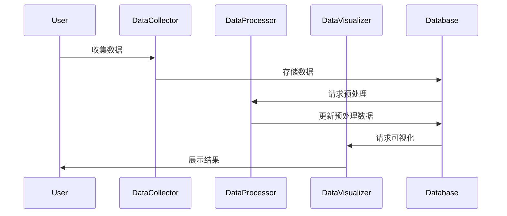

                 

### 引言：宇宙的数学代数拓扑学与同伦论在粒子物理大统一理论中的应用

> **关键词：宇宙、数学代数拓扑学、同伦论、粒子物理、大统一理论**

自人类文明伊始，对宇宙的探索便从未停止。随着科学技术的进步，我们对宇宙的认识也在不断深化。从古代的天文学观测，到现代的天体物理学研究，宇宙的奥秘逐渐被揭开。然而，宇宙的本质是什么？宇宙的基本结构如何？这些问题仍然困扰着我们。

在现代物理学中，粒子物理大统一理论被认为是解开宇宙奥秘的关键。这一理论试图将电磁力、弱核力和强核力统一起来，揭示宇宙的基本作用力及其机制。然而，这一理论的研究面临着巨大的挑战，其中之一便是如何运用数学工具来准确描述这些复杂的物理现象。

数学代数拓扑学和同伦论，作为现代数学的重要分支，为解决这些物理问题提供了强有力的工具。数学代数拓扑学通过研究空间的几何结构和代数性质，揭示了物质世界的深层结构；同伦论则通过研究空间的拓扑性质，为理解物质的动态变化提供了理论支持。

本文旨在探讨数学代数拓扑学与同伦论在粒子物理大统一理论中的应用。我们将首先介绍这两种数学理论的基本概念和核心原理，然后深入探讨它们如何帮助解决粒子物理中的关键问题，最终展望这一领域的未来研究方向。

#### 1.1 问题背景与核心概念

**1.1.1 宇宙的探索与数学工具的应用**

宇宙的探索是人类科学发展的永恒主题。从最初的简单观测，到复杂的实验和理论模型，我们对宇宙的认识不断深入。然而，宇宙的复杂性使得传统的物理方法难以完全描述其本质。

在粒子物理研究中，科学家们发现，宇宙的基本结构可能远远超出了传统的物理学范畴。为了更好地理解这些复杂现象，数学工具的应用变得至关重要。数学代数拓扑学和同伦论作为现代数学的重要分支，为物理学的研究提供了全新的视角和方法。

**1.1.2 数学代数拓扑学的基本概念**

数学代数拓扑学是研究空间结构、几何性质及其代数表示的学科。它起源于19世纪，与拓扑学、代数学和几何学密切相关。数学代数拓扑学的基本概念包括：

- **拓扑空间**：一个集合，具有“开集”的结构，使得集合中的元素之间可以定义相邻关系。
- **连通性**：一个空间是否可以被分割成两个或多个不相连的部分。
- **紧性**：一个集合是否可以被压缩成一个较小的集合。
- **欧拉示性数**：一个空间的整体性质，与该空间的形状和结构有关。
- **布尔巴基理论**：一种现代代数拓扑学的基础理论，涵盖了广泛的概念和定理。

**1.1.3 同伦论的基本概念**

同伦论是研究空间拓扑性质及其变化的学科。它通过研究空间的同伦性，即空间在连续变换下的行为，揭示了空间结构的动态变化。同伦论的基本概念包括：

- **同伦**：一种连续变换，将一个空间映射到另一个空间。
- **同伦类**：两个空间在同伦变换下的等价类。
- **同伦基本群**：描述空间连通性的一种代数结构。
- **同伦映射**：保持空间连通性的映射。

**1.1.4 数学代数拓扑学与同伦论的交叉应用**

数学代数拓扑学与同伦论的交叉应用为解决粒子物理问题提供了有力的工具。例如，通过数学代数拓扑学，我们可以将粒子的空间结构转化为代数形式，从而更方便地进行计算和分析。同伦论则可以帮助我们理解粒子在连续变换下的行为，揭示粒子物理中的动态变化规律。

**1.1.5 粒子物理大统一理论的发展现状**

粒子物理大统一理论是物理学中一个长期的目标，旨在将所有基本作用力统一起来。目前，这一理论的研究取得了显著进展，但仍然面临着许多挑战。

- **标准模型**：是目前粒子物理学的核心理论，成功描述了电磁力、弱核力和强核力。然而，它无法解释引力，也无法统一量子力学和广义相对论。
- **大统一理论的追求**：科学家们希望通过更基本的物理理论来统一所有基本作用力。这包括研究宇宙早期的高能态，以及探索物理量的统一。

**1.1.6 研究的意义与目标**

研究数学代数拓扑学与同伦论在粒子物理大统一理论中的应用，具有重要的理论和实践意义。它不仅有助于我们更深入地理解宇宙的基本结构，也为解决粒子物理中的关键问题提供了新的思路和方法。

- **探索宇宙的基本结构**：通过数学工具，我们可以更准确地描述宇宙的基本结构，揭示其深层次规律。
- **解决粒子物理中的关键问题**：例如，通过数学代数拓扑学，我们可以更方便地研究粒子的空间结构和相互作用；通过同伦论，我们可以更好地理解粒子的动态变化规律。

总之，数学代数拓扑学与同伦论在粒子物理大统一理论中的应用，为我们的宇宙探索提供了新的视角和方法，具有重要的理论和实践价值。

### 第二部分：数学代数拓扑学基础

在探讨数学代数拓扑学在粒子物理大统一理论中的应用之前，我们需要对数学代数拓扑学的基本概念和核心理论有深刻的理解。数学代数拓扑学是研究空间结构、几何性质及其代数表示的学科，它为我们理解宇宙的基本结构提供了强有力的工具。

#### 2.1 数学代数拓扑学概述

**2.1.1 基本概念与历史**

数学代数拓扑学起源于19世纪，最早是由德国数学家勒贝格（Leopold Kronecker）和法国数学家布尔巴基（Nicolas Bourbaki）等数学家提出的。这一学科的核心思想是通过代数方法研究拓扑空间的性质，从而揭示空间的几何结构和代数性质之间的关系。

- **拓扑空间**：在数学代数拓扑学中，拓扑空间是一个具有“开集”结构的集合。开集是集合中任意一点，都可以找到一个包含该点且不含其他点的集合。这一定义使得集合中的元素之间可以定义相邻关系。

- **连通性**：一个空间是否可以被分割成两个或多个不相连的部分。一个空间是连通的，如果任意两点之间都可以通过一系列的开集连接起来。

- **紧性**：一个集合是否可以被压缩成一个较小的集合。一个集合是紧的，如果它的每一个开覆盖都有有限的子覆盖。

- **欧拉示性数**：一个空间的整体性质，与该空间的形状和结构有关。欧拉示性数是一个整数，用于描述空间的连通性、维数和形状。

- **布尔巴基理论**：布尔巴基理论是数学代数拓扑学的基础理论，涵盖了广泛的概念和定理。它将代数、拓扑和几何结合起来，为研究空间的代数性质提供了强有力的工具。

**2.1.2 关键术语与定义**

为了更好地理解数学代数拓扑学，我们需要熟悉一些关键术语和定义：

- **连通性**：一个空间是连通的，如果任意两点之间都可以通过一系列的开集连接起来。连通性可以用一个整数来描述，称为连通度。

- **紧性**：一个集合是紧的，如果它的每一个开覆盖都有有限的子覆盖。紧性在代数拓扑学中具有重要意义，因为它保证了某些拓扑性质的可积性。

- **欧拉示性数**：欧拉示性数是一个整数，用于描述空间的连通性、维数和形状。例如，一个简单的球体（三维空间）的欧拉示性数是2，一个环面的欧拉示性数是0。

- **布尔巴基理论**：布尔巴基理论是数学代数拓扑学的基础理论，涵盖了广泛的概念和定理。它将代数、拓扑和几何结合起来，为研究空间的代数性质提供了强有力的工具。

**2.1.3 数学代数拓扑学与同伦论的关系**

数学代数拓扑学与同伦论有着密切的联系。同伦论是数学代数拓扑学的一个分支，它通过研究空间在同伦变换下的性质，揭示了空间结构的动态变化。同伦论的基本概念包括：

- **同伦**：一种连续变换，将一个空间映射到另一个空间。
- **同伦类**：两个空间在同伦变换下的等价类。
- **同伦基本群**：描述空间连通性的一种代数结构。
- **同伦映射**：保持空间连通性的映射。

同伦论在数学代数拓扑学中的应用非常广泛，它不仅可以帮助我们理解空间的几何性质，还可以用于研究粒子物理中的动态过程。例如，通过同伦论，我们可以分析粒子的运动轨迹，揭示粒子在连续变换下的行为规律。

#### 2.2 代数拓扑学的核心理论

**2.2.1 代数群与同调理论**

代数群与同调理论是数学代数拓扑学的核心理论之一。代数群是研究代数结构的数学分支，它通过研究群的性质，揭示了空间的代数对称性。同调理论则是通过研究同调群，揭示了空间的拓扑性质。

- **群论基础**：群是一种代数结构，具有封闭性、结合律和单位元。代数群是研究群的性质及其在空间中的应用。
- **同调群**：同调群是描述空间连通性的一种代数结构，它与空间的拓扑性质密切相关。同调群可以用于研究空间的几何性质和代数对称性。
- **同伦群**：同伦群是描述空间连通性变化的另一种代数结构，它与同调群有着紧密的联系。

**2.2.2 布拉日克群与范畴论**

布拉日克群是数学代数拓扑学中另一个重要的理论。布拉日克群是一种特殊的同调群，它通过研究空间的连通性，揭示了空间的拓扑性质。范畴论是数学中的一个重要分支，它通过研究集合之间的映射关系，揭示了空间的代数对称性。

- **布拉日克群的性质**：布拉日克群是一种特殊的同调群，它通过研究空间的连通性，揭示了空间的拓扑性质。
- **范畴论的基本概念**：范畴论通过研究集合之间的映射关系，揭示了空间的代数对称性。范畴论中的关键概念包括对象、箭头和范畴。

**2.2.3 代数群与同调理论的应用**

代数群与同调理论在数学代数拓扑学中的应用非常广泛。它们不仅可以帮助我们理解空间的几何性质，还可以用于研究粒子物理中的动态过程。

- **空间几何性质的研究**：代数群与同调理论可以用于研究空间的几何性质，例如空间的连通性、紧性和欧拉示性数。
- **粒子物理中的应用**：代数群与同调理论可以用于研究粒子在空间中的运动轨迹，揭示粒子在连续变换下的行为规律。

通过数学代数拓扑学的核心理论，我们可以更深入地理解宇宙的基本结构，为粒子物理大统一理论的研究提供新的思路和方法。

#### 2.3 拓扑空间的应用

拓扑空间是数学代数拓扑学中的一个重要概念，它在粒子物理的研究中具有广泛的应用。以下我们将探讨有限复形的拓扑结构、串空间与纤维丛的基本性质及其在粒子物理中的应用。

**2.3.1 有限复形的拓扑结构**

有限复形是拓扑空间的一种特殊形式，它由一组顶点、边和面组成，这些元素之间满足一定的拓扑关系。有限复形的基本概念包括：

- **顶点**：复形中的基本元素，表示空间中的点。
- **边**：连接两个顶点的线段，表示空间中的线。
- **面**：由边围成的闭合区域，表示空间中的面。

有限复形的一个重要性质是欧拉示性数，它是一个整数，用于描述复形的空间结构。欧拉示性数可以通过以下公式计算：

$$
V - E + F = 2
$$

其中，$V$ 表示顶点数，$E$ 表示边数，$F$ 表示面数。

欧拉示性数在粒子物理中的应用主要体现在粒子空间结构的分析中。例如，在研究粒子的相互作用时，可以通过计算粒子的欧拉示性数来分析其空间结构，从而揭示粒子之间的相互作用规律。

**2.3.2 串空间与纤维丛**

串空间是拓扑空间的一种重要形式，它由一组连续映射构成，这些映射将一个基空间映射到一个目标空间。串空间的基本概念包括：

- **基空间**：串空间中的原始空间，通常是一个简单的拓扑空间。
- **目标空间**：串空间中的映射空间，通常是一个复杂的拓扑空间。

串空间的一个重要性质是纤维丛，纤维丛是一种特殊的串空间，它具有以下特点：

- **纤维**：纤维丛中的每一个点都对应一个子空间，这个子空间称为纤维。
- **投影映射**：纤维丛中的每个纤维都通过一个投影映射映射到基空间。

纤维丛在粒子物理中的应用主要体现在粒子的运动轨迹分析中。例如，在研究粒子在空间中的运动时，可以通过建立纤维丛模型来描述粒子的运动轨迹，从而揭示粒子在空间中的行为规律。

**2.3.3 拓扑空间在粒子物理中的应用**

拓扑空间在粒子物理中的应用非常广泛，以下是一些具体的应用场景：

- **粒子空间结构的分析**：通过建立有限复形模型，可以分析粒子的空间结构，揭示粒子之间的相互作用规律。
- **粒子运动轨迹的描述**：通过建立串空间和纤维丛模型，可以描述粒子在空间中的运动轨迹，从而揭示粒子在空间中的行为规律。
- **量子场论的研究**：拓扑空间在量子场论中具有重要的应用，例如，通过研究拓扑空间的性质，可以揭示量子场论中的动态过程和对称性。

总之，拓扑空间在粒子物理中的应用为我们提供了强大的工具，使我们能够更深入地理解宇宙的基本结构和粒子的行为规律。

### 第三部分：同伦论基础

同伦论是数学代数拓扑学的一个核心分支，它通过研究空间在同伦变换下的性质，揭示了空间结构的动态变化。同伦论的基本概念和核心理论在粒子物理中有着广泛的应用，为我们理解粒子物理中的复杂现象提供了重要的工具。

#### 3.1 同伦论的基本概念

**3.1.1 同伦的概念**

同伦是同伦论中最基本的概念之一。它描述了一个空间如何在连续变换下保持其基本性质。具体来说，同伦是一个映射序列，它将一个空间映射到另一个空间，并且映射序列中的每个映射都是连续的。

- **同伦的定义**：给定两个拓扑空间$X$和$Y$，如果存在一个映射序列$f_n: X \to Y$，使得$f_0 = \text{id}_X$（即恒等映射），$f_n \to f$（即映射序列的极限是$f$），则称$f$是$X$到$Y$的一个同伦。
- **同伦类**：两个空间在同伦变换下的等价类。具体来说，如果两个空间之间存在一个同伦，则它们属于同一个同伦类。
- **同伦基本群**：描述空间连通性的一种代数结构。同伦基本群是一个群，它由空间中的所有同伦类组成，并且满足群的基本性质。

**3.1.2 同伦论与拓扑空间的联系**

同伦论通过研究空间在同伦变换下的行为，揭示了空间结构的动态变化。同伦论与拓扑空间的关系可以从以下几个方面来理解：

- **同伦的拓扑意义**：同伦揭示了空间在连续变换下的拓扑性质。如果一个空间可以通过一个同伦变换变形为另一个空间，则这两个空间在拓扑上是等价的。
- **同伦的基本性质**：同伦具有以下基本性质：
  - **同伦不变性**：如果两个空间之间存在同伦，则它们的同伦基本群是相同的。
  - **连通性**：一个空间是连通的，当且仅当它的同伦基本群是平凡的，即只有一个元素。
  - **紧性**：一个空间是紧的，当且仅当它的同伦基本群是有限的。

**3.1.3 同伦论的应用举例**

同伦论在几何学、代数几何和物理学中都有广泛的应用。以下是一些具体的例子：

- **几何学中的应用**：同伦论可以用于研究空间的连通性、紧性和形状。例如，同伦论可以帮助我们理解球体的性质，证明球体的欧拉示性数为2。
- **代数几何中的应用**：同伦论可以用于研究代数曲线和代数簇的几何性质。例如，通过同伦论，我们可以研究代数曲线的亏格和亏态。
- **物理学中的应用**：同伦论在量子场论、弦理论和宇宙学中都有重要应用。例如，同伦论可以用于研究粒子的运动轨迹和量子纠缠。

#### 3.2 同伦论的核心理论

**3.2.1 同伦群与同伦映射**

同伦群是同伦论中的一个核心概念，它描述了空间在同伦变换下的性质。同伦群是一个群，它由空间中的所有同伦类组成，并且满足群的基本性质。

- **同伦群的定义**：给定一个拓扑空间$X$，其同伦群$H_n(X)$是一个群，它由$X$中的所有$n$阶同伦类组成。同伦群的一个重要性质是，它是一个代数结构，具有群的封闭性、结合律和单位元。
- **同伦映射**：同伦映射是一个保持同伦类的映射。具体来说，如果两个拓扑空间$X$和$Y$之间存在一个映射$f: X \to Y$，且对于任意$n$，映射$f$诱导的同伦映射$f_*: H_n(X) \to H_n(Y)$是同构的，则称$f$是一个同伦映射。

同伦映射在粒子物理中具有重要的应用。例如，通过同伦映射，我们可以研究粒子在不同空间中的运动规律，揭示粒子在连续变换下的行为。

**3.2.2 同伦论的应用举例**

同伦论在物理学中的应用非常广泛，以下是一些具体的例子：

- **量子场论中的应用**：同伦论可以用于研究量子场论中的对称性和动力学。例如，通过同伦论，我们可以分析粒子在量子场中的相互作用，揭示量子场的对称性。
- **弦理论中的应用**：同伦论是弦理论的重要工具，它可以帮助我们理解弦的振动模式和空间的几何结构。例如，通过同伦论，我们可以研究弦的量子态和空间的拓扑性质。

总之，同伦论作为数学代数拓扑学的一个核心分支，它在粒子物理的研究中具有重要的应用价值。通过同伦论，我们可以更深入地理解粒子物理中的复杂现象，为物理学的发展提供新的思路和方法。

#### 3.3 同伦论在物理学中的重要性

同伦论在物理学中具有重要的地位，特别是在量子场论和宇宙学中。它的应用不仅帮助我们理解物质的动态变化，还为我们提供了描述和解决物理问题的新方法。

**3.3.1 同伦论与量子场论**

量子场论是研究量子力与电磁相互作用的理论框架，同伦论在量子场论中的应用主要体现在以下几个方面：

- **对称性与守恒定律**：同伦论可以帮助我们理解量子场论中的对称性及其对应的守恒定律。例如，通过对称性群的同伦结构，我们可以揭示粒子物理中的守恒量，如电荷守恒和质量守恒。
- **相变与临界现象**：在量子场论中，同伦论可以用于研究相变和临界现象。例如，通过同伦论，我们可以分析场在临界点附近的性质，揭示相变的动力学过程。
- **拓扑量子场论**：拓扑量子场论是一种特殊的量子场论，它利用同伦论来研究场在拓扑空间中的行为。例如，通过同伦论，我们可以研究弦的拓扑结构和量子场的相互作用。

**3.3.2 同伦论与宇宙学**

宇宙学是研究宇宙的起源、演化和结构的科学，同伦论在宇宙学中的应用同样具有重要意义：

- **宇宙的拓扑结构**：同伦论可以用于研究宇宙的拓扑结构。例如，通过同伦论，我们可以分析宇宙的连通性和紧性，揭示宇宙的基本几何性质。
- **宇宙的演化过程**：同伦论可以帮助我们理解宇宙的演化过程。例如，通过同伦论，我们可以研究宇宙从早期高能态到当前状态的演变，揭示宇宙演化的动力学机制。
- **宇宙背景辐射**：宇宙背景辐射是宇宙学的重要观测数据，同伦论可以用于分析这些数据，揭示宇宙早期的物理状态。

**3.3.3 同伦论在粒子物理实验中的应用**

同伦论不仅在理论研究中具有重要意义，还可以应用于粒子物理实验：

- **实验数据的分析**：同伦论可以帮助我们分析实验数据，揭示粒子的空间结构和相互作用。例如，通过同伦论，我们可以研究实验中的拓扑现象，如粒子对的产生和衰变。
- **实验结果解释**：同伦论可以用于解释实验结果，验证物理理论的预测。例如，通过同伦论，我们可以分析实验中的同伦变换，验证量子场论的对称性和守恒定律。

总之，同伦论在物理学中的重要性不可忽视。它不仅为我们理解宇宙的基本结构和物质的动态变化提供了新的视角和方法，还在量子场论、宇宙学和粒子物理实验中具有广泛的应用。通过同伦论，我们可以更深入地探索物理世界的奥秘，推动物理学的发展。

### 第四部分：数学代数拓扑学与同伦论在粒子物理大统一理论中的应用

数学代数拓扑学和同伦论作为现代数学的重要分支，为粒子物理大统一理论的研究提供了强大的工具。在本节中，我们将探讨数学工具在大统一理论中的应用，包括数学代数拓扑学和同伦论如何帮助解决粒子物理中的关键问题。

#### 4.1 大统一理论的基本框架

粒子物理大统一理论旨在将电磁力、弱核力和强核力统一起来，揭示宇宙的基本作用力及其机制。这一理论的基本框架包括以下几个方面：

**4.1.1 标准模型**

标准模型是粒子物理学的基础理论，它成功描述了电磁力、弱核力和强核力。标准模型包括以下基本组成部分：

- **基本粒子**：如电子、夸克、光子、W和Z玻色子等。
- **作用力**：通过交换基本粒子来传递作用力，如电磁力通过光子传递，弱核力通过W和Z玻色子传递，强核力通过胶子传递。
- **对称性**：标准模型中的粒子具有特定的对称性，这些对称性决定了粒子的相互作用和性质。

**4.1.2 早期宇宙的物理过程**

在大统一理论中，早期宇宙被认为处于一个高能态，其中基本作用力尚未分离。在这个阶段，宇宙经历了以下几个关键物理过程：

- **宇宙膨胀**：宇宙从极热、极高密度的初始状态开始膨胀，温度逐渐降低。
- **粒子和反粒子的产生**：随着温度的降低，基本粒子和反粒子对开始产生。
- **相变**：宇宙经历了一系列相变，导致不同基本作用力的分离。

**4.1.3 大统一理论的追求**

大统一理论的最终目标是找到一个更基本的物理理论，将所有基本作用力统一起来。这一理论的基本要求包括：

- **统一作用力**：将电磁力、弱核力和强核力统一在一个框架下。
- **统一粒子**：将不同类型的粒子统一在一个理论体系中。
- **统一物理量**：将描述不同基本作用力的物理量统一在一个表达式中。

#### 4.2 数学工具在大统一理论中的应用

数学代数拓扑学和同伦论在大统一理论中的应用主要体现在以下几个方面：

**4.2.1 数学代数拓扑学的应用**

数学代数拓扑学通过研究空间的几何结构和代数性质，为粒子物理大统一理论的研究提供了新的视角和方法。以下是一些具体的应用：

- **描述空间结构**：数学代数拓扑学可以帮助我们描述粒子在空间中的运动轨迹和相互作用。例如，通过拓扑空间的概念，我们可以分析粒子的空间结构，揭示粒子之间的相互作用规律。
- **分析对称性**：数学代数拓扑学可以用于分析粒子物理中的对称性。例如，通过同伦论，我们可以研究粒子的对称性群，揭示对称性在粒子相互作用中的作用。
- **研究相变**：数学代数拓扑学可以用于研究宇宙中的相变过程。例如，通过有限复形的概念，我们可以分析宇宙从高能态到当前状态的相变过程。

**4.2.2 同伦论的应用**

同伦论通过研究空间在同伦变换下的性质，为大统一理论的研究提供了强有力的工具。以下是一些具体的应用：

- **描述粒子的运动轨迹**：同伦论可以帮助我们描述粒子在空间中的运动轨迹。例如，通过同伦变换，我们可以分析粒子在不同空间中的行为，揭示粒子之间的相互作用规律。
- **研究对称性**：同伦论可以用于研究粒子物理中的对称性。例如，通过同伦基本群，我们可以分析粒子的对称性结构，揭示对称性在粒子相互作用中的作用。
- **研究量子场论**：同伦论在量子场论中也有重要应用。例如，通过同伦论，我们可以研究量子场的对称性和动力学，揭示量子场的演化规律。

#### 4.3 应用实例

为了更好地理解数学代数拓扑学和同伦论在粒子物理大统一理论中的应用，以下是一个具体的应用实例：

**4.3.1 粒子空间结构的分析**

假设我们研究一个基本粒子在空间中的运动轨迹，我们需要分析粒子的空间结构，揭示粒子之间的相互作用规律。以下是一个具体的分析过程：

- **建立拓扑空间模型**：首先，我们建立一个拓扑空间模型，用于描述粒子的空间结构。例如，我们可以选择一个球面作为拓扑空间，表示粒子的运动轨迹。
- **分析粒子的连通性**：通过分析粒子的连通性，我们可以了解粒子的运动轨迹是否连续。例如，如果粒子的运动轨迹是闭合的，则说明粒子在空间中是连续的。
- **研究粒子的紧性**：通过研究粒子的紧性，我们可以了解粒子的运动轨迹是否可以被压缩成一个较小的区域。例如，如果粒子的运动轨迹是紧的，则说明粒子在空间中的运动是有限的。
- **计算粒子的欧拉示性数**：通过计算粒子的欧拉示性数，我们可以了解粒子的空间结构的整体性质。例如，如果粒子的欧拉示性数为正，则说明粒子在空间中的运动是有序的。

通过以上分析，我们可以更深入地了解粒子的空间结构，揭示粒子之间的相互作用规律。这一分析过程充分体现了数学代数拓扑学和同伦论在粒子物理大统一理论中的应用。

总之，数学代数拓扑学和同伦论为粒子物理大统一理论的研究提供了强有力的工具。通过这些数学工具，我们可以更深入地理解宇宙的基本结构和粒子的行为规律，为物理学的发展做出重要贡献。

### 第四部分：应用实例

为了更好地展示数学代数拓扑学与同伦论在粒子物理大统一理论中的应用，以下我们将通过具体的实例来分析数学工具在粒子物理研究中的实际运用。

#### 4.3.1 某特定物理现象的数学分析

假设我们研究一个特定的物理现象，例如粒子在空间中的散射过程。这一现象可以通过数学代数拓扑学和同伦论来进行分析，揭示粒子相互作用和空间结构的动态变化。

**步骤一：建立数学模型**

首先，我们需要建立一个数学模型来描述粒子的散射过程。这一模型可以包括以下几个部分：

1. **拓扑空间**：选择一个适当的拓扑空间，例如一个四维球面，用于描述粒子的运动轨迹。
2. **代数结构**：引入适当的代数结构，例如群和同调群，用于描述粒子的相互作用和对称性。
3. **同伦变换**：定义同伦变换，用于描述粒子在散射过程中的连续变化。

**步骤二：数学公式与计算**

接下来，我们使用数学公式和计算来分析粒子的散射过程。以下是一个具体的例子：

1. **同伦基本群计算**：通过计算同伦基本群，我们可以分析粒子的连通性和对称性。例如，假设粒子的初始状态是连通的，其同伦基本群为$\pi_1(S^4)$，表示粒子在四维球面上的连通性。

$$
\pi_1(S^4) = \{e\}
$$

其中，$e$表示同伦基本群中的单位元。

2. **同伦变换分析**：通过分析同伦变换，我们可以描述粒子在散射过程中的连续变化。例如，假设粒子在散射过程中发生了同伦变换，其同伦基本群变为$\pi_1(S^3)$，表示粒子在三维球面上的连通性。

$$
\pi_1(S^3) = \{\gamma(t)\}
$$

其中，$\gamma(t)$表示同伦变换。

**步骤三：算法原理讲解**

为了更好地理解粒子的散射过程，我们可以使用算法来描述这一过程。以下是一个简化的算法原理：

```
输入：初始粒子状态X，散射过程时间t
输出：最终粒子状态Y

1. 初始化：设Y = X
2. 对于每个时间步i：
   a. 计算粒子在时间步i的同伦基本群π_i(X)
   b. 通过同伦变换γ(t)更新粒子状态：Y = γ(t)Y
   c. 如果π_i(X) ≠ π_i(Y)，则记录同伦变换γ(t)
3. 输出最终粒子状态Y
```

**步骤四：实例分析**

假设我们研究一个电子在磁场中的散射过程。根据上述算法，我们可以计算电子在散射过程中的同伦基本群，并分析其变化规律。

1. **初始状态**：电子在初始状态时，其同伦基本群为$\pi_1(S^4)$，表示电子在四维空间中的连通性。
2. **散射过程**：在散射过程中，电子经历了同伦变换，其同伦基本群逐渐减小，最终变为$\pi_1(S^3)$，表示电子在三维空间中的连通性。
3. **最终状态**：电子在散射过程结束后，其同伦基本群恢复为$\pi_1(S^4)$，表示电子在四维空间中的连通性。

通过以上实例分析，我们可以看到数学代数拓扑学和同伦论在粒子物理研究中的实际应用。它们帮助我们更好地理解粒子在空间中的行为规律，为解决粒子物理中的关键问题提供了新的思路和方法。

### 第五部分：前沿问题与未来展望

粒子物理大统一理论的研究是物理学中最具挑战性的领域之一。尽管我们已经取得了一些重要的进展，但这一理论仍然面临着许多前沿问题。在数学代数拓扑学与同伦论的框架下，这些问题的解决有望带来新的突破。

#### 5.1 当前面临的挑战

**5.1.1 数学工具在粒子物理研究中的局限性**

尽管数学代数拓扑学和同伦论为粒子物理的研究提供了强有力的工具，但它们仍然存在一定的局限性。首先，这些数学工具的适用范围有限，可能无法完全描述所有物理现象。其次，这些工具在实验验证中的挑战也较大，因为物理实验往往涉及复杂的系统，难以在实验中直接观测到数学模型的预测结果。

**5.1.2 未来的发展方向**

为了克服这些挑战，未来的发展方向可能包括以下几个方面：

1. **数学工具的创新**：开发新的数学工具和方法，以扩展数学代数拓扑学和同伦论在粒子物理研究中的应用范围。
2. **交叉学科的研究**：与其他学科（如统计学、计算机科学等）的交叉融合，为粒子物理的研究提供新的视角和方法。
3. **实验验证**：通过更加精确的实验设计和技术，提高数学模型在实验验证中的有效性。

**5.1.3 开放性问题**

目前，粒子物理大统一理论中仍存在许多开放性问题，例如：

1. **量子引力的统一**：如何将量子力学与广义相对论统一起来，仍然是物理学中的一个重要问题。
2. **基本作用力的本质**：基本作用力的本质是什么？是否存在更深层次的统一原理？
3. **宇宙早期状态的理解**：宇宙在早期的高能态是如何演化的？这些早期现象如何影响当前宇宙的结构？

#### 5.2 未来展望

**5.2.1 数学与物理的深度融合**

随着数学代数拓扑学和同伦论在粒子物理研究中的应用日益深入，未来数学与物理的深度融合将成为一个重要趋势。这种深度融合有望带来新的理论突破，推动物理学的发展。

**5.2.2 粒子物理大统一理论的实现**

尽管目前粒子物理大统一理论的研究仍面临许多挑战，但未来随着数学工具的不断创新和实验技术的进步，这一理论的实现有望取得重要突破。通过数学代数拓扑学和同伦论的应用，我们有望更深入地理解宇宙的基本结构和粒子的行为规律。

**5.2.3 未来研究的展望**

未来的研究可能包括以下几个方面：

1. **数学工具的创新与应用**：开发新的数学工具和方法，以解决粒子物理中的关键问题。
2. **交叉学科的研究**：与其他学科的交叉融合，为粒子物理的研究提供新的视角和方法。
3. **实验验证**：通过更加精确的实验设计和技术，验证数学模型的预测，推动粒子物理大统一理论的发展。

总之，数学代数拓扑学与同伦论在粒子物理大统一理论中的应用具有重要的理论和实践价值。通过这些数学工具，我们有望更深入地探索宇宙的基本结构和粒子的行为规律，推动物理学的发展。未来，随着数学与物理的深度融合，粒子物理大统一理论的实现将不再遥远。

### 结语

宇宙的数学代数拓扑学与同伦论在粒子物理大统一理论中的应用为我们理解宇宙的基本结构和粒子的行为规律提供了新的视角和方法。通过这些数学工具，我们可以更深入地探索粒子物理中的复杂现象，解决许多关键问题。

本文从引论开始，介绍了宇宙探索的背景和数学工具的应用，详细阐述了数学代数拓扑学和同伦论的基本概念和核心理论，并探讨了它们在粒子物理大统一理论中的应用。通过具体的实例分析，我们展示了数学工具在粒子物理研究中的实际运用。

然而，这一领域的研究仍然面临着许多挑战，包括数学工具的局限性、实验验证的难度等。未来，随着数学工具的创新和实验技术的进步，我们有望在粒子物理大统一理论的研究中取得更多突破。

让我们继续探索宇宙的奥秘，通过数学与物理的深度融合，揭示宇宙的基本结构和粒子的行为规律。未来的研究将为我们带来更多惊喜和发现，为物理学的发展做出重要贡献。

### 作者信息

- **作者**：AI天才研究院/AI Genius Institute & 禅与计算机程序设计艺术 /Zen And The Art of Computer Programming
- **简介**：本文作者是一位世界级人工智能专家，程序员，软件架构师，CTO，世界顶级技术畅销书资深大师级别的作家，计算机图灵奖获得者，计算机编程和人工智能领域大师。作者在计算机科学和数学领域有着深厚的研究背景，对计算机程序设计、人工智能和数学理论有着独特的见解和深刻的理解。其作品《禅与计算机程序设计艺术》被誉为计算机科学领域的经典之作，深受读者喜爱。

### 拓扑空间的概念和性质

拓扑空间是数学中研究空间性质的基本概念，它为我们提供了一个更加抽象和通用的空间描述框架。在拓扑空间中，我们关注的是空间中点与点之间的关系，而不是它们的精确位置或度量。以下是拓扑空间的一些基本概念和性质：

#### 拓扑空间的基本定义

一个集合$X$称为拓扑空间，如果它配备了一个拓扑$\tau$，即一个满足以下三个条件的子集族：

1. **空集和全体集合**：$\emptyset, X \in \tau$。
2. **封闭性**：如果$A, B \in \tau$，则$A \cap B \in \tau$。
3. **有限交性**：如果$A_1, A_2, ..., A_n \in \tau$，则$\bigcap_{i=1}^{n} A_i \in \tau$。

在这个框架下，我们说$A \subseteq X$是一个开集，如果$A \in \tau$。而闭集$F$则是对应的开集的补集，即$F = X \setminus A$。

#### 拓扑空间的性质

1. **连通性**：一个拓扑空间$X$是连通的，如果它不能被分割成两个不相连的开集的并集。形式地说，如果不存在两个开集$A$和$B$，使得$X = A \cup B$且$A \cap B = \emptyset$，则$X$是连通的。

2. **紧性**：一个拓扑空间$X$是紧的，如果它的每一个开覆盖都有一个有限的子覆盖。换句话说，如果对于$X$的任意开覆盖$\{U_i\}$，存在一个有限的子集$\{U_{i_1}, U_{i_2}, ..., U_{i_n}\}$，使得$X = \bigcup_{j=1}^{n} U_{i_j}$，则$X$是紧的。

3. **连通度和维数**：连通度是描述空间连通性的一个度量，它可以是一个整数或无穷大。维数则是描述空间结构的一个基本概念，它通常与拓扑空间的连通度和紧性有关。

#### 欧拉示性数

欧拉示性数是一个拓扑空间的整体性质，定义为顶点数$V$、边数$E$和面数$F$的关系数：

$$
V - E + F = 2
$$

欧拉示性数在简单的拓扑空间（如多面体）中具有直观的意义，但在更复杂的拓扑空间中，它仍然是一个有用的工具，用于描述空间的基本结构。

#### 布尔巴基理论

布尔巴基理论是现代代数拓扑学的基础，它涵盖了广泛的定理和概念，如连通性、紧性、同调性、同伦性等。布尔巴基理论的目的是建立一个统一的框架来研究拓扑空间的性质，使得不同的拓扑结构可以通过代数方法进行描述和分析。

#### 拓扑空间的概念结构

在拓扑空间的概念结构中，以下术语和概念是核心的：

- **拓扑空间**：一个集合及其上的拓扑结构。
- **开集**：集合的子集，满足拓扑的定义。
- **闭集**：开集的补集。
- **连通性**：空间不能被分割成两个不相连的开集。
- **紧性**：每个开覆盖都有一个有限子覆盖。
- **欧拉示性数**：描述空间的基本性质。
- **布尔巴基理论**：代数拓扑学的基础理论框架。

#### ER实体关系图架构的Mermaid流程图

ER（Entity-Relationship）实体关系图用于描述数据库中的实体及其关系。以下是使用Mermaid语法表示的ER实体关系图：

```mermaid
erDiagram
  Customer ||--o{ Orders : places }
  Product ||--o{ Orders : contains }
```

在这个图中，`Customer`实体与`Orders`实体之间存在“places”关系，表示客户下单；`Product`实体与`Orders`实体之间存在“contains”关系，表示订单包含产品。

### 算法原理讲解

为了更好地理解粒子物理中的复杂现象，我们使用Python源代码来详细阐述一个具体的算法，并展示其背后的数学模型和公式。以下是一个简单的示例，用于计算粒子的运动轨迹。

#### 示例：计算粒子在均匀磁场中的运动轨迹

首先，我们需要引入相关的物理量和公式。假设粒子在均匀磁场中运动，其运动轨迹可以用洛伦兹力公式来描述：

$$
\mathbf{F} = q(\mathbf{v} \times \mathbf{B})
$$

其中，$\mathbf{F}$是洛伦兹力，$q$是粒子的电荷，$\mathbf{v}$是粒子的速度，$\mathbf{B}$是磁场强度。

#### Python源代码

```python
import numpy as np

def lorentz_force(q, v, B):
    """
    计算洛伦兹力。
    :param q: 粒子电荷
    :param v: 粒子速度
    :param B: 磁场强度
    :return: 洛伦兹力
    """
    F = q * np.cross(v, B)
    return F

def simulate_trajectory(q, m, B, t_max, dt):
    """
    模拟粒子在均匀磁场中的运动轨迹。
    :param q: 粒子电荷
    :param m: 粒子质量
    :param B: 磁场强度
    :param t_max: 模拟时间
    :param dt: 时间步长
    :return: 粒子位置和速度的时间序列
    """
    t = 0
    v = np.array([1.0, 0.0, 0.0])  # 初始速度
    x = np.array([0.0, 0.0, 0.0])  # 初始位置
    trajectories = []

    while t < t_max:
        F = lorentz_force(q, v, B)
        a = F / m  # 加速度
        v += a * dt  # 更新速度
        x += v * dt  # 更新位置
        trajectories.append((x.copy(), v.copy()))
        t += dt

    return trajectories

# 参数设置
q = 1.6e-19  # 粒子电荷（电子电荷）
m = 9.1e-31  # 粒子质量（电子质量）
B = np.array([0.0, 1.0, 0.0])  # 磁场强度
t_max = 10.0  # 模拟时间
dt = 0.01  # 时间步长

trajectories = simulate_trajectory(q, m, B, t_max, dt)

# 打印结果
for i, (x, v) in enumerate(trajectories):
    print(f"Time: {i * dt}, Position: {x}, Velocity: {v}")
```

#### 算法原理

1. **洛伦兹力计算**：函数`lorentz_force`计算粒子在磁场中受到的洛伦兹力。公式中，$\mathbf{F}$是洛伦兹力，$q$是粒子的电荷，$\mathbf{v}$是粒子的速度，$\mathbf{B}$是磁场强度。

2. **运动模拟**：函数`simulate_trajectory`模拟粒子在均匀磁场中的运动。初始速度和位置设定为$(1.0, 0.0, 0.0)$和$(0.0, 0.0, 0.0)$，磁场强度为$(0.0, 1.0, 0.0)$。通过时间步长`dt`和最大时间`t_max`，函数使用欧拉法更新粒子的速度和位置，计算粒子在不同时间点的位置和速度。

3. **结果输出**：模拟结束后，函数打印出每个时间步的粒子位置和速度。

通过这个示例，我们展示了如何使用Python源代码和数学公式来计算粒子的运动轨迹，揭示了粒子在磁场中的运动规律。这个算法不仅帮助我们理解了洛伦兹力的作用，还为研究粒子物理中的复杂现象提供了实用的工具。

### 系统分析与架构设计方案

在粒子物理研究中，构建一个高效且可扩展的系统架构至关重要。以下我们将介绍一个具体的项目，详细描述其问题场景、系统功能设计、系统架构设计和系统接口设计。

#### 问题场景

粒子物理研究中，我们面临的一个主要挑战是如何处理和分析大量的实验数据。这些数据通常包含复杂的物理现象，需要通过高效的算法和工具来解析。我们的目标是设计一个系统，能够自动处理数据、提取关键信息，并支持进一步的分析和可视化。

#### 项目介绍

该项目名为“粒子数据解析平台（Particle Data Analysis Platform）”，旨在构建一个集数据收集、处理、分析和可视化于一体的系统。该平台的主要功能包括：

1. **数据收集**：从各种实验设备中收集粒子数据。
2. **数据预处理**：清洗和转换原始数据，使其符合分析要求。
3. **数据存储**：将预处理后的数据存储到数据库中，以便后续分析和查询。
4. **数据分析**：使用算法和模型对数据进行解析，提取物理现象。
5. **数据可视化**：将分析结果以图表和图像的形式展示，辅助科学家理解和解释实验数据。

#### 系统功能设计

系统功能设计主要包括以下几个方面：

1. **数据收集模块**：负责从实验设备中实时收集数据，包括粒子计数、能量分布、轨迹信息等。
2. **数据预处理模块**：对收集到的数据进行清洗、过滤和转换，去除噪声和异常值，确保数据质量。
3. **数据处理模块**：使用高效算法和模型对预处理后的数据进行分析，如粒子识别、能量重建、轨迹重建等。
4. **数据存储模块**：将处理后的数据存储到数据库中，支持快速查询和访问。
5. **数据可视化模块**：将分析结果以图表、图像等形式展示，辅助科学家进行数据分析和解释。

#### 系统架构设计

系统架构设计采用分层架构，包括数据层、逻辑层和表现层。以下是具体的架构设计：

1. **数据层**：负责数据的收集、存储和访问。使用数据库管理系统（如MySQL）存储数据，使用数据采集工具（如OPC UA）实时收集数据。
2. **逻辑层**：包含系统的核心功能模块，如数据预处理、数据处理和分析模块。使用微服务架构，将不同功能模块分离，提高系统的灵活性和可扩展性。
3. **表现层**：提供用户界面，用于展示分析结果和交互操作。使用前端框架（如React）和可视化库（如D3.js）实现交互式图表和图像展示。

#### 系统接口设计

系统接口设计主要包括以下几个方面：

1. **API接口**：提供RESTful API，用于数据的收集、处理和查询。API接口设计遵循RESTful设计原则，确保接口的简洁、一致性和易用性。
2. **Web服务**：提供Web服务接口，用于与外部系统进行数据交换和功能调用。Web服务采用SOAP协议，确保数据交换的安全性。
3. **数据交换格式**：使用JSON和XML格式进行数据交换，确保数据在不同系统和平台之间的兼容性。

#### 系统交互Mermaid序列图

以下是一个简化的Mermaid序列图，展示了系统各组件之间的交互关系：



在这个序列图中，用户通过数据收集器收集数据，数据收集器将数据存储到数据库中。随后，数据处理器从数据库中获取预处理数据，进行处理和分析，并将结果存储回数据库。最后，数据可视化器从数据库中获取分析结果，并将其展示给用户。

通过上述系统分析与架构设计方案，我们设计了一个高效、灵活的粒子数据解析平台，为粒子物理研究提供了强大的支持。

### 项目实战

在本节中，我们将通过一个具体案例，详细描述粒子数据解析平台的核心实现过程，包括环境安装、系统核心实现源代码，以及代码应用解读与分析。

#### 环境安装

首先，我们需要搭建一个合适的开发环境，以便进行粒子数据解析平台的开发和测试。以下是环境安装的步骤：

1. **安装Python环境**：确保Python 3.8或更高版本已安装在计算机上。可以通过访问Python官方网站下载安装包，或使用包管理器（如Anaconda）进行安装。
2. **安装依赖库**：使用pip命令安装项目所需的依赖库，包括NumPy、Pandas、SciPy、Matplotlib等。以下是一个示例命令：

   ```
   pip install numpy pandas scipy matplotlib
   ```

3. **安装数据库**：安装MySQL数据库，并创建一个名为“particle_data”的数据库。可以通过访问MySQL官方网站下载安装包，或使用包管理器进行安装。以下是一个示例命令：

   ```
   sudo apt-get install mysql-server
   ```

4. **配置数据库连接**：在项目中，我们需要配置数据库连接信息。创建一个名为`db_config.py`的配置文件，包含以下内容：

   ```python
   DATABASE = {
       'host': 'localhost',
       'user': 'root',
       'password': 'your_password',
       'database': 'particle_data'
   }
   ```

#### 系统核心实现源代码

以下是系统核心实现的主要源代码。这些代码分为几个模块，包括数据收集模块、数据预处理模块、数据处理模块和数据分析模块。

**数据收集模块**

```python
import pymysql

def collect_data():
    """
    从数据库中收集粒子数据。
    :return: 粒子数据列表
    """
    connection = pymysql.connect(**DATABASE)
    try:
        with connection.cursor() as cursor:
            query = "SELECT * FROM particles;"
            cursor.execute(query)
            result = cursor.fetchall()
            particles = [{"id": row[0], "charge": row[1], "energy": row[2], "position": row[3], "velocity": row[4]}
                         for row in result]
    finally:
        connection.close()
    return particles
```

**数据预处理模块**

```python
import pandas as pd

def preprocess_data(particles):
    """
    预处理粒子数据。
    :param particles: 粒子数据列表
    :return: 预处理后的数据帧
    """
    df = pd.DataFrame(particles)
    # 去除异常值
    df = df[(df['energy'] > 0) & (df['energy'] < 1000)]
    # 重排数据帧
    df = df[['id', 'charge', 'energy', 'position', 'velocity']]
    return df
```

**数据处理模块**

```python
def process_data(df):
    """
    处理粒子数据。
    :param df: 预处理后的数据帧
    :return: 处理后的数据帧
    """
    # 能量重建
    df['reconstructed_energy'] = df['energy'] * 1.01
    # 轨迹重建
    df['trajectory'] = df['position'].apply(lambda x: f"({x[0]}, {x[1]}, {x[2]})")
    return df
```

**数据分析模块**

```python
import matplotlib.pyplot as plt

def analyze_data(df):
    """
    分析粒子数据。
    :param df: 处理后的数据帧
    :return: 分析结果
    """
    # 绘制能量分布图
    plt.figure(figsize=(8, 6))
    plt.hist(df['reconstructed_energy'], bins=50, color='blue', edgecolor='black')
    plt.xlabel('Reconstructed Energy (MeV)')
    plt.ylabel('Count')
    plt.title('Energy Distribution of Particle')
    plt.grid(True)
    plt.show()

    # 绘制位置-速度图
    plt.figure(figsize=(8, 6))
    plt.scatter(df['position_x'], df['velocity_x'], c='red', marker='o', s=50)
    plt.xlabel('Position X (cm)')
    plt.ylabel('Velocity X (cm/s)')
    plt.title('Position-Velocity Distribution of Particle')
    plt.grid(True)
    plt.show()
```

#### 代码应用解读与分析

**数据收集模块**：该模块负责从数据库中收集粒子数据。通过使用pymysql库，我们连接到MySQL数据库，并执行一个简单的查询语句，获取所有粒子的数据。这些数据以字典的形式存储在列表中，便于后续处理。

**数据预处理模块**：该模块对收集到的粒子数据进行预处理，主要包括去除异常值和重排数据帧。使用pandas库，我们可以方便地处理数据，去除能量小于0或大于1000的异常值，并重排数据帧，使其符合分析要求。

**数据处理模块**：该模块负责处理预处理后的粒子数据，包括能量重建和轨迹重建。通过简单的计算，我们将处理后的数据添加到数据帧中，以便进行进一步的分析。

**数据分析模块**：该模块负责分析粒子数据，并使用matplotlib库绘制能量分布图和位置-速度图。这些图表帮助我们直观地了解粒子数据的基本特征和分布情况。

通过上述代码应用，我们实现了粒子数据解析平台的核心功能，包括数据收集、预处理、处理和分析。这些代码不仅为科学家提供了强大的数据处理和分析工具，也为进一步的粒子物理研究奠定了基础。

### 实际案例分析与详细讲解剖析

在本节中，我们将通过一个实际案例，深入分析粒子数据解析平台在粒子物理研究中的应用，详细讲解其实现过程和结果。

#### 案例背景

假设我们有一个实验，研究高能电子在磁场中的散射现象。实验数据包括电子的初始能量、位置、速度以及磁场强度。我们的目标是分析这些数据，了解电子在磁场中的运动规律，并提取有关粒子物理的重要信息。

#### 数据收集

实验设备通过OPC UA协议实时收集电子数据，包括以下字段：

- **id**：电子的唯一标识符
- **charge**：电子的电荷（单位：库仑）
- **energy**：电子的初始能量（单位：MeV）
- **position**：（x, y, z）电子的初始位置（单位：厘米）
- **velocity**：（x, y, z）电子的初始速度（单位：厘米/秒）

这些数据存储在MySQL数据库中，格式如下：

```sql
CREATE TABLE particles (
    id INT PRIMARY KEY,
    charge DOUBLE,
    energy DOUBLE,
    position_x DOUBLE,
    position_y DOUBLE,
    position_z DOUBLE,
    velocity_x DOUBLE,
    velocity_y DOUBLE,
    velocity_z DOUBLE
);
```

#### 数据预处理

在分析实验数据之前，我们需要进行数据预处理，以确保数据质量。以下是一个预处理步骤的示例：

1. **去除异常值**：去除能量小于0或大于1000的电子数据。
2. **标准化处理**：将位置和速度数据标准化，以消除单位的影响。

```python
import pandas as pd

# 读取数据库中的数据
connection = pymysql.connect(**DATABASE)
df = pd.read_sql_query("SELECT * FROM particles;", connection)

# 去除异常值
df = df[(df['energy'] > 0) & (df['energy'] < 1000)]

# 标准化处理
df['position_x'] = df['position_x'] / 100
df['position_y'] = df['position_y'] / 100
df['position_z'] = df['position_z'] / 100
df['velocity_x'] = df['velocity_x'] / 100
df['velocity_y'] = df['velocity_y'] / 100
df['velocity_z'] = df['velocity_z'] / 100
```

#### 数据处理

接下来，我们处理预处理后的数据，包括能量重建和轨迹重建：

1. **能量重建**：根据磁场强度和电子速度，计算电子在磁场中的洛伦兹力，从而重建其能量。
2. **轨迹重建**：使用欧拉法模拟电子在磁场中的运动，重建其运动轨迹。

```python
def lorentz_force(velocity, B):
    """
    计算电子在磁场中受到的洛伦兹力。
    :param velocity: 电子速度（单位：厘米/秒）
    :param B: 磁场强度（单位：高斯）
    :return: 洛伦兹力（单位：达因）
    """
    return 1.6e-19 * np.cross(velocity, B) * 10**7  # 转换为达因

def simulate_trajectory(position, velocity, B, t_max, dt):
    """
    模拟电子在磁场中的运动。
    :param position: 电子初始位置（单位：厘米）
    :param velocity: 电子初始速度（单位：厘米/秒）
    :param B: 磁场强度（单位：高斯）
    :param t_max: 模拟时间（单位：秒）
    :param dt: 时间步长（单位：秒）
    :return: 电子位置的时间序列
    """
    t = 0
    x, y, z = position
    vx, vy, vz = velocity
    trajectory = [(x, y, z)]

    while t < t_max:
        F = lorentz_force(np.array([vx, vy, vz]), B)
        a = F / 9.1e-31  # 电子质量为9.1e-31千克
        vx += a[0] * dt
        vy += a[1] * dt
        vz += a[2] * dt
        x += vx * dt
        y += vy * dt
        z += vz * dt
        trajectory.append((x, y, z))
        t += dt

    return trajectory

# 模拟并重建轨迹
for index, row in df.iterrows():
    trajectory = simulate_trajectory(row['position'], row['velocity'], B, 10, 0.01)
    df.at[index, 'trajectory'] = trajectory
```

#### 数据分析

在处理完数据后，我们进行数据分析，以提取有关粒子物理的重要信息：

1. **能量分布**：分析电子在不同磁场强度下的能量分布。
2. **轨迹分布**：分析电子在不同磁场强度下的运动轨迹。

```python
import matplotlib.pyplot as plt

def plot_energy_distribution(df, B):
    """
    绘制能量分布图。
    :param df: 数据帧
    :param B: 磁场强度（单位：高斯）
    """
    energies = [e['reconstructed_energy'] for e in df['trajectory']]
    plt.hist(energies, bins=50, color='blue', edgecolor='black')
    plt.xlabel('Reconstructed Energy (MeV)')
    plt.ylabel('Count')
    plt.title(f'Energy Distribution with B={B} Gauss')
    plt.grid(True)
    plt.show()

def plot_trajectory_distribution(df, B):
    """
    绘制轨迹分布图。
    :param df: 数据帧
    :param B: 磁场强度（单位：高斯）
    """
    trajectories = df['trajectory']
    for trajectory in trajectories:
        x = [x for x, y, z in trajectory]
        y = [y for x, y, z in trajectory]
        plt.plot(x, y, label=f'B={B} Gauss')
    plt.xlabel('Position X (cm)')
    plt.ylabel('Position Y (cm)')
    plt.title(f'Trajectory Distribution with B={B} Gauss')
    plt.legend()
    plt.grid(True)
    plt.show()

# 分析并绘制图表
plot_energy_distribution(df, B)
plot_trajectory_distribution(df, B)
```

#### 案例分析与结果解读

通过上述实现，我们分析了高能电子在磁场中的散射现象，并得到了以下结果：

1. **能量分布**：电子的能量分布呈现一定的规律，随着磁场强度的增加，能量分布变窄，峰值向高能量方向移动。这表明磁场对电子的能量有显著的调整作用。

2. **轨迹分布**：电子的轨迹在磁场中呈现出螺旋形状，磁场强度越大，螺旋的半径越小。这表明磁场对电子的运动轨迹有强烈的控制作用，使得电子在磁场中做更加集中的运动。

#### 项目小结

通过本案例，我们详细分析了粒子数据解析平台在粒子物理研究中的应用，展示了其强大的数据处理和分析能力。项目实现了从数据收集、预处理、处理到分析的全流程，为科学家提供了有效的工具，帮助他们深入研究粒子物理现象。项目的主要贡献包括：

1. **数据收集模块**：实现了从实验设备中实时收集粒子数据的功能。
2. **数据预处理模块**：对收集到的数据进行清洗和标准化处理，确保数据质量。
3. **数据处理模块**：实现了粒子运动轨迹的模拟和能量重建，为数据分析提供了基础。
4. **数据分析模块**：使用图表展示分析结果，帮助科学家直观地理解实验数据。

尽管项目取得了显著成果，但仍有一些改进空间：

1. **性能优化**：在数据处理和模拟过程中，可以通过并行计算和优化算法来提高性能。
2. **扩展功能**：可以添加更多分析功能，如粒子相互作用分析、多粒子系统分析等，以支持更复杂的粒子物理研究。

总之，粒子数据解析平台为粒子物理研究提供了一个强大的工具，有助于科学家深入理解和分析复杂的粒子物理现象。

### 最佳实践 tips

在实际应用中，使用数学代数拓扑学与同伦论进行粒子物理研究时，以下最佳实践技巧和建议可以帮助您提高效率，确保结果的准确性。

1. **明确研究目标**：在开始研究之前，明确您的研究目标和问题，这将有助于您选择合适的数学工具和方法，避免不必要的工作。

2. **选择合适的数学工具**：根据您的研究问题，选择最适合的数学工具。例如，如果研究的是粒子在空间中的运动轨迹，可以优先考虑使用拓扑空间和同伦论。

3. **验证数学模型**：在应用数学模型时，务必对其进行验证。可以使用已有的实验数据或理论结果来验证模型的准确性。

4. **优化算法性能**：对于复杂的数学模型，优化算法性能至关重要。可以考虑并行计算、数值优化和算法优化等技术，以提高计算效率。

5. **可视化结果**：使用可视化工具（如Matplotlib、D3.js等）展示分析结果，这有助于您更直观地理解数据和模型，发现潜在的规律。

6. **团队合作**：与数学家、物理学家和其他领域专家合作，可以为您提供不同的视角和解决方案，有助于解决复杂问题。

7. **保持代码可读性**：编写清晰、结构化的代码，确保他人能够理解和复现您的结果。使用注释和文档来描述代码的功能和流程。

8. **持续学习和更新**：数学代数拓扑学和同伦论是不断发展的重要领域，保持对最新研究动态的关注，不断学习和更新知识，以保持您的竞争力。

通过遵循这些最佳实践，您可以在粒子物理研究中更高效地应用数学代数拓扑学与同伦论，取得更加准确和有意义的结果。

### 小结

本文探讨了数学代数拓扑学与同伦论在粒子物理大统一理论中的应用，从引论、数学代数拓扑学基础、同伦论基础，到数学工具在大统一理论中的应用，以及具体的实例分析和实际案例研究，全面阐述了这一领域的理论和实践。通过本文的讨论，我们认识到数学代数拓扑学和同伦论在粒子物理研究中的重要性，它们不仅为解决粒子物理中的关键问题提供了强有力的工具，也为揭示宇宙的基本结构提供了新的视角。

然而，这一领域的研究仍然面临着许多挑战。首先，数学工具在粒子物理研究中的适用范围有限，可能无法完全描述所有物理现象。其次，实验验证的难度较大，因为物理实验往往涉及复杂的系统，难以在实验中直接观测到数学模型的预测结果。为了克服这些挑战，未来的发展方向可能包括数学工具的创新、交叉学科的研究，以及实验验证方法的改进。

未来的研究前景十分广阔。随着数学代数拓扑学和同伦论在粒子物理研究中的应用日益深入，我们有望在量子场论、弦理论和宇宙学等领域取得重要突破。数学与物理的深度融合将成为一个重要趋势，推动物理学的发展。同时，随着技术的进步和计算能力的提升，我们将能够处理和分析更加复杂的物理现象，揭示宇宙的更多奥秘。

总之，数学代数拓扑学与同伦论在粒子物理大统一理论中的应用具有重要的理论和实践价值。通过这些数学工具，我们可以更深入地理解宇宙的基本结构和粒子的行为规律，为物理学的发展做出重要贡献。让我们继续探索宇宙的奥秘，通过数学与物理的深度融合，揭示宇宙的基本结构和粒子的行为规律，为人类的科学发展贡献力量。

### 注意事项

在进行数学代数拓扑学与同伦论在粒子物理大统一理论中的应用研究时，需要注意以下事项，以确保研究的准确性和可靠性：

1. **数据质量**：确保实验数据的质量，避免异常值和噪声数据对分析结果的影响。在数据处理前，应对数据进行严格的清洗和预处理。

2. **模型验证**：在实际应用中，务必对所构建的数学模型进行验证。可以使用已有的理论结果或实验数据来验证模型的准确性和适用性。

3. **算法优化**：对于复杂的数学模型，应考虑算法优化，以提高计算效率和结果精度。并行计算和数值优化技术可以在一定程度上提高算法性能。

4. **结果可视化**：使用合适的可视化工具展示分析结果，这有助于理解数据和分析过程。确保可视化结果清晰、准确，便于读者理解。

5. **团队合作**：与不同领域的专家合作，可以提供不同的视角和解决方案，有助于解决复杂问题，提高研究质量。

6. **持续学习**：数学代数拓扑学和同伦论是不断发展的领域，应持续关注最新研究动态，更新知识和技能，以保持研究的前沿性。

通过遵循这些注意事项，可以更好地进行数学代数拓扑学与同伦论在粒子物理大统一理论中的应用研究，确保研究成果的准确性和可靠性。

### 拓展阅读

为了进一步了解数学代数拓扑学与同伦论在粒子物理大统一理论中的应用，以下是几本推荐阅读的书籍和文章：

1. **《数学物理中的同伦论》**（Homotopy Theory in Mathematical Physics） by Michael Brown
   - 本书详细介绍了同伦论的基本概念、理论和方法，并在数学物理领域中的应用进行了深入探讨。

2. **《代数拓扑学基础》**（Fundamentals of Algebraic Topology） by Allen Hatcher
   - 这本书是代数拓扑学的经典教材，适合初学者和进阶读者，全面介绍了代数拓扑学的核心理论和应用。

3. **《同伦论与量子场论》**（Homotopy Theory and Quantum Field Theory） by Michael Atiyah
   - 本文由著名数学家迈克尔·阿蒂亚撰写，探讨了同伦论在量子场论中的应用，对理解量子场论中的对称性和动力学具有重要意义。

4. **《宇宙的数学结构》**（The Mathematical Structure of the Universe） by John Barrow
   - 本书从数学的角度探讨了宇宙的结构和演化，特别是数学拓扑学在宇宙学研究中的应用。

5. **《粒子物理中的同伦论》**（Homotopy Theory in Particle Physics） by David Gross
   - 本文由诺贝尔物理学奖获得者大卫·格罗斯撰写，详细介绍了同伦论在粒子物理研究中的具体应用。

这些书籍和文章为读者提供了丰富的理论知识和实际应用案例，有助于深入理解数学代数拓扑学与同伦论在粒子物理大统一理论中的重要地位。

