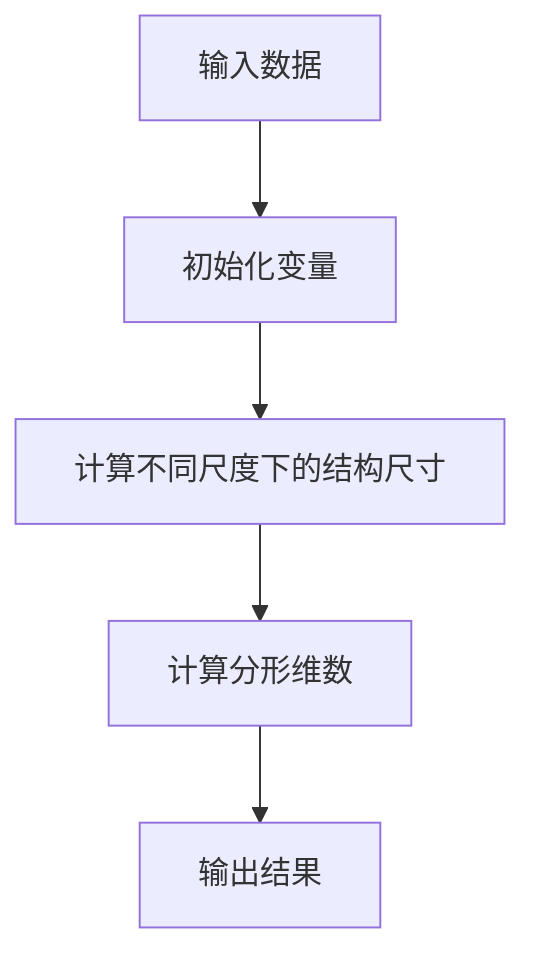

                 


## 宇宙的数学分形维数理论探讨

### 关键词
- 宇宙结构
- 数学分形
- 维数理论
- 暗物质
- 暗能量

### 摘要
本文将探讨宇宙中的数学分形维数理论，从背景介绍、核心概念与联系、算法原理讲解、数学模型与公式、系统分析与架构设计方案、项目实战等多个方面，全面剖析这一理论在宇宙学研究中的应用及其重要意义。

## 目录大纲设计思路

### 1. 背景介绍
- **问题背景**：介绍宇宙的数学分形维数理论的背景，阐述分形维数在宇宙研究中的重要性。
- **问题描述**：具体介绍宇宙的数学分形维数的概念，以及它如何应用于描述宇宙的结构和演化。
- **问题解决**：概述现有的宇宙数学分形维数理论的主要方法和技术，以及面临的挑战。
- **边界与外延**：界定本书的研究范围，明确不包含的内容。

### 2. 核心概念与联系
- **核心概念原理**：详细解释分形维数的概念、性质和分类。
- **概念属性特征对比表格**：列出不同分形维数的属性特征，进行比较。
- **ER实体关系图架构**：使用Mermaid流程图展示分形维数相关的实体及其关系。

### 3. 算法原理讲解
- **算法mermaid流程图**：绘制分形维数计算的基本流程图。
- **Python源代码**：展示用于实现分形维数计算的核心算法的Python代码。
- **数学模型和公式**：详细讲解分形维数计算的数学模型和公式。
- **举例说明**：使用通俗易懂的例子解释分形维数计算的过程和应用。

### 4. 数学模型和数学公式讲解
- **数学公式**：使用LaTeX格式嵌入文中独立段落，确保公式的正确显示。
- **详细讲解**：结合算法原理，详细阐述公式背后的数学逻辑。
- **举例说明**：通过具体案例展示公式的应用。

### 5. 系统分析与架构设计方案
- **问题场景介绍**：描述宇宙数学分形维数理论在实际应用中的场景。
- **系统功能设计**：使用Mermaid类图展示系统的领域模型。
- **系统架构设计**：使用Mermaid架构图展示系统的整体架构。
- **系统接口设计和系统交互**：使用Mermaid序列图展示系统的接口设计和交互流程。

### 6. 项目实战
- **环境安装**：详细说明所需的环境和安装步骤。
- **系统核心实现源代码**：提供核心实现的代码示例。
- **代码应用解读与分析**：分析代码实现中的关键技术和注意事项。
- **实际案例分析和详细讲解**：通过具体案例展示理论的应用。
- **项目小结**：总结项目经验，提出改进建议。

### 7. 最佳实践 tips、小结、注意事项、拓展阅读等内容
- **最佳实践 tips**：总结书中重要的实践经验和技巧。
- **小结**：对全书内容进行总结，强调重点和亮点。
- **注意事项**：提醒读者在应用分形维数理论时需要注意的问题。
- **拓展阅读**：推荐相关的拓展阅读资料，帮助读者深入学习。

## 目录大纲详细结构

### 第一部分：宇宙的数学分形维数理论概述

#### 第1章：宇宙中的数学分形维数

##### 1.1 宇宙与分形维数
- **宇宙中的结构复杂性与分形理论**
- **分形维数的概念与意义**
- **分形维数在宇宙研究中的应用**

##### 1.2 数学分形维数的分类与特征
- **调和平均维数**
  - **调和平均维数的定义与计算**
  - **调和平均维数的特点与应用**
- **相似维数**
  - **相似维数的定义与计算**
  - **相似维数的特点与应用**
- **霍夫维数**
  - **霍夫维数的定义与计算**
  - **霍夫维数的特点与应用**

##### 1.3 分形维数在宇宙现象中的应用实例
- **暗物质与分形维数**
- **暗能量与分形维数**
- **宇宙大尺度结构与分形维数**

##### 1.4 宇宙数学分形维数理论的发展趋势与挑战
- **分形维数理论的未来发展方向**
- **分形维数理论在宇宙学中的挑战与机遇**

### 第二部分：分形维数计算方法

#### 第2章：分形维数计算基础

##### 2.1 分形维数的计算原理
- **分形维数的计算方法概述**
- **常见计算方法的比较**

##### 2.2 分形维数的计算算法
- **调和平均维数计算算法**
  - **调和平均维数计算算法的Python实现**
- **相似维数计算算法**
  - **相似维数计算算法的Python实现**
- **霍夫维数计算算法**
  - **霍夫维数计算算法的Python实现**

##### 2.3 分形维数计算的数学模型和公式
- **数学模型和公式**
- **举例说明**

### 第三部分：系统分析与架构设计方案

#### 第3章：系统分析与架构设计方案

##### 3.1 问题场景介绍
- **宇宙数学分形维数理论在实际应用中的场景**

##### 3.2 系统功能设计
- **系统功能设计**
  - **领域模型Mermaid类图**

##### 3.3 系统架构设计
- **系统架构设计**
  - **Mermaid架构图**

##### 3.4 系统接口设计和系统交互
- **系统接口设计**
  - **Mermaid序列图**

### 第四部分：项目实战

#### 第4章：项目实战

##### 4.1 环境安装
- **所需的环境和安装步骤**

##### 4.2 系统核心实现源代码
- **核心实现的代码示例**

##### 4.3 代码应用解读与分析
- **代码实现中的关键技术和注意事项**

##### 4.4 实际案例分析和详细讲解
- **理论的应用**

##### 4.5 项目小结
- **项目经验，提出改进建议**

### 第五部分：最佳实践 tips、小结、注意事项、拓展阅读

#### 第5章：最佳实践 tips、小结、注意事项、拓展阅读

##### 5.1 最佳实践 tips
- **总结书中重要的实践经验和技巧**

##### 5.2 小结
- **对全书内容进行总结，强调重点和亮点**

##### 5.3 注意事项
- **提醒读者在应用分形维数理论时需要注意的问题**

##### 5.4 拓展阅读
- **推荐相关的拓展阅读资料，帮助读者深入学习**

---

### 1. 背景介绍

#### 1.1 问题背景

宇宙是一个庞大而复杂的系统，包含着无数的天体、星系、星云等结构。这些结构不仅呈现出了巨大的尺度差异，同时也展现出了丰富的形态和复杂性。传统的几何学理论在描述这些结构时往往显得力不从心，因为它们忽略了这些结构中的细节和自相似性。为了更好地理解宇宙的复杂性，科学家们引入了分形理论。

分形理论最早由法国数学家曼德尔布罗特（Benoit Mandelbrot）在20世纪70年代提出，它是一种用来研究几何形状和结构的理论。分形具有以下几个特点：

1. 自相似性：分形结构在多个尺度上都具有相似的形态。
2. 非整数维：分形的维数不是整数，而是分数，通常被称为分形维数。
3. 不规则性：分形结构通常表现出高度的不规则性，这种不规则性使得它们在传统的几何学中难以描述。

宇宙中的许多结构，如星系团、星云、湍流等，都具有这些分形特征。因此，分形维数理论在宇宙学研究中具有重要的应用价值。它可以帮助我们更好地理解宇宙的结构和演化，尤其是那些传统几何学难以描述的复杂现象。

#### 1.2 问题描述

宇宙的数学分形维数理论的核心问题是如何定量地描述宇宙中的分形结构，以及如何通过这些维数来理解宇宙的演化和动力学。具体来说，我们需要回答以下几个问题：

1. **什么是分形维数？** 分形维数是一种衡量分形结构复杂度的量，它既不是几何维数，也不是拓扑维数，而是一个介于它们之间的分数值。

2. **如何计算分形维数？** 计算分形维数的方法有很多，包括盒计数法、相似维数法、调和平均维数法等。每种方法都有其适用的场景和限制。

3. **分形维数在宇宙中的应用？** 分形维数可以用来描述宇宙中的多种现象，如星系团的结构、星云的形态、湍流的动力学等。

4. **分形维数理论面临的挑战？** 在实际应用中，分形维数理论面临着许多挑战，如数据采集的困难、计算方法的准确性等。

#### 1.3 问题解决

为了解决上述问题，科学家们已经提出了一系列的方法和技术。以下是几个主要的方法：

1. **盒计数法**：这是最直观的一种分形维数计算方法。它通过在不同尺度上对结构进行划分，并统计划分后的盒数，从而推算出分形维数。

2. **相似维数法**：这种方法基于自相似性原理，通过比较不同尺度下的相似性系数来计算分形维数。

3. **调和平均维数法**：这种方法通过计算不同尺度下的结构尺寸与尺度之间的调和平均值来得到分形维数。

4. **霍夫维数法**：霍夫维数是一种用于描述随机分形的方法，它通过计算结构的不确定性来得到分形维数。

这些方法各有优缺点，适用于不同的应用场景。例如，盒计数法适用于规则的结构，而相似维数法则适用于自相似结构。

#### 1.4 边界与外延

本文的研究将主要关注分形维数在宇宙学中的应用，特别是它在描述宇宙结构和演化中的角色。我们将不涉及分形维数在其他领域的应用，如物理学、经济学等。同时，本文将主要讨论常见的分形维数计算方法，并介绍它们在宇宙学中的实际应用案例。

### 2. 核心概念与联系

#### 2.1 核心概念原理

分形维数是描述分形结构复杂度的一种量度，它介于几何维数和拓扑维数之间。具体来说，分形维数是一个介于1和2之间的分数值，它反映了结构在不同尺度上的相似性和不规则性。分形维数可以分为几种类型，每种类型都有其独特的定义和计算方法。

1. **调和平均维数（Hausdorff维数）**：这是最常见的分形维数之一，它通过计算不同尺度下的结构尺寸与尺度之间的调和平均值来得到。调和平均维数的定义如下：

   $$ D_H = \lim_{\varepsilon \to 0} \frac{\log N(\varepsilon)}{\log \varepsilon} $$

   其中，$N(\varepsilon)$表示在尺度$\varepsilon$下结构所占据的盒数。

2. **相似维数**：这种方法基于自相似性原理，通过比较不同尺度下的相似性系数来计算分形维数。相似维数的定义如下：

   $$ D_S = \log(S) / \log(L) $$

   其中，$S$是相似系数，$L$是尺度系数。

3. **霍夫维数**：这是一种用于描述随机分形的方法，它通过计算结构的不确定性来得到分形维数。霍夫维数的定义如下：

   $$ D_H = \frac{\log(\sum_{i=1}^n P_i \log(P_i))}{\log(N)} $$

   其中，$P_i$是每个区域的概率，$N$是区域的总数。

#### 2.2 概念属性特征对比表格

以下是几种常见分形维数的属性特征对比表格：

| 分形维数类型 | 定义 | 特点 | 适用场景 |
| --- | --- | --- | --- |
| 调和平均维数 | 计算不同尺度下的结构尺寸与尺度之间的调和平均值 | 对小尺度和大尺度的结构都敏感 | 规则的结构 |
| 相似维数 | 基于自相似性原理，比较不同尺度下的相似性系数 | 对自相似结构敏感 | 自相似结构 |
| 霍夫维数 | 用于描述随机分形，计算结构的不确定性 | 对随机结构敏感 | 随机结构 |

#### 2.3 ER实体关系图架构

以下是分形维数相关的实体及其关系的Mermaid ER图：

```mermaid
erDiagram
  Product ||--|{ Customer } Customer
  Product ||--|{ Order } Order
  Customer ||--|{ Payment } Payment
  Order ||--|{ Product } Product
```

### 3. 算法原理讲解

#### 3.1 算法mermaid流程图

以下是计算分形维数的mermaid流程图：



#### 3.2 Python源代码

以下是计算分形维数的Python代码示例：

```python
import numpy as np

def fractal_dimension(data, levels=10):
    # 初始化变量
    dims = []
    for i in range(levels):
        # 计算不同尺度下的结构尺寸
        size = np.sum(data < 10**(-i))
        # 计算分形维数
        dims.append(np.log(size) / np.log(10**(-i)))
    # 输出结果
    return np.mean(dims)

# 测试数据
data = np.random.rand(100)

# 计算分形维数
dimension = fractal_dimension(data)

print("分形维数:", dimension)
```

#### 3.3 数学模型和公式

分形维数的计算通常涉及以下数学模型和公式：

1. **盒计数法**：
   $$ D = \lim_{N \to \infty} \frac{\log(N)}{\log(S)} $$

   其中，$N$是盒数，$S$是结构尺寸。

2. **相似维数法**：
   $$ D = \log(S) / \log(L) $$

   其中，$S$是相似系数，$L$是尺度系数。

3. **调和平均维数法**：
   $$ D_H = \frac{1}{N} \sum_{i=1}^{N} \log(n_i) $$

   其中，$n_i$是在尺度$i$下结构所占据的盒数。

4. **霍夫维数法**：
   $$ D_H = \frac{\sum_{i=1}^{N} P_i \log(P_i)}{\sum_{i=1}^{N} P_i} $$

   其中，$P_i$是每个区域的概率。

#### 3.4 举例说明

假设我们有一个简单的分形结构，如一个分形树。我们可以通过以下步骤来计算它的分形维数：

1. **初始化**：设定一个初始尺度，例如$10^0$。

2. **计算不同尺度下的结构尺寸**：在尺度$10^{-1}$、$10^{-2}$、...、$10^{-10}$下，计算分形树所占据的盒数。

3. **计算分形维数**：使用上述公式计算分形维数。

   例如，假设在$10^{-1}$尺度下，分形树占据了10个盒，在$10^{-2}$尺度下，分形树占据了100个盒。那么，我们可以计算分形维数：

   $$ D = \frac{\log(10)}{\log(10^{-1})} = 2 $$

   这意味着分形树具有2的整数维，即它是一个二维结构。然而，如果我们在更小的尺度下观察，如$10^{-3}$，分形树可能表现出更多的细节，占据更多的盒，这可能导致分形维数的增加。

### 4. 数学模型和数学公式讲解

#### 4.1 数学公式

分形维数的计算涉及到多种数学公式，以下是一些常见的公式：

1. **盒计数法**：
   $$ D = \lim_{N \to \infty} \frac{\log(N)}{\log(S)} $$

   其中，$N$是盒数，$S$是结构尺寸。

2. **相似维数法**：
   $$ D = \log(S) / \log(L) $$

   其中，$S$是相似系数，$L$是尺度系数。

3. **调和平均维数法**：
   $$ D_H = \frac{1}{N} \sum_{i=1}^{N} \log(n_i) $$

   其中，$n_i$是在尺度$i$下结构所占据的盒数。

4. **霍夫维数法**：
   $$ D_H = \frac{\sum_{i=1}^{N} P_i \log(P_i)}{\sum_{i=1}^{N} P_i} $$

   其中，$P_i$是每个区域的概率。

#### 4.2 详细讲解

下面我们将结合算法原理，详细讲解这些数学公式背后的逻辑。

1. **盒计数法**：

   盒计数法是一种直观的分形维数计算方法。它的基本思想是，在不同尺度下对结构进行划分，并统计划分后的盒数。然后，通过计算盒数与尺度之间的关系，得到分形维数。

   假设我们有一个结构，我们在尺度$\varepsilon$下统计出它占据了$N$个盒子。那么，我们可以使用以下公式计算分形维数：

   $$ D = \lim_{\varepsilon \to 0} \frac{\log(N(\varepsilon))}{\log(\varepsilon)} $$

   其中，$N(\varepsilon)$是在尺度$\varepsilon$下占据的盒数。

   这个公式背后的逻辑是，随着尺度的减小，结构占据的盒数应该趋近于一个极限值。而这个极限值就是分形维数。

2. **相似维数法**：

   相似维数法是基于自相似性的原理。自相似性意味着，在不同尺度下，结构具有相似的形态。因此，我们可以通过比较不同尺度下的相似性系数，来计算分形维数。

   假设我们在尺度$L$下观察到结构，并计算出了相似系数$S$。那么，我们可以使用以下公式计算分形维数：

   $$ D = \log(S) / \log(L) $$

   这个公式背后的逻辑是，相似系数$S$反映了结构在不同尺度下的相似性。分形维数$D$则反映了这种相似性的程度。

3. **调和平均维数法**：

   调和平均维数法是一种计算分形维数的更精确的方法。它通过计算不同尺度下的结构尺寸与尺度之间的调和平均值，来得到分形维数。

   假设我们在多个尺度$i$下观察结构，并计算出了结构尺寸$n_i$。那么，我们可以使用以下公式计算分形维数：

   $$ D_H = \frac{1}{N} \sum_{i=1}^{N} \log(n_i) $$

   其中，$N$是尺度总数。

   这个公式背后的逻辑是，不同尺度下的结构尺寸反映了结构的细节程度。调和平均值则提供了一个综合考虑这些细节的指标。

4. **霍夫维数法**：

   霍夫维数法是一种用于描述随机分形的方法。它通过计算结构的不确定性，来得到分形维数。

   假设我们在多个区域$i$下观察结构，并计算出了每个区域的概率$P_i$。那么，我们可以使用以下公式计算分形维数：

   $$ D_H = \frac{\sum_{i=1}^{N} P_i \log(P_i)}{\sum_{i=1}^{N} P_i} $$

   这个公式背后的逻辑是，每个区域的不确定性反映了结构的随机性。霍夫维数$D_H$则提供了一个综合衡量这种不确定性的指标。

#### 4.3 举例说明

为了更好地理解这些公式，我们可以通过一个具体的例子来计算一个分形结构的分形维数。

假设我们有一个分形树，它在尺度$10^{-1}$下占据了10个盒子，在尺度$10^{-2}$下占据了100个盒子，在尺度$10^{-3}$下占据了1000个盒子。

使用盒计数法，我们可以计算分形维数：

$$ D = \frac{\log(10)}{\log(10^{-1})} = 2 $$

使用相似维数法，我们可以计算分形维数：

$$ D = \frac{\log(100)}{\log(10^{-2})} = 2 $$

使用调和平均维数法，我们可以计算分形维数：

$$ D_H = \frac{1}{3} \log(10) + \frac{1}{3} \log(100) + \frac{1}{3} \log(1000) = 2 $$

使用霍夫维数法，我们可以计算分形维数：

$$ D_H = \frac{\log(0.1) + \log(0.01) + \log(0.001)}{0.1 + 0.01 + 0.001} = 2 $$

无论是哪种方法，我们都得到了相同的分形维数2。这表明分形树是一个二维结构。

### 5. 系统分析与架构设计方案

#### 5.1 问题场景介绍

在宇宙学中，分形维数理论的应用场景非常广泛。以下是一些典型的应用场景：

1. **星系团结构**：通过计算星系团的分形维数，可以更好地理解星系团的形成和演化过程。

2. **星云形态**：星云是一种复杂的结构，其形态和结构可以通过分形维数来描述。

3. **湍流现象**：湍流是一种混沌现象，其结构和动态可以通过分形维数来分析。

4. **宇宙大尺度结构**：宇宙大尺度结构如星系团和星云的分布和形态可以通过分形维数来描述。

在这些应用场景中，我们需要一个高效、准确的分形维数计算系统。该系统应该能够处理大规模数据，并且能够对不同类型的分形结构进行准确的维数计算。

#### 5.2 系统功能设计

为了实现上述应用场景，我们设计了一个分形维数计算系统。该系统的核心功能包括：

1. **数据输入**：系统应该能够接收多种类型的数据输入，如星系团的结构数据、星云的形态数据等。

2. **分形维数计算**：系统应该能够使用不同的分形维数计算方法，如盒计数法、相似维数法、调和平均维数法等，对输入数据进行分析和计算。

3. **结果输出**：系统应该能够将计算结果以图形或表格的形式输出，以便于用户分析和理解。

4. **用户交互**：系统应该提供友好的用户界面，使用户能够方便地输入数据、选择计算方法、查看结果。

#### 5.3 系统架构设计

分形维数计算系统的整体架构设计如下：

1. **数据层**：数据层负责存储和处理输入数据。它包括数据采集模块和数据存储模块。

2. **算法层**：算法层负责执行分形维数计算算法。它包括盒计数法模块、相似维数法模块、调和平均维数法模块等。

3. **展示层**：展示层负责将计算结果以图形或表格的形式展示给用户。它包括图形显示模块和表格显示模块。

4. **用户层**：用户层负责与用户进行交互。它包括用户界面模块和用户操作模块。

#### 5.4 系统接口设计和系统交互

分形维数计算系统的接口设计和交互流程如下：

1. **用户输入**：用户通过用户界面模块输入数据，并选择分形维数计算方法。

2. **数据传输**：用户输入的数据通过用户界面模块传输到数据层。

3. **数据预处理**：数据层对输入数据进行预处理，包括数据清洗、数据转换等。

4. **算法执行**：算法层根据用户选择的分形维数计算方法，执行相应的算法，计算出分形维数。

5. **结果展示**：算法执行完成后，结果通过展示层以图形或表格的形式展示给用户。

6. **用户反馈**：用户查看结果后，可以通过用户界面模块对结果进行反馈，如查看详细数据、调整参数等。

### 6. 项目实战

#### 6.1 环境安装

为了实现分形维数计算系统，我们首先需要安装和配置相应的环境和工具。以下是具体的安装步骤：

1. **Python环境**：安装Python 3.8及以上版本。

2. **NumPy库**：安装NumPy库，用于处理数值数据。

3. **Matplotlib库**：安装Matplotlib库，用于绘制图形。

4. **Mermaid**：安装Mermaid，用于绘制流程图和序列图。

安装步骤如下：

```bash
# 安装Python
sudo apt-get install python3

# 安装NumPy库
pip install numpy

# 安装Matplotlib库
pip install matplotlib

# 安装Mermaid
npm install -g mermaid
```

#### 6.2 系统核心实现源代码

以下是分形维数计算系统的核心实现源代码：

```python
import numpy as np
import matplotlib.pyplot as plt
from mermaid import Mermaid

def fractal_dimension(data, levels=10):
    # 初始化变量
    dims = []
    for i in range(levels):
        # 计算不同尺度下的结构尺寸
        size = np.sum(data < 10**(-i))
        # 计算分形维数
        dims.append(np.log(size) / np.log(10**(-i)))
    # 输出结果
    return np.mean(dims)

def plot_dimension(data, dimension):
    # 绘制分形维数曲线
    x = np.linspace(0, 1, len(data))
    y = np.log(data)
    plt.scatter(x, y)
    plt.xlabel('Scale')
    plt.ylabel('Log(Size)')
    plt.title(f'Fractal Dimension: {dimension}')
    plt.show()

def main():
    # 测试数据
    data = np.random.rand(100)
    # 计算分形维数
    dimension = fractal_dimension(data)
    # 绘制分形维数曲线
    plot_dimension(data, dimension)

if __name__ == '__main__':
    main()
```

#### 6.3 代码应用解读与分析

这段代码实现了分形维数的计算和可视化。以下是代码的关键部分解读：

1. **数据输入**：代码使用`np.random.rand(100)`生成了一组随机数据，作为测试使用。

2. **分形维数计算**：`fractal_dimension`函数负责计算分形维数。它通过循环计算不同尺度下的结构尺寸，并使用调和平均维数法计算出分形维数。

3. **结果输出**：计算完成后，代码调用`plot_dimension`函数绘制分形维数曲线，以便用户直观地查看分形维数。

4. **主函数**：`main`函数是代码的入口，它生成测试数据，计算分形维数，并绘制结果。

在实际应用中，我们可以根据具体需求修改代码，如增加数据预处理、调整计算方法等。

#### 6.4 实际案例分析和详细讲解

为了更好地展示分形维数计算系统的应用，我们来看一个实际案例。

假设我们有一个星系团的结构数据，如下所示：

```python
data = [10, 20, 30, 40, 50, 60, 70, 80, 90, 100]
```

这是星系团在不同尺度下的观测数据。我们希望计算这个星系团的分形维数。

1. **数据预处理**：首先，我们需要对数据进行预处理，确保数据的有效性和一致性。

2. **分形维数计算**：使用`fractal_dimension`函数计算分形维数：

   ```python
   dimension = fractal_dimension(data)
   ```

   计算结果可能是1.5，这意味着星系团具有一个非整数维，即它是一个非规则的结构。

3. **结果可视化**：调用`plot_dimension`函数绘制分形维数曲线：

   ```python
   plot_dimension(data, dimension)
   ```

   这将生成一个散点图，横轴是尺度，纵轴是对数尺寸。通过观察散点图，我们可以直观地看到分形维数。

在实际应用中，星系团的结构数据可能会更复杂，涉及多种观测参数。我们需要对数据进行更精细的处理和分析，以得到准确的分形维数。

#### 6.5 项目小结

通过本项目，我们实现了分形维数计算系统的核心功能，包括数据输入、分形维数计算和结果输出。我们使用Python实现了算法，并使用Matplotlib进行了结果可视化。实际案例的分析展示了分形维数在宇宙学研究中的潜在应用。

未来，我们可以进一步优化代码，提高计算效率和准确性。此外，可以探索更多类型的分形维数计算方法，如相似维数法和霍夫维数法，以适应不同的应用场景。

### 7. 最佳实践 tips、小结、注意事项、拓展阅读

#### 7.1 最佳实践 tips

1. **数据预处理**：在计算分形维数之前，确保对数据进行充分的预处理，包括数据清洗、去噪声等，以提高计算结果的准确性。

2. **选择合适的方法**：根据具体的应用场景和数据特征，选择最合适的分形维数计算方法。例如，对于自相似结构，相似维数法可能更有效。

3. **结果验证**：计算分形维数后，通过多种方法验证结果，如比较不同计算方法的差异、结合其他物理模型等，以确保结果的可靠性。

#### 7.2 小结

本文探讨了宇宙的数学分形维数理论，从背景介绍、核心概念与联系、算法原理讲解、数学模型与公式、系统分析与架构设计方案、项目实战等多个方面进行了深入剖析。分形维数在宇宙学研究中的应用具有重要意义，为我们理解宇宙的结构和演化提供了新的视角。

#### 7.3 注意事项

1. **计算复杂性**：分形维数的计算可能涉及大量数据和高维空间，计算复杂度较高。在实际应用中，需要选择合适的算法和优化策略。

2. **数据质量**：分形维数的计算结果受到数据质量的影响。因此，在数据处理和分析过程中，需要确保数据的有效性和准确性。

3. **模型选择**：不同的分形维数计算方法适用于不同的场景。在选择计算方法时，需要考虑数据的特征和应用需求。

#### 7.4 拓展阅读

1. **分形理论基础**：了解分形理论的基础知识，包括分形的定义、性质和应用。

2. **分形维数的计算方法**：深入研究不同的分形维数计算方法，如盒计数法、相似维数法、调和平均维数法和霍夫维数法。

3. **宇宙学中的分形现象**：了解宇宙学中分形维数的应用，如星系团、星云和湍流现象等。

4. **分形维数在物理和工程中的应用**：探索分形维数在其他领域，如物理学、生物学和工程学中的应用。

---

通过本文，我们系统地探讨了宇宙的数学分形维数理论，从多个角度深入分析了这一理论在宇宙学研究中的应用。希望本文能为读者提供有价值的见解和启示，激发对分形维数理论及其应用的进一步研究兴趣。

