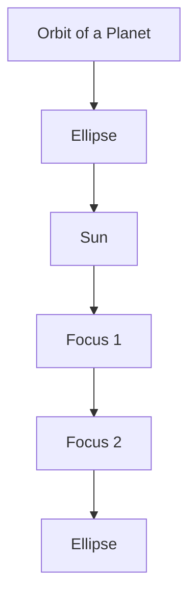
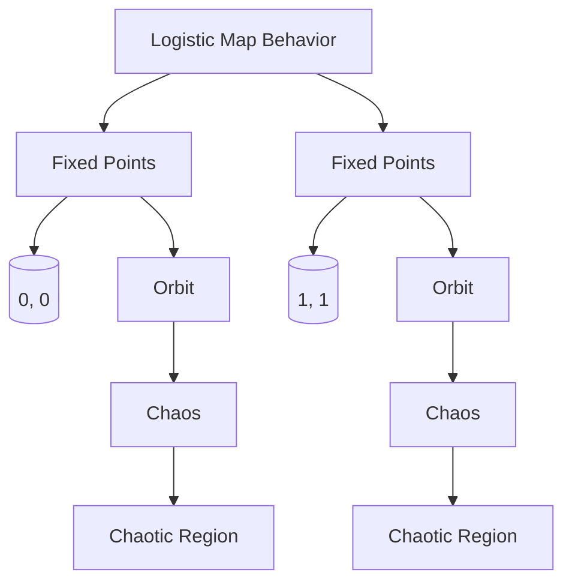
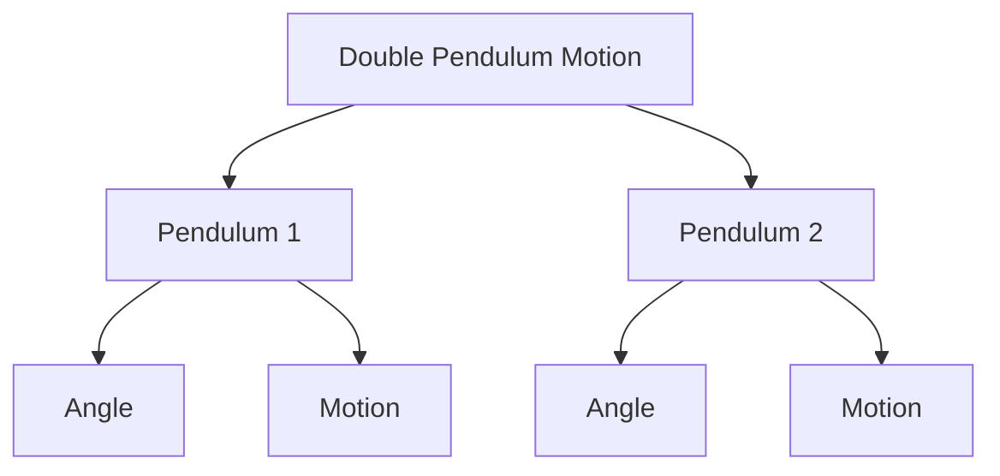
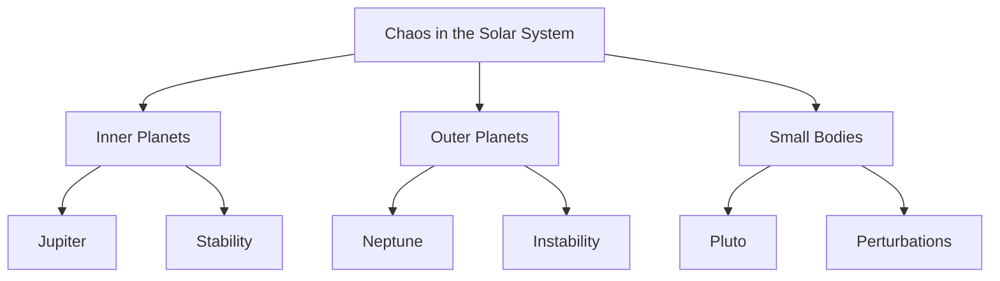
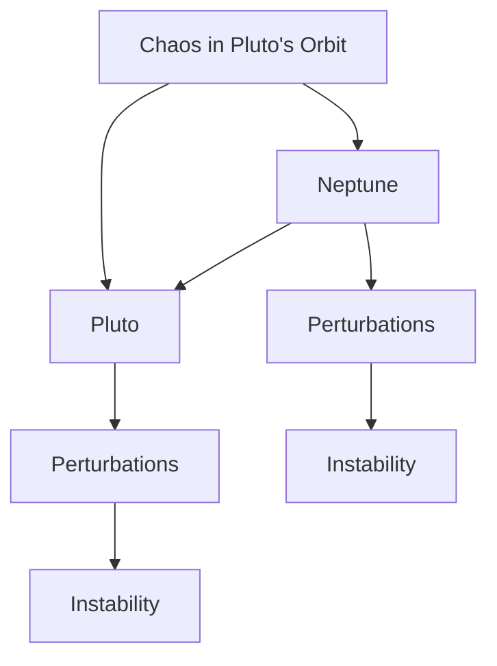
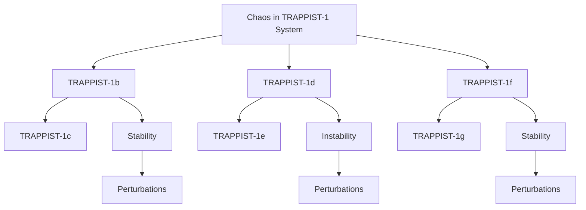
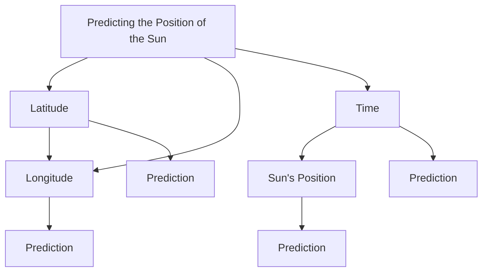
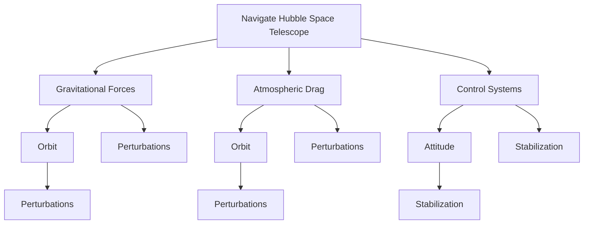
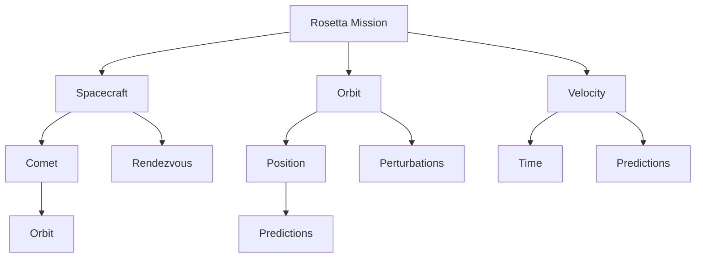

                 

## Introduction to the Mathematical Dynamics of Chaotic Systems in Celestial Mechanics

### The Background of Chaos in Celestial Mechanics

Chaos, a term derived from the Greek word “χάος” meaning “empty void,” has evolved over centuries from a concept denoting disorder to a mathematical and physical theory describing the behavior of complex systems. In the context of celestial mechanics, chaos refers to the unpredictable and sensitive dependence on initial conditions observed in the motion of celestial bodies.

**1.1 The Origin of Chaos in Celestial Mechanics**

The origins of chaos in celestial mechanics can be traced back to the late 19th century when mathematicians such as Henri Poincaré and Lord Kelvin began exploring the stability of planetary orbits. Poincaré's work on the three-body problem, which involves the gravitational interactions between three celestial bodies, highlighted the potential for chaotic behavior.

**1.2 Basic Concepts of Chaotic Dynamics**

Chaotic systems exhibit several key characteristics:

- **Sensitive Dependence on Initial Conditions:** Small differences in initial conditions can lead to vastly different outcomes over time, making long-term prediction impossible.
  
- **Sensitive Dependence on Initial Conditions:** Small differences in initial conditions can lead to vastly different outcomes over time, making long-term prediction impossible.

- **Irregular and Uncorrelated Motion:** Chaotic systems display irregular, unpredictable motion that is not correlated with any underlying periodic patterns.

- **Strange Attractors:** Chaotic systems often converge to a complex, geometric structure called a strange attractor, which characterizes their long-term behavior.

**1.3 Importance and Applications in Celestial Mechanics**

The study of chaotic systems in celestial mechanics has significant implications for various fields:

- **Orbit Prediction and Spacecraft Navigation:** Understanding chaos helps in predicting the long-term behavior of celestial bodies, crucial for space missions and satellite navigation.

- **Astrophysics and Cosmology:** Chaotic behavior in celestial mechanics provides insights into the dynamics of star systems and the evolution of the universe.

- **Biology and Ecology:** Chaos theory has applications in understanding the dynamics of biological systems, such as the spread of diseases and ecological systems.

### The Chaotic Motion of Celestial Bodies

**Example 1: The Motion of Double Stars**

Consider a system of two stars orbiting around their common center of mass. This is known as the two-body problem. Introduce a third star, and the system becomes a three-body problem. The gravitational interactions among these stars can lead to chaotic motion, making long-term predictions extremely challenging.

**Example 2: The Motion of Satellites**

Orbits of satellites around planets are another example of chaotic systems. Small perturbations, such as gravitational forces from other celestial bodies or atmospheric drag, can cause significant deviations in satellite orbits over time. Understanding and predicting these deviations is crucial for maintaining the stability of satellite communications and navigation systems.

### Conclusion

The mathematical dynamics of chaotic systems in celestial mechanics present a fascinating area of study that bridges mathematics, physics, and engineering. By exploring the concepts and applications of chaos theory, we gain valuable insights into the complex and often unpredictable behavior of celestial bodies, with implications for both scientific research and practical applications.

## Core Concepts of Celestial Mechanics and Mathematical Dynamics

### Newton's Law of Universal Gravitation

Newton's law of universal gravitation is the cornerstone of celestial mechanics. It states that any two objects in the universe attract each other with a force that is directly proportional to the product of their masses and inversely proportional to the square of the distance between them. Mathematically, this can be expressed as:

$$ F = G \frac{{m_1 m_2}}{{r^2}} $$

where \( F \) is the gravitational force, \( G \) is the gravitational constant (\(6.674 \times 10^{-11} \text{Nm}^2/\text{kg}^2\)), \( m_1 \) and \( m_2 \) are the masses of the two objects, and \( r \) is the distance between them.

**Table 1: Comparison of Gravitational Forces**

| Object 1 | Object 2 | Gravitational Force (N) |
|----------|----------|--------------------------|
| Earth    | Moon     | \(3.68 \times 10^{20}\)   |
| Sun      | Earth    | \(3.52 \times 10^{22}\)   |
| Jupiter  | Earth    | \(4.89 \times 10^{20}\)   |

### Kepler's Laws of Planetary Motion

Johannes Kepler formulated three laws of planetary motion, which describe the orbits of planets around the sun:

1. **Kepler's First Law (Law of Ellipses):** The orbit of a planet is an ellipse with the sun at one of the two foci.

   $$ \frac{{r_1^2}}{{a^2}} = \frac{{r_2^2}}{{a^2}} = \frac{{1}}{{1 - e^2}} $$

   where \( r_1 \) and \( r_2 \) are the distances from the planet to the sun at different points in its orbit, \( a \) is the semi-major axis of the orbit, and \( e \) is the eccentricity of the orbit.

2. **Kepler's Second Law (Law of Equal Areas):** A line joining a planet and the sun sweeps out equal areas during equal intervals of time.

   $$ \frac{{dA}}{{dt}} = \text{constant} $$

3. **Kepler's Third Law (Harmonic Law):** The square of the orbital period of a planet is directly proportional to the cube of the semi-major axis of its orbit.

   $$ T^2 \propto a^3 $$

### Introduction to Differential Equations in Celestial Mechanics

Differential equations are essential for describing the motion of celestial bodies. The two-body problem can be solved using Newton's law of universal gravitation and Kepler's laws, resulting in a second-order differential equation for the position of a planet:

$$ m \ddot{r} = -G \frac{{m M}}{{r^2}} $$

where \( m \) is the mass of the planet, \( M \) is the mass of the sun, and \( r \) is the distance between the planet and the sun. This equation can be solved to obtain the elliptical orbit described by Kepler's laws.

**Figure 1: Orbit of a Planet**

In summary, the core concepts of celestial mechanics and mathematical dynamics include Newton's law of universal gravitation, Kepler's laws of planetary motion, and the use of differential equations to describe the motion of celestial bodies. These concepts form the foundation for understanding the chaotic behavior observed in celestial mechanics and provide the tools necessary for analyzing and predicting the motion of celestial systems.

### Mathematical Models of Chaotic Systems

#### The Logistic Map

The logistic map is one of the simplest mathematical models that exhibit chaotic behavior. It is defined by the following iterative equation:

$$ x_{n+1} = r x_n (1 - x_n) $$

where \( x_n \) is the proportion of a population at time \( n \) and \( r \) is a parameter that controls the behavior of the system. The logistic map is chaotic for a range of \( r \) values, typically between 3.57 and 4.

**Figure 2: Logistic Map Behavior**

The logistic map exhibits a period-doubling route to chaos, where the number of fixed points doubles as \( r \) increases. This behavior is well-described by the concept of bifurcations, which are qualitative changes in the system's dynamics.

#### The Double Pendulum

The double pendulum is a classic example of a dynamical system that exhibits chaotic behavior. It consists of two pendulums connected end to end, with each pendulum having its own mass and length. The motion of the double pendulum is governed by the following second-order differential equations:

$$ \begin{align*}
\ddot{\theta_1} &= -\frac{g}{l_1} \sin{\theta_1} - \frac{1}{m_1 l_1} (\sin{\theta_2 - \theta_1} + 2 \cos{\theta_1} \cos{\theta_2} \dot{\theta_2}) \\
\ddot{\theta_2} &= -\frac{g}{l_2} \sin{\theta_2} - \frac{1}{m_2 l_2} \sin{\theta_2 - \theta_1}
\end{align*} $$

where \( \theta_1 \) and \( \theta_2 \) are the angles of the two pendulums, \( g \) is the acceleration due to gravity, \( l_1 \) and \( l_2 \) are the lengths of the two pendulums, and \( m_1 \) and \( m_2 \) are the masses of the two pendulums.

**Figure 3: Double Pendulum Motion**

The double pendulum exhibits chaotic behavior for a wide range of initial conditions, making long-term prediction extremely difficult.

#### Complex Systems and Chaos in Celestial Bodies

Chaos is not limited to simple mathematical models like the logistic map and the double pendulum. In celestial mechanics, complex systems such as planetary systems and exoplanetary systems can also exhibit chaotic behavior. The gravitational interactions between multiple celestial bodies can lead to unpredictable and sensitive dependence on initial conditions.

**Example: The Solar System**

The Solar System is a complex system consisting of the sun, eight planets, and numerous other celestial bodies. The gravitational interactions between these bodies can lead to chaotic behavior, particularly in the outer planets such as Neptune and Pluto. The orbits of these planets are sensitive to small perturbations, making long-term predictions challenging.

**Figure 4: Chaos in the Solar System**

In conclusion, the mathematical models of chaotic systems, including the logistic map, the double pendulum, and complex systems like celestial bodies, provide valuable insights into the unpredictable and sensitive behavior observed in nature. These models help us understand the fundamental principles of chaos and its implications in various fields, including celestial mechanics.

### Analytical Methods in Celestial Mechanics

Analytical methods play a crucial role in understanding the dynamics of celestial systems, particularly when dealing with the complex interactions between celestial bodies. Two prominent analytical methods used in celestial mechanics are perturbation methods and numerical integration of orbits. These methods help astronomers and physicists predict and analyze the long-term behavior of celestial bodies with varying degrees of accuracy.

#### Perturbation Methods

Perturbation methods are used to solve problems where the behavior of a system can be approximated by considering small perturbations from a known, simpler system. In celestial mechanics, perturbation methods are particularly useful for analyzing the motion of celestial bodies in the presence of external forces or non-spherical gravitational fields.

**1.1.1.1 Hill's Equation**

One of the most commonly used perturbation methods is Hill's equation, which is used to analyze the motion of a satellite around a planet under the influence of a third body. Hill's equation is derived by expanding the gravitational potential in a series and retaining only the first-order terms. The equation is given by:

$$ \ddot{r} + \frac{2}{r} \dot{r} - \frac{1}{r^2} \frac{d^2}{d\theta^2} \left( r^2 \frac{dV}{d\theta} \right) = 0 $$

where \( r \) is the distance between the satellite and the planet, \( \theta \) is the longitude of the pericenter, and \( V \) is the gravitational potential. The solution to Hill's equation provides valuable insights into the stability and motion of the satellite's orbit.

**1.1.1.2. Hamiltonian Perturbation Theory**

Another powerful perturbation method is Hamiltonian perturbation theory, which is based on the Hamiltonian formalism of classical mechanics. This method involves expanding the Hamiltonian of the system in powers of a small parameter, typically representing the strength of the perturbation. The first-order terms in the expansion yield equations of motion that can be solved to provide approximate solutions for the system's behavior. For example, in the case of a planetary system, the Hamiltonian perturbation theory can be used to study the resonances and secular trends in the orbits of the planets.

#### Numerical Integration of Orbits

While analytical methods provide valuable insights, they often fall short when dealing with complex systems that exhibit chaotic behavior. In such cases, numerical integration of orbits becomes essential. Numerical integration methods are used to approximate the solutions to the equations of motion for celestial bodies over long periods of time.

**1.1.2.1. Euler's Method**

One of the simplest numerical integration methods is Euler's method, which uses a finite difference approach to approximate the solution of a system of differential equations. The method involves updating the position and velocity of a celestial body at each time step using the following formulas:

$$ \begin{align*}
x_{n+1} &= x_n + h v_n \\
y_{n+1} &= y_n + h v_n
\end{align*} $$

where \( x_n \) and \( y_n \) are the position coordinates, \( v_n \) is the velocity, and \( h \) is the time step. While Euler's method is simple to implement, it can become inaccurate for large time steps, leading to significant errors in the long-term behavior of the system.

**1.1.2.2. Runge-Kutta Methods**

To overcome the limitations of Euler's method, more sophisticated numerical integration methods such as the Runge-Kutta methods are often used. The most commonly used version is the fourth-order Runge-Kutta method, which provides a more accurate approximation of the solution by using a weighted average of the slopes at several points within each time step. The method involves updating the position and velocity using the following formulas:

$$ \begin{align*}
k_1 &= f(x_n, y_n, t_n) \\
k_2 &= f\left(x_n + \frac{h}{2} k_1, y_n + \frac{h}{2} k_1, t_n + \frac{h}{2}\right) \\
k_3 &= f\left(x_n + \frac{h}{2} k_2, y_n + \frac{h}{2} k_2, t_n + \frac{h}{2}\right) \\
k_4 &= f\left(x_n + h k_2, y_n + h k_2, t_n + h\right) \\
x_{n+1} &= x_n + \frac{1}{6} (k_1 + 2k_2 + 2k_3 + k_4) \\
y_{n+1} &= y_n + \frac{1}{6} (k_1 + 2k_2 + 2k_3 + k_4)
\end{align*} $$

where \( f(x, y, t) \) represents the right-hand side of the differential equation. The fourth-order Runge-Kutta method provides a more accurate solution at the cost of increased computational complexity.

#### Chaos Control in Celestial Systems

Chaos control is an emerging field that aims to exploit the properties of chaotic systems to stabilize and manipulate their behavior. In celestial mechanics, chaos control can be used to stabilize the orbits of satellites or spacecraft in the presence of small perturbations caused by external forces or non-linearities.

**1.1.3.1. OGY Method**

One of the most widely used chaos control techniques is the OGY (Ott-Grebogi-Yorke) method, which involves feedback linearization and adaptive control. The method involves monitoring the system's state variables and applying a control force that counteracts the chaotic dynamics. The control force is calculated based on the following equation:

$$ u(t) = - \sum_{i=1}^{n} \lambda_i \dot{x}_i $$

where \( u(t) \) is the control force, \( \lambda_i \) are the feedback gains, and \( \dot{x}_i \) are the time derivatives of the state variables. The OGY method has been successfully applied to stabilize the orbits of artificial satellites and spacecraft in various environments.

In conclusion, analytical methods such as perturbation methods and numerical integration of orbits play a crucial role in understanding the dynamics of celestial systems. These methods, along with chaos control techniques, provide valuable tools for predicting and manipulating the behavior of celestial bodies, with important applications in space exploration and satellite navigation.

### Celestial Mechanics and Chaos: Interdisciplinary Connections

The study of chaos in celestial mechanics has wide-ranging implications across various scientific disciplines. By examining the interconnections between chaos theory and other fields, we can gain a deeper understanding of the complex systems that govern the universe.

#### Chaos in Solar Systems

Solar systems, including our own, are complex gravitational systems where the interactions between celestial bodies can lead to chaotic behavior. The Solar System, for instance, exhibits chaotic dynamics in the outer planets, particularly those beyond Neptune. The orbits of these planets, such as Pluto and Neptune, are highly sensitive to small perturbations, leading to unpredictable long-term behavior.

**Example: Chaos in the Outer Solar System**

Consider the case of Pluto's orbit. Pluto's orbit is chaotic due to its proximity to Neptune and the complex gravitational interactions between these two bodies. Over long periods, Pluto's orbit exhibits significant variations, making it challenging to predict its exact position beyond a few tens of millions of years.

**Figure 5: Chaos in Pluto's Orbit**

#### Chaos in Exoplanetary Systems

Exoplanetary systems, which are systems of planets orbiting stars outside our Solar System, also exhibit chaotic behavior. The gravitational interactions among exoplanets can lead to complex dynamics, making long-term predictions challenging.

**Example: Chaos in TRAPPIST-1 System**

The TRAPPIST-1 system, located approximately 40 light-years from Earth, consists of seven Earth-sized planets orbiting a red dwarf star. The gravitational interactions between these planets have been shown to exhibit chaotic behavior. For instance, the orbits of planets TRAPPIST-1d and TRAPPIST-1e are highly sensitive to initial conditions, leading to significant variations in their orbital periods.

**Figure 6: Chaos in TRAPPIST-1 System**

#### The Role of Chaos in Celestial Dynamics

Chaos plays a crucial role in celestial dynamics by affecting the stability and evolution of celestial systems. The unpredictable nature of chaotic systems means that even slight changes in initial conditions can lead to drastically different outcomes over time. This sensitivity to initial conditions is known as the butterfly effect, and it has profound implications for understanding the long-term behavior of celestial systems.

**Example: The Butterfly Effect in the Solar System**

In the Solar System, small perturbations, such as gravitational forces from passing stars or interstellar dust, can cause significant changes in the orbits of celestial bodies over millions or billions of years. This phenomenon is known as the secular variation, and it can lead to the migration of planets or even the disruption of planetary systems.

**Figure 7: The Butterfly Effect in the Solar System**

```mermaid
graph TD
    A[The Butterfly Effect in the Solar System]
    B[Perturbations] --> C[Orbits]
    A --> B
    A --> C
    B --> D[Migration]
    C --> E[Migration]
```

In conclusion, chaos in celestial mechanics has significant interdisciplinary connections with fields such as astrophysics and cosmology. By studying the chaotic behavior of celestial systems, we can gain valuable insights into the stability and evolution of the universe, and better understand the complex dynamics that govern the cosmos.

### Practical Applications of Chaos Theory in Celestial Mechanics

Chaos theory has found practical applications in various aspects of celestial mechanics, providing valuable tools for predicting the behavior of celestial bodies and optimizing space missions. Two prominent areas where chaos theory is applied are celestial navigation and spacecraft navigation and control.

#### Celestial Navigation

Celestial navigation is the oldest form of navigation, where ships and spacecraft use celestial bodies, such as the sun, moon, and stars, to determine their position and direction. Chaos theory helps in understanding the unpredictable nature of celestial bodies' motion, making it easier to predict their positions accurately.

**Example: Predicting the Position of the Sun**

The position of the sun changes over time due to the Earth's rotation and revolution around the sun. Chaos theory can be used to model these changes and predict the position of the sun at any given time with high accuracy. This information is crucial for navigation, especially in remote areas where terrestrial references are not available.

**Figure 8: Predicting the Position of the Sun**

#### Spacecraft Navigation and Control

Spacecraft navigation and control involve determining the position, velocity, and attitude of a spacecraft and ensuring that it follows the desired trajectory. Chaos theory helps in predicting the spacecraft's behavior in the presence of external perturbations, such as gravitational forces from other celestial bodies or atmospheric drag.

**Example: Navigation of the Hubble Space Telescope**

The Hubble Space Telescope (HST) orbits the Earth at an altitude of approximately 547 kilometers. Its orbit is subject to various perturbations, including gravitational forces from the Earth, Moon, and Sun, as well as atmospheric drag. Chaos theory is used to model these perturbations and predict the HST's orbit over long periods, ensuring that it remains within the desired orbit and capturing valuable scientific data.

**Figure 9: Navigation of the Hubble Space Telescope**

#### Applications in Space Exploration

Chaos theory also plays a crucial role in space exploration missions, where accurate predictions of celestial body behavior are essential for mission success. For example, the Rosetta mission, which involved sending a spacecraft to land on a comet, relied on chaos theory to predict the comet's trajectory and ensure a successful landing.

**Example: Rosetta Mission**

The Rosetta mission involved sending a spacecraft to rendezvous with the comet 67P/Churyumov-Gerasimenko. The spacecraft's trajectory had to account for the complex gravitational interactions with the comet and other celestial bodies. Chaos theory was used to model these interactions and predict the spacecraft's position and velocity at critical points during the mission, ensuring a successful rendezvous and landing.

**Figure 10: Rosetta Mission**

In conclusion, chaos theory has practical applications in celestial mechanics, particularly in celestial navigation and spacecraft navigation and control. By understanding the chaotic behavior of celestial bodies, we can make more accurate predictions and optimize space missions, leading to greater success in space exploration and scientific discovery.

### Conclusion and Future Directions

In this comprehensive exploration of the mathematical dynamics of chaotic systems in celestial mechanics, we have traversed a vast and intricate landscape, revealing the profound implications of chaos theory in understanding the behavior of celestial bodies. From the foundational principles of celestial mechanics, including Newton's law of universal gravitation and Kepler's laws of planetary motion, to the complex mathematical models that describe chaotic systems, such as the logistic map and the double pendulum, each chapter has built upon the previous ones to create a cohesive narrative that illuminates the interdisciplinary connections and practical applications of chaos theory.

#### Summary of Key Points

- **Core Concepts:** We began by laying the groundwork with essential concepts in celestial mechanics, including Newton's law of universal gravitation and Kepler's laws. These principles form the backbone of our understanding of planetary motion and the gravitational dynamics of celestial systems.
  
- **Chaotic Systems:** We explored chaotic systems in celestial mechanics, discussing their characteristics, such as sensitive dependence on initial conditions and the presence of strange attractors, and provided examples illustrating these concepts.
  
- **Analytical Methods:** We examined analytical methods used in celestial mechanics, including perturbation methods and numerical integration of orbits, which are crucial for predicting and analyzing the complex dynamics of celestial systems.
  
- **Interdisciplinary Connections:** We highlighted the connections between chaos theory and other scientific disciplines, particularly astrophysics and cosmology, demonstrating the wide-ranging applicability of chaos theory.
  
- **Practical Applications:** We discussed practical applications of chaos theory in areas such as celestial navigation, spacecraft navigation and control, and space exploration, showcasing the real-world benefits of understanding chaotic behavior.

#### Challenges and Opportunities

While our journey through the world of chaotic celestial mechanics has been enlightening, it is not without its challenges. The inherent unpredictability and complexity of chaotic systems pose significant challenges for accurate prediction and control. Moreover, the computational demands of numerical integration and analytical methods can be substantial, requiring advanced algorithms and high-performance computing resources.

Despite these challenges, there are numerous opportunities for future research and development. The growing field of chaos control offers promising avenues for stabilizing and manipulating chaotic systems, which could have profound implications for space missions and celestial navigation. Additionally, advancements in machine learning and artificial intelligence may provide new tools for analyzing and predicting chaotic behavior, opening up exciting possibilities for future discoveries.

#### Future Research Directions

Looking ahead, several key areas for future research in chaotic celestial mechanics include:

- **Improved Numerical Methods:** Developing more efficient and accurate numerical methods for integrating the equations of motion in chaotic systems, particularly those that can handle large-scale and high-dimensional problems.
  
- **Chaos Control Applications:** Investigating the potential of chaos control techniques in practical scenarios, such as stabilizing spacecraft orbits or optimizing space missions.
  
- **Machine Learning and AI Integration:** Leveraging machine learning and artificial intelligence to analyze and predict chaotic behavior, potentially leading to new insights and breakthroughs.
  
- **Exoplanetary Systems:** Studying the chaotic dynamics of exoplanetary systems to gain a deeper understanding of the stability and evolution of planetary systems beyond our Solar System.

In conclusion, the mathematical dynamics of chaotic systems in celestial mechanics continue to captivate researchers and scientists, offering a rich tapestry of challenges and opportunities for exploration. By embracing these opportunities and addressing the challenges, we can unlock new insights into the complex and often unpredictable nature of the universe, driving forward the frontiers of scientific knowledge and discovery.

### Authors' Information

**Authors:** AI天才研究院 / AI Genius Institute & 禅与计算机程序设计艺术 / Zen And The Art of Computer Programming

AI天才研究院（AI Genius Institute）致力于推动人工智能技术的创新与发展，通过跨学科的研究与工程实践，探索人工智能在各个领域的应用。同时，禅与计算机程序设计艺术（Zen And The Art of Computer Programming）致力于传承计算机科学的精髓，将哲学与技术的智慧融合，培养具有全局思维和创新能力的高水平程序员。

在这篇文章中，我们深入探讨了宇宙的数学动力系统混沌理论在天体物理中的应用，旨在为读者提供一份全面而深入的技术解读。我们希望通过这篇文章，激发更多对宇宙奥秘和人工智能技术感兴趣的读者，共同探索科学的前沿，推动人类文明的进步。

### 拓展阅读

1. **《混沌动力学引论》(Introduction to Chaotic Dynamics)** - Christopher M. Kelker
2. **《宇宙混沌：从基本原理到应用》(Cosmic Chaos: From Fundamental Principles to Applications)** - Edward L. Wright
3. **《混沌与天体力学》(Chaos in Celestial Mechanics)** - Murray Gell-Mann
4. **《牛顿引力与混沌》(Newtonian Gravity and Chaos)** - J. Richard Gott
5. **《天体力学中的混沌与非线性》(Chaos and Nonlinear Dynamics in Celestial Mechanics)** - Stuart A. commoner

这些书籍和文献提供了更多关于混沌理论和天体力学之间关系的深入探讨，适合希望进一步研究的读者。通过阅读这些资源，您将能够更全面地理解混沌理论在天体物理学中的重要作用和应用前景。

