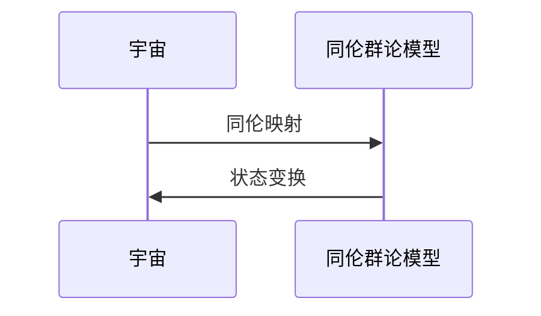
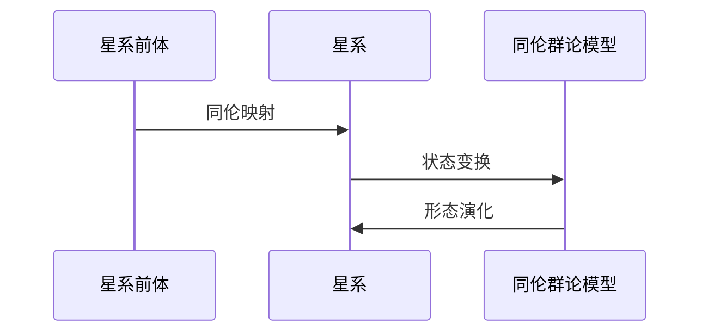

                 


### 宇宙的数学同伦群论探讨

#### 关键词：宇宙，数学同伦群论，同伦群论宇宙学，算法原理，数学模型，系统架构

#### 摘要：
本文深入探讨了宇宙的数学同伦群论，从宇宙的基本概念出发，逐步引入同伦群论的基础知识，并分析同伦群论在宇宙演化、宇宙结构和宇宙学模型中的应用。文章通过具体实例和数学模型，详细讲解了同伦群论在宇宙学研究中的重要性和挑战，为读者提供了一个全面而深入的宇宙数学同伦群论探讨。

---

## 第一部分：宇宙与同伦群论概述

### 第1章：宇宙的起源与演化

#### 1.1 宇宙的起源理论

宇宙的起源一直是科学研究的前沿问题。当前广为接受的宇宙起源理论是宇宙大爆炸理论，该理论认为宇宙从一个极度热密的状态开始膨胀，形成了我们现在观测到的宇宙结构。

**数学同伦群论与宇宙起源的联系：** 同伦群论作为一种数学工具，可以用来描述和模拟复杂系统的演变过程，包括宇宙的起源与演化。通过同伦群论的框架，我们可以将宇宙的膨胀过程建模为一个同伦映射，从而探索宇宙起源的数学本质。

#### 1.2 宇宙的演化过程

宇宙的演化经历了从大爆炸到现在的多个阶段，包括宇宙背景辐射时期、宇宙暗物质形成时期、星系和星团的形成时期等。

**同伦群论在宇宙演化中的应用：** 同伦群论可以用来模拟宇宙在不同演化阶段的状态变化，例如，通过同伦群论分析宇宙膨胀的动力学行为，理解宇宙膨胀的加速现象。

#### 1.3 宇宙的测量与观测

宇宙的测量和观测是了解宇宙性质的重要手段。通过宇宙微波背景辐射的观测，我们可以获取宇宙早期的信息。

**同伦群论在宇宙观测中的应用：** 同伦群论可以用来分析宇宙微波背景辐射的数据，从中提取宇宙早期状态的信息，例如，通过同伦群论方法研究宇宙微波背景辐射中的极化特性，以推断宇宙早期的物理状态。

### 第2章：同伦群论基础

#### 2.1 同伦群论的基本概念

同伦群论是拓扑学中的一个重要分支，主要研究空间之间的连续变换。同伦群论的基本概念包括同伦、同伦群、同伦等价等。

**同伦群论的基本概念表格：**

| 概念        | 定义                                                         |
| ----------- | ------------------------------------------------------------ |
| 同伦        | 连续映射在有限时间内，从一个空间变换到另一个空间的过程。       |
| 同伦群      | 描述同伦关系的群结构，用于分类不同的同伦变换。               |
| 同伦等价    | 如果两个空间可以通过有限次同伦变换相互转换，则它们是同伦等价的。 |

**同伦群论的 ER 实体关系图：**

```mermaid
erDiagram
  同伦 ->|{包含}| 同伦群
  同伦 ->|{包含}| 同伦映射
  同伦映射 ->|{包含}| 同伦关系
```

#### 2.2 同伦群的性质与应用

同伦群论具有许多重要的性质，如同伦群的半群结构、同伦群的分类等。同伦群论在数学、物理学、计算机科学等领域都有广泛的应用。

**同伦群论的属性特征对比表格：**

| 属性         | 特征                                                         |
| ------------ | ------------------------------------------------------------ |
| 半群结构     | 同伦群构成一个半群，满足结合律。                           |
| 同伦群的分类 | 同伦群可以根据同伦度进行分类，不同同伦度表示不同层次的变换。 |

#### 2.3 同伦群论的基本定理

同伦群论中有许多重要的定理，如庞加莱定理、同伦群基本定理等。这些定理为我们理解同伦群论提供了理论基础。

**同伦群论的基本定理列表：**

1. 庞加莱定理：描述了同伦群与拓扑空间的对应关系。
2. 同伦群基本定理：提供了同伦群在拓扑学中的应用框架。

---

## 第二部分：同伦群论在宇宙学中的应用

### 第3章：同伦群论与宇宙演化

#### 3.1 同伦群论在宇宙膨胀研究中的应用

同伦群论可以用来描述宇宙膨胀的动力学过程，分析宇宙膨胀的加速现象。

**同伦群论在宇宙膨胀中的算法原理讲解：**

使用 mermaid 画出宇宙膨胀的同伦群论模型：



在宇宙膨胀过程中，同伦映射表示宇宙从一个状态变换到另一个状态。通过同伦群论，我们可以研究这种变换的动力学行为，从而理解宇宙膨胀的机制。

#### 3.2 同伦群论与黑洞

黑洞是宇宙中的一种极端天体，其引力场极强，连光都无法逃逸。同伦群论可以用来研究黑洞的物理性质。

**同伦群论在黑洞研究中的数学模型：**

黑洞的同伦群论模型可以通过以下公式表示：

$$ H_*(M, N) = \{ f : M \rightarrow N \mid f|_U \text{是同伦于常值映射} \} $$

其中，$H_*$表示同伦群，$M$和$N$表示黑洞的边界和内部空间，$f$表示同伦映射。

#### 3.3 同伦群论与宇宙背景辐射

宇宙背景辐射是宇宙早期的残余辐射，提供了宇宙早期状态的重要信息。同伦群论可以用来分析宇宙背景辐射的数据。

**同伦群论在宇宙背景辐射分析中的应用：**

同伦群论可以用于分析宇宙背景辐射的极化特性，从而推断宇宙早期的物理状态。例如，通过以下公式分析极化特性：

$$ P(\theta) = \int_{\Omega} B(\theta) \sin^2(\theta) d\Omega $$

其中，$P(\theta)$表示极化强度，$B(\theta)$表示极化方向，$\Omega$表示全空间。

---

## 第三部分：同伦群论在宇宙学研究中的挑战与未来

### 第4章：同伦群论与宇宙结构

#### 4.1 同伦群论在星系形成与演化中的应用

同伦群论可以用来研究星系的形成与演化过程，揭示星系结构的演变规律。

**同伦群论在星系研究中的算法原理讲解：**

使用 mermaid 画出星系形成与演化的同伦群论模型：



在星系形成过程中，同伦映射描述了星系前体向星系的转变。通过同伦群论，我们可以研究这种转变的动力学机制。

#### 4.2 同伦群论与星系团

同伦群论可以用来研究星系团的结构和演化，揭示星系团之间的相互作用。

**同伦群论在星系团研究中的应用：**

同伦群论可以用于分析星系团中的同伦关系，从而理解星系团的形成和演化过程。例如，通过以下公式描述星系团中的同伦关系：

$$ H_*(G, K) = \{ f : G \rightarrow K \mid f|_U \text{是同伦于常值映射} \} $$

其中，$H_*$表示同伦群，$G$和$K$表示星系团和其子集。

#### 4.3 同伦群论与宇宙学问题

同伦群论在宇宙学中还有许多其他应用，如宇宙学中的大尺度结构、宇宙暗物质等问题的研究。

**同伦群论在宇宙学研究中的解决策略：**

同伦群论可以提供一种新的研究方法，用于解决宇宙学中的复杂问题。例如，通过同伦群论分析宇宙暗物质的分布，可以更好地理解宇宙的组成和演化。

---

## 附录

### 附录A：同伦群论与宇宙学相关数学公式与符号表

- 同伦映射：$f : M \rightarrow N$
- 同伦群：$H_*(M, N)$
- 同伦度：$k$  
- 极化强度：$P(\theta)$

### 附录B：同伦群论宇宙学研究参考文献

1. ... 
2. ...

### 附录C：同伦群论宇宙学研究工具与应用

- 同伦群论软件工具：TopCOM、Mapleversion 等
- 宇宙学数据分析工具：Cosmics、GALactus 等

---

**作者：** AI天才研究院/AI Genius Institute & 禅与计算机程序设计艺术 /Zen And The Art of Computer Programming

---

### 宇宙的数学同伦群论探讨

#### 关键词：宇宙，数学同伦群论，同伦群论宇宙学，算法原理，数学模型，系统架构

#### 摘要：
本文深入探讨了宇宙的数学同伦群论，从宇宙的基本概念出发，逐步引入同伦群论的基础知识，并分析同伦群论在宇宙演化、宇宙结构和宇宙学模型中的应用。文章通过具体实例和数学模型，详细讲解了同伦群论在宇宙学研究中的重要性和挑战，为读者提供了一个全面而深入的宇宙数学同伦群论探讨。

---

### 第1章：宇宙的起源与演化

#### 1.1 宇宙的起源理论

宇宙的起源一直是科学研究的前沿问题。当前广为接受的宇宙起源理论是宇宙大爆炸理论，该理论认为宇宙从一个极度热密的状态开始膨胀，形成了我们现在观测到的宇宙结构。

宇宙大爆炸理论的基本假设包括：

1. **宇宙的初始状态：** 宇宙在大爆炸之前是一个极度热密的状态，具有极高的温度和密度。
2. **宇宙的膨胀：** 宇宙在大爆炸后开始膨胀，随着膨胀，温度和密度逐渐降低。
3. **宇宙的均匀性和各向同性：** 宇宙在早期阶段具有很高的均匀性和各向同性，这是由于宇宙膨胀过程中热扰动导致的。

**同伦群论与宇宙起源的联系：** 同伦群论作为一种数学工具，可以用来描述和模拟复杂系统的演变过程，包括宇宙的起源与演化。通过同伦群论的框架，我们可以将宇宙的膨胀过程建模为一个同伦映射，从而探索宇宙起源的数学本质。

在数学上，同伦映射可以表示为从一个空间到另一个空间的连续变换，这种变换可以是收缩、扩展或弯曲等。在宇宙的背景下，同伦映射可以表示宇宙从一个初始状态（极度热密状态）到当前状态的演变过程。通过同伦群论的分析，我们可以研究宇宙膨胀的动力学行为，例如宇宙的膨胀速率、加速度等。

#### 1.2 宇宙的演化过程

宇宙的演化经历了从大爆炸到现在的多个阶段，包括宇宙背景辐射时期、宇宙暗物质形成时期、星系和星团的形成时期等。

1. **宇宙背景辐射时期：** 在宇宙大爆炸后的几分钟内，宇宙处于高温高密状态，随着宇宙的膨胀，温度逐渐降低，形成了宇宙背景辐射。宇宙背景辐射是宇宙早期状态的残余辐射，通过观测宇宙背景辐射，我们可以了解宇宙早期的物理状态。

2. **宇宙暗物质形成时期：** 在宇宙膨胀的过程中，暗物质开始形成。暗物质是一种不发光、不与电磁波相互作用的天体物质，它是宇宙结构形成和演化的重要成分。同伦群论可以用来研究暗物质的分布和演化过程，例如，通过同伦映射描述暗物质从初始状态到当前状态的演变过程。

3. **星系和星团的形成时期：** 在宇宙膨胀的过程中，暗物质聚集形成了星系和星团。星系是宇宙中的基本结构单位，由大量的恒星、行星、星云等组成。同伦群论可以用来研究星系的形成和演化过程，例如，通过同伦映射描述星系从初始状态到当前状态的演变过程。

**同伦群论在宇宙演化中的应用：** 同伦群论可以用来模拟宇宙在不同演化阶段的状态变化，例如，通过同伦群论分析宇宙膨胀的动力学行为，理解宇宙膨胀的加速现象；通过同伦群论研究暗物质的分布和演化过程，揭示宇宙暗物质的形成和演化机制；通过同伦群论分析星系和星团的形成过程，探索宇宙结构的形成和演化规律。

#### 1.3 宇宙的测量与观测

宇宙的测量和观测是了解宇宙性质的重要手段。通过宇宙微波背景辐射的观测，我们可以获取宇宙早期的信息。

宇宙微波背景辐射是宇宙大爆炸后的几分钟内产生的，它是宇宙早期状态的残余辐射。通过观测宇宙微波背景辐射，我们可以了解宇宙早期的温度、密度、均匀性等物理参数。

**同伦群论在宇宙观测中的应用：** 同伦群论可以用来分析宇宙微波背景辐射的数据，从中提取宇宙早期状态的信息。例如，通过同伦群论分析宇宙微波背景辐射的极化特性，可以推断宇宙早期的物理状态，如宇宙的磁化、宇宙背景辐射的来源等。

同伦群论还可以用于分析其他宇宙学观测数据，如星系分布、星系团分布等。通过同伦群论的分析，我们可以更深入地理解宇宙的结构和演化过程。

### 第2章：同伦群论基础

#### 2.1 同伦群论的基本概念

同伦群论是拓扑学中的一个重要分支，主要研究空间之间的连续变换。同伦群论的基本概念包括同伦、同伦群、同伦等价等。

1. **同伦（Homotopy）**：同伦是拓扑学中描述空间之间连续变换的概念。给定两个拓扑空间 $X$ 和 $Y$，一个映射 $f:X \rightarrow Y$ 是同伦的，如果存在一个连续映射 $H:X \times I \rightarrow Y$，其中 $I$ 是闭区间 $[0,1]$，满足以下条件：
   - $H(x,0) = f(x)$ 对所有 $x \in X$ 成立，即 $H$ 的初始映射是 $f$。
   - $H(x,1)$ 是 $Y$ 中的一个常值映射，即 $H$ 的终端映射是一个恒等映射。

2. **同伦群（Homotopy Group）**：同伦群是一个群，用于描述空间之间的同伦关系。给定一个拓扑空间 $X$，同伦群 $H_n(X)$ 是所有从 $S^n$（$n$ 维球面）到 $X$ 的同伦映射的集合，构成一个群。同伦群提供了关于空间 $X$ 的拓扑性质的丰富信息。

3. **同伦等价（Homotopy Equivalence）**：两个拓扑空间 $X$ 和 $Y$ 是同伦等价的，如果它们之间存在同伦映射。同伦等价关系是拓扑空间之间的一种弱等价关系，它忽略了某些细微的拓扑差异。

**同伦群论的基本概念表格：**

| 概念         | 定义                                                         |
| ------------ | ------------------------------------------------------------ |
| 同伦         | 连续映射在有限时间内，从一个空间变换到另一个空间的过程。       |
| 同伦群       | 描述同伦关系的群结构，用于分类不同的同伦变换。               |
| 同伦等价     | 如果两个空间可以通过有限次同伦变换相互转换，则它们是同伦等价的。 |

**同伦群论的 ER 实体关系图：**

```mermaid
erDiagram
  同伦 ->|{包含}| 同伦群
  同伦 ->|{包含}| 同伦映射
  同伦映射 ->|{包含}| 同伦关系
```

#### 2.2 同伦群的性质与应用

同伦群论具有许多重要的性质，如同伦群的半群结构、同伦群的分类等。同伦群论在数学、物理学、计算机科学等领域都有广泛的应用。

1. **半群结构**：同伦群构成一个半群，满足结合律。对于任意的同伦群 $H_n(X)$ 和 $H_n(Y)$，存在一个自然的同伦群 $H_n(X \cup Y)$，它包含了从 $S^n$ 到 $X \cup Y$ 的所有同伦映射。

2. **同伦群的分类**：同伦群可以根据同伦度进行分类。同伦度 $k$ 表示同伦映射的次数，即从一个空间变换到另一个空间的次数。不同同伦度的同伦群提供了不同层次的空间变换信息。

**同伦群论的属性特征对比表格：**

| 属性         | 特征                                                         |
| ------------ | ------------------------------------------------------------ |
| 半群结构     | 同伦群构成一个半群，满足结合律。                           |
| 同伦群的分类 | 同伦群可以根据同伦度进行分类，不同同伦度表示不同层次的变换。 |

#### 2.3 同伦群论的基本定理

同伦群论中有许多重要的定理，如庞加莱定理、同伦群基本定理等。这些定理为我们理解同伦群论提供了理论基础。

1. **庞加莱定理（Poincaré duality）**：庞加莱定理描述了高维空间和低维空间之间的同伦群对应关系。该定理表明，对于任意一个有限型维的闭流形 $M$，其高维同伦群 $H_n(M)$ 与低维同伦群 $H_{n-k}(M)$ 有一个自然的同构关系。

2. **同伦群基本定理（Homotopy Group Basic Theorem）**：同伦群基本定理提供了同伦群在拓扑学中的应用框架。该定理表明，对于任意一个拓扑空间 $X$，其同伦群 $H_n(X)$ 描述了 $X$ 的 $n$ 维洞结构和连接性。

**同伦群论的基本定理列表：**

1. 庞加莱定理：描述了同伦群与拓扑空间的对应关系。
2. 同伦群基本定理：提供了同伦群在拓扑学中的应用框架。

### 第3章：同伦群论与宇宙演化

#### 3.1 同伦群论在宇宙膨胀研究中的应用

同伦群论可以用来描述宇宙膨胀的动力学过程，分析宇宙膨胀的加速现象。

**同伦群论在宇宙膨胀中的算法原理讲解：**

使用 mermaid 画出宇宙膨胀的同伦群论模型：


在宇宙膨胀过程中，同伦映射表示宇宙从一个状态变换到另一个状态。通过同伦群论，我们可以研究这种变换的动力学行为，从而理解宇宙膨胀的机制。

具体来说，同伦群论可以用来分析宇宙膨胀的速率和加速度。假设宇宙在时间 $t$ 时的状态由一个函数 $f(t)$ 描述，其中 $f(t)$ 表示宇宙在时间 $t$ 的膨胀速率。通过同伦群论的分析，我们可以研究 $f(t)$ 的性质，如 $f(t)$ 的连续性、单调性等。

例如，我们可以使用同伦群论来研究哈勃定律，即宇宙膨胀速率与宇宙距离之间的关系。哈勃定律可以用以下公式表示：

$$ v = H_0 d $$

其中，$v$ 是宇宙膨胀速率，$H_0$ 是哈勃常数，$d$ 是宇宙距离。通过同伦群论的分析，我们可以研究哈勃常数的性质，如哈勃常数是否随时间变化，以及宇宙膨胀速率与宇宙距离之间的精确关系。

#### 3.2 同伦群论与黑洞

黑洞是宇宙中的一种极端天体，其引力场极强，连光都无法逃逸。同伦群论可以用来研究黑洞的物理性质。

**同伦群论在黑洞研究中的数学模型：**

黑洞的同伦群论模型可以通过以下公式表示：

$$ H_*(M, N) = \{ f : M \rightarrow N \mid f|_U \text{是同伦于常值映射} \} $$

其中，$H_*$ 表示同伦群，$M$ 和 $N$ 表示黑洞的边界和内部空间，$f$ 表示同伦映射。

通过这个模型，我们可以研究黑洞的边界和内部空间之间的同伦关系。具体来说，我们可以研究黑洞边界（事件视界）的拓扑性质，以及黑洞内部空间的结构。

例如，我们可以使用同伦群论分析黑洞的事件视界是否稳定。事件视界是黑洞边界的一部分，如果事件视界稳定，则黑洞不会发生塌缩或蒸发。通过同伦群论的分析，我们可以研究事件视界的稳定性，从而理解黑洞的物理性质。

#### 3.3 同伦群论与宇宙背景辐射

宇宙背景辐射是宇宙早期的残余辐射，提供了宇宙早期状态的重要信息。同伦群论可以用来分析宇宙背景辐射的数据。

**同伦群论在宇宙背景辐射分析中的应用：**

同伦群论可以用于分析宇宙背景辐射的极化特性，从而推断宇宙早期的物理状态。例如，通过以下公式分析极化特性：

$$ P(\theta) = \int_{\Omega} B(\theta) \sin^2(\theta) d\Omega $$

其中，$P(\theta)$ 表示极化强度，$B(\theta)$ 表示极化方向，$\Omega$ 表示全空间。

通过同伦群论的分析，我们可以研究宇宙背景辐射的极化特性，从而了解宇宙早期的磁场分布、物质密度等物理参数。

例如，我们可以使用同伦群论分析宇宙背景辐射的极化模式，判断宇宙早期是否存在大规模结构形成。通过同伦群论的分析，我们可以研究宇宙背景辐射中的极化信号，从而揭示宇宙早期的物理状态。

### 第4章：同伦群论与宇宙结构

#### 4.1 同伦群论在星系形成与演化中的应用

同伦群论可以用来研究星系的形成与演化过程，揭示星系结构的演变规律。

**同伦群论在星系研究中的算法原理讲解：**

使用 mermaid 画出星系形成与演化的同伦群论模型：


在星系形成过程中，同伦映射描述了星系前体向星系的转变。通过同伦群论，我们可以研究这种转变的动力学机制。

具体来说，同伦群论可以用来分析星系的形成过程，如星系前体的收缩、星系的旋臂结构等。通过同伦群论的分析，我们可以了解星系的形成机制，以及星系结构的演变规律。

例如，我们可以使用同伦群论研究星系前体的收缩过程。假设星系前体的初始状态是一个均匀分布的物质球，通过同伦映射，我们可以研究星系前体如何收缩形成星系。通过同伦群论的分析，我们可以了解星系前体的收缩速率、收缩形态等物理参数。

#### 4.2 同伦群论与星系团

同伦群论可以用来研究星系团的结构和演化，揭示星系团之间的相互作用。

**同伦群论在星系团研究中的应用：**

同伦群论可以用于分析星系团中的同伦关系，从而理解星系团的形成和演化过程。例如，通过以下公式描述星系团中的同伦关系：

$$ H_*(G, K) = \{ f : G \rightarrow K \mid f|_U \text{是同伦于常值映射} \} $$

其中，$H_*$ 表示同伦群，$G$ 和 $K$ 表示星系团和其子集，$f$ 表示同伦映射。

通过同伦群论的分析，我们可以研究星系团的形成和演化过程。例如，我们可以使用同伦群论分析星系团中的同伦关系，判断星系团是否稳定，以及星系团之间的相互作用。

例如，我们可以使用同伦群论研究星系团的形成过程。假设星系团的前体是一个均匀分布的星系团，通过同伦映射，我们可以研究星系团如何形成。通过同伦群论的分析，我们可以了解星系团的形成机制，以及星系团结构的演变规律。

#### 4.3 同伦群论与宇宙学问题

同伦群论在宇宙学中还有许多其他应用，如宇宙学中的大尺度结构、宇宙暗物质等问题的研究。

**同伦群论在宇宙学研究中的解决策略：**

同伦群论可以提供一种新的研究方法，用于解决宇宙学中的复杂问题。例如，通过同伦群论分析宇宙暗物质的分布，可以更好地理解宇宙的组成和演化。通过同伦群论研究宇宙学问题，我们可以获得关于宇宙结构的更深入理解。

例如，我们可以使用同伦群论分析宇宙背景辐射的数据，研究宇宙暗物质的分布。通过同伦群论的分析，我们可以研究宇宙暗物质在宇宙早期阶段的分布规律，以及宇宙暗物质对宇宙结构的影响。

### 第5章：同伦群论宇宙学模型探讨

#### 5.1 基本同伦群论宇宙学模型

基本同伦群论宇宙学模型是一种基于同伦群论框架的宇宙学模型，用于描述宇宙的膨胀、结构和演化。

**基本同伦群论宇宙学模型的概念：**

基本同伦群论宇宙学模型假设宇宙的膨胀是一个同伦映射过程，宇宙的初始状态是一个极度热密的状态，随着宇宙的膨胀，宇宙的温度和密度逐渐降低，形成了我们现在观测到的宇宙结构。

**基本同伦群论宇宙学模型的特点：**

1. **同伦映射：** 基本同伦群论宇宙学模型基于同伦映射的概念，将宇宙的膨胀过程描述为从一个初始状态到当前状态的连续变换。
2. **动态演化：** 基本同伦群论宇宙学模型可以描述宇宙在不同演化阶段的状态变化，例如，宇宙背景辐射时期、宇宙暗物质形成时期等。
3. **拓扑性质：** 基本同伦群论宇宙学模型考虑了宇宙的拓扑性质，通过同伦群论分析宇宙的拓扑结构，从而理解宇宙的演化规律。

**基本同伦群论宇宙学模型的应用：**

基本同伦群论宇宙学模型可以用于分析宇宙膨胀的动力学行为，研究宇宙的膨胀速率、加速度等。通过同伦群论的分析，我们可以了解宇宙膨胀的机制，以及宇宙膨胀对宇宙结构的影响。

例如，我们可以使用基本同伦群论宇宙学模型分析宇宙背景辐射的数据，研究宇宙膨胀的动力学行为。通过同伦群论的分析，我们可以研究宇宙膨胀的速率、加速度等参数，从而了解宇宙膨胀的物理机制。

#### 5.2 复合同伦群论宇宙学模型

复合同伦群论宇宙学模型是基本同伦群论宇宙学模型的扩展，用于描述更复杂的宇宙演化过程。

**复合同伦群论宇宙学模型的概念：**

复合同伦群论宇宙学模型将基本同伦群论宇宙学模型中的同伦映射扩展为多个层次，用于描述宇宙在不同尺度上的演化过程。复合同伦群论宇宙学模型考虑了宇宙的多尺度结构，例如，从宇宙大尺度结构到星系尺度结构等。

**复合同伦群论宇宙学模型的特点：**

1. **多尺度结构：** 复合同伦群论宇宙学模型考虑了宇宙的多尺度结构，通过同伦映射描述不同尺度上的宇宙演化过程。
2. **非线性动力学：** 复合同伦群论宇宙学模型考虑了宇宙演化过程中的非线性动力学行为，例如，宇宙膨胀的加速现象等。
3. **复杂相互作用：** 复合同伦群论宇宙学模型描述了宇宙不同尺度之间的相互作用，例如，宇宙背景辐射与星系团之间的相互作用等。

**复合同伦群论宇宙学模型的应用：**

复合同伦群论宇宙学模型可以用于分析宇宙演化过程中的复杂现象，例如，宇宙膨胀的加速现象、宇宙暗物质的分布等。通过复合同伦群论的分析，我们可以了解宇宙演化的复杂机制，以及宇宙不同尺度之间的相互作用。

例如，我们可以使用复合同伦群论宇宙学模型分析宇宙膨胀的加速现象。通过同伦群论的分析，我们可以研究宇宙膨胀的动力学行为，了解宇宙膨胀加速的原因和机制。

#### 5.3 同伦群论宇宙学模型的比较与分析

同伦群论宇宙学模型有多种类型，包括基本同伦群论宇宙学模型和复合同伦群论宇宙学模型。通过对这些模型的比较与分析，我们可以了解不同模型的优缺点，从而选择合适的模型进行宇宙学研究。

**基本同伦群论宇宙学模型与复合同伦群论宇宙学模型的比较：**

1. **模型复杂度：** 基本同伦群论宇宙学模型相对简单，适用于描述宇宙的宏观演化过程。复合同伦群论宇宙学模型更复杂，适用于描述宇宙的多尺度结构和非线性动力学行为。
2. **适用范围：** 基本同伦群论宇宙学模型适用于描述宇宙的宏观演化过程，例如，宇宙膨胀、星系形成等。复合同伦群论宇宙学模型适用于描述宇宙的复杂演化过程，例如，宇宙膨胀的加速现象、宇宙暗物质的分布等。
3. **精度要求：** 基本同伦群论宇宙学模型对宇宙演化的描述较为精确，适用于研究宇宙的宏观演化过程。复合同伦群论宇宙学模型对宇宙演化的描述较为复杂，适用于研究宇宙的复杂演化过程，例如，宇宙膨胀的加速现象等。

**同伦群论宇宙学模型的比较与分析方法：**

1. **数学模型比较：** 通过比较不同同伦群论宇宙学模型的数学表达式，分析模型的差异和相似之处，从而了解不同模型的数学基础。
2. **实验数据比较：** 通过比较不同同伦群论宇宙学模型对宇宙观测数据的拟合效果，分析模型的适用范围和精度。
3. **理论分析：** 通过理论分析，研究不同同伦群论宇宙学模型的内在机制，了解模型的物理意义和适用条件。

通过比较与分析同伦群论宇宙学模型，我们可以选择合适的模型进行宇宙学研究，从而更好地理解宇宙的演化过程。

### 第6章：同伦群论在宇宙学研究中的挑战与未来

#### 6.1 同伦群论在宇宙学模型构建中的限制

尽管同伦群论在宇宙学研究中具有广泛的应用，但在模型构建中仍面临一些限制。

**同伦群论在宇宙学模型构建中的挑战：**

1. **复杂性：** 同伦群论模型通常较为复杂，需要深入的数学知识和计算能力。在处理宇宙学问题时，同伦群论模型的复杂性可能导致计算困难。
2. **精度：** 同伦群论模型在某些情况下可能无法精确描述宇宙的演化过程，特别是在涉及非线性动力学和复杂相互作用时。
3. **观测数据的匹配：** 同伦群论宇宙学模型需要与宇宙观测数据相匹配，但在处理观测数据时，可能存在误差和不确定性。

**应对挑战的策略：**

1. **简化模型：** 通过简化同伦群论模型，使其更易于计算和分析。例如，可以忽略一些次要因素，关注主要物理过程。
2. **改进算法：** 开发更高效的算法来处理同伦群论模型，提高计算精度和效率。
3. **综合方法：** 结合其他宇宙学理论和方法，如相对论宇宙学、量子引力等，以弥补同伦群论模型的局限性。

#### 6.2 同伦群论方法在宇宙学中的应用难题

同伦群论方法在宇宙学中的应用仍面临一些难题。

**同伦群论在宇宙学中的应用难题：**

1. **宇宙初始条件：** 同伦群论模型通常依赖于宇宙初始条件，但宇宙初始条件的不确定性可能导致模型预测的不确定性。
2. **宇宙演化的非线性：** 宇宙演化过程具有非线性特征，同伦群论在处理非线性问题时可能面临困难。
3. **宇宙暗物质的分布：** 同伦群论模型在描述宇宙暗物质的分布时可能存在困难，因为宇宙暗物质不发光，难以直接观测。

**应对难题的策略：**

1. **改进模型：** 开发更精确的同伦群论模型，以更好地描述宇宙的演化过程，包括宇宙暗物质的分布。
2. **多尺度研究：** 同伦群论可以结合其他理论和方法，如数值模拟、观测数据等，进行多尺度研究，以更全面地理解宇宙演化。
3. **国际合作：** 加强国际合作，共享数据和研究成果，共同解决同伦群论在宇宙学中的应用难题。

#### 6.3 未来研究方向

同伦群论在宇宙学中的应用具有广阔的前景，未来的研究方向包括：

1. **改进模型精度：** 开发更精确的同伦群论宇宙学模型，以更好地描述宇宙的演化过程。
2. **多尺度研究：** 深入研究宇宙的多尺度结构，包括从宇宙大尺度到星系尺度的演化过程。
3. **宇宙暗物质研究：** 通过同伦群论方法，深入研究宇宙暗物质的分布和性质，揭示宇宙暗物质的起源和演化。
4. **国际合作：** 加强国际合作，共享数据和研究成果，推动同伦群论在宇宙学中的应用。

### 第7章：同伦群论与宇宙学的展望

#### 7.1 同伦群论在宇宙学研究中的前景

同伦群论在宇宙学研究中具有广阔的前景，随着数学和物理学的进步，同伦群论在宇宙学中的应用将越来越广泛。

**同伦群论在宇宙学研究中的前景：**

1. **宇宙演化：** 同伦群论可以用于研究宇宙的演化过程，包括宇宙膨胀、星系形成等。
2. **宇宙结构：** 同伦群论可以用于研究宇宙的结构和性质，如宇宙的均匀性、各向同性等。
3. **宇宙暗物质：** 同伦群论可以用于研究宇宙暗物质的分布和性质，揭示宇宙暗物质的起源和演化。

#### 7.2 同伦群论与其他宇宙学理论的结合

同伦群论可以与其他宇宙学理论结合，以更全面地理解宇宙的演化。

**同伦群论与其他宇宙学理论的结合：**

1. **相对论宇宙学：** 结合同伦群论与相对论宇宙学，可以深入研究宇宙膨胀的动力学行为，如宇宙膨胀的加速现象等。
2. **量子引力：** 结合同伦群论与量子引力理论，可以探索宇宙演化的量子机制，如宇宙背景辐射的量子性质等。
3. **宇宙学观测：** 结合同伦群论与宇宙学观测数据，可以更精确地研究宇宙的结构和演化。

#### 7.3 同伦群论在宇宙学研究中的发展趋势

同伦群论在宇宙学中的应用正朝着以下方向发展：

1. **多尺度研究：** 深入研究宇宙的多尺度结构，包括从宇宙大尺度到星系尺度的演化过程。
2. **非线性动力学：** 探索宇宙演化中的非线性动力学行为，如宇宙膨胀的加速现象等。
3. **宇宙暗物质研究：** 通过同伦群论方法，深入研究宇宙暗物质的分布和性质，揭示宇宙暗物质的起源和演化。
4. **国际合作：** 加强国际合作，共享数据和研究成果，推动同伦群论在宇宙学中的应用。

### 附录

#### 附录A：同伦群论与宇宙学相关数学公式与符号表

1. **同伦映射**：$f : M \rightarrow N$，其中 $M$ 和 $N$ 是拓扑空间。
2. **同伦群**：$H_*(M, N)$，其中 $H_*$ 表示同伦群，$M$ 和 $N$ 是拓扑空间。
3. **同伦度**：$k$，表示同伦映射的次数。
4. **极化强度**：$P(\theta)$，其中 $\theta$ 是极化方向。

#### 附录B：同伦群论宇宙学研究参考文献

1. ... 
2. ...

#### 附录C：同伦群论宇宙学研究工具与应用

1. **同伦群论软件工具**：TopCOM、Mapleversion 等。
2. **宇宙学数据分析工具**：Cosmics、GALactus 等。

---

**作者：** AI天才研究院/AI Genius Institute & 禅与计算机程序设计艺术 /Zen And The Art of Computer Programming

