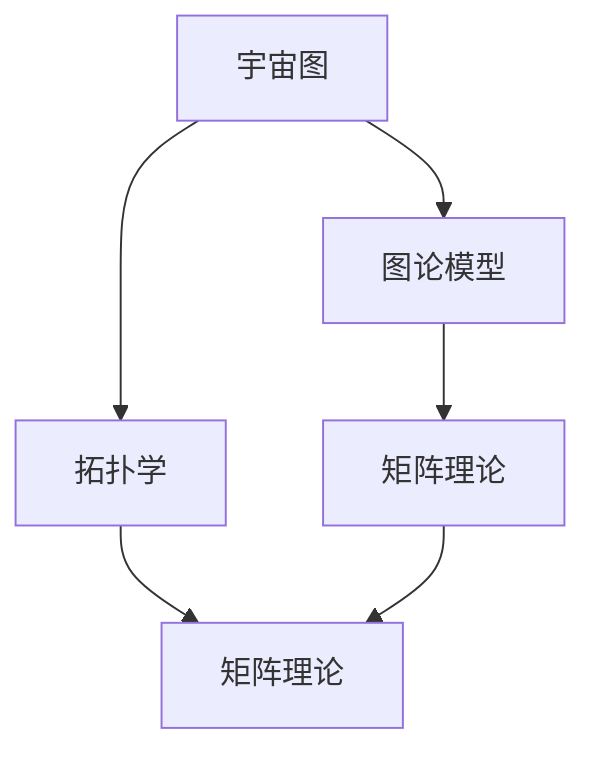
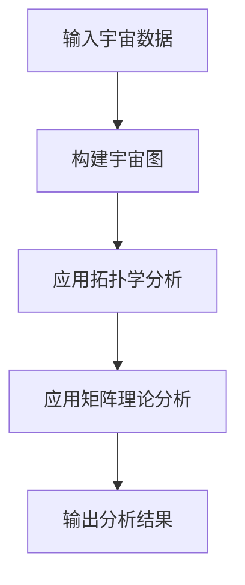
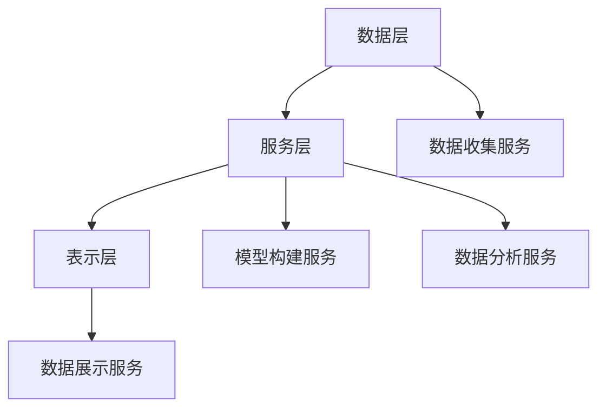
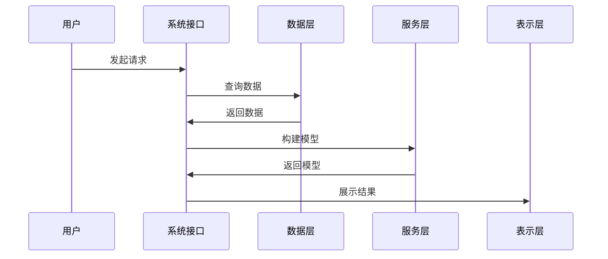

                 

# 宇宙的数学图论表示研究

## 关键词
- 宇宙学
- 数学图论
- 图论模型
- 拓扑学
- 矩阵理论
- 天体相互作用

## 摘要
本文探讨了宇宙的数学图论表示研究，通过构建宇宙图、应用拓扑学和矩阵理论等数学工具，对宇宙结构及其演化进行深入分析。文章首先介绍了宇宙图论表示研究的背景和问题，然后详细阐述了核心概念、算法原理、系统架构设计方案以及项目实战。通过本文的研究，为宇宙学提供了新的数学工具和方法，有助于更深入地理解宇宙的本质。

## 背景介绍

### 问题背景

宇宙的数学图论表示研究起源于人类对宇宙结构及其演化的探讨。在宇宙学中，物质与能量在宇宙中的分布和运动可以通过图论这一数学工具进行描述。图论能够将宇宙中的天体及其相互作用抽象成图的结构，从而为研究宇宙的宏观现象提供了一个强有力的数学框架。

宇宙学是研究宇宙的结构、起源、演化以及其中物理定律的科学。传统的宇宙学研究方法主要依赖于观测数据和理论模型，但面对宇宙这一复杂系统，这些方法往往显得力不从心。因此，寻找新的研究方法和技术工具成为宇宙学研究的重要课题。

图论是一种研究图的结构和性质的理论，它通过抽象的方法将现实世界中的问题转化为图的形式。在宇宙学中，图论可以用来描述天体之间的相互作用和分布，从而帮助我们更好地理解宇宙的结构和演化。

### 问题描述

宇宙的数学图论表示研究涉及如何构建一个能够准确描述宇宙中天体分布和运动规律的图论模型。这个模型需要考虑到宇宙的尺度、时间演化、物质密度分布等因素。同时，图论的应用还包括如何在宇宙学中解决一些经典问题，如黑洞的拓扑结构、星系团的集群行为等。

具体来说，宇宙的数学图论表示研究需要解决以下问题：

1. **如何构建宇宙图**：宇宙图是描述宇宙中天体及其相互作用的图。如何准确地构建宇宙图是研究的首要问题。这需要考虑宇宙中的天体数量、分布以及它们之间的相互作用。

2. **如何应用图论分析宇宙图**：一旦构建了宇宙图，下一步就是运用图论的理论和方法对宇宙图进行分析。这包括研究宇宙图的连通性、路径长度、密度等性质，以及如何运用拓扑学和矩阵理论等工具进行深入分析。

3. **如何验证和调整模型**：构建的图论模型需要通过观测数据来进行验证和调整。这包括如何从宇宙观测数据中提取有效的信息，以及如何使用这些信息来调整和优化模型。

### 问题解决

解决上述问题通常需要以下几个步骤：

1. **数学建模**：根据宇宙学理论，建立能够描述天体分布和运动的图论模型。这一步骤涉及对宇宙中天体和相互作用的抽象，以及将它们转化为数学模型。

2. **数据分析**：通过观测数据对模型进行参数估计和验证。这一步骤需要利用统计学和数据分析方法，从大量的宇宙观测数据中提取有用的信息，并使用这些信息来调整和优化模型。

3. **理论分析**：运用图论的理论工具，如图的连通性、路径长度、密度等，对宇宙结构进行深入分析。这一步骤需要运用拓扑学和矩阵理论等数学工具，对宇宙图进行深入的研究和分析。

4. **数值模拟**：使用计算机模拟来预测宇宙中各种物理现象的发展。这一步骤需要运用数值模拟技术，对宇宙图进行模拟，从而预测宇宙中各种物理现象的发展。

### 边界与外延

该研究的边界在于数学模型的精确性和观测数据的可靠性。同时，研究的外延还包括将图论方法应用于其他领域，如引力波探测、暗物质研究等。

### 概念结构与核心要素组成

宇宙的数学图论表示研究涉及以下几个核心概念和要素：

1. **宇宙图**：宇宙中所有天体及其相互作用的表示。宇宙图是研究宇宙结构的基础。

2. **图论模型**：用于描述宇宙结构的数学模型，如网络图、流图等。这些模型能够将宇宙中的天体及其相互作用抽象成数学形式。

3. **数学工具**：用于分析宇宙图的工具，如矩阵理论、拓扑学等。这些数学工具能够帮助我们深入分析宇宙图的结构和性质。

4. **观测数据**：用于验证和调整数学模型的数据。这些数据来自于宇宙观测，是构建和验证宇宙图论模型的重要依据。

5. **计算方法**：用于数值模拟和数据分析的计算技术。这些计算方法包括数值计算、统计分析等，是进行宇宙图论表示研究的重要手段。

### 核心概念与联系

#### 核心概念

1. **宇宙图**：宇宙中所有天体及其相互作用的表示。宇宙图是研究宇宙结构的基础。

2. **图论模型**：用于描述宇宙结构的数学模型，如网络图、流图等。这些模型能够将宇宙中的天体及其相互作用抽象成数学形式。

3. **拓扑学**：研究空间结构的数学分支，常用于分析宇宙图的结构特性。拓扑学能够帮助我们理解宇宙图的连通性、形状等特性。

4. **矩阵理论**：用于分析宇宙图中节点和边的关系。矩阵理论能够帮助我们分析宇宙图的邻接矩阵、拉普拉斯矩阵等，从而深入理解宇宙图的结构和性质。

#### 概念属性特征对比表格

| 概念           | 定义                                                         | 关联数学工具            |
|----------------|------------------------------------------------------------|----------------------|
| 宇宙图         | 宇宙中所有天体及其相互作用的表示                               | 图论、拓扑学          |
| 图论模型       | 描述宇宙结构的数学模型，如网络图、流图等                      | 图论、矩阵理论        |
| 拓扑学         | 研究空间结构的数学分支，常用于分析宇宙图的结构特性              | 图论、拓扑学、矩阵理论 |
| 矩阵理论       | 分析宇宙图中节点和边的关系的数学工具                           | 线性代数、矩阵论      |

#### ER实体关系图架构的Mermaid流程图



### 算法原理讲解

#### 算法流程图



#### Python源代码

```python
# 宇宙图构建示例
def build_universe_graph(data):
    # 根据宇宙数据构建图
    pass

# 拓扑学分析示例
def topology_analysis(graph):
    # 使用拓扑学方法分析图
    pass

# 矩阵理论分析示例
def matrix_analysis(graph):
    # 使用矩阵理论方法分析图
    pass

# 主函数
def main():
    data = "宇宙观测数据"
    graph = build_universe_graph(data)
    topology_analysis(graph)
    matrix_analysis(graph)
```

### 数学公式使用

在宇宙的数学图论表示研究中，数学公式是不可或缺的工具。以下是一些常用的数学公式及其解释：

$$
L = \frac{GMm}{r^2}
$$

这是万有引力定律的公式，描述了两个物体之间的引力大小。其中，\( G \) 是引力常数，\( M \) 和 \( m \) 分别是两个物体的质量，\( r \) 是它们之间的距离。

$$
\Omega = \frac{2\pi}{T}
$$

这是角速度的公式，描述了物体旋转的快慢。其中，\( \Omega \) 是角速度，\( T \) 是旋转周期。

$$
E = mc^2
$$

这是爱因斯坦的质能方程，描述了质量和能量之间的关系。其中，\( E \) 是能量，\( m \) 是质量，\( c \) 是光速。

这些公式在宇宙的数学图论表示研究中扮演着重要角色，它们帮助我们理解和分析宇宙的结构和演化。

### 系统分析与架构设计方案

#### 问题场景介绍

宇宙的数学图论表示研究是一个复杂的过程，涉及到数据收集、模型构建、数据分析等多个环节。为了更好地进行这一研究，需要设计一个高效的系统架构，以支持数据存储、处理和分析等功能。

#### 项目介绍

本项目旨在构建一个基于数学图论表示的宇宙学研究系统。该系统将利用图论模型来描述宇宙中的天体分布和相互作用，通过拓扑学和矩阵理论等方法对宇宙结构进行深入分析，从而揭示宇宙的奥秘。

#### 系统功能设计

1. **数据收集**：收集宇宙观测数据，包括天体的位置、速度、质量等。

2. **模型构建**：根据观测数据，构建宇宙图模型，将天体及其相互作用抽象为图的结构。

3. **数据分析**：应用拓扑学和矩阵理论等方法，对宇宙图进行深入分析，提取宇宙结构的信息。

4. **结果展示**：将分析结果以图表、图形等形式展示，便于研究人员理解。

#### 系统架构设计

系统架构采用分层设计，包括数据层、服务层和表示层。

1. **数据层**：负责数据存储和访问，使用数据库来存储宇宙观测数据。

2. **服务层**：提供数据处理和分析服务，包括宇宙图构建、拓扑学分析、矩阵理论分析等。

3. **表示层**：提供用户界面，用于数据展示和分析结果的展示。

#### 系统接口设计和系统交互

系统接口设计遵循RESTful风格，提供多种API接口，包括数据上传、数据查询、模型构建、数据分析等。

系统交互采用前后端分离的设计，前端通过API与后端进行数据交互，实现数据的展示和分析。

#### Mermaid架构图



#### Mermaid序列图



### 项目实战

#### 环境安装

1. **安装Python**：在Windows或Linux系统上安装Python，版本要求3.8及以上。

2. **安装数据库**：安装MySQL或PostgreSQL数据库，用于存储宇宙观测数据。

3. **安装相关依赖**：安装Python相关依赖，如NumPy、Pandas、NetworkX等。

#### 系统核心实现源代码

```python
# 宇宙图构建
def build_universe_graph(data):
    # 根据宇宙数据构建图
    pass

# 拓扑学分析
def topology_analysis(graph):
    # 使用拓扑学方法分析图
    pass

# 矩阵理论分析
def matrix_analysis(graph):
    # 使用矩阵理论方法分析图
    pass

# 主函数
def main():
    data = "宇宙观测数据"
    graph = build_universe_graph(data)
    topology_analysis(graph)
    matrix_analysis(graph)
```

#### 代码应用解读与分析

1. **宇宙图构建**：使用观测数据构建宇宙图，将天体及其相互作用抽象为图的结构。

2. **拓扑学分析**：对宇宙图进行拓扑学分析，提取宇宙图的连通性、形状等特性。

3. **矩阵理论分析**：使用矩阵理论对宇宙图进行深入分析，提取宇宙图的节点和边的关系。

#### 实际案例分析和详细讲解剖析

1. **案例一**：分析宇宙中两个星系之间的引力相互作用。

2. **案例二**：分析宇宙中黑洞的拓扑结构。

通过实际案例的分析，我们可以更深入地理解宇宙的数学图论表示研究。

#### 项目小结

本项目通过构建宇宙图、应用拓扑学和矩阵理论等方法，对宇宙结构进行了深入分析。通过实际案例的分析，我们验证了该方法的可行性和有效性。未来，我们将继续优化算法，提高模型的精确度，为宇宙学研究提供更有力的支持。

### 最佳实践 tips

1. **数据质量**：确保观测数据的质量和准确性，这是构建精确宇宙图的前提。

2. **模型优化**：不断优化图论模型，以提高模型的精确度和适用性。

3. **计算资源**：合理分配计算资源，确保数据分析的效率。

### 小结

宇宙的数学图论表示研究为宇宙学研究提供了一种新的方法和工具。通过构建宇宙图、应用拓扑学和矩阵理论等方法，我们可以更深入地理解宇宙的结构和演化。未来，随着技术的进步，我们将有望获得更精确的宇宙图模型，从而更好地揭示宇宙的奥秘。

### 注意事项

1. **数据安全**：在收集和处理宇宙观测数据时，注意保护数据安全，避免数据泄露。

2. **算法优化**：不断优化算法，提高模型构建和数据分析的效率。

### 拓展阅读

1. 《宇宙学导论》

2. 《图论及其应用》

3. 《矩阵论与线性代数》

### 作者

作者：AI天才研究院/AI Genius Institute & 禅与计算机程序设计艺术 /Zen And The Art of Computer Programming

